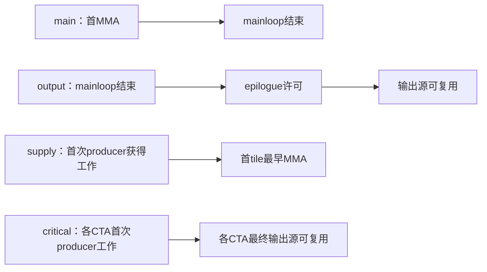

# R14：逐 tile 交接

## 结论

- 本组在 4 个 CTA 的网格上逐 tile 记录了供给、主循环、交接和输出事件，供 V05 校准。
- V05 显示两处不能迁移：4 CTA 下的初始供给等待放到整卡上偏差 49–61%；pingpong 的交接在中等 K 与大输出时实为重叠，本组校准给出的是间隙。V06 改为整卡校准与逐事件递推。

## 问题

固定 4 CTA 的 persistent GEMM，FP16 输入、FP32 累加与输出，α=1、β=0。
测量每个输出 tile 的预填、主循环、epilogue 许可与源释放，判断短 K 下 pingpong 的交接
是否暴露额外周期。局部区间以同一 CTA 的 clock64 cycle 计；完整 kernel 时间单列 plain。

## 18 个资源条件

| 配置 | CTA tile / 调度 | cluster | stage | K | 每 CTA 输出 tile |
|---|---|---|---|---|---|
| baseline | 128×256×64 cooperative | 2×1 | 4 | 128、512、4096 | 1、8 |
| cfg_a | 128×128×64 cooperative | 2×1 | V04 自动推导，实测 6 | 128、512、4096 | 1、8 |
| cfg_b | 128×128×64 pingpong | 1×1 | V04 自动推导，实测6 | 128、512、4096 | 1、8 |

M=256，N=2TN 或16TN，Ktile=K/64=2、8、64。scheduler 使用 SM 数4、swizzle=1，核实际
启动4 CTA，不指定物理SM。RowMajor，显式lda=K、ldb=N、ldd=N；本矩阵没有行尾padding。
设备、工具链为单GH200、CUDA12.9、sm_90a、CUTLASS3.9.2、NDEBUG。

## 逐 tile 例子与事件

cfg_b 的 K512、8 tile/CTA 中，CTA0 producer 依次获得(0,0)、(0,2)…(0,14)。consumer0
处理序号0/2/4/6，consumer1处理1/3/5/7；cooperative两消费者共同处理每个tile。
所有细阶段记录保留该CTA全部tile的坐标、角色和局部序号，末tile仍单独保留。

四组各自独立运行，以下箭头仅连接同一次运行的端点，不能跨组拼时间线。



| 观测组 / mask | 范围 | 区间与完成边界 |
|---|---|---|
| main /0x06 | CTA0全部tile/role | 首次输入full wait返回后、MMA arrive前→mma_tail返回后；同次数据另算本tile结束→下tile首MMA的带符号gap |
| output /0x2c | CTA0全部tile/role | main_end→store调用前许可；末tile实际issuer的许可→原store_tail返回后的源释放保证 |
| supply /0x03 | CTA0全部tile/role | work是角色进入有效work循环；预填P取首producer work→首输出tile最早firstMMA，含程序与等待成本 |
| critical /0x21 | 全4CTA各首尾两戳 | 首producer work→最终源释放；不含更早kernel初始化和源释放后完整写回/退出 |

细阶段只有clock64，ns槽全零表示未观测；critical保留双时钟，用globaltimer比较不同CTA
首尾端点，clock64只作各CTA局部差。critical最大局部跨度或最新源释放CTA不等同完整
kernel关键CTA的无条件证明。

cooperative的TMA issuer是物理thread256、角色2。中间tile的source_acquire记录是下一tile
内部取得的完成保证，可能包含下一主循环，只作程序许可上界；不能当裸E或重复加到末尾。
末tile使用原循环之后的store_tail；pingpong每tile有原store_tail，critical只记实际最后tile。
terminal E/W取末tile同一实际issuer的两个差，不混角色时刻、不新增wait。

## 合格范围与结果

全部正式条件均执行10个plain/trace相邻随机配对进程；预热8–30次，末5次CV≤2%。
完整kernel进程CV≤5%，配对扰动中位数绝对值≤5%，并要求完整数值/精确坐标角色覆盖。
统计失败保留为failed，不能减小要求的配对数或放宽门槛。每次kernel全部D作精确dyadic CPU校验。

✓表示定量观测合格；—表示缺失合格域，原始终态与定性证据仍保留。

| 配置 | main t8 Ktile2/8/64 | output t8 Ktile2/8/64 | supply t8 Ktile2/8/64 | critical t8 Ktile2/8/64 |
|---|---|---|---|---|
| baseline | ✓/✓/✓ | —/✓/✓ | ✓/✓/✓ | ✓/✓/✓ |
| cfg_a | —/✓/✓ | —/—/✓ | ✓/✓/✓ | ✓/✓/✓ |
| cfg_b | ✓/✓/✓ | —/✓/✓ | ✓/✓/✓ | ✓/✓/✓ |

t1只有Ktile64在全部配置、全部观测组合格；不能据此辨识t1短K曲线。
main/output/supply/critical分别有11/8/12/12个合格条件；这四组是同18资源条件的独立观测。
四组各360进程完整：main/output/supply/critical分别339/342/333/342个成功，21/18/27/18个
严格预热不收敛终态。没有数值或事件实现错误；失败摘要还含派生缺pair项，不能重复计成原始错误。

主循环M取每tile min(firstMMA)→max(consumer main_end)，先每进程后续tile1–7取中位，再跨10
进程取中位。P取首tile预填；E/W取末tileissuer。下面数值均为SM cycle，各列来自其独立观测组。

| 配置 | M(Ktile8/64) | P(8/64) | terminal E(8/64) | terminal W(8/64) |
|---|---:|---:|---:|---:|
| baseline | 8550.5/65892 | 1540/2208 | 5398.5/5677 | 128/128 |
| cfg_a | 4391/33065 | 1255.5/1221 | —/3052 | —/108 |
| cfg_b | 4463/33285 | 1095.5/1107 | 2511/2512 | 177.5/158 |

M的8/64两点斜率为baseline1023.955、cfg_a512.036、cfg_b514.679cycle/Ktile；截距358.857、
294.714、345.571cycle。这只是两点校准描述，外推短K需先冻结假设，再由留出尺寸验证。
cfg_a的E/W只有64单点，若采用常量必须显式标明terminal tailservice单点假设，不以t1偷补。

同次main观测中，cfg_b t8的main_end→下tilefirstMMA gap在Ktile2/8/64分别为2194/1267/−282.5cycle。
长K70/70个相邻交接均为负，短K后续交接为正；这给出长K重叠与短K暴露的直接证据。
该gap不是固定barrier成本，具体许可等待仍按output同次端点解释。

critical每进程取四CTA局部首尾跨度最大值，再跨10进程取中位：

| 配置 | t8 Ktile2 | t8 Ktile8 | t8 Ktile64 | t1 Ktile64 |
|---|---:|---:|---:|---:|
| baseline | 57376 | 107005 | 566604 | 71782 |
| cfg_a | 31895.5 | 56889 | 286242.5 | 36521.5 |
| cfg_b | 29014 | 48338 | 267525.5 | 36526 |

表中为局部SM cycle跨度；不能与其他组参数直接相加后声称重建了这一次时间线。


## 适用范围与复现

参数限定本页4CTA、tile/cluster/stage、角色映射及观测边界。V05须推导实际scheduler的工作
序列、尾tile、记录容量与空工作CTA，不照搬R14固定(0,2s)或每role8条记录。不跨独立运行
相减事件，不把缺失参数设零，不将源可复用当完整写回。V05预测和验证状态由其归档单列。

入口为microbench/gh200_resource_campaign/access_rules/run_r14.py与analyze_r14.py。
每组独立新RUN，使用冻结source脚本；完整数值与trace只存stdout.gz，result/index保存摘要。
仅明确可重算的预热不收敛终态继续其他样本，其他错误停止。历史源码链/配额恢复见归档。

```bash
python microbench/gh200_resource_campaign/access_rules/run_r14.py prepare \
  --output "$RUN" --cutlass-root "$CUTLASS_ROOT" --pair main \
  --configs baseline cfg_a cfg_b
python "$RUN/source/run_r14.py" build --output "$RUN"
python "$RUN/source/run_r14.py" sample --output "$RUN" --set pilot --pilot-k 512
python "$RUN/source/analyze_r14.py" --output "$RUN" --set pilot --analysis-dir "$RUN/analysis-pilot-v1"
python "$RUN/source/run_r14.py" sample --output "$RUN" --set main \
  --pilot-analysis "$RUN/analysis-pilot-v1/summary.json"
```

output先使用K4096代表；supply/critical使用K512。CUDA输入完全相同可prepare --reuse-build
复制并验证原二进制，不重编；不得改已冻结目录。逐条件原始统计、warm失败原因、限定参数
与独立复核见各正式归档，不能用整体标签覆盖失败条件。

| 归档 | 原始统计 | D原始重算 |
|---|---|---|
| main | [逐条件统计](../../../../../../results/gh200_resource_campaign/access_rules/20261007-R14-job735985-v8-main/analysis-main-v1/summary.json) | [范围与参数复核](../../../../../../results/gh200_resource_campaign/access_rules/20261007-R14-job735985-v8-main/independent-review-D/report.md) |
| output | [逐条件统计](../../../../../../results/gh200_resource_campaign/access_rules/20261007-R14-job735985-v9-output/analysis-main-v1/summary.json) | [范围与参数复核](../../../../../../results/gh200_resource_campaign/access_rules/20261007-R14-job735985-v9-output/independent-review-D/report.md) |
| supply | [逐条件统计](../../../../../../results/gh200_resource_campaign/access_rules/20261007-R14-job735985-v8-supply/analysis-main-v1/summary.json) | [范围与参数复核](../../../../../../results/gh200_resource_campaign/access_rules/20261007-R14-job735985-v8-supply/independent-review-D/report.md) |
| critical | [逐条件统计](../../../../../../results/gh200_resource_campaign/access_rules/20261007-R14-job735985-v8-critical/analysis-main-v1/summary.json) | [范围与参数复核](../../../../../../results/gh200_resource_campaign/access_rules/20261007-R14-job735985-v8-critical/independent-review-D/report.md) |

短K历史负结果和配额中断原证据独立保留，见[恢复记录](../../../../../../results/gh200_resource_campaign/access_rules/20261007-R14-job735985-v6-main/recovery-v1/README.md)。
