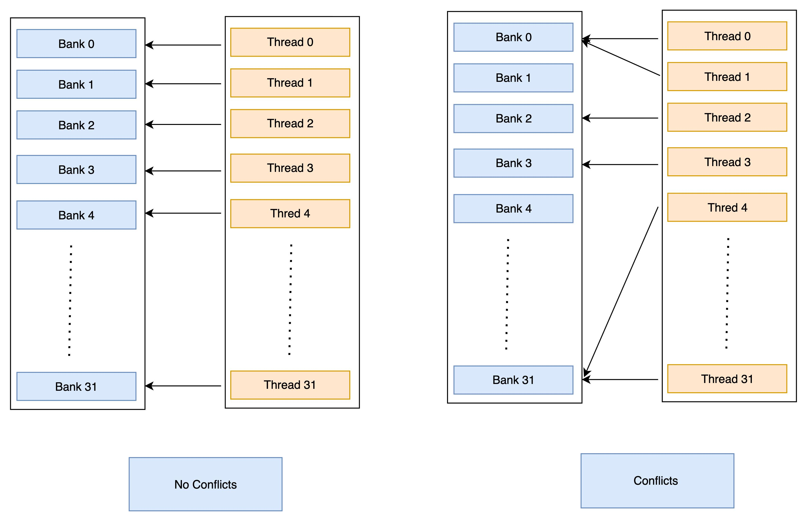
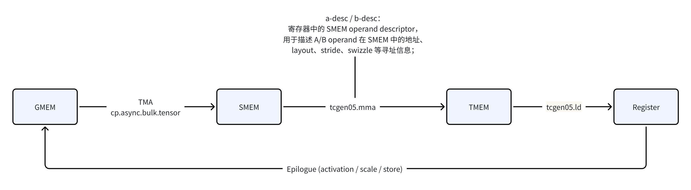

# bank conflict
## 1. 背景
### 1.1  Shared Memory Bank 基础
NVIDIA GPU 的 shared memory（SMEM） 按 32 个 bank 组织，每个 bank 宽度为 4 字节（32-bit）。而SMEM的给定内存访问使用哪个 bank 由 bank 数量、每个 bank 的大小以及最终的内存地址决定。对应于一个 warp 中的每个线程。banks 按地址顺序分配，遵循以下公式： bank = (address / 4) % 32 。因此地址 1024 属于 bank 0 ( (1024 / 4) % 32 = 0)， 1028 属于 bank 1 ((1028 / 4) % 32 = 1 ) 等。访问同一 bank 的多个访问会串行化（bank conflict）。
- 无冲突：同一 warp 的 32 个 lane 访问 32 个不同 bank，或同一地址（这种情况下只会生成一次 bank 访问，该值会广播给所有线程 broadcast / multicast）,访问就可以完全并行进行。
- 2-way conflict：2 个 lane 访问同一 bank 的不同地址
- N-way conflict：N 个 lane 访问同一 bank，N 个指令串行化，运行时间将变慢 N 倍。

### 1.2 可能造成 bank conflict 的命令：
- 普通 ld.shared / st.shared
- cp.async / cooperative copy
- TMA bulk tensor copy
- tcgen05.mma operand consumption
Bank conflict 的直接影响：
- MMA operand 从 SMEM 读取时产生 replay，降低有效吞吐
- 增加 Stall on MIO Throttle
- 在高 arithmetic intensity 场景（如 GEMM）中可能成为隐藏瓶颈
### 1.3 避免 bank conflict 的主要方法
- swizzle layout
- vectorized access
- padding
- lane-to-data remapping
- CUTLASS/CuTe layout atom

Thor (SM110) 上CUTLASS的72b实例中与 bank conflict 直接相关的数据路径：

- TMA 写入 SMEM 时即决定物理布局（swizzle），从而不会产生 LSU bank conflict
- tcgen05.mma 根据 SMEM descriptor 指定的寻址信息消费 SMEM operand，属于 async proxy 路径，。

## 2. 对不同命令的建模
2.1 普通 ld.shared / st.shared
2.2 宽向量化加载
2.3 TMA bulk tensor copy
