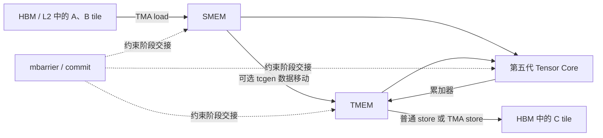
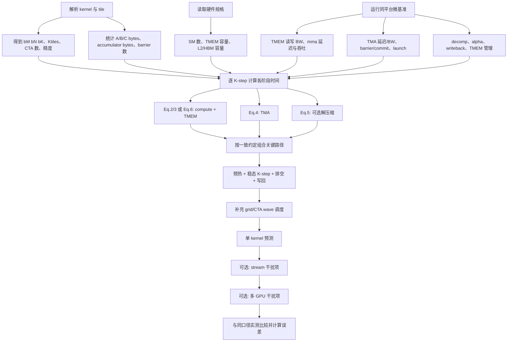

# 用微基准建立 Blackwell B200 阶段化性能模型

> - 论文：Aaron Jarmusch, Sunita Chandrasekaran, *Microbenchmark-Driven Analytical Performance Modeling Across Modern GPU Architectures*
> - 版本：[arXiv:2605.04178v1](https://arxiv.org/abs/2605.04178)，2026-05-05
> - 核验基准：arXiv v1 PDF（11 页）及同版本 TeX 源；仓库内原先没有该论文 PDF
> - 整理日期：2026-07-13
> - 笔记性质：忠实整理、公式解释与审慎评价；重点限于 NVIDIA Blackwell B200

本文使用三种标记区分证据层次：**论文事实**表示论文直接给出的公式、数字或判断；**整理说明**表示对公式的量纲分析、条件化推导或实现步骤；**审慎评价**表示根据论文内部证据作出的评价。未加特殊标记的架构介绍仍以论文为来源，不代表 NVIDIA 官方文档的独立确认。

## 1. 先说结论：这篇论文真正建模了什么

这篇论文尝试预测 GPU kernel 的执行时间。对于 Blackwell B200，作者没有只计算“总 FLOPs 除以峰值算力”和“总字节数除以 HBM 带宽”，而是把一次 tiled kernel 的关键路径拆成 Tensor Memory Accelerator（TMA）搬运、Tensor Memory（TMEM）访问、第五代 Tensor Core 计算、可选解压缩、显式同步和写回等阶段，再用微基准测得的延迟与带宽为各阶段赋值。论文把这种方法称为 **stage-centric analytical model**，即阶段化解析模型。

其核心思想可以压缩为一句话：先为每个 K-tile 建立计算时间和未被隐藏的 I/O 时间，再取两者关键路径，乘以 K 方向迭代数，最后加入启动与写回开销。这个方向有价值，因为 Blackwell 的若干执行阶段在软件接口中相对显式，能够分别测量；它也比单一峰值上限更容易指出“时间究竟花在 TMA、TMEM、Tensor Core 还是同步”。[论文 §III–IV，PDF pp.2–5]

不过，论文还没有给出一套仅凭正文即可完整复算任意 kernel 的封闭模型。公式之间存在同步项可能重复计算、TMEM 变量命名不一致、解压缩公式不等价等问题；全局 CTA 如何映射到 176 个 SM 也没有进入 Blackwell 总时间公式。论文报告的 `16384³` GEMM 示例缺少精度、有效 TMA 带宽、重叠率和调度参数，因而只能验证其报告值，不能从正文独立复现。本文会保留这些边界。

## 2. 为什么论文认为朴素 Roofline 不够

论文采用的朴素基线为：

$$
T_{\text{roofline}} =
\max\left(
\frac{\mathrm{FLOPs}}{P_{\text{peak}}},
\frac{\mathrm{bytes}}{B_{\text{HBM}}}
\right).
$$

这个式子只比较理想计算时间和理想 HBM 搬运时间。论文明确提醒，它把这个 **naive Roofline** 当作背景基线，不是有竞争力的执行时间预测器。[论文 §V-A，PDF p.6] 因此，论文得到 96.1% 的 B200 Roofline 误差，并不能证明所有 Roofline 分析都失效；它只说明“数据手册峰值 + 单一 HBM 带宽 + 一个 `max`”不足以预测本文所测 kernel 的实际时延。

论文列出三类原因。[论文 §II-A，PDF p.2]

第一，峰值与持续性能不同。作者报告，B200 Tensor Core 持续吞吐约为 1,100–1,400 TFLOPS，而对比的规格值为 2,250 TFLOPS；持续 HBM 带宽约为 6.8–7.1 TB/s，而峰值为 8.0 TB/s。若直接使用更大的分母，预测时间自然偏小。

第二，一条 kernel 的路径不只有“计算”和“HBM”两个整体。论文所建模的 Blackwell 路径包含 TMA、TMEM、Tensor Core 和同步。某些阶段串行，某些阶段可以通过双缓冲或三缓冲重叠，单个 `max` 无法同时表达阶段串行关系、局部重叠和固定延迟。

第三，不同数据层级和专用通路具有不同的有效带宽。对 Blackwell 来说，TMEM 访问、TMA 传输和普通全局内存写回不是同一个带宽项。只用 HBM 带宽会丢失这些差异。

从第一性原理看，Roofline 回答的是“在给定算术强度下，计算峰值或内存峰值给出的性能上界是什么”；本文模型试图回答的是“这个具体 kernel 在这套流水线上需要多久”。二者用途并不相同。更公平的结论是：朴素 Roofline 仍可用于上界和瓶颈分类，但不能替代包含固定延迟、阶段化数据移动和显式同步的时延模型。

## 3. 理解模型所需的最小 Blackwell 背景

论文把 B200 描述为拥有 176 个 SM、192 GB HBM3e、64 MB L2，以及每个 SM 256 KB TMEM 的双 die GPU。表 II 列出的峰值包括 8.0 TB/s HBM、2,250 TFLOPS FP16 Tensor 和 4,500 TFLOPS FP8 Tensor；这些是架构表中的峰值或规格参数，不能直接当作所有 kernel 的持续值。[论文 §III，表 II，PDF pp.2–4]

架构概览还报告 2080 亿晶体管、10 TB/s die 间 NV-HBI、统一且 cache-coherent 的 192 GB HBM3e、FP4/FP6 支持和最高 9,000 TFLOPS FP4，并称 Transformer Engine 用于改善低精度稳定性；硬件解压通路支持 LZ4、Snappy 与 Deflate。[论文 §III，PDF p.2] 这些数字用于交代平台能力，公式（1）至（8）并没有直接使用晶体管数、NV-HBI 或 9,000 TFLOPS FP4，不能为了“参数齐全”而把它们代入未对应的项。

本节只保留理解性能模型所需的资源与数据流。更一般的 Grid、CTA、warp 与 SM 层级关系可参阅 [`learn.md`](./learn.md)，Blackwell 相对 Hopper 的功能变化还可与 [`feature.md`](./feature.md) 对照。后两份仓库笔记不是本文论文证据，若其表述与论文不同，应分别回到各自来源核验。

### 3.1 TMEM、TMA 与第五代 Tensor Core

Tensor Memory（TMEM）是论文模型中的累加器存储层。`tcgen05.mma` 执行矩阵乘加，累加结果驻留在 TMEM；因此 Tensor Core 的计算时间之外，还需要考虑 TMEM 的读写带宽、MMA 指令延迟，以及 TMEM 分配和释放成本。关于 TMEM 的组织、寻址、分配和 `tcgen05` 数据移动形状，可继续阅读 [`tcgen05.md`](./tcgen05.md)，本文不重复 PTX 级表格。

Tensor Memory Accelerator（TMA）负责异步批量数据搬运。模型把 TMA 延迟和有效带宽单独测量，并允许多个参与 CTA 通过 multicast 分摊 tile 流量。L2 命中状态会改变有效 TMA 带宽，因此 `B_{\text{TMA}}` 不是可以永远固定为 HBM 峰值的常数。

论文写到两种 TMEM 策略：一种只把 accumulator 放入 TMEM，输入仍在 SMEM；另一种把 A 和 accumulator 都放入 TMEM，以增加 TMEM 流量换取更低的 SMEM 压力。论文将后一种数据移动指令写作 `tcgen08.cp`，微基准部分也沿用这一写法；但本仓库依据 PTX 整理的 [`tcgen05.md`](./tcgen05.md) 使用 `tcgen05.cp`。本文保留论文原文，并把 `tcgen08.cp` 视为疑似笔误，不据此补造一种新指令。

### 3.2 CTA Pair、2-SM UMMA 与 DSMEM

相邻两个 SM 上的 CTA 可以组成协作对，通过 distributed shared memory（DSMEM）共享 B tile。论文将单 CTA 模式记为普通 `S_{\text{mode}}`，将 2-SM 协作的实测速比记为 `S_{\text{2SM}}`。若两个 CTA 各自加载 A、共同加载 B，则论文给出的流量为

$$
D_{\text{2-CTA}}=2M_A+M_B,
$$

而各自独立加载时为 $2(M_A+M_B)$。当 $M_A=M_B$ 时，前者是 $3M_A$、后者是 $4M_A$，流量减少为原来的 $3/4$，也就是论文所说的最高约 $1.33\times$ 流量效率提升。CTA Pair 还需要 commit 同步，其成本写作 $K_{\text{tiles}}L_{\text{commit}}$。[论文 §IV-A.4，公式 (6) 附近，PDF p.3]

对应的共享数据移动时间被写成 $T_{\text{memory\_2-CTA}}=(2M_A+M_B)/BW_{\text{shared}}$。论文没有在表 VII 中给出 $BW_{\text{shared}}$，所以流量缩减可以符号化推导，绝对时间仍需另测。

### 3.3 显式流水线

论文图 3 描绘了连续 TMA load、TMEM copy、`tcgen05.mma` 与 HBM 写回的错位执行。抽象后可写成：

这里的箭头表示论文模型所关心的逻辑阶段，不是完整硬件数据通路。双缓冲或三缓冲可以让第 $k+1$ 个 tile 的数据移动与第 $k$ 个 tile 的计算重叠，但预热、稳态和排空仍要分别考虑。

## 4. 从通用起点到 Blackwell 公式（1）至（8）

### 4.1 公式（1）：通用 Hong–Kim 起点

论文先采用 Hong–Kim 框架：

$$
\boxed{
T_{\text{exec}} =
\max(T_{\text{compute}},T_{\text{memory}})
+T_{\text{overhead}}
}
\tag{1}
$$

$T_{\text{overhead}}$ 被描述为 barrier 与 kernel launch 等开销。公式（1）是通用起点，不是 Blackwell 专属公式；Blackwell 的特化发生在后续各阶段。[论文 §IV，公式 (1)，PDF p.3]

还要划清与论文另一半 AMD 模型的边界。公式（9）以后描述 MI300A：它根据 active wavefront、VGPR occupancy、L1/L2/Infinity Cache 命中率和 MFMA utilization 建模，并用占用率推导 overlap。Blackwell 公式（2）至（8）则把 TMA、TMEM、Tensor Core 和 barrier 当作显式阶段，并直接引入经验重叠率 $\alpha$。两条路径共享公式（1）的思想，却不能把 MI300A 的 cache/occupancy 公式原封不动套到 B200，也不能仅替换带宽就把 Blackwell stage model 变为 CDNA3 model。[论文 §III–IV-B，PDF pp.2–4]

从量纲上看，公式（1）的三项必须统一为时间。计算量除以 FLOP/s、字节数除以 byte/s 都得到秒，cycle latency 则要用实测频率换算。如果一个实现把 whole-GPU TFLOPS 与 per-CTA FLOPs 直接相除，同时又按 CTA 数或 SM 数重复缩放，结果会差一个并行度因子。论文后文对 $R_{TC}^{SM}$ 的数值报告不够清晰，因此量纲与作用域检查应成为实现的第一道验证。

### 4.2 公式（2）：一个 K-step 的 TMEM 时间

对每次 K 方向 tile 迭代，论文给出：

$$
\boxed{
T_{\text{TMEM\_per\_tile}} =
\frac{D_{\text{accum}}}{BW_{\text{TMEM\_read}}}
+L_{\text{mma}}
+\frac{D_{\text{accum}}}{BW_{\text{TMEM\_write}}}
}
\tag{2}
$$

$D_{\text{accum}}$ 是本次 tile 的 accumulator 数据量，单位应为 byte；$BW_{\text{TMEM\_read/write}}$ 的单位是 byte/s；$L_{\text{mma}}$ 是 MMA 指令延迟。若延迟以 cycle 计，必须先除以相应时钟频率，才能与带宽项得到的秒相加。论文没有在公式旁明确写出这个换算步骤。

公式（2）意味着 TMEM 不是“无限快的内部细节”。若 accumulator 占用超过每 SM 256 KB，论文称会发生 spill 并降低效率，但正文没有给出 spill 后时间的闭式表达。因此，256 KB 在这里是模型的可行性约束，而不是公式里自动处理的惩罚项。[论文 §IV-A.1，公式 (2)，PDF p.3]

### 4.3 公式（3）：单 CTA 的 Tensor Core 计算项

$$
\boxed{
T_{\text{compute}} =
\frac{2b_Mb_Nb_K}
{R_{TC}^{SM}\,S_{\text{mode}}}
+T_{\text{TMEM}}
+T_{\text{TMEM\_mgmt}}
}
\tag{3}
$$

$b_M,b_N,b_K$ 是 CTA tile 尺寸，$2b_Mb_Nb_K$ 是一次 dense GEMM tile 的 FLOP 数；$R_{TC}^{SM}$ 被定义为单 SM Tensor Core 吞吐，$S_{\text{mode}}$ 是执行模式的无量纲加速因子。$T_{\text{TMEM\_mgmt}}$ 表示 TMEM 管理成本。

这里有一个符号缺口：公式（2）定义的是 $T_{\text{TMEM\_per\_tile}}$，公式（3）使用的却是 $T_{\text{TMEM}}$，论文没有明确说明二者是否完全相等、是否还包含额外 copy，也没有交代该项是否已经包含 $L_{\text{mma}}$。实际实现前必须作出一致定义并记录，否则可能重复加入 MMA 延迟。

### 4.4 公式（4）：每 CTA 的 TMA 搬运

若 $P$ 个参与者共享一个数据 tile $T$，论文先定义

$$
bytes_{ \text{perCTA}} = \frac{bytes(T)}{P},
$$

再给出：

$$
\boxed{
T_{\text{tma}} =
L_{\text{TMA}}
+\frac{bytes(T)}{P\,B_{\text{TMA}}}
}
\tag{4}
$$

$L_{\text{TMA}}$ 是固定启动延迟，$B_{\text{TMA}}$ 是对应 tile 大小和 L2 residency 下的有效带宽。A、B 的参与数可以分别写为 $P_A,P_B$；论文说两路时间根据实际重叠关系“相加或取最大值”，但没有给出自动判定规则。这要求复用者从 kernel 调度和 barrier 依赖中判断两路 TMA 是否可并行。[论文 §IV-A.2，公式 (4)，PDF p.3]

### 4.5 公式（5）：可选解压缩

论文先在正文中写出 link 与 decompression engine 二者的瓶颈：

$$
T_{\text{DE\_load}} =
\max\left(
\frac{D_{\text{compressed}}}{BW_{\text{link}}},
\frac{D_{\text{compressed}}}{R_{\text{DE}}}
\right),
$$

随后又用压缩比 $CR$ 和效率 $\eta_{DE}$ 给出公式（5）：

$$
\boxed{
T_{\text{DE\_load}} =
\frac{D_{\text{uncompressed}}}
{CR\,BW_{\text{link}}\,\eta_{DE}}
}
\tag{5}
$$

另有 sub-byte unpacking：

$$
T_{\text{decomp}} =
\frac{bytes_{\text{comp}}}{R_{\text{decomp}}}
+L_{\text{decomp\_setup}}.
$$

前一个 `max` 同时限制 link 与 engine，公式（5）却没有 $R_{DE}$，两式只有在加入额外假设时才可能等价。论文没有说明应当如何在二者间选择。可靠实现应保留两种路径：有 engine 实测速率时使用瓶颈最大值；只有压缩比、link 带宽和效率时才使用公式（5）的经验形式，并在结果中注明模型选择。

### 4.6 同步项

每个 K-step 的同步时间写作：

$$
T_{\text{sync}}=N_{\text{bar}}L_{\text{mbar}},
$$

其中 $N_{\text{bar}}$ 通常为 1–2，$L_{\text{mbar}}$ 由微基准测得。2-SM CTA Pair 还具有 $K_{\text{tiles}}L_{\text{commit}}$ 的 commit 成本。这里要区分每 step 的 barrier 和整段 CTA Pair 的累计 commit，避免把已经乘过 $K_{\text{tiles}}$ 的量再次按 step 累积。[论文 §IV-A.3–4，PDF p.3]

### 4.7 公式（6）：2-SM 协作计算

$$
\boxed{
T_{\text{compute\_2SM}} =
\frac{2b_Mb_Nb_K}
{R_{TC}^{SM}\,S_{\text{2SM}}}
+T_{\text{TMEM}}
+T_{\text{TMEM\_mgmt}}
}
\tag{6}
$$

它与公式（3）的结构相同，但使用微基准测得的 $S_{\text{2SM}}$。论文报告，模型预测 2-SM 加速为 $1.30\times$，实测为 $1.28\times$，两者相差约 2%；这只验证了所测协作案例，不能直接把 $S_{\text{2SM}}=1.30$ 当成所有 tile 和精度的固定常数。[论文 §V-B，PDF p.7]

### 4.8 公式（7）：未被计算隐藏的 I/O

论文用 $\alpha\in[0,1]$ 表示被计算隐藏的 I/O 比例：

$$
\boxed{
T_{\text{io}}^{eff} =
(1-\alpha)(T_{\text{tma}}+T_{\text{decomp}})
+T_{\text{sync}}
}
\tag{7}
$$

$\alpha=0$ 表示 TMA 与解压缩完全暴露，$\alpha=1$ 表示这两项完全被隐藏。论文使用 $0.85$–$0.95$，并把范围归因于双缓冲到三缓冲的 pipeline depth；但表 VII 没有列出测量 $\alpha$ 的独立微基准。因此它更像由流水线深度选择或校准的参数，而不是一个已经充分报告的硬件常数。

### 4.9 公式（8）：每个 K-step 的关键路径

$$
\boxed{
T_{\text{step}} =
\max(T_{\text{compute}},T_{\text{io}}^{eff})
+T_{\text{sync}}
+O_{\text{misc}}
}
\tag{8}
$$

$O_{\text{misc}}$ 包含 TMEM 管理和 pipeline bubble。论文在同一节还给出稳态表达：

$$
T_{\text{step\_pipelined}} =
\max(T_{\text{tma}},T_{\text{decomp}},T_{\text{compute}},T_{\text{sync}})
+\epsilon,
$$

并称 kernel 总时间为 $K_{\text{tiles}}T_{\text{step}}$ 再加 launch 和 writeback。[论文 §IV-A.5，公式 (7)–(8)，PDF pp.3–4]

这里存在明显的不一致：公式（7）的 $T_{\text{io}}^{eff}$ 已经包含 $T_{\text{sync}}$，公式（8）又在 `max` 外加了一次。当 I/O 分支成为关键路径时，同步可能被计算两次。论文后面的统一摘要又写成

$$
T_{\text{Blackwell}} =
T_{\text{launch}}
+K_{\text{tiles}}
\max(T_{\text{compute}}^{TC},T_{\text{io}}^{eff})
+T_{\text{sync}}
+T_{\text{writeback}},
$$

其中同步似乎只在 $K_{\text{tiles}}$ 之外加一次，与“sync per K-step”的文字也不一致。本文不擅自把某个版本宣布为作者本意。复用时必须选择一种一致约定，例如让 $T_{\text{io}}^{eff}$ 不含同步，再在每 step 外加一次；但这属于实现者修订，结果不应冒充论文原式。

### 4.10 阶段为什么有时相加、有时取最大

解析模型的关键不只是列出时间项，而是写清它们之间的依赖。对同一数据 tile，TMA 完成之前不能消费相应输入，因此未被预取隐藏的那一部分位于计算关键路径上；对于不同 pipeline stage，若硬件资源和 buffer 独立，稳态下可以并行，于是使用 `max`。同一个 CTA 必须依次完成的 TMEM 读、MMA latency 和 TMEM 写在公式（2）里相加。A、B 的 TMA 是否相加取决于它们是否顺序发起并共享瓶颈。固定 launch、无法隐藏的 barrier 和最终 writeback 则位于关键路径边界，通常额外相加。

| 关系 | 论文中的例子 | 物理含义 | 复用时要确认 |
| --- | --- | --- | --- |
| 相加 | 公式 (2) 的 TMEM read、MMA、write | 同一 tile 的依赖链 | MMA latency 是否已被其他项包含 |
| 除以参与数 | 公式 (4) 的 $bytes(T)/P$ | multicast 分摊 tile 流量 | 参与 CTA 是否真的共享同一份数据 |
| 乘 $(1-\alpha)$ | 公式 (7) 的 TMA 与 decomp | 只保留未隐藏的 I/O | $\alpha$ 是否来自相似 pipeline |
| 取最大 | 公式 (8) 的 compute 与有效 I/O | 两条可重叠路径的关键路径 | 是否争用同一资源、是否有 barrier 依赖 |
| 乘迭代数 | $K_{tiles}T_{step}$ | 重复的 K-step 稳态 | 首尾 step 是否与稳态相同 |
| 额外相加 | launch、writeback、stream/GPU 干扰 | 关键路径边界或固定成本 | 是否已在 profiler 口径中计入 |

这张关系表也解释了为什么简单地把 TMA、TMEM、compute、sync 全部求和会过度预测，而把所有阶段统一取最大又会过度乐观。准确性来自实际依赖图，不来自某一种固定聚合运算。

## 5. 写回、预热、稳态、排空与系统扩展

论文为 C tile 写回给出两条路径：

$$
T_{\text{store}} =
\frac{bytes(C_{\text{tile}})}{B_{\text{gmem}}}
+L_{\text{store\_setup}},
$$

或

$$
T_{\text{TMA\_store}} =
L_{\text{TMA\_store}}
+\frac{bytes(C_{\text{tile}})}{B_{\text{TMA}}}.
$$

作者称 persistent kernel 中的写回通常可以重叠。TMEM 分配与释放则按 K-step 摊销：

$$
T_{\text{TMEM\_mgmt}}^{amortized} =
\frac{L_{\text{alloc}}+L_{\text{dealloc}}}{K_{\text{tiles}}}.
$$

论文没有为流水线预热（fill）和排空（drain）分别给出闭式公式，而是用 $\epsilon$、$O_{\text{misc}}$ 和额外 writeback 吸收 bubble 与边界开销。严格照论文复现时，只能使用

$$
T_{\text{kernel}} \approx
T_{\text{launch}}
+K_{\text{tiles}}T_{\text{step}}
+T_{\text{writeback}},
$$

并通过微基准确定 $O_{\text{misc}}$。如果工程实现需要显式区分三个阶段，可以扩展为

$$
T_{\text{kernel}} =
T_{\text{launch}}
+T_{\text{fill}}
+K_{\text{steady}}T_{\text{step\_steady}}
+T_{\text{drain}}
+T_{\text{writeback}},
$$

但后一个式子是**整理说明中的工程扩展**，$T_{\text{fill}}$ 与 $T_{\text{drain}}$ 必须另测，不能从论文表 VII 直接得到。

对于 $N_c$ 个并发 stream，论文在单 stream 时间上加 $(N_c-1)\tau_c$；对于 $N_d$ 个 GPU，加 $(N_d-1)\tau_g$。二者均需由微基准拟合。[论文 §IV-A.6，PDF p.4] 多 GPU 项没有显式建模数据划分、设备间传输、跨 GPU 同步和一致性，所以它只能描述与校准场景相似的附加干扰，不能替代通信模型。

论文还提供一个跨架构共用的 host–device 扩展，它不属于 Blackwell 公式（1）至（8）。传输 $S$ bytes 时，$T_{memcpy}=S/B_{eff}^{dir}+\tau_{memcpy}$，每个显式 host sync 再加 $\tau_{sync}$；表 VII 给出的 45 GB/s、2 μs 和 3 μs 是默认值，不应误写为 B200 stage model 的实测常数。当前版本不模拟 copy 与 kernel overlap，直接求和会对可重叠的 wall time 作保守估计。[论文 §IV-E、公式 (15)，表 VII，PDF pp.5、7]

当 workload segment 不能映射到完整 Blackwell stage model 或已验证的 GEMM/tile 案例时，论文实现退回一个经过分类校准的 generic Roofline，并按 memory-bound、compute-bound、balanced、stencil 使用不同 scale。其 working-set-aware 带宽为

$$
B_{eff}(W) = B_{sustained}
+(B_{peak}-B_{sustained})\exp(-W/w_0),
$$

其中 $w_0$ 是可调工作集尺度，小工作集在该经验式中更接近 peak，大工作集趋向 sustained；$w_0\le0$ 时关闭混合。multi-kernel segment 还会按同配置实测 launch latency 添加额外启动时间。[论文 §IV-F、公式 (16)，PDF p.5] 这条 fallback 路径解释了为什么 Rodinia/SPEChpc 的应用结果不能全部归功于公式（2）至（8）：部分 segment 实际经过分类 scale 和经验带宽式。

还要注意，公式（2）至（8）主要是 per-tile 或 per-CTA 表达。论文没有给出 grid 中全部 CTA 在 176 个 SM 上形成多少调度 wave、每个 SM 同驻留多少 CTA，以及这些 wave 如何汇总成整 kernel 时间；§IV-G 还明确把 CTA queuing delay 列为未建模项。若要从单 CTA 推到全 grid，至少需要 CTA 数、资源限制后的 resident CTA/SM 和调度 wave 数。这是正文复用时最大的结构性缺口之一。

## 6. 统一符号表

下表只列 Blackwell 路径。单位一栏是由公式量纲要求得到的；论文没有明确单位或定义不闭合之处予以标注。

| 符号 | 含义 | 单位/范围 | 来源与状态 |
| --- | --- | --- | --- |
| $b_M,b_N,b_K$ | 单 CTA 的 GEMM tile 维度 | element | 论文 §IV-A |
| $K_{\text{tiles}}$ | K 方向 tile 迭代数 | count | 论文 §IV-A；通常可由 $K/b_K$ 推导 |
| $D_{\text{accum}}$ | accumulator tile 数据量 | byte | 公式 (2)；正文未为示例给值 |
| $BW_{\text{TMEM\_read/write}}$ | TMEM 读/写带宽 | byte/s | 公式 (2)，微基准 |
| $L_{\text{mma}}$ | MMA 指令延迟 | cycle 或 s | 公式 (2)，需统一时钟单位 |
| $R_{TC}^{SM}$ | 单 SM Tensor Core 吞吐 | FLOP/s | 公式 (3) 的定义；表 VII 数值尺度存疑 |
| $S_{\text{mode}}$ | 普通/协作执行模式加速因子 | dimensionless | 公式 (3) |
| $S_{\text{2SM}}$ | 2-SM 协作实测速比 | dimensionless | 公式 (6) |
| $T_{\text{TMEM}}$ | 公式 (3)/(6) 中的 TMEM 时间 | s | 与公式 (2) 符号未闭合 |
| $L_{\text{alloc/dealloc}}$ | TMEM 分配/释放延迟 | cycle 或 s | §IV-A.5；无报告值 |
| $T_{\text{TMEM\_mgmt}}$ | TMEM 管理时间 | s | 公式 (3)/(6) |
| $bytes(T)$ | TMA tile 的总字节数 | byte | 公式 (4) |
| $P,P_A,P_B$ | multicast 参与 CTA 数 | count | 公式 (4) |
| $L_{\text{TMA}}$ | TMA 固定延迟 | cycle 或 s | 公式 (4)，微基准 |
| $B_{\text{TMA}}$ | 给定 tile/L2 状态的有效 TMA 带宽 | byte/s | 公式 (4)，无统一报告值 |
| $D_{\text{compressed/uncompressed}}$ | 压缩/解压后的数据量 | byte | 公式 (5) |
| $CR$ | 压缩比 | dimensionless | 公式 (5) |
| $BW_{\text{link}}$ | 压缩数据通路带宽 | byte/s | 公式 (5)，无报告值 |
| $R_{DE},R_{\text{decomp}}$ | 解压引擎/拆包速率 | byte/s | §IV-A.3，无报告值 |
| $\eta_{DE}$ | 解压效率 | $0$–$1$ | 公式 (5)，无报告值 |
| $L_{\text{decomp\_setup}}$ | 解压启动延迟 | cycle 或 s | §IV-A.3，无报告值 |
| $N_{\text{bar}}$ | 每 K-step barrier 数 | count，通常 1–2 | §IV-A.3 |
| $L_{\text{mbar}},L_{\text{commit}}$ | barrier/commit 延迟 | cycle 或 s | 微基准 |
| $M_A,M_B$ | A、B tile 搬运量 | byte | §IV-A.4 |
| $\alpha$ | 被计算隐藏的 I/O 比例 | $0$–$1$ | 公式 (7)；论文使用 0.85–0.95 |
| $O_{\text{misc}},\epsilon$ | 管理、bubble 等残差 | s | §IV-A.5；需校准 |
| $B_{\text{gmem}}$ | 普通写回有效带宽 | byte/s | §IV-A.5，无报告值 |
| $T_{\text{launch}}$ | kernel 启动时间 | s | 总式；B200 无统一报告值 |
| $\tau_c,\tau_g$ | 每增加 stream/GPU 的干扰项 | s | §IV-A.6，需拟合 |

## 7. 论文给出的 B200 参数：哪些可直接取，哪些必须测

| 参数 | 论文报告值 | 获得方式 | 定位 | 使用注意 |
| --- | ---: | --- | --- | --- |
| SM 数 | 176 | 数据手册 | 表 II，p.4 | 全局调度式未给出 |
| warp 大小 | 32 | 数据手册 | 表 II，p.4 | 非公式 (2)–(8) 的直接项 |
| 最大 resident warp/SM | 64 | 微基准/文档 | 表 II，p.4 | Blackwell 总式未显式使用 |
| HBM 峰值带宽 | 8.0 TB/s | 微基准/数据手册（表中混合标注） | 表 II，p.4 | §II-A 另报持续 6.8–7.1 TB/s |
| HBM 容量 | 192 GB | 数据手册 | 表 II，p.4 | 容量不是有效带宽 |
| L2 容量 | 64 MB | 数据手册 | 表 II，p.4 | 仍需测 L2 residency 对 TMA 的影响 |
| TMEM 容量 | 256 KB/SM | 数据手册 | 表 II，p.4 | 超出后的 spill 惩罚未建模 |
| Tensor 峰值 | FP16 2,250；FP8 4,500 TFLOPS | 数据手册/微基准（表中混合标注） | 表 II，p.4 | §II-A 另报持续 1,100–1,400 TFLOPS |
| TMEM 读/写带宽 | 16/8 TB/s | TMEM↔SMEM tile copy | 表 VII，p.7 | 后文又使用 22 TB/s，并称 tuned kernel 为 24–26 TB/s，关系未解释 |
| TMA 延迟 $L_{TMA}$ | 420 cycles | TMA copy latency 微基准 | 表 VII，p.7 | 还需实际 $B_{TMA}$ 与时钟 |
| `tcgen05.mma` 延迟 | 11–14 cycles | FP64–FP4 指令计时 | 表 VII，p.7 | 需按精度选取并换算为秒 |
| Tensor throughput $R_{TC}^{SM}$ | 44.8–7702 TFLOPS | 按精度 peak sweep | 表 VII，p.7 | 符号称“per SM”，数值却更像设备级尺度；论文未解释 |
| $L_{mbar},L_{commit}$ | 40–50 cycles | barrier 微基准 | 表 VII，p.7 | 需分别选值并统一时钟 |
| $\alpha$ | 0.85–0.95 | 论文称来自双/三缓冲深度 | §IV-A.3，p.3 | 未列入表 VII 的测量方法 |

这张表揭示了复用模型时最重要的纪律：规格参数只描述资源边界；有效带宽、延迟和 overlap 必须在固定 GPU stepping、驱动、工具链、功耗与时钟策略下重新测量。论文也要求微基准与验证运行保持相同的平台配置。[论文 §V-A，表 V，PDF p.6]

## 8. 一条可以实际执行的建模流程

下面的流程把论文分散在 §IV-A、§IV-D 和 §IV-G 的内容合并起来，同时标出正文没有闭合的步骤。

### 8.1 从 kernel 获取输入

需要确定问题规模 $M,N,K$，tile 大小 $b_M,b_N,b_K$，精度和 accumulator 类型，K-step 数，A/B/C 每 tile 字节数，TMEM 布局策略，TMA multicast 参与数 $P_A,P_B$，barrier/commit 次数，是否解压，普通或 TMA 写回，以及 grid 的 CTA 数。论文明确列出的 Blackwell 必需项是 $b_M,b_N,b_K,K_{\text{tiles}}$、每 CTA 字节数、$P$ 和 $\alpha$；全局 CTA 调度虽未进入其总式，但实际复用不能忽略。[论文 §IV-G，PDF p.5]

### 8.2 从硬件规格获取输入

硬件规格提供 SM 数、TMEM 容量、L2/HBM 容量、支持的 tile/精度和理论峰值。峰值适合检查结果是否越界，不宜直接替代 $R_{TC}^{SM}$、$B_{TMA}$ 或持续 HBM 带宽。

### 8.3 必须微基准测得的输入

至少需要 TMEM 读写带宽、按精度区分的 `tcgen05.mma` 延迟与持续吞吐、TMA 固定延迟和随 tile/L2 状态变化的有效带宽、`mbarrier`/commit 延迟、kernel launch、普通与 TMA store、TMEM alloc/dealloc。若工作负载使用压缩，还要测解压速率、setup latency 和效率。$\alpha$、$O_{misc}$、$\tau_c$ 与 $\tau_g$ 要在与目标 kernel 相似的流水线或并发配置下测量或校准。

### 8.4 组合每个阶段

先用公式（2）与（3）得到普通 CTA compute，或用公式（6）得到 2-SM compute；再用公式（4）分别算 A/B TMA，依据真实依赖相加或取最大；使用压缩时计算公式（5）或 engine/link 瓶颈式；最后根据选定的同步约定得到每 step 关键路径。

为了避免论文公式（7）–（8）的重复同步问题，工程实现必须在配置中记录采用哪种语义。一个自洽但属于实现者修订的选择是：

$$
\widetilde T_{io}^{eff}
=(1-\alpha)(T_{tma}+T_{decomp}),
$$

$$
\widetilde T_{step}
=\max(T_{compute},\widetilde T_{io}^{eff})
+T_{sync}+O_{misc}.
$$

如果目标是逐字复现作者实现，则应使用原公式并检查公开代码如何解释；arXiv v1 只说代码和 benchmark 将在论文接收后发布，正文没有提供可审计实现。

### 8.5 从 step 到最终预测

论文路径是 launch + K-step + writeback，再可选添加并发 stream 和多 GPU 线性干扰项。实际 kernel 还要处理 fill/drain 和 CTA wave。由于论文缺少这部分闭式模型，可靠做法是用微基准测 first/steady/last iteration，或把边界成本显式放进 $O_{misc}$，并把适用的 CTA 数范围记录为校准条件。

### 8.6 与测量比较

论文在 NVIDIA 上使用 Nsight 的 `cuda_gpu_kern_sum`，即 CUDA kernel duration 之和，不是包含 host、传输和同步的端到端 wall time。每个 kernel 预热 10 次，再运行 100 次，报告执行时间中位数；B200 每 kernel error 的 IQR 小于 2%。[论文 §V-B，PDF p.6]

论文没有显式打印误差公式。若沿用常见定义，单案例 absolute percentage error 可写为

$$
APE_i =
\frac{|T_{pred,i}-T_{meas,i}|}{T_{meas,i}}\times100\%,
$$

多个案例的

$$
MAE=\frac{1}{n}\sum_{i=1}^{n}APE_i.
$$

这是**整理说明中的实现约定**；复算论文数字前仍需核对作者代码的聚合和权重方式，尤其因为正文的总体与分类 MAE 彼此难以直接对齐。

## 9. 以论文示例为基础的条件化计算

论文给出的唯一 B200 完整问题规模示例是 $M=N=K=16384$、tile 为 $128\times128\times32$ 的 GEMM；论文报告预测 4.17 ms、实测 4.10 ms、误差 1.8%。[论文 §IV-D，PDF p.5] 以下先计算正文足以确定的部分。

若一个 CTA 负责一个 $128\times128$ 输出 tile，则

$$
K_{\text{tiles}}=\frac{16384}{32}=512,
$$

$$
N_{\text{output tiles}}
=\frac{16384}{128}\times\frac{16384}{128}
=128\times128=16384.
$$

每个 K-step 的计算量为

$$
2b_Mb_Nb_K
=2\times128\times128\times32
=1{,}048{,}576\ \text{FLOPs},
$$

每个输出 tile 跨 512 个 K-step 的计算量为 536,870,912 FLOPs；全问题计算量回到 $2\times16384^3\approx8.796\times10^{12}$ FLOPs。以上是由 tile 几何得到的**条件化推导**，其中“一输出 tile 对应一 CTA”不是论文明确写出的示例配置。

再作一个明确标注的假设：若 accumulator 是 FP32，则

$$
D_{\text{accum}}=128\times128\times4=65{,}536\ \text{bytes}.
$$

使用表 VII 的 TMEM 读/写 16/8 TB/s，公式（2）的纯数据时间为

$$
\frac{65536}{16\times10^{12}}
+\frac{65536}{8\times10^{12}}
=4.096\ \text{ns}+8.192\ \text{ns}
=12.288\ \text{ns},
$$

所以

$$
T_{\text{TMEM\_per\_tile}}
=12.288\ \text{ns}+L_{mma}.
$$

表 VII 只给出 $L_{mma}=11$–$14$ cycles，没有提供该实验对应的 SM 时钟，因而不能可靠换算为 ns。类似地，公式（3）还缺该精度下真正的单 SM $R_{TC}^{SM}$ 与 $S_{mode}$；公式（4）缺 $B_{TMA}$、$P_A/P_B$ 和 L2 状态；最终式缺 $\alpha$、$O_{misc}$、launch、writeback、resident CTA/SM 和 grid wave 调度。正文还没有说明示例 accumulator 是否为 FP32。因此，4.17 ms 不能由论文正文完整复算，任何补齐后的单一数值都会混入未披露假设。

这个例子反而说明了模型复用的真实门槛：公式结构并不复杂，困难在于为每条 kernel 路径取得口径一致的输入，并把 per-CTA 时间正确提升到全 grid。

## 10. 验证结果究竟支持什么

### 10.1 微基准

论文表 VI 报告 B200 在 21 个 microbenchmark 上的模型 MAE 为 1.33%，正文和摘要则写 1.31%；朴素 Roofline 基线为 96.1%。本文保留这个 0.02 个百分点的不一致，不选择性地把其中一个写成唯一真值。[论文表 VI 与 §V-B，PDF pp.6–7]

| B200 微基准结果 | 论文报告值 | 证据位置 |
| --- | ---: | --- |
| 全部 21 个 kernel 的 MAE | 1.33%（表）/ 1.31%（正文） | 表 VI p.6；§V-B p.6 |
| memory-bound 分类 MAE | 8.4% | §V-B p.6 |
| compute-bound 分类 MAE | 5.4% | §V-B p.6 |
| balanced 分类 MAE | 7.9% | §V-B p.7 |
| 0.1% density SpMV 单项误差 | 13.6% | §V-B p.7 |
| 2-SM speedup | 预测 1.30×，实测 1.28× | §V-B p.7 |
| 运行统计 | 10 次预热、100 次运行、中位时间 | §V-B p.6 |

总体 1.31/1.33% 小于三个分类各自的 5.4%–8.4%，而论文没有说明分类子集、权重或总体聚合方式如何产生这种关系。这是需要作者代码才能解释的统计口径问题。与此同时，compute-bound 小节称 22 TB/s 的 TMEM 假设较保守，而 tuned kernel 为 24–26 TB/s；表 VII 又列出 TMEM 读/写 16/8 TB/s。三组数字可能描述不同方向、不同操作或组合带宽，但正文没有建立映射，复用时不能混为一个参数。

分类文字还把 memory-bound 中 vector operation 的 7%–9% 误差归因于 L2 benefit 和 5–12 μs launch overhead，把稀疏 SpMV 的 13.6% 误差归因于未建模的 atomic 与 load balance。这些是作者对残差的解释，论文没有在同一处给出逐因素消融实验，因此适合作为诊断线索，不应当作已独立证明的误差分解。[论文 §V-B，PDF pp.6–7]

### 10.2 Rodinia 3.1

论文没有把 Rodinia kernel 直接逐条套入完整 Blackwell stage model，而是先拆成 segment，再按类别代理：stencil 映射到 transpose，compute-bound 映射到 GEMM，memory-bound 映射到 vector copy。Pathfinder 的有效 FLOPs/bytes 与 timestep 对齐 profiler，Streamcluster 的执行次数也按测量 regime 缩放。[论文 §V-B/C，PDF pp.6–7] 因此这里验证的是“segment 构造 + 分类路由 + 相应模型”的组合，不是公式（2）至（8）对真实应用的纯第一性原理验证。

| Rodinia benchmark | 类别 | B200 误差 | 定位 |
| --- | --- | ---: | --- |
| `hotspot_1024` | stencil | 31.0% | 表 X，p.7 |
| `hotspot_512` | stencil | 15.4% | 表 X，p.7 |
| `bfs_1M` | memory | 44.9% | 表 X，p.7 |
| `backprop_65536` | compute | 33.0% | 表 X，p.7 |
| `pathfinder_1000` | balanced | 0.4% | 表 X，p.7 |
| `srad_502` | balanced | 0.5% | 表 X，p.7 |
| `streamcluster_1M` | memory | 12.4% | 表 X，p.7 |

规则数据并且代理匹配良好时，误差可低于 1%；不规则 BFS、stencil proxy 和很短的 compute kernel 则达到 31%–44.9%。论文的 limitations 将 sparse、indirection、atomics 与短 kernel 列为弱项，这与表 X 相符。[论文 §VI，PDF p.10] 论文没有在主表或正文中给出 B200 Rodinia 的一个总体 MAE，因此不应自行平均后冒充作者结果。

### 10.3 SPEChpc 2021 Tiny

| SPEChpc benchmark | 类别 | B200 误差 | 定位 |
| --- | --- | ---: | --- |
| `505.lbm_t` | memory | 14.9% | 表 XI，p.8 |
| `513.soma_t` | balanced | 0.3% | 表 XI，p.8 |
| `518.tealeaf_t` | memory | 0.2% | 表 XI，p.8 |
| `519.clvleaf_t` | memory | 18.5% | 表 XI，p.8 |
| `521.miniswp_t` | compute | 32.8% | 表 XI，p.8 |
| `528.pot3d_t` | memory | 未报告 | 表 XI，p.8 |
| `532.sph_exa_t` | balanced | 0.03% | 表 XI，p.8 |
| `534.hpgmgfv_t` | memory | 0.3% | 表 XI，p.8 |

论文报告 B200 SPEChpc 总体 MAE 为 9.6%。用户特别关心的约 18.5%–32.8% 对应 `519.clvleaf_t` 和 `521.miniswp_t`；它们是**单 benchmark 百分比误差**，不是总体 MAE。四个案例低于 1%，说明某些 segment 刻画得很好；`miniswp` 的 32.8% 又说明 application-level 输入、编译器生成 kernel 和固定开销仍可显著影响结果。[论文 §V-D，PDF p.8]

### 10.4 微基准 1.3% 与应用 9.6% 为什么不同

微基准会隔离 TMEM、TMA、barrier、MMA 等单一路径，而且同一批测量又用于提供模型参数。应用验证增加了至少四层误差：真实 kernel 的 FLOP/byte 统计、segment 拆分、代理类别路由、短 kernel 的 launch 与同步占比。Rodinia 还没有直接使用 Tensor Core、TMA、TMEM 或 structured sparsity；SPEChpc 使用 OpenACC/OpenMP offload，编译器生成层会使源代码级 FLOP/byte 与实际 GPU kernel 不同。[论文 Observation 7，PDF p.10]

所以，约 1.3% 支持“在作者所选 21 个微基准和同平台测量口径下，模型能贴近观测值”；9.6% 以及 18.5%–44.9% 的单项误差说明，这个精度不能自动推广到完整应用。论文结论中“应用验证确认精度延伸到微基准之外”的表述偏宽，较稳妥的说法是：应用结果提供了部分外部验证，但准确度高度依赖工作负载规律性和 segment 刻画。

### 10.5 如何根据误差形态反查模型

如果预测在大 GEMM 上系统性偏快，应先检查是否把 datasheet peak 当成持续吞吐、$R_{TC}^{SM}$ 是否错误使用了 whole-GPU 数值，以及 TMEM 流量是否漏算。若不同 tile 大小时误差方向改变，重点检查 TMEM 容量、TMA tile/L2 residency 与 $\alpha$。若短 kernel 误差大而长 kernel 正常，固定 launch、barrier、fill/drain 往往比峰值吞吐更重要。若 BFS、SpMV 或 atomic kernel 误差突出，规则带宽模型可能缺少访问分歧、负载不平衡或原子串行化。

对应用 segment 来说，还应先验证输入，再评价公式。可以分别固定硬件参数、FLOPs/bytes、segment 次数和 proxy 路由，每次只替换一类输入，观察误差变化。论文在 MI300A SPEChpc 上展示过 profiler-derived 与 first-principles FLOP/byte 会造成数量级差异；虽然这不是 B200 的直接数值证据，但它说明“模型误差”和“工作负载刻画误差”必须分开报告。一个模型只有在输入由独立方法获得、校准集与验证集分离时，应用级 MAE 才能更有力地证明泛化能力。

## 11. 审慎评价

### 11.1 值得肯定的部分

第一，模型具有可解释性。TMA、TMEM、Tensor Core、同步、解压和写回各自对应可测量阶段，性能差异可以落到具体项，而不是只得到一个黑箱预测。

第二，论文明确区分规格峰值和持续微基准值，并记录 GPU stepping、驱动、CUDA/ROCm、功耗/时钟策略等复现实验元数据。这是性能建模不可缺少的纪律。[论文 §V-A，表 V，PDF p.6]

第三，作者没有只展示平均数。Rodinia、SPEChpc 的 per-benchmark 表以及 limitations 暴露了 BFS、stencil、短 kernel、atomics 等失败案例。2-SM 的预测与实测速比也提供了一个相对具体的局部验证。

### 11.2 峰值、持续值和拟合并未完全理顺

论文一方面批评 datasheet peak，另一方面说 generic Roofline 使用 sustained 值或保守下界，但“stage-centric Blackwell validation kernels 在适当处保留 peak”。表 II 的 Source 一列又把某些值统一标为“microbenchmark / datasheet”。这使读者无法仅从表中确定每个实验究竟使用峰值、持续值还是保守值。

Blackwell 1.31% 被 Observation 1 称为 uncalibrated，并与 MI300A 校准前 5%–8% 对比；但 B200 模型本身仍使用由同平台微基准得到的带宽、吞吐、$\alpha$ 和 residual 项。这里的“uncalibrated”更准确地理解为没有 MI300A 那类 per-case multiplier，不表示完全不依赖平台测量。

论文还说“每个模型系数都映射到一个 microbenchmark”，而表 II 明确包含 datasheet 参数，$\alpha$、$O_{misc}$、解压效率和多个系统干扰项也没有完整的 B200 测量值。若把“系数”限制为待校准性能量，这句话可以理解为方法目标；若按全部公式输入理解，当前 v1 的证据尚未达到这一表述。

### 11.3 公式还不是完全闭合的规范

同步项在公式（7）和（8）间可能重复；$T_{\text{TMEM\_per\_tile}}$ 与 $T_{\text{TMEM}}$ 未建立等式；公式（5）与它前面的 engine/link `max` 不等价；$R_{TC}^{SM}$ 的“per SM”定义与表 VII 的 TFLOPS 数值尺度难以对应；从 per-CTA 到全 grid 的调度公式缺失。这些问题不否定阶段化建模思路，但会阻止第三方从论文直接实现一个唯一版本。

### 11.4 验证集对 Blackwell 新机制的覆盖有限

论文自己承认 Rodinia 3.1 不使用 Tensor Core、TMA、TMEM 或 structured sparsity。SPEChpc 更贴近 HPC 应用，但 directive offload 引入编译器生成层。也就是说，微基准直接测试新机制，应用集却主要验证 segment proxy 和传统计算/内存路径。若要证明模型在代表性的 Blackwell 原生 kernel 上有效，还需要公开的 CUDA/CUTLASS workload，覆盖多种 tile、精度、TMA multicast、TMEM 策略和 2-SM 模式。

### 11.5 跨架构迁移结论需要收窄

论文称模型框架可通过更新参数迁移到 H200；应用结果却是 H200 Rodinia 43.6%、SPEChpc 555% MAE。Observation 4 进一步承认，对 memory-bound H200 SPEChpc，未校准模型甚至比 naive Roofline 更差。作者把原因归为 B200/MI300A 上构造的 segment metadata 不适配 H200。这支持“公式骨架可以复用并作为起点”，不支持“只换硬件参数即可保持应用级准确度”。工作负载表征和 proxy 也必须按平台重做。

H200 的 microbenchmark MAE 为 9.57%，远低于上述应用误差，进一步说明硬件参数迁移和应用 segment 迁移是两件事。[论文表 VI，PDF p.6] 文本本身还有术语冲突：§IV-B 的“Apply models”段称 H200 使用相同的 Hopper Roofline structure，§V-B 又称 H200 使用与 B200 相同的 model framework、只更新 HBM 参数。若“framework”只是共同的软件框架，这两句可以兼容；若指相同公式路径，则不兼容。第三方在代码公开前无法从正文唯一判断 H200 究竟复用了哪一层。

### 11.6 论文没有支持的范围

根据 §IV-G 与 §VI，当前模型不覆盖 CTA queuing、多节点扩展、cache replacement policy、多 GPU coherence、thermal throttling 和 power/energy；对 sparse、indirection、atomics、不规则访存和极短 kernel 的精度会下降。并发 stream 和多 GPU 只是拟合的线性附加项，也没有显式通信或资源竞争结构。因此，不应把它用作任意端到端应用、动态多租户负载或跨节点训练的无校准预测器。

作者还提出两项更强的 Blackwell 观察：TMEM 与解压缩适合算术强度大于 16 FLOPs/Byte 的 dense workload，以及 TMEM 在 matrix-heavy Blackwell kernel 中主导执行时间；作者据此把模型用途扩展到采购比较、tile/precision autotuning 和软硬件 co-design。[论文 Observations 5、8 与 §VII，PDF pp.9–10] 这些判断来自本文实验范围，正文没有展示覆盖各种精度和 tile 的完整敏感性曲线。它们适合作为后续实验假设，尚不足以构成对所有 Blackwell 矩阵 kernel 的普遍定律。

## 12. 如何正确复用这篇论文

这篇论文最适合作为一套“测量驱动的建模模板”，而不是一张可直接代入规格表的万能公式。复用时应遵循以下边界：

1. 先固定硬件、驱动、工具链、时钟与功耗策略，再运行微基准；不要把 B200 论文参数无条件移植到另一块 Blackwell GPU。
2. 统一所有时间单位。cycle 必须通过实验时钟换算为秒，吞吐要明确是 per-SM 还是 whole-GPU。
3. 对 kernel 路径作真实依赖分析，决定 A/B TMA 是相加还是取最大，写回是否真的被隐藏，CTA Pair 是否确定配对。
4. 为公式（7）–（8）选择并记录一个不重复同步的实现语义；若追求作者复现，应等待或取得其代码，而不是猜测。
5. 将 fill、steady state、drain、grid wave 与短 kernel launch 单独测量，不能全部依赖大问题规模下的 $\alpha$。
6. 使用与目标相同的测量口径比较。`cuda_gpu_kern_sum` 不能与包含 H2D/D2H 和 host sync 的 wall time 直接比较。
7. 同时报告总体 MAE、分类 MAE、单项误差和失败案例，并披露所有 per-case multiplier 或 proxy 调整。

从第一性原理看，论文最重要的启发不是“B200 可以做到 1.3% 误差”，而是把执行时间拆回可观测的因果链：tile 产生多少计算与数据，数据经过哪条通路，各阶段是否有依赖，能隐藏多少，固定成本在问题规模中占多少。只要这些输入能被可靠测量，阶段化模型就能帮助定位瓶颈和比较设计；当输入来自不准确的 profiler proxy、编译器生成路径或未披露校准时，再漂亮的公式也无法保证应用级准确度。

## 参考定位

- 论文摘要与贡献：§I，PDF p.1。
- 朴素 Roofline 的定义和局限：§II-A、§V-A，PDF pp.2、6。
- Blackwell 架构参数：§III、表 II，PDF pp.2–4。
- Blackwell 公式（1）至（8）：§IV-A，PDF pp.3–4。
- 工作流、示例和假设：§IV-D、§IV-G，PDF p.5。
- 测量参数和实验口径：§V-A/B、表 V–IX，PDF pp.6–7。
- Rodinia 与 SPEChpc：表 X–XI，PDF pp.7–8。
- 适用边界、迁移和 limitations：§VI，PDF pp.8–10。
