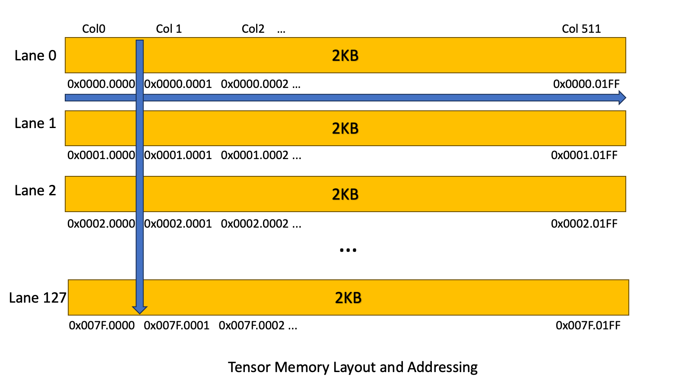
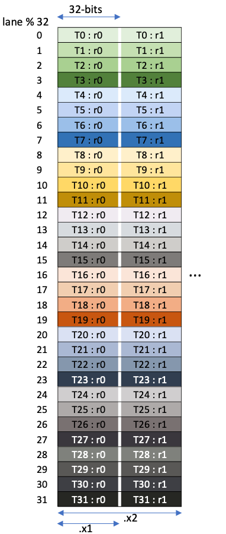

# tcgen05

[https://docs.nvidia.com/cuda/parallel-thread-execution/index.html#tensorcore-5th-generation-instructions]

## TMEM

第 5 th 代 TensorCore 具有专用于 TensorCore 操作的片上内存，称为张量内存。该张量内存被组织为一个二维矩阵，水平行称为 lane，垂直列称为 column。

在架构 sm_100a / sm_100f 上，第 5 th 代 TensorCore 的张量内存在每个 CTA 中具有 512 列和 128 行的二维结构，每个单元为 32 位。

## 张量内存寻址

张量内存地址为 32 位宽，指定两个分量: Lane index 和 Column index。Lane index 位于地址的高 16 位，Column index 位于地址的低 16 位。

布局如下：

31 16

15 0

Lane index | Column index



## 张量内存分配

张量内存为动态分配。张量内存必须由一个 CTA 中的单个 warp 使用张量内存分配和管理指令进行分配。

张量内存的分配与释放以列为单位进行。分配的单元是 32 列，且被分配的列数必须为 2 的幂。当分配一列时，该列的全部 128 个 lane 都会被分配。

在内核中分配的所有 Tensor Memory，必须在内核退出前显式释放。

## 矩阵和数据移动形状

涉及两种形状：数据移动操作中的形状和 MMA 操作中的形状。

### 矩阵形状

矩阵乘加操作支持对操作数矩阵 A 、 B 和 D 的有限集合的形状。所有三个矩阵操作数的形状由元组 MxNxK 共同描述，其中 A 为 MxK 矩阵， B 为 KxN 矩阵， D 为 MxN 矩阵。

下表整理自 NVIDIA PTX ISA 9.3 的 [Table 42：Various combinations of `.kind` and shapes](https://docs.nvidia.com/cuda/parallel-thread-execution/index.html#tcgen05-kind-shapes)。这里只保留 Dense MMA；Sparse MMA 的 K 维度和形状约束不在本文展开。表中的 `M`、`N`、`K` 对应 `MxNxK`。

#### `.kind::f16`

支持以下类型组合：

- `dtype = .f16`，`atype/btype = .f16`
- `dtype = .f32`，`atype/btype = .f16` 或 `.bf16`

指令示例：

```ptx
tcgen05.mma.cta_group::1.kind::f16
    [%d_tmem], %a_desc, %b_desc, %idesc,
    {%p0, %p1, %p2, %p3}, %p_use_d;
```

| `.ws` | CTA group | M | N | K | 状态 |
| --- | ---: | --- | --- | ---: | --- |
| No | 1 | 64、128 | 8～256，步长 8 | 16 | Valid |
| No | 2 | 128、256 | 16～256，步长 16 | 16 | Valid |
| Yes | 1 | 32、64、128 | 64、128、256 | 16 | Valid |
| Yes | 2 | — | — | — | Invalid |

#### `.kind::tf32`

类型组合：`dtype = .f32`，`atype/btype = .tf32`。

指令示例：

```ptx
tcgen05.mma.cta_group::1.kind::tf32
    [%d_tmem], %a_desc, %b_desc, %idesc,
    {%p0, %p1, %p2, %p3}, %p_use_d;
```

| `.ws` | CTA group | M | N | K | 状态 |
| --- | ---: | --- | --- | ---: | --- |
| No | 1 | 64、128 | 8～256，步长 8 | 8 | Valid |
| No | 2 | 128、256 | 16～256，步长 16 | 8 | Valid |
| Yes | 1 | 32、64、128 | 64、128、256 | 8 | Valid |
| Yes | 2 | — | — | — | Invalid |

#### `.kind::f8f6f4`

类型组合：

- `dtype = .f32` 或 `.f16`
- `atype/btype = .e4m3`、`.e5m2`、`.e2m3`、`.e3m2` 或 `.e2m1`

指令示例：

```ptx
tcgen05.mma.cta_group::1.kind::f8f6f4
    [%d_tmem], %a_desc, %b_desc, %idesc,
    {%p0, %p1, %p2, %p3}, %p_use_d;
```

| `.ws` | CTA group | M | N | K | 状态 |
| --- | ---: | --- | --- | ---: | --- |
| No | 1 | 64、128 | 8～256，步长 8 或 16 | 32 | Valid |
| No | 2 | 128、256 | 16～256，步长 16 | 32 | Valid |
| Yes | 1 | 32、64、128 | 64、128、256 | 32 | Valid |
| Yes | 2 | — | — | — | Invalid |

#### `.kind::mxf8f6f4`

类型组合：

- `dtype = .f32`
- `atype/btype = .e4m3`、`.e5m2`、`.e2m3`、`.e3m2` 或 `.e2m1`
- Scale 类型为 `.ue8m0`

指令示例（`block32`）：

```ptx
tcgen05.mma.cta_group::1.kind::mxf8f6f4.block_scale.block32
    [%d_tmem], %a_desc, %b_desc, %idesc,
    [%sfa_tmem], [%sfb_tmem], %p_use_d;
```

| `.ws` | CTA group | M | N | K | 状态 |
| --- | ---: | --- | --- | ---: | --- |
| No | 1 | 128 | 8～256，步长 8 | 32 | Valid |
| No | 2 | 128、256 | 16～256，步长 16 | 32 | Valid |
| Yes | 1 或 2 | — | — | — | Invalid |

#### `.kind::i8`

类型组合：`dtype = .s32`，`atype/btype = .s8` 或 `.u8`。

指令示例：

```ptx
tcgen05.mma.cta_group::1.kind::i8
    [%d_tmem], %a_desc, %b_desc, %idesc,
    {%p0, %p1, %p2, %p3}, %p_use_d;
```

| `.ws` | CTA group | M | N | K | 状态 |
| --- | ---: | --- | --- | ---: | --- |
| No | 1 | 64、128 | 8、16、24、32；之后步长 16，最大 256 | 32 | Valid |
| No | 2 | 128、256 | 32～256，步长 32 | 32 | Valid |
| Yes | 1 | 32、64、128 | 64、128、256 | 32 | Valid |
| Yes | 2 | — | — | — | Invalid |

#### `.kind::mxf4`

类型组合：`dtype = .f32`，`atype/btype = .e2m1`，Scale 类型为 `.ue8m0`。

指令示例（MXFP4，`block32`）：

```ptx
tcgen05.mma.cta_group::1.kind::mxf4.block_scale.block32
    [%d_tmem], %a_desc, %b_desc, %idesc,
    [%sfa_tmem], [%sfb_tmem], %p_use_d;
```

| `.ws` | CTA group | M | N | K | 状态 |
| --- | ---: | --- | --- | ---: | --- |
| No | 1 | 128 | 8～256，步长 8 | 64 | Valid |
| No | 2 | 128、256 | 16～256，步长 16 | 64 | Valid |
| No | 2 | 256 | 16～256，步长 16 | 96[^k96] | Valid（限特定架构） |
| Yes | 1 或 2 | — | — | — | Invalid |

#### `.kind::mxf4nvf4`

类型组合：`dtype = .f32`，`atype/btype = .e2m1`，Scale 类型为 `.ue8m0` 或 `.ue4m3`。

指令示例（NVFP4：`.ue4m3` scale + `block16`）：

```ptx
tcgen05.mma.cta_group::1.kind::mxf4nvf4.block_scale.block16
    [%d_tmem], %a_desc, %b_desc, %idesc,
    [%sfa_tmem], [%sfb_tmem], %p_use_d;
```

| `.ws` | CTA group | M | N | K | 状态 |
| --- | ---: | --- | --- | ---: | --- |
| No | 1 | 128 | 8～256，步长 8 | 64 | Valid |
| No | 2 | 128、256 | 16～256，步长 16 | 64 | Valid |
| No | 2 | 256 | 16～256，步长 16 | 96[^k96] | Valid（限特定架构） |
| Yes | 1 或 2 | — | — | — | Invalid |

以上示例中的 `%d_tmem`、`%sfa_tmem` 和 `%sfb_tmem` 是 TMEM 地址；`%a_desc` 和 `%b_desc` 是 SMEM descriptor；`%idesc` 编码 MMA 的 M/N、输入类型和 accumulator 类型。`%p_use_d` 控制是否读取原有 D accumulator。示例只展示 operand 结构，不能脱离相应的寄存器声明、descriptor 构造和同步代码单独汇编。

### 指定矩阵形状

M 和 N 可在指令描述符中指定。如果对于某个给定的 MMA 变体支持多个 K 值，则可以显式指定 K。否则，如果如表 42 所示 K 可被唯一确定，则不能显式指定 K。

### 数据移动形状

数据移动形状表示要从 Tensor Memory 移入或移出的数据维度。这些形状描述为一个元组 lane x size ，其中：lane 表示 Tensor Memory 中的行数；size 表示 Tensor Memory 中按列计算的数据量，单位为比特 (b)。

下列形状由各种 tcgen05 操作支持：

| Shape（形状） | `tcgen05.<op>` |
|--------------|----------------|
| `.16x64b`, `.16x128b`, `.16x256b`, `.16x32bx2`, `.32x32b` | `.ld` / `.st` |
| `.4x256b`, `.32x128b`, `.64x128b`, `.128x256b`, `.128x128b` | `.cp` |
| `.31x256b` (implicit), `.31x256b` (显式) | `.shift` |

### 内存布局

下面展示了矩阵片段在 warp 线程间的布局。

|  | `tcgen05.ld.sync.aligned.32x32b.x<num>.b32 r, [taddr];` <br> `tcgen05.ld.sync.aligned.32x32b.x<num>.b32 r, [taddr];` <br> `<num>` 是图中的下面的标志，例子： <br> `tcgen05.ld.sync.aligned.32x32b.x2.b32 {r0, r1}, [taddr];` <br> `tcgen05.st.sync.aligned.32x32b.x2.b32 [taddr], {r0, r1};` |
| --- | --- |


