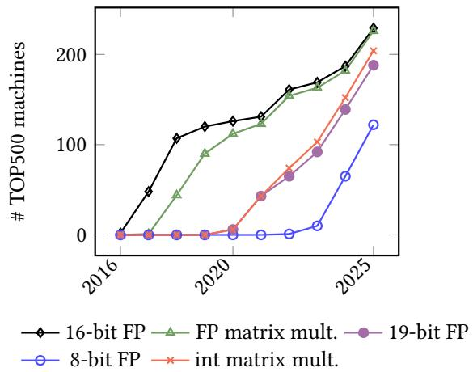
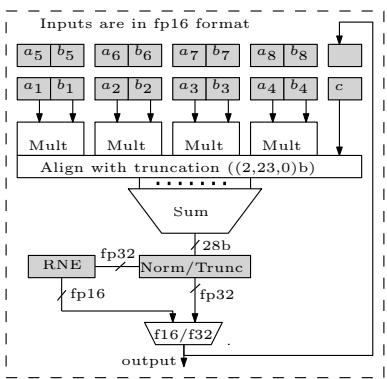
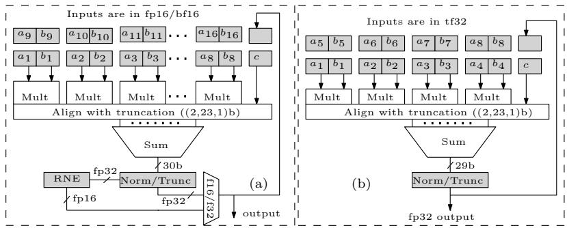
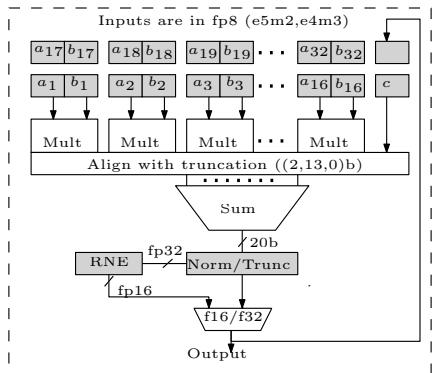
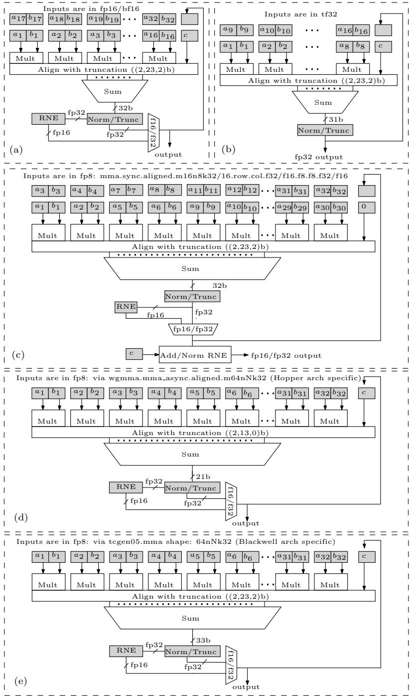
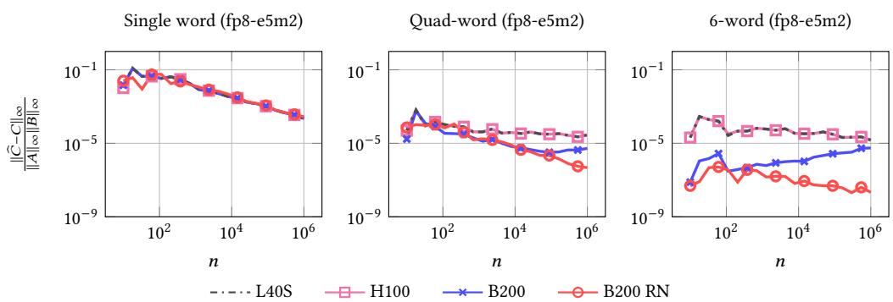
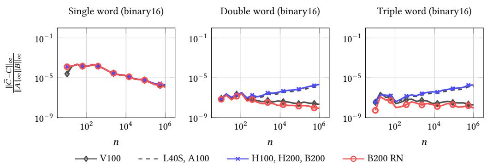
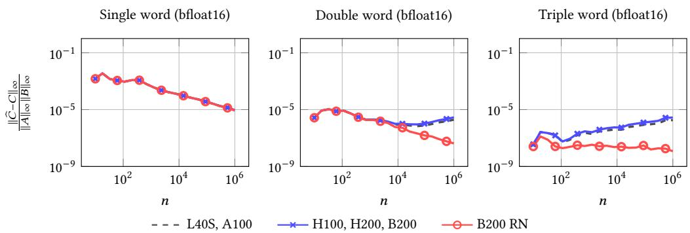

# Accurate Models of NVIDIA Tensor Cores

> **作者**：Faizan A. Khattak、Mantas Mikaitis，英国利兹大学计算机科学学院  
> **软件**：MATLAB Tensor Core v0.5，<https://github.com/northnumerical-computing/MATLAB-tensor-core>  
> **整理说明**：本段对应原文第 1–300 行；重点保留数值模型、GPU 型号、公式和图表数据。

矩阵乘法是神经网络训练和推理的基础操作，GPU 通过硬件矩阵乘法器提高吞吐。由于这些单元也被广泛用于科学计算，数值行为就变得重要：面向 AI 的矩阵乘加并不总是符合 IEEE 754，各厂商和不同 GPU 代际可能得到不同结果。

本文针对 V100、A100、H100 和 B200 等数据中心 GPU，在 8、16、19 位浮点输入格式上建立内积行为的 bit-accurate 软件模型。作者先用能触发位级差异的测试向量确定数值特征，再用包含随机 10 元素输入向量的半穷举比较，将模型输出与真实 GPU 结果反复对照，直到达到 bit-accurate。模型可用于验证测试向量、研究混合精度算法，并支持 MATLAB 中任意尺寸高精度矩阵乘的多字模拟。

## 1. 引言

现代 GPU 通常包含用于加速 GEMM 的 Tensor Core/Matrix Core。除神经网络外，它们还用于 Fourier 变换、波束形成、MR 图像重建、有限元模拟和高精度稠密矩阵乘模拟。低精度浮点格式（8、6、4 位）已在 AMD 和 NVIDIA GPU 中普遍可用，但硬件矩阵乘法器并不统一遵循 IEEE 754。

*图 1. 2025 年 11 月 TOP500 中支持低精度浮点格式及低/混合精度矩阵乘的机器数量。*

Tensor Core 不完全遵守 IEEE 754，主要原因是每个 FMA 都进行完整归一化和舍入的成本很高。影响矩阵乘结果的特征包括：多项浮点加法的归一化点、不同阶段的舍入模式、block FMA 大小、乘积尾数对齐时使用的额外 guard bits，以及累加器宽度。

这些未文档化的特征会影响科学计算的可复现性和误差分析。将其抽象成 bit-accurate 行为模型，可以在没有专有硬件的情况下研究架构，并分析数据中心 GPU 上科学应用的数值稳定性。对于 LLM 推理，不同 GPU 的矩阵乘数值行为也可能导致输出差异；软件模型可用于受控复现和修改这些差异。

### 1.1 既有工作

已有研究用手工或定理证明器构造特殊输入向量，以推断 AMD、NVIDIA GPU 的舍入、非规格化数、累加器等特征。这些方法依赖预先假设的特征空间：若某个真实硬件特征不在假设空间内，就不会生成能够发现它的测试。

本文用随机化测试补充这一不足：将模型预测与真实硬件在输入集合上的输出对比，发现原假设之外的行为，并把新发现反馈给模型。该思路延续 1980 年代测试 IEEE 754 合规性的 Paranoia 软件，也与 GPU/FPGA Paranoia 项目相呼应。

### 1.2 贡献

作者将此前的广义测试向量方法应用于 V100、A2、A30、A40、A100、H100、H200、L40S、Ada RTX 1000、RTX PRO 6000 和 B200，共建立 40 个模型，并首次覆盖多种 FP8 格式。

**表 1. 本文建立模型的 NVIDIA GPU。**

| GPU | 架构 | SM Compute Capability |
|---|---|---:|
| V100 | Volta | 70 |
| A100、A30 | Ampere | 80 |
| A40、A2 | Ampere | 86 |
| L40S、RTX 1000 | Ada Lovelace | 89 |
| H100、GH200 | Hopper | 90 |
| B200 | Blackwell | 100 |
| RTX PRO 6000 | Blackwell | 120 |

模型通过九种 GPU 的输出反复比较，迭代发现初始测试遗漏的特征。MATLAB 工具箱还提供可定制 Tensor Core 模型，允许用户指定精度、舍入模式和内部精度。实现结合定点运算与 CPFloat 自定义浮点模拟器 [10]，并示范任意尺寸高精度矩阵乘的多字模拟。

核心贡献：

- 确定上述 GPU 的 Tensor Core 数值特征，并用架构图精确表达。
- 构建与 GPU 输出随机化验证的 MATLAB 仿真模型。
- 提供可以自由配置舍入模式和内部精度的定制模型。
- 展示这些模型在低层 kernel 和多字矩阵乘中的使用。

**表 2. Blackwell 支持的浮点格式。**

| 格式 | 有效精度（含隐含位） | 最小正规正数 | 最大正数 |
|---|---:|---:|---:|
| binary64/fp64 | 53 | $2^{-1022}$ | $\sim1.798\times10^{308}$ |
| binary32/fp32 | 24 | $2^{-126}$ | $\sim3.403\times10^{38}$ |
| tf19 | 11 | $2^{-126}$ | $\sim3.401\times10^{38}$ |
| bfloat16/bf16 | 8 | $2^{-126}$ | $\sim3.389\times10^{38}$ |
| binary16/fp16 | 11 | $2^{-14}$ | 65504 |
| fp8-E4M3 | 4 | $2^{-6}$ | 448 |
| fp8-E5M2 | 3 | $2^{-14}$ | 57344 |
| fp6-E2M3 | 4 | $2^0$ | 7.5 |
| fp6-E3M2 | 3 | $2^{-2}$ | 28 |
| fp4-E2M1 | 2 | $2^0$ | 6 |

## 2. 符号与定义

本文将 fp8 统称 fp8-E4M3 或 fp8-E5M2，fp16 表示 IEEE binary16，bf16 表示 bfloat16，tf19 表示 TensorFloat32，fp32 和 fp64 分别表示 IEEE binary32 和 binary64。

给定 $A\in\mathbb{R}^{m\times k}$、$B\in\mathbb{R}^{k\times n}$，MMA 产生：

$$
D=AB+C\in\mathbb{R}^{m\times n}.
$$

单个输出元素可写成内积：

$$
d_{ij}=\sum_{\ell=1}^{k}a_{i\ell}b_{\ell j}+c_{ij}.
$$

省略下标后：

$$
d=\sum_{\ell=1}^{k}a_\ell b_\ell+c
=\sum_{\ell=1}^{k}p_\ell+c.\tag{1}
$$

硬件通常使用多项浮点加法器：先按指数对齐乘积有效数，再通过压缩器或加法树求和，最后进行一次归一化和舍入。一次同时加入的乘积项数量称为 block fused multiply-accumulate 大小 $N_{\mathrm{FMA}}$。例如 A100 的 fp16 Tensor Core 有 $N_{\mathrm{FMA}}=8$，即 $p_1+\cdots+p_8+c$ 只做一次归一化和舍入。

定义 $n_{\mathrm{eab}}$ 为超出输出精度的额外对齐/guard bits 数。V100 的累加采用 fp32 的 23 个小数位，因此 $n_{\mathrm{eab}}=0$。文中还使用 HMMA、QMMA、DMMA、QGMMA、UTCHMMA 和 UTCQMMA 等 CUDA/PTX 术语，分别表示矩阵乘加、FP8 矩阵乘加、FP64 矩阵乘加、warp-group FP8 矩阵乘加以及 Blackwell 的统一 Tensor Core 指令。

## 3. 方法

### 3.1 广义数值特征测试（GNFT）

GNFT 使用精心设计的表达式生成能够触发位级差异的测试向量 [2]。例如，要判断 fp16 是否支持输入非规格化数，可令 $|a_1|<2^{-14}$、$b_1=1$，其他元素均为 0；若输出非零，则表明支持该类输入。令 $a_1=2^{-14}$、$b_1=2^{-1}$，则可测试正规数运算是否能产生非规格化结果。

该方法不需要针对每种格式重新手工推导常数或运行无上界定理证明器，而是使用统一表达式对 11 种 NVIDIA GPU 变体确定初始数值特征。

### 3.2 输入空间搜索方法（ISSM）

确定初始特征后，作者构建软件模型，并在随机输入集合上比较模型和真实 GPU 输出。输入向量覆盖不同指数范围、非规格化区域、舍入边界和累加器值。随机化测试可以发现 GNFT 未覆盖的硬件行为，因此形成“模型—随机测试—修正”的反馈循环。

### 3.3 矩阵乘法器模型的近似与迭代细化

模型将内积拆成乘积生成、有效数对齐、block FMA 加法、累加和最终舍入等阶段。每个阶段都用可配置的内部精度、guard bits、归一化点和舍入模式描述。模型输出与 GPU 对比后，针对不匹配样本增加或调整数值特征，重复测试直到随机输入达到 bit-level 一致。

## 4. 结果：主要 GPU 模型特征

### 4.1 Ampere、Ada、Hopper 与 Blackwell

Ampere/Ada 的 fp16/bf16/tf19 路径通常使用 24 个小数位左右的乘积对齐，并根据架构采用不同的 $N_{\mathrm{FMA}}$。H100/H200 在 fp16/bf16 输入下使用 2 个额外对齐位，累加对齐宽度约为 27 bit，fp16/bf16 的 $N_{\mathrm{FMA}}=16$。Hopper 的 fp8 可通过 `wgmma.mma_async` 直接映射 QGMMA，拥有 13 个小数位和 $N_{\mathrm{FMA}}=32$；通过普通 `mma.sync.aligned` 时，fp8 先转为 fp16，并使用 HMMA。

B200 的 fp16/bf16/tf19 行为与 H100/H200 相同。通过 `tcgen05.mma.cta_group::1/2::kind` 访问第五代 Tensor Core：`kind=f16` 映射 UTCHMMA，`kind=tf32` 支持 tf19，`kind=f8f6f4` 覆盖 fp8/fp6/fp4。B200 的原生 fp8 路径有 25 个小数位、$N_{\mathrm{FMA}}=32$，SASS 映射为 UTCQMMA；普通 `mma.sync.aligned` 仍会先转 fp16 并映射 HMMA。

*图 4. L40S 与 Ada RTX 1000 fp8 输入路径的内积模型。*

RTX PRO 6000 同样是第五代 Tensor Core，但其 fp8 输入通过 `mma.sync.aligned` 访问，并映射为 QMMA，而不是 B200 的 UTCQMMA。

*图 5. H100/H200/B200 Tensor Core 内积模型：fp16/bf16、tf19、普通 `mma.sync` 的 fp8、Hopper 的 `wgmma` fp8，以及 Blackwell 第五代 fp8 路径。fp64 遵循 IEEE 754 FMA，图中未画出。*

**表 3. 不同 NVIDIA Tensor Core 的数值特征汇总。**

| 输入→输出 | GPU | 对齐/累加精度 | $N_{\mathrm{FMA}}$ | 最终舍入 |
|---|---|---|---:|---|
| fp8→fp32 | B200、RTX PRO | 25 个小数位 | 32 | 截断 |
| fp8→fp32 | H100、H200 | 13 个小数位 | 32 | 截断 |
| fp8→fp32 | L40S、Ada RTX 1000 | 13 个小数位 | 16 | 截断 |
| fp16/bf16→fp32 | H100/H200/B200/RTX PRO | 25 个小数位 | 16 | 截断 |
| fp16/bf16→fp32 | A100/A2/A30 | 24 个小数位 | 8 | 截断 |
| fp16/bf16→fp32 | V100 | 23 个小数位 | 4 | 截断 |
| tf19→fp32 | H100/H200/B200/RTX PRO | 25 个小数位 | 8 | 截断 |
| tf19→fp32 | A100/A2/A30 | 24 个小数位 | 4 | 截断 |
| fp64→fp64 | H100/H200/B200/RTX PRO/A100 | IEEE FMA | 1 | IEEE |

注：模型支持输入/输出非规格化数；fp16 输入到 fp16 输出支持 RNE。乘积在对齐和累加阶段保持非归一化，表中的额外对齐位计入乘积精度。

### 4.2 软件模型与 GPU 结果的比较

为确认模型与硬件 bit-equivalent，作者使用多组随机输入集合。每个集合从独立均匀分布采样 A、B 和 C；内积长度 $k$ 由指令支持的矩阵形状决定，不一定等于硬件的 $N_{\mathrm{FMA}}$。bf16/tf19 使用 $N_{\mathrm{ens}}=10^7$ 的多个集合，分别覆盖 $\pm2^{15}$ 的常规范围、避免溢出的扩展范围，以及乘积落入非规格化区的极小值范围。

**表 4. CUDA/PTX 指令到 SASS 的映射。**

| 输入 | CUDA/PTX | GPU | SASS |
|---|---|---|---|
| fp8 | `mma.sync.aligned.m16n8k32` | H100/H200/B200 | HMMA.16816 |
| fp8 | 同上 | RTX PRO | QMMA.16832 |
| fp8 | 同上 | L40S/Ada RTX 1000 | QMMA.16816 |
| fp8 | `wgmma.mma_async` | H100/H200 | QGMMA.16832 |
| fp8 | `tcgen05.mma` | B200 | UTCQMMA |
| fp16/bf16 | WMMA | H100/H200/B200/RTX PRO | HMMA.16816 |
| fp16/bf16 | `tcgen05.mma.kind=f16` | B200 | UTCHMMA |
| tf19 | WMMA | H100/H200/B200 | HMMA.1684 |
| tf19 | `tcgen05.mma.kind=tf32` | B200 | UTCHMMA |
| fp64 | WMMA | H100/H200/B200/RTX PRO/A100 | DMMA.884 |

普通 `wgmma` 是 Hopper 专用，`tcgen05.mma` 是 Blackwell 数据中心 GPU 专用。通过对比九块 GPU 的随机输出，模型可进一步发现初始 GNFT 未覆盖的特征并迭代修正。
N _ {\mathrm{ens}} = 1 0 ^ {7}, a _ {\mathrm{min}} = b _ {\mathrm{min}} = c _ {\mathrm{min}} = - 2 ^ {7}, a _ {\mathrm{max}} = b _ {\mathrm{max}} = c _ {\mathrm{max}} = 2 ^ {7}
$$

$$
\mathrm{(b)} N _ {\mathrm{ens}} = 1 0 ^ {7}, a _ {\mathrm{min}} = b _ {\mathrm{min}} = - 2 ^ {1 5}, a _ {\mathrm{max}} = b _ {\mathrm{max}} = 2 ^ {1 5}, c _ {\mathrm{min}} = - 2 ^ {1 0 0}, c _ {\mathrm{max}} = 2 ^ {1 0 0}
$$

$$
(c) N _ {\mathrm{ens}} = 1 0 ^ {7}, a _ {\mathrm{min}} = b _ {\mathrm{min}} = - 2 ^ {- 1 5}, a _ {\mathrm{max}} = b _ {\mathrm{max}} = 2 ^ {- 1 5}, c _ {\mathrm{min}} = - 2 ^ {- 1 2 6}, c _ {\mathrm{max}} = 2 ^ {- 1 2 6}
$$

Similar to the bf16 and tf19 case, these three cases test fp16 and fp8-e5m2 in normal and subnormal regions. 

• In fp8-e4m3 input format, for which $L = 3 2 ,$ , we have 

$$
N _ {\mathrm{ens}} = 1 0 ^ {7}, a _ {\mathrm{min}} = b _ {\mathrm{min}} = - 2 ^ {7}, a _ {\mathrm{max}} = b _ {\mathrm{max}} = 2 ^ {7}, c _ {\mathrm{min}} = - 2 ^ {1 0 0}, c _ {\mathrm{max}} = 2 ^ {1 0 0}
$$

$$
N _ {\mathrm{ens}} = 1 0 ^ {7}, a _ {\mathrm{min}} = b _ {\mathrm{min}} = - 2 ^ {- 6}, a _ {\mathrm{max}} = b _ {\mathrm{max}} = 2 ^ {- 6}, c _ {\mathrm{min}} = - 2 ^ {- 1 2 6}, c _ {\mathrm{max}} = 2 ^ {- 1 2 6}
$$

• In bf16 format, we generate an extended ensemble with $k = 1 6$ for Ampere, Hopper, and Blackwell GPUs with $N _ { \mathrm { e n s } } = 1 0 ^ { 8 } , a _ { \mathrm { m i n } } = b _ { \mathrm { m i n } } = - 2 ^ { 6 3 } , a _ { \mathrm { m a x } } = b _ { \mathrm { m a x } } = 2 ^ { 6 3 } , c _ { \mathrm { m i n } } = - 2 ^ { 1 2 2 }$ $c _ { \operatorname* { m a x } } = 2 ^ { 1 2 2 }$ . This setup enables testing of the model across all possible output categories, including Inf, NaN, normal, and subnormal values. 

(2) $N _ { \mathrm { e n s } } = 1 0 ^ { 5 }$ samples drawn via Algorithm 2 from a normal distribution in all input formats. 

• Test vectors to evaluate behaviour for ±Inf and NaN inputs. 

• Scenarios where $c = 0 ,$ or where some or all partial products are zero. 

• Extreme dynamic range cases, e.g., $c = \pm 2 ^ { 1 2 7 }$ with products $- 2 ^ { - 1 2 6 } \leq p _ { i } \leq 2 ^ { - 1 2 6 }$ , and vice versa. 

• Subnormal cases, with ?? = 0 or a subnormal value in fp32 format and $p _ { i } \in [ - 2 ^ { - 1 2 6 } , 2 ^ { - 1 2 6 } ]$ 

• Cases where partial products exceed $2 ^ { 1 2 8 }$ , but the final sum is less than $2 ^ { 1 2 8 }$ 

• Mixed input configurations involving zero, normal, subnormal, and special values. 

• Choose ??, ??, and ?? such dot product generates the maximum number of carries during accumulation (see [2]). 

Algorithm 2 Ensemble generation psuedo-code for randomized testing of tensor core models
1: Choose k as per input format and GPU model
2: mt19937 rng(0) % Mersenne Twister with seed 0
3: choose $N_{ens}$ , $a_{min}$ , $a_{max}$ , $b_{min}$ , $b_{max}$ , $c_{min}$ , $c_{max}$ 4: for i = 1 : $N_{ens}$ do
5: $a_{\ell} \stackrel{\text{i.i.d.}}{\sim} \mathcal{U}(a_{\text{min}}, a_{\text{max}})$ , $\ell = 1, \ldots, k$ 6: $b_{\ell} \stackrel{\text{i.i.d.}}{\sim} \mathcal{U}(b_{\text{min}}, b_{\text{max}})$ , $\ell = 1, \ldots, k$ 7: $c \stackrel{\text{i.i.d.}}{\sim} \mathcal{U}(c_{\text{min}}, c_{\text{max}})$ 8: end for 

For the hardware execution, WMMA API, mma.sync, wgmma.mma_async, and tcgen05.mma instructions were invoked in CUDA. To further verify that tensor cores were active, the cuobjdump tool was used to inspect the compiled binary and confirm the presence of HMMA, QMMA, QGMMA, UTCHMMA, UTCQMMA, DMMA instructions. Finally, we note that DMMA operations are not modelled or tested via randomized testing, nor are they included in the model package, since, as reported by Fasi et al. [9], they behave as sequential FMAs and are fully IEEE compliant. Therefore, one can directly rely on MATLAB’s built-in fma command to emulate the behaviour of DMMA. 

For Ada GPUs, CUDA toolkit 12.9 was used, while for all other GPUs, we used CUDA toolkit 12.8, while the GCC version for Ada GPUs and B200 was 14.2.0, and 13.1.0, respectively, while for remaining GPUs, it was 11.5.0. 

### 4.2.1 模型迭代细化

模型从 GNFT 得到初始特征后，按“比较—定位—修正—再比较”迭代。每轮随机输入集合都与真实 GPU 输出对照；若出现不匹配，作者分析触发该差异的指数范围、舍入边界或累加顺序，并在模型中加入相应特征。迭代直到测试集合中不再出现差异。

### 4.3 MATLAB 模型示例

MATLAB Tensor Core 工具箱提供统一接口，可选择 GPU 架构、输入/输出格式、$N_{\mathrm{FMA}}$、额外对齐位、舍入模式和归一化方式。用户可以使用默认 GPU 模型，也可以通过修改参数实例化定制 Tensor Core。

模型将乘积生成、多项对齐、累加、最终舍入拆为可读的 MATLAB 函数，便于验证测试向量和开展误差分析。

### 4.4 与既有模型比较

**表 5. 本文与既有工作的数值特征比较。**

| 特征 | 既有模型 | 本文模型 |
|---|---|---|
| 输入格式 | fp16、bf16、tf19、fp8 | 覆盖全部 NVIDIA 支持格式 |
| 测试方式 | 针对特征的手工向量 | GNFT + 随机输入空间搜索 |
| 隐藏特征发现 | 受预设特征空间限制 | 可通过随机失配反馈发现 |
| GPU 覆盖 | 少量架构 | V100、Ampere、Ada、Hopper、Blackwell |
| 验证方式 | 典型向量 | $10^5$–$10^7$ 级随机 ensemble |

随机化测试显示，本文模型对 GPU 输出的失配率显著低于只依据少量测试向量构建的模型；对没有直接硬件访问的架构，模型也可先作为预测器，待获得设备后再验证。

## 5. 用多字算法在 Tensor Core 上模拟高精度 GEMM

多字算法将一个高精度数拆成多个低精度 word，再用 Tensor Core 进行多次矩阵乘，最后组合为高精度结果。作者在 MATLAB 中复现实验，比较 V100、A100、H100/H200、B200、L40S 以及采用 RNE 舍入的定制 B200 模型。

**表 6. 本文与既有 Tensor Core 模型相对 GPU 输出的 ensemble 失配率。**

| 模型 | 输入 | 输出 | 主要结果 |
|---|---|---|---|
| V100 | fp8/fp16/bf16 | fp32 | 与 V100 输出 bit-accurate |
| A100 | fp8/fp16/bf16 | fp32 | 与 A100 输出 bit-accurate |
| H100/H200 | fp8/fp16/bf16 | fp32 | 普通 `mma.sync` 与 `wgmma` 路径分别建模 |
| B200 | fp8/fp16/bf16 | fp32 | 区分 `mma.sync`、`tcgen05` 和 UTCQMMA |
| L40S/Ada | fp8/fp16/bf16 | fp32 | 13 对齐小数位，$N_{\mathrm{FMA}}=16$ |

*图 6. 使用 fp8-e5m2 多字拆分时，不同 Tensor Core 模型相对 MATLAB binary64 GEMM 的无穷范数误差。*

*图 7. 使用 fp16 多字拆分时的相对矩阵乘误差。*

*图 8. 使用 bf16 多字拆分时的相对矩阵乘误差。*

图 6–8 表明，L40S/H100 的 fp8 路径只有 13 个累加小数位（$n_{\mathrm{eab}}=-10$），因此误差高于拥有 25 个小数位（$n_{\mathrm{eab}}=2$）的 B200。将 B200 的最终舍入从截断改为 RNE 后，误差还会进一步下降。fp16 和 bf16 的结果则主要受 word 数和累加器内部精度影响。

## 6. 结论

本文为 V100、A100、H100、H200、L40S、Ada、RTX PRO 6000 和 B200 Tensor Core 建立了可执行的 MATLAB 数值模型。GNFT 负责定位舍入、对齐、归一化和 block FMA 特征；随机输入空间搜索负责发现预设特征空间之外的行为并验证 bit-level 一致性。

模型能够帮助研究者在没有目标 GPU 时预验证测试向量，解释不同代 GPU 的数值差异，并设计混合精度及多字高精度 GEMM。对 B200，普通 `mma.sync` 的 fp8 输入可能先转为 fp16，而 `tcgen05` 的 `f8f6f4` 路径使用 UTCQMMA；这类指令级差异必须在数值模型中显式区分。

## 7. 致谢

感谢所有提供 GPU 测试资源和模型验证支持的研究人员。MATLAB Tensor Core 软件随论文开源。
## References

[1] 2026. Interim Report on Binary Floating-point Formats for Machine Learning. Technical Report. https://github.com P3109/Public/blob/main/IEEE%20WG%20P3109%20Interim%20Report%20v3.2.1.pdf Version 3.2.1. 

[2] Faizan A. Khattak and Mantas Mikaitis. 2025. Generalized Methodology for Determining Numerical Features of Hardware Floating-Point Matrix Multipliers: Part I. In 2025 IEEE High Performance Extreme Computing Conference (HPEC). Wakefield, MA, USA. doi:10.1109/HPEC67600.2025.11196657 

[3] AMD. 2025. Datasheet: AMD Instrinct MI355X GPU. https://www.amd.com/content/dam/amd/en/documents/instincttech-docs/product-briefs/amd-instinct-mi355x-gpu-brochure.pdf 

[4] Pierre Blanchard, Nicholas J. Higham, Florent Lopez, Theo Mary, and Srikara Pranesh. 2020. Mixed Precision Block Fused Multiply-Add: Error Analysis and Application to GPU Tensor Cores. SIAM Journal on Scientific Computing 42, 3 (2020), C124–C141. doi:10.1137/19M1289546 

[5] NVIDIA Corporation. 2025. CUDA Binary Utilities, Release 13.1. https://docs.nvidia.com/cuda/pdf/CUDA_Binary_ Utilities.pdf 

[6] DeepSeek-AI. 2025. DeepSeek-V3 Technical Report. arXiv:2412.19437 https://arxiv.org/abs/2412.19437 

[7] Jack Dongarra, John Gunnels, Harun Bayraktar, Azzam Haidar, and Dan Ernst. 2025. Accelerating Supercomputing: AI-Hardware-Driven Innovation for Speed and Eficiency. In 2025 IEEE High Performance Extreme Computing Conference (HPEC). 1–7. doi:10.1109/HPEC67600.2025.11196413 

[8] Sultan Durrani, Muhammad Saad Chughtai, Mert Hidayetoglu, Rashid Tahir, Abdul Dakkak, Lawrence Rauchwerger, Fareed Zafar, and Wen-mei Hwu. 2021. Accelerating Fourier and Number Theoretic Transforms using Tensor Cores and Warp Shufles. In 2021 30th International Conference on Parallel Architectures and Compilation Techniques (PACT) 345–355. doi:10.1109/PACT52795.2021.00032 

[9] Massimiliano Fasi, Nicholas J. Higham, Mantas Mikaitis, and Srikara Pranesh. 2021. Numerical behavior of NVIDIA tensor cores. PeerJ Computer Science 7 (2021), e330. doi:10.7717/peerj-cs.330 

[10] Massimiliano Fasi and Mantas Mikaitis. 2023. CPFloat: A C Library for Simulating Low-Precision Arithmetic. ACM Trans. Math. Softw. 49, 2, Article 18 (June 2023), 32 pages. doi:10.1145/3585515 

[11] Boyuan Feng, Yuke Wang, Guoyang Chen, Weifeng Zhang, Yuan Xie, and Yufei Ding. 2021. EGEMM-TC: accelerating scientific computing on tensor cores with extended precision. In Proceedings of the 26th ACM SIGPLAN Symposium on Principles and Practice of Parallel Programming (Virtual Event, Republic of Korea) (PPoPP ’21). Association for Computing Machinery, New York, NY, USA, 278–291. doi:10.1145/3437801.3441599 

[12] Odd Erik Gundersen, Kevin Coakley, Christine Kirkpatrick, and Yolanda Gil. 2023. Sources of Irreproducibility in Machine Learning: A Review. arXiv:2204.07610 [cs.LG] https://arxiv.org/abs/2204.07610 

[13] Azzam Haidar, Harun Bayraktar, Stanimire Tomov, Jack Dongarra, and Nicholas J. Higham. 2020. Mixed-precision iterative refinement using tensor cores on GPUs to accelerate solution of linear systems. Proceedings of the Royal Society A: Mathematical, Physical and Engineering Sciences 476, 2243 (2020), 20200110. doi:10.1098/rspa.2020.0110 

[14] Brian Hickmann and Dennis Bradford. 2019. Experimental Analysis of Matrix Multiplication Functional Units. In 2019 IEEE 26th Symposium on Computer Arithmetic (ARITH). 116–119. doi:10.1109/ARITH.2019.00031 

[15] Brian Hickmann, Jieasheng Chen, Michael Rotzin, Andrew Yang, Maciej Urbanski, and Sasikanth Avancha. 2020. Intel Nervana Neural Network Processor-T (NNP-T) Fused Floating Point Many-Term Dot Product. In 2020 IEEE 27th Symposium on Computer Arithmetic (ARITH). 133–136. doi:10.1109/ARITH48897.2020.00029 

[16] Nicholas J. Higham and Theo Mary. 2022. Mixed Precision Algorithms in Numerical Linear Algebra. Acta Numerica 31 (May 2022), 347–414. doi:10.1017/s0962492922000022 

[17] Karl E. Hillesland and Anselmo Lastra. 2004. GPU Floating-Point Paranoia. In ACM Workshop on General-Purpose Computing on Graphics Processors (GP ). ACM, Los Angeles, CA, USA. 

[18] 2019. IEEE Standard for Floating-Point Arithmetic, IEEE Std 754-2019 (revision of IEEE Std 754-2008). Institute of Electrica and Electronics Engineers, Piscataway, NJ, USA. 82 pages. doi:10.1109/IEEESTD.2019.8766229 

[19] Intel Corporation. 2018. BFLOAT16—Hardware Numerics Definition. Available at https://software.intel.com/enus/download/bfloat16-hardware-numerics-definition (accessed 15 July 2020). White paper. Document number 338302-001US.. 

[20] Aaron Jarmusch, Nathan Graddon, and Sunita Chandrasekaran. 2025. Dissecting the NVIDIA Blackwell Architecture with Microbenchmarks. arXiv:2507.10789 [cs.DC] https://arxiv.org/abs/2507.10789 

[21] Himanshu Kaul, Mark Anders, Sanu Mathew, Seongjong Kim, and Ram Krishnamurthy. 2019. Optimized Fused Floating-Point Many-Term Dot-Product Hardware for Machine Learning Accelerators. In 2019 IEEE 26th Symposium on Computer Arithmetic (ARITH). 84–87. doi:10.1109/ARITH.2019.00021 

[22] Binrui Li, Shenggan Cheng, and James Lin. 2021. tcFFT: Accelerating Half-Precision FFT through Tensor Cores. arXiv:2104.11471 [cs.DC] https://arxiv.org/abs/2104.11471 

[23] Xinyi Li, Ang Li, Bo Fang, Katarzyna Swirydowicz, Ignacio Laguna, and Ganesh Gopalakrishnan. 2024. FTTN: Feature-Targeted Testing for Numerical Properties of NVIDIA & AMD Matrix Accelerators. In 2024 IEEE 24th International Symposium on Cluster, Cloud and Internet Computing (CCGrid). 39–46. doi:10.1109/CCGrid59990.2024.00014 

[24] Tianjian Lu, Thibault Marin, Yue Zhuo, Yi-Fan Chen, and Chao Ma. 2020. Accelerating MRI Reconstruction on TPUs. In 2020 IEEE High Performance Extreme Computing Conference (HPEC). 1–9. doi:10.1109/HPEC43674.2020.9286192 

[25] S. Markidis, S. W. D. Chien, E. Laure, I. B. Peng, and J. S. Vetter. 2018. NVIDIA Tensor Core Programmability, Performance & Precision. In Proceedings of the 32nd IEEE International Parallel and Distributed Processing Symposium Workshops. Vancouver, BC, Canada, 522–531. doi:10.1109/IPDPSW.2018.00091 

[26] Theo Mary and Mantas Mikaitis. 2025. Error Analysis of Matrix Multiplication with Narrow Range Floating-Point Arithmetic. SIAM J. Sci. Comput. 47, 4 (2025), B785–B800. doi:10.1137/24M1685109 

[27] Paulius Micikevicius, Stuart Oberman, Pradeep Dubey, Marius Cornea, Andres Rodriguez, Ian Bratt, Richard Grisen thwaite, Norm Jouppi, Chiachen Chou, Amber Hufman, Michael Schulte, Ralph Wittig, Dharmesh Jani, and Sum mer Deng. 2023. OCP 8-bit Floating Point Specitication (OFP8). Technical Report. Open Compute Project. https: //www.opencompute.org/documents/ocp-8-bit-floating-point-specification-ofp8-revision-1-0-2023-12-01-pdf-1 Revi sion 1.0. 

[28] Mantas Mikaitis. 2024. Monotonicity of Multi-Term Floating-Point Adders. IEEE Trans. Comput. 73, 6 (Feb. 2024), 1531–1543. doi:10.1109/TC.2024.3371783 

[29] NVIDIA. 2017. NVIDIA Tesla V100 GPU architecture. https://images.nvidia.com/content/volta-architecture/pdf/voltaarchitecture-whitepaper.pdf 

[30] NVIDIA. 2025. NVIDIA Blackwell Architecture Technical Brief. https://resources.nvidia.com/en-us-blackwellarchitecture 

[31] Leon Oostrum, Bram Veenboer, Ronald Rook, Michael Brown, Pieter Kruizinga, and John W. Romein. 2025. The Tensor-Core Beamformer: A High-Speed Signal-Processing Library for Multidisciplinary Use. In 2025 IEEE International Parallel and Distributed Processing Symposium (IPDPS). 582–592. doi:10.1109/IPDPS64566.2025.00058 

[32] Hiroyuki Ootomo and Rio Yokota. 2022. Recovering single precision accuracy from Tensor Cores while surpassing the FP32 theoretical peak performance. The International Journal of High Performance Computing Applications 36, 4 (June 2022), 475–491. doi:10.1177/10943420221090256 

[33] Louis Pisha and Łukasz Ligowski. 2021. Accelerating Non-Power-Of-2 Size Fourier Transforms with GPU Tensor Cores. In Proceedings of the 2021 IEEE International Parallel and Distributed Processing Symposium. Portland, OR, USA, 507–516. doi:10.1109/IPDPS49936.2021.00059 

[34] Bita Darvish Rouhani, Nitin Garegrat, Tom Savell, Ankit More, Kyung-Nam Han, Ritchie Zhao, Mathew Hall, Jasmine Klar, Eric Chung, Yuan Yu, Michael Schulte, Ralph Wittig, Ian Bratt, Nigel Stephens, Jelena Milanovic, John Brothers, Pradeep Dubey, Marius Cornea, Alexander Heinecke, Andres Rodriguez, Martin Langhammer, Summer Deng, Maxim Naumov, Paulius Micikevicius, Michael Siu, and Colin Verrilli. 2023. OCP Microscaling Formats (MX) Specification. 16 pages. https://www.opencompute.org/documents/ocp-microscaling-formats-mx-v1-0-spec-final-pdf Version 1.0. 

[35] N. L. Schryer. 1981. A Test of a Computer’s Floating-Point Arithmetic Unit. Technical Report Computer Science Technica Report 89. AT&T Bell Laboratories, Murray Hill, NJ, Murray Hill, NJ 07974. 

[36] Xuan You Tan, David Boland, and George Constantinides. 2012. FPGA Paranoia: Testing Numerical Properties of FPGA Floating Point IP-Cores. In Reconfigurable Computing: Architectures, Tools and Applications, Oliver C. S. Choy, Ray C. C. Cheung, Peter Athanas, and Kentaro Sano (Eds.). Springer Berlin Heidelberg, Berlin, Heidelberg, 290–301. 

[37] Michela Taufer, Omar Padron, Philip Saponaro, and Sandeep Patel. 2010. Improving numerical reproducibility and stability in large-scale numerical simulations on GPUs. In 2010 IEEE International Symposium on Parallel & Distributed Processing (IPDPS). 1–9. doi:10.1109/IPDPS.2010.5470481 

[38] Alexandre F. Tenca. 2009. Multi-operand Floating-Point Addition. In 2009 19th IEEE Symposium on Computer Arithmetic. 161–168. doi:10.1109/ARITH.2009.27 

[39] Jiqun Tu, Ian Karlin, John Camier, Veselin Dobrev, Tzanio Kolev, Stefan Henneking, and Omar Ghattas. 2026. Accelerating High-Order Finite Element Simulations at Extreme Scale with FP64 Tensor Cores. arXiv:2603.09038 [cs.DC] https://arxiv.org/abs/2603.09038 

[40] Benjamin Valpey, Xinyi Li, Sreepathi Pai, and Ganesh Gopalakrishnan. 2025. An SMT Formalization of Mixed-Precision Matrix Multiplication. In NASA Formal Methods. Springer Nature Switzerland, Cham, 360–379. 

[41] Jiayi Yuan, Hao Li, Xinheng Ding, Wenya Xie, Yu-Jhe Li, Wentian Zhao, Kun Wan, Jing Shi, Xia Hu, and Zirui Liu. 2025. Understanding and Mitigating Numerical Sources of Nondeterminism in LLM Inference. In Advances in Neural Information Processing Systems, D. Belgrave, C. Zhang, H. Lin, R. Pascanu, P. Koniusz, M. Ghassemi, and N. Chen (Eds.), Vol. 38. Curran Associates, Inc., 169819–169851. https://proceedings.neurips.cc/paper_files/paper/2025/file f80094a824ba5912d4a2de169c404a40-Paper-Conference.pdf 
