# Can Tensor Cores Benefit Memory-Bound Kernels? (No!)

> **论文作者**：Lingqi Zhang、Jiajun Huang、Sheng Di、Satoshi Matsuoka、Mohamed Wahib  
> **单位**：RIKEN 计算科学中心、加州大学河滨分校、美国阿贡国家实验室  
> **整理说明**：本段对应原文第 1–300 行；保留作者的论证顺序、公式、实验数据与图像引用。

## 摘要

Tensor Core 是 GPU 中用于加速稠密矩阵运算的专用处理单元，在深度学习训练等计算受限应用中已取得显著效率提升。研究者因此尝试把 Tensor Core 扩展到内存受限 kernel。近期工作声称，即使主要瓶颈不是计算，Tensor Core 也能超过传统 CUDA Core。

本文通过理论和实证分析质疑这一结论。理论分析表明，在双精度内存受限 kernel 上，Tensor Core 相对 CUDA Core 的最大加速比只有 1.33×（针对 V100、A100 和 H100）。作者使用 STREAM Scale、SpMV 和 stencil 三类代表性 kernel 验证这一上限，并指出：仅把内存受限 kernel 改写为 Tensor Core 版本，不能带来可靠的性能改进。

## 1. 引言

NVIDIA 于 2017 年在 Volta 架构中引入 Tensor Core [6]，此后研究覆盖稠密线性代数 [4]、稀疏线性代数 [10, 24] 和谱方法 [9, 27]。Tensor Core 的低精度计算能力带来了混合精度算法 [12, 16]、精度恢复 [25, 26, 31] 等方法，但针对 Tensor Core 基本性能的系统分析仍然有限，只有少数工作进行过微基准测试 [1, 17, 29]。

Tensor Core 虽然是强大的加速工具，但有效使用它必须先理解其性能特征。本文聚焦于 HPC 中占很大比例的内存受限 kernel [3]，试图回答两个问题：

- Tensor Core 用于内存受限 kernel 时，理论性能上限是多少？
- 当前 Tensor Core 实现策略是否真的能让内存受限 kernel 受益？

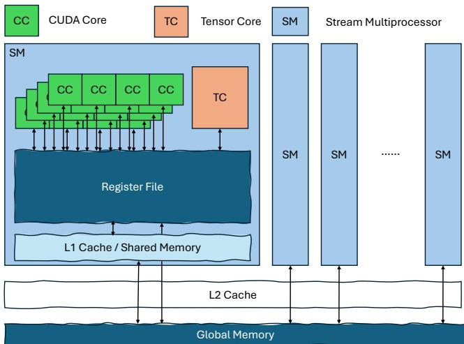

*图 1. NVIDIA GPU 的内存层次。*

本文贡献如下：

1. 对内存受限 kernel 上的 Tensor Core 性能进行完整理论分析。
2. 在代表性内存受限 kernel 上，将 Tensor Core 实现与 CUDA Core 实现进行实证对比。

全文结构如下：第 2 节介绍背景；第 3 节介绍研究的内存受限工作负载；第 4 节分析完全重叠和完全不重叠两种极端情况，以建立 Tensor Core 的性能边界；第 5 节通过代表性 kernel 验证理论结论；最后总结关键发现。

## 2. 背景

### 2.1 Tensor Core

Tensor Core 是集成在现代 NVIDIA GPU 流式多处理器（SM）中的专用脉动阵列矩阵引擎 [8]，与传统 CUDA Core 并行工作。两类单元都遵循 GPU 内存层次：数据先从全局内存加载到寄存器文件，再由 CUDA Core 或 Tensor Core 访问并计算。图 1 展示了不同内存层次及其关系。

### 2.2 机器平衡

机器平衡（machine balance，$\mathbb{B}$）[20] 定义为峰值计算性能（$\mathbb{P}$）与内存带宽（$\mathbb{B}$）之比：

$$
\mathbb{B}=\frac{P}{B}\tag{1}
$$

### 2.3 Roofline 模型

Roofline 模型 [23, 30] 使用算术强度（$\mathbb{I}$）预测可达到的性能上限。算术强度是计算工作量（$\mathbb{W}$）与内存流量（$\mathbb{Q}$）之比：

$$
\mathbb{I}=\frac{\mathbb{W}}{\mathbb{Q}}\tag{2}
$$

可达到性能为：

$$
\mathbb{P}=\min(P,B\times\mathbb{I})\tag{3}
$$

这个模型可以帮助识别系统瓶颈和性能上限。

### 2.4 Roofline 模型中的 Tensor Core

由于 Tensor Core 和 CUDA Core 共享内存层次，并且受 Dark Silicon Effect 影响而不能同时运行，Tensor Core 可以在 Roofline 图中表现为 CUDA Core 基线之上的另一条性能上限。这一抽象与已有研究 [32] 一致。

### 2.5 机器平衡与 Roofline 模型的关系

算术强度描述 kernel 的计算密度，机器平衡描述硬件计算能力与内存带宽的比值。二者决定 kernel 主要受计算还是内存访问限制：

$$
\text{kernel}=
\begin{cases}
\text{计算受限},&\mathbb{I}>\mathbb{B}\\
\text{内存受限},&\mathbb{I}<\mathbb{B}
\end{cases}\tag{4}
$$

机器平衡是 GH200 和 A100-80GB Roofline 曲线的拐点，对应从内存受限转向计算受限的区域。

## 3. 内存受限工作负载

本文研究三类代表性 kernel：SCALE（第 3.1 节）、稀疏矩阵—向量乘（SpMV，第 3.2 节）和 stencil（第 3.3 节）。分析主要采用双精度，数据大小记为 $\mathbb{D}=8$ bytes；同样的方法也可推广到低精度。

### 3.1 SCALE

SCALE 是 STREAM benchmark [19] 中的一个操作：

$$
a_i=q b_i,\quad \forall i\in\{1,\ldots,n\},\quad a,b\in\mathbb{R}^{n},\ q\in\mathbb{R}\tag{5}
$$

每个元素需要一次 load、一次 store 和一次计算，因此：

$$
\mathbb{W}(\mathrm{SCALE})=1,\qquad
\mathbb{Q}(\mathrm{SCALE})=2\times\mathbb{D},\qquad
\mathbb{I}(\mathrm{SCALE})=\frac{1}{16}.
$$

由于计算强度很低，STREAM 常被用于测量可持续内存带宽。

### 3.2 稀疏矩阵—向量乘（SpMV）

SpMV 的算术强度取决于稀疏格式。先以稠密 GEMV 为基线：

$$
y=Ax,\quad A\in\mathbb{R}^{m\times n},\ x\in\mathbb{R}^{n},\ y\in\mathbb{R}^{m}\tag{6}
$$

GEMV 的计算量为 $2mn$，内存流量为 $(mn+m+n)\mathbb{D}$，所以：

$$
\mathbb{I}(\mathrm{GEMV})
=\frac{2mn}{(mn+m+n)\mathbb{D}}
\approx\frac{2}{\mathbb{D}}=\frac14.\tag{7}
$$

对于非零元数量 $\operatorname{nnz}(A)\ll mn$ 的稀疏矩阵：

$$
y=Ax,\quad
A\in\mathbb{R}^{m\times n},\quad
x\in\mathbb{R}^{n},\quad
y\in\mathbb{R}^{m}.\tag{8}
$$

SpMV 的计算量为 $2\operatorname{nnz}(A)$，其内存流量还包括坐标信息或打包值，因此：

$$
\mathbb{I}(\mathrm{SpMV})
=\frac{2\operatorname{nnz}(A)}
{(\operatorname{nnz}(A)+m+n)\mathbb{D}+\alpha\mathbb{I}+\beta\mathbb{Z}}.\tag{9}
$$

因为 $\operatorname{nnz}(A)\ll mn$，所以 $\mathbb{I}(\mathrm{SpMV})<\mathbb{I}(\mathrm{GEMV})$。

以最常用的 CSR 为例，它需要存储列索引和行指针：

$$
\mathbb{I}(\mathrm{SpMV,CSR})
=\frac{2\operatorname{nnz}(A)}
{(\operatorname{nnz}(A)+m+n)\mathbb{D}
+(\operatorname{nnz}(A)+m+1)\mathbb{I}}
\approx\frac{2}{\mathbb{D}+\mathbb{I}}
=\frac16<\mathbb{I}(\mathrm{GEMV}).\tag{10}
$$

该分析确认 SpMV 的内存受限特性，与已有研究 [14, 33] 一致。

### 3.3 迭代 stencil

Stencil 是 HPC 中的常见计算 [11]。二维 stencil 可写为：

$$
v(i,j)=\sum_{(p,q)\in\mathbb{S}}w_{p,q}\cdot u(i+p,j+q)\tag{11}
$$

其中 $v(i,j)$ 和 $u(i,j)$ 分别是位置 $(i,j)$ 的更新值和原始值，$\mathbb{S}$ 是相对偏移集合；五点 stencil 的偏移为 $(−1,0),(1,0),(0,1),(0,−1),(0,0)$。理想情况下，每个点只需一次 load 和一次 store：

$$
\mathbb{Q}=2\mathbb{D},\qquad
\mathbb{W}=2|\mathbb{S}|,\qquad
\mathbb{I}=\frac{|\mathbb{S}|}{\mathbb{D}}.\tag{12}
$$

对于 2d5pt stencil，$|\mathbb{S}|=5$，因此 $\mathbb{I}=5/8$。时间阻塞（temporal blocking）[18, 34] 将 $t$ 个时间步组合起来：

$$
\mathbb{W}_t=t\times2|\mathbb{S}|,\qquad
\mathbb{I}_t=t\times\frac{|\mathbb{S}|}{\mathbb{D}}.\tag{13}
$$

时间阻塞理论上可以通过提高算术强度，把内存受限 stencil 转为计算受限，但实际存在硬件限制。对 GH200 而言，$\mathbb{B}_{GH200}=9.99$；要进入计算受限区，需要：

$$
t\times\mathbb{I}(2d5pt)>\mathbb{B}_{GH200}
\Rightarrow t\times0.625>9.99
\Rightarrow t>15.98.\tag{14}
$$

然而，深层时间阻塞（例如 $t>16$）通常会受到寄存器压力限制 [18, 34]。因此，浅层时间阻塞（$t<16$）下的 2d5pt stencil 仍然内存受限，而深层时间阻塞可能使 stencil kernel 转而受寄存器限制。

## 4. 理论分析

根据第 3 节的算术强度分析，图 2 表明所有研究 kernel 在 GH200 上都是内存受限，在 A100 上大多数也是内存受限。为简化讨论，作者假设这些 kernel 都是吞吐受限的。

计算时间和内存访问时间分别为：

$$
T_{\mathrm{cmp}}=\frac{\mathbb{W}}{P},\qquad
T_{\mathrm{mem}}=\frac{\mathbb{Q}}{B}.
$$

因此：

$$
\frac{T_{\mathrm{mem}}}{T_{\mathrm{cmp}}}
=\frac{\mathbb{Q}/B}{\mathbb{W}/P}
=\frac{\mathbb{B}}{\mathbb{I}}.\tag{15}
$$

对于内存受限 kernel，$\mathbb{B}>\mathbb{I}$，所以：

$$
T_{\mathrm{mem}}>T_{\mathrm{cmp}}.\tag{16}
$$

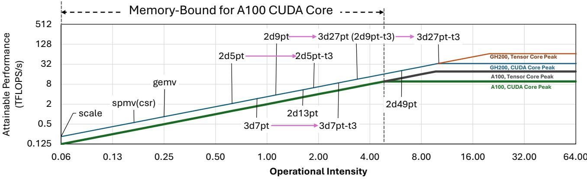

*图 2. GH200 和 A100-80GB GPU 的 Roofline 模型示例。*

作者分析内存访问与计算完全重叠和完全不重叠两种极端情况。

### 4.1 完全重叠

图 3 展示了重叠 kernel 的时间分解。对于内存受限 kernel：

$$
T=\max(T_{\mathrm{cmp}},T_{\mathrm{mem}},T_{\mathrm{others}})
=\max(T_{\mathrm{mem}},T_{\mathrm{others}}).\tag{17}
$$

其中 $T_{\mathrm{mem}}$、$T_{\mathrm{cmp}}$、$T_{\mathrm{others}}$ 和 $T$ 分别表示内存访问、计算、其他操作和总时间。在这种情况下，减少计算时间不会改变总运行时间。

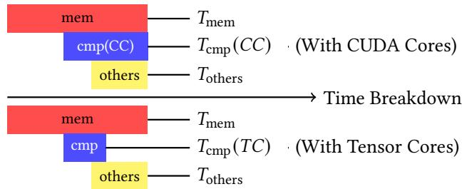

*图 3. 完全重叠 kernel 的时间分解。*

### 4.2 完全不重叠

对于完全不重叠的 kernel（图 4）：

$$
T=T_{\mathrm{cmp}}+T_{\mathrm{mem}}+T_{\mathrm{others}}.\tag{18}
$$

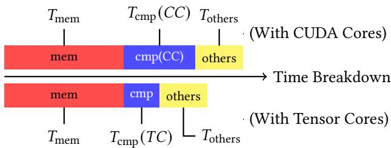

*图 4. 完全不重叠 kernel 的时间分解。*

**表 1. 实验平台规格。**

| 指标 | A100-80GB | GH200 |
|---|---:|---:|
| CUDA 版本 | 12.1 | 12.6 |
| L2 缓存（MB） | 40 | 50 |
| 内存带宽（TB/s） | 1.94 | 4.00 |
| CUDA Core FP64 峰值（TFLOPS） | 9.7 | 34.0 |
| Tensor Core FP64 峰值（TFLOPS） | 19.5 | 67.0 |

假设 Tensor Core 带来 $\alpha=P(TC)/P(CC)>1$ 的计算加速，则：

$$
T'_{\mathrm{cmp}}(TC)=\frac1\alpha T_{\mathrm{cmp}}(CC).
$$

对应的总加速比为：

$$
\mathrm{Speedup}
=\frac{T(CC)}{T(TC)}
=\frac{T_{\mathrm{cmp}}(CC)+T_{\mathrm{mem}}+T_{\mathrm{others}}}
{\frac1\alpha T_{\mathrm{cmp}}(CC)+T_{\mathrm{mem}}+T_{\mathrm{others}}}\tag{19}
$$

$$
=1+\frac{\alpha-1}
{1+\alpha\frac{T_{\mathrm{mem}}+T_{\mathrm{others}}}{T_{\mathrm{cmp}}(CC)}}\tag{20}
$$

$$
=1+\frac{\alpha-1}
{1+\alpha\frac{T_{\mathrm{cmp}}(CC)\frac{\mathbb{B}}{\mathbb{I}}+T_{\mathrm{others}}}
{T_{\mathrm{cmp}}(CC)}}\tag{21}
$$

$$
<1+\frac{\alpha-1}{1+\alpha(\mathbb{B}/\mathbb{I})}.\tag{22}
$$

**Tensor Core 上界。** 对内存受限 kernel，$T_{\mathrm{cmp}}<T_{\mathrm{mem}}$，因此：

$$
\mathrm{Speedup}
<1+\frac{\alpha-1}{1+\alpha}
=2-\frac{2}{1+\alpha}.\tag{23}
$$

当 FP64 GPU 的 $\alpha=2$ 时，加速比小于 1.33×；即使 $\alpha\to\infty$，该上界也不会超过 2×。

**工作负载上界。** 在假设 $\alpha\to\infty$ 时：

$$
\mathrm{Speedup}<1+\frac{\mathbb{I}}{\mathbb{B}}.\tag{24}
$$

例如，GEMV 的算术强度约为 0.25，因此其上界低于 1.05×。

### 4.3 小结

上述分析覆盖了内存与计算重叠的两个极端。现实 kernel 通常只存在部分重叠，因此双精度加速比应介于 1× 和 1.33× 之间。若观测到更高的性能差异，必须来自内存访问优化；作者认为，由于 Tensor Core 和 CUDA Core 都通过寄存器文件访问数据（见图 1），这些内存优化同样适用于两类计算单元。

## 5. 实证分析

本节通过多种硬件平台验证前述 Tensor Core 理论。实验系统比较 Tensor Core 与 CUDA Core 在内存受限 kernel 上的实现。

### 5.1 SCALE

**Tensor Core 实现。** 受工作 [22] 启发，作者将 SCALE 写成矩阵乘：

$$
A=B(qI),
$$

其中 $I$ 是单位矩阵，如图 5 所示。但该实现只使用 Tensor Core 计算能力的 $1/\max(m,n)$。A100 和 H100 的双精度 Tensor Core 形状为 8×4，因此只使用约 1/8 的计算能力：A100 约为 2.4 TFLOPS/s，GH200 约为 8.37 TFLOPS/s，低于 CUDA Core 性能。然而，由于 SCALE 的算术强度极低，这不会显著影响有无重叠时的 kernel 性能。

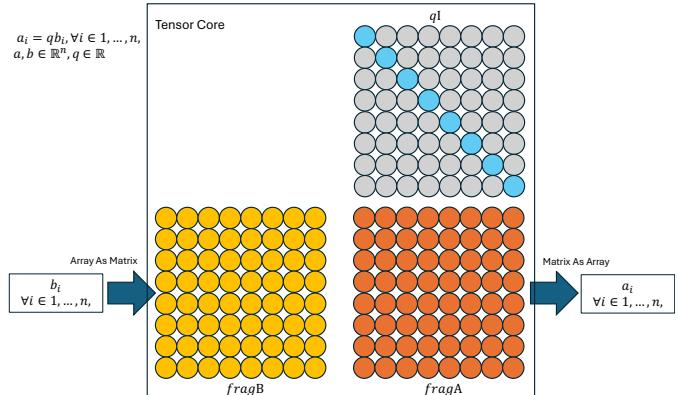

*图 5. Tensor Core 的 SCALE 实现。*

**CUDA Core 实现。** CUDA Core 基线使用 ChatGPT 生成的 STREAM 实现，仅增加了预热迭代。

### 5.2 SpMV

作者使用 DASP 研究 [15] 中的 21 个代表性稀疏矩阵进行评测（表 2）。

- **DASP（Tensor Core）**：这是当前先进的 Tensor Core SpMV 实现，按行长度将矩阵分为 long、middle 和 small 三类，并为各类采用专门策略；middle 行还会进行排序。
- **cuSPARSE CSR（CUDA Core）**：带重排的格式（例如 SELL-C-σ [13]）可能更直接，但排序会改变矩阵特征并使性能分析复杂化 [2]，因此作者选择广泛使用的 cuSPARSE CSR 作为基线 [21]。

### 5.3 迭代 stencil

Stencil 使用 ConvStencil benchmark suite [5] 评测（表 3）。由于 ConvStencil 和 LoRAStencil 的 Artifact Description/Artifact Evaluation（AD/AE）在 GH200 平台存在 bug，实验仅在 A100 上进行。

ConvStencil [5]（Tensor Core）：ConvStencil 将 stencil 计算转换为矩阵—矩阵乘，并通过 kernel 融合引入时间阻塞。作者采用其默认配置和问题规模进行比较。

LoRAStencil [35]（Tensor Core）：LoRAStencil 使用低秩适配来减少 stencil 的计算冗余。不过，其 artifact evaluation 依赖于对 stencil 权重秩的假设，限制了实际适用性，因此本文采用其公开性能结果。

**表 2. SpMV 基准数据集（来自 DASP [15]，按非零元数量排序）。**

| 编号 | 矩阵 | 行数 | 非零元（NNZ） |
|---|---|---:|---:|
| D1 | dc2 | 116,835 | 766,396 |
| D2 | scircuit | 170,998 | 958,936 |
| D3 | mac_econ_fwd500 | 206,500 | 1,273,389 |
| D4 | conf5_4-8x8-10 | 49,152 | 1,916,928 |
| D5 | mc2depi | 525,825 | 2,100,225 |
| D6 | rma10 | 46,835 | 2,374,001 |
| D7 | cop20k_A | 121,192 | 2,624,331 |
| D8 | webbase-1M | 1,000,005 | 3,105,536 |
| D9 | ASIC_680k | 682,862 | 3,871,773 |
| D10 | cant | 62,451 | 4,007,383 |
| D11 | pdb1HYS | 36,417 | 4,344,765 |
| D12 | consph | 83,334 | 6,010,480 |
| D13 | shipsec1 | 140,874 | 7,813,404 |
| D14 | mip1 | 66,463 | 10,352,819 |
| D15 | pwtk | 217,918 | 11,634,424 |
| D16 | Si41Ge41H72 | 185,639 | 15,011,265 |
| D17 | in-2004 | 1,382,908 | 16,917,053 |
| D18 | Ga41As41H72 | 268,096 | 18,488,476 |
| D19 | eu-2005 | 862,664 | 19,235,140 |
| D20 | FullChip | 2,987,012 | 26,621,990 |
| D21 | circuit5M | 5,558,326 | 59,524,291 |

**表 3. Stencil 基准及问题规模。**

| Stencil | ConvStencil（域规模，时间阻塞深度） | Brick | EBISU |
|---|---|---|---|
| 2d5pt | $10240^2(3)$ | — | $9000^2(3)$ |
| 2d13pt | $10240^2(1)$ | — | $9000^2(1)$ |
| 2d9pt | $10240^2(3)$ | — | $9000^2(3)$ |
| 2d49pt | $10240^2(1)$ | — | $9000^2(1)$ |
| 3d7pt | $1024^3(3)$ | $512^3(1)$ | $234\times312\times2560(3)$ |
| 3d27pt | $1024^3(3)$ | $512^3(1)$ | $234\times312\times2560(3)$ |

Brick [36]（CUDA Core）是没有时间阻塞的 CUDA Core 基线，采用默认配置。EBISU [34]（CUDA Core）是带时间阻塞的先进 CUDA Core 实现；为公平比较，其时间阻塞参数与 ConvStencil 对齐。

### 5.4 性能评估

图 6、图 7 和图 8 分别比较 SCALE、SpMV 和 stencil。

- **SCALE**：图 6 显示，Tensor Core 相比 CUDA Core 持续但幅度不大的性能下降。由于计算时间差异很小，差距可能来自当前 GPU 上 Tensor Core 使用方式造成的非最优内存访问。
- **SpMV**：当数据集超过 L2 缓存容量时，cuSPARSE（CUDA Core）平均优于 DASP（Tensor Core）。
- **Stencil**：图 8 表明，在优化程度相当时，Tensor Core 实现通常低于 CUDA Core 实现。

**图 6. A100（上）与 GH200（下）上的 SCALE 性能。** 图中给出 CUDA Core 相对 Tensor Core 的加速比几何平均值，并分别报告输入规模大于和小于 L2 缓存一半时的结果。

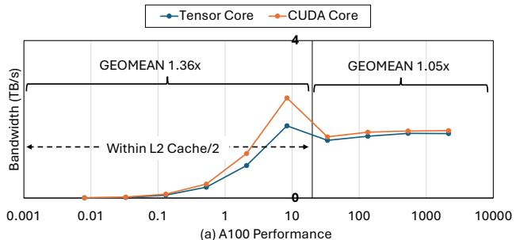

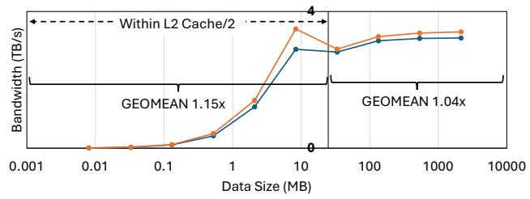

### 5.5 其他观察

**L2 缓存影响。** 两类实现与 L2 缓存的交互并不简单。对 SCALE，在 L2 缓存可容纳的规模内，Tensor Core 的性能下降反而更明显；DASP 则在数据驻留 L2 时性能更好，说明缓存优化十分关键。

**计算受限情况。** 在 A100 上属于计算受限的 2d49pt stencil，其 Tensor Core 与 CUDA Core 性能相近；但在 GH200 上，该 kernel 变为内存受限，此时理论上 CUDA Core 更有优势。

**资源受限情况。** 3D stencil 和高阶 2D stencil 往往受寄存器容量、缓存容量或缓存带宽等资源限制 [34]。Tensor Core 优化只针对计算部分，不能为此类工作负载提供固有优势；实验也没有观察到性能收益。

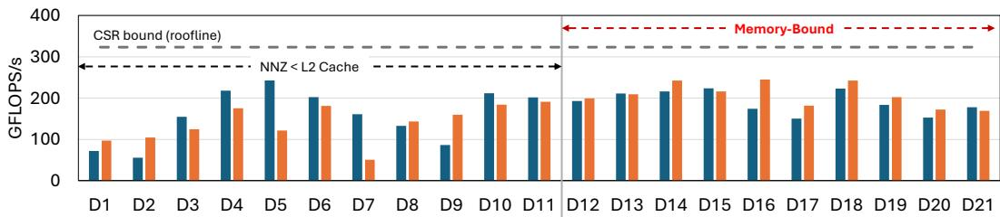

*图 7(a). A100 上 DASP（Tensor Core）与 cuSPARSE（CUDA Core）的 SpMV 性能。*

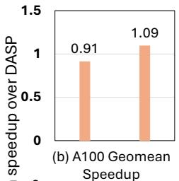

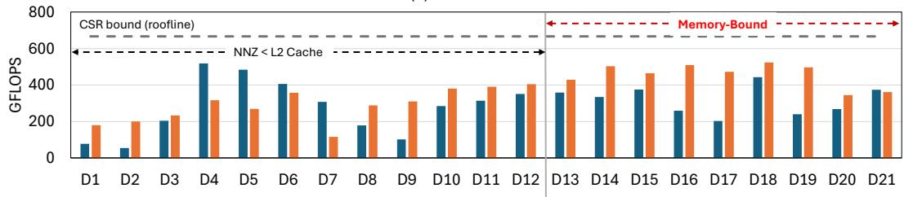

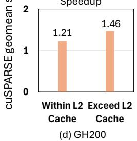

*图 7. A100（上）与 GH200（下）上 cuSPARSE 和 DASP 的 SpMV 对比；左侧报告有效 FLOPS，右侧报告 cuSPARSE 相对 DASP 的几何平均加速比。*

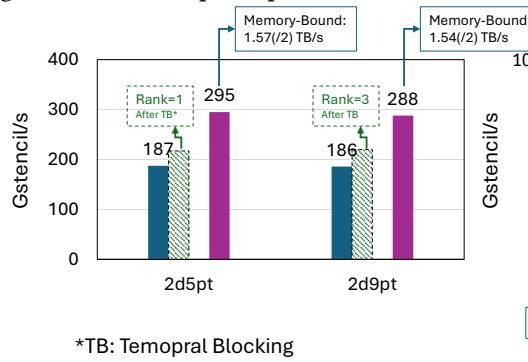

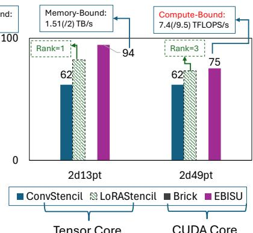

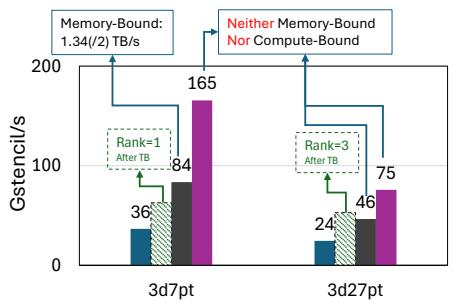

*图 8. A100 上 EBISU、Brick、ConvStencil 和 LoRAStencil 的 stencil 基准对比。LoRAStencil 的性能和假设秩取自其 artifact evaluation。*

## 6. 关键结论

从实践角度，作者强调：

- 先识别 kernel 属于计算受限还是内存受限。
- 对计算受限操作，Tensor Core 仍然有优势。
- 对内存受限 kernel，应优先使用简单且有效的 CUDA Core。
- 应优先优化内存访问，例如采用缓存感知算法、减少内存流量 [33, 34]。
- 在考虑采用 Tensor Core 前，先优化流水线和计算—内存重叠。
- 理论上，双精度内存受限 kernel 的 Tensor Core 加速最多约为 1.33×；即使假设 Tensor Core 计算加速趋于无穷，理论上限也只有 2×。

## 7. 结论

系统的理论和实证分析表明，在内存受限 kernel 中使用 Tensor Core 计算通常不能带来可靠的性能收益。理论分析给出双精度内存受限 kernel 的 1.33× 加速上限；SCALE、SpMV 和 stencil 的实测结果则显示，Tensor Core 实现通常低于对应的 CUDA Core 实现。

这些结果并不否定 Tensor Core 在其他场景中的价值，但说明不能仅凭更高的峰值计算吞吐，就预期内存受限 kernel 会获得同等加速。相关研究仍可为矩阵处理单元的设计与使用提供有价值的经验。

## 致谢

本研究得到美国能源部科学办公室高级科学计算研究（ASCR）支持，项目合同为 DE-AC02-06CH11357 和 DE-SC0024207。
## References

[1] Hamdy Abdelkhalik, Yehia Arafa, Nandakishore Santhi, and Abdel-Hameed A. Badawy. 2022. Demystifying the Nvidia Ampere Archi tecture through Microbenchmarking and Instruction-level Analysis. In 2022 IEEE High Performance Extreme Computing Conference (HPEC). 1–8. htps://doi.org/10.1109/HPEC55821.2022.9926299 

[2] Hartwig Anzt, Stanimire Tomov, and Jack Dongarra. 2014. Implement ing a Sparse Matrix Vector Product for the SELL-C/SELL-C-?? formats on NVIDIA GPUs. University of Tennessee, Tech. Rep. ut-eecs-14-727 (2014). 

[3] Brian Austin, Dhruva Kulkarni, Brandon Cook, Samuel Williams, and Nicholas J Wright. 2024. System-Wide Roofline Profiling-a Case Study on NERSC’s Perlmutter Supercomputer. In PMBS24: The 15th International Workshop on Performance Modeling, Benchmarking, and Simulation of High-Performance Computer Systems. 

[4] Somashekaracharya G. Bhaskaracharya, Julien Demouth, and Vinod Grover. 2020. Automatic Kernel Generation for Volta Tensor Cores. arXiv:2006.12645 [cs.PL] htps://arxiv.org/abs/2006.12645 

[5] Yuetao Chen, Kun Li, Yuhao Wang, Donglin Bai, Lei Wang, Lingxiao Ma, Liang Yuan, Yunquan Zhang, Ting Cao, and Mao Yang. 2024. ConvStencil: Transform Stencil Computation to Matrix Multiplication on Tensor Cores. In Proceedings of the 29th ACM SIGPLAN Annual Symposium on Principles and Practice of Parallel Programming (Edinburgh, United Kingdom) (PPoPP ’24). Association for Computing Machinery, New York, NY, USA, 333–347. htps://doi.org/10.1145/3627535.3638476 

[6] Jack Choquette, Olivier Giroux, and Denis Foley. 2018. Volta: Per formance and Programmability. IEEE Micro 38, 2 (2018), 42–52. htps://doi.org/10.1109/MM.2018.022071134 

[7] Timothy A Davis and Yifan Hu. 2011. The University of Florida sparse matrix collection. ACM Transactions on Mathematical Software (TOMS) 38, 1 (2011), 1–25. 

[8] Jens Domke, Emil Vatai, Aleksandr Drozd, Peng ChenT, Yosuke Oyama, Lingqi Zhang, Shweta Salaria, Daichi Mukunoki, Artur Podobas, Mo hamed WahibT, and Satoshi Matsuoka. 2021. Matrix Engines for High Performance Computing: A Paragon of Performance or Grasping at Straws?. In 2021 IEEE International Parallel and Distributed Processing Symposium (IPDPS). 1056–1065. htps://doi.org/10.1109/IPDPS49936. 2021.00114 

[9] Sultan Durrani, Muhammad Saad Chughtai, Mert Hidayetoglu, Rashid Tahir, Abdul Dakkak, Lawrence Rauchwerger, Fareed Zafar, and Wen mei Hwu. 2021. Accelerating Fourier and Number Theoretic Trans forms using Tensor Cores and Warp Shufles. In 2021 30th International Conference on Parallel Architectures and Compilation Techniques (PACT). 345–355. htps://doi.org/10.1109/PACT52795.2021.00032 

[10] Ruibo Fan, Wei Wang, and Xiaowen Chu. 2024. DTC-SpMM: Bridging the Gap in Accelerating General Sparse Matrix Multiplication with Tensor Cores. In Proceedings of the 29th ACM International Conference on Architectural Support for Programming Languages and Operating Systems, Volume 3 (La Jolla, CA, USA) (ASPLOS ’24). Association for Computing Machinery, New York, NY, USA, 253–267. htps://doi.org 10.1145/3620666.3651378 

[11] Bastian Hagedorn, Larisa Stoltzfus, Michel Steuwer, Sergei Gorlatch, and Christophe Dubach. 2018. High performance stencil code genera tion with lift. In Proceedings of the 2018 International Symposium on Code Generation and Optimization. 100–112. 

[12] Azzam Haidar, Stanimire Tomov, Jack Dongarra, and Nicholas J Higham. 2018. Harnessing GPU tensor cores for fast FP16 arithmetic to speed up mixed-precision iterative refinement solvers. In SC18: International Conference for High Performance Computing, Networking, Storage and Analysis. IEEE, 603–613. 

[13] Moritz Kreutzer, Georg Hager, Gerhard Wellein, Holger Fehske, and Alan R. Bishop. 2014. A Unified Sparse Matrix Data Format for Eficient General Sparse Matrix-Vector Multiplication on Modern Processors with Wide SIMD Units. SIAM Journal on Scientific Computing 36, 5 (2014), C401–C423. htps://doi.org/10.1137/130930352 arXiv:https://doi.org/10.1137/130930352 

[14] Victor W. Lee, Changkyu Kim, Jatin Chhugani, Michael Deisher, Daehyun Kim, Anthony D. Nguyen, Nadathur Satish, Mikhail Smelyanskiy, Srinivas Chennupaty, Per Hammarlund, Ronak Singhal, and Pradeep Dubey. 2010. Debunking the 100X GPU vs. CPU myth: an evaluation of throughput computing on CPU and GPU. SIGARCH Comput. Archit. News 38, 3 (June 2010), 451–460. htps://doi.org/10.1145/1816038. 1816021 

[15] Yuechen Lu and Weifeng Liu. 2023. DASP: Specific Dense Matrix Multiply-Accumulate Units Accelerated General Sparse Matrix-Vector Multiplication. In Proceedings of the International Conference for High Performance Computing, Networking, Storage and Analysis (Denver, CO, USA) (SC ’23). Association for Computing Machinery, New York, NY, USA, Article 73, 14 pages. htps://doi.org/10.1145/3581784.3607051 

[16] Yuechen Lu, Lijie Zeng, Tengcheng Wang, Xu Fu, Wenxuan Li, Helin Cheng, Dechuang Yang, Zhou Jin, Marc Casas, and Weifeng Liu. 2024. Amgt: Algebraic multigrid solver on tensor cores. In 2024 SC24: International Conference for High Performance Computing, Networking, Storage and Analysis SC. IEEE Computer Society, 823–838. 

[17] Weile Luo, Ruibo Fan, Zeyu Li, Dayou Du, Qiang Wang, and Xiaowen Chu. 2024. Benchmarking and Dissecting the Nvidia Hopper GPU Architecture . In 2024 IEEE International Parallel and Distributed Processing Symposium (IPDPS). IEEE Computer Society, Los Alamitos, CA, USA, 656–667. htps://doi.org/10.1109/IPDPS57955.2024.00064 

[18] Kazuaki Matsumura, Hamid Reza Zohouri, Mohamed Wahib, Toshio Endo, and Satoshi Matsuoka. 2020. AN5D: automated stencil framework for high-degree temporal blocking on GPUs. In Proceedings of the 18th ACM/IEEE International Symposium on Code Generation and Optimization (San Diego, CA, USA) (CGO ’20). Association for Computing Machinery, New York, NY, USA, 199–211. htps://doi.org/10. 1145/3368826.3377904 

[19] John D. McCalpin. 1991-2007. STREAM: Sustainable Memory Bandwidth in High Performance Computers. Technical Report. University of Virginia, Charlottesville, Virginia. htp://www. cs.virginia.edu/stream/ A continually updated technical report. http://www.cs.virginia.edu/stream/. 

[20] John D McCalpin et al. 1995. Memory bandwidth and machine balance in current high performance computers. IEEE computer society technical committee on computer architecture (TCCA) newsletter 2, 19-25 (1995). 

[21] Maxim Naumov, L Chien, Philippe Vandermersch, and Ujval Kapasi. 2010. Cusparse library. In GPU Technology Conference, Vol. 12. 

[22] Cristóbal A Navarro, Roberto Carrasco, Ricardo J Barrientos, Javier A Riquelme, and Raimundo Vega. 2020. GPU tensor cores for fast arithmetic reductions. IEEE Transactions on Parallel and Distributed Systems 32, 1 (2020), 72–84. 

[23] Georg Ofenbeck, Ruedi Steinmann, Victoria Caparros, Daniele G Spampinato, and Markus Püschel. 2014. Applying the roofline model. In 2014 IEEE International Symposium on Performance Analysis of Systems and Software (ISPASS). IEEE, 76–85. 

[24] Patrik Okanovic, Grzegorz Kwasniewski, Paolo Sylos Labini, Maciej Besta, Flavio Vella, and Torsten Hoefler. 2024. High Performance Unstructured SpMM Computation Using Tensor Cores. In Proceedings of the International Conference for High Performance Computing, Networking, Storage and Analysis (SC’24) (Atlanta, GA, USA). IEEE Press, 154:1–154:14. htps://doi.org/10.1109/SC41406.2024.00060 

[25] Hiroyuki Ootomo, Katsuhisa Ozaki, and Rio Yokota. 2024. DGEMM on integer matrix multiplication unit. The International Journal of High Performance Computing Applications (2024), 10943420241239588. 

[26] Hiroyuki Ootomo and Rio Yokota. 2022. Recovering single precision accuracy from Tensor Cores while surpassing the FP32 theoretical peak performance. The International Journal of High Performance Computing Applications 36, 4 (2022), 475–491. 

[27] Louis Pisha and Łukasz Ligowski. 2021. Accelerating non-powerof-2 size Fourier transforms with GPU Tensor Cores. In 2021 IEEE International Parallel and Distributed Processing Symposium (IPDPS). 507–516. htps://doi.org/10.1109/IPDPS49936.2021.00059 

[28] Prashant Singh Rawat, Changwan Hong, Mahesh Ravishankar, Vinod Grover, Louis-Noël Pouchet, and P Sadayappan. 2016. Efective resource management for enhancing performance of 2D and 3D stencils on GPUs. In Proceedings of the 9th Annual Workshop on General Purpose Processing using Graphics Processing Unit. 92–102. 

[29] Wei Sun, Ang Li, Tong Geng, Sander Stuijk, and Henk Corporaal. 2023. Dissecting Tensor Cores via Microbenchmarks: Latency, Throughput and Numeric Behaviors. IEEE Transactions on Parallel and Distributed Systems 34, 1 (2023), 246–261. htps://doi.org/10.1109/TPDS.2022. 3217824 

[30] Samuel Williams, Andrew Waterman, and David Patterson. 2009. Roofline: an insightful visual performance model for multicore architectures. Commun. ACM 52, 4 (2009), 65–76. 

[31] Du Wu, Peng Chen, Xiao Wang, Issac Lyngaas, Takaaki Miyajima, Toshio Endo, Satoshi Matsuoka, and Mohamed Wahib. 2024. Real-time High-resolution X-Ray Computed Tomography. In Proceedings of the 38th ACM International Conference on Supercomputing (Kyoto, Japan) (ICS ’24). Association for Computing Machinery, New York, NY, USA, 110–123. htps://doi.org/10.1145/3650200.3656634 

[32] Charlene Yang, Thorsten Kurth, and Samuel Williams. 2020. Hierarchical Roofline analysis for GPUs: Accelerating performance optimization for the NERSC-9 Perlmutter system. Concurrency and Computation: Practice and Experience 32, 20 (2020), e5547. 

[33] Lingqi Zhang, Mohamed Wahib, Peng Chen, Jintao Meng, Xiao Wang, Toshio Endo, and Satoshi Matsuoka. 2023. PERKS: a Locality-Optimized Execution Model for Iterative Memory-bound GPU Applications. In Proceedings of the 37th ACM International Conference on Supercomputing (Orlando, FL, USA) (ICS ’23). Association for Computing Machinery, New York, NY, USA, 167–179. htps://doi.org/10.1145/ 3577193.3593705 

[34] Lingqi Zhang, Mohamed Wahib, Peng Chen, Jintao Meng, Xiao Wang, Toshio Endo, and Satoshi Matsuoka. 2023. Revisiting Temporal Block ing Stencil Optimizations. In Proceedings of the 37th ACM International Conference on Supercomputing (Orlando, FL, USA) (ICS ’23). As sociation for Computing Machinery, New York, NY, USA, 251–263. htps://doi.org/10.1145/3577193.3593716 

[35] Yiwei Zhang, Kun Li, Liang Yuan, Jiawen Cheng, Yunquan Zhang, Ting Cao, and Mao Yang. 2024. LoRAStencil: Low-Rank Adaptation of Stencil Computation on Tensor Cores . In 2024 SC24: International Conference for High Performance Computing, Networking, Storage and Analysis SC. IEEE Computer Society, Los Alamitos, CA, USA, 839–855. htps://doi.org/10.1109/SC41406.2024.00059 

[36] Tuowen Zhao, Protonu Basu, Samuel Williams, Mary Hall, and Hans Johansen. 2019. Exploiting reuse and vectorization in blocked stencil computations on CPUs and GPUs. In Proceedings of the International Conference for High Performance Computing, Networking, Storage and Analysis. 1–44. 
