# 通过微基准剖析 Tensor Core：延迟、吞吐与数值行为

> **作者**：Wei Sun、Ang Li、Tong Geng、Sander Stuijk、Henk Corporaal  
> **来源**：*IEEE Transactions on Parallel and Distributed Systems*，34(1)，2023  
> **整理说明**：本段对应原文第 1–300 行；保留 PTX 指令、实验数值、图像引用和论文结论。

## 摘要

自 Volta 架构以来，Tensor Core 一直是 NVIDIA GPU 中加速融合矩阵乘加（MMA）的重要单元。编程 Tensor Core 通常有两种接口：旧式 `wmma` API 和当前的 `mma` API。`wmma` 更易使用，但只能利用 Tensor Core 的部分功能，例如支持的操作数形状更少，也无法利用 Ampere 新增的稀疏矩阵乘加。

本文研究当前编程接口的吞吐和延迟，并直观分析 Tensor Core MMA 的数值行为，进一步剖析乘法、内积加法和累加等中间操作。研究覆盖 Turing 与 Ampere Tensor Core，重点关注低精度浮点格式 TF32、BF16 和 FP16。代码地址为 <https://github.com/sunlex0717/DissectingTensorCores>。

**关键词**：GPU、Tensor Core、数值剖析、Ampere、Turing、微基准测试。

## 1. 引言

为满足高吞吐 GEMM 和深度学习应用的需求，NVIDIA Tensor Core、Google TPU、Intel Nervana 和 Xilinx Versal AI Engine 等专用加速器相继出现。NVIDIA 首先在 Volta 中引入 Tensor Core，并将其集成到通用 GPU 中。相比传统 CUDA Core，Tensor Core 可以提供显著加速，并支持更多数值精度选择。

NVIDIA 已发布 Volta、Turing 和 Ampere 三代 Tensor Core，Tensor Core 也成为服务器 GPU（V100、A100）、游戏 GPU（RTX20xx、RTX30xx）和嵌入式 GPU（Jetson Xavier、Orin）的标准组件。然而，Tensor Core 的编程模型和行为与 CUDA Core 明显不同，不同代之间也存在不兼容性。

例如，Ampere 支持细粒度 N:M 稀疏矩阵乘，但只能通过新的 `mma` 指令编程，旧式 `wmma` 无法使用。Ampere 不支持 HMMA.884 汇编指令；对应的 `mma.m8n8k4` PTX 会被编译为在 CUDA Core 的 FPU 上运行的一组指令，性能比预期 Tensor Core 路径低约 10 倍。相反，Volta 上的 HMMA.884 是基本 SASS 模式，旧式 `wmma.mma` 都会编译成 HMMA.884。因此，要在不同 GPU 架构上获得最佳性能，必须理解 Tensor Core 的编程模型和执行行为。

已有研究从性能和数值角度进行了 Tensor Core 微基准测试，但尚未对当前 API 做系统的指令级延迟、吞吐和数值研究。本文的贡献是：

1. 针对 `ldmatrix`、`mma` 和 `mma.sp` 三组核心 PTX 指令构建微基准。
2. 测量指令级延迟和吞吐，为自定义 Tensor Core 应用提供编程建议。
3. 剖析 Ampere 支持的 TF32、BF16 和 FP16 的低精度数值行为。
4. 比较乘法、内积加法和累加三个阶段的数值误差。

本文是较早使用新编程接口系统研究 Turing 与 Ampere Tensor Core 的工作。第 2 节介绍背景；第 3 节讨论相关工作；第 4 节介绍微基准方法；第 5–7 节分别测试 `mma`、`mma.sp` 和 `ldmatrix`；第 8 节研究数值行为；第 9 节总结。

## 2. Tensor Core GPU 背景

### 2.1 现代 GPU 架构

Tensor Core 是集成在 NVIDIA GPU 中、用于矩阵乘法的领域专用单元，执行：

$$
D=A\times B+C,
$$

其中 $A$ 和 $B$ 的形状分别为 $m\times k$ 和 $k\times n$，$C$ 是累加器，$D$ 是结果。

现代 GPU 由多个流式多处理器（SM）组成。每个 SM 包含缓存、共享内存、寄存器文件、CUDA Core、Tensor Core、Load/Store 单元和其他专用单元，并通过全局内存连接。一个 SM 有 4 个 warp scheduler（或 4 个 sub-core），可同时发出 4 条 warp 指令。

Tensor Core 与 CUDA Core 共享内存层次。二者都可以通过逐线程的 `ld` 从共享内存或全局内存取数；Tensor Core 还提供按 warp 工作的专用加载指令 `ldmatrix` 和旧式 `wmma.load`。

本文不对全局内存访问做微基准，因为共享内存作为全局内存的 staging buffer、Ampere 的异步全局内存复制，以及 `ldmatrix` 只能读取共享内存，已经使“先把输入放入共享内存”成为 GEMM 类 kernel 的标准做法。全局内存与异步复制的消融实验放在附录 A.1。

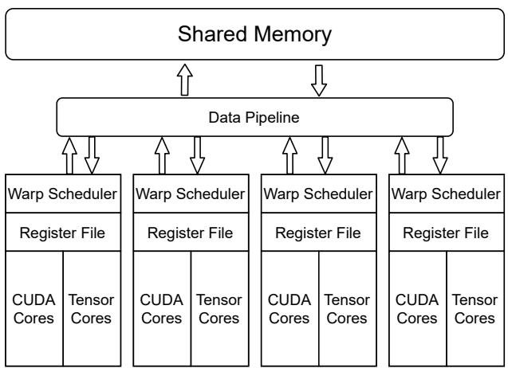

*图 1. 集成 Tensor Core 的 GPU SM 简化结构；每个 SM 含 4 个 sub-warp，每个 sub-core 拥有 warp scheduler、寄存器文件、CUDA Core 和 Tensor Core。*

### 2.2 Tensor Core 的演进

Volta 是第一代，仅支持 FP16 输入。Turing 在此基础上增加 INT8、INT4 和 Binary。Ampere 增加细粒度结构化稀疏、BF16，并重新设计微架构：Volta/Turing 每个 SM 有 8 个 Tensor Core，每个执行 4×4×4 MM；Ampere 每个 SM 只有 4 个 Tensor Core，每个执行 8×4×8 MM。尚未公开的 Hopper 预计增加 FP8，并可能不再强调 INT4 和 Binary。

**表 1. 不同代 Tensor Core 的属性。**

| 架构 | 代表产品 | 数值类型 | TC/SM | $m\times n\times k$ | 稀疏加速 | 编程接口 |
|---|---|---|---:|---|---|---|
| Volta | V100、Jetson Xavier | FP16 | 8 | 4×4×4 | 无 | `wmma` |
| Turing | T4、RTX20x | FP16、INT8、INT4、Binary | 8 | 4×4×4 | 无 | `wmma`、`ldmatrix`、`mma` |
| Ampere | A100、RTX30x、Jetson Orin | FP16、BF16、TF32、FP64、INT8、INT4、Binary | 4 | 8×4×8 | 细粒度 50% 稀疏 | `wmma`、`ldmatrix`、`mma`、`mma.sp` |
| Hopper | H100 | FP16、BF16、TF32、FP64、FP8、INT8 | 4 | 未公开 | 细粒度 50% 稀疏 | 同上 |

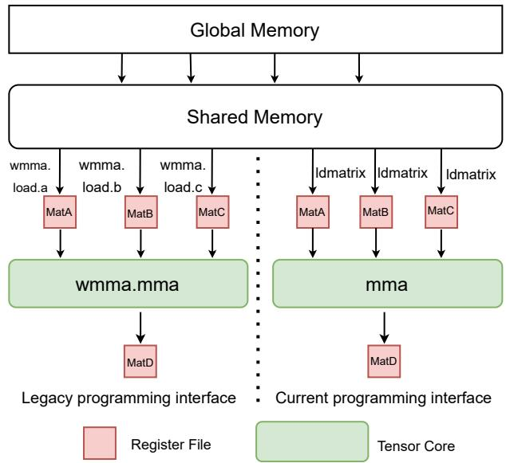

*图 2. Tensor Core 的旧式与当前编程接口。*

编程流程首先将数据从共享内存加载到寄存器文件，再调用 Tensor Core。Volta 引入的 `wmma` 接口容易使用，因为 `wmma.load` 会管理寄存器中的特殊操作数布局，但它不能使用稀疏加速，支持的矩阵形状也更少，对共享内存布局要求更严格。当前接口可以访问所有 Tensor Core 特性，CUTLASS 也采用它以获得最佳性能。因此，需要最大性能或稀疏加速时应使用 `mma` 接口。

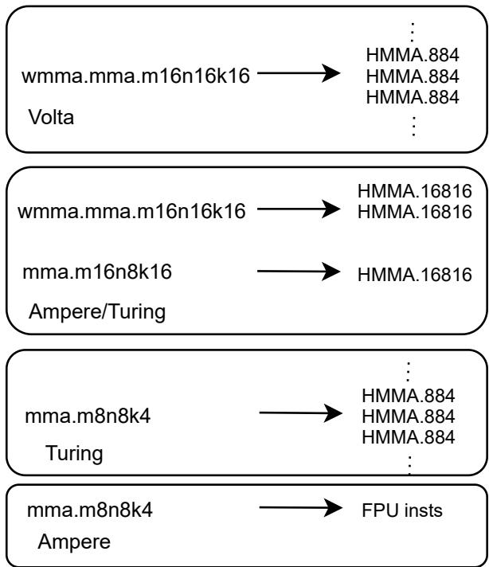

*图 3. 旧式和当前 PTX 指令到 SASS 汇编的编译过程。*

Volta 上，每条 `wmma.mma` 会编译为一组 HMMA.884 SASS；Turing/Ampere 上，当前 `mma` 通常编译为单条 HMMA，而旧式 `wmma.mma` 会编译为多条 HMMA。以 `wmma.mma.m16n16k16` 为例，它会变为两条 HMMA.16816（对应新的 `mma.m16n8k16`）。特殊的 `mma.m8n8k4` 在 Turing 上变成 HMMA.884，在 Ampere 上却变成 CUDA Core FPU 指令，性能显著低于 Tensor Core 预期。

**表 2. 与已有 Tensor Core 微基准研究的比较。**

| 工作 | 架构 | 稠密 FMA | 稀疏 FMA | 数据移动 | 性能评估 | 数值研究 | 汇编研究 |
|---|---|---|---|---|---|---|---|
| [23]、[24] | Volta | `wmma.mma` | — | `wmma.load` | 库基准 | FP16/无 | 无 |
| [14]、[13] | Volta/Turing | `wmma.mma` | — | `wmma.load` | 库基准 | 无 | 有 |
| [39]、[45] | Turing/Volta | `wmma.mma` | — | `wmma.load` | 指令级 | 无 | 有 |
| [6] | Ampere/Turing/Volta | `wmma.mma` | — | `wmma.load` | 未评估 | TF32、BF16、FP16 | 无 |
| 本文 | Ampere/Turing | `mma` | `mma.sp` | `ldmatrix` | 指令级 | TF32、BF16、FP16 | 有 |

## 3. 相关工作

GPU 评测与微基准可以揭示内存层次、吞吐、延迟和数值行为等未知架构特征。已有 Volta 研究主要使用旧式 `wmma` 接口并评测厂商库，还分析 FP16 数值损失；这些工作没有提供当前 API 的指令级延迟和吞吐。

Volta/Turing 的通用 GPU 研究覆盖了厂商库和旧式 `wmma` 的汇编，但对 Tensor Core 的数值行为和指令级性能讨论有限。另有研究通过 SASS 反汇编优化半精度矩阵乘，但 SASS 未被 NVIDIA 正式公开，也没有官方汇编器，第三方逆向汇编器不稳定且容易出错。因此本文聚焦 NVIDIA 正式文档支持的 PTX 层。

已有 GPGPU-SIM 模型把 HMMA.884 作为 Tensor Core 的基本执行模式，但 Ampere 与 Volta/Turing 差异显著，旧模型未必能准确模拟 Ampere。另有工作研究 TF32、BF16、FP16 的舍入和非规格化行为，却未测量延迟与吞吐。

与已有工作相比，本文：

- 使用当前 `ldmatrix`、`mma`、`mma.sp` API，而不是旧式 `wmma`；
- 进行指令级延迟和吞吐微基准，分析不同操作数形状、warp 数和指令级并行度（ILP）；
- 比较 FP16、BF16、TF32 相对 IEEE FP32 的数值误差；
- 分析乘法、内积加法和累加三个中间操作。

## 4. 微基准方法

作者在 PTX 层编写测试，通过控制 warp 数、ILP、操作数形状和数据类型，分别测量指令完成延迟与稳态吞吐。依赖链用于隔离真实延迟，独立指令用于填满 Tensor Core 流水线。输入数据预先放入共享内存，避免全局内存流量混入结果。

### 4.1 稠密 FMA：`mma`

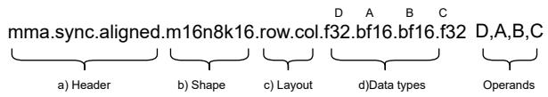

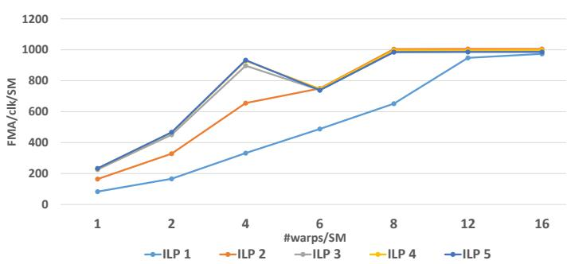

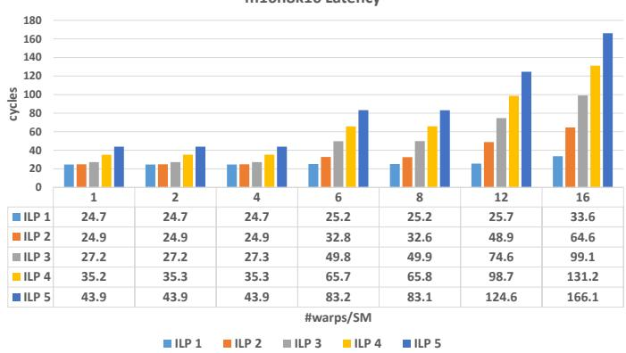

在 A100 上，`mma.m16n8k16` 的完成延迟约为 24.7 cycles，峰值吞吐约为 1000 FMA/clk/SM。增加 warp 数和 ILP 可以隐藏 warp 内同步停顿：4 个 warp、ILP≥3 已接近峰值，但 8 个 warp、ILP≥2 更稳定，通常应优先选择 warp 数为 4 的倍数。

`mma.m16n8k8` 的完成延迟约 18 cycles，峰值约 1000 FMA/clk/SM。其两个收敛点为 4 warp/ILP=4 和 8 warp/ILP=3；后者吞吐约 1000，而前者约 800，说明该形状的 warp 内同步开销更明显，实际应用最好分配至少 8 个 warp。

表 3 汇总 A100 上不同精度和形状的结果。除 INT8 的 `m8n8k16` 外，各指令都能接近峰值。该 INT8 形状在 A100 上只有约一半峰值，而同一形状在 Turing 上可接近峰值，说明 Ampere 更偏好 `m16n8k16` 和 `m16n8k32`。

**表 3. A100 Tensor Core 上不同数据类型的 `mma` 性能。**

| A/B | C/D | 形状 | 完成延迟 | 4 warp 延迟/吞吐 | 8 warp 延迟/吞吐 |
|---|---|---|---:|---:|---:|
| FP16 | FP32 | m16n8k16 | 24.7 | 27.4 / 897.6 | 32.6 / 1004.2 |
| FP16 | FP32 | m16n8k8 | 17.7 | 20.5 / 800.2 | 25.3 / 974.1 |
| FP16 | FP16 | m16n8k16 | 24.4 | 27.1 / 907.1 | 32.9 / 996.6 |
| FP16 | FP16 | m16n8k8 | 17.7 | 19.1 / 860.9 | 24.5 / 1002.6 |
| TF32 | FP32 | m16n8k8 | 25.0 | 28.2 / 435.9 | 33.3 / 492.4 |
| INT8 | INT32 | m16n8k32 | 24.7 | 27.1 / 1812.4 | 32.9 / 1986.5 |
| INT4 | INT32 | m16n8k64 | 26.1 | 28.1 / 3497.9 | 35.8 / 3660.8 |
| Binary | INT32 | m16n8k256 | 26.0 | 28.1 / 13985.4 | 35.8 / 14643.4 |

**表 4. RTX3070Ti（Ampere）上的 Tensor Core 性能。** 相比数据中心 A100，RTX3070Ti 峰值吞吐更低；当 C/D 使用 FP32 时，性能约为 FP16 的一半，而 A100 不受 C/D 精度影响。

**表 5. RTX2080Ti（Turing）上的 Tensor Core 性能。** Turing 支持更少的形状和数据类型；例如 `mma.m16n8k8` 延迟约 17.3 cycles，与 A100 的 17.7 cycles 接近，说明 Ampere 并未显著降低单条稠密 FMA 延迟。

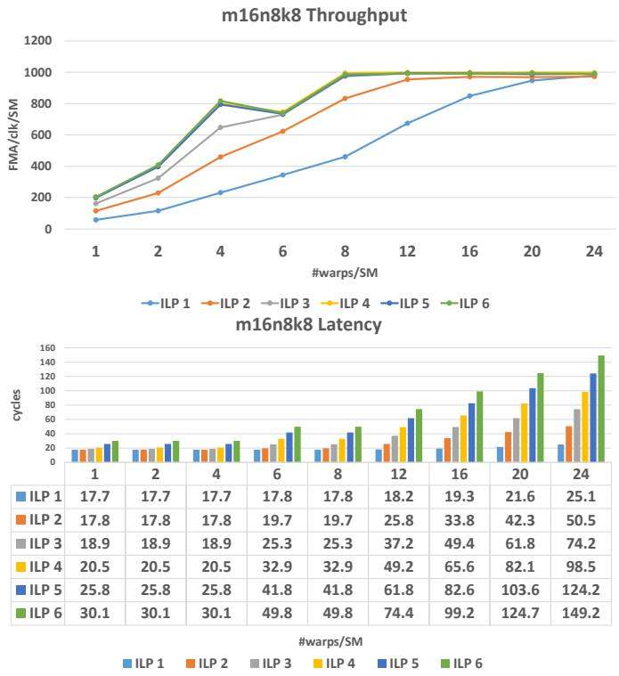

*图 7. A100 上不同设置下 `mma.m16n8k8` 的吞吐和延迟。*

## 5. 稀疏 FMA：`mma.sp`

稀疏矩阵乘（SpMM）是深度学习中的重要模式。Ampere Tensor Core 首次提供通用硬件 N:M 稀疏加速，尤其是 2:4 结构化稀疏：沿 K 维每连续 4 个元素中必须有 2 个非零值。

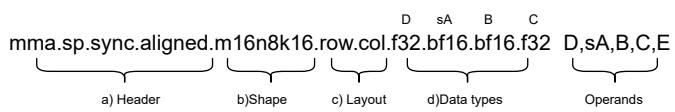

*图 8. `mma.sp` 执行 $D=sA\times B+C$；$sA$ 保存 A 的非零值，元数据 $e$ 保存每组 2:4 元素的索引。*

与稠密 Tensor Core 不同，稀疏计算只能通过 `mma.sp` 使用。程序首先将 A 压缩为非零矩阵 $sA$，形状由 $m\times k$ 变为 $m\times k/2$，并保存 2-bit 索引元数据；B 仍以稠密形式存储，硬件根据元数据动态选择参与计算的值。

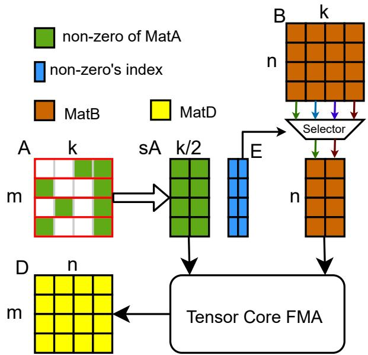

*图 9. 细粒度 2:4 SpMM 示意图。为简化起见未画出矩阵 C。*

`mma.sp.m16n8k32` 的完成延迟为 24.7 cycles，与稠密 `mma.m16n8k16` 相同，说明 B 的 selector 已集成在 Tensor Core 流水线中；稀疏路径仍经过 selector，因此不会降低延迟。其峰值吞吐约 2000，是稠密版本的 2 倍，收益来自跳过零值乘法。

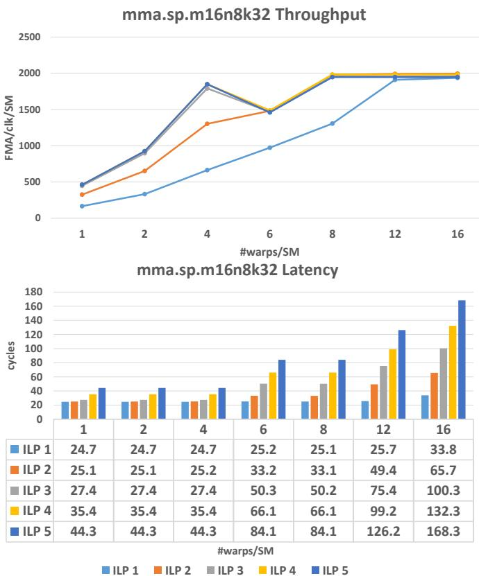

*图 10. A100 上 `mma.sp.m16n8k32` 的吞吐和延迟。*

`mma.sp.m16n8k16` 的完成延迟约 17.9 cycles，接近稠密 `m16n8k8` 的 17.7 cycles，但峰值吞吐只有约 1300，显著低于理论值 2000。较小 k 形状在 A100 上无法达到预期峰值，而 RTX3070Ti 没有同样问题。

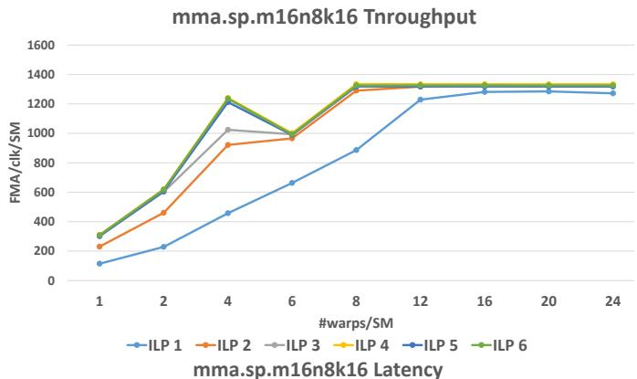

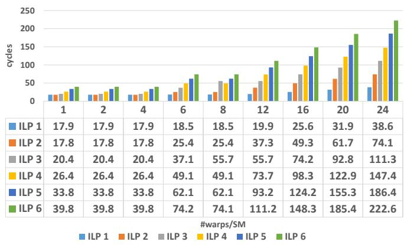

*图 11. A100 上 `mma.sp.m16n8k16` 的吞吐和延迟。*

总体而言，稀疏 Tensor Core 通常可将吞吐提高约 2 倍，但不能降低完成延迟。目标平台为 A100 时，必须谨慎选择 PTX 形状，尤其应避免无法达到峰值的小 k 变体；厂商尚未解释该问题。
**表 6（续）. A100 上稀疏 Tensor Core 的性能。**

| 输入 A/B | 累加 C/D | 形状 | 完成延迟 | 4 warp 吞吐 | 8 warp 吞吐 |
|---|---|---|---:|---:|---:|
| FP16 | FP32 | m16n8k32 | 24.7 | 1791.9 | 1979.1 |
| FP16 | FP32 | m16n8k16 | 17.8 | 1024.5 | 1290.5 |
| FP16 | FP16 | m16n8k32 | 24.3 | 1850.9 | 2019.8 |
| FP16 | FP16 | m16n8k16 | 17.6 | 1242.9 | 1318.2 |
| TF32 | FP32 | m16n8k16 | 24.9 | 868.2 | 981.2 |
| TF32 | FP32 | m16n8k8 | 18.2 | 597.8 | 643.6 |
| INT8 | INT32 | m16n8k64 | 24.7 | 3544.7 | 3961.5 |
| INT8 | INT32 | m16n8k32 | 17.9 | 2403.9 | 2665.2 |

**表 7. RTX3070Ti（Ampere）上的稀疏 Tensor Core 性能。** 与 A100 不同，RTX3070Ti 的小 k 形状也可以达到接近理论峰值。

## 6. 数据移动

使用 `mma` 或 `mma.sp` 前，输入必须通过数据移动指令从共享内存加载到寄存器文件。可用指令包括专用的 `wmma.load`、`ldmatrix` 和通用的 `ld.shared`。

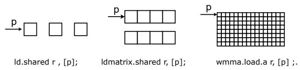

*图 12. 三种数据移动指令的差异。*

`ld.shared` 按线程工作，每个线程提供共享内存中一个元素的地址并得到一个寄存器；一个 warp 合计加载 32 个元素。`wmma.load` 和 `ldmatrix` 则按 warp 协作完成加载。`wmma.load` 只需要矩阵起始地址，并按指定形状将元素分配到 warp 中各线程的多个寄存器。例如 `wmma.load.a.m16n16k16.FP16` 加载 16×16 FP16 矩阵，每个线程需要 $16\times16/32=8$ 个寄存器。

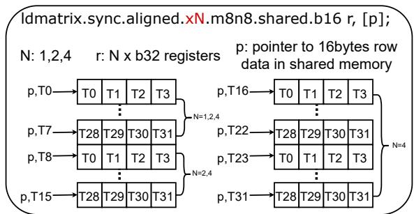

*图 13. 数据移动指令的功能概览。$p$ 是由线程提供的源操作数；当 $N=4$ 时每个线程都提供有效地址，当 $N<4$ 时只有部分线程提供有效地址。*

`ldmatrix` 可加载 A、B、C 操作数，而 `wmma.load` 为不同操作数提供专用指令。当前接口对共享内存布局更灵活，因而可以减少加载指令数量。

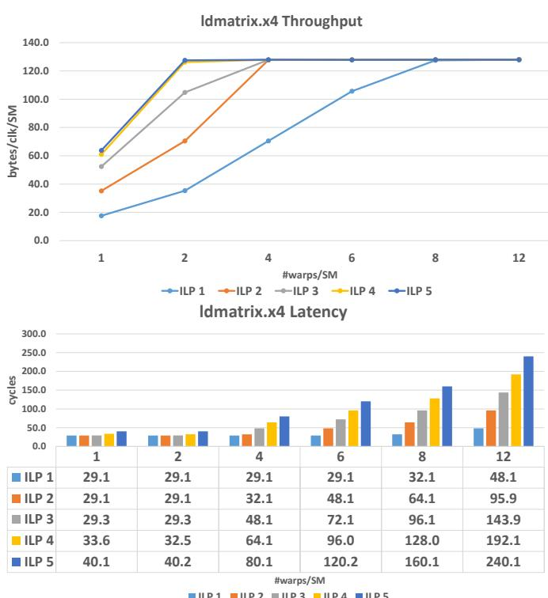

*图 14. `wmma.load` 与 `ldmatrix` 的数据布局。*

**表 8. `ldmatrix` 与 `ld.shared` 每条指令加载的字节数。**

| 指令 | 作用方式 | 主要特点 |
|---|---|---|
| `ld.shared` | 逐线程 | 粒度细，地址由每个线程独立提供 |
| `ldmatrix.x1` | warp 协作 | 加载 1 组矩阵行 |
| `ldmatrix.x2` | warp 协作 | 加载 2 组矩阵行 |
| `ldmatrix.x4` | warp 协作 | 加载 4 组矩阵行 |

作者对 `ldmatrix` 和 `ld.shared` 都进行微基准，以比较传统指令的细粒度访问和新指令的 warp 协作访问。

实验表明，`ldmatrix.x1` 至少需要 8 个 warp 才能达到峰值；`ldmatrix.x2` 和 `ldmatrix.x4` 通常 4 个 warp 即可。共享内存 bank conflict 会增加 `ld.shared` 延迟，而经过适当置换的共享内存布局可以改善吞吐。

## 7. 数值行为

**表 9. A100 上三种 `ldmatrix` 指令的性能。**

| 指令 | 完成延迟 | 峰值配置 |
|---|---:|---|
| `ldmatrix.x1` | 约 14 cycles | 8 warp |
| `ldmatrix.x2` | 约 14 cycles | 4 warp |
| `ldmatrix.x4` | 约 14 cycles | 4 warp |

**表 10. 不同 bank conflict 下 `ld.shared` 的延迟。** bank conflict 越严重，逐线程共享内存 load 的延迟越高；合理布局和地址分散可以显著降低该开销。

**表 11. 不同精度格式与 GPU 存储。**

| 格式 | 符号位 | 指数位 | 尾数位 | 寄存器/存储 |
|---|---:|---:|---:|---|
| FP16 | 1 | 5 | 10 | 16 位 |
| BF16 | 1 | 8 | 7 | 16 位 |
| TF32 | 1 | 8 | 10 | 32 位寄存器中存储 19 个有效位 |
| FP32 | 1 | 8 | 23 | 32 位 |
| FP8（预期） | — | — | — | Hopper 预计支持 |

### 7.1 逐元素数值剖析

作者分别剖析乘法、内积加法和累加。随机生成正态分布输入（$\mu=0,\sigma=1$），所有精度使用相同随机种子。乘法测试只让 A 的第一行第一项和 B 的第一列第一项非零，使 $D=A\times B+C$ 退化为 $d_0=a_0b_0$；再与 CPU FP32 结果比较。类似地，可以单独测量内积加法和累加误差。

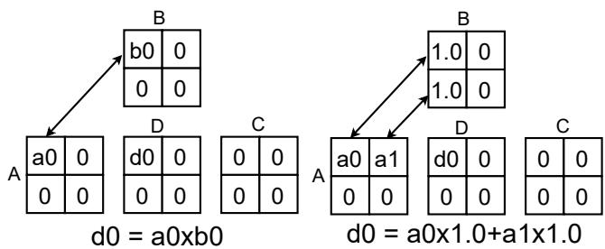

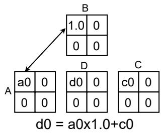

*图 16. 三个中间操作的数值剖析方法。*

#### 7.1.1 BF16

**表 12. BF16 Tensor Core 相对 CPU FP32 的平均误差。**

| 初始化类型 | 乘法 | 内积加法 | 累加 |
|---|---:|---:|---:|
| BF16 | 0 | 0 | 非零 |
| FP32 | 非零 | 非零 | 非零 |

当输入以 FP32 初始化时，三个操作都有误差；以 BF16 初始化时，乘法和内积加法没有误差，说明 Tensor Core 内部的 $A\times B$ 使用了较高精度，而 $A\times B+C$ 的累加阶段采用相对较低精度。

#### 7.1.2 FP16

**表 13. FP16 Tensor Core 相对 CPU FP32 的误差（C/D 为 FP32）。**

| 初始化类型 | 乘法 | 内积加法 | 累加 |
|---|---:|---:|---:|
| FP16 | 0 | 0 | 0 |
| FP32 | 1.59E-04 | 2.18E-04 | 1.36E-04 |

FP16 的误差约为 $10^{-4}$，低于 BF16 的 $10^{-3}$，因为 FP16 拥有更多尾数位；只要数值处于 FP16 的有效范围内，它更精确。

**表 14. FP16 Tensor Core 相对 CPU FP32 的误差（C/D 为 FP16）。**

| CPU 基线/初始化 | 乘法 | 内积加法 | 累加 |
|---|---:|---:|---:|
| CPU FP32，FP16 初始化 | 1.22E-04 | 1.81E-04 | 1.81E-04 |
| CPU FP32，FP32 初始化 | 1.94E-04 | 2.99E-04 | 2.99E-04 |
| CPU FP32 转 FP16，FP16 初始化 | 0 | 0 | 0 |
| CPU FP32 转 FP16，FP32 初始化 | 1.67E-04 | 2.21E-04 | 2.21E-04 |

当 D 为 FP16 时，相对 CPU FP32 必然出现最终转换误差；但相对 CPU FP16，FP16 初始化时误差为零。这说明硬件可能在内部以高精度计算，最后才把结果转换为 FP16。

#### 7.1.3 TF32

**表 15. TF32 Tensor Core 相对 CPU FP32 的平均误差。**

| 初始化类型 | 乘法 | 内积加法 | 累加 |
|---|---:|---:|---:|
| TF32 | 0 | 0 | 0 |
| FP32 | 1.59E-04 | 2.17E-04 | 1.36E-04 |

TF32 与 FP16 拥有相同的 10 个尾数位，因此二者的误差等级相近。

### 7.2 链式矩阵乘

链式矩阵乘模拟多层深度学习网络：上一层结果作为下一层输入。每个节点计算 $D=A\times B$，再令下一步的 A 等于 D，并为 B 生成新的随机值。作者使用 BF16、FP16 和 TF32 的共同形状 `m16n8k8`，比较整个 $m\times n$ 结果矩阵与 CPU FP32 的 L2 相对误差：

$$
\mathrm{RelativeErr}
=\frac{\sqrt{\sum_{i,j}|D^l_{ij}-D^{FP32}_{ij}|^2}}
{\sqrt{\sum_{i,j}|D^l_{ij}|^2}}.\tag{1}
$$

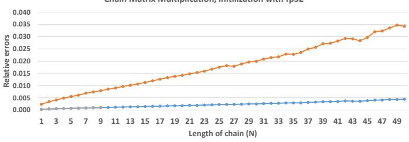

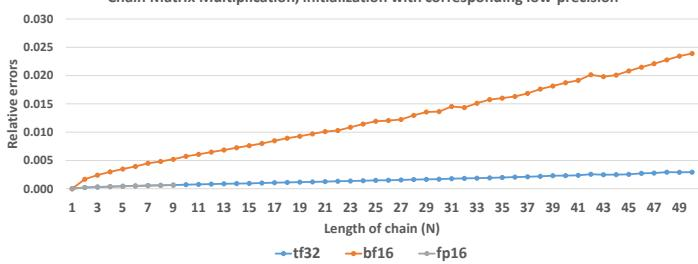

*图 17. TF32、BF16 和 FP16 在不同链长度下的数值误差；每个点为 1000 次测量平均值，FP16 在链长 $N=10$ 后因溢出停止。*

主要观察：

1. 误差随链长度增加；BF16 的累积误差明显高于 TF32 和 FP16，因为 BF16 尾数位更少。
2. FP16 与 TF32 的精度等级相近，但 FP16 指数位更少，在 $N\ge10$ 时会更早溢出。
3. 使用 FP32 初始化会引入类型转换损失，因此误差更大；使用对应低精度初始化时，链长为 1 的误差接近零，说明内部计算保持了较高精度。

总体而言，只要数值处于 FP16 的有效范围，FP16 与 TF32 的精度相近；BF16 与 TF32 的有效范围相近，但累积精度损失更大。选择格式时应同时考虑数值行为和第 5、6 节所测性能。

## 8. 结论

针对 Ampere Tensor Core，新的 `ldmatrix` + `mma` 优于旧式 `wmma.load` + `wmma.mma`；附录 A 的消融实验显示，使用灵活的 `ldmatrix` 可将相关 GPU cycle 数减少超过 60%。

Ampere 的稀疏加速只能通过 `mma` API 使用。稀疏指令在相同执行 cycle 下接受更大的输入矩阵，因此吞吐约为稠密版本的两倍，但不会降低完成延迟。

虽然每个 SM 有 4 个 warp scheduler，某些指令只有在至少 8 个 warp 时才能达到峰值。对于每种数据类型，`mma.sp` 通常有不同 k 大小的两个形状；大 k 形状在 A100 和 RTX3070Ti 上都能达到预期性能，小 k 形状在 A100 上却无法达到峰值。

同一代 GPU 的性能也不一定一致：RTX3070Ti 偏好 FP16 作为累加类型，而 A100 使用 FP16 或 FP32 累加的峰值性能基本相同。BF16 与 FP16 指令的性能相近，但 FP16 的有效范围更小，BF16 的数值误差更大；对能容忍一定精度损失的机器学习任务，BF16 因与 FP32 具有相同指数范围而更实用。

本研究提供了 Turing/Ampere Tensor Core 的指令级性能和数值行为信息，可用于自定义 Tensor Core 应用和更准确的架构模拟。
## REFERENCES

[1] P. N. Q. Anh, R. Fan, and Y. Wen, “Balanced hashing and efficient gpu sparse general matrix-matrix multiplication,” in Proceedings of the 2016 International Conference on Supercomputing, 2016, pp. 1–12. 

[2] A. Bakhoda, G. L. Yuan, W. W. Fung, H. Wong, and T. M. Aamodt, “Analyzing cuda workloads using a detailed gpu simulator,” in 2009 IEEE international symposium on performance analysis of systems and software, 2009. 

[3] Y. Chen, K. Li, W. Yang, G. Xiao, X. Xie, and T. Li, “Performanceaware model for sparse matrix-matrix multiplication on the sunway taihulight supercomputer,” IEEE transactions on parallel and distributed systems, 2018. 

[4] S. Dalton, L. Olson, and N. Bell, “Optimizing sparse matrix—matrix multiplication for the gpu,” ACM Transactions on Mathematical Software (TOMS), 2015. 

[5] M. Deveci, C. Trott, and S. Rajamanickam, “Multithreaded sparse matrix-matrix multiplication for many-core and gpu architectures,” Parallel Computing, 2018. 

[6] M. Fasi, N. J. Higham, M. Mikaitis, and S. Pranesh, “Numerical behavior of nvidia tensor cores,” PeerJ Computer Science, 2021. 

[7] B. Feng, Y. Wang, G. Chen, W. Zhang, Y. Xie, and Y. Ding, “Egemm-tc: Accelerating scientific computing on tensor cores with extended precision,” ser. PPoPP ’21, 2021. 

[8] B. Feng, Y. Wang, T. Geng, A. Li, and Y. Ding, “Apnn-tc: Accelerating arbitrary precision neural networks on ampere gpu tensor cores,” in Proceedings of the International Conference for High Performance Computing, Networking, Storage and Analysis, 2021. 

[9] B. Gaide, D. Gaitonde, C. Ravishankar, and T. Bauer, “Xilinx adaptive compute acceleration platform: Versaltm architecture,” in Proceedings of the 2019 ACM/SIGDA International Symposium on Field-Programmable Gate Arrays, 2019. 

[10] A. Haidar, S. Tomov, J. Dongarra, and N. J. Higham, “Harnessing gpu tensor cores for fast fp16 arithmetic to speed up mixedprecision iterative refinement solvers,” in SC18, 2018. 

[11] B. Hickmann, J. Chen, M. Rotzin, A. Yang, M. Urbanski, and S. Avancha, “Intel nervana neural network processor-t (nnp-t) fused floating point many-term dot product,” in 2020 IEEE 27th Symposium on Computer Arithmetic (ARITH), 2020. 

[12] I. Hubara, B. Chmiel, M. Island, R. Banner, J. Naor, and D. Soudry, “Accelerated sparse neural training: A provable and efficient method to find n: m transposable masks,” Advances in Neural Information Processing Systems, vol. 34, 2021. 

[13] Z. Jia, M. Maggioni, J. Smith, and D. P. Scarpazza, “Dissecting the nvidia turing t4 gpu via microbenchmarking,” arXiv preprint arXiv:1903.07486, 2019. 

[14] Z. Jia, M. Maggioni, B. Staiger, and D. P. Scarpazza, “Dissecting the nvidia volta gpu architecture via microbenchmarking,” arXiv preprint arXiv:1804.06826, 2018. 

[15] N. P. Jouppi, C. Young, N. Patil, D. Patterson, G. Agrawal, R. Bajwa, S. Bates, S. Bhatia, N. Boden, A. Borchers, R. Boyle, P.-l. Cantin, C. Chao, C. Clark, J. Coriell, M. Daley, M. Dau, J. Dean, B. Gelb, T. V. Ghaemmaghami, R. Gottipati, W. Gulland, R. Hagmann, C. R. Ho, D. Hogberg, J. Hu, R. Hundt, D. Hurt, J. Ibarz, A. Jaffey, A. Jaworski, A. Kaplan, H. Khaitan, D. Killebrew, A. Koch, N. Kumar, S. Lacy, J. Laudon, J. Law, D. Le, C. Leary, Z. Liu, K. Lucke, A. Lundin, G. MacKean, A. Maggiore, M. Mahony, K. Miller, R. Nagarajan, R. Narayanaswami, R. Ni, K. Nix, T. Norrie, M. Omernick, N. Penukonda, A. Phelps, J. Ross, M. Ross, A. Salek, E. Samadiani, C. Severn, G. Sizikov, M. Snelham, J. Souter, D. Steinberg, A. Swing, M. Tan, G. Thorson, B. Tian, H. Toma, E. Tuttle, V. Vasudevan, R. Walter, W. Wang, E. Wilcox, and D. H. Yoon, “In-datacenter performance analysis of a tensor processing unit,” ser. ISCA ’17, 2017. 

[16] D. B. Kirk and W. H. Wen-Mei, Programming massively parallel processors: a hands-on approach. Morgan kaufmann, 2016. 

[17] R. Kunchum, A. Chaudhry, A. Sukumaran-Rajam, Q. Niu, I. Nisa, and P. Sadayappan, “On improving performance of sparse matrixmatrix multiplication on gpus,” in Proceedings of the International Conference on Supercomputing, 2017, pp. 1–11. 

[18] A. Lavin and S. Gray, “Fast algorithms for convolutional neural networks,” in Proceedings of the IEEE conference on computer vision and pattern recognition, 2016. 

[19] J. Lee, S. Kang, Y. Yu, Y.-Y. Jo, S.-W. Kim, and Y. Park, “Optimization of gpu-based sparse matrix multiplication for large sparse networks,” in 2020 IEEE 36th International Conference on Data Engineering (ICDE), 2020. 

[20] A. Li, S. L. Song, J. Chen, J. Li, X. Liu, N. R. Tallent, and K. J. Barker, “Evaluating modern gpu interconnect: Pcie, nvlink, nvsli, nvswitch and gpudirect,” IEEE Transactions on Parallel and Distributed Systems, 2019. 

[21] A. Li and S. Su, “Accelerating binarized neural networks via bit-tensor-cores in turing gpus,” IEEE Transactions on Parallel and Distributed Systems, 2020. 

[22] J. Liu, D. Yang, and J. Lai, “Optimizing winograd-based convolu-

tion with tensor cores,” in 50th International Conference on Parallel Processing, 2021, pp. 1–10. 

[23] S. Markidis, S. W. Der Chien, E. Laure, I. B. Peng, and J. S. Vetter, “Nvidia tensor core programmability, performance & precision,” in IPDPSW, 2018. 

[24] M. Martineau, P. Atkinson, and S. McIntosh-Smith, “Benchmarking the nvidia v100 gpu and tensor cores,” in European Conference on Parallel Processing, 2018. 

[25] X. Mei and X. Chu, “Dissecting gpu memory hierarchy through microbenchmarking,” IEEE Transactions on Parallel and Distributed Systems, 2017. 

[26] P. Micikevicius, S. Narang, J. Alben, G. Diamos, E. Elsen, D. Garcia, B. Ginsburg, M. Houston, O. Kuchaiev, G. Venkatesh et al., “Mixed precision training,” arXiv preprint arXiv:1710.03740, 2017. 

[27] Y. Niu, Z. Lu, H. Ji, S. Song, Z. Jin, and W. Liu, “Tilespgemm: a tiled algorithm for parallel sparse general matrix-matrix multiplication on gpus,” in Proceedings of the 27th ACM SIGPLAN Symposium on Principles and Practice of Parallel Programming, 2022, pp. 90–106. 

[28] Nvidia, “Nvidia volta architecture white paper,” 2017. [Online]. Available: https://images.nvidia.com/content/volta architecture/pdf/volta-architecture-whitepaper.pdf 

[29] “Nvidia turing architecture white paper,” 2018. [Online]. Available: https://www.nvidia.com/content/dam/enzz/Solutions/design-visualization/technologies/turingarchitecture/NVIDIA-Turing-Architecture-Whitepaper.pdf 

[30] ——, “Nvidia ampere architecture white paper,” 2020. [Online]. Available: https://resources.nvidia.com/en-us-genomicsep/ampere-architecture-white-paper 

[31] ——, “Nvidia ampere ga102 gpu architecture,” https: //www.nvidia.com/content/PDF/nvidia-ampere-ga-102-gpuarchitecture-whitepaper-v2.pdf, 2021. 

[32] ——, “cublas,” 2022. [Online]. Available: https://docs.nvidia. com/cuda/cublas/index.html 

[33] ——, “Cutlass,” 2022. [Online]. Available: https://github.com/ NVIDIA/cutlass 

[34] ——, “Developing cuda kernels to push tensor cores to the absolute limit on nvidia a100,” https://www.nvidia.com/en-us/ondemand/session/gtcsj20-s21745/, 2022. 

[35] ——, “Nvidia hopper architecture white paper,” 2022. [Online]. Available: https://resources.nvidia.com/en-us-tensorcore/gtc22-whitepaper-hopper 

[36] ——, “Nvidia nsight,” 2022. [Online]. Available: https://docs. nvidia.com/nsight-compute/ProfilingGuide/index.html 

[37] ——, “Ptx isa,” 2022. [Online]. Available: https://docs.nvidia. com/cuda/parallel-thread-execution/index.html 

[38] M. Parger, M. Winter, D. Mlakar, and M. Steinberger, “speck: accelerating gpu sparse matrix-matrix multiplication through lightweight analysis,” in Proceedings of the 25th ACM SIGPLAN Symposium on Principles and Practice of Parallel Programming, 2020. 

[39] M. A. Raihan, N. Goli, and T. M. Aamodt, “Modeling deep learning accelerator enabled gpus,” in ISPASS, 2019. 

[40] W. Sun, A. Zhou, S. Stuijk, R. Wijnhoven, A. O. Nelson, H. Corporaal et al., “Dominosearch: Find layer-wise fine-grained n: M sparse schemes from dense neural networks,” Advances in Neural Information Processing Systems, vol. 34, 2021. 

[41] Y. Wang, B. Feng, and Y. Ding, “Tc-gnn: Accelerating sparse graph neural network computation via dense tensor core on gpus,” arXiv preprint arXiv:2112.02052, 2021. 

[42] M. Winter, D. Mlakar, R. Zayer, H.-P. Seidel, and M. Steinberger, “Adaptive sparse matrix-matrix multiplication on the gpu,” in Proceedings of the 24th Symposium on Principles and Practice of Parallel Programming, 2019. 

[43] H. Wong, M.-M. Papadopoulou, M. Sadooghi-Alvandi, and A. Moshovos, “Demystifying gpu microarchitecture through microbenchmarking,” in 2010 IEEE International Symposium on Performance Analysis of Systems & Software (ISPASS), 2010. 

[44] Z. Xie, G. Tan, W. Liu, and N. Sun, “A pattern-based spgemm library for multi-core and many-core architectures,” IEEE Transactions on Parallel and Distributed Systems, 2021. 

[45] D. Yan, W. Wang, and X. Chu, “Demystifying tensor cores to optimize half-precision matrix multiply,” in IPDPS, 2020. 

[46] ——, “Optimizing batched winograd convolution on gpus,” in 25th ACM SIGPLAN Symposium on Principles and Practice of Parallel Programming (PPoPP ’20), 2020. 

[47] X. Zhang, G. Tan, S. Xue, J. Li, K. Zhou, and M. Chen, “Understanding the gpu microarchitecture to achieve bare-metal perfor-

mance tuning,” in Proceedings of the 22nd ACM SIGPLAN Symposium on Principles and Practice of Parallel Programming, 2017. 

[48] A. Zhou, Y. Ma, J. Zhu, J. Liu, Z. Zhang, K. Yuan, W. Sun, and H. Li, “Learning n: m fine-grained structured sparse neural networks from scratch,” arXiv preprint arXiv:2102.04010, 2021. 

## 附录 A：消融实验

本附录用三个矩阵乘 CUDA kernel 展示本文新指令的收益。

### A.1 使用共享内存的收益

第 7 节没有把全局内存到共享内存的数据搬运计入 `ldmatrix` 测试，而是假设数据已在共享内存中。共享内存的作用有两点：降低全局内存流量并提高数据复用；以及作为 Ampere 异步拷贝的数据暂存区，使搬运与计算重叠。前者是经典优化，本文重点验证后者。

Ampere 引入了从片外全局内存异步拷贝到片上共享内存的机制。与同步拷贝相比，异步拷贝可以把搬运延迟隐藏在计算之后。作者实现了两个矩阵乘 kernel：

- `mma_baseline.cu`：依次把 K 维 tile 拷入共享内存、同步等待、用 `ldmatrix` 搬到寄存器，再执行 `mma`；循环至 K 维结束。
- `mma_pipeline.cu`：异步拷贝第一个 tile，同时预取下一个 tile；确认第一个 tile 就绪后进行 `ldmatrix` 和 `mma`，持续流水化执行。

在 A100 上对 2048×2048 的 BF16 矩阵乘进行 `clock64()` 测量：

| 实现 | GPU 周期数 |
| --- | ---: |
| `mma_baseline.cu` | 913363 |
| `mma_pipeline.cu` | 451560 |

异步拷贝流水线几乎将周期数减半，说明要获得最佳性能，应使用共享内存和异步预取。

### A.2 `ldmatrix` 指令的灵活性

`ldmatrix` 比旧式 `wmma.load` 更灵活，可以配合特殊共享内存布局减少 bank conflict。作者参考 CUTLASS 的置换布局，基于基线 kernel 实现 `mma_permuted.cu`，结果如下：

| 实现 | GPU 周期数 |
| --- | ---: |
| `mma_baseline.cu` | 913363 |
| `mma_permuted.cu` | 303227 |

置换布局显著减少 bank conflict，从而降低执行周期。需要注意，`ldmatrix` 应始终与 `mma` 配套使用：它会按照厂商规定的 `mma` 输入布局把数据写入寄存器。正确的指令链应为 `ldmatrix + mma`，或旧式的 `wmma.load + wmma.mma`。
