# Dissecting the NVIDIA Blackwell Architecture with Microbenchmarks

> **作者**：Aaron Jarmusch、Nathan Graddon、Sunita Chandrasekaran  
> **对比平台**：Hopper GH100（H100 PCIe）与 Blackwell GB203（GeForce RTX 5080）  
> **整理说明**：本段对应原文第 1–300 行，保留实验数值、PTX/SASS 指令、图像路径和作者判断。

## 摘要

本文通过精心设计的微基准测试分析现代 NVIDIA Blackwell 架构，研究内存层次、SM 执行流水线、SM 子核心以及支持 FP4/FP6 的第五代 Tensor Core。测试覆盖延迟、吞吐、缓存行为和调度，揭示 Blackwell 的调优指标，并与 Hopper 对比，展示代际改进和性能回退。

研究使用 RTX 5080（GB203）和 H100 PCIe（GH100），还考察不同工作负载下的功耗与能耗。结果为应用开发者、编译器作者和性能工程师在 Blackwell 平台上优化工作负载提供依据。

**关键词**：Blackwell、GPU、微基准测试、HPC。

## 1. 引言

AI 和 HPC 的快速发展使 GPU 成为机器学习与科学计算的重要资源。NVIDIA、AMD、Intel 和 Google 都推出了面向特定计算需求的 GPU、TPU 等加速器，因此需要通过应用剖析、Roofline 模型、解析性能模型和缓存停顿预测等方法判断某种架构是否适合给定工作负载。

微架构级剖析能够揭示计算相关特性，但现代商业 GPU 缺少公开文档，限制了研究深度。本文比较 Hopper 的 GH100 与 Blackwell 的 GB203：前者面向大规模 AI 训练和科学模拟，后者面向功耗受限的实时图形、推理和消费级应用。两者虽然具有相似布局，但硬件配置和内存层次差异明显。

本文使用 PTX 和 CUDA 微基准研究共享内存、L1/L2 缓存、核心流水线和 Tensor Core 指令吞吐。GH100 配备 HBM2e 和更多 SM，追求训练吞吐与数据局部性；GB203 牺牲缓存容量和双精度能力，换取更高频率与消费级能效。

主要贡献：

- 构建用于评测 Blackwell 并对比 Hopper 的微基准。
- 深入分析内存层次、SM 子单元、第五代 Tensor Core、统一 INT32/FP32 Core 和 FP64 执行单元。
- 为软件和应用开发者提供性能建议。
- 研究 Blackwell Tensor Core 中 FP4、FP6 等低精度数据类型的行为。

## 2. 相关工作

早期研究分析 Tesla、Fermi 的内存访问和缓存层次；后续针对 Kepler、Maxwell、Pascal 的工作考察 warp 调度、指令延迟和内存合并。Turing、Volta、Ampere、Hopper 研究进一步转向混合精度和 Tensor Core，测试 `mma` 延迟、tile 大小、数据布局及指令级并行。

Hong–Kim 的解析模型奠定了 Accel-Sim 和 GCoM 等工具的基础，但这些工具需要详细硬件信息，且对 Blackwell 新指令支持有限。本文旨在补充 Blackwell 特有的核心子系统数据，包括 FP64、低精度 MMA，以及共享内存、L1 和 L2 的吞吐。

**表 1. GH100 与 GB203 的执行单元。**

| 项目 | GH100（Hopper） | GB203（Blackwell） |
|---|---|---|
| FP32/SM | 128 | 统一 INT32/FP32 单元 |
| INT32/SM | 64 | 统一 INT32/FP32 单元 |
| FP64/SM | 64 | 2 |
| Tensor Core | 第四代 | 第五代，支持 FP4/FP6 |
| Transformer Engine | 第一代 | 第二代 |

**表 2. GH100 与 GB203 的缓存层次。**

| 内存单元 | GH100 | GB203 |
|---|---|---|
| L0 指令缓存 | 独立分区 | 统一 |
| 寄存器文件（KB/SM） | 256 | 256 |
| L1（KB/SM） | 256，统一 | 128，统一 |
| 共享内存（KB/SM） | 228，统一 | 统一，容量未公开 |
| L2 | 50 MB，2 分区 | 65 MB，1 分区 |
| 全局内存 | 80 GB HBM2e | 16 GB GDDR7 |

## 3. Blackwell 架构概览

GH100 是面向训练和科学计算的 Hopper GPU，GB203 是面向游戏、渲染和小 batch 推理的高能效 Blackwell GPU。二者都采用 CUDA Core 编程模型，但在指令集、执行单元数量、内存层次和资源调度上不同。

1. **SM 与执行流水线**：两者的 SM 都负责 warp 调度、指令发射和执行；Blackwell 改进了 warp 调度，降低分歧工作负载的派发延迟，GH100 则拥有更高执行吞吐和更大的片上缓冲。
2. **缓存层次**：GB203 的 L1 较小，但用更高 L2 带宽补偿；GH100 的 HBM 支持更大 batch 和工作集。
3. **Tensor/AI 加速**：Hopper 为第四代 Tensor Core，支持 FP8；Blackwell 升级为第五代，增加 FP4/FP6，同时保留 FP8。
4. **指令与软件兼容性**：Hopper 通过 CUDA 11.8/PTX 支持 `wgmma` 和 FP8；CUDA 12.8/PTX 8.7 扩展了 Blackwell 的 `tcgen05`、FP4 和 FP6。Hopper 的 `wgmma` 与 Blackwell 不兼容。

总体而言，GH100 以训练吞吐为中心，GB203 以热约束下的能效为中心；二者的共同微架构仍允许使用相似的基准框架。

## 4. 计算流水线

GPU 的主要计算由 SM 完成。每个 SM 包含 4 个面向整数、浮点和张量操作的执行分区。本文报告两类延迟：

- **真实延迟（true latency）**：串行依赖指令链中，一条指令产生后继可用结果所需的 cycle。
- **完成延迟（completion latency）**：允许独立指令重叠时的平均 cycle/指令。

吞吐/带宽按每个 SM 每 cycle 完成的指令数测量。微基准使用 PTX kernel 和 CUDA 启动代码，单独的 PTX 文件可避免编译期优化；作者还检查生成的 SASS，确保指令未被重排或删除。

**表 3. GH100 与 GB203 的延迟（真实/完成，cycle）。**

| 工作负载 | GB203 | GH100 |
|---|---:|---:|
| 纯 INT32 | 4 / 16.97 | 4 / 16.69 |
| 纯 FP32 | 4 / 7.97 | 4 / 7.86 |
| 混合 1 | 15.96 / 14 | 31.62 / 16 |
| 混合 2 | 26.28 / 18 | 43.54 / 20 |
| 纯 FP64 | 63.57 / 11 | 8.04 / 13 |

### 4.1 时钟开销

所有 cycle 使用只读特殊寄存器 `%clock64` 测量。典型 PTX 代码在 `mad.lo.s32` 前后读取计数器：

```ptx
.reg .u64 %start, %end;
mov.u64 %start, %clock64;
mad.lo.s32 r1, r1, r2, r3;
mov.u64 %end, %clock64;
```

*图 1. 使用 PTX 测量 `mad.lo.s32` 的 cycle。*

GB203 在两次寄存器读取之间没有指令时差值为 1，GH100 为 2。混合指令序列的计数差异取决于指令组合，可用于推断执行路径。

### 4.2 INT32 与 FP32 执行单元

Volta/Ampere 通常为 INT32 和 FP32 分离的执行流水线；GB203 使用统一单元，可根据指令混合动态调度，但同一 cycle 中统一单元只能执行 INT32 或 FP32 之一。

实验比较纯 INT32、纯 FP32 和混合序列，每个 workload 执行 1024 次。两种 GPU 的纯工作负载真实延迟均为 4 cycles；GH100 的纯 kernel 完成延迟略低，但混合序列明显落后于 GB203。这说明 Blackwell 的统一 INT32/FP32 核心可能改善了混合流水线。GB203 首次运行的高延迟与缓存未预热有关，后续结果如表 3 所示。

### 4.3 FP64 执行单元

FP64 对科学模拟等高精度工作负载至关重要。GH100 和 GB203 都有独立 FP64 单元，但 GB203 每个 SM 仅 2 个，GH100 有 64 个。

1024 条依赖 FP64 指令时，GH100 延迟低于 GB203；只有执行两条依赖指令时，GB203 延迟降至 37.5 cycles。该结果暗示 GB203 的两个 FP64 单元主要提供类型和指令支持，实际计算可能应改用 FP32 或 Tensor Core 模拟。对需要跨数据中心 GPU 和消费级 GPU 移植的应用，FP64 瓶颈会直接影响精度选择和算法设计。

### 4.4 Warp 调度与发射模型

作者让每个线程执行长度为 1–1024 的寄存器依赖链，并调整循环次数，使不同链长的总指令数一致。短链中 ILP 不足，线程快速停顿，调度器无法隐藏延迟；链长增加后，执行重叠提高，吞吐改善。

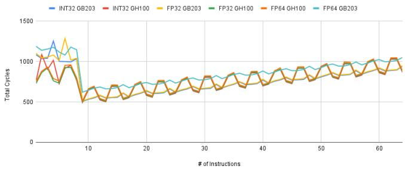

*图 2. GB203 与 GH100 在 INT32、FP32、FP64 工作负载下的总 cycle 与迭代次数。*

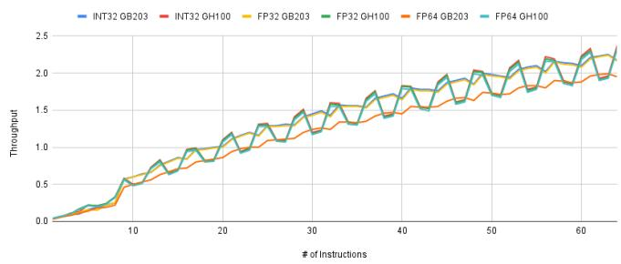

*图 3. GB203 与 GH100 在 INT32、FP32、FP64 工作负载下的吞吐与迭代次数。*

GB203 的吞吐上升更平滑；GH100 在少量依赖指令下总 cycle 更低，说明其更擅长短依赖链的延迟隐藏，但高指令数下波动更大。总体上，GH100 更适合短链，GB203 更适合规律、高 ILP kernel。

## 5. 第五代 Tensor Core

Tensor Core 用于加速深度学习和科学计算中的矩阵乘。作者使用自定义 PTX 微基准测量 GB203 与 GH100 的 Tensor Core 延迟、吞吐、ILP 和 warp 数影响。

### 5.1 指令集与数据类型

**表 4. 两代 Tensor Core 支持的数据类型和 MMA 指令。**

| 项目 | GB203（第五代） | GH100（第四代） |
|---|---|---|
| 数据类型 | FP4、FP6、FP8、INT8、FP16、BF16、TF32、FP64 | FP8、INT8、FP16、BF16、TF32、FP64 |
| MMA 指令 | `mma`、`wmma`、`tcgen05` | `mma`、`wmma`、`wgmma` |

Blackwell 新增 FP4、FP6，并在 SASS 中使用 OMMA、QMMA；Hopper 支持 warp-group 异步矩阵操作 `wgmma`，但不支持 FP4/FP6。原文注释指出，测试所用架构尚未完整支持 `tcgen05`，因此本段主要比较 `mma.sync`。

### 5.2 可变 MMA 与 tile 指令

MMA 指令通过 $M\times N\times K$ tile 指定矩阵片段。例如：

```ptx
mma.sync.aligned.m16n8k32.f32.f16.f16.f32
```

该指令计算 16×8 输出 tile，输入为 16×32 和 32×8。其他形状包括 `m8n8k16`、`m16n8k64`。Blackwell 使用 FP4/FP6 时，PTX 必须显式添加 `.kind::f8f6f4`，否则会产生 PTX 错误。

**表 5. Blackwell 低精度 MMA 的编码。**

| 编码 | 数据类型 | PTX 形状 |
|---|---|---|
| e2m1 | FP4 | `.m16n8k32.row.col.f32.e2m1.e2m1.f32` |
| e3m2 | FP6 | `.m16n8k32.row.col.f32.e3m2.e3m2.f32` |
| e2m3 | FP6 | `.m16n8k32.row.col.f32.e2m3.e2m3.f32` |
| e4m3 | FP8 | `.m16n8k32.row.col.f32.e4m3.e4m3.f32` |
| e5m2 | FP8 | `.m16n8k32.row.col.f32.e5m2.e5m2.f32` |

**表 6. 不同格式的功耗与每瓦性能。**

| 数据格式 | Blackwell | Hopper |
|---|---:|---:|
| FP4 e2m1 | 16.753 W | N/A |
| FP6 e2m3 | 39.383 W | N/A |
| FP6 e3m2 | 46.723 W | N/A |
| FP8 e4m3 | 46.661 W | 55.823 W |
| FP8 e5m2 | 46.806 W | 55.786 W |

PTX 级 `mma.sync` 会编译成 OMMA、QMMA 或 HMMA。GH100 各数据类型都使用 HMMA；GB203 的 FP8 使用 QMMA，FP4 预期使用 OMMA，但当前软件中观察到 QMMA，只有配合 FP8 E8M0 block scaling 时观察到 OMMA，说明 QMMA 可能是当前 FP4 的回退路径。

### 5.3 精度权衡

低精度格式通过减少表示位数降低内存占用并提高吞吐，但会牺牲动态范围或精度。

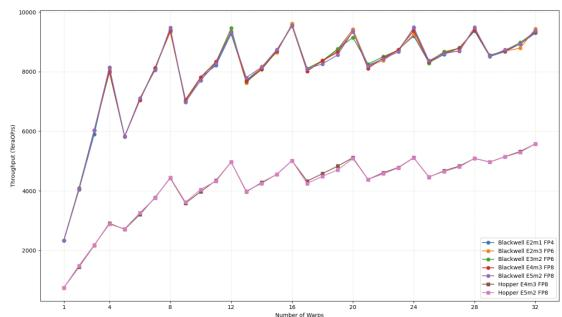

*图 4. 不同精度和 warp 数下 GB203 与 GH100 的吞吐。*

GH100 不支持 FP4/FP6；其 FP8 功耗约 55 W，GB203 同格式约 46 W。GB203 的 FP4 功耗最低，为 16.75 W；FP6 超过 39 W，FP8 超过 46 W。这表明 Blackwell 在低精度下更节能，但仍存在数值表达能力、吞吐与能耗的权衡。

### 5.4 Warp 扩展与共享内存访问

作者改变 ILP 和 warp 数，研究两代 GPU 的指令映射与调度。GH100 在 29 个活动 warp 时可达到 ILP=5 的持续吞吐；GB203 在 25 个活动 warp 时可达到 ILP=6，说明 Blackwell 每线程可发射更多独立 MMA。

单 warp、ILP=1 时，GB203 所有低精度格式的完成延迟约 1.21094 cycles，GH100 约 1.65625 cycles，说明同一架构内不同低精度格式共享执行流水线。GB203 在所有格式上吞吐更高，在 ILP=6、32 个活动 warp 时超过 11 TFLOP/s。

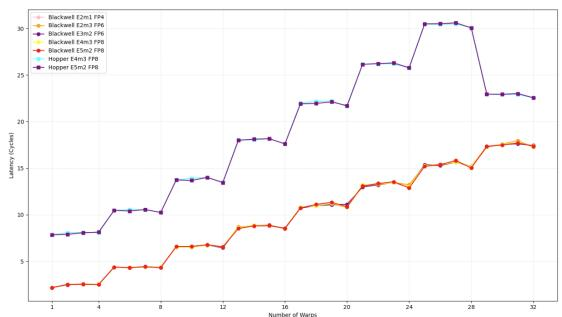

*图 5. 不同精度和 warp 数下 GB203 与 GH100 的延迟。*

GB203 在 FP4/FP6 上延迟更低，并且随 warp 数增加变化更平滑；GH100 的延迟呈阶梯式上升，更依赖大量并发 warp 才能填满执行单元。总体来看，Blackwell 更适合低精度、高 ILP、控制流规整的 workload，而 Hopper 依赖更深缓冲和更大批量并发。
## 6. 内存子系统

GPU 性能越来越受内存子系统而非原始计算吞吐限制。本文比较共享内存、L1/L2/L0 缓存和全局内存的延迟、饱和行为及访问步幅敏感性。

### 6.1 内存层次概览

测试排除主机—设备传输，只研究寄存器文件、共享内存、全局内存和硬件管理的 L0 指令缓存、L1/L2。作者使用随机串行指针追逐隔离延迟。

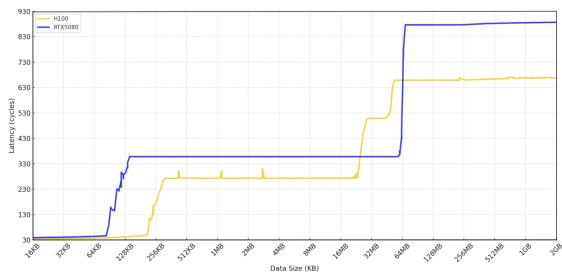

*图 6. GB203 与 GH100 内存层次的 cycle 延迟。*

L1 区域约覆盖 128 KB（GB203）或 256 KB（GH100）；L2 从 L1 末端延伸到约 30 MB 或 60 MB；超过缓存边界后会出现延迟尖峰。

### 6.2 共享内存与 L1 缓存

两种 GPU 都将共享内存和 L1 组织为每个 SM 的统一空间。指针追逐显示，两者在 L1 命中区域的延迟都约为 30–40 cycles，但容量差异明显：GH100 每个 SM 最多约 256 KB，GB203 约 128 KB。

通过 `cudaFuncSetAttribute` 和 `cudaFuncAttributeMaxDynamicSharedMemorySize`，作者测得可动态配置共享内存约为 GH100 的 227 KB/SM、GB203 的 99 KB/SM；不使用动态分配时，两者静态上限均为 48 KB/SM。

测试从 1–32 个 warp、stride 1 和 4 扫描 32 次内存访问，并重复 1024 次取中位数。低 warp 数（1–4）时 GB203 共享内存延迟更低；高压力（6–32 warp）时 GH100 更好，可能得益于更大容量和更强的 bank conflict 缓解。

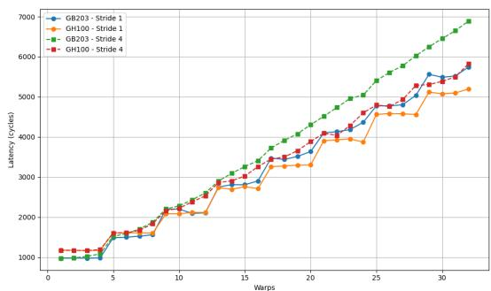

*图 7. GH100 与 GB203 的共享内存延迟。*

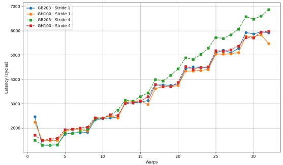

*图 8. GH100 与 GB203 的 L1 缓存延迟。*

stride 4 时，GH100 的延迟随 warp 数增长更平滑；GB203 因较小内存分区和 bank contention 增长更陡。L1 对 stride 的敏感性低于共享内存，但 GB203 在 stride 4 下仍会更快饱和。总体而言，GH100 的统一内存更适合高线程数和高数据复用 kernel；GB203 在低并发访问路径和冲突消解上更有优势。

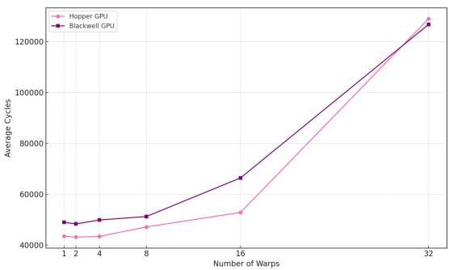

*图 9. 随 warp 数扩展的 L2 缓存延迟。*

### 6.3 L2 缓存

GH100 的 L2 分为两个独立分区，便于 GPC 间并行访问；GB203 使用所有 GPC 共享的单体 L2，路由和一致性更简单，但高并发流式访问时可能产生争用。

标准 L2 命中时，GB203 延迟约 358 cycles，GH100 约 273 cycles。GH100 的分区设计降低了争用；当两个分区饱和、工作集达到 31–45 MB 时，其延迟升至约 508 cycles。GB203 的总 L2 容量更大（65 MB 对 50 MB），因此在更大工作集内能维持基线延迟。

低 warp 数（1–4）时 GH100 每 warp 约 43.5k cycles，优于 GB203 的 49k；8–16 warp 时 GH100 仍占优，而 GB203 在 16 warp 约 66k cycles 开始饱和。高并发（16–32 warp）时 GB203 逐渐追上，并在 20 warp 左右略优；32 warp 时 GB203 约 128.4k，GH100 约 128.9k cycles。

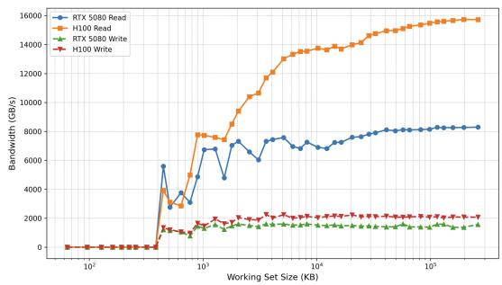

*图 10. GB203 与 GH100 的内存层次吞吐。*

因此，GH100 更适合中等并发、延迟敏感的动态工作负载；GB203 在满负载下聚合 L2 带宽更高，更适合大规模带宽受限的推理和稠密矩阵操作。

### 6.4 全局内存

持续传输测试显示，GH100 峰值读带宽约 15.8 TB/s，明显高于 GB203 的 8.2 TB/s；写带宽分别约 2.2 TB/s 和 1.6 TB/s，表明两者都更偏向读密集型工作负载。全局内存访问从约 55 MB（GH100）和 71 MB（GB203）开始，延迟分别约 658.7 和 876.7 cycles。HBM2e 使 GH100 具有更低延迟和更高带宽。

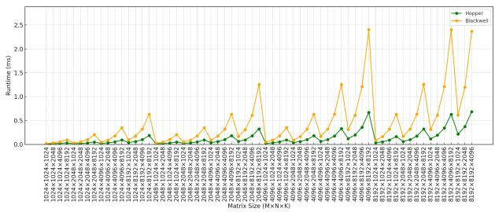

*图 11. H100 与 RTX 5080 在不同 $M\times N\times K$ 规模下的运行时间。*

## 7. 微基准案例

### 7.1 稠密 GEMM

作者使用 cuBLASLt 和 FP8 E4M3 实现 D-GEMM：

$$
D=A^T B+C,
$$

A、B 为 FP8，C 为 BF16，D 存为 FP8。测试使用 32 MB workspace，每个配置执行 100 次，矩阵边长为 1024、2048、4096、8192，并使用 `nvidia-smi` 测功耗。

Hopper 在几乎所有规模上运行更快；规模增大后，Blackwell 延迟出现明显尖峰，说明当前 RTX 5080 的 FP8 kernel 选择或调度仍不稳定。吞吐计算为：

$$
\mathrm{TFLOPS}=\frac{2MNK}{\mathrm{runtime}}.\tag{2}
$$

**表 7. GH100 与 GB203 的 D-GEMM 吞吐（TFLOP/s）。**

| 矩阵规模 | Hopper | Blackwell |
|---|---:|---:|
| 8192×8192×8192 | 0.887 | 0.233 |
| 2048×2048×2048 | 0.554 | 0.191 |
| 2048×2048×4096 | 0.674 | 0.192 |
| 2048×4096×8192 | 0.759 | 0.217 |
| 1024×1024×1024 | 0.239 | 0.134 |

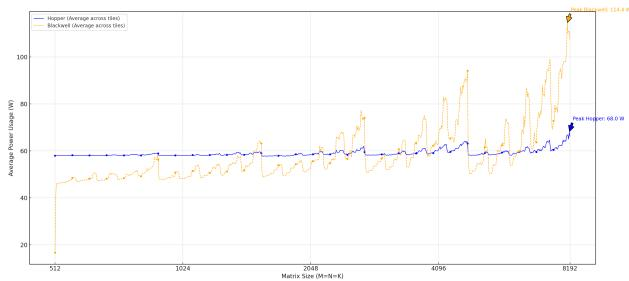

*图 12. 两种 GPU 在不同矩阵规模下的平均功耗。*

Hopper 功耗较平稳，约 58–60 W，最大约 68 W；Blackwell 波动更大，平均功耗超过 80 W，峰值 114.4 W。Blackwell 较高功耗叠加较低吞吐，导致多数配置下性能/瓦低于 Hopper。

### 7.2 Transformer 推理

作者使用 TensorRT 和 GPT-NeoX，测试 FP32、FP16、FP8 及 TensorRT 的 Best 配置，每项推理执行 100 次取平均。

**表 8. 不同精度下的平均推理功耗（W）。**

| 精度 | Hopper | Blackwell |
|---|---:|---:|
| FP32 | 60.24 | 58.82 |
| FP16 | 57.64 | 47.78 |
| FP8 | 57.69 | 45.14 |
| Best | 60.15 | 61.03 |

Hopper 在不同格式下维持 57–60 W 的稳定功耗；Blackwell 随精度降低由约 58.8 W 降到 45 W，显示低精度下更好的功耗缩放，但 Best 配置反而升至 61.03 W。总体上 Hopper 的功耗更稳定，Blackwell 可通过低精度调优获得有竞争力的推理能效。

## 8. 结论

本文通过微基准详细分析了 Blackwell GB203，并与 Hopper GH100 比较。Blackwell 在低精度格式、warp 调度和低并发访问路径上有改进，FP4/FP6 带来新的功耗—性能权衡；GH100 在 FP64、读带宽、L2 低延迟和大规模 FP8 GEMM 上更强。

这些结果为开发者调优共享内存、缓存、warp 并发、低精度 Tensor Core 和实际推理 kernel 提供了微架构依据。当前软件支持仍会显著影响 Blackwell 的实测性能。

## 致谢

感谢 NVIDIA 的 Nikhil Jain 对相关问题的回复。本研究使用俄勒冈大学 Frank 集群资源，并得到美国能源部项目 DE-FOA-0003177（S4PST）的支持。
## REFERENCES


[1] B. R. Coutinho, G. L. M. Teodoro, R. S. Oliveira, D. O. G. Neto, and R. A. C. Ferreira, “Profiling general purpose gpu applications,” in 2009 21st ISCA and HPC, 2009, pp. 11–18. 


[2] M. Leinhauser, R. Widera, S. Bastrakov, A. Debus, M. Bussmann, and S. Chandrasekaran, “Metrics and design of an instruction roofline model for amd gpus,” 2021. [Online]. Available: https: //arxiv.org/abs/2110.08221 


[3] S. Hong and H. Kim, “An analytical model for a gpu architecture with memory-level and thread-level parallelism awareness,” SIGARCH Comput. Archit. News, vol. 37, no. 3, p. 152–163, Jun. 2009. [Online]. Available: https://doi.org/10.1145/1555815.1555775 


[4] W. Jia, K. A. Shaw, and M. Martonosi, “Characterizing and improving the use of demand-fetched caches in gpus,” in Proceedings of the 26th ACM International Conference on Supercomputing, ser. ICS ’12. New York, NY, USA: ACM, 2012, p. 15–24. [Online]. Available: https://doi.org/10.1145/2304576.2304582 


[5] H. Wong, M.-M. Papadopoulou, M. Sadooghi-Alvandi, and A. Moshovos, “Demystifying gpu microarchitecture through microbenchmarking,” in 2010 ISPASS, 2010, pp. 235–246. 


[6] S. Subramoniapillai Ajeetha, “Architectural analysis and performance characterization of nvidia gpus using microbenchmarking,” Ph.D. dissertation, The Ohio State University, The Ohio State University, 2012. [Online]. Available: http://rave.ohiolink.edu/etdc/view?acc num= osu1344623484 


[7] Z. Jia, M. Maggioni, B. Staiger, and D. P. Scarpazza, “Dissecting the NVIDIA volta GPU architecture via microbenchmarking,” CoRR, vol. 1804.06826, 2018. [Online]. Available: http://arxiv.org/abs/1804.06826 


[8] Z. Jia, M. Maggioni, J. Smith, and D. P. Scarpazza, “Dissecting the nvidia turing T4 GPU via microbenchmarking,” CoRR, vol. 1903.07486, 2019. [Online]. Available: http://arxiv.org/abs/1903.07486 


[9] W. Luo, R. Fan, Z. Li, D. Du, H. Liu, Q. Wang, and X. Chu, “Dissecting the nvidia hopper architecture through microbenchmarking and multiple level analysis,” 2025. [Online]. Available: https: //arxiv.org/abs/2501.12084 


[10] NVIDIA Corporation, NVIDIA H100 Tensor Core GPU Architecture, NVIDIA, Mar. 2022. [Online]. Available: https://resources.nvidia.com/ en-us-data-center-overview/gtc22-whitepaper-hopper 


[11] ——, NVIDIA Blackwell Architecture Technical Brief: Powering the New Era of Generative AI and Accelerated Computing, NVIDIA, Mar. 2024. [Online]. Available: https://resources.nvidia. com/en-us-blackwell-architecture 


[12] L. Fusco, M. Khalilov, M. Chrapek, G. Chukkapalli, T. Schulthess, and T. Hoefler, “Understanding data movement in tightly coupled heterogeneous systems: A case study with the grace hopper superchip,” 2024. [Online]. Available: https://arxiv.org/abs/2408.11556 


[13] NVIDIA Corporation, NVIDIA RTX BLACKWELL GPU ARCHITECTURE, NVIDIA, 2025. [Online]. Available: https://images.nvidia.com/aem-dam/Solutions/geforce/blackwell/ nvidia-rtx-blackwell-gpu-architecture.pdf 


[14] X. Zhang, G. Tan, S. Xue, J. Li, K. Zhou, and M. Chen, “Understanding the gpu microarchitecture to achieve bare-metal performance tuning,” in Proceedings of the 22nd ACM SIGPLAN SPPPP, ser. PPoPP ’17. New York, NY, USA: ACM, 2017, p. 31–43. [Online]. Available: https://doi.org/10.1145/3018743.3018755 


[15] X. Mei and X. Chu, “Dissecting gpu memory hierarchy through microbenchmarking,” IEEE TPDS, vol. 28, no. 1, pp. 72–86, 2017. 


[16] M. Fasi, N. J. Higham, M. Mikaitis, and S. Pranesh, “Numerical behavior of NVIDIA tensor cores,” PeerJ Computer Science, vol. 7, p. e330, 2021. [Online]. Available: https://doi.org/10.7717/peerj-cs.330 


[17] G. Tan, L. Li, S. Triechle, E. Phillips, Y. Bao, and N. Sun, “Fast implementation of dgemm on fermi gpu,” in Proceedings of SC 2011, ser. SC ’11. New York, NY, USA: ACM, 2011. [Online]. Available: https://doi.org/10.1145/2063384.2063431 


[18] S. Markidis, S. W. D. Chien, E. Laure, I. B. Peng, and J. S. Vetter, “Nvidia tensor core programmability, performance &amp; precision,” in 2018 IEEE IPDPSW. IEEE, May 2018, p. 522–531. [Online]. Available: http://dx.doi.org/10.1109/IPDPSW.2018.00091 


[19] M. Martineau, P. Atkinson, and S. McIntosh-Smith, “Benchmarking the nvidia v100 gpu and tensor cores,” in Euro-Par 2018: Parallel Processing Workshops, G. Mencagli, D. B. Heras, V. Cardellini, E. Casalicchio, E. Jeannot, F. Wolf, A. Salis, C. Schifanella, R. R. Manumachu, L. Ricci, 


M. Beccuti, L. Antonelli, J. D. Garcia Sanchez, and S. L. Scott, Eds. Cham: Springer International Publishing, 2019, pp. 444–455. 


[20] M. A. Raihan, N. Goli, and T. M. Aamodt, “Modeling deep learning accelerator enabled gpus,” in 2019 IEEE ISPASS, 2019, pp. 79–92. 


[21] D. Yan, W. Wang, and X. Chu, “Demystifying tensor cores to optimize half-precision matrix multiply,” in 2020 IEEE International Parallel and Distributed Processing Symposium (IPDPS), 2020, pp. 634–643. 


[22] W. Sun, A. Li, T. Geng, S. Stuijk, and H. Corporaal, “Dissecting tensor cores via microbenchmarks: Latency, throughput and numeric behaviors,” IEEE TPDS, vol. 34, no. 1, pp. 246–261, 2023. 


[23] M. Khairy, Z. Shen, T. M. Aamodt, and T. G. Rogers, “Accel-sim: An extensible simulation framework for validated gpu modeling,” in 2020 ACM/IEEE 47th Annual International Symposium on Computer Architecture (ISCA), 2020, pp. 473–486. 


[24] J. Lee, Y. Ha, S. Lee, J. Woo, J. Lee, H. Jang, and Y. Kim, “Gcom: a detailed gpu core model for accurate analytical modeling of modern gpus,” in Proceedings of the 49th Annual ISCA, ser. ISCA ’22. New York, NY, USA: ACM, 2022, p. 424–436. [Online]. Available: https://doi.org/10.1145/3470496.3527384 


[25] K. N. M. Nguyen, H. D. N. Do, H. T. Le, and T. T. Dao, “Llmperf: Gpu performance modeling meets large language models,” 2025. [Online]. Available: https://arxiv.org/abs/2503.11244 


[26] NVIDIA Corporation, Parallel Thread Execution (PTX) ISA, Release 8.8, NVIDIA, 2025. [Online]. Available: https://docs.nvidia.com/cuda/ pdf/ptx isa 8.8.pdf 


[27] T. T. Dao, J. Kim, S. Seo, B. Egger, and J. Lee, “A performance model for gpus with caches,” IEEE TPDS, vol. 26, no. 7, pp. 1800–1813, 2015. 


[28] NVIDIA Corporation, CUDA Binary Utilities - Instruction Set Reference, NVIDIA, 2025. [Online]. Available: https://docs.nvidia.com/ cuda/cuda-binary-utilities/index.html 


[30] S. Black, S. Biderman, E. Hallahan, Q. Anthony, L. Gao, L. Golding, H. He, C. Leahy, K. McDonell, J. Phang et al., “Gpt-neox-20b: An open-source autoregressive language model,” arXiv preprint arXiv:2204.06745, 2022. 


[29] ——, NVIDIA TensorRT, https://developer.nvidia.com/tensorrt, 2024, version 10.0. [Online]. Available: https://developer.nvidia.com/tensorrt 
