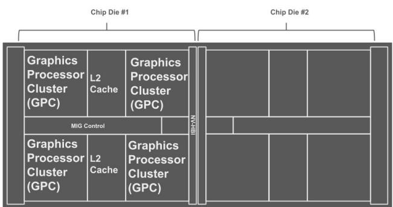
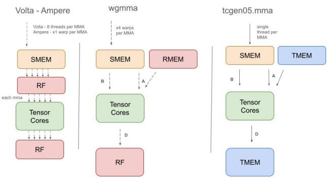

# NVIDIA Blackwell 架构微基准测试：深入的架构分析

> **原文标题**：*Microbenchmarking NVIDIA’s Blackwell Architecture: An In-depth Architectural Analysis*  
> **作者**：Aaron Jarmusch、Sunita Chandrasekaran  
> **单位**：美国特拉华大学计算机与信息科学系  
> **关键词**：Blackwell、GPU、微基准测试、高性能计算（HPC）  
> **笔记性质**：按原论文结构整理并翻译；实验数据和作者判断均保留原意。  
> **整理日期**：2026-07-17

## 摘要

随着 GPU 架构快速演进，以满足百亿亿次计算和机器学习日益增长的需求，各类架构创新对不同工作负载的性能影响仍缺乏充分理解。NVIDIA Blackwell（B200）引入了第五代 Tensor Core、Tensor Memory（TMEM）、解压缩引擎（Decompression Engine，DE）和双芯粒设计等重要进展，但系统量化这些改进的方法仍落后于硬件迭代速度。

本文贡献了一套开源微基准测试套件，为充分利用现代 GPU 架构的丰富特性提供实践依据，帮助应用开发者作出合理的架构决策，并为未来 GPU 设计提供参考。研究对比 Blackwell B200 与 Hopper H200 的内存子系统、Tensor Core 流水线，以及 FP32、FP16、FP8、FP6 和 FP4 等浮点精度。

对稠密/稀疏 GEMM、Transformer 推理和训练工作负载的系统评估表明：与 H200 相比，B200 将 ResNet-50 混合精度训练吞吐提高到 **1.85×**，将 GPT-1.3B 提高到 **1.55×**，能效则提升 **32%**。

## 1. 引言

人工智能（AI）和高性能计算（HPC）已发展为数据密集型领域，并持续挑战硬件的效率、可扩展性和数值精度。大语言模型（LLM）如今可包含数千亿参数，处理数百万 token 的上下文窗口 [1, 2]；多物理场和气候模拟也要求持续达到数万亿次浮点运算。GPU 设计因而不仅要提供大规模并行能力，还要具备架构适应性。

现代加速器必须同时平衡多项要求：为稠密张量工作负载保持高算术吞吐、降低片上和片外内存延迟，并提供有效支持混合精度计算的硬件原语。不断增长的需求暴露了现有 GPU 在内存层次、精度灵活性和延迟敏感型任务调度方面的局限，因此持续的加速器架构创新对高吞吐训练和时延关键型推理都至关重要。

作为 Hopper 的直接后继者，Blackwell 在计算流水线、内存层次和张量处理子系统方面作出了多项调整：

- 第五代 Tensor Core 原生支持 FP4 和 FP6，在大规模训练中提供精度与性能之间的新权衡。
- 新增专用片上 Tensor Memory（TMEM），用于张量数据移动，降低矩阵密集运算对共享内存（SMEM）和每个 SM 寄存器文件（RF）的依赖。
- 增加硬件解压缩引擎（DE），并重新设计指令流水线，以访问压缩后的模型权重。
- 修订线程和协作线程数组（Cooperative Thread Array，CTA）调度模型，以利用 SM 间通信和内存并发。

本文提出一套以 PTX 和 CUDA 实现的微基准测试套件，用于全面分析 NVIDIA Blackwell GPU。由于论文采用双盲评审，代码当时暂不能公开。该套件重点研究 Blackwell 相对 Hopper 的创新，系统评估计算受限和内存受限情况下的压力性能，并分析这些变化对并行计算应用的意义。

本文的主要贡献如下：

1. 构建针对性微基准，刻画 NVIDIA Blackwell B200 的关键组件。就作者所知，这是第一项针对该 GPU 的详细微基准研究。
2. 量化 TMEM 对矩阵密集工作负载的影响，以及它在缓解张量计算内存瓶颈方面的作用。
3. 评估解压缩引擎在不同格式下的吞吐，并确定较优使用方式。
4. 通过新的 `tcgen05` PTX 指令分析第五代 Tensor Core 的执行特征。
5. 研究 FP4/FP6 混合精度张量运算的性能—精度权衡。
6. 在 LLM 推理与训练、科学计算 kernel 和混合精度工作负载上评测 Blackwell，展示实际性能收益。
7. 为开发者利用 Blackwell 架构提供可操作的性能建议。

## 2. 相关工作

理解 GPU 性能长期以来一直是 HPC 研究的重点。早期针对 Tesla 和 Fermi 的工作主要分析内存与缓存行为 [4, 5]；随后对 Kepler、Pascal [6] 和 Maxwell [7] 的研究开始考察 warp 调度和指令延迟。进入 Turing 至 Hopper 时期 [8–15]，研究重点转向混合精度与 Tensor Core 性能，并引入针对 MMA 指令、tile 尺寸和数据布局的基准。近期工作还研究了指令级并行 [16] 和高寄存器压力下的流水线动态。

除微基准之外，研究者也构建了多类 GPU 性能刻画框架。应用剖析 [17] 可以收集运行时指标，但存在开销且架构可见性有限；Roofline 模型 [18] 能展示吞吐与算术强度的关系，却会简化瓶颈，无法描述动态内存行为；缓存停顿预测 [19] 可根据访问模式估计流水线延迟，但难以覆盖缓存绕过、warp 调度和内存合并等现代 GPU 复杂机制。

Accel-Sim [20]、GCoM [21] 等解析或模拟模型建立在 Hong 和 Kim 的工作 [22] 之上，能够提供有价值的 GPU 性能洞察，但都尚未建模 TMEM 或 DE 等 Blackwell 特性，因为准确模拟所需的微架构细节仍未公开。因此，研究社区缺少性能建模、工作负载优化和 AI 推理负载准确模拟所需的关键数据。

*图 1. NVIDIA Blackwell GPU 双芯粒设计，通过 NV-HBI 互连。*

## 3. Blackwell 架构

### 3.1 架构概览

B200 代表了 GPU 架构理念的一次显著转变。Tesla 至 Hopper 各代主要追求大模型训练的每秒浮点运算数（FLOPS），而 Blackwell 更强调后训练和推理效率，在内存与计算组织上作出根本性改变。

单个 B200 GPU 采用双芯粒配置 [3]：两个 GPU 芯粒合计包含 2080 亿个晶体管；148 个 SM 分布于 8 个 GPC；拥有 4 个 L2 缓存分区，是 Hopper 的两倍；并配备 8 组 HBM3e。尽管物理上分为两个芯粒，NVIDIA High-Bandwidth Interface（NV-HBI）仍向软件提供一致、统一的设备视图以及 192 GB 的统一 HBM3e 地址空间。

Blackwell 在每个 SM 中引入第五代 Tensor Core，摆脱 Volta、Ampere 和 Hopper 所采用的 warp 同步范式。此前所有 32 个线程必须在通过 `mma.sync` 或 `wgmma` 执行矩阵乘加（MMA）之前同步。这种锁步模型降低了调度灵活性，并会在依赖链长度不同时产生空闲周期。

Blackwell 用单线程指令 `tcgen05.mma` 取代 warp 同步 MMA。线程可以独立发出 MMA 操作，不再需要 warp 级同步，从而允许更细粒度的张量运算调度。操作数来自共享内存或新的 TMEM 通路。每个 SM 的 TMEM 为 Tensor Core 提供专用数据访问，软件通过 `tcgen05` 指令族显式管理其分配、数据移动和释放，使编译工具链能够精确控制 tile 局部性与流量模式。

*图 2. `tcgen05`、`wgmma` 与 Volta/Ampere 架构的 Tensor Core 指令流水线。*

独立 MMA 发射减少了空闲周期，也为编译器提供了新的优化空间，但同时带来若干未公开问题，例如依赖条件下的指令延迟、Tensor Core 并发度和流水线饱和点。本文通过系统测试对这些问题进行刻画。

Blackwell Tensor Core 还原生支持用于量化推理的 FP4 和 FP6，以进一步提高 AI 工作负载的内存与计算效率。在 thread block 层面，Blackwell 引入 CTA pair：两个相邻 rank 的 CTA 共享操作数，减少重复数据移动。每个 CTA pair 映射到一个 TPC，并通过专用 TPC 内通信网络共享操作数。

第五代 Tensor Core 原生支持卷积算子及权重驻留数据流，使用 collector buffer 缓存并复用矩阵 B（权重张量），有利于依赖操作数局部性的卷积 kernel。硬件解压缩引擎则将解压工作从通用 SM 卸载，使模型权重和大型数据库表能够以压缩形式保存在 HBM3e 中，并在内存访问过程中透明解压 [3]。

供应商资料仍未公开指令延迟、流水线深度、缓存交互和饱和行为等关键微架构信息。第 5、6 节的 PTX 微基准实验旨在填补这些空白。

## 4. PTX 微基准方法

本文使用 NVIDIA Parallel Thread Execution（PTX）刻画 Blackwell 的微架构特性。在已有 PTX 级测试方法 [4, 7, 14] 的基础上，作者设计了面向第五代 Tensor Core FP4/FP6 模式、DE 和新缓存层次的测试。

PTX 可以显式控制寄存器和架构相关内存操作，随后编译为 Streaming Assembler（SASS）指令。测试使用受控依赖的 kernel 隔离目标行为，并检查 PTX 到 SASS 的转换。

### 4.1 Blackwell 特性的测试设计

#### 4.1.1 Tensor Memory（TMEM）

此前 MMA 依赖 SMEM、分布式共享内存（DSMEM）和寄存器文件，Blackwell 则新增专门服务张量运算的 TMEM。传统数据移动指令，包括 `wmma.load`、`ldmatrix`、`ld.shared` 和 `cp.async`，都无法直接访问 TMEM；开发者必须使用新的 `tcgen05.ld`、`tcgen05.st` 和 `tcgen05.cp` 指令序列。

测试包含三种策略：

1. 使用指针追逐基准 [23] 比较共享内存与 TMEM 的访问延迟。相互依赖的 load 可以阻止流水线重叠，从而隔离单层内存延迟。
2. 在不同访问模式下比较新的 `tcgen05.*` 数据移动指令与前代指令。
3. 改变操作数大小和访问步幅，测量带宽饱和点及不同配置下的单次访问延迟。

#### 4.1.2 解压缩引擎

测试覆盖 LZ4、Snappy、Zstandard、GZIP、Cascaded、Bitcomp 和 ANS 七种压缩格式。每种格式使用 100 MB 数据集：

- 输入吞吐：从 GPU 内存读取压缩数据的速率。
- 输出吞吐：生成解压数据的速率。
- 延迟：包括内存传输在内的完整设备端解压时间。

数据预先在 CPU 上压缩，测试仅测量设备端解压。每项结果在 100 次预热后取 1000 次迭代平均值，以稳定温度和缓存状态。合成数据包含随机数据（不可压缩，1.00×）、混合字母数字（1.98×）、重复模式（15.02×）和全零缓冲区（245.45×）。

作者改变 chunk 大小（32、64、128、256 KB）和批量并发数（1–1024），寻找最佳并行度。峰值吞吐定义为效率下降前可持续的最大带宽；流水线深度是仍能维持约 85% 效率的并发级别；饱和点则是继续增加并发只能带来约 5% 边际提升的位置。

#### 4.1.3 Tensor Core

测试 kernel 使用新的 `tcgen05` 指令执行：

$$
D = A \times B + D.
$$

作者改变指令类型、矩阵 tile 形状和操作数布局。延迟测试让累加器形成依赖链，使每次 MMA 依赖前一次结果；吞吐测试则发出独立 MMA，使 Tensor Core 流水线饱和。能效分析将计算吞吐与板级功耗对比，以寻找不同精度和 tile 配置的能效最优点。

#### 4.1.4 扩展精度

测试使用 `tcgen05` PTX opcode，覆盖 E2M1（FP4）、E3M2（FP6）和 E2M3（FP6）。目的操作数上的依赖链用于阻止独立发射，从而暴露真实的 FP4/FP6 依赖延迟。

#### 4.1.5 综合工作负载

LLM 测试选用 Mistral 系列，原因包括：

1. Mistral-7B 是具有代表性的稠密 decoder，性能可接近更大的模型。
2. Mixtral-8x7B 的混合专家（MoE）架构可施加不同数据流压力。
3. 该系列公开可得，便于复现。

测试从稠密 Mistral-7B 扩展至稀疏 MoE 模型 Mixtral-8x7B 和 Mixtral-8x22B。科学计算测试包括自定义 FP64 矩阵乘 kernel、STREAM Triad [25] 和基于真实数据的 SpMV。训练测试则使用 ResNet-50 [26] 与 GPT-1.3B [27] 的端到端混合精度训练。

## 5. 内存子系统

### 5.1 Tensor Memory（TMEM）

TMEM 是每个 SM 上专供 Tensor Core 使用的 256 KB 片上内存，组织为 512 列 × 128 lane 的 32 位单元二维阵列，并采用 lane-column 寻址 [3]。它将 Tensor Core 存储与寄存器分离，使中间矩阵结果能够跨 warp group 保留，并降低对寄存器和共享内存的依赖。

Hopper 的典型流水线使用 `cp.async.bulk.tensor.2d`（或 TMA）将 tile 从全局内存复制到共享内存，再由 `ldmatrix` 或 `wmma.load` 暂存操作数；`wgmma` 可从寄存器或共享内存读取 A，从共享内存读取 B。Blackwell 的 `tcgen05` 指令族重构了这一流程：

- `tcgen05.cp`：在 TMEM 与其他存储层之间异步复制张量数据。
- `tcgen05.ld` / `tcgen05.st`：在 TMEM 与寄存器或共享内存之间 load/store。
- `tcgen05.mma`：从 SMEM 或 TMEM 读取操作数，并将累加结果直接写入 TMEM。

作者的指令级分析表明，TMEM 在 64×64 元素 tile 上效率最佳。对于 FP8，这对应 4 KB，能够充分使用 1024 位内存接口。小于 32×32 的 tile 会低效利用宽接口，大于 128×128 的 tile 则可能触发多阶段传输。因此，矩阵乘 kernel 可优先拆为 64×64 tile；注意力中的 $QK^T$、softmax 与 value multiplication 等链式操作，则可让中间结果保留在 TMEM 中，利用后续操作约 16 TB/s 的读取带宽。

Hopper 具有串行依赖：全局内存读取、共享内存写入、barrier 等待、`wgmma` 消费。Blackwell 可通过 `tcgen05.alloc`、`tcgen05.cp`、`tcgen05.ld/st` 显式管理 TMEM，并让 `tcgen05.mma` 与下一次 `tcgen05.cp` 重叠，形成双缓冲流水线。

对于 $D=(A\times B)\times C$ 这类链式矩阵乘，使中间结果留在 TMEM，可避免 Hopper 风格方案将其写回全局内存。在文中的带宽与流量假设下，每个充分利用的 Blackwell SM 估计可避免约 12 TB/s 的数据移动。

### 5.2 解压缩引擎（DE）

B200 引入专用硬件 DE，而 H100 只能进行软件解压。该子系统原生支持多种常用格式，可加速 AI/HPC 的数据加载和预处理。

**表 1. 不同压缩格式的性能（100 MB 数据集，64 KB chunk）。**

| 格式 | 压缩比 | 输入吞吐（GB/s） | 输出吞吐（GB/s） | 延迟（ms） | 适用场景 |
|---|---:|---:|---:|---:|---|
| LZ4 | 1.00× | 173.23 | 172.55 | 0.608 | — |
| Snappy | 1.91× | 61.38 | 117.24 | 0.894 | 实时处理 |
| Zstd | 2.00× | 77.50 | 154.94 | 0.677 | 通用 |
| GZIP | 2.00× | 42.00 | 83.83 | 1.251 | 遗留格式 |
| Cascaded | N/A | N/A | 213.42 | 0.491 | — |
| Bitcomp | 3.00× | 154.02 | 462.37 | 0.227 | 科学计算 |
| ANS | N/A | N/A | 539.21 | 0.194 | — |

不同算法的吞吐从 42 到 539 GB/s 不等，说明 DE 内存在格式相关的专用优化路径。Bitcomp 在数值型科学数据上达到 462.37 GB/s 输出吞吐和 0.227 ms 延迟。Zstd 的性能较均衡；Snappy 更偏向低延迟；GZIP 虽较旧，仍可服务标准化或遗留数据。

> 原文称“所有格式均为亚毫秒延迟”，但表 1 中 GZIP 为 1.251 ms。这里保留表中原始数据，并将该表述视为原文不一致。

**表 2. LZ4 对数据压缩比的敏感性（100 MB 数据集）。**

| 数据模式 | 压缩比 | 输入吞吐（GB/s） | 输出吞吐（GB/s） | 延迟（ms） |
|---|---:|---:|---:|---:|
| 随机 | 1.00× | 173.23 | 172.55 | 0.608 |
| 混合 | 1.98× | 80.11 | 158.94 | 0.660 |
| 重复 | 15.02× | 14.63 | 219.80 | 0.477 |
| 全零 | 245.45× | 0.85 | 209.83 | 0.500 |

表 2 表明，在该 B200 LZ4 测试中，主导限制是解压后的输出带宽，而不是压缩输入带宽或 DE 算力。输出吞吐大致稳定在 160–220 GB/s，输入吞吐则随压缩比 $C$ 近似按 $1/C$ 下降。不可压缩数据相当于直通，因此输入与输出速率接近；高压缩比数据中，一个输入字节会展开为多个输出字节，输出带宽接近上限后，压缩输入速率必然降低。

**表 3. 不同 chunk 大小下的流水线深度。**

| Chunk 大小 | 峰值吞吐（GB/s） | 流水线深度（并发操作数） | 饱和批量 | 相对串行最大加速 |
|---|---:|---:|---:|---:|
| 32 KB | 55.84 | 1 | 1024 | 89.11× |
| 64 KB | 71.70 | 2 | 512 | 60.61× |
| 128 KB | 87.67 | 8 | 256 | 35.77× |
| 256 KB | 112.10 | 8 | 256 | 47.19× |

小、中型 chunk（32–64 KB）用 1–2 层浅流水线即可接近峰值，大 chunk（128–256 KB）则受益于约 8 路并发。峰值吞吐从 32 KB 时的 55.84 GB/s 增至 256 KB 时的 112.10 GB/s。32 KB 在批量 1024 前仍有增益，而 128–256 KB 在约 256 个请求时达到较高效率；继续增加并发会因 DRAM 和内部缓冲区压力而收益递减。

实践上，小文件可使用 32–64 KB chunk、1–2 层流水线和约 512–1024 的大批量；大文件可使用 128–256 KB chunk、约 8 层并发和约 256 的批量。

## 6. GPU 核心微架构

### 6.1 第五代 Tensor Core

Tensor Core PTX 指令会根据操作数精度编译为 HMMA、HGMMA、QMMA、QGMMA、IMMA、IGMMA 或其他 SASS 指令。Blackwell 的 `tcgen05.mma` 会按精度生成不同 SASS，区别于 Hopper 较统一的 `wgmma` 路径。

**表 4. Blackwell Tensor Core 的 PTX → SASS 映射。**

| 精度 | PTX（`tcgen05.mma`） | SASS | `wgmma` |
|---|---|---|---|
| FP16、BF16 | `kind::f16` | HMMA | HGMMA |
| FP32、TF32 | `kind::tf32` | HMMA | HGMMA |
| FP8 | `kind::mxf8` / `f8f6f4` | QMMA | QGMMA |
| FP6 | `kind::mxf6` | QMMA | N/A |
| FP4 | `kind::mxf4` / `mxf4nvf4` | OMMA | N/A |
| INT4、INT8 | `kind::i8` | IMMA | IGMMA |
| FP64 | 不支持 | — | DMMA |

> `tcgen05.mma` 使用 descriptor 形式（`cta_group::1.kind::*`）。FP64 不走 `tcgen05`/TMEM 路径；B200 FP64 使用独立路径和 DMMA。

**表 5. Hopper `wgmma` 与 Blackwell `tcgen05.mma` 的单指令延迟（FP16）。**

| 指令 | Tile 形状 | 作用域 | SI-LAT（cycle） |
|---|---|---|---:|
| `wgmma` | m64n64k16 | Warp group | 32.0 |
| `wgmma` | m64n128k16 | Warp group | 64.0 |
| `wgmma` | m64n256k16 | Warp group | 128.0 |
| `tcgen05.mma` | m64n64k16 | Warp | 11.0 |
| `tcgen05.mma` | m128n128k16 | Warp | 11.3 |
| `tcgen05.mma` | m256n256k16 | Warp | 11.4 |

依赖链测试表明，在所测 tile 上，Blackwell 单指令延迟比 Hopper 低 **2.9–11.2×**。Blackwell 的延迟在 11.0–11.4 cycle 间近似恒定，而 Hopper 会随 tile 宽度线性增加。作者推测 tile 大小主要影响吞吐而非延迟；测试并未直接测量流水线深度，因此只能说结果与空间阵列式设计一致。

从 Hopper 的 warp-group 级（128 线程）变为 Blackwell 的 warp 级（32 线程），还可减少同步开销。在 Hopper 中，4 个 warp 必须为每次 `wgmma` 同步；Blackwell 不再有这一要求。

**表 6. 各精度 Tensor Core 性能。**

| 输入 A/B | 累加 C/D | 形状 | 延迟（cycle） | 吞吐（TFLOPS/TOPS） |
|---|---|---|---:|---:|
| FP16 | FP16 | m64n8k16 | 11.2 | 964.8 |
| FP16 | FP32 | m64n8k16 | 11.5 | 482.4 |
| BF16 | FP32 | m64n8k16 | 11.4 | 481.6 |
| FP8 | FP16 | m64n8k16 | 11.8 | 1925.3 |
| FP8 | FP32 | m64n8k16 | 12.1 | 1912.8 |
| FP6 | FP16 | m64n8k16 | 12.3 | 2567.2 |
| FP4 | FP16 | m64n8k16 | 12.6 | 3850.1 |
| INT8 | INT32 | m64n8k16 | 11.9 | 3928.5 |

各精度吞吐相差 8.2×，延迟却只相差 1.12×，说明吞吐扩展更可能来自更宽的数据通路和更高并行度，而非更深的流水线。FP16 输入采用 FP32 累加会将吞吐减半（964.8 → 482.4 TFLOPS），表明瓶颈位于累加器数据通路而非乘法单元。

### 6.2 FP4 与 FP6

Blackwell 原生支持 FP4 和 FP6。CUTLASS 反汇编显示 FP4 使用 OMMA；PTX ISA 则将 `kind::mxf6` 映射为 QMMA。FP4/FP16 和 FP6/FP16 配置采用 FP32 累加，报告吞吐已经包含累加器通路成本。

FP4 的 E2M1 格式由 1 个符号位、2 个指数位和 1 个尾数位组成。Blackwell 支持：

- **MXFP4**：以 32 个值为一组，使用 E8M0 scale。
- **NVFP4**：以 16 个值为一组，使用 E4M3 scale，缩放粒度更细。

FP6 可使用 1 个符号位、3 个指数位和 2 个尾数位，在动态范围上优于 FP4，相对 FP8 仍可节省约 1.33× 的存储与带宽。

**表 7. 不同精度下的 Tensor Core 吞吐。**

| 精度 | B200 | B200 峰值利用率 | H200 | 加速 |
|---|---:|---:|---:|---:|
| FP64 | 44.8 | 99.6% | 34.0 | 1.32× |
| FP32 | 482.0 | 96.4% | 378.4 | 1.27× |
| TF32 | 964.5 | 96.5% | 756.9 | 1.27× |
| BF16 | 1926.4 | 96.3% | 1513.5 | 1.27× |
| FP16 | 1929.6 | 96.5% | 1515.2 | 1.27× |
| FP8 | 3850.6 | 96.3% | 3026.9 | 1.27× |
| FP6 | 5134.4 | 96.0% | N/A | 新增 |
| FP4 | 7700.2 | 96.2% | N/A | 新增 |
| INT8 | 3928.5 | 98.2% | 3088.4 | 1.27× |

所测精度均达到理论峰值的 96%–99%。在这些测试中 Tensor Core 本身并非瓶颈，内存带宽和 kernel 启动开销更占主导。

## 7. 性能分析与案例

### 7.1 实验方法

每项指标先预热 10 次，再对 100 次迭代求平均。延迟报告中位数、P95 和 P99，以反映长尾。能耗通过 NVML API 以 10 ms 间隔采样。

所有 B200 和 H200 测试均使用 CUDA 12.6、同一 toolkit 中的 cuBLAS/cuBLASLt，以及 PyTorch 2.4；LLM 推理和训练在适用时使用 Transformer Engine。DGEMM 和 STREAM 使用相同的 560.x 驱动与 NVCC 12.6。L2 命中率来自 Nsight Compute 的内存工作负载指标。

### 7.2 大语言模型推理

#### 7.2.1 精度模式

测试比较 FP16、FP8（E4M3，逐 tensor 动态量化）和 FP4（E2M1、NVFP4 block-16 权重量化、FP8 激活），统一使用 batch size 32、序列长度 2048。

**表 8. 不同精度下的 LLM 推理性能。**

| 模型 | 精度 | B200 tok/s | H200 tok/s | B200/H200 | B200 BW% | H200 BW% | 困惑度 | ΔPPL |
|---|---|---:|---:|---:|---:|---:|---:|---:|
| Mistral-7B | FP16 | 56,028 | 28,500 | 1.97× | 67.3 | 71.2 | 6.82 | — |
| Mistral-7B | FP8 | 57,125 | 49,200 | 1.16× | 58.4 | 62.8 | 6.95 | +1.9% |
| Mistral-7B | FP4 | 112,800 | N/A | N/A | 47.6 | N/A | 7.38 | +8.2% |
| Mixtral-8x7B | FP16 | 31,033 | 18,100 | 1.71× | 72.1 | 76.4 | 5.94 | — |
| Mixtral-8x7B | FP8 | 51,200 | 32,400 | 1.58× | 61.8 | 65.2 | 6.08 | +2.4% |
| Mixtral-8x7B | FP4 | 76,900 | N/A | N/A | 49.1 | N/A | 6.48 | +9.1% |

低精度减少内存流量并提高缓存局部性，L2 命中率由 68% 增至 84%。随着精度降低，B200 带宽利用率从 FP16 的 67.3% 降到 FP4 的 47.6%，表明工作负载逐步从内存受限转向计算吞吐受限。

稀疏 MoE 从量化中获益更明显：Mixtral-8x7B 的 FP4 相对 FP16 提升 2.69×，Mistral-7B 则为 2.50×。代价是模型质量下降：FP8 的困惑度增加 1.9%–2.4%，FP4 增加 7.7%–9.1%。

> 原文叙述称 B200 在 FP16/FP8 下相对 H200 均为 1.57–1.59×，但表 8 的 Mistral-7B 数据分别给出 1.97× 和 1.16×。本译文保留表中原始值，不替作者推断。

#### 7.2.2 Batch size 敏感性

**表 9. Mixtral-8x7B、FP8、2048 token 下的延迟与 batch size。**

| Batch size | B200（ms） | H200（ms） | H200/B200 | B200 tok/s |
|---:|---:|---:|---:|---:|
| 1 | 12.3 | 18.7 | 1.52× | 166,504 |
| 2 | 14.8 | 22.1 | 1.49× | 276,757 |
| 4 | 19.2 | 28.4 | 1.48× | 426,667 |
| 8 | 28.6 | 41.3 | 1.44× | 572,727 |
| 16 | 47.1 | 67.8 | 1.44× | 696,178 |
| 32 | 89.3 | 128.4 | 1.44× | 734,264 |

小 batch 下 B200 相对 H200 提升 1.48–1.52×，高 batch 下稳定在 1.44×。作者推测系统会自动重构流水线，将处理阶段从 18–20 级缩减到 8–10 级，但该机制没有直接测量。B200 的 P99/中位数延迟比为 1.12–1.14，H200 为 1.23–1.38，说明 B200 长尾更稳定。

### 7.3 科学计算

#### 7.3.1 FP64

`tcgen05.mma` 不支持 FP64，因此 FP64 DGEMM 使用独立执行路径。B200 在大矩阵上达到 36.3 TFLOPS，即文中 40 TFLOPS 理论峰值的 80.7%；H200 为 18.9 TFLOPS，即 34 TFLOPS 峰值的 55.6%。作者将超出规格比值的额外效率提升归因于加倍的 FP64 单元和改进的内存访问合并。

**表 10. DGEMM FP64 性能。**

| 矩阵规模 | B200（TFLOPS） | H200（TFLOPS） | 加速 | B200 峰值利用率 | H200 峰值利用率 |
|---|---:|---:|---:|---:|---:|
| $8192^3$ | 35.45 | 18.2 | 1.95× | 78.8% | 53.5% |
| $16384^3$ | 36.14 | 18.7 | 1.93× | 80.3% | 55.0% |
| $32768^3$ | 36.30 | 18.9 | 1.92× | 80.7% | 55.6% |

#### 7.3.2 持续内存带宽

STREAM Triad 使用 3 个数组，因此 64 GB 和 128 GB 的数组规模分别需要至少 192 GB 和 384 GB 设备内存。测试节点容量不足，只报告 4–16 GB。B200 在这一区间达到约 4.14 TB/s，即 8 TB/s 峰值的约 52%。

**表 11. STREAM Triad 内存带宽。**

| 数组大小 | B200（TB/s） | B200 峰值利用率 |
|---:|---:|---:|
| 4 GB | 4.141 | 51.8% |
| 16 GB | 4.140 | 51.8% |

#### 7.3.3 稀疏操作

作者使用软件压缩的稀疏表示测试 SpMV，并称相对未压缩基线获得约 3.16× 加速；对稀疏行指针数组，RLE 压缩比约为 8.2×。DE 的吞吐、延迟和流水线深度见第 5 节。

**表 12. B200 上结合硬件解压的 SpMV。**

| 矩阵 | 稀疏度 | GFLOPS | 加速 | 平均时间（ms） |
|---|---:|---:|---:|---:|
| webbase-1M | 99.99% | 5.08 | 3.16× | 39.32 |
| circuit5M | 99.95% | 4.94 | 3.16× | 201.44 |
| ldoor | 99.98% | 5.03 | 3.16× | 71.93 |

### 7.4 混合精度训练

**表 13. 端到端训练性能。**

| 模型 | Batch size | B200 吞吐 | H200 吞吐 | 加速 | B200 达标时间（h） | H200 达标时间（h） | B200 能效 |
|---|---:|---:|---:|---:|---:|---:|---:|
| ResNet-50 | 1024 | 2,928 img/s | 1,580 img/s | 1.85× | 0.87 | 1.62 | 5.09 img/s/W |
| GPT-1.3B | 128 | 14,363 tok/s | 9,240 tok/s | 1.55× | 5,788 | 9,020 | 20.63 tok/s/W |
| GPT-1.3B | 64 | 14,121 tok/s | 9,070 tok/s | 1.55× | 5,893 | 9,184 | 20.27 tok/s/W |

作者将训练加速分解为 SM 数量 1.09×、CTA pairing 1.27× 和 TMEM 1.26×，但该分解并未直接测量。GPT 训练尽管功耗更高，整体能效仍得到改善。

## 8. 讨论

**表 14. 各工作负载的性能总结。**

| 工作负载 | 指标 | B200 | H200 | 改进 | 关键特性 |
|---|---|---:|---:|---:|---|
| LLM 推理（7B，FP4） | tok/s | 112,800 | N/A | 相对 FP16 为 2.50× | FP4 Tensor Core |
| LLM 推理（8x7B，FP8） | tok/s | 51,200 | 32,400 | 1.58× | 第五代 Tensor Core、TMEM |
| LLM 推理（BS=1，FP8） | 延迟（ms） | 12.3 | 18.7 | 1.52× | 延迟流水线 |
| Attention block | 延迟（μs） | 284 | 468 | 1.65× | TMEM |
| HPC DGEMM（FP64） | TFLOPS | 36.3 | 18.9 | 1.92× | 加倍 FP64 单元 |
| STREAM Triad（4–16 GB） | TB/s | 4.14 | — | — | HBM3e |
| SpMV（压缩） | GFLOPS | 5.08 | 3.2 | 1.58× | 解压缩引擎 |
| GPT 训练（1.3B） | tok/s | 14,363 | 9,240 | 1.55× | CTA pair、TMEM、Tensor Core |
| ResNet 训练 | img/s | 2,928 | 1,580 | 1.85× | 第五代 Tensor Core、内存带宽 |
| 训练能效 | tok/s/W | 20.63 | 15.6 | 1.32× | 制程与效率 |

### 8.1 架构权衡

TMEM、双模式 Tensor Core 和 DE 增加了晶体管数量（2080 亿，对比 1800 亿），同时带来约 1.5–3.9× 的收益。需要注意的代价包括：

1. TMEM 能缓解寄存器压力与 L2 流量，但需要显式分配和 `tcgen05` 数据移动，kernel 必须针对 Blackwell 重写。
2. DE 受输出带宽限制。数据压缩比很高时，压缩输入吞吐会按约 $1/C$ 下降，因此只有在瓶颈位于解压输出而非输入时收益最明显。
3. `tcgen05.mma` 不支持 FP64；FP64 DGEMM 使用独立路径，TMEM 不会直接改善 FP64 科学计算 kernel。

### 8.2 软件生态

论文称 CUDA 13.0 提供初步的 TMEM/CTA 支持，框架集成仍在推进。FP6 虽有硬件能力，但软件工具尚不成熟。FP4/FP6 需要逐层选择精度：FP4 平均约 8.2% 的困惑度劣化不能代表所有层，一些层可容忍 FP4，另一些仍需 FP8。

### 8.3 性能建议

1. 对 accumulator staging 和多阶段张量流水线使用 TMEM，例如融合注意力的 $QK^T$、softmax 和 value multiplication；单次小矩阵应减少 TMEM 往返。
2. 根据压缩比调整 DE 使用方式。可预期约 170–220 GB/s 的解压输出，而压缩输入速率会随压缩比近似成反比。
3. GEMM 和 LLM 推理应利用 warp 级 `tcgen05.mma` 与 CTA pair，并以 64×64 tile 作为 TMEM 调优起点。
4. LLM 推理中，FP8 在吞吐与质量之间较均衡；经过逐模型验证后，FP4 可用更明显的质量损失换取更高吞吐。

## 9. 结论

NVIDIA B200 标志着 GPU 架构的一次重要转变。本文给出了首套基于详细微基准的 Blackwell B200 刻画，量化了 TMEM 对矩阵密集工作负载的影响，评估了硬件解压缩引擎的吞吐与使用方式，并通过新的 `tcgen05` PTX 指令分析第五代 Tensor Core。

研究进一步讨论 FP4/FP6 的精度权衡，并在 LLM 推理、科学计算 kernel 和混合精度训练中评测 Blackwell。实验主要覆盖单芯粒行为；双芯粒 NV-HBI 交互和跨芯粒延迟仍留待后续研究。

## 致谢

本研究使用 NVIDIA Brev Cloud Compute 与 Google Cloud Provider 的资源，并得到美国能源部项目 DE-FOA-0003177（S4PST：Next Generation Science Software Technologies Project）的支持。

## 参考文献

> 参考文献题名与出版信息保留英文，链接按原文整理；原文中断开的 URL 已合并。

1. Y. Ding et al., “LongRoPE: Extending LLM Context Window Beyond 2 Million Tokens,” 2024. <https://doi.org/10.48550/arXiv.2402.13753>
2. D. Kevian et al., “Capabilities of Large Language Models in Control Engineering,” 2024. <https://arxiv.org/abs/2404.03647>
3. NVIDIA Corporation, *NVIDIA Blackwell Architecture Technical Brief*, 2024. <https://resources.nvidia.com/en-us-blackwell-architecture>
4. H. Wong et al., “Demystifying GPU Microarchitecture through Microbenchmarking,” ISPASS, 2010.
5. S. S. Ajeetha, *Architectural Analysis and Performance Characterization of NVIDIA GPUs Using Microbenchmarking*, Ph.D. dissertation, 2012.
6. X. Zhang et al., “Understanding the GPU Microarchitecture to Achieve Bare-Metal Performance Tuning,” PPoPP, 2017. <https://doi.org/10.1145/3018743.3018755>
7. X. Mei and X. Chu, “Dissecting GPU Memory Hierarchy through Microbenchmarking,” IEEE TPDS, 2017.
8. M. Fasi et al., “Numerical Behavior of NVIDIA Tensor Cores,” PeerJ Computer Science, 2021. <https://doi.org/10.7717/peerj-cs.330>
9. Z. Jia et al., “Dissecting the NVIDIA Turing T4 GPU via Microbenchmarking,” 2019. <https://arxiv.org/abs/1903.07486>
10. G. Tan et al., “Fast Implementation of DGEMM on Fermi GPU,” SC, 2011. <https://doi.org/10.1145/2063384.206343>
11. S. Markidis et al., “NVIDIA Tensor Core Programmability, Performance & Precision,” IPDPSW, 2018. <https://doi.org/10.1109/IPDPSW.2018.00091>
12. M. Martineau et al., “Benchmarking the NVIDIA V100 GPU and Tensor Cores,” Euro-Par Workshops, 2019.
13. M. A. Raihan et al., “Modeling Deep Learning Accelerator Enabled GPUs,” ISPASS, 2019.
14. D. Yan et al., “Demystifying Tensor Cores to Optimize Half-Precision Matrix Multiply,” IPDPS, 2020.
15. W. Luo et al., “Dissecting the NVIDIA Hopper Architecture through Microbenchmarking and Multiple Level Analysis,” 2025. <https://arxiv.org/abs/2501.12084>
16. W. Sun et al., “Dissecting Tensor Cores via Microbenchmarks,” IEEE TPDS, 2023.
17. B. R. Coutinho et al., “Profiling General Purpose GPU Applications,” 2009.
18. M. Leinhauser et al., “Metrics and Design of an Instruction Roofline Model for AMD GPUs,” 2021. <https://arxiv.org/abs/2110.08221>
19. W. Jia et al., “Characterizing and Improving the Use of Demand-Fetched Caches in GPUs,” ICS, 2012. <https://doi.org/10.1145/2304576.2304582>
20. M. Khairy et al., “Accel-Sim: An Extensible Simulation Framework for Validated GPU Modeling,” ISCA, 2020.
21. J. Lee et al., “GCoM: A Detailed GPU Core Model for Accurate Analytical Modeling of Modern GPUs,” ISCA, 2022. <https://doi.org/10.1145/3470496.3527384>
22. S. Hong and H. Kim, “An Analytical Model for a GPU Architecture with Memory-Level and Thread-Level Parallelism Awareness,” 2009. <https://doi.org/10.1145/1555815.1555775>
23. V. Volkov and J. W. Demmel, “Benchmarking GPUs to Tune Dense Linear Algebra,” SC, 2008.
24. A. Q. Jiang et al., “Mistral 7B,” 2023. <https://arxiv.org/abs/2310.06825>
25. J. D. McCalpin, “Memory Bandwidth and Machine Balance in Current High Performance Computers,” 1995.
26. K. He et al., “Deep Residual Learning for Image Recognition,” 2015. <https://arxiv.org/abs/1512.03385>
27. L. Gao et al., “The Pile: An 800GB Dataset of Diverse Text for Language Modeling,” 2020.
28. B. D. Rouhani et al., “Microscaling Data Formats for Deep Learning,” 2023. <https://api.semanticscholar.org/CorpusID:264146384>
29. B. Chmiel et al., “FP4 All the Way: Fully Quantized Training of LLMs,” 2025. <https://arxiv.org/abs/2505.19115>
30. T. Dettmers and L. Zettlemoyer, “The Case for 4-bit Precision: k-bit Inference Scaling Laws,” 2023. <https://arxiv.org/abs/2212.09720>
31. NVIDIA Corporation, *NVIDIA Blackwell B200 Datasheet*, 2024.
