# ZipServ: Fast and Memory-Efficient LLM Inference with Hardware-Aware Lossless Compression

> **作者**：Ruibo Fan、Zeyu Li、Xiangrui Yu、Wei Wang、Weile Luo、Xinglin Pan、Qiang Wang、Xiaowen Chu  
> **会议**：ASPLOS ’26  
> **整理说明**：本段对应原文第 1–300 行；保留压缩格式、CUDA kernel、公式、实验数据和本地图片引用。

## 摘要

无损模型压缩可以缓解 bit-exact LLM 服务中的内存和带宽瓶颈，但传统熵编码生成变长 bitstream，解码需要串行、数据相关操作，与 GPU 的 SIMT 并行执行不匹配；系统层面将解压与计算分离又会产生冗余内存流量。

本文提出 ZipServ，一套面向高效 LLM 推理协同设计的无损压缩框架。其核心包括：

- **Tensor-Core-Aware Triple Bitmap Encoding（TCA-TBE）**：固定长度编码，可常数时间并行解码；
- **ZipGEMM**：融合解压与 GEMM 的 kernel，将权重直接解压到 Tensor Core 寄存器。

“加载压缩数据、计算解压数据”的设计消除了中间缓冲区。实验表明，ZipServ 最多将模型缩小 30%，相对 NVIDIA cuBLAS 的 kernel 加速最高 2.21×，相对 vLLM 的端到端推理平均加速 1.22×；相对 DFloat11 的 kernel 加速最高 5.53×。

**关键词**：LLM 推理、无损压缩、GEMM、GPU、Tensor Core。

## 1. 引言

GPT-4、LLaMA-3 和 Qwen-3 等 LLM 的规模带来了 GPU 内存容量和带宽瓶颈，尤其是在资源受限环境中。现有量化（GPTQ、AWQ）和剪枝（SparseGPT）通常是有损的，可能导致显著精度下降：例如 MXFP4 在 Live-CodeBench 上可使准确率从 56.0% 降至 36.2%，GPTQ-int8 在长上下文推理上也可能损失 11.1%。因此，安全关键和面向用户的服务需要保证 bit-exact 的模型表示。

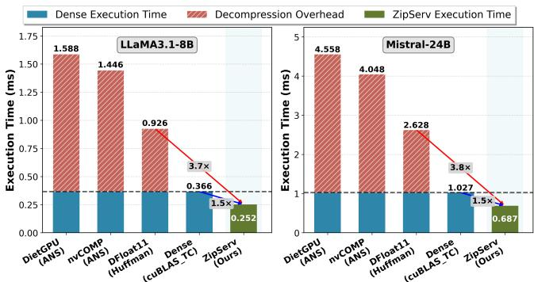

*图 1. NVIDIA L40S 上 GateUp_Proj 层的无损压缩流水线执行时间。*

LMC、ZipNN 用 Huffman 压缩 checkpoint；NeuZip、DietGPU 减少训练中的内存和通信；DFloat11 尝试把无损压缩用于推理，但解压阶段单独就需要核心推理时间的 1.56–3.44×，形成内存效率和运行时效率之间的矛盾。

作者认为，矛盾来自算法与 GPU 架构的错配：

1. **kernel 层**：Huffman/ANS 等熵编码产生变长 bitstream，解码需要串行和数据相关的查表、指针前进，导致 warp 分歧和资源利用率低。
2. **系统层**：传统流水线先将完整解压权重写入全局内存，再交给计算 kernel，产生重复、高延迟的内存访问，抵消压缩带来的带宽收益。

ZipServ 观察到现代 LLM 的 BF16 权重指数位分布高度偏斜、熵低，因此提出固定长度的 TCA-TBE：为高频指数分配 3-bit codeword，并用三个 bitmap 表示三个 bit-plane；ZipGEMM 在寄存器中即时解码，直接供 Tensor Core MMA 使用。

作者将 ZipServ 与 DietGPU、nvCOMP 和基于 Huffman 的 DFloat11 比较，在 RTX4090、L40S、RTX5090 上均获得 kernel 和系统级加速。ZipGEMM 相对 cuBLAS 最多 2.21×，相对 DFloat11 最多 5.53×，端到端相对 vLLM 平均 1.22×。

主要贡献：

- 揭示熵编码与 GPU 在 kernel 和系统层面的错配；
- 提出适合 SIMT 和 Tensor Core tile 的固定长度 TCA-TBE；
- 设计将解压直接写入 Tensor Core 寄存器的 ZipGEMM；
- 实现并评估在多模型、多 GPU 上具有端到端加速的 ZipServ。

## 2. 背景

### 2.1 基于 Transformer 的 LLM

Transformer LLM 由多头注意力、前馈网络（FFN）和归一化层堆叠而成。推理包括 prefill 和 decode 两个阶段：

- **prefill**：对 prompt 中的多个 token 并行计算，矩阵乘规模大、算术强度高；
- **decode**：逐 token 生成，矩阵乘通常只涉及每个 batch 元素的一个 token，计算利用率低，更受内存带宽限制。

两阶段的主导操作都是稠密矩阵乘：

$$
Y=WX,
$$

其中 $W\in\mathbb{R}^{M\times K}$ 是权重，$X\in\mathbb{R}^{K\times N}$ 是激活。

### 2.2 BFloat16 格式

BF16 是 LLM 推理的事实标准，由 1 个符号位、8 个指数位和 7 个尾数位组成。其指数范围与 IEEE FP32 相同，但尾数精度较低；相较 FP16，它能降低大模型中的溢出和下溢风险。

$$
\operatorname{BF16}(x)
=(-1)^{\mathrm{sign}}\times2^{\mathrm{exponent}-127}
\times(1.\mathrm{mantissa}).
$$

### 2.3 GPU 与 Tensor Core 执行

现代 GPU 包含多个 SM、SIMT Core、Tensor Core、寄存器、共享内存和缓存。32 个线程组成一个 warp。NVIDIA Tensor Core 可用 `mma.sync.m16n8k16` 执行 BF16 FMA。典型片段操作为：

$$
D_{\mathrm{frag}}
=A_{\mathrm{frag}}\times B_{\mathrm{frag}}+C_{\mathrm{frag}},
$$

其中 A、B 是输入片段，C 是 FP32 累加片段，32 个线程协作并将片段元素分布到各自寄存器中。

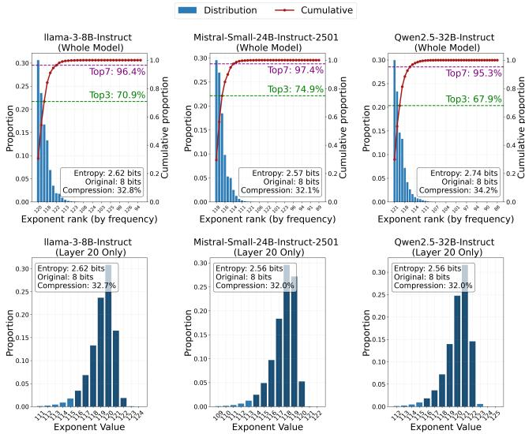

*图 2. LLM 权重中的指数位分布。*

## 3. 研究空白与机会

无损压缩可保证 bit-exact 表示，但传统方案在 GPU 推理中运行时开销很高。本节量化 BF16 权重的可压缩性，并分析 ZipServ 要解决的 kernel 与系统瓶颈。

### 3.1 BF16 权重的可压缩性

作者分析 Llama-3-8B-Instruct、Mistral-Small-24B-Instruct-2501 和 Qwen2.5-32B-Instruct，发现 8-bit 指数字段高度偏斜：最常见的 3 个指数覆盖超过 67% 权重，最常见的 7 个指数覆盖超过 95%（Llama-3 为 96.4%，Mistral-24B 为 97.4%）。指数熵仅 2.57–2.74 bit，低于分配的 8 bit，对 BF16 的理论无损压缩比约为 1.51×。

作者进一步检查来自 Gemma-3、Mistral、Qwen2.5、LLaMA-3.1 四个家族的 3,875 个权重矩阵，发现 99.6% 的矩阵中最常见的 7 个指数构成连续序列 $(e^\star,\ldots,e^\star+6)$。连续窗口平均覆盖 97.1% 权重，接近信息论上限；这正是 TCA-TBE 用固定长度 base-plus-offset 表示取代 Huffman 等变长编码的基础。

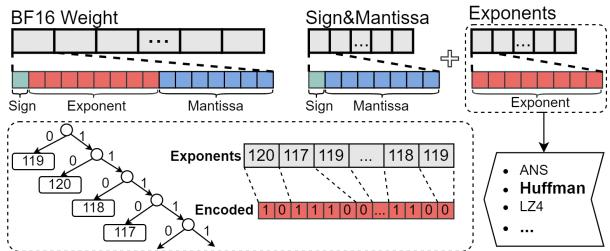

*图 3. BF16 权重的传统无损压缩方式：Huffman 编码。*

### 3.2 kernel 层算法—架构错配

DFloat11 使用 Huffman，DietGPU 使用 ANS。它们的变长符号会跨越 chunk 边界，需要额外元数据；层次查表是数据相关操作，warp 内不同符号长度会造成分歧；符号长度只有解码后才知道，因此指针更新天然串行。

在 L40S 上，DietGPU 和 DFloat11 分别只达到峰值内存带宽的 43.7% 和 76.5%。熵编码的随机数据依赖性与 GPU 所需的规则、统一并行性存在根本冲突。

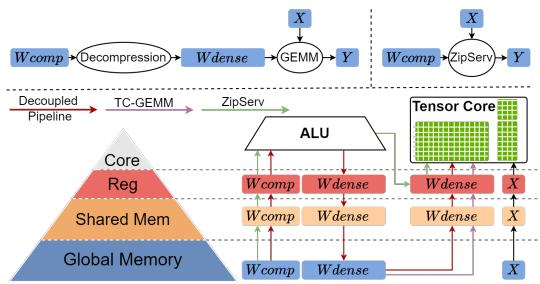

*图 4. 传统无损压缩推理流水线。*

### 3.3 解耦推理流水线的低效

传统做法先把完整解压权重写入全局内存，再由计算 kernel 读取，导致重复数据传输。对 BF16 GEMM：

$$
Y_{M\times N}=W_{M\times K}X_{K\times N},
$$

计算强度为：

$$
CI_{\mathrm{GEMM}}
=\frac{MNK}{MK+KN+MN}.\tag{1}
$$

若压缩比为 CR=1.51，解耦流水线的计算强度约为：

$$
CI_{\mathrm{Decoupled}}
=\frac{2MNK}{MK(2/\mathrm{CR}+4)+2(KN+MN)}
\approx\frac{MNK}{2.66MK+KN+MN}.\tag{2}
$$

在 RTX4090 Roofline 分析中，decode 阶段和标准 GEMM 都处于内存受限区。对 $M=K=4096$，batch 为 8、16、32、64 时，解耦流水线相对标准 GEMM 的计算强度分别下降 62.3%、62.2%、62.0% 和 61.7%。

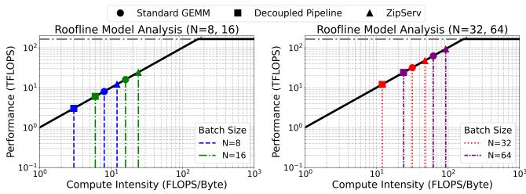

*图 5. Roofline 分析。*

ZipServ 将解压与 GEMM 融合：从 DRAM 直接读取压缩权重，在寄存器中即时解压并送入 Tensor Core，从而：

$$
CI_{\mathrm{ZipServ}}
=\frac{2MNK}{MK(2/\mathrm{CR})+2(KN+MN)}
\approx\frac{MNK}{0.66MK+KN+MN}.\tag{3}
$$

融合设计的计算强度甚至比未压缩 GEMM 高约 50%，因为避免了将解压权重写回全局内存。

## 4. ZipServ 设计

### 4.1 总体流程

ZipServ 根据 prefill/decode 的工作负载特征选择流水线。prefill 的矩阵规模大、计算强度高，使用高吞吐解压 kernel 将权重写入全局内存，再进行 GEMM，以摊薄解压开销。decode 是内存受限的，使用融合 ZipGEMM，采用“加载压缩数据、计算解压数据”的方式，将权重直接解压到 Tensor Core 寄存器。

### 4.2 Tensor-Core-Aware Triple Bitmap Encoding

TCA-TBE 为每个权重元素分配固定长度 3-bit codeword（000–111）。离线压缩时统计指数直方图，将最常见的 7 个指数映射到 001–111；000 作为 fallback，表示指数不在高频集合中的权重，并以完整精度存储。

3-bit 是近似最优选择。若 codeword 长度为 $n$，覆盖率为 $r_n$：

$$
\mathrm{AverageBits}(n)
=r_n(n+8)+(1-r_n)(n+16).
$$

对 $n=3$，$r_3\approx0.96$，平均约 11.3 bit/元素，接近理论下界 10.6 bit；2-bit 为约 12.4 bit，4-bit 为约 12.1 bit。

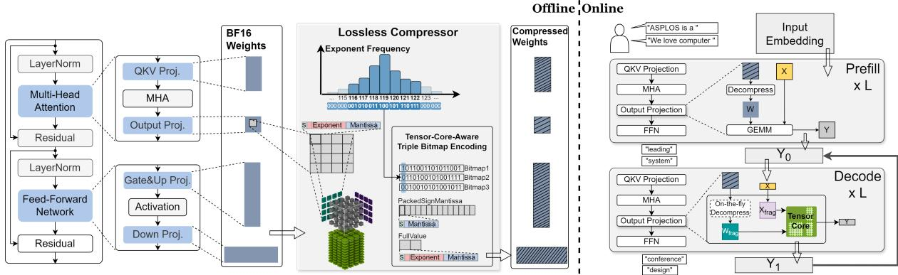

*图 6. ZipServ 总体结构：离线无损压缩器与在线推理引擎。*

**算法 1. ZipServ 离线压缩器。**

1. 对权重矩阵 W 统计指数直方图，选择连续的 top-7 指数。
2. 设置 `base_exp=min(top_exponents)-1`。
3. 对每个 8×8 tile 初始化三个 64-bit bitmap。
4. 对每个元素：若指数在 top-7 中，计算 3-bit code，分别写入三个 bit-plane，并把符号/尾数压入 `PackedSignMantissa`；否则写入 `FullValue` fallback 缓冲区。
5. 将三个 bitmap 写入全局 `B1..B3` 数组。

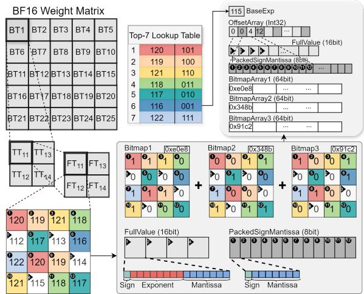

*图 7. Tensor-Core-Aware Triple Bitmap Encoding；实际 FragTile 为 8×8。*

TCA-TBE 不把 3-bit codeword 打包成密集 bitstream，而是拆成三个独立 64-bit bitmap。这样每个 bitmap 都是自然对齐的连续字，访问合并且无需处理跨 word 的非对齐代码，也避免分支分歧。

层次 tile 包括：

1. **FragTile（FT）**：8×8，对应 Tensor Core 最小 operand fragment；
2. **TensorCoreTile（TT）**：16×16，由 2×2 FragTile 组成，对应 `mma.m16n8k16`；
3. **BlockTile（BT）**：64×64，由 thread block 协作处理。

每个 FragTile 使用三个 bitmap、`PackedSignMantissa` 和 `FullValue` 五类缓冲区；Offset 数组记录各 GroupTile 在两个值缓冲区中的起始位置。

### 4.3 融合 ZipGEMM kernel

ZipGEMM 从全局内存加载 TCA-TBE 压缩权重，并在计算时即时解压，降低 decode 阶段每个 token 的带宽需求。

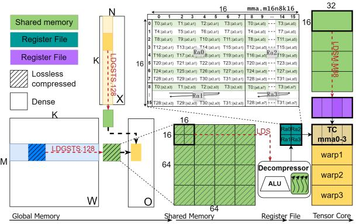

*图 8. 数据移动与指令流水线。*

每个 split-K tile 依次执行：

1. **Tile loading**：使用异步、向量化 `LDGSTS.128` 将压缩权重和激活加载到共享内存，并绕过 L1；
2. **Warp-level decoding**：warp 独立解压权重，直接生成 Tensor Core 所需布局；
3. **Activation register transfer**：用 `LDSM.M88` 将 16×16 激活 tile 从共享内存装入寄存器；
4. **Tensor Core computation**：寄存器中的权重和激活执行 `mma`。

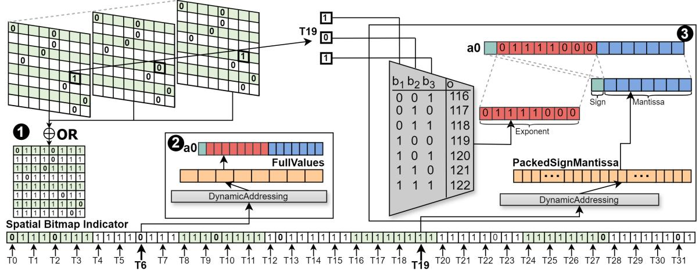

*图 9. ZipGEMM 解压器设计。*

解压器先将三个 bitmap OR 成空间指示 mask，再用 `POPC` 计算线程本地偏移。高频路径根据三个 bit-plane 重建 codeword，并用 `base_exp+code` 隐式恢复指数；fallback 路径从 `FullValue` 读取完整 BF16。每个线程把两个 BF16 元素重新打包为 `bfloat162`，匹配 `mma.sync` 的寄存器片段。

ZipGEMM 使用两级软件流水线：tile 级双缓冲将全局到共享内存的传输与计算重叠；slice 级交错将共享内存到寄存器、解压和 Tensor Core 运算重叠。`cp.async.wait_group<0>()` 与 `__syncthreads()` 协调 tile 间切换，warp 内依靠 SIMT 隐式同步。

### 4.4 阶段感知推理策略

ZipGEMM 只用于 decode。prefill 的矩阵规模和算术强度较高，使用独立高吞吐解压 kernel，再执行 GEMM；decode 使用融合 kernel，避免中间全局内存写回。两条路径共享 TCA-TBE 格式和线程本地解压逻辑。

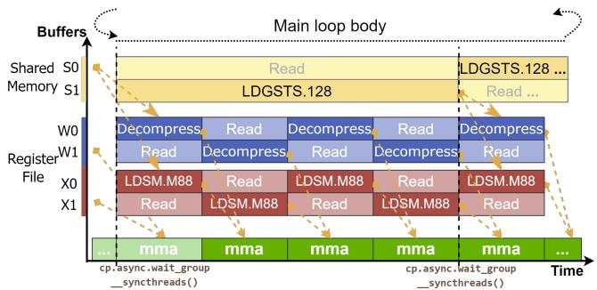

*图 10. 分层软件流水线设计。*

## 5. 实现

ZipServ 约含 3.5K 行代码：2.5K 行 CUDA/C++ 实现离线压缩器和在线 ZipGEMM，编译为独立 `.so` 并提供权重打包和 kernel 启动 API；约 1K 行 Python glue code 将其集成到 vLLM，通过 PyBind11 调用 CUDA kernel。

## 6. 评测设置

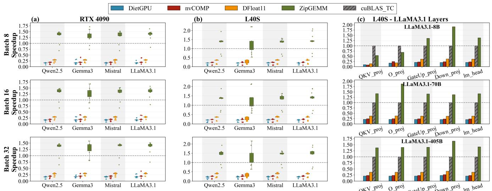

评测包含 kernel 级 ZipGEMM、独立解压 kernel 和端到端推理。平台包括：

- 4× RTX4090（Ada，24 GB，计算能力 8.9）+ Intel Xeon Platinum 8352V；
- 4× L40S（Ada，48 GB）+ Intel Xeon Gold 6230R；
- RTX5090（Blackwell，32 GB，计算能力 12.0），用于验证前向兼容性。

GCC 11.3 与 NVCC 12.4 编译，RTX5090 使用 NVCC 12.8。kernel 级测试预热 100 次、计时 1000 次；端到端测试每项运行 10 次。
### 6.1 ZipGEMM kernel 性能

测试数据来自 LLaMA3.1、Qwen2.5、Gemma3 和 Mistral 的 QKV、O、GateUp、Down 以及 LM head 等线性层，batch size 为 8、16、32。基线包括 cuBLAS Tensor Core、DietGPU、nvCOMP rANS 和 DFloat11。

ZipGEMM 在 RTX4090 上相对 cuBLAS 平均加速 1.31×、最高 1.71×；在 L40S 上平均 1.36×、最高 2.21×。DietGPU、nvCOMP 和 DFloat11 因解耦解压开销过大，平均仅达到 cuBLAS 的 0.17–0.34×。

按层分析，L40S 上 LLaMA3.1 的 GateUp_proj 和 Down_proj 平均加速分别为 1.39× 和 1.64×；小形状 O_proj 可能降至 0.79×，因为需要更细致的 split-K 和 tile 调优，但此类层只占 Transformer block 少量 FLOPs。LLaMA3.1-8B 和 405B 的 block 级加速分别为 1.35× 和 1.48×。

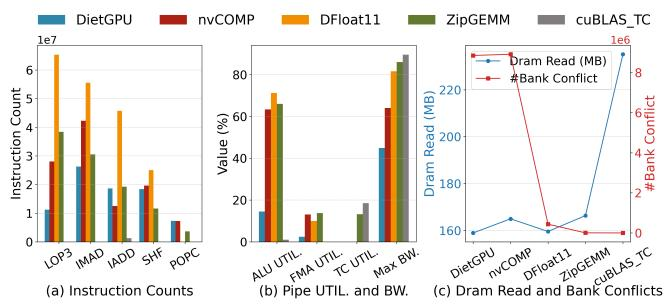

*图 12. kernel 级性能分析。*

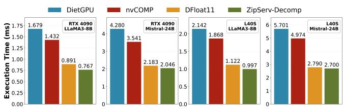

*图 13. 独立解压 kernel 对比。*

微观分析显示，ZipServ 用可预测的整数 ALU 工作换取更少的内存访问：DRAM 读取下降 29.3%，ALU 利用率达到 66.0%，但 Tensor Core 利用率仍保持 cuBLAS 基线的 71.6%。两级流水线隐藏了解码延迟，共享内存 bank conflict 约 4.7K，远低于 DietGPU 等方法的数百万次。

### 6.2 解压 kernel 性能

对 LLaMA3.1-8B 和 Mistral-24B 的完整 Transformer block，ZipServ-Decomp 相对 DietGPU、nvCOMP、DFloat11 的平均加速分别为 2.14×、1.83× 和 1.10×。TCA-TBE 的固定长度、warp 对齐设计消除了控制流分歧和串行 bit 解析，因此独立解压也很高效。

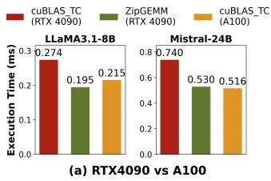

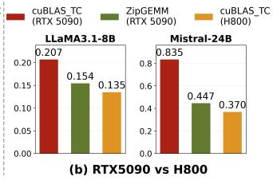

*图 14. 不同 GPU 代际的性能对比。*

### 6.3 跨 GPU 代际与层级

在 RTX5090 上直接移植 ZipGEMM、暂不使用 TMEM 等 Blackwell 新特性，相对 cuBLAS 在 LLaMA3.1-8B 和 Mistral-24B 上分别达到 1.34× 和 1.87×。RTX4090 上 ZipGEMM 甚至略快于 A100 cuBLAS：LLaMA3.1-8B 为 0.195 ms 对 0.215 ms，Mistral-24B 仅慢 2.7%。

标准 RTX5090 相对 H800 落后 53.3% 和 125.7%，ZipGEMM 将差距缩小至 14.1% 和 20.8%，说明融合设计能显著缩小消费级与数据中心 GPU 的差距。

### 6.4 开销分析

decode 阶段 batch/token 维度较小且内存受限，融合 ZipGEMM 没有额外开销，解压完全隐藏在计算中。prefill 阶段矩阵大、计算受限，ZipServ 切换为“先解压、再 cuBLAS GEMM”的解耦流水线，在尺寸 8192/16384 时开销约为 GEMM 时间的 4%/2%。

离线压缩 LLaMA-3.1-8B 在 16 核 Xeon CPU 上约需 2.5 分钟；该成本只发生一次，对在线服务关键路径可忽略。

### 6.5 端到端推理性能

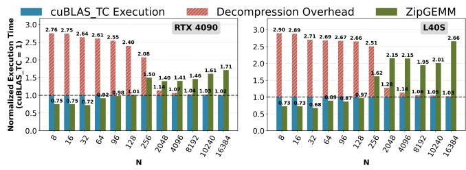

测试包括 RTX4090 上的 LLaMA3.1-8B、两张 L40S 上的 Mistral-24B，以及四张 L40S 上张量并行的 LLaMA3.1-70B；batch size 8、32，输出长度 128–2048 token。基线为 vLLM、Transformers 和 DFloat11。

ZipServ 平均将延迟相对 vLLM、Transformers、DFloat11 降低 17.60%、60.79%、82.13%；吞吐分别达到 1.22×、3.18×、8.52×。LLaMA3.1-8B、batch 32、生成 2048 token 时达到 1105 token/s，是 vLLM 的 1.66×。

权重占用从 LLaMA3.1-8B、Mistral-24B、LLaMA3.1-70B 的 14.96/43.92/131.56 GB 降至 10.83/31.30/93.52 GB（约 71%–72.4%）。释放的内存可用于 KV cache，使更大 batch 和更长上下文成为可能。

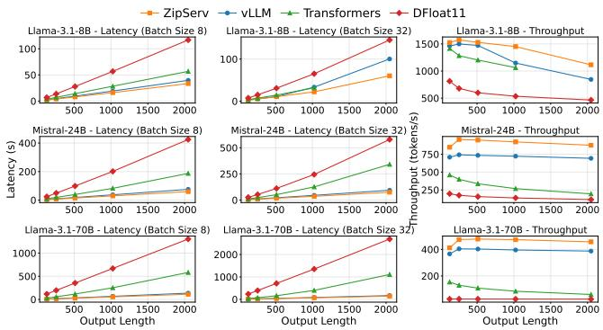

*图 16. 端到端性能对比。*

在 LLaMA3.1-8B、序列长度 1024 的 breakdown 中，vLLM 的 GEMM 占 24.99 ms（总延迟 83.6%）；ZipGEMM 将线性层延迟降至 14.76 ms，约 1.69× 改进。权重从 14.96 GB 降至 11.18 GB，KV cache 从 5.07 GB 增至 8.60 GB。

## 7. 局限与讨论

ZipServ 主要面向内存带宽受限的消费级和推理 GPU。A100/H800 等训练型数据中心 GPU 的 HBM 较充足，cuBLAS 可能更快；较低核心频率也使解压 ALU 工作更难隐藏。不过 ZipServ-Decomp 最高仍有 2.64× 加速，ZipGEMM 是最快融合 GEMM 之一。

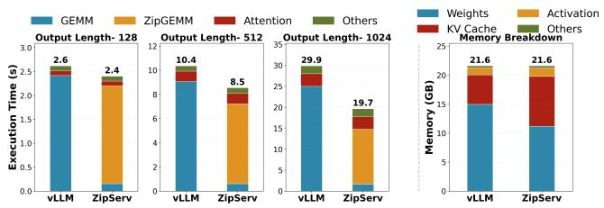

*图 17. 端到端推理时间与内存占用分解。*

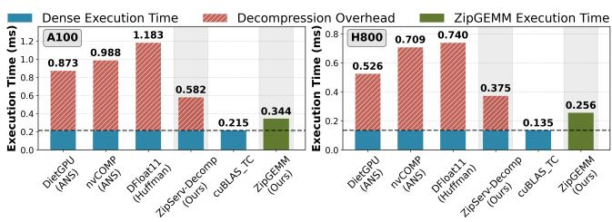

*图 18. 训练型 GPU 上的性能。*

与有损 Marlin W8A16 FP8 kernel 相比，ZipGEMM 在 RTX4090 上略慢（0.194 ms 对 0.143 ms），但差距约等于有效位宽比（11 bit 对 FP8）。ZipServ 与有损量化正交，可以在量化权重之上继续利用残余冗余。

未来方向包括：使用 TCA-TBE 压缩长上下文 KV cache；移植到 Intel AMX 和 AMD Matrix Core；用于 checkpoint 保存和分布式训练通信压缩。

## 8. 相关工作

有损压缩主要包括后训练量化和剪枝，但存在精度风险。无损工作包括用于存储的 LMC/ZipNN、训练内存优化的 NeuZip/DietGPU，以及运行时 nvCOMP/DFloat11；它们通常没有融合解压和计算，因而存在显著开销。

FlashAttention 等 kernel fusion 通过合并算子减少内存流量。ZipServ 据作者所知首次将解压与 GEMM 融合，避免完整权重物化。vLLM 等系统级推理引擎负责调度和内存管理，ZipServ 是可插入的高性能后端，与这些优化正交。

## 9. 结论

ZipServ 通过硬件感知的 TCA-TBE 和融合 ZipGEMM，将无损压缩从单纯的存储节省手段转变为 bit-exact LLM 推理加速技术。固定长度 bitmap 解码避免 SIMT 分歧，寄存器内即时解压避免中间全局内存写回，在消费级 GPU 上尤其有效。

## 致谢

感谢 ASPLOS 审稿人和 shepherd，以及中国国家自然科学基金、广州联合基金、香港 CRF 和 NSFC/RGC 等项目的支持。

## 附录 A：LLM BF16 权重可压缩性的理论分析

设单层权重向量 $w\in\mathbb{R}^{D}$ 服从零均值正态分布：

$$
w\sim\mathcal{N}(0,\sigma^2I).
$$

非零正规 BF16 数可写为：

$$
v=(-1)^S\times2^{E-127}\times(1.m_1\ldots m_7)_2,
$$

其中 S 是符号位，E 是 8-bit 指数，127 是偏置。令实际指数 $x=E-127$，指数为 x 的数值落在 $[2^x,2^{x+1})$。忽略 7-bit 尾数造成的量化舍入，则：

$$
P_\sigma(X=x)
=2\int_{2^x}^{2^{x+1}}
\frac{1}{\sqrt{2\pi\sigma^2}}
e^{-t^2/(2\sigma^2)}\,dt
$$

$$
=\operatorname{erf}\left(\frac{2^{x+1}}{\sigma\sqrt2}\right)
-\operatorname{erf}\left(\frac{2^x}{\sigma\sqrt2}\right).
$$

**定理 A.1.** 上述离散指数分布是单峰的。令 $u=2^x/(\sigma\sqrt2)$，连续扩展函数的导数符号由：

$$
h(u)=2e^{-3u^2}-1
$$

决定。唯一临界点为 $u_0=\sqrt{\ln2/3}$；在此之前函数递增，之后递减，因此分布单峰。

**定理 A.2. Top-K 的连续性。** 单峰分布的 Top-K 指数必然构成连续区间。若 Top-K 集合不连续，则中间某个指数的概率至少不低于两端概率的较小值，应当也属于 Top-K，产生矛盾。该定理为 ZipServ 使用连续的 top-7 指数窗口提供理论依据。
## References

[1] Amey Agrawal, Nitin Kedia, Ashish Panwar, Jayashree Mohan, Nipun Kwatra, Bhargav S. Gulavani, Alexey Tumanov, and Ramachandran Ramjee. 2024. Taming throughput-latency tradeof in LLM inference with sarathi-serve. In Proceedings of the 18th USENIX Conference on Operating Systems Design and Implementation (Santa Clara, CA, USA) (OSDI’24). USENIX Association, USA, Article 7, 18 pages. 

[2] Mistral AI. 2023. Mistral 7B. arXiv preprint arXiv:2310.06825 (2023). 

[3] Zeyuan Allen-Zhu and Yuanzhi Li. 2025. Physics of Language Models: Part 3.3, Knowledge Capacity Scaling Laws. In ICLR. OpenReview.net. 

[4] Saleh Ashkboos, Amirkeivan Mohtashami, Maximilian L Croci, Bo Li, Martin Jaggi, Dan Alistarh, Torsten Hoefler, and James Hensman. 2024. Quarot: Outlier-free 4-bit inference in rotated llms. arXiv preprint arXiv:2404.00456 (2024). 

[5] Feng Cheng, Cong Guo, Chiyue Wei, Junyao Zhang, Changchun Zhou, Edward Hanson, Jiaqi Zhang, Xiaoxiao Liu, Hai Li, and Yiran Chen. 2025. Ecco: Improving Memory Bandwidth and Capacity for LLMs via Entropy-Aware Cache Compression. In Proceedings of the 52nd Annual International Symposium on Computer Architecture. 793–807. 

[6] Wei-Lin Chiang, Lianmin Zheng, Ying Sheng, Anastasios Nikolas Angelopoulos, Tianle Li, Dacheng Li, Banghua Zhu, Hao Zhang, Michael I. Jordan, Joseph E. Gonzalez, and Ion Stoica. 2024. Chatbot Arena: An Open Platform for Evaluating LLMs by Human Preference. In ICML. OpenReview.net 

[7] Esha Choukse, Mattan Erez, and Alaa R Alameldeen. 2018. Compresso: Pragmatic main memory compression. In 2018 51st Annual IEEE/ACM International Symposium on Microarchitecture (MICRO). IEEE, 546–558. 

[8] Esha Choukse, Michael B Sullivan, Mike O’Connor, Mattan Erez, Jef Pool, David Nellans, and Stephen W Keckler. 2020. Buddy compression: Enabling larger memory for deep learning and hpc workloads on gpus. In 2020 ACM/IEEE 47th Annual International Symposium on Computer Architecture (ISCA). IEEE, 926–939 

[9] Tri Dao. 2024. FlashAttention-2: Faster Attention with Better Paral lelism and Work Partitioning. In International Conference on Learning Representations (ICLR). 

[10] Tri Dao, Daniel Y. Fu, Stefano Ermon, Atri Rudra, and Christopher Ré. 2022. FlashAttention: Fast and Memory-Eficient Exact Attention with IO-Awareness. In Advances in Neural Information Processing Systems (NeurIPS). 

[11] Rocktim Jyoti Das, Liqun Ma, and Zhiqiang Shen. 2023. Beyond size: How gradients shape pruning decisions in large language models. arXiv preprint arXiv:2311.04902 (2023). 

[12] Tim Dettmers, Mike Lewis, Younes Belkada, and Luke Zettlemoyer. 2022. Gpt3. int8 (): 8-bit matrix multiplication for transformers at scale. Advances in Neural Information Processing Systems 35 (2022), 30318–30332. 

[13] Tim Dettmers, Artidoro Pagnoni, Ari Holtzman, and Luke Zettlemoyer. 2023. QLoRA: Eficient Finetuning of Quantized LLMs. In NeurIPS. 

[14] Peijie Dong, Lujun Li, Zhenheng Tang, Xiang Liu, Xinglin Pan, Qiang Wang, and Xiaowen Chu. 2024. Pruner-Zero: Evolving Symbolic Pruning Metric from Scratch for Large Language Models. In Proceedings of the 41st International Conference on Machine Learning. PMLR. htps://arxiv.org/abs/2406.02924 [arXiv: 2406.02924]. 

[15] Peijie Dong, Lujun Li, Yuedong Zhong, Dayou Du, Ruibo Fan, Yuhan Chen, Zhenheng Tang, Qiang Wang, Wei Xue, Yike Guo, et al. 2024. Stbllm: Breaking the 1-bit barrier with structured binary llms. arXiv preprint arXiv:2408.01803 (2024). 

[16] Peijie Dong, Zhenheng Tang, Xiang Liu, Lujun Li, Xiaowen Chu, and Bo Li. 2025. Can Compressed LLMs Truly Act? An Empirical Evaluation of Agentic Capabilities in LLM Compression. arXiv preprint arXiv:2505.19433 (2025). 

[17] Abhimanyu Dubey, Abhinav Jauhri, Abhinav Pandey, Abhishek Kadian, Ahmad Al-Dahle, Aiesha Letman, Akhil Mathur, Alan Schelten, Amy Yang, Angela Fan, et al. 2024. The llama 3 herd of models. arXiv preprint arXiv:2407.21783 (2024). 

[18] Jarek Duda, Khalid Tahboub, Neeraj J Gadgil, and Edward J Delp. 2015. The use of asymmetric numeral systems as an accurate replacement for Hufman coding. In 2015 Picture Coding Symposium (PCS). IEEE, 65–69. 

[19] Ali Edalati, Alireza Ghafari, Mahsa Ghazvini Nejad, Lu Hou, Boxing Chen, Masoud Asgharian, and Vahid Partovi Nia. 2025. OAC: Outputadaptive Calibration for Accurate Post-training Quantization. In AAAI. AAAI Press, 16453–16461. 

[20] Magnus Ekman and Per Stenstrom. 2005. A robust main-memory compression scheme. In 32nd International Symposium on Computer Architecture (ISCA’05). IEEE, 74–85. 

[21] Ruibo Fan, Xiangrui Yu, Peijie Dong, Zeyu Li, Gu Gong, Qiang Wang, Wei Wang, and Xiaowen Chu. 2025. SpInfer: Leveraging Low-Level Sparsity for Eficient Large Language Model Inference on GPUs. In EuroSys. ACM, 243–260. 

[22] Elias Frantar and Dan Alistarh. 2023. SparseGPT: Massive Language Models Can Be Accurately Pruned in One-Shot. In ICML. 

[23] Elias Frantar, Saleh Ashkboos, Torsten Hoefler, and Dan Alistarh. 2022. Gptq: Accurate post-training quantization for generative pre-trained transformers. arXiv preprint arXiv:2210.17323 (2022). 

[24] Elias Frantar, Roberto L. Castro, Jiale Chen, Torsten Hoefler, and Dan Alistarh. 2025. MARLIN: Mixed-Precision Auto-Regressive Parallel Inference on Large Language Models. In PPoPP. ACM, 239–251. 

[25] Yao Fu, Leyang Xue, Yeqi Huang, Andrei-Octavian Brabete, Dmitrii Ustiugov, Yuvraj Patel, and Luo Mai. 2024. ServerlessLLM: Low-Latency Serverless Inference for Large Language Models. In OSDI. USENIX Association, 135–153. 

[26] Gerasimos Gerogiannis, Stijn Eyerman, Evangelos Georganas, Wim Heirman, and Josep Torrellas. 2025. DECA: A Near-Core LLM Decompression Accelerator Grounded on a 3D Roofline Model. In Proceedings of the 58th IEEE/ACM International Symposium on Microarchitecture®. 184–200. 

[27] Ruihao Gong, Shihao Bai, Siyu Wu, Yunqian Fan, Zaijun Wang, Xiuhong Li, Hailong Yang, and Xianglong Liu. 2025. Past-Future Scheduler for LLM Serving under SLA Guarantees. In Proceedings of the 30th 

ACM International Conference on Architectural Support for Programming Languages and Operating Systems, Volume 2. 798–813. 

[28] Yongchang Hao, Yanshuai Cao, and Lili Mou. 2024. NeuZip: Memory Eficient Training and Inference with Dynamic Compression of Neural Networks. CoRR abs/2410.20650 (2024). 

[29] Moshik Hershcovitch, Andrew Wood, Leshem Choshen, Guy Girmon sky, Roy Leibovitz, Ilias Ennmouri, Michal Malka, Peter Chin, Swami nathan Sundararaman, and Danny Harnik. 2024. ZipNN: Lossless Compression for AI Models. CoRR abs/2411.05239 (2024). 

[30] Connor Holmes, Masahiro Tanaka, Michael Wyatt, Ammar Ahmad Awan, Jef Rasley, Samyam Rajbhandari, Reza Yazdani Aminabadi, Heyang Qin, Arash Bakhtiari, Lev Kurilenko, and Yuxiong He. 2024. DeepSpeed-FastGen: High-throughput Text Generation for LLMs via MII and DeepSpeed-Inference. arXiv:2401.08671 [cs.PF] htps://arxiv. org/abs/2401.08671 

[31] David A Hufman. 2007. A method for the construction of minimum redundancy codes. Proceedings of the IRE 40, 9 (2007), 1098–1101. 

[32] Aaron Jarmusch, Nathan Graddon, and Sunita Chandrasekaran. 2025. Dissecting the NVIDIA Blackwell Architecture with Microbenchmarks. arXiv preprint arXiv:2507.10789 (2025). 

[33] Jef Johnson. 2024. DIET-GPU: Eficient Model Inference on GPUs. htps://github.com/facebookresearch/dietgpu. 

[34] Norm Jouppi, George Kurian, Sheng Li, Peter Ma, Rahul Nagarajan, Lifeng Nai, Nishant Patil, Suvinay Subramanian, Andy Swing, Brian Towles, et al. 2023. Tpu v4: An optically reconfigurable supercom puter for machine learning with hardware support for embeddings. In Proceedings of the 50th annual international symposium on computer architecture. 1–14. 

[35] Dhiraj Kalamkar, Dheevatsa Mudigere, Naveen Mellempudi, Dipankar Das, Kunal Banerjee, Sasikanth Avancha, Dharma Teja Vooturi, Nataraj Jammalamadaka, Jianyu Huang, Hector Yuen, et al. 2019. A study of BFLOAT16 for deep learning training. arXiv preprint arXiv:1905.12322 (2019). 

[36] Jared Kaplan, Sam McCandlish, Tom Henighan, Tom B. Brown, Ben jamin Chess, Rewon Child, Scott Gray, Alec Radford, Jefrey Wu, and Dario Amodei. 2020. Scaling Laws for Neural Language Models. CoRR abs/2001.08361 (2020). 

[37] Hyungyo Kim, Gaohan Ye, Nachuan Wang, Amir Yazdanbakhsh, and Nam Sung Kim. 2024. Exploiting intel advanced matrix extensions (AMX) for large language model inference. IEEE Computer Architecture Letters 23, 1 (2024), 117–120. 

[38] Jungrae Kim, Michael Sullivan, Esha Choukse, and Mattan Erez. 2016. Bit-plane compression: Transforming data for better compression in many-core architectures. ACM SIGARCH Computer Architecture News 44, 3 (2016), 329–340. 

[39] Woosuk Kwon, Zhuohan Li, Siyuan Zhuang, Ying Sheng, Lianmin Zheng, Cody Hao Yu, Joseph Gonzalez, Hao Zhang, and Ion Stoica. 2023. Eficient Memory Management for Large Language Model Serv ing with PagedAttention. In SOSP. ACM, 611–626. 

[40] Hoil Lee, Fadhel Ayed, Paul Jung, Juho Lee, Hongseok Yang, and Francois Caron. 2023. Deep Neural Networks with Dependent Weights: Gaussian Process Mixture Limit, Heavy Tails, Sparsity and Compress ibility. J. Mach. Learn. Res. 24 (2023), 289:1–289:78. 

[41] Zhen Li, Yupeng Su, Runming Yang, Zhongwei Xie, Ngai Wong, and Hongxia Yang. 2025. Quantization Meets Reasoning: Exploring LLM Low-Bit Quantization Degradation for Mathematical Reasoning. CoRR abs/2501.03035 (2025). 

[42] Zhuohan Li, Lianmin Zheng, Yinmin Zhong, Vincent Liu, Ying Sheng, Xin Jin, Yanping Huang, Zhifeng Chen, Hao Zhang, Joseph E. Gonzalez, and Ion Stoica. 2023. AlpaServe: Statistical Multiplexing with Model Parallelism for Deep Learning Serving. In OSDI. USENIX Association, 663–679. 

[43] Ji Lin, Jiaming Tang, Haotian Tang, Shang Yang, Wei-Ming Chen, Wei-Chen Wang, Guangxuan Xiao, Xingyu Dang, Chuang Gan, and 

Song Han. 2024. AWQ: Activation-aware Weight Quantization for On-Device LLM Compression and Acceleration. Proceedings of Machine Learning and Systems 6 (2024), 87–100. 

[44] Ruikang Liu, Yuxuan Sun, Manyi Zhang, Haoli Bai, Xianzhi Yu, Tiezheng Yu, Chun Yuan, and Lu Hou. 2025. Quantization Hurts Reasoning? An Empirical Study on Quantized Reasoning Models. CoRR abs/2504.04823 (2025). 

[45] Yuhan Liu, Hanchen Li, Yihua Cheng, Siddhant Ray, Yuyang Huang, Qizheng Zhang, Kuntai Du, Jiayi Yao, Shan Lu, Ganesh Ananthanarayanan, et al. 2024. Cachegen: Kv cache compression and streaming for fast large language model serving. In Proceedings of the ACM SIG-COMM 2024 Conference. 38–56. 

[46] Zechun Liu, Changsheng Zhao, Igor Fedorov, Bilge Soran, Dhruv Choudhary, Raghuraman Krishnamoorthi, Vikas Chandra, Yuandong Tian, and Tijmen Blankevoort. 2024. SpinQuant–LLM quantization with learned rotations. arXiv preprint arXiv:2405.16406 (2024). 

[47] Weile Luo, Ruibo Fan, Zeyu Li, Dayou Du, Qiang Wang, and Xiaowen Chu. 2024. Benchmarking and dissecting the nvidia hopper gpu architecture. In 2024 IEEE International Parallel and Distributed Processing Symposium (IPDPS). IEEE, 656–667. 

[48] Lingxiao Ma, Zhiqiang Xie, Zhi Yang, Jilong Xue, Youshan Miao, Wei Cui, Wenxiang Hu, Fan Yang, Lintao Zhang, and Lidong Zhou. 2020. Rammer: Enabling Holistic Deep Learning Compiler Optimizations with rTasks. In 14th USENIX Symposium on Operating Systems Design and Implementation (OSDI 20). USENIX Association, 881–897. htps: //www.usenix.org/conference/osdi20/presentation/ma 

[49] Anmol Mekala, Anirudh Atmakuru, Yixiao Song, Marzena Karpinska, and Mohit Iyyer. 2025. Does quantization afect models’ performance on long-context tasks? arXiv preprint arXiv:2505.20276 (2025). 

[50] NVIDIA. 2020. NVIDIA Ampere GA102 GPU Architecture Whitepaper. htps://www.nvidia.com/content/PDF/nvidia-ampere-ga-102- gpu-architecture-whitepaper-v2.pdf. 

[51] NVIDIA. 2023. NVIDIA Ada GPU Architecture Whitepaper. htps://images.nvidia.com/aem-dam/Solutions/geforce/ada/ nvidia-ada-gpu-architecture.pdf. 

[52] NVIDIA. 2024. cuBLAS Docs. htps://docs.nvidia.com/cuda/cublas/ index.html. 

[53] NVIDIA. 2025. nvcomp: Repository for nvCOMP docs and examples. htps://github.com/NVIDIA/nvcomp. Accessed: 2025-08-18. 

[54] OpenAI. 2023. GPT-4 Technical Report. arXiv:2303.08774 [cs.CL] 

[55] Gunho Park, Baeseong Park, Minsub Kim, Sungjae Lee, Jeonghoon Kim, Beomseok Kwon, Se Jung Kwon, Byeongwook Kim, Youngjoo Lee, and Dongsoo Lee. 2024. LUT-GEMM: Quantized Matrix Multiplication based on LUTs for Eficient Inference in Large-Scale Generative Language Models. In ICLR. OpenReview.net. 

[56] Gunho Park, Baeseong Park, Se Jung Kwon, Byeongwook Kim, Youngjoo Lee, and Dongsoo Lee. 2022. nuQmm: Quantized MatMul for Eficient Inference of Large-Scale Generative Language Models. CoRR abs/2206.09557 (2022). 

[57] Tommaso Pegolotti, Elias Frantar, Dan Alistarh, and Markus Püschel. 2023. QIGen: Generating Eficient Kernels for Quantized Inference on Large Language Models. CoRR abs/2307.03738 (2023). 

[58] Gennady Pekhimenko, Vivek Seshadri, Yoongu Kim, Hongyi Xin, Onur Mutlu, Phillip B Gibbons, Michael A Kozuch, and Todd C Mowry. 2013. Linearly compressed pages: A low-complexity, low-latency main memory compression framework. In Proceedings of the 46th Annual IEEE/ACM International Symposium on Microarchitecture. 172–184. 

[59] Gennady Pekhimenko, Vivek Seshadri, Onur Mutlu, Phillip B Gibbons, Michael A Kozuch, and Todd C Mowry. 2012. Base-delta-immediate compression: Practical data compression for on-chip caches. In Proceedings of the 21st international conference on Parallel architectures and compilation techniques. 377–388. 

[60] Timo Schick, Jane Dwivedi-Yu, Roberto Dessì, Roberta Raileanu, Maria Lomeli, Eric Hambro, Luke Zettlemoyer, Nicola Cancedda, and Thomas Scialom. 2023. Toolformer: Language Models Can Teach Themselves 

to Use Tools. In NeurIPS. 

[61] Gabin Schiefer, Daniel Araújo De Medeiros, Jennifer Faj, Aniruddha Marathe, and Ivy Peng. 2024. On the rise of amd matrix cores: Per formance, power eficiency, and programmability. In 2024 IEEE International Symposium on Performance Analysis of Systems and Software (ISPASS). IEEE, 132–143. 

[62] Jay Shah, Ganesh Bikshandi, Ying Zhang, Vijay Thakkar, Pradeep Ra mani, and Tri Dao. 2024. FlashAttention-3: Fast and Accurate Attention with Asynchrony and Low-precision. In NeurIPS. 

[63] Chongjie Si, Jingjing Jiang, and Wei Shen. 2025. Unveiling the Mystery of Weight in Large Foundation Models: Gaussian Distribution Never Fades. CoRR abs/2501.10661 (2025). 

[64] Yixin Song, Zeyu Mi, Haotong Xie, and Haibo Chen. 2024. PowerInfer: Fast Large Language Model Serving with a Consumer-grade GPU. In Proceedings of the ACM SIGOPS 30th Symposium on Operating Systems Principles (Austin, TX, USA) (SOSP ’24). Association for Computing Machinery, New York, NY, USA, 590–606. doi:10.1145/3694715.3695964 

[65] Foteini Strati, Michal Friedman, and Ana Klimovic. 2025. PCcheck: Persistent Concurrent Checkpointing for ML. In Proceedings of the 30th ACM International Conference on Architectural Support for Programming Languages and Operating Systems, Volume 1. 811–827. 

[66] Biao Sun, Ziming Huang, Hanyu Zhao, Wencong Xiao, Xinyi Zhang, Yong Li, and Wei Lin. 2024. Llumnix: Dynamic Scheduling for Large Language Model Serving. In OSDI. USENIX Association, 173–191. 

[67] Mingjie Sun, Zhuang Liu, Anna Bair, and J. Zico Kolter. 2024. A Simple and Efective Pruning Approach for Large Language Models. In ICLR. 

[68] Gemma Team. 2025. Gemma 3 technical report. arXiv preprint arXiv:2503.19786 (2025). 

[69] Qwen Team. 2024. Qwen2.5 technical report. arXiv preprint arXiv:2412.15115 (2024). 

[70] Qwen Team. 2025. Qwen3 Technical Report. arXiv preprint arXiv:2505.09388 (2025). 

[71] Daniel Waddington and Cornel Constantinescu. 2025. Lossless Com pression for LLM Tensor Incremental Snapshots. arXiv preprint arXiv:2505.09810 (2025). 

[72] Lei Wang, Lingxiao Ma, Shijie Cao, Quanlu Zhang, Jilong Xue, Yining Shi, Ningxin Zheng, Ziming Miao, Fan Yang, Ting Cao, et al. 2024. Ladder: Enabling Eficient Low-Precision Deep Learning Computing through Hardware-aware Tensor Transformation. In 18th USENIX Symposium on Operating Systems Design and Implementation (OSDI 24). 307–323. 

[73] Zhuang Wang, Zhaozhuo Xu, Jingyi Xi, Yuke Wang, Anshumali Shri vastava, and TS Eugene Ng. 2025. {ZEN}: Empowering Distributed Training with Sparsity-driven Data Synchronization. In 19th USENIX Symposium on Operating Systems Design and Implementation (OSDI 25). 537–556. 

[74] Jason Wei, Xuezhi Wang, Dale Schuurmans, Maarten Bosma, Brian Ichter, Fei Xia, Ed H. Chi, Quoc V. Le, and Denny Zhou. 2022. Chain of-Thought Prompting Elicits Reasoning in Large Language Models. In NeurIPS. 

[75] Thomas Wolf, Lysandre Debut, Victor Sanh, Julien Chaumond, Clement Delangue, Anthony Moi, Pierric Cistac, Tim Rault, Remi Louf, Morgan Funtowicz, et al. 2020. Transformers: State-of-the-art natural language processing. In Proceedings of the 2020 conference on empirical methods in natural language processing: system demonstrations. 38–45. 

[76] Mengdi Wu, Xinhao Cheng, Shengyu Liu, Chunan Shi, Jianan Ji, Kit Ao, Praveen Velliengiri, Xupeng Miao, Oded Padon, and Zhihao Jia. 2025. Mirage: A Multi-Level Superoptimizer for Tensor Programs. In 19th USENIX Symposium on Operating Systems Design and Implementation (OSDI 25). USENIX Association. htps://www.usenix.org/conference osdi25/presentation/wu-mengd 

[77] Haojun Xia, Zhen Zheng, Yuchao Li, Donglin Zhuang, Zhongzhu Zhou, Xiafei Qiu, Yong Li, Wei Lin, and Shuaiwen Leon Song. 2023. Flash LLM: Enabling Cost-Efective and Highly-Eficient Large Generative 

Model Inference with Unstructured Sparsity. Proc. VLDB Endow. 17, 2 (Oct. 2023), 211–224. doi:10.14778/3626292.3626303 

[78] Guangxuan Xiao, Ji Lin, Mickael Seznec, Hao Wu, Julien Demouth, and Song Han. 2023. Smoothquant: Accurate and eficient post-training quantization for large language models. In International Conference on Machine Learning. PMLR, 38087–38099. 

[79] Jiarong Xing, Leyuan Wang, Shang Zhang, Jack Chen, Ang Chen, and Yibo Zhu. 2022. Bolt: Bridging the gap between auto-tuners and hardware-native performance. Proceedings of Machine Learning and Systems 4 (2022), 204–216. 

[80] Peng Xu, Wenqi Shao, Mengzhao Chen, Shitao Tang, Kaipeng Zhang, Peng Gao, Fengwei An, Yu Qiao, and Ping Luo. 2024. BESA: Pruning Large Language Models with Blockwise Parameter-Eficient Sparsity Allocation. In ICLR. 

[81] Tian Ye, Zicheng Xu, Yuanzhi Li, and Zeyuan Allen-Zhu. 2025. Physics of Language Models: Part 2.2, How to Learn From Mistakes on Grade-School Math Problems. In ICLR. OpenReview.net. 

[82] Gyeong-In Yu, Joo Seong Jeong, Geon-Woo Kim, Soojeong Kim, and Byung-Gon Chun. 2022. Orca: A Distributed Serving System for Transformer-Based Generative Models. In 16th USENIX Symposium on Operating Systems Design and Implementation (OSDI 22). USENIX Association, Carlsbad, CA, 521–538. htps://www.usenix.org/conference/ osdi22/presentation/yu 

[83] Patrick Yubeaton, Tareq Mahmoud, Shehab Naga, Pooria Taheri, Tianhua Xia, Arun George, Yasmein Khalil, Sai Qian Zhang, Siddharth Joshi, Chinmay Hegde, and Siddharth Garg. 2025. Huf-LLM: End-to-End Lossless Compression for Eficient LLM Inference. arXiv:2502.00922 [cs.LG] htps://arxiv.org/abs/2502.00922 

[84] Lin Zhang, Longteng Zhang, Shaohuai Shi, Xiaowen Chu, and Bo Li. 2023. Evaluation and optimization of gradient compression for distributed deep learning. In 2023 IEEE 43rd International Conference on Distributed Computing Systems (ICDCS). IEEE, 361–371. 

[85] Tianyi Zhang, Yang Sui, Shaochen Zhong, Vipin Chaudhary, Xia Hu, and Anshumali Shrivastava. 2025. 70% Size, 100% Accuracy: Lossless LLM Compression for Eficient GPU Inference via Dynamic-Length Float. arXiv preprint arXiv:2504.11651 (2025). 

[86] Yingtao Zhang, Haoli Bai, Haokun Lin, Jialin Zhao, Lu Hou, and Carlo Vittorio Cannistraci. 2024. Plug-and-play: An eficient posttraining pruning method for large language models. In The Twelfth International Conference on Learning Representations. 

[87] Jishen Zhao, Sheng Li, Jichuan Chang, John L Byrne, Laura L Ramirez, Kevin Lim, Yuan Xie, and Paolo Faraboschi. 2015. Buri: Scaling bigmemory computing with hardware-based memory expansion. ACM Transactions on Architecture and Code Optimization (TACO) 12, 3 (2015), 1–24. 

[88] Yilong Zhao, Chien-Yu Lin, Kan Zhu, Zihao Ye, Lequn Chen, Size Zheng, Luis Ceze, Arvind Krishnamurthy, Tianqi Chen, and Baris Kasikci. 2024. Atom: Low-bit quantization for eficient and accurate llm serving. Proceedings of Machine Learning and Systems 6 (2024), 196–209. 

[89] Lianmin Zheng, Liangsheng Yin, Zhiqiang Xie, Chuyue Sun, Jef Huang, Cody Hao Yu, Shiyi Cao, Christos Kozyrakis, Ion Stoica, Joseph E. Gonzalez, Clark Barrett, and Ying Sheng. 2025. SGLang: eficient execution of structured language model programs. In Proceedings of the 38th International Conference on Neural Information Processing Systems (Vancouver, BC, Canada) (NIPS ’24). Curran Associates Inc., Red Hook, NY, USA, Article 2000, 27 pages. 

[90] Yinmin Zhong, Shengyu Liu, Junda Chen, Jianbo Hu, Yibo Zhu, Xuanzhe Liu, Xin Jin, and Hao Zhang. 2024. DistServe: Disaggregating Prefill and Decoding for Goodput-optimized Large Language Model Serving. In 18th USENIX Symposium on Operating Systems Design and Implementation (OSDI 24). USENIX Association, Santa Clara, CA, 193– 210. htps://www.usenix.org/conference/osdi24/presentation/zhongyinmin 
