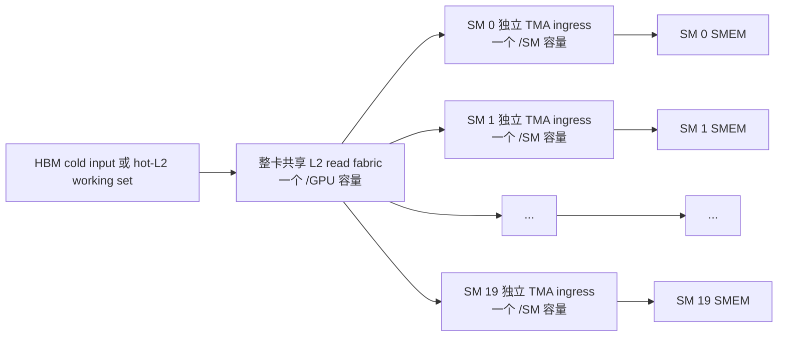
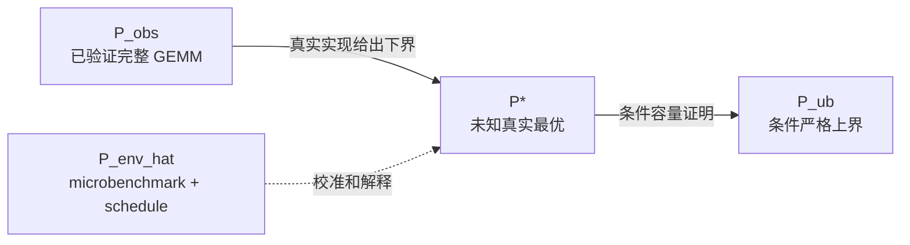

# 从零建立 Thor/SM110 GEMM 性能上界模型

> 本文是一份伴随式教学文档。它不替代严格证据报告，而是解释每个公式为什么成立、
> 每个参数属于哪个物理作用域，以及怎样从硬件容量一步步得到 GEMM 性能上界。
>
> 正式定义、完整证据和最终 closure 结论见
> [`thor_sm110_gemm_performance_bounds.md`](./thor_sm110_gemm_performance_bounds.md)；
> 用当前严格规则重放历史 Thor 数据的逐项输出见
> [`thor_sm110_current_model_replay.md`](./thor_sm110_current_model_replay.md)。

## 0. 怎样使用这份教程

本教程的目标不是让读者记住最终数字，而是让读者能够独立完成以下工作：

1. 从 GEMM 数学语义推导有用 FLOP、最小内存流量和 schedule 实际流量；
2. 判断一个资源是整卡共享、每 SM 独立、每 CTA 独立还是每 warp 独立；
3. 从资源服务容量推导时间下界，再由时间下界推导性能上界；
4. 区分条件可证明性能上界、microbenchmark 经验理想包络和完整 GEMM 实测；
5. 判断一个异常结果是物理上界错误、经验模型需要重校准，还是 kernel 确实存在损失；
6. 为缺失的容量参数设计可复现 microbenchmark，并保留源码、命令、原始结果、
   SASS/NCU 和环境证据。

每一课固定包含：

- 本课问题；
- 参数定义与单位；
- 第一性原理推导；
- Thor 真实数值例子；
- 错误建模反例；
- 可执行检查；
- 预测题和检查答案；
- 本课证据来源。

建议先自己完成预测题，再展开答案。能够解释推理过程比选对答案更重要。

## 0.1 学习路线

| 阶段 | 课程 | 学完后应该具备的能力 | 当前状态 |
| --- | --- | --- | --- |
| 最小模型 | 第 1 课：时间下界与性能上界 | 手算 Tensor/HBM/L2 条件上界 | 已完成 |
| 硬件拓扑 | 第 2 课：shared 与 replicated resource | 正确区分共享 L2 和每 SM ingress | 已完成 |
| 工作量 | 第 3 课：useful、minimum 与 issued work | 不把逻辑字节冒充物理 transaction | 已完成 |
| 调度 | 第 4 课：tile、task 和 wave | 从 CTA 的 M/N/K tile 推导 task waves | 已完成 |
| 流水线 | 第 5 课：TMA stages 与关键路径 | 建模 stage、inflight 和依赖链 | 已完成 |
| 三层模型 | 第 6 课：upper、envelope 与 observed | 不混淆物理上界与实测峰值 | 已完成 |
| 联合资源 | 第 7 课：独立 roof 与联合容量区域 | 判断何时需要 read/write 联合约束 | 已完成 |
| 精度推广 | 第 8 课：FP8/FP6/FP4/INT8 | 建模 packed、scale 和 OP/s | 已完成 |
| 证据闭环 | 第 9 课：microbenchmark 与 auditor | 自己设计、采集和审计证据 | 已完成 |

## 0.2 三个输出不能混为一个数字

定义 \(P_{\mathrm{obs}}\) 为已经通过数值正确性验证的完整 GEMM 最好实测性能，
单位对浮点 GEMM 为 FLOP/s，对整数 GEMM 为 OP/s。

定义 \(P^\star\) 为所有物理可实现 GEMM 中真实但未知的最好性能，单位与
\(P_{\mathrm{obs}}\) 相同。它是我们真正想知道、但通常不能直接观测的量。

定义 \(P_{\mathrm{ub}}\) 为在明确硬件容量和算法条件下推导的条件性能上界，单位与
\(P_{\mathrm{obs}}\) 相同。如果 workload 语义和全部上界条件一致，必须满足：

\[
P_{\mathrm{obs}}\le P^\star\le P_{\mathrm{ub}}.
\]

定义 \(\widehat P_{\mathrm{env}}\) 为 microbenchmark 驱动的经验理想包络，单位
与 workload 相同。它回答“当前已枚举合法 schedule 在实测组件能力下应当能达到
哪里”，但不自动进入上面的严格不等式。microbenchmark 的 sustained rate 能证明
硬件至少已经达到该速率，不能单独证明硬件绝不可能更快。

因此：

- 完整 GEMM 超过 \(P_{\mathrm{ub}}\)：严格上界的容量、工作量或适用条件至少一项错误；
- 完整 GEMM 超过 \(\widehat P_{\mathrm{env}}\)：经验容量或 schedule 枚举需要重校准；
- 完整 GEMM 低于 \(\widehat P_{\mathrm{env}}\)：差距才是候选 kernel 的可解释实现损失。

---

# 第 1 课：性能上界为什么来自时间下界

## 1.1 本课问题

本课只回答一个问题：

> 对一个语义已经冻结的经典稠密 GEMM，怎样在不假设具体 tc3/tc5a 实现的情况下，
> 推导一个“一点可避免性能都没有浪费”的条件性能上界？

本课暂不建模 CTA tile、TMA pipeline、TMEM、寄存器和 epilogue。我们先建立以后
所有细化模型都必须服从的最小骨架。

## 1.2 冻结 GEMM 数学语义

先定义本式使用的全部参数：

- \(A\)：左输入矩阵；
- \(B\)：右输入矩阵；
- \(C\)：可选的原始输出矩阵；
- \(D\)：最终输出矩阵；
- \(\alpha\)：乘积 \(AB\) 的无量纲标量系数；
- \(\beta\)：原始输出 \(C\) 的无量纲标量系数；
- \(M\)：输出矩阵的行数，单位 element；
- \(N\)：输出矩阵的列数，单位 element；
- \(K\)：点积归约维度的长度，单位 element。

在这些定义下，经典稠密 GEMM 为：

\[
D=\alpha AB+\beta C.
\]

矩阵形状是：

\[
A\in\mathbb R^{M\times K},\qquad
B\in\mathbb R^{K\times N},\qquad
C,D\in\mathbb R^{M\times N}.
\]

本课固定：

- \(\alpha=1\)；
- \(\beta=0\)，因此任何正确实现都不需要读取 \(C\)；
- A/B 为 FP16，每个输入元素占 2 B；
- accumulator 和输出 D 为 FP32，每个输出元素占 4 B；
- 只计设备端 GEMM，不计 host-device copy、内存分配或一次性预处理。

这里 B 表示 byte，element 表示逻辑矩阵元素。

## 1.3 有用计算工作量

定义 \(i\) 为输出矩阵的行索引、\(j\) 为输出矩阵的列索引、\(k\) 为当前点积的
归约索引；三者都是无单位整数索引。一个输出元素为：

\[
D_{ij}=\sum_{k=0}^{K-1}A_{ik}B_{kj}.
\]

GPU GEMM 通常把一次乘法和一次加法计为 2 FLOP。定义
\(W_{\mathrm{use}}\) 为用户可见的数学计算工作量，单位 FLOP：

\[
W_{\mathrm{use}}=2MNK.
\]

FLOP 表示一次浮点标量操作。这个值由数学问题决定，不由 kernel tile 决定。

以后还会定义 \(W_{\mathrm{issued}}\) 为硬件实际发出的计算工作量，单位 FLOP。
如果 schedule 因 padding 或尾部处理执行额外 MMA，则：

\[
W_{\mathrm{issued}}\ge W_{\mathrm{use}}.
\]

条件上界使用最低必需的 \(W_{\mathrm{use}}\)；具体 schedule 的经验时间使用
\(W_{\mathrm{issued}}\)。不能把二者混为一个量。

## 1.4 从时间下界得到性能上界

定义 \(T\) 为一次设备端 GEMM 的执行时间，单位 s。定义 \(P\) 为 GEMM 性能，
单位 FLOP/s：

\[
P=\frac{W_{\mathrm{use}}}{T}.
\]

定义 \(T^{\mathrm{LB}}\) 为任何满足当前条件的合法实现都不能突破的执行时间下界，
单位 s。如果能够证明：

\[
T\ge T^{\mathrm{LB}},
\]

则必然有：

\[
P
=\frac{W_{\mathrm{use}}}{T}
\le
\frac{W_{\mathrm{use}}}{T^{\mathrm{LB}}}.
\]

因此定义 \(P_{\mathrm{ub}}\) 为条件性能上界，单位 FLOP/s：

\[
P_{\mathrm{ub}}
=\frac{W_{\mathrm{use}}}{T^{\mathrm{LB}}}.
\]

核心方法不是直接猜一个最快 TFLOP/s，而是先证明 GEMM 至少需要多少时间。

## 1.5 单一资源的时间下界

定义：

- \(r\)：某个硬件资源的标识，例如 Tensor Core、HBM 或 L2 read；
- \(Q_r\)：GEMM 在资源 \(r\) 上至少必须完成的工作量；单位取决于资源，例如
  FLOP、OP 或 B；
- \(C_r^{\mathrm{UB}}\)：资源 \(r\) 的条件服务容量上界，单位为对应工作量每秒；
- \(T_r^{\mathrm{LB}}\)：资源 \(r\) 单独给出的时间下界，单位 s。

则：

\[
T_r^{\mathrm{LB}}
=\frac{Q_r}{C_r^{\mathrm{UB}}}.
\]

这个推导成立需要两个前提：

1. \(Q_r\) 确实是任何合法实现都绕不过的最低工作量；
2. \(C_r^{\mathrm{UB}}\) 确实是声明条件下不能超过的容量外边界。

如果 \(C_r\) 只是 microbenchmark 实测 sustained rate，它只能进入经验层，不能
在没有额外证明时写成 \(C_r^{\mathrm{UB}}\)。

## 1.6 多资源条件下为什么取最大时间

定义 \(T_{\mathrm{tensor}}^{\mathrm{LB}}\)、
\(T_{\mathrm{HBM}}^{\mathrm{LB}}\)、
\(T_{\mathrm{L2,read}}^{\mathrm{LB}}\) 和
\(T_{\mathrm{L2,write}}^{\mathrm{LB}}\) 分别为 Tensor Core、HBM、共享 L2 read
和共享 L2 write 给出的时间下界，单位均为 s：

\[
T_{\mathrm{tensor}}^{\mathrm{LB}},\quad
T_{\mathrm{HBM}}^{\mathrm{LB}},\quad
T_{\mathrm{L2,read}}^{\mathrm{LB}},\quad
T_{\mathrm{L2,write}}^{\mathrm{LB}}.
\]

即使假设这些资源能够完美重叠，完整 GEMM 也不能比其中任何一个时间下界更短。
因此：

\[
T^{\mathrm{LB}}
=\max\left(
T_{\mathrm{tensor}}^{\mathrm{LB}},
T_{\mathrm{HBM}}^{\mathrm{LB}},
T_{\mathrm{L2,read}}^{\mathrm{LB}},
T_{\mathrm{L2,write}}^{\mathrm{LB}}
\right).
\]

这里不能直接求和。求和隐含“这些阶段完全串行且不能重叠”的 schedule 假设，
它可能把时间下界抬得过高，从而产生一个过低、会被合法实现突破的伪上界。

取最大值表达的是最乐观情况：所有可重叠工作都完美重叠，但最慢的不可绕过资源
仍然决定最短总时间。

## 1.7 Thor FP16 \(N=2048\) 手算

本节固定方阵：

\[
M=N=K=2048.
\]

### 1.7.1 有用 FLOP

\[
W_{\mathrm{use}}
=2\times2048^3
=17{,}179{,}869{,}184\ \mathrm{FLOP}.
\]

即约 17.180 GFLOP，其中 1 GFLOP 等于 \(10^9\) FLOP。

### 1.7.2 最小输入和输出字节

定义 \(s_{\mathrm{in}}=2\ \mathrm{B/element}\) 为一个 FP16 输入元素的存储字节数。

定义 \(Q_A\) 为矩阵 A 的最低输入字节数，单位 B：

\[
Q_A=MKs_{\mathrm{in}}=2048^2\times2=8{,}388{,}608\ \mathrm{B}=8\ \mathrm{MiB}.
\]

定义 \(Q_B\) 为矩阵 B 的最低输入字节数，单位 B；本例中同样有：

\[
Q_B=8\ \mathrm{MiB}.
\]

定义 \(Q_{\mathrm{read}}^{\mathrm{LB}}\) 为最低输入读取字节数，单位 B。由于
\(\beta=0\)，不需要读取 C：

\[
Q_{\mathrm{read}}^{\mathrm{LB}}
=Q_A+Q_B
=16\ \mathrm{MiB}.
\]

定义 \(s_{\mathrm{out}}=4\ \mathrm{B/element}\) 为一个 FP32 输出元素的存储字节数。

定义 \(Q_{\mathrm{write}}^{\mathrm{LB}}\) 为最低输出写回字节数，单位 B：

\[
Q_{\mathrm{write}}^{\mathrm{LB}}
=MN s_{\mathrm{out}}
=2048^2\times4
=16\ \mathrm{MiB}.
\]

由于本课只有一个输出矩阵 \(D\)，定义 \(Q_D=Q_{\mathrm{write}}^{\mathrm{LB}}\)
为矩阵 \(D\) 的最低写回字节数，因此 \(Q_D=16\ \mathrm{MiB}\)。

MiB 使用二进制定义：

\[
1\ \mathrm{MiB}=2^{20}\ \mathrm{B}.
\]

GB/s 使用十进制定义：

\[
1\ \mathrm{GB/s}=10^9\ \mathrm{B/s}.
\]

### 1.7.3 L2 read 条件上界

定义 \(f_{\mathrm{GPU}}=1.575\times10^9\ \mathrm{cycle/s}\) 为本次 MAXN campaign
锁定的 GPU 时钟。

定义 \(c_{\mathrm{L2,read}}^{\mathrm{UB}}=1024\ \mathrm{B/cycle/GPU}\) 为整卡共享
L2 read 条件容量。`/GPU` 表示所有 20 个 SM 合计共享该容量，不是每个 SM 各有
1024 B/cycle。

定义 \(C_{\mathrm{L2,read}}^{\mathrm{UB}}\) 为同一共享 L2 read 条件容量换算后的
每秒值，单位 B/s：

\[
C_{\mathrm{L2,read}}^{\mathrm{UB}}
=c_{\mathrm{L2,read}}^{\mathrm{UB}}f_{\mathrm{GPU}}
=1024\times1.575\times10^9
=1.6128\times10^{12}\ \mathrm{B/s}.
\]

即：

\[
C_{\mathrm{L2,read}}^{\mathrm{UB}}=1612.8\ \mathrm{GB/s}.
\]

定义 \(T_{\mathrm{L2,read}}^{\mathrm{LB}}\) 为共享 L2 read 给出的时间下界，
单位 s：

\[
T_{\mathrm{L2,read}}^{\mathrm{LB}}
=\frac{16\ \mathrm{MiB}}{1612.8\ \mathrm{GB/s}}
\approx10.403\ \mu\mathrm{s}.
\]

其中 \(\mu\mathrm{s}\) 表示微秒，\(1\ \mu\mathrm{s}=10^{-6}\ \mathrm{s}\)。

### 1.7.4 L2 write 条件上界

定义 \(c_{\mathrm{L2,write}}^{\mathrm{UB}}=512\ \mathrm{B/cycle/GPU}\) 为整卡共享
L2 write 条件容量。

定义 \(C_{\mathrm{L2,write}}^{\mathrm{UB}}\) 为该条件容量换算后的每秒值，
单位 B/s：

\[
C_{\mathrm{L2,write}}^{\mathrm{UB}}
=512\times1.575\times10^9
=806.4\times10^9\ \mathrm{B/s}
=806.4\ \mathrm{GB/s}.
\]

定义 \(T_{\mathrm{L2,write}}^{\mathrm{LB}}\) 为共享 L2 write 给出的时间下界，
单位 s：

\[
T_{\mathrm{L2,write}}^{\mathrm{LB}}
=\frac{16\ \mathrm{MiB}}{806.4\ \mathrm{GB/s}}
\approx20.805\ \mu\mathrm{s}.
\]

### 1.7.5 Tensor Core 条件上界

定义 \(C_{\mathrm{tensor,FP16}}^{\mathrm{UB}}=258.5\ \mathrm{TFLOP/s}\) 为当前
FP16 条件 compute 上界；1 TFLOP/s 等于 \(10^{12}\) FLOP/s。

定义 \(T_{\mathrm{tensor}}^{\mathrm{LB}}\) 为该 Tensor Core 容量给出的时间下界，
单位 s：

\[
T_{\mathrm{tensor}}^{\mathrm{LB}}
=\frac{17{,}179{,}869{,}184\ \mathrm{FLOP}}
       {258.5\times10^{12}\ \mathrm{FLOP/s}}
\approx66.460\ \mu\mathrm{s}.
\]

### 1.7.6 cold-HBM 条件上界

定义 \(Q_{\mathrm{HBM,total}}^{\mathrm{LB}}\) 为 cold-HBM 场景最低 HBM 总流量，
单位 B：

\[
Q_{\mathrm{HBM,total}}^{\mathrm{LB}}
=Q_A+Q_B+Q_D
=32\ \mathrm{MiB}.
\]

定义 \(C_{\mathrm{HBM,total}}^{\mathrm{UB}}=273\ \mathrm{GB/s}\) 为整卡共享
LPDDR5X/HBM 总带宽条件上界。这里 read 和 write 合并占用同一个 `hbm.total` 容量，
不能分别使用 read peak 和 write peak 后假设二者能够无限同时达到。

定义 \(T_{\mathrm{HBM,total}}^{\mathrm{LB}}\) 为共享 HBM/LPDDR 总容量给出的时间
下界，单位 s：

\[
T_{\mathrm{HBM,total}}^{\mathrm{LB}}
=\frac{32\ \mathrm{MiB}}{273\ \mathrm{GB/s}}
\approx122.910\ \mu\mathrm{s}.
\]

定义 \(T_{\mathrm{cold}}^{\mathrm{LB}}\) 为当前 cold-HBM 场景的总时间下界，
单位 s；允许资源完美重叠时：

\[
T_{\mathrm{cold}}^{\mathrm{LB}}
=\max(66.460,122.910,10.403,20.805)\ \mu\mathrm{s}
=122.910\ \mu\mathrm{s}.
\]

定义 \(P_{\mathrm{cold}}^{\mathrm{ub}}\) 为当前 cold-HBM 场景的条件性能上界，
单位 FLOP/s：

\[
P_{\mathrm{cold}}^{\mathrm{ub}}
=\frac{17{,}179{,}869{,}184}
       {122.910\times10^{-6}}
=139.776\times10^{12}\ \mathrm{FLOP/s}.
\]

即：

\[
P_{\mathrm{cold}}^{\mathrm{ub}}=139.776\ \mathrm{TFLOP/s}.
\]

这个数字不是由 cuBLAS 拟合得到的。它来自：

1. GEMM 冻结语义给出的最低数学工作量；
2. cold-HBM 场景不可绕过的最低总字节；
3. 整卡共享 HBM 总容量条件上界。

### 1.7.7 hot-L2 条件上界

hot-L2 场景不要求输入再次从 HBM 读取。定义
\(T_{\mathrm{hot}}^{\mathrm{LB}}\) 为该场景的总时间下界，单位 s：

\[
T_{\mathrm{hot}}^{\mathrm{LB}}
=\max(66.460,10.403,20.805)\ \mu\mathrm{s}
=66.460\ \mu\mathrm{s}.
\]

定义 \(P_{\mathrm{hot}}^{\mathrm{ub}}\) 为当前 hot-L2 场景的条件性能上界，
单位 FLOP/s：

\[
P_{\mathrm{hot}}^{\mathrm{ub}}=258.5\ \mathrm{TFLOP/s}.
\]

这不表示真实 GEMM 一定能达到 258.5 TFLOP/s，只表示当前严格约束还不能证明它
必须更慢。schedule 并行度、TMA、TMEM、寄存器占用和关键路径将在后续课程逐项加入。

## 1.8 错误反例：把共享 L2 乘以 SM 数量

定义 \(N_{\mathrm{SM}}=20\ \mathrm{SM/GPU}\) 为 Thor 可用 SM 数量。

定义 \(C_{\mathrm{wrong}}\) 为把 `1024 B/cycle/GPU` 误读成
`1024 B/cycle/SM` 后算出的错误整卡容量，单位 B/s：

\[
C_{\mathrm{wrong}}
=N_{\mathrm{SM}}
 c_{\mathrm{L2,read}}^{\mathrm{UB}}
 f_{\mathrm{GPU}}
=20\times1024\times1.575\times10^9
=32.256\ \mathrm{TB/s}.
\]

定义 \(T_{\mathrm{wrong}}\) 为由该错误容量算出的 L2 read 时间，单位 s：

\[
T_{\mathrm{wrong}}
=\frac{16\ \mathrm{MiB}}{32.256\ \mathrm{TB/s}}
\approx0.520\ \mu\mathrm{s}.
\]

正确共享 L2 read 时间为 10.403 us，两者正好相差 20 倍。

在读取任何硬件容量时，必须同时记录数值、单位和作用域：

```text
1024 B/cycle/GPU   # 整卡共享
1024 B/cycle/SM    # 每个 SM 独立
```

二者不是同一个参数。

当前可执行模型把 L2 capacity 作为整卡 resource，计算严格 L2 时间时不会使用
`sm_count`。只有后续的 per-SM TMA ingress task-wave 模型才会使用 SM 数量。

## 1.9 cold-HBM 为什么也必须保留 L2 约束

cold-HBM 描述输入起始时不保证驻留在 L2，并不表示数据可以绕过 L2 共享路径。
对于当前 v1 TMA schedule，最低路径仍然包含：

```text
LPDDR5X/HBM → shared L2 fabric → per-SM TMA ingress → SMEM
```

因此 cold-HBM 的严格时间下界需要同时包含：

\[
T_{\mathrm{cold}}^{\mathrm{LB}}
=\max\left(
T_{\mathrm{tensor}}^{\mathrm{LB}},
T_{\mathrm{HBM,total}}^{\mathrm{LB}},
T_{\mathrm{L2,read}}^{\mathrm{LB}},
T_{\mathrm{L2,write}}^{\mathrm{LB}}
\right).
\]

在 FP16 \(N=2048\) 上加入 L2 约束不会改变 139.776 TFLOP/s，因为 HBM 仍然更慢；
但省略它会使模型在其他 shape、精度或更高 HBM 带宽平台上不完备。

## 1.10 read 与 write 是否需要联合 L2 约束

定义 \(R\) 为整卡 L2 read 服务率、\(W\) 为整卡 L2 write 服务率，单位均为
B/cycle/GPU。当前有两条已知方向容量：

\[
R\le1024\ \mathrm{B/cycle/GPU},
\]

\[
W\le512\ \mathrm{B/cycle/GPU},
\]

这两条事实足以分别建立 read 和 write 上界，但不足以自动证明：

\[
\frac{R}{1024}+\frac{W}{512}\le1.
\]

最后一条公式表示 read 与 write 共享一个完全时间复用的归一化容量区域。只有架构合同
或 read+write 联合 microbenchmark 能证明它时，模型才能加入该约束。否则加入它
可能制造一个过低的伪上界。

当前 v1 采用更松但证据安全的处理：read/write 分别约束，并假设二者在最理想情况
可以重叠。第 7 课会专门讨论联合容量区域。

## 1.11 可执行手算检查

在仓库根目录运行：

```bash
python3 - <<'PY'
m = n = k = 2048
input_bytes_per_element = 2
output_bytes_per_element = 4
gpu_clock_hz = 1.575e9
l2_read_bytes_per_cycle_gpu = 1024
l2_write_bytes_per_cycle_gpu = 512
tensor_flop_per_second_upper = 258.5e12
hbm_bytes_per_second_upper = 273e9

useful_flop = 2 * m * n * k
read_bytes_min = (
    m * k * input_bytes_per_element
    + k * n * input_bytes_per_element
)
write_bytes_min = m * n * output_bytes_per_element
hbm_total_bytes_min = read_bytes_min + write_bytes_min

l2_read_upper = l2_read_bytes_per_cycle_gpu * gpu_clock_hz
l2_write_upper = l2_write_bytes_per_cycle_gpu * gpu_clock_hz

times = {
    "tensor": useful_flop / tensor_flop_per_second_upper,
    "hbm.total": hbm_total_bytes_min / hbm_bytes_per_second_upper,
    "l2.read": read_bytes_min / l2_read_upper,
    "l2.write": write_bytes_min / l2_write_upper,
}
cold_time_lower = max(times.values())
cold_performance_upper = useful_flop / cold_time_lower

print(f"useful_flop={useful_flop}")
print(f"read_bytes_min={read_bytes_min}")
print(f"write_bytes_min={write_bytes_min}")
for resource, seconds in times.items():
    print(f"{resource}_time_lower_us={seconds * 1e6:.6f}")
print(f"cold_performance_upper_tflops={cold_performance_upper / 1e12:.6f}")
PY
```

预期输出中的关键数值是：

```text
useful_flop=17179869184
read_bytes_min=16777216
write_bytes_min=16777216
tensor_time_lower_us=66.459842
hbm.total_time_lower_us=122.910007
l2.read_time_lower_us=10.402540
l2.write_time_lower_us=20.805079
cold_performance_upper_tflops=139.776000
```

## 1.12 本课预测题

假设下一代 GPU 满足：

- SM 数从 20 增加到 40；
- L2 read 仍为整卡共享 1024 B/cycle/GPU；
- L2 write 仍为整卡共享 512 B/cycle/GPU；
- GPU 时钟仍为 1.575 GHz；
- Tensor Core 整卡上限、HBM 带宽、GEMM shape 和其他条件都不变。

回答：

1. \(T_{\mathrm{L2,read}}^{\mathrm{LB}}\) 会不会因为 SM 数翻倍而减半？
2. \(T_{\mathrm{L2,write}}^{\mathrm{LB}}\) 会不会变化？
3. cold-HBM 的 139.776 TFLOP/s 条件上界会不会仅因 SM 数翻倍而变化？

建议先写下自己的解释，再展开答案。

<details>
<summary>检查答案</summary>

1. 不会。1024 B/cycle 的作用域是 `/GPU`，不是 `/SM`；SM 数不进入共享 L2 read
   时间公式。
2. 不会。512 B/cycle 同样是整卡共享 L2 write 容量。
3. 不会。当前瓶颈是未变化的整卡共享 HBM total；仅增加 SM 数不改变
   \(T_{\mathrm{HBM,total}}^{\mathrm{LB}}\)。后续 per-SM task-wave 时间可能因更多
   独立出口缩短，但那属于经验 schedule 层，不会把整卡共享容量自动放大。

</details>

## 1.13 本课掌握标准

如果能够不看公式回答下面四个问题，就可以进入第 2 课：

1. 为什么性能上界要从时间下界推导？
2. 为什么多个可完美重叠的资源取最大时间，而不是把时间全部相加？
3. 为什么 1024 B/cycle/GPU 不能乘 SM 数？
4. 为什么 cold-HBM 场景仍然需要保留 L2 read/write 约束？

第 2 课将回答：

> 共享 L2 总线和每 SM 独立 TMA ingress 同时存在时，为什么前者按整卡总字节建模，
> 后者必须按 CTA task、SM 数和 wave makespan 建模？

## 1.14 本课证据来源

- L2 1024/512 B/cycle 参数和 1.575 GHz 换算：
  [`profiles/capacities.json`](../../scripts/sm110_gemm_model/profiles/capacities.json)
- L2 参数的原始说明与 NCU peak 推导：
  [`microbench/L2throughtput/README.md`](../../microbench/L2throughtput/README.md)
- Thor 20-SM、1.575 GHz 硬件配置：
  [`profiles/thor_sm110.json`](../../scripts/sm110_gemm_model/profiles/thor_sm110.json)
- 工作量和资源 demand 的可执行实现：
  [`model.py`](../../scripts/sm110_gemm_model/model.py)
- 共享 L2 不乘 SM 数、cold-HBM 保留 L2 的机械测试：
  [`test_model.py`](../../scripts/sm110_gemm_model/test_model.py)
- HBM 273 GB/s 和 FP16 compute 条件来源、证据等级与适用条件：
  [`profiles/capacities.json`](../../scripts/sm110_gemm_model/profiles/capacities.json)
- 完整三层模型、证据等级和最终 Thor closure：
  [`thor_sm110_gemm_performance_bounds.md`](./thor_sm110_gemm_performance_bounds.md)

本课中的 1024/512 B/cycle 当前按仓库证据等级记为 `profiler_model_peak`：它可以形成
带 NCU 峰值模型和 1.575 GHz 条件的条件上界，但不应在没有额外架构来源时改写为
无条件的官方 `specified_upper`。

---

# 第 2 课：共享 L2 与每 SM 独立 ingress

## 2.1 本课问题

本课回答：

> 一个 GEMM 的输入先经过整卡共享 L2 fabric，再经过每个 SM 独立的 TMA→SMEM
> ingress。怎样同时建模这两个串接但作用域不同的资源，又不重复乘 SM 数或流水级数？

这一课只讨论经验理想包络中的输入路径。原因是当前每 SM ingress 的 193.366 GB/s/SM
来自 microbenchmark `measured_sustained`，它能校准经验时间，但不能单独证明任何实现
都不能超过该速率，因此不能冒充严格条件上界。

## 2.2 先画出物理作用域



这张图表达两个不同事实：

1. 所有 SM 发出的 L2 read request 共同消耗一份整卡共享 L2 read 容量；
2. 数据从 L2 进入不同 SM 的 SMEM 时，存在彼此独立的 per-SM ingress 服务单元。

因此模型至少需要两种时间：

- \(\widehat T_{\mathrm{L2,shared}}\)：整卡全部 issued L2 read traffic 的经验时间，
  单位 s；
- \(\widehat T_{\mathrm{ingress,makespan}}\)：有限数量独立 SM 出口服务全部 CTA task
  的经验 makespan，单位 s。

两条路径串接不等于简单把两个总时间相加。当前基础经验包络允许不同 task 的 L2
服务和 per-SM ingress 流水重叠。定义
\(\widehat T_{\mathrm{input}}\) 为整条输入路径的经验 makespan，单位 s，因此取：

\[
\widehat T_{\mathrm{input}}
=\max\left(
\widehat T_{\mathrm{L2,shared}},
\widehat T_{\mathrm{ingress,makespan}}
\right).
\]

如果以后联合 microbenchmark 证明两者不能达到这种理想重叠，再增加联合或关键路径
约束；不能现在凭直觉把两个完整 makespan 相加。

## 2.3 定义 tc5a schedule

本课继续使用 FP16 方阵：

\[
M=N=K=2048.
\]

定义：

- \(B_M=128\ \mathrm{element/task}\)：一个 CTA output tile 在 M 方向的尺寸；
- \(B_N=256\ \mathrm{element/task}\)：一个 CTA output tile 在 N 方向的尺寸；
- \(B_K=64\ \mathrm{element/K\ tile}\)：一次 K 方向迭代消费的元素数；
- \(S=4\ \mathrm{stage}\)：pipeline 中同时驻留的 stage 数；
- \(G_{\mathrm{CTA}}=1\ \mathrm{CTA/group}\)：一个 cooperative group 使用的 CTA 数；
- \(N_{\mathrm{SM}}=20\ \mathrm{SM/GPU}\)：Thor 本次合同中的可用 SM 数；
- \(s_{\mathrm{in}}=2\ \mathrm{B/element}\)：一个 FP16 输入元素的存储字节数。

这对应 schedule：

```text
tc5a_m128n256k64_stage4
```

注意，\(S=4\) 不表示数据量或吞吐可以再乘 4。四个 stage 是允许请求在途重叠的
schedule 合同；该并发效果已经包含在匹配的 microbenchmark rate 中。

## 2.4 从 tile 推导 task 数

定义符号 \(\lceil z\rceil\) 为不小于实数 \(z\) 的最小整数，即向上取整。

定义 \(N_M\) 为 M 方向 output tile 数，单位 tile：

\[
N_M=\left\lceil\frac{M}{B_M}\right\rceil
=\left\lceil\frac{2048}{128}\right\rceil
=16.
\]

定义 \(N_N\) 为 N 方向 output tile 数，单位 tile：

\[
N_N=\left\lceil\frac{N}{B_N}\right\rceil
=\left\lceil\frac{2048}{256}\right\rceil
=8.
\]

定义 \(N_{\mathrm{task}}\) 为完整 GEMM 的 output-tile CTA task 数，单位 task：

\[
N_{\mathrm{task}}=N_MN_N=16\times8=128\ \mathrm{task}.
\]

定义 \(N_K\) 为一个 output task 的 K tile 数，单位 K tile/task：

\[
N_K=\left\lceil\frac{K}{B_K}\right\rceil
=\left\lceil\frac{2048}{64}\right\rceil
=32.
\]

## 2.5 推导一个 K stage 的 A/B 字节

定义 \(q_{A,\mathrm{stage}}\) 为一个 task 在一个 K stage 中读取的 A tile 字节数，
单位 B/stage：

\[
q_{A,\mathrm{stage}}
=B_MB_Ks_{\mathrm{in}}
=128\times64\times2
=16{,}384\ \mathrm{B}
=16\ \mathrm{KiB}.
\]

定义 \(q_{B,\mathrm{stage}}\) 为一个 task 在一个 K stage 中读取的 B tile 字节数，
单位 B/stage：

\[
q_{B,\mathrm{stage}}
=B_KB_Ns_{\mathrm{in}}
=64\times256\times2
=32{,}768\ \mathrm{B}
=32\ \mathrm{KiB}.
\]

定义 \(q_{\mathrm{stage}}\) 为一个 K stage 的总输入字节数，单位 B/stage：

\[
q_{\mathrm{stage}}
=q_{A,\mathrm{stage}}+q_{B,\mathrm{stage}}
=48\ \mathrm{KiB}.
\]

这正是 tc5a ingress microbenchmark 的单 stage 合同：A 为 16 KiB，B 为 32 KiB，
每 stage 两条 TMA request。

四个 pipeline stage 同时驻留，因此最多有：

\[
4\ \mathrm{stage}\times2\ \mathrm{request/stage}
=8\ \mathrm{request}
\]

在途。但一个 output task 完成整个 K=2048 仍要依次处理 32 个 K tile，不是只处理
四个 stage。

## 2.6 推导每个 task 和整卡 issued L2 字节

定义 \(q_{\mathrm{task}}\) 为一个 output task 完成全部 K 方向工作所发出的 TMA
输入字节数，单位 B/task：

\[
q_{\mathrm{task}}
=N_Kq_{\mathrm{stage}}
=32\times48\ \mathrm{KiB}
=1536\ \mathrm{KiB}
=1.5\ \mathrm{MiB}.
\]

定义 \(Q_{\mathrm{L2,issued}}\) 为所有 output task 发出的 L2 read request 总字节，
单位 B：

\[
Q_{\mathrm{L2,issued}}
=N_{\mathrm{task}}q_{\mathrm{task}}
=128\times1.5\ \mathrm{MiB}
=192\ \mathrm{MiB}
=201{,}326{,}592\ \mathrm{B}.
\]

这里的 192 MiB 大于第 1 课的 16 MiB 最低输入并集，原因不是数学问题变大，而是
不同 output tile 会重复请求同一 A row tile 或 B column tile：

- 16 MiB 是 A/B 输入的 unique logical bytes，适合最低 HBM traffic 或严格下界；
- 192 MiB 是当前 tc5a schedule 发出的 TMA/L2 request bytes，适合经验 L2 时间。

这正是 minimum work 与 issued work 必须分开的具体例子。

## 2.7 整卡共享 L2 时间

定义
\(\widehat C_{\mathrm{L2,read}}=1{,}505.112\ \mathrm{GB/s/GPU}\)
为 closure-qualified L2 read microbenchmark 的中位 sustained rate。帽子符号表示它是
经验测量值，不是物理服务率上界。

共享 L2 必须服务全部 192 MiB issued request：

\[
\widehat T_{\mathrm{L2,shared}}
=\frac{Q_{\mathrm{L2,issued}}}
       {\widehat C_{\mathrm{L2,read}}}
=\frac{201{,}326{,}592}
       {1{,}505.112\times10^9}
\approx133.762\ \mu\mathrm{s}.
\]

公式中没有 \(N_{\mathrm{SM}}\)，因为 \(\widehat C_{\mathrm{L2,read}}\) 的作用域
已经是 `/GPU`。

## 2.8 每 SM 独立 ingress 的 task span

定义
\(\widehat C_{\mathrm{ingress,SM}}=193.366\ \mathrm{GB/s/SM}\)
为与 tc5a 完全匹配的 L2-hit TMA→SMEM microbenchmark 中位 sustained rate。

其合同是：

- 单 CTA；
- 只观察到一个 SM ID；
- 192 threads；
- A16 KiB+B32 KiB；
- 四个 stage；
- 每 stage 两条 request；
- 八条在途 request；
- L2-hit；
- 10 个外部 trial。

定义 \(\widehat t_{\mathrm{task,ingress}}\) 为一个 SM 独立服务一个完整 output task
输入的经验时间，单位 s/task：

\[
\widehat t_{\mathrm{task,ingress}}
=\frac{q_{\mathrm{task}}}
       {\widehat C_{\mathrm{ingress,SM}}}
=\frac{1.5\ \mathrm{MiB}}
       {193.366\ \mathrm{GB/s}}
\approx8.134\ \mu\mathrm{s/task}.
\]

这个值也叫 per-task ingress span。它保证单个 task 不会因为“整卡有 20 个 SM”而
凭空缩短到 1/20；一个 task 在当前 v1 只由一个 CTA/SM group 服务。

## 2.9 从独立 SM 数推导 wave makespan

定义符号 \(\lfloor z\rfloor\) 为不大于实数 \(z\) 的最大整数，即向下取整。

定义 \(N_{\mathrm{service}}\) 为能同时服务当前 CTA-group task 的独立服务单元数，
单位 group/GPU：

\[
N_{\mathrm{service}}
=\max\left(1,
\left\lfloor\frac{N_{\mathrm{SM}}}{G_{\mathrm{CTA}}}\right\rfloor
\right).
\]

当前 \(G_{\mathrm{CTA}}=1\)，所以：

\[
N_{\mathrm{service}}=20.
\]

定义 \(N_{\mathrm{wave}}\) 为服务全部 output task 所需的理想 wave 数，单位 wave：

\[
N_{\mathrm{wave}}
=\left\lceil
\frac{N_{\mathrm{task}}}{N_{\mathrm{service}}}
\right\rceil
=\left\lceil\frac{128}{20}\right\rceil
=7.
\]

前 6 个 wave 最多各服务 20 个 task，最后一个 wave 服务剩余 8 个 task。模型不
统一乘一个模糊的“最后一波效率”，而是直接使用整数 wave 数。

定义 \(\widehat T_{\mathrm{ingress,makespan}}\) 为全部 task 经过独立 per-SM
ingress 的理想经验 makespan，单位 s：

\[
\widehat T_{\mathrm{ingress,makespan}}
=N_{\mathrm{wave}}
 \widehat t_{\mathrm{task,ingress}}
=7\times8.134\ \mu\mathrm{s}
\approx56.939\ \mu\mathrm{s}.
\]

这就是 closure 报告中的 `tma.per_sm_parallel_makespan`。

## 2.10 两个资源同时约束后的结果

当前输入路径的两个经验时间是：

\[
\widehat T_{\mathrm{L2,shared}}=133.762\ \mu\mathrm{s},
\]

\[
\widehat T_{\mathrm{ingress,makespan}}=56.939\ \mu\mathrm{s}.
\]

因此：

\[
\widehat T_{\mathrm{input}}
=\max(133.762,56.939)\ \mu\mathrm{s}
=133.762\ \mu\mathrm{s}.
\]

经验瓶颈是整卡共享 L2 read，而不是每 SM 独立 ingress。

可以用一个直观但不替代 wave 公式的 aggregate sanity check 理解：

\[
N_{\mathrm{SM}}\widehat C_{\mathrm{ingress,SM}}
=20\times193.366
=3867.32\ \mathrm{GB/s/GPU}.
\]

它高于共享 L2 的：

\[
1505.112\ \mathrm{GB/s/GPU}.
\]

所以即使 20 个 SM 的独立出口全部理想并行，共享 L2 也无法以 3867 GB/s 供数。
实际模型仍使用 task-wave makespan，因为小 task 数、CTA group 和最后一波会使简单
aggregate `20 × rate` 丢失离散调度信息。

## 2.11 三个常见错误模型

### 错误一：把 per-SM rate 当作整卡唯一出口

定义 \(\widehat T_{\mathrm{wrong,serial}}\) 为错误地把 per-SM rate 当作整卡唯一
串行出口后得到的时间，单位 s：

\[
\widehat T_{\mathrm{wrong,serial}}
=\frac{Q_{\mathrm{L2,issued}}}
       {\widehat C_{\mathrm{ingress,SM}}}.
\]

它等价于假设整卡 20 个 SM 共用一个 193.366 GB/s 出口，会得到约 1.041 ms，错误
抹掉了 SM 之间的独立并行。

### 错误二：把共享 L2 rate 乘 SM 数

定义 \(\widehat C_{\mathrm{wrong,L2}}\) 为错误地把共享 L2 rate 复制到每个 SM 后
得到的容量，单位 B/s/GPU：

\[
\widehat C_{\mathrm{wrong,L2}}
=N_{\mathrm{SM}}\widehat C_{\mathrm{L2,read}}.
\]

它把一个 `/GPU` 容量复制成 20 份，会把 133.762 us 错误缩短到约 6.688 us。

### 错误三：把 stage 和 inflight 再乘进实测 rate

定义 \(\widehat C_{\mathrm{wrong,ingress}}\) 为把 stage 数和八条 request 重复乘进
已实测 ingress rate 后得到的错误容量，单位 B/s/SM：

\[
\widehat C_{\mathrm{wrong,ingress}}
=S\times8\times
 \widehat C_{\mathrm{ingress,SM}}.
\]

193.366 GB/s/SM 本身就是“四 stage、八请求”合同下的端到端实测结果。再乘 stage
或 request 数会对同一并发收益重复计数。

正确做法是让 schedule 显式绑定已经审计的 capacity resource：

```text
tc5a_m128n256k64_stage4
  tma_ingress_capacity_resource = tma.smem_ingress.per_sm
  tma_hbm_capacity_resource     = tma.hbm

其他 schedule 没有完全匹配的 resource
  → insufficient_evidence
```

stage 数、payload bytes、A/B request 拆分、线程数、cache residency 和 SM
coverage 任一项不匹配，都不能跨 schedule 使用该 capacity。此前只按
`stages >= 4`/`< 4` 自动选点的规则过粗，现已改为 fail closed。

## 2.12 为什么 per-SM 实测不能进入严格上界

193.366 GB/s/SM 是 `measured_sustained`。它证明：

> 在冻结的 tc5a ingress 合同下，Thor 至少已经持续达到约 193.366 GB/s/SM。

它没有证明：

> 任何更好的指令序列、请求调度或未来 kernel 都绝不可能超过 193.366 GB/s/SM。

因此：

- 193.366 GB/s/SM 可以进入 \(\widehat P_{\mathrm{env}}\)；
- 不能直接进入 \(P_{\mathrm{ub}}\)；
- 严格层在缺少 per-SM port issue upper 时宁可保持更松，也不能用 measured rate
  制造一个会被未来实现突破的伪上界。

这也是为什么本模型同时保存“严格但可能松”和“经验上更贴近 kernel”的两层结果。

## 2.13 可执行检查

在仓库根目录运行：

```bash
python3 - <<'PY'
import math

m = n = k = 2048
bm, bn, bk = 128, 256, 64
input_bytes_per_element = 2
sm_count = 20
cta_group = 1
l2_read_bytes_per_second_gpu = 1_505_111_656_194.0369
ingress_bytes_per_second_sm = 193_366_116_675.77954

m_tiles = math.ceil(m / bm)
n_tiles = math.ceil(n / bn)
k_tiles = math.ceil(k / bk)
task_count = m_tiles * n_tiles

a_stage_bytes = bm * bk * input_bytes_per_element
b_stage_bytes = bk * bn * input_bytes_per_element
stage_bytes = a_stage_bytes + b_stage_bytes
task_bytes = k_tiles * stage_bytes
l2_issued_bytes = task_count * task_bytes

service_units = max(1, sm_count // cta_group)
waves = math.ceil(task_count / service_units)
task_span_seconds = task_bytes / ingress_bytes_per_second_sm
ingress_makespan_seconds = waves * task_span_seconds
l2_shared_seconds = l2_issued_bytes / l2_read_bytes_per_second_gpu

print(f"m_tiles={m_tiles}")
print(f"n_tiles={n_tiles}")
print(f"k_tiles={k_tiles}")
print(f"task_count={task_count}")
print(f"a_stage_kib={a_stage_bytes / 2**10:.6f}")
print(f"b_stage_kib={b_stage_bytes / 2**10:.6f}")
print(f"task_mib={task_bytes / 2**20:.6f}")
print(f"l2_issued_mib={l2_issued_bytes / 2**20:.6f}")
print(f"waves={waves}")
print(f"task_span_us={task_span_seconds * 1e6:.6f}")
print(f"ingress_makespan_us={ingress_makespan_seconds * 1e6:.6f}")
print(f"l2_shared_us={l2_shared_seconds * 1e6:.6f}")
print("input_bottleneck=" + (
    "l2.shared" if l2_shared_seconds >= ingress_makespan_seconds
    else "per-sm-ingress"
))
PY
```

关键输出应为：

```text
m_tiles=16
n_tiles=8
k_tiles=32
task_count=128
a_stage_kib=16.000000
b_stage_kib=32.000000
task_mib=1.500000
l2_issued_mib=192.000000
waves=7
task_span_us=8.134124
ingress_makespan_us=56.938869
l2_shared_us=133.761898
input_bottleneck=l2.shared
```

## 2.14 本课预测题

保持 tc5a tile、20 SM 和所有容量不变，把方阵扩大为：

\[
M=N=K=4096.
\]

请先推导：

1. \(N_M,N_N,N_K\)；
2. \(N_{\mathrm{task}}\)；
3. 每个 task 的 TMA 输入 MiB；
4. wave 数；
5. per-SM ingress makespan；
6. shared L2 read 时间；
7. 哪个是输入瓶颈。

<details>
<summary>检查答案</summary>

\[
N_M=4096/128=32,
\]

\[
N_N=4096/256=16,
\]

\[
N_K=4096/64=64.
\]

因此：

\[
N_{\mathrm{task}}=32\times16=512.
\]

每个 task：

\[
q_{\mathrm{task}}=64\times48\ \mathrm{KiB}=3\ \mathrm{MiB}.
\]

整卡 issued L2 bytes：

\[
Q_{\mathrm{L2,issued}}=512\times3\ \mathrm{MiB}=1.5\ \mathrm{GiB}.
\]

wave 数：

\[
N_{\mathrm{wave}}=\lceil512/20\rceil=26.
\]

单 task ingress span 约 16.268 us，全部 task 的 ingress makespan 约：

\[
26\times16.268=422.974\ \mu\mathrm{s}.
\]

共享 L2 read 时间约：

\[
1070.095\ \mu\mathrm{s}.
\]

所以输入瓶颈仍是 shared L2 read。

</details>

## 2.15 本课掌握标准

进入第 3 课前，应当能够解释：

1. 为什么 L2 shared 时间使用全部 task 的总 issued bytes；
2. 为什么 per-SM ingress 使用 task span 和整数 wave makespan；
3. 为什么 per-SM rate 可以由不同 SM 并行，但共享 L2 rate不能乘 SM 数；
4. 为什么 stage=4 和 inflight=8 只是精确 capacity 合同字段、不能单独完成选择，
   也不能再次乘到实测 rate；
5. 为什么 193.366 GB/s/SM 进入经验包络，却不能冒充物理上界。

第 3 课将回答：

> 同一个 FP16 \(N=2048\) 为什么同时出现 16 MiB minimum input、16 MiB unique
> HBM input 和 192 MiB issued L2/TMA input；这三种字节分别应该约束哪个资源？

## 2.16 到底用了多少个 L2 路径参数

把“参数”按物理作用域和证据层拆开后，当前模型一共保存 **6 个可供精确合同绑定的
L2 路径容量记录，再加 1 个只作诊断的串行对照参数**。这里不能只按名字里是否
出现 `l2` 来计数，因为 per-SM TMA ingress 虽然消费的是 L2-hit 数据，却是 L2
共享总线之后的另一类独立服务资源。

定义本节 GB/s 为十进制 \(10^9\ \mathrm{B/s}\)。参数账本如下：

| 类别 | 模型资源 ID | 数值与作用域 | 进入哪一层 | 是否参与候选 schedule 计算 |
| --- | --- | ---: | --- | --- |
| 共享 L2 read 条件峰值 | `l2.read` | 1024 B/cycle/GPU，即 1.6128 TB/s/GPU | 严格条件上界 | 是 |
| 共享 L2 write 条件峰值 | `l2.write` | 512 B/cycle/GPU，即 0.8064 TB/s/GPU | 严格条件上界 | 是 |
| 共享 L2 read 实测容量 | `l2.read` | 1505.112 GB/s/GPU | 经验理想包络 | 是 |
| 共享 L2 write 实测容量 | `l2.write` | 545.416 GB/s/GPU | 经验理想包络 | 是 |
| 32 KiB inflight4 per-SM ingress | `tma.smem_ingress.per_sm.inflight4` | 129.398 GB/s/SM | 经验理想包络 | 仅供显式匹配 32 KiB/inflight4 合同的 schedule 绑定；当前示例 manifest 未绑定 |
| 四级 tc5a per-SM ingress | `tma.smem_ingress.per_sm` | 193.366 GB/s/SM | 经验理想包络 | 仅 `tc5a_m128n256k64_stage4` 显式绑定 |
| 串行 32 KiB 诊断对照 | `tma.smem_ingress.diagnostic.serial32k.per_sm` | 68.615 GB/s/SM | 诊断 | 否 |

所以有三种同样正确、但回答对象不同的计数：

1. 如果只问“你已经知道的共享 L2 物理峰值有几条”，答案是 **2 条**：read 和
   write；
2. 如果问“模型里保存了多少个可用于 L2 路径建模的非诊断容量记录”，答案是
   **6 个**：2 个严格共享容量、2 个实测共享容量、2 个不同合同的 per-SM
   ingress 容量；“保存”不表示可以跨合同自动套用；
3. 如果问“一个已经冻结 stage 数的具体 schedule，在严格层和经验层合计会查阅
   几个相关数字”，对已显式绑定的 tc5a 答案是 **5 个**：2 个严格共享容量、
   2 个实测共享容量，以及 1 个精确匹配的 per-SM ingress。未绑定的 generic
   schedule 不能把第五个数字猜出来，经验层返回 `insufficient_evidence`。严格层
   和经验层分别出结果，并不是把这 5 个数字塞进同一个 `max`。

最后那个 68.615 GB/s/SM 串行值不参与性能包络。它的用途是证明并发合同确实改变
了可持续 ingress rate，并帮助发现 runner 或流水线退化。

这个账本也给出一个很实用的检查法：看到 `/GPU` 就不乘 SM 数；看到 `/SM` 才通过
task-wave 模型复制独立服务单元；看到 `diagnostic` 就不能让它悄悄进入 envelope。

## 2.17 本课证据来源

- 共享 L2 read/write microbenchmark 源码：
  [`memory_path_bandwidth.cu`](../../microbench/14_memory_path_bandwidth/memory_path_bandwidth.cu)
- 共享 L2 read 的 10 个原始 trial：
  [`l2_read_aggregate/trials.jsonl`](https://github.com/hibouwu/CUDA_optimazation/blob/ba651f0ebddd0983ceca5b352e65aa7ed5b7f32c/results/sm110_gemm_component_campaign/thor-t5000-tma-ingress-supplement-maxn-20260814-c-components/cases/l2_read_aggregate/trials.jsonl)
- 共享 L2 write 的 10 个原始 trial：
  [`l2_write_aggregate/trials.jsonl`](https://github.com/hibouwu/CUDA_optimazation/blob/ba651f0ebddd0983ceca5b352e65aa7ed5b7f32c/results/sm110_gemm_component_campaign/thor-t5000-tma-ingress-supplement-maxn-20260814-c-components/cases/l2_write_aggregate/trials.jsonl)
- tc5a schedule 参数：
  [`schedules.json`](../../scripts/sm110_gemm_model/examples/schedules.json)
- task、K tile、TMA bytes 和 per-SM makespan 实现：
  [`model.py`](../../scripts/sm110_gemm_model/model.py)
- tc5a A16 KiB+B32 KiB、四 stage/八请求源码：
  [`tma_gmem_smem_bandwidth.cu`](../../microbench/07_tma_gmem_smem_bandwidth/tma_gmem_smem_bandwidth.cu)
- microbenchmark 合同说明：
  [`07_tma_gmem_smem_bandwidth/README.md`](../../microbench/07_tma_gmem_smem_bandwidth/README.md)
- component campaign 精确命令和 case：
  [`run_component_campaign.py`](../../microbench/sm110_gemm_component_campaign/run_component_campaign.py)
- component 独立 auditor：
  [`audit_campaign.py`](../../microbench/sm110_gemm_component_campaign/audit_campaign.py)
- closure-qualified component summary：
  [`summary.json`](https://github.com/hibouwu/CUDA_optimazation/blob/ba651f0ebddd0983ceca5b352e65aa7ed5b7f32c/results/sm110_gemm_component_campaign/thor-t5000-tma-ingress-supplement-maxn-20260814-c-components/summary.json)
- tc5a L2-hit case 的 10 个原始 trial：
  [`trials.jsonl`](https://github.com/hibouwu/CUDA_optimazation/blob/ba651f0ebddd0983ceca5b352e65aa7ed5b7f32c/results/sm110_gemm_component_campaign/thor-t5000-tma-ingress-supplement-maxn-20260814-c-components/cases/tma_l2_hit_tc5a_ab_inflight8/trials.jsonl)
- 浅流水 inflight=4 的 10 个原始 trial：
  [`tma_l2_hit_32k_inflight4/trials.jsonl`](https://github.com/hibouwu/CUDA_optimazation/blob/ba651f0ebddd0983ceca5b352e65aa7ed5b7f32c/results/sm110_gemm_component_campaign/thor-t5000-tma-ingress-supplement-maxn-20260814-c-components/cases/tma_l2_hit_32k_inflight4/trials.jsonl)
- 串行诊断 case 的 10 个原始 trial：
  [`tma_l2_hit_32k/trials.jsonl`](https://github.com/hibouwu/CUDA_optimazation/blob/ba651f0ebddd0983ceca5b352e65aa7ed5b7f32c/results/sm110_gemm_component_campaign/thor-t5000-tma-ingress-supplement-maxn-20260814-c-components/cases/tma_l2_hit_32k/trials.jsonl)
- TMA SASS：
  [`tma.sass.txt`](https://github.com/hibouwu/CUDA_optimazation/blob/ba651f0ebddd0983ceca5b352e65aa7ed5b7f32c/results/sm110_gemm_component_campaign/thor-t5000-tma-ingress-supplement-maxn-20260814-c-components/build/tma.sass.txt)
- 本轮代码、结果 commit、环境和全部 artifact hash：
  [`thor_sm110_gemm_performance_bounds.md`](./thor_sm110_gemm_performance_bounds.md)

---

# 第 3 课：useful、minimum、unique 与 issued work

## 3.1 本课问题

同一个 FP16、\(M=N=K=2048\) 的 GEMM，在前两课中同时出现了三个看起来互相
矛盾的输入流量：

- 16 MiB minimum input；
- 16 MiB cold-entry unique input；
- 192 MiB schedule-issued L2/TMA input。

本课回答：这三个数字为什么都正确，它们分别应该放在哪个资源边界，以及为什么
把其中一个数字放错位置会让上界失真。

## 3.2 先区分数学问题和执行方案

定义 \(w\) 为冻结的 workload 描述，无单位。它包含矩阵形状、输入/累加/输出
精度、layout、\(\alpha\)、\(\beta\)、epilogue 和初始 residency。

定义 \(x\) 为一个合法 schedule 描述，无单位。它包含 CTA tile、MMA shape、
K tile、pipeline stage、CTA group、tail policy、输入 transport layout 和资源占用。

第一性原理上的区别是：

- workload 决定用户要求计算什么；
- schedule 决定硬件实际发出多少工作来完成它。

因此，任何工作量计数都要先问：它只由 \(w\) 决定，还是同时由 \(x\) 和 \(w\)
决定？

## 3.3 useful compute 与 issued compute

定义 \(W_{\mathrm{use}}(w)\) 为 workload 要求的有用计算量，单位对浮点 GEMM 为
FLOP，对整数 GEMM 为 OP。经典稠密 GEMM 有：

\[
W_{\mathrm{use}}(w)=2MNK.
\]

定义 \(W_{\mathrm{issued}}(x,w)\) 为 schedule 实际发给计算路径的工作量，单位
与 \(W_{\mathrm{use}}(w)\) 相同。

定义 \(M_x\)、\(N_x\)、\(K_x\) 分别为 schedule 经 tail policy 处理后实际覆盖的
M、N、K 维元素数，单位 element。对于 `tail_policy=pad`：

\[
M_x=N_MB_M,
\qquad
N_x=N_NB_N,
\qquad
K_x=N_KB_K.
\]

这里 \(N_M\)、\(N_N\)、\(N_K\) 和 \(B_M\)、\(B_N\)、\(B_K\) 已在第 2 课
定义。没有 split-K reduction 时：

\[
W_{\mathrm{issued}}(x,w)=2M_xN_xK_x.
\]

定义 \(\eta_{\mathrm{shape}}(x,w)\) 为 shape efficiency，无量纲：

\[
\eta_{\mathrm{shape}}(x,w)
=\frac{W_{\mathrm{use}}(w)}{W_{\mathrm{issued}}(x,w)}.
\]

必须满足：

\[
0<\eta_{\mathrm{shape}}(x,w)\le1.
\]

严格条件上界面向所有可能的合法 GEMM，使用不可绕过的
\(W_{\mathrm{use}}(w)\)。具体 schedule 的经验时间必须使用
\(W_{\mathrm{issued}}(x,w)\)，否则 padding 的额外 MMA 会凭空消失。

当前 \(2048^3\) 与 tc5a tile 完全整除，所以：

\[
M_x=N_x=K_x=2048,
\]

\[
W_{\mathrm{issued}}(x,w)=W_{\mathrm{use}}(w),
\]

\[
\eta_{\mathrm{shape}}(x,w)=1.
\]

这只是当前 shape 的性质，不能推广成所有 GEMM 都没有 padding work。

## 3.4 minimum input bytes

定义 \(Q_{\mathrm{input,min}}(w)\) 为任何正确实现至少需要解释的 A/B 输入数据
字节并集，单位 B。对于没有 block scale 的同类型 A/B：

\[
Q_{\mathrm{input,min}}(w)
=(MK+KN)s_{\mathrm{in}}.
\]

FP16 \(2048^3\) 中：

\[
Q_{\mathrm{input,min}}(w)
=(2048^2+2048^2)\times2
=16\ \mathrm{MiB}.
\]

这个数字表达的是逻辑输入并集，不表示某个具体 CTA schedule 只会请求 16 MiB，
也不表示硬件一定只执行对应数量的 cache transaction。

对于 MXFP4/NVFP4 等 block-scaled 输入，还要在 value bytes 之外单独加入 scale
bytes；第 8 课会推导这部分。

## 3.5 unique cold-entry bytes

定义 \(Q_{\mathrm{TMA,unique}}(x,w)\) 为当前 schedule 在完成 padding 和 transport
layout 之后，需要从外部 DRAM 边界首次引入的不同输入字节并集，单位 B。

这里的 `tail_policy=pad` 首次明确采用**物化 padding 合同**：定义 pad 后的 A/B
transport extent 为真实存在于输入 buffer 中的 extent，越界位置由零值填充，并和
有效元素一样可以从设备内存进入 L2。预处理这些 buffer 的一次性代价不计入 GEMM，
但 GEMM 读取的 padding 字节计入流量。如果实现改用 TMA 越界补零、predicate load
或独立 tail kernel，那么 padding 零值可能不经过 HBM；它属于另一份 schedule 合同，
不能继续套用本节的 unique-byte 公式。模型 v1 对未声明的 tail transport fail closed。

它与 \(Q_{\mathrm{input,min}}(w)\) 的区别是：

- minimum 只看数学语义；
- unique 还看 schedule 是否 padding，以及 FP6/FP4 是 logical packed、b8
  container 还是带 padding 的 transport layout。

对于当前可整除的 FP16 tc5a，transport 仍是 2 B/element，所以：

\[
Q_{\mathrm{TMA,unique}}(x,w)=16\ \mathrm{MiB}.
\]

但在 irregular shape、FP6 b8 container 或 block-scale transport 中，两者不一定
相等。

经验 cold-HBM 层使用 \(Q_{\mathrm{TMA,unique}}(x,w)\) 约束 `hbm.read`，因为理想
cache reuse 允许同一外部字节只从 DRAM 进入一次。它不会因为下游 CTA 重复读取而
自动重复计算 DRAM 流量。

## 3.6 issued TMA/L2 request bytes

定义 \(Q_{\mathrm{TMA,issued}}(x,w)\) 为所有 output task 在全部 K tile 上发出的
TMA 输入 request payload 总字节，单位 B。

对于不含 scale 的当前 schedule：

\[
Q_{\mathrm{TMA,issued}}(x,w)
=N_{\mathrm{task}}N_K
\left(B_MB_K+B_KB_N\right)s_{\mathrm{in}}.
\]

为了看清 192 MiB 从哪里来，把 A/B 分开计算。

定义 \(Q_{A,\mathrm{issued}}(x,w)\) 为所有 task 发出的 A request payload，单位 B：

\[
Q_{A,\mathrm{issued}}(x,w)
=N_{\mathrm{task}}N_KB_MB_Ks_{\mathrm{in}}.
\]

代入 tc5a 参数：

\[
Q_{A,\mathrm{issued}}(x,w)
=128\times32\times128\times64\times2
=64\ \mathrm{MiB}.
\]

定义 \(Q_{B,\mathrm{issued}}(x,w)\) 为所有 task 发出的 B request payload，单位 B：

\[
Q_{B,\mathrm{issued}}(x,w)
=N_{\mathrm{task}}N_KB_KB_Ns_{\mathrm{in}}.
\]

代入后：

\[
Q_{B,\mathrm{issued}}(x,w)
=128\times32\times64\times256\times2
=128\ \mathrm{MiB}.
\]

所以：

\[
Q_{\mathrm{TMA,issued}}(x,w)
=Q_{A,\mathrm{issued}}(x,w)+Q_{B,\mathrm{issued}}(x,w)
=192\ \mathrm{MiB}.
\]

A 的 unique bytes 只有 8 MiB，但每个 M tile 会分别配合 8 个 N tile，所以当前
output-tile schedule 对 A 的 request payload 放大 8 倍。B 的 unique bytes 也是
8 MiB，但会分别配合 16 个 M tile，所以 B request payload 放大 16 倍。

整体 request amplification 定义为无量纲比值
\(a_{\mathrm{request}}(x,w)\)：

\[
a_{\mathrm{request}}(x,w)
=\frac{Q_{\mathrm{TMA,issued}}(x,w)}
       {Q_{\mathrm{TMA,unique}}(x,w)}
=\frac{192}{16}
=12.
\]

这个 12 倍不是说 DRAM 一定读取 12 次。它说当前 CTA schedule 向 L2/TMA 路径
发出了 12 倍于 unique input 的 payload request。

## 3.7 每种工作量应该约束哪个资源

| 资源层 | 应使用的工作量 | 原因 |
| --- | --- | --- |
| strict Tensor Core | \(W_{\mathrm{use}}(w)\) | 对所有合法实现都不可绕过的最低数学工作 |
| empirical Tensor Core | \(W_{\mathrm{issued}}(x,w)\) | 当前 schedule 实际发出的 MMA 工作 |
| strict `hbm.total` | minimum input + minimum output | 允许理想复用的外部边界最低总流量 |
| empirical `hbm.read` | \(Q_{\mathrm{TMA,unique}}(x,w)\) | cold-entry 不同输入字节，可在 L2 中复用 |
| strict `l2.read` | \(Q_{\mathrm{input,min}}(w)\) | 在“设备内存输入经共享 L2 到 SM”的硬件合同下，不可绕过的最低工作 |
| empirical `l2.read` | \(Q_{\mathrm{TMA,issued}}(x,w)\) | 当前 schedule 发给共享 L2 的 request payload |
| per-SM TMA ingress | 每 task issued bytes + task waves | 每个 task 的本地出口 span 和整卡 makespan |
| TMEM readback | schedule-covered accumulator bytes | 当前 schedule 从 accumulator 读回的输出 tile |

这张表是模型正确性的核心。资源容量再准确，如果分子使用了错误边界的工作量，
最终时间仍然没有物理意义。

## 3.8 为什么不能把 192 MiB 直接算成 HBM 流量

当前理想 cold-entry 路径可以是：

```text
同一 A/B cache line 从 DRAM 进入一次
              ↓
       保留或再次命中共享 L2
              ↓
多个 output CTA 分别发出 TMA request
```

因此，同一字节可以只消耗一次外部 DRAM read，却响应多次 L2/TMA payload request。

把 192 MiB 全部放进 `hbm.read` 等价于预先假设所有跨 CTA L2 reuse 都失败。这是某个
具体 cache 行为的悲观预测，不是“没有可避免浪费”的经验理想包络。

反过来，把 16 MiB 放进当前 tc5a 的 empirical `l2.read` 又等价于假设 L2 能把一份
数据直接 multicast 给所有未来 CTA，完全忽略每个 CTA 实际发出的 request。这会把
schedule 的数据复用缺陷隐藏掉。

定义 \(Q_{\mathrm{HBM,read,emp}}(x,w)\) 为经验 cold-entry HBM/LPDDR read demand，
单位 B；定义 \(Q_{\mathrm{L2,read,emp}}(x,w)\) 为经验共享 L2 read demand，单位 B。

在“cold entry、物化 padding、每个不同输入字节理想地只进入 HBM 一次、但每条
schedule-issued TMA payload 都要经过共享 L2”的经验理想条件下，当前模型采用：

\[
Q_{\mathrm{HBM,read,emp}}(x,w)
=Q_{\mathrm{TMA,unique}}(x,w),
\]

\[
Q_{\mathrm{L2,read,emp}}(x,w)
=Q_{\mathrm{TMA,issued}}(x,w).
\]

## 3.9 irregular shape：padding 为什么不能忽略

现在考虑 FP16：

\[
M=130,\qquad N=260,\qquad K=70,
\]

并继续使用 \(B_M=128\)、\(B_N=256\)、\(B_K=64\) 的 pad schedule。

tile 数为：

\[
N_M=2,\qquad N_N=2,\qquad N_K=2.
\]

所以实际覆盖维度为：

\[
M_x=256,\qquad N_x=512,\qquad K_x=128.
\]

有用工作量：

\[
W_{\mathrm{use}}(w)=2\times130\times260\times70
=4{,}732{,}000\ \mathrm{FLOP}.
\]

issued 工作量：

\[
W_{\mathrm{issued}}(x,w)=2\times256\times512\times128
=33{,}554{,}432\ \mathrm{FLOP}.
\]

因此：

\[
\eta_{\mathrm{shape}}(x,w)
=\frac{4{,}732{,}000}{33{,}554{,}432}
\approx0.141025.
\]

也就是只有约 14.10% 的 issued compute 对应用户要求的有效结果。即使 Tensor Core
本身达到 100% microbenchmark rate，用户可见 GEMM 性能也会受到这个 shape
efficiency 的限制。

minimum input 为：

\[
Q_{\mathrm{input,min}}(w)
=(130\times70+70\times260)\times2
=54{,}600\ \mathrm{B}.
\]

pad 后 unique TMA input 为：

\[
Q_{\mathrm{TMA,unique}}(x,w)
=(256\times128+128\times512)\times2
=196{,}608\ \mathrm{B}
=192\ \mathrm{KiB}.
\]

共有 \(N_{\mathrm{task}}=4\) 个 output task，每个 task 有两个 K tile，每个 K tile
仍发出 48 KiB，因此：

\[
Q_{\mathrm{TMA,issued}}(x,w)
=4\times2\times48\ \mathrm{KiB}
=384\ \mathrm{KiB}.
\]

这个例子同时存在数学尾部浪费、transport padding 和跨 task request amplification，
所以不能只用一个模糊的“tile efficiency”系数替代逐项工作量。

## 3.10 payload bytes 不是物理 transaction 数

当前 \(Q_{\mathrm{TMA,issued}}(x,w)\) 统计的是指令合同声明的 payload bytes。
它不自动证明：

- L2 sector 数恰好等于 payload 除以 sector 大小；
- TMA 没有协议开销；
- misalignment 不会产生额外 transaction；
- replay、partition camping 或 compression 不存在；
- 每个 request 都以同一种 SASS transaction 形式完成。

定义 \(Q_{\mathrm{transaction}}(x,w)\) 为硬件实际执行的物理 transaction bytes，
单位 B。当前没有足够证据把它写成：

\[
Q_{\mathrm{transaction}}(x,w)
=Q_{\mathrm{TMA,issued}}(x,w).
\]

因此模型 v1 使用 schedule payload 除以合同匹配的端到端 sustained rate。只有在
NCU sector counter、SASS 和 transaction microbenchmark 能共同证明时，才增加
独立的 transaction amplification 模型。

## 3.11 可执行检查

在仓库根目录运行：

```bash
python3 - <<'PY'
import math

def account(m, n, k, bm=128, bn=256, bk=64, bytes_per_input=2):
    nm = math.ceil(m / bm)
    nn = math.ceil(n / bn)
    nk = math.ceil(k / bk)
    issued_m, issued_n, issued_k = nm * bm, nn * bn, nk * bk
    useful = 2 * m * n * k
    issued = 2 * issued_m * issued_n * issued_k
    minimum_input = (m * k + k * n) * bytes_per_input
    unique_tma = (
        issued_m * issued_k + issued_k * issued_n
    ) * bytes_per_input
    per_stage = (bm * bk + bk * bn) * bytes_per_input
    tasks = nm * nn
    tma_issued = tasks * nk * per_stage
    return {
        "tiles": (nm, nn, nk),
        "issued_shape": (issued_m, issued_n, issued_k),
        "useful_compute": useful,
        "issued_compute": issued,
        "shape_efficiency": useful / issued,
        "minimum_input_bytes": minimum_input,
        "unique_tma_bytes": unique_tma,
        "issued_tma_bytes": tma_issued,
        "request_amplification": tma_issued / unique_tma,
    }

for shape in ((2048, 2048, 2048), (130, 260, 70)):
    print(shape, account(*shape))
PY
```

关键结果应为：

```text
(2048, 2048, 2048)
  tiles=(16, 8, 32)
  shape_efficiency=1.0
  minimum_input_bytes=16777216
  unique_tma_bytes=16777216
  issued_tma_bytes=201326592
  request_amplification=12.0

(130, 260, 70)
  tiles=(2, 2, 2)
  issued_shape=(256, 512, 128)
  useful_compute=4732000
  issued_compute=33554432
  shape_efficiency≈0.1410245895
  minimum_input_bytes=54600
  unique_tma_bytes=196608
  issued_tma_bytes=393216
  request_amplification=2.0
```

## 3.12 四个常见错误

1. 用 \(W_{\mathrm{use}}(w)\) 除以 empirical compute rate 来预测一个带大量 padding
   的 schedule 时间，会隐藏额外 MMA；
2. 用 \(W_{\mathrm{issued}}(x,w)\) 建立面向所有实现的 strict bound，会把当前
   schedule 的浪费错误强加给未来更好的实现；
3. 把 \(Q_{\mathrm{TMA,issued}}(x,w)\) 全部记入 HBM，会预先否定理想 L2 reuse；
4. 把 payload bytes 直接叫做 physical transaction bytes，会越过现有 NCU/SASS
   证据边界。

## 3.13 本课预测题

仍使用 FP16 tc5a tile，假设 \(M=N=2048\)，但把 \(K\) 改成 2050。

请先判断：

1. \(N_K\) 是多少？
2. \(K_x\) 是多少？
3. shape efficiency 是否仍为 1？
4. minimum input、unique TMA input 和 issued TMA input 中，哪些会受 K padding
   影响？

<details>
<summary>检查答案</summary>

\[
N_K=\left\lceil\frac{2050}{64}\right\rceil=33,
\]

\[
K_x=33\times64=2112.
\]

有用工作使用 \(K=2050\)，issued work 使用 \(K_x=2112\)，所以 shape efficiency
小于 1：

\[
\eta_{\mathrm{shape}}
=\frac{2050}{2112}
\approx0.970644.
\]

minimum input 仍按数学 K=2050 计算；unique TMA input 和 issued TMA input 都按
pad 后的 K=2112 transport 计算，因此二者都会增加。

</details>

## 3.14 本课掌握标准

进入第 4 课前，应当能够：

1. 看到一个工作量时说清它由 workload 还是 schedule 决定；
2. 独立推导 useful compute、issued compute 和 shape efficiency；
3. 解释 minimum、unique 和 issued input bytes 的差别；
4. 把三种字节放到正确的 HBM、L2 和 per-SM ingress 边界；
5. 明确 payload 计数不是 physical transaction 证明。

第 4 课将把 task 和 wave 推导推广到 arbitrary shape、CTA-group 和最后一波，解释
为什么简单的 `总工作 / (SM 数 × per-SM rate)` 在小 grid 上会低估时间。

## 3.15 本课证据来源

- useful/issued compute、minimum/unique/issued bytes 的可执行实现：
  [`model.py`](../../scripts/sm110_gemm_model/model.py)
- irregular tail、FP6 transport 和 block-scale 工作量测试：
  [`test_model.py`](../../scripts/sm110_gemm_model/test_model.py)
- tc5a tile、stage、TMEM 和线程合同：
  [`schedules.json`](../../scripts/sm110_gemm_model/examples/schedules.json)
- TMA payload case 源码：
  [`tma_gmem_smem_bandwidth.cu`](../../microbench/07_tma_gmem_smem_bandwidth/tma_gmem_smem_bandwidth.cu)
- shared L2 与 per-SM ingress 原始 trial、SASS 和环境证据：
  [`thor_sm110_gemm_performance_bounds.md`](./thor_sm110_gemm_performance_bounds.md)
- 当前全精度实现与证据缺口：
  [`thor_sm110_all_precision_evidence_matrix.md`](./thor_sm110_all_precision_evidence_matrix.md)

---

# 第 4 课：tile、task 和 wave

## 4.1 本课问题

第 2 课已经对 tc5a 的 128 个 output task 做过一次 wave 手算。本课把它推广成
可复用的方法，并回答：

> 为什么 `总工作 / (SM 数 × per-SM rate)` 在 task 很少时可能比一个 task 自己
> 的完成时间还短？为什么 pad schedule 可以直接使用整数 wave，而 tail task
> 不一定可以？

## 4.2 从 output tile 定义 task

定义 \(u\) 为 M 方向 output tile 的无单位整数索引，定义 \(v\) 为 N 方向
output tile 的无单位整数索引。当前 v1 的 `split_k=1`、CTA-group-1 schedule
把一对 \((u,v)\) 映射为一个 output task，其中：

\[
0\le u<N_M,
\qquad
0\le v<N_N.
\]

定义 \(\mathcal T(x,w)\) 为 schedule \(x\) 执行 workload \(w\) 时的 output-task
集合，无单位；定义 \(t\) 为其中一个 task 的无单位索引；定义
\(n_t(x,w)=|\mathcal T(x,w)|\) 为该集合中的 task 数，单位 task，其中竖线
\(|\cdot|\) 表示集合基数。当前合同有：

\[
n_t(x,w)=N_MN_N.
\]

如果以后加入 split-K，task 还要带 K partition 索引；加入 CTA-group-2 后，一个
task 会同时占用两个协作 CTA。不能只把 task 数乘一个系数，而不重新定义其工作量、
服务单元和 reduction。

## 4.3 一般的有限并行下界

定义 \(r\) 为当前分析的本地资源，例如 per-SM TMA ingress。定义
\(q_{t,r}(x,w)\) 为 task \(t\in\mathcal T(x,w)\) 在资源 \(r\) 上发出的工作量，
单位与资源相匹配，例如 B/task。

定义 \(\widehat C_{r,\mathrm{unit}}\) 为一个独立服务单元在匹配合同下测得的
sustained rate，单位为 `work/s/service-unit`。帽子表示它是经验容量，不是服务率
上界。

定义 \(p_{t,r}(x,w)\) 为单个服务单元完成 task \(t\) 的经验 service time，
单位 s/task：

\[
p_{t,r}(x,w)
=\frac{q_{t,r}(x,w)}{\widehat C_{r,\mathrm{unit}}}.
\]

定义 \(U_r\) 为能并行服务资源 \(r\) 的独立服务单元数，单位 service-unit/GPU。
任何不允许把一个 task 同时拆到多个服务单元的调度，都至少满足两个条件：

1. 全部 service time 即使被完美均分，也要花
   \(\sum_t p_{t,r}/U_r\)；
2. 最大的单个 task 至少要独自完成一次，不能短于 \(\max_t p_{t,r}\)。

因此定义 \(\widehat T_{r,\mathrm{fractional}}\) 为允许任意分数均分时的经验时间，
单位 s：

\[
\widehat T_{r,\mathrm{fractional}}
=\frac{\sum_{t\in\mathcal T}p_{t,r}}{U_r}.
\]

定义 \(\widehat T_{r,\mathrm{span}}\) 为最大单 task 的经验 span，单位 s：

\[
\widehat T_{r,\mathrm{span}}
=\max_{t\in\mathcal T}p_{t,r}.
\]

于是有限并行 makespan 至少不能小于：

\[
\max\left(
\widehat T_{r,\mathrm{fractional}},
\widehat T_{r,\mathrm{span}}
\right).
\]

这里的“至少”是调度数学相对于所给 service time 的关系。由于当前
\(p_{t,r}\) 来自实测 sustained rate，这一项属于经验层；只有把分母替换成经过
证明的 per-unit rate upper，它才会成为严格时间下界。

## 4.4 同构 task 为什么可以精确写成 wave

定义 \(p_r\) 为所有 task 都相同时的单 task service time，单位 s/task。定义
\(N_{r,\mathrm{wave}}\) 为服务全部 task 所需的整数 wave 数，单位 wave：

\[
N_{r,\mathrm{wave}}
=\left\lceil\frac{n_t}{U_r}\right\rceil.
\]

定义 \(\widehat T_{r,\mathrm{wave}}\) 为同构 task、无调度空洞、每个服务单元一次
只执行一个 task 时的理想经验 makespan，单位 s：

\[
\widehat T_{r,\mathrm{wave}}
=N_{r,\mathrm{wave}}p_r
=\left\lceil\frac{n_t}{U_r}\right\rceil p_r.
\]

为什么 pad schedule 特别方便？因为它把边界 task 也扩展成完整
\(B_M\times B_N\times B_K\) tile，所以每个 task 的 issued compute、TMA payload
和 TMEM readback 合同相同。代价是第 3 课已经计算过的 padding work。

如果使用专用 tail kernel，最后一行或最后一列 task 的 \(p_{t,r}\) 可能不同；此时
`ceil(task/unit) × 最大 task 时间` 是安全但可能悲观的上界估计，
\(\max(\sum p/U,\max p)\) 只是下界，一般都不等于真实最优 makespan。要得到精确值，
需要显式调度或对 task durations 求最优 partition。模型 v1 因此拒绝没有独立
tail manifest 的非整除 `exact` schedule。

## 4.5 从 SM 数得到本地服务单元数

定义 \(G_{\mathrm{CTA}}\) 为一个协作 task 同时占用的 CTA/SM 数，单位
CTA/group；定义 \(N_{\mathrm{SM}}\) 为可用 SM 数，单位 SM/GPU。若一个 SM 同时
只承载一个当前本地服务合同，则定义 \(U_{\mathrm{local}}\) 为可并行的 task group
数，单位 group/GPU：

\[
U_{\mathrm{local}}
=\left\lfloor\frac{N_{\mathrm{SM}}}{G_{\mathrm{CTA}}}\right\rfloor.
\]

当前 tc5a 有 \(G_{\mathrm{CTA}}=1\)、\(N_{\mathrm{SM}}=20\)，所以
\(U_{\mathrm{local}}=20\)。

这条公式只数资源占用，不自动证明 CTA-group-2 的 service rate 等于两个
per-SM rate 相加。CTA-group-2 还需要 cluster placement、multicast、DSM/SMEM、
指令和同步合同。当前可执行 v1 对它 fail closed。

同理，“一个 SM 可以驻留两个 CTA”也不能只把 \(U_{\mathrm{local}}\) 乘 2。
第二个 CTA 是否能同时使用相同 TMA/Tensor/TMEM 服务路径，要由 occupancy 与联合
资源证据证明。

## 4.6 tc5a：128 个同构 task 的整数 wave

第 2 课已经定义 tc5a 每个 task 的 TMA payload：

\[
q_{\mathrm{task}}=1.5\ \mathrm{MiB}.
\]

沿用与 tc5a 完全匹配的每 SM ingress 实测容量：

\[
\widehat C_{\mathrm{ingress,SM}}
=193.366116676\times10^9\ \mathrm{B/s/SM}.
\]

定义 \(p_{\mathrm{ingress}}\) 为 tc5a 单 task 的 per-SM ingress service time，
单位 s/task：

\[
p_{\mathrm{ingress}}
=\frac{1.5\ \mathrm{MiB}}
       {193.366116676\times10^9\ \mathrm{B/s}}
\approx8.134124\ \mu\mathrm{s}.
\]

定义 \(\widehat T_{\mathrm{ingress,fractional}}\) 为 128 个 task 在 20 个服务单元
之间允许分数均分时的经验时间，单位 s：

\[
\widehat T_{\mathrm{ingress,fractional}}
=\frac{128}{20}p_{\mathrm{ingress}}
\approx52.058395\ \mu\mathrm{s}.
\]

但是 task 不可拆分。定义 \(N_{\mathrm{ingress,wave}}\) 为整数 ingress wave 数，
单位 wave：

\[
N_{\mathrm{ingress,wave}}
=\left\lceil\frac{128}{20}\right\rceil
=7\ \mathrm{wave},
\]

定义 \(\widehat T_{\mathrm{ingress,wave}}\) 为 tc5a 同构 ingress task 的整数 wave
理想 makespan，单位 s：

\[
\widehat T_{\mathrm{ingress,wave}}
=7p_{\mathrm{ingress}}
\approx56.938869\ \mu\mathrm{s}.
\]

分数公式低估了：

\[
\frac{56.938869}{52.058395}-1
=9.375\%.
\]

这 9.375% 不是 kernel 的 Tensor Core 利用率损失，而是 128 个不可分 task 无法
平均装进 20 个服务单元造成的离散 wave 差异。

## 4.7 小 grid：aggregate 公式为什么会违反单 task span

继续使用第 3 课的 irregular FP16 shape：

\[
M=130,\qquad N=260,\qquad K=70.
\]

pad 后有 \(n_t=4\) 个 task，每个 task 有两个 K tile，因此定义本例单 task
issued payload \(q_{\mathrm{small,task}}\) 为：

\[
q_{\mathrm{small,task}}
=2\times48\ \mathrm{KiB}
=96\ \mathrm{KiB}.
\]

定义 \(p_{\mathrm{small,ingress}}\) 为该 task 的 per-SM ingress service time，
单位 s/task：

\[
p_{\mathrm{small,ingress}}
=\frac{96\ \mathrm{KiB}}
       {193.366116676\times10^9\ \mathrm{B/s}}
\approx0.508383\ \mu\mathrm{s}.
\]

错误地用 aggregate 公式平均到 20 个 SM，会得到：

\[
\frac{4}{20}p_{\mathrm{small,ingress}}
\approx0.101677\ \mu\mathrm{s}.
\]

但一次只有 4 个 task，最多使用 4 个 SM；单个 task 本身就需要约 0.508383 us。
正确的整数 wave 数是 1。定义
\(\widehat T_{\mathrm{small,ingress,wave}}\) 为这个小 grid 的 ingress wave
makespan，单位 s：

\[
\left\lceil\frac{4}{20}\right\rceil=1,
\qquad
\widehat T_{\mathrm{small,ingress,wave}}
=0.508383\ \mu\mathrm{s}.
\]

同一 schedule 的共享 L2 issued bytes 为 384 KiB。用整卡共享 L2 实测容量
1505.112 GB/s/GPU 得到约 0.261254 us，反而短于本地 ingress wave。因此这个小
grid 的输入路径经验瓶颈从共享 L2 变成了单 task 的 per-SM span。

这说明“哪一个资源是瓶颈”不是硬件常数；它同时依赖 workload shape、task 数和
schedule。

## 4.8 哪些资源使用 wave，哪些不使用

| 资源 | 作用域 | 当前工作量 | 调度方式 |
| --- | --- | --- | --- |
| shared L2 read | 一个/GPU | 全部 task 的 issued request bytes | 总字节除以整卡 rate，不乘 SM、不取 task wave |
| shared HBM/LPDDR | 一个/GPU | unique cold bytes 与输出 bytes | 总字节除以整卡 rate |
| per-SM TMA ingress | 一个/SM | 每 task TMA payload | 单 task span + 整数 SM wave |
| per-group compute | 一个/CTA group 的经验切片 | 每 task issued MMA work | 单 task span + group wave；只属于经验层 |
| TMEM readback | 合同依赖 warp/CTA | 每 task accumulator payload | 只有 capacity 的作用域与并发合同匹配后才能决定是否取 wave |

最后一行尤其容易被写错。`LDTM.x8.warps4` 的整卡全网格 sustained rate 与一个
warp 的局部 rate 不是同一个参数。必须先读 capacity 的测量作用域，再决定公式。

## 4.9 四个常见错误

1. 用 \(n_t/U_r\) 代替 \(\lceil n_t/U_r\rceil\)，在非整除或小 grid 上违反
   单 task span；
2. 对 shared L2 也取 SM wave，相当于把一份整卡总线错误复制成多个本地队列；
3. 看到 CTA-group-2 就把 per-SM rate 乘 2，没有证明协作组的真实服务合同；
4. 对 exact tail 仍假设所有 task 同构，隐藏最后一行/列/段的不同工作量。

## 4.10 可执行检查

在仓库根目录运行：

```bash
python3 - <<'PY'
import math

sm_count = 20
ingress = 193_366_116_675.77954
l2 = 1_505_111_656_194.0369

def local_times(task_count, bytes_per_task):
    task_span = bytes_per_task / ingress
    fractional = task_count * task_span / sm_count
    waves = math.ceil(task_count / sm_count)
    wave_makespan = waves * task_span
    return task_span, fractional, waves, wave_makespan

tc5a = local_times(128, 1536 * 1024)
small = local_times(4, 96 * 1024)

print("tc5a_us", tuple(
    value if index == 2 else value * 1e6
    for index, value in enumerate(tc5a)
))
print("small_us", tuple(
    value if index == 2 else value * 1e6
    for index, value in enumerate(small)
))
print("small_l2_us", 384 * 1024 / l2 * 1e6)
PY
```

关键结果应为：

```text
tc5a_us ≈ (8.134124, 52.058395, 7, 56.938869)
small_us ≈ (0.508383, 0.101677, 1, 0.508383)
small_l2_us ≈ 0.261254
```

## 4.11 本课预测题

假设 41 个完全相同的 task，每个 task 的本地 service time 是 3 us，共有 20 个
独立服务单元。

请计算：

1. 分数均分时间；
2. 单 task span；
3. wave 数和同构理想 makespan；
4. 为什么前两条下界的最大值仍没有给出精确 makespan？

<details>
<summary>检查答案</summary>

分数均分时间为：

\[
\frac{41\times3}{20}=6.15\ \mu\mathrm{s}.
\]

单 task span 为 3 us，所以两条通用下界的最大值是 6.15 us。

整数 wave 数为：

\[
\left\lceil\frac{41}{20}\right\rceil=3.
\]

同构 task 的理想 makespan 为：

\[
3\times3=9\ \mu\mathrm{s}.
\]

前两条只知道总工作不能更快地均分、单个 task 不能被拆分，却没有把“每个服务单元
一次只能完成整数个 task”这一离散装箱条件全部写进去；对同构 task，整数 wave
公式补上了它。

</details>

## 4.12 本课掌握标准

进入第 5 课前，应当能够：

1. 从 M/N tile 数构造 output-task 集合；
2. 区分 fractional work bound、single-task span 和 integer-wave makespan；
3. 判断一个容量是 shared `/GPU` 还是 replicated `/SM`，并选择总量公式或 wave
   公式；
4. 解释为什么 pad task 同构，而 exact tail 需要独立 manifest；
5. 说明 CTA group 和多 resident CTA 为什么不能只靠乘法推断吞吐。

第 5 课将把一个 task 内部再拆成 load、MMA、wait、TMEM readback 和 store 依赖，
解释 stage 数只改变允许的重叠，而不会把工作量或实测 capacity 再乘一次。

## 4.13 本课证据来源

- task 数、per-SM service-unit 数和 wave makespan 的可执行实现：
  [`model.py`](../../scripts/sm110_gemm_model/model.py)
- 小 grid、共享 L2 不乘 SM、per-SM 最慢 wave 的机械测试：
  [`test_model.py`](../../scripts/sm110_gemm_model/test_model.py)
- tc5a 每 task 1.5 MiB 与 128-task schedule：
  [`schedules.json`](../../scripts/sm110_gemm_model/examples/schedules.json)
- 193.366 GB/s/SM 的单 CTA、单 SM 原始证据与 auditor：
  [`thor_sm110_gemm_performance_bounds.md`](./thor_sm110_gemm_performance_bounds.md)
- TMA ingress microbenchmark 源码：
  [`tma_gmem_smem_bandwidth.cu`](../../microbench/07_tma_gmem_smem_bandwidth/tma_gmem_smem_bandwidth.cu)
- component campaign 命令、trial 数和 SM coverage 合同：
  [`run_component_campaign.py`](../../microbench/sm110_gemm_component_campaign/run_component_campaign.py)

---

# 第 5 课：TMA stages、inflight 与关键路径

## 5.1 本课问题

tc5a 使用四个 pipeline stage，每 stage 有 A/B 两条 TMA request，因此最多八条
request 在途。最常见的错误是直接写成：

```text
吞吐 = 单请求吞吐 × 4 stage × 2 request
```

本课回答 stage 真正改变什么、为什么持续吞吐和单请求 latency 不是同一个参数，
以及怎样把 load、MMA、wait 和 readback 的真实依赖写成关键路径。

## 5.2 stage 数不改变总工作量

定义 \(R_{\mathrm{stage}}\) 为一个 K stage 发出的 TMA request 数，单位
request/stage。tc5a 每 stage 对 A/B 各发一条，所以：

\[
R_{\mathrm{stage}}=2\ \mathrm{request/stage}.
\]

沿用 \(S=4\ \mathrm{stage}\) 作为同时驻留的 pipeline buffer 数。对本课明确采用的
“每个 stage 的 A/B request 都先发出，再等待该 stage 完成”合同，定义
\(I_{\max}\) 为由 stage buffer 数给出的最大逻辑在途 request 窗口，单位 request：

\[
I_{\max}=SR_{\mathrm{stage}}
=4\times2
=8\ \mathrm{request}.
\]

这个等式不是只看 `stages=4` 就能推出的普遍硬件事实。如果实现先等待 A 再发 B、
一个 request 被拆成多个硬件事务、barrier token 更早耗尽，或硬件队列上限小于 8，
真实最大在途数都会更小。因此 schedule manifest 和 SASS/runner 必须共同证明这里的
issue-before-wait 合同；stage 数只能给出逻辑窗口，不能单独证明硬件瞬时队列深度。

定义 \(R_{\mathrm{task}}\) 为一个 output task 完成全部 K tile 发出的 request
总数，单位 request/task。tc5a 的 \(N_K=32\)，所以：

\[
R_{\mathrm{task}}
=N_KR_{\mathrm{stage}}
=32\times2
=64\ \mathrm{request/task}.
\]

这里 8 是并发窗口，64 是总请求数。stage 数不会把总请求数从 64 变成
\(64\times4\)，也不会把第 3 课的 1.5 MiB/task 变成 6 MiB/task。

对同一个 tile 和 transport 合同，增加 stage 只可能：

- 允许更多 load 与 compute 重叠；
- 减少因请求 latency 暴露造成的空泡；
- 改变 SMEM 占用，从而影响 resident CTA 数；
- 选择一条不同的、合同匹配的实测 capacity。

它不会减少数学工作，也不会凭空增加物理端口数量。

## 5.3 latency、initiation interval 与 sustained rate

定义 \(\lambda_L\) 为一组 K-stage load 从发起到数据可被消费者使用的完成
latency，单位 s/stage。定义 \(\iota_L\) 为 load pipeline 在稳态中连续接受两组
K-stage load 的最小 initiation interval，单位 s/stage。

定义 \(\lambda_M\) 为一组 K-stage MMA 从发起到其结果满足后续依赖的完成 latency，
单位 s/stage。定义 \(\iota_M\) 为 MMA pipeline 稳态连续接受两组 MMA 的最小
initiation interval，单位 s/stage。

通常：

\[
\lambda_L\ne\iota_L,
\qquad
\lambda_M\ne\iota_M.
\]

一个深流水硬件可以有较长 latency，却仍保持很短的 initiation interval。

定义 \(\widehat C_{\mathrm{load}}\) 为合同匹配 microbenchmark 测得的持续 load
payload rate，单位 B/s。若一个 stage 的 payload 是 \(q_{\mathrm{stage}}\)，
那么：

\[
\frac{q_{\mathrm{stage}}}{\widehat C_{\mathrm{load}}}
\]

表示按持续吞吐归一化的平均 service interval；它不自动等于
\(\lambda_L\)。同理，compute-only TFLOP/s 能校准稳态 MMA service rate，但不直接
给出一条 MMA 的完成 latency。

因此，只靠一个大循环的 `%globaltimer` sustained rate，不能完整重建 startup、
steady state 和 drain。

## 5.4 用依赖图表达真实关键路径

定义 \(i\) 为当前 task 内的 K-tile 无单位索引，范围
\(0\le i<N_K\)。定义 \(\mathsf L_i\) 为第 \(i\) 个 K tile 的 load-complete
事件，定义 \(\mathsf M_i\) 为该 tile 的 MMA/accumulate-complete 事件。

最基本的真实依赖包括：

\[
\mathsf L_i\rightarrow\mathsf M_i,
\]

表示输入未到达前不能消费。由于每个 K tile 都累加到同一个逻辑 accumulator，当前
未做独立 partial-sum tree 的经典 schedule 还具有归约依赖：

\[
\mathsf M_i\rightarrow\mathsf M_{i+1},
\qquad 0\le i<N_K-1.
\]

这条边表达逻辑 accumulator 的因果顺序；实际 tcgen05 pipeline 可能允许多个已发出
MMA 处于不同完成阶段，但最终可观察的 accumulator 依赖仍必须由 commit/wait 合同
保证。最后还有：

\[
\mathsf M_{N_K-1}\rightarrow
\mathsf R_{\mathrm{TMEM}}\rightarrow
\mathsf E_{\mathrm{epi}}\rightarrow
\mathsf S_D,
\]

其中定义 \(\mathsf R_{\mathrm{TMEM}}\) 为最终 accumulator 的 TMEM readback
事件，定义 \(\mathsf E_{\mathrm{epi}}\) 为 epilogue 事件，定义
\(\mathsf S_D\) 为用户可见 D store 完成事件。

对于只有 \(S\) 个可复用 buffer 的 schedule，还存在 buffer lifetime 约束：
第 \(i+S\) 个 load 在覆盖同一个 buffer 前，必须等待第 \(i\) 个消费者完成。实际
边由 mbarrier、wait、commit group、TMEM fence 和 SASS 指令顺序决定，不能只看
C++ 源码中的循环顺序猜测。

定义 \(G_{\mathrm{pipe}}=(V_{\mathrm{pipe}},E_{\mathrm{pipe}})\) 为一个 task 的
pipeline 依赖图；\(V_{\mathrm{pipe}}\) 是上述事件或阶段节点集合，
\(E_{\mathrm{pipe}}\) 是必须满足的有向依赖边集合。定义
\(T_{\mathrm{span}}(x,w)\) 为该图从入口到 \(\mathsf S_D\) 的最长加权路径，
单位 s。

只有必须串行的节点时长才沿路径相加。属于不同 task、没有依赖并且资源允许并行的
工作，不应被全部相加到同一条 span。

## 5.5 一个明确受限的两级教学模型

为了理解 fill/steady/drain，先建立一个**教学模型**，不把它冒充 tcgen05 的完整
时序。

定义 \(\ell\) 为同步 load 一个 K tile 的 service time，单位 s/stage；定义
\(c\) 为同步 compute 一个 K tile 的 service time，单位 s/stage。假设：

1. 所有 K tile 同构；
2. load 与 compute 各只有一个流水服务单元；
3. 同一类工作不能彼此重叠；
4. 当 \(S\ge2\) 时，下一 tile 的 load 可以与当前 tile 的 compute 完美重叠；
5. latency 等于本教学模型里的 service time；
6. 没有 barrier、readback、epilogue 或资源争用成本。

定义 \(T_{\mathrm{toy},S=1}\) 为单 buffer 教学模型的 K-loop 时间，单位 s：

\[
T_{\mathrm{toy},S=1}
=N_K(\ell+c).
\]

定义 \(T_{\mathrm{toy},S\ge2}\) 为至少双 buffer 教学模型的 K-loop 时间，单位 s：

\[
T_{\mathrm{toy},S\ge2}
=\ell+(N_K-1)\max(\ell,c)+c.
\]

第一项是 fill，最后一项是 drain，中间 \(N_K-1\) 次按较慢的稳态服务间隔推进。

例如定义本例 \(\ell=0.5\ \mu\mathrm{s/stage}\)、
\(c=0.8\ \mu\mathrm{s/stage}\)、\(N_K=4\)。单 buffer 为：

\[
T_{\mathrm{toy},S=1}
=4(0.5+0.8)
=5.2\ \mu\mathrm{s}.
\]

双 buffer 的理想时间为：

\[
T_{\mathrm{toy},S\ge2}
=0.5+3\times0.8+0.8
=3.7\ \mu\mathrm{s}.
\]

把 stage 从 2 增到 4，在这些假设下仍是 3.7 us，而不是再除以 2。多出的 stage
只有在双 buffer 尚不足以隐藏真实 latency 或发生 backpressure 时才有价值。

## 5.6 Thor 实测说明“并发收益已在 rate 里”

当前 Thor L2-hit TMA ingress 的三个中位数是：

| 合同 | sustained rate |
| --- | ---: |
| 串行 32 KiB、inflight=1 | 68.615 GB/s/SM |
| 32 KiB、inflight=4 | 129.398 GB/s/SM |
| tc5a A16 KiB+B32 KiB、四 stage/八请求 | 193.366 GB/s/SM |

定义 \(\rho_4\) 为 inflight=4 相对串行对照的无量纲吞吐比：

\[
\rho_4=\frac{129.398}{68.615}\approx1.886.
\]

定义 \(\rho_8\) 为 tc5a 八请求合同相对串行对照的无量纲吞吐比：

\[
\rho_8=\frac{193.366}{68.615}\approx2.818.
\]

实测并不是 4 倍或 8 倍。原因可能同时包含请求 latency、TMA issue、L2 返回、
SMEM 写入、barrier 和 payload shape；只凭三个点不能把差异唯一归因到某一个端口。

正确用法是：

```text
schedule 声明 stages/request/payload/cache 合同
                  ↓
选择匹配该合同的 measured_sustained capacity
                  ↓
issued payload / capacity
```

错误用法是：

```text
issued payload / measured capacity / stages / inflight
```

后者对 microbenchmark 已经测到的并发收益重复计数。

## 5.7 resource makespan 与 causal span 如何组合

定义 \(\widehat T_{\mathrm{resource}}(x,w)\) 为 schedule 的全部逐资源经验时间
中的最大值，单位 s。定义 \(\widehat T_{\mathrm{DAG}}(x,w)\) 为由合同匹配 latency、
initiation interval 和真实依赖图得到的经验关键路径时间，单位 s。

在允许无依赖资源理想重叠时，定义 \(\widehat T_{\mathrm{schedule}}(x,w)\) 为当前
schedule 的经验理想时间，单位 s：

\[
\widehat T_{\mathrm{schedule}}(x,w)
=\max\left(
\widehat T_{\mathrm{resource}}(x,w),
\widehat T_{\mathrm{DAG}}(x,w)
\right).
\]

不能把两个完整 makespan 直接相加，因为 DAG 中的 load/MMA work 已经同时消耗
resource capacity；也不能只留 resource max，因为 startup、drain、barrier 或
单 task 因果链可能长于总工作量 roof。

当前可执行 v1 已实现逐资源时间、compute 与 per-SM ingress 的 task span/wave
makespan、TMEM readback resource 和固定时间约束；它**尚未实现通用
\(G_{\mathrm{pipe}}\) latency DAG**。因此当前输出应理解为 throughput-resource
驱动的经验理想包络，不是 cycle-accurate pipeline 预测。

这个缺口不会使第 1 课的严格条件上界方向错误：严格层没有把实测 latency 冒充服务率
上界。但它会让经验包络在小 K、短 grid 或 barrier 主导的 schedule 上偏乐观。

## 5.8 为完整 DAG 还缺什么 Thor 证据

要把 \(\widehat T_{\mathrm{DAG}}\) 从概念变成 closure-qualified 数值，至少需要
两类补充 microbenchmark：

1. **单 CTA latency/interval sweep**

   - 与 tc5a 相同的 A16 KiB+B32 KiB request；
   - 固定 L2-hit；
   - 分别扫 \(N_K=1,2,4,8,16,32\)；
   - 扫 stage/inflight；
   - 用 `%globaltimer` 同时记录首个完成、总完成和稳态斜率；
   - 10 个外部 trial、唯一 SM ID、SASS 和环境证据。

2. **合同匹配的联合 TMA+MMA+readback sweep**

   - 使用 `tc5a_m128n256k64_stage4` 的线程、barrier、TMEM 和 MMA shape；
   - 分别运行 TMA-only、MMA-only、重叠 TMA+MMA、再加 TMEM readback；
   - 用 \(N_K\) sweep 分离 intercept 与 steady-state slope；
   - NCU 只作归因，`%globaltimer` 作为端到端计时。

第一类估计 load 的 startup 与 interval；第二类验证真实依赖和 overlap，而不是把两个
独立 rate 直接拼成 DAG。

这批 Thor 补测对当前 FP16 \(N=2048\) 的“共享 L2 是 throughput 瓶颈”结论不是
前置条件，但对“任意 shape 的经验包络已经包含全部 startup/drain/关键路径”这一更强
结论是必需证据。因此全模型最终门禁在这部分完成前不能声称 causal pipeline closed。

## 5.9 五个常见错误

1. 把 stage 数乘到 issued bytes，重复计算同一 K tile；
2. 把 stage/inflight 再乘到匹配的实测 rate，重复计算并发收益；
3. 用 sustained B/s 直接冒充单请求 latency；
4. 把源代码中的书写顺序全部当成硬件串行依赖；
5. 只取逐资源 roof，不检查 startup、drain、barrier 和最终 readback 的因果 span。

## 5.10 可执行教学检查

在仓库根目录运行：

```bash
python3 - <<'PY'
def toy_pipeline(k_tiles, load_us, compute_us, stages):
    if k_tiles <= 0:
        raise ValueError("k_tiles must be positive")
    if stages == 1:
        return k_tiles * (load_us + compute_us)
    return (
        load_us
        + (k_tiles - 1) * max(load_us, compute_us)
        + compute_us
    )

print("S1_us", toy_pipeline(4, 0.5, 0.8, 1))
print("S2_us", toy_pipeline(4, 0.5, 0.8, 2))
print("S4_us", toy_pipeline(4, 0.5, 0.8, 4))
print("tc5a_total_requests", 32 * 2)
print("tc5a_max_inflight", 4 * 2)
print("rho4", 129.398 / 68.615)
print("rho8", 193.366 / 68.615)
PY
```

关键结果应为：

```text
S1_us = 5.2
S2_us = 3.7
S4_us = 3.7
tc5a_total_requests = 64
tc5a_max_inflight = 8
rho4 ≈ 1.8859
rho8 ≈ 2.8181
```

## 5.11 本课预测题

某 schedule 有 20 个 K tile、3 个 stage，每 stage 发 3 条 request。

请回答：

1. 最多在途 request 数是多少？
2. 一个 task 的 request 总数是多少？
3. 如果已有完全匹配“3 stage、9 request”的 sustained rate，能否再把它乘 9？
4. 如果只有总循环 throughput，能否唯一求出单请求 latency？

<details>
<summary>检查答案</summary>

最大在途数是：

\[
3\times3=9\ \mathrm{request}.
\]

总请求数是：

\[
20\times3=60\ \mathrm{request/task}.
\]

不能把匹配 rate 再乘 9，因为并发收益已经包含在该 rate 中。也不能由总循环
throughput 唯一反推出单请求 latency；不同的 latency、initiation interval 和
队列深度组合可能产生相同持续吞吐。

</details>

## 5.12 本课掌握标准

进入第 6 课前，应当能够：

1. 分开计算 total request 与 maximum inflight request；
2. 解释 latency、initiation interval 和 sustained rate 的差别；
3. 用依赖图判断哪些时长必须沿关键路径相加；
4. 解释 stage 为什么是精确 capacity 合同的一部分、为什么不能仅凭 stage 数自动
   选择 capacity，以及为什么不能再次缩放已实测 capacity；
5. 明确当前模型的 resource envelope 与尚未闭环的 causal DAG 边界。

第 6 课会正式把条件上界、microbenchmark 经验理想包络和完整 GEMM observation
放在同一张逻辑图里，说明每一层能证明什么、不能证明什么。

## 5.13 本课证据来源

- 当前逐资源、task span 和 wave 实现：
  [`model.py`](../../scripts/sm110_gemm_model/model.py)
- tc5a stage、线程、TMEM readback 与资源合同：
  [`schedules.json`](../../scripts/sm110_gemm_model/examples/schedules.json)
- TMA serial/inflight4/tc5a 源码：
  [`tma_gmem_smem_bandwidth.cu`](../../microbench/07_tma_gmem_smem_bandwidth/tma_gmem_smem_bandwidth.cu)
- 三个 L2-hit ingress 中位数、10-trial 原始文件、SASS 和审计入口：
  [`thor_sm110_gemm_performance_bounds.md`](./thor_sm110_gemm_performance_bounds.md)
- TMA 与 `mbarrier` 指令语义的一手来源：
  [NVIDIA PTX ISA — asynchronous operations](https://docs.nvidia.com/cuda/parallel-thread-execution/#asynchronous-operations)
- tcgen05 MMA、commit/wait 与 TMEM 编程语义的一手来源：
  [NVIDIA CUTLASS tcgen05 programming guide](https://docs.nvidia.com/cutlass/latest/media/docs/pythonDSL/mma_docs/tcgen05_programming.html)

---

# 第 6 课：upper、envelope 与 observed 是三个不同问题

## 6.1 本课问题

“没有一点性能浪费的 GEMM”容易被误解成一个神奇的 TFLOP/s 数字。本课把它拆成
三个可检验的问题：

1. 在声明的物理容量外边界下，任何正确实现最多能多快？
2. 在当前已经枚举的 schedule 和实测组件能力下，一个理想组合应当多快？
3. 当前真正跑过、通过数值验证的完整 GEMM 最多有多快？

它们分别对应 conditional upper、empirical envelope 和 observed best。只有第一项
能约束未知的真实极限；第二项是工程预测；第三项是已经取得的事实。

## 6.2 先定义真实但未知的最优值

沿用第 3 课定义的 workload (w)。定义 \(\mathcal X(w)\) 为所有满足 workload
语义且在目标 GPU 上物理可实现的 GEMM 实现集合，无单位。这个集合不仅包含当前
仓库 kernel，也包含 cuBLAS、CUTLASS 以及尚未写出的未来实现。

定义 \(T(x,w)\) 为实现 \(x\in\mathcal X(w)\) 执行 workload \(w\) 的设备端时间，
单位 s。定义 \(T^\star(w)\) 为所有物理可实现实现中的最短时间，单位 s：

\[
T^\star(w)=\inf_{x\in\mathcal X(w)}T(x,w).
\]

其中 \(\inf\) 表示下确界：即使最快时间没有被某个已知实现恰好达到，它仍表示
所有可实现时间的最大下界。

定义 \(P^\star(w)\) 为真实但未知的最佳性能，单位与
\(W_{\mathrm{use}}(w)\) 相匹配：

\[
P^\star(w)=\frac{W_{\mathrm{use}}(w)}{T^\star(w)}.
\]

我们不能直接枚举 \(\mathcal X(w)\)，因此通常不能直接知道 \(P^\star(w)\)。建模的
任务是从两侧逼近它：严格上界从上面限制它，完整 GEMM observation 从下面证明
已经达到哪里。

## 6.3 第一层：条件可证明性能上界

定义 \(\mathcal R_{\mathrm{strict}}(w)\) 为当前 workload 不可绕过、且具有容量
外边界证据的资源集合，无单位。对每个
\(r\in\mathcal R_{\mathrm{strict}}(w)\)，沿用第 1 课的最低工作量 \(Q_r(w)\) 和
容量上界 \(C_r^{\mathrm{UB}}\)。定义 \(T_{\mathrm{ub}}^{\mathrm{LB}}(w)\) 为由这些
条件共同证明的总时间下界，单位 s：

\[
T_{\mathrm{ub}}^{\mathrm{LB}}(w)
=\max_{r\in\mathcal R_{\mathrm{strict}}(w)}
\frac{Q_r(w)}{C_r^{\mathrm{UB}}}.
\]

定义 \(P_{\mathrm{ub}}(w)\) 为条件性能上界：

\[
P_{\mathrm{ub}}(w)
=\frac{W_{\mathrm{use}}(w)}{T_{\mathrm{ub}}^{\mathrm{LB}}(w)}.
\]

只要每个 \(Q_r(w)\) 都是不可绕过的最低工作、每个
\(C_r^{\mathrm{UB}}\) 都是真正适用的容量外边界，就有：

\[
P^\star(w)\le P_{\mathrm{ub}}(w).
\]

这里的“条件”很重要。例如本模型的 1024/512 B/cycle 是 NCU peak model 加
1.575 GHz 快照的条件上界；FP16 258.5 TFLOP/s 是从产品 sparse 数字按 2:1
关系推导的 dense 条件值。它们不是脱离 MAXN、时钟、GEMM 语义和证据来源的永恒
芯片常数。

strict 层面向 \(\mathcal X(w)\) 中的所有实现，所以只能使用 workload minimum
work。把 tc5a 的 192 MiB issued L2 request 放进这里，会把当前 schedule 的重复
流量强加给一个未来可能有 multicast 或不同 tiling 的实现，得到伪严格上界。

## 6.4 第二层：microbenchmark 经验理想包络

定义 \(\mathcal S_{\mathrm{v1}}(w)\) 为当前 manifest 枚举且通过合法性检查的有限
schedule 集合，无单位。它只是 \(\mathcal X(w)\) 的一个已知子集，不代表所有
未来实现。

对一个 \(x\in\mathcal S_{\mathrm{v1}}(w)\)，定义
\(\widehat T_{\mathrm{resource}}(x,w)\) 为第 5 课已经定义的实测逐资源 makespan；
定义 \(\widehat T_{\mathrm{DAG}}(x,w)\) 为合同匹配的因果流水线 span。于是经验
schedule 时间为：

\[
\widehat T(x,w)
=\max\left(
\widehat T_{\mathrm{resource}}(x,w),
\widehat T_{\mathrm{DAG}}(x,w)
\right).
\]

定义 \(\widehat P(x,w)\) 为该 schedule 的经验理想用户性能：

\[
\widehat P(x,w)
=\frac{W_{\mathrm{use}}(w)}{\widehat T(x,w)}.
\]

定义 \(\widehat P_{\mathrm{env}}(w)\) 为当前枚举 schedule 中的最好经验预测：

\[
\widehat P_{\mathrm{env}}(w)
=\max_{x\in\mathcal S_{\mathrm{v1}}(w)}\widehat P(x,w).
\]

帽子始终提醒我们：分母使用的是实测 sustained capacity 和经验 DAG，不是容量
外边界证明。一个 microbenchmark 测到 193 GB/s 只证明存在合同匹配的程序达到过
193 GB/s，不证明端口最大只能到 193 GB/s。因此通常不存在一个自动成立的：

\[
P^\star(w)\le\widehat P_{\mathrm{env}}(w).
\]

也不存在反方向的必然关系。schedule 枚举不全会让 envelope 偏低；忽略启动、同步
或联合争用会让 envelope 偏高。它是可反驳、可重校准的工程模型。

当前可执行 v1 还没有实现通用 \(\widehat T_{\mathrm{DAG}}\)，所以它实际输出的是
throughput-resource envelope。报告必须把 `causal_pipeline_dag_implemented=false`
显式保留，不能因为大 shape 上资源 roof 看起来合理就把缺口隐藏掉。

## 6.5 第三层：完整 GEMM 已观测最好值

定义 \(\mathcal O(w)\) 为已在相同 workload 合同下运行、具有完整输出数值验证和
可审计 trial 的 backend observation 集合，无单位。它可以包含候选 kernel、cuBLAS、
cuBLASLt 或 CUTLASS。

定义 \(P_{o,\mathrm{median}}(w)\) 为 observation
\(o\in\mathcal O(w)\) 的外部 trial 性能中位数，单位与 workload 相同。定义
定义 \(P_{\mathrm{obs}}(w)\) 为稳定已观测最好性能：

\[
P_{\mathrm{obs}}(w)
=\max_{o\in\mathcal O(w)}P_{o,\mathrm{median}}(w).
\]

因为每个 observation 都对应一个真实可实现程序，所以：

\[
P_{\mathrm{obs}}(w)\le P^\star(w).
\]

中位数用于稳定比较，但不能掩盖上界反证。定义
\(P_{o,\max}(w)\) 为 observation \(o\) 的最大合法 trial 性能。审计严格上界时，
必须逐个检查：

\[
P_{o,\max}(w)\le P_{\mathrm{ub}}(w).
\]

如果最大 trial 超界，不能用中位数没超界来放行；需要先查计时、工作量、时钟、
residency、容量条件和数值正确性。

## 6.6 三层之间唯一保证成立的关系

把上面两条严格关系合起来：

\[
\boxed{
P_{\mathrm{obs}}(w)
\le P^\star(w)
\le P_{\mathrm{ub}}(w)
}
\]

经验包络画在旁边，但不强行塞进这个不等式：



这也是为什么“比 cuBLAS 还完美”不能定义为“拿 cuBLAS 数字再乘一个系数”。cuBLAS
只是 \(\mathcal O(w)\) 中的一个观察点。真正的性能上限来自物理工作量和容量，可能
高于 cuBLAS，也可能在某个 bandwidth-bound workload 上已经非常接近 cuBLAS。

## 6.7 Thor FP16 \(N=2048\) 的三层账本

本节沿用 \(M=N=K=2048\)、FP16 输入、FP32 accumulator/output、\(\beta=0\)。

### 6.7.1 strict 层

第 1 课已经得到：

| 场景 | 条件时间下界 | 条件性能上界 | 条件瓶颈 |
| --- | ---: | ---: | --- |
| hot-L2 | 66.460 us | 258.500 TFLOP/s | `tensor.fp16` |
| cold-HBM | 122.910 us | 139.776 TFLOP/s | `hbm.total` |

这两个值同时正确，因为它们的输入初始 residency 不同。不能只报较高的 hot-L2
上界，却拿 cold-entry 完整 GEMM 去比较。

### 6.7.2 empirical 层

对精确绑定 `tc5a_m128n256k64_stage4` 的资源容量，hot-L2 和 cold-HBM 的当前
经验包络都为：

\[
\widehat P_{\mathrm{env}}
=128.436\ \mathrm{TFLOP/s}.
\]

对应理想经验时间为 133.762 us，瓶颈是 192 MiB issued request 经过整卡共享
`l2.read`，不是 56.939 us 的 per-SM TMA makespan。cold-HBM 的外部总带宽硬约束
为 122.910 us，仍短于 133.762 us，所以两种 residency 恰好得到同一个 envelope。

### 6.7.3 observed 层

定义 \(P_{\mathrm{tc5a}}=120.039\ \mathrm{TFLOP/s}\) 为 tc5a 10-trial 中位性能；
定义 \(P_{\mathrm{cuBLAS}}=130.633\ \mathrm{TFLOP/s}\) 为同 FP16→FP32 合同的
cuBLAS 10-trial 中位性能。

候选相对 reference 为：

\[
\frac{P_{\mathrm{tc5a}}}{P_{\mathrm{cuBLAS}}}
=91.89\%.
\]

候选达到经验包络：

\[
\frac{P_{\mathrm{tc5a}}}{\widehat P_{\mathrm{env}}}
=93.46\%.
\]

但已观测最好 backend 是 cuBLAS，而不是 tc5a，因此：

\[
P_{\mathrm{obs}}=P_{\mathrm{cuBLAS}}
=130.633\ \mathrm{TFLOP/s}.
\]

它比当前经验包络高约 1.71%：

\[
\frac{P_{\mathrm{obs}}}{\widehat P_{\mathrm{env}}}
=101.71\%.
\]

这不是物理上界违规；它说明 128.436 TFLOP/s 的经验模型存在至少 1.71% 的校准
误差、合同差异或未枚举 schedule 优势。当前报告预先声明 2% empirical tolerance，
所以记录为可接受重校准区间；这个 tolerance 是统计/工程规则，不会把经验值变成
物理定律。

cuBLAS 最大合法 trial 为 131.163 TFLOP/s，仍低于更紧的 cold-HBM 条件上界
139.776 TFLOP/s，因此没有 strict upper 反证。

## 6.8 当前 12 精度状态为什么是 5、4、2、0、0

定义以下五个计数，单位均为 precision：

- \(N_{\mathrm{impl}}\)：实现、同合同数值 reference 和同精度 denominator 已就绪；
- \(N_{\mathrm{numeric}}\)：strict compute upper、三个 compute shape、三个完整
  GEMM shape 和数值验证均闭环；
- \(N_{\mathrm{env}}\)：N=1024/2048/4096 × hot-L2/cold-HBM 六个经验资源包络均
  使用显式匹配、closure-qualified capacity；
- \(N_{\mathrm{DAG}}\)：上述资源包络还具有完整 causal pipeline DAG；
- \(N_{\mathrm{e2e}}\)：前四个条件对同一 precision 全部为真。

当前机器生成矩阵给出：

\[
(N_{\mathrm{impl}},N_{\mathrm{numeric}},N_{\mathrm{env}},
N_{\mathrm{DAG}},N_{\mathrm{e2e}})
=(5,4,2,0,0).
\]

这不是说已有结果无效。它准确地区分：

- 5 种 full-GEMM 实现合同已能进入 campaign；
- FP16、BF16、E4M3、S8 共 4 种已有 numeric closure；
- 只有 FP16、BF16 的示例 schedule 绑定了精确 tc5a TMA 容量，资源包络矩阵闭环；
- 通用 causal DAG 尚未实现，所以目前没有任何精度能称为三层模型端到端闭环。

旧逻辑只检查 implementation + numeric，得到 4/12；新门禁把 schedule-specific
resource contract 和 causal DAG 加入后诚实地得到 0/12。这是完备性标准变严格，
不是已有 Thor 数值被删除。

## 6.9 三类失败分别怎样处理

| 观察 | 结论 | 下一步 |
| --- | --- | --- |
| 合法 trial 超过 \(P_{\mathrm{ub}}\) | 严格模型矛盾 | 停止发布上界，检查条件、单位、工作量和计时 |
| 完整 GEMM 超过 \(\widehat P_{\mathrm{env}}\) | 经验模型偏低 | 找 schedule/容量合同差异并重校准，不叫物理违规 |
| 完整 GEMM 低于 \(\widehat P_{\mathrm{env}}\) | 存在候选实现差距 | 用 NCU/SASS/联合实验定位，但差值不自动归因 |
| `insufficient_evidence` | 缺合同匹配证据 | 保持空值，补 microbenchmark，禁止借邻近参数 |

最后一行尤其重要。`stage=2` 和 `stage=4`、32 KiB 和 A16+B32 KiB、单 CTA 和全
网格、L2-hit 和 DRAM-stream 都是不同实验合同。一个更快但不匹配的数字不能拿来
填空。

## 6.10 可执行三层检查

在仓库根目录运行：

```bash
python3 - <<'PY'
useful = 2 * 2048**3
strict = {
    "hot_l2": 258.5e12,
    "cold_hbm": 139.776e12,
}
empirical = 128.43619466189114e12
tc5a = 120.0389157918936e12
cublas = 130.6325516802194e12
cublas_max = 131.16327385421102e12

observed_best = max(tc5a, cublas)
print("strict_hot_tflops", strict["hot_l2"] / 1e12)
print("strict_cold_tflops", strict["cold_hbm"] / 1e12)
print("empirical_tflops", empirical / 1e12)
print("candidate_to_reference", tc5a / cublas)
print("candidate_to_envelope", tc5a / empirical)
print("observed_best_to_envelope", observed_best / empirical)
print("max_trial_below_cold_upper", cublas_max <= strict["cold_hbm"])
print("empirical_time_us", useful / empirical * 1e6)
PY
```

关键结果应为：

```text
strict_hot_tflops = 258.5
strict_cold_tflops = 139.776
empirical_tflops ≈ 128.436195
candidate_to_reference ≈ 0.918905
candidate_to_envelope ≈ 0.934619
observed_best_to_envelope ≈ 1.017101
max_trial_below_cold_upper = True
empirical_time_us ≈ 133.761898
```

## 6.11 本课预测题

假设一个数值正确的未来 FP16 kernel 在同一条件下稳定达到 135 TFLOP/s。

请判断：

1. 它是否超过当前 128.436 TFLOP/s 经验包络？
2. 它是否违反 cold-HBM 139.776 TFLOP/s 条件上界？
3. 能否只因为它超过经验包络，就说计时错误？
4. 如果其某个合法 trial 达到 142 TFLOP/s，应当怎样处理？

<details>
<summary>检查答案</summary>

135 TFLOP/s 超过经验包络约 5.11%，所以经验容量、schedule 枚举、residency 或
因果模型需要重校准；但它仍低于 139.776 TFLOP/s 的 cold-HBM 条件上界，不构成
物理矛盾，不能仅凭超过经验包络就判计时错误。

142 TFLOP/s 超过 cold-HBM 条件上界。必须先停止使用该上界结论，核对是否真是
cold-entry、工作量是否为 (2MNK)、计时区间、时钟/带宽条件、trial 合法性和数值
正确性；在解释前不能用中位数或 tolerance 把它隐藏掉。

</details>

## 6.12 本课掌握标准

进入第 7 课前，应当能够：

1. 写出 \(P_{\mathrm{obs}}\le P^\star\le P_{\mathrm{ub}}\) 并解释每个量；
2. 说明为什么 \(\widehat P_{\mathrm{env}}\) 不自动进入严格不等式；
3. 区分候选/reference 比、候选/envelope 比和 observed best；
4. 解释为什么稳定比较用 median，而 strict upper 反证要看最大合法 trial；
5. 读懂当前 `(5, 4, 2, 0, 0)` 的证据门禁含义。

第 7 课将进一步回答：read 和 write 各有一个 peak 时，为什么不能自动假设两者
完全独立，也不能自动假设它们完全共享；怎样用容量区域统一表达这两种情况。

## 6.13 本课证据来源

- 三层结果、逐 residency 比较和最大 trial 反证实现：
  [`closure_report.py`](../../scripts/sm110_gemm_model/closure_report.py)
- schedule 枚举与 strict/empirical 分层实现：
  [`model.py`](../../scripts/sm110_gemm_model/model.py)
- 12 精度五级门禁的机器实现：
  [`precision_report.py`](../../scripts/sm110_gemm_model/precision_report.py)
- 当前机器生成 `(5,4,2,0,0)` 证据矩阵：
  [`thor_sm110_all_precision_evidence_matrix.md`](./thor_sm110_all_precision_evidence_matrix.md)
- FP16 10-trial candidate/reference、最大 trial、资源时间和平台 warning 的完整来源：
  [`thor_sm110_gemm_performance_bounds.md`](./thor_sm110_gemm_performance_bounds.md)
- 条件 capacity 数值、证据类型、来源 locator 和适用条件：
  [`capacities.json`](../../scripts/sm110_gemm_model/profiles/capacities.json)

---

# 第 7 课：独立 roof 与联合容量区域

## 7.1 本课问题

已知 L2 read 上限为 1024 B/cycle/GPU、L2 write 上限为
512 B/cycle/GPU。我们究竟应该写：

定义 \(Q_R\) 为一次 GEMM 的 read 工作量，单位 B；定义 \(Q_W\) 为同一次 GEMM
的 write 工作量，单位 B。

\[
T\ge\max(Q_R/1024,Q_W/512),
\]

还是：

\[
T\ge Q_R/1024+Q_W/512?
\]

答案不是凭“read/write 看起来独立”或“它们都叫 L2”来选。两式分别对应两种不同
容量拓扑；必须由架构合同或联合实验决定。本课用容量区域把它们统一起来。

## 7.2 从一个 peak 推广到容量向量

定义 \(d\) 为同时分析的资源方向数，单位 direction。定义
\(\mathbf q=(q_1,\ldots,q_d)\) 为一次 GEMM 在这些方向上的工作量向量；每个分量
单位可以是 B，但一般也可以是其他兼容工作单位。

定义 \(\mathbf y=(y_1,\ldots,y_d)\) 为这些方向在同一时间区间内的平均服务率向量，
每个分量单位为 work/s。定义 \(\mathcal F\) 为硬件真实可实现的联合平均服务率
集合，即真实容量区域。

和 \(P^\star\) 一样，\(\mathcal F\) 通常无法被完整观测。定义
\(\mathcal C^{\mathrm{UB}}\) 为有证据支持的容量外包络，满足：

\[
\mathcal F\subseteq\mathcal C^{\mathrm{UB}}.
\]

“外包络”表示它可以比真实区域更松，但不能把真实可实现点排除在外。若总时间为
\(T\)，完成 \(\mathbf q\) 所需的平均服务率为 \(\mathbf q/T\)。任何合法实现都
必须满足：

\[
\frac{\mathbf q}{T}\in\mathcal F
\subseteq\mathcal C^{\mathrm{UB}}.
\]

因此定义 \(T_{\mathrm{joint}}^{\mathrm{LB}}(\mathbf q)\) 为容量外包络给出的联合
时间下界，单位 s：

\[
T_{\mathrm{joint}}^{\mathrm{LB}}(\mathbf q)
=\inf\left\{
T>0:\frac{\mathbf q}{T}\in\mathcal C^{\mathrm{UB}}
\right\}.
\]

这个写法是所有独立 roof、共享总线和线性混合约束的共同起点。

## 7.3 线性联合约束怎样变成时间下界

定义 \(J\) 为已经证明的线性容量约束条数，单位 constraint。对第 \(j\) 条约束，
定义 \(\mathbf a_j\) 为无量纲非负权重向量，定义 \(b_j\) 为该约束的容量常数，
单位为 work/s。容量外包络写成：

\[
\mathbf a_j\cdot\mathbf y\le b_j,
\qquad 1\le j\le J,
\]

其中 \(\cdot\) 表示向量点积。代入 \(\mathbf y=\mathbf q/T\)：

\[
\frac{\mathbf a_j\cdot\mathbf q}{T}\le b_j,
\]

所以每条约束都给出：

\[
T\ge\frac{\mathbf a_j\cdot\mathbf q}{b_j}.
\]

定义 \(T_{\mathrm{linear}}^{\mathrm{LB}}\) 为全部线性约束的联合时间下界：

\[
T_{\mathrm{linear}}^{\mathrm{LB}}
=\max_{1\le j\le J}
\frac{\mathbf a_j\cdot\mathbf q}{b_j}.
\]

这说明“取 max”还是“求和”并非两套互相冲突的经验公式；它们只是不同
\(\mathbf a_j,b_j\) 所描述容量区域的结果。

## 7.4 情形一：read/write 完全独立

定义 \(R\) 和 \(W\) 为同一时间区间的平均 read/write 服务率，单位 B/s；定义
\(C_R^{\mathrm{UB}}\) 和 \(C_W^{\mathrm{UB}}\) 为两个方向各自的容量上界，单位
B/s。如果唯一已证明的约束是：

\[
R\le C_R^{\mathrm{UB}},
\qquad
W\le C_W^{\mathrm{UB}},
\]

那么容量外包络是一个矩形。沿用本课开头定义的 \(Q_R\) 和 \(Q_W\)，联合时间
下界为：

\[
T_{\mathrm{independent}}^{\mathrm{LB}}
=\max\left(
\frac{Q_R}{C_R^{\mathrm{UB}}},
\frac{Q_W}{C_W^{\mathrm{UB}}}
\right).
\]

它对应最乐观假设：read 和 write 可以同时各自跑满独立端口。

## 7.5 情形二：read/write 完全共享归一化端口

如果另有证据证明：

\[
\frac{R}{C_R^{\mathrm{UB}}}
+\frac{W}{C_W^{\mathrm{UB}}}
\le1,
\]

则容量区域从矩形收紧成三角形。代入工作量得到：

\[
T_{\mathrm{normalized}}^{\mathrm{LB}}
=\frac{Q_R}{C_R^{\mathrm{UB}}}
+\frac{Q_W}{C_W^{\mathrm{UB}}}.
\]

这里求和不是因为“程序先 read 再 write”，而是因为两种方向消耗同一份归一化
容量预算。即使不同 CTA 的 read/write 在时间上重叠，这个联合容量约束仍然成立。

反过来，仅知道两个单向 peak 不能推出这条归一化直线。真实区域可能是矩形、
三角形、弯曲边界、分段线性多边形，甚至随 request size、地址映射和 residency
变化。

## 7.6 情形三：还有一条共享 total 容量

定义 \(C_{R+W}^{\mathrm{UB}}\) 为 read+write 合计容量上界，单位 B/s。如果有：

\[
R+W\le C_{R+W}^{\mathrm{UB}},
\]

同时保留两个方向各自的上限，则：

\[
T_{R/W}^{\mathrm{LB}}
=\max\left(
\frac{Q_R}{C_R^{\mathrm{UB}}},
\frac{Q_W}{C_W^{\mathrm{UB}}},
\frac{Q_R+Q_W}{C_{R+W}^{\mathrm{UB}}}
\right).
\]

当前 HBM/LPDDR 严格层就是这个思路的一个特例：产品给出整卡 273 GB/s aggregate
带宽，因此 `hbm.total` 约束 read+write 总字节。它不会把 read peak 和 write peak
当成两份可以同时无限使用的外部内存资源。

## 7.7 Thor FP16 \(N=2048\)：为什么 HBM total 必须相交

对最低 cold-entry traffic，沿用：

\[
Q_R=16\ \mathrm{MiB},
\qquad
Q_W=16\ \mathrm{MiB}.
\]

定义 \(\widehat C_{\mathrm{HBM,R}}=253.588\ \mathrm{GB/s}\) 为 closure-qualified
stream read 中位数；定义
\(\widehat C_{\mathrm{HBM,W}}=201.158\ \mathrm{GB/s}\) 为 closure-qualified
stream write 中位数。若只把两条经验容量当成可以完美独立重叠的参考，则：

\[
\widehat T_R
=\frac{16\ \mathrm{MiB}}{253.588\ \mathrm{GB/s}}
\approx66.159\ \mu\mathrm{s},
\]

\[
\widehat T_W
=\frac{16\ \mathrm{MiB}}{201.158\ \mathrm{GB/s}}
\approx83.403\ \mu\mathrm{s}.
\]

取 max 会得到 83.403 us。此时同一个 83.403 us 区间要求的平均 read 和 write
合计约为 402.316 GB/s，已经超过产品 `hbm.total=273 GB/s` 条件上界。

因此经验 schedule 也必须与独立 strict outer constraint 相交：

\[
T_{\mathrm{HBM,emp\cap upper}}
=\max(66.159,83.403,122.910)\ \mu\mathrm{s}
=122.910\ \mu\mathrm{s}.
\]

这里 122.910 us 来自：

\[
\frac{Q_R+Q_W}{273\ \mathrm{GB/s}}.
\]

这就是代码中 `hard_upper:hbm.total` 仍出现在 empirical layer 的原因。它不是拿
microbenchmark 拟合物理上限，而是禁止两个独立实测点组合成一个违反已知总线
外边界的虚构 schedule。

## 7.8 Thor L2：当前只知道哪两条事实

当前条件证据明确给出：

\[
R_{\mathrm{L2}}\le1024\ \mathrm{B/cycle/GPU},
\]

\[
W_{\mathrm{L2}}\le512\ \mathrm{B/cycle/GPU}.
\]

但当前没有独立架构合同证明：

\[
\frac{R_{\mathrm{L2}}}{1024}
+\frac{W_{\mathrm{L2}}}{512}
\le1.
\]

所以 strict v1 使用矩形外包络，分别得到 10.403 us read minimum 和 20.805 us
write minimum，再与 compute/HBM 时间取 max。它是较松但方向安全的上界。

如果未经证据擅自加入归一化直线，minimum L2 时间会变成：

\[
10.403+20.805=31.208\ \mu\mathrm{s}.
\]

在当前 FP16 \(N=2048\) hot-L2 上它仍小于 66.460 us compute 时间，因此恰好不
改变最终上界；但在更低计算强度的 workload 上可能直接改变结论。不能因为这个
例子“结果没变”就认为假约束无害。

对 tc5a empirical traffic，issued L2 read 为 192 MiB，output write 为 16 MiB。
用两个独立实测 rate 得到 133.762 us 和 30.760 us，当前取 max 为 133.762 us。
如果真实容量恰好满足上面的完全归一化共享关系，二者会求和成 164.522 us，对应
约 104.423 TFLOP/s；但当前没有证据允许发布这个数字。

## 7.9 串接资源也不能凭名称自动求和

同一输入 payload 依次经过：

```text
shared L2 read fabric → per-SM TMA ingress → SMEM
```

定义 \(T_{\mathrm{L2}}\) 为全部 task 的共享 L2 resource time，定义
\(T_{\mathrm{TMA}}\) 为 per-SM task-wave makespan，单位均为 s。只知道两个独立
sustained rate 时，理想 throughput envelope 采用：

\[
T_{\mathrm{input,ideal}}=\max(T_{\mathrm{L2}},T_{\mathrm{TMA}}).
\]

原因是第一个 task 可以进入 TMA 时，后续 task 的 L2 服务仍可继续，两个流水阶段
可能重叠。直接写 \(T_{\mathrm{L2}}+T_{\mathrm{TMA}}\) 等价于假设整个 GEMM 的
全部 L2 工作完成后，所有 TMA 才一起开始，通常过于串行。

但 `max` 也只是理想吞吐关系。如果两段之间存在 backpressure、有限队列或共享
crossbar，真实联合 region 会更小。第 5 课的 latency/interval sweep 和联合
TMA+MMA 实验正是为了测出这些因果与联合约束。

## 7.10 怎样测 L2 read/write 联合容量区域

定义 \(\gamma\in[0,1]\) 为 microbenchmark 中 read payload 占总 payload 的比例，
无量纲：

\[
\gamma=\frac{Q_R}{Q_R+Q_W}.
\]

一个可审计的 mixed-direction sweep 至少应固定：

- 同一 working-set residency：hot-L2 与 cold-HBM 分开；
- read/write 的 request width、alignment、地址 partition 和总并发；
- 全 GPU grid、20-SM coverage、线程数和计时区间；
- 总 payload 与迭代数，只扫
  \(\gamma\in\{0,0.125,0.25,\ldots,1\}\)；
- 10 个外部 trial、warmup、源码、完整命令、binary hash、function-scoped SASS、
  NCU counters 和环境快照。

每个比例点得到一个实测 \((\widehat R,\widehat W)\)。这些点证明的是**可达到的
内点**，适合拟合 empirical joint envelope；它们本身仍不能证明曲线外的速率绝不
可能达到。要把某条曲线用于 strict upper，还需要架构规格、可靠的 profiler peak
模型或其他外边界论证。

实验还必须防止编译器删掉 read 或合并 write，并用 checksum/fence 保证 timed
region 真正包含两类工作。只看 kernel 名字里有 `read_write` 不是联合容量证据。

## 7.11 可执行容量区域检查

在仓库根目录运行：

```bash
python3 - <<'PY'
mib = 1024**2
q_read = 16 * mib
q_write = 16 * mib

hbm_read = 253.588e9
hbm_write = 201.158e9
hbm_total_upper = 273e9

t_read = q_read / hbm_read
t_write = q_write / hbm_write
t_total = (q_read + q_write) / hbm_total_upper
print("hbm_read_us", t_read * 1e6)
print("hbm_write_us", t_write * 1e6)
print("hbm_independent_us", max(t_read, t_write) * 1e6)
print("hbm_intersected_us", max(t_read, t_write, t_total) * 1e6)

l2_read_issued = 192 * mib
l2_write_output = 16 * mib
l2_read = 1_505_111_656_194.0369
l2_write = 545.416e9
t_l2_r = l2_read_issued / l2_read
t_l2_w = l2_write_output / l2_write
useful = 2 * 2048**3
print("l2_independent_us", max(t_l2_r, t_l2_w) * 1e6)
print("l2_hypothetical_serialized_us", (t_l2_r + t_l2_w) * 1e6)
print("l2_hypothetical_tflops", useful / (t_l2_r + t_l2_w) / 1e12)
PY
```

关键结果应为：

```text
hbm_read_us ≈ 66.159345
hbm_write_us ≈ 83.403176
hbm_independent_us ≈ 83.403176
hbm_intersected_us ≈ 122.910007
l2_independent_us ≈ 133.761898
l2_hypothetical_serialized_us ≈ 164.522301
l2_hypothetical_tflops ≈ 104.422738
```

最后三行只展示“若完全共享”会怎样，不是当前 Thor L2 发布结论。

## 7.12 本课预测题

某资源有两个方向，单向上限分别为 100 GB/s 和 50 GB/s。一次 workload 需要
10 GB read 和 5 GB write。

请分别计算：

1. 只有两个独立上限时的时间下界；
2. 另有 \(R+W\le80\ \mathrm{GB/s}\) 时的时间下界；
3. 另有 \(R/100+W/50\le1\) 时的时间下界；
4. 为什么一次 mixed microbenchmark 测到 60 GB/s read + 20 GB/s write，不能
   单独证明第三条是严格外边界？

<details>
<summary>检查答案</summary>

独立上限给出：

\[
\max(10/100,5/50)=0.1\ \mathrm{s}.
\]

加入 80 GB/s total 后还要检查：

\[
(10+5)/80=0.1875\ \mathrm{s},
\]

所以联合下界为 0.1875 s。

归一化共享约束给出：

\[
10/100+5/50=0.2\ \mathrm{s}.
\]

60+20 的实测点只证明这个点可达到，是容量区域的内点；它不能排除未来程序达到
80+20、60+30 或其他更外侧点，所以不能单独证明某条外边界。

</details>

## 7.13 本课掌握标准

进入第 8 课前，应当能够：

1. 用容量区域解释 independent max、normalized sum 和 shared total；
2. 从线性速率约束推导对应的时间下界；
3. 解释为什么 HBM empirical read/write 必须与 `hbm.total` strict upper 相交；
4. 说明为什么 L2 1024/512 两个单向数字不足以推出 read/write 联合直线；
5. 区分 microbenchmark 可达到内点和可证明容量外包络。

第 8 课将把相同框架推广到 FP8、FP6、FP4、block scale 和 INT8，重点解释为什么
bit 数变化既改变字节工作量，也改变 MMA 合同，却不能靠“位宽减半所以算力翻倍”
直接推断 compute upper。

## 7.14 本课证据来源

- `hbm.total`、L2 read/write 条件容量与证据类型：
  [`capacities.json`](../../scripts/sm110_gemm_model/profiles/capacities.json)
- empirical layer 与 strict hard upper 取交集的实现：
  [`model.py`](../../scripts/sm110_gemm_model/model.py)
- 防止 shared HBM 组合违规的机械测试：
  [`test_model.py`](../../scripts/sm110_gemm_model/test_model.py)
- HBM/L2 read/write microbenchmark 源码：
  [`memory_path_bandwidth.cu`](../../microbench/14_memory_path_bandwidth/memory_path_bandwidth.cu)
- 本轮 10-trial HBM/L2 结果、命令、SASS/NCU 和 artifact hash 索引：
  [`thor_sm110_gemm_performance_bounds.md`](./thor_sm110_gemm_performance_bounds.md)

---

# 第 8 课：把模型推广到 FP8、FP6、FP4 和 INT8

## 8.1 本课问题

位宽从 FP16 降到 FP8，输入字节通常会减半，MMA 的 K atom 也会变化。但这不等于
完整 GEMM 一定快两倍，更不等于 Tensor Core strict upper 可以直接乘二。本课把
以下四类量拆开：

1. 数学输入的逻辑 packed bytes；
2. schedule 真正搬运的 transport bytes；
3. block scale 的 value/scale/TMEM 合同；
4. compute work 的 FLOP/OP 单位和逐精度容量证据。

## 8.2 通用精度参数

定义 \(b_v\) 为一个输入 value 的逻辑位数，单位 bit/element。定义
\(s_v=b_v/8\) 为其平均紧凑存储字节数，单位 B/element。

定义 \(s_a\) 为一个 accumulator 元素的字节数，单位 B/element；定义 \(s_o\)
为一个输出元素的字节数，单位 B/element。当前教程冻结 FP32 accumulator/output
或 INT32 accumulator/output，因此两者都是 4 B/element。

定义 \(K_{\mathrm{mma}}\) 为该输入精度的 MMA 原子一次在 K 方向消费的元素数，
单位 element/instruction。一个 schedule 的 \(B_K\) 必须满足：

\[
B_K\bmod K_{\mathrm{mma}}=0,
\]

其中 \(\bmod\) 表示整数取模。

当前模型精度合同是：

| precision ID | 输入 value 合同 | \(s_v\) | \(s_a\) | \(s_o\) | \(K_{\mathrm{mma}}\) | work unit |
| --- | --- | ---: | ---: | ---: | ---: | --- |
| `fp16_f32` | FP16 | 2 B | 4 B | 4 B | 16 | FLOP |
| `bf16_f32` | BF16 | 2 B | 4 B | 4 B | 16 | FLOP |
| `tf32_f32` | TF32-rounded FP32 container | 4 B | 4 B | 4 B | 8 | FLOP |
| `e4m3_f32` | FP8 E4M3 | 1 B | 4 B | 4 B | 32 | FLOP |
| `e5m2_f32` | FP8 E5M2 | 1 B | 4 B | 4 B | 32 | FLOP |
| `e3m2_f32` | packed FP6 E3M2 | 0.75 B | 4 B | 4 B | 32 | FLOP |
| `e2m3_f32` | packed FP6 E2M3 | 0.75 B | 4 B | 4 B | 32 | FLOP |
| `e2m1_f32` | raw packed FP4 E2M1 | 0.5 B | 4 B | 4 B | 32 | FLOP |
| `mxfp4_f32` | E2M1 + UE8M0/block32 | 0.5 B | 4 B | 4 B | 64 | FLOP |
| `nvfp4_f32` | E2M1 + UE4M3/block16 | 0.5 B | 4 B | 4 B | 64 | FLOP |
| `s8_s32` | signed INT8 | 1 B | 4 B | 4 B | 32 | OP |
| `u8_s32` | unsigned INT8 | 1 B | 4 B | 4 B | 32 | OP |

TF32 在本合同中占 4 B，因为数据位于 FP32 container；候选与 reference 都必须在
输入侧显式按同一种 round-to-nearest-even TF32 语义处理，不能让一边用完整 FP32
值、另一边用 TF32-rounded 值再比较误差。

## 8.3 逻辑 minimum value bytes

定义 \(Q_{\mathrm{value,min}}(w)\) 为 A/B 输入 value 的逻辑紧凑存储下界，单位
B。若 A/B 使用相同 value 类型：

\[
Q_{\mathrm{value,min}}(w)
=(MK+KN)s_v.
\]

这个量进入 strict minimum I/O。对 \(M=N=K=2048\)，各精度 value 输入为：

| 输入 value | logical A+B minimum |
| --- | ---: |
| FP16/BF16 | 16 MiB |
| TF32 container | 32 MiB |
| FP8/S8/U8 | 8 MiB |
| packed FP6 | 6 MiB |
| raw packed FP4 或 block-scaled E2M1 value | 4 MiB |

无论输入位宽是多少，当前 FP32/INT32 output 仍为 4 B/element。定义
\(Q_{D,\min}\) 为最终输出 D 的最低写回字节数，单位 B：

\[
Q_{D,\min}=MN\times4\ \mathrm{B/element}=16\ \mathrm{MiB}.
\]

所以低位输入降低了 input traffic，却不会自动降低当前 accumulator readback 和
output store traffic。小 K 或 epilogue-heavy GEMM 可能很快从输入受限转成输出受限。

## 8.4 packed storage 不等于 direct-SMEM transport

定义 \(s_{\mathrm{transport}}(x)\) 为 schedule \(x\) 在 data path 上平均搬运一个
value 的物理 container 字节数，单位 B/element。它不一定等于 \(s_v\)。

当前 raw FP6/FP4 direct-SMEM tcgen05 路径采用 byte container，因此：

\[
s_{\mathrm{transport}}=1\ \mathrm{B/element}
\]

即使 FP6 的逻辑 \(s_v=0.75\) B、raw FP4 的逻辑 \(s_v=0.5\) B。以
\(B_M=128,B_N=256,B_K=64\) 的一个 stage 为例：

| 合同 | logical value payload | direct-SMEM byte-container payload |
| --- | ---: | ---: |
| FP6 | 18 KiB | 24 KiB |
| raw E2M1 | 12 KiB | 24 KiB |

因此 strict input minimum 仍使用 6 MiB/4 MiB 的紧凑语义下界；具体
`byte_padded` schedule 的 unique/issued TMA bytes 必须按 1 B/element 计。

如果 schedule 使用 `tcgen05.cp` 的显式解压布局，还要按它的 transport atom 计数。
当前模型实现：

- `b6x16_p32`：每 16 个 FP6 value 为 12 B payload + 4 B padding；
- `b4x16_p64`：每 16 个 FP4 value 为 8 B payload + 8 B padding。

两者都实际消费 16 B/16 elements。不能把 direct-SMEM byte container、紧凑 packed
buffer 和 `tcgen05.cp` padded atom 混成同一个 schedule。

## 8.5 block scale 必须单独计数

定义 \(g\) 为一个 scale 覆盖的连续 K-direction value 数，单位 element/scale；
定义 \(s_s\) 为一个 scale 的存储字节数，单位 B/scale。当前：

- MXFP4：\(g=32\)，\(s_s=1\) B，scale 类型 UE8M0；
- NVFP4：\(g=16\)，\(s_s=1\) B，scale 类型 UE4M3。

一个 scale block 不能跨越两个独立 K vector。A 有 M 条长度 K 的向量，B 在当前 NN
计数中有 N 条长度 K 的向量。定义 \(Q_{\mathrm{scale,min}}(w)\) 为 A/B 输入 scale
的逻辑最低字节数，单位 B：

\[
Q_{\mathrm{scale,min}}(w)
=\left[
M\left\lceil\frac K g\right\rceil
+N\left\lceil\frac K g\right\rceil
\right]s_s.
\]

对 \(2048^3\)：

| precision | value minimum | scale minimum | value+scale input minimum |
| --- | ---: | ---: | ---: |
| MXFP4 block32 | 4 MiB | 0.25 MiB | 4.25 MiB |
| NVFP4 block16 | 4 MiB | 0.50 MiB | 4.50 MiB |

scale tensor 的 transport layout 还可能 padding。当前 Blackwell block-scaled
schedule 按 128-vector × 4-scale-group atom 计。定义 \(V\) 为当前 scale tensor
的 K-vector 数，单位 vector；定义
\(V_{128}=128\lceil V/128\rceil\) 为 \(V\) pad 到 128 的结果，单位 vector；定义
\(G_4=4\lceil\lceil K/g\rceil/4\rceil\) 为 scale-group count pad 到 4 的结果，
单位 scale group。一个 scale transport tensor 的字节数为：

\[
Q_{\mathrm{scale,transport}}(V,K)
=V_{128}G_4s_s.
\]

A 与 B 的该式必须分别计算后相加。对一个 M128N256K64 stage：

- MXFP4 的逻辑 scale 只有 768 B，但 block32 的两个 K groups 被 pad 到四组，
  transport 为 1536 B；
- NVFP4 本来就有四个 K groups，transport 同样为 1536 B。

所以两个格式在这个特定 tile 上恰好有相同 scale transport，并不表示它们的 scale
语义或任意 K shape 的字节数相同。

## 8.6 scale 不只消耗 HBM/L2

block-scaled MMA 的 scale 还要进入 Tensor Memory。定义
\(Q_{\mathrm{TMEM,scale}}(x,w)\) 为当前 schedule 发往 TMEM scale tensor 的 issued
字节，单位 B。当前 v1 按：

\[
Q_{\mathrm{TMEM,scale}}(x,w)
=Q_{\mathrm{TMA,scale}}(x,w)
\]

建模，并要求独立 `tmem.scale_ingress` capacity。value input、scale input、FP32
accumulator readback 和 output store 分别约束不同资源，不能把一个 FP4 TFLOP/s
microbenchmark 同时当成所有路径的容量。

当前 512-column TMEM allocation 合同同时为 block-scaled accumulator 与 SFA/SFB
保留空间；一个只分配 256 columns 的 unscaled schedule 不能直接改 precision ID
后重用。

## 8.7 compute work 单位不随位宽缩小

对于所有当前浮点合同，用户有用工作仍定义为：

\[
W_{\mathrm{use}}=2MNK\ \mathrm{FLOP}.
\]

对于 S8/U8→S32，定义同一 multiply+add 为两个整数标量 operation：

\[
W_{\mathrm{use}}=2MNK\ \mathrm{OP}.
\]

因此整数性能单位必须写 OP/s 或 TOPS，不能因为历史 CSV 列名叫 `GFLOPS` 就把整数
operation 重新解释成 floating-point operation。

位宽只改变每条 MMA 的 shape、吞吐硬件合同和数据流量，不改变用户要求的
\(2MNK\)。同理，FP4 Tensor Core 发出更多 element/cycle 并不意味着输出 store
或 launch cost 也自动加速。

## 8.8 为什么不能按位宽猜 compute upper

“FP16 是 16 bit、FP8 是 8 bit，所以 FP8 upper 必为 FP16 的两倍”只在硬件厂商
明确给出相同架构/稠密度/时钟/计数语义的对应规格时才可作为条件推导。实际还涉及：

- 不同 tcgen05 kind 和 descriptor；
- MMA 的 M/N/K atom 与 issue rate；
- block scale 解码与 scale tensor；
- dense/sparse 倍率和产品规格口径；
- FP8 aggregate 数字是否同时适用于 E4M3/E5M2；
- raw E2M1、MXFP4、NVFP4 是否是同一计算合同。

因此每个 `tensor.<precision>` strict capacity 都要有独立 source/condition。当前
strict compute upper 证据状态为：

| precision | strict compute upper | 证据边界 |
| --- | ---: | --- |
| FP16/BF16 | yes | sparse 产品数按 2:1 推导 dense 条件值 |
| TF32 | NO | 有 compute 实测，但缺独立 upper |
| E4M3/E5M2 | yes | aggregate dense FP8 产品数的条件应用，产品表未拆 encoding |
| E3M2/E2M3 | NO | 有 compute 实测，但缺独立 upper |
| raw E2M1 | NO | 不能借 NVFP4 upper |
| MXFP4 | NO | 不能借 NVFP4 upper |
| NVFP4 | yes | aggregate FP4 产品数的条件应用，仅限 block16 合同 |
| S8/U8 | yes | sparse INT8 产品数按 2:1 推导的条件值，产品表未拆 signedness |

microbenchmark compute rate 再接近产品数字，也只能成为 empirical capacity。不能
把“测到了多少”改名为“硬件绝不可能超过多少”来填 strict gap。

## 8.9 同精度 reference 也是合同的一部分

一个完整 GEMM 数值 closure 至少要冻结：

```text
input encoding + scale semantics + accumulator type + output type
```

以下比较都不具备同合同 denominator：

- MXFP4 input、BF16 output 的 CUTLASS kernel与 FP32-output model；
- NVFP4 input、重新量化 NVFP4 output 的 kernel 与 FP32-output GEMM；
- raw unscaled E2M1 与 NVFP4 block16；
- E5M2×E5M2 candidate 与不支持该 A/B pair 的 library path；
- FP4/FP6 candidate 与 FP16 cuBLAS 性能。

可以报告这些实验的绝对时间，但不能把跨精度 ratio 写成“达到同精度理论上限的
百分比”。当前 support manifest 正是因此让 MXFP4/NVFP4 保持 partial，而不是用
现有 CUTLASS 数字勉强全绿。

## 8.10 当前 12 精度证据应该怎样读

closure campaign 已经为 12 种精度各采集 M128N64、M128N128、M128N256 三个
compute-only 点。这证明 compute microbenchmark 覆盖完整，不等于 12 种完整 GEMM
闭环。

当前 numeric closure 为：

- 已闭环：FP16、BF16、E4M3、S8；
- TF32：完整 GEMM 和 compute 已有，但缺 strict compute upper；
- E5M2、FP6、raw E2M1、MXFP4、NVFP4、U8：缺少的 full-GEMM implementation、
  同合同 reference/denominator 或 strict upper 逐项列在机器生成矩阵中。

进一步要求精确 TMA capacity 后，只有 FP16/BF16 的 `tc5a` resource envelope
matrix 闭环。E4M3/S8 即使 numeric closure 为真，也不能把 generic stage2
schedule 自动绑定到 32 KiB/inflight4 capacity；payload、threads、request pattern
和实现路径尚未证明相同，所以模型返回 `insufficient_evidence`。

## 8.11 可执行精度字节账本

在仓库根目录运行：

```bash
python3 - <<'PY'
from scripts.sm110_gemm_model.model import precision_specs

m = n = k = 2048
for precision_id, spec in precision_specs().items():
    value = (m * k + k * n) * spec.input_bytes
    if spec.input_scale_block is None:
        scale = 0
    else:
        groups = (k + spec.input_scale_block - 1) // spec.input_scale_block
        scale = (
            m * groups * spec.input_scale_bytes
            + n * groups * spec.input_scale_bytes
        )
    print(
        precision_id,
        f"value_mib={value / 2**20:.3f}",
        f"scale_mib={scale / 2**20:.3f}",
        f"mma_k={spec.mma_k}",
        f"unit={spec.compute_work_unit}",
    )
PY
```

关键结果包括：

```text
fp16_f32  value_mib=16.000 scale_mib=0.000 mma_k=16 unit=flop
tf32_f32  value_mib=32.000 scale_mib=0.000 mma_k=8  unit=flop
e3m2_f32  value_mib=6.000  scale_mib=0.000 mma_k=32 unit=flop
mxfp4_f32 value_mib=4.000  scale_mib=0.250 mma_k=64 unit=flop
nvfp4_f32 value_mib=4.000  scale_mib=0.500 mma_k=64 unit=flop
s8_s32    value_mib=8.000  scale_mib=0.000 mma_k=32 unit=operation
```

## 8.12 本课预测题

考虑 \(M=N=128,K=48\) 的 NVFP4 block16 输入，scale 为 1 B/scale。

请回答：

1. A 和 B 的 value logical minimum 合计多少 B？
2. 每条 K vector 有多少 logical scale？
3. A/B scale logical minimum 合计多少 B？
4. 如果 transport 按 128-vector × 4-scale-group atom，A/B scale transport 合计
   多少 B？
5. 为什么不能用 value+scale input bytes 替代 FP32 accumulator readback bytes？

<details>
<summary>检查答案</summary>

value 为：

\[
(128\times48+48\times128)\times0.5
=6144\ \mathrm{B}.
\]

每条 K vector 有：

\[
\lceil48/16\rceil=3\ \mathrm{scale}.
\]

A/B 各有 128 条向量，所以 logical scale 合计：

\[
(128\times3+128\times3)\times1
=768\ \mathrm{B}.
\]

transport 把 3 个 group pad 到 4，vector count 已经是 128，所以 A/B 合计：

\[
(128\times4+128\times4)\times1
=1024\ \mathrm{B}.
\]

accumulator readback 表示 \(128\times128\) 个 FP32 accumulator，仍为
65,536 B。输入编码和 scale 不改变 accumulator 元素的 4-B 合同。

</details>

## 8.13 本课掌握标准

进入第 9 课前，应当能够：

1. 分开 logical value、transport value、logical scale 和 transport scale；
2. 正确计算 block scale，且不让一个 scale 跨 K vector；
3. 解释为什么 FP6/FP4 分数字节不能直接作为 direct-SMEM transaction bytes；
4. 区分浮点 FLOP/s 与整数 OP/s；
5. 说明为什么每种精度需要独立 compute upper 和同合同 reference/denominator。

第 9 课把前八课变成一套真正可复现的研究流程：怎样设计 microbenchmark、怎样绑定
参数、怎样保存 raw/SASS/NCU/env，以及当前还需要 Thor 补测什么。

## 8.14 本课证据来源

- 12 精度字节、MMA K、scale block 和 work unit 的可执行定义：
  [`model.py`](../../scripts/sm110_gemm_model/model.py)
- PTX tcgen05 dense/block-scaled kind、descriptor 与 scale tensor 合法性编码：
  [`tcgen05_descriptors.py`](../../scripts/sm110_gemm_model/tcgen05_descriptors.py)
- FP6 byte container、block-scale transport padding 和 TMEM scale 的机械测试：
  [`test_model.py`](../../scripts/sm110_gemm_model/test_model.py)
- full-GEMM implementation/reference/denominator 合同：
  [`support_manifest.json`](../../microbench/sm110_full_gemm_campaign/support_manifest.json)
- 当前 12 精度逐项 gap：
  [`thor_sm110_all_precision_evidence_matrix.md`](./thor_sm110_all_precision_evidence_matrix.md)
- tcgen05 数据格式、MMA shape 和 scale-factor 布局的一手规范：
  [NVIDIA PTX ISA — tcgen05](https://docs.nvidia.com/cuda/parallel-thread-execution/#tcgen05-family-instructions)

---

# 第 9 课：从 microbenchmark 到可独立复审的模型参数

## 9.1 本课问题

一个参数写成 `193.366 GB/s` 还远远不够。要让另一个人能够判断它是否适用于某个
GEMM schedule，至少还要知道它测了什么 payload、多少 request、什么 residency、
一个 SM 还是全 GPU、怎样计时、跑了多少次、SASS 是否真包含目标指令，以及结果
来自哪个 commit。

本课建立最后一条链：

```text
物理问题
  → 冻结实验合同
  → 有界采集
  → raw + source + binary + SASS + NCU + env
  → 独立 auditor
  → fail-closed importer
  → Capacity / Observation
  → 三层模型与反证报告
```

## 9.2 一个 capacity 记录必须包含什么

定义 \(c\) 为一条模型 capacity 记录，无单位。它至少由以下字段组成：

| 字段 | 首次定义 | 作用 |
| --- | --- | --- |
| `capacity_id` | capacity 的全局稳定标识 | 防止同名资源的不同实验互相覆盖 |
| `resource` | 被服务的模型资源 ID | 例如 `l2.read` 或 `tma.smem_ingress.per_sm` |
| `rate_per_second` | 归一化后的服务率 | 数值必须与 `work_unit` 配对 |
| `work_unit` | 分子工作单位 | `byte`、`flop`、`operation` 或 `element` |
| `evidence_kind` | 证据类型 | 决定能进入 strict 还是 empirical 层 |
| `source_id` | 原始来源稳定 ID | 连接规格、case 或报告 |
| `source_path` | 仓库相对源/证据路径 | 不能是机器特定绝对路径 |
| `source_locator` | 文件内可机械定位的行/case/字段 | 防止只链接整个大文件 |
| `original_value/unit` | 来源中的原始数值和单位 | 允许审计 Hz/GB/s/TFLOP/s 换算 |
| `condition` | 适用条件 | 时钟、residency、payload、shape、计时域等 |
| `qualification` | `snapshot_only`、`closure_qualified` 或 `quarantined` | 控制证据优先级和隔离 |
| `trial_count` | 外部独立 trial 数 | closure-qualified 当前至少 10 次 |
| `artifact_paths` | raw/SASS/NCU/env 等证据路径集合 | 允许从参数反向追到采集证据 |

一个 `closure_qualified` 字段不是人工标签。当前 validator 强制它具有至少 10 个
trial 和非空 artifact path；evidence path 必须是仓库相对路径，解析后不能通过
`..`、绝对路径或 symlink 逃出 repo root。

## 9.3 证据类型决定参数能证明什么

当前模型使用以下证据类型：

| `evidence_kind` | 含义 | strict upper | empirical envelope |
| --- | --- | ---: | ---: |
| `specified_upper` | 一手规格直接给出的条件容量外边界 | yes | 作为 hard outer constraint |
| `derived_upper` | 从一手规格和显式关系推导的条件外边界 | yes | 作为 hard outer constraint |
| `profiler_model_peak` | profiler peak model 在冻结条件下的外边界 | yes，必须写 condition | 作为 hard outer constraint |
| `measured_sustained` | 单一合同的可持续实测 rate | NO | yes |
| `measured_joint` | 联合 workload 的实测工作点/经验容量 | NO | yes |
| `unknown` | 语义、生成器或结果有问题 | NO | NO，必须 quarantined |

完整 GEMM observation 不属于 capacity。它还必须携带 workload、candidate、reference、
每个 trial 的时间/性能、数值误差、residency、timed scope 和证据 artifact。

这个分级解决一个根本逻辑问题：实测 500 TFLOP/s 证明 GPU **至少**能达到 500；
规格 upper 500 TFLOP/s 才在其条件内表示 GPU **至多**为 500。两句话方向相反。

## 9.4 先冻结 experiment contract，再写 CUDA

定义 \(\kappa\) 为一个 microbenchmark 的实验合同向量，无单位。对本模型，至少
包含：

\[
\kappa=(
\text{GPU/SM},
\text{precision},
\text{instruction},
\text{payload},
\text{request pattern},
\text{residency},
\text{grid/SM coverage},
\text{threads},
\text{stages/inflight},
\text{timer},
\text{work normalization}
).
\]

每个分量都可能改变 rate。以 tc5a ingress 为例，完整合同不是“测 TMA”，而是：

- Thor T5000、SM110a、20-SM 目标；
- L2-hit per-SM 隔离或 DRAM 全网格，两者分开；
- A=16 KiB、B=32 KiB，每 stage 两条 2D SW128 TMA request；
- 四个 stage、八个 slot/request 在途；
- 四个 48 KiB completion barrier；
- 192 KiB staging SMEM；
- 192 threads/6 warps；
- L2-hit 只启动一个 CTA，并要求只观察到一个 SM ID；
- 10 个外部 trial；
- device `%globaltimer` issue-to-wait span；
- rate 分子只算 TMA payload，不算 stride allocation padding。

只要其中一个关键字段不同，就不能仅凭 `stages>=4` 自动重用这条 capacity。

## 9.5 显式绑定规则

定义 \(\kappa_x\) 为 schedule \(x\) 声明的实验相关合同，定义
\(\kappa_c\) 为 capacity \(c\) 的采集合同。理想情况下，capacity 选择要求：

\[
\kappa_x=\kappa_c
\]

或由一条经过证明的兼容规则 \(\kappa_x\preceq\kappa_c\) 连接；符号
\(\preceq\) 表示“capacity 合同被证明可安全覆盖 schedule 合同”。当前没有实现
通用兼容关系，所以采用最安全的显式 resource ID 绑定：

```json
{
  "schedule_id": "tc5a_m128n256k64_stage4",
  "tma_ingress_capacity_resource": "tma.smem_ingress.per_sm",
  "tma_hbm_capacity_resource": "tma.hbm"
}
```

generic schedule 没有这两个字段时，memory-resident empirical layer 返回：

```text
insufficient_evidence
tma_ingress_capacity_contract:<schedule_id>
tma_hbm_capacity_contract:<schedule_id>  # cold only
```

这不是模型“不会算”，而是主动拒绝伪造一个没有实验来源的数字。

## 9.6 计时域必须与 capacity 作用域一致

定义 \(b\) 为网格中 CTA 的无单位索引；定义 \(t_{b,\mathrm{start}}\) 和
\(t_{b,\mathrm{stop}}\) 为第 \(b\) 个 CTA 在 device timer 中记录的起止时间，
单位 s。对于全 GPU aggregate rate，定义
\(T_{\mathrm{grid}}\) 为整网格最早开始到最晚结束的 span：

\[
T_{\mathrm{grid}}
=\max_b t_{b,\mathrm{stop}}
-\min_b t_{b,\mathrm{start}}.
\]

不能使用 \(\max_b(t_{b,\mathrm{stop}}-t_{b,\mathrm{start}})\) 代替它；后者会忽略
CTA 启动偏斜，使整卡吞吐分母偏小。

对 per-SM ingress，当前采用单 CTA 隔离，直接测一个 SM 的 span，不需要把全网格
aggregate 除以 20。把一个已经受 shared L2 限制的全网格速率除以 SM 数，会把共享
瓶颈误归因为每 SM 出口。

完整 GEMM 外层用 CUDA event 或 runner 冻结的端到端设备时间；compute-only 采用
SMEM operands 的 device globaltimer issue-to-completion window。二者 timed scope
不同，不能直接把 compute-only time 当作完整 kernel time。

## 9.7 为什么需要 10 个外部 trial

定义 \(n\) 为同一冻结合同的外部 trial 数，单位 trial；定义
\(p_1,\ldots,p_n\) 为这 \(n\) 个 trial 的性能，单位 work/s。当前 closure 要求
\(n\ge10\)。定义 \(\widetilde p\) 为样本中位数，单位 work/s；
它用于稳定 capacity 和 backend 比较。

定义 \(p_{\max}=\max_i p_i\) 为最大合法 trial。第 6 课已经说明，它用于 strict
upper 反证。还应保留 minimum、每次原始时间和环境快照，而不是只提交一个 median。

“外部 trial”表示 runner 重新执行被测 case 并得到独立记录。一个 kernel 内循环
10,000 次可以降低 timer 分辨率噪声，但不等于 10 个外部 trial；两级重复的统计意义
不同。

## 9.8 每个结果目录的最小证据包

定义 \(\mathcal A\) 为一个 case 或 campaign 的 artifact 集合，无单位。当前至少
应包含：

| artifact | 必须回答的问题 |
| --- | --- |
| immutable `run_spec.json` | 计划跑哪些 case、参数、trial 和 timeout？ |
| generated/copied source | 实际编译的代码是什么？ |
| compile command/log | 使用哪个 NVCC、arch、flags，编译是否成功？ |
| binary + SHA-256 | 审计的二进制是否就是运行的二进制？ |
| function-scoped SASS | 目标函数是否包含预期 TMA/MMA/LDTM/STG 指令？ |
| `trials.jsonl`/case result | 每次时间、工作量、rate、correctness 是什么？ |
| NCU report/summary | 指令和数据路径归因是否与合同一致？ |
| `environment.json` + snapshots | GPU、driver、CUDA、clock、power、temperature、Git 是什么？ |
| `progress.jsonl` + status/COMPLETE | 是否真正跑完、是否 resume、是否 timeout？ |
| artifact hash manifest | Git 往返后文件是否被修改或丢失？ |

任一 timeout、`termination_failed=true`、缺 trial、hash mismatch、错误 SM coverage、
SASS mnemonic 出现在错误函数、数值不匹配或 NCU 缺失，都必须让独立 auditor 失败。

## 9.9 五层审计链

当前工程把审计拆成五层：

1. **静态/计划门禁**：manifest 唯一、descriptor 合法、source 可编译、negative case
   被拒绝；这不证明 GPU 已运行。
2. **campaign auditor**：compute、component、full-GEMM 三套 auditor 各自重算工作量、
   rate、统计、hash、SASS/NCU、environment 和完成状态。
3. **composite importer**：重新调用三套独立 auditor，核对固定 commit、MAXN/锁频、
   OC counter、suite ID，再生成 `Capacity`/`ObservedBest`。
4. **model auditor**：验证 evidence kind、单位、source locator、路径边界和上界单调性。
5. **closure reporter**：逐 residency 计算三层结果，用最大 trial 反证 strict upper，
   用 median 检查经验重校准，并生成精度缺口矩阵。

任何下游层都不能把上游失败改成 warning 后继续。唯一刻意保留为 warning 的平台
telemetry 是 overcurrent counter 增量；它不会伪装成全绿，必须随性能结果一起报告。

## 9.10 Git 往返后的可移植审计

Thor 与本地 checkout 的绝对路径不同。正确审计不能要求记录命令中的
`/xplorer/...` 与本机 `/tmp/...` 前缀字面相等。

当前 full-GEMM auditor 验证：

- 命令使用绝对可执行路径；
- 路径尾部必须指向同 run ID 下的
  `results/sm110_full_gemm_campaign/<run-id>/build/extended`；
- 参数严格为 `--self-test`；
- `environment.json` 记录 40-hex、clean 的采集 commit；
- generator、support manifest 和依赖源码通过
  `git show <recorded-commit>:<repo-relative-path>` 从不可变历史 commit 读取；
- `CASES` 只解析白名单 AST 表达式，不执行历史 runner 顶层代码；依赖 path set 从
  recorded Git tree 重新枚举，不能由 producer 省略一个 header；
- 不使用当前 checkout 已经演化的 manifest 去否定历史 artifact。

这同时避免两种错误：把机器路径差异误报为篡改，以及用今天的源码错误审计昨天的
二进制。

## 9.11 当前历史结果应该怎样表述

历史 Thor acquisition 本身仍然完整：

- base compute/full-GEMM commit：`d382b57eae289b458c5290e3d2b7e0daf1b7d7c8`；
- tc5a TMA component commit：`25d8cf71fa566150b64f2eb1dc7f814ce70fa354`；
- result commit：`ba651f0ebddd0983ceca5b352e65aa7ed5b7f32c`；
- compute/component/full-GEMM 独立 auditor 均通过；
- campaign measurement coverage 与 common-resource coverage 均为 true；
- base suite 观察到 `oc3_event_cnt +179`，component supplement 三个 OC 增量为 0。

结果 commit 中保存的旧 closure report 为 `pass=true`，因为当时模型按 stage 数
自动选择 TMA capacity。用当前更严格的显式绑定模型重放同一批 raw evidence，结果
应写成：

- `pass=false`；
- 1 条 overcurrent warning；
- E4M3、S8、TF32 各 N=1024/2048/4096 共 9 条
  `residency_empirical_prediction_incomplete` error；
- 原因是 generic schedule 没有精确 TMA ingress/HBM capacity 合同；
- FP16/BF16 的 tc5a resource envelope 仍完整；
- 没有 strict upper contradiction，历史数值和 artifact 没有被改写。

这叫“以更严格模型重审后暴露新缺口”，不能把旧 `pass=true` 和新 `pass=false`
当作同一审计语义下的矛盾。当前规则下的 54 项容量、15 项 observation、逐场景
结果和 10 条 finding 已冻结在
[`thor_sm110_current_model_replay.md`](./thor_sm110_current_model_replay.md)。

## 9.12 什么时候确实需要在 Thor 上补测

要达到本教程定义的端到端模型闭环，Thor **还需要**补测；但应等 runner、manifest、
auditor 和本地静态 preflight 同一个 commit 推送后再运行。当前最小补测分四组：

### A. causal pipeline 必需组

- tc5a A16 KiB+B32 KiB 的 L2-hit latency/interval sweep；
- \(N_K=1,2,4,8,16,32\)，stage/inflight 分组；
- TMA-only、MMA-only、TMA+MMA、再加 TMEM readback/store；
- 首完成、总完成、steady slope 分开记录；
- 目标是实现第 5 课的 \(\widehat T_{\mathrm{DAG}}\)，这是当前 0/12 causal gate 的
  共同 blocker。

### B. 精确 resource-envelope 必需组

- 为每个实际 full-GEMM candidate 提取 payload、request pattern、threads、stage、
  SMEM layout 和 cache contract；
- 按唯一合同分组，而不是按 precision 数机械复制实验；
- 每组分别测 per-SM L2-hit ingress 和全 GPU cold-entry TMA/DRAM ingress；
- 对 generic M128N64/N128/N256 stage2、FP6 byte-container 和 block-scaled
  value+scale 路径分别建 capacity ID；
- 目标是关闭当前除 FP16/BF16 外的 resource-envelope gap。

### C. 全精度 full-GEMM 必需组

- 补 E5M2、E3M2、E2M3、raw E2M1、MXFP4、NVFP4、U8 的 native candidate；
- 输出合同统一为本模型的 FP32 或 INT32 accumulator output；
- 每种实现必须有独立同输入编码/scale/output reference 与同精度 denominator；
- N=1024/2048 calibration、N=4096 holdout，各 10 个外部 trial；
- correctness、function-scoped SASS、NCU 和 full output 同时进入审计。

### D. 可选但能收紧模型的联合容量组

- L2 read/write mixed-ratio sweep；
- TMA/L2 tandem backpressure sweep；
- TMEM readback 与 store、TMA 与 MMA 的联合 sweep。

其中 A/B/C 是当前端到端目标的缺口；D 中 TMA+MMA 部分也服务 A，其余项目用于把
较松的 independent-resource envelope 收紧。需要注意：Thor microbenchmark 可以
建立更好的 empirical joint region，但不能单独创造 TF32、FP6、raw E2M1 或 MXFP4
的 strict compute upper；这些 strict gap 还需要一手规格或可辩护的外边界推导。

## 9.13 Thor 运行前的纪律

在给出 Thor 命令前，必须先完成：

1. runner 支持 `--plan` 或等价 manifest 输出，case ID 唯一；
2. 本地静态编译、descriptor decode、negative test、SASS attribution 通过；
3. 每个外部 trial 有 120 s timeout，NCU 有 300 s timeout；
4. timeout 使用进程组 `SIGTERM`→grace→`SIGKILL` 并保存 `timeout.json`；
5. compute/component/full-GEMM 共用非阻塞 GPU lock，禁止并行争抢；
6. run ID、expected commit、branch、MAXN、clock、OC counter 和 clean worktree
   在 preflight 冻结；
7. detached/resumable launcher、progress journal、summary 和独立 auditor 同提交；
8. 提交并 push 后，再给用户一段可以在 Thor `git pull` 后原样运行的命令。

因此现在的正确行动不是让 Thor 手工跑几个临时 binary。先把补测合同写成可审计
campaign，才能让返回结果真正关闭模型参数，而不是产生另一批无法复审的数字。

## 9.14 可执行本地审计入口

模型单元测试：

```bash
python3 -m unittest -v \
  scripts.sm110_gemm_model.test_model \
  scripts.sm110_gemm_model.test_closure_import
```

full-GEMM auditor 测试：

```bash
cd microbench/sm110_full_gemm_campaign
python3 -m unittest -v test_campaign.py
```

生成当前 12 精度 fail-closed 矩阵：

```bash
MODEL_DIR="results/sm110_model_closure/$SUITE_ID"
python3 -m scripts.sm110_gemm_model.cli report-precision-closure \
  --repo-root . \
  --capacities scripts/sm110_gemm_model/profiles/capacities.json \
  --closure-import "$MODEL_DIR/model_inputs.json" \
  --hardware scripts/sm110_gemm_model/profiles/thor_sm110.json \
  --schedules scripts/sm110_gemm_model/examples/schedules.json \
  --support-manifest microbench/sm110_full_gemm_campaign/support_manifest.json \
  --output-json Docs/blackwell_tensorcore/thor_sm110_all_precision_evidence_matrix.json \
  --output-markdown Docs/blackwell_tensorcore/thor_sm110_all_precision_evidence_matrix.md
```

加入 `--require-all-closed` 后，当前必须非零退出。这正是目标尚未完成的机械事实，
不是命令失败。

## 9.15 本课预测题

某个 stage2 FP8 schedule 每 stage 发 A=8 KiB、B=16 KiB，两条 request，128
threads。仓库已有 stage2、32 KiB、inflight4、128 threads 的 TMA rate。

请判断：

1. 能否只因为二者都是 stage2/inflight4 就直接绑定？
2. 还需要比较哪些合同字段？
3. 如果临时绑定后完整 GEMM 超过经验 envelope，但仍低于 strict upper，说明什么？
4. 怎样获得可进入 closure 的参数？

<details>
<summary>检查答案</summary>

不能直接绑定。至少要比较 A/B payload 分布、request 数与发出顺序、descriptor/layout、
residency、单 CTA/全网格作用域、SM coverage、threads、barrier/SMEM destination、
计时域和工作量归一化。24 KiB 的 A+B 混合 payload 与 uniform 32 KiB request 不是
同一合同。

完整 GEMM 超过经验 envelope 说明临时经验 capacity 或 schedule 模型偏低，不是
strict upper 违规。正确做法是把实际 candidate 合同冻结成 microbenchmark case，
在 Thor 跑至少 10 个外部 trial，保存 source/binary/SASS/NCU/env/raw，由独立 auditor
通过后再显式绑定新的 capacity ID。

</details>

## 9.16 本课掌握标准

完成本教程后，应当能够：

1. 从 workload 语义推导 useful/minimum/unique/issued work；
2. 按 `/GPU`、`/SM`、CTA group 和 task wave 处理资源作用域；
3. 用 strict upper、empirical envelope、observed best 三层表达“性能上限”；
4. 用容量区域判断独立、共享 total 和 joint constraint；
5. 处理 packed value、block scale、TMEM 和 FLOP/OP 单位；
6. 为一个缺失参数写出精确 microbenchmark 合同，而不是借邻近数字；
7. 从一个 capacity 反向追到 raw trial、源码、编译命令、binary、SASS/NCU、环境、
   commit 和 auditor；
8. 在证据缺失时主动输出 `insufficient_evidence`，而不是给出看似完整的猜测。

---

# 附录 A：本模型实际使用的 microbenchmark 与结果来源

本附录回答“每个参数具体从哪里来”。本地路径是可执行源码/审计器；远端链接固定到
Thor 结果提交 `ba651f0ebddd0983ceca5b352e65aa7ed5b7f32c`，用于查看本轮 raw bundle。

## A.1 参数到实验的映射

| 模型参数/证据 | microbenchmark 或完整 GEMM 源码 | runner/auditor | 本轮结果入口 |
| --- | --- | --- | --- |
| `tensor.<precision>.m128n64/128/256` | [`run_compute_campaign.py`](../../microbench/sm110_gemm_campaign/run_compute_campaign.py) 生成并保存 12 精度 tcgen05 source | [`compute auditor`](../../microbench/sm110_gemm_campaign/audit_campaign.py) | [compute summary](https://github.com/hibouwu/CUDA_optimazation/blob/ba651f0ebddd0983ceca5b352e65aa7ed5b7f32c/results/sm110_gemm_campaign/thor-t5000-closure-maxn-20260814-d382b57-a-compute/summary.json) |
| `hbm.read/write`、`l2.read/write` | [`memory_path_bandwidth.cu`](../../microbench/14_memory_path_bandwidth/memory_path_bandwidth.cu) | [`component runner`](../../microbench/sm110_gemm_component_campaign/run_component_campaign.py) / [`auditor`](../../microbench/sm110_gemm_component_campaign/audit_campaign.py) | [component summary](https://github.com/hibouwu/CUDA_optimazation/blob/ba651f0ebddd0983ceca5b352e65aa7ed5b7f32c/results/sm110_gemm_component_campaign/thor-t5000-tma-ingress-supplement-maxn-20260814-c-components/summary.json) |
| TMA serial/inflight4/tc5a L2-hit 与 DRAM | [`tma_gmem_smem_bandwidth.cu`](../../microbench/07_tma_gmem_smem_bandwidth/tma_gmem_smem_bandwidth.cu) | 同上 component runner/auditor | [TMA SASS](https://github.com/hibouwu/CUDA_optimazation/blob/ba651f0ebddd0983ceca5b352e65aa7ed5b7f32c/results/sm110_gemm_component_campaign/thor-t5000-tma-ingress-supplement-maxn-20260814-c-components/build/tma.sass.txt) |
| `tmem.readback.*` | [`tmem_readback_bandwidth.cu`](../../microbench/12_tmem_readback_bandwidth/tmem_readback_bandwidth.cu) | 同上 component runner/auditor | [TMEM SASS](https://github.com/hibouwu/CUDA_optimazation/blob/ba651f0ebddd0983ceca5b352e65aa7ed5b7f32c/results/sm110_gemm_component_campaign/thor-t5000-tma-ingress-supplement-maxn-20260814-c-components/build/tmem.sass.txt) |
| `tmem.scale_ingress` | [`tmem_scale_ingress_bandwidth.cu`](../../microbench/13_tmem_scale_ingress_bandwidth/tmem_scale_ingress_bandwidth.cu) | 同上 component runner/auditor | [scale SASS](https://github.com/hibouwu/CUDA_optimazation/blob/ba651f0ebddd0983ceca5b352e65aa7ed5b7f32c/results/sm110_gemm_component_campaign/thor-t5000-tma-ingress-supplement-maxn-20260814-c-components/build/scale.sass.txt) |
| NVFP4 requant epilogue diagnostics | [`requant_epilogue_benchmark.cu`](../../GEMMsm110/tests/requant_epilogue_benchmark.cu) | [`run_epilogue_probe.py`](../../microbench/sm110_gemm_component_campaign/run_epilogue_probe.py) | [epilogue SASS](https://github.com/hibouwu/CUDA_optimazation/blob/ba651f0ebddd0983ceca5b352e65aa7ed5b7f32c/results/sm110_gemm_component_campaign/thor-t5000-tma-ingress-supplement-maxn-20260814-c-components/build/epilogue.sass.txt) |
| FP16/BF16/TF32/E4M3/S8 complete GEMM observations | [`main.cu`](../../GEMMsm110/src/main.cu)、[`extended_gemm_bench.cu`](../../GEMMquant_sm110/src/extended_gemm_bench.cu)、[`quant_gemm_bench.cu`](../../GEMMquant_sm110/src/quant_gemm_bench.cu) | [`full runner`](../../microbench/sm110_full_gemm_campaign/run_full_gemm_campaign.py) / [`portable auditor`](../../microbench/sm110_full_gemm_campaign/audit_campaign.py) | [full-GEMM summary](https://github.com/hibouwu/CUDA_optimazation/blob/ba651f0ebddd0983ceca5b352e65aa7ed5b7f32c/results/sm110_full_gemm_campaign/thor-t5000-closure-maxn-20260814-d382b57-a-full/summary.json) |

## A.2 原始 trial、命令、环境和 hash

- composite 统一模型输入：
  [`model_inputs.json`](https://github.com/hibouwu/CUDA_optimazation/blob/ba651f0ebddd0983ceca5b352e65aa7ed5b7f32c/results/sm110_model_closure/thor-t5000-tma-ingress-supplement-maxn-20260814-c/model_inputs.json)
- composite artifact SHA-256：
  [`artifact_sha256.txt`](https://github.com/hibouwu/CUDA_optimazation/blob/ba651f0ebddd0983ceca5b352e65aa7ed5b7f32c/results/sm110_model_closure/thor-t5000-tma-ingress-supplement-maxn-20260814-c/artifact_sha256.txt)
- component 不可变运行合同：
  [`run_spec.json`](https://github.com/hibouwu/CUDA_optimazation/blob/ba651f0ebddd0983ceca5b352e65aa7ed5b7f32c/results/sm110_gemm_component_campaign/thor-t5000-tma-ingress-supplement-maxn-20260814-c-components/run_spec.json)
- component 环境：
  [`environment.json`](https://github.com/hibouwu/CUDA_optimazation/blob/ba651f0ebddd0983ceca5b352e65aa7ed5b7f32c/results/sm110_gemm_component_campaign/thor-t5000-tma-ingress-supplement-maxn-20260814-c-components/environment.json)
- compute 不可变运行合同与环境：
  [`run_spec.json`](https://github.com/hibouwu/CUDA_optimazation/blob/ba651f0ebddd0983ceca5b352e65aa7ed5b7f32c/results/sm110_gemm_campaign/thor-t5000-closure-maxn-20260814-d382b57-a-compute/run_spec.json)、
  [`environment.json`](https://github.com/hibouwu/CUDA_optimazation/blob/ba651f0ebddd0983ceca5b352e65aa7ed5b7f32c/results/sm110_gemm_campaign/thor-t5000-closure-maxn-20260814-d382b57-a-compute/environment.json)
- full-GEMM 不可变运行合同、环境和 SASS：
  [`run_spec.json`](https://github.com/hibouwu/CUDA_optimazation/blob/ba651f0ebddd0983ceca5b352e65aa7ed5b7f32c/results/sm110_full_gemm_campaign/thor-t5000-closure-maxn-20260814-d382b57-a-full/run_spec.json)、
  [`environment.json`](https://github.com/hibouwu/CUDA_optimazation/blob/ba651f0ebddd0983ceca5b352e65aa7ed5b7f32c/results/sm110_full_gemm_campaign/thor-t5000-closure-maxn-20260814-d382b57-a-full/environment.json)、
  [`extended.sass.txt`](https://github.com/hibouwu/CUDA_optimazation/blob/ba651f0ebddd0983ceca5b352e65aa7ed5b7f32c/results/sm110_full_gemm_campaign/thor-t5000-closure-maxn-20260814-d382b57-a-full/build/extended.sass.txt)
- composite 独立 import/model/report audit：
  [`import_audit.json`](https://github.com/hibouwu/CUDA_optimazation/blob/ba651f0ebddd0983ceca5b352e65aa7ed5b7f32c/results/sm110_model_closure/thor-t5000-tma-ingress-supplement-maxn-20260814-c/import_audit.json)、
  [`model_audit.json`](https://github.com/hibouwu/CUDA_optimazation/blob/ba651f0ebddd0983ceca5b352e65aa7ed5b7f32c/results/sm110_model_closure/thor-t5000-tma-ingress-supplement-maxn-20260814-c/model_audit.json)、
  [`report_audit.json`](https://github.com/hibouwu/CUDA_optimazation/blob/ba651f0ebddd0983ceca5b352e65aa7ed5b7f32c/results/sm110_model_closure/thor-t5000-tma-ingress-supplement-maxn-20260814-c/report_audit.json)

每个 component case 的 10 个原始 trial 位于结果树的
`cases/<case-id>/trials.jsonl`。例如：

- [tc5a L2-hit TMA 10 trials](https://github.com/hibouwu/CUDA_optimazation/blob/ba651f0ebddd0983ceca5b352e65aa7ed5b7f32c/results/sm110_gemm_component_campaign/thor-t5000-tma-ingress-supplement-maxn-20260814-c-components/cases/tma_l2_hit_tc5a_ab_inflight8/trials.jsonl)
- [tc5a DRAM TMA 10 trials](https://github.com/hibouwu/CUDA_optimazation/blob/ba651f0ebddd0983ceca5b352e65aa7ed5b7f32c/results/sm110_gemm_component_campaign/thor-t5000-tma-ingress-supplement-maxn-20260814-c-components/cases/tma_dram_stream_tc5a_ab_inflight8/trials.jsonl)
- [aggregate L2 read 10 trials](https://github.com/hibouwu/CUDA_optimazation/blob/ba651f0ebddd0983ceca5b352e65aa7ed5b7f32c/results/sm110_gemm_component_campaign/thor-t5000-tma-ingress-supplement-maxn-20260814-c-components/cases/l2_read_aggregate/trials.jsonl)
- [aggregate L2 write 10 trials](https://github.com/hibouwu/CUDA_optimazation/blob/ba651f0ebddd0983ceca5b352e65aa7ed5b7f32c/results/sm110_gemm_component_campaign/thor-t5000-tma-ingress-supplement-maxn-20260814-c-components/cases/l2_write_aggregate/trials.jsonl)

更完整的逐实验说明、旧快照边界和基本运行命令见正式证据报告的
[`Microbenchmark 与完整 GEMM 来源`](./thor_sm110_gemm_performance_bounds.md#12-microbenchmark-与完整-gemm-来源)。
