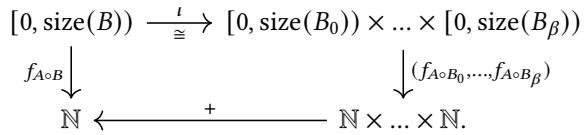
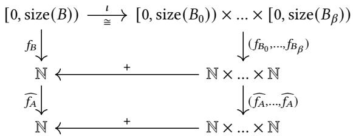

## 关于 CuTe Layout Algebra 的笔记　Jay Shah†

## 1 引言

NVIDIA CUTLASS 高性能线性代数库的核心抽象，是一种特定的 layout 概念；它作为 3.0 版本中新后端核心库 CuTe 的一部分引入 [1]。CuTe Layout 提供了一套便捷形式体系，用于描述和操作矩阵或张量值等多维数据。本技术笔记旨在从严格的数学角度研究 CuTe Layout。目前重点是阐明 complementation 和 composition 操作定义良好的充分条件，并为它们提供显式闭式公式。这些操作本身就很重要，同时还共同定义 logical division 操作。logical division 及 zipped division 等相关操作，在 CuTe Layout 和 Tensor 的各种分块与切片操作中起着关键作用；Tensor 本质上是 layout 加上指向内存的指针。

本笔记应作为 CuTe 文档 [2] 中 layout 操作讨论的补充。不过，我们认为，如果按字面解释，该文档的某些部分在数学上含糊甚至错误，这促成了本笔记的写作。最重要的是，文档没有讨论 composition 操作定义良好的必要条件。例如，文档声称 composition 对 concatenation 满足左分配律时，就会产生问题。1 在代码中，这被作为一般情形下 composition 的定义。考虑以下简单示例：

```txt
Layout A = make_layout(make_shape(_6{},_2{}),make_stride(_1{},_7{}));  
Layout B = make_layout(make_shape(_3{},_2{}),make_stride(_2{},_3{}));  
Layout C = composition(A,B); 
```

在 CUTLASS 3.3 中运行时，layout C 求值得到

$(\_3, \_2): (\_2, \_3)$ 

因为 C 按照假定的左分配律定义。但要注意，从关联 layout function $f_A$、$f_B$、$f_C$ 的角度看，C 实际并未描述 A 与 B 的 composition。事实上，

$$
f _ {C} (5) = f _ {C} (2) + f _ {C} (3) = 4 + 3 = 7,
$$

而

$$
(f _ {A} \circ f _ {B}) (5) = f _ {A} (7) = f _ {A} (1) + f _ {A} (6) = 1 + 7 = 8.
$$

实际上，在这种情况下，$A\circ B$ 作为 layout 并非定义良好；但对 B 的独立 mode $B_0$ 和 $B_1$，composition $A\circ B_0$ 与 $A\circ B_1$ 都定义良好。出现这种“溢出”问题，是因为违反了定义 2.17 中阐明的某个不相交条件。当然，程序员在实践中本来就不会考虑这类 composition；但我们希望本笔记能成为一份通用参考，用来判断这类操作在何时有效。需要强调的是，本笔记对 layout 的处理完全与具体实现无关。

本笔记目前的内容已经构成一套自包含工作；不过，如果读者此前没有使用 CuTe Layout 的经验，可能会觉得缺少动机。随着需求出现，或 CUTLASS/CuTe 开发者希望进一步阐述 layout algebra 的其他方面，我们预计会继续扩充本文档。

1 参见 [2]“Rules for computing composition”中的第（3）项。

## 2 Layout Algebra

定义 2.1。layout L 是一对维度匹配的正整数 tuple $\mathbf{S}$ 和 $\mathbf{D}$。称 $\mathbf{S}$ 为 shape，$\mathbf{D}$ 为 stride，记 $L=\mathbf{S}:\mathbf{D}$。

从这里开始，假设 layout 均已 flatten，即去除 $\mathbf{S}$ 和 $\mathbf{D}$ 的内部括号；这不会改变本文所考察操作的语义。先介绍一些基本术语：

定义 2.2。令 $\alpha\geq0$ 为整数，$L=\mathbf{S}:\mathbf{D}=(M_0,\ldots,M_\alpha):(d_0,\ldots,d_\alpha)$ 为 layout。则：

• L 的 size 是乘积 $M=M_0\cdot\ldots\cdot M_\alpha$。

• L 的 length 是整数 $\alpha+1$。

• L 的 mode 是 $0\leq k\leq\alpha$ 时的某个条目 $(M_k):(d_k)$，可以把它视为 length 1 layout。

给定两个 layout $L=\mathbf{S}:\mathbf{D}$ 和 $L'=\mathbf{S}':\mathbf{D}'$，令 $\mathbf{S}''$ 和 $\mathbf{D}''$ 分别为 $(\mathbf{S},\mathbf{S}')$ 与 $(\mathbf{D},\mathbf{D}')$ flatten 后的 shape 和 stride tuple。则 L 与 L′ 的 concatenation 是 layout

$$
(L, L ^ {\prime}) := \mathbf {S} ^ {\prime \prime}: \mathbf {D} ^ {\prime \prime},
$$

称 `(L,L′)` 由 L 与 L′ 分解。归纳地，给定 layout $L_1,\ldots,L_N$，可以形成 concatenated layout $(L_1,\ldots,L_N)$。反之，layout L 由其各 mode 最大分解。

可以为每个 layout L 关联一个函数。令 $\mathbf{S}=(M_0,\ldots,M_\alpha)$ 和 $\mathbf{D}=(d_0,\ldots,d_\alpha)$ 分别为 L 的 shape 与 stride tuple。令 $M=M_0M_1\cdots M_\alpha$ 为 L 的 size，$[0,M)\subset\mathbb{N}$ 为子集 $\{0,\ldots,M-1\}$。则存在 isomorphism

$$
\iota : [ 0, M) \cong [ 0, M _ {0}) \times [ 0, M _ {1}) \times \dots \times [ 0, M _ {\alpha})
$$

其定义为 $x\mapsto(x\bmod M_0,\lfloor x/M_0\rfloor\bmod M_1,\ldots,\lfloor x/(M_0\cdots M_{\alpha-1})\rfloor\bmod M_\alpha)$。

定义 2.3。给定 layout L，把其 layout function $f_L:[0,M)\to\mathbb{N}$ 定义为 composite

$$
[ 0, M) \cong [ 0, M _ {0}) \times \ldots \times [ 0, M _ {\alpha}) \subset \mathbb {N} ^ {\times (\alpha + 1)} \xrightarrow {(\cdot d _ {0} , \ldots , \cdot d _ {\alpha})} \mathbb {N} ^ {\times (\alpha + 1)} \xrightarrow {+} \mathbb {N}.
$$

换言之，$f_L$ 是以下 multilinear function

$$
\left[ 0, M _ {0}\right) \times \ldots \times \left[ 0, M _ {\alpha}\right) \to \mathbb {N}, \quad \left(x _ {0}, \dots , x _ {\alpha}\right) \mapsto d _ {0} x _ {0} + \dots + d _ {\alpha} x _ {\alpha},
$$

与由 shape 决定的 isomorphism $\iota$ 的 composition；前者由 stride 决定。

再用 $\widehat f_L:\mathbb{N}\to\mathbb{N}$ 表示把 $M_\alpha$ 替换为 $\infty$ 后得到的 $f_L$ 扩展，即 composite

$$
\mathbb {N} \cong [ 0, M _ {0}) \times \ldots \times [ 0, M _ {\alpha - 1}) \times \mathbb {N} \subset \mathbb {N} ^ {\times (\alpha + 1)} \xrightarrow {(\cdot d _ {0} , . . . , \cdot d _ {\alpha})} \mathbb {N} ^ {\times (\alpha + 1)} \xrightarrow {+} \mathbb {N}
$$

其中第一个 isomorphism 是 $\iota$ 的扩展 $\bar\iota$，定义为

$$
x \mapsto (x \bmod M _ {0}, \left\lfloor \frac {x}{M _ {0}} \right\rfloor \bmod M _ {1}, \dots , \left\lfloor \frac {x}{M _ {0} \cdot \dots \cdot M _ {\alpha - 2}} \right\rfloor \bmod M _ {\alpha - 1}, \left\lfloor \frac {x}{M _ {0} \cdot \dots \cdot M _ {\alpha - 1}} \right\rfloor).
$$

## 2.1 Complementation

本小节在一定假设下，定义 layout A 相对于给定整数 M 的 complement。

定义 2.4。令 $A=(N_0,\ldots,N_\alpha):(d_0,\ldots,d_\alpha)$ 为 layout。如果 $d_0\leq\ldots\leq d_\alpha$，且对每个满足 $d_i=d_j$ 的 $i<j$ 都有 $N_i\leq N_j$，就称 A 已排序。

定义 2.5。令 $A=(N_0,\ldots,N_\alpha):(d_0,\ldots,d_\alpha)$ 为 layout，M 为正整数。不失一般性，假设 A 已排序；否则用 A 的已排序置换替代它。如果以下条件成立，就称 pair `{A,M}` 对 complementation admissible，或简称 admissible：

• 对所有 $1\leq i\leq\alpha$，乘积 $N_{i-1}d_{i-1}$ 整除 $d_i$。

• 乘积 $N_\alpha d_\alpha$ 整除 M。

定义 2.6。令 $A=(N_0,\ldots,N_\alpha):(d_0,\ldots,d_\alpha)$ 为 layout，M 为正整数。假设 `{A,M}` 对 complementation admissible，并重新索引 A 使其已排序。则 `{A,M}` 的 complement 定义为 layout

$$
\operatorname{complement} (A, M) = \left(d _ {0}, \frac {d _ {1}}{N _ {0} d _ {0}}, \frac {d _ {2}}{N _ {1} d _ {1}}, \dots , \frac {M}{N _ {\alpha} d _ {\alpha}}\right): \left(1, N _ {0} d _ {0}, N _ {1} d _ {1}, \dots , N _ {\alpha} d _ {\alpha}\right).
$$

根据定义，A 相对于某个整数 M 的 complement 不受 A 的置换影响。此外，其 layout function 严格递增。

以下命题解释定义 2.6 在何种意义下确实取了 complement。

命题 2.7。令 `{A=(N_0,\ldots,N_\alpha):(d_0,\ldots,d_\alpha),M}` 为 admissible pair，$B=\operatorname{complement}(A,M)$。令 $C=(A,B)$ 为 concatenated layout。则 C 的 size 为 M，且 $f_C:[0,M)\to\mathbb{N}$ 限制为双射 $[0,M)\cong[0,M)$。

证明。由于 $\operatorname{size}(A)\operatorname{size}(B)=M$，$f_C$ 的 domain 确实为 `[0,M)`。对 C 的任意置换 C′，$f_C$ 与 $f_{C'}$ 的像相同。因此，计算 $f_C$ 的像时，可以对 C 排序使 stride 非递减，并重新索引 A 使其已排序。重新索引 C 后，令

$$
C ^ {\prime} = (d _ {0}, N _ {0}, \frac {d _ {1}}{N _ {0} d _ {0}}, N _ {1}, \frac {d _ {2}}{N _ {1} d _ {1}}..., N _ {\alpha}, \frac {M}{N _ {\alpha} d _ {\alpha}}): (1, d _ {0}, N _ {0} d _ {0}, d _ {1}, N _ {1} d _ {1},..., d _ {\alpha}, N _ {\alpha} d _ {\alpha}).
$$

于是可以写成

$$
C ^ {\prime} = \left(r _ {0}, r _ {1}, r _ {2},..., r _ {\beta}\right): \left(1, r _ {0}, r _ {0} r _ {1},..., r _ {0}... r _ {\beta - 1}\right)
$$

其中 $\beta=2\alpha+1$；$f_C$ 取得的最大值计算为

$$
(r _ {0} - 1) + r _ {0} (r _ {1} - 1) + (r _ {0} r _ {1}) (r _ {2} - 1) + \dots + (r _ {0} \dots r _ {\beta - 1}) (r _ {\beta} - 1) = r _ {0} r _ {1} \dots r _ {\beta} - 1 = M - 1.
$$

要证明双射断言，只需证明 $f_{C'}$ 为单射。假设 $x,y\in[0,M)$ 满足 $f_{C'}(x)=f_{C'}(y)$，并令 $(x_0,\ldots,x_\beta)$ 与 $(y_0,\ldots,y_\beta)$ 为它们相对于 C′ 的坐标向量。展开等式中的各项，得到

$$
x _ {0} + r _ {0} x _ {1} + (r _ {0} r _ {1}) x _ {2} + \ldots + (r _ {0} \ldots r _ {\beta - 1}) x _ {\beta} = y _ {0} + r _ {0} y _ {1} + (r _ {0} r _ {1}) y _ {2} + \ldots + (r _ {0} \ldots r _ {\beta - 1}) y _ {\beta}.
$$

下面用归纳法证明，对所有 $i\in\{0,\ldots,\beta\}$ 都有 $x_i=y_i$，从而完成证明。首先，对等式两侧模 $r_0$，可得 $x_0=y_0$，因为二者都位于 `[0,r_0)`。现在作归纳假设：给定 $0<i\leq\beta$，对所有 $j<i$ 都有 $x_j=y_j$。则表达式可化简为

$$
(r _ {0} \dots r _ {i - 1}) x _ {i} + \dots + (r _ {0} \dots r _ {\beta - 1}) x _ {\beta} = (r _ {0} \dots r _ {i - 1}) y _ {i} + \dots + (r _ {0} \dots r _ {\beta - 1}) y _ {\beta}.
$$

对该等式模 $r_0\cdots r_i$，再除以 $r_0\cdots r_{i-1}$，可得 $x_i=y_i$，因为二者都位于 `[0,r_i)`。□

推论 2.8。在命题 2.7 的设定下，令 $I=[0,\operatorname{size}(A))=[0,N_0\cdots N_\alpha)$ 为 $f_A$ 的 domain。则

$$
f _ {A} (I) \cap \widehat {f _ {B}} (I) = \{0 \}.
$$

换言之，除 0 外，$\widehat f_A$ 与 $\widehat f_B$ 限制到 $f_A$ 的 domain 后，其像不相交。

证明。令 $J=[0,\operatorname{size}(B))=[0,M/(N_0\cdots N_\alpha))$。根据命题 2.7，

$$
f _ {A} (I \cap J) \cap f _ {B} (I \cap J) = \{0 \}.
$$

还需考虑扩展函数 $\widehat f_B$ 在可能位于 I 但不位于 J 的整数上的取值。但 $\widehat f_B$ 严格递增，$\widehat f_B(\operatorname{size}(B))=M$，而 $f_A$ 取得的最大值满足不等式

$$
\begin{array}{r l} & {(N _ {0} - 1) d _ {0} + (N _ {1} - 1) d _ {1} + \ldots + (N _ {\alpha} - 1) d _ {\alpha} <   d _ {1} + (N _ {1} - 1) d _ {1} + (N _ {2} - 1) d _ {2} + \ldots + (N _ {\alpha} - 1) d _ {\alpha}} \\ & {\qquad \leq d _ {2} + (N _ {2} - 1) d _ {2} + \ldots + (N _ {\alpha} - 1) d _ {\alpha} \leq \ldots} \\ & {\qquad \leq d _ {\alpha} + (N _ {\alpha} - 1) d _ {\alpha} \leq M.} \end{array}
$$

□ 

注记 2.9。CuTe 文档 [2] 规定，layout A 相对于整数 M 的 complement B 应满足三个性质：

（1）A 与 B 不相交，即对 $f_A$ domain 中所有 $x\neq0$，都有 $f_A(x)\neq f_B(x)$；

（2）B 有序，即 $f_B$ 是严格递增函数；

（3）B 受 M 约束，即 `size(B)≥M/size(A)` 且 $\operatorname{cosize}(B)\leq\lfloor M/\operatorname{cosize}(A)\rfloor\operatorname{cosize}(A)$。这里把 layout A 的 cosize 定义为 $f_A(\operatorname{size}(A)-1)+1$。

可以看到，当 `{A,M}` admissible 时，定义 2.6 给出的 complement 满足所有这些性质。（1）由推论 2.8 得出；（2）按上述 complement 定义成立。最后，对（3）有 `size(B)=M/size(A)`，并且

$$
\begin{array}{r l} \mathrm{cosize} (B) & = 1 + (d _ {0} - 1) + \left(\frac {d _ {1}}{N _ {0} d _ {0}} - 1\right) N _ {0} d _ {0} + \ldots + \left(\frac {M}{N _ {\alpha} d _ {\alpha}} - 1\right) N _ {\alpha} d _ {\alpha} \\ & = d _ {0} + (d _ {1} - N _ {0} d _ {0}) + \ldots + (d _ {\alpha} - N _ {\alpha - 1} d _ {\alpha - 1}) + M - N _ {\alpha} d _ {\alpha} \\ & = M - ((N _ {0} - 1) d _ {0} + \ldots + (N _ {\alpha} - 1) d _ {\alpha}) \\ & = M - (\mathrm{cosize} (A) - 1), \end{array}
$$

中间各项按 C 的 sort 重新索引，这不会改变最终等式。因此，需要检查的 cosize 不等式变为

$$
\frac {M}{\operatorname{cosize} (A)} - 1 + \frac {1}{\operatorname{cosize} (A)} \leq \left\lfloor \frac {M}{\operatorname{cosize} (A)} \right\rfloor ,
$$

它对任意一对正整数成立。

示例 2.10。下面给出 CUTLASS 3.3 中 CuTe `complement` 方法可以求值、但可能产生非预期行为的两个示例。考虑 layout $A=(4):(2)$ 和 $M=19$；此时 `{A,M}` 并不 admissible。`complement(A,M)` 求值得到

$$
(_ {2}, _ {3}): (_ {1}, _ {8})
$$

不过，此时 `cosize(B)=18`，而 `cosize(A)=7`，因此

$$
\left\lfloor \frac {M}{\mathrm{cosize} (A)} \right\rfloor \cdot \mathrm{cosize} (A) = \left\lfloor \frac {1 9}{7} \right\rfloor \cdot 7 = 2 \cdot 7 = 1 4.
$$

现在考虑 $A=(2,2):(2,3)$ 和 $M=19$。此时 `complement(A,M)` 求值得到

$(\_2, \_0, \_4): (\_1, \_4, \_6)$ 

这是空 layout（`size(B)=0`），因为其 shape tuple 中出现了 0。

## 2.2 Composition

下面讨论 layout A 与 B 的 composition。为简化起见，假设 shape tuple 不含等于 1 的整数；去掉这些 mode 不会改变关联 layout function。目标是产生记作 $A\circ B$ 的 layout，使其关联函数 $f_{A\circ B}$ 等同于 composition $\widehat f_A\circ f_B$。一般而言，需要一定条件才能定义 $A\circ B$。

定义 2.11。令 $M,d>0$ 为正整数，并令 $M=M_0M_1\cdots M_\alpha$ 为 M 由整数 $M_k>1$ 构成的给定 factorization。把 $M_\alpha$ 替换为 ∞，令

$$
\widehat {M} = M _ {0} \cdot M _ {1} \cdot \ldots \cdot M _ {\alpha - 1} \cdot \infty
$$

and consider ∞ to be divisible by every positive integer. We say that $M$ is left divisible by $d$ (implicitly, with respect to the given factorization) if there exists $0 \leq i \leq \alpha$ such that: 

(1) $M _ { 0 } . . . M _ { i - 1 }$ divides $d . ^ { 4 }$ 

(2) Supposing (1), let $c = d / ( M _ { 0 } . . . M _ { i - 1 } ) . ^ { 5 }$ Then if $\dot { \iota } < \alpha ,$ , we require in addition that $1 \leq c < M _ { i }$ 

(3) For (2) in the case $i < \alpha ,$ we require in addition that $c$ also divides $M _ { i }$ 

Note that $i$ is necessarily unique if it exists. In this case, we will refer to $i$ as the division index and write ${ \widehat { M } } = d \cdot { \widehat { M ^ { \prime } } }$ Moreover, we will endow $\widehat { M ^ { \prime } }$ with the following induced factorization: 

(a) I $\begin{array} { r } { 0 \leq i < \alpha , } \end{array}$ then $\widehat { M ^ { \prime } } = M _ { 0 } ^ { \prime } \cdot \ldots \cdot M _ { \alpha - i - 1 } ^ { \prime }$ · ∞ with $M _ { 0 } ^ { \prime } = M _ { i } / c > 1$ and $M _ { j } ^ { \prime } = M _ { i + j }$ for $0 < j < \alpha - i .$ 

(b) $\operatorname { I f } i = \alpha ,$ , then $\widehat { M } = d \cdot \infty$ and we will let $\widehat { M ^ { \prime } } = \infty$ 

此外，如果存在 $0\leq i\leq\alpha$ 使上述条件（1）和（2）成立、但不一定满足（3），就称 M 可被 d 弱左整除。仍把必然唯一的 i 称为 division index，但不再拥有 $\widehat M$ 的 factorization。

Note that in Definition 2.11, the term $\widehat { M ^ { \prime } }$ with its induced factorization can itself be considered for left divisibility or weak left divisibility (with the step of replacing the last factor by ∞ now being superfluous). 

先考虑第二个 layout 为 length 1 layout 的受限 composition 情况。为此，引入“composition admissibility”概念：

定义 2.12。令 $\mathbf{S}=(M_0,\ldots,M_\alpha)$ 为 shape tuple，$M=M_0\cdots M_\alpha$，$B=(N):(r)$ 为 length 1 layout。如果以下条件成立，就称 pair `{S,B}` 对 composition admissible，或简称 admissible：

(1) $M$ is left divisible by $r$. Write ${ \widehat { M } } = r \cdot { \widehat { M ^ { \prime } } }$ 

(2) With respect to its induced factorization, $\widehat { M ^ { \prime } }$ is weakly left divisible by $N .$ 

admissibility 的思想是，layout composition $A\circ B$ 会涉及“沿 A 的 mode 划分 B”。更精确地，有以下定义：

定义 2.13。假设 $\mathbf{S}=(M_0,\ldots,M_\alpha)$ 是 shape tuple，$B=(N):(r)$ 是使 `{S,B}` admissible 的 length 1 layout。令 $\mathbf{D}=(d_0,\ldots,d_\alpha)$ 为任意 stride tuple，$A=\mathbf{S}:\mathbf{D}$。

As in Definition 2.11, let $M = M _ { 0 } \cdot \ldots \cdot M _ { \alpha }$ and ${ \widehat { M } } = r \cdot { \widehat { M ^ { \prime } } }$ with division index $0 \leq i \leq \alpha .$ . We separate the definition of $A \circ B$ into two cases. First suppose that $0 \leq i < \alpha$ , so that 

$$
r = M _ {0} \cdot \ldots \cdot M _ {i - 1} \cdot c, \quad \widehat {M ^ {\prime}} = M _ {i} / c \cdot \ldots \cdot \infty .
$$

如果 $N\leq M_i/c_*$，令 $A\circ B=(N):(cd_i)$。否则，有 $N=M_i/c\cdots M_{j-1}c\prime$；当 $j\neq\alpha$ 时 $c\prime<M_j$，并按下式定义。

$$
A \circ B = \left\{ \begin{array}{l l} (M _ {i} / c, M _ {i + 1},..., M _ {j - 1}, c ^ {\prime}): (c d _ {i}, d _ {i + 1},..., d _ {j - 1}, d _ {j}) & \text {if} c ^ {\prime} > 1; \\ (M _ {i} / c, M _ {i + 1},..., M _ {j - 1}): (c d _ {i}, d _ {i + 1},..., d _ {j - 1}) & \text {if} c ^ {\prime} = 1. \end{array} \right.
$$

如果 $i=\alpha$，仍有 $r=M_0\cdots M_{\alpha-1}c$，但 $\widehat{M\prime}=\infty$；令 $A\circ B=(N):(cd_\alpha)$。

Note that by definition the size of $A \circ B$ always equals that of $B$. We then have the following soundness proposition for Definition 2.13. In the proof, we will use the following notation: for a given index $0 \leq k \leq \alpha$ , let $\bar { \boldsymbol \delta } _ { k } \doteq \bar { \mathbb { N } } ^ { \times ( \alpha + 1 ) }$ denote the coordinate that is zero everywhere except in the $k$th position, where it is 1. 

命题 2.14。在定义 2.13 的设定下，有 $f_{A\circ B}=\widehat f_A\circ f_B$。

证明。沿用定义 2.13 的记号。相对于下列 isomorphism，逐项验证等式。

$$
\widehat {\iota}: \mathbb {N} \cong [ 0, M _ {0}) \times \dots \times [ 0, M _ {\alpha - 1}) \times \mathbb {N}
$$

of Definition 2.3, we have that $x$ is sent to $\boldsymbol { c } \cdot \delta _ { i }$ . Thus, we see that 

$$
(\widehat {f _ {A}} \circ f _ {B}) (1) = c d _ {i} = f _ {A \circ B} (1).
$$

In the cases of $i < \alpha$ and $N \leq M _ { i } / c \ \mathrm { o r } \ i = \alpha .$ , this already sufices to show $f _ { A \circ B } = \widehat { f } _ { A } \circ f _ { B }$ . In the remaining case $i < \alpha$ and $N = M _ { i } / c \cdot \ldots \cdot M _ { j - 1 } \cdot c ^ { \prime } ;$ , note that 

$$
\widehat {\iota} ((M _ {i} / c) r) = \delta_ {i + 1}, \widehat {\iota} (M _ {i + 1} (M _ {i} / c) r) = \delta_ {i + 2},..., \widehat {\iota} \bigl (M _ {j - 1}... M _ {i + 1} (M _ {i} / c) r \bigr) = \delta_ {j}.
$$

Therefore, we see that $f _ { A \circ B }$ and ${ \widehat { f } } _ { A } \circ f _ { B }$ agree on values $\{ 1 , \ M _ { i } / c , \ M _ { i + 1 } ( M _ { i } / c ) , \ . . . , \ M _ { j - 1 } . . . . M _ { i + 1 } ( M _ { i } / c ) \}$ (or drop the last term if $c ^ { \prime } = 1 )$ . In view of the multi-linearity properties of both functions,6 this implies that $f _ { A \circ B } = \widehat { f _ { A } } \circ f _ { B }$ . □ 

示例 2.15。令 $A=(M_0,\ldots,M_\alpha):(d_0,\ldots,d_\alpha)$ 为任意 layout。当 $i=0$ 时令 $B_0=(M_0):(1)$；当 $0<i\leq\alpha$ 时令 $B_i=(M_i):(M_0\cdots M_{i-1})$。则 $A\circ B_i=(M_i):(d_i)$。

为了把 composition $A\circ B$ 中第二项 B 从 length 1 layout 推广到一般 layout，把 $B=(B_0,\ldots,B_\beta)$ 写成其 mode 的 concatenation，再 concatenate composition $A\circ B_0,\ldots,A\circ B_\beta$。为了在一般情况下得到正确结果，需要避免潜在冲突。

定义 2.16。在定义 2.12 的设定下，令 $f_B:[0,N)\to\mathbb{N}$ 为 layout function，$I=[r,r(N-1)]$ 为像 $f_B([1,N))$ 的凸包所给区间。令 $M\prime=M_0\cdots M_{\alpha-1}$，$J=I\cap[1,M\prime)$；当 $\alpha=0$ 时 $J=\emptyset$。则 `{S,B}` 的定义区间为 J。

定义 2.17。令 $\mathbf{S}=(M_0,\ldots,M_\alpha)$ 为 shape tuple，$B=(N_0,\ldots,N_\beta):(r_0,\ldots,r_\beta)$ 为 layout，并令 $B_k=(N_k):(r_k)$，其中 $0\leq k\leq\beta$。如果以下条件成立，就称 pair `{S,B}` 对 composition admissible：

(1) For all $0 \leq k \leq \beta ,$ the pair $\{ \mathsf { S } , B _ { k } \}$ is admissible for composition in the sense of Definition 2.12. 

(2) The intervals of definition for the pairs $\{ \mathsf { S } , B _ { k } \} _ { 0 \leq k \leq \beta }$ are disjoint. 

此时，如果 $\mathbf{D}=(d_0,\ldots,d_\alpha)$ 是任意 stride tuple，$A=\mathbf{S}:\mathbf{D}$，则把 composition $A\circ B$ 定义为下列 concatenated layout。

$$
A \circ B := (A \circ B _ {0}, A \circ B _ {1},..., A \circ B _ {\beta})
$$

where each $A \circ B _ { k }$ is defined as in Definition 2.13. 

下面用 soundness 定理验证定义 2.17。

Theorem 2.18. In the situation of Definition 2.17, we have that $f _ { A \circ B } = \widehat { f } _ { A } \circ f _ { B }$ 

证明。根据命题 2.14，对所有 $0\leq k\leq\beta$，函数等式 $f_{A\circ B_k}=\widehat f_A\circ f_{B_k}$ 在 domain $[0,\operatorname{size}(B_k))$ 上成立。结合引理 2.19，将问题归约到各 mode。




于是只需验证把 $\widehat f_A\circ f_B$ 代入后的对应 diagram 交换。

$$
\begin{array}{c} [ 0, \text {size} (B)) \xrightarrow [ \cong ]{\iota} [ 0, \text {size} (B _ {0})) \times ... \times [ 0, \text {size} (B _ {\beta})) \\ \widehat {f _ {A}} \circ f _ {B} \Biggl \downarrow \qquad \qquad \qquad \qquad \qquad \qquad \qquad \Biggl \downarrow (\widehat {f _ {A}} \circ f _ {B _ {0}},..., \widehat {f _ {A}} \circ f _ {B _ {\beta}}) \\ \mathbb {N} \xleftarrow {} ^ {+} \mathbb {N} \times ... \times \mathbb {N}. \end{array}
$$

拆开 composition 后，可以把该 diagram 分解为




where the upper square commutes, again by Lemma 2.19. Note that the bottom square does not commute in general (i.e., the function ${ \widehat { f _ { A } } } : \mathbb { N } $ N itself is not generally additive). However, with respect to the factorization 

$$
\widehat {f} _ {A}: \mathbb {N} \xrightarrow {\cong} [ 0, M _ {0}) \times \ldots \times [ 0, M _ {\alpha - 1}) \times \mathbb {N} \xrightarrow {(d _ {0} , . . . , d _ {\alpha})} \mathbb {N} \times \ldots \times \mathbb {N} \xrightarrow {+} \mathbb {N},
$$

our assumption of disjoint intervals of definition ensures that the images of the maps $f _ { B _ { 0 } } , . . . , f _ { B _ { \beta } }$ are disjoint when intersected with $[ 0 , M _ { 0 } ) \times \ldots \times [ 0 , M _ { \alpha - 1 } ) - \{ 0 \}$ . For additivity, it now sufices to check that there do not exist distinct $B _ { k } , B _ { l }$ and non-zero $x$ \in im ${ \left( { f _ { B _ { k } } } \right) } , y \in \mathrm { i m } \left( f _ { B _ { l } } \right)$ that have coordinates $x _ { i } , y _ { i } \in [ 0 , M _ { i } )$ for some $0 \leq i < \alpha$ such that $x _ { i } + y _ { i } \ge M _ { i } ;$ if not, we may have that 

$$
\widehat {f} _ {A} (x + y) \neq \widehat {f} _ {A} (x) + \widehat {f} _ {A} (y)
$$

due to overflow in the $i$th coordinate, because the strides for the layout $A$ can be arbitrary. Now let $w _ { i _ { 0 } }$ and $z _ { j _ { 0 } }$ be the leftmost non-zero coordinates of $f _ { B _ { k } } ( 1 )$ and $f _ { B _ { l } } ( 1 )$ , respectively. If either of the indices $i _ { 0 }$ or $j _ { 0 }$ equal $\alpha$ then we are already done. Otherwise, we have that $w _ { i _ { 0 } } \leq M _ { i _ { 0 } } / 2$ and $z _ { j _ { 0 } } \leq M _ { j _ { 0 } } / 2$ from the left divisibility assumption. Moreover, the coordinates of subsequent values of $f _ { B _ { k } }$ and $f _ { B _ { l } }$ will increment by multiples of $w _ { i _ { 0 } }$ and $z _ { j _ { 0 } }$ in indices $i _ { 0 }$ and $j _ { 0 } ,$ by increments of 1 for indices greater than $i_0$ and $j _ { 0 }$ up to that occupied by the maximum value, and zero elsewhere. Finally, by disjointness7 we have that either $f _ { B _ { l } } ( 1 )$ is strictly greater than the maximum value attained by $f _ { B _ { k } }$ or vice-versa. Putting this all together, we see that disjointness of the intervals of definition rules out the possibility of overflow. 

因此，当限制到 $(f_{B_0},\ldots,f_{B_\beta})$ 的像时，$\widehat f_A$ 的确对加法满足分配律，证明完成。□

定理 2.18 的证明使用了下面关于 concatenated layout 的引理。

引理 2.19。令 $C=(C_0,\ldots,C_\gamma)$ 为 concatenated layout，并考虑其 mode layout function 的分解。

$$
\iota : [ 0, \mathrm{size} (C)) \cong [ 0, \mathrm{size} (C _ {0})) \times ... \times [ 0, \mathrm{size} (C _ {\gamma}))
$$

为定义 2.3 中的通常 isomorphism。则下列 diagram 交换：

$$
\begin{array}{c} [ 0, \text {size} (C)) \xrightarrow [ \cong ]{\iota} [ 0, \text {size} (C _ {0})) \times ... \times [ 0, \text {size} (C _ {\gamma})) \\ f _ {C} \Big \downarrow \qquad \qquad \qquad \qquad \qquad \qquad \qquad \qquad \qquad \Big \downarrow (f _ {C _ {0}},..., f _ {C _ {\gamma}}) \\ \mathbb {N} \xleftarrow {} ^ {+} \mathbb {N} \times ... \times \mathbb {N} \end{array}
$$

证明。如果 $C_0,\ldots,C_\gamma$ 都是 length 1 layout，结论由定义立即成立。一般情况下，取最大分解 $C=(C_0\prime,\ldots,C_{\gamma\prime}\prime)$，其中每个 $C_j\prime$ 都是 length 1 layout，且 $\gamma\prime+1$ 为 C 的 length。随后各 $C_i$ 由按顺序排列、互不相交且凸的 $C_j\prime$ 集合分解。

$$
\begin{array}{c} [ 0, \text {size} (C)) \xrightarrow [ \cong ]{\iota} [ 0, \text {size} (C _ {0})) \times ... \times [ 0, \text {size} (C _ {\gamma})) ^ {\frac {(t _ {0} , \ldots , t _ {\gamma})}{\cong}} [ 0, \text {size} (C _ {0} ^ {\prime})) \times ... \times [ 0, \text {size} (C _ {\gamma^ {\prime}} ^ {\prime})) \\ f _ {C} \Biggl \downarrow \qquad \qquad \qquad \Biggl \downarrow (f _ {C _ {0}},..., f _ {C _ {\gamma}}) \\ \mathbb {N} \xleftarrow {+} \mathbb {N} ^ {\times (\gamma + 1)} \xleftarrow {(+, \ldots , +)} \mathbb {N} ^ {\times (\gamma^ {\prime} + 1)}. \end{array}
$$

这里，$\iota_0,\ldots,\iota_\gamma$ 是把区间 $[0,\operatorname{size}(C_i))$ 映射到相应乘积分解的通常 isomorphism。composite $(\iota_0,\ldots,\iota_\gamma)\circ\iota$ 也是相对于 C 最大分解的通常 isomorphism。因此外部矩形和右侧方块交换，从而左侧方块交换。□

示例 2.20。与示例 2.15 一样，令 $A=\mathbf{S}:\mathbf{D}=(M_0,\ldots,M_\alpha):(d_0,\ldots,d_\alpha)$ 为任意 layout，并定义各 mode layout $B_i$。

$$
B _ {0} = (M _ {0}): (1), B _ {1} = (M _ {1}): (M _ {0}), \dots , B _ {\alpha} = (M _ {\alpha}): (M _ {0}... M _ {\alpha - 1}).
$$

令 $U\subset[0,\alpha]$ 为任意非空子集。pair 集合 $\{\mathbf{S},B_k\}_{k\in U}$ 的定义区间互不相交。因此，把 $B_U$ 定义为 $k\in U$ 时各 $B_k$ 的 concatenation 后，pair `{S,B_U}` 对 composition admissible。显式地，若 $U=\{i_0,\ldots,i_\gamma\}$，则有下式。

$$
A \circ B _ {U} = (M _ {i _ {0}},..., M _ {i _ {\gamma}}): (d _ {i _ {0}},..., d _ {i _ {\gamma}}).
$$

可以把在之前复合 $B_U$ 看作投影到 A 中索引属于 U 的各 mode。

警告 2.21。定义 2.12 的单 mode admissibility 条件比 CUTLASS 自身的 static assert 检查更宽松。条件（1）与 CUTLASS 检查相同；对条件（2），CUTLASS 使用普通左整除，而本文只要求弱左整除。示例中的 $C=A\circ B$ 在 CUTLASS 中会触发 `Static shape_div failure`，但按本文规则会计算为 `(2,3):(9,5)`。

## 2.3 Logical Division

完成这些准备后，可以定义 logical division 操作。

定义 2.22。令 $A=\mathbf{S}:\mathbf{D}$ 和 B 为 layout，M 为 A 的 size。假设 pair `{B,M}` 与 `{S,B}` 分别对 complementation 和 composition admissible。把 logical division $A/B$ 定义为下列 layout。

$$
A / B := A \circ (B, \text { complement } (B, M)).
$$

Implicit in Definition 2.22 is the following lemma: 

引理 2.23。假设 $A=\mathbf{S}:\mathbf{D}$、$M=\operatorname{size}(A)$，且 B 如定义 2.22。则 `{S,(B,complement(B,M))}` 对 composition admissible。

$$
\text { PROOF.   Write } A = \mathbf {S}: \mathbf {D} = (M _ {0},..., M _ {\alpha}): (d _ {0},..., d _ {\alpha}) \text { and } B = (N _ {0},..., N _ {\beta}): (r _ {0},..., r _ {\beta}). \text { Let }
$$

$$
\varphi : [ 0, \beta ] \stackrel {\cong} {\to} [ 0, \beta ]
$$

be the automorphism such that $B ^ { \varphi } : = \left( N _ { \varphi ( 0 ) } , . . . , N _ { \varphi ( \beta ) } \right) : \left( r _ { \varphi ( 0 ) } , . . . , r _ { \varphi ( \beta ) } \right)$ is sorted. Then by definition, 

$$
\operatorname{complement} (B, M) = \left(r _ {\varphi (0)}, \frac {r _ {\varphi (1)}}{N _ {\varphi (0)} r _ {\varphi (0)}},..., \frac {M}{N _ {\varphi (\beta)} r _ {\varphi (\beta)}}\right): \left(1, N _ {\varphi (0)} r _ {\varphi (0)},..., N _ {\varphi (\beta)} r _ {\varphi (\beta)}\right).
$$

Now write 

$$
B _ {0} ^ {\prime} = \left(r _ {\varphi (0)}\right): (1), B _ {1} ^ {\prime} = \left(\frac {r _ {\varphi (1)}}{N _ {\varphi (0)} r _ {\varphi (0)}}\right): \left(N _ {\varphi (0)} r _ {\varphi (0)}\right), \ldots , B _ {\beta} ^ {\prime} = \left(\frac {M}{N _ {\varphi (\beta)} r _ {\varphi (\beta)}}\right): \left(N _ {\varphi (\beta)} r _ {\varphi (\beta)}\right)
$$

for the length 1 layouts that comprise complement($B$, $M$). We first claim that the pairs $\{ \mathsf { S } , B _ { k } ^ { \prime } \}$ for $0 \le k \le \beta$ are all admissible for composition. By assumption, we have that $M$ is left divisible by $r _ { \varphi ( k ) }$ and its remainder is then weakly left divisible by $N _ { \varphi ( k ) }$ , for all $0 \leq k \leq \beta .$ But since $r _ { \varphi ( k ) } N _ { \varphi ( k ) } | r _ { \varphi ( k + 1 ) }$ for all $0 \le k < \beta$ and $M = { \mathrm { s i z e } } ( A )$ , the additional divisibility condition $( 3 )$ in Definition 2.11 needed to promote weak left divisibility to left divisibility is necessarily satisfied for all the $N _ { \varphi ( k ) }$ terms. Therefore, we deduce that the pairs $\{ \mathsf { S } , B _ { k } ^ { \prime } \}$ are indeed all admissible. Now by Proposition 2.7, we see that the additional disjointness assumption is satisfied so that {$\mathbf{S}$, ($B$, complement($B$, $M$))} is admissible for composition. □ 

至此完成当前对 logical division 的讨论。暂时把更多 logical division 示例留给 CuTe 文档。

## 3 PERMUTATIONS EXPRESSIBLE AS LAYOUT FUNCTIONS

本节说明如何以结构化方式取回所有可表示为 layout function 的置换；更精确的动机参见注记 3.16。假设读者熟悉 category 的基本语言。

定义 3.1。把 ordered factorization 的 object 集合 `ob(Fact)` 定义为所有形如 `[p_1\cdots p_k]` 的表达式，其中 $k\geq0$，各 $p_i$ 为不要求互异的素数。$k=0$ 对应空表达式。

示例 3.2。集合 `ob(Fact)` 包括 `[]`、`[2]`、`[3]`、`[22]`、`[23]`、`[32]`、`[232]` 等表达式。

记号 3.3。用 $\underline{k}$ 表示由 k 个元素组成的集合 $\{1,2,\ldots,k\}$；当 $k=0$ 时，$\underline0=\emptyset$。

定义 3.4。按如下方式定义 ordered factorization 的 category **Fact**。

(1) ob(Fact) is the set of objects of Fact. 

(2) For every expression $E = \left[ p _ { 1 } p _ { 2 } . . . p _ { k } \right]$ in ob(Fact) and every morphism of finite sets $\alpha : \underline { n } \to \underline { k } ,$ we have a morphism 

$$
E ^ {\alpha} = [ p _ {\alpha (1)} p _ {\alpha (2)} \dots p _ {\alpha (n)} ] \xrightarrow {\alpha_ {E}} E = [ p _ {1} p _ {2} \dots p _ {k} ]
$$

它位于 **Fact** 中。这定义了 codomain 为 E 的所有 morphism 集合；再让 E 遍历全部 object，就定义了 **Fact** 中的所有 morphism 集合。

(3) The composition of morphisms is defined as follows. Suppose we have morphisms of finite sets $\alpha : \underline { n } \to \underline { k }$ and $\beta : { \underline { { m } } }  { \underline { { n } } }$ and an expression $E = \left[ p _ { 1 } p _ { 2 } . . . p _ { k } \right]$ . Write 

$$
E ^ {\alpha} = \left[ p _ {\alpha (1)} p _ {\alpha (2)}... p _ {\alpha (n)} \right] = \left[ q _ {1}... q _ {n} \right].
$$

令 $\gamma=\alpha\circ\beta:\underline m\to\underline k$。则相应 morphism 的 composition 按下式给出。

$$
\alpha_ {E}: E ^ {\alpha} = [ p _ {\alpha (1)} p _ {\alpha (2)} \dots p _ {\alpha (n)} ] \rightarrow E = [ p _ {1} \dots p _ {k} ], \quad \beta_ {E ^ {\alpha}}: (E ^ {\alpha}) ^ {\beta} = [ q _ {\beta (1)} \dots q _ {\beta (m)} ] \rightarrow E ^ {\alpha} = [ q _ {1} \dots q _ {n} ]
$$

is given by $\gamma _ { E } : E ^ { \gamma }  E ,$ , where we use that $\left[ q _ { \beta ( 1 ) } . . . q _ { \beta ( m ) } \right] = \left[ p _ { Y ( 1 ) } . . . p _ { Y ( m ) } \right] .$ 

容易检查 **Fact** 中 morphism 的 composition 满足结合律并具有 identity，因此定义 3.4 确实定义了一个 category。

记号 3.5。用 $\Sigma_k$ 表示 k 个字母上的对称群。给定 $\varphi\in\Sigma_k$，也用 $\varphi$ 表示 $\underline k$ 上关联的 automorphism。

示例 3.6。假设 $E=[222]$。每个置换 $\varphi\in\Sigma_3$ 都定义 **Fact** 中的 automorphism $E^\varphi=E\to E$；反之，`[222]` 的每个 automorphism 唯一对应 $\Sigma_3$ 中的元素。

假设 $E=[232]$。transposition $\sigma=(13)\in\Sigma_3$ 定义 E 的 automorphism，因为 $E^\sigma=E$。另一方面，$\tau=(12)\in\Sigma_3$ 定义 morphism $E^\tau=[322]\to E=[232]$。

注记 3.7。用 **FinSet** 表示有限集合的 category，更准确地说是以 $n\geq0$ 时集合 $\underline n$ 为 object 的 skeleton。给定 object $\underline k\in\mathbf{FinSet}$，用 $\mathbf{FinSet}_{/\underline k}$ 表示 overcategory，其 object 是 morphism $[\alpha:\underline n\to\underline k]$，morphism 是交换三角形；该 category 的 final object 为 $[\operatorname{id}_{\underline k}]$。

于是，对每个 length 为 k 的表达式 $E=[p_1\cdots p_k]$，都有一个 functor。

$$
F _ {E}: \mathbf {F i n S e t} ^ {\underline {{/ k}}} \to \mathbf {F a c t}
$$

that sends the object $[ \alpha : \underline { { n } } \to \underline { { k } } ] \mathrm { t o } E ^ { \alpha }$ and the unique morphism $[ \alpha ]  [ \mathrm { i d } _ { \underline { { { k } } } } ] \mathrm { t o } \alpha _ { E } : E ^ { \alpha }  E$ . This functor has every morphism in Fact with codomain $E$ in its image. 

注记 3.8。事实上，可以把 **Fact** 本身识别为某个 overcategory，更准确地说是其 full subcategory。令 $\mathcal P=\{2,3,5,\ldots\}$ 为无限素数集合，**Set** 为集合 category，$\mathbf{FinSet}_{/\mathcal P}$ 为 $\mathbf{Set}_{/\mathcal P}$ 中 domain X 为有限集合的 morphism $X\to\mathcal P$ 所组成的 full subcategory。则存在 category equivalence。

$$
\mathbf {F a c t} \simeq \mathbf {F i n S e t} ^ {\mathcal {P}}
$$

that sends an expression $E = \left[ \pmb { p } _ { 1 } . . . \pmb { p } _ { k } \right]$ to the morphism $E _ { \bullet } : \underline { { k } } \to \mathcal { P }$ given by $i \mapsto p _ { i }$ . Under this equivalence, the functor $F _ { E }$ of Remark 3.7 identifies with the functor 

$$
\operatorname{FinSet} ^ {\underline {{k}}} \simeq \left(\operatorname{FinSet} ^ {\mathcal {P}}\right) ^ {/ E _ {\bullet}} \rightarrow \operatorname{FinSet} ^ {\mathcal {P}}
$$

that forgets the map to $E _ { \bullet }$ . 

下面说明如何为 **Fact** 中每个 morphism 关联一个 layout。

定义 3.9。假设 $E=[p_1\cdots p_k]$，$\alpha:\underline n\to\underline k$。按如下方式定义 layout $L_{(E,\alpha)}$。

(1) Its shape tuple is $( p _ { \alpha ( 1 ) } , p _ { \alpha ( 2 ) } , . . . , p _ { \alpha ( n ) } )$ 

(2) Its stride tuple is $( d _ { 1 } , d _ { 2 } , . . . , d _ { n } )$ where $\begin{array} { r } { d _ { i } = \prod _ { j < \alpha ( i ) } p _ { j } . ^ { 1 0 } } \end{array}$ 

同时用 $f_{(E,\alpha)}$ 表示关联的 layout function。

示例 3.10。假设 $E=[23]$，$\varphi=(12)\in\Sigma_2$ 是非平凡 transposition。则 $L_{(E,\varphi)}=(3,2):(2,1)$。其他表达式可按相同方式计算。

注记 3.11。令 $E=[p_1\cdots p_k]$、$\alpha:\underline n\to\underline k$、$N=p_1\cdots p_k$、$N^\alpha=p_{\alpha(1)}\cdots p_{\alpha(n)}$。在标准坐标同构下，可如下描述关联 layout function。

$$
[ 0, N) \cong [ 0, p _ {1}) \times [ 0, p _ {2}) \times \ldots \times [ 0, p _ {k}),
$$

$$
\left[ 0, N ^ {\alpha}\right) \cong \left[ 0, p _ {\alpha (1)}\right) \times \left[ 0, p _ {\alpha (2)}\right) \times \ldots \times \left[ 0, p _ {\alpha (n)}\right)
$$

于是关联 layout function $f_{(E,\alpha)}:[0,N^\alpha)\to[0,N)\subset\mathbb N$ 可以描述为下列 multilinear function。

$$
[ 0, p _ {\alpha (1)}) \times [ 0, p _ {\alpha (2)}) \times \dots \times [ 0, p _ {\alpha (n)}) \rightarrow [ 0, p _ {1}) \times [ 0, p _ {2}) \times \dots \times [ 0, p _ {k})
$$

that sends the basis vector $\delta _ { i }$ for $1 \leq i \leq n \mathrm { t o } \delta _ { \alpha ( i ) }$ , and which restricts to an isomorphism $[ 0 , p _ { \alpha ( i ) } ) \stackrel { \cong } { \longrightarrow } [ 0 , p _ { \alpha ( i ) } )$ for all $1 \leq i \leq n .$ . In particular, if $\alpha$ is itself a bijection, then $f _ { ( E , \alpha ) }$ restricts to an automorphism of [0, $N$). 

进一步展开注记 3.11，得到以下引理；它说明 category **Fact** 中的 composition 与 layout function 的 composition 相容。

引理 3.12。假设存在有限集合 morphism $\alpha:\underline n\to\underline k$、$\beta:\underline m\to\underline n$，以及表达式 $E=[p_1p_2\cdots p_k]$。令 $\gamma=\alpha\circ\beta$。则关联 layout function 的 composition 满足下述相容性。

$$
\gamma_ {E}: E ^ {\gamma} = (E ^ {\alpha}) ^ {\beta} \xrightarrow {\beta_ {E ^ {\alpha}}} E ^ {\alpha} \xrightarrow {\alpha_ {E}} E
$$

位于 **Fact** 中。则关联 layout function 满足 composition 等式

$$
f _ {(E, \gamma)} = f _ {(E, \alpha)} \circ f _ {(E ^ {\alpha}, \beta)}.
$$

证明。令 $N=p_1\cdots p_k$、$N^\alpha=p_{\alpha(1)}\cdots p_{\alpha(n)}$、$N^\gamma=p_{\gamma(1)}\cdots p_{\gamma(m)}$。使用相应 canonical isomorphism，把问题归约到 multilinear function 的 composition。

$$
[ 0, N) \cong [ 0, p _ {1}) \times [ 0, p _ {2}) \times \dots \times [ 0, p _ {k}),
$$

$$
[ 0, N ^ {\alpha}) \cong [ 0, p _ {\alpha (1)}) \times [ 0, p _ {\alpha (2)}) \times \dots \times [ 0, p _ {\alpha (n)})
$$

$$
[ 0, N ^ {\gamma}) \cong [ 0, p _ {\gamma (1)}) \times [ 0, p _ {\gamma (2)}) \times \ldots \times [ 0, p _ {\gamma (m)})
$$

to write the domains and codomains of the layout functions in question (noting that $f _ { ( E ^ { \alpha } , \beta ) }$ has codomain lying inside $[ 0 , N ^ { \alpha } ) )$ . We are trying to equate the multilinear function 

$$
f _ {(E, \gamma)}: [ 0, p _ {\gamma (1)}) \times [ 0, p _ {\gamma (2)}) \times \dots \times [ 0, p _ {\gamma (m)}) \rightarrow [ 0, p _ {\alpha (1)}) \times [ 0, p _ {\alpha (2)}) \times \dots \times [ 0, p _ {\alpha (n)})
$$

与下面两个 multilinear function 的 composition 比较：

$$
f _ {(E ^ {\alpha}, \beta)}: [ 0, p _ {\gamma (1)}) \times [ 0, p _ {\gamma (2)}) \times \ldots \times [ 0, p _ {\gamma (m)}) \to [ 0, p _ {\alpha (1)}) \times [ 0, p _ {\alpha (2)}) \times \ldots \times [ 0, p _ {\alpha (n)})
$$

$$
f _ {(E, \alpha)}: [ 0, p _ {\alpha (1)}) \times [ 0, p _ {\alpha (2)}) \times \dots \times [ 0, p _ {\alpha (n)}) \to [ 0, p _ {1}) \times [ 0, p _ {2}) \times \dots \times [ 0, p _ {k}).
$$

但根据注记 3.11，basis vector 被映射到 basis vector，因此只需在 basis vector 上检查所需等式，而这很直接。□

警告 3.13。在引理 3.12 中，逐 mode 的 composition admissibility 条件显然成立；但当 $\beta$ 不是单射时，定义 2.17 的不相交条件可能被违反。

现在定义从 **Fact** 到 **FinSet** 的“realization”functor，把 ordered factorization 的 morphism 映射到其关联 layout function。

定义 3.14。令 `$R: Fact → FinSet` 为按下述方式定义的 functor。

(1) Let $E = \left[ \pmb { p } _ { 1 } . . . \pmb { p } _ { k } \right]$ be an object of Fact and let $N = p _ { 1 } \cdot \ldots \cdot p _ { k }$ . Then $R ( E ) = [ 0 , N ) . ^ { 1 }$ 11 

(2) For every morphism $\alpha _ { E } : E ^ { \alpha } \to E .$ let $R ( \alpha _ { E } ) = f _ { ( E , \alpha ) } : [ 0 , N ^ { \alpha } )  [ 0 , N )$ be as in Definition 3.9. 

根据引理 3.12，$R$ 确实定义了 functor，因为它保持 morphism composition 和 identity。

$R$ 的像并不包含所有可表示为 layout function 的函数；但它包含所有可表示为 layout function 的 automorphism $[0,N)\cong[0,N)$。

命题 3.15。令 $N>0$，$f:[0,N)\to[0,N)$ 为 automorphism。若存在 size 为 N 的 layout L 使 $\hat f=f_L$，则 $f_L$ 位于 realization functor R 的像中。

证明。不失一般性，可以假设 L 的 shape tuple 为 $(p_1,p_2,\ldots,p_k)$，其中各 $p_i$ 都是素数，且 $N=p_1\cdots p_k$。于是可写成 $L=(p_1,p_2,\ldots,p_k):(d_1,d_2,\ldots,d_k)$；要使 $f_L$ 成为 `[0,N)` 的 automorphism，L 的 sort 必须具有下述形式。

$$
L ^ {\varphi} := \left(p _ {\varphi (1)}, p _ {\varphi (2)},..., p _ {\varphi (k)}\right): \left(1, p _ {\varphi (1)}, p _ {\varphi (1)} p _ {\varphi (2)},..., \Pi_ {1 \leq i <   k} p _ {\varphi (i)}\right)
$$

for some permutation $\varphi \in \Sigma _ { k }$ , in order for $f _ { L }$ to be an automorphism of $[ 0 , N )$ . But this means that if we let $\psi = \varphi ^ { - 1 }$ be the inverse permutation, then 

$$
\psi_ {E}: E ^ {\psi} = \left[ p _ {1} p _ {2}... p _ {k} \right] = \left[ p _ {\psi (\varphi (1))} p _ {\psi (\varphi (2))}... p _ {\psi (\varphi (k))} \right]\rightarrow E = \left[ p _ {\varphi (1)} p _ {\varphi (2)}... p _ {\varphi (k)} \right]
$$

is a morphism in Fact such that $R ( \psi _ { E } ) = f _ { L } = f .$ 

注记 3.16。命题 3.15 的一种解释是：取 **Fact** 内部的 maximal subgroupoid $\mathbf{Fact}^\simeq$，即所有可逆 morphism 构成的 subcategory，则其 realization 描述了可由 layout function 表达的置换。

$$
R: \operatorname{Fact} ^ {\simeq} \rightarrow \operatorname{FinSet}
$$

carves out exactly those permutations expressible as layouts. Our motivation for this description is that for a fixed integer $N > 0$ , the subset $\Sigma _ { N } ^ { L }$ of $\Sigma _ { N }$ on those automorphisms expressible as layout functions is typically not a subgroup (being not generally closed under the group multiplication, i.e. composition). Instead, if we let 

$$
\mathbf {F a c t} _ {N} ^ {\simeq} \subset \mathbf {F a c t} ^ {\simeq}
$$

be the full subgroupoid on those objects $\left[ \hbar \cdot \cdot \cdot \cdot \hbar _ { k } \right]$ with $N = p _ { 1 } \cdot \ldots \cdot p _ { k }$ , then $\Sigma _ { N } ^ { L }$ consists of those morphisms in the image of $R$ on $\mathbf { F a c t } _ { N } ^ { \simeq }$ . However, we see that $\Sigma _ { N } ^ { L }$ is closed under the operation of taking the group inverse. Moreover, in the special case that $N$ is a prime power $p ^ { k }$ , then $\Sigma _ { N } ^ { L }$ is in fact a subgroup and is isomorphic to $\Sigma _ { k }$ This corresponds to $\mathbf { F a c t } _ { p ^ { k } } ^ { \simeq }$ being a groupoid with one object $[ p p . . . p ]$ , i.e., a group. 

## 参考文献

[1] CUTLASS — CUDA Templates for Linear Algebra Subroutines. https://github.com/NVIDIA/cutlass. 

[2] CuTe Layout Operations. https://github.com/NVIDIA/cutlass/blob/main/media/docs/cute/02_layout_operations.md. 
