# CuTe Layout 的范畴论基础

在 GPU 编程中，性能在很大程度上取决于数据如何在内存中存储和访问。我们关心的数据通常是多维的，但 GPU 内存从根本上说是一维的。这意味着，当需要加载、存储或以其他方式操作数据时，必须把多维逻辑坐标映射到一维物理坐标。这种映射称为 layout，是正确、高效读写内存的基础。此外，在 GPU 的 SIMT 执行模型中，layout 还用于描述和操作线程在数据上的划分方式。这对优化内存访问模式，以及正确调用面向 Tensor Core 等专用硬件的指令非常重要。

CUTLASS 开创了一种新的 layout 方法：一方面，它支持任意嵌套和深度的 shape 与 stride tuple；另一方面，它通过 composition、complementation、logical division 和 logical product 等基本操作构成一套“layout algebra”。这些 CuTe layout 的表达能力极强，例如可以描述历代 Tensor Core 指令的划分模式。从数学角度看，它们同样引人入胜，因为其中包含一种不寻常且微妙的函数复合概念，需要理论解释。

在一篇新论文中，我们为这种方法建立了稳健的数学理论，把 CuTe layout 及其代数与范畴和 operad 理论联系起来，并提出一套新的 layout 图形演算，用于计算这些操作。论文的最新 PDF 版本可从[这里](https://research.colfax-intl.com/download/categories-of-layouts/)和 [arXiv](https://arxiv.org/abs/2601.05972) 获取，配套 Git 仓库位于[这里](https://github.com/ColfaxResearch/layout-categories)。

本文简要概述论文的主要思路与结果；完整论述、大量推导示例和证明请参阅原论文。为了陈述这些结果，我们假定读者了解 [category](https://en.wikipedia.org/wiki/Category_(mathematics)) 和 [functor](https://en.wikipedia.org/wiki/Functor) 的基本概念；快速介绍可参见论文附录 A。我们还假定读者熟悉 CuTe layout 的基础知识，下文将其简称为 layout。

## Tractable layout

为任意 layout 定义并计算 layout 操作十分困难；如果把讨论限制在 tractable layout 上，就能建立一套直观框架。它几乎涵盖实践中遇到的所有 layout，例如：

- 随处可见的 row-major 和 column-major layout；
- 把数据存储在连续内存地址中的 compact layout；
- 广播多份数据副本的 projection；
- 支持带 padding 的加载和存储的 dilation。

暂且关注 flat 情况：layout 的 shape 和 stride 是 tuple $(x_1, \ldots, x_n)$，而不是更一般的嵌套 tuple。本文始终假定 shape tuple 由正整数组成，stride tuple 由非负整数组成。

首先，在整数对 $s:d$ 上定义序关系 $\preceq$：

$$
s : d \preceq s^{\prime} : d^{\prime} \: \text{ if and only if } \: d < d^{\prime} \: \text{ or } \: d = d^{\prime} \text{ and } s \leq s^{\prime}.
$$

定义：称 flat layout

$$
L = (s_1, \ldots, s_m) : (d_1, \ldots, d_m)
$$

是 tractable 的，如果对所有整数对 $1 \leq i, j \leq m$，下列条件都成立：

$$
\text{if } s_i : d_ i \preceq s_j : d_j \text{ and } d_i, d_j \neq 0, \text{ then } s_i d_i \text{ divides } d_j.
$$

如果 L 是 tractable 的，就可以用图来编码 L。例如：

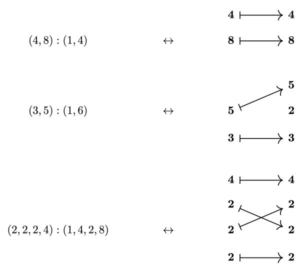

所编码 layout 的 shape 是左侧 tuple；其 stride 则由箭头和右侧 tuple 的前缀乘积共同决定：

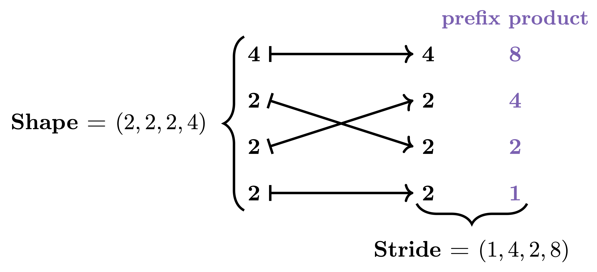

这些图是 category **Tuple** 中 morphism 的可视化表示：

定义：用 **Tuple** 表示满足下列条件的 category：

1. object 是由正整数组成的 tuple $(s_1, \ldots, s_m)$；
2. morphism $f : (s_1, \ldots, s_m) \to (t_1, \ldots, t_n)$ 由有限带基点集合的映射指定：

$$
\alpha: \{ \ast, 1, \ldots, m \} \to \{ \ast, 1, \ldots, n\}
$$

并满足以下条件：

1. $\alpha(*) = *$；
2. 如果 $\alpha(i) \neq *$ 且 $\alpha(i) = \alpha(i^{\prime})$，则 $i = i^{\prime}$；
3. 如果 $\alpha(i) = j \neq *$，则 $s_i = t_j$。

称这种 morphism f 位于 α 之上，并称 f 为 tuple morphism。

前面的每幅图都来自某个 tuple morphism f：把 f 的 domain $(s_1, \ldots, s_m)$ 和 codomain $(t_1, \ldots, t_n)$ 纵向排列；如果 $\alpha(i)=j$，就从 $s_i$ 向 $t_j$ 画一条箭头。现在可以精确定义 tuple morphism 所编码的 layout。

定义：如果 f 是 tuple morphism，则 f 编码的 layout 为

$$
L_f = (s_1, \ldots, s_m) : (d_1, \ldots, d_m)
$$

其 shape 是 f 的 domain，stride 定义为

$$
d_i = \begin{cases} t_1 \cdots t_{j-1} & \text{if } \alpha(i) = j \\ 0 & \text{if } \alpha(i) = *. \end{cases}
$$

一个重要而微妙的事实是，许多不同的 tuple morphism 可以编码同一个 layout。例如，下面每个 tuple morphism

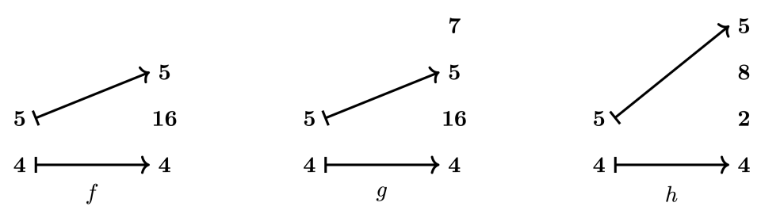

都编码 layout `L = (4, 5):(1, 64)`。morphism f 显然最简单：它不包含多余条目，例如 g 中的“7”；而且没有被 f 命中的条目已合并，不像 h 中的“2”和“8”那样分开。当 morphism f 满足这些性质时，称 f 具有 standard form。

如果进一步假设 layout L 和 morphism f 都是 non-degenerate 的，这分别对应以下条件：

$$
s_i = 1 \quad \Rightarrow \quad d_i = 0,
$$

$$
s_i = 1 \quad \Rightarrow \quad \alpha(*) = *,
$$

那么可以证明下面的对应定理。

定理：non-degenerate tractable flat layout 与具有 standard form 的 non-degenerate tuple morphism 之间存在一一对应关系。

如果 L 是 non-degenerate tractable layout，就用 $f_L$ 表示与 L 对应的 tuple morphism，并称 $f_L$ 为 L 的 standard representation。

## Layout function 与 realization functor

layout L 最重要的不变量是其 layout function $\Phi_L$。当 L 是 tractable 的，其 layout function 会通过一个 realization functor 自然地从 category **Tuple** 中产生：

$$
| \cdot | : \textbf{Tuple} \to \textbf{FinSet}
$$

下面回顾 layout function 的定义。为此，首先要回顾 colexicographic isomorphism 及其逆的定义。使用记号 $[0, N) = \{ 0, 1, \ldots, N – 1 \}$ 会比较方便。

定义：如果 $S = (s_1, \ldots, s_m)$ 是大小为 M 的正整数 tuple，则 colexicographic isomorphism 是函数

$$
\mathrm{colex}_S: [0, s_1) \times \cdots \times [0, s_m) \to [0, M)
$$

其定义为

$$
\mathrm{colex}_S(x_1, \ldots, x_m) = \sum_{i=1}^m x_i \cdot s_1 \cdots s_{i-1}.
$$

逆 colexicographic isomorphism 是函数

$$
\mathrm{colex}_S^{-1}: [0, M) \to [0, s_1) \times \cdots \times [0, s_m)
$$

其定义为

$$
\mathrm{colex}_S^{-1}(x) = (x_1, \ldots, x_m)
$$

其中

$$
x_i = \lfloor x / (s_1 \cdots s_{i-1} ) \rfloor \: \mod s_1 \cdots s_i.
$$

当 L 是 tractable 的，可以借助从 **Tuple** 到有限集合 category 的 realization functor 恢复其 layout function。

定理：存在一个 functor

$$
| \cdot | : \textbf{Tuple} \to \textbf{FinSet},
$$

称为 realization，并满足以下性质：

1. 如果 S 是大小为 M 的 tuple，则 $|S| = [0, M)$。
2. 如果 S 和 T 分别是大小为 M 和 N 的 tuple，且 $f:S\to T$ 是 tuple morphism，则其 realization $|f|:[0,M)\to[0,N)\subset\mathbb{Z}$ 是 $L_f$ 的 layout function。

特别地，该结果可以轻易证明 tuple morphism 的复合与 layout 的复合相容，下文将对此进行讨论。

## Layout 操作

许多重要 layout 操作，例如 coalesce、complement 和 composition，在 category **Tuple** 中都有对应物。下面逐一考察这些操作。

### Coalesce

如果 $L = (s_1, \ldots, s_m):(d_1, \ldots, d_m)$ 是 layout，则可通过迭代替换任意形如

$$
(\ldots, s_i, s_{i+1}, \ldots) : (\ldots, d_i, s_i d_i, \ldots)
$$

的部分为

$$
(\ldots, s_i s_{i+1}, \ldots) : (\ldots, d_i, \ldots)
$$

把所得 layout 记为 coal(L)。例如，如果

$$
L = (2, 2, 5, 5, 5) : (1, 2, 8, 40, 200)
$$

则

$$
\mathit{coal}(L) = (4, 125) : (1, 8).
$$

这种构造在 category **Tuple** 中有直接对应物。如果 f 是 tuple morphism，可以通过合并平行箭头并将相应条目相乘，对 f 执行 coalesce。例如：

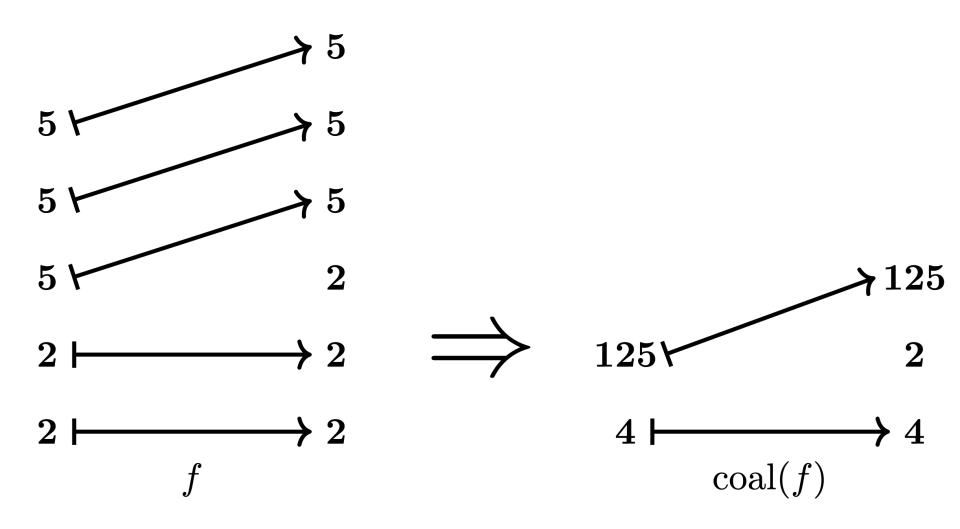

我们证明，**Tuple** 中的 coalesce 操作与 layout coalesce 相容。

定理：如果 f 是 tuple morphism，则 coal(f) 所编码的 layout 为

$$
L_{\mathit{coal}(f)} = \mathit{coal}(L_f).
$$

### Complement

如果 L 是 layout，N 是正整数，则 comp(L, N) 是一个经过排序和 coalesce 的 layout，其与 L 的拼接是 compact 的。这意味着拼接结果的 layout function 是到其像上的同构。存在一个使 L 拥有 complement 的最小整数 N；此时记 `comp(L) = comp(L, N)`。例如，如果

$$
L = (2, 2, 2):(1, 6, 60)
$$

则

$$
comp(L) = (3, 5) : (2, 12).
$$

同样，complement 在 category **Tuple** 中也有对应物。通过纳入未被 f 命中的条目，可以计算 tuple morphism f 的 complement $f^c$。例如：

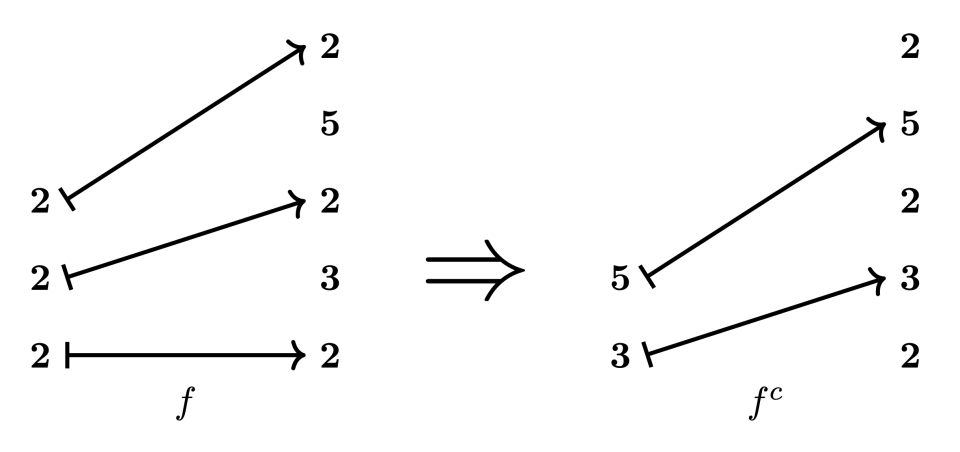

我们证明，category **Tuple** 中的 complement 与 layout complement 相容。

定理：如果 f 是具有 standard form 的单射 tuple morphism，则

$$
L_{f^c} = \mathit{comp}(L_f).
$$

### Composition

如果 A 和 B 是 layout，则 composition `B ∘ A` 是一个满足下列条件的 layout：对任意 `x ∈ [0, size(B ∘ A))`，都有

$$
\Phi_{B \circ A}(x) = \Phi_B ( \Phi_A(x)).
$$

还有其他性质能够唯一刻画 layout `B ∘ A`；完整细节请参阅论文定义 2.3.7.1。例如，如果 `A = (2, 2):(5, 50)`，`B = (5, 2, 5, 2):(1, 25, 5, 50)`，则 A 和 B 的 composition 为 `(2, 2):(25, 50)`。

如果 f 和 g 是满足 `codomain(f) = domain(g)` 的 tuple morphism，就可以复合 f 和 g，形成 tuple morphism `g ∘ f`。例如，下面的 tuple morphism

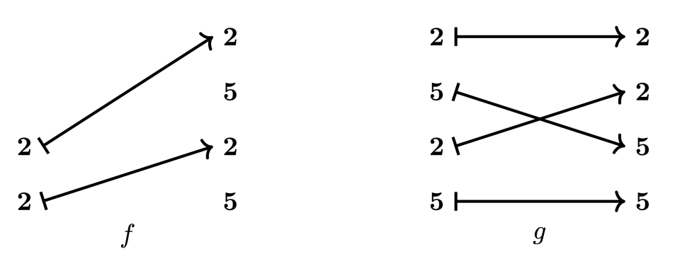

是可复合的，其 composite 如下图所示。

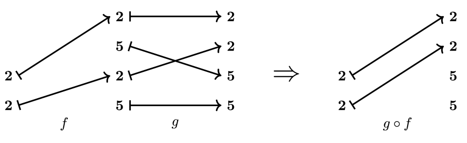

我们证明，category **Tuple** 中的 composition 与 layout composition 相容。

定理：如果 f 和 g 是可复合的 tuple morphism，则

$$
L_{g \circ f} = L_g \circ L_f.
$$

该定理提供了一种计算 flat tractable layout A 与 B 的 composition 的工具。具体来说，可以取 A 和 B 的 standard representation $f=f_A$ 与 $g=f_B$；如果这些 morphism 恰好可复合，就能通过下式得到 A 与 B 的 composite：

$$
B \circ A = L_{g \circ f}.
$$

不过，即使 layout 本身可复合，任意选取的 tractable layout A 和 B 的 standard representation f 与 g 通常也不可直接复合。因此，可以按以下方式计算 A 和 B 的 composition：

1. 从 A 和 B 的 standard representation f 和 g 开始；
2. 修改 f 和 g，得到可复合的 morphism f’ 和 g’，它们 realization 后的 layout function 分别与 f 和 g 相同；
3. 复合 f’ 与 g’，得到编码 `B ∘ A` 的 morphism `g’ ∘ f’`。

为了使这一过程既严谨又通用，必须把讨论范围扩展到嵌套或分层 layout。

## 嵌套 layout 与 nested tuple morphism

先固定一些记号和术语。profile 是每个条目都为符号 ∗ 的嵌套 tuple。例如，`P = (∗, (∗, ∗))` 和 `Q = ((∗, ∗), ∗, (∗, ∗))` 都是 profile。嵌套 tuple S 由其 flattening $(s_1, \ldots, s_m)$ 和 profile P 唯一确定；前者是普通 tuple。处理嵌套 tuple 时，可方便地写成

$$
S = (s_1, \ldots s_m)_P
$$

例如，如果 `S = ((2, 2), (5, 5))`，可以写成

$$
S = (2, 2, 5, 5)_P
$$

其中 `P = ((∗, ∗), (∗, ∗))`。如果 `L = S:D` 是 layout，则 S 和 D 必须具有相同 profile，因此一般 layout 可以写成

$$
L = (s_1, \ldots, s_m)_P : (d_1, \ldots, d_m)_P.
$$

称 layout

$$
L^\flat = (s_1, \ldots, s_m) : (d_1, \ldots, d_m)
$$

为 L 的 flattening。关于 flat layout 的大部分理论都能轻易移植到嵌套情况。

定义：如果 layout L 的 flattening L♭ 是 tractable 的，就称 L 是 tractable 的。

同样，如果 L 是 tractable 的，就可以用图来编码 L。例如：

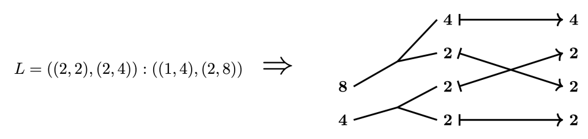

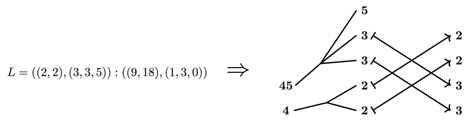

这些图表示 category **Nest** 中的 morphism。

定义：用 **Nest** 表示满足下列条件的 category：

1. object 是由正整数组成的嵌套 tuple $(s_1, \ldots, s_m)_P$；
2. morphism $f:(s_1, \ldots, s_m)_P\to(t_1, \ldots, t_n)_Q$ 由有限带基点集合的映射指定：

$$
\alpha: \{ \ast, 1, \ldots, m \} \to \{ \ast, 1, \ldots, n\}
$$

并满足与前述 tuple morphism 相同的条件：

1. $\alpha(*) = *$；
2. 如果 $\alpha(i) \neq *$ 且 $\alpha(i) = \alpha(i^{\prime})$，则 $i = i^{\prime}$；
3. 如果 $\alpha(i) = j \neq *$，则 $s_i = t_j$。

称这种 morphism f 位于 α 之上，并称 f 为 nested tuple morphism。

定义：如果 f 是 nested tuple morphism，则 f 编码的 layout 为

$$
L_f = (s_1, \ldots, s_m)_P : (d_1, \ldots, d_m)_P
$$

其 shape 是 f 的 domain，各 stride 条目定义为

$$
d_i = \begin{cases} t_1 \cdots t_{j-1} & \text{if } \alpha(i) = j \\ 0 & \text{if } \alpha(i) = *. \end{cases}
$$

可以在嵌套情况下定义 standard form 和 non-degeneracy，并再次得到一个对应定理。

定理：non-degenerate tractable layout 与具有 standard form 的 non-degenerate nested tuple morphism 之间存在一一对应关系。

可以通过 flattening functor 比较 category **Nest** 与 **Tuple**：

$$
(-)^\flat : \mathbf{Nest} \to \mathbf{Tuple}.
$$

特别地，可以在其后复合从 **Tuple** 到 **FinSet** 的 realization functor，从而得到 realization functor

$$
| \cdot | : \textbf{Nest} \to \textbf{FinSet}
$$

它定义在 **Nest** 上，并具有与之前相同的性质。

定理：从 **Nest** 到 **FinSet** 的 realization functor 满足以下性质：

1. 如果 S 是大小为 M 的嵌套 tuple，则 `|S| = [0, M)`。
2. 如果 S 和 T 分别是大小为 M 和 N 的嵌套 tuple，且 $f:S\to T$ 是 tuple morphism，则 realization $|f|:[0,M)\to[0,N)\subset\mathbf{Z}$ 是 $L_f$ 的 layout function。

特别地，该定理可以轻易证明以下结果：

定理：如果 f 和 g 是可复合的 nested tuple morphism，则

$$
L_{g \circ f} = L_g \circ L_f
$$

category **Nest** 支持许多重要 layout 操作的对应物，例如 coalesce、complement、logical division 和 logical product。下面概括这些操作及其与相应 layout 操作的相容性。

定理：

1. 在 nested tuple morphism 上定义 coalesce 操作 $coal(f)$，它与 layout coalesce 相容，即

$$
L_{\mathit{coal}(f)} = \mathit{coal}(L_f).
$$

1. 在 nested tuple morphism 上定义 complement 操作 $f^c$。如果 f 是具有 standard form 的单射 nested tuple morphism，则该操作与 layout complement 相容，即

$$
L_{f^c} = \mathit{comp}(L_f)
$$

1. 定义 nested tuple morphism 的整除概念；当 g 整除 f 时，定义 logical division 操作 $f \oslash g$。该操作与 layout 的 logical division 相容，即

$$
\mathit{coal}(L_{f \oslash g}) = \mathit{coal}(L_f \oslash L_g).
$$

1. 定义 nested tuple morphism 的 product admissibility 概念；当 f 和 g 为 product admissible 时，定义 logical product 操作 $f \otimes g$。该操作与 layout 的 logical product 相容，即

$$
L_{f \otimes g} = L_f \otimes L_g.
$$

## Composition 算法

把理论推广到嵌套情况后，现在可以解释 composition 算法：它使用我们的范畴框架，计算 tractable layout A 和 B 的 composition `B ∘ A`。该算法使用了几种尚未讨论的重要构造，即 mutual refinement、pullback 和 pushforward。下面结合示例解释这些概念；完整细节请参阅论文第 4.1.2 和 4.1.3 节。

假设要计算 layout `A = (6, 6):(1, 6)` 与 `B = (12, 3, 6):(1, 72, 12)` 的 composition。由于 A 和 B 都是 tractable 的，可以用以下 tuple morphism 表示它们：

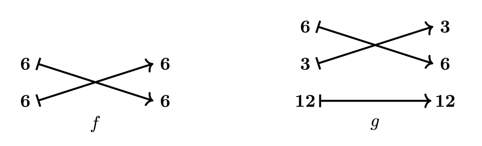

这些 morphism 不可复合，因为 f 的 codomain `(6, 6)` 不等于 g 的 domain `(12, 3, 6)`。这意味着不能直接使用 morphism f 和 g 计算 composite `B ∘ A`。不过，可以寻找 `(6, 6)` 与 `(12, 3, 6)` 的 mutual refinement 来继续计算，如下图所示：

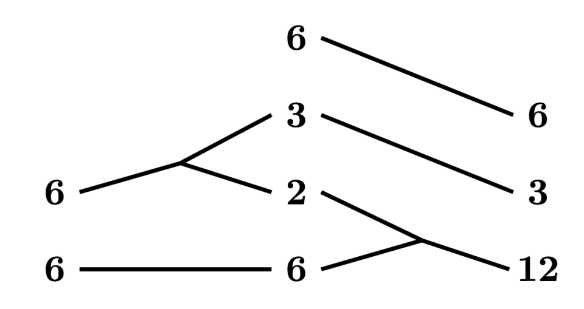

直观来看，这种 mutual refinement 指定了如何以相容方式拆分 f 的 codomain 和 g 的 domain。可以使用 mutual refinement 把 f 和 g 转换成可复合的 morphism f’ 和 g’。对 f，mutual refinement 表明应把第一个 6 分解成 `(2, 3)`，并在 f 的 codomain 中加入一个额外的 6：

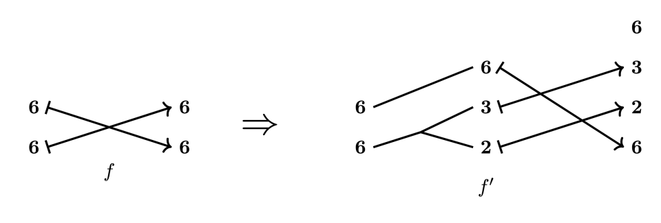

严格来说，从 f 构造 f’ 是 pullback 的一个实例。

对 g，mutual refinement 表明应把 12 分解成 `(6, 2)`：

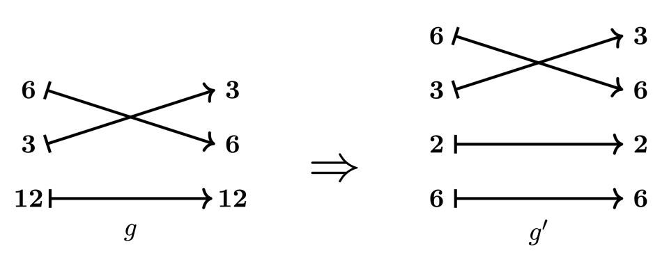

严格来说，从 g 构造 g’ 是 pushforward 的一个实例。

nested tuple morphism f’ 和 g’ 是可复合的，因此可以形成 composite

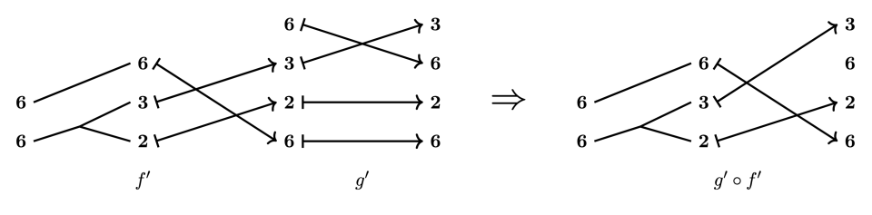

计算其编码的 layout，得到

$$
B \circ A = L_{g^{\prime} \circ f^{\prime}} = ((2, 3), 6) : ((6, 72), 1).
$$

上面逐步展示了 composition 算法的一个实际示例。算法完整而精确的描述请参阅论文第 4.1.3 节，更多示例请参阅第 4.1.4 节。还要强调，由于 logical division 和 logical product 都通过 composition 定义，该算法也可用于计算这些操作。

## 与 operad 理论的联系

正如引言中暗示的，我们建立的 layout 理论与 operad 理论之间存在一些有趣联系。理解或使用本文结果并不需要这些解释，但它们本身具有独立的数学价值，并且曾经指导我们研究这一主题的方法。在最后一节中，我们面向数学家而不是工程实践者，简要讨论其中一些联系。

首先说明 category **Tuple** 如何自然地作为某个 operad 的 [operator category](https://ncatlab.org/nlab/show/category+of+operators) 的子 category 出现。然后引入 profile 的 operad，并提出 nested tuple category 的另一种定义：把 refinement 内置为“反向”morphism。这为 composition 算法中围绕 refinement 的许多操作提供了背景。按照惯例，我们把 operad 与其 operator category 等同起来；例如，交换 operad 就是有限带基点集合的 category。

考虑正整数在整除关系下构成的偏序集 ℤ&gt;0：当且仅当 a 整除 b 时，$a\leq b$。与所有偏序集一样，它关联着一个 category，其 object 是集合中的元素，并且当且仅当 $a\leq b$ 时存在 $a\to b$；沿用记号，也把该 category 记为 ℤ&gt;0。现在，把它视为在乘法运算下的对称 monoidal category，并应用 operadic nerve，得到 operad ℤ&gt;0⊗；它配有一个到有限带基点集合 category 的 structure functor。关于 operadic nerve，可参见《[Higher Algebra](https://www.math.ias.edu/~lurie/papers/HA.pdf)》中的构造 2.1.1.7。对那些在基点之外为单射的映射，有限带基点集合存在 wide subcategory E0⊗；这是编码单个一元操作的 operad。随后，ℤ&gt;0 到 E0⊗ 的 pullback 与去掉条件 2c）的 **Tuple** 定义相同；加入条件 2c）后，就把 **Tuple** 定义为该 pullback 的子 category。

从这个角度看，应如何纳入 profile？profile 本身形成一个单色、对称 operad，其 n 元操作集合由长度为 n 的 profile 组成，并赋予平凡的对称群作用。在 operadic nerve 下，把该 operad 记为 P⊗。通过形成 operad 的 pullback，可以考虑由任意对称 monoidal category C⊗ 中元素标记的 profile；对 ℤ&gt;0⊗，把所得 pullback 记为 P ℤ&gt;0⊗。再考虑深度为 1 的 profile，还可以得到：**Tuple** 是 P ℤ&gt;0⊗ 在 E0⊗ 上的 pullback 的子 category；事实上，它也是 P ℤ&gt;0⊗ 本身的子 category。

此外，由于 P ℤ&gt;0⊗ 同时包含 tuple morphism 和 refinement——因为整数乘法是 monoidal product——它适合作为进行更复杂构造的 ambient category。具体而言，正如 composition 算法中的图所示，很自然地可以把“先分解、后接 tuple morphism”的过程本身直接视为某个 category 中的 morphism。范畴论中有一个标准构造可以做到这一点：在 P ℤ&gt;0⊗ 中形成某种 [span category](https://ncatlab.org/nlab/show/span)。其中，forward morphism 类是 wide subcategory **Tuple** 中的 morphism；backward morphism 类 **Ref** 则由有限带基点集合的以下映射 $\alpha:\{\ast,1,\ldots,m\}\to\{\ast,1,\ldots,n\}$ 上的 [cocartesian edge](https://ncatlab.org/nlab/show/Cartesian+morphism) 组成，并满足：

1. $\alpha$ 是 active 的：如果 $\alpha(i)=\ast$，则 $i=\ast$。
2. $\alpha$ 是满射。
3. $\alpha$ 限制在 $\{1,\ldots,m\}$ 上时是非递减的。

这里使用 cocartesian edge 的目的，是考虑满足 `ab = c` 的映射 $(a,b)\to c$，而不是更一般的 `ab` 整除 `c` 的情况；这样恰好得到 refinement。

注意，为了使 span 构造定义良好，需要验证在 P ℤ&gt;0⊗ 中，可以沿 **Ref** 中的 morphism 对 **Tuple** 中的 morphism 形成 pullback。该性质确实可以证明。

最后，把所得 span category 记为 `Span(Tuple, Ref)`。该 category 中的典型 morphism 如下：

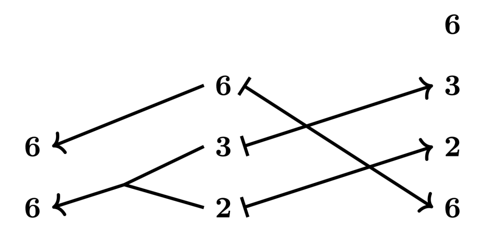

按照 span 图的标准记法，这里把左侧分组画成反向箭头。

根据定义，`Span(Tuple, Ref)` 包含 **Tuple** 和 Refop 作为子 category。随后，可以把从 **Tuple** 到 **FinSet** 的 realization functor 扩展到 `Span(Tuple, Ref)`，使 refinement 被映射到逆 colexicographic isomorphism。从概念上说，这为 nested tuple 的 category 提供了另一种视角：与 **Nest** 不同，category `Span(Tuple, Ref)` 的 object 是 flat tuple，但 morphism 是嵌套的；这与把 layout 视为定义一个取值于其 shape 的深度 1 reduction 上的映射相一致。
