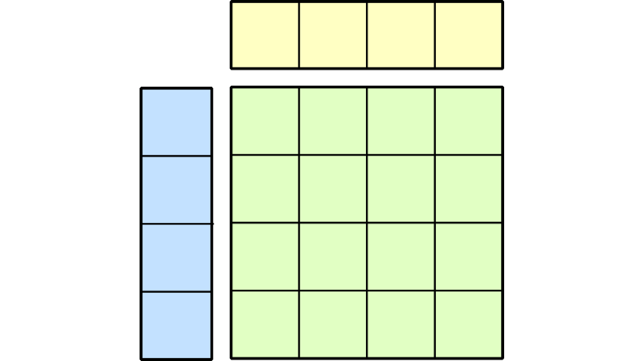

# CUTLASS 3.x：面向 GEMM 内核设计的正交、可复用、可组合抽象



AI 生成的摘要

- CUTLASS 3.x 的重新设计通过一套由可组合、相互正交的构建块组成的分层系统，最大限度覆盖 GEMM 实现空间；它提高了代码可读性，并将支持扩展到 Hopper 和 Blackwell 等后续 NVIDIA 架构。
- CUTLASS 3.x 引入了一个包含五层的概念性 GEMM 层次结构：Atom、Tiled MMA/Copy、Collective、Kernel 和 Device。用户可以借助模板参数构建高度定制的 GEMM 实现。
- Collective 层负责从时间维度组织工作。`CollectiveMma` 和 `CollectiveEpilogue` 等抽象是低层抽象的组合点，可通过分派策略及其他模板参数进行定制。

GPU 上的 GEMM 优化是一个模块化问题。高性能实现需要指定矩阵块形状、数学与拷贝指令、warp 特化方案等超参数。这些超参数在很大程度上彼此独立；而且，根据硬件、问题形状或其他用户需求的不同，最佳选择可能有显著差异。

通过 3.x 的重新设计，CUTLASS 旨在利用一套由可组合、相互正交的构建块组成的分层系统，最大限度覆盖 GEMM 实现空间，同时提高代码可读性，并将支持扩展到 Hopper 和 Blackwell 等后续 NVIDIA 架构。由于这种设计理念与 GPU 的分层硬件设计相呼应，它也可以成为其他 GPU 应用的良好选择——例如，[FlashAttention-3](https://github.com/Dao-AILab/flash-attention/tree/main/hopper) 的设计就采用了人们熟悉的 CUTLASS 抽象。

在 CUTLASS 博客系列的第二篇文章中，我们将探索 CUTLASS 3.x 分层 GEMM 系统背后的设计原则，并解析 CUTLASS 如何利用[第 1 部分](https://developer.nvidia.com/blog/cutlass-principled-abstractions-for-handling-multidimensional-data-through-tensors-and-spatial-microkernels)介绍的低层 CuTe 抽象来构建 GEMM 内核。

## CUTLASS 3.x 中新的概念性 GEMM 层次结构

CUTLASS 3.x 建立了一套独立于具体硬件特性的[概念性 GEMM 层次结构](https://github.com/NVIDIA/cutlass/blob/main/media/docs/gemm_api_3x.md)。它由五层组成：


图 1. 与硬件无关的 CUTLASS GEMM 概念层次结构

- Atom 层：特定于架构的指令及其相关元信息
  - `cute::Mma_Atom<>` and `cute::Copy_Atom<>`
- Tiled MMA/Copy 层：空间微内核，允许对特定于架构的 atom 进行任意交织与分块
  - `cute::TiledMma<>` and `cute::TiledCopy<>`
- Collective 层：时间微内核，使用特定于架构的同步机制来协调一个或多个空间微内核的执行，以计算单个输出矩阵块
  - `cutlass::gemm::collective::CollectiveMma<>` , `cutlass::epilogue::collective::CollectiveEpilogue<>`
- Kernel 层：在 threadblock/cluster 网格上执行内核的设备端代码

```
cutlass::gemm::kernel::GemmUniversal<>
```

- Device 层：主机端设置与接口

```
cutlass::gemm::device::GemmUniversalAdapter<>
```

每一层都作为前一层抽象的组合点，并可通过模板参数进行高度定制。用户可以只使用最高层，相信 CUTLASS 的编译期逻辑会给出高性能 GEMM 实现；也可以选择使用层次结构低层暴露的高级修改能力。Atom 和 Tiled MMA/Copy 层提供的空间微内核属于 CuTe 的范畴，已在第 1 部分中讨论。本文余下内容将介绍高层所提供的 GEMM 时间组织和内核级组织。

下面是一个在 CUTLASS 3.x 中定义 GEMM 内核的基本示例：

```
// 第 1 步：生成所需的 Collective 层 mainloop 特化
using CollectiveMainloop = typename cutlass::gemm::collective::CollectiveBuilder<
    ArchTag, OperatorClass,
    ElementA, LayoutA, AlignmentA,
    ElementB, LayoutB, AlignmentB,
    ElementAccumulator,
    TilesShape, ClusterShape,
    cutlass::gemm::collective::StageCountAuto,
    cutlass::gemm::collective::KernelScheduleAuto
  >::CollectiveOp;
// 第 2 步：指定 Collective 层 epilogue 类型
using CollectiveEpilogue = cutlass::epilogue::collective::DefaultEpilogue<
    cutlass::gemm::TagToStrideC_t<LayoutC>,
    cutlass::gemm::TagToStrideC_t<LayoutC>,
    cutlass::epilogue::thread::LinearCombination<ElementC, 1, ElementAccumulator, ElementAccumulator>>;
// 第 3 步：在 Kernel 层组合 mainloop 与 epilogue
using GemmKernel = cutlass::gemm::kernel::GemmUniversal<
    cute::Shape<int,int,int,int>, // 问题形状 [M,N,K,L]
    CollectiveMainloop,
    CollectiveEpilogue
>;
// 第 4 步：使用 Device 适配器封装 kernel::GemmUniversal 内核类，
// 从而获得该内核的主机端句柄
using GemmHandle = cutlass::gemm::device::GemmUniversalAdapter<GemmKernel>;
```

## Collective 层：Mainloop

collective 是一组相互协作完成工作的线程，并可通过并行重复形成整个内核。通常，它是一个 threadblock 或 cluster。TiledMMA 和 TiledCopy 对象描述并行工作者在空间上如何分配计算和拷贝工作，例如 warp、warpgroup，甚至 Blackwell MMA 中的 threadblock；Collective 层则负责在时间上组织这些工作：建立流水线和 warp 特化方案，并使用硬件加速的同步原语管理流水线及异步操作。
 CUTLASS 3.x [GEMM](https://github.com/NVIDIA/cutlass/blob/b78588d1630aa6643bf021613717bafb705df4ef/include/cutlass/gemm/collective/collective_mma_decl.hpp) 内核包含一个 collective mainloop。它是 GEMM 类模板的实例，定义单个 collective 执行一次 mainloop 迭代所需的基本组成，最重要的是加载和 MMA 过程。collective mainloop 可以定义如下：

```
using CollectiveMainloop = cutlass::gemm::collective::CollectiveMma<
  DispatchPolicy,
  TileShape,
  ElementA, // 数据类型，例如 float
  StrideA,  // 例如 M-major 使用 Stride<_1, int>
  ElementB, StrideB,
  TiledMma,
  GmemTiledCopyA, SmemLayoutAtomA, SmemCopyAtomA, TransformA,
  GmemTiledCopyB, SmemLayoutAtomB, SmemCopyAtomB, TransformB
>;
```

collective mainloop 是低层抽象的组合点：包括一个 TiledMma、分别为每个操作数执行 GMEM 到 SMEM 加载的 TiledCopy，以及供寄存器源 MMA 使用、可选的 SMEM 到 RMEM 加载 copy atom。这些抽象基本相互正交，因此可以组合不同的 MMA 操作与拷贝操作，同时最大限度复用代码。

其中最重要的组成部分可以说是[分派策略](https://github.com/NVIDIA/cutlass/blob/62750a2b75c802660e4894434dc55e839f322277/include/cutlass/gemm/dispatch_policy.hpp#L185)，它定义了面向特定算法或 GPU 架构的 mainloop 特化。例如，分派策略 `MainloopSm90TmaGmmaWarpSpecialized` 将 CollectiveMma 特化为 Hopper TMA warp 特化实现。它本身也是一个模板，可通过流水线阶段数、cluster 形状以及内核调度选项进行参数化；Hopper GEMM 内核的调度选项例如 [pingpong 或 cooperative](https://github.com/NVIDIA/cutlass/blob/main/media/docs/cpp/efficient_gemm.md#hopper-warp-specialization)。

[GEMM collective](https://github.com/NVIDIA/cutlass/tree/main/include/cutlass/gemm/collective) 文件夹中可以找到特化 collective mainloop 实现的示例。

## Collective Builder

CollectiveMma 提供了多种调优旋钮，允许用户通过 TiledCopy 和 TiledMma 对象精确指定 GEMM mainloop，但这种灵活性也带来了复杂性。通常，用户希望根据流水线、硬件能力和资源可用性等更高层因素，推导这些对象及其关联的 SMEM 布局。CUTLASS 也可以通过 CollectiveBuilder 接口完成这种推导。使用 CollectiveBuilder 声明 mainloop 的形式如下：

```
using CollectiveMainloop = typename cutlass::gemm::collective::CollectiveBuilder<
  ArchTag,       // 例如 Hopper 使用 cute::arch::Sm90
  OpClass,       // 例如 Tensor Core 使用 cute::arch::OpClassTensorOp
  ElementA, LayoutA, AlignmentA,
  ElementB, LayoutB, AlignmentB,
  ElementAccumulator,
  TileShape, ClusterShape,
  StageCount,    // 例如 cutlass::gemm::collective::StageCountAuto
  KernelSchedule // 例如 cutlass::gemm::collective::KernelScheduleAuto
>::CollectiveOp;
```

这些模板参数使用对用户友好的条件进行选择，并据此推导 CollectiveMma 模板所需的低层参数：

- 架构特化：GPU 架构和 MMA 操作符类型，例如 SIMT 或 Tensor Core。
- 操作数与累加器信息：操作数和累加器的数据类型，以及操作数在全局内存中的对齐方式和编译期布局信息，例如 row-major 或 column-major。
- 矩阵块形状：用于推导 TiledMma、TiledCopy 对象和 SMEM 布局。
- 调度信息：cluster 形状、流水线阶段数和内核调度都会由调度算法使用。阶段数和内核调度参数提供默认的 Auto 选项，指示 CUTLASS 尝试为给定架构和参数自动选择最佳方案。

## Collective 层：Epilogue

collective epilogue 是 Collective API 的另一半。它负责在每次 mainloop 迭代之后，按时间顺序协调工作矩阵块的后处理和输出存储。与 mainloop 类似，这意味着 collective epilogue 是一个拷贝操作（输出存储）和若干数学操作的组合点；这些数学操作通常是逐元素操作，但也可能包括归约。与 mainloop 不同，这些数学操作本身可以通过 Epilogue Visitor Tree（EVT）形式进行高度组合。这对 AI 工作负载尤其有用，因为它们经常需要在 GEMM 之后立即计算激活函数。CUTLASS 的 collective epilogue 负责把该激活函数融合进内核，从而消除不必要的数据移动。

CUTLASS 在 [GitHub](https://github.com/NVIDIA/cutlass/tree/main/include/cutlass/epilogue/collective) 上定义了多种 epilogue。不同实现的模板参数差异很大，但通常包含以下信息：

- 矩阵 C 和 D 的数据类型与编译期布局信息。
- 指定其他后处理的融合操作。
- 用于 GMEM 存储以及任意 SMEM 暂存的 TiledCopy 操作。
- 与 collective mainloop 类似的分派策略，其中包含 cluster 大小、TMA 使用方式、warp 特化等信息。

[用于 epilogue 的 CollectiveBuilder](https://github.com/NVIDIA/cutlass/blob/62750a2b75c802660e4894434dc55e839f322277/include/cutlass/epilogue/collective/collective_builder.hpp) 提供了一个更加统一的高层接口：

```
using CollectiveEpilogue = typename cutlass::epilogue::collective::CollectiveBuilder<
  ArchTag,
  OpClass,
  TileShape,
  ClusterShape,
  EpilogueTileType,
  ElementAccumulator,
  ElementCompute,
  ElementC, GmemLayoutTagC, AlignmentC,
  ElementD, GmemLayoutTagD, AlignmentD,
  EpilogueScheduleType,
  FusionOpOrCallbacks
>::CollectiveOp;
```

其中许多参数在 mainloop builder 中已经出现，但也有几个新参数：

- epilogue 可以把一个 CTA 矩阵块拆分成更小的矩阵块，以便更好地重叠数学运算和拷贝。
- 作为 mainloop 输出的累加器现在成为 epilogue 的输入。Epilogue 计算可以使用另一种中间数据类型，由 `ElementCompute` 指定。
- CUTLASS 提供了大量[常见融合操作](https://github.com/NVIDIA/cutlass/blob/b84e9802d84b16bcb4e92338fcf0a04785df9236/include/cutlass/epilogue/fusion/operations.hpp)，例如 `D = activation(alpha * AB + beta * C)`。用户也可以使用 [Epilogue Visitor Tree](https://github.com/NVIDIA/cutlass/blob/b78588d1630aa6643bf021613717bafb705df4ef/include/cutlass/epilogue/fusion/sm90_callbacks_tma_warpspecialized.hpp) 构建定制融合操作。有关 Epilogue Visitor Tree 的更多信息，请参阅[这篇 Colfax 教程](https://research.colfax-intl.com/epilogue_visitor_tree/)。
- [Epilogue 调度类型](https://github.com/NVIDIA/cutlass/blob/62750a2b75c802660e4894434dc55e839f322277/include/cutlass/epilogue/dispatch_policy.hpp)定义 TMA 和 warp 特化的使用方式。默认的 `EpilogueScheduleAuto` 指示 CUTLASS 尝试推导最佳选项。

如需查看两种 Collective Builder 的实际用法，可参考 Hopper 的 [CUTLASS 示例 49](https://github.com/NVIDIA/cutlass/blob/389e493055f981bfdc6d4348f823191ca7b9fddd/examples/49_hopper_gemm_with_collective_builder/49_collective_builder.cu) 和 Blackwell 的[示例 71](https://github.com/NVIDIA/cutlass/blob/62750a2b75c802660e4894434dc55e839f322277/examples/71_blackwell_gemm_with_collective_builder/71_blackwell_gemm_with_collective_builder.cu)。

## Kernel 层

Collective 层完整定义了内核执行期间一个 collective 所完成的计算。Kernel 层的职责，则是把 collective 扩展到覆盖整个动态大小问题空间的 threadblock 或 cluster 网格上。Kernel 层通过衔接 mainloop 与 epilogue 的加载、存储、MMA 等基本过程，将 collective mainloop 和 collective epilogue 组装成设备内核。

Kernel 层的入口 API 是 [`cutlass::gemm::kernel::GemmUniversal`](https://github.com/NVIDIA/cutlass/blob/main/include/cutlass/gemm/kernel/gemm_universal_decl.h) 类。它是一个无状态的通用设备内核，通过组合 collective mainloop 和 collective epilogue 来实现 GEMM。“无状态”意味着调用方通过传入参数管理内核状态。“通用”意味着 `GemmUniversal` 同时是 2.x 和 3.x GEMM 内核的入口。对 3.x API，`GemmUniversal` 的基本用法如下：

```
using GemmKernel = cutlass::gemm::kernel::GemmUniversal<
    ProblemShape, // 例如完全通用的 GEMM 使用 Shape<int, int, int>
    CollectiveMainloop,
    CollectiveEpilogue
>;
```

与 `TiledMma` 和 `TiledCopy` 一样，`CollectiveMainloop` 和 `CollectiveEpilogue` 是通过 `GemmUniversal` 组合起来的正交抽象。第一个模板参数是问题形状，主要用于在普通 GEMM（秩为 3 的问题形状）与批处理 GEMM（秩为 4 的问题形状）之间进行选择；必要时，它也可以静态约束部分问题维度。

`GemmUniversal` 的实例化位于形如 `cutlass/gemm/kernel/sm*_gemm_*.hpp` 的文件中；`GemmUniversal` 主要根据 collective mainloop 的 `KernelSchedule` 参数进行分派。所有实例化都提供一致的接口：

- 向内核传递参数的接口，包括问题形状、硬件信息、张量指针与布局，以及 epilogue 参数。
- 静态初始化函数，用于获得 grid 和 block 维度、检查该内核能否在相应硬件上实现，并为 epilogue 或矩阵块调度器所需的归约操作或全局屏障设置全局内存工作区。
- 最重要的是，它们以 `operator()` 实现内核逻辑。这是一个设备函数——尽管 Kernel 层包含内核执行的全部逻辑，但它尚未公开从主机端启动内核的方式。

例如，Blackwell 的 TMA warp 特化内核定义在[这里](https://github.com/NVIDIA/cutlass/blob/62750a2b75c802660e4894434dc55e839f322277/include/cutlass/gemm/kernel/sm100_gemm_tma_warpspecialized.hpp)。

## 矩阵块调度

Kernel 层也是指定矩阵块调度器的组合点。正如内核调度定义一个 collective 内部工作的时间组织方式，矩阵块调度器定义工作在不同 collective 之间的顺序和分布。最基本的矩阵块调度器为每个输出矩阵块分配一个 CTA。CUTLASS 3.x 还为 Hopper 实现了两种调度器：一种是持久化调度器，它为每个 SM 启动一个 CTA，并让每个 CTA 在其生命周期内（可能）计算多个输出矩阵块；另一种是 Stream-K 调度器，它同样是持久化调度器，但还会沿 K 模式拆分部分输出矩阵块的工作，以获得更好的负载均衡。在 Blackwell 架构上，则改用带有 [Cluster Launch Control](https://github.com/NVIDIA/cutlass/blob/main/media/docs/blackwell_cluster_launch_control.md) 的调度器。有关矩阵块调度的深入信息，请参阅[这篇 Colfax 教程](https://research.colfax-intl.com/cutlass-tutorial-persistent-kernels-and-stream-k/)。

可以按如下方式扩展上面的内核，使其使用 Stream-K 矩阵块调度器：

```
using GemmKernel = cutlass::gemm::kernel::GemmUniversal<
    cute::Shape<int,int,int,int>,
    CollectiveMainloop,
    CollectiveEpilogue,
    cutlass::gemm::StreamKScheduler
>;
```

[CUTLASS 示例 74](https://github.com/NVIDIA/cutlass/blob/main/examples/74_blackwell_gemm_streamk/blackwell_gemm_streamk.cu) 更详细地展示了 Stream-K 调度器的用法。

## Device 层

内核启动的主机端逻辑在 Device 层实现，包括支持 cluster 的启动，以及在不同设备或 CUDA stream 上启动。Device 层的主要入口是 `cutlass::gemm::device::GemmUniversalAdapter`，它把 `GemmUniversal` 内核封装为一个有状态、可复用的句柄。“有状态”意味着句柄实例包含内核运行所需的状态，也就是由它自行管理内核参数。“可复用”意味着同一个句柄实例可以使用不同参数多次调用该内核。

`GemmUniversalAdapter` 的实现在 [GitHub 上](https://github.com/NVIDIA/cutlass/blob/main/include/cutlass/gemm/device/gemm_universal_adapter.h)。下面的示例展示如何使用 `GemmUniversalAdapter` 启动内核：

```
using GemmHandle = cutlass::gemm::kernel::GemmUniversalAdapter<GemmKernel>;
using Arguments = typename GemmHandle::Arguments;    // 由 GemmKernel 公开
Arguments args {
    cutlass::Gemm::kBatched,                   // 模式（这里是批处理 GEMM）
    cute::make_shape(M, N, K, L),              // 问题形状
    {A, stride_A, B, stride_B},                // mainloop 参数
    {{alpha, beta}, C, stride_C, D, stride_D}, // epilogue 参数
    make_kernel_hardware_info(device_id),      // 硬件信息
    {}                                         // 调度器参数（这里使用默认值）
};
GemmHandle gemm;
// 检查该问题能否以给定形状在相应硬件上运行
cutlass::Status status;
status = GemmHandle::can_implement(args);
if (status != cutlass::Status::kSuccess) {
  std::cerr << "Problem not supported\n";
  exit(EXIT_FAILURE);
}
// 设置全局内存工作区
size_t workspace_size = GemmHandle::get_workspace_size(args);
cutlass::device_memory::allocation<uint8_t> workspace(workspace_size);
// 根据参数初始化 GEMM 句柄状态
status = gemm.initialize(args, workspace.get());
if (status != cutlass::Status::kSuccess) {
  std::cerr << "Failed to initialize GEMM kernel\n";
  exit(EXIT_FAILURE);
}
// 启动内核
status = gemm.run();  // 可以在这里提供 CUDA stream 和 CUDA host adaptor
if (status != cutlass::Status::kSuccess) {
  std::cerr << "Failed to launch GEMM kernel\n";
  exit(EXIT_FAILURE);
}
```

## 总结

本文讨论了 CUTLASS 库在概念上如何组织为一个层次结构，其中每一层的对象都由低层相互正交的对象组合而成。这种设计以很高的代码复用程度，支持种类繁多且可深度定制的 GEMM 实现。在本系列下一篇也是最后一篇文章中，我们将考察 CUTLASS 4.0 引入的变化，尤其是 CuTe Python DSL。

如需了解更多信息，可以从 [GitHub](https://github.com/NVIDIA/cutlass) 下载软件、阅读[文档](https://docs.nvidia.com/cutlass/index.html)，或加入[开发者论坛](https://forums.developer.nvidia.com/c/accelerated-computing/cuda/cuda-programming-and-performance/7)参与深入讨论。

致谢

感谢整个 [CUTLASS 扩展团队](https://github.com/NVIDIA/cutlass/blob/main/CONTRIBUTORS.md)的共同努力，正是这些工作使本文成为可能。
