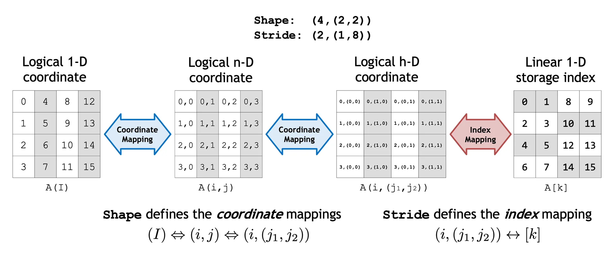
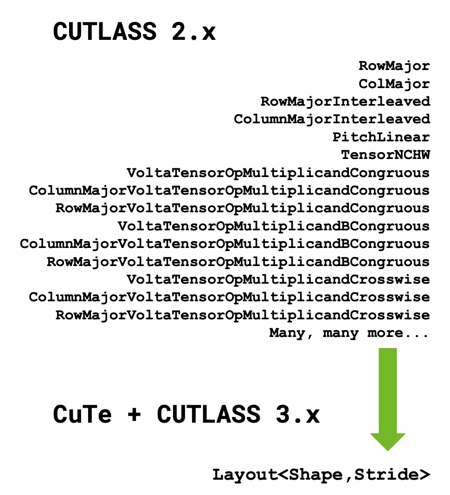
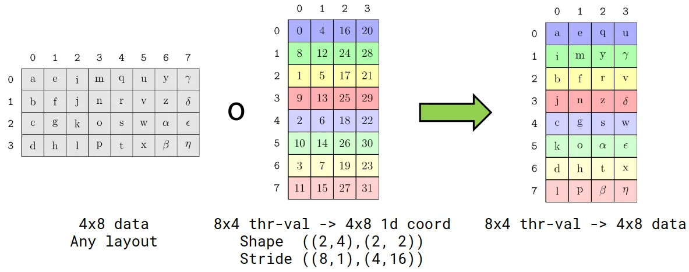
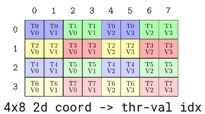
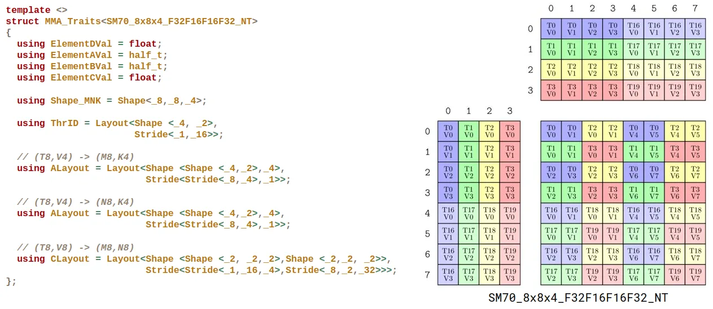
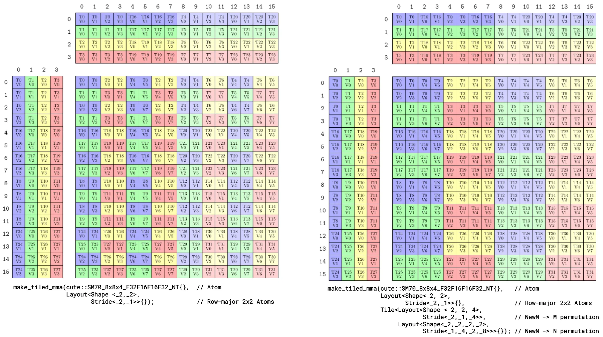

# CUTLASS：通过张量和空间微内核处理多维数据的原则性抽象

> 原文：[NVIDIA Technical Blog](https://developer.nvidia.com/blog/cutlass-principled-abstractions-for-handling-multidimensional-data-through-tensors-and-spatial-microkernels/)  
> 作者：Cris Cecka、Vijay Thakkar、Tejash Shah  
> 发布日期：2025 年 7 月 16 日


## AI 生成摘要

- CUTLASS 3.x 引入了 CuTe。这个库使用分层的布局表示来描述线程张量和数据张量，从而简化线程与数据的组织方式，并帮助开发者编写高性能 CUDA 代码。
- CuTe 的布局代数允许用户从简单的已知布局构造复杂布局，或者用一个布局划分另一个布局，无需手工实现复杂的划分后迭代方案；它还支持 NVIDIA Hopper H100 上的 WGMMA 和 NVIDIA Blackwell B200 上的 UMMA 等特性。
- CuTe 为现代 NVIDIA GPU 上的稠密线性代数提供统一接口，抽象张量布局和线程映射等底层细节，并被 CUTLASS 3.x 用于简化编程模型和提高 GPU 性能。

*AI 生成内容可能并不完整，请核实重要信息。*

在生成式 AI 时代，充分发挥 GPU 的性能对训练更好的模型以及大规模服务用户至关重要。这些模型中的某些层常常因为细微改动而无法表示成现成的库操作；深度学习编译器为了保证部署可行性，通常也会放弃最后几个百分点的优化空间。

为了向 NVIDIA CUDA 开发者提供最大化深度学习与 HPC 内核性能所需的能力和控制力，我们从 2017 年起持续开发和迭代 CUTLASS。

CUTLASS 目前正凭借新的 Python 接口进入下一阶段。CUTLASS 4.0 将 CUTLASS 3.x 重构所引入的基础抽象直接暴露给 Python。本文讨论 CUTLASS 3.x、其核心后端库 CUDA Tensors and Spatial Microkernels（CuTe）背后的设计原则，以及利用 CuTe 关键特性的优化示例。

## CUTLASS 3.x 的亮点

CUTLASS 3 引入了 CuTe。这个新库以布局概念为基础，把布局作为描述和操作线程与数据的统一、可组合抽象。将布局提升为编程模型中的一等公民后，CuTe 大幅简化了线程与数据的组织方式。CuTe 以易于理解且可静态检查的形式向开发者呈现索引逻辑，同时保持与 CUTLASS 2.x 相同的高性能和 Tensor Core 操作覆盖率。

除了这种更有意义的布局处理方法，CUTLASS 3 与之前所有 CUTLASS 版本的目标相同：围绕最新硬件特性构建直观的编程模型，帮助 CUDA 开发者编写高性能 GPU 线性代数内核。在这次重大迭代中，我们重点强调以下能力：

- 在库设计的任意层进行定制，同时保持与其他层的可组合性，从而提高开发效率，并更清晰地分离各个活动部分。
- 在编译期检查内核构造的正确性。这保证了代码只要能够通过编译，就能正确运行；否则会得到可操作的 `static_assert` 信息。
- 通过减少命名类型、提供同时也是定制入口的统一入口点，缩小 API 表面积并降低学习曲线。
- 在 NVIDIA Hopper H100 和 NVIDIA Blackwell B200 上提供出色性能，支持 WGMMA（Hopper）、UMMA（Blackwell）、[Hopper Tensor Memory Accelerator（TMA）](https://docs.nvidia.com/cuda/hopper-tuning-guide/index.html)以及 threadblock cluster 等特性。

# CuTe

CUTLASS 3.x 的核心是 [CuTe](https://github.com/NVIDIA/cutlass/tree/main/media/docs/cpp/cute)。这是一个用于描述和操作线程张量与数据张量的新库。CuTe 由两部分组成：强大的布局表示，以及作用于这些布局的操作代数。

CuTe 的布局表示天然具有层次结构，原生支持静态和动态信息，并用于表示多维张量。同一种布局表示既可以描述数据张量，也可以描述线程张量。在多个彼此独立的资源上使用同一种词汇类型，体现了 CuTe Layout 概念的广泛适用性。

基于这种表示能力，CuTe 提供了一套形式化的布局代数。用户可以从简单的已知布局构造复杂布局，也可以用一个布局划分另一个布局。这样，程序员可以专注于算法的逻辑描述，而由 CuTe 完成机械性的记账工作。借助这些工具，用户可以快速设计、实现和修改稠密线性代数算法。

与以往任何 GPU 编程模型不同，线程张量与数据张量的函数复合消除了 GPU 编程中最复杂的障碍之一：如何把大量线程一致地映射到它们操作的数据。只要线程布局与其所操作的数据布局彼此独立地描述，CuTe 的布局代数就可以把数据划分给线程，无需手工实现复杂的划分后迭代方案。

## CuTe 布局与张量

关于布局和张量的更多 CuTe 文档，可以在其[专用文档目录](https://github.com/NVIDIA/cutlass/blob/main/media/docs/cpp/cute/00_quickstart.md)中找到。

CuTe 提供 `Layout` 和 `Tensor` 对象，以紧凑方式封装数据的类型、shape、存储空间与布局，并替用户完成复杂的索引计算。

- `Layout<Shape,Stride>` 提供从 `Shape` 中的逻辑坐标到使用 `Stride` 计算所得索引的映射。图 1 展示了一个示例。
  - `Shape` 定义一个或多个坐标空间以及这些空间之间的映射。
  - `Stride` 定义把坐标转换为索引的索引映射。
- `Tensor<Engine,Layout>` 表示 `Layout` 与迭代器的复合。该迭代器可以是指向全局内存、共享内存或寄存器内存中数据的指针，也可以是任何支持随机偏移访问和解引用的对象。



图 1：可以通过 `Shape` 和 `Stride` 函数操作并生成索引的多种矩阵类型

值得强调的是，CuTe 中的布局具有层次结构，其灵感来自张量代数中张量操作的折叠。如图所示，层次化的 Shape 和 Stride 可以表示远超简单 row-major 和 column-major 的布局。与此同时，访问层次化布局仍然与访问普通张量相同，例如图中的二维逻辑坐标。因此，在算法开发时可以把这些高级数据布局隐藏在抽象之下。

## CUTLASS 3.x 中的 CuTe

CUTLASS 3.x 使用单一词汇类型 `cute::Layout`，由此获得简化、形式化且统一的布局表示，帮助用户轻松编写速度极快的内核。



图 2：CUTLASS 函数如何简化为单一词汇类型调用

## 使用 CuTe 布局进行变换和划分

CuTe Layout 把函数复合作为核心操作。函数复合可以变换另一个布局的 shape 和顺序。假设数据布局使用坐标 `(m,n)`，而我们希望改用坐标 `(thread_idx,value_idx)`，那么可以把数据布局与描述下列映射的布局进行复合：`(thread_idx,value_idx) -> (m,n)`。

结果是一个坐标为 `(thread_idx,value_idx)` 的数据布局，利用它可以轻松访问每个线程的每个值。

例如，考虑一个 4×8 数据布局。假设我们希望把线程和值分配给这个 4×8 数据中的每个坐标。我们先编写记录特定划分模式的“TV layout”，再对数据布局和 TV layout 执行函数复合。



图 3：为 4×8 数据布局分配线程和值二元组，以协调对原始数据的访问；这种布局称为“TV layout”

如图所示，复合操作对数据进行置换和 reshape，使每个线程的值排列在结果的同一行。最后用线程索引对结果执行切片，即可完成划分。

TV layout 的逆提供了更直观的划分模式视图。



图 4：另一个 4×8 矩阵，表示原始数据如何映射；它是 TV layout 的逆

这个布局展示了从 4×8 数据布局中的每个坐标到线程和值的映射。任意划分模式都可以被记录下来，并应用到任意数据布局。

GitHub 上提供了更多 [CuTe 布局代数](https://github.com/NVIDIA/cutlass/blob/main/media/docs/cpp/cute/02_layout_algebra.md)文档。

## CuTe 矩阵乘加 atom

atom 是为了执行硬件加速数学操作或拷贝操作而必须协同参与的最小线程和数据集合。

Atom 把一条 PTX 指令与相关元数据结合起来；这些元数据描述参与该指令的线程和值的 shape 与排列方式。元数据表示为 CuTe TV layout，随后可用于划分任意输入和输出数据张量。通常，用户不需要扩展这一层，因为我们会为新架构提供 CuTe atom 实现。



图 5：`SM70_8x8x4_F32F16F16F32_NT` 指令及其关联的 `MMA_Traits` 元数据

上图展示了 `SM70_8x8x4_F32F16F16F32_NT` 指令及其关联的 `MMA_Traits` 元数据。左侧把 TV layout 中的 `(thread_id,value_id) -> coord` 映射记录在 traits 中；右侧则使用逆映射 `coord -> (thread_id,value_id)` 将 traits 可视化。右图可以通过以下代码生成：

```cpp
print_latex(make_tiled_mma(cute::SM70_8x8x4_F32F16F16F32_NT{}))
```

GitHub 上还有更多关于[矩阵乘加（MMA）atom](https://github.com/NVIDIA/cutlass/blob/main/media/docs/cpp/cute/0t_mma_atom.md)的 CuTe 文档。

## CuTe tiled MMA

Tiled MMA 和 tiled copy 分别是 MMA atom 与 copy atom 的平铺。我们把这一层称为“tiled”，是因为它在 atom 之上构建更大的操作，就像把独立图块拼接成可复用的马赛克组件。平铺操作会在线程和数据上复制 atom，并且可以对这些 atom 进行置换和交织。

这一层与 CUTLASS 2.x 中 MMA 指令的 warp 级平铺最相似；不过，它从参与操作的全部线程的视角观察平铺，并把这一概念推广到拷贝操作。该层的目的是使用大量硬件加速数学操作和数据移动操作构建可组合的 GPU 微内核，而每种操作都可能具有自身固有的线程和数据布局。Tiled MMA 与 Tiled Copy 类型为这些不同的硬件加速 CuTe atom 提供了统一、一致的数据划分 API。

例如，CuTe 可以提供一个由单个 warp 调用、M/N/K 维度固定的 MMA atom。然后可以使用 CuTe 操作 `make_tiled_mma`，把这个 atom 转换成作用于整个 threadblock、M/N/K 维度更大的操作。上一节已经展示了一个 Tiled MMA 示例，即 `SM70_8x8x4_F32F16F16F32_NT` 的 1×1×1 平铺。



图 6：使用同一个 `SM70_8x8x4_F32F16F16F32_NT` atom 的另外两个 tiled MMA

上图展示使用同一个 `SM70_8x8x4_F32F16F16F32_NT` atom 的另外两个 tiled MMA。左侧把四个 atom 按 2×2 row-major 布局组合，生成单 warp 的 16×16×4 MMA。右侧同样先把四个 atom 组织成 2×2 row-major 布局，生成单 warp 的 16×16×4 MMA，再对行（M）和列（N）进行置换，使 atom 相互交织。两者都会生成可应用到任意数据布局的划分模式，下一节将展示这一点。

## CuTe GEMM 与 mainloop

借助与架构无关的 tiled API，用户可以为 GEMM 外层循环构建一致接口，而内层循环则来自 atom 层。

```cpp
Tensor gA = . . . // A 的 64x16 gmem tile
Tensor gB = . . . // B 的 96x16 gmem tile
Tensor gC = . . . // C 的 64x96 gmem tile

// A 的 64x16 静态布局、带填充的 row-major smem
Tensor sA = make_tensor(make_smem_ptr<TA>(smemAptr),
                        Layout<Shape <    _64,_16>,
                               Stride<Int<17>, _1>>{});
// B 的 96x16 静态布局、交织的 column-major smem
Tensor sB = make_tensor(make_smem_ptr<TB>(smemBptr),
                        Layout<Shape <Shape <_32,  _3>,_16>,
                               Stride<Stride< _1,_512>,_32>>{});

// 根据 TiledMMA 在线程之间划分张量
ThrMMA thr_mma = tiled_mma.get_slice(thread_idx);
Tensor tCsA = thr_mma.partition_A(sA);        // (MMA, MMA_M, MMA_K) smem
Tensor tCsB = thr_mma.partition_B(sB);        // (MMA, MMA_N, MMA_K) smem
Tensor tCgC = thr_mma.partition_C(gC);        // (MMA, MMA_M, MMA_N) gmem

// 创建与上述张量具有相同 shape/layout 的寄存器张量
Tensor tCrA = thr_mma.make_fragment_A(tCsA);  // (MMA, MMA_M, MMA_K) rmem
Tensor tCrB = thr_mma.make_fragment_B(tCsB);  // (MMA, MMA_N, MMA_K) rmem
Tensor tCrC = thr_mma.make_fragment_C(tCgC);  // (MMA, MMA_M, MMA_N) rmem

// 把线程级分区从 smem 拷贝到 rmem
cute::copy(tCsA, tCrA);
cute::copy(tCsB, tCrB);
// 清零 rmem 线程级分区（累加器）
cute::clear(tCrC);

// 在 rmem 上执行 GEMM：(V,M,K) x (V,N,K) => (V,M,N)
cute::gemm(tiled_mma, tCrA, tCrB, tCrC);
// 等价于
// for(int k = 0; k < size<2>(tCrA); ++k)
//   for(int m = 0; m < size<1>(tCrC); ++m)
//     for(int n = 0; n < size<2>(tCrC); ++n)
//       tiled_mma.call(tCrA(_,m,k), tCrB(_,n,k), tCrC(_,m,n));

// 从 rmem 线程级分区执行 AXPBY，并写入 gmem
cute::axpby(alpha, tCrC, beta, tCgC);
// 等价于
// for(int i = 0; i < size(tCrC); ++i)
//   tCgC(i) = alpha * tCrC(i) + beta * tCgC(i)
```

对于上述代码中计算指令与拷贝指令在时间上的交织方式，现在有很多决策需要做：

- 只为 `A: (MMA,MMA_M)`、`B: (MMA,MMA_N)` 和 `C: (MMA,MMA_M,MMA_N)` Tensor 分配 rmem，并在每次 k-block 迭代中向其中拷贝数据。
- 处理 gmem 中的多个 k-tile，并在每次 k-tile 迭代中把它们拷贝到 smem。
- 以异步方式让上述拷贝阶段与计算阶段重叠。
- 寻找更好的 smem 布局，改善 smem -> rmem 拷贝的访问模式。
- 为 gmem -> smem 拷贝寻找高效的 TiledCopy 划分模式。

这些问题属于“时间微内核”，而不是 CuTe 所提供的“空间微内核”。一般来说，围绕 CuTe Tensor 进行流水化和指令执行的决策留给 CUTLASS 层，并将在本系列下一篇文章中讨论。


## Blackwell tcgen05 GEMM 中的 CuTe 数据流：view、TMA、descriptor 与 TMEM

我们继续说明 Blackwell CuTe GEMM 中矩阵 A 的数据流，以及 `mA`、`gA`、`tCgA`、`tAgA`、`tAsA`、`sA`、`tCrA` 等对象之间的关系。这些对象分别承担存储、坐标 view 和硬件访问 descriptor 等职责，并不对应同等数量的矩阵副本。

分析以 `A[133,70]` 为贯穿示例，依次说明它在 GMEM view、SMEM storage、MMA descriptor、TMEM accumulator 和 epilogue 中的坐标与存储变化。

上文已经介绍了 `Layout`、`Tensor`、MMA Atom 和 `TiledMma` 的基本定义。

代码结构以 NVIDIA CUTLASS 的 C++ CuTe 示例 [`02_mma_tma_sm100.cu`](https://github.com/NVIDIA/cutlass/blob/main/examples/cute/tutorial/blackwell/02_mma_tma_sm100.cu) 为参照。


总览图中的对象分为三类：

- `mA`、`sA`、`tCtAcc`、`tDrAcc` 是保存矩阵数值的存储对象。
- `gA`、`tCgA`、`tAgA`、`tAsA` 是 view：它们改变坐标的解释方式，但不自动复制矩阵。
- `tCrA` 是 descriptor：它编码 MMA 访问 SMEM 中 A 数据所需的地址和布局信息，不保存 A 的数值。

以下按六个数据流阶段展开。

## 第一步：`local_tile` 构造 CTA-local view

本文使用一个具体的 F16/BF16 GEMM：完整问题为 `(M,N,K)=(512,768,384)`，每个 CTA 处理 `(BM,BN,BK)=(128,256,64)`，一条 tcgen05 MMA 的 shape 为 `(128,256,16)`。

`mA` 是完整的 A 矩阵，shape 为 `(512,384)`。对 row-major A 来说，`mA(m,k)` 表示全局坐标 `(m,k)` 的元素。

在 C++ CuTe kernel 中，`local_tile` 根据 MMA tile 坐标，从完整矩阵中选出当前 MMA tile 对应的区域：

```cpp
auto mma_coord = make_coord(m_tile, n_tile, _);
Tensor gA = local_tile(
    mA,
    mma_tiler,
    mma_coord,
    Step<_1, X, _1>{}
);  // (MmaTile_M, MmaTile_K, Tiles_K)
```

示例元素 `A[133,70]` 位于 M 方向的第 2 个 tile、K 方向的第 2 个 tile：

```text
m_tile = floor(133 / 128) = 1
q      = floor(70 / 64)   = 1

local_m = 133 - 1×128 = 5
local_k = 70  - 1×64  = 6
```

因此：

```text
mA(133,70) = gA(5,6,q=1)
```

<!-- BEGIN GENERATED DIAGRAM: step1 -->

<!-- END GENERATED DIAGRAM: step1 -->

`gA` 不对应新的显存分配。它仍然引用 `mA(133,70)` 的原始 GMEM 地址，并把全局坐标改写为“tile 内坐标 + 外层 K tile 编号”。

## 第二步：`partition_A` 构造 MMA 坐标层次

一条 tcgen05 MMA 处理的基本形状是：

```text
A(128×16) × Bᵀ(16×256) → D(128×256)
```

A 和 B 共享同一个 K=16 收缩维。CuTe 用 MMA Atom 表示这一条硬件操作，再用 `TiledMma` 描述它如何覆盖当前 CTA tile。

```cpp
TiledMMA tiled_mma = make_tiled_mma(
    SM100_MMA_F16BF16_SS<
        TypeA, TypeB, TypeC,
        128, 256,
        UMMA::Major::K, UMMA::Major::K
    >{}
);

auto bM = tile_size<0>(tiled_mma);
auto bN = tile_size<1>(tiled_mma);
auto bK = tile_size<2>(tiled_mma) * Int<4>{};
auto mma_tiler = make_shape(bM, bN, bK);  // (128,256,64)
```

当前 A tile 的 K 长度为 `BK=64`，一条 MMA 每次消费 `inst_K=16`，因此一个 A tile 包含四次 MMA K 迭代：

```text
MMA_K = 0 → local_k  0..15
MMA_K = 1 → local_k 16..31
MMA_K = 2 → local_k 32..47
MMA_K = 3 → local_k 48..63
```

`partition_A` 按该 MMA 层次重新解释 `gA`：

```cpp
ThrMMA cta_mma = tiled_mma.get_slice(_0{});
Tensor tCgA = cta_mma.partition_A(gA);
```

对 `A[133,70]`，tile 内 K 坐标为 6，因此：

```text
MMA_K  = floor(6 / 16) = 0
inner_k = 6 mod 16     = 6
```

<!-- BEGIN GENERATED DIAGRAM: step2 -->

<!-- END GENERATED DIAGRAM: step2 -->

`tCgA` 仍然引用原来的 GMEM 数据。`partition_A` 建立按 `MMA_K` 遍历 A tile 的坐标层次，不读取或复制 A 的数值。

## 第三步：`tma_partition` 与 TMA copy 将 A 搬到 SMEM

tcgen05 的 SS 路径要求 A 和 B 位于 SMEM，因此需要把当前 A tile 从 GMEM 搬到 shared storage 中的 `sA`。C++ CuTe 代码通过 `tCsA` Tensor 表示这块 SMEM allocation 及其 layout：

```cpp
Tensor tCsA = shared_storage.tensor_sA();
Tensor tCsB = shared_storage.tensor_sB();
```

`tma_partition` 建立两个 view：

- `tAgA` 描述 TMA 从 GMEM 的哪里读取；
- `tAsA` 描述 TMA 向 SMEM 的哪里写入。

```cpp
auto [tAgA, tAsA] = tma_partition(
    tma_atom_A,
    Int<0>{},
    Layout<_1>{},
    group_modes<0,3>(tCsA),
    group_modes<0,3>(tCgA)
);
```

`tma_partition` 仅建立 source view 和 destination view。数据搬运由以下调用执行：

```cpp
copy(
    tma_atom_A.with(shared_storage.tma_barrier),
    tAgA(_, k_tile),
    tAsA
);
```

对 `A[133,70]`，该 copy 的坐标关系为：

```text
GMEM: tAgA(ξ(5,6), q=1)
             │
             │ TMA copy
             ▼
SMEM: tAsA(ξ(5,6))
             │
             ▼
          tCsA(5,6)
```

<!-- BEGIN GENERATED DIAGRAM: step3 -->

<!-- END GENERATED DIAGRAM: step3 -->

该调用将 `A[133,70]` 从 GMEM 写入 `tCsA(5,6)` 所引用的 `sA` shared storage。`tAgA` 和 `tAsA` 分别提供 TMA 的读取 view 和写入 view。

MMA 读取 `tCsA` 和 `tCsB` 前，必须等待 TMA 完成 A/B 写入。

## 第四步：`make_fragment_A` 构造 MMA descriptor

tcgen05 MMA 通过 descriptor 访问 SMEM。descriptor 编码 SMEM 地址、stride、swizzle 等布局信息。

CuTe 根据 `sA` 的地址和 layout 构造 `tCrA`：

```cpp
Tensor tCrA = cta_mma.make_fragment_A(tCsA);
Tensor tCrB = cta_mma.make_fragment_B(tCsB);
```

`tCsA` 引用 shared storage 中的 A 数值；`tCrA` 保存 MMA 访问这些数值所需的 descriptor。

<!-- BEGIN GENERATED DIAGRAM: step4 -->

<!-- END GENERATED DIAGRAM: step4 -->

图中选中的 `DESC(MMA_K=0)` 描述 `A[133,70]` 所在的 SMEM 区域。descriptor 本身不保存 `A[133,70]` 的 FP16/BF16 数值。

`make_fragment_A` 只根据 allocation 和 layout 构造 descriptor，因此可以在主循环之前执行。当该 descriptor 被用于发射 MMA 时，`tCsA` 必须已经由 TMA 写入完成。

## 第五步：`cute::gemm` 更新 TMEM accumulator

`cute::gemm` 通过 `tCrA` 和 `tCrB` 访问 SMEM 中的 A/B tile，并把结果累加到 TMEM 中的 `tCtAcc`。`make_fragment_C` 先生成 accumulator layout，随后将其绑定到已分配的 TMEM 地址：

```cpp
Tensor tCtAcc = cta_mma.make_fragment_C(tCgC);

uint32_t elect_one_thr  = cute::elect_one_sync();
uint32_t elect_one_warp = (threadIdx.x / 32 == 0);

using TmemAllocator = cute::TMEM::Allocator1Sm;
TmemAllocator tmem_allocator{};

if (elect_one_warp) {
  tmem_allocator.allocate(
      TmemAllocator::Sm100TmemCapacityColumns,
      &shared_storage.tmem_base_ptr
  );
}
__syncthreads();
tCtAcc.data() = shared_storage.tmem_base_ptr;
```

主循环对每个 K tile 更新同一个 accumulator：

```cpp
tiled_mma.accumulate_ = UMMA::ScaleOut::Zero;
int tma_transaction_bytes = sizeof(make_tensor_like(tAsA))
                          + sizeof(make_tensor_like(tBsB));

for (int k_tile = 0; k_tile < size<3>(tCgA); ++k_tile) {
  if (elect_one_warp && elect_one_thr) {
    cute::set_barrier_transaction_bytes(
        shared_storage.tma_barrier,
        tma_transaction_bytes
    );
    copy(
        tma_atom_A.with(shared_storage.tma_barrier),
        tAgA(_, k_tile),
        tAsA
    );
    copy(
        tma_atom_B.with(shared_storage.tma_barrier),
        tBgB(_, k_tile),
        tBsB
    );
  }

  cute::wait_barrier(shared_storage.tma_barrier, tma_barrier_phase_bit);
  tma_barrier_phase_bit ^= 1;

  if (elect_one_warp) {
    for (int k_block = 0; k_block < size<2>(tCrA); ++k_block) {
      gemm(
          tiled_mma,
          tCrA(_, _, k_block),
          tCrB(_, _, k_block),
          tCtAcc
      );
      tiled_mma.accumulate_ = UMMA::ScaleOut::One;
    }
    cutlass::arch::umma_arrive(&shared_storage.mma_barrier);
  }

  cute::wait_barrier(shared_storage.mma_barrier, mma_barrier_phase_bit);
  mma_barrier_phase_bit ^= 1;
}
```

第一个 K tile 把 accumulator 初始化为该 tile 的乘积；后续 K tile 在原来的 `tCtAcc` 上继续累加。

`A[133,70]` 位于 `q=1`，即第二个 K tile。MMA 将它与 `B[n,70]` 相乘，并把乘积累加到当前输出 tile 的 `D[133,n]`：

```text
A[133,70] × B[n,70] → D[133,n] 的一部分
```

<!-- BEGIN GENERATED DIAGRAM: step5 -->

<!-- END GENERATED DIAGRAM: step5 -->

`cutlass::arch::umma_arrive` 和后续 barrier wait 用于确认 MMA 已经完成对当前 A/B SMEM buffer 的读取；随后 TMA 才能覆盖该 buffer。

## 第六步：epilogue 执行 TMEM→RMEM→GMEM

tcgen05 的 accumulator 位于 TMEM。普通线程不能直接把 TMEM 当作常规 store 的源，因此 epilogue 先把结果从 TMEM 装入寄存器，再写回 GMEM。

```cpp
TiledCopy tiled_t2r_copy = make_tmem_copy(
    SM100_TMEM_LOAD_32dp32b1x{},
    tCtAcc
);
ThrCopy thr_t2r_copy = tiled_t2r_copy.get_slice(threadIdx.x);

Tensor tDgC = thr_t2r_copy.partition_D(tCgC);
Tensor tDrC = make_fragment_like(tDgC);
copy(tDgC, tDrC);  // GMEM C → RMEM

Tensor tDtAcc = thr_t2r_copy.partition_S(tCtAcc);
Tensor tDgD   = thr_t2r_copy.partition_D(tCgD);
using AccType = typename decltype(tCtAcc)::value_type;
Tensor tDrAcc = make_tensor<AccType>(shape(tDgD));

copy(tiled_t2r_copy, tDtAcc, tDrAcc);  // TMEM → RMEM
axpby(alpha, tDrAcc, beta, tDrC);       // RMEM → RMEM
copy(tDrC, tDgD);                       // RMEM → GMEM D
```

其中：

- `tDtAcc` 是当前线程看到的 TMEM source view；
- `tDrAcc` 是从 TMEM 装入的寄存器 accumulator fragment；
- `tDgD` 是与这些寄存器值对应的 GMEM D destination view。

<!-- BEGIN GENERATED DIAGRAM: step6 -->

<!-- END GENERATED DIAGRAM: step6 -->

`copy(tiled_t2r_copy, tDtAcc, tDrAcc)` 执行 TMEM→RMEM，`copy(tDrC, tDgD)` 执行 RMEM→GMEM。epilogue 读取 `tCtAcc` 前必须等待 MMA 完成，这构成 TMEM-ready 依赖。
