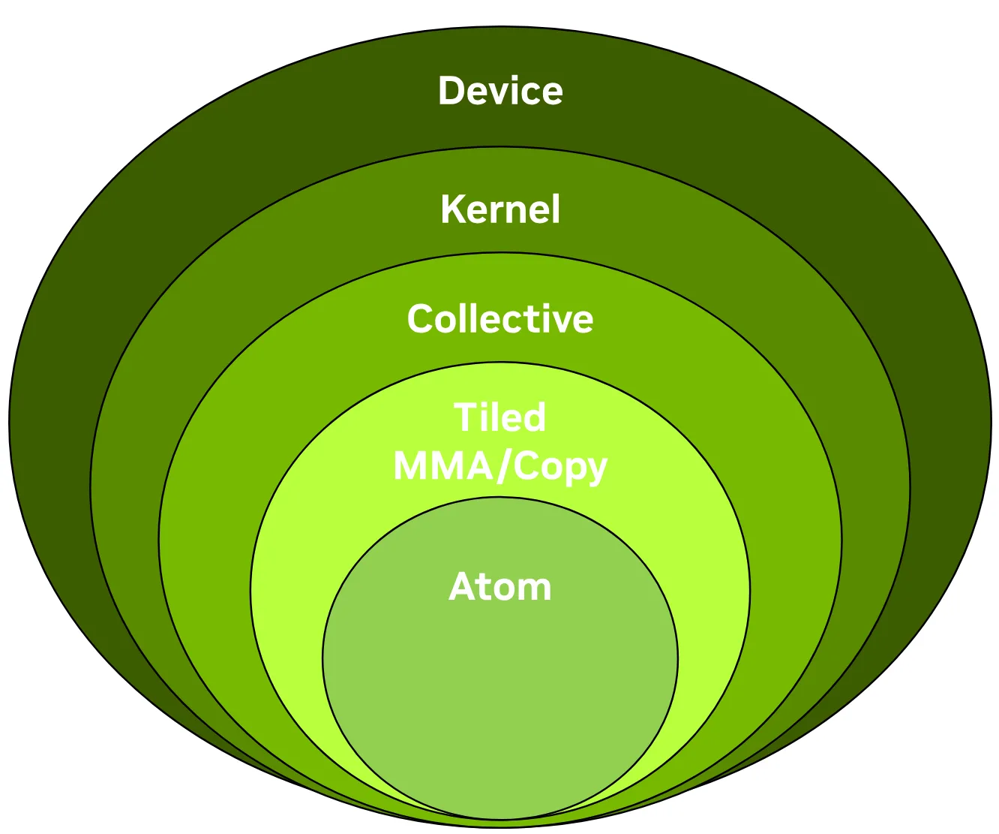
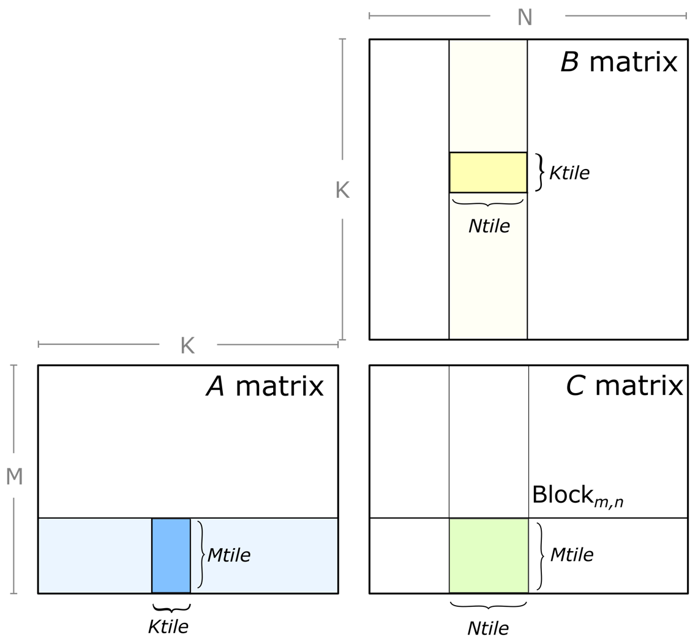
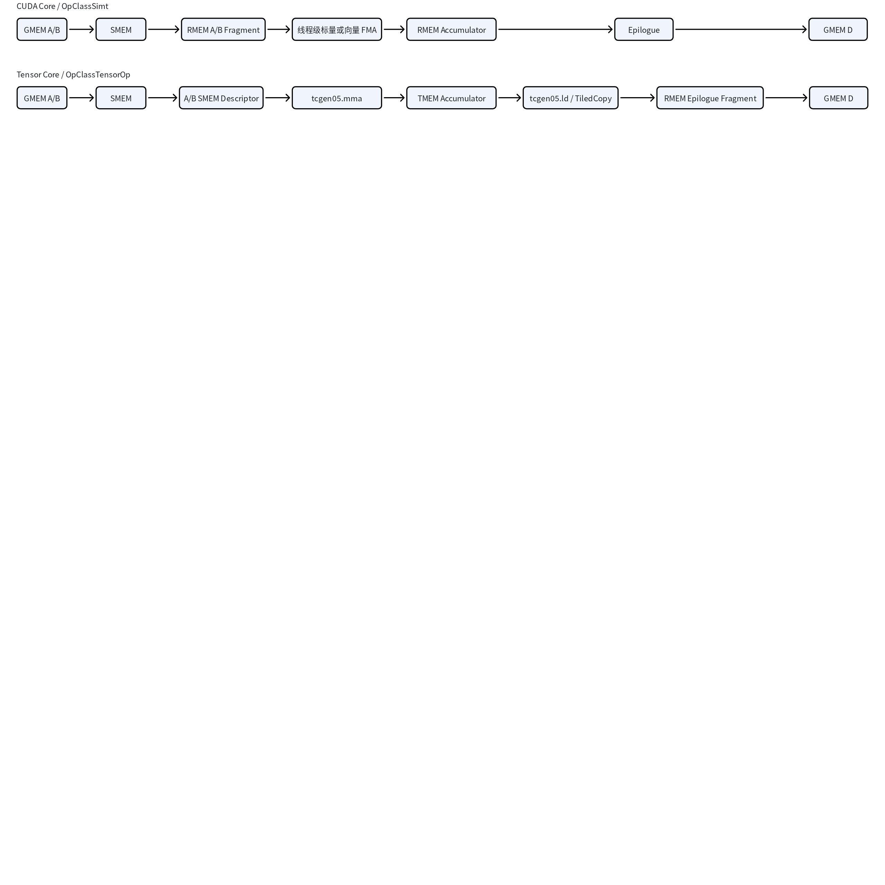

# CUTLASS 3.x (1)：Thor GEMM 编程入口指南

# 通用矩阵问题、场景特化与 CUTLASS 3.x 编程模型

本文是 CUTLASS 3.x Thor GEMM 系列的第一篇。文章先从问题的定义出发，建立普通 GEMM、Batched GEMM 以及 Mainloop、Accumulator 和 Epilogue 的数学关系，再介绍 CUTLASS 3.x 从 Device、Kernel、Collective、Tiled 到 Atom 的整体编程模型，并据此区分 Dense、Block-Scaled、Grouped GEMM、MoE 和 Attention 等场景需要改变的计算与数据组织。随后以 Dense FP16 Tensor Core GEMM 固定数据类型、Layout、Tile、Cluster、Schedule 和 Epilogue 的公共 Kernel 类型骨架，再沿 Block-Scaled、Grouped GEMM、MoE 与 Attention 四条路径展开调用者输入、运行时 `Arguments`、工作分配、启动边界和结果验证。

完成这条公共路径后，可以继续阅读[第二篇](https://xiaopeng.feishu.cn/wiki/Wod4wss3rirbjXkUcyjcUGJEn3e)，沿一个已经构造完成的 SM100 GEMM Kernel 深入 Mainloop、Epilogue、Warp Role、Tile Scheduler、Arguments、Workspace 与 Cluster Launch；随后进入[第三篇](https://xiaopeng.feishu.cn/wiki/QJLZwqhRCiZYeBk5eL1cyU5kntg)，从 Layout、Tensor、Atom、`TiledMMA` 与 `TiledCopy` 出发，理解参与者与数据坐标如何映射，并在 Blackwell 固定实例中追踪 TMA、SMEM Descriptor、TCGen05 和 TMEM Accumulator 的完整数据流。

## 通用矩阵问题定义

先定义一项基本矩阵问题。A 是一个 $M\times K$ 矩阵，B 是一个 $K\times N$ 矩阵，C 和 D 都是 $M\times N$ 矩阵：

$$A:M\times K,\qquad B:K\times N$$

$$C:M\times N,\qquad D:M\times N$$

M 表示输出矩阵的行数，N 表示输出矩阵的列数，K 表示每个输出位置需要归约的长度。A 的 K 列必须与 B 的 K 行一致，这使 A 的每一行都能与 B 的每一列完成一次长度为 K 的点积。

矩阵乘法先形成 Accumulator 矩阵：

$$\operatorname{Acc}=AB,\qquad \operatorname{Acc}:M\times N$$

随后 Epilogue 读取 Accumulator、可选的 C 以及标量或融合参数，生成最终输出矩阵 D：

$$D=\operatorname{Epilogue}(\operatorname{Acc},C,\text{其他参数})$$

### Dense GEMM

Dense GEMM 直接使用 A 和 B 的全部元素完成矩阵乘法，Epilogue 再执行线性组合：

$$D=\alpha AB+\beta C$$

观察输出矩阵中的一个位置 $(m,n)$，Accumulator 在该位置的值等于 A 的第 m 行与 B 的第 n 列之间的点积：

$$\operatorname{acc}_{m,n}=\sum_{k=0}^{K-1}a_{m,k}b_{k,n}$$

这个元素公式说明一个输出位置怎样沿 K 方向归约。CUTLASS 如何把多个输出位置组织成 Work Tile、再让 Collective Mainloop 沿 K Tile 完成这项归约，将在建立五层编程模型后说明。

**Dense 基线：** 后文只会进一步固定 Element、Layout、Tile、Schedule 和 Epilogue；矩阵乘加关系保持不变。

## 问题数量与矩阵集合

一项基本矩阵问题由自己的 A、B、C、D 和 M、N、K 定义。一次调用还可以组织多项矩阵问题；不同组织方式决定这些问题是否共享 Shape、如何定位地址，以及调度器怎样取得下一项工作。

### Single GEMM

Single GEMM 只计算一项矩阵问题：一个 $M\times K$ 的 A 与一个 $K\times N$ 的 B 相乘，再由 Epilogue 生成一个 $M\times N$ 的 D。后文选择的 Dense FP16 Thor 示例属于这一类。

**相对 Dense Single 基线：**没有新增合同；它就是一组 Shape、一组 A/B/C/D 地址和 $L=1$ 的基准调用。

### Batched GEMM

Batched GEMM 一次处理 L 项 Shape 相同的矩阵问题。CUTLASS 使用 $l=0,1,\ldots,L-1$ 表示批次编号，并把问题 Shape 统一写成 $(M,N,K,L)$。第 l 个批次独立计算：

$$D_l=\alpha_lA_lB_l+\beta_lC_l$$

同一组 M、N、K 描述每个批次的矩阵大小，L 描述本次调用包含多少个同构问题。各批次的 A、B、C、D 通常通过批次方向的 Stride 定位；L 不参与 K 维归约。

**相对 Dense Single 基线：**通常复用同一编译期 Collective，运行时把 $L$ 扩为批次数，并为 A/B/C/D 增加批次 Stride。

### Grouped GEMM

Grouped GEMM 使用 $g=0,1,\ldots,G-1$ 表示问题编号。第 g 项问题可以拥有自己的 $M_g$、$N_g$、$K_g$、A/B/C/D 地址和 Stride，因此无法再用一组固定的 M、N、K 和批次 Stride 描述全部问题。CUTLASS 分别使用 Problem Shape 数组描述“每组计算多大”，使用 Pointer/Stride 数组描述“每组数据在哪里以及怎样寻址”；Kernel Tile Scheduler 再把所有 Group 的输出空间展开成 Work Tile 并逐项分配。Pointer-array 只表示操作数地址由指针数组提供；是否属于 Grouped GEMM，还取决于各项问题是否具有独立的 Shape 和调度边界。

**相对 Dense Single 基线：** 把固定 ProblemShape、单组地址和单组 Stride 换成每组 Shape、Pointer/Stride 数组及 Grouped Tile Scheduler；每组内部仍执行一项完整 GEMM，并可复用同一种数值 Mainloop。

### MoE

MoE 使用 $e=0,1,\ldots,E-1$ 表示 Expert。路由阶段先把 Token 分配给各个 Expert；设 $I_e$ 是 Expert e 收到的 Token 索引集合，$T_e=|I_e|$ 是该 Expert 的 Token 数量。聚集后的 Token 矩阵与 Expert 权重矩阵形成第 e 项 GEMM，输出可以写成：

$$X_e=X[I_e,:],\qquad D_e=\alpha_eX_eW_e+\beta_eC_e$$

不同 Expert 的 $T_e$ 通常不同，因此 MoE 会形成一组规模不均衡的 GEMM。$T_e$ 在具体 GEMM 中对应 M 还是 N，取决于 X 与 W 的操作数方向；本文引用的固定版本 Example 92 使用 `MoEProblemShape` 保存最大 M/N/K 和 `tokens_per_expert`，并把第 e 个 Token Count 落到该实例的 N 维。计算完成后，输出还要按照路由关系写回原 Token 顺序。Top-k 路由会让同一个 Token 进入多个 Expert 并携带路由权重，但每个 Expert 内部仍执行一项完整的矩阵乘加。

**相对 Dense Single 基线：**在多问题 GEMM 之上增加路由得到的 Token Count、`MoEProblemShape` 和面向不均衡 Expert 的调度。`MoEProblemShape` 不等于 Pointer-array；固定 Example 92 从最大 Shape 和 Token Count 推导每组 Shape，再用 Expert 索引与最大槽位定位地址，其他 MoE Kernel 也可以选择 Pointer-array 等 Grouped 地址组织。Token 聚集、路由权重应用和结果回写仍属于更外层算子。

## 操作数与数值路径

除了“任务里有多少组矩阵”，实际算法还会改变 A/B 在乘法前怎样被解释，以及一个 K 段怎样产生部分贡献。下面这些路径都保留最终的矩阵乘加关系，但输入数据、额外信息和底层计算步骤不同。

### Mixed-input GEMM

Mixed-input GEMM 的 A、B 使用不同类型或位宽。执行矩阵乘法前，需要先把其中一个或两个操作数转换成 MMA 可以消费的形式，再计算当前 K 段的矩阵乘积。转换可能包含解包、类型转换、Layout 重排或 Scale 应用，但后续仍然把每个 K 段产生的部分矩阵累加到同一个 Accumulator。

**相对 Dense Single 基线：**问题拓扑不变，主要替换 Element/Transform、变换所需的中间存储以及 Mixed-input Mainloop Schedule。

### Block-Scaled GEMM

Block-Scaled GEMM 把窄精度存储值与 Scale Factor 分开。设 $\widehat A$、$\widehat B$ 是窄精度矩阵，$S_A$、$S_B$ 保存缩放因子，实际参与乘法的元素近似为：

$$a_{m,k}\approx S_A[\phi_A(m,k)]\widehat a_{m,k},\qquad b_{k,n}\approx S_B[\phi_B(k,n)]\widehat b_{k,n}$$

$\phi_A$ 和 $\phi_B$ 根据矩阵坐标找到对应的 Scale Factor。一次普通 Block-Scaled GEMM 调用并不负责从高精度 A/B 现场求出这些量；调用者要先准备窄精度 Payload 与匹配的 Scale Tensor，再按照 Kernel 生成的 Scale Layout 提交给 Mainloop。软件 Blockwise Scaling 可以先计算一段窄精度矩阵乘法，再由软件对部分结果应用 Scale；硬件 Block-Scaled MMA 则把窄精度 A/B 和 Scale Factor 一起交给矩阵指令。两条路径最终都要生成完整 Accumulator，但 Scale 进入计算的位置和所需的数据搬运不同。

**相对 Dense Single 基线：**增加 SFA/SFB、Scale Layout 和运行时地址；软件路径仍用 `OpClassTensorOp`，硬件路径改用 `OpClassBlockScaledTensorOp`，并匹配各自的 Mainloop Schedule。

### Sparse GEMM

Sparse GEMM 的逻辑输入仍然是一张 $M\times K$ 矩阵，但物理存储只保存压缩后的有效值和描述其位置的 Metadata。概念上可以把它理解为“压缩值与 Metadata 共同还原出逻辑 A，再与 B 相乘”；实际 Sparse MMA 可以直接读取压缩值与 Metadata，无需先在内存中生成完整 Dense A。因此 Sparse 路径会增加 Metadata 的 Shape、地址和搬运，并改变当前 K 段怎样产生部分贡献。

**相对 Dense Single 基线：**A 改为压缩值并增加 Metadata，`OperatorClass` 改为 `OpClassSparseTensorOp`，Mainloop 改用 Sparse Schedule；输出 Shape 和 Epilogue 关系不变。

### Complex GEMM

Complex GEMM 的 A、B 和 D 包含实部与虚部。把 $A=A_r+iA_i$、$B=B_r+iB_i$ 展开后，结果的实部和虚部分别为：

$$\operatorname{Re}(AB)=A_rB_r-A_iB_i,\qquad \operatorname{Im}(AB)=A_rB_i+A_iB_r$$

因此一次逻辑复数矩阵乘法可以展开成多次实数矩阵乘法，再按照正负号组合结果。逻辑上的 M、N、K 关系保持不变，改变的是一个 K 段内部需要发射多少次基础 MMA，以及实部、虚部怎样存储和累加。

同一个复数矩阵乘法公式可以由不同的数据组织承载。Planar Complex 把实部和虚部分别保存在独立的矩阵 Plane 中，Mainloop 从这些 Plane 取得 $A_r$、$A_i$、$B_r$ 和 $B_i$，再组合多次实数 MMA 的结果。

Interleaved Complex 则让每个复数元素的实部和虚部在同一矩阵存储中相邻交错。对于 SM100 Interleaved Complex TF32 路径，逻辑输入仍是以 FP32 实部和虚部存储的复数矩阵；Mainloop 先在 Tile 内拆取、转换并重排实部与虚部，再使用多次 TF32 MMA 形成复数 Accumulator。两条路径计算的是同一个复数乘法，区别在于操作数的数据合同、输入变换以及变换后的操作数怎样供应给 MMA。

**相对 Dense Single 基线：**Element、存储方式、输入变换和 Mainloop Schedule 都改为复数路径；Planar 与 Interleaved 使用不同数据组织，但仍组合为同一 `GemmUniversal` 骨架。

### Fast-FP32 / 9xBF16

Fast-FP32 路径把一个 FP32 输入近似分解为多个 BF16 分量，使用多次 BF16 Tensor Core MMA 计算不同分量之间的乘积，再把这些结果重组为 FP32 Accumulator。它仍然表示 FP32 矩阵乘法，但底层执行的是一组 BF16 MMA，而不是一条原生 FP32 Tensor Core 指令；选择多少个分量会同时影响精度、指令数量和性能。

**相对 Dense Single 基线：**外部 ProblemShape 和 FP32 语义不变，Mainloop 换成 9xBF16 分解、变换和累加路径，并选择 Fast-FP32 Schedule。

## 复合矩阵算法与设备拓扑

前面的路径仍然围绕一组或多组独立 GEMM 展开。Attention 会在两次矩阵乘法之间加入新的行归约状态，Distributed GEMM 则把一项矩阵计算拆到多个设备并加入通信；它们需要在矩阵乘加之外继续描述阶段之间怎样连接。

### Attention

Attention 由两次矩阵乘法和二者之间的行归约组成。第一步生成 Query 与 Key 的分数，第二步沿 Key 方向执行 Softmax，第三步再与 Value 相乘：

$$S=QK^T/\sqrt d+\operatorname{Mask},\qquad P=\operatorname{Softmax}(S),\qquad O=PV$$

分离实现可以把 $QK^T$ 和 $PV$ 当成两个独立 GEMM，中间显式保存分数或概率矩阵，并使用单独的 Mask/Softmax Kernel；融合实现则在遍历 K/V Tile 时维护 Row Max、指数和与部分输出，使用新的 Row Max 修正此前的 Softmax 分母和输出累加器，使第二次 MMA 可以直接消费当前分数 Tile 而不物化完整的 S/P 矩阵。Attention 因而不只是替换一次 GEMM 的 Epilogue，而是把多个矩阵计算与跨矩阵状态组织成一条算法路径。

**相对 Dense Single 基线：**分离实现复用两次 Dense GEMM；融合实现需要两套 MMA 和在线 Softmax 状态，已经超出给单个 `GemmUniversal` 替换模板参数的范围。

### Distributed GEMM

Distributed GEMM 把一项矩阵问题分到多个设备上，每个设备先计算自己的局部矩阵或部分 Accumulator，再通过 All-Gather、Reduce-Scatter 或 All-Reduce 等通信得到完整结果。它主要改变数据位于哪些设备以及局部结果如何合并，单个设备内部仍然会执行前面定义的矩阵乘加路径。

**相对 Dense Single 基线：**单设备局部 GEMM 可以复用 Dense Kernel，外层增加矩阵分片、跨设备通信和结果合并；它不是一种新的 Mainloop Schedule。

## 从问题语义到 Mainloop 实现合同

到这里，不同场景的变化已经可以沿三条线理解：Single、Batched、Grouped 和 MoE 改变一项任务包含多少组矩阵以及每组 Shape 和地址是否相同；Mixed-input、Block-Scaled、Sparse、Complex 和 Fast-FP32 改变每组 A/B 在乘法前怎样被解释，以及 K 维归约中的部分贡献怎样产生；Attention 和 Distributed GEMM 则在多次矩阵计算之间加入新的状态、归约或通信。

第四条线描述进入 CUTLASS 后的 Mainloop 实现合同。计算引擎决定乘加由 CUDA Core 的线程级 FMA 还是 Tensor Core 的矩阵级 MMA 完成；1SM/2SM 协作范围决定矩阵 Tile 中的 Tensor Core MMA 由单个 CTA 还是 CTA pair 协同完成；GMEM→SMEM 运输协议决定 A/B Tile 使用 TMA、cp.async 或二者的混合路径到达片上存储；输入变换结果的存储位置决定转换、分解或重排后的操作数经 SMEM 还是 TMEM 供应给 MMA；格式专用 MMA 合同则继续约束 FP16、TF32、NVFP4、MXF4、MXF8/F6/F4、Sparse Metadata 和 Scale Factor 等数据怎样被硬件指令消费。这些实现选择不会改变前面定义的 GEMM 数学关系；它们在 CUTLASS 的哪一层产生、怎样组合，将在下面建立五层编程模型后再具体说明。

下面再介绍 CUTLASS 3.x 如何用 Device、Kernel、Collective、Tiled 和 Atom 分别承载这四条线上的变化。

## CUTLASS 3.x 如何承载这些矩阵问题

CUTLASS 为 GPU 系统层次结构中不同层级的矩阵乘积累加（MMA）操作提供了一种统一的编程模型。CUTLASS 3.0 提供了相应的 GEMM API，这些 API 按从最高层级到最低层级的顺序对应于以下层级。CUTLASS 3.x 建立了一套独立于具体硬件特性的概念性 GEMM 层次结构（[cutlass/media/docs/cpp/gemm_api_3x.md at main · NVIDIA/cutlass](https://github.com/NVIDIA/cutlass/blob/main/media/docs/cpp/gemm_api_3x.md)）。它由五层组成：



- [Atom 层接口](https://github.com/NVIDIA/cutlass/tree/main/include/cute/atom)：特定于架构的指令及其相关元信息（通常定义一条 MMA/TMA 硬件指令、原始参数及其操作数契约。操作数契约由 `MMA_Traits`/`Copy_Traits` 声明，CuTe 从中取得指令 Shape、数据类型和 Thread–Value Layout；详细构造见[第三篇《CuTe 的张量与空间微内核》](https://xiaopeng.feishu.cn/wiki/QJLZwqhRCiZYeBk5eL1cyU5kntg)。Atom 再把 Traits 的 bit Layout 按实际数据类型转换成 value Layout，供 TiledMMA/TiledCopy 消费。）

  - [`cute::MMA_Atom<>`](https://github.com/NVIDIA/cutlass/blob/main/include/cute/atom/mma_atom.hpp)：将一条 MMA 指令和 [Traits](https://github.com/NVIDIA/cutlass/blob/main/include/cute/atom/mma_traits.hpp)（定义 Shape、SMEM Descriptor、TMEM Fragment 和 Thread–Value Layout）包装成 Atom 的 `call`、Fragment 等统一接口。
  - [`cute::Copy_Atom<>`](https://github.com/NVIDIA/cutlass/blob/main/include/cute/atom/copy_atom.hpp)：将 TMA/cp.async 指令和 [Traits](https://github.com/NVIDIA/cutlass/blob/main/include/cute/atom/copy_traits.hpp)（定义 ThrID、SrcLayout、DstLayout 和 RefLayout）包装成统一接口。
- Tiled MMA/Copy 层接口：**空间微内核**，允许对特定于架构的 atom 进行任意交织与分块（生成 work tile 内部的线程—数据分块（partition） ，然后将Atom层的单个 mma 和 tma 指令在 M/N/K 上重复 Atom）

  - [`cute::TiledMMA<>`](https://github.com/NVIDIA/cutlass/blob/8f50b052e1099fb982392a622caab69b97b63128/include/cute/atom/mma_atom.hpp#L199-L240)：`TiledMma` 将一个 `Mma_Atom` 按指定的 Atom layout、value layout 和 permutation 展开到一组参与计算的线程上。它决定每个逻辑线程负责累加器中的哪些元素，以及一次局部矩阵乘法需要调用底层 MMA operation 多少次。
  - [`cute::TiledCopy<>`](https://github.com/NVIDIA/cutlass/blob/8f50b052e1099fb982392a622caab69b97b63128/include/cute/atom/copy_atom.hpp#L176-L223)：`TiledCopy` 将一个 `Copy_Atom` 展开到一组参与搬运的线程或逻辑参与者上。它决定源张量和目标张量如何分区，以及每个参与者负责搬运哪些元素。
  - 注意：`TiledMma` 负责计算的空间分块，`TiledCopy` 负责数据搬运的空间分块；二者在 Tiled 层仍是独立对象。 Collective 层才把它们与 SMEM layout、流水线阶段、barrier 和 warp specialization 组织在一起。
- Collective 层接口：面向一个输出 tile 的**时间微内核**，它把 `TiledCopy`、`TiledMMA`、流水级和同步机制组织起来，规定数据加载、MMA 累加、后处理与结果写回的执行顺序。

  - [`cutlass::gemm::collective::CollectiveMma<>`](https://github.com/NVIDIA/cutlass/blob/main/include/cutlass/gemm/collective/collective_mma_decl.hpp)：Mainloop Collective，沿 K 维组织 A、B tile 的加载、同步和 MMA 累加，产生当前输出 tile 的累加器。
  - [`cutlass::epilogue::collective::CollectiveEpilogue<>`](https://github.com/NVIDIA/cutlass/tree/main/include/cutlass/epilogue/collective)：Epilogue Collective，消费 Mainloop 产生的累加器，执行 alpha \* Acc + beta \* C、可选融合操作和 D 矩阵写回。
- Kernel 层：面向整个 GEMM 问题空间的无状态设备内核。它组合 `CollectiveMainloop` 和 `CollectiveEpilogue`，把 M/N/L 方向的输出 tile 分配给 threadblock 或 threadblock cluster，并通过 tile scheduler 组织整个 grid 的执行。

  - [`cutlass::gemm::kernel::GemmUniversal<>`](https://github.com/NVIDIA/cutlass/blob/main/include/cutlass/gemm/kernel/gemm_universal_decl.h)：根据问题形状、Mainloop Collective、Epilogue Collective 和可选 Tile Scheduler 构造完整的设备端 GEMM kernel。
- Device 层：面向一次具体 GEMM 调用的有状态主机接口。它将一次具体 GEMM 的问题形状、张量地址、stride、epilogue 和 scheduler 参数转换为 Kernel 所需的运行时状态，并负责合法性检查、workspace 管理和 CUDA kernel 启动。

  - [`cutlass::gemm::device::GemmUniversalAdapter<>`](https://github.com/NVIDIA/cutlass/blob/main/include/cutlass/gemm/device/gemm_universal_adapter.h)：把 `GemmUniversal` 内核包装成主机端 GEMM 句柄，提供 `can_implement`、`get_workspace_size`、`initialize` 和 `run` 等接口。

**从线程块簇到 Atom 的 GEMM 分层执行伪代码**

```cpp
// cutlass::gemm::kernel::GemmUniversal: ClusterTileM and ClusterTileN loops
//   are either rasterized by the hardware or scheduled by the kernel in persistent kernels.
// Parallelism over thread block clusters
for (int cluster_m = 0; cluster_m < GemmM; cluster_m += ClusterTileM) {
  for (int cluster_n = 0; cluster_n < GemmN; cluster_n += ClusterTileN) {
    // collective mainloop 层：mainloop that iterates over all k-tiles
    // cutlass::gemm::collective::CollectiveMma
    // No loop unrolling is performed at this stage
    for (int k_tile = 0; k_tile < size<2>(gmem_tensor_A); k_tile++) {
      // Tiled 层
      // loops inside cute::gemm(tiled_mma, a, b, c); Dispatch 5: (V,M,K) x (V,N,K) => (V,M,N)
      // TiledMma uses the hardware instruction provided through its Mma_Atom
      // TiledMma's atom layout, value layout, and permutations define the iteration order
      for (int tiled_mma_k = 0; tiled_mma_k < size<2>(A); tiled_mma_k++) {
        for (int tiled_mma_m = 0; tiled_mma_m < size<1>(A); tiled_mma_m++) {
          for (int tiled_mma_n = 0; tiled_mma_n < size<1>(B); tiled_mma_n++) {
            // TiledMma's vector mode dispatches to the underlying instruction.
            mma.call(d, a, b, c);
          } // tiled_mma_n
        } // tiled_mma_m
      } // tiled_mma_k
    } // k_tile mainloop
  } // cluster_m
} // cluster_n
```

这五层把同一个 GEMM 问题放到不同程序作用域中：Device 接收一次具体调用，Kernel 覆盖完整的 M/N/L 输出域，Collective 在当前 Work Tile 内完成 K 维归约与后处理，TiledMMA 和 TiledCopy 建立 Tile 内的参与者—数据映射，Atom 则把计算或搬运落实为基本架构操作。下面先用这张整体地图说明运行时 ProblemShape 怎样经过 Kernel 调度、Collective Tile 和 K Tile 迭代落实到 MMA Atom，再把这些对象组合成可编译、可启动并可验证的 Thor GEMM。

## CUTLASS 3.x 如何分解一个 GEMM 问题

建立五层作用域后，再来看一个完整 GEMM 问题怎样进入这些层。Device 接收本次调用的运行时 `ProblemShape=(M,N,K,L)`、A/B/C/D 地址与 Stride、Epilogue 参数和调度参数；其中 M、N、K 定义单个矩阵乘法，标准 Single/Strided-Batched ProblemShape 使用 L 表示批次维，本文后续的 Single GEMM 基线取 $L=1$。Grouped GEMM 则通过问题数组保存每组独立的 M、N、K，而不是把不同 Shape 压进同一组固定的 M、N、K 和 L。

与运行时 ProblemShape 不同，`CollectiveBuilder` 的 `TileShape_MNK=(T_M,T_N,T_K)` 是编译期参数，表示 M×N×K Collective Tile。$T_M$ 和 $T_N$ 定义一次局部矩阵乘法覆盖的输出行、列范围，$T_K$ 定义 Collective Mainloop 一次 `k_tile` 迭代消费的 K 维宽度。`TileShape_MNK` 回答“这个 Kernel 类型按多大的局部 Shape 计算”，并不描述某次运行实际领取了哪一个 Tile。

Kernel 层结合 ProblemShape、Collective Tile Shape 和 Cluster Shape，形成 M/N/L 方向的逻辑输出 Tile 空间。Kernel Tile Scheduler 从中取得当前运行时工作，并用 `WorkTileInfo` 保存其 M/N/L Tile 坐标；Kernel 再根据这份信息得到 CTA/Cluster 坐标以及当前工作的 K Tile 迭代器和数量。在默认 Full-K 路径中，一个 Work Tile 覆盖当前输出 Tile 的完整 K 迭代范围；在 2SM MMA 路径中，当前 Collective Tile 的计算可以由 CTA pair 协同完成。

设第 $(p,q)$ 个输出 Work Tile 覆盖行坐标集合 $I_p$ 和列坐标集合 $J_q$，其内部完整 Tile 通常满足 $|I_p|=T_M$、$|J_q|=T_N$，边界 Tile 可以更小。它对应的输出区域为：

$$D[I_p,J_q],\qquad D[I_p,J_q]:|I_p|\times|J_q|$$

设 Mainloop 第 $r$ 次迭代消费的 K Tile 为 $K_r$；除尾部 K Tile 外，通常有 $|K_r|=T_K$。这一轮对当前输出 Work Tile 产生的局部贡献为：

$$P_{p,q}^{(r)}=A[I_p,K_r]B[K_r,J_q],\qquad P_{p,q}^{(r)}:|I_p|\times|J_q|$$



*图 2. CUTLASS GEMM 的 M/N 输出分块与 K Tile 迭代。图中的 $\mathrm{Block}_{m,n}$ 对应本文的输出 Work Tile；A 的 $M_{\mathrm{tile}}\times K_{\mathrm{tile}}$ 与 B 的 $K_{\mathrm{tile}}\times N_{\mathrm{tile}}$ 对应一个 K Tile 对该 Work Tile 的局部贡献。图片使用经典 Thread Block 术语；在本文 SM100 2SM 路径中，相应 Collective Tile 可以由 CTA pair 协同计算。图片来源：[NVIDIA CUTLASS](https://github.com/NVIDIA/cutlass/blob/8f50b052e1099fb982392a622caab69b97b63128/media/images/cutlass-threadblock-gemm.png)。*

Collective Mainloop 在当前输出 Work Tile 内遍历全部 K Tile，并把局部贡献累加到该 Tile 的 Accumulator：

$$\operatorname{Acc}_{p,q}=\sum_{r=0}^{R-1}P_{p,q}^{(r)}$$

Collective Mainloop 的输出是当前 Work Tile 的 $\operatorname{Acc}_{p,q}$。Collective Epilogue 随后读取这个 Accumulator、对应的 C Tile 以及标量或融合参数，生成对应的 D Tile：

$$D[I_p,J_q]=\operatorname{Epilogue}\!\left(\operatorname{Acc}_{p,q},C[I_p,J_q],\text{其他参数}\right)$$

当前的 $I_p\times J_q\times K_r$ 是 Mainloop 一次迭代处理的 M×N×K Collective Tile。`TiledMMA` 在这个 Tile 内建立参与者—数据映射，并沿自身的 M、N、K 模式静态展开，最后调用底层 MMA Atom。因此，对默认路径可以沿一条链理解：Tile Scheduler 分配 Work Tile，Collective Mainloop 为该 Work Tile 遍历 K Tile，`TiledMMA` 再把一个 Collective Tile 展开到底层 MMA Atom。Stream-K 等调度器可以让一个 `WorkTileInfo` 只覆盖部分 K Tile，并在之后执行 Fixup；它改变的是 Work Tile 的 K 范围与合并方式，不会改变上述各层的职责。

后续示例是 NVIDIA Thor/SM110a 上的 CUTLASS 3.x GEMM：A、B 使用 FP16，累加和输出使用 FP32，M×N×K Collective Tile（代码中的 `MmaTileShape`）为 256×128×64，Cluster Shape 为 2×2×1。

这里 的CUTLASS C++ Builder 继续使用 `cutlass::arch::Sm100` 选择可复用的 Blackwell TCGen05 配方；CUDA 13.0 及以上则用 `-gencode arch=compute_110a,code=sm_110a` 生成 Thor/SM110a 二进制。以下是一个代码的示例：

**Thor/SM110a 上的 CUTLASS 3.x GEMM 基线类型组合**

```cpp
// CUTLASS 配方标签：当前 C++ CollectiveBuilder 复用 Sm100 实现族
using ArchTag = cutlass::arch::Sm100;
using OperatorClass = cutlass::arch::OpClassTensorOp;

using ElementA = cutlass::half_t;
using ElementB = cutlass::half_t;
using ElementC = float;
using ElementD = float;
using ElementAccumulator = float;
using ElementCompute = float;

using LayoutA = cutlass::layout::RowMajor;
using LayoutB = cutlass::layout::RowMajor;
using LayoutC = cutlass::layout::RowMajor;
using LayoutD = cutlass::layout::RowMajor;

static constexpr int AlignmentA = 128 / cutlass::sizeof_bits<ElementA>::value;
static constexpr int AlignmentB = 128 / cutlass::sizeof_bits<ElementB>::value;
static constexpr int AlignmentC = 128 / cutlass::sizeof_bits<ElementC>::value;
static constexpr int AlignmentD = 128 / cutlass::sizeof_bits<ElementD>::value;

using MmaTileShape = cute::Shape<cute::_256, cute::_128, cute::_64>;
using ClusterShape = cute::Shape<cute::_2, cute::_2, cute::_1>;

// 第 1 步：先生成 epilogue，以便为 mainloop 计算 SMEM carveout
using EpilogueOperation = cutlass::epilogue::fusion::LinearCombination<
    ElementD, ElementCompute, ElementC, float,
    cutlass::FloatRoundStyle::round_to_nearest>;

using CollectiveEpilogue = typename cutlass::epilogue::collective::CollectiveBuilder<
    ArchTag, OperatorClass, MmaTileShape, ClusterShape,
    cutlass::epilogue::collective::EpilogueTileAuto,
    ElementAccumulator, ElementCompute,
    ElementC, LayoutC, AlignmentC,
    ElementD, LayoutD, AlignmentD,
    cutlass::epilogue::collective::EpilogueScheduleAuto,
    EpilogueOperation>::CollectiveOp;

// 第 2 步：生成 SM110a 使用的 TCGen05 collective mainloop
using CollectiveMainloop = typename cutlass::gemm::collective::CollectiveBuilder<
    ArchTag, OperatorClass,
    ElementA, LayoutA, AlignmentA,
    ElementB, LayoutB, AlignmentB,
    ElementAccumulator,
    MmaTileShape, ClusterShape,
    cutlass::gemm::collective::StageCountAutoCarveout<
        static_cast<int>(sizeof(typename CollectiveEpilogue::SharedStorage))>,
    cutlass::gemm::collective::KernelScheduleAuto>::CollectiveOp;

// 第 3 步：在 Kernel 层组合 mainloop 与 epilogue
using GemmKernel = cutlass::gemm::kernel::GemmUniversal<
    cute::Shape<int, int, int, int>, // [M, N, K, L]
    CollectiveMainloop,
    CollectiveEpilogue>;

// 第 4 步：生成主机端可复用句柄
using GemmHandle = cutlass::gemm::device::GemmUniversalAdapter<GemmKernel>;

// 使用 CUDA 13.0+ 编译：
// nvcc -std=c++17 --expt-relaxed-constexpr -gencode arch=compute_110a,code=sm_110a ...
```

根据这个代码的实例我们能看到我们在 collectie、kernel、device 层是怎么调用 api 的，具体必要的 api 的调用参数我们将在下面详细讲解。

## 从问题特化到 CUTLASS 编程入口

### 计算引擎：SIMT 与 Tensor Core

**CUDA Core（SIMT）和 Tensor Core 实现同一个求和公式，区别在于一次指令更新多少结果以及 Accumulator 位于哪里。**CUDA Core 的最低乘加是线程级 FMA：

$$acc\leftarrow \operatorname{fma}(a,b,acc)=a\times b+acc$$

SIMT GEMM 把输出坐标或输出微块分配给不同线程。对线程 t 负责的坐标集合 $\Omega_t$，每个 $(m,n)\in\Omega_t$ 都在该线程的寄存器中按 K 维重复 FMA：

$$\operatorname{acc}_{m,n,l}^{(k+1)}=\operatorname{fma}(a_{m,k,l},b_{k,n,l},\operatorname{acc}_{m,n,l}^{(k)})$$

Tensor Core 把一次乘加提升为矩阵 Tile 运算。沿用前文的记号，$I_p$ 和 $J_q$ 是当前输出 Work Tile 的 M/N 坐标集合，$K_r$ 是第 r 个 K Tile 的归约坐标集合，则一次或一组 MMA 更新整个 Accumulator Tile：

$$\mathbf{Acc}_{I_p,J_q,l}^{(r+1)}=\mathbf{A}_{I_p,K_r,l}\mathbf{B}_{K_r,J_q,l}+\mathbf{Acc}_{I_p,J_q,l}^{(r)}$$



CUTLASS 使用 [`OpClassSimt`](https://github.com/NVIDIA/cutlass/blob/8f50b052e1099fb982392a622caab69b97b63128/include/cutlass/arch/mma.h#L115-L137) 表示 CUDA Core 的线程级乘加路径，使用 `OpClassTensorOp` 表示 Tensor Core 路径。Blackwell Dense SS 路径由 TMA 把 A/B Tile 写入 SMEM，TCGen05 MMA 通过 SMEM Descriptor 读取操作数，并把 Accumulator 保存在 TMEM。两条路径得到相同的 GEMM 数学结果，指令粒度、参与者范围和数据通路不同。

| 比较维度 | CUDA Core / SIMT 路径 | Tensor Core / TCGen05 路径 |
|-|-|-|
| CUTLASS 分类标签 | `OpClassSimt` | `OpClassTensorOp`；硬件缩放路径使用 `OpClassBlockScaledTensorOp` |
| 最低计算单元 | 每个线程执行标量或向量 FMA，Warp/CTA 共同覆盖输出 Tile | 一条 MMA 指令覆盖矩阵 Tile；Blackwell TCGen05 由一个 CTA 或 CTA pair 协作 |
| A/B 操作数 | 线程从 GMEM/SMEM 装入自己的 RMEM Fragment，再执行 CUDA Core FMA | Dense SS 路径由 TMA 写入 SMEM，MMA 通过 SMEM Descriptor 读取 A/B |
| Accumulator | 线程私有寄存器 Fragment | Blackwell TCGen05 Accumulator 位于 TMEM，Epilogue 前通过 TMEM Load 进入 RMEM |
| 空间扩展 | FMA Atom → TiledMMA 的 Thread/Value Layout → Warp/CTA Tile | MMA Atom → TiledMMA → CTA/CTA-pair Tile 与 Descriptor 契约 |
| 主要适用条件 | Tensor Core 不支持的类型或形状、细粒度控制、参考/回退路径，以及计算强度不足以摊薄矩阵指令组织成本的场景 | 满足 MMA 类型、Shape、Alignment 和数据通路约束，且需要高矩阵吞吐的 Dense、Block-Scaled、Sparse、MoE 或 Attention 子问题 |

两条路径仍共享 CUTLASS 的高层组合关系：`MMA_Atom → TiledMMA → CollectiveMainloop/CollectiveEpilogue → GemmUniversal → GemmUniversalAdapter`。差异由 Builder 选择的 Operation、Traits、Copy、Layout、DispatchPolicy 和 Collective 偏特化承载。高层类型名称相同，并不意味着最终使用同一种计算指令或存储通路。

```
// CUDA Core
using OperatorClass = cutlass::arch::OpClassSimt;
// 普通、Mixed-input、软件 Blockwise、Complex、9xBF16 Tensor Core
using OperatorClass = cutlass::arch::OpClassTensorOp;
// 硬件 Block-Scaled
using OperatorClass = cutlass::arch::OpClassBlockScaledTensorOp;
// 旧 WMMA Tensor Core 路径；固定 SM100 Builder 不使用
using OperatorClass = cutlass::arch::OpClassWmmaTensorOp;
// Structured Sparse：保留定义，本篇暂不展开构建
using OperatorClass = cutlass::arch::OpClassSparseTensorOp;
// Sparse + 硬件 Block-Scaled：保留定义，本篇暂不展开构建
using OperatorClass = cutlass::arch::OpClassBlockScaledSparseTensorOp;
```

**SM100 `CollectiveBuilder` 的 FP32 SIMT 基线类型组合**

固定源码的 [SM100 FP32 SIMT 单元测试](https://github.com/NVIDIA/cutlass/blob/8f50b052e1099fb982392a622caab69b97b63128/test/unit/gemm/device/sm100_gemm_f32_f32_f32_simt_align1.cu#L54-L113)使用下面这组类型。它与前面的 Tensor Core 基线共享 Builder→Collective→Kernel→Adapter 骨架，但 Mainloop 使用 CUDA Core FMA、显式三级 cp.async 流水和 `KernelMultistage`。

```cpp
using ArchTag = cutlass::arch::Sm100;
using OperatorClass = cutlass::arch::OpClassSimt;

using ElementA = float;
using ElementB = float;
using ElementC = float;
using ElementD = float;
using ElementAccumulator = float;
using ElementCompute = float;

using LayoutA = cutlass::layout::ColumnMajor;
using LayoutB = cutlass::layout::RowMajor;
using LayoutC = cutlass::layout::ColumnMajor;
using LayoutD = LayoutC;

static constexpr int AlignmentA = 1;
static constexpr int AlignmentB = 1;
static constexpr int AlignmentC = 1;
static constexpr int AlignmentD = 1;

using MmaTileShape = cute::Shape<cute::_128, cute::_128, cute::_16>;
using ClusterShape = cute::Shape<cute::_1, cute::_1, cute::_1>;

using MainloopSchedule = cutlass::gemm::KernelMultistage;
using EpilogueSchedule = cutlass::epilogue::EpilogueSimtVectorized;

using CollectiveMainloop = typename cutlass::gemm::collective::CollectiveBuilder<
    ArchTag, OperatorClass,
    ElementA, LayoutA, AlignmentA,
    ElementB, LayoutB, AlignmentB,
    ElementAccumulator,
    MmaTileShape, ClusterShape,
    cutlass::gemm::collective::StageCount<3>,
    MainloopSchedule>::CollectiveOp;

using CollectiveEpilogue = typename cutlass::epilogue::collective::CollectiveBuilder<
    ArchTag, OperatorClass,
    MmaTileShape, ClusterShape,
    cutlass::epilogue::collective::EpilogueTileAuto,
    ElementAccumulator, ElementCompute,
    ElementC, LayoutC, AlignmentC,
    ElementD, LayoutD, AlignmentD,
    EpilogueSchedule>::CollectiveOp;

using GemmKernel = cutlass::gemm::kernel::GemmUniversal<
    cute::Shape<int, int, int, int>,
    CollectiveMainloop,
    CollectiveEpilogue>;

using GemmHandle = cutlass::gemm::device::GemmUniversalAdapter<GemmKernel>;
```

这条固定源码路径只支持 FP32 A/B/Accumulator，且 `MmaTileShape` 的 K 维必须为 16。Direct GEMM 使用 `KernelMultistage`；Pointer-array 变体改用 `KernelPtrArrayMultistage` 和匹配的 Pointer-array Epilogue。

## Scenario 到 CUTLASS 模板参数的映射

前面已经定义五组算法约束。这里不再重复解释各维度的场景语义，只列出它们在标准 CUTLASS 3.x `GemmUniversal` 构造路径中对应的模板参数。

`Scenario = (Topology, ComputeEngine, Numerics, Fusion, Scheduling)`

下表中的名称直接取自固定源码的 [Mainloop `CollectiveBuilder`](https://github.com/NVIDIA/cutlass/blob/8f50b052e1099fb982392a622caab69b97b63128/include/cutlass/gemm/collective/collective_builder_decl.hpp#L77-L96)、[Epilogue `CollectiveBuilder`](https://github.com/NVIDIA/cutlass/blob/8f50b052e1099fb982392a622caab69b97b63128/include/cutlass/epilogue/collective/collective_builder.hpp#L52-L73) 和 [`GemmUniversal`](https://github.com/NVIDIA/cutlass/blob/8f50b052e1099fb982392a622caab69b97b63128/include/cutlass/gemm/kernel/gemm_universal_decl.h#L50-L57)：

| Scenario 维度 | CUTLASS 层级与模板 | 对应的模板参数名 |
|-|-|-|
| `Topology` | Kernel：`cutlass::gemm::kernel::GemmUniversal` | `ProblemShapeOrThreadblockMma_`；在 CUTLASS 3.x 语义中即 `ProblemShape_` |
| `ComputeEngine` | Mainloop：`cutlass::gemm::collective::CollectiveBuilder` | `ArchTag`、`OpClass` |
| `ComputeEngine` | Epilogue：`cutlass::epilogue::collective::CollectiveBuilder` | `ArchTag`、`OpClass` |
| `Numerics` | Mainloop：`cutlass::gemm::collective::CollectiveBuilder` | `ElementA`、`GmemLayoutA`、`AlignmentA`、`ElementB`、`GmemLayoutB`、`AlignmentB`、`ElementAccumulator` |
| `Numerics` | Epilogue：`cutlass::epilogue::collective::CollectiveBuilder` | `ElementAccumulator`、`ElementCompute`、`ElementC`、`GmemLayoutTagC`、`AlignmentC`、`ElementD`、`GmemLayoutTagD`、`AlignmentD` |
| `Fusion` | Epilogue：`cutlass::epilogue::collective::CollectiveBuilder` | `FusionOpOrCallbacks` |
| `Scheduling` | Mainloop：`cutlass::gemm::collective::CollectiveBuilder` | `TileShape_MNK`、`ClusterShape_MNK`、`StageCountType`、`KernelScheduleType` |
| `Scheduling` | Epilogue：`cutlass::epilogue::collective::CollectiveBuilder` | `TileShape_MNK`、`ClusterShape_MNK`、`EpilogueTileType`、`EpilogueScheduleType` |
| `Scheduling` | Kernel：`cutlass::gemm::kernel::GemmUniversal` | `TileScheduler_` |

`CollectiveMainloopOrEpilogue_` 和 `CollectiveEpilogueOrThreadblockSwizzle_` 是 `GemmUniversal` 接收的两个已生成 Collective 类型，不是新的 Scenario 维度；三个模板中的 `Enable` 用于偏特化匹配，也不作为用户定义 Scenario 的参数。运行时 `Arguments` 只为已经确定的这些类型补充具体值，不属于这张编译期映射表。

下面选取四个代表性 Scenario，具体说明它们从表中的哪些模板参数开始离开 Dense 公共路径。

### 四个代表性 Scenario 在约束坐标中的位置

Block-Scaled、Grouped GEMM、MoE 和 Attention 是本文选择的四个使用场景，不是四个互斥或完备的 CUTLASS 类别。它们都可以使用 Tensor Core，但分别约束 `Scenario` 的不同维度，并且可以继续组合。

- **Block-Scaled 主要约束 `Numerics`，硬件路径还会约束 `ComputeEngine`。** 单项 GEMM 的 M/N Work Tile、K 维归约和 Epilogue 交接保持不变，但 A/B 变为窄精度 Payload 与 SFA/SFB。Mainloop 必须理解 Scale Layout，并通过 `OpClassBlockScaledTensorOp` 进入硬件 Block-Scaled MMA 路径；它仍可与 Single、Grouped 或 MoE 等拓扑组合。

- **Grouped GEMM 主要约束 `Topology` 和 `Scheduling`。** 每组内部仍执行完整 GEMM，数值 Mainloop 可以相同；固定 ProblemShape、单组地址和单组 Stride 则要替换为 `GroupProblemShape`、Pointer/Stride 数组以及匹配的 Pointer-array Mainloop/Epilogue。运行模式相应改为 `GemmUniversalMode::kGrouped`，`Numerics` 仍可选择 Dense、Mixed-input 或 Block-Scaled 等路径。

- **MoE 在多问题 `Topology` 上增加 Router 产生的工作负载语义，并进一步约束 `Scheduling`。** Router 产生每个 Expert 的 Token Count，据此形成规模不均衡的 GEMM 集合；CUTLASS 再通过 `MoEProblemShape` 或相应 RC-Grouped 问题描述与 Scheduler 承载这些 Expert 工作。Expert GEMM 的 `Numerics` 仍可以是 Dense 或 Block-Scaled。

- **Attention 主要约束复合 `Topology` 和 `Fusion`。** `QK^T` 与 `PV` 仍分别包含矩阵乘法，但二者之间加入 Mask、在线 Softmax 状态和对旧部分输出的修正。分离路径可以使用两个 GEMM；融合路径则进入专用 CuTe/Collective Kernel，Q/K/V 的 `Numerics` 仍可独立选择 Dense、Mixed-input 或 Block-Scaled 等合同。

这些场景在 `Scenario` 坐标中可以相交：例如 Block-Scaled Grouped/MoE 同时约束数值与问题组织，Mixed-input Attention 同时约束输入格式与复合阶段。下一节先用 Dense FP16 Tensor Core GEMM 固定公共的编译期类型骨架，随后把四个代表性 Scenario 分别投影到这条公共路径，说明需要替换的编译期类型、运行时输入与验证边界。

# 构造一个 CUTLASS 3.x Dense Kernel 基线

## 构造编译期 Kernel 类型

**本文使用 Dense FP16 Tensor Core GEMM 建立公共编程基线。** 这条路径具备后续场景共同需要的 Element、Layout、Alignment、Tile、Cluster、Mainloop、Epilogue、Kernel 和 Adapter 等构件，同时避免在第一个编译期基线中引入 Scale Tensor、Sparse Metadata、Grouped ProblemShape 或 Softmax 状态。下面先固定一组编译期配置，再沿声明顺序构造 CollectiveEpilogue、CollectiveMainloop、GemmKernel 与 GemmUniversalAdapter；其他数值路径和问题拓扑将在扩展章节中说明相对这组基线改变了哪些合同。

| 公共基线维度 | 本文固定值 |
|-|-|
| CUTLASS 源码 | [`8f50b052e1099fb982392a622caab69b97b63128`](https://github.com/NVIDIA/cutlass/tree/8f50b052e1099fb982392a622caab69b97b63128) |
| Thor 编译目标 | CUDA 13.x；`-gencode arch=compute_110a,code=sm_110a` |
| C++ 架构配方 | [`cutlass::arch::Sm100`](https://github.com/NVIDIA/cutlass/blob/8f50b052e1099fb982392a622caab69b97b63128/include/cutlass/arch/arch.h#L95-L105) + `OpClassTensorOp` |
| 数据契约 | A/B 为 FP16，Accumulator/C/D/Compute 为 FP32，A/B/C/D 使用 RowMajor 与 128-bit Alignment |
| Collective Tile 与 Cluster | `MmaTileShape=(256,128,64)`，`ClusterShape=(2,2,1)` |
| Mainloop/Epilogue | `StageCountAutoCarveout`、`KernelScheduleAuto`、`EpilogueScheduleAuto` 与 `LinearCombination` |
| 运行模式 | `GemmUniversalMode::kGemm`，ProblemShape 使用 `[M,N,K,L=1]` |

`cutlass::arch::Sm100` 是 Builder 选择 Blackwell 实现族的 C++ 配方标签，`compute_110a/sm_110a` 是 CUDA 为 Thor 生成代码时使用的编译目标。`KernelScheduleAuto`、`EpilogueScheduleAuto` 和自动 Stage 在编译期选择合法实现，不执行运行时 autotuning。后续代表性 Scenario 都以本表为共同的 Dense 比较基线。

固定 commit 的 [Example 71](https://github.com/NVIDIA/cutlass/blob/8f50b052e1099fb982392a622caab69b97b63128/examples/71_blackwell_gemm_with_collective_builder/71_blackwell_gemm_with_collective_builder.cu#L155-L250)用于说明 Builder→Collective→Kernel→Adapter 的类型组合结构，但它的默认实例与本文基线不同：Example 71 使用 `LayoutA=RowMajor`、`LayoutB/C/D=ColumnMajor`，C/D 为 FP16；本文固定 A/B/C/D 为 RowMajor，C/D 为 FP32。读者应把 Example 71 视为 API 结构的源码参考，并以本表中的固定配置作为后续代表性 Scenario 的共同 Dense 比较基线。

# 场景扩展、适用边界与后续阅读

前面的 Dense FP16 基线已经固定了 `CollectiveMainloop`、`CollectiveEpilogue`、`GemmKernel` 和 `GemmUniversalAdapter` 的组合关系。下面不再为每个场景重复整套五层模型，而是沿同一条公共调用路径，依次替换数值输入、问题集合或跨阶段状态。每一节都从调用者必须准备的数据开始，继续到编译期类型、运行时 `Arguments` 和一个可推演的工作单元，最后说明应该怎样验证以及当前场景没有包含什么。下文固定 commit 的 NVIDIA 示例用于绑定类型和接口合同；能否为 `sm_110a` 生成目标代码、在 Thor 上启动、得到正确结果以及达到何种性能，仍需要对应层次的独立证据。

## Block-Scaled：从逻辑矩阵到 A/B Payload 与 SFA/SFB

Dense GEMM 的调用者只需要提供 A/B；Block-Scaled GEMM 的调用者要把每个逻辑操作数拆成窄精度 Payload 和 Scale Tensor。沿用前文的记号，Kernel 实际消费的是 $\widehat A$、$\widehat B$、$S_A$ 和 $S_B$：

$$a_{m,k}\approx S_A[\phi_A(m,k)]\widehat a_{m,k},\qquad b_{k,n}\approx S_B[\phi_B(k,n)]\widehat b_{k,n}$$

这里的近似包含两层误差。第一层是把原始高精度 A/B 量化为 Payload 与 Scale 时引入的表示误差；第二层才是 Block-Scaled GEMM 按这四个物理输入执行时产生的计算误差。普通 `GemmUniversalAdapter` 启动不会替调用者完成量化，也不会从 A/B 的最大值现场生成 SFA/SFB。调用者必须先确定 Scale 的方向、数据类型和覆盖粒度，再生成与 Payload 一致的 Scale 值。

### Scale Layout 由 Kernel 配方和 ProblemShape 共同确定

Scale 的逻辑含义可以描述成“每若干个 K 元素共享一个 Scale”，但硬件消费的物理 Layout 还要满足 MMA Atom、TMA 搬运和 Scale Factor 交错排列的要求。因此 SFA/SFB 不能只按 `M × ceil(K / V)` 和 `N × ceil(K / V)` 两个普通二维数组理解，更不能用调用者自己猜出的线性偏移代替 CUTLASS Layout。

固定版本的 [Example 72a](https://github.com/NVIDIA/cutlass/blob/8f50b052e1099fb982392a622caab69b97b63128/examples/72_blackwell_narrow_precision_gemm/72a_blackwell_nvfp4_bf16_gemm.cu#L95-L155)使用 `nv_float4_t<float_e2m1_t>` 表达 A/B 的 NVFP4 数据与 Scale 类型，使用 `OpClassBlockScaledTensorOp` 选择硬件 Block-Scaled Mainloop。`CollectiveBuilder` 生成 `CollectiveMainloop` 后，Scale 配方和两个 Scale Layout 成为该具体 Mainloop 的成员类型：

```cpp
using ElementA = cutlass::nv_float4_t<cutlass::float_e2m1_t>;
using ElementB = cutlass::nv_float4_t<cutlass::float_e2m1_t>;
using OperatorClass = cutlass::arch::OpClassBlockScaledTensorOp;

using CollectiveMainloop = typename cutlass::gemm::collective::CollectiveBuilder<
    ArchTag, OperatorClass,
    ElementA, LayoutA, AlignmentA,
    ElementB, LayoutB, AlignmentB,
    ElementAccumulator,
    MmaTileShape, ClusterShape,
    StagePolicy, MainloopSchedule>::CollectiveOp;

using ScaleConfig = typename CollectiveMainloop::Sm1xxBlkScaledConfig;
using LayoutSFA   = typename CollectiveMainloop::LayoutSFA;
using LayoutSFB   = typename CollectiveMainloop::LayoutSFB;
```

`ElementA::DataType` 与 `ElementB::DataType` 是实际存放的窄精度 Payload 类型，`ElementA::ScaleFactorType` 与 `ElementB::ScaleFactorType` 是对应的 Scale 存储类型。[固定示例的输入初始化](https://github.com/NVIDIA/cutlass/blob/8f50b052e1099fb982392a622caab69b97b63128/examples/72_blackwell_narrow_precision_gemm/72a_blackwell_nvfp4_bf16_gemm.cu#L330-L389)再把本次 `(M,N,K,L)` 交给同一 `ScaleConfig`，得到覆盖完整问题的物理 Layout：

```cpp
auto problem = cute::make_shape(M, N, K, 1);

auto layout_SFA = ScaleConfig::tile_atom_to_shape_SFA(problem);
auto layout_SFB = ScaleConfig::tile_atom_to_shape_SFB(problem);

auto count_SFA = cute::size(cute::filter_zeros(layout_SFA));
auto count_SFB = cute::size(cute::filter_zeros(layout_SFB));
```

调用者根据 `count_SFA/count_SFB` 分配物理 Buffer，再用 `layout_SFA(m,k,l)` 和 `layout_SFB(n,k,l)` 把逻辑 Scale 坐标映射到物理位置。`filter_zeros` 去除 Layout 中用于广播的零 Stride 模式，使分配大小反映真正需要保存的元素数。这里形成的结论是：Scale 粒度先决定“哪个矩阵元素使用哪个 Scale”，CUTLASS Layout 再决定“这个 Scale 放在 Buffer 的哪个位置”；两层合同缺一不可。

### Block-Scaled Arguments 比 Dense 多两条 Mainloop 输入边

Dense Mainloop 的运行时输入是 `A pointer + StrideA` 和 `B pointer + StrideB`。Block-Scaled Mainloop 在它们之后增加 `SFA pointer + LayoutSFA` 与 `SFB pointer + LayoutSFB`。Epilogue 仍然消费 Accumulator、C、alpha/beta 并写回 D，因此普通线性组合不需要因为 A/B 使用 Block Scaling 而改变：

```cpp
typename Gemm::Arguments arguments{
    cutlass::gemm::GemmUniversalMode::kGemm,
    {M, N, K, 1},
    { // Mainloop
      ptr_A,   stride_A,
      ptr_B,   stride_B,
      ptr_SFA, layout_SFA,
      ptr_SFB, layout_SFB
    },
    { // Epilogue
      {alpha, beta},
      ptr_C, stride_C,
      ptr_D, stride_D
    }
};
```

四个 Mainloop Buffer、C/D 和 Workspace 都必须至少存活到对应 stream 上的 Kernel 使用结束。构造完 `Arguments` 后，Device 层仍沿 Dense 的公共生命周期执行：

```text
gemm.can_implement(arguments)
→ Gemm::get_workspace_size(arguments)
→ gemm.initialize(arguments, workspace.get())
→ gemm.run(stream)
→ stream 同步或事件依赖
→ 结果验证
```

`can_implement` 在这里不仅检查 M/N/K、Alignment、Tile 和 Cluster，还要检查 Payload 类型、Scale 类型、Scale Layout 与所选 Block-Scaled MMA 路径是否形成合法组合。`OpClassBlockScaledTensorOp` 只是让 Builder 进入硬件 Block-Scaled 实现族；它不保证任意 NVFP4/MXFP8、Tile、Schedule 和目标架构组合都可用。

### 一个 K Tile 怎样消费四个输入

对当前输出 Work Tile $(p,q)$ 和第 r 个 K Tile，Dense 路径只取得 $\widehat A[I_p,K_r]$ 与 $\widehat B[K_r,J_q]$。Block-Scaled 路径还要根据同一组坐标取得覆盖这些元素的 $S_A$ 与 $S_B$。Mainloop 的搬运和变换路径把 Payload、Scale 与当前 MMA 所需的物理 Layout 对齐，硬件 Block-Scaled MMA 再按 Scale 合同产生这一段 K 的部分贡献：

$$P_{p,q}^{(r)}=\left(S_A\odot\widehat A[I_p,K_r]\right)\left(S_B\odot\widehat B[K_r,J_q]\right)$$

其中 $\odot$ 表示每个 Scale 按 $\phi_A/\phi_B$ 覆盖一组 Payload 元素，并不是普通逐元素同 Shape 相乘。全部 K Tile 的部分贡献仍累加为同一个 $\operatorname{Acc}_{p,q}$，随后交给原来的 Epilogue。SFA/SFB 究竟经过何种 SMEM/TMEM Layout、是否使用专用复制操作以及 MMA 指令的具体字段，由 Builder 最终选择的 Mainloop Schedule 和 Atom 决定；这些属于第二、三篇继续下钻的内容，不改变本节的主机侧输入合同。

### 验证目标是“同一物理输入产生同一结果”

Block-Scaled Kernel 的独立参考计算应读取已经量化完成的 Payload 和 SFA/SFB，使用同一 $\phi_A/\phi_B$ 恢复逻辑乘数，再执行高精度累加。先比较这个参考结果与 CUTLASS 输出，可以隔离 Scale Layout、地址、尾部 K 和 Kernel 数值实现是否正确；再把结果与原始高精度 A/B 的 GEMM 比较，才是在评估量化方案本身的误差。把这两类误差混为一个容差，会让 Payload 量化错误和 Kernel 寻址错误无法区分。

软件 Blockwise Scaling 也携带 SFA/SFB，但它继续使用 `OpClassTensorOp`，由普通 Tensor MMA 与软件部分和重组完成计算。它与硬件 Block-Scaled 路径共享数学目标，不共享 Builder 偏特化、Scale 搬运和底层 MMA 合同，不能因为 `Arguments` 中都出现 Scale Tensor 就当作同一种实现。

## Grouped GEMM：从每组问题数组到全局 Work Tile 空间

Block-Scaled 改变一项 GEMM 内部怎样解释 A/B；Grouped GEMM 保留单组 GEMM 的数值路径，但让一次 Kernel 调用处理 G 项 Shape、地址和 Stride 可以不同的问题。要构造这类调用，必须分别准备三类对象：每组 Problem Shape、每组操作数地址、每组 Stride。它们在数学上共同定义第 g 项 GEMM，在 CUTLASS 接口中则保持独立。

### 编译期类型同时声明 Grouped Shape 与 Pointer-array 数据通路

固定版本的 [Blackwell Grouped GEMM Example 75](https://github.com/NVIDIA/cutlass/blob/8f50b052e1099fb982392a622caab69b97b63128/examples/75_blackwell_grouped_gemm/75_blackwell_grouped_gemm.cu#L95-L168)使用 [`GroupProblemShape`](https://github.com/NVIDIA/cutlass/blob/8f50b052e1099fb982392a622caab69b97b63128/include/cutlass/gemm/group_array_problem_shape.hpp#L54-L82) 表示每组独立的 M/N/K，并在 Mainloop、Epilogue 的 Layout 类型和 Schedule 中显式选择 Pointer-array 路径：

```cpp
using ProblemShape = cutlass::gemm::GroupProblemShape<
    cute::Shape<int, int, int>>;

using CollectiveMainloop = typename cutlass::gemm::collective::CollectiveBuilder<
    ArchTag, OperatorClass,
    ElementA, LayoutA*, AlignmentA,
    ElementB, LayoutB*, AlignmentB,
    ElementAccumulator,
    MmaTileShape, ClusterShape,
    StagePolicy,
    cutlass::gemm::KernelPtrArrayTmaWarpSpecialized1SmSm100
  >::CollectiveOp;

using CollectiveEpilogue = typename cutlass::epilogue::collective::CollectiveBuilder<
    ArchTag, OperatorClass,
    MmaTileShape, ClusterShape,
    EpilogueTile,
    ElementAccumulator, ElementCompute,
    ElementC, LayoutC*, AlignmentC,
    ElementD, LayoutD*, AlignmentD,
    cutlass::epilogue::PtrArrayTmaWarpSpecialized1Sm,
    FusionOperation
  >::CollectiveOp;

using GemmKernel = cutlass::gemm::kernel::GemmUniversal<
    ProblemShape, CollectiveMainloop, CollectiveEpilogue>;
```

`LayoutA*`、`LayoutB*`、`LayoutC*` 和 `LayoutD*` 不是在 C++ 中把一个 Layout 对象取地址，而是 Builder 用来区分 Pointer-array 操作数合同的类型表达。Mainloop 和 Epilogue 必须选择相互匹配的 Pointer-array Schedule；只把 A/B 改成指针数组，却继续使用 Direct Epilogue 读取 C/D，不会形成一条完整的 Grouped 数据通路。

### Host 先构造每组描述，再生成 Device 端数组

以 G 项问题为例，Host 端先保存：

```text
problem_shapes[g] = (M_g, N_g, K_g)
ptr_A[g], ptr_B[g], ptr_C[g], ptr_D[g]
stride_A[g], stride_B[g], stride_C[g], stride_D[g]
```

各组矩阵可以来自彼此独立的分配，也可以先放入四个大 Buffer，再用前缀 Offset 让每个指针指向本组起点。后一种组织只改变分配方式，不会把 Grouped GEMM 变成 Strided-Batched，因为每组仍然拥有自己的 Shape 和 Stride。[固定示例的分配与初始化](https://github.com/NVIDIA/cutlass/blob/8f50b052e1099fb982392a622caab69b97b63128/examples/75_blackwell_grouped_gemm/75_blackwell_grouped_gemm.cu#L457-L566)先计算每组 Offset，再把 Shape、Pointer 和 Stride 数组分别复制到 Device；所有 Device 数组以及它们指向的矩阵 Buffer 都必须覆盖 `initialize/run` 和异步执行的生命周期。

```cpp
cutlass::DeviceAllocation<ProblemShape::UnderlyingProblemShape>
    d_problem_shapes;
cutlass::DeviceAllocation<ElementA const*> d_ptr_A;
cutlass::DeviceAllocation<ElementB const*> d_ptr_B;
cutlass::DeviceAllocation<ElementC const*> d_ptr_C;
cutlass::DeviceAllocation<ElementD*>       d_ptr_D;
cutlass::DeviceAllocation<StrideA> d_stride_A;
cutlass::DeviceAllocation<StrideB> d_stride_B;
cutlass::DeviceAllocation<StrideC> d_stride_C;
cutlass::DeviceAllocation<StrideD> d_stride_D;

d_problem_shapes.reset(G);
d_ptr_A.reset(G);    d_ptr_B.reset(G);
d_ptr_C.reset(G);    d_ptr_D.reset(G);
d_stride_A.reset(G); d_stride_B.reset(G);
d_stride_C.reset(G); d_stride_D.reset(G);

// 分别把 Host 端的 Shape、Pointer 和 Stride 数组复制到上述 Device 数组。
```

上面的代码只展示描述数组的类型，真实代码还要分别执行分配、Host→Device 复制并处理 stream 与错误返回。关键不变量是：`d_problem_shapes[g]`、`d_ptr_*[g]` 和 `d_stride_*[g]` 的第 g 项必须描述同一项 GEMM，数组次序不能在任意一条数据边上发生错位。

### Grouped Arguments 把三类数组交给不同组件

`GroupProblemShape` 保存 Group 数、Device Shape 数组，以及可选的 Host Shape 数组。Mainloop 接收 A/B 的 Pointer 与 Stride 数组，Epilogue 接收 C/D 的 Pointer 与 Stride 数组；Scheduler 参数继续控制 Raster Order、Swizzle 等 Work Tile 分配策略：

```cpp
typename Gemm::Arguments arguments{
    cutlass::gemm::GemmUniversalMode::kGrouped,
    {G, d_problem_shapes.get(), h_problem_shapes.data()},
    {d_ptr_A.get(), d_stride_A.get(),
     d_ptr_B.get(), d_stride_B.get()},
    {fusion_args,
     d_ptr_C.get(), d_stride_C.get(),
     d_ptr_D.get(), d_stride_D.get()},
    hardware_info,
    scheduler_args
};
```

Device Shape 数组是 Kernel 取得每组实际 M/N/K 的来源。可选的 Host Shape 数组让 Host 侧参数降低、Workspace 或调度准备阶段直接读取 Shape；固定示例同时演示了提供和不提供 Host Shape 的两条路径。它不是另一个结果 Buffer，且必须与 Device Shape 数组保持相同顺序和数值。

完成 `Arguments` 后，Grouped GEMM 仍使用同一 Device 生命周期：

```text
can_implement
→ get_workspace_size
→ initialize
→ run
→ synchronize
→ 按 Group 分别验证
```

### Scheduler 分配的是所有 Group 展开后的 Work Tile

设当前 Kernel 的输出 Tile 为 $(T_M,T_N)$，默认 Full-K 路径中，第 g 组产生的输出 Work Tile 数为：

$$W_g=\left\lceil\frac{M_g}{T_M}\right\rceil\left\lceil\frac{N_g}{T_N}\right\rceil$$

沿用前文 Dense 基线的 $(T_M,T_N)=(256,128)$，只为了推演问题空间。假设三组 Shape 如下：

- Group 0 的 Shape 为 $(256,256,128)$，M/N 方向产生 $1\times2=2$ 个 Work Tile。

- Group 1 的 Shape 为 $(512,128,64)$，M/N 方向产生 $2\times1=2$ 个 Work Tile。

- Group 2 的 Shape 为 $(128,384,192)$。M 方向虽然只有 128 行，仍需要一个带边界谓词的 Tile；N 方向需要三个 Tile，所以一共产生 $1\times3=3$ 个 Work Tile。

那么一次调用共有 $W_0+W_1+W_2=7$ 个输出 Work Tile。Scheduler 取得其中一个全局工作项后，要把它解析成 `(group_id, tile_m, tile_n)`；Kernel 随后使用该 `group_id` 选择同一组 Shape、A/B/C/D 地址和 Stride，再让 Mainloop 完成该 Work Tile 的全部 K Tile 归约。边界 Work Tile 仍由本组 $M_g/N_g$ 决定，不能拿最大 Shape 代替每组真实边界。

Persistent 表示 CTA/Cluster 完成一个 Work Tile 后继续领取下一项工作；它不会把普通问题自动变成 Grouped。Stream-K 则可能把某个 Work Tile 的 K 范围继续拆给多个 CTA 并执行 Fixup；此时上式仍描述 M/N 输出 Tile 数，但实际调度工作项还包含 K 范围与合并状态。

### Pointer-array、Grouped 与结果验证的边界

Pointer-array 只回答地址从哪里取得。[`ArrayProblemShape<cute::Shape<int,int,int,int>>`](https://github.com/NVIDIA/cutlass/blob/8f50b052e1099fb982392a622caab69b97b63128/include/cutlass/gemm/group_array_problem_shape.hpp#L133-L172)可以让 L 个批次共享同一 M/N/K，却从指针数组取得每批 A/B/C/D；它的 `groups()` 仍为 1。`GroupProblemShape<cute::Shape<int,int,int>>` 才表示 G 项问题各自拥有 M/N/K。两者可能复用一部分 Pointer-array Mainloop/Epilogue 机制，但不能用“出现了 `**` 指针”作为 Grouped GEMM 的充分证据。

Grouped 数值验证也必须逐组执行。第 g 项参考计算只读取本组 $(M_g,N_g,K_g)$、本组地址和本组 alpha/beta，比较本组有效的 $M_g\times N_g$ 输出范围；同时应检查各组 Buffer 的边界，防止错误 Stride 或 Offset 把一个 Group 的写入覆盖到相邻 Group。Kernel 可以正确完成所有 Group，但这本身不说明多个 Group 是否在硬件上同时执行，也不等价于某种负载均衡策略已经达到性能目标。

## MoE：把 Router 输出转换为一组 Expert GEMM

MoE 不是给 Grouped GEMM 换一个场景名称。它在多问题 GEMM 之前增加 Router 和 Token 重排，在之后增加输出恢复与路由权重合并。CUTLASS Expert GEMM 的输入起点，是 Router 已经产生 Expert 归属与 Token Count，并且 Token 已按当前 Kernel 需要的方向组织好：

```text
输入 Token
→ Router 产生 expert_id 与 routing_weight
→ 按 Expert Gather/Pack Token
→ 得到 tokens_per_expert[e] 与 Expert GEMM Buffer
→ MoE/Grouped GEMM
→ Expert 输出
→ 按原 Token 索引 Scatter/Combine
```

这条链中，`MoEProblemShape` 和 Tile Scheduler 从“Expert GEMM Buffer”开始工作。Router、Top-k 选择、Gather、Scatter 和 Combine 不会因为选择了 `_moe` Schedule 就自动出现。

### 固定 Example 92 用 Token Count 推导每个 Expert 的 N

固定版本的 [`MoEProblemShape`](https://github.com/NVIDIA/cutlass/blob/8f50b052e1099fb982392a622caab69b97b63128/include/cutlass/gemm/group_array_problem_shape.hpp#L84-L131)保存：

```text
max_m, max_n, max_k
num_groups
tokens_per_expert[0...E-1]
```

[Example 92](https://github.com/NVIDIA/cutlass/blob/8f50b052e1099fb982392a622caab69b97b63128/examples/92_blackwell_moe_gemm/92_blackwell_moe_gemm_grouped.cu#L171-L231)选择：

```cpp
using ProblemShape = cutlass::gemm::MoEProblemShape<
    cute::Shape<int, int, int>>;
```

它在设备端把第 e 个 Expert 的实际 Shape 解释为：

$$\operatorname{ProblemShape}_e=(\text{max\_m},\ T_e,\ \text{max\_k})$$

因此这个固定实例把 Token Count 放在 N 维；其 Tile N 也专门选择得较小，以适应解码阶段不同 Expert 的小 N。若另一个算子把 Token 按矩阵行组织，Token Count 可以在其数学表达中对应 M，但不能只改一句文字就继续使用上述 `MoEProblemShape` 实现；操作数方向、Layout、Stride、Mainloop Schedule 和 Shape 解释必须一起匹配。

### 该 MoE 路径不依赖普通 Pointer-array 问题描述

[Example 92 的运行时构造](https://github.com/NVIDIA/cutlass/blob/8f50b052e1099fb982392a622caab69b97b63128/examples/92_blackwell_moe_gemm/92_blackwell_moe_gemm_grouped.cu#L404-L430)先把 `tokens_per_expert` 复制到 Device，再用最大 Shape、Expert 数量和这张数组构造运行时问题：

```cpp
cutlass::DeviceAllocation<int32_t> d_tokens_per_expert;
d_tokens_per_expert.reset(E);
d_tokens_per_expert.copy_from_host(h_tokens_per_expert.data());

ProblemShape problem{
    max_m, max_n, max_k,
    E,
    d_tokens_per_expert.get()
};
```

这个示例为每个 Expert 预留按最大 M/N/K 计算的连续槽位，A/B/C/D 通过一个基址和 Expert 索引定位；实际 $T_e$ 只决定第 e 个槽位中有多少 N 坐标参与计算。因此它的 `Arguments` 与通用 Pointer-array Grouped GEMM 不同：

```cpp
typename Gemm::Arguments arguments{
    cutlass::gemm::GemmUniversalMode::kGrouped,
    problem,
    {base_A, base_B},
    {{alpha, beta},
     base_C, stride_C,
     base_D, stride_D},
    hardware_info
};
```

这正好说明三件事不能混为一谈：`MoEProblemShape` 决定怎样由 Token Count 得到每个 Expert 的 Shape；Pointer-array 决定每组地址是否从地址数组取得；Scheduler 决定这些 Expert 产生的 Work Tile 怎样分配。一个 MoE Kernel 可以采用连续最大槽位，也可以由其他 Grouped/RC-Grouped 实现使用 Pointer-array，但 `MoE` 本身不强制某一种地址表达。

### 一个 Expert Work Tile 的生命周期

对 Expert e，Scheduler 先从 $T_e$ 得到当前实例的 $(M_e,N_e,K_e)$，再确定该 Expert 在 M/N 方向产生多少输出 Work Tile。某个 Work Tile 被分配后，Kernel 用 Expert 索引取得该槽位或该组的 A/B/C/D 数据，只在实际 $M_e\times N_e$ 边界内遍历输出坐标，并沿完整 $K_e$ 完成 Mainloop。这个 Work Tile 的 MMA 与 Dense GEMM 没有“只算一个 Expert 局部公式”的区别；Expert 语义来自它使用了哪一组 Token 和权重，而不是来自一条特殊的 MoE MMA 指令。

不同 Expert 的 $T_e$ 差异会造成 Work Tile 数量不均衡。RC-Grouped 或其他 MoE Scheduler 可以改变工作项的组织与领取方式，Persistent CTA/Cluster 也可以连续领取不同 Expert 的 Tile，但这些都是工作分配策略。源码中存在 MoE/Grouped Schedule，或者静态生成了对应 Kernel，都不能单独证明多个 Expert 在 Thor 上发生了期望的并发，更不能证明调度开销和尾部不均衡已经得到优化。

### MoE 验证要跨过 GEMM 边界

验证 Expert GEMM 时，应对每个 e 使用实际 $T_e$、本 Expert 的 Token Buffer 和权重矩阵计算参考结果，只比较该 Expert 的有效输出区域。验证完整 MoE 算子时，还必须继续检查：Gather 后的 Token 是否与 Router 索引一致；Top-k Token 是否按每条路由各出现一次；routing weight 在约定阶段是否被正确应用；Scatter/Combine 后的输出是否恢复到原 Token 顺序。只完成逐 Expert GEMM 比较，证明的是 Expert 计算路径，不是完整 MoE。

MoE 与 Block-Scaled 属于正交维度。若 Expert 权重或激活使用 Block Scaling，每个 Expert 的数值输入还要增加对应 Payload 与 Scale Tensor，运行时同时满足 `tokens_per_expert` 的问题组织合同和 SFA/SFB 的数值合同。固定源码中的 [Block-Scaled RC-Grouped MoE](https://github.com/NVIDIA/cutlass/blob/8f50b052e1099fb982392a622caab69b97b63128/examples/92_blackwell_moe_gemm/92_blackwell_moe_gemm_blockscaled_rcgrouped.cu)就是这两条轴组合后的专用入口，而不是第五种彼此独立的 GEMM 数学问题。

## Attention：从两个 GEMM 进入在线 Softmax 状态机

Grouped GEMM 和 MoE 仍然是一组彼此独立的矩阵乘法；Attention 在两次矩阵乘法之间加入同一行上的归约与归一化依赖。设：

$$Q\in\mathbb{R}^{B\times H_q\times S_q\times d},\qquad K\in\mathbb{R}^{B\times H_k\times S_k\times d},\qquad V\in\mathbb{R}^{B\times H_k\times S_k\times d_v}$$

对固定 Batch、Head 和 Query 行 i：

$$s_{i,j}=\frac{q_i^T k_j}{\sqrt d}+mask_{i,j},\qquad p_{i,j}=\frac{\exp(s_{i,j}-m_i)}{\ell_i},\qquad o_i=\sum_j p_{i,j}v_j$$

其中：

$$m_i=\max_j s_{i,j},\qquad \ell_i=\sum_j\exp(s_{i,j}-m_i)$$

### 分离实现先建立最直接的正确性基线

分离路径可以把一个 Attention 调用拆成三次设备阶段：

```text
GEMM 1：Q × Kᵀ → S
Mask/Softmax：S → P
GEMM 2：P × V → O
```

对固定 Batch/Head，第一项 GEMM 的问题 Shape 是 `(M,N,K)=(S_q,S_k,d)`；第二项 GEMM 是 `(S_q,d_v,S_k)`。若 Batch/Head 使用 Batched 或 Grouped 组织，只改变多问题描述与地址定位，不改变这两个子问题各自的归约维。第一项 `GemmUniversalAdapter` 完成后，S Buffer 由 Softmax Kernel 消费；Softmax 完成后，P Buffer 再成为第二项 GEMM 的 A 操作数。

这条路径的优势不是性能，而是所有阶段边界都可以观察：可以独立检查 QKᵀ、Mask 后分数、每行概率和为 1，以及最终 PV。代价是要在 HBM 中物化 S 或 P，并产生多次 Kernel 启动。它适合作为融合 Attention 的数值参考和接口教学基线。

### 融合实现必须在 K/V Tile 之间维护在线状态

融合 Kernel 不保存完整的 S/P，而是让当前 Query Tile 依次遍历 K/V Tile。设第 t 个 Key Tile 产生当前行的一段分数 $S_i^{(t)}$，进入这一轮前已经保存旧的 Row Max $m_i^{(t-1)}$、指数和 $\ell_i^{(t-1)}$ 和未归一化部分输出 $O_i^{(t-1)}$。本轮先得到：

$$m_i^{(t)}=\max\left(m_i^{(t-1)},\max S_i^{(t)}\right)$$

旧状态必须按 Row Max 的变化缩放：

$$r_i^{(t)}=\exp\left(m_i^{(t-1)}-m_i^{(t)}\right)$$

然后更新分母和部分输出：

$$\ell_i^{(t)}=r_i^{(t)}\ell_i^{(t-1)}+\sum_j\exp\left(s_{i,j}^{(t)}-m_i^{(t)}\right)$$

$$O_i^{(t)}=r_i^{(t)}O_i^{(t-1)}+\sum_j\exp\left(s_{i,j}^{(t)}-m_i^{(t)}\right)v_j^{(t)}$$

全部 K/V Tile 完成后再输出 $O_i=O_i^{(T)}/\ell_i^{(T)}$。Mask 必须在当前分数参与 Row Max 和指数和之前生效；否则被屏蔽坐标仍会改变归一化分母。`r_i^{(t)}` 则解释了为什么融合实现需要 Correction 阶段：新的 Row Max 不仅影响当前 P Tile，还要修正此前已经累加的输出。

一个 Query Work Tile 的主路径因此是：

```text
加载并保留 Q Tile
→ 加载第 t 个 K/V Tile
→ QKᵀ MMA 生成当前 S Tile
→ 应用 Mask，更新 Row Max 与 Row Sum
→ 生成未归一化 P Tile
→ 按新的 Row Max 修正旧的部分输出
→ PV MMA 累加当前 V Tile
→ 前进到下一 K/V Tile
→ 最终除以 Row Sum 并写回 O
```

这里的 Row Max、Row Sum、P Tile 和部分 O 都跨越了单次 MMA 的生命周期，并由不同 Warp Role 和 Pipeline 交接。它们既不是普通 Dense Mainloop 的 A/B Stage，也不是一次 `LinearCombination` Epilogue 可以独立完成的逐元素后处理。

### 融合 Attention 使用专用接口而不是单个 GemmUniversalAdapter

固定源码中的 [Blackwell Mixed-Input FMHA](https://github.com/NVIDIA/cutlass/blob/8f50b052e1099fb982392a622caab69b97b63128/examples/python/CuTeDSL/cute/blackwell/kernel/attention/mixed_input_fmha/mixed_input_fmha_prefill_d256.py#L132-L190)从下面这组运行时输入构造专用 CuTe Kernel：

```text
Q、K、V、O 指针
K/V Scale 指针
problem_shape = (batch, seqlen_q, seqlen_k, heads_q, heads_k, head_dim)
softmax scale、output scale
window_left、window_right
stream
```

K/V Scale 是该固定示例的 Mixed-input 数据合同，不是所有 Attention 都必须提供的通用字段。这个 Kernel 内部构造两套 `TiledMma`，并为 [Q/K/V Load 与各阶段消费者](https://github.com/NVIDIA/cutlass/blob/8f50b052e1099fb982392a622caab69b97b63128/examples/python/CuTeDSL/cute/blackwell/kernel/attention/mixed_input_fmha/mixed_input_fmha_prefill_d256.py#L507-L647)建立 K/V Transform、QK Accumulator、Softmax、P→MMA、Correction 和 O Accumulator 等多条 Pipeline。它选择的是完整 Attention Pipeline，而不是 `CollectiveBuilder` 自动从一个 `KernelSchedule` 推导出的标准 GEMM。

这个固定接口只接收一个 `head_dim`，因此当前实例取 $d_v=d$；它还通过 `heads_q / heads_k` 建立 GQA/MQA 的 K/V Head 广播关系，所以 `heads_q`、`heads_k` 及其整除关系也是运行时合同。若要支持不同的 Value Head Dimension 或其他 Head 映射，必须相应改变 V/O Layout、PV `TiledMma` 和调度坐标，不能只扩大 `problem_shape` 元组。

因此，“融合 Attention 使用 Tensor Core”只说明 QKᵀ 和 PV 子阶段由矩阵 MMA 承担；不能由此推导整个 Attention 是一项 `GemmUniversal`，也不能把 Softmax 当作普通 Epilogue Fusion。只有分离路径中的 QKᵀ 和 PV 可以分别套用本文 Dense/Block-Scaled/Grouped 的 GEMM 构造方法；融合路径必须从专用 Kernel 的输入、状态与 Pipeline 合同出发。

### Attention 验证要同时覆盖数值状态和边界语义

融合结果应与高精度的完整 Attention 参考实现比较，而不能只检查最终输出是否有限。参考实现需要使用相同的 Softmax Scale、Mask 类型、因果或滑动窗口边界、实际 `seqlen_q/seqlen_k`、GQA/MQA Head 映射以及输入反量化规则。短序列、非 Tile 整数倍、整行被 Mask 的边界和极大正负分数，都会直接检验 Row Max、Row Sum、尾部谓词和 Correction 是否正确。

若要定位误差，先用分离实现检查 S、Mask 和 P，再检查最终 O；融合实现虽然不物化这些完整中间 Tensor，仍可以在教学或调试 Kernel 中导出一个 Tile 的 Row Max、Row Sum 或部分输出作为诊断证据。数值正确之后，才能继续比较是否避免了 S/P 的 HBM 往返以及多次 Kernel 启动；这属于性能证据，不能由融合源码结构本身代替。

## 其他数值路径与组织维度

Block-Scaled、Grouped、MoE 和 Attention 展示了三种不同的分叉位置：Mainloop 数值合同、Kernel 问题集合和完整算子阶段拓扑。其他 Tensor Core 路径也应按“相对 Dense 首先改变哪一层”理解，而不是只按 Schedule Tag 名称归类。

**Mixed-input 与软件 Blockwise Scaling 都先改变 Mainloop。** Mixed-input 允许 A/B 使用不同类型或位宽，因此需要 Convert/Transform、额外 SMEM，或者混合 TMA/cp.async 数据路径，具体入口是 [Mixed-input Builder](https://github.com/NVIDIA/cutlass/blob/8f50b052e1099fb982392a622caab69b97b63128/include/cutlass/gemm/collective/builders/sm100_mixed_input_umma_builder.inl)。软件 Blockwise Scaling 也增加 SFA/SFB，但它先用普通 Tensor MMA 形成局部 Accumulator，再由软件应用 Scale 并重组部分和；MMA opcode 本身不带 `.block_scale`，对应的是 [Blockwise Builder](https://github.com/NVIDIA/cutlass/blob/8f50b052e1099fb982392a622caab69b97b63128/include/cutlass/gemm/collective/builders/sm100_blockwise_umma_builder.inl)。

**Sparse 路径在操作数中增加结构信息。** Structured Sparse 除压缩值之外还要提供 Metadata Tensor、Sparse Layout 和对应 Sparse MMA，入口见 [Sparse Builder](https://github.com/NVIDIA/cutlass/blob/8f50b052e1099fb982392a622caab69b97b63128/include/cutlass/gemm/collective/builders/sm100_sparse_umma_builder.inl)。Sparse Block-Scaled 再叠加 Scale Factor，因此必须同时满足 Sparse Metadata 与 Block-Scaled 两组合同，入口见 [Sparse Block-Scaled Builder](https://github.com/NVIDIA/cutlass/blob/8f50b052e1099fb982392a622caab69b97b63128/include/cutlass/gemm/collective/builders/sm100_blockscaled_sparse_umma_builder.inl)。

**Complex 与 Fast-FP32 改变一个逻辑乘法怎样展开成基础 MMA。** Planar Complex 把实部和虚部分成独立 Plane，再通过多次实数 MMA 与正负号组合得到复数 Accumulator，入口见 [Planar Complex Builder](https://github.com/NVIDIA/cutlass/blob/8f50b052e1099fb982392a622caab69b97b63128/include/cutlass/gemm/collective/builders/sm100_planar_complex_umma_builder.inl)。Interleaved Complex TF32 则从交错存储中拆取、转换和重排实部/虚部，再完成同一复数乘法，入口见 [Interleaved Complex Builder](https://github.com/NVIDIA/cutlass/blob/8f50b052e1099fb982392a622caab69b97b63128/include/cutlass/gemm/collective/builders/sm100_interleaved_complex_umma_builder.inl)。Fast-FP32/9xBF16 把 FP32 输入分解为多个 BF16 分量并组合多次 BF16 MMA；它是数值模拟路径，不是原生 FP32 Tensor MMA，入口见 [9xBF16 Builder](https://github.com/NVIDIA/cutlass/blob/8f50b052e1099fb982392a622caab69b97b63128/include/cutlass/gemm/collective/builders/sm100_9xBF16_umma_builder.inl)。

问题数量、地址表达、工作负载语义和设备拓扑仍然是独立维度。Pointer-array 不自动成为 Grouped，Grouped 不自动成为 MoE，MoE 不自动包含 Router，Persistent 不自动表示 Expert 并发；Distributed GEMM 则在单设备 GEMM 之外增加矩阵分片与通信。只有把这些维度分别落实到 ProblemShape、数据地址、数值 Collective、Tile Scheduler 和外层算子，场景名称才会变成一个可构造、可启动并可验证的实现合同。

## 何时进入第二篇，何时进入第三篇

如果希望理解本文生成的 Mainloop 和 Epilogue 在 Kernel 内部怎样执行，可以接着阅读[第二篇](https://xiaopeng.feishu.cn/wiki/Wod4wss3rirbjXkUcyjcUGJEn3e)。文章从两个 `CollectiveBuilder` 生成的具体类型出发，沿 Blackwell SS 路径展开 TMA Load、SMEM 多阶段流水线、Barrier、TCGen05 MMA 和 TMEM Accumulator，再继续说明 `GemmUniversal` 如何通过 Warp Role 与 Tile Scheduler 组织 CTA/Cluster，最后回到 `GemmUniversalAdapter` 的参数降低、Workspace、启动与验证。

如果希望继续理解 `TiledMMA`、`TiledCopy`、Fragment 和 Descriptor 本身是怎样构造出来的，可以进入[第三篇](https://xiaopeng.feishu.cn/wiki/QJLZwqhRCiZYeBk5eL1cyU5kntg)。文章从 Shape、Stride、Layout、Engine 和 Tensor 开始，逐步建立 TV Layout、Atom、Tiled 与 Partition 的空间编程模型，再把这些对象放入 Blackwell 单 CTA 教学 Kernel，追踪 A/B 从 GMEM 经 TMA 进入 SMEM、由 TCGen05 累加到 TMEM，并通过 RMEM Epilogue 写回 D 的过程。
