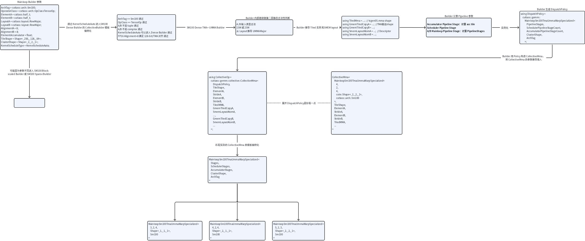
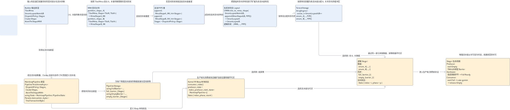
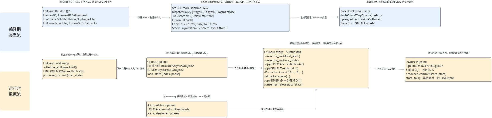
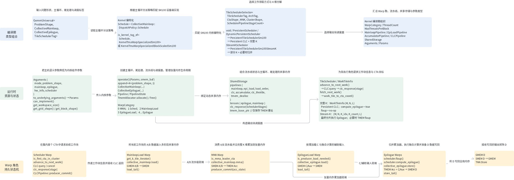
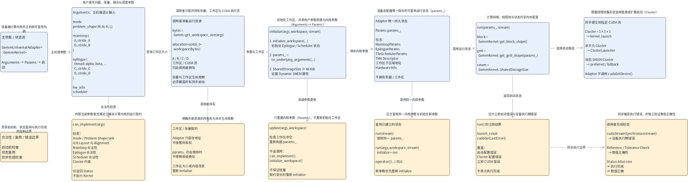

# CUTLASS 3.x (2)：面向 GEMM 内核设计的正交、可复用、可组合的抽象结构

前置阅读：[CUTLASS 3.x (1)：Cutlass 的张量和空间微内核处理多维数据的原则性抽象 - CuTe](https://xiaopeng.feishu.cn/wiki/QJLZwqhRCiZYeBk5eL1cyU5kntg)、[Cutlass NVFP4 GEMM 技术分享](https://xiaopeng.feishu.cn/wiki/S8N2wn26piQePNkBjiNcwFRCnRc)

# 引言

为了构建一套可以兼容不同架构的 GEMM 的通用和融合内核，CUTLASS 设计了一套高性能的模板和抽象库，并且当前的 CUTLASS 3.x 按从设备层到单个 mma 的指令提供了多个层级的 GEMM API。

不像 CPU 的 GEMM，GPU 上的 GEMM 优化是一个互相解耦的模块化问题。高性能实现需要指定矩阵块形状、计算与拷贝指令、warp 特化方案等超参数。这些超参数在很大程度上彼此独立；而且，根据硬件、问题形状或其他用户需求的不同，最佳选择可能有显著差异。本文涉及 CUTLASS 的上层结构，底层的tiled和atom层的api请查阅前文。

在本文讨论的基础 GEMM 中，一个 kernel 需要完成 `D = alpha * A * B + beta * C`。更具体的数据类型、量化参数和数据流，可以参考[《CUTLASS NVFP4 GEMM 技术分享》](https://xiaopeng.feishu.cn/wiki/S8N2wn26piQePNkBjiNcwFRCnRc)以及前置材料中的数据流图。

从一个输出 tile 的角度看，kernel 可以分为 Mainloop 和 Epilogue 两个主要阶段。Mainloop 沿 K 维组织 A、B tile 的加载、同步和 MMA 累加，直到当前 CTA 或 CTA cluster 所负责的输出 tile 完成全部 K 维归约。在本文的 Blackwell SS 示例中，生产者 warp 使用 TMA 把下一流水级的 A、B 数据从 GMEM 加载到 SMEM；与此同时，消费者 warp 读取已经就绪的上一流水级，通过 `tcgen05.mma` 把结果累加到 TMEM。

Epilogue 在当前输出 tile 完成全部 K 维累加后，消费 Mainloop 产生的累加器，执行 `D = alpha * Acc + beta * C`，以及可选的 bias、activation、requantization 等融合操作，最后把结果写回 D。复杂的融合数据流可以通过 EVT 表达。

因此，一个 GEMM kernel 的逻辑数据流可以概括为：`A、B → Mainloop → Accumulator → Epilogue + C → D`。下面将介绍 CUTLASS 如何通过五层 API 构造这一过程。

# CUTLASS 3.x 中新的概念性 GEMM 层次结构

CUTLASS 为 GPU 系统层次结构中不同层级的矩阵乘积累加（MMA）操作提供了一种统一的编程模型。CUTLASS 3.0 提供了相应的 GEMM API，这些 API 按从最高层级到最低层级的顺序对应于以下层级。CUTLASS 3.x 建立了一套独立于具体硬件特性的概念性 GEMM 层次结构（[cutlass/media/docs/cpp/gemm_api_3x.md at main · NVIDIA/cutlass](https://github.com/NVIDIA/cutlass/blob/main/media/docs/cpp/gemm_api_3x.md)）。它由五层组成：


- [Atom 层接口](https://github.com/NVIDIA/cutlass/tree/main/include/cute/atom)：特定于架构的指令及其相关元信息（通常定义一条 MMA  / TMA硬件指令、原始参数及其操作数契约，操作数契约由 `MMA_Traits` / `Copy_Traits` 结构体声明和定义， CuTe 从此结构体得知这条指令的 shape、数据类型和 Thread–Value layout，详细定义见[前文](https://xiaopeng.feishu.cn/wiki/QJLZwqhRCiZYeBk5eL1cyU5kntg)。Atom 将 traits 的 bit layout 按实际数据类型转换成 value layout 供 Tiled MMA/Copy 层消费。）

  - [`cute::MMA_Atom<>`](https://github.com/NVIDIA/cutlass/blob/main/include/cute/atom/mma_atom.hpp)：将一条 mma 指令和 [traits](https://github.com/NVIDIA/cutlass/blob/main/include/cute/atom/mma_traits.hpp)（定义shape、SMEM descriptor、TMEM fragment、thread/value layout） 包装成 atom 的 call、fragment 等统一接口。
  - [`cute::Copy_Atom<>`](https://github.com/NVIDIA/cutlass/blob/main/include/cute/atom/copy_atom.hpp)：对 tma/cp.async 的指令和[ traits](https://github.com/NVIDIA/cutlass/blob/main/include/cute/atom/copy_traits.hpp) （定义 ThrID 线程ID、SrcLayout 搬运来源操作数布局、DstLayout 搬运目标操作数布局、RefLayout 逻辑参考布局）包装成统一接口。
- Tiled MMA/Copy 层接口：**空间微内核**，允许对特定于架构的 atom 进行任意交织与分块（生成 work tile 内部的线程—数据分块（partition） ，然后将Atom层的单个 mma 和 tma 指令在 M/N/K 上重复 Atom）

  - [`cute::TiledMMA<>`](https://github.com/NVIDIA/cutlass/blob/8f50b052e1099fb982392a622caab69b97b63128/include/cute/atom/mma_atom.hpp#L199-L240)：`TiledMma` 将一个 `Mma_Atom` 按指定的 Atom layout、value layout 和 permutation 展开到一组参与计算的线程上。它决定每个逻辑线程负责累加器中的哪些元素，以及一次局部矩阵乘法需要调用底层 MMA operation 多少次。
  - [`cute::TiledCopy<>`](https://github.com/NVIDIA/cutlass/blob/8f50b052e1099fb982392a622caab69b97b63128/include/cute/atom/copy_atom.hpp#L176-L223)：`TiledCopy` 将一个 `Copy_Atom` 展开到一组参与搬运的线程或逻辑参与者上。它决定源张量和目标张量如何分区，以及每个参与者负责搬运哪些元素。
  - 注意：`TiledMma` 负责计算的空间分块，`TiledCopy` 负责数据搬运的空间分块；二者在 Tiled 层仍是独立对象。 Collective 层才把它们与 SMEM layout、流水线阶段、barrier 和 warp specialization 组织在一起。
- Collective 层接口：面向一个输出 tile 的**时间微内核**，它把 `TiledCopy`、`TiledMMA`、流水级和同步机制组织起来，规定数据加载、MMA 累加、后处理与结果写回的执行顺序。

  - [`cutlass::gemm::collective::CollectiveMma<>`](https://github.com/NVIDIA/cutlass/blob/main/include/cutlass/gemm/collective/collective_mma_decl.hpp)：Mainloop Collective，沿 K 维组织 A、B tile 的加载、同步和 MMA 累加，产生当前输出 tile 的累加器。
  - [`cutlass::epilogue::collective::CollectiveEpilogue<>`](https://github.com/NVIDIA/cutlass/tree/main/include/cutlass/epilogue/collective)：Epilogue Collective，消费 Mainloop 产生的累加器，执行 alpha \* Acc + beta \* C、可选融合操作和 D 矩阵写回。
- Kernel 层：面向整个 GEMM 问题空间的无状态设备内核。它组合 `CollectiveMainloop` 和 `CollectiveEpilogue`，把 M/N/L 方向的输出 tile 分配给 threadblock 或 threadblock cluster，并通过 tile scheduler 组织整个 grid 的执行。

  - [`cutlass::gemm::kernel::GemmUniversal<>`](https://github.com/NVIDIA/cutlass/blob/main/include/cutlass/gemm/kernel/gemm_universal_decl.h)：根据问题形状、Mainloop Collective、Epilogue Collective 和可选 Tile Scheduler 构造完整的设备端 GEMM kernel。
- Device 层：面向一次具体 GEMM 调用的有状态主机接口。它将一次具体 GEMM 的问题形状、张量地址、stride、epilogue 和 scheduler 参数转换为 Kernel 所需的运行时状态，并负责合法性检查、workspace 管理和 CUDA kernel 启动。

  - [`cutlass::gemm::device::GemmUniversalAdapter<>`](https://github.com/NVIDIA/cutlass/blob/main/include/cutlass/gemm/device/gemm_universal_adapter.h)：把 `GemmUniversal` 内核包装成主机端 GEMM 句柄，提供 `can_implement`、`get_workspace_size`、`initialize` 和 `run` 等接口。

**代码：从线程块簇到 Atom 的 GEMM 分层执行伪代码**

```C++
// cutlass::gemm::kernel::GemmUniversal: ClusterTileM and ClusterTileN loops
//   are either rasterized by the hardware or scheduled by the kernel in persistent kernels.
// Parallelism over thread block clusters
for (int cluster_m = 0; cluster_m < GemmM; cluster_m += ClusterTileM) {
  for (int cluster_n = 0; cluster_n < GemmN; cluster_n += ClusterTileN) {
    // collective mainloop 层：mainloop that iterates over all k-tiles
    // cutlass::gemm::collective::CollectiveMma
    // No loop unrolling is performed at this stage
    for (int k_tile = 0; k_tile < size<2>(gmem_tensor_A); k_tile++) {
      // Tiled 层
      // loops inside cute::gemm(tiled_mma, a, b, c); Dispatch 5: (V,M,K) x (V,N,K) => (V,M,N)
      // TiledMma uses the hardware instruction provided through its Mma_Atom
      // TiledMma's atom layout, value layout, and permutations define the iteration order
      for (int tiled_mma_k = 0; tiled_mma_k < size<2>(A); tiled_mma_k++) {
        for (int tiled_mma_m = 0; tiled_mma_m < size<1>(A); tiled_mma_m++) {
          for (int tiled_mma_n = 0; tiled_mma_n < size<1>(B); tiled_mma_n++) {
            // TiledMma's vector mode dispatches to the underlying instruction.
            mma.call(d, a, b, c);
          } // tiled_mma_n
        } // tiled_mma_m
      } // tiled_mma_k
    } // k_tile mainloop
  } // cluster_m
} // cluster_n
```

每一层都作为前一层抽象的组合点，并可通过模板参数进行高度定制。用户可以只使用最高层，相信 CUTLASS 的编译期逻辑会给出高性能 GEMM 实现；也可以选择使用层次结构低层暴露的高级修改能力。Atom 和 Tiled MMA/Copy 层提供的空间微内核的抽象属于 CuTe 的范畴，已在[CUTLASS 3.x (1)：Cutlass 的张量和空间微内核处理多维数据的原则性抽象 - CuTe](https://xiaopeng.feishu.cn/wiki/QJLZwqhRCiZYeBk5eL1cyU5kntg)这篇文章中讨论。本文余下内容将介绍高层所提供的 GEMM 时间组织和内核级组织。

后续示例是 NVIDIA Thor/SM110a 上的 CUTLASS 3.x GEMM：A、B 使用 FP16，累加和输出使用 FP32，MMA tile 为 256×128×64，cluster 为 2×2×1。

这里 的CUTLASS C++ Builder 继续使用 `cutlass::arch::Sm100` 选择可复用的 Blackwell TCGen05 配方；CUDA 13.0 及以上则用 `-gencode arch=compute_110a,code=sm_110a` 生成 Thor/SM110a 二进制。以下是一个代码的示例：

**代码：Thor/SM110a 上的 CUTLASS 3.x GEMM 基线类型组合**

```C++
// CUTLASS 配方标签：当前 C++ CollectiveBuilder 复用 Sm100 实现族
using ArchTag = cutlass::arch::Sm100;
using OperatorClass = cutlass::arch::OpClassTensorOp;

using ElementA = cutlass::half_t;
using ElementB = cutlass::half_t;
using ElementC = float;
using ElementD = float;
using ElementAccumulator = float;
using ElementCompute = float;

using LayoutA = cutlass::layout::RowMajor;
using LayoutB = cutlass::layout::RowMajor;
using LayoutC = cutlass::layout::RowMajor;
using LayoutD = cutlass::layout::RowMajor;

static constexpr int AlignmentA = 128 / cutlass::sizeof_bits<ElementA>::value;
static constexpr int AlignmentB = 128 / cutlass::sizeof_bits<ElementB>::value;
static constexpr int AlignmentC = 128 / cutlass::sizeof_bits<ElementC>::value;
static constexpr int AlignmentD = 128 / cutlass::sizeof_bits<ElementD>::value;

using MmaTileShape = cute::Shape<cute::_256, cute::_128, cute::_64>;
using ClusterShape = cute::Shape<cute::_2, cute::_2, cute::_1>;

// 第 1 步：先生成 epilogue，以便为 mainloop 计算 SMEM carveout
using EpilogueOperation = cutlass::epilogue::fusion::LinearCombination<
    ElementD, ElementCompute, ElementC, float,
    cutlass::FloatRoundStyle::round_to_nearest>;

using CollectiveEpilogue = typename cutlass::epilogue::collective::CollectiveBuilder<
    ArchTag, OperatorClass, MmaTileShape, ClusterShape,
    cutlass::epilogue::collective::EpilogueTileAuto,
    ElementAccumulator, ElementCompute,
    ElementC, LayoutC, AlignmentC,
    ElementD, LayoutD, AlignmentD,
    cutlass::epilogue::collective::EpilogueScheduleAuto,
    EpilogueOperation>::CollectiveOp;

// 第 2 步：生成 SM110a 使用的 TCGen05 collective mainloop
using CollectiveMainloop = typename cutlass::gemm::collective::CollectiveBuilder<
    ArchTag, OperatorClass,
    ElementA, LayoutA, AlignmentA,
    ElementB, LayoutB, AlignmentB,
    ElementAccumulator,
    MmaTileShape, ClusterShape,
    cutlass::gemm::collective::StageCountAutoCarveout<
        static_cast<int>(sizeof(typename CollectiveEpilogue::SharedStorage))>,
    cutlass::gemm::collective::KernelScheduleAuto>::CollectiveOp;

// 第 3 步：在 Kernel 层组合 mainloop 与 epilogue
using GemmKernel = cutlass::gemm::kernel::GemmUniversal<
    cute::Shape<int, int, int, int>, // [M, N, K, L]
    CollectiveMainloop,
    CollectiveEpilogue>;

// 第 4 步：生成主机端可复用句柄
using GemmHandle = cutlass::gemm::device::GemmUniversalAdapter<GemmKernel>;

// 使用 CUDA 13.0+ 编译：
// nvcc -std=c++17 --expt-relaxed-constexpr -gencode arch=compute_110a,code=sm_110a ...
```

根据这个代码的实例我们能看到我们在 collectie、kernel、device 层是怎么调用 api 的，具体必要的 api 的调用参数我们将在下面详细讲解。

另外注意 CUTLASS2.x 的 device::Gemm、kernel::Gemm、threadblock::Mma\*、warp::Mma\*、arch::Mma 等接口不要与 3.x 的 GEMM 组件混用。CUTLASS 2.x 的 `threadblock::Mma* → warp::Mma* → arch::Mma` 主要面向由一个 warp 使用线程私有寄存器 fragment 执行同步 MMA 的经典模型。Blackwell 原生 `tcgen05.mma` 则具有 `cta_group::1/2` 协作范围，累加器位于 TMEM，并通过 TMA、SMEM descriptor、warp specialization 和 pipeline barrier 构成异步流水线。因此，TCGen05 kernel 应使用 CUTLASS 3.x 的 `CollectiveMma → TiledMMA → MMA_Atom` 组合模型，而不应把 `tcgen05.mma` 当作可以直接替换传统 `arch::Mma` 的 warp-level 指令。

# Collective 层

## 使用 Collective Builder 构造器构造 GEMM

前文已经从逻辑数据流上把一个输出 tile 的计算分为 mainloop 和 Epilogue 两个阶段，CUTLASS 为 Mainloop 和 Epilogue 分别提供了一个 `CollectiveBuilder` 作为编译期的 Collective 的构建者。普通用户通常不需要直接填写 `CollectiveMma`、`CollectiveEpilogue`、`TiledMMA`、`TiledCopy`、SMEM Layout 和 Dispatch Policy 等底层类型，而是通过 Builder 的通用描述目标架构、数据类型、布局、对齐方式、tile、cluster 和调度要求，由 CUTLASS 在编译期推导出具体的 Collective 类型。

首先，Builder 的编译期类型构造顺序是从 `CollectiveEpilogue` 到 `CollectiveMainloop`。这是因为 Mainloop 的自动流水级推导需要考虑 Epilogue 的 CTA 级共享存储需求。只有先构造 `CollectiveEpilogue`，才能通过 `sizeof(CollectiveEpilogue::SharedStorage)` 得到 Epilogue 所需的 SharedStorage 大小；Mainloop Builder 再将其作为 `StageCountAutoCarveout` 的 carveout，结合目标架构可用的 SMEM 容量和单个 A/B stage 的存储开销，推导剩余共享内存能够容纳的 Mainloop stage 数量。

简单的推导公式大致如下，Layout、padding、swizzle 和对齐带来的开销未被记入：

$$\begin{equation}\begin{split} S_{stage} & = S_{A} + S_{B} + S_{MainloopPipeline::SharedStorage} \\&= sizeof(A) \times M_{tile} \times K_{tile} + sizeof(B) \times N_{tile} \times K_{tile} + S_{pipelnie控制数据}\end{split}\notag\end{equation}$$

$$N_{stage} = \left\lfloor \frac{S_{capacity,reduced} - S_{epilogue carveout} }{ S_{stage} } \right\rfloor$$

### 代码模板

构造 CollectiveEpilogue 时，首先定义 Epilogue 的数学操作。LinearCombination 表达基础的 alpha \* Acc + beta \* C，并根据 ElementD 完成输出类型转换；下面的 INT8 输出配置没有独立的 requant_scale 与 zero_point，因此不等同于完整 Requant：

**代码：定义 INT8 LinearCombination 输出操作（不含完整 Requant）**

```C++
using ElementD = int8_t;
using ElementCompute = float;
using ElementScalar = float;
using EpilogueOperation =
    cutlass::epilogue::fusion::LinearCombination<
        ElementD,       // D 的写回元素类型
        ElementCompute, // alpha、beta 和逐元素计算使用的类型
        ElementC,       // C 的元素类型
        ElementScalar,  // alpha、beta 的标量类型
        cutlass::FloatRoundStyle::round_to_nearest
    >;
```

使用 Epilogue 的 CollectiveBuilder 构造具体的 CollectiveEpilogue 类型：

**代码：构造 CollectiveEpilogue：绑定输出类型、调度与融合操作**

```C++
using CollectiveEpilogue =
    typename cutlass::epilogue::collective::CollectiveBuilder<
        ArchTag,            // Builder 使用它选择对应的 Epilogue 实现族、DispatchPolicy、
                            // TMEM Load、TMA Load/Store 和 SMEM Layout 推导规则。
        OperatorClass,      // OpClassTensorOp 表示 Mainloop 使用 Tensor Core MMA 路径；
                            // OpClassSimt 表示使用普通 CUDA Core 的 SIMT 路径。
        MmaTileShape,       // Mainloop Collective 的逻辑 MMA Tile Shape：
                            // [TileM, TileN, TileK]
                            // 例如 Shape<_256, _128, _64>。
        ClusterShape,       // CTA Cluster 在 M/N/K 方向的形状：
                            // [ClusterM, ClusterN, ClusterK]
                            // 例如 Shape<_2, _2, _1> 表示一个 Cluster 在 M 方向有 2 个 CTA、
                            // N 方向有 2 个 CTA、K 方向有 1 个 CTA，总计 2 * 2 * 1 = 4 个 CTA。
        cutlass::epilogue::collective::EpilogueTileAuto,
                            // 由 Builder 根据 MMA Tile、Accumulator Layout、C/D 类型和
                            // Epilogue Schedule 自动推导每次 Epilogue 处理的 M/N subtile。
        ElementAccumulator, // Mainloop 产生的累加器类型；
                            // Blackwell TCGen05 路径的累加器通常位于 TMEM。
        ElementCompute,     // Epilogue 内部逐元素计算使用的数据类型；
                            // alpha、beta、scale、bias、activation 等通常在该类型中计算。
        ElementC,           // 源矩阵 C 的元素类型，对应 beta * C；
                            // 如果 Epilogue 不读取 C，部分配置可以使用 void。
        LayoutC,            // C 在 GMEM 中的 Layout Tag，例如 RowMajor 或 ColumnMajor；
                            // Builder 会据此推导 StrideC 和 C 的加载方式。
        AlignmentC,         // C 的对齐要求，单位是元素数量而不是字节；
                            // 例如 float 的 128-bit 对齐为 4 个元素。
        ElementD,           // 最终输出矩阵 D 的元素类型；
                            // 例如 float、half_t 或 int8_t。
        LayoutD,            // D 在 GMEM 中的 Layout Tag；
                            // Builder 会据此推导 StrideD、SMEM Layout 和写回方式。
        AlignmentD,         // D 的对齐要求，单位是元素数量；
                            // 修改 ElementD 后需要同步重新计算 AlignmentD。
        cutlass::epilogue::collective::EpilogueScheduleAuto,
                            // 由 Builder 根据架构、Tile、Cluster、C/D 类型和 Fusion Operation
                            // 在编译期选择合法的 Epilogue Schedule，不是运行时 autotuning。
        EpilogueOperation   // 可以替换为预定义 Fusion Operation 或自定义 EVT，
                            // 例如 CustomRequantEVT，以实现自定义 Epilogue 数学操作。
    >::CollectiveOp;
// ::CollectiveOp 是 Builder 根据模板参数推导出来的
// 具体 Epilogue Collective 类型，是编译期类型别名。
```

- cutlass::epilogue 可以把一个 CTA 矩阵块拆分成更小的矩阵块，以便更好地重叠数学运算和拷贝。
- mainloop 输出的累加器现在成为 epilogue 的输入。Epilogue 计算可以使用另一种中间数据类型，由 `ElementCompute` 指定。
- CUTLASS 提供了大量[常见融合操作](https://github.com/NVIDIA/cutlass/blob/e05f953a5b3d38adc240df2ff928e0421c2abba3/include/cutlass/epilogue/fusion/operations.hpp)，例如 `D = activation(alpha * AB + beta * C)`。Thor/SM110a 的 C++ Builder 复用 Blackwell [`sm100_callbacks_tma_warpspecialized.hpp`](https://github.com/NVIDIA/cutlass/blob/e05f953a5b3d38adc240df2ff928e0421c2abba3/include/cutlass/epilogue/fusion/sm100_callbacks_tma_warpspecialized.hpp) 中的 EVT callback 配方；不要把 Hopper 的 `sm90_callbacks...` 文件当作本例的目标实现。Blackwell [示例 71](https://github.com/NVIDIA/cutlass/blob/e05f953a5b3d38adc240df2ff928e0421c2abba3/examples/71_blackwell_gemm_with_collective_builder/71_blackwell_gemm_with_collective_builder.cu) 同时演示了自定义 EVT 与 SM100/TCGen05 mainloop、epilogue schedule 的组合。
- [Epilogue 调度类型](https://github.com/NVIDIA/cutlass/blob/62750a2b75c802660e4894434dc55e839f322277/include/cutlass/epilogue/dispatch_policy.hpp)定义 TMA 和 warp 特化的使用方式。默认的 `EpilogueScheduleAuto` 指示 CUTLASS 尝试推导最佳选项。

Builder中定义的操作也可以自由[选择预定义的 Fusion Operation](https://github.com/NVIDIA/cutlass/blob/main/include/cutlass/epilogue/fusion/operations.hpp) 或者自定义复杂的 [EVT（ Epilogue Visitor Tree）](https://xiaopeng.feishu.cn/wiki/S8N2wn26piQePNkBjiNcwFRCnRc#Ejr8d26cSozV4CxYDcvc0D0PnLe)把计算拆成多个节点。预定义的实例表见Epilogue部分。

在得到 `CollectiveEpilogue` 之后，再用 Builder 构造 Mainloop：

**代码：构造 CollectiveMainloop：预留 Epilogue SMEM 并推导 Stage**

```Markdown
using CollectiveMainloop =
    typename cutlass::gemm::collective::CollectiveBuilder<
        ArchTag,            // Builder 使用它选择对应的 Mainloop 实现族、DispatchPolicy、
                            // TiledMMA、TMA Copy、SMEM Layout 和 Pipeline 推导规则。
        OperatorClass,      // OpClassTensorOp 表示使用 Tensor Core MMA 路径；
                            // OpClassSimt 表示使用普通 CUDA Core 的 SIMT 路径。
        ElementA,           // 矩阵 A 的元素类型，例如 cutlass::half_t。
        LayoutA,            // A 在 GMEM 中的 Layout Tag，例如 RowMajor 或 ColumnMajor；
                            // Builder 会据此推导 StrideA、TMA Load 和 SMEM Layout。
        AlignmentA,         // A 的对齐要求，单位是元素数量而不是字节；
                            // 例如 FP16 的 128-bit 对齐为 8 个元素。
        ElementB,           // 矩阵 B 的元素类型，例如 cutlass::half_t。
        LayoutB,            // B 在 GMEM 中的 Layout Tag；
                            // Builder 会据此推导 StrideB、TMA Load 和 SMEM Layout。
        AlignmentB,         // B 的对齐要求，单位是元素数量；
                            // 例如 FP16 的 128-bit 对齐为 8 个元素。
        ElementAccumulator, // MMA 累加器的元素类型；
                            // 例如 FP16/BF16 GEMM 通常使用 float，
                            // INT8 GEMM 通常使用 int32_t。
        MmaTileShape,       // Mainloop Collective 的逻辑 MMA Tile Shape：
                            // [TileM, TileN, TileK]。
                            // TileM/TileN 表示输出 tile 的范围，
                            // TileK 表示 Mainloop 每次沿 K 维推进的粒度。
        ClusterShape,       // CTA Cluster 在 M/N/K 方向的形状：
                            // [ClusterM, ClusterN, ClusterK]。
                            // Builder 会结合它选择 1SM/2SM MMA 和 Cluster 协作方式。
        cutlass::gemm::collective::StageCountAutoCarveout<
            static_cast<int>(
                sizeof(
                    typename CollectiveEpilogue::SharedStorage
                )
            )
        >,                  // 先为 CollectiveEpilogue 的 SharedStorage 预留 SMEM，
                            // 再根据剩余共享内存和单个 A/B Stage 的开销，
                            // 在编译期推导合法的 Mainloop Stage Count。
        cutlass::gemm::collective::KernelScheduleAuto
                            // 由 Builder 根据架构、数据类型、MMA Tile、Cluster Shape
                            // 和资源约束，在编译期选择合法的 Mainloop Schedule；
                            // 例如 Blackwell 的 1SM/2SM TMA warp-specialized 路径，
                            // 不是运行时 autotuning。
    >::CollectiveOp;
// ::CollectiveOp 是 Builder 根据模板参数推导出来的
// 具体 CollectiveMma / Mainloop Collective 类型，是编译期类型别名。
```

### 架构特化的分派策略选择（编译期决策树）

Mainloop `CollectiveBuilder` 的分派是编译期类型决策树：Builder 根据 `ArchTag`、`OperatorClass`、A/B 数据类型、Layout、Alignment、Tile Shape、Cluster Shape、Stage Count Type 和用户提供的 `KernelSchedule` Tag，匹配一个合法的 Builder 特化，并生成具体的 `DispatchPolicy`。其中：

- [`KernelSchedule`](https://github.com/NVIDIA/cutlass/blob/main/include/cutlass/gemm/dispatch_policy.hpp) 是 Builder 的输入，用于表达或约束 1SM/2SM、TMA/cp.async、Dense、Sparse、Block-scaled、Pointer-array 等执行路径；
- [`DispatchPolicy`](https://github.com/NVIDIA/cutlass/blob/main/include/cutlass/gemm/dispatch_policy.hpp) 是 Builder 的输出，它把最终的架构标签、Pipeline Stage、Cluster Shape 和具体 Schedule 绑定为一个 Mainloop 算法类型；
- [`CollectiveMma<DispatchPolicy,...>`](https://github.com/NVIDIA/cutlass/blob/main/include/cutlass/gemm/collective/collective_mma_decl.hpp) 再根据该 Policy 匹配相应的架构特化实现。

下面是编译期的分派策略模板偏特化路径



Collective 层的架构信息由 `CollectiveBuilder` 的 `ArchTag` 参数传入，Builder 再结合 Stage Count、Cluster Shape 和 Kernel Schedule 构造具体的 `DispatchPolicy`结构体，比如一个能被 thor 接受的 MainloopSm100TmaUmmaWarpSpecializedBlockScaled 如下：

**代码：定义 SM100 Block-Scaled Mainloop 的 DispatchPolicy**

```C++
struct MainloopSm100TmaUmmaWarpSpecializedBlockScaled {
  constexpr static int Stages = Stages_;
  using ClusterShape = ClusterShape_;
  using ArchTag = ArchTag_;
  constexpr static bool IsOverlappingAccum = AccumulatorPipelineStageCount_ == 1;
  using Schedule = KernelTmaWarpSpecializedBlockScaledSm100<SchedulerPipelineStageCount_, AccumulatorPipelineStageCount_>;
};

template<
  int Stages_,
  int SchedulerPipelineStageCount_,
  int AccumulatorPipelineStageCount_,
  class ClusterShape_ = Shape<_1,_1,_1>,
  class ArchTag_ = arch::Sm100
>
```

[GEMM collective](https://github.com/NVIDIA/cutlass/tree/main/include/cutlass/gemm/collective) 文件夹中可以找到特化 collective mainloop 实现的示例。

这些模板参数使用对用户友好的条件进行选择，并据此推导 CollectiveMma 模板所需的低层参数：

- 架构特化：GPU 架构和 MMA 操作符类型，例如 SIMT 或 Tensor Core。（Builder的ArchTag 和 OperatorClass）
- 操作数与累加器信息：操作数和累加器的数据类型，以及操作数在全局内存中的对齐方式和编译期布局信息，例如 row-major 或 column-major。
- 矩阵块形状：用于推导 TiledMma、TiledCopy 对象和 SMEM 布局。
- 调度信息：cluster 形状、流水线阶段数和内核调度都会由调度算法使用。阶段数和内核调度参数提供默认的 Auto 选项，由 CUTLASS 按固定编译期规则为给定架构和参数选择合法的默认方案。

至此，我们已经从用户提供的架构、数据类型、布局、对齐、tile、cluster 和调度参数，得到了具体的 `CollectiveMainloop` 类型。下表列出 `ArchTag = cutlass::arch::Sm100` 时，用户可以显式传给 Mainloop `CollectiveBuilder` 的主要的 `KernelSchedule` 标签，或者说是具体的策略名字。

| KernelSchedule Tag | GEMM 类型 | 数据搬运 | MMA 范围 / Cluster 约束 | 适用场景 |
|-|-|-|-|-|
| `KernelScheduleAuto` | 由 Builder 推导 | 由 Builder 推导 | 根据 Tile、Cluster 和数据类型静态选择 | 希望使用 Builder 默认规则；不是运行时 autotuning |
| `KernelTmaWarpSpecialized1SmSm100` | Dense | TMA | 1SM；一个 CTA 承担 MMA | 基础 Blackwell Dense GEMM |
| `KernelTmaWarpSpecialized2SmSm100` | Dense | TMA | 2SM；需要 peer CTA pair | M tile 较大、适合 CTA-group::2 的 Dense GEMM |
| `KernelWarpSpecialized1SmSm100` | Dense | cp.async / 非 TMA 路径 | 1SM | 不使用 TMA 的 Dense GEMM |
| `KernelMixedTmaCpAsyncWarpSpecialized1SmSm100` | Dense / Mixed Path | TMA + cp.async | 1SM | A、B 或辅助操作数使用不同加载机制 |
| `KernelMixedTmaCpAsyncWarpSpecialized2SmSm100` | Dense / Mixed Path | TMA + cp.async | 2SM；需要 peer CTA pair | 2SM 与混合加载路径组合 |
| `KernelPtrArrayTmaWarpSpecialized1SmSm100` | Grouped / Pointer-array | TMA | 1SM | 每个问题具有独立指针和 Shape |
| `KernelPtrArrayTmaWarpSpecialized2SmSm100` | Grouped / Pointer-array | TMA | 2SM；需要 peer CTA pair | 2SM Grouped/Pointer-array GEMM |
| `KernelTmaWarpSpecialized1SmBlockScaledSm100` | Block-scaled | TMA | 1SM | MXFP/NVFP Scale Factor 路径 |
| `KernelTmaWarpSpecialized2SmBlockScaledSm100` | Block-scaled | TMA | 2SM；需要 peer CTA pair | 2SM Block-scaled GEMM |
| `KernelSparseTmaWarpSpecialized1SmSm100` | Sparse | TMA | 1SM | 结构化稀疏 TCGen05 |
| `KernelSparseTmaWarpSpecialized2SmSm100` | Sparse | TMA | 2SM；需要 peer CTA pair | 2SM Sparse GEMM |

### Builder 的最终输出：CollectiveMma 类型契约

刚刚的 Builder 编译图解释了 `CollectiveBuilder` 如何在编译期选择 Builder 特化、推导 `DispatchPolicy`，并最终生成具体的 `CollectiveMma` 类型。下面展开传入的 `::CollectiveOp` 的类型结构，观察 Builder 最终向 `CollectiveMma` 传入了哪些组件。

对 Mainloop Builder 而言，其输出在结构上可以展开为：

**代码：展开 Builder 输出：显式 CollectiveMma 类型契约**

```Plain Text
// 当前示例：FP16、SM100 TMA + TCGen05 SS、TMEM Accumulator。
using StrideA = cutlass::gemm::TagToStrideA_t<LayoutA>; // RowMajor A 的 CuTe Stride
using StrideB = cutlass::gemm::TagToStrideB_t<LayoutB>; // RowMajor B 的 CuTe Stride

using DispatchPolicy =
    cutlass::gemm::MainloopSm100TmaUmmaWarpSpecialized<
        PipelineStages, SchedulerPipelineStageCount,
        AccumulatorPipelineStageCount, ClusterShape, ArchTag>;
// 绑定 SM100 TMA/TCGen05 实现族、Pipeline Stage、ClusterShape 和 ArchTag。
// 具体 Stage 数由 Builder 在编译期推导，不在这里写死。

using CollectiveMainloopManual =
    cutlass::gemm::collective::CollectiveMma<
        DispatchPolicy,      // 匹配 sm100_mma_warpspecialized.hpp 的偏特化
        MmaTileShape,        // Collective 逻辑 Tile：Shape<_256,_128,_64>

        ElementA, StrideA,   // A：half_t；GMEM 地址映射由 LayoutA 推导
        ElementB, StrideB,   // B：half_t；GMEM 地址映射由 LayoutB 推导

        TiledMMA,            // TCGen05 Atom 的线程/CTA/MNK 空间分块；
                             // 当前 Auto + ClusterM=2 对应 2SM/CTA-group::2

        GmemTiledCopyA,      // A：TMA Load/Multicast/2SM TMA Load 类型
        SmemLayoutAtomA,     // A：满足 Descriptor、Major、Swizzle 的 SMEM Layout
        void,                // SmemCopyAtomA：SS 路径直接读 SMEM Descriptor
        cute::identity,      // TransformA：基础 FP16 路径不做额外转换

        GmemTiledCopyB,      // B：TMA Load/Multicast/2SM TMA Load 类型
        SmemLayoutAtomB,     // B：满足 Descriptor、Major、Swizzle 的 SMEM Layout
        void,                // SmemCopyAtomB：SS 路径直接读 SMEM Descriptor
        cute::identity       // TransformB：基础 FP16 路径不做额外转换
    >;
```

从类型结构上看，Builder 的输出可以归纳为四部分：`DispatchPolicy` 定义架构 Mainloop 与时间调度；`TileShape`、Element 和 Stride 定义问题 Tile 与全局数据契约；`TiledMMA` 定义 MMA 的空间分块；A/B 的 TMA Copy、SMEM Layout、Copy Atom 和 Transform 定义操作数从 GMEM 到 MMA 输入表示的数据路径。

在当前 SMEM-source TCGen05 SS 路径中，`SmemCopyAtomA/B` 为 `void`，因为 A、B 由 TCGen05 通过 SMEM Descriptor 直接读取，不需要经典的 SMEM→RMEM Copy。

因此，Builder 的编译期类型构造可以概括为：

`高层配置 → DispatchPolicy + 数据契约 + TiledMMA + Copy/Layout/Transform → CollectiveMma`

至此，Builder 的职责已经结束。下一节将进入该 `CollectiveMma` 的具体实现，观察它如何把这些编译期组件组织成运行时的 TMA Producer、TCGen05 Consumer、SMEM Pipeline 和 TMEM Accumulator。

## Collective 层：Mainloop

### CollectiveMma 偏特化

前一节已经把 Mainloop Builder 的输出展开为一个具体的 `CollectiveMma` 类型。本节从该类型的类体继续向下分析。本文使用的 SM100 TMA + TCGen05 SS 路径会匹配 [`sm100_mma_warpspecialized.hpp`](https://github.com/NVIDIA/cutlass/blob/main/include/cutlass/gemm/collective/sm100_mma_warpspecialized.hpp) 中的偏特化，其第一模板参数为 [`MainloopSm100TmaUmmaWarpSpecialized`](https://github.com/NVIDIA/cutlass/blob/main/include/cutlass/gemm/dispatch_policy.hpp)。Builder 传入的 [`TiledMma`](https://github.com/NVIDIA/cutlass/blob/main/include/cute/atom/mma_atom.hpp)、TMA Copy 类型和 SMEM Layout 描述空间分块，DispatchPolicy 中的 Stage、Cluster Shape 和内部 Schedule 描述时间组织；`CollectiveMma` 把两者合成为沿 K 维持续执行的异步 Mainloop。

**代码：匹配 SM100 TMA + TCGen05 的 CollectiveMma 偏特化**

```cpp
template<
    int Stages,                  // A/B SMEM Mainloop Pipeline 的流水级数量
    int SchedulerStages,         // CLC/TileScheduler 异步调度流水级数量
    int AccumulatorStages,       // MMA→Epilogue 的 TMEM Accumulator Pipeline 流水级数量
    class ClusterShape,          // CTA Cluster 在 M/N/K 方向的编译期 Shape
    class ArchTag,               // CUTLASS 架构配方标签，例如 cutlass::arch::Sm100
    class TileShape,             // 当前 Collective 处理的逻辑 M/N/K Tile Shape
    class ElementA,              // 矩阵 A 在 GMEM 接口上的逻辑元素类型
    class StrideA,               // 矩阵 A 的 CuTe GMEM Stride，包含 batch 维地址映射
    class ElementB,              // 矩阵 B 在 GMEM 接口上的逻辑元素类型
    class StrideB,               // 矩阵 B 的 CuTe GMEM Stride，包含 batch 维地址映射
    class TiledMma,              // TCGen05 MMA Atom 的 CTA/线程/MNK 空间分块类型
    class GmemTiledCopyA,        // A 的 GMEM→SMEM TMA Load/Multicast Copy 类型
    class SmemLayoutAtomA,       // A 的基础 SMEM Layout Atom，尚未追加 PIPE 维
    class SmemCopyAtomA,         // A 的可选 SMEM→RMEM Copy Atom；当前 SS 路径为 void
    class TransformA,            // A 的可选输入变换；基础 FP16 SS 路径为 identity
    class GmemTiledCopyB,        // B 的 GMEM→SMEM TMA Load/Multicast Copy 类型
    class SmemLayoutAtomB,       // B 的基础 SMEM Layout Atom，尚未追加 PIPE 维
    class SmemCopyAtomB,         // B 的可选 SMEM→RMEM Copy Atom；当前 SS 路径为 void
    class TransformB>            // B 的可选输入变换；基础 FP16 SS 路径为 identity
struct CollectiveMma<
    MainloopSm100TmaUmmaWarpSpecialized<
        Stages, SchedulerStages, AccumulatorStages,
        ClusterShape, ArchTag>,
    TileShape,
    ElementA, StrideA,
    ElementB, StrideB,
    TiledMma,
    GmemTiledCopyA, SmemLayoutAtomA, SmemCopyAtomA, TransformA,
    GmemTiledCopyB, SmemLayoutAtomB, SmemCopyAtomB, TransformB> {
    // SM100 TMA + TCGen05 Mainloop 实现
};
```

进入该偏特化后，源码会再次验证 Builder 输出的组合契约。`TileShape` 必须能够被 `TiledMma` 的空间 Tile 整除，`SmemLayoutAtomA/B` 必须是 Rank-2 并能覆盖 MMA 所需的 A/B Tile，SMEM-source TCGen05 要求 `SmemCopyAtomA/B` 为 `void`，A/B Fragment 类型必须能够表示 UMMA SMEM Descriptor，1SM 与 2SM 路径也必须分别匹配合法的 TMA Load Atom。运行到 [`mma()`](https://github.com/NVIDIA/cutlass/blob/main/include/cutlass/gemm/collective/sm100_mma_warpspecialized.hpp) 时，Accumulator Engine 还会被检查为 TMEM，Layout 则满足 `(MMA, MMA_M, MMA_N)`。Builder 负责生成候选类型，具体偏特化通过这些静态契约确认空间对象、存储路径和硬件指令能够共同工作。

我们的 FP16 示例已经在 Builder 阶段确定 Dense、TMA、2SM、SMEM-source TCGen05 和 FP32 TMEM Accumulator 路径。前一节也已经完成三类 Stage 的编译期推导，是 [`DispatchPolicy`](https://github.com/NVIDIA/cutlass/blob/e05f953a5b3d38adc240df2ff928e0421c2abba3/include/cutlass/gemm/dispatch_policy.hpp#L1023-L1035) 中已经确定的常量，其中[`PipelineStages`](https://github.com/NVIDIA/cutlass/blob/e05f953a5b3d38adc240df2ff928e0421c2abba3/include/cutlass/gemm/collective/builders/sm100_umma_builder.inl#L284-L300) 决定 A/B SMEM Layout 的 PIPE 维和 [`MainloopPipeline`](https://github.com/NVIDIA/cutlass/blob/e05f953a5b3d38adc240df2ff928e0421c2abba3/include/cutlass/pipeline/sm100_pipeline.hpp#L532-L551) 深度；[`AccumulatorPipelineStageCount`](https://github.com/NVIDIA/cutlass/blob/e05f953a5b3d38adc240df2ff928e0421c2abba3/include/cutlass/gemm/collective/builders/sm100_umma_builder.inl#L261-L268) 决定 MMA 与 Epilogue 之间可轮转的 TMEM Accumulator Stage 数；[`SchedulerPipelineStageCount`](https://github.com/NVIDIA/cutlass/blob/e05f953a5b3d38adc240df2ff928e0421c2abba3/include/cutlass/gemm/collective/builders/sm100_umma_builder.inl#L270-L282) 由 Kernel 层用于 CLC 与 TileScheduler Pipeline，相关执行过程留到 Kernel 章节展开。

### 空间布局到多阶段 SMEM Pipeline

`TiledMma` 描述一次 TCGen05 MMA 在 CTA、线程和 M/N/K 数据上的空间覆盖关系。Mainloop 保留这套映射，并在 A/B Layout 后追加 `PIPE` 模式，使同一空间布局对应多个可循环复用的 SMEM Stage。具体偏特化通过 [`SmemLayoutA`](https://github.com/NVIDIA/cutlass/blob/main/include/cutlass/gemm/collective/sm100_mma_warpspecialized.hpp) 和 [`SmemLayoutB`](https://github.com/NVIDIA/cutlass/blob/main/include/cutlass/gemm/collective/sm100_mma_warpspecialized.hpp) 完成这一扩展：



图：`TiledMma`、SMEM Layout 与 Pipeline State 如何共同构成多阶段 A/B SMEM Pipeline。一个逻辑 Stage 同时关联一份 A/B 数据、一组 Full/Empty Barrier，以及 Producer/Consumer Warp 当前持有的 index 与 phase。

**代码：把 A/B SMEM Layout 扩展为多 Stage PIPE 布局**

```cpp
using SmemLayoutA = decltype(
    UMMA::tile_to_mma_shape(
        SmemLayoutAtomA{},
        append(MmaShapeA_MK{}, Int<DispatchPolicy::Stages>{}),
        ...));

using SmemLayoutB = decltype(
    UMMA::tile_to_mma_shape(
        SmemLayoutAtomB{},
        append(MmaShapeB_NK{}, Int<DispatchPolicy::Stages>{}),
        ...));
```

扩展后的逻辑形状为 `A: (MMA, MMA_M, MMA_K, PIPE)` 和 `B: (MMA, MMA_N, MMA_K, PIPE)`，其中 `PIPE = DispatchPolicy::Stages`。`PIPE` 是 SMEM Layout 的编译期模式，表示同一套 MMA 与 SMEM 空间分块在共享内存中对应多份可循环复用的物理 Buffer。运行时，Producer 和 Consumer 分别通过本地 `PipelineState` 推进这些 Buffer：其中 `index` 选择当前访问的物理 Stage，`phase` 区分该 Stage 环形复用前后的不同 Barrier 代次。空间 Layout 决定每个 Stage 内部如何组织数据，`PipelineState` 则决定当前时刻使用哪个 Stage 及其同步代次。

具体偏特化将共享资源拆分为 `TensorStorage` 和 `PipelineStorage`。

- [`TensorStorage`](https://github.com/NVIDIA/cutlass/blob/main/include/cutlass/gemm/collective/sm100_mma_warpspecialized.hpp) 在 TMEM 上按 `SmemLayoutA/B` 分配多阶段 A/B Buffer；
- `PipelineStorage` 是 `MainloopPipeline::SharedStorage`，保存每个物理 Stage 对应的 `FullBarrier` 和 `EmptyBarrier`。这里的 `PipelineStorage` 只保存 CTA/Cluster 共享的 Barrier 对象，不保存 Producer 或 Consumer 当前的 Stage Index 与 Phase。

Kernel 会分别取得 `CollectiveMainloop::TensorStorage` 和 `CollectiveMainloop::PipelineStorage`，再与 Epilogue、Accumulator Pipeline 和 TileScheduler 的共享状态一起排入 Kernel 级 SharedStorage。

**代码：组合 A/B 张量存储与 Mainloop Pipeline 共享状态**

```cpp
struct SharedStorage {
    struct TensorStorage {
        ArrayEngine<
            SmemAllocTypeA,
            cosize_v<SmemLayoutA>> smem_A;

        ArrayEngine<
            SmemAllocTypeB,
            cosize_v<SmemLayoutB>> smem_B;
    } tensors;

    using PipelineStorage =
        typename MainloopPipeline::SharedStorage;

    PipelineStorage pipeline;
};
```

`MainloopPipeline` 使用 [`PipelineTmaUmmaAsync`](https://github.com/NVIDIA/cutlass/blob/main/include/cutlass/pipeline/sm100_pipeline.hpp) 实现 A/B Stage 的 Producer/Consumer 协议。这个类型绑定 `DispatchPolicy::Stages`、Cluster Shape 和 MMA Atom 的 CTA 参与范围，并通过 `MainloopPipeline::PipelineState` 暴露对应的运行时状态类型：

**代码：定义 MainloopPipeline 与运行时 PipelineState 类型**

```cpp
using MainloopPipeline =
    cutlass::PipelineTmaUmmaAsync<
        DispatchPolicy::Stages,
        ClusterShape,
        AtomThrShapeMNK>;

using MainloopPipelineState =
    typename MainloopPipeline::PipelineState;
```

Kernel 随后创建两份相互独立的本地状态：MainloopLoad Producer 使用 `mainloop_pipe_producer_state`，MMA Consumer 使用 `mainloop_pipe_consumer_state`。这些状态是 Kernel 的局部变量，通常驻留在参与线程的寄存器中，不属于 SMEM 中的 `PipelineStorage`：

**代码：初始化 TMA Producer 与 MMA Consumer 的 PipelineState**

```Plain Text
// MMA Consumer 当前持有的 Stage 游标
MainloopPipelineState mainloop_pipe_consumer_state{};

// TMA Load Producer 当前持有的 Stage 游标
MainloopPipelineState mainloop_pipe_producer_state =
    cutlass::make_producer_start_state<
        MainloopPipeline>();
```

[`PipelineState`](https://github.com/NVIDIA/cutlass/blob/main/include/cutlass/pipeline/sm90_pipeline.hpp) 内部记录：

**代码：PipelineState：物理 Stage、Barrier 代次与推进计数**

```Plain Text
PipelineState {
    index,  // 当前物理 Stage
    phase,  // 当前期望的 Barrier 代次
    count   // 已经推进的逻辑 Stage 数
};
```

对于某个状态 `state`，`state.index()` 同时选择当前的 A/B Buffer 和对应的 Barrier：

**代码：用 Stage 索引绑定 A/B Buffer 与 Full/Empty Barrier**

```Plain Text
smem_A[..., state.index()]
smem_B[..., state.index()]

full_barrier_[state.index()]
empty_barrier_[state.index()]
```

当 `index` 从最后一个 Stage 回绕到 `0` 时，`phase` 翻转。这样，同一份物理 SMEM Buffer 和同一对 Barrier 就能够被下一轮 Pipeline 安全复用，而不会把上一轮留下的 Barrier 状态误认为当前数据已经 Ready。

### Arguments、Params 与 Tiled 数据划分

[`Arguments`](https://github.com/NVIDIA/cutlass/blob/main/include/cutlass/gemm/collective/sm100_mma_warpspecialized.hpp) 保存用户提供的 A/B Pointer、Stride 和可选运行时数据类型。[`to_underlying_arguments()`](https://github.com/NVIDIA/cutlass/blob/main/include/cutlass/gemm/collective/sm100_mma_warpspecialized.hpp) 将它们与 Problem Shape、Tile Shape、Cluster Layout、TiledMma 和 SMEM Layout 合并，构造设备端 [`Params`](https://github.com/NVIDIA/cutlass/blob/main/include/cutlass/gemm/collective/sm100_mma_warpspecialized.hpp) 中的 `TMA_A`、`TMA_B` 及 fallback descriptor。Builder 决定 TMA 类型，`Arguments → Params` 转换则把某一次 GEMM 的实际地址和 Shape 写入描述符。

**代码：Arguments 到 TMA Descriptor 与 Params 的构造链路**

```text
Pointer + Stride + ProblemShape
    ↓
CuTe GMEM Tensor
    ↓
TileShape + TiledMma + Cluster Layout
    ↓
TMA Descriptor / TMA Atom
    ↓
CollectiveMma::Params
```

设备端的 [`load_init()`](https://github.com/NVIDIA/cutlass/blob/main/include/cutlass/gemm/collective/sm100_mma_warpspecialized.hpp) 首先从 TMA Params 建立完整的 GMEM Tensor，再使用 `local_tile` 取得当前 Collective 对应的 A/B Tile。随后，[`TiledMma::get_slice()`](https://github.com/NVIDIA/cutlass/blob/main/include/cute/atom/mma_atom.hpp) 根据当前 CTA 在 1SM 或 2SM MMA 中的位置生成 CTA Slice，`partition_A()` 与 `partition_B()` 将 TiledMma 的空间映射应用到全局 Tile。最后，[`tma_partition()`](https://github.com/NVIDIA/cutlass/blob/main/include/cute/atom/copy_traits_sm90_tma.hpp) 将 GMEM Source View、SMEM Destination View、Cluster Layout 和 Multicast Mask 连接起来。

**代码：按 CTA Slice 划分 A/B Tile 并建立 TMA 分区**

```cpp
ThrMMA cta_mma = TiledMma{}.get_slice(
    blockIdx.x % size(typename TiledMma::AtomThrID{}));

Tensor tCgA_mkl = cta_mma.partition_A(gA_mkl);
Tensor tCgB_nkl = cta_mma.partition_B(gB_nkl);

auto [tAgA_mkl, tAsA] = tma_partition(...);
auto [tBgB_nkl, tBsB] = tma_partition(...);
```

[`mma_init()`](https://github.com/NVIDIA/cutlass/blob/main/include/cutlass/gemm/collective/sm100_mma_warpspecialized.hpp) 从同一份多阶段 SMEM Tensor 构造 `tCrA` 与 `tCrB`。当前 SS 路径中的 `SmemCopyAtomA/B` 为 `void`，A/B 数据保持在 SMEM，`tCrA/tCrB` 提供按 `read_stage` 和 `k_block` 访问 UMMA SMEM Descriptor 的 Fragment View。TCGen05 通过 Descriptor 读取 A/B，FP32 累加结果驻留于 TMEM。

### Producer/Consumer 状态机与 TCGen05 MMA

运行时的 Warp Role 由 [`sm100_gemm_tma_warpspecialized.hpp`](https://github.com/NVIDIA/cutlass/blob/main/include/cutlass/gemm/kernel/sm100_gemm_tma_warpspecialized.hpp) 分配。Kernel 创建一个共享的 `CollectiveMainloop` 对象，并把 Warp 划分为 `Sched`、`MainloopLoad`、`MMA`、`EpilogueLoad` 和 `Epilogue`。MainloopLoad Warp 作为 `MainloopPipeline` Producer 调用 [`load()`](https://github.com/NVIDIA/cutlass/blob/main/include/cutlass/gemm/collective/sm100_mma_warpspecialized.hpp)，MMA Warp 作为 Consumer 调用 [`mma()`](https://github.com/NVIDIA/cutlass/blob/main/include/cutlass/gemm/collective/sm100_mma_warpspecialized.hpp)。Collective 定义两条接口及其依赖协议，Kernel 将具体 Warp 映射到这些接口。

**代码：MainloopLoad 与 MMA Warp 的 CollectiveMma 调用接口**

```cpp
// MainloopLoad Warp
collective_mainloop.load(
    mainloop_pipeline,
    producer_state,
    load_inputs,
    cta_coord_mnkl,
    k_tile_iter,
    k_tile_count);

// MMA Warp
collective_mainloop.mma(
    {mainloop_pipeline, accumulator_pipeline},
    {consumer_state, accumulator_producer_state},
    accumulator,
    mma_inputs,
    cta_coord_mnkl,
    k_tile_count);
```

`load()` 先通过 [`producer_try_acquire()`](https://github.com/NVIDIA/cutlass/blob/main/include/cutlass/pipeline/sm100_pipeline.hpp) 与 [`producer_acquire()`](https://github.com/NVIDIA/cutlass/blob/main/include/cutlass/pipeline/sm100_pipeline.hpp) 等待 Empty Barrier，取得可写的 `write_stage` 后，把该 Stage 的 Transaction Barrier 与 A/B TMA Copy 绑定。TMA 发射完成后，Producer 推进自身 Stage State，继续准备后续 K tile。MMA Warp 使用 [`consumer_try_wait()`](https://github.com/NVIDIA/cutlass/blob/main/include/cutlass/pipeline/sm100_pipeline.hpp) 与 [`consumer_wait()`](https://github.com/NVIDIA/cutlass/blob/main/include/cutlass/pipeline/sm100_pipeline.hpp) 等待 Full Barrier，取得 `read_stage` 后，沿 Stage 内部的 MMA_K 模式调用 [`cute::gemm()`](https://github.com/NVIDIA/cutlass/blob/main/include/cute/algorithm/gemm.hpp)：

**代码：消费当前 SMEM Stage 并执行 TCGen05 MMA**

```cpp
cute::gemm(
    tiled_mma,
    tCrA(_, _, k_block, read_stage),
    tCrB(_, _, k_block, read_stage),
    accumulators);
```

第一次 TCGen05 MMA 将 `tiled_mma.accumulate_` 设为 `UMMA::ScaleOut::Zero`，建立当前输出 Tile 的初始累加结果；后续 K block 切换为 `UMMA::ScaleOut::One`，执行 `Acc = A × B + Acc`。当前 Stage 的全部 K block 消费完成后，[`consumer_release()`](https://github.com/NVIDIA/cutlass/blob/main/include/cutlass/pipeline/sm100_pipeline.hpp) 更新 Empty Barrier，Producer 随后可以复用该物理 SMEM Stage。

完整 Mainloop 依次经历 Prologue、Steady State 和 Tail。Prologue 先填充最多 `MainloopPipeline::Stages` 个 K tile，使 Consumer 尽早获得首个 Ready Stage；Steady State 中，MainloopLoad Warp 在一个 Stage 上加载未来 K tile，MMA Warp 在另一个 Stage 上执行 TCGen05，两条状态并发推进；Tail 阶段停止发射新 TMA，并通过 [`load_tail()`](https://github.com/NVIDIA/cutlass/blob/main/include/cutlass/gemm/collective/sm100_mma_warpspecialized.hpp) 等待所有 Stage 被 Consumer 释放。单个 Stage 的生命周期为 `Empty → ProducerWriting → Ready → ConsumerReading → Empty`，Stage Index 指向物理 Buffer，Phase 区分 Pipeline 回绕前后的数据代次。

### TMEM Accumulator 与 Epilogue 交接

A/B Mainloop Pipeline 连接 MainloopLoad Warp 与 MMA Warp；完整 Kernel 还通过 [`PipelineUmmaAsync`](https://github.com/NVIDIA/cutlass/blob/main/include/cutlass/pipeline/sm100_pipeline.hpp) 建立 Accumulator Pipeline，连接 MMA Warp 与 Epilogue Warp。MMA Warp 在写入某个 TMEM Accumulator Stage 前取得 Producer 权限，完成当前输出 Tile 的全部 K 维累加后执行 `producer_commit()`；Epilogue Warp 等待对应 Stage 进入 Ready，读取 Accumulator 并在处理结束后释放该 Stage。两条 Pipeline 串联为 `GMEM A/B → SMEM Stage → MMA Warp → TMEM Accumulator Stage → Epilogue Warp`，分别保护 A/B SMEM Buffer 和 TMEM Accumulator Buffer。

**代码：定义 MMA 到 Epilogue 的 TMEM Accumulator Pipeline**

```cpp
using AccumulatorPipeline =
    cutlass::PipelineUmmaAsync<
        AccumulatorPipelineStageCount,
        AtomThrShapeMNK>;
```

1SM 与 2SM 路径复用同一协作框架，差异体现在 `TiledMma::AtomThrID`、TMA Copy Atom、TMEM Allocator 和 Cluster Mask。当前 `ClusterShape = Shape<_2,_2,_1>` 与 Auto Schedule 会进入 2SM 路径，两个 peer CTA 分别取得 TiledMma Slice，2SM TMA Load 与 Multicast 规则负责 A/B 数据分发，Kernel 使用 2SM TMEM Allocator 管理累加器地址。Stage、Barrier 和 Accumulator Pipeline 继续按照相同的 Producer/Consumer 协议推进。

Mainloop 结束时，A/B SMEM Stage 已按 Pipeline 协议完成释放，当前输出 Tile 的完整 K 维累加结果位于一个 Ready 的 TMEM Accumulator Stage。Accumulator Pipeline 将该 Stage 的所有权从 MMA Warp 转交给 Epilogue Warp。下一节从这一状态继续分析 `CollectiveEpilogue` 如何读取 TMEM Accumulator、执行 FusionCallbacks（管理 Epilogue 内部的融合计算流程，具体后面讲）/EVT，并把最终结果写入 D。

## Collective 层：Epilogue

Mainloop 完成当前输出 Tile 的全部 K 维累加后，Accumulator Pipeline 将一个 Ready 的 TMEM Stage 交给 Epilogue Warp。`CollectiveEpilogue` 从这里继续：它把 CTA Tile 切分为若干 `EpilogueTile`，让 EpilogueLoad Warp 提前加载 C，让 Epilogue Warp 分块读取 TMEM Accumulator，在寄存器中执行 FusionCallbacks，并经由 SMEM 发射 TMA Store 写回 D。一次 Epilogue 对应一个已经完成 K 维归约的输出 Tile；内部循环处理的是这个输出 Tile 的 M/N Subtile。

### CollectiveEpilogue 偏特化与类型契约

前面的 Epilogue Builder 最终产生一个具体的 [`CollectiveEpilogue`](https://github.com/NVIDIA/cutlass/blob/8f50b052e1099fb982392a622caab69b97b63128/include/cutlass/epilogue/collective/sm100_epilogue_tma_warpspecialized.hpp#L70-L101)[ 偏特化](https://github.com/NVIDIA/cutlass/blob/8f50b052e1099fb982392a622caab69b97b63128/include/cutlass/epilogue/collective/sm100_epilogue_tma_warpspecialized.hpp#L70-L101)。本节源码链接固定到 CUTLASS commit `8f50b052e1099fb982392a622caab69b97b63128`。第一模板参数 `Sm100TmaWarpSpecialized` 给出 C/D Stage 数、一次 Visitor 处理的 Fragment 大小、C/D 是否复用同一片 SMEM，以及 TMA Store 是否延后一轮发射；其余模板参数分别描述 CTA/Epilogue 空间分块、C/D 接口、FusionCallbacks 和 TMEM/SMEM/GMEM 之间的 Copy Atom。

**代码：SM100 CollectiveEpilogue 偏特化的模板参数与类型契约**

```cpp
template<
    int StagesC,                  // C 的 GMEM→SMEM Pipeline Stage 数
    int StagesD,                  // D 的 SMEM→GMEM TMA Store 并发深度
    int FragmentSize,             // 每次 FusionCallbacks::visit 处理的元素数
    bool ReuseSmemC,              // C 与 D 是否复用同一片 Epilogue SMEM
    bool DelayTmaStore,           // 是否把当前 Subtile 的 TMA Store 延后一轮发射
    class CtaTileShape,            // 当前 CTA 输出 Tile 的 M/N/K Shape
    class EpilogueTile,            // 一次 Epilogue 循环处理的 M/N Subtile
    class ElementC, class StrideC, // 源矩阵 C 的元素类型与 GMEM Stride
    class ElementD, class StrideD, // 目标矩阵 D 的元素类型与 GMEM Stride
    class FusionCallbacks,         // 逐 Fragment 计算及可选归约/辅助张量回调
    class CopyOpT2R,               // TMEM Accumulator → RMEM
    class CopyOpG2S,               // GMEM C → SMEM C，通常为 TMA Load
    class SmemLayoutAtomC,         // C 的基础 SMEM Layout Atom
    class CopyOpS2R,               // SMEM C → RMEM
    class CopyOpS2G,               // SMEM D → GMEM D，通常为 TMA Store
    class SmemLayoutAtomD,         // D 的基础 SMEM Layout Atom
    class CopyOpR2S,               // RMEM D → SMEM D
    class CopyOpR2R>               // 计算类型到存储类型的可选寄存器重排
class CollectiveEpilogue<
    Sm100TmaWarpSpecialized<
        StagesC, StagesD, FragmentSize,
        ReuseSmemC, DelayTmaStore>,
    CtaTileShape, EpilogueTile,
    ElementC, StrideC,
    ElementD, StrideD,
    FusionCallbacks,
    CopyOpT2R, CopyOpG2S, SmemLayoutAtomC, CopyOpS2R,
    CopyOpS2G, SmemLayoutAtomD, CopyOpR2S, CopyOpR2R>;
```

[`SM100 CollectiveBuilder`](https://github.com/NVIDIA/cutlass/blob/8f50b052e1099fb982392a622caab69b97b63128/include/cutlass/epilogue/collective/builders/sm100_builder.inl#L1616-L1657) 先选择 1SM 或 2SM 的 Epilogue Schedule，再交给 `Sm100TmaBuilderImpl` 推导 `EpilogueTile`、`DispatchPolicy`、`FusionCallbacks`、TMEM Load Op、TMA Copy Op、SMEM Layout 与寄存器 Copy Op。Builder 的最终输出把这些类型逐项写入 [`CollectiveEpilogue<...>`](https://github.com/NVIDIA/cutlass/blob/8f50b052e1099fb982392a622caab69b97b63128/include/cutlass/epilogue/collective/builders/sm100_builder.inl#L1335-L1353)。进入偏特化后，源码继续检查 `EpilogueTile` 必须是 Rank-2、`StagesC/StagesD` 至少为 1、Accumulator Engine 必须驻留于 TMEM，并要求 Accumulator 的空间 Layout 与当前 CTA Tile 匹配。

### EpilogueTile、C/D SMEM 与三条 Pipeline

`EpilogueTile` 是 Epilogue 的基本处理粒度。CTA 输出 Tile 先沿 M/N 方向被 `flat_divide` 成多个 Subtile；每个 Subtile 再按 `CopyOpT2R` 划分给 128 个 Epilogue 线程。[`SmemLayoutC`](https://github.com/NVIDIA/cutlass/blob/8f50b052e1099fb982392a622caab69b97b63128/include/cutlass/epilogue/collective/sm100_epilogue_tma_warpspecialized.hpp#L151-L168)[ 与 ](https://github.com/NVIDIA/cutlass/blob/8f50b052e1099fb982392a622caab69b97b63128/include/cutlass/epilogue/collective/sm100_epilogue_tma_warpspecialized.hpp#L151-L168)[`SmemLayoutD`](https://github.com/NVIDIA/cutlass/blob/8f50b052e1099fb982392a622caab69b97b63128/include/cutlass/epilogue/collective/sm100_epilogue_tma_warpspecialized.hpp#L151-L168) 在单个 Subtile 的空间 Layout 后追加 PIPE 维，因此 C Load 与 D Store 可以在不同 Stage 上并发推进。



图：SM100 `CollectiveEpilogue` 的编译期类型与运行时数据流。C Load Pipeline、Accumulator Pipeline 和 D Store Pipeline 在 Epilogue Warp 的 Subtile 循环处汇合，FusionCallbacks 只处理寄存器 Fragment 上的计算和可选归约。

这条路径同时使用三套状态。[`LoadPipeline`](https://github.com/NVIDIA/cutlass/blob/8f50b052e1099fb982392a622caab69b97b63128/include/cutlass/epilogue/collective/sm100_epilogue_tma_warpspecialized.hpp#L195-L219) 是 `PipelineTransactionAsync<StagesC>`，连接 EpilogueLoad Warp 与 Epilogue Warp；Accumulator Pipeline 由 Kernel 创建，连接 MMA Warp 的 TMEM 写入与 Epilogue Warp 的 TMEM 读取；`StorePipeline` 是 `PipelineTmaStore`，限制在途 TMA Store 数量，并控制 D 的 SMEM Stage 何时可以复用。三者各自持有 `PipelineState`，所以 C Stage、TMEM Accumulator Stage 与 D Stage 可以独立轮转。

**代码：C Load、D Store Pipeline 与 Epilogue SharedStorage**

```cpp
using LoadPipeline  = PipelineTransactionAsync<StagesC>;
using StorePipeline = conditional_t<
    ReuseSmemC,
    PipelineTmaStore<StagesC, StagesD - 1>,
    PipelineTmaStore<StagesD>>;

struct SharedStorage {
    struct TensorStorage {
        // ReuseSmemC=true 时，smem_C 与 smem_D 位于同一个 union 中
        CollectiveStorage collective;
        typename FusionCallbacks::SharedStorage thread;
    } tensors;

    typename LoadPipeline::SharedStorage pipeline;
};
```

`ReuseSmemC` 为真时，C 和 D 的 Buffer 通过 union 占用同一片共享内存。Epilogue Warp 只有在完成 `SMEM C → RMEM` 后才能把对应物理 Stage 改作 D Buffer；而 D 的 TMA Store 完成之前，这个 Stage 又不能返回给 EpilogueLoad Warp。源码用 Load Pipeline 的 Consumer Release 和 Store Pipeline 的在途 Store 计数共同维持这条复用链路。

### Arguments、Params 与 Warp 分工

[`Arguments`](https://github.com/NVIDIA/cutlass/blob/8f50b052e1099fb982392a622caab69b97b63128/include/cutlass/epilogue/collective/sm100_epilogue_tma_warpspecialized.hpp#L226-L318) 保存 FusionCallbacks 的运行时参数、C/D Pointer 与 Stride；`to_underlying_arguments()` 把它们转换成设备端 `Params`，其中包括 FusionCallbacks Params、C 的 TMA Load Descriptor 和 D 的 TMA Store Descriptor。C 的逻辑类型为 `void` 时不会构造有效的 C Load 路径，FusionCallbacks 也可以根据 `beta`、Aux 输入或具体 Operation 判断某次执行是否需要 Producer Load。

**代码：CollectiveEpilogue 的 Arguments → Params 参数降级**

```cpp
struct Arguments {
    typename FusionCallbacks::Arguments thread;
    ElementC const* ptr_C;
    StrideC dC;
    ElementD* ptr_D;
    StrideD dD;
};

struct Params {
    typename FusionCallbacks::Params thread;
    TMA_C tma_load_c;
    TMA_D tma_store_d;
};
```

Kernel 把 Epilogue 工作拆给两个 Warp Category。[`EpilogueLoad`](https://github.com/NVIDIA/cutlass/blob/8f50b052e1099fb982392a622caab69b97b63128/include/cutlass/gemm/kernel/sm100_gemm_tma_warpspecialized.hpp#L136-L146) 使用 1 个 Warp 调用 [`collective_epilogue.load()`](https://github.com/NVIDIA/cutlass/blob/8f50b052e1099fb982392a622caab69b97b63128/include/cutlass/gemm/kernel/sm100_gemm_tma_warpspecialized.hpp#L806-L865)，为各个 Subtile 发射 C 和 Fusion Aux 的异步 Load；`Epilogue` 使用 `CollectiveEpilogue::ThreadCount = 128`，也就是 4 个 Warp，调用 [`collective_epilogue.store()`](https://github.com/NVIDIA/cutlass/blob/8f50b052e1099fb982392a622caab69b97b63128/include/cutlass/gemm/kernel/sm100_gemm_tma_warpspecialized.hpp#L868-L953) 消费 C 与 Accumulator、运行 Fusion 并写回 D。Warp 分工由 Kernel 确定，CollectiveEpilogue 提供两条接口以及它们共享的 Pipeline 协议。

### Epilogue Subtile 循环与状态推进

[`load()`](https://github.com/NVIDIA/cutlass/blob/8f50b052e1099fb982392a622caab69b97b63128/include/cutlass/epilogue/collective/sm100_epilogue_tma_warpspecialized.hpp#L460-L549) 先取得当前 CTA 的 C Tile，再按 `EpilogueTile` 划分为 `gC_epi`。每次循环通过 `producer_acquire()` 取得一个空闲 C Stage，把该 Stage 的 Transaction Barrier 绑定到 TMA Load，然后执行 FusionCallbacks 的 Producer Load Hook。[`store()`](https://github.com/NVIDIA/cutlass/blob/8f50b052e1099fb982392a622caab69b97b63128/include/cutlass/epilogue/collective/sm100_epilogue_tma_warpspecialized.hpp#L573-L955) 在同一 Subtile 次序上推进三套状态：等待 C Load Ready，等待 TMEM Accumulator Ready，执行 Fragment 计算，把 D 写入当前 SMEM Store Stage，最后提交 TMA Store。

**代码：Epilogue Subtile 循环中的三路等待、Fusion 与 D Store**

```cpp
// 对每个 (epi_m, epi_n) Subtile：
load_pipeline.consumer_wait(load_state);     // C/Aux 已进入 SMEM
acc_pipeline.consumer_wait(acc_state);       // 完整 K 维 Acc 已进入 TMEM

copy(tiled_s2r, smem_C[load_state.index()], rC);
copy(tiled_t2r, tmem_Acc[acc_state.index()], rAcc);

for (int epi_v = 0; epi_v < FragmentCount; ++epi_v) {
    rD[epi_v] = callbacks.visit(rAcc[epi_v], epi_v, epi_m, epi_n);
}

callbacks.reduce(...);                       // 可选行/列归约
copy(tiled_r2s, rD, smem_D[store_state.index()]);
callbacks.postreduce(...);
copy(tma_store_d, smem_D[store_state.index()], gmem_D_subtile);
store_pipeline.producer_commit(store_state);
```

Accumulator Stage 的释放点位于最后一次 TMEM Load 之后，而 D Store 的完成发生得更晚。这样 MMA Warp 可以在 Epilogue 完成 Fusion 与 GMEM Store 之前复用已经读完的 TMEM Stage。`store_tail()` 负责等待最后一批 TMA Store，并在 C/D 复用 SMEM 时补齐尚未执行的 Load Pipeline Release。这个时间关系说明了 Epilogue 的吞吐来源：C/Aux Load、TMEM Accumulator 读取、寄存器计算和 D TMA Store 在不同 Subtile 上重叠。

### FusionCallbacks 与 EVT 的职责边界

Epilogue Builder 的最后一个输入既可以是预定义的 `FusionOperation`，也可以是已经构造好的回调类型。[`CallbacksBuilder`](https://github.com/NVIDIA/cutlass/blob/8f50b052e1099fb982392a622caab69b97b63128/include/cutlass/epilogue/collective/collective_builder.hpp#L75-L111) 对这两种输入作编译期分流：传入 `LinearCombination`、`LinCombEltAct` 等 Operation Tag 时，它根据 DispatchPolicy、CTA Tile 和 EpilogueTile 实例化架构特化的 `FusionCallbacks`；传入自定义 EVT 或回调类型时，Builder 直接透传该类型。

**代码：CallbacksBuilder 对预定义 Operation 与自定义 EVT 的分流**

```cpp
// 预定义 Operation Tag：由 Builder 生成架构特化回调
using Callbacks = fusion::FusionCallbacks<
    DispatchPolicy, FusionOp, CtaTileShape, EpilogueTile>;

// 自定义 EVT / 回调：直接作为 CollectiveEpilogue 的 FusionCallbacks
using Callbacks = UserProvidedCallbacks;
```

`FusionCallbacks` 管理 Epilogue 内部的融合计算流程，包括标量或辅助张量加载、每个 Fragment 的 `visit()`、可选归约以及 Aux 输出；`CollectiveEpilogue` 继续负责 TMEM Accumulator 读取、C 的 TMA/SMEM Pipeline、EpilogueTile 划分、同步以及 D 的 TMA Store。源码提供 `begin`、`begin_loop`、`previsit`、`visit`、`reduce`、`postreduce`、`tma_store`、`end_loop` 和 `end` 等 Hook，使 EVT 节点能够嵌入 CollectiveEpilogue 已经建立的数据流，而无需重新实现整套 Epilogue。

### 预定义 Fusion Operation

| Fusion Operation | 数学表达式 | 相比基础 Accumulator 增加的输入 | 主要用途 |
|-|-|-|-|
| `ScaledAcc` | `D = alpha * Acc` | 标量 `alpha` | 不读取 C，只对 Mainloop 累加器进行缩放并写回 D |
| `LinearCombination` | `D = alpha * Acc + beta * C` | 标量 `alpha`、`beta` 和源矩阵 C | 最基础、最常用的 GEMM Epilogue |
| `LinCombEltAct` | `D = activation(alpha * Acc + beta * C)` | `alpha`、`beta`、C 和 `ActivationFn` | 在线性组合之后融合 ReLU、GELU、SiLU、Clamp 等逐元素激活函数 |
| `LinCombPerRowBias` | `D[m,n] = alpha * Acc[m,n] + beta * C[m,n] + Bias[m]` | Per-row Bias | 为输出矩阵的每一行广播不同的 Bias |
| `LinCombPerColBias` | `D[m,n] = alpha * Acc[m,n] + beta * C[m,n] + Bias[n]` | Per-column Bias | 为输出矩阵的每一列或输出通道广播不同的 Bias |
| `LinCombPerRowBiasEltAct` | `D[m,n] = activation(alpha * Acc[m,n] + beta * C[m,n] + Bias[m])` | Per-row Bias 和 `ActivationFn` | 融合行 Bias 与逐元素激活函数 |
| `LinCombPerColBiasEltAct` | `D[m,n] = activation(alpha * Acc[m,n] + beta * C[m,n] + Bias[n])` | Per-column Bias 和 `ActivationFn` | 常用于 GEMM + 通道 Bias + Activation |
| `PerRowLinCombPerRowBiasEltAct` | `D[m,n] = activation(alpha[m] * Acc[m,n] + beta[m] * C[m,n] + Bias[m])` | Per-row `alpha`、Per-row `beta`、Per-row Bias 和 `ActivationFn` | 每一行使用独立 scale、residual scale 和 Bias |
| `PerColLinCombPerColBiasEltAct` | `D[m,n] = activation(alpha[n] * Acc[m,n] + beta[n] * C[m,n] + Bias[n])` | Per-column `alpha`、Per-column `beta`、Per-column Bias 和 `ActivationFn` | 每个输出通道使用独立 scale、residual scale 和 Bias，适合 per-channel quantization |
| `ScaledLinCombPerRowBiasEltAct` | `Z[m,n] = scale_a * scale_b * alpha * Acc[m,n] + scale_c * beta * C[m,n] + Bias[m]`；普通输出：`D = activation(Z)`；FP8 输出：`D = scale_d * activation(Z)` | `scale_a`、`scale_b`、`scale_c`、`scale_d`、Per-row Bias 和 `ActivationFn` | 融合输入反量化比例、C 的比例、Bias、Activation 和输出缩放 |
| `ScaledLinCombPerColBiasEltAct` | `Z[m,n] = scale_a * scale_b * alpha * Acc[m,n] + scale_c * beta * C[m,n] + Bias[n]`；普通输出：`D = activation(Z)`；FP8 输出：`D = scale_d * activation(Z)` | `scale_a`、`scale_b`、`scale_c`、`scale_d`、Per-column Bias 和 `ActivationFn` | 适合带 per-channel Bias、输出缩放和 Activation 的量化 GEMM |

### 自定义 EVT 与 Requant

预定义 Operation 无法表达目标量化格式时，可以把 Requant 写成自定义 EVT。以 `D = saturate_round(requant_scale × (alpha × Acc + beta × C) + zero_point)` 为例，Accumulator、C、alpha、beta、requant_scale 和 zero_point 分别作为叶节点，Multiply/Add 组成中间节点，根节点完成目标整数类型的舍入与饱和转换。EVT 的后序遍历保证子节点先产生 Fragment，父节点再消费这些结果。

**代码：Requant EVT 的后序求值树与量化输入节点**

```text
OutputConvert<ElementD, round, saturate>
└── Add
    ├── Multiply
    │   ├── requant_scale                 // Scalar / per-row / per-column / tensor load
    │   └── Add
    │       ├── Multiply(alpha, Acc)       // Sm90ScalarBroadcast + Sm90AccFetch
    │       └── Multiply(beta, C)          // Sm90ScalarBroadcast + Sm90SrcFetch
    └── zero_point                        // Scalar / broadcast node
```

[`Sm90EVT`](https://github.com/NVIDIA/cutlass/blob/8f50b052e1099fb982392a622caab69b97b63128/include/cutlass/epilogue/fusion/sm90_callbacks_tma_warpspecialized.hpp#L50-L58) 是树形 Visitor 的组合别名；[`Sm90AccFetch`](https://github.com/NVIDIA/cutlass/blob/8f50b052e1099fb982392a622caab69b97b63128/include/cutlass/epilogue/fusion/sm90_visitor_load_tma_warpspecialized.hpp#L62-L137)[ 与 ](https://github.com/NVIDIA/cutlass/blob/8f50b052e1099fb982392a622caab69b97b63128/include/cutlass/epilogue/fusion/sm90_visitor_load_tma_warpspecialized.hpp#L62-L137)[`Sm90SrcFetch`](https://github.com/NVIDIA/cutlass/blob/8f50b052e1099fb982392a622caab69b97b63128/include/cutlass/epilogue/fusion/sm90_visitor_load_tma_warpspecialized.hpp#L62-L137) 提供 Accumulator 和 C，[`Sm90ScalarBroadcast`](https://github.com/NVIDIA/cutlass/blob/8f50b052e1099fb982392a622caab69b97b63128/include/cutlass/epilogue/fusion/sm90_visitor_load_tma_warpspecialized.hpp#L1010-L1186) 提供 alpha、beta、scale 或 zero-point。这里的 `Sm90` 表示 Visitor API 家族名称；SM100 的 FusionCallbacks 特化仍会复用这些 Visitor 节点。普通 D Store 位于 EVT 之外，由 CollectiveEpilogue 的 RMEM→SMEM Copy 与 TMA Store 完成。

Requant 的公式必须同时说明 scale 的方向、zero-point、目标舍入方式和饱和范围。Per-tensor scale 可以由 ScalarBroadcast 提供；per-row 或 per-column scale 需要对应的 Broadcast/Tensor Load 节点；Block-scaled 输出还会增加 scale-factor 生成、归约或 Aux Store。只把 `LinearCombination` 的输出转换成 INT8，只能称为类型转换；当 EVT 中明确包含 requant scale、zero-point 和最终量化转换时，才形成完整的 Requant 数据流。

# Kernel 层

前两节已经分别定义了一个输出 Tile 内部的 Mainloop 与 Epilogue。Kernel 层把这两个 Collective 组织成可在 CTA/Cluster 网格上执行的设备端状态机：编译期选择具体的 `GemmUniversal` 偏特化和 Tile Scheduler，汇总 Pipeline 与 SharedStorage；运行时再把线程划分为 Scheduler、MainloopLoad、MMA、EpilogueLoad 和 Epilogue 等角色，让它们围绕同一个 `WorkTileInfo` 协同推进。本节源码链接固定到 CUTLASS commit `8f50b052e1099fb982392a622caab69b97b63128`。

## GemmUniversal 的两条编译期分派轴

[`GemmUniversal`](https://github.com/NVIDIA/cutlass/blob/8f50b052e1099fb982392a622caab69b97b63128/include/cutlass/gemm/kernel/gemm_universal_decl.h#L36-L57) 的 CUTLASS 3.x 参数依次是 Problem Shape、CollectiveMainloop、CollectiveEpilogue 和 TileSchedulerTag。第四个参数即使使用默认值也值得显式写出，因为 Kernel 实现族与输出 Tile 分配方式由两条不同的类型链选择：

**代码：组合 Mainloop、Epilogue 与 TileSchedulerTag，定义 GemmUniversal Kernel 类型**

```cpp
using GemmKernel = cutlass::gemm::kernel::GemmUniversal<
    cute::Shape<int, int, int, int>,  // [M, N, K, L]
    CollectiveMainloop,
    CollectiveEpilogue,
    void                              // TileSchedulerTag
>;
```

第一条分派轴来自 `CollectiveMainloop::DispatchPolicy::Schedule`。Mainloop Builder 接收的 KernelSchedule 先被写入 DispatchPolicy，编译器再用其中的 Schedule 匹配架构 Kernel 偏特化；SM100 TMA Warp-Specialized 路径对应的匹配条件位于 [`sm100_gemm_tma_warpspecialized.hpp`](https://github.com/NVIDIA/cutlass/blob/8f50b052e1099fb982392a622caab69b97b63128/include/cutlass/gemm/kernel/sm100_gemm_tma_warpspecialized.hpp#L61-L76)。第二条分派轴是独立的 [`TileSchedulerSelector`](https://github.com/NVIDIA/cutlass/blob/8f50b052e1099fb982392a622caab69b97b63128/include/cutlass/gemm/kernel/sm100_gemm_tma_warpspecialized.hpp#L122-L130)：它根据 TileSchedulerTag、ArchTag、CTA Shape、Cluster Shape 和 Scheduler Pipeline 深度，选择整个问题空间中的 Work Tile 如何分配。Collective Schedule 决定一个 Work Tile 内部如何执行，TileSchedulerTag 决定 Work Tile 如何在 CTA/Cluster 之间领取，两者共同构成 Kernel 类型。

## Kernel 类型、SharedStorage 与运行时状态机

进入 SM100 偏特化后，Kernel 从 CollectiveMainloop 导出 TileShape、TiledMma、ArchTag、DispatchPolicy、ClusterShape 和 A/B 数据契约，从 CollectiveEpilogue 导出 EpilogueTile、C/D 数据契约、线程数与 CopyOpT2R；随后生成 WarpCategory、TileScheduler、Pipeline 类型、Kernel SharedStorage、Arguments 和 Params。下面的流程图把编译期类型流、运行时资源初始化和五类 Warp Role 放在同一张图中：



图：`GemmUniversal` 如何从两个 Collective 与 TileSchedulerTag 形成 SM100 Kernel，并在 `operator()` 中让 Scheduler、MainloopLoad、MMA、EpilogueLoad 和 Epilogue 围绕同一份 WorkTileInfo、Pipeline 和 TMEM Accumulator 协同执行。

## Arguments、Params 与 Kernel 级 SharedStorage

Kernel 的 [`Arguments`](https://github.com/NVIDIA/cutlass/blob/8f50b052e1099fb982392a622caab69b97b63128/include/cutlass/gemm/kernel/sm100_gemm_tma_warpspecialized.hpp#L214-L232) 保存 host-facing 的 mode、ProblemShape、MainloopArguments、EpilogueArguments、KernelHardwareInfo 和 TileSchedulerArguments；`Params` 保留相同的顶层结构，但三个组件已经被降低为 MainloopParams、EpilogueParams 和 TileSchedulerParams。[`to_underlying_arguments()`](https://github.com/NVIDIA/cutlass/blob/8f50b052e1099fb982392a622caab69b97b63128/include/cutlass/gemm/kernel/sm100_gemm_tma_warpspecialized.hpp#L254-L298) 划分外部 workspace，并分别调用 Mainloop、Epilogue 和 Tile Scheduler 的参数转换函数。

**代码：定义 Kernel 的 Arguments 与 Params 两级运行参数**

```cpp
struct Arguments {
    GemmUniversalMode mode;
    ProblemShape problem_shape;
    CollectiveMainloop::Arguments mainloop;
    CollectiveEpilogue::Arguments epilogue;
    KernelHardwareInfo hw_info;
    TileScheduler::Arguments scheduler;
};

struct Params {
    GemmUniversalMode mode;
    ProblemShape problem_shape;
    CollectiveMainloop::Params mainloop;
    CollectiveEpilogue::Params epilogue;
    TileScheduler::Params scheduler;
    KernelHardwareInfo hw_info;
};
```

[`SharedStorage`](https://github.com/NVIDIA/cutlass/blob/8f50b052e1099fb982392a622caab69b97b63128/include/cutlass/gemm/kernel/sm100_gemm_tma_warpspecialized.hpp#L181-L210) 也由 Kernel 统一组织。它保存 Mainloop、EpilogueLoad、LoadOrder、CLC、Accumulator 和 CLCThrottle 等 Pipeline 的共享状态，保存 CLC Response、TMEM 基址以及两个 Collective 的 TensorStorage。`tmem_base_ptr` 只是放在 SMEM 中供各 Warp 共享的 TMEM 地址；Accumulator 数据本身驻留于 TMEM。StorePipeline 依赖 TMA Scoreboard，因此 Kernel SharedStorage 中只有 Epilogue Load Pipeline 的共享存储，没有额外的 D Store Barrier 数组。

## operator() 与五类 Warp Role

[`operator()(Params const&, char* smem_buf)`](https://github.com/NVIDIA/cutlass/blob/8f50b052e1099fb982392a622caab69b97b63128/include/cutlass/gemm/kernel/sm100_gemm_tma_warpspecialized.hpp#L403-L454) 先取得 Cluster Rank、MMA Leader CTA 和 Warp Category，把动态 SMEM 解释为 Kernel SharedStorage，并构造 CollectiveMainloop、CollectiveEpilogue 及各条 Pipeline。Kernel 使用下面五种角色划分线程：

**代码：定义 Kernel 状态机中的五类 Warp 执行角色**

```cpp
enum class WarpCategory {
    MMA          = 0,
    Sched        = 1,
    MainloopLoad = 2,
    EpilogueLoad = 3,
    Epilogue     = 4
};
```

MMA、Scheduler、MainloopLoad 和 EpilogueLoad 各占一个 Warp；Epilogue 使用 `CollectiveEpilogue::ThreadCount / 32` 个 Warp。Scheduler 只由 Cluster 中第一个 CTA 实际参与，EpilogueLoad 也只在 FusionCallbacks 需要读取 C 或 Aux 时参与。[MainloopLoad 分支](https://github.com/NVIDIA/cutlass/blob/8f50b052e1099fb982392a622caab69b97b63128/include/cutlass/gemm/kernel/sm100_gemm_tma_warpspecialized.hpp#L616-L676)根据 WorkTileInfo 调用 `collective_mainloop.load()`；[MMA 分支](https://github.com/NVIDIA/cutlass/blob/8f50b052e1099fb982392a622caab69b97b63128/include/cutlass/gemm/kernel/sm100_gemm_tma_warpspecialized.hpp#L725-L804)分配 TMEM、调用 `collective_mainloop.mma()` 并向 AccumulatorPipeline 提交 Ready Stage；[EpilogueLoad 分支](https://github.com/NVIDIA/cutlass/blob/8f50b052e1099fb982392a622caab69b97b63128/include/cutlass/gemm/kernel/sm100_gemm_tma_warpspecialized.hpp#L806-L866)加载 C/Aux；[Epilogue 分支](https://github.com/NVIDIA/cutlass/blob/8f50b052e1099fb982392a622caab69b97b63128/include/cutlass/gemm/kernel/sm100_gemm_tma_warpspecialized.hpp#L868-L953)先执行 Scheduler Fixup，再在当前 Work Tile 需要最终输出时调用 `collective_epilogue.store()`。Mainloop 与 Epilogue 之间的 TMEM 所有权由 Kernel 创建的 AccumulatorPipeline 管理，而不是由两个 Collective 直接互相调用。

## Tile Scheduler：工作领取与 K 维分解

SM100 默认的 TileSchedulerTag 为 `void`，它在 [`TileSchedulerSelector`](https://github.com/NVIDIA/cutlass/blob/8f50b052e1099fb982392a622caab69b97b63128/include/cutlass/gemm/kernel/tile_scheduler.hpp#L207-L219) 中映射到 `PersistentTileSchedulerSm100`。这表示 CTA/Cluster 通过 CLC 以 Persistent 方式领取工作；普通 WorkTileInfo 仍覆盖当前输出 Tile 的完整 K 维，因此默认路径可以同时描述为“Persistent CLC 工作领取 + Full-K/Data-Parallel K 分解”。Persistent 与 DataParallel 属于不同维度，不应作为互斥选项。

- `void`、`PersistentScheduler` 或 `DynamicPersistentScheduler`：选择动态 Persistent CLC；普通 Work Tile 覆盖完整 K。
- `StaticPersistentScheduler`：选择静态 grid-stride Work Tile 推进。
- `StreamKScheduler`：选择 [`PersistentTileSchedulerSm100StreamK`](https://github.com/NVIDIA/cutlass/blob/8f50b052e1099fb982392a622caab69b97b63128/include/cutlass/gemm/kernel/sm100_tile_scheduler_stream_k.hpp#L46-L78)，WorkTileInfo 可以只覆盖部分 K，并通过 Fixup/归约合并 Split。
- `GroupScheduler`：选择 Grouped GEMM 的问题间调度。

Stream-K 仍然复用 SM100 CLC 工作领取，但 WorkTileInfo 增加 K 起点和 K Tile 数，只有最终 Split 执行 Epilogue；其他 Split 通过 [`fixup()`](https://github.com/NVIDIA/cutlass/blob/8f50b052e1099fb982392a622caab69b97b63128/include/cutlass/gemm/kernel/sm100_tile_scheduler_stream_k.hpp#L636-L728) 合并 TMEM Accumulator。Tile Scheduler 改变 Work Tile 的分配和 K 分解，不会把已经确定的 TMA/TCGen05 Mainloop 换成另一条数据通路。

至此，Kernel 类型已经定义了完整设备端执行状态机、Grid/Block 形状和 SharedStorage 需求，但它仍不负责在主机端分配 workspace、保存 Params 或提交 CUDA launch。下一节由 Device 层把用户 Arguments 降低为 Params，并在指定 stream 上启动这个 GemmKernel。

# Device 层

Device 层是主机端运行参数进入异步 CUDA Kernel 启动的边界。`GemmUniversalAdapter<GemmKernel>` 接收用户填写的 Arguments，检查这组参数是否满足当前已编译 Kernel 的契约，计算并初始化外部 workspace，把 Arguments 降低为 Kernel 实际接收的 Params，再根据 Grid、Block、Dynamic SMEM、Cluster 和 CUDA stream 发射 `device_kernel<GemmKernel>`。Adapter 只保存一份 `Params params_`，不拥有 A/B/C/D、workspace 或 stream。

## GemmUniversalAdapter 的状态与所有权

[`GemmUniversalAdapter`](https://github.com/NVIDIA/cutlass/blob/8f50b052e1099fb982392a622caab69b97b63128/include/cutlass/gemm/device/gemm_universal_adapter.h#L122-L137) 从 GemmKernel 导出 TileShape、Element、DispatchPolicy 和两个 Collective，并直接复用 `GemmKernel::Arguments` 与 `GemmKernel::Params`。类中唯一保存的 Kernel 运行状态是 [`Params params_`](https://github.com/NVIDIA/cutlass/blob/8f50b052e1099fb982392a622caab69b97b63128/include/cutlass/gemm/device/gemm_universal_adapter.h#L213-L227)：

**代码：定义 GemmUniversalAdapter 类型与持久化 Params 状态**

```cpp
using Gemm =
    cutlass::gemm::device::GemmUniversalAdapter<GemmKernel>;

using Arguments = typename GemmKernel::Arguments;
using Params    = typename GemmKernel::Params;

// GemmUniversalAdapter 的持久成员
Params params_;
```



图：Device 层如何完成 Arguments 合法性检查、workspace 分配与初始化、Arguments→Params 降低、Params 复用、Cluster Launch，以及从立即启动结果到同步错误和数值验证的完整边界。

## Arguments → Params 与 Workspace

Arguments 保存用户语义：mode、ProblemShape、A/B/C/D 指针与 Stride、Fusion 参数、KernelHardwareInfo 和 Scheduler 选项。Params 则保存已经降低的 MainloopParams、EpilogueParams 和 TileSchedulerParams，其中可以包含 TMA Descriptor、workspace 子区域地址和调度器运行状态。[`GemmKernel::to_underlying_arguments()`](https://github.com/NVIDIA/cutlass/blob/8f50b052e1099fb982392a622caab69b97b63128/include/cutlass/gemm/kernel/sm100_gemm_tma_warpspecialized.hpp#L254-L298) 划分 workspace，并分别调用 Mainloop、Epilogue 和 Tile Scheduler 的转换函数；Adapter 将结果保存为 `params_`，后续不带 Arguments 的 `run(stream)` 可以直接复用它。

[`get_workspace_size(args)`](https://github.com/NVIDIA/cutlass/blob/8f50b052e1099fb982392a622caab69b97b63128/include/cutlass/gemm/device/gemm_universal_adapter.h#L241-L254) 汇总当前运行所需的设备端临时存储。对本文 SM100 Kernel，主要空间来自 Epilogue 和 Tile Scheduler，并按 Kernel 的 workspace alignment 对齐。workspace 由调用者分配，Adapter 只保存相关地址；Tensor 与 workspace 必须至少存活到对应 stream 上的异步执行完成。问题形状、Scheduler 模式或 Fusion 需求改变后，workspace 的大小和内容也可能改变。

## can_implement、initialize 与 update

[`can_implement(args)`](https://github.com/NVIDIA/cutlass/blob/8f50b052e1099fb982392a622caab69b97b63128/include/cutlass/gemm/device/gemm_universal_adapter.h#L230-L239) 只检查这组运行参数是否满足当前已经编译好的 Kernel 类型，不会替用户选择另一份 Kernel，也不会执行设备代码。SM100 Kernel 继续把检查委托给 Mainloop、Epilogue 和 Tile Scheduler，并验证 mode、ProblemShape rank、对齐、布局和 Cluster 约束。它属于启动前合法性检查，不能替代 launch、同步和数值验证。

[`initialize(args, workspace, stream)`](https://github.com/NVIDIA/cutlass/blob/8f50b052e1099fb982392a622caab69b97b63128/include/cutlass/gemm/device/gemm_universal_adapter.h#L311-L356) 先在给定 stream 上初始化 Epilogue 与 Scheduler 所需的 workspace，再调用 `to_underlying_arguments()` 构造并保存 `params_`；SharedStorage 不小于 48 KiB 时还会设置 Kernel 的 Dynamic SMEM 属性。[`update(args, workspace)`](https://github.com/NVIDIA/cutlass/blob/8f50b052e1099fb982392a622caab69b97b63128/include/cutlass/gemm/device/gemm_universal_adapter.h#L358-L370) 只重新构造 Params，不调用 can_implement，也不重新初始化 workspace，并且源码不保证它是轻量更新。契约、问题形状、Scheduler 或 workspace 需求发生实质变化时，重新执行 initialize 更稳妥。

## run、Cluster Launch 与异步错误边界

[`run(params, stream)`](https://github.com/NVIDIA/cutlass/blob/8f50b052e1099fb982392a622caab69b97b63128/include/cutlass/gemm/device/gemm_universal_adapter.h#L372-L416) 从 GemmKernel 取得 Block Shape、由 Tile Scheduler 计算的 Grid Shape 和 SharedStorageSize。静态 `1×1×1` Cluster 可以走普通 kernel launch；SM100 非平凡或动态 Cluster 使用 ClusterLauncher，并在动态路径中从 Params::hw_info 取得 preferred/fallback Cluster Shape。Grid 并不等于简单的 `ceil(M/TileM) × ceil(N/TileN)`，它还受 Cluster、Scheduler、Persistent Grid 和 Stream-K 分解影响。

`hw_info.device_id` 只是传递给 Kernel/Scheduler 的运行元信息，Adapter 不会替调用者执行 `cudaSetDevice()`。实际执行设备由调用者当前 CUDA device/context、stream 和设备指针决定。workspace 初始化与 Kernel Launch 应使用同一个 stream，或者由调用者建立明确的跨 stream 依赖。

[`run()`](https://github.com/NVIDIA/cutlass/blob/8f50b052e1099fb982392a622caab69b97b63128/include/cutlass/gemm/device/gemm_universal_adapter.h#L564-L574) 检查 launch_result 和 `cudaGetLastError()`，覆盖的是无效 Launch 配置、Cluster 配置、资源超限等立即错误。CUDA Launch 仍是异步的，设备端越界、非法指令等执行期错误通常到 `cudaStreamSynchronize(stream)`、Event Wait 或后续同步 API 才暴露；同步成功之后还需要 Reference/Tolerance Check 才能建立数值正确性。

## 完整启动与验证流程

**代码：执行参数检查、Workspace 初始化、异步启动与结果验证**

```cpp
using Gemm =
    cutlass::gemm::device::GemmUniversalAdapter<GemmKernel>;

typename Gemm::Arguments args {
    cutlass::gemm::GemmUniversalMode::kGemm,
    cute::make_shape(M, N, K, L),
    {A, stride_A, B, stride_B},
    {{}, C, stride_C, D, stride_D},
    hw_info
};

args.epilogue.thread.alpha = alpha;
args.epilogue.thread.beta  = beta;

cutlass::Status status = Gemm::can_implement(args);
if (status != cutlass::Status::kSuccess) {
    return false;
}

size_t workspace_bytes = Gemm::get_workspace_size(args);
cutlass::device_memory::allocation<uint8_t>
    workspace(workspace_bytes);

cudaStream_t stream = /* 调用者提供的 stream */;
Gemm gemm;

status = gemm.initialize(args, workspace.get(), stream);
if (status != cutlass::Status::kSuccess) {
    return false;
}

status = gemm.run(stream);
if (status != cutlass::Status::kSuccess) {
    return false;  // 立即 Launch 错误
}

cudaError_t result = cudaStreamSynchronize(stream);
if (result != cudaSuccess) {
    return false;  // 设备执行期错误
}

// 最后执行 Reference / Tolerance Check。
```

当前 SM100 Kernel 接受 `kGemm`，也接受 rank-4 ProblemShape 对应的 `kBatched`；本文与 [Blackwell 示例 71](https://github.com/NVIDIA/cutlass/blob/8f50b052e1099fb982392a622caab69b97b63128/examples/71_blackwell_gemm_with_collective_builder/71_blackwell_gemm_with_collective_builder.cu#L345-L419) 保持一致，使用 `kGemm` 表达 `[M,N,K,L]` 问题。Blackwell Stream-K 通过 Kernel 的 TileSchedulerTag 和 Scheduler Arguments 表达，不使用通用 Adapter 中的 `kGemmSplitKParallel` 分支。
