# 在 RTX PRO 6000 Blackwell GPU（SM120）上优化 NVFP4 Block-scaled GEMM
 本文延续 SM12x GPU 上 NVFP4 block scaling 系列。[第 1 部分](https://research.colfax-intl.com/cutlass-tutorial-nvfp4-blockscaled-gemm-on-nvidia-rtx-pro-blackwell-gpus-sm12x/)介绍了相关 PTX 指令、缩放因子布局细节和 CuTe DSL 实现细节，包括如何把 CUTLASS dense GEMM 示例转换成 NVFP4 block-scaled GEMM。本文针对 NVIDIA RTX Pro 6000 Blackwell Server Edition GPU 优化第 1 部分中的 NVFP4 GEMM。我们迭代应用一系列优化，说明每项优化背后的逻辑和具体实现步骤。

首先要说明，上一篇文章的版本在中等问题形状下已经具有不错的性能，例如 8k 方阵。概括而言，本文的优化分为两类：

1. 分别针对小型和大型问题形状中两个已知问题的优化：wave quantization 与 L2 cache thrashing。
2. 微优化，其累积效果会使总体计算吞吐量提升几个百分点。

完成整个优化阶梯后，2k、4k、8k、16k 和 32k 问题的计算吞吐量分别提升 29%、6%、4%、16% 和 40%；16k 时最高达到 1666 TFLOP/s，利用率为 83%。

所有基准测试均使用 Python 3.13.13、PyTorch 2.12.1 和 nvidia-cutlass-dsl 4.6.0 生成。

本文讨论的所有优化代码都包含在 Colfax Research GitHub 仓库中：[https://github.com/ColfaxResearch/cfx-article-src/tree/master/sm120_nvfp4_gemms](https://github.com/ColfaxResearch/cfx-article-src/tree/master/sm120_nvfp4_gemms)。

## RTX Pro 6000 Server Edition 规格

四个处理分区各自包含 warp 调度器与分派单元、寄存器文件、FP32 和 INT32 执行通道、第五代 Tensor Core、加载/存储单元和特殊函数单元。下方是共享的 128 KB L1 数据缓存/共享内存块及四个纹理单元。图中省略了 RT Core。

流式多处理器（SM）

L0 指令缓存 + warp 调度器 + 分派（32 thread/clk）

寄存器文件（16,384 × 32-bit）

FP32 / INT32

第五代

Tensor Core

LD/ST

LD/ST

LD/ST

LD/ST

SFU

L0 指令缓存 + warp 调度器 + 分派（32 thread/clk）

寄存器文件（16,384 × 32-bit）

FP32 / INT32

第五代

Tensor Core

LD/ST

LD/ST

LD/ST

LD/ST

SFU

L0 指令缓存 + warp 调度器 + 分派（32 thread/clk）

寄存器文件（16,384 × 32-bit）

FP32 / INT32

第五代

Tensor Core

LD/ST

LD/ST

LD/ST

LD/ST

SFU

L0 指令缓存 + warp 调度器 + 分派（32 thread/clk）

寄存器文件（16,384 × 32-bit）

FP32 / INT32

第五代

Tensor Core

LD/ST

LD/ST

LD/ST

LD/ST

SFU

128 KB L1 数据缓存 / 共享内存

Tex

Tex

Tex

Tex

图 1. RTX Pro 6000 流式多处理器（SM）示意图。
 RTX Pro 6000 具有以下规格：

- 96 GB GDDR7 内存，内存带宽约 1.6 TB/s
- 24,064 个 CUDA core
- 188 个流式多处理器（SM）
- 12 个图形处理 cluster（GPC）
- 752 个第五代 Tensor Core（每个 SM 4 个）
- L1 cache 大小：128 KB/SM
- L2 cache 大小：128 MB
- 使用 FP32 累加时的峰值 FP4 Tensor TFLOP/s：2015.2
- 最大 SM 时钟频率：2.43 GHz

## 版本 1：基线内核

先快速回顾上一篇文章中内核的结构。该内核采用 warp 特化和生产者—消费者流水线，每个 CTA 包含 1 个 TMA load warp 和 8 个 MMA warp。专用 load warp 为 A、B、SFA 和 SFB 操作数向 SMEM 发出 TMA 拷贝；8 个 MMA warp 等待这些拷贝完成，然后执行 SMEM 到 RMEM 的拷贝，并发出适当的 warp 级 `mma.sync` 指令。更具体地说，8 个 MMA warp 构成一个 tiled MMA：M 方向 4 个 warp，N 方向 2 个，K 方向 1 个。warp 级 MMA atom 的形状为 16×8×64，因此所有 MMA warp 合起来覆盖一个 64×16×64 矩阵块，再重复该矩阵块以覆盖 128×128×128 CTA 矩阵块。由于 load warp 需要的寄存器较少，代码通过让 load warp 调用 `setmaxregister_decrease(40)`、MMA warp 调用 `setmaxregister_increase(232)` 来重新分配寄存器。

mainloop 之后，MMA warp 执行 epilogue，把输出写入 SMEM；随后 warp 0 发出从 SMEM 到 GMEM 的 TMA store。该内核使用静态持久化矩阵块调度器：每个 SM 上保持一个 CTA 驻留，并反复为其分配工作矩阵块。

 下面评估内核性能。GEMM 是计算受限问题，因此使用实测 TFLOP/s 评价内核，既考察绝对数值，也计算其占设备上限 2015.2 TFLOP/s 的百分比。按照经验，优化后的 GEMM 内核在大问题形状下应达到 80% 或更高的利用率。

图 2 给出版本 1 的计算吞吐量，数据取自 3 次预热迭代后执行 20 次迭代的平均运行时间。对 8k 方阵 GEMM，性能为 1476 TFLOP/s，利用率约 73%。图 2 还给出 cuBLAS 库最近两个版本 13.5 和 13.6 所带 NVFP4 GEMM 内核的性能。cuBLAS 13.5 完全分派到 CUTLASS 后端内核；13.6 对 2k 和 32k 问题形状改用 nvjet，对 16k 则切换到另一个 CUTLASS 内核。

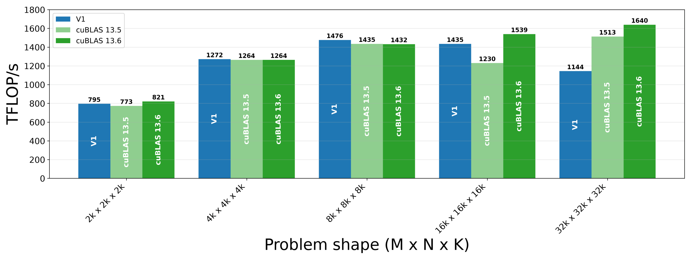

图 2. 版本 1 与 cuBLAS 的计算吞吐量对比。

在五种问题形状上取平均，版本 1 达到 cuBLAS 13.6 约 93% 的性能，但在 32k 时明显崩塌。此外，对较大形状可以观察到 SM 时钟频率下降到 2.15 GHz；按时钟修正后的理论峰值 FP4 Tensor TFLOP/s 因此从标称的 2015.2 降至约 1782。这很可能反映了热节流，而热节流会受问题大小和硬件环境条件等因素影响。

## 版本 2：Threadblock Swizzle

从性能图可以看到，内核性能会在较大问题规模下下降。为了理解这种扩展行为，下面使用 Nsight Compute profiler。观察到以下与内存吞吐量相关的指标：

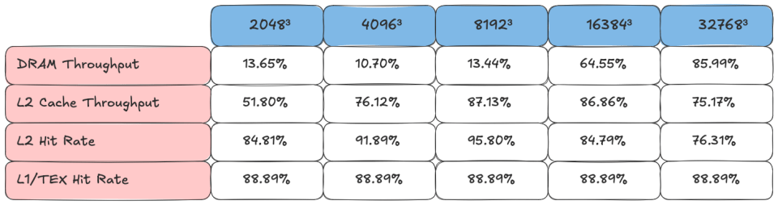

图 3. 版本 1 的内存 profiler 分析。

从 2k 到 8k，DRAM 吞吐量徘徊在 10%–14%；到 16k 和 32k 时，则跃升到 64%–86%。此外，L2 命中率从 8k 到 16k 开始下降，32k 时降至 76.31%。对于 GEMM 这样的计算受限问题，带宽吞吐量激增和 L2 命中率下降表明缓存使用效率不高。RTX Pro 6000 的 L2 cache 带宽约为 GMEM 带宽的 5.4 倍（8.7 TB/s 对 1.6 TB/s），因此提高 L2 命中概率十分重要。

但为什么 8k 以上会发生剧烈变化？为了更好地理解这些趋势，可以考察各问题形状的输入内存 footprint。输入包括形状为 `M × K` 和 `K × N` 的矩阵 A、B，以及形状为 `M × K/16` 和 `N × K/16` 的缩放因子矩阵 SFA、SFB，其中 `M=N=K` 分别取 2048、4096、8192、16384 或 32768。A 和 B 每个元素使用 4 bit 存储，SFA 和 SFB 每个元素使用 8 bit。因此，仅输入数据在五种问题形状下的 footprint 就分别为 4.5 MB、18 MB、72 MB、288 MB 和 1152 MB。RTX Pro 6000 的 L2 cache 为 128 MB。因此，在 8k 及以下问题形状中，输入的总 footprint 不会超过 L2 的可用容量。

虽然 NVIDIA GPU 的确切 L2 淘汰策略并未公开，但一般而言，同一数据越快被复用，就越可能仍驻留在 L2 中。因此，当整个矩阵无法装入 L2 时，为提高 L2 命中率，应让多个 CTA 在大致相同的时间处理相同数据。可以通过 threadblock swizzle，让同一个 wave 处理相同数据来实现这一点。

回忆一下，CTA 被分配 C 的工作矩阵块，并加载同一行中的 A 矩阵块和同一列中的 B 矩阵块。换言之，C 矩阵块位于同一行的 CTA 需要相同的 A 矩阵块，C 矩阵块位于同一列的 CTA 使用相同的 B 矩阵块。因此，如果能够让同一个 wave 中的 CTA 访问 C 的同一区域，就能获得更高的 L2 命中率。

现在假设有一张包含 8 个 SM 的理想化 GPU，一个启动 8 个 CTA 的内核，以及被划分为 8×8 网格的 C 矩阵。这样，每个 wave 会发出 16 次操作数矩阵块集合加载；一个操作数矩阵块集合位于 A 的同一行或 B 的同一列，并沿 k 维度延伸。

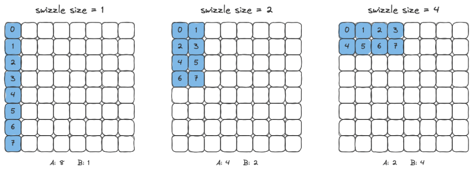

图 4. 不同 swizzle size 对应的工作矩阵块调度。

如果只沿 m 维度线性分配工作矩阵块，就会得到图 4 最左侧的情况。此时需要 9 个不同的操作数矩阵块集合：A 有 8 个，B 有 1 个。因此，16 次矩阵块集合加载中很可能有 7 次命中 L2。Swizzle 通过选择一种从线性索引到 grid 坐标的映射来改善这一点，使每个 wave 覆盖 grid 内的一个矩形，而不是单列。矩形尺寸由用户指定的 `swizzle_size` 决定。当 swizzle size 为 2 时，只有 6 个不同的矩阵块集合，因此 16 次加载中很可能有 10 次命中 L2。使用 swizzle 后，一个 wave 的所有 CTA 所加载的不同操作数矩阵块集合更少，从而有望提高 L2 命中率。

下面考察 32k 情况。CTA 矩阵块大小为 128×128，因此工作矩阵块 grid 为 256×256。由于共有 188 个 SM，我们调度矩阵块，使每个 wave 覆盖 `ceil(188/swizzle_size)` 行和 `swizzle_size` 列工作矩阵块。

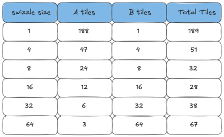

图 5. 不同 swizzle size 下每个 wave 加载的不同矩阵块数量。

图 5 汇总了多种 `swizzle_size` 选择下，单个 wave 加载的不同 A、B 矩阵块数量。该版本内核把 `swizzle_size` 设为 16，因为这样每个 wave 产生的不同矩阵块总数最少，为 28 个。在内核中，通过把 `swizzle_size` 与 `raster_along_m=True` 一起传给 `PersistentTileSchedulerParams` 来表达该设置。

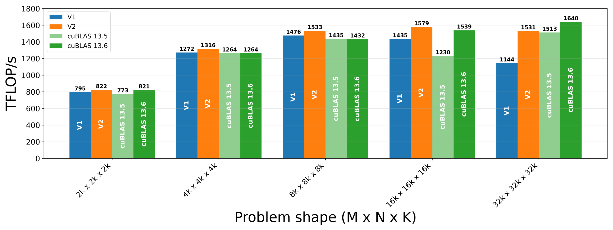

图 6. 版本 1、版本 2 与 cuBLAS 的计算吞吐量对比。

最大收益出现在 32k，我们的修改使吞吐量提高了 387 TFLOP/s。下面查看 Nsight 为版本 2 生成的内存工作负载分析输出，以了解部分收益来自何处。

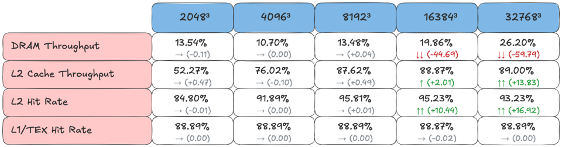

图 7. 版本 2 的内存 profiler 分析。每个数值下方显示相对版本 1 的变化。

可以看到，16k 和 32k 的 L2 命中率明显提高，二者的 DRAM 吞吐量相应下降。经过 swizzle 的调度会分配其操作数更可能驻留在 L2 中的工作矩阵块，从而减少 GMEM 流量。

## 版本 3：改进 Epilogue

需要确保内存依赖逻辑等机制不会无谓阻塞内核中的操作。以 epilogue 为例，内核已经使用流水化异步存储，但仔细检查流水线同步后，仍有改进空间。在版本 1 和 2 中，store 流水线在工作矩阵块循环内部设置：

```
while work_tile.is_valid_tile:
    . . .
    tma_store_producer_group = pipeline.CooperativeGroup(
        pipeline.Agent.Thread,
        self.num_mma_warps * self.num_threads_per_warp,
    )
    tma_store_pipeline = pipeline.PipelineTmaStore.create(
        num_stages=self.epi_stage,
        producer_group=tma_store_producer_group,
    )
```

因此，每个工作矩阵块都会重复执行该设置。版本 3 将它移到工作矩阵块循环之前。

接下来考察版本 1 和 2 中的以下代码块：

```
for epi_m in cutlass.range_constexpr(epi_rest_m):
    for epi_n in cutlass.range_constexpr(epi_rest_n):
        MmaMPerEpiM = epi_tile_m // mma_tile_m
        MmaNPerEpiN = epi_tile_n // mma_tile_n
        for mma_n_in_epi in cutlass.range_constexpr(MmaNPerEpiN):
            for mma_m_in_epi in cutlass.range_constexpr(MmaMPerEpiM):
                mma_n = (epi_n * MmaNPerEpiN) + mma_n_in_epi
                mma_m = (epi_m * MmaMPerEpiM) + mma_m_in_epi
                tRS_rD_slice = tRS_rD[(None, mma_m_in_epi, mma_n_in_epi)]
                tRS_rAcc_slice = tRS_rAcc[(None, mma_m, mma_n)]
                for elem_idx in cutlass.range_constexpr(cute.size(tRS_rD_slice)):
                    tRS_rD_slice[elem_idx] = tRS_rAcc_slice[elem_idx]
        # 执行带 alpha 缩放的类型转换
        tRS_rD_out = cute.make_rmem_tensor(tRS_rD_layout.shape, self.c_dtype)
        acc_vec = tRS_rD.load()
        # 在转换为 c_dtype 前以 FP32 乘以 alpha，
        # 避免 c_dtype 为 FP16 时发生溢出
        acc_vec = epilogue_op((alpha_value * acc_vec).to(self.c_dtype))
        tRS_rD_out.store(acc_vec)
        # 寄存器到共享内存
        epi_buffer = (epi_m * epi_rest_n + epi_n) % cute.size(tRS_sD, mode=[3])
        if has_multi_epi_store:
            self.epilog_sync_barrier.arrive_and_wait()
        cute.copy(
            tiled_copy_r2s,
            tRS_rD_out,
            tRS_sD[(None, None, None, epi_buffer)],
        )
        cute.arch.fence_proxy(
            "async.shared",
            space="cta",
        )
        self.epilog_sync_barrier.arrive_and_wait()
        # 从共享内存拷贝到全局内存
        gmem_coord = (epi_m, epi_n)
        if warp_idx == 0:
            cute.copy(
                tma_atom_c,
                bSG_sD[(None, epi_buffer)],
                bSG_gD[(None, gmem_coord)],
            )
            if has_multi_epi_store:
                tma_store_pipeline.producer_commit()
                tma_store_pipeline.producer_acquire()
# 前进到下一个工作矩阵块
tile_sched.advance_to_next_work()
work_tile = tile_sched.get_current_work()
if has_multi_epi_store:
    tma_store_pipeline.producer_tail()
```

`producer_acquire()` 调用发生得太早。在当前安排下，即使有多个 epilogue 阶段，`producer_acquire()` 也会阻塞。此外，`producer_tail()` 位于错误的循环深度。它应在所有工作矩阵块都处理完后，只排空一次 store 流水线；但当前写法会为每个工作矩阵块排空一次。这两个问题共同导致 store 路径无谓阻塞 MMA 工作。

版本 3 的修复方式，是把 producer tail 移到 warp 循环之外，并将 `producer_acquire()` 调用推迟到向共享内存存储之前。具体而言，它现在紧邻 `self.epilog_sync_barrier.arrive_and_wait()` 之前。

基准测试使用两个 epilogue 阶段，epilogue 子矩阵块大小为 64×64。Profiler 显示，从版本 2 到版本 3，long scoreboard stall 略有下降。

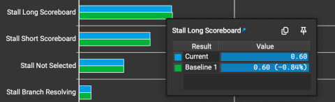

图 8. 版本 3 与版本 2（基线）的 Nsight Compute warp stall 分解。

总体而言，该效果很小，处于基准测试波动噪声范围内，如图 9 所示。

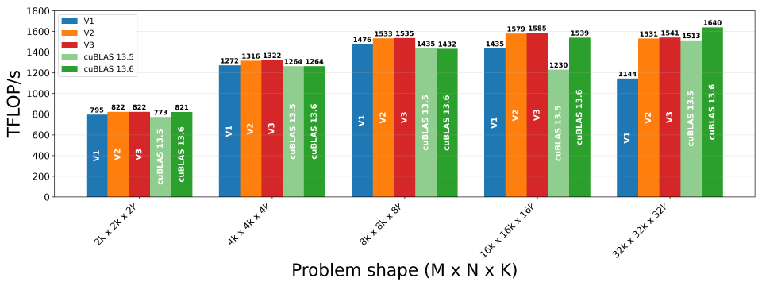

图 9. 版本 1–3 与 cuBLAS 的计算吞吐量对比。

## 版本 4：Warp 特化存储

在 GEMM 这样的计算受限内核中，应让 Tensor Core 始终保持忙碌。这意味着任何时候都应有一个具备 MMA 工作的 warp 等待调度。实现这一点的方法之一是 warp 特化。load 路径已经使用该方法，但当前仍由 compute warp 执行存储。

在实现层面，store warp 必须在某个 SMEM 阶段可以安全覆写时通知 MMA warp；而 MMA warp 需要在该阶段包含完整输出子矩阵块时通知 store warp。因此，版本 4 增加了两个 named barrier：

```
self.epilog_free_barrier = pipeline.NamedBarrier(
    barrier_id=2,
    num_threads=(self.num_mma_warps + 1) * self.num_threads_per_warp,
)
self.epilog_ready_barrier = pipeline.NamedBarrier(
    barrier_id=3,
    num_threads=(self.num_mma_warps + 1) * self.num_threads_per_warp,
)
```

硬件管理着 16 个 named barrier，`barrier_id` 指定使用其中哪一个。`num_threads` 输入指定屏障释放前必须 arrive 的线程总数。因此，将其设为所有 MMA warp 与 store warp 中线程数量的总和。

store warp 首先在其内部 TMA store 流水线上调用 `producer_acquire`，然后 arrive 到 `epilog_free_barrier`，向 MMA warp 发出该阶段可以写入的信号。MMA warp 在 `epilog_free_barrier` 上等待信号到达，随后把累加器子矩阵块从寄存器拷贝到 SMEM，以填充该阶段。接着，MMA warp 执行 `async.shared` fence，使 SMEM 写入可见，再 arrive 到 `epilog_ready_barrier`，表示该阶段已填满。store warp 在 `epilog_ready_barrier` 上等待后，通过发出从 SMEM 到 GMEM 的 TMA 拷贝排空该阶段。它还调用 `producer_commit()` 记录这次存储，之后的 `producer_acquire()` 会等待该存储。

图 10 概述了版本 4 的内核结构。

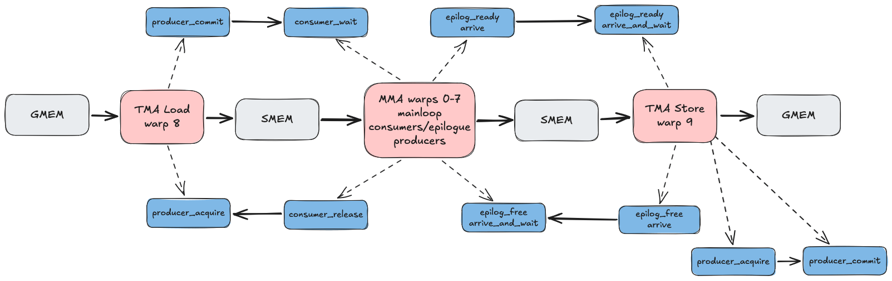

图 10. 版本 4 内核的 load/compute/store 概览。

版本 4 的基准测试结果如图 11 所示。

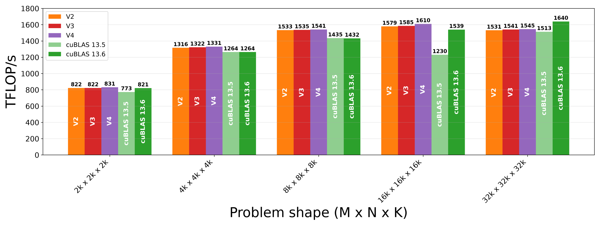

图 11. 版本 2–4 与 cuBLAS 的计算吞吐量对比。

可以观察到 2k 和 16k 的性能提高约 1%，其余情况保持不变。

## 版本 5：消除 SFA bank conflict

版本 5 处理 bank conflict。尽管该版本的改动本身没有对性能产生实质影响，但在可能时促进高效加载仍是良好实践；这部分讨论也具有教学价值。

SMEM 被组织为 32 个宽度为 4 字节的 bank。如果一个 warp 向全部 32 个 bank 中彼此不同的地址发出访问请求，SMEM 可以在单个周期内提供数据。但如果请求了同一 bank 中的多个地址，这些请求就会串行化；这种情况称为 bank conflict。注意，如果多个 lane 请求同一 bank 中的相同地址，则可以通过广播在单个周期内提供数据。

Nsight 指标“L1 Wavefronts Shared Excessive”可用于指示这类 bank conflict。Nsight 为该指标报告了 8.39M，而 SFA fragment 从 SMEM 到寄存器的拷贝造成了全部这些额外 wavefront。要理解该数值的来源，必须同时考察 SFA 的 SMEM layout 和 thread-value（TV）layout。

回忆上一篇文章，SFA 的 SMEM layout 为：

((32,4), REST_M), ((16,4), 1, REST_K)) : (((16, 4), 512 * REST_K), ((0, 1), 4, 512))

M sublayout `(32,4):(16,4)` 将 128×128 CTA 矩阵块的 m 坐标分解为

$$
M = m_0 + 32m_1
$$

其中 $m_0 = m\pmod{32}$，$m_1 = \left \lfloor\frac{m}{32} \right \rfloor \pmod 4$。

K sublayout `(16,4):(0,1)` 反映缩放因子的组织方式。步长 0 把单个缩放因子广播到一个 NVFP4 micro-block 的 16 个元素；步长 1 把横跨 `K=64` 子块的四个缩放因子排列在连续四个字节中。两个 sublayout 共同为第 m 行和 micro-block $b \in \{0,1,2,3\}$ 的缩放因子给出以下字节偏移：

$\text{byte offset} = 16m_0 + 4m_1 + b$

相应 bank 索引为

$\text{bank index} = \left \lfloor(\text{byte offset}/4) \right \rfloor \pmod{32}$

考虑 SFA 中对应第 0–15 行的元素。此时 $m_1=0$，每个 bank 索引都是 4 的倍数：

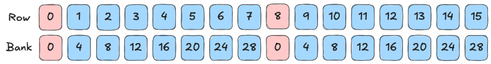

图 12. 原始 SMEM layout 下 SFA 第 0–15 行到 bank 的映射。

可以看到，第 0 行和第 8 行的缩放因子地址都位于 bank 0。更一般地，第 r 行和第 r+8 行的缩放因子地址共享同一个 bank。因此，8 个不同 bank 中共有 16 个不同地址。如果一个 warp 不在同一周期请求第 r 行与第 r+8 行缩放因子的地址，这不会造成问题；但后文将看到，这类请求确实会发生。

SFA atom 的 TV layout 为：

((2, 2, 8), 64): ((8, 0, 1), 16)

回忆上一篇文章，每个 quad 实际只有两个线程向 MMA 指令提供缩放因子数据，因此这种安排中存在数据重复。中间 submode 的零步长意味着，每个 quad 的线程 0 和 2 持有相同 SFA 值，线程 1 和 3 也持有相同 SFA 值。

图 13 展示每个 lane 从 SMEM 的哪个 bank 请求 SFA 数据。整个 warp 共访问 8 个 bank，同一个 quad 中有 4 个 lane 请求每个 bank。但每个 bank 只请求两个不同地址，因此完成这些请求需要两个 wavefront，而不是四个。由于实际使用两个 wavefront，而理想情况为一个，所以每条指令计为一个 excessive wavefront。

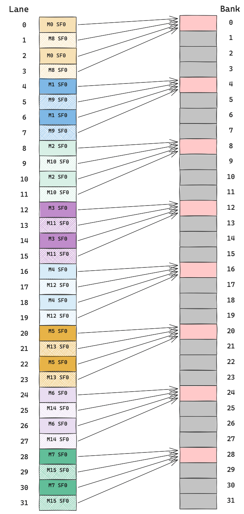

图 13. 原始 layout 下，SFA 从 SMEM 拷贝到寄存器时每个 lane 访问的 bank。

为了得到 Nsight 报告的 8.39M，下面分解 8k 问题形状中这类指令的数量。由于 `M=N=8192`，CTA 矩阵块形状为 128×128×128，共有 `(8192/128) × (8192/128) = 64 × 64 = 4096` 个工作矩阵块。由于 `K=8192`，mainloop 有 `8192/128=64` 次 K 迭代。warp 级 MMA atom 形状为 16×8×64，8 个 MMA warp 按 `(4, 2, 1)` 排列，覆盖 128×128×128 CTA 矩阵块中的 64×16×64 区域。为了覆盖完整 CTA 矩阵块，每个 MMA warp 对两个 K 子块分别执行两次 M 重复。因此，每个 MMA warp 在每次 mainloop K 迭代中会执行 4 条 SFA SMEM 到寄存器的加载指令。

综合起来，SFA 加载的 excessive wavefront 数量为：

$64 * 64 * 64 * 8 * 4 * 1 = 8,388,608$

这与报告的 8.39M 结果一致。

从 layout 角度看，修复很直接。将 stride 修改为：

(32, 4):(4, 128)

上述 rank-2 layout 等价于 rank-1 layout `128:4`。具体而言，现在有

$\text{byte offset} = 4m_0 + 128m_1 + b = 4(m_0 + 32m_1) + b = 4m + b$

行到 bank 索引的对应关系变为：

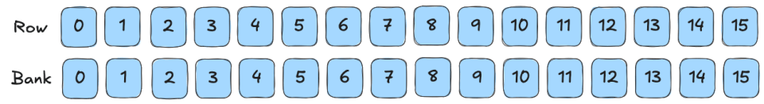

图 14. 修改 layout 后 SFA 的行到 bank 映射。

现在，每一行都有不同的 bank 索引。SFA TV layout 保持不变，从 SMEM 到寄存器的拷贝访问模式变为：

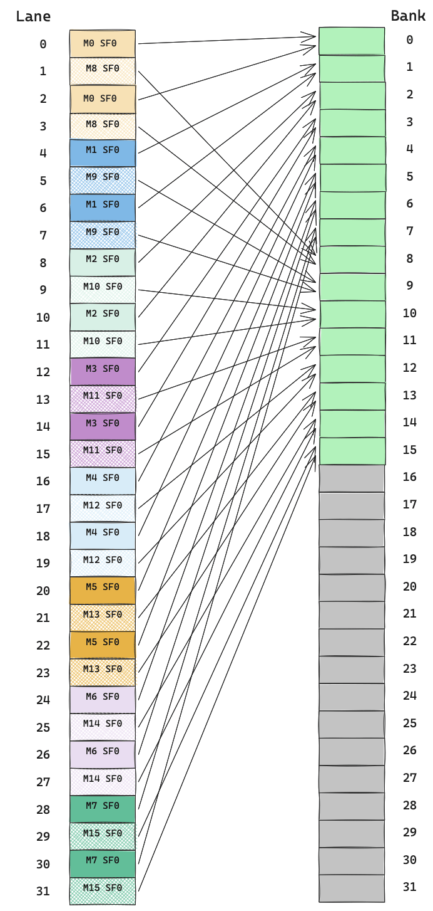

图 15. 修改后，SFA 从 SMEM 拷贝到寄存器时每个 lane 访问的 bank。

因此，每次 SFA fragment 加载都能在单个 wavefront 中完成。注意，SFA atom 的 cosize 没有变化：两个 layout 都是到同一个 512 字节块的双射。因此，TMA GMEM 到 SMEM 拷贝保持相同的 box 形状和事务大小，只有 atom 内部的字节顺序发生变化。

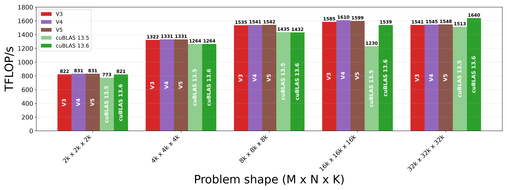

图 16. 版本 3–5 与 cuBLAS 的计算吞吐量对比。

## 版本 6：12 个 MMA Warp

现阶段，2k 问题形状拥有最大的绝对改进空间。版本 6 的改动专门针对这一差距。2k 性能严重受到 wave quantization 影响。用 128×128 矩阵块划分 2048×2048 输出矩阵，会得到 16×16 grid，即 256 个工作矩阵块。RTX Pro 6000 有 188 个 SM，因此计算需要两个 wave；但第二个 wave 会让 120 个 SM 空闲。

为解决这一问题，版本 6 把 CTA 矩阵块从 128×128 改为 192×128，并将 MMA layout 从 `(4, 2, 1)` 扩展到 `(6, 2, 1)`。换言之，12 个 MMA warp 按 M 方向 6 个、N 方向 2 个排列。16×8×64 硬件 MMA atom 与 `(6, 2, 1)` warp layout 共同覆盖一个 96×16×64 矩阵块，再沿 M 重复两次、沿 N 重复八次、沿 K 重复两次，以覆盖 CTA 矩阵块。

由于输出矩阵块更大，工作矩阵块数量比版本 1–5 更少。`2048/192` 向上取整为 11，因此 grid 变为 `11 × 16 = 176` 个工作矩阵块。版本 6 只需要一个 wave，188 个 SM 中有 12 个空闲。

图 17 展示版本 1–5 与版本 6 跨 wave 分配工作矩阵块的差异。

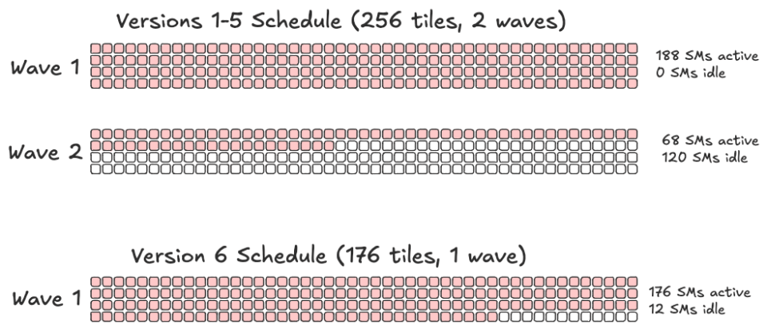

图 17. 在 2k 问题形状下，版本 1–5 与版本 6 按 wave 分配工作矩阵块的方式。

除了改善 2k 的工作矩阵块分配，使用更大的矩阵块还会提高算术强度。

CUTLASS 缩放因子 layout 辅助函数假定 CTA 矩阵块的 M 范围 `tile_m` 是 128 的倍数。这里，沿 M 的 6 个 warp 覆盖 `6 × 16 = 96` 行。因此，版本 6 用 96 行 atom 替换 128 行 SFA atom，需要更新为以下 SFA SMEM layout：

((32,3), REST_M), ((16,4), 1, REST_K)) : (((12, 4), 384 * REST_K), ((0, 1), 4, 384))

之所以出现步长 12，是因为每个 `K=64` 子块有 4 个缩放因子，而 SFA atom 覆盖 3 个 32 行块，因此 `4 × 3 = 12`。

版本 5 只是在固定大小的 atom 内置换字节；与之不同，版本 6 改变了 atom 本身的大小，因此确实需要修改提供给 TMA GMEM 到 SMEM SFA 加载的 layout。

由于 SMEM 约束，该版本使用更大矩阵块后无法像先前版本那样采用四个 load/MMA 流水线阶段，因此改用两个阶段。

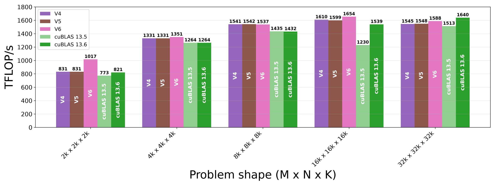

图 18. 版本 4–6 与 cuBLAS 的计算吞吐量对比。

与版本 5 相比，版本 6 在 2k 时提高 186 TFLOP/s，在 16k 和 32k 时均提高超过 40 TFLOP/s。

## 版本 7：自动调优

到目前为止，版本 1–6 的内核参数都由人工选择并保持一致。自动调优会大范围扫描内核参数，以识别最优配置。我们针对以下参数自动调优内核：

- CTA 矩阵块大小：`bM × bN × bK`
- TMA load/MMA compute 阶段数
- MMA warp 数量
- Swizzle size
- Epilogue 矩阵块大小：`epi_m × epi_n`
- Epilogue 流水线阶段数
- TMA load warp 寄存器分配

自动调优为给定问题形状识别出以下最优配置：

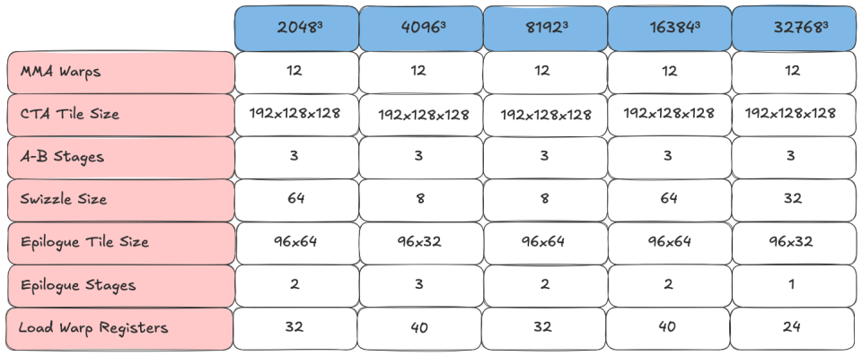

图 19. 不同问题形状的最佳自动调优配置。

使用图 19 中的配置后，版本 7 在 2k、4k 和 8k 时增加几个 TFLOP/s，在 16k 和 32k 时增加 12–13 TFLOP/s。

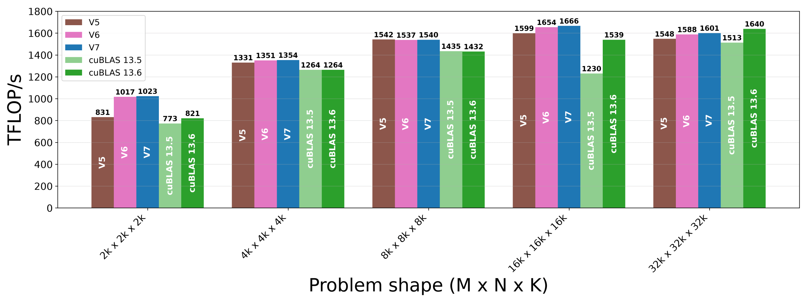

图 20. 版本 5–7 与 cuBLAS 的计算吞吐量对比。

## 最终结果概览

下面给出上述所有版本在重点问题形状下的性能演进快照。总体而言，与版本 1 相比，版本 7 在 2k、4k、8k、16k 和 32k 时分别提升 29%、6%、4%、16% 和 40%。

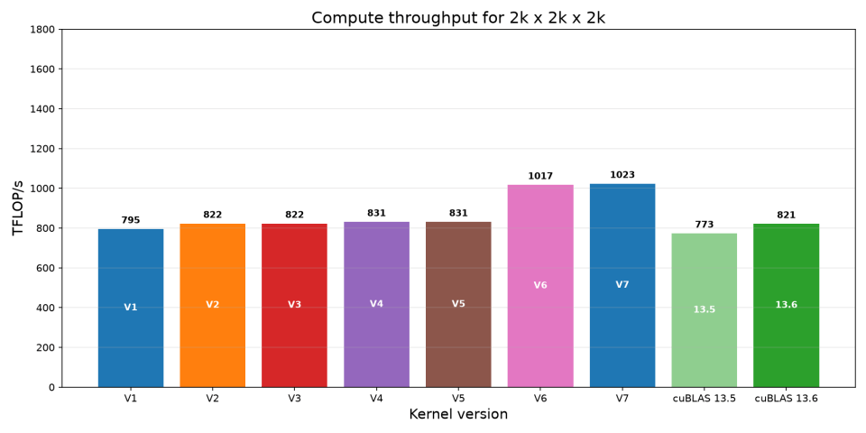

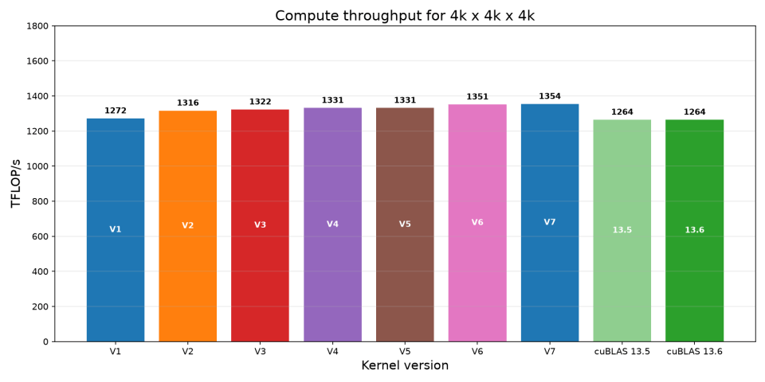

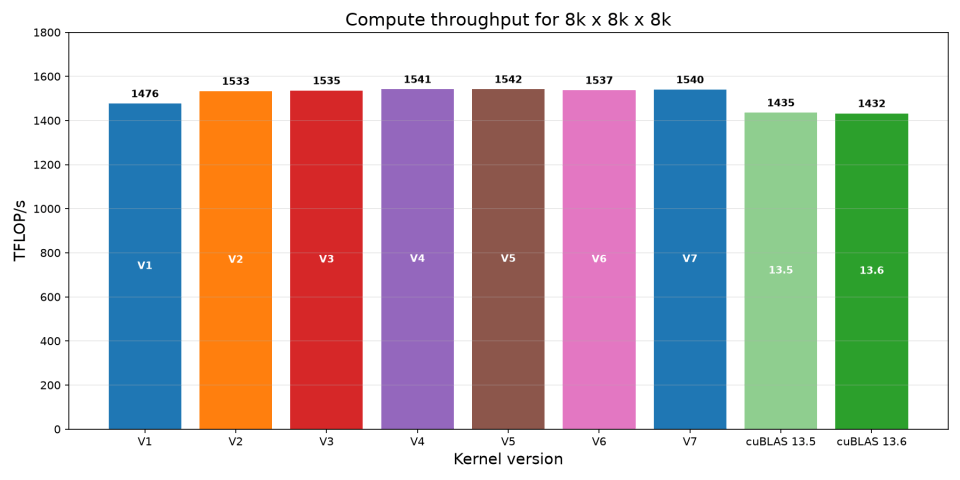

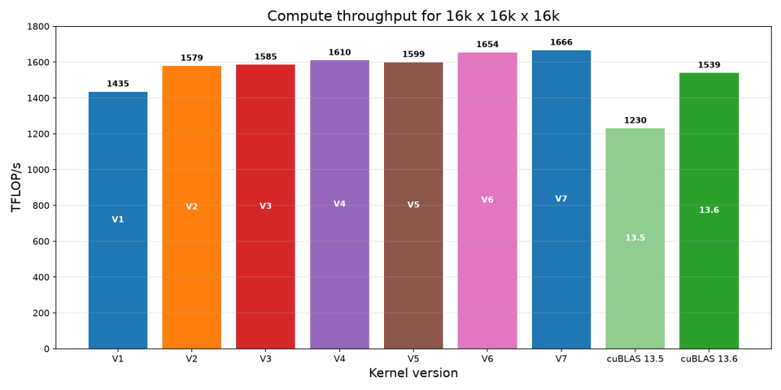

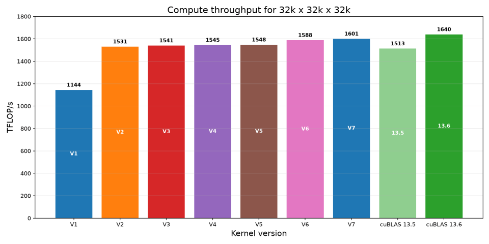

## 总结

本文针对 RTX Pro 6000 Blackwell Server Edition GPU，优化了第 1 部分教程中的 NVFP4 block-scaled GEMM。改动包括：使用 threadblock swizzle 使一个 wave 的操作数保持驻留 L2；收紧 epilogue store 流水线；把存储工作从 MMA warp 移到专用 store warp；消除 SFA 加载的 SMEM bank conflict；修改 warp layout 和矩阵块大小，以提高算术强度并消除 wave quantization 停顿；以及执行自动调优扫描。附录给出了使用动态调度器与 Cluster Launch Control 的版本结果，其性能几乎追平版本 7；还讨论了一些未能提升性能的缩放因子实验。总体而言，版本 7 在所有测试形状下都比版本 1 吞吐量更高，其中 2k 和 32k 的收益最大。

## 附录

Cluster Launch Control（CLC）

CLC 是 NVIDIA Blackwell GPU 上由硬件支持的一项特性，旨在通过动态持久化调度高效调度矩阵块。在动态持久化矩阵块调度方案中，每个 CTA 从程序员设计的初始工作矩阵块分配开始；如果还有可用工作，随后会获取并处理新的工作矩阵块。详细信息请参阅[上一篇 CLC 文章](https://research.colfax-intl.com/dynamic-persistent-tile-scheduling-with-cluster-launch-control-clc-on-nvidia-blackwell-gpus/)。

上一篇文章提供了在 SM100 上实现 CLC 的方法。版本 8 采用该方法实现 CLC，并针对 SM120 进行了若干修改。

首先，`clc_cluster_layout_vmnk` 原先构造为：

```
cute.tiled_divide(cute.make_layout(((1, 1), 1)), (self.tiled_mma.thr_id.shape,))
```

SM100 使用 `tcgen05` MMA 指令，因此 `tiled_mma.thr_id.shape` 为 1 或 2。SM120 使用 warp 级 `mma.sync` 指令，所以 `tiled_mma.thr_id.shape` 为 32。这会触发 SM120 不支持的 CTA cluster 路径。该版本手动把这一条目设为 1。

其次，上一篇文章的实现推迟 CLC 流水线初始化，然后统一同步所有流水线屏障。该版本改为让 CLC 流水线单独处理自己的初始化和同步。

最后，由于这里的 MMA warp 数量多于上一篇文章引用的内核，需要修改 CLC consumer barrier 的 arrival count。对配置参数进行自动调优后，该 CLC 内核的性能与版本 7 几乎相同：

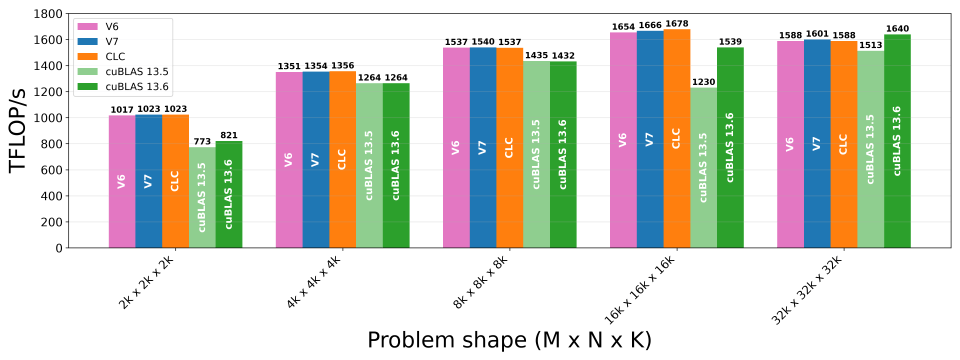

其他缩放因子实验

本节记录一些通过调整缩放因子数据加载到寄存器的方式来改善性能的尝试。

NVFP4 GEMM 在 SM120 上最终降级到的硬件 MMA 操作，只从一个 warp 的部分线程中消耗缩放因子；具体线程由 PTX 操作数 `thread-id-a` 和 `thread-id-b` 决定。如果 `thread-id-a = 0`，每个 quad 的线程 0 和 1 提供 SFA；如果 `thread-id-a = 1`，则改由每个 quad 的线程 2 和 3 提供 SFA。另一方面，如果 `thread-id-b = x`（`0 <= x <= 3`），则每个 quad 的线程 x 提供 SFB。

在 CuTe DSL 中，`thread-id-a` 和 `thread-id-b` 不直接向程序员公开，默认都传入 0。第 1 部分介绍过，教程内核中 SFA 和 SFB 从 SMEM 到寄存器的加载模式分别产生 2 倍和 4 倍复制；这种复制在前述 layout 中可见。下面介绍两种避免复制的方法。

第一种方法是限制哪些线程实际把 SFA fragment 加载到寄存器。由于 `thread-id-a` 设为 0，MMA 操作只需要每个 quad 的线程 0 和 1 拥有 SFA fragment。因此，可以修改 SFA 从 SMEM 到寄存器的加载，使其只由这些线程执行；对 SFB 加载也采用相同方法。这样可以减少拷贝的数据量，但也会在 CTA 的线程之间引入分支。实现该修改后，性能持平或略有下降。

第二种方法是在一次加载中把更多不同的 SFA fragment 加载到寄存器。虽然 CuTe DSL 不能直接修改 `thread-id-a` 和 `thread-id-b`，但可以使用内联 PTX 手动改变其值。基于这一点，我们不再阻止线程加载冗余数据，而是让额外线程为另一个 MMA 加载 SFA 和 SFB fragment，再在给定 MMA 之前适当切换线程选择器的值。与复制加载相比，以这种方式加载额外 SFA 和 SFB fragment 并未提升性能。
