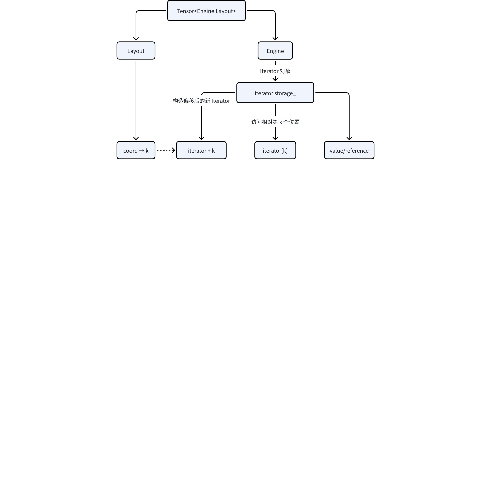
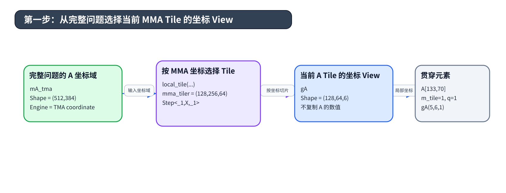
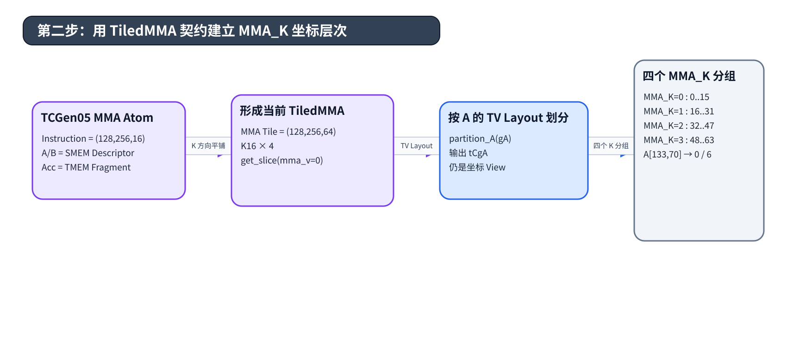
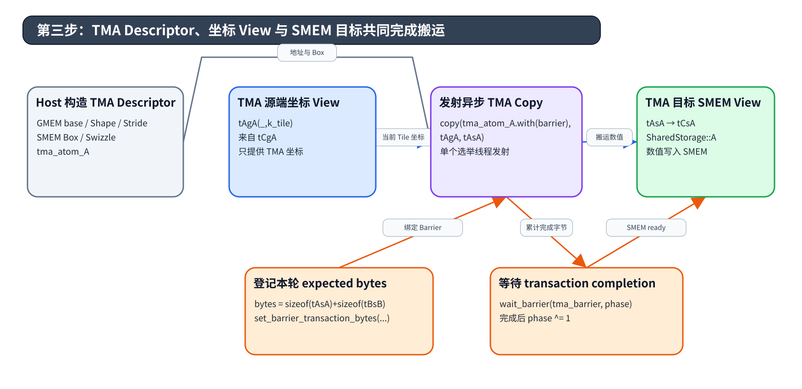
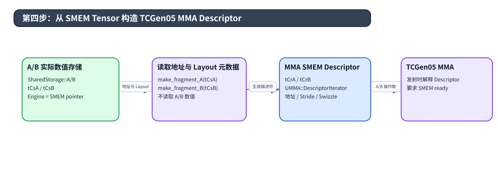
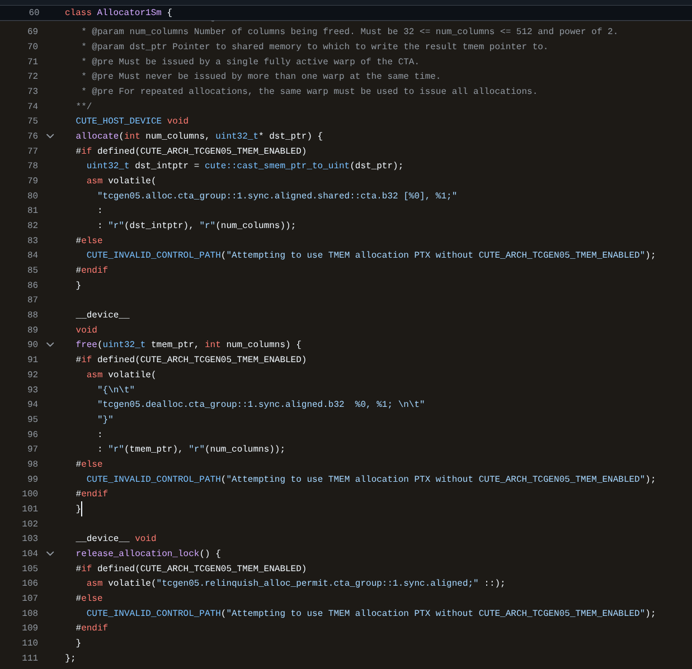
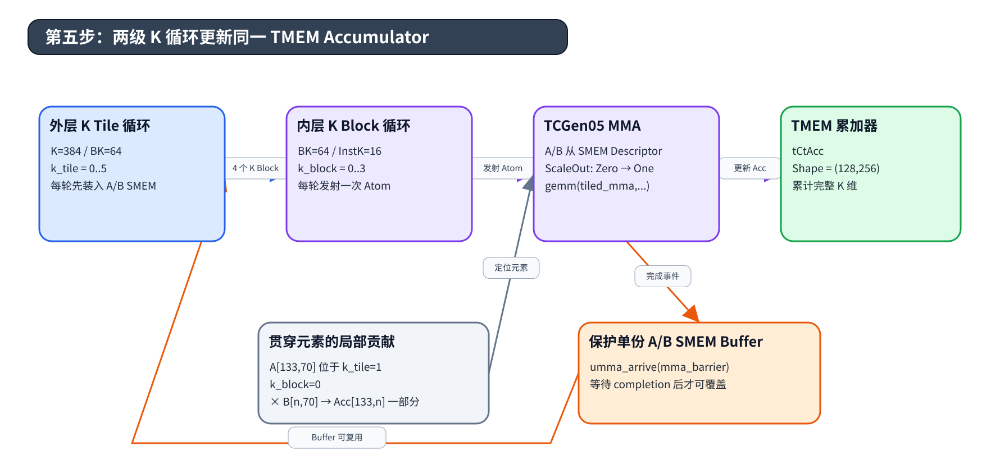
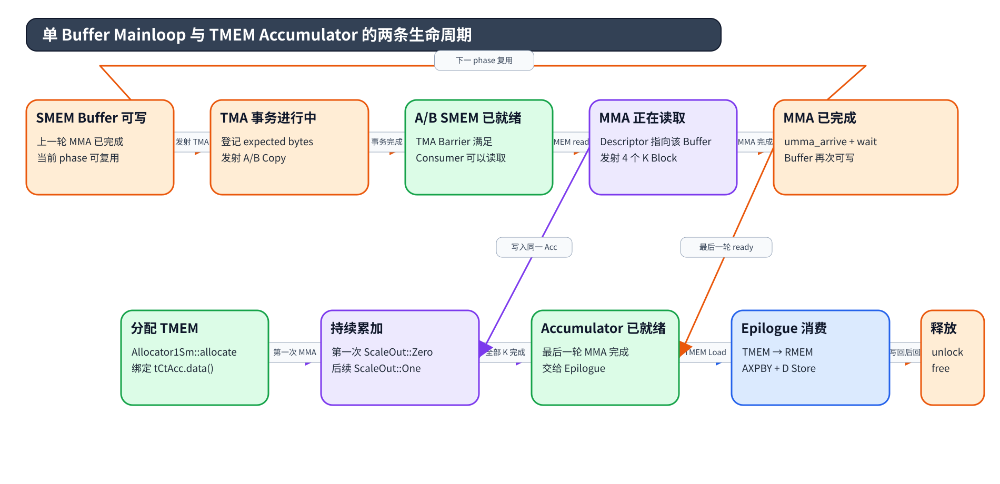
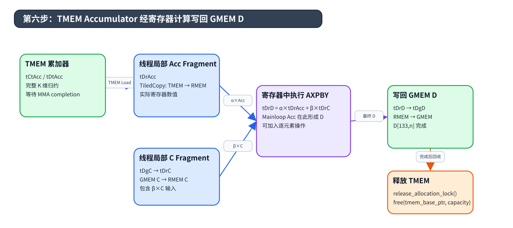

# CUTLASS 3.x (3)：Cutlass 的张量和空间微内核处理多维数据的原则性抽象 - CuTe

前置阅读：[Cutlass NVFP4 GEMM 技术分享](https://xiaopeng.feishu.cn/wiki/S8N2wn26piQePNkBjiNcwFRCnRc)

后半篇的源码示例建议结合 [github.com](https://github.com/NVIDIA/cutlass/tree/8f50b052e1099fb982392a622caab69b97b63128/examples/cute/tutorial/blackwell) 这几篇官方教学示例来理解 CuTe api 怎么被手动调用的。

# 引言

高性能 GPU GEMM 的实现不仅需要描述矩阵乘加本身，还要确定参与者如何覆盖输出 Tile、逻辑坐标如何映射到 GMEM、SMEM、TMEM 和寄存器，以及 MMA 与 Copy 指令如何划分和访问操作数。传统实现常把这些关系分散在指针计算、线程索引、数据布局和架构指令中，使线程—数据映射难以独立描述、验证和组合。

CUTLASS 3.x 将 CuTe 作为底层空间抽象。CuTe 使用 `Shape`、`Stride` 和 `Layout` 表达层次化坐标域与索引映射，使用 `Tensor<Engine,Layout>` 组合访问对象与布局，再通过 Atom、TiledMMA、TiledCopy 和 Partition 把架构指令的参与者—数据契约扩展到更大的 Work Tile。统一的空间词汇使数据布局、线程布局和硬件操作可以分别定义，再通过布局代数组合。

CuTe 还把许多类型、Shape、Layout、架构能力和接口组合约束放到编译期，使不兼容的内核构造能够通过类型检查或 `static_assert` 提前暴露。编译通过表示这些静态契约成立；运行时指针、Workspace、异步同步协议、数值结果和性能仍需在设备执行和结果验证中分别确认。

本文先建立 Layout、Tensor、Atom、TiledMMA 和 TiledCopy 组成的空间编程模型，再使用 Blackwell TCGen05 单 CTA 教学 Kernel 观察这些抽象如何进入真实 GEMM 数据流。后半部分以 `A[133,70]` 为贯穿对象，依次分析当前 MMA Tile 的坐标 View、MMA K 分区、TMA 源端与目标端 View、SMEM Descriptor、TMEM Accumulator 和教学 Epilogue。该对象用于追踪一个 A 元素对当前输出 Tile 中多个 Accumulator 元素的贡献，不代表一个完整输出元素的全部 K 维归约。

本文是这个系列的第三篇。[第一篇](https://xiaopeng.feishu.cn/wiki/ObOywTfbDi8HP6kf4orcvcgFnah)从 GEMM 问题和典型算子场景出发，介绍 CUTLASS 3.x 的整体结构，并用一个 Thor GEMM 串起 Builder、`GemmUniversal`、`GemmUniversalAdapter`、运行参数和结果验证；[第二篇](https://xiaopeng.feishu.cn/wiki/Wod4wss3rirbjXkUcyjcUGJEn3e)进入已经构造完成的 Kernel，沿 Collective Mainloop、Collective Epilogue、Warp Role、Tile Scheduler 与 Device 调用展开它的执行过程。到了本文，视角进一步落到 CuTe 如何描述坐标、参与者和数据对象，并最终进入 TMA、SMEM Descriptor、TCGen05、TMEM Accumulator 与教学 Epilogue。

# CuTe 的空间编程模型

## Layout 与 Tensor

CuTe 的空间模型从一个简单问题开始：同一个逻辑位置如何在层次坐标、线性存储和不同存储空间之间保持一致解释。[`cute::Layout<Shape,Stride>`](https://github.com/NVIDIA/cutlass/blob/8f50b052e1099fb982392a622caab69b97b63128/include/cute/layout.hpp#L43-L163)负责坐标到索引的映射，[`cute::Tensor<Engine,Layout>`](https://github.com/NVIDIA/cutlass/blob/8f50b052e1099fb982392a622caab69b97b63128/include/cute/tensor_impl.hpp#L52-L123)再把这套映射绑定到一个可访问对象。后续的线程划分、SMEM Swizzle、TMA 坐标和 TMEM Accumulator 都建立在这个组合关系上。

### Shape、Stride 与 Layout：从坐标域到索引函数

这部分不需要全部理解就可以开始编程，CuTe 会对这里自动化映射。

元组 tuple `(4,(2,2))` 中的元素 4 或 (2,2) 被官方称作 Mode。`Shape` 定义合法逻辑坐标的层次结构以及每个 Mode 的范围，`Stride` 定义每个坐标 Mode 对目标索引的贡献，二者共同构成 `Layout<Shape,Stride>`。调用 [`layout(coord)`](https://github.com/NVIDIA/cutlass/blob/8f50b052e1099fb982392a622caab69b97b63128/include/cute/layout.hpp#L161-L182) 时，CuTe 在坐标不含切片占位符的情况下执行 [`crd2idx(coord,shape,stride)`](https://github.com/NVIDIA/cutlass/blob/8f50b052e1099fb982392a622caab69b97b63128/include/cute/stride.hpp#L47-L124)；当坐标包含下划线切片时，同一个接口返回子 Layout。后续的 [`compose()`](https://github.com/NVIDIA/cutlass/blob/8f50b052e1099fb982392a622caab69b97b63128/include/cute/layout.hpp#L185-L200) 则在这套坐标函数之上建立 Layout 复合。篇幅原因我们这里只讲了最基础的CuTe映射用法，更详细可以参考[Yifan Yang (杨轶凡) about blogs ☀️ 🌙 Member of Technical Staff at Anthropic yifany AT csail.mit.edu Goo](https://yang-yifan.github.io/blogs/cute_layout/cute_layout.html) 这篇博客。


图 1 使用 `Shape=(4,(2,2))` 和 `Stride=(2,(1,8))` 展示同一个 Layout 的坐标解释过程。

Shape 定义包含 16 个元素的逻辑坐标域，一个位置可以写成一维逻辑编号 `I`、普通二维坐标 `(i,j)`，或者层次坐标 `(i,(j1,j2))`。其中 `i∈[0,4)`，`j1,j2∈[0,2)`，并有 `j=j1+2×j2`。这三种写法描述同一个逻辑位置，Stride 决定实际存储索引。

Stride 将层次坐标映射为索引：`k=2×i+j1+8×j2`。比如逻辑一维坐标`I=5`对应`(i,j)=(I mod 4, floor(I/4))=(1,1)=(i,(j1,j2))=(1,(j mod 2,floor(j/2))) = (1,(1,0))`，最终得到 `k=2×1+1×1+8×0=3`。因此 `I=5` 是逻辑坐标域中的序号，`k=3` 才是该 Layout 计算出的目标索引。Shape 负责坐标域，Stride 负责索引贡献，Layout 将两者绑定成一个函数。

**根据 Shape 和 Stride 将逻辑编号 I=5 映射到存储索引**

```text
输入逻辑编号：I = 5
根据 Shape 分解：
(i,j) = (I mod 4, floor(I/4))
      = (1,1)
继续分解第二个层次 Mode：
(j1,j2) = (j mod 2, floor(j/2))
        = (1,0)
层次坐标：
(i,(j1,j2)) = (1,(1,0))
根据 Stride 计算：
k = 2×i + j1 + 8×j2
  = 2×1 + 1 + 8×0
  = 3
最终访问：storage[3]
```

实际调用点只需要构造 Shape、Stride 与 Layout；`I → (i,j) → (i,(j1,j2)) → k` 是本文为了展示坐标解释过程给出的等价推导，不需要手工写进 Kernel。当前示例使用 `Int<N>` 把维度编码在类型中，便于编译期 Layout 推导；后文完整 Problem Shape 中的 `int M/N/K` 可以保存运行时维度。无论维度位于类型还是对象中，Layout 仍执行同一套坐标映射。实际构造入口见 [`make_shape/make_stride`](https://github.com/NVIDIA/cutlass/blob/8f50b052e1099fb982392a622caab69b97b63128/include/cute/layout.hpp#L62-L72) 与 [`make_layout`](https://github.com/NVIDIA/cutlass/blob/8f50b052e1099fb982392a622caab69b97b63128/include/cute/layout.hpp#L329-L368)。

**使用 CuTe API 构造层次 Shape、Stride 与 Layout**

```cpp
using namespace cute;

auto shape = make_shape(
    Int<4>{},
    make_shape(Int<2>{}, Int<2>{})
);

auto stride = make_stride(
    Int<2>{},
    make_stride(Int<1>{}, Int<8>{})
);

auto layout = make_layout(shape, stride);
```


图 2 所表达的变化不只是 API 数量减少。CUTLASS 2.x 中大量布局含义隐藏在不同命名类型中；CuTe 把共同部分收敛为可计算的 Layout，使“坐标域是什么”“如何映射到索引”“访问哪类存储”成为可以分别检查和组合的对象。

### Engine：数据所有权与 Iterator

Layout 已经把逻辑坐标转换为线性索引，Engine 负责解释这个索引如何访问实际对象。固定 CUTLASS 版本中的 [`ArrayEngine`](https://github.com/NVIDIA/cutlass/blob/8f50b052e1099fb982392a622caab69b97b63128/include/cute/tensor_impl.hpp#L58-L129)、[`ViewEngine`](https://github.com/NVIDIA/cutlass/blob/8f50b052e1099fb982392a622caab69b97b63128/include/cute/tensor_impl.hpp#L58-L129) 与 [`ConstViewEngine`](https://github.com/NVIDIA/cutlass/blob/8f50b052e1099fb982392a622caab69b97b63128/include/cute/tensor_impl.hpp#L58-L129) 都提供 `begin()` 和一组访问类型；三者的区别集中在 `storage_` 保存的是实际数组还是一个外部访问句柄。

**CuTe Engine 的最小接口契约**

```cpp
struct Engine {
  using iterator     = ...;
  using reference    = ...;
  using element_type = ...;
  using value_type   = ...;

  iterator begin();
};
```

| Engine | `storage_` 保存什么 | 是否拥有数值存储 | 常见构造路径 |
|-|-|-|-|
| `ArrayEngine<T,N>` | `array_aligned` 或 `array_subbyte` | 是 | `make_tensor<T>(layout)` |
| `ViewEngine<Iterator>` | Iterator handle | 否 | `make_tensor(iterator,layout)` |
| `ConstViewEngine<Iterator>` | Iterator handle | 否 | 只暴露 const handle 的内部路径 |

`ArrayEngine<T,N>` 的内嵌 Storage 覆盖 Layout 可能产生的索引范围；通过 `make_tensor<T>(layout)` 构造时，容量取 `cosize_v<Layout>`。Engine 对象放在线程局部作用域、SharedStorage 或 Host 对象中，会进一步决定这块 inline Storage 的实际位置。`ViewEngine<Iterator>` 只拥有 Iterator 对象，Iterator 指向的 allocation 仍由外部 Owner 管理。

Iterator 是 Engine 保存的访问句柄，它规定当前位置、逻辑偏移和访问结果。普通 `T*` 是最常见的 Iterator；CuTe 还用 Iterator 表达 GMEM/SMEM 地址空间、子字节位置、按需生成的坐标和 TMEM 编码地址。CuTe 借用了 C++ Iterator 的间接访问模型，并在 `namespace cute` 中实现轻量协议；具体类型只需提供当前 CuTe 算法使用的操作，不保证完整满足标准库的 Iterator concept。地址空间包装由 [`gmem_ptr`](https://github.com/NVIDIA/cutlass/blob/8f50b052e1099fb982392a622caab69b97b63128/include/cute/pointer.hpp#L83-L269)[、](https://github.com/NVIDIA/cutlass/blob/8f50b052e1099fb982392a622caab69b97b63128/include/cute/pointer.hpp#L83-L269)[`smem_ptr`](https://github.com/NVIDIA/cutlass/blob/8f50b052e1099fb982392a622caab69b97b63128/include/cute/pointer.hpp#L83-L269)[ 与 ](https://github.com/NVIDIA/cutlass/blob/8f50b052e1099fb982392a622caab69b97b63128/include/cute/pointer.hpp#L83-L269)[`rmem_ptr`](https://github.com/NVIDIA/cutlass/blob/8f50b052e1099fb982392a622caab69b97b63128/include/cute/pointer.hpp#L83-L269) 提供。

[`cute::iterator_traits`](https://github.com/NVIDIA/cutlass/blob/8f50b052e1099fb982392a622caab69b97b63128/include/cute/pointer_base.hpp#L42-L92) 从 Iterator 取得 `reference`、`element_type` 和 `value_type`。`reference` 是一次访问实际返回的类型；它可以是普通引用、按值生成的结果，也可以是完成位提取或读改写的 Proxy reference。`element_type` 保留元素的 const 属性，`value_type` 表示算法处理的纯数值类型。

| Iterator | `reference` | 在 Tensor 中表达的访问语义 |
|-|-|-|
| `float const*` | `float const&` | 普通只读元素 |
| `gmem_ptr<float const*>` | `float const&` | 带 GMEM 标签的只读 View |
| `smem_ptr<half_t*>` | `half_t&` | 带 SMEM 标签的可写 View |
| `subbyte_iterator<uint4_t>` | Proxy reference | 压缩存储中的 4-bit 逻辑元素 |
| `tmem_ptr<T>` | `T` 元信息 | 由 tcgen05 或 Copy Atom 消费的 TMEM 地址 |

地址空间标签只参与类型传播和编译期分派：`make_gmem_ptr` 不分配 GMEM，`make_smem_ptr` 不搬运数据，二者也不建立同步。元素是否只读来自底层 Iterator，例如 `float const*`；`ConstViewEngine` 只限制通过 Engine 修改 Iterator handle，不会自动把其指向元素改成 const。[`tmem_ptr<T>`](https://github.com/NVIDIA/cutlass/blob/8f50b052e1099fb982392a622caab69b97b63128/include/cute/pointer.hpp#L272-L342) 还能执行地址偏移，但普通解引用被禁止，具体访问留到后面的 TMEM Accumulator 小节展开。

Engine 至此只回答“offset 如何变成一次访问”。下一节把外部 Owner、Iterator 和 Layout 组合起来，构造能够按多维坐标访问的 Tensor View。



### 构建 Tensor View：Owner → Iterator → Layout → Tensor

构建 Tensor View 的入口是一块已经存在的存储。以 GMEM 中的 A 矩阵为例，外部 Owner 提供基址 `ptr_A`，CuTe 需要补充两类信息：Iterator 说明这块存储如何被访问，Layout 说明逻辑坐标 `(m,k)` 如何映射为线性 offset。`make_tensor(iterator,layout)` 把两者组合成 non-owning View。

**从 GMEM 基址构造 A 矩阵 Tensor View**

```cpp
template <class Element>
CUTE_DEVICE auto make_A_view(
    Element const* ptr_A, int M, int K, int ldA) {
  auto gmem_it = make_gmem_ptr(ptr_A);
  auto layout  = make_layout(
      make_shape(M, K),
      make_stride(ldA, Int<1>{}));

  return make_tensor(gmem_it, layout);
}
```

`ptr_A` 指向由外部 Runtime、Device Adapter 或调用者管理的 allocation；[`make_gmem_ptr(ptr_A)`](https://github.com/NVIDIA/cutlass/blob/8f50b052e1099fb982392a622caab69b97b63128/include/cute/pointer.hpp#L83-L142) 在类型中加入 GMEM 语义，并保留 `Element const` 的只读属性；[`make_layout`](https://github.com/NVIDIA/cutlass/blob/8f50b052e1099fb982392a622caab69b97b63128/include/cute/layout.hpp#L329-L368) 定义 `offset=m×ldA+k`；最后的 [`make_tensor`](https://github.com/NVIDIA/cutlass/blob/8f50b052e1099fb982392a622caab69b97b63128/include/cute/tensor_impl.hpp#L350-L414) 选择 `ViewEngine<Iterator>`。这四个动作都不会创建新的矩阵存储，也不会读取或搬运 A 的数值。

**GMEM Tensor View 的概念类型展开**

```cpp
Tensor<
  ViewEngine<gmem_ptr<Element const*>>,
  Layout<
    Shape<int, int>,
    Stride<int, Int<1>>
  >
>
```

一次普通访问沿固定路径执行。源码中的 [`Tensor::operator[]/operator()`](https://github.com/NVIDIA/cutlass/blob/8f50b052e1099fb982392a622caab69b97b63128/include/cute/tensor_impl.hpp#L214-L258) 先调用 Layout 计算 offset，再让 Engine 的 Iterator 访问对应位置；包含下划线的坐标会产生共享同一 data handle 的切片 View。

**Tensor 坐标访问的等价展开**

```cpp
auto coord  = make_coord(m, k);
auto offset = gA.layout()(coord); // offset 就是前文的 k
auto&& value = gA.data()[offset];
```

对于上面的行主序实例，这条路径可以写成 `(m,k) → m×ldA+k → ptr_A[m×ldA+k] → Element const&`。Shape 限定合法坐标域，Stride 决定每个 Mode 对 offset 的贡献，Iterator 决定地址空间与访问结果。Tensor View 只保存这些解释对象，allocation 的生命周期仍由外部 Owner 决定。

| 构造形式 | 得到的 Engine | 是否拥有矩阵数值 | 用途 |
|-|-|-|-|
| `make_tensor(iterator,layout)` | `ViewEngine<Iterator>` | 否 | GMEM、SMEM 或 TMEM View |
| `make_tensor<T>(layout)` | `ArrayEngine<T,N>` | 是 | inline Storage 或 RMEM Fragment |
| `make_identity_tensor(shape)` | 生成坐标的 Iterator | 没有矩阵数值存储 | 坐标 Tensor 与边界判断 |

这三种对象都使用 Tensor 接口，但资源语义不同。后文看到一个 Tensor 变量时，需要同时沿构造表达式检查 Engine、Layout 和 Owner，不能根据变量名或访问语法推断它是否拥有数据。

### Tensor View 的普通派生：切片与 Tile View

上一节已经得到由 Iterator 与 Layout 组成的基础 Tensor View。CuTe 可以在不改变底层 Owner 的情况下派生更小的 View：包含下划线的坐标调用 [`Tensor::operator()`](https://github.com/NVIDIA/cutlass/blob/8f50b052e1099fb982392a622caab69b97b63128/include/cute/tensor_impl.hpp#L233-L258) 时，[`slice_and_offset`](https://github.com/NVIDIA/cutlass/blob/8f50b052e1099fb982392a622caab69b97b63128/include/cute/layout.hpp#L688-L703) 计算子 Layout 与起始 offset，再把偏移后的同一 data handle 与子 Layout 重新组合。这个过程改变坐标域和访问起点，不创建新 allocation，也不读取或搬运数值。

[`local_tile`](https://github.com/NVIDIA/cutlass/blob/8f50b052e1099fb982392a622caab69b97b63128/include/cute/tensor_impl.hpp#L1029-L1069) 把同一机制用于 Tile：Tiler 给出要保留的局部坐标域，Tile coordinate 选择完整 Tensor 中的当前位置，输出继续共享输入 Tensor 的 Engine。到这里仍然只有“完整 Tensor 的哪个坐标子域”这一层信息，还没有引入线程、Warp、CTA 或 MMA/Copy 参与者。

本节输出的是具有新 Layout 和可能发生偏移的 Tile View。下一节把参与者和值本身也表示成坐标域，建立 `(participant,value) → data coordinate` 的 TV Layout；更后的 Tiled 层会第一次把该映射应用到具体参与者和操作数 Tensor。

### Owner、Owning Tensor 与 View 的资源边界

相同的 Tensor 访问语法可以承载不同的资源语义。Physical Owner 决定真实 Storage 或 allocation 的创建与释放；使用 [`ArrayEngine`](https://github.com/NVIDIA/cutlass/blob/8f50b052e1099fb982392a622caab69b97b63128/include/cute/tensor_impl.hpp#L350-L383) 的 owning Tensor 把 inline Storage 放在 Tensor 对象内部；使用 [`ViewEngine`](https://github.com/NVIDIA/cutlass/blob/8f50b052e1099fb982392a622caab69b97b63128/include/cute/tensor_impl.hpp#L350-L383) 的 Tensor View 只保存指向外部对象的 Iterator。切片和 `local_tile` 继续共享原 Owner，因此派生 View 的有效期不能超过其底层资源。

| 对象类别 | 保存什么 | 是否拥有数值存储 | 生命周期来源 |
|-|-|-|-|
| Physical Owner | GMEM allocation、SMEM Storage 或显式资源分配状态 | 是，或管理资源 | 分配/释放协议 |
| `Tensor<ArrayEngine,...>` | inline Storage 与 Layout | 是 | Tensor 对象自身 |
| `Tensor<ViewEngine,...>` | Iterator handle 与 Layout | 否 | 外部 Owner |

Fragment、TMA Descriptor、MMA SMEM Descriptor 和 TMEM Accumulator View 需要先知道具体架构操作与存储协议，统一放到后半篇固定 Blackwell 实例的对象谱系中定义。前半篇只保留 Owner 与 View 的通用边界，避免在 Atom、TMA 和 TMEM 出现之前提前引入其专用对象。

## Layout 组合、TV Layout 与数据划分

Layout 解决了一个坐标域内部的索引计算，GPU 微内核还需要解决第二个问题：参与者和值如何映射到矩阵坐标。CuTe 把线程和值也表示成 Layout，再通过函数复合把参与者坐标接到数据 Layout 前面。这使线程组织与数据存储可以独立定义，并在最终划分时组合。

### Layout Composition：从参与者坐标到数据坐标

假设原始数据用 `(m,n)` 坐标访问，而 TV Layout 描述 `(thread_idx,value_idx) → (m,n)`。将数据 Layout 与 TV Layout 复合后，得到的函数是 `(thread_idx,value_idx) → (m,n) → storage index`。第一段映射决定某个参与者负责哪些逻辑值，第二段映射决定这些值位于什么存储索引。源码中的 [`Layout::compose()`](https://github.com/NVIDIA/cutlass/blob/8f50b052e1099fb982392a622caab69b97b63128/include/cute/layout.hpp#L185-L200) 提供成员入口，随后由 [`composition(lhs,rhs)`](https://github.com/NVIDIA/cutlass/blob/8f50b052e1099fb982392a622caab69b97b63128/include/cute/layout.hpp#L1132-L1160) 完成 Layout–Layout 或 Layout–Tiler 复合；整个过程不读取或复制底层数据。


图 3 中的 4×8 数据 Layout 保持原有坐标域，TV Layout 规定线程和值二元组如何覆盖这 32 个坐标。复合后的 Layout 可以用 `(thread_idx,value_idx)` 访问；同一个线程负责的值在新的逻辑视图中排列在一起。这里发生的是坐标函数复合，原始数据仍由原来的 Engine 保存。


图 4 使用逆映射 `(m,n) → (thread_idx,value_idx)` 展示同一划分。正向 TV Layout 适合构造访问函数，逆映射适合检查覆盖关系：每个数据坐标是否恰好分配给一个参与者和值槽位，是否出现遗漏或重复。两种图描述的是同一份映射契约。

### TV Layout 的输出：参与者—数据映射

数据 Layout 与 TV Layout 复合后，得到 `(participant,value) → data coordinate → storage index` 的坐标函数。固定一个 participant coordinate 可以取得该参与者看到的局部 Layout；[Tensor 版本的 ](https://github.com/NVIDIA/cutlass/blob/8f50b052e1099fb982392a622caab69b97b63128/include/cute/tensor_impl.hpp#L882-L896)[`composition`](https://github.com/NVIDIA/cutlass/blob/8f50b052e1099fb982392a622caab69b97b63128/include/cute/tensor_impl.hpp#L882-L896) 复用输入 Tensor 的 data handle，只替换组合后的 Layout，因而这一层只建立“谁负责哪些逻辑位置”的空间映射。

TV Layout 本身尚未指定这些参与者正在执行哪条硬件指令，也没有规定输入是 MMA 的 A/B/C 还是 Copy 的 source/destination。下一节的 Operation 与 Traits 会把硬件操作、参与者 ID 和各操作数 TV Layout 绑定成 Atom；随后 Tiled 层再把这些映射应用到具体 Tensor，生成当前参与者可由算法消费的局部 View。

固定版本的通用 Layout 代数入口见 [CuTe Layout Algebra](https://github.com/NVIDIA/cutlass/blob/8f50b052e1099fb982392a622caab69b97b63128/media/docs/cpp/cute/02_layout_algebra.md)。本篇只保留后续 Atom/Tiled 所需的函数复合与参与者切片语义，不在这里提前展开具体 partition API。

## MMA/Copy Atom

Layout 与 TV Layout 已经能够描述参与者和数据之间的映射，Atom 在此基础上加入可执行的架构操作。一个 Atom 表示完成一次硬件操作所需的最小参与者集合、每个参与者看到的值，以及最终调用哪条 MMA 或 Copy operation。CUTLASS 为架构指令提供这些定义，普通 GEMM 用户通常消费 Atom，而不直接扩展这一层。

### MMA_Operation、MMA_Traits 与 MMA_Atom 的组成关系

MMA Operation 提供架构操作及其原始参数，[`MMA_Traits<Operation>`](https://github.com/NVIDIA/cutlass/blob/8f50b052e1099fb982392a622caab69b97b63128/include/cute/atom/mma_traits.hpp#L41-L67) 声明 `Shape_MNK`、A/B/C/D 值类型、参与者 ID、A/B/C 的 Thread–Value Layout，以及架构相关 Fragment/Descriptor 类型。[`MMA_Atom<MMA_Traits<...>>`](https://github.com/NVIDIA/cutlass/blob/8f50b052e1099fb982392a622caab69b97b63128/include/cute/atom/mma_atom.hpp#L44-L105) 继承这些 Traits，导出统一的 `call()` 接口，并在调用前检查四个操作数 Fragment 的 rank。它由此成为“硬件操作 + 参与者—数据元数据”的可执行组合。

Copy 路径采用同一结构。[`Copy_Atom`](https://github.com/NVIDIA/cutlass/blob/8f50b052e1099fb982392a622caab69b97b63128/include/cute/atom/copy_atom.hpp#L44-L103) 从 [`Copy_Traits`](https://github.com/NVIDIA/cutlass/blob/8f50b052e1099fb982392a622caab69b97b63128/include/cute/atom/copy_traits.hpp#L40-L63) 取得 `ThrID`、`SrcLayout`、`DstLayout` 和 `RefLayout`，再按实际 Value 类型把 bit Layout 转成 value Layout。MMA Atom 负责矩阵乘加的最小空间契约，Copy Atom 负责一次搬运操作的源端与目标端契约；二者在 Atom 层仍是独立对象。

### 一条 MMA 指令的 A/B/C 参与者—数据契约


图 5 使用 [`SM70_8x8x4_F32F16F16F32_NT`](https://github.com/NVIDIA/cutlass/blob/8f50b052e1099fb982392a622caab69b97b63128/include/cute/arch/mma_sm70.hpp#L220-L252) 展示一条 8×8×4 MMA Operation；对应的 [`MMA_Traits`](https://github.com/NVIDIA/cutlass/blob/8f50b052e1099fb982392a622caab69b97b63128/include/cute/atom/mma_traits_sm70.hpp#L148-L161)[ 特化](https://github.com/NVIDIA/cutlass/blob/8f50b052e1099fb982392a622caab69b97b63128/include/cute/atom/mma_traits_sm70.hpp#L148-L161) 给出 `Shape_MNK`、参与者 ID 与 A/B/C Layout。Traits 中的正向 TV Layout 把 `(thread_id,value_id)` 映射为 A、B、C 的逻辑坐标，图中使用逆映射把每个矩阵坐标标记为负责它的线程和值编号。Atom 因而知道一次调用需要哪些参与者、每个参与者提供哪些 A/B 值，以及其累加器 Fragment 覆盖哪些 C 坐标。

这些 A/B/C Layout 是后续 TiledMMA 划分实际 Tensor 时使用的操作数契约；在 Atom 层，它们只说明一次指令中的参与者和值怎样覆盖逻辑坐标。对于 Blackwell SS MMA，Traits 会把 A/B Fragment 类型改为 SMEM Descriptor、把 C/D Fragment 改为 TMEM Fragment；参与者范围和存储类型发生变化，Operation、Traits 与 Atom 的组合关系保持不变。后半篇会沿固定 Blackwell 类型展开该差异。

**根据 MMA Traits 生成参与者—数据布局图**

```cpp
print_latex(make_tiled_mma(cute::SM70_8x8x4_F32F16F16F32_NT{}));
```

固定版本的 Atom 教学材料见 [CuTe MMA Atom](https://github.com/NVIDIA/cutlass/blob/8f50b052e1099fb982392a622caab69b97b63128/media/docs/cpp/cute/0t_mma_atom.md)。下一节将同一个 Atom 在线程与数据维度上复制、排列，形成覆盖更大 Work Tile 的 TiledMMA/TiledCopy。

## TiledMMA 与 TiledCopy

Atom 给出一次最小硬件操作，GEMM 微内核还需要让多个 Atom 协同覆盖更大的 M/N/K 空间。TiledMMA 和 TiledCopy 分别平铺 MMA Atom 与 Copy Atom。它们决定参与者集合如何扩展、每个参与者负责哪些值，以及输入 Tensor 应按什么层次划分；它们仍然只描述空间覆盖，不决定不同操作在时间上如何重叠。

### 从 Atom 平铺到 Work Tile

[`TiledMMA<MMA_Atom,AtomLayoutMNK,PermutationMNK>`](https://github.com/NVIDIA/cutlass/blob/8f50b052e1099fb982392a622caab69b97b63128/include/cute/atom/mma_atom.hpp#L205-L231) 继承 MMA Atom，并把 Atom 的参与者 ID 与 `AtomLayoutMNK` 做 tiled product。Atom Shape 决定一次指令的 M/N/K 覆盖，Atom Layout 决定在 M/N/K 上复制多少份以及这些副本由哪些参与者执行，Permutation 则在平铺前重排各个 Mode。三者共同形成 Work Tile 内部的空间微内核；实际构造入口由 [`make_tiled_mma`](https://github.com/NVIDIA/cutlass/blob/8f50b052e1099fb982392a622caab69b97b63128/include/cute/atom/mma_atom.hpp#L522-L553) 将 Operation/Atom 与平铺参数组装起来。


图 6 左侧把四个 8×8×4 Atom 按 2×2 row-major 组合，形成单 warp 的 16×16×4 操作；右侧使用同样的 Atom 数量和最终 Shape，但对 M/N Mode 进行交织。两种 TiledMMA 的数学覆盖相同，参与者和值的排列不同，因此后续 `partition_A/B/C` 产生的局部 View 也不同。平铺结果是一组按确定次序调用底层 Atom 的空间组织，实际执行仍由各个 Atom 发射原来的 PTX 指令。

### get_slice 与 partition 的局部 View 契约

到这一层，TiledMMA/TiledCopy 已经同时拥有 Atom 的操作数 Layout 和平铺后的参与者布局。MMA 路径的 [`get_slice(participant_coord)`](https://github.com/NVIDIA/cutlass/blob/8f50b052e1099fb982392a622caab69b97b63128/include/cute/atom/mma_atom.hpp#L355-L363) 返回 `ThrMMA`，Copy 路径的 [`get_slice`](https://github.com/NVIDIA/cutlass/blob/8f50b052e1099fb982392a622caab69b97b63128/include/cute/atom/copy_atom.hpp#L338-L355) 返回 `ThrCopy`。该对象表示当前逻辑参与者在完整空间映射中的视角，不创建指令副本，也不分配数据，比如将 GMEM 的存储按 tma 的视图传给api。

[`partition_A/B/C`](https://github.com/NVIDIA/cutlass/blob/8f50b052e1099fb982392a622caab69b97b63128/include/cute/atom/mma_atom.hpp#L459-L495) 将输入 Tensor 与 TiledMMA 的 A/B/C TV Layout 组合并切片，得到 `(V,M,K)`、`(V,N,K)` 和 `(V,M,N)` 层次；[`partition_S/D`](https://github.com/NVIDIA/cutlass/blob/8f50b052e1099fb982392a622caab69b97b63128/include/cute/atom/copy_atom.hpp#L357-L383) 使用 TiledCopy 的 source/destination Layout 产生相同参与者负责的搬运 View。Mode `V` 表示一次 Atom 调用中当前参与者提供或接收的值，剩余 Mode 表示仍需由算法遍历的空间位置。所有输出继续引用输入 Engine。

| Tiled 对象 | 参与者 slice | partition 输出 | 后续消费者 |
|-|-|-|-|
| `TiledMMA` | `ThrMMA` | A/B/C 的 `(V,...)` Tensor View | `make_fragment` 与 `cute::gemm` |
| `TiledCopy` | `ThrCopy` | source/destination Tensor View | `copy` |

因此，前面的 Layout/Tensor/TV Layout 负责提供坐标函数，Atom/Tiled 负责加入操作与参与者契约，partition 才把这些契约应用到实际 Tensor。下一节的 `cute::gemm` 消费已经完成划分的 A/B/C View；真正的数值搬运和矩阵乘加分别发生在 `copy` 与 `gemm`。

## CuTe GEMM 与空间微内核边界

前面已经得到兼容的 TiledMMA 和操作数分区。CuTe 的 `gemm` 算法消费这些空间契约，遍历剩余 M/N/K Mode，并在最内层把 rank-1 Fragment 交给 Atom。这样，不同架构的 Atom 可以复用同一种外层算法结构，操作数存储空间、Fragment 类型和单次指令 Shape 被 Traits 决定。

### cute::gemm 的 Shape 契约与等价循环

下面的经典寄存器示例中，A、B 和 C 在划分后分别具有 `(V,M,K)`、`(V,N,K)` 和 `(V,M,N)` Shape。`cute::gemm(tiled_mma,A,B,C)` 先由 Dispatch 5 遍历 K Mode，再由 Dispatch 4 遍历 M/N Mode，最内层的 `tiled_mma.call()` 消费当前 `V` Fragment。固定版本的 [Dispatch 5 与 K 循环](https://github.com/NVIDIA/cutlass/blob/8f50b052e1099fb982392a622caab69b97b63128/include/cute/algorithm/gemm.hpp#L388-L416) 位于 388～416 行，随后分派到 [Dispatch 4 的 M/N 遍历](https://github.com/NVIDIA/cutlass/blob/8f50b052e1099fb982392a622caab69b97b63128/include/cute/algorithm/gemm.hpp#L263-L386)。

**从 TiledMMA 分区到 cute::gemm 的经典寄存器路径**

```cpp
ThrMMA thr_mma = tiled_mma.get_slice(thread_idx);

Tensor tCsA = thr_mma.partition_A(sA);  // (V,M,K), SMEM View
Tensor tCsB = thr_mma.partition_B(sB);  // (V,N,K), SMEM View
Tensor tCgC = thr_mma.partition_C(gC);  // (V,M,N), GMEM View

Tensor tCrA = thr_mma.make_fragment_A(tCsA);  // RMEM Fragment
Tensor tCrB = thr_mma.make_fragment_B(tCsB);  // RMEM Fragment
Tensor tCrC = thr_mma.make_fragment_C(tCgC);  // RMEM Accumulator

copy(tCsA, tCrA);
copy(tCsB, tCrB);
clear(tCrC);

gemm(tiled_mma, tCrA, tCrB, tCrC);

// 等价的空间循环：
for (int k = 0; k < size<2>(tCrA); ++k)
  for (int m = 0; m < size<1>(tCrC); ++m)
    for (int n = 0; n < size<2>(tCrC); ++n)
      tiled_mma.call(tCrA(_,m,k), tCrB(_,n,k), tCrC(_,m,n));
```

这段代码中的 partition 建立 View，`make_fragment` 根据 Atom Traits 生成兼容 Fragment，`copy` 执行数值搬运，`gemm` 执行 Atom 调用。到了 Blackwell SS 路径，A/B Fragment 会变成 SMEM Descriptor，C Fragment 会变成 TMEM View；外层 `(V,M,K) × (V,N,K) → (V,M,N)` 契约保持不变。

`cute::gemm` 只遍历调用点传入 Tensor 中仍然保留的 Mode。经典路径把完整 `(V,M,K)` View 传入，因此 K Mode 在算法内部遍历；后半篇固定 Kernel 会先用 `(_,_,k_block)` 切出当前 instruction K 分组，再调用 `gemm`，所以该层 K 遍历已经由外层循环显式完成。两种写法遵守同一个 Shape dispatch 规则。

# Blackwell TCGen05 GEMM 中的 CuTe 数据流

前半篇已经建立 Layout、Tensor、Atom、Tiled 与 Partition 的空间契约。本章把这些抽象放进一个固定的 Blackwell TCGen05 GEMM，并分成三个连续阶段：Prologue 按对象依赖构造 View、Descriptor 和资源绑定；Mainloop 按运行时数据与完成状态推进 TMA–MMA；Epilogue 消费完整 Accumulator、产生 D 并释放资源。

## 固定实例、源码入口与对象生命周期

### 固定 GEMM 实例、CUTLASS commit 与源码入口

本文固定使用 A/B 为 F16 或 BF16、Accumulator/C/D 为 FP32 的 Dense GEMM。完整 Problem Shape 为 `(512,768,384)`；一次 TCGen05 Instruction/Atom 以及当前 TiledMMA 的 Shape 为 `(128,256,16)`；Mainloop 另外使用 `mma_tiler=(128,256,64)`，把四个 instruction K=16 分组组成一个 K Tile，再沿完整 K=384 推进六个 Tile。Cluster Shape 为 `(1,1,1)`，当前路径是 1SM、单 CTA、单 A/B SMEM Buffer。

**本文 Blackwell 教学实例的四级 Shape 与执行配置**

```text
Problem Shape                 = (512, 768, 384)
Instruction / Atom Shape      = (128, 256, 16)
TiledMMA Shape                = (128, 256, 16)
Mainloop Tile / mma_tiler     = (128, 256, 64)
Cluster Shape                 = (1, 1, 1)
执行范围                       = 1SM、单 CTA
A/B SMEM Buffer              = 单 Buffer
完整 K 遍历                   = 6 个 k_tile × 4 个 k_block × 16
```

代码基线固定为 CUTLASS 的 [`examples/cute/tutorial/blackwell/02_mma_tma_sm100.cu`](https://github.com/NVIDIA/cutlass/blob/8f50b052e1099fb982392a622caab69b97b63128/examples/cute/tutorial/blackwell/02_mma_tma_sm100.cu)。该示例的 [命令行 M/N/K、元素类型与 GMEM Layout](https://github.com/NVIDIA/cutlass/blob/8f50b052e1099fb982392a622caab69b97b63128/examples/cute/tutorial/blackwell/02_mma_tma_sm100.cu#L584-L623) 位于 584～623 行；本文使用的 512×768×384 满足 MMA Tiler 整除要求。固定实例可以继续沿 [TiledMMA 与 ](https://github.com/NVIDIA/cutlass/blob/8f50b052e1099fb982392a622caab69b97b63128/examples/cute/tutorial/blackwell/02_mma_tma_sm100.cu#L407-L430)[`mma_tiler`](https://github.com/NVIDIA/cutlass/blob/8f50b052e1099fb982392a622caab69b97b63128/examples/cute/tutorial/blackwell/02_mma_tma_sm100.cu#L407-L430)、[SMEM Layout 与 Storage](https://github.com/NVIDIA/cutlass/blob/8f50b052e1099fb982392a622caab69b97b63128/examples/cute/tutorial/blackwell/02_mma_tma_sm100.cu#L448-L479)、[Cluster Shape 与 TMA Atom](https://github.com/NVIDIA/cutlass/blob/8f50b052e1099fb982392a622caab69b97b63128/examples/cute/tutorial/blackwell/02_mma_tma_sm100.cu#L481-L513)、[Grid/Cluster Launch](https://github.com/NVIDIA/cutlass/blob/8f50b052e1099fb982392a622caab69b97b63128/examples/cute/tutorial/blackwell/02_mma_tma_sm100.cu#L529-L554) 四个构造区段追踪。

**完整示例代码**

```cpp
///////////////////////////////////////////////////////////////////////////////////////////////////
//
//                             CuTe SM100 编程教程
// 本系列教程演示 CUTLASS 中经常使用的 CuTe Blackwell 功能，
// 目标是帮助开发者熟悉 CuTe SM100 接口。
//
// 本系列教程分为五个阶段：
// * 01_mma_sm100.cu: 使用一条 tcgen05.mma 指令的简单 Blackwell SM100 GEMM。
// * 02_mma_tma_sm100.cu: 使用 tcgen05.mma 和 TMA 指令的简单 Blackwell SM100 GEMM。
// * 03_mma_tma_multicast_sm100.cu: 使用 tcgen05.mma 和多播 TMA 的 Blackwell SM100 GEMM。
// * 04_mma_tma_2sm_sm100.cu: 使用 2SM tcgen05.mma 和 2SM 多播 TMA 的 Blackwell SM100 GEMM。
// * 05_mma_tma_epi_sm100.cu: 使用 2SM tcgen05.mma、2SM TMA 主循环和 TMA 尾声的 Blackwell SM100 GEMM。
//
///////////////////////////////////////////////////////////////////////////////////////////////////

#include <iostream>
#include <cstdio>

// 使用 Thrust 管理主机端/设备端内存分配
#include <thrust/host_vector.h>
#include <thrust/device_vector.h>

// CUTLASS 头文件
#include <cutlass/half.h>                       // F16 数据类型
#include <cutlass/util/print_error.hpp>
#include <cutlass/arch/barrier.h>
#include <cutlass/cluster_launch.hpp>

// CuTe 头文件
#include <cute/tensor.hpp>                      // CuTe 张量实现
#include <cute/arch/cluster_sm90.hpp>           // 用于查询已启动 Cluster 详细信息的 CuTe 函数
#include <cute/numeric/integral_constant.hpp>   // 编译期整型常量，例如 _1、_256 等
#include <cute/algorithm/cooperative_copy.hpp>  // 自动向量化复制操作
#include <cute/arch/tmem_allocator_sm100.hpp>   // SM100 的 TMEM 分配器

// 教程辅助工具
#include "example_utils.hpp"

using namespace cute;

///////////////////////////////////////////////////////////////////////////////////////////////////
//
// 教程 02： 使用 tcgen05.mma 和 TMA 指令的简单 Blackwell SM100 GEMM。
//
///////////////////////////////////////////////////////////////////////////////////////////////////

// 我们将实现 GEMM 运算：D (f32) = beta * C (F32) + alpha * A (F16) * B (F16)，其中：
// - 矩阵 A 的形状为 MxK，按 K 主序存储（BLAS 转置 T，行主序）
// - 矩阵 B 的形状为 NxK，按 K 主序存储（BLAS 转置 N，列主序）
// - 矩阵 C 和 D 的形状为 MxN，按 N 主序存储（BLAS 行主序）
//
// 此 GEMM kernel 在 01_mma_sm100.cu 的基础上加入张量内存访问（TMA），并执行以下步骤：
// 1. 使用 TMA 操作将 A、B 矩阵从全局内存（GMEM）加载到共享内存（SMEM）。
// 2. 使用 tcgen05.mma 指令执行矩阵乘加（MMA）操作。
// 3. 使用 tcgen05.ld 将计算完成的累加器从张量内存（TMEM）加载到寄存器（RMEM）。
// 4. 将矩阵 C 从全局内存（GMEM）读入寄存器（RMEM）。
// 5. 对 MMA 累加器和矩阵 C 应用 alpha、beta 缩放。
// 6. 将矩阵 D 从寄存器（RMEM）存入全局内存（GMEM）。
//
// SM100 tcgen05.mma 指令按以下方式工作：
// - 从 SMEM 或 TMEM 读取矩阵 A
// - 从 SMEM 读取矩阵 B
// - 将累加器写入 TMEM
// 随后必须先将 TMEM 中的累加器加载到寄存器，再写回 GMEM。
//
// tcgen05.mma 指令需要一个编码 A、B 和累加器类型的指令描述符
//   以及 MMA 的 M、N 维度。
// 从 SMEM 读取的矩阵 A、B 需要以 SMEM 描述符的形式提供给 MMA 指令。
//   按照 CuTe 的术语，它们就是 tcgen05.mma 的 A、B fragment。
// 如本教程所示，CuTe 会在指令和 fragment 中透明地提供这些描述符。
//
// MMA 详情：
// 我们使用 tcgen05.mma.f16 指令（F16xF16 = F32）执行 128x256x16 MMA
// 运算。由于矩阵 C、D 均使用 F32，因此累加器类型选择 F32。
// 本示例使用 F16xF16 = F32 MMA，其中：
// TypeA = cutlass::half_t;  // MMA A 数据类型
// TypeB = cutlass::half_t;  // MMA B 数据类型
// TypeC = float;            // MMA C 数据类型
// TypeD = float;            // MMA D 数据类型
// TypeAccumulator = float;  // TypeC 和 TypeD 均为 float，因此累加器类型使用 float

#if defined(CUTLASS_ARCH_MMA_SM100_SUPPORTED)

// 矩阵 A、B 的共享内存缓冲区。
template <class TypeA,           // 张量 A 的数据类型
          class TypeB,           // 张量 B 的数据类型
          class ASmemLayout,     // (MmaA, NumMma_M, NumMma_K, ...)
          class BSmemLayout>     // (MmaB, NumMma_N, NumMma_K, ...)
struct SharedStorage
{
  alignas(128) cute::ArrayEngine<TypeA, cute::cosize_v<ASmemLayout>> A;
  alignas(128) cute::ArrayEngine<TypeB, cute::cosize_v<BSmemLayout>> B;

  alignas(16) cute::uint64_t mma_barrier;  // 用于跟踪 SMEM 上 MMA 计算的 Barrier
  alignas(16) cute::uint64_t tma_barrier;  // 用于跟踪传入 SMEM 的 TMA 数据传输的 Barrier

  alignas(16) cute::uint32_t tmem_base_ptr; // TMEM 分配的基指针

  CUTE_DEVICE constexpr auto tensor_sA() { return make_tensor(make_smem_ptr(A.begin()), ASmemLayout{}); }
  CUTE_DEVICE constexpr auto tensor_sB() { return make_tensor(make_smem_ptr(B.begin()), BSmemLayout{}); }
};

// 设备端 kernel
template <class SharedStorage,
          class ATensor, class BTensor, class CTensor, class DTensor,
          class MmaTiler_MNK, class TiledMMA, class ClusterShape_MNK,
          class TmaAtomA, class TmaAtomB,
          class Alpha, class Beta>
__global__ static
void
gemm_device(ATensor mA,                      // (Gemm_M, Gemm_K)
            BTensor mB,                      // (Gemm_N, Gemm_K)
            CTensor mC,                      // (Gemm_M, Gemm_N)
            DTensor mD,                      // (Gemm_M, Gemm_N)
            MmaTiler_MNK mma_tiler,          // <MmaTile_M, MmaTile_N, MmaTile_K>
            TiledMMA tiled_mma,              // <    Mma_M,     Mma_N,     Mma_K>
            ClusterShape_MNK cluster_shape,  // (ClusterM, ClusterN, ClusterK)
            CUTE_GRID_CONSTANT TmaAtomA const tma_atom_A,
            CUTE_GRID_CONSTANT TmaAtomB const tma_atom_B,
            Alpha alpha, Beta beta)
{
  // 步骤 1：序言。

  // Cluster 内的 CTA 布局：(V,M,N,K) -> CTA 索引
  Layout cluster_layout_vmnk = tiled_divide(make_layout(cluster_shape),
                                            make_tile(typename TiledMMA::AtomThrID{}));

  // 根据 CTA 网格坐标构造 MMA 网格坐标
  auto mma_coord_vmnk = make_coord(blockIdx.x % size<0>(cluster_layout_vmnk), // 对等 CTA 坐标
                                   blockIdx.x / size<0>(cluster_layout_vmnk), //    MMA-M 坐标
                                   blockIdx.y,                                //    MMA-N 坐标
                                   _);                                        //    MMA-K 坐标

  // 使用 mma_tiler 和 mma_coord 对 GMEM 张量进行分块，得到
  //   此 MMA tile 处理的切片。
  // CuTe 提供 local_tile 分块函数。local_tile 接受 4 个参数：
  //   * 要分块的张量
  //   * 分块所使用的 Tiler
  //   * 用于切分已分块张量的坐标
  //   * 用于忽略 Tiler 和坐标中无关 mode 的投影
  auto mma_coord = select<1,2,3>(mma_coord_vmnk);
  Tensor gA = local_tile(mA, mma_tiler, mma_coord, Step<_1, X,_1>{});  // (MmaTile_M, MmaTile_K, Tiles_K)
  Tensor gB = local_tile(mB, mma_tiler, mma_coord, Step< X,_1,_1>{});  // (MmaTile_N, MmaTile_K, Tiles_K)
  Tensor gC = local_tile(mC, mma_tiler, mma_coord, Step<_1,_1, X>{});  // (MmaTile_M, MmaTile_N)
  Tensor gD = local_tile(mD, mma_tiler, mma_coord, Step<_1,_1, X>{});  // (MmaTile_M, MmaTile_N)

  if (thread0()) {
    print("mA:\t"); print(mA); print("\n");   // mA:   ArithTuple(_0,_0) o (512,256):(_1@1,_1@0)
    print("mB:\t"); print(mB); print("\n");   // mB:   ArithTuple(_0,_0) o (1024,256):(_1@1,_1@0)
    print("mC:\t"); print(mC); print("\n");   // mC:   gmem_ptr[32b](GMEM_ADDR_C) o (512,1024):(1024,_1)
    print("mD:\t"); print(mD); print("\n");   // mD:   gmem_ptr[32b](GMEM_ADDR_D) o (512,1024):(1024,_1)

    print("gA:\t"); print(gA); print("\n");   // gA:   ArithTuple(_0,0) o (_128,_64,4):(_1@1,_1@0,_64@0)
    print("gB:\t"); print(gB); print("\n");   // gB:   ArithTuple(_0,0) o (_256,_64,4):(_1@1,_1@0,_64@0)
    print("gC:\t"); print(gC); print("\n");   // gC:   gmem_ptr[32b](GMEM_ADDR_C + offset_for_mma_tile) o (_128,_256):(256,_1)
    print("gD:\t"); print(gD); print("\n");   // gD:   gmem_ptr[32b](GMEM_ADDR_D + offset_for_mma_tile) o (_128,_256):(256,_1)
  } __syncthreads();

  // SMEM 张量

  // 分配 SMEM
  extern __shared__ char shared_memory[];
  SharedStorage& shared_storage = *reinterpret_cast<SharedStorage*>(shared_memory);

  // 表示 A、B 的 SMEM 缓冲区
  Tensor tCsA = shared_storage.tensor_sA();         // (MmaA, NumMma_M, NumMma_K, Tiles_K)
  Tensor tCsB = shared_storage.tensor_sB();         // (MmaB, NumMma_M, NumMma_K, Tiles_K)

  //
  // 对 A、B 进行 MMA 分块
  //
  // 注意：分块后的张量采用 tXgY 命名约定：
  //  tXgY -> 将分块模式 tX 应用于张量 gY

  auto mma_v = get<0>(mma_coord_vmnk);
  ThrMMA cta_mma = tiled_mma.get_slice(mma_v);   // 使用对等 CTA 坐标
  Tensor tCgA = cta_mma.partition_A(gA);         // (MmaA, NumMma_M, NumMma_K, Tiles_K)
  Tensor tCgB = cta_mma.partition_B(gB);         // (MmaB, NumMma_N, NumMma_K, Tiles_K)
  Tensor tCgC = cta_mma.partition_C(gC);         // (MmaC, NumMma_M, NumMma_N)
  Tensor tCgD = cta_mma.partition_C(gD);         // (MmaC, NumMma_M, NumMma_N)

  if (thread0()) {
    print("tCgA:\t"); print(tCgA); print("\n");  // tCgA:   ArithTuple(_0,0) o ((_128,_16),_1,_4,4):((_1@1,_1@0),_0,_16@0,_64@0)
    print("tCgB:\t"); print(tCgB); print("\n");  // tCgB:   ArithTuple(_0,0) o ((_256,_16),_1,_4,4):((_1@1,_1@0),_0,_16@0,_64@0)
    print("tCgC:\t"); print(tCgC); print("\n");  // tCgC:   gmem_ptr[32b](GMEM_ADDR_C + offset_for_mma_tile + offset_for_mma) o ((_128,_256),_1,_1):((256,_1),_0,_0)
    print("tCgD:\t"); print(tCgD); print("\n");  // tCgD:   gmem_ptr[32b](GMEM_ADDR_D + offset_for_mma_tile + offset_for_mma) o ((_128,_256),_1,_1):((256,_1),_0,_0)
  } __syncthreads();

  // 分配 MMA fragment
  // 我们分配作为 SMEM 描述符的“fragment”，它们用作 cute::gemm 操作的输入。
  // 对于 tcgen05.mma 操作：
  // - 矩阵 A、B 来自 SMEM
  // - tCrA、tCrB 分别提供 tCsA、tCsB 的描述符视图
  // - 每个描述符的第一个 mode 表示单次 MMA 操作所用的 SMEM
  Tensor tCrA = cta_mma.make_fragment_A(tCsA);      // (MmaA, NumMma_M, NumMma_K, Tiles_K)
  Tensor tCrB = cta_mma.make_fragment_B(tCsB);      // (MmaB, NumMma_M, NumMma_K, Tiles_K)

  // 分配 TMEM
  // 在 SM100 架构上，累加器仅存储在张量内存（TMEM）中。
  // ThrMma 的 make_fragment_C() 会创建一个布局适合累加器的 TMEM 张量。
  Tensor tCtAcc = cta_mma.make_fragment_C(tCgC);    // (MmaC, NumMma_M, NumMma_N)

  uint32_t elect_one_thr  = cute::elect_one_sync();
  uint32_t elect_one_warp = (threadIdx.x / 32 == 0);

  using TmemAllocator = cute::TMEM::Allocator1Sm;
  TmemAllocator tmem_allocator{};

  if (elect_one_warp) {
    tmem_allocator.allocate(TmemAllocator::Sm100TmemCapacityColumns, &shared_storage.tmem_base_ptr);
  }
  __syncthreads(); // 等待所有线程，直至 warp0 完成 TMEM 分配
  tCtAcc.data() = shared_storage.tmem_base_ptr;

  if (thread0()) {
    print("tCsA:\t"); print(tCsA); print("\n");     // tCsA:   Sw<3,4,3>_smem_ptr[16b](SMEM_ADDR_A) o ((_128,_16),_1,_4):((_64,_1),_0,_16)
    print("tCsB:\t"); print(tCsB); print("\n");     // tCsB:   Sw<3,4,3>_smem_ptr[16b](SMEM_ADDR_B) o ((_256,_16),_1,_4):((_64,_1),_0,_16)
    print("tCrA:\t"); print(tCrA); print("\n");     // tCrA:   UMMA::DescriptorIterator o (_1,_1,_4):(_0,_0,_2)
    print("tCrB:\t"); print(tCrB); print("\n");     // tCrB:   UMMA::DescriptorIterator o (_1,_1,_4):(_0,_0,_2)
    print("tCtAcc:\t"); print(tCtAcc); print("\n"); // tCtAcc: tmem_[32b](TMEM_ADDR) o ((_128,_256),_1,_1):((_65536,_1),_0,_0)
  } __syncthreads();

  // 设置 TMA
  //
  //   这些是 TMA 分块，使用专用的自定义分块器。
  //   Int<0>, Layout<_1> 表示 TMA 不进行多播。
  //      所有多播都必须与主机端通过 make_tma_atom 构造的 tma_x 一致。
  //   对于张量 A：group_modes<0,3> 将形状为 (MmaA, NumMma_M, NumMma_K, Tiles_K) 的张量
  //      转换为 ((MmaA, NumMma_M, NumMma_K), Tiles_K)。分块仅关注 mode-0，即 MMA Tile MK。
  //   对于张量 B：group_modes<0,3> 将形状为 (MmaB, NumMma_M, NumMma_K, Tiles_K) 的张量
  //      转换为 ((MmaB, NumMma_M, NumMma_K), Tiles_K)。分块仅关注 mode-0，即 MMA Tile NK。
  //   简单来说，只需调用一次 cute::copy，TMA 就会负责 mode-0 中的全部内容。
  //   tma_partition 会根据 tma_x atom 和多播信息对 mode-0 重新排序并施加偏移。

  auto [tAgA, tAsA] = tma_partition(tma_atom_A,
                                    Int<0>{}, Layout<_1>{},
                                    group_modes<0,3>(tCsA), group_modes<0,3>(tCgA));

  auto [tBgB, tBsB] = tma_partition(tma_atom_B,
                                    Int<0>{}, Layout<_1>{},
                                    group_modes<0,3>(tCsB), group_modes<0,3>(tCgB));

  // 计算 TMA 每个 tile 的总传输字节数以跟踪完成状态
  int tma_transaction_bytes = sizeof(make_tensor_like(tAsA))
                            + sizeof(make_tensor_like(tBsB));

  if (thread0()) {
    print("tAgA:\t"); print(tAgA); print("\n");  // tAgA:   ArithTuple(_0,0) o (((_64,_128),_1),4):(((_1@0,_1@1),_0),_64@0)
    print("tAsA:\t"); print(tAsA); print("\n");  // tAsA:   Sw<3,4,3>_smem_ptr[16b](SMEM_ADDR_A) o ((_8192,_1)):((_1,_0))
    print("tBgB:\t"); print(tBgB); print("\n");  // tBgB:   ArithTuple(_0,0) o (((_64,_256),_1),4):(((_1@0,_1@1),_0),_64@0)
    print("tBsB:\t"); print(tBsB); print("\n");  // tBsB:   Sw<3,4,3>_smem_ptr[16b](SMEM_ADDR_B) o ((_16384,_1)):((_1,_0))
    printf("TmaBytes: %d\n", tma_transaction_bytes);
  } __syncthreads();

  // 初始化 Barrier
  // SMEM 中的 Barrier 由单个线程初始化。
  if (elect_one_warp && elect_one_thr) {
    cute::initialize_barrier(shared_storage.mma_barrier, /* num_ctas */ 1);
    cute::initialize_barrier(shared_storage.tma_barrier, /* num_threads */ 1);
  }
  int mma_barrier_phase_bit = 0;  // 每个 Barrier 都有一个关联的 phase_bit。
  int tma_barrier_phase_bit = 0;  // 每个 Barrier 都有一个关联的 phase_bit。
  __syncthreads();                // 确保所有线程都能观察到 Barrier 已初始化。

  // 步骤 2：主循环。

  // 将 MMA 累加选项设为零，使第一条 MMA 指令清空 TMEM 累加器。
  tiled_mma.accumulate_ = UMMA::ScaleOut::Zero;

  // 执行 MmaTile_M x MmaTile_N x GEMM_K GEMM
  for (int k_tile = 0; k_tile < size<3>(tCgA); ++k_tile)
  {
    // 步骤 2a：加载 A、B tile

    // TMA 加载操作：
    // - 由单个线程执行异步 TMA 加载
    // - 设置事务字节数，并配合 Barrier 执行
    if (elect_one_warp && elect_one_thr) {
      cute::set_barrier_transaction_bytes(shared_storage.tma_barrier, tma_transaction_bytes);
      copy(tma_atom_A.with(shared_storage.tma_barrier), tAgA(_,k_tile), tAsA); // 加载 MmaTile_M x MmaTile_K 的 A tile
      copy(tma_atom_B.with(shared_storage.tma_barrier), tBgB(_,k_tile), tBsB); // 加载 MmaTile_N x MmaTile_K 的 B tile
    }

    // 步骤 2b：为此 tile 执行 MMA

    // 等待向 SMEM 的 TMA 加载完成
    cute::wait_barrier(shared_storage.tma_barrier, tma_barrier_phase_bit);
    tma_barrier_phase_bit ^= 1;

    // tcgen05.mma 指令要求单线程执行：
    // - 只有一个 warp 执行 MMA 相关的循环操作
    // - CuTe 操作会在内部管理 tcgen05.mma 和 tcgen05.cp 的单线程执行
    // - 用户无需显式编写 elect_one_sync 区域
    if (elect_one_warp) {
      // 执行 MmaTile_M x MmaTile_N x MmaTile_K GEMM
      for (int k_block = 0; k_block < size<2>(tCrA); ++k_block) {
        gemm(tiled_mma, tCrA(_,_,k_block), tCrB(_,_,k_block), tCtAcc);
        tiled_mma.accumulate_ = UMMA::ScaleOut::One;
      }
      // 确保 MMA 已完成，之后才能复用 A、B 的 SMEM。
      cutlass::arch::umma_arrive(&shared_storage.mma_barrier);
    }
    // 等待 MMA 完成，以免覆盖 A、B 的 SMEM。
    cute::wait_barrier(shared_storage.mma_barrier, mma_barrier_phase_bit);
    mma_barrier_phase_bit ^= 1;
  }

  // 步骤 3：尾声。

  // 为累加器创建 tiled copy 操作（TMEM -> RMEM）
  TiledCopy tiled_t2r_copy = make_tmem_copy(SM100_TMEM_LOAD_32dp32b1x{}, tCtAcc);
  ThrCopy   thr_t2r_copy   = tiled_t2r_copy.get_slice(threadIdx.x);

  Tensor tDgC = thr_t2r_copy.partition_D(tCgC);                   // (CpyD, NumCpy_M, NumCpy_N)
  Tensor tDrC = make_fragment_like(tDgC);                         // (CpyD, NumCpy_M, NumCpy_N)
  // 加载 C 张量：GMEM -> RMEM
  copy(tDgC, tDrC);

  Tensor tDtAcc = thr_t2r_copy.partition_S(tCtAcc);               // (CpyS, NumCpy_M, NumCpy_N)
  Tensor tDgD   = thr_t2r_copy.partition_D(tCgD);                 // (CpyD, NumCpy_M, NumCpy_N)
  using AccType = typename decltype(tCtAcc)::value_type;
  Tensor tDrAcc = make_tensor<AccType>(shape(tDgD));              // (CpyD, NumCpy_M, NumCpy_N)
  // 加载：TMEM -> RMEM
  copy(tiled_t2r_copy, tDtAcc, tDrAcc);

  // AXPBY RMEM -> RMEM：tDrC = alpha * tDrAcc + beta * tDrC
  axpby(alpha, tDrAcc, beta, tDrC);
  // 存储：RMEM -> GMEM
  copy(tDrC, tDgD);

  __syncthreads();

  // 释放分配权后再解除分配，使下一个 CTA 可以进行光栅化调度
  // 然后解除 TMEM 分配
  if (elect_one_warp) {
    tmem_allocator.release_allocation_lock();
    tmem_allocator.free(shared_storage.tmem_base_ptr, TmemAllocator::Sm100TmemCapacityColumns);
  }
}

template <class TypeA, class LayoutA,
          class TypeB, class LayoutB,
          class TypeC, class LayoutC,
          class TypeD, class LayoutD,
          class Alpha, class Beta>
void gemm_host_f16xf16_f32_f32_tnt(TypeA const* device_ptr_A, LayoutA layout_A,
                                   TypeB const* device_ptr_B, LayoutB layout_B,
                                   TypeC const* device_ptr_C, LayoutC layout_C,
                                   TypeD      * device_ptr_D, LayoutD layout_D,
                                   Alpha const alpha, Beta const beta)
{
  assert(shape<0>(layout_A) == shape<0>(layout_C));  // Gemm_M
  assert(shape<0>(layout_A) == shape<0>(layout_D));  // Gemm_M
  assert(shape<0>(layout_B) == shape<1>(layout_C));  // Gemm_N
  assert(shape<0>(layout_B) == shape<1>(layout_D));  // Gemm_N
  assert(shape<1>(layout_A) == shape<1>(layout_B));  // Gemm_K

  // 表示全局内存中的完整张量
  Tensor mA = make_tensor(make_gmem_ptr(device_ptr_A), layout_A);      // (Gemm_M, Gemm_K)
  Tensor mB = make_tensor(make_gmem_ptr(device_ptr_B), layout_B);      // (Gemm_N, Gemm_K)
  Tensor mC = make_tensor(make_gmem_ptr(device_ptr_C), layout_C);      // (Gemm_M, Gemm_N)
  Tensor mD = make_tensor(make_gmem_ptr(device_ptr_D), layout_D);      // (Gemm_M, Gemm_N)

  // 获取当前 GEMM 的 M、N、K 维度
  auto Gemm_M = shape<0>(layout_A);
  auto Gemm_N = shape<0>(layout_B);
  auto Gemm_K = shape<1>(layout_A);
  std::cout << "Running for problem shape (MxNxK): " << Gemm_M << "x" << Gemm_N << "x" << Gemm_K << std::endl;

  ////////////////////////////////////////////////////////////
  //
  // 初始化 GEMM kernel 参数
  //
  ////////////////////////////////////////////////////////////

  // 创建 TiledMma。make_tiled_mma 以目标指令和一个可选的指令布局为参数，
  // 从给定 MMA 指令创建更大的 TiledMma。
  // 所有 tcgen05.mma 指令请参见 cute/arch/mma_sm100_umma.hpp
  TiledMMA tiled_mma = make_tiled_mma(SM100_MMA_F16BF16_SS<TypeA, TypeB, TypeC,                 // MMA 的 A、B 和累加器类型
                                                           128, 256,                            // MMA 的 M、N 维度
                                                           UMMA::Major::K, UMMA::Major::K>{});  // A、B 布局

  // 也可以打印并检查 tiled_mma
  print(tiled_mma);
  // TiledMMA
  //   ThrLayoutVMNK:  (_1,_1,_1,_1):(_0,_0,_0,_0)
  //   PermutationMNK: (_,_,_)
  // MMA_Atom
  //   ThrID:      _1:_0
  //   Shape_MNK:  (_128,_256,_16)                      // MmaM、MmaN、MmaK 指令尺寸
  //   LayoutA_TV: (_1,(_128,_16)):(_0,(_1,_128))       // 矩阵 A 的 TV -> MmaCoordinate 映射
  //   LayoutB_TV: (_1,(_256,_16)):(_0,(_1,_256))       // 矩阵 B 的 TV -> MmaCoordinate 映射
  //   LayoutC_TV: (_1,(_128,_256)):(_0,(_1,_128))      // 矩阵 C 的 TV -> MmaCoordinate 映射

  // 定义 MMA Tiler 尺寸（静态）
  auto bM = tile_size<0>(tiled_mma);             // MMA Tile M。每个 MMA Tile M 使用 1 次 MMA。
  auto bN = tile_size<1>(tiled_mma);             // MMA Tile N。每个 MMA Tile M 使用 1 次 MMA。
  auto bK = tile_size<2>(tiled_mma) * Int<4>{};  // MMA Tile K。每个 MMA Tile K 使用 4 次 MMA。对于 16b 类型，tcgen05.mma 的 K 为 16。
  auto mma_tiler = make_shape(bM, bN, bK);       // (MMA_M, MMA_N, MMA_K)

  // 在 SM90 中，MMA 位于 CTA 局部，并执行线程级分块。
  // 在 SM100 中，MMA 位于 Cluster 局部，并执行 CTA 级分块。
  // 因此，SM90 使用 cta_tiler 从问题中提取 CTA 对应的部分，
  //  而 SM100 使用 mma_tiler 从问题中提取 MMA 对应的部分。
  //  之后 MMA 分块会得到 CTA 局部的工作。

  if (not evenly_divides(shape(mma_tiler), tile_shape(tiled_mma))) {
    std::cerr << "The MMA Shape should evenly divide the MMA Tiler." << std::endl;
    return;
  }

  if (not evenly_divides(make_shape(Gemm_M, Gemm_N, Gemm_K), mma_tiler)) {
    std::cerr << "OOB accesses are not supported. MmaTiler_MNK should evenly divide ProblemShape_MNK." << std::endl;
    return;
  }

  //
  // 确定 SMEM 布局：
  //

  //  * A、B 的 SMEM 布局必须与 MMA 指令期望的分块后（CTA 局部）形状匹配。
  //  * CuTe 提供 partition_shape_[A|B] 函数来确定分块后的形状。
  //    这些函数以 TiledMma 和 MMA Tile Shape 为输入，返回一个至少为 rank-3 的形状，
  //    其中第一个 mode 与 MMA 指令形状相同，第二、第三个 mode 分别表示
  //    MMA 指令在 MMA tile 的 M/N mode 和 K mode 上的重复次数。
  //  * 注意，启动 kernel 时需要通过 SMEM 布局确定 SMEM 分配量。

  // 将分块前的 Tile Shape (MmaTile_M, MmaTile_K) 转换为分块后的 (MmaA, NumMma_M, NumMma_K)
  auto mma_shape_A = partition_shape_A(tiled_mma, make_shape(size<0>(mma_tiler), size<2>(mma_tiler)));
  // 将分块前的 Tile Shape (MmaTile_N, MmaTile_K) 转换为分块后的 (MmaB, NumMma_N, NumMma_K)
  auto mma_shape_B = partition_shape_B(tiled_mma, make_shape(size<1>(mma_tiler), size<2>(mma_tiler)));

  // 打印并检查本示例的 mma_shape_A 和 mma_shape_B。
  print("mma_shape_A:\t"); print(mma_shape_A); print("\n");  // mma_shape_A:  ((_128,_16),_1,_4)
  print("mma_shape_B:\t"); print(mma_shape_B); print("\n");  // mma_shape_B:  ((_256,_16),_1,_4)

  // A、B 张量在 SMEM 中采用 swizzle 布局，以提高 MMA 性能。
  //  * 但是，表达 swizzle 布局非常困难。
  //  * CuTe 为 SM100 提供 tile_to_mma_shape 函数，用于为分块后的 MMA Shape 创建 swizzle 布局
  auto sA_layout = UMMA::tile_to_mma_shape(UMMA::Layout_K_SW128_Atom<TypeA>{}, mma_shape_A);
  auto sB_layout = UMMA::tile_to_mma_shape(UMMA::Layout_K_SW128_Atom<TypeB>{}, mma_shape_B);

  // 打印并检查本示例的 sA_layout 和 sB_layout。
  print("sA_layout:\t"); print(sA_layout); print("\n");      // sA_layout:   Sw<3,4,3> o smem_ptr[16b](unset) o ((_128,_16),_1,_4):((_64,_1),_0,_16)
  print("sB_layout:\t"); print(sB_layout); print("\n");      // sB_layout:   Sw<3,4,3> o smem_ptr[16b](unset) o ((_256,_16),_1,_4):((_64,_1),_0,_16)

  // 现在可以确定 SMEM 分配大小
  using SMEMStorage = SharedStorage<TypeA, TypeB, decltype(sA_layout), decltype(sB_layout)>;

  //
  // 创建 TMA 描述符（主机端）
  //

  // Cluster 的形状和布局
  auto cluster_shape = make_shape(Int<1>{}, Int<1>{}, Int<1>{});
  Layout cluster_layout_vmnk = tiled_divide(make_layout(cluster_shape),
                                            make_tile(typename decltype(tiled_mma)::AtomThrID{}));

  // 为矩阵 A、B 创建 TMA 描述符
  Copy_Atom tma_atom_A = make_tma_atom(
    SM90_TMA_LOAD{},        // TMA 加载操作
    mA,                     // 源 GMEM 张量
    sA_layout,              // 目标 SMEM 布局
    select<0,2>(mma_tiler)  // TMA 操作的 MK Tiler
  );
  Tensor mA_tma = tma_atom_A.get_tma_tensor(shape(mA));   // (Gemm_M, Gemm_K)

  print("tma_atom_A:\t"); print(tma_atom_A); print("\n");
  // tma_atom_A:     Copy_Atom
  //  ThrID:        _1:_0
  //  ValLayoutSrc: (_1,_8192):(_0,_1)
  //  ValLayoutDst: (_1,_8192):(_0,_1)
  //  ValLayoutRef: (_1,_8192):(_0,_1)
  //  ValueType:    16b

  Copy_Atom tma_atom_B = make_tma_atom(
      SM90_TMA_LOAD{},        // TMA 加载操作
      mB,                     // 源 GMEM 张量
      sB_layout,              // 目标 SMEM 布局
      select<1,2>(mma_tiler)  // TMA 操作的 NK Tiler
    );
  Tensor mB_tma = tma_atom_B.get_tma_tensor(shape(mB));   // (Gemm_N, Gemm_K)

  print("tma_atom_B:\t"); print(tma_atom_B); print("\n");
  // tma_atom_B:     Copy_Atom
  //  ThrID:        _1:_0
  //  ValLayoutSrc: (_1,_16384):(_0,_1)
  //  ValLayoutDst: (_1,_16384):(_0,_1)
  //  ValLayoutRef: (_1,_16384):(_0,_1)
  //  ValueType:    16b

  ////////////////////////////////////////////////////////////
  //
  // 启动 GEMM kernel
  //
  ////////////////////////////////////////////////////////////

  dim3 dimBlock(128);
  dim3 dimCluster(size<0>(cluster_shape), size<1>(cluster_shape), size<2>(cluster_shape));
  dim3 dimGrid(size(ceil_div(Gemm_M, bM * size<1>(cluster_layout_vmnk))) * dimCluster.x,
               size(ceil_div(Gemm_N, bN * size<2>(cluster_layout_vmnk))) * dimCluster.y);
  int  smemBytes = sizeof(SMEMStorage);

  auto* kernel_ptr = &gemm_device<SMEMStorage,
                                  decltype(mA_tma), decltype(mB_tma), decltype(mC), decltype(mD),
                                  decltype(mma_tiler), decltype(tiled_mma), decltype(cluster_shape),
                                  decltype(tma_atom_A), decltype(tma_atom_B), // 包含 TMA 描述符。
                                  Alpha, Beta>;

  // 设置 kernel 属性（设置 SMEM）
  CUTE_CHECK_ERROR(cudaFuncSetAttribute(kernel_ptr,
                                        cudaFuncAttributeMaxDynamicSharedMemorySize,
                                        smemBytes));

  printf("Grid launched: %d, %d, %d\n", dimGrid.x, dimGrid.y, dimGrid.z);
  printf("Cluster launched: %d, %d, %d\n", dimCluster.x, dimCluster.y, dimCluster.z);

  cutlass::ClusterLaunchParams params = {dimGrid, dimBlock, dimCluster, smemBytes};
  cutlass::Status status = cutlass::launch_kernel_on_cluster(params, (void const*) kernel_ptr,
                                                             mA_tma, mB_tma, mC, mD,
                                                             mma_tiler, tiled_mma, cluster_shape,
                                                             tma_atom_A, tma_atom_B,
                                                             alpha, beta);
  CUTE_CHECK_LAST();

  if (status != cutlass::Status::kSuccess) {
    std::cerr << "Error: Failed at kernel Launch" << std::endl;
  }
}

#endif // defined(CUTLASS_ARCH_MMA_SM100_SUPPORTED)

int main(int argc, char** argv)
{
  cudaDeviceProp props;
  int current_device_id;
  cudaGetDevice(&current_device_id);
  cudaGetDeviceProperties(&props, current_device_id);
  cudaError_t error = cudaGetDeviceProperties(&props, 0);
  if (error != cudaSuccess) {
    std::cerr << "cudaGetDeviceProperties() returned an error: " << cudaGetErrorString(error) << std::endl;
    return -1;
  }

  if ((props.major != 10) || (props.major == 10 && props.minor > 1)) {
    std::cerr << "This example requires NVIDIA's Blackwell Architecture GPU with compute capability 100a." << std::endl;
    std::cerr << "  Found " << props.major << "." << props.minor << std::endl;
    return -1;
  }

#if defined(CUTLASS_ARCH_MMA_SM100_SUPPORTED)

  int Gemm_M = 512;
  if (argc >= 2)
    sscanf(argv[1], "%d", &Gemm_M);

  int Gemm_N = 1024;
  if (argc >= 3)
    sscanf(argv[2], "%d", &Gemm_N);

  int Gemm_K = 256;
  if (argc >= 4)
    sscanf(argv[3], "%d", &Gemm_K);

  ////////////////////////////////////////////////////////////
  //
  // 创建 A、B、C、D 张量
  //
  ////////////////////////////////////////////////////////////
  // 定义数据类型。对于 MMA 指令，A、B 的类型相同。
  using TypeA = cutlass::half_t; // MMA A 数据类型
  auto type_str_a = "half_t";
  using TypeB = cutlass::half_t; // MMA B 数据类型
  auto type_str_b = "half_t";
  using TypeC = float;           // MMA C 数据类型
  [[maybe_unused]] auto type_str_c = "float";
  using TypeD = float;           // MMA D 数据类型
  auto type_str_d = "float";
  using TypeAccumulator = float; // TypeC 和 TypeD 均为 float，因此使用 float 累加器类型。

  // A 张量为 MxK、K 主序（布局 T = 行主序）
  Layout layout_A = make_layout(make_shape (Gemm_M,   Gemm_K),
                                make_stride(Gemm_K, Int<1>{}));   // (Gemm_M,Gemm_K):(Gemm_K,_1)
  // B 张量为 NxK、K 主序（布局 N = 列主序）
  Layout layout_B = make_layout(make_shape (Gemm_N,   Gemm_K),
                                make_stride(Gemm_K, Int<1>{}));   // (Gemm_N,Gemm_K):(Gemm_K,_1)
  // C 张量为 MxN、N 主序（布局 T = 行主序）
  Layout layout_C = make_layout(make_shape (Gemm_M,   Gemm_N),
                                make_stride(Gemm_N, Int<1>{}));   // (Gemm_M,Gemm_N):(Gemm_N,_1)
  // D 张量为 MxN、N 主序（布局 T = 行主序）
  Layout layout_D = make_layout(make_shape (Gemm_M,   Gemm_N),
                                make_stride(Gemm_N, Int<1>{}));   // (Gemm_M,Gemm_N):(Gemm_N,_1)

  // 为 A、B、C 张量分配主机端内存并创建主机端 CuTe 张量。
  thrust::host_vector<TypeA>   host_A(Gemm_M * Gemm_K);
  Tensor host_tensor_A = make_tensor(host_A.data(), layout_A);
  print("host_tensor_A:\t"); print(host_tensor_A); print("\n"); // host_tensor_A: ptr[16b](ADDR_A) o (512,256):(256,_1)

  thrust::host_vector<TypeB>   host_B(Gemm_N * Gemm_K);
  Tensor host_tensor_B = make_tensor(host_B.data(), layout_B);
  print("host_tensor_B:\t"); print(host_tensor_B); print("\n"); // host_tensor_B: ptr[16b](ADDR_B) o (1024,256):(256,_1)

  thrust::host_vector<TypeC>   host_C(Gemm_M * Gemm_N);
  Tensor host_tensor_C = make_tensor(host_C.data(), layout_C);
  print("host_tensor_C:\t"); print(host_tensor_C); print("\n"); // host_tensor_C: ptr[32b](ADDR_C) o (512,1024):(1024,_1)

  // 注意，此时还不需要为 D 创建 host_tensor。
  thrust::device_vector<TypeD> device_D(Gemm_M * Gemm_N);

  // 使用随机值初始化 A、B、C 张量。
  initialize_tensor(host_tensor_A);
  initialize_tensor(host_tensor_B);
  initialize_tensor(host_tensor_C);

  // 将 A、B、C 张量从主机内存复制到设备内存
  thrust::device_vector<TypeA> device_A = host_A;
  thrust::device_vector<TypeB> device_B = host_B;
  thrust::device_vector<TypeC> device_C = host_C;

  using Alpha = float;
  using Beta = float;
  Alpha alpha = 1.0f;
  Beta beta = 0.0f;
  // 设置输入、输出张量和 kernel 参数，并在设备上执行 kernel
  gemm_host_f16xf16_f32_f32_tnt(device_A.data().get(), layout_A,
                                device_B.data().get(), layout_B,
                                device_C.data().get(), layout_C,
                                device_D.data().get(), layout_D,
                                alpha, beta);
  // 为 D 张量分配主机端内存，并将 D 从设备传回主机
  thrust::host_vector<TypeD> host_D = device_D;
  // 为 D 创建不拥有底层内存的 CuTe 张量
  Tensor host_tensor_D = make_tensor(host_D.data(), layout_D);

  ////////////////////////////////////////////////////////////
  //
  // 执行参考 GEMM kernel
  //
  ////////////////////////////////////////////////////////////

  thrust::host_vector<TypeD> host_reference_D(Gemm_M*Gemm_N);
  auto host_reference_tensor_D = make_tensor(host_reference_D.data(), layout_D);
  reference_gemm<TypeAccumulator>(host_tensor_A, host_tensor_B, host_tensor_C, host_reference_tensor_D, alpha, beta);

  ////////////////////////////////////////////////////////////
  //
  // 比较结果
  //
  ////////////////////////////////////////////////////////////

  auto relative_error = print_matrix_multiply_mollified_relative_error(type_str_a, host_tensor_A,
                                                                       type_str_b, host_tensor_B,
                                                                       type_str_d, host_tensor_D, host_reference_tensor_D);
  bool success = relative_error <= 0.0;
  std::cout << "Execution is " << ((success) ? "successful." : "failed.") << std::endl;
#else
  std::cout << "CUTLASS_ARCH_MMA_SM100_SUPPORTED must be enabled, but it is not. Test is waived \n" << std::endl;
#endif

  return 0;
}

```

下面的总览图按照语义数据流展示 View、TMA、SMEM、Descriptor、TCGen05、TMEM 与 Epilogue 的依赖关系。Prologue 把 Mainloop 前可以完成的构造集中在同一阶段，并按对象依赖组织讲解；具体源码行序可以在这些无数值依赖的构造之间调整。Mainloop 再按照图中的运行时数据依赖推进，因此“对象已经构造”与“数据已经 ready”始终保持分离。


### 固定 Blackwell 路径的编译目标、Operation 与 PTX

**固定 Blackwell 路径从编译目标传播到 TCGen05 能力**

```text
compute_110a / sm_110a
  → __CUDA_ARCH__ == 1100
  → CUTLASS_ARCH_MMA_SM110A_ENABLED
  → CUTE_ARCH_TCGEN05_F16F32_MMA_ENABLED
  → CUTE_ARCH_TCGEN05_TMEM_ENABLED
```

[`cutlass/arch/config.h`](https://github.com/NVIDIA/cutlass/blob/8f50b052e1099fb982392a622caab69b97b63128/include/cutlass/arch/config.h#L131-L149) 与 [`cute/arch/config.hpp`](https://github.com/NVIDIA/cutlass/blob/8f50b052e1099fb982392a622caab69b97b63128/include/cute/arch/config.hpp#L100-L118) 完成信息的宏传播。当前代码在 [`make_tiled_mma`](https://github.com/NVIDIA/cutlass/blob/8f50b052e1099fb982392a622caab69b97b63128/examples/cute/tutorial/blackwell/02_mma_tma_sm100.cu#L407-L412) 中显式选择 `SM100_MMA_F16BF16_SS<TypeA,TypeB,TypeC,128,256,...>`，类型名中的 `SM100` 是 Blackwell TCGen05 的家族命名。

[`MMA_Traits`](https://github.com/NVIDIA/cutlass/blob/8f50b052e1099fb982392a622caab69b97b63128/include/cute/atom/mma_traits_sm100.hpp#L1091-L1125) 将当前 Operation 展开为 `Shape_MNK=(128,256,16)`、A/B SMEM Descriptor 与 C/D 1SM TMEM Fragment；[`MMA_Atom::call()`](https://github.com/NVIDIA/cutlass/blob/8f50b052e1099fb982392a622caab69b97b63128/include/cute/atom/mma_atom.hpp#L44-L105) 检查操作数 rank 后进入当前特化的 [`mma_unpack`](https://github.com/NVIDIA/cutlass/blob/8f50b052e1099fb982392a622caab69b97b63128/include/cute/atom/mma_traits_sm100.hpp#L1127-L1152)；最终的 [`fma()`](https://github.com/NVIDIA/cutlass/blob/8f50b052e1099fb982392a622caab69b97b63128/include/cute/arch/mma_sm100_umma.hpp#L83-L121) 在能力宏成立时发出 `tcgen05.mma.cta_group::1.kind::f16` inline PTX。

**固定 Blackwell Operation 从 Atom 调用到 PTX**

```text
MMA_Atom::call
  → mma_unpack(MMA_Traits, ...)
  → SM100_MMA_F16BF16_SS::fma
  → tcgen05.mma.cta_group::1.kind::f16
```

下面固定分析 Dense F16/BF16 SS Operation，沿 `MMA_Atom::call → mma_unpack → SM100_MMA_F16BF16_SS::fma → tcgen05.mma.cta_group::1.kind::f16` 观察 MMA Traits 中的类型、Shape 与 Major 如何落到具体 TCGen05 指令。Sparse、Block-Scaled 和其他数据类型会选择不同的 Operation 与 Traits；如果想继续理解 Element、Layout、Tile、Cluster 和 Schedule 等高层配置怎样生成对应的实现类型，可以接着阅读[第二篇的 Collective Builder](https://xiaopeng.feishu.cn/wiki/Wod4wss3rirbjXkUcyjcUGJEn3e#JYtEdsc9no3TY8xD2JFc6ETfnuh)。

### 固定实例的对象谱系与资源语义

总览图中的变量不对应同等数量的矩阵副本。CuTe 会围绕同一份 Owner 连续派生 View、Descriptor 和 Fragment，因此读者需要先建立对象谱系，再进入运行时。后半篇按照“Prologue 构造空间对象 → Mainloop 推进数据与完成状态 → Epilogue 消费并释放资源”的顺序展开。

**固定 Blackwell 实例的对象谱系**

```text
mA_tma / mB_tma
  → local_tile → gA / gB
  → partition_A/B → tCgA / tCgB

mC / mD
  → local_tile → gC / gD
  → partition_C → tCgC / tCgD

SharedStorage::A/B
  → tCsA / tCsB
  → make_fragment_A/B → tCrA / tCrB

tCgC
  → make_fragment_C → tCtAcc Layout
  → TMEM allocate + bind
```

| 对象类别 | 当前实例对象 | 保存的内容 | 生命周期 |
|-|-|-|-|
| Physical Owner | GMEM allocation、`SharedStorage::A/B`、TMEM allocation | 实际矩阵数值或资源分配状态 | 由调用者、CTA 或 TMEM allocator 管理 |
| Tensor View | `gA/gB/gC/gD`、`tCgA/B/C/D`、`tAgA/tAsA` | Engine/Iterator 与 Layout | 受底层 Owner 约束 |
| 硬件 Descriptor | TMA Tensor Map、`tCrA/tCrB` | 基址、Shape、Stride、Swizzle 与访问元数据 | 不拥有 A/B 数值，可在数据 ready 前构造 |
| Accumulator/Fragment | `tCtAcc`、`tDrAcc`、`tDrC` | TMEM 或线程寄存器中的实际中间值 | 从分配/创建持续到 Epilogue 消费完成 |

这里先用普通 pointer Iterator 构造 [`mA/mB/mC/mD`](https://github.com/NVIDIA/cutlass/blob/8f50b052e1099fb982392a622caab69b97b63128/examples/cute/tutorial/blackwell/02_mma_tma_sm100.cu#L389-L393)[ GMEM Tensor](https://github.com/NVIDIA/cutlass/blob/8f50b052e1099fb982392a622caab69b97b63128/examples/cute/tutorial/blackwell/02_mma_tma_sm100.cu#L389-L393)，访问直接返回数值引用；随后由 Host 侧 [`make_tma_atom`](https://github.com/NVIDIA/cutlass/blob/8f50b052e1099fb982392a622caab69b97b63128/examples/cute/tutorial/blackwell/02_mma_tma_sm100.cu#L481-L513)[ 与 ](https://github.com/NVIDIA/cutlass/blob/8f50b052e1099fb982392a622caab69b97b63128/examples/cute/tutorial/blackwell/02_mma_tma_sm100.cu#L481-L513)[`get_tma_tensor`](https://github.com/NVIDIA/cutlass/blob/8f50b052e1099fb982392a622caab69b97b63128/examples/cute/tutorial/blackwell/02_mma_tma_sm100.cu#L481-L513) 生成 `mA_tma/mB_tma`，其坐标 Iterator 访问产生 GMEM 坐标，真实基址、Stride 与边界信息由 TMA Descriptor 保存。二者都符合 `Tensor = Engine + Layout`，区别只在 Engine 的访问结果。

全文仍以 `A[133,70]` 为唯一数值追踪点。它用于观察上述对象谱系怎样承载同一个逻辑元素，不再为 B、C 或其他数据类型增加平行示例。

## 阶段一：Prologue——构造当前 Tile 的 View、Descriptor 与资源

Prologue 接收完整问题 Tensor、当前 grid/cluster 坐标、TiledMMA、SMEM Layout 和 TMA Atom，构造 Mainloop 所需的全部空间对象：当前 Tile View、MMA/TMA 分区、A/B SMEM Descriptor、TMEM Accumulator Layout 以及实际 TMEM 地址绑定。这些动作确定访问方式和资源关系，不执行当前 K Tile 的 TMA 或 MMA。

本阶段按照对象依赖组织：先取得 Tile 与 MMA 坐标分区，再建立 TMA 写入契约和 MMA Descriptor 读取契约，最后绑定 Accumulator 资源。这些构造都不读取当前 A/B 数值，具体源码行序可以调整；进入下一阶段后，叙事改为唯一的运行时数据依赖顺序。

### local_tile：选择当前 MMA Tile 的坐标 View

在固定源码中，Host 先通过 TMA Atom 构造 `mA_tma` 和 `mB_tma` 坐标 Tensor；GMEM 基址、维度、Stride、Box 和边界信息保存在 TMA Descriptor 中。Kernel 内的 [`local_tile`](https://github.com/NVIDIA/cutlass/blob/8f50b052e1099fb982392a622caab69b97b63128/include/cute/tensor_impl.hpp#L1029-L1069) 根据 `mma_tiler=(128,256,64)` 和当前 `mma_coord`，从完整坐标域选择当前 MMA 负责的 A/B/C/D 区域；固定示例的 cluster/MMA 坐标与局部 Tile 构造位于 [155～176 行](https://github.com/NVIDIA/cutlass/blob/8f50b052e1099fb982392a622caab69b97b63128/examples/cute/tutorial/blackwell/02_mma_tma_sm100.cu#L155-L176)。

**使用 local_tile 选择当前 MMA Tile 的 A 坐标 View**

```cpp
// 根据 CTA 网格坐标构造 MMA 网格坐标
auto mma_coord = make_coord(m_tile, n_tile, _);

// 使用 mma_tiler 和 mma_coord 对 GMEM 张量进行分块，得到
//   此 MMA tile 处理的切片。
// CuTe 提供 local_tile 分块函数。local_tile 接受 4 个参数：
//   * 要分块的张量
//   * 分块所使用的 Tiler
//   * 用于切分已分块张量的坐标
//   * 用于忽略 Tiler 和坐标中无关 mode 的投影
Tensor gA = local_tile(
    mA_tma,
    mma_tiler,
    mma_coord,
    Step<_1, X, _1>{}
);  // (MmaTile_M, MmaTile_K, Tiles_K)
```

`Step<_1,X,_1>` 指定 A 使用 MMA Tiler 的 M Mode 与 K Mode，N Mode 对 A 不参与索引。输出 `gA` 的三个 Mode 分别是当前 Tile 内的 M、当前 Tile 内的 K，以及完整问题沿 K 方向剩余的 Tile 序号。这里的 Engine 是 TMA 坐标迭代器，因此 `gA` 产生坐标而非普通 GMEM 指针；真正的 GMEM 地址要由这些坐标与 TMA Descriptor 一起解释。

对 `A[133,70]`，有 `m_tile=floor(133/128)=1`、`q=floor(70/64)=1`，Tile 内坐标为 `(5,6)`，所以它在 View 中表示为 `gA(5,6,q=1)`。这一等式只是同一逻辑元素在局部坐标域中的表示，不分配或复制 A。



### partition_A/B/C：建立 TiledMMA 操作数层次

TCGen05 F16/BF16 SS Operation 的 Instruction/Atom Shape 是 `(128,256,16)`。本例没有在 K 上把 TiledMMA 平铺成四份 Atom，`tiled_mma` 的空间 K 粒度仍是 16；Host 在 [TiledMMA 与 ](https://github.com/NVIDIA/cutlass/blob/8f50b052e1099fb982392a622caab69b97b63128/examples/cute/tutorial/blackwell/02_mma_tma_sm100.cu#L407-L430)[`mma_tiler`](https://github.com/NVIDIA/cutlass/blob/8f50b052e1099fb982392a622caab69b97b63128/examples/cute/tutorial/blackwell/02_mma_tma_sm100.cu#L407-L430)[ 构造](https://github.com/NVIDIA/cutlass/blob/8f50b052e1099fb982392a622caab69b97b63128/examples/cute/tutorial/blackwell/02_mma_tma_sm100.cu#L407-L430)中另取 `bK=tile_size<2>(tiled_mma)×4=64`，使当前 Mainloop K Tile 包含四个显式 `k_block`。完整问题 K=384 又由六个 `k_tile` 依次推进。

**从 K=16 TiledMMA 构造 K=64 Mainloop mma_tiler**

```cpp
// 创建 TiledMma。make_tiled_mma 以目标指令和一个可选的指令布局为参数，
// 从给定 MMA 指令创建更大的 TiledMma。
// 所有 tcgen05.mma 指令请参见 cute/arch/mma_sm100_umma.hpp
TiledMMA tiled_mma = make_tiled_mma(
    SM100_MMA_F16BF16_SS<
        TypeA, TypeB, TypeC,                        // MMA 的 A、B 和累加器类型
        128, 256,                                   // MMA 的 M、N 维度
        UMMA::Major::K, UMMA::Major::K>{}           // A、B 布局
);

// 定义 MMA Tiler 尺寸（静态）
auto mma_tiler = make_shape(
    tile_size<0>(tiled_mma),                        // MMA Tile M。每个 MMA Tile M 使用 1 次 MMA。
    tile_size<1>(tiled_mma),                        // MMA Tile N。每个 MMA Tile M 使用 1 次 MMA。
    tile_size<2>(tiled_mma) * Int<4>{}              // MMA Tile K。每个 MMA Tile K 使用 4 次 MMA。对于 16b 类型，tcgen05.mma 的 K 为 16。
);  // (128,256,64)

// 在 SM90 中，MMA 位于 CTA 局部，并执行线程级分块。
// 在 SM100 中，MMA 位于 Cluster 局部，并执行 CTA 级分块。
// 因此，SM90 使用 cta_tiler 从问题中提取 CTA 对应的部分，
//  而 SM100 使用 mma_tiler 从问题中提取 MMA 对应的部分。
//  之后 MMA 分块会得到 CTA 局部的工作。
```

[`tiled_mma.get_slice(mma_v)`](https://github.com/NVIDIA/cutlass/blob/8f50b052e1099fb982392a622caab69b97b63128/include/cute/atom/mma_atom.hpp#L355-L363) 取得当前 peer-CTA 参与者的 `ThrMMA`，[`partition_A(gA)`](https://github.com/NVIDIA/cutlass/blob/8f50b052e1099fb982392a622caab69b97b63128/include/cute/atom/mma_atom.hpp#L459-L495) 再把 A View 变为 `(MmaA,NumMma_M,NumMma_K,Tiles_K)`。在本例 1SM 路径中 `mma_v=0`，`NumMma_K=4` 对应 local K 的 0～15、16～31、32～47 和 48～63；固定示例的 A/B/C/D 分区与 Shape 位于 [206～218 行](https://github.com/NVIDIA/cutlass/blob/8f50b052e1099fb982392a622caab69b97b63128/examples/cute/tutorial/blackwell/02_mma_tma_sm100.cu#L206-L218)。

`A[133,70]` 的 `local_k=6`，因此位于 `MMA_K=0`、`inner_k=6`。`tCgA` 继续引用原来的 TMA 坐标 Engine；`partition_A` 只建立 Atom/TiledMMA 所需的坐标层次，下一阶段的 TMA Copy 才把这个坐标对应的实际数值写入 SMEM。



### TMA Descriptor 与 source/destination partition

Host 在 Kernel 启动前使用 [`make_tma_atom`](https://github.com/NVIDIA/cutlass/blob/8f50b052e1099fb982392a622caab69b97b63128/include/cute/atom/copy_traits_sm90_tma.hpp#L1388-L1407) 把完整 GMEM Tensor、目标 SMEM Layout 和 MK/NK Tiler 编码为 A/B TMA Descriptor，并通过 TMA Atom 的 [`get_tma_tensor`](https://github.com/NVIDIA/cutlass/blob/8f50b052e1099fb982392a622caab69b97b63128/include/cute/atom/copy_traits_sm90_tma.hpp#L98-L163) 生成 `mA_tma/mB_tma` 坐标 Tensor；固定 Host 构造见 [481～513 行](https://github.com/NVIDIA/cutlass/blob/8f50b052e1099fb982392a622caab69b97b63128/examples/cute/tutorial/blackwell/02_mma_tma_sm100.cu#L481-L513)。当前 Prologue 执行设备端 `tma_partition`，接收已经存在的 TMA Atom、MMA 坐标 View 与 SMEM Tensor，生成当前 K Tile 的 source coordinate View 和 destination SMEM View。两步处于不同时间点，但共同使用同一 GMEM/SMEM 布局契约。

**为当前 MMA 分区构造 TMA source 与 SMEM destination View**

```cpp
// 分配 SMEM
// 表示 A、B 的 SMEM 缓冲区
Tensor tCsA = shared_storage.tensor_sA();
Tensor tCsB = shared_storage.tensor_sB();

// 设置 TMA
//
//   这些是 TMA 分块，使用专用的自定义分块器。
//   Int<0>, Layout<_1> 表示 TMA 不进行多播。
//      所有多播都必须与主机端通过 make_tma_atom 构造的 tma_x 一致。
//   对于张量 A：group_modes<0,3> 将形状为 (MmaA, NumMma_M, NumMma_K, Tiles_K) 的张量
//      转换为 ((MmaA, NumMma_M, NumMma_K), Tiles_K)。分块仅关注 mode-0，即 MMA Tile MK。
//   简单来说，只需调用一次 cute::copy，TMA 就会负责 mode-0 中的全部内容。
//   tma_partition 会根据 tma_x atom 和多播信息对 mode-0 重新排序并施加偏移。
auto [tAgA, tAsA] = tma_partition(
    tma_atom_A,
    Int<0>{}, Layout<_1>{},
    group_modes<0,3>(tCsA),
    group_modes<0,3>(tCgA)
);
```

`group_modes<0,3>` 将 Atom value、M/N 副本和四个 MMA_K 分组合并为一次 TMA 负责的 Tile Mode；[`tma_partition`](https://github.com/NVIDIA/cutlass/blob/8f50b052e1099fb982392a622caab69b97b63128/include/cute/atom/copy_traits_sm90_tma.hpp#L1410-L1452) 再按 TMA Atom 的参考 Layout 重排 source/destination。它返回的仍是两个 View，固定示例的设备端分区位于 [254～283 行](https://github.com/NVIDIA/cutlass/blob/8f50b052e1099fb982392a622caab69b97b63128/examples/cute/tutorial/blackwell/02_mma_tma_sm100.cu#L254-L283)。实际数值搬运要等到 Mainloop 调用 `copy(tma_atom_A.with(tma_barrier),tAgA(_,k_tile),tAsA)`，对应 [306～313 行](https://github.com/NVIDIA/cutlass/blob/8f50b052e1099fb982392a622caab69b97b63128/examples/cute/tutorial/blackwell/02_mma_tma_sm100.cu#L306-L313)。



### make_fragment_A/B：构造 MMA SMEM Descriptor

TCGen05 SS MMA 的 A/B 操作数来自 SMEM，但指令接口消费的是 Descriptor。当前 [`MMA_Traits`](https://github.com/NVIDIA/cutlass/blob/8f50b052e1099fb982392a622caab69b97b63128/include/cute/atom/mma_traits_sm100.hpp#L1094-L1125) 把 A/B Fragment 类型定义为 `UMMA::smem_desc`；通用的 [`make_fragment_A/B`](https://github.com/NVIDIA/cutlass/blob/8f50b052e1099fb982392a622caab69b97b63128/include/cute/atom/mma_atom.hpp#L121-L185) 据此让 `cta_mma.make_fragment_A(tCsA)` 和 `make_fragment_B(tCsB)` 生成 Descriptor Tensor。固定示例的两个调用位于 [220～227 行](https://github.com/NVIDIA/cutlass/blob/8f50b052e1099fb982392a622caab69b97b63128/examples/cute/tutorial/blackwell/02_mma_tma_sm100.cu#L220-L227)；`tCrA/tCrB` 的 Engine 是 `UMMA::DescriptorIterator`，而 `tCsA/tCsB` 的 Engine 指向实际 SMEM。

**从 A/B SMEM Tensor 构造 TCGen05 MMA Descriptor**

```cpp
// 分配 MMA fragment
// 我们分配作为 SMEM 描述符的“fragment”，它们用作 cute::gemm 操作的输入。
// 对于 tcgen05.mma 操作：
// - 矩阵 A、B 来自 SMEM
// - tCrA、tCrB 分别提供 tCsA、tCsB 的描述符视图
// - 每个描述符的第一个 mode 表示单次 MMA 操作所用的 SMEM
Tensor tCrA = cta_mma.make_fragment_A(tCsA);
Tensor tCrB = cta_mma.make_fragment_B(tCsB);

// tCsA/tCsB: SMEM 数值 View
// tCrA/tCrB: UMMA::DescriptorIterator
```

`make_fragment_A/B` 可以在主循环之前执行，因为它构造的是访问描述，不依赖当前 A/B 数值已经到达。真正发射 MMA 时，Descriptor 指向的当前 SMEM Buffer 必须已经通过 TMA Barrier 的 ready phase。对 `A[133,70]`，`DESC(MMA_K=0)` 描述包含 `tCsA(5,6)` 的 SMEM 区域，但 Descriptor 本身不保存该 FP16/BF16 数值。



### TMEM 分配、Accumulator Layout 与地址绑定

[`cta_mma.make_fragment_C(tCgC)`](https://github.com/NVIDIA/cutlass/blob/8f50b052e1099fb982392a622caab69b97b63128/include/cute/atom/mma_atom.hpp#L129-L143) 根据 MMA Traits 的 TMEM Fragment 类型与 `tCgC` Shape 生成 Accumulator Tensor 的逻辑 Layout；此时还没有有效的 TMEM 地址。随后 [`TMEM::Allocator1Sm::allocate`](https://github.com/NVIDIA/cutlass/blob/8f50b052e1099fb982392a622caab69b97b63128/include/cute/arch/tmem_allocator_sm100.hpp#L59-L110) 获取物理 TMEM 列，并把基址写入 `SharedStorage::tmem_base_ptr`。CTA 同步后，`tCtAcc.data()=tmem_base_ptr` 才把逻辑 Accumulator View 绑定到这块物理资源；固定示例的分配与绑定见 [229～244 行](https://github.com/NVIDIA/cutlass/blob/8f50b052e1099fb982392a622caab69b97b63128/examples/cute/tutorial/blackwell/02_mma_tma_sm100.cu#L229-L244)。

**生成 Accumulator Layout、分配 TMEM 并绑定地址**

```cpp
// 分配 TMEM
// 在 SM100 架构上，累加器仅存储在张量内存（TMEM）中。
// ThrMma 的 make_fragment_C() 会创建一个布局适合累加器的 TMEM 张量。
Tensor tCtAcc = cta_mma.make_fragment_C(tCgC);

using TmemAllocator = cute::TMEM::Allocator1Sm;
TmemAllocator tmem_allocator{};

if (elect_one_warp) {
  tmem_allocator.allocate(
      TmemAllocator::Sm100TmemCapacityColumns,
      &shared_storage.tmem_base_ptr
  );
}
__syncthreads();  // 等待所有线程，直至 warp0 完成 TMEM 分配
tCtAcc.data() = shared_storage.tmem_base_ptr;
```



这三个动作分别决定 Layout、物理 Owner 和 Handle 绑定。`tCtAcc` 的 Engine 是 TMEM pointer/fragment 类型；Accumulator 数值从第一次 MMA 开始存在于 TMEM，不会因为创建了 Tensor 变量而进入寄存器。

## 阶段二：Mainloop——TMA 与 TCGen05 沿 K 维推进

Mainloop 接收 Prologue 已经构造好的 TMA source/destination View、MMA SMEM Descriptor、TMEM Accumulator View 和 Barrier。SMEM Layout/Storage 同时支撑两条分支：TMA 分支描述数据怎样写入 A/B Buffer，MMA Descriptor 分支描述 TCGen05 怎样读取同一地址；TMA transaction ready 后，两条分支在 MMA 处汇合。

**SMEM 写入契约、读取契约与 MMA 的汇合关系**

```text
SmemLayout / SharedStorage
  ├─→ TMA destination View → TMA 写入 → Barrier ready ─┐
  └─→ MMA SMEM Descriptor ──────────────────────────────┤
                                                         └─→ TCGen05 MMA → TMEM
```

运行时沿 K 维重复执行同一状态链：登记 expected bytes，发射 A/B TMA，等待数据 ready，发射当前 K Tile 的 MMA，等待 MMA completion，然后允许下一轮覆盖单份 SMEM Buffer。最后一次 completion 使完整 Accumulator 可以交给 Epilogue。

### TMA transaction、Barrier phase 与数据就绪

该示例把 A/B 两次 TMA Load 绑定到同一个 `tma_barrier`。发射前，单个选举线程使用 [`set_barrier_transaction_bytes`](https://github.com/NVIDIA/cutlass/blob/8f50b052e1099fb982392a622caab69b97b63128/include/cute/arch/copy_sm90_desc.hpp#L61-L110) 登记本轮期望完成的总字节数：`sizeof(tAsA)+sizeof(tBsB)`，再通过 TMA Atom 的 [`with(tma_barrier)`](https://github.com/NVIDIA/cutlass/blob/8f50b052e1099fb982392a622caab69b97b63128/include/cute/atom/copy_traits_sm90_tma.hpp#L98-L163) 把两次 Copy 绑定到该 Barrier。硬件在每笔 TMA transaction 到达 SMEM 时更新 Barrier，累计完成期望字节后，本轮 phase 才进入 ready。Consumer 的 [`wait_barrier(tma_barrier,phase)`](https://github.com/NVIDIA/cutlass/blob/8f50b052e1099fb982392a622caab69b97b63128/include/cute/arch/copy_sm90_desc.hpp#L89-L110) 等待异步 transaction 完成条件，不只是若干普通线程执行到同一位置。


固定示例先在 [286～294 行初始化 Barrier 与 phase bit](https://github.com/NVIDIA/cutlass/blob/8f50b052e1099fb982392a622caab69b97b63128/examples/cute/tutorial/blackwell/02_mma_tma_sm100.cu#L286-L294)，再于 [298～319 行登记 expected bytes、发射 A/B TMA 并等待 transaction ready](https://github.com/NVIDIA/cutlass/blob/8f50b052e1099fb982392a622caab69b97b63128/examples/cute/tutorial/blackwell/02_mma_tma_sm100.cu#L298-L319)。phase bit 在每轮成功等待后翻转，用于区分同一 Barrier 存储上连续两代事务。由于本文只有一份 A/B SMEM Buffer，TMA ready 只建立“可以读取”的条件；本轮 MMA 完成前，Producer 还不能开始下一轮覆盖。

### K Tile/K Block 循环与 ScaleOut::Zero/One

完整问题 K=384，Mainloop Tile K=64，因此外层 `k_tile` 循环执行六次 TMA–MMA 状态链。每个 K Tile 已被 Prologue 的 partition 解释为四个 instruction K=16 分组，内层 `k_block` 循环逐一切出这些分组后调用 `gemm`；固定 Mainloop 的两层循环位于 [298～330 行](https://github.com/NVIDIA/cutlass/blob/8f50b052e1099fb982392a622caab69b97b63128/examples/cute/tutorial/blackwell/02_mma_tma_sm100.cu#L298-L330)。此时传给 `cute::gemm` 的 View 已经固定当前 `k_block`，所以 K=64 的四次遍历由外层循环负责；通用 [`(V,M,K)×(V,N,K)→(V,M,N)`](https://github.com/NVIDIA/cutlass/blob/8f50b052e1099fb982392a622caab69b97b63128/include/cute/algorithm/gemm.hpp#L388-L416)[ dispatch](https://github.com/NVIDIA/cutlass/blob/8f50b052e1099fb982392a622caab69b97b63128/include/cute/algorithm/gemm.hpp#L388-L416) 只遍历调用点仍保留的 K Mode。

**K Tile 与 K Block 两级循环更新同一 TMEM Accumulator**

```cpp
// 步骤 2：主循环。

// 将 MMA 累加选项设为零，使第一条 MMA 指令清空 TMEM 累加器。
tiled_mma.accumulate_ = UMMA::ScaleOut::Zero;

// 执行 MmaTile_M x MmaTile_N x GEMM_K GEMM
for (int k_tile = 0; k_tile < size<3>(tCgA); ++k_tile) {
  // 等待向 SMEM 的 TMA 加载完成
  wait_barrier(tma_barrier, tma_phase);

  // tcgen05.mma 指令要求单线程执行：
  // - 只有一个 warp 执行 MMA 相关的循环操作
  // - CuTe 操作会在内部管理 tcgen05.mma 和 tcgen05.cp 的单线程执行
  // - 用户无需显式编写 elect_one_sync 区域
  if (elect_one_warp) {
    // 执行 MmaTile_M x MmaTile_N x MmaTile_K GEMM
    for (int k_block = 0;
         k_block < size<2>(tCrA);
         ++k_block) {
      gemm(tiled_mma,
           tCrA(_,_,k_block),
           tCrB(_,_,k_block),
           tCtAcc);

      tiled_mma.accumulate_ = UMMA::ScaleOut::One;
    }
  }
}
```

第一次指令使用 `ScaleOut::Zero`，使输出由本次乘积初始化；随后切换到 `ScaleOut::One`，后续 K Block 和 K Tile 都累加到同一 `tCtAcc`。当前 [`MMA_Traits::accumulate_`](https://github.com/NVIDIA/cutlass/blob/8f50b052e1099fb982392a622caab69b97b63128/include/cute/atom/mma_traits_sm100.hpp#L1121-L1152)[ 与 ](https://github.com/NVIDIA/cutlass/blob/8f50b052e1099fb982392a622caab69b97b63128/include/cute/atom/mma_traits_sm100.hpp#L1121-L1152)[`mma_unpack`](https://github.com/NVIDIA/cutlass/blob/8f50b052e1099fb982392a622caab69b97b63128/include/cute/atom/mma_traits_sm100.hpp#L1121-L1152) 把这个状态传给底层 Operation。外层 `elect_one_warp` 选择执行 MMA 循环的软件 Warp，Operation wrapper 内部再由 [`elect_one_sync`](https://github.com/NVIDIA/cutlass/blob/8f50b052e1099fb982392a622caab69b97b63128/include/cute/arch/mma_sm100_umma.hpp#L83-L121) 选出实际发射线程；Traits 中的 ThrID/get_slice 表达逻辑参与者视角，PTX 的 `cta_group::1` 表达硬件协作范围。发射代码由一个线程执行，不表示 A/B 位于该线程寄存器：A/B 仍在 CTA SMEM，Accumulator 仍在 TMEM。

`A[133,70]` 位于 `k_tile=1`、该 Tile 内的 `k_block=0`。它与 `B[n,70]` 相乘后，只形成 `Acc[133,n]` 的一部分；同一 Accumulator 还要接收 K=0～383 中其他元素的乘积。Mainloop 的输出是完整 K 维归约后的 Accumulator，D 要等 Epilogue 加入 alpha、beta 和 C 后才成立。



### MMA 完成通知、SMEM Buffer 复用与 TMEM 生命周期

TCGen05 MMA 的发射与完成分离。当前 Warp 发射一个 K Tile 的四次 MMA 后，[`cutlass::arch::umma_arrive(&mma_barrier)`](https://github.com/NVIDIA/cutlass/blob/8f50b052e1099fb982392a622caab69b97b63128/include/cutlass/arch/barrier.h#L796-L809) 将 MMA completion 关联到 `mma_barrier`；CTA 随后通过 [`wait_barrier`](https://github.com/NVIDIA/cutlass/blob/8f50b052e1099fb982392a622caab69b97b63128/include/cute/arch/copy_sm90_desc.hpp#L89-L110) 等待对应 phase。只有这个等待满足，才能确认硬件已经完成对当前 A/B SMEM Buffer 的读取，并允许下一轮 TMA 覆盖同一地址。固定示例把该保护放在每个 `k_tile` 末尾，见 [331～336 行](https://github.com/NVIDIA/cutlass/blob/8f50b052e1099fb982392a622caab69b97b63128/examples/cute/tutorial/blackwell/02_mma_tma_sm100.cu#L331-L336)。

这条控制链可以写成：设置 TMA expected bytes → 发射 A/B TMA → 等待 transaction ready → 发射当前 K Tile 的 MMA → 等待 MMA completion → SMEM Buffer 再次可写。TMEM 生命周期与之不同：[`Allocator1Sm`](https://github.com/NVIDIA/cutlass/blob/8f50b052e1099fb982392a622caab69b97b63128/include/cute/arch/tmem_allocator_sm100.hpp#L59-L110) 在 Mainloop 前获得资源，所有 K Tile 更新同一 `tCtAcc`，最后一次 MMA 完成后 Accumulator 才可交给 Epilogue；Epilogue 读完并写回 D 后，Allocator 才释放 allocation lock 并 free TMEM。



图 12 将两条时间线放在同一画布：蓝色表示 A/B 与 Accumulator 数据路径，暖色表示 Barrier phase、Buffer 所有权和 TMEM 释放。最后一次 MMA completion 后，A/B SMEM Buffer 不再参与后续工作，ready 的 `tCtAcc` 进入下一阶段。

## 阶段三：Epilogue——消费 Accumulator 并释放资源

Epilogue 接收完成全部 K 维归约的 TMEM Accumulator。当前教学 Kernel 先使用 TiledCopy 把当前线程负责的 TMEM 值加载到 RMEM，再从 GMEM 读取对应的 C Fragment，在寄存器中计算 `alpha×Acc+beta×C`，并把结果写回 GMEM D；所有消费者结束后，CTA 释放 TMEM allocation lock 和物理资源。下面按照 TMEM→RMEM、C Load、AXPBY、D Store 与 TMEM free 的顺序展开这条路径。

### TiledCopy 对 TMEM→RMEM 的线程和值划分

[`make_tmem_copy(SM100_TMEM_LOAD_32dp32b1x{},tCtAcc)`](https://github.com/NVIDIA/cutlass/blob/8f50b052e1099fb982392a622caab69b97b63128/include/cute/atom/copy_traits_sm100.hpp#L270-L313) 根据当前 [TMEM Load Copy Traits](https://github.com/NVIDIA/cutlass/blob/8f50b052e1099fb982392a622caab69b97b63128/include/cute/atom/copy_traits_sm100.hpp#L1455-L1468) 与 Accumulator Layout 构造 TiledCopy；底层 Operation 最终对应 [`tcgen05.ld.sync.aligned.32x32b.x1`](https://github.com/NVIDIA/cutlass/blob/8f50b052e1099fb982392a622caab69b97b63128/include/cute/arch/copy_sm100.hpp#L3377-L3397)[ wrapper](https://github.com/NVIDIA/cutlass/blob/8f50b052e1099fb982392a622caab69b97b63128/include/cute/arch/copy_sm100.hpp#L3377-L3397)。每个线程通过 [`get_slice`](https://github.com/NVIDIA/cutlass/blob/8f50b052e1099fb982392a622caab69b97b63128/include/cute/atom/copy_atom.hpp#L338-L383)[ 与 ](https://github.com/NVIDIA/cutlass/blob/8f50b052e1099fb982392a622caab69b97b63128/include/cute/atom/copy_atom.hpp#L338-L383)[`partition_S/D`](https://github.com/NVIDIA/cutlass/blob/8f50b052e1099fb982392a622caab69b97b63128/include/cute/atom/copy_atom.hpp#L338-L383) 得到 Shape 对齐的 TMEM source View 和 GMEM destination View；`make_tensor<AccType>(shape(tDgD))` 才为当前线程创建实际 RMEM Accumulator Fragment。

**构造 TMEM→RMEM TiledCopy 与线程局部分区**

```cpp
// 步骤 3：尾声。

// 为累加器创建 tiled copy 操作（TMEM -> RMEM）
TiledCopy tiled_t2r_copy = make_tmem_copy(
    SM100_TMEM_LOAD_32dp32b1x{},
    tCtAcc
);
ThrCopy thr_t2r_copy =
    tiled_t2r_copy.get_slice(threadIdx.x);

Tensor tDtAcc = thr_t2r_copy.partition_S(tCtAcc);
Tensor tDgD   = thr_t2r_copy.partition_D(tCgD);
using AccType = typename decltype(tCtAcc)::value_type;
Tensor tDrAcc = make_tensor<AccType>(shape(tDgD));

// 加载：TMEM -> RMEM
copy(tiled_t2r_copy, tDtAcc, tDrAcc);
```

`partition_S/D` 决定当前线程负责哪些 TMEM 值以及这些值对应 D 的哪些坐标，`copy` 才发射 TMEM Load 并把数值写入 `tDrAcc`。固定示例中的 TiledCopy 构造、C Fragment、TMEM source/D destination 分区与 TMEM→RMEM Load 位于 [339～355 行](https://github.com/NVIDIA/cutlass/blob/8f50b052e1099fb982392a622caab69b97b63128/examples/cute/tutorial/blackwell/02_mma_tma_sm100.cu#L339-L355)。

### C Load、AXPBY 与 D Store 的完整数值路径

同一个 `ThrCopy` 使用 `partition_D(tCgC)` 得到当前线程对应的 GMEM C View，并以 [`make_fragment_like`](https://github.com/NVIDIA/cutlass/blob/8f50b052e1099fb982392a622caab69b97b63128/include/cute/tensor_impl.hpp#L445-L474) 创建 `tDrC`。第一条 Copy 执行 GMEM C→RMEM；TMEM Load 得到 `tDrAcc` 后，[`axpby(alpha,tDrAcc,beta,tDrC)`](https://github.com/NVIDIA/cutlass/blob/8f50b052e1099fb982392a622caab69b97b63128/include/cute/algorithm/axpby.hpp#L43-L92) 在寄存器中原地生成 D Fragment，最后 `copy(tDrC,tDgD)` 执行 RMEM→GMEM D。

**教学 Epilogue 的 C Load、AXPBY 与 D Store**

```cpp
Tensor tDgC = thr_t2r_copy.partition_D(tCgC);
Tensor tDrC = make_fragment_like(tDgC);

// 加载 C 张量：GMEM -> RMEM
copy(tDgC, tDrC);

// 加载：TMEM -> RMEM
copy(tiled_t2r_copy, tDtAcc, tDrAcc);

// AXPBY RMEM -> RMEM：tDrC = alpha * tDrAcc + beta * tDrC
axpby(alpha, tDrAcc, beta, tDrC);

// 存储：RMEM -> GMEM
copy(tDrC, tDgD);
```

这一阶段才产生 D：Mainloop 只交付 Accumulator，Epilogue 将它与 C 和标量结合。对贯穿示例而言，`A[133,70]×B[n,70]` 已经包含在 `tDrAcc` 对应的 `Acc[133,n]` 中；AXPBY 使用完整 Accumulator 与 `C[133,n]` 得到最终 `D[133,n]`。固定源码中 C Load、TMEM Load、AXPBY 与 D Store 的完整数值路径见 [345～360 行](https://github.com/NVIDIA/cutlass/blob/8f50b052e1099fb982392a622caab69b97b63128/examples/cute/tutorial/blackwell/02_mma_tma_sm100.cu#L345-L360)。



### TMEM 释放及其与 CollectiveEpilogue 的差异

D Store 发射完成后，CTA 先同步参与线程，再由选定 Warp 调用 [`release_allocation_lock()`](https://github.com/NVIDIA/cutlass/blob/8f50b052e1099fb982392a622caab69b97b63128/include/cute/arch/tmem_allocator_sm100.hpp#L88-L110) 释放 TMEM 分配权，随后调用 [`free(tmem_base_ptr,capacity)`](https://github.com/NVIDIA/cutlass/blob/8f50b052e1099fb982392a622caab69b97b63128/include/cute/arch/tmem_allocator_sm100.hpp#L88-L110) 执行 TMEM deallocation。固定示例的资源出口位于 [362～368 行](https://github.com/NVIDIA/cutlass/blob/8f50b052e1099fb982392a622caab69b97b63128/examples/cute/tutorial/blackwell/02_mma_tma_sm100.cu#L362-L368)。至此，当前 CTA 的 A/B SMEM、TMEM Accumulator 和 RMEM Fragment 都不再承担后续工作。

**释放 TMEM allocation lock 并回收 TMEM**

```cpp
__syncthreads();

// 释放分配权后再解除分配，使下一个 CTA 可以进行光栅化调度
// 然后解除 TMEM 分配
if (elect_one_warp) {
  tmem_allocator.release_allocation_lock();
  tmem_allocator.free(
      shared_storage.tmem_base_ptr,
      TmemAllocator::Sm100TmemCapacityColumns
  );
}
```

当前教学 Kernel 沿 TMEM→RMEM→GMEM 的直接路径完成 `D=alpha×Acc+beta×C`，而生产级 [`CollectiveEpilogue`](https://github.com/NVIDIA/cutlass/blob/8f50b052e1099fb982392a622caab69b97b63128/include/cutlass/epilogue/collective/sm100_epilogue_tma_warpspecialized.hpp#L64-L110) 会把输出 Tile 继续划分为 Epilogue Subtile，并加入 C/Aux Load Pipeline、TMEM Accumulator Pipeline、RMEM→SMEM staging、TMA Store 与 FusionCallbacks/EVT；C/D TMA Pipeline 和 SharedStorage 的类型入口可以从源码 [190～221 行](https://github.com/NVIDIA/cutlass/blob/8f50b052e1099fb982392a622caab69b97b63128/include/cutlass/epilogue/collective/sm100_epilogue_tma_warpspecialized.hpp#L190-L221)继续追踪。如果想进一步理解这些阶段怎样交错推进、共享存储如何复用，以及融合计算如何接入输出过程，可以接着阅读[第二篇的 Collective Epilogue](https://xiaopeng.feishu.cn/wiki/Wod4wss3rirbjXkUcyjcUGJEn3e#doxcnrEtpEy5p03XJmJeK9kG3Be)。

# 小结：CuTe 向 CUTLASS 时间微内核交付什么

本文从 Layout 的坐标函数出发，依次建立 Tensor、TV Layout、Atom、TiledMMA/TiledCopy、Partition 与 `cute::gemm`，再沿固定 Blackwell 1SM 教学实例把这些对象落实为 TMA View、SMEM Descriptor、TMEM Accumulator 和 Epilogue Fragment。至此，A/B 从 GMEM 进入 SMEM、以 Descriptor 形式参与 TCGen05 MMA、在 TMEM 中完成累加，并经过 RMEM Fragment 写回 GMEM D 的完整路径已经连通。下面先归纳当前输出 Tile 中参与者、坐标与存储对象之间的关系，再把这条单 CTA 教学路径放回生产级 CUTLASS Collective 中观察。

## 当前输出 Tile 已经确定的空间契约

在当前 1SM、单 CTA、单 A/B SMEM Buffer 的实例中，`local_tile` 和 `partition_A/B/C` 已经给出当前 MMA Tile 的坐标层次；TMA Atom 与 `tma_partition` 已经给出 GMEM 坐标和 SMEM 目标的映射；MMA Traits 与 `make_fragment_A/B` 已经给出 TCGen05 对 A/B SMEM 的 Descriptor 契约；`make_fragment_C` 与 TMEM Allocator 已经给出 Accumulator 的 Layout、地址绑定和生命周期；TiledCopy 与 Partition 又给出 Epilogue 中 TMEM、RMEM 和 GMEM D 的线程局部映射。

| CuTe 已确定的空间契约 | 当前实例对象 | 本篇形成的可验证结果 |
|-|-|-|
| 输出 Tile 内的 MMA 空间覆盖 | `MMA_Atom`、`TiledMma`、`ThrMMA`、`partition_A/B/C` | 能够从 Atom Shape 与平铺 Layout 推导每个参与者负责的 A/B/C 坐标 |
| GMEM→SMEM 的源端与目标端映射 | `mA_tma`、`tCgA`、`tAgA`、`tAsA`、`tCsA` | 能够区分 TMA Descriptor、坐标 View、SMEM View 与实际数值搬运 |
| TCGen05 对 A/B SMEM 的访问契约 | `tCrA`、`tCrB`、`UMMA::DescriptorIterator` | 能够说明 Descriptor 保存地址与 Layout 元数据，而 A/B 数值仍位于 SMEM |
| TMEM Accumulator 的布局与消费条件 | `tCtAcc`、`tDtAcc`、`TMEM::Allocator1Sm` | 能够推演 TMEM 分配、Zero/One 累加、ready、Epilogue 消费和 free |
| Epilogue 的 Fragment 与目标映射 | `tDrAcc`、`tDrC`、`tDgD` | 能够沿 TMEM→RMEM、GMEM C→RMEM、AXPBY、RMEM→GMEM D 追踪数值 |

这些构件共同描述一个输出 Tile 内“谁访问哪些坐标、使用什么 Layout、数据位于哪个存储空间、何时可以被下一阶段消费”。当前实例的边界固定为 1SM、单 CTA、单 A/B SMEM Buffer、显式选择 MMA Operation，并由手工 Barrier phase 串行推进 TMA 与 MMA；它建立了可检查的空间和状态契约，但不代表生产级多 Stage GEMM Kernel。

## CUTLASS Collective 接管的时间组织

把本文的单 CTA 路径放回生产级 CUTLASS Kernel，[第二篇的 Collective Builder](https://xiaopeng.feishu.cn/wiki/Wod4wss3rirbjXkUcyjcUGJEn3e#JYtEdsc9no3TY8xD2JFc6ETfnuh)会根据 Element、Layout Tag、Tile、Cluster、Stage 与 Schedule 选择并生成 `TiledMMA`、`TiledCopy`、SMEM Layout 和 `DispatchPolicy`；生成后的 [Collective Mainloop](https://xiaopeng.feishu.cn/wiki/Wod4wss3rirbjXkUcyjcUGJEn3e#Qoy5d4aeTo0eGexxuuwcx6x2n8W)又会在每个 Work Tile 上建立 A/B View、TMA 分区和 SMEM Descriptor，并通过 PipelineState、Barrier 与不同 Warp 角色，让加载和 MMA 在多个 Stage 之间交错推进。理解了本文展开的 `local_tile`、`partition_*`、Fragment 与 Descriptor 之后，再沿这两个链接回到第二篇，就能看清这些 CuTe 对象怎样组成一个完整的生产级 Mainloop。
