# FlashAttention-4：面向非对称硬件扩展的算法与内核流水线协同设计

#### Ted Zadouri 1,2, Markus Hoehnerbach 3, Jay Shah 4, Timmy Liu 5, Vijay Thakkar 3,6, Tri Dao 1,2

#### 1普林斯顿大学，2Together AI，3Meta，4Colfax Research，5NVIDIA，6佐治亚理工学院

Blackwell GPU 等现代加速器延续了非对称硬件扩展的趋势：Tensor Core 吞吐量的增长速度远高于其他资源，例如共享内存带宽、执行指数等超越函数的特殊函数单元（SFU），以及通用整数和浮点 ALU。以 Hopper H100 到 Blackwell B200 为例，BF16 Tensor Core 吞吐量从 1 PFLOP/s 增加到 2.25 PFLOP/s，而 SFU 数量和共享内存带宽均保持不变。

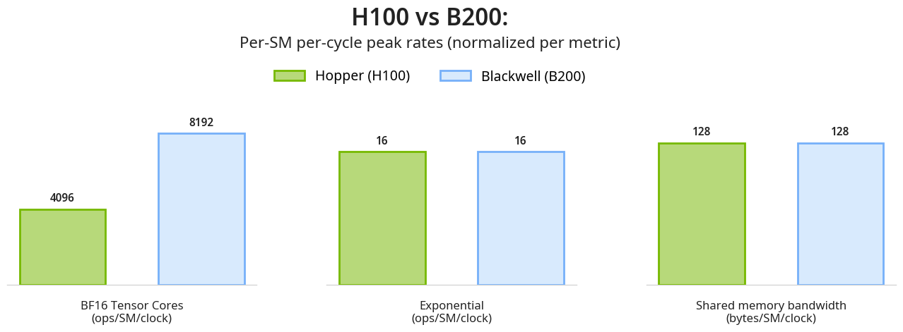

这种扩展上的不对称性深刻影响着 Blackwell 架构上 attention 等复杂内核的优化。attention 的核心由两个 GEMM（$S=Q \cdot K^T$ 和 $O=P \cdot V$）以及夹在二者之间的 softmax 组成；但在实际实现中，它还包含大量衔接与管理工作：数据移动、同步、布局变换、逐元素操作、调度、掩码等。

一种朴素观点认为，GEMM 的速度完全决定 attention 内核的性能，至少在一阶近似下，可以忽略其他组成部分。然而，对 B200 进行“供给与速度（feeds and speeds）”分析后得到的事实恰好相反：主要性能瓶颈不在于 Tensor Core 执行 MMA 的速度，而在于：（a）前向（FWD）计算中负责 softmax 指数运算的 SFU；（b）反向（BWD）计算中的共享内存流量。

本文介绍 FlashAttention-4，这是一种算法与内核协同设计，旨在最大限度重叠矩阵乘法与上述其他资源瓶颈。在 B200 上使用 BF16 时，其性能最高可达 1605 TFLOP/s（利用率 71%），相比 cuDNN 9.13 最高快 1.3 倍，相比 Triton 最高快 2.7 倍。

我们的主要算法与内核协同设计思路如下：

1. 用于最大化重叠的新流水线：新的前向与反向软件流水线利用 Blackwell 的全异步 MMA 和更大的矩阵块，重叠 Tensor Core、softmax 指数运算和内存操作。
2. 前向（FWD）过程：在 FMA 单元上通过多项式近似实现指数函数的软件模拟，以缓解指数运算瓶颈，并采用条件式在线 softmax 重缩放。
3. 反向（BWD）过程：把中间结果存储在张量内存中以减轻共享内存流量，再结合 Blackwell 新增的双 CTA MMA 模式进一步减少共享内存流量，同时把原子归约次数减半；此外还支持确定性执行模式，以实现可复现训练。
4. 调度：使用新的矩阵块调度器，缓解因因果掩码和可变序列长度引起的负载不均衡。

FlashAttention-4 的代码位于：[https://github.com/Dao-AILab/flash-attention/tree/main/flash_attn/cute](https://github.com/Dao-AILab/flash-attention/tree/main/flash_attn/cute)。

arXiv: [https://arxiv.org/abs/2603.05451](https://arxiv.org/abs/2603.05451)

## Blackwell 的新硬件特性

1. 张量内存（TMEM）：在 B200 上，148 个 SM 各自拥有 256 KB TMEM。它是与 Tensor Core 直接连接的片上暂存区，用于 warp 同步的中间数据存储。
2. 全异步第五代 Tensor Core：`tcgen05.mma` 是异步指令，并在 TMEM 中累加。对于 BF16 和 FP16，最大的单 CTA UMMA 矩阵块为 128×256×16，约为 Hopper 最大 WGMMA atom 的 2 倍。UMMA 由单个线程启动，可缓解寄存器压力，使更大的矩阵块和更深的流水线变得可行，而不会遭遇 Hopper warpgroup MMA 的寄存器溢出痛点。这也使 warp 特化更加实用：一部分 warp 移动矩阵块，其他 warp 发出 MMA，从而把矩阵乘累加与 softmax 和内存流量重叠。`tcgen05.mma` 还可以从 TMEM 读取操作数 A。
3. 双 CTA MMA：Blackwell 可以让同一 cluster 中的一对 CTA 跨越两个对等 CTA 的 TMEM，共同执行一个 UMMA。MMA 由领导 CTA 中的一个线程启动，但在指令执行期间，两个 CTA 都必须保持活跃。通过在 CTA 对之间拆分 M 和 N，MMA 矩阵块可以扩展到 256×256×16，同时减少冗余流量并降低每个 CTA 的资源占用。在一个内核的 TMEM 和 Tensor Core 操作中，CTA group 大小必须始终保持为 1 或 2。

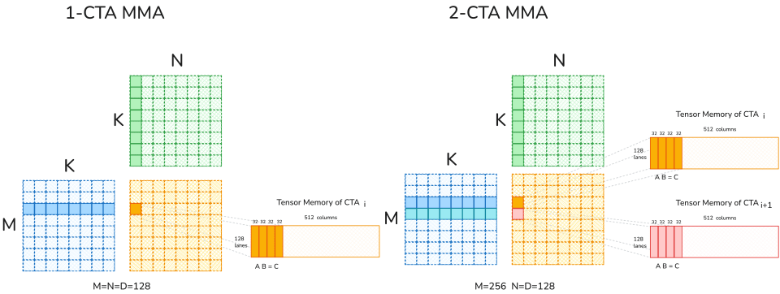

## 供给与速度分析

当 $M=N=D=128$ 时，B200 上每个 SM 的资源供给如下：

- Tensor Core（BF16）：$\frac{8192 \text{ 次操作}}{cycle}$
- 指数单元：$\frac{16 \text{ 次操作}}{cycle}$
- 共享内存流量：$\frac{128 \text{ 字节}}{cycle}$

对应速度（每个矩阵块所需的时钟周期）如下：

- 前向（2 个 MMA + MN 次指数运算）：
  - Tensor Core：$1024$
  - 指数运算：$1024$
  - SMEM: $768$
- 反向（5 个 MMA + MN 次指数运算）——单 CTA：
  - Tensor Core：$2560$
  - 指数运算：$1024$
  - SMEM: $3328$

结论是：前向过程受计算和指数运算限制，反向过程受共享内存带宽限制。因此，我们在前向过程中重叠 softmax 与 MMA，在反向过程中减少共享内存流量。

## 前向过程：采用条件式重缩放的新 softmax 流水线

前向过程包含两个矩阵乘法：$Q K^T$ 和 $P V$。在 Blackwell 上，Tensor Core 的速度大幅提高，但指数单元（MUFU.EX2）没有。因此，softmax 不再只是“夹在两个矩阵乘法之间的步骤”，而是必须精心进行流水化的瓶颈。

概括而言，FWD 过程采用以下设计：

- 每个 CTA 对 2 个 Q 矩阵块和 2 个 O 矩阵块进行 ping-pong 调度：最大限度重叠 MMA 与 softmax
- 2 个 softmax warpgroup：每个矩阵块执行一次 softmax，并通过同步避免两个 warpgroup 同时计算指数
- 用软件模拟 $2^x$：把指数计算分配给硬件 MUFU 和在 FMA 上运行的软件模拟路径
- 分阶段把 P 存入 TMEM：缓解寄存器压力
- correction warpgroup：指定专门的“校正”warpgroup 执行重缩放，将其移出关键路径
- 在线 softmax 条件式重缩放：降低重缩放频率，尽量减少非矩阵乘法操作

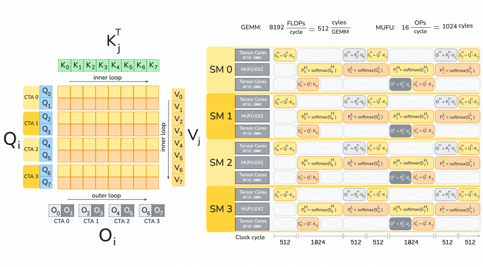

### 流水线：Q 矩阵块 ping-pong 加专用校正阶段

FlashAttention-4 每个 CTA 计算两个 query 矩阵块——$Q^H$ 和 $Q^L$——每个矩阵块覆盖 128 个 query token，并以 ping-pong 调度在二者之间交替。

Blackwell 改变了 softmax 的映射方式。$S = Q K^T$ 的累加器矩阵块大小为 128×128，并驻留在张量内存中；但按照硬件规定的矩阵块分区方式，将它读入寄存器时，每一行由一个线程负责。我们使用两个各含 128 个线程的 warpgroup，每个 Q 矩阵块对应一个；每个 softmax warpgroup 执行以下操作序列：

1. 每个线程从张量内存把 $S$ 的一行 128 个元素加载到寄存器
2. 归约 $\text{row max}$ 和 $\text{row sum}$
3. 使用一个可调参数，决定 128 个元素中哪些由硬件 MUFU 计算，哪些使用软件模拟的 $e^x$
4. 计算 $P = \text{softmax}(S)$ 并转换为 BF16 精度
5. 分阶段把 $P$ 存回张量内存，以缓解寄存器压力；否则需要同时保存 $S$ 的 128 个元素和 $P$ 的 64 个 BF16 元素
6. 一旦存储了 $P$ 的一个 $\frac{3}{4}$ 分块，就触发对应的 $P V$ 矩阵乘法

关键在于指数运算是瓶颈区段。我们显式同步两个 softmax warpgroup，使它们不会同时计算指数，从而减少对 MUFU 的争用。

为了使重缩放不进入关键路径，内核将其分配给一个专用 warpgroup。correction warpgroup 执行以下计算：

1. 仅在最大值跳变较大时进行重缩放：
$O_j =\begin{cases}\exp(m_{j-1}-m_j)\,O_{j-1} + \exp(S_j-m_j)\,V_j, & \text{if } m_j – m_{j-1} > \tau,\\O_{j-1} + \exp(S_j-m_{j-1})\,V_j, & \text{otherwise.}\end{cases}$
2. 在迭代结束时执行最终归一化：$O_{final} = \frac{O}{l_{final}}$
3. 可选地计算并存储 LSE

最后仍然使用真实的最终统计量进行归一化，因此跳过幅度较小的重缩放步骤不会改变最终输出，同时能从关键路径中删除许多向量计算。我们以 warp 粒度作出该决策，以避免分歧。

### 更快的指数运算：在 MUFU.EX2 与 FMA 软件模拟之间分配 $2^x$

Softmax 需要进行大量指数运算，而 MUFU 的吞吐量远低于 Tensor Core。FlashAttention-4 在硬件 MUFU.EX2 路径旁并行运行 exp2 的软件模拟，利用原本未被充分使用的 FMA 单元，从而提高有效指数吞吐量。

范围归约（Cody-Waite）：我们使用经典的 Cody-Waite 范围归约技术，把指数计算分解为整数部分和小数部分：$2^x = 2^{n} \cdot 2^{f}$。在 IEEE 754 float32 中，乘以 $2^{n}$ 只需要更新指数位。

$2^{x_{frac}}$ 的多项式近似（Horner 方法）：为了近似 $2^{f}$，我们将多项式改写为 Horner 形式，以便高效求值。

$$
2^{x_{\mathrm{frac}}} \approx p_0 + p_1 x_{\mathrm{frac}} + p_2 x_{\mathrm{frac}}^{2} + p_3 x_{\mathrm{frac}}^{3}
$$

系数 $p_0 = 1.0$、$p_1 ≈ 0.6951$、$p_2 ≈ 0.2276$、$p_3 ≈ 0.0771$ 由 Sollya 软件包选取，以最小化区间 $[0, 1)$ 上的相对近似误差。

指数位移位与相加：最后一步是组合整数部分 $n$ 与小数近似 $2^{f}$，得到 $2^{x} \approx 2^{n}\cdot 2^{f}$。由于 $2^f \in [1,2)$ 的 float32 指数为 127，乘以 $2^{n}$ 只需把整数 $n$ 移入指数域，再加上 $2^{f}$ 的尾数位。

## 反向过程：共享内存流量占主导地位

优化 FlashAttention 反向过程就像把一张过大的地毯塞进房间：压平一个角，另一个角又会翘起来。反向过程的 Tensor Core 工作量约为前向过程的 2.5 倍；它串联五个 MMA 操作以重新计算 $S$，并为 $dQ$、$dK$、$dP$ 和 $dV$ 执行 $QK$ 与 $PV$ 梯度 MMA，此外还要完成 $P$ 和 $dS$ 的逐元素工作。在 Blackwell 上，反向过程的限制因素不是 FLOP，而是共享内存带宽。

### 流水线：重叠 MMA 与 softmax

Hopper 时代的 FlashAttention-3 将 MMA 累加器保存在寄存器中，因此寄存器压力经常迫使调度更加串行。在 Blackwell 上，累加器驻留在 TMEM 中，使多个 MMA 保持执行中的同时，由 CUDA core 处理 $P$ 和 $dS$ 的逐元素工作成为可行方案。在我们的 roofline 分析中，指数吞吐量与两个 MMA 相当，因此值得把这部分延迟隐藏起来。

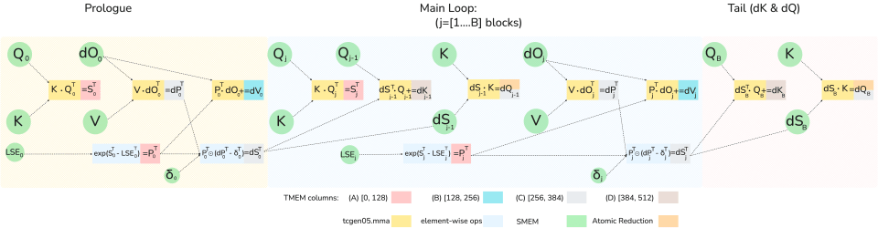

关键重叠方式很简单：在为矩阵块 $j$ 计算 softmax 时，已经为矩阵块 $j−1$ 发出 $dK$ 和 $dQ$ MMA。

为了减少共享内存流量，反向过程使用相对于前向过程转置的矩阵块重新计算 $S$ 和 $P$，因此中间结果已经是 $S^T$ 和 $P^T$。随后，可以按 $dV$ 和 $dK$ MMA 分别消耗的操作数 A 精确布局，把 $P^T$（以及之后的 $dS^T$）直接存入 TMEM。

TMEM 无法同时容纳五个完整累加器和中间结果，因此 FA4 在不同阶段复用 TMEM 列：$S$ 和 $P$ 共享一组列，$dP$、$dS$ 和 $dQ$ 共享另一组列。

### 双 CTA 反向过程：减少共享内存流量与全局原子加法

共享内存流量。即使改进了流水线，并把十个 GEMM 操作数中的两个保存在张量内存中，反向过程仍然受到共享内存带宽限制。我们使用 Blackwell 双 CTA MMA 模式缓解这一问题，该模式在 CTA 对之间划分输出累加器。当 $M=256$ 且 $N=K=128$ 时，两个 CTA 作为一个矩阵块协同工作：每个 CTA 暂存操作数 B 的一半，并只保留自己的累加器切片。这会使操作数 B 的共享内存流量大致减半。

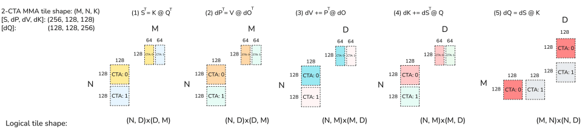

归约轴冲突。为减少 B 的流量，我们在五个反向 GEMM 中都使用 $M=256$、$N=K=128$ 的 MMA 矩阵块，但 $dQ$ MMA 的性质造成了不匹配。在 FlashAttention 反向过程中，每个 CTA 拥有一个固定的 $KV$ 矩阵块（外层循环在 $N$ 个 CTA 间并行化），并在内层循环中遍历 $M$ 矩阵块。$dQ$ 更新在外层循环中沿 $KV$ 序列进行归约。双 CTA MMA 拆分的是输出矩阵块，而不是归约；$dQ$ 的归约维度为 $N$，它已经在 CTA 对之间拆开。每个 CTA 对其所拥有的行仍然需要完整的归约。

解决方案：DSMEM 交换。我们利用 cluster 内的分布式共享内存，在两个 CTA 之间交换一半 $dS$ 来解决这一问题。这样会重新打包 $dS$，使其沿非归约轴划分：每个 CTA 拥有 $M/2$ 行，同时持有完整的 $2N$ 归约。每个 CTA 的 $dQ$ MMA 变为 $(M/2, 2N)\times(2N, d)$，并在张量内存中累加一个 $(M/2, d)$ 矩阵块。

在双 CTA 模式下，$S$、$dP$、$dV$ 和 $dK$ MMA 保持 $M=256$，而 $dQ$ 使用 $M=128$，并把归约维度加倍为 $2N=256$。随后，我们重新排列流水线以隐藏 DSMEM 延迟：先计算当前矩阵块的 $dP$，再计算前一个矩阵块的 $dQ$。由于 $dQ$ 矩阵块可以和 $P$ 一同装入 TMEM，它能够复用 $S$ 所使用的 TMEM 区域，因此 $dP$ 与 $dQ$ 不再像单 CTA 模式那样共享区域。在这种顺序下，当前矩阵块的逐元素 $dS$ 与前一次迭代的 $dQ$ MMA 相互重叠。

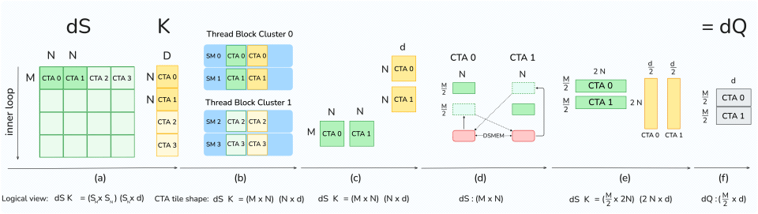

dQ 原子加法。作为额外收益，$dQ$ 分解将全局原子归约次数减半。原子操作具有非确定性且开销高，并且会在每次内层循环迭代中发生。因此，在双 CTA 反向过程中，每个 CTA 只写入 $dQ$ 矩阵块的一半，执行的全局原子归约次数也只有单 CTA 版本的一半。

### 确定性模式：在不过度损失吞吐量的前提下获得可复现的 dQ

非确定性来自 $dQ$ 的全局原子累加。FA4 提供了一种确定性模式，使用信号量式锁和内存栅栏串行化全局归约，以强制采用固定的累加顺序。但确定性并不一定意味着“所有工作都停下来”。FA4 使用 CTA swizzle 减少锁争用，并针对因果掩码采用最短处理时间优先（SPT）顺序来减少停顿。在我们的基准测试中，确定性反向过程实际最高可达到非确定性版本约 85%–90% 的吞吐量。

## 调度

因果掩码和可变序列长度会使 attention 负载失衡，因为不同工作矩阵块的 mainloop 长度不同。因此，FA4 改进了 grid 线性化方式，并采用最长处理时间优先（LPT）调度来缩短尾部。事实上，这些思路并不特定于 Blackwell 或某一种 GPU 架构，我们也在 FA3 中使用它们。

对于因果掩码，标准的 `(mblocks, heads, batches)` grid 顺序会以从最短到最长的次优顺序处理矩阵块。因此，FA4 对 batch-head 进行 swizzle，将其划分成 L2 大小的区段，并按 batch-head 区段遍历 grid：先以逆序迭代 mblock，再遍历每个区段中的 batch-head。

对于可变序列长度，不同 batch 包含的工作量不同，因此从 LPT 调度启发式的角度看，给定的 batch 处理顺序通常不是最优的。为纠正这一点，可以启动一个预处理内核，按照每个工作矩阵块的最大执行时间对 batch 排序，并写出虚拟 batch 索引到实际 batch 索引的映射；attention 内核据此以排序后的顺序遍历 batch。此外，可以缓存这些元数据，使排序不会带来性能损失。在撰写本文时，我们已经验证该思路并在 FA3 中实现，预计近期会把排序和其他元数据准备工作更广泛地纳入 FA4。

## 语言与框架：CuTe DSL

FA4 完全使用 CuTe DSL 实现；它是 CUTLASS 的 Python 内核 DSL。内核使用 Python 编写，DSL 将其降级为 PTX，再由 CUDA 工具包编译成 GPU 机器码。该编程模型映射了 CuTe/CUTLASS 抽象，并提供 PTX 逃生通道；与 C++ 模板相比，它把编译时间缩短约 20–30 倍。

## Attention 基准测试

我们展示 FlashAttention-4 在 B200（BF16）上的结果，并将其与 FlashAttention-2 以及 Triton、Gluon 和 cuDNN 实现进行比较。对 cuDNN，我们比较了 cuDNN 9.13 和最新版本 9.19.1.2。从 9.13 和 9.14 版本开始，我们一直与 cuDNN 团队合作，将 FlashAttention-4 的部分技术纳入 cuDNN，使这项工作能够惠及尽可能多的实践者。

在前向过程中，FlashAttention-4 比 cuDNN 9.13 快 1.1–1.3 倍，比 Triton 快 2.1–2.7 倍。在反向过程中，当序列长度较大时，FlashAttention-4 始终优于其他基线。

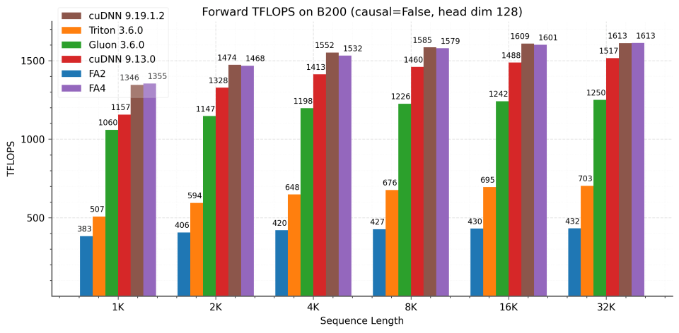

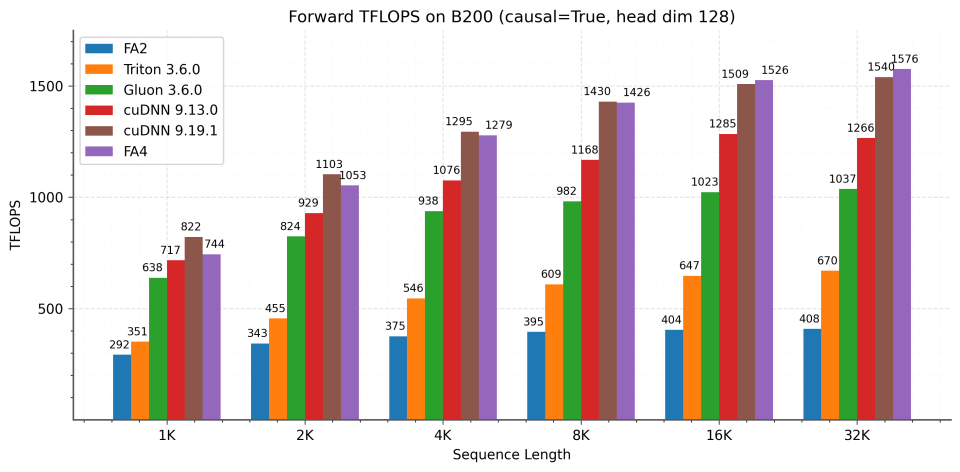

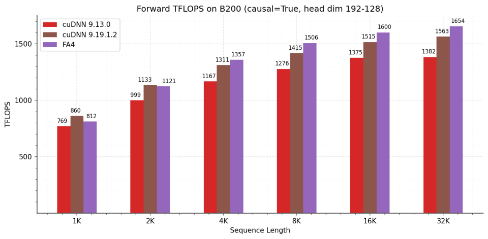

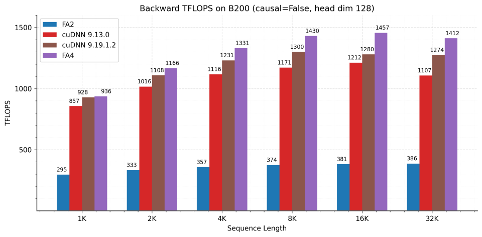

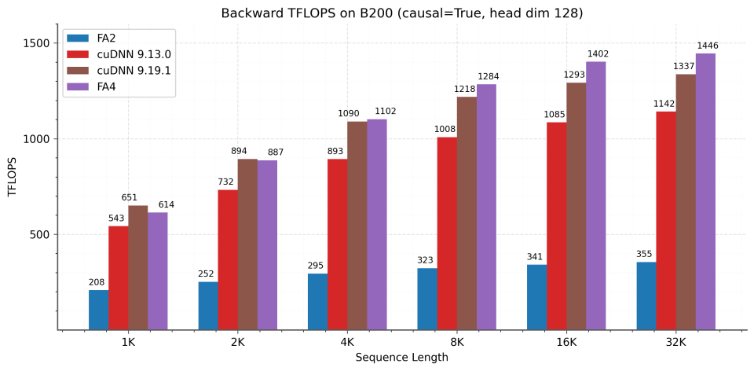

自 8 个月前首次发布代码以来，我们与 NVIDIA 的 cuDNN 和 CUTLASS 团队开展了愉快的合作。新版 cuDNN 现已实现本文的许多优化，最新 cuDNN 的性能与 FA4 相近。

## 致谢

感谢 Together AI、Meta、xAI 和 Princeton Language and Intelligence（PLI）提供计算支持。还要感谢 NVIDIA 的 cuDNN、TensorRT-LLM 和 CUTLASS 团队持续参与讨论、贡献想法并提供反馈。
