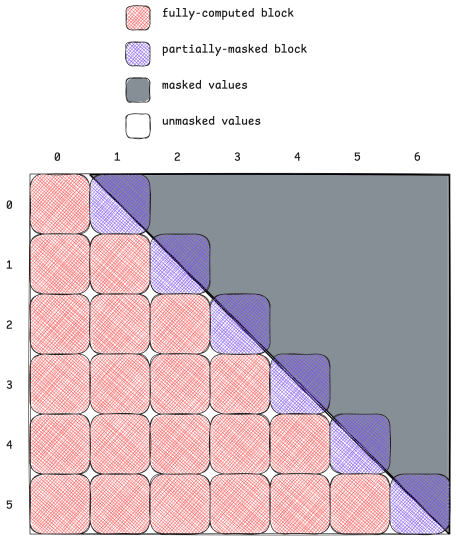
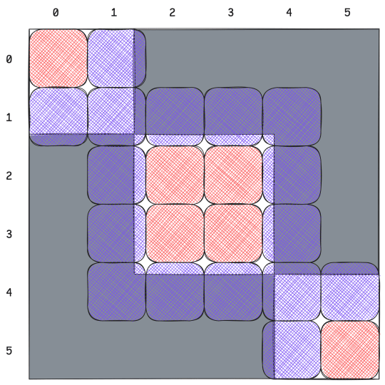
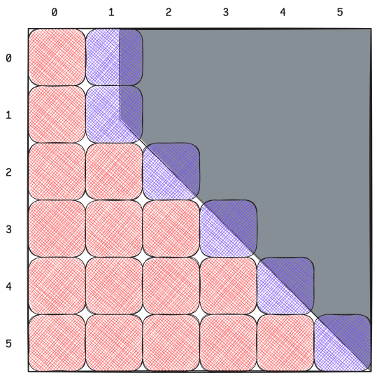

# FlashAttention CuTe DSL 中 FlexAttention 的用户指南

近年来，出于性能和模型质量等原因，许多 attention 变体开始流行（[Vaswani 等，2017](https://arxiv.org/abs/1706.03762)），包括：

- 用于自回归语言建模的 causal attention，其中一个 token 只关注先前 token；
- 用于长上下文语言建模的 sliding window attention，其中一个 token 只关注预定义窗口内的先前 token，把 attention 的计算复杂度从 $\mathcal{O}(n^2 d)$ 降至 $\mathcal{O}(nwd)$，其中 $w$ 为窗口大小；
- ALiBi（[Press 等，2021](https://arxiv.org/abs/2108.12409)），使用与距离成线性关系的位置 bias，在不显式使用 embedding 的情况下编码相对位置，从而改善对更长序列的外推；
- T5 bias 和 PrefixLM（[Raffel 等，2020](https://arxiv.org/pdf/1910.10683)），二者分别引入学习得到的加性 bias 或 prefix token，使 attention 结构由任务语义而非严格的序列顺序决定，并允许部分双向的非因果 attention；
- Attention sink（[Xiao 等，2023](https://arxiv.org/abs/2309.17453)），增加一组固定的缓存 KV token，让所有 token 都关注它们，在保持线性计算复杂度的同时保留全局上下文，从而显著提高 sliding window attention 的质量。

Meta 的 PyTorch 团队认识到，这些变体中的大多数——包括上面列出的全部变体——都可以统一到一个优雅框架中，该框架称为 FlexAttention（[Guessous 等，2024](https://pytorch.org/blog/flexattention/)）。这个简单 API 允许用户以相对较低的开发开销和不错的性能，定义并使用大量 attention 变体，包括已有变体的新组合。

FlexAttention 增加了两个定制入口：`score_mod` callable 修改 softmax 前的 attention 分数，`mask_mod` callable 对 softmax 前的 attention 分数应用掩码。总体而言，FlexAttention 具有以下形式：

$$
\text{FlexAttention}(Q, K, V) = \text{Softmax}\left({\color{orange}\text{mask\_mod}}\left({\color{red}\text{score\_mod}}\left(QK^T\right)\right)\right) V
$$

注意，`mask_mod` 是 `score_mod` 的一种特殊情况，它把分数设为 `-inf`。出于效率考虑，我们仍将二者分开；讨论块稀疏时会解释原因。

FlexAttention 的原始实现使用 Triton。在 Ampere GPU 上，该实现能达到 FlashAttention 2 约 90% 的性能；但在 Hopper 上，与 FlashAttention 3 相比明显更差。

本文讨论最近完成的 FlexAttention 实现，它被集成到 FlashAttention-4 CuTe DSL 中，由我们与 Driss Guessous（Meta）和 Tri Dao（普林斯顿大学、Together AI）合作开发。该实现在前向过程中达到 FlashAttention 3 的 95%，在大多数情况下比 Triton 版本快约 50%。FlashAttention-4 后端同时面向 Hopper（SM90）和 Blackwell（SM100）实现，并支持前向与反向过程。

本文重点解释 API，使开发者能够快速把 FlexAttention 集成到自己的工作流中。

## 分数修改

`score_mod` callable 根据位置和可选辅助张量修改 softmax 前的 attention 分数。通用签名为：

```
generic_score_mod(
    score: float,
    batch_idx: int,
    head_idx: int,
    q_idx: int,
    kv_idx: int,
    aux_tensors: Optional[list[tensor]],
) -> float
```

在 PyTorch 端，`score_mod` 还接受 `aux_integers`，它经常用于参数化偏移，例如非方形 causal masking。我们选择在默认情况下纳入序列长度信息，以略微简化签名，下文将给出示例。

### 示例

示例 1：T5（相对位置）bias

```
def rel_bias_score_mod(score, batch_idx, head_idx, q_idx, kv_idx, aux_tensors):
    bias_tensor = aux_tensors[0]
    rel_pos = math.abs(q_idx - kv_idx)
    return score + bias_tensor[batch_idx, head_idx, rel_pos]
```

示例 2：ALiBi

```
def alibi_score_mod(score, batch_idx, head_idx, q_idx, kv_idx, aux_tensors):
    slope = math.exp2(-(head_idx + 1))
    dist = math.abs(q_idx - kv_idx)
    return score - slope * dist
```

### CuTe DSL 实现

在 CuTe DSL 实现中，要求使用 `TensorSSA` 抽象定义 `score_mod`；参见 [CUTLASS TensorSSA notebook](https://github.com/NVIDIA/cutlass/blob/main/examples/python/CuTeDSL/notebooks/tensorssa.ipynb)。例如，T5 bias 可以写成以下形式：

```
@cute.jit
def rel_bias_score_mod_cute(
    tSrS_ssa: cute.TensorSSA,
    batch_idx: cute.TensorSSA,
    head_idx: cute.TensorSSA,
    q_idx: cute.TensorSSA,
    kv_idx: cute.TensorSSA,
    seqlen_info: SeqlenInfoQK,
    aux_tensors: Optional[list]
) -> cute.TensorSSA:
    bias_tensor = aux_tensors[0]
    rel_pos = cute.TensorSSA(
        mlir_math.absi(q_idx - kv_idx),
        q_idx.shape,
        q_idx.dtype
    )
    bias = bias_tensor[batch_idx[0], head_idx[0], rel_pos[0]].to(cutlass.Float32)
    return tSrS_ssa + bias
```

应用 `score_mod` 的成本很高，因为需要遍历分数矩阵中的所有条目；因此，`TensorSSA` 支持方便地使用向量化和广播指令。[在 attention mainloop 应用 score mod](https://github.com/Dao-AILab/flash-attention/blob/701ebe05783a3f83041a3f4604de083a328b20c1/flash_attn/cute/softmax.py#L334) 时，我们以 `vec_size` 为一组计算修改后的分数；`vec_size` 是可调超参数。需要注意，如果不增加其他假设，使用 `aux_tensors` 时无法对 `score_mod` 的应用进行向量化。

### 用法

定义 `score_mod` 函数后，用户可以轻松把它传入 FlashAttention 接口。

直接使用 CuTe DSL 接口：

```
from flash_attn.cute.interface import _flash_attn_fwd
out, _ = _flash_attn_fwd(
    q, k, v,  # torch.Tensor
    score_mod=rel_bias_score_mod_cute,
    aux_tensors=aux_tensors,  # Optional[list[torch.Tensor]]
)
```

Torch tensor 会在 `_flash_attn_fwd` 方法内部转换成 `cute.Tensor`。为简洁起见，这里省略了许多可选参数。

PyTorch 集成接口：

从源码构建时，FlexAttention 的 CuTe DSL 实现也会集成进 PyTorch；近期它将纳入稳定版本。用户无需定义兼容 `TensorSSA` 的 `score_mod` 函数，而可以在 PyTorch 中定义 `score_mod`，并依靠 TorchInductor 正确生成 CuTe DSL 代码：

```
from torch.nn.attention.flex_attention import flex_attention
compiled_fn = torch.compile(flex_attention)
out = compiled_fn(
    q, k, v,
    score_mod=rel_bias_score_mod,
    kernel_options={"force_flash": True},  # 使用 CuTe DSL 后端
)
```

## 掩码修改

定义 `mask_mod` callable 与 `score_mod` 几乎相同，只是有所简化。掩码应用逻辑包含在 FlashAttention 前向内核中，因此 `mask_mod` callable 只需返回一个布尔值，表示某个分数是否需要被掩码，也就是设为 `-inf`：

```
generic_mask_mod(
    batch_idx: cute.TensorSSA,
    head_idx: cute.TensorSSA,
    q_idx: cute.TensorSSA,
    kv_idx: cute.TensorSSA,
    seqlen_info: SeqlenInfoQK
    aux_tensors: Optional[list],
) -> cute.TensorSSA  # dtype == cutlass.Boolean
```

注意，与 `score_mod` 不同，这里不传入分数本身；只需要位置信息来判断某个 attention 元素是否应被掩码。

### 示例

示例 1：带偏移的 causal mask

为了创建带有正确偏移（`seqlen_k - seqlen_q`）的 causal mask，可以使用 `SeqlenInfoQK` 类内置的属性；该类[定义在这里](https://github.com/Dao-AILab/flash-attention/blob/main/flash_attn/cute/seqlen_info.py)：

```
@cute.jit
def causal_mask_mod(batch_idx, head_idx, q_idx, kv_idx, seqlen_info, aux_tensors):
    offset = seqlen_info.seqlen_k - seqlen_info.seqlen_q
    return kv_idx <= q_idx + offset # TensorSSA 会广播标量
```

示例 2：文档掩码

拼接来自多个文档的序列后，token 应只关注其所属文档内的 token。为了防止信息跨文档边界泄漏，可以执行以下操作：

```
@cute.jit
def document_mask_mod(batch_idx, head_idx, q_idx, kv_idx, seqlen_info, aux_tensors):
    doc_ids = aux_tensors[0]
    doc_id_q = doc_ids[batch_idx[0], head_idx[0], q_idx[0]]
    doc_id_kv = doc_ids[batch_idx[0], head_idx[0], kv_idx[0]]
    q_doc = utils.scalar_to_ssa(doc_id_q, cutlass.Int32)
    kv_doc = utils.scalar_to_ssa(doc_id_kv, cutlass.Int32)
    return q_doc == kv_doc
```

这里，`doc_ids` 是形状为 `(B, H, seqlen)` 的 `Int32` 张量，表示给定 token 所属的文档，并假定各文档连续排列。为简化处理，有时还会假定它非负且非递减，但这并非严格要求。

### 用法

```
out, _ = _flash_attn_fwd(
    q, k, v,
    mask_mod=document_mask_mod,
    aux_tensors=[doc_ids],
)
```

## 块稀疏

FlexAttention 在概念上的简洁掩盖了对精心优化的需求。当分数矩阵中的大部分区域需要被掩码时，应尽可能智能地避开这些区域，跳过不必要的数据移动和计算。为此，FlexAttention 使用 mask mod 实现块稀疏。

以 causal masking 为例。考虑 batch size 为 1、一个 head、`seqlen_q = 768`、`seqlen_kv = 896`、工作矩阵块大小为 `128×128` 的问题。总共需要处理 42 个块：

- 主对角线上的 6 个块被 causal mask 一分为二；注意，在 causal masking 中，对角线经过偏移后与右下角而不是左上角对齐。这些块需要应用 `mask_mod`。
- 对角线下方的 21 个块完全不需要掩码；它们不需要应用 `mask_mod`，但仍需要 `score_mod`，因此应跳过这些块上的 `mask_mod`。
- 剩余 15 个块应完全跳过；即使加载它们也是浪费。



### 块稀疏张量

FlashAttention 内核中的每个工作矩阵块对应一个 `(batch, head, q_block)` 坐标。为了只计算所需矩阵块，需要知道每个部分掩码矩阵块和每个完整计算矩阵块的坐标。我们把这些信息封装在两个张量中：

- `mask_block_idx: [B, H, num_q_blocks, num_kv_blocks]` 表示需要应用 `mask_mod` 的块；
- `full_block_idx: [B, H, num_q_blocks, num_kv_blocks]` 表示完整计算的块。

其中，`num_q_blocks = ceil_div(seqlen_q, tile_m)` 是 `q` 维度上的工作矩阵块数量，`num_kv_blocks = ceil_div(seqlen_kv / tile_n)` 是 `kv` 维度上的工作矩阵块数量。

为了正确索引这些张量，还要跟踪两个“计数”张量：

- `mask_block_cnt: [B, H, num_q_blocks]` 表示部分掩码 `kv_block` 的总数；
- `full_block_cnt: [B, H, num_q_blocks]` 表示完整计算 `kv_block` 的总数。

假定对任意 `(b, h, q_block)`：

1. 令 `mask_cnt = mask_block_cnt[b, h, q_block]`，张量 `mask_block_idx[b, h, q_block, :mask_cnt]` 严格递增，余下部分 `mask_block_idx[b, h, q_block, mask_cnt:]` 恒为 0。
2. 令 `full_cnt = full_block_cnt[b, h, q_block]`，张量 `full_block_idx[b, h, q_block, :full_cnt]` 严格递增，与 `mask_block_idx[b, h, q_block, :mask_cnt]` 不相交，余下部分 `full_block_idx[b, h, q_block, full_cnt:]` 恒为 0。

条件 2 中的不相交性保证没有任何块被处理两次。

为保持整洁，这些张量被封装在 `BlockSparseTensors` 类中：

```
class BlockSparseTensors(NamedTuple):
    mask_block_cnt: cute.Tensor
    mask_block_idx: cute.Tensor
    full_block_cnt: Optional[cute.Tensor]
    full_block_idx: Optional[cute.Tensor]
```

注意，`full_block_cnt` 和 `full_block_idx` 可以省略；此时会对所有块应用 `mask_mod`。

示例：Causal masking 的块稀疏性

对于使用上述参数的 causal masking，块稀疏张量为：

```
mask_block_cnt = [[[1, 1, 1, 1, 1, 1]]]
mask_block_idx = [[[[1, 0, 0, 0, 0, 0, 0],
                    [2, 0, 0, 0, 0, 0, 0],
                    [3, 0, 0, 0, 0, 0, 0],
                    [4, 0, 0, 0, 0, 0, 0],
                    [5, 0, 0, 0, 0, 0, 0],
                    [6, 0, 0, 0, 0, 0, 0]]]]
full_block_cnt = [[[1, 2, 3, 4, 5, 6]]]
full_block_idx = [[[[0, 0, 0, 0, 0, 0, 0],
                    [0, 1, 0, 0, 0, 0, 0],
                    [0, 1, 2, 0, 0, 0, 0],
                    [0, 1, 2, 3, 0, 0, 0],
                    [0, 1, 2, 3, 4, 0, 0],
                    [0, 1, 2, 3, 4, 5, 0]]]]
```

### 计算块稀疏性

为给定 `mask_mod`、序列长度和矩阵块大小计算 `BlockSparseTensors` 可能开销很高，而且无法避免。不过，该成本通常会在模型的所有层之间摊销，因此实践中问题不大。

PyTorch 提供了类似但更加稳健的 `BlockMask` 类，可以把它转换为 `BlockSparseTensors`：

```
from torch.nn.attention.flex_attention import create_block_mask
block_mask_torch = create_block_mask(
    mask_mod_fn,  # PyTorch 掩码函数
    B, H, seqlen_q, seqlen_kv,
    device="cuda",
    BLOCK_SIZE=(tile_m, tile_n),
)
# 转换为 CuTe DSL 格式
_, _, mask_cnt, mask_idx, full_cnt, full_idx, *_ = block_mask_torch.as_tuple()
block_sparse_tensors = BlockSparseTensorsTorch(
    mask_block_cnt=mask_cnt,
    mask_block_idx=mask_idx,
    full_block_cnt=full_cnt,
    full_block_idx=full_idx,
)
```

警告：计算块稀疏性时使用的矩阵块大小必须与内核使用的矩阵块大小相同。

## 完整 API 调用

总体而言，可通过以下调用在 FlashAttention CuTe DSL 中使用 FlexAttention：

```
_flash_attn_fwd(
    q, k, v,  # torch.Tensor
    score_mod=score_mod,  # Callable
    mask_mod=mask_mod,  # Callable
    block_sparse_tensors_torch=block_sparse_tensors,  # BlockSparseTensorsTorch
    aux_tensors=aux_tensors,  # Optional[list[torch.Tensor]]
)
```

在 `_flash_attn_fwd` 内部，`block_sparse_tensors_torch` 通过以下调用转换成 `BlockSparseTensors` 对象：

```
sparse_tensors = flash_attn.cute.block_sparsity.to_cute_block_sparse_tensors(
    block_sparse_tensors_torch
)
```

### 示例

#### 示例 1：带相对位置 Bias 的文档掩码

该示例组合使用 `score_mod` 和 `mask_mod`，二者都使用 `aux_tensors`。

假设给定 `doc_ids` 张量和形状为 `[B, H, max_seqlen]` 的 `rel_bias` 张量，其中 `max_seqlen = max(seqlen_kv, seqlen_q)`。例如，可以令 `B = 1, H = 1, max_seqlen = 640`，并使用以下 `doc_ids` 张量：

```
# 3 个文档分别位于 [0:230]、[230:410]、[410:640]
doc_ids = torch.zeros((1, 1, 640), dtype=torch.int32)
doc_ids[0, 0, :230] = 0
doc_ids[0, 0, 230:410] = 1
doc_ids[0, 0, 410:] = 2
```

组合 `score_mod` 和 `mask_mod` 的完整实现如下：

```
@cute.jit
def doc_rel_bias_score_mod(
    tSrS_ssa,
    b_idx,
    h_idx,
    q_idx,
    kv_idx,
    seqlen_info,
    aux_tensors
):
    rel_bias = aux_tensors[0]
    distance = cute.TensorSSA(
        mlir_math.absi(q_idx - kv_idx),
        q_idx.shape, q_idx.dtype
    )
    bias = rel_bias[b_idx[0], h_idx[0], distance[0]].to(cutlass.Float32)
    return tSrS_ssa + bias
@cute.jit
def document_mask_mod(
    b_idx,
    h_idx,
    q_idx,
    kv_idx,
    seqlen_info,
    aux_tensors
):
    doc_ids = aux_tensors[1]  # 第二个辅助张量
    q_doc = doc_ids[b_idx[0], h_idx[0], q_idx[0]]
    kv_doc = doc_ids[b_idx[0], h_idx[0], kv_idx[0]]
    q_doc_ssa = utils.scalar_to_ssa(q_doc, cutlass.Int32)
    kv_doc_ssa = utils.scalar_to_ssa(kv_doc, cutlass.Int32)
    return q_doc_ssa == kv_doc_ssa
rel_bias = torch.randn((1, 1, 640), dtype=torch.float32)
aux_tensors = [rel_bias, doc_ids]
# 计算块稀疏性
block_sparse_tensors = compute_block_sparsity(...)
out, _ = _flash_attn_fwd(
    q, k, v,
    score_mod=doc_rel_bias_score_mod,
    mask_mod=document_mask_mod,
    block_sparse_tensors_torch=block_sparse_tensors,
    aux_tensors=aux_tensors,
)
```

该掩码的块稀疏张量清楚展示了三个文档块的结构，每个 token 只关注其所属文档内的 token。



### 示例 2：带逐 Head Bias 的 PrefixLM

PrefixLM（[Raffel 等，2020](https://arxiv.org/pdf/1910.10683)）组合 causal 与 non-causal attention：在普通 causal masking 之外，让所有 token 都关注一个固定长度的 prefix。这适用于输入应以双向方式处理——例如 encoder——而输出仍保持自回归的任务。

`mask_mod` 函数如下：

```
def create_prefix_lm_mask(prefix: int):
    @cute.jit
    def _prefix_lm_mask_mod(
        b_idx,
        h_idx,
        q_idx,
        kv_idx,
        seqlen_info,
        aux_tensors
    ):
        prefix_ssa = utils.scalar_to_ssa(prefix, cutlass.Int32)
        offset = seqlen_info.seqlen_k - seqlen_info.seqlen_q
        offset_ssa = utils.scalar_to_ssa(offset, cutlass.Int32)
        # prefix 内允许双向 attention，之后使用 causal attention
        in_prefix = kv_idx < prefix_ssa
        causal = kv_idx <= q_idx + offset_ssa
        return in_prefix | causal
    return _prefix_lm_mask_mod
```

`score_mod` 函数很简单，接收逐 head bias 张量 `head_bias`：

```
@cute.jit
def head_bias_score_mod(
    tSrS_ssa,
    b_idx,
    h_idx,
    q_idx,
    kv_idx,
    seqlen_info,
    aux_tensors
):
    head_bias = aux_tensors[0]
    bias_val = head_bias[h_idx[0]].to(cutlass.Float32)
    return tSrS_ssa + bias_val
```

当 batch size 为 1、head 数为 1、矩阵块大小为 128×128、序列长度为 768、prefix 长度为 204 时，块稀疏结构呈现 PrefixLM 的典型模式：所有 token 都能双向关注第一个块，也就是 prefix；后续 token 则遵循 causal masking。

```
head_biases = torch.randn(num_heads, dtype=torch.float32)
mask_mod = create_prefix_lm_mask(prefix=204, offset=0)
out, _ = _flash_attn_fwd(
    q, k, v,
    score_mod=head_bias_score_mod,
    mask_mod=mask_mod,
    block_sparse_tensors_torch=block_sparse_tensors,
    aux_tensors=[head_biases],
)
```



### 快速参考

| 特性 | 类型 | 示例 |
|---|---|---|
| ALiBi | `score_mod` | `-slope * distance` |
| Causal | `mask_mod` | `kv_idx <= q_idx` |
| 滑动窗口 | `mask_mod` | `abs(q_idx - kv_idx) <= w` |
| T5 bias | `score_mod` | `score + bias[rel_pos]` |
| 文档掩码 | `mask_mod` | `doc[q] == doc[kv]` |
| PrefixLM | `mask_mod` | `kv < prefix \| kv <= q` |

## 入门

下面是一个可以运行的最小示例，用于开始使用 FlexAttention：

```
# 1. 定义 mod
import flash_attn.cute.utils as utils
@cute.jit
def my_score_mod(score, b_idx, h_idx, q_idx, kv_idx, seqlen_info, aux_tensors):
    scale = utils.scalar_to_ssa(1.1, cutlass.Float32)
    return score * scale  # 示例：缩放分数
@cute.jit
def my_mask_mod(b_idx, h_idx, q_idx, kv_idx, seqlen_info, aux_tensors):
    return kv_idx <= q_idx  # 示例：不带偏移的 causal
# 2. 计算块稀疏性
from torch.nn.attention.flex_attention import create_block_mask
block_mask = create_block_mask(
    my_mask_mod,
    B, H, seqlen_q, seqlen_kv,
    device="cuda",
    BLOCK_SIZE=(128, 128)
)
# 3. 运行 attention
from flash_attn.cute.interface import _flash_attn_fwd
out, lse = _flash_attn_fwd(
    q, k, v,
    score_mod=my_score_mod,
    mask_mod=my_mask_mod,
    block_sparse_tensors_torch=block_mask
)
```

关键步骤是：（1）把 attention 修改定义为 callable；（2）针对掩码模式和矩阵块大小计算一次块稀疏性；（3）使用这些修改调用前向函数。块稀疏计算结果可以缓存，并在不同层和迭代之间复用。

有关原生 CuTe DSL API——不使用 PyTorch——的更多细节，请参阅附录。

## 参考文献

- Vaswani et al., “Attention Is All You Need”, 2017. Attention is all you need. In Proceedings of the 31st International Conference on Neural Information Processing Systems (NIPS’17). Curran Associates Inc., Red Hook, NY, USA, 6000–6010.
- Press et al., “Train Short, Test Long: Attention with Linear Biases Enables Input Length Extrapolation”, 2021. https://arxiv.org/abs/2108.12409
- Raffel, Colin et al. “Exploring the Limits of Transfer Learning with a Unified Text-to-Text Transformer.” J. Mach. Learn. Res. 21 (2019): 140:1-140:67.
- Xiao et al., “Efficient Streaming Language Models with Attention Sinks”, 2023. https://arxiv.org/abs/2309.17453
- Guessous et al., “FlexAttention: The Flexibility of PyTorch with the Performance of FlashAttention”, 2024. https://pytorch.org/blog/flexattention/

## 附录：CuTe DSL 原生 API

本附录介绍不引用 torch tensor 时使用 FlexAttention 的 API。`flash_attn.cute.compute_block_sparsity` 中提供了原生 CuTe DSL 块稀疏计算内核，其接口 `compute_blocksparse_tensors` 的签名如下：

```
compute_block_sparsity(
    tile_m,
    tile_n,
    batch_size,
    num_heads,
    seqlen_q,
    seqlen_k,
    mask_mod: Callable,
    aux_tensors: Optional[list],  # list[cute.Tensor]
    device,
    compute_full_blocks: bool = True,
    use_fast_sampling: bool = False,
) -> Tuple[BlockSparseTensors, BlockSparseTensorsTorch]:
```

有了这个内核，就可以展示使用原生 API 的完整示例工作流，适用于 `compute_capability in [9, 10, 11]`：

```
from flash_attn.cute.compute_block_sparsity import compute_blocksparse_tensors
from flash_attn.cute.flash_fwd import FlashAttentionForwardSm90
from flash_attn.cute.flash_fwd_sm100 import FlashAttentionForwardSm100
tile_m, tile_n = 128, 128
batch_size, num_heads, seqlen_q, seqlen_k = 2, 8, 8192, 8192
mask_mod = user_defined_mask_mod
score_mod = user_defined_score_mod
aux_tensors = user_provided_aux_tensors
device = "cuda"
# 计算块稀疏性
blocksparse_tensors, blocksparse_torch_tensors = compute_blocksparse_tensors(
    tile_m,
    tile_n,
    batch_size,
    num_heads,
    seqlen_q,
    seqlen_k,
    mask_mod,
    aux_tensors,
    device,
)
# 实例化内核
if compute_capability == 9:
    fa_fwd = FlashAttentionForwardSm90(
        dtype,
        head_dim,
        head_dim_v,
        qhead_per_kvhead,
        is_causal=False,
        is_local=False,
        pack_gqa=False,
        tile_m=tile_m,
        tile_n=tile_n,
        num_stages=2,
        num_threads=384,
        Q_in_regs=False,
        intra_wg_overlap=True,  # 用于优化的可调超参数
        mma_pv_is_rs=True,  # 用于优化的可调超参数
        mask_mod=mask_mod,
        score_mod=score_mod,
        has_aux_tensors=aux_tensors is not None,  # 编译期已知
        q_subtile_factor=None,
    )
elif compute_capability in [10, 11]:
    fa_fwd = FlashAttentionForwardSm100(
        head_dim,
        head_dim_v,
        qhead_per_kvhead=qhead_per_kvhead,
        is_causal=causal,
        is_local=local,
        is_split_kv=is_split_kv,
        pack_gqa=pack_gqa,
        m_block_size=m_block_size,
        n_block_size=n_block_size,
        q_stage=q_stage,
        is_persistent=not causal
            and not local
            and cu_seqlens_q is None
            and seqused_q is None
            and not is_split_kv,
        score_mod=score_mod,
        mask_mod=mask_mod,
        has_aux_tensors=aux_tensors is not None,
        paged_kv_non_tma=page_size not in [None, 128],
        is_varlen_q=cu_seqlens_q is not None
            or seqused_q is not None,
        q_subtile_factor = None,
    )
else:
    raise ValueError(
        f"Unsupported compute capability: {compute_capability}. Supported: 9.x, 10.x, 11.x"
    )
# 假设可以方便地访问相关张量
q_tensor, k_tensor, v_tensor, o_tensor, lse_tensor = get_tensors(...)
# 编译内核；在真实使用场景中会缓存已编译内核
fa_fwd_compiled = cute.compile(
    fa_fwd,
    q_tensor,
    k_tensor,
    v_tensor,
    o_tensor,
    lse_tensor,
    softmax_scale,
    current_stream,
    cu_seqlens_q_tensor,
    cu_seqlens_k_tensor,
    seqused_q_tensor,
    seqused_k_tensor,
    page_table_tensor,
    None,  # 左侧窗口大小
    None,  # 右侧窗口大小
    learnable_sink_tensor,
    blocksparse_tensors,
    aux_tensors,
)
# 如有需要，使用新参数运行内核
fa_fwd_compiled(
    q_tensor_new,
    k_tensor_new,
    v_tensor_new,
    o_tensor_new,
    lse_tensor_new,
    softmax_scale_new,
    current_stream_new,
    cu_seqlens_q_tensor_new,
    cu_seqlens_k_tensor_new,
    seqused_q_tensor_new,
    seqused_k_tensor_new,
    page_table_tensor_new,
    None,  # 左侧窗口大小
    None,  # 右侧窗口大小
    learnable_sink_tensor_new,
    blocksparse_tensors_new,
    aux_tensors_new,
)
```
