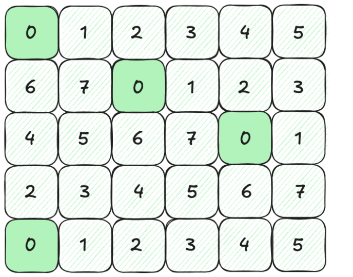
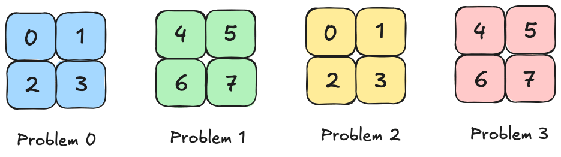
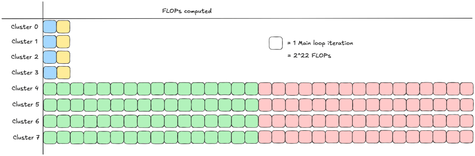
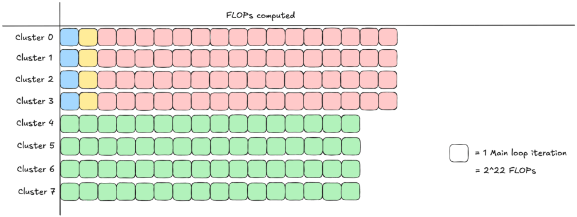
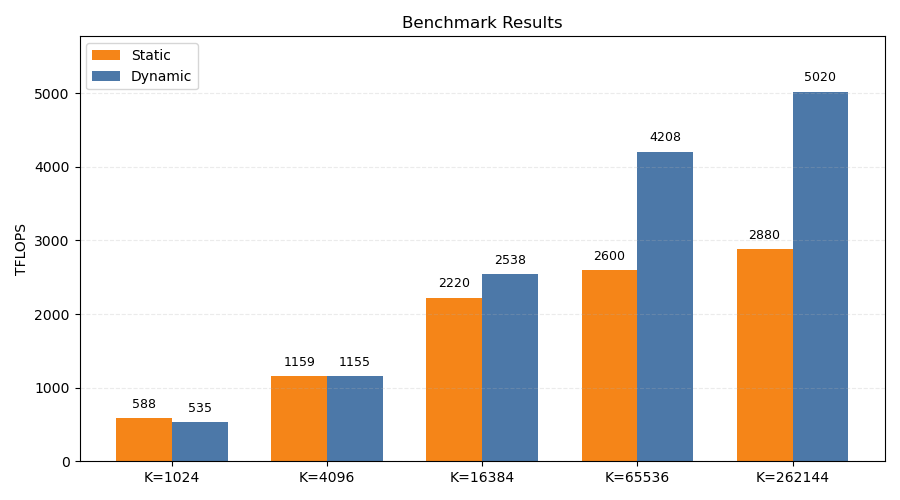
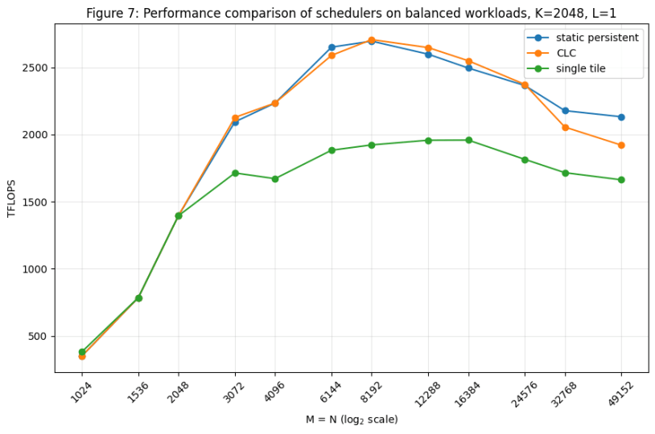
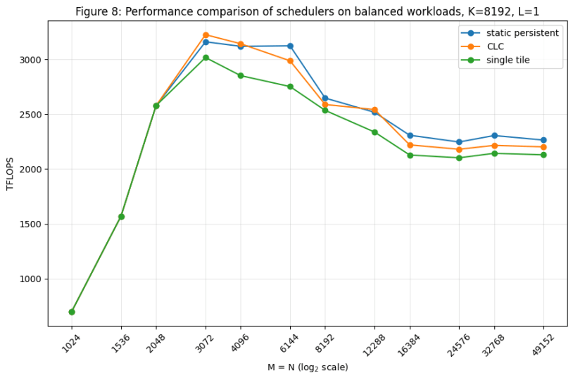
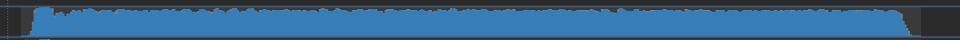
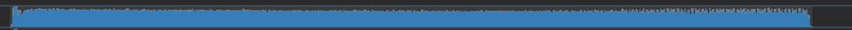
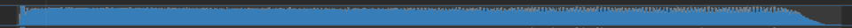

# 在 NVIDIA Blackwell GPU 上使用 Cluster Launch Control（CLC）进行动态持久化矩阵块调度

### 动机

考虑矩阵乘法（GEMM）问题

$C=AB$ ,

其中 $A \in \R^{M\times K}$、$B \in \R^{K\times N}$、$C \in \R^{M\times N}$。通过使用某个矩阵块形状 `(bM, bN, bK)` 划分问题形状 `(M, N, K)`，并按下式计算每个 `bM × bN` 输出矩阵块，可以并行计算 C：

$C^{[i,j]} \equal \sum A^{[i,k]}B^{[k,j]}$ .

每个工作矩阵块 $C^{[i,j]}$ 都必须分配给某个处理器；具体到 CUDA 执行模型，就是一个 CTA 或一个 CTA cluster。矩阵块调度问题的目标，是确定如何在处理器之间以最佳方式分配这些工作矩阵块。

本文讨论 Cluster Launch Control（CLC）。它是 NVIDIA Blackwell GPU 上由硬件支持的一项特性，有助于实现最优矩阵块调度，尤其是在负载均衡方面。为了提供背景，我们首先概览几种常见调度策略，以及 CLC 旨在解决的缺陷；然后逐步分析如何在 CuTe DSL 内核中使用 CLC 的实现级细节；最后比较一个 GEMM 内核的性能。

### 单矩阵块调度

最朴素的矩阵块调度方案，是启动一个形状为 `(M/bM, N/bN)` 的 cluster 网格，并把每个工作矩阵块分配给唯一的 cluster。这种方式有利于负载均衡：网格中的 cluster 数量多于 SM group 数量，因此每当一个 cluster 退出，硬件调度器就会把队列中的另一个 cluster 分派给刚刚空闲的 SM group。然而，从整体上看，该策略往往并非最优，因为每个 cluster 都要承担固定的启动成本——流水线初始化、描述符设置等——而这些成本只由单个矩阵块摊销。此外，单矩阵块调度无法跨工作矩阵块重叠操作以隐藏延迟，例如无法把一个工作矩阵块的 epilogue 与另一个矩阵块的 mainloop 重叠。

### 静态持久化矩阵块调度

另一方面，也可以选择持久化矩阵块调度方案。下面简要回顾持久化矩阵块调度的概念；更详细的说明请参阅[上一篇文章](https://research.colfax-intl.com/cutlass-tutorial-persistent-kernels-and-stream-k/)。

在持久化方案中，启动的网格所包含的 cluster 数量等于 GPU 能够并发调度的最大 cluster 数量。一旦启动，cluster 就会“持久”驻留在 GPU 上，计算一组工作矩阵块。例如，给定 148 个 SM 和大小为 2 的 cluster，可以在 GPU 上并发启动 74 个 cluster。如果启动一个包含 512 个工作矩阵块的 GEMM 内核，就可以为这些工作矩阵块选择某种线性顺序，并让每个 cluster 每隔 74 个矩阵块计算一个。



图 1：GEMM 的输出 C 被划分成一个 5×6 的工作矩阵块网格，每个矩阵块由 8 个 cluster 中的一个计算。每个工作矩阵块都标有其被分配到的 cluster；分配给 cluster 0 的工作矩阵块以高亮显示。

持久化矩阵块调度的主要优势，是可以把一个矩阵块的 epilogue 与下一个矩阵块的 mainloop 重叠，同时避免启动新 cluster 的延迟。但静态持久化矩阵块调度可能引发负载不均衡。以 grouped GEMM 为例，它计算一组 GEMM：

$C_i = A_iB_i, \quad i = 0,1,\dots,$ `num_problems` $-1$

例如，可以考虑由以下四个问题组成的 grouped GEMM：

| 问题 0： | (256, 256, 128) |
|---|---|
| 问题 1： | (256, 256, 2048) |
| 问题 2： | (256, 256, 128) |
| 问题 3： | (256, 256, 2048) |

每个 GEMM 都有 `M = N = 256`，但某些问题的收缩维度较小（`K = 128`），另一些问题则较大（`K = 2048`）。考虑一个使用以下矩阵块形状计算该 grouped GEMM 的内核：

(bM, bN, bK) = (128, 128, 128).

如果 GPU 上有足够资源并发启动 8 个 cluster，可以按下图把工作矩阵块分配给各个 cluster。



图 2：grouped GEMM 中的每个工作矩阵块被分配给 8 个 cluster 中的一个。在静态持久化方案中，先把所有问题的工作矩阵块按线性顺序排列，再每隔 8 个矩阵块分配给同一个 cluster。

乍看之下，这种分配似乎完全均衡，因为每个 cluster 恰好计算两个工作矩阵块。但这些工作矩阵块所需的计算量因问题而异：问题 0 和 2 的工作矩阵块需要

$2*\text{bM}*\text{bN}*\text{K} = 2*2^7*2^7*2^7=2^{22}$ `FLOPs`

而问题 1 和 3 的工作矩阵块需要

$2*\text{bM}*\text{bN}*\text{K} = 2*2^7*2^7*2^{11}=2^{26}$ `FLOPs` .

因此，如果考察每个 cluster 计算的 FLOP 数量，就会看到显著的负载不均衡：



图 3：以计算的 FLOP 数量表示静态持久化方案中每个 cluster 完成的工作。

这种不均衡促使我们采用动态持久化调度。

### 动态持久化矩阵块调度

在这种调度方案中，每个 cluster 先计算某个初始工作矩阵块；如果仍有可用工作，它会继续获取并处理新的工作矩阵块。下面考察这种方式如何避免前述示例中的负载不均衡。合理地假设 cluster 处理问题 0 或 2 中一个矩阵块所需的时间远短于处理问题 1 或 3 中一个矩阵块，那么工作矩阵块到 cluster 的分配可能如下图所示：


图 4：grouped GEMM 中的每个工作矩阵块被分配给 8 个 cluster 中的一个。在动态持久化方案中，先把所有问题的工作矩阵块按线性顺序排列，并为每个 cluster 分配一个初始工作矩阵块；cluster 完成当前工作后，可以继续获取新的工作矩阵块。

注意，除初始分配外，程序员无法控制哪些工作矩阵块由哪些 cluster 计算。后续分配在运行时由 cluster 完成工作的顺序决定。可以看到，在这种情况下，各个 cluster 计算的 FLOP 数量分布更加均匀。



图 5：以计算的 FLOP 数量表示动态持久化方案中每个 cluster 完成的工作。

<a id="imbalanced-benchmark"></a>

改进的负载均衡会提升内核性能。例如，可以在 B200 上对以下问题形状的 grouped GEMM 进行基准测试：

| 问题 0： | (1024, 1024, 1024) |
|---|---|
| 问题 1： | (1024, 1024, K) |
| 问题 2： | (1024, 1024, 1024) |
| 问题 3： | (1024, 1024, K) |

该 B200 可以并发支持 74 个形状为 `(2, 1)` 的 cluster。逐步增大 K 后，静态和动态方案的结果如下。



图 6：对负载高度不均衡的 grouped GEMM 使用静态与动态调度时的性能。测量配置的操作数数据类型为 mxfp4，MMA 矩阵块大小为 256×128，并使用双 CTA MMA 指令。

与预期一致，当工作矩阵块高度负载不均衡时，动态调度器显著优于静态调度器。

#### 动态持久化矩阵块调度的标准实现

实现动态持久化矩阵块调度时，需要保证两个性质：

（1）每个矩阵块最终都由某个 cluster 处理；
（2）任何矩阵块都不会被多个 cluster 重复处理。

一种标准策略是维护一个全局原子计数器，即信号量锁，用来跟踪下一个未分配矩阵块。cluster 完成当前矩阵块后，对该计数器执行原子 fetch-and-increment，以取得下一个矩阵块索引。每个 cluster 持续请求工作，直到返回的矩阵块索引大于或等于矩阵块总数，从而保证性质（1）。由于原子操作具有线性一致性，每个 cluster 都会收到唯一的矩阵块索引，从而保证性质（2）。例如，[quack 矩阵块调度器](https://github.com/Dao-AILab/quack/blob/d898157f6761759161c48af94be1332dfd00697e/quack/tile_scheduler.py#L393)就实现了这种策略。

这种方法简单且与架构无关，但并非没有缺点。所有 cluster 都必须反复对同一个全局计数器执行原子操作，这会在 cluster 之间引入一定程度的串行化，并需要反复往返全局内存。此外，每次内核启动前都必须把全局计数器清零。

幸运的是，Blackwell 提供了一种由硬件支持的动态持久化调度实现，称为 Cluster Launch Control（CLC）。它简化了软件端动态持久化调度的实现，并提供若干其他优势，本文余下部分将对此进行说明。

## Blackwell 的 Cluster Launch Control（CLC）

[CLC](https://github.com/NVIDIA/cutlass/blob/ae6bccf341fb4410241f696ba06873023d5ce4ed/examples/python/CuTeDSL/cute/blackwell/kernel/dense_gemm/dense_gemm_persistent_dynamic.py) 是从 Blackwell 架构开始提供、由硬件支持的动态持久化矩阵块调度版本。它首先启动一个与单矩阵块调度器相同的预定网格，也就是根据问题中的工作矩阵块数量确定网格；参见后文对 [`__compute_grid`](#compute-grid) 的分析。但第一波活跃 cluster 会反复循环，尝试“窃取”尚未启动的 cluster 的工作：取消它们的启动，取得其矩阵块坐标，并自行完成工作。因此，第一波 cluster 最终可能持久驻留并完成全部工作，而网格中的其他 cluster 可能始终不会启动。另一方面，CLC 也具备动态灵活性，允许 cluster 在没有完成全部矩阵块时退出，并在之后启动新的 cluster 继续处理问题；参见“CLC 与并发内核及抢占”一节。我们首先考察与 CLC 相关的 PTX 指令，然后逐步分析 NVIDIA 的 CLC CuTe DSL 示例，最后报告一项比较 CLC、静态持久化调度和单矩阵块调度的实验。

本文使用的资料包括：

- [PTX 文档](https://docs.nvidia.com/cuda/parallel-thread-execution/#parallel-synchronization-and-communication-instructions-clusterlaunchcontrol-try-cancel)
- [NVIDIA CUDA 编程指南第 4.12 节](https://docs.nvidia.com/cuda/cuda-programming-guide/04-special-topics/cluster-launch-control.html)
- [NVIDIA CUTLASS 文档](https://docs.nvidia.com/cutlass/latest/media/docs/cpp/blackwell_cluster_launch_control.html)

### PTX 指令——`try_cancel` 与 `query_cancel`

PTX 层主要使用两组指令实现 CLC 逻辑。第一组是 `clusterlaunchcontrol.try_cancel`，它以原子方式请求取消一个尚未启动的 cluster，并在响应中获得某些编码数据。随后，可使用 `clusterlaunchcontrol.query_cancel` 解码这些数据，判断取消是否成功；若成功，则取得被取消 cluster 的矩阵块坐标，以便“窃取”其工作。

`clusterlaunchcontrol.try_cancel` 的语法如下：

```
clusterlaunchcontrol.try_cancel.async{.space}.completion_mechanism{.multicast::cluster::all}.b128 [addr], [mbar];

.completion_mechanism = { .mbarrier::complete_tx::bytes };
.space = { .shared::cta };
```

这条指令在许多方面可以与 [TMA](https://research.colfax-intl.com/tutorial-hopper-tma/) 类比：

- 与 TMA 类似，应仅由一个线程调用 `try_cancel` 操作。但在 TMA 多播中，每个参与多播的 CTA 都由一个线程发出 TMA 指令；对 `try_cancel`，整个 cluster 只能使用一个线程。特别是，多个线程提交 `try_cancel` 会导致多个 cluster 被取消。
- 与 TMA 类似，该操作会把某些数据异步写入 SMEM，也就是写到 `[addr]` 提供的地址。如果使用多播，这些数据必须多播到 cluster 中的所有 CTA；而 TMA 可以选择 cluster 的一个子集进行多播，例如只多播到 cluster 同一行或同一列中的 CTA。
  - 对非平凡 cluster，如果 `try_cancel` 不使用多播，发出指令的 warp 就需要从 SMEM 读取响应数据矩阵块、计算矩阵块坐标信息，再把结果写回 SMEM，供 cluster 中其他 CTA 读取。当计算工作矩阵块信息较复杂时，这种方式可能更高效。
- 与 TMA 类似，我们使用事务屏障跟踪 `try_cancel` 操作的完成情况。但任何 `try_cancel` 操作始终传输 16 字节。
- 由于这是 cluster 范围的操作，使用多播发出 `try_cancel` 时应确保 cluster 中没有其他 CTA 已经退出，以避免未定义行为。

`clusterlaunchcontrol.query_cancel` 的语法如下：

```
clusterlaunchcontrol.query_cancel.is_canceled.pred.b128 pred, try_cancel_response;

clusterlaunchcontrol.query_cancel.get_first_ctaid.v4.b32.b128 {xdim, ydim, zdim, _},  try_cancel_response;

clusterlaunchcontrol.query_cancel.get_first_ctaid{::dimension}.b32.b128 reg, try_cancel_response;

::dimension = { ::x, ::y, ::z };
```

这些指令的使用方式如下：

- 观察到 `try_cancel` 完成后，可以对该指令返回的 16 字节数据发出 `query_cancel` 类指令。PTX 文档把这些数据描述为“opaque”，编程指南则称其为“encoded”，这意味着 `query_cancel` 是从中获得有用信息的唯一方式。
- `.is_canceled` 给出一个谓词，表示请求的取消是否成功。注意，如果 `.is_canceled` 返回 false，再执行除 `.is_canceled` 以外的 `query_cancel` 指令会产生未定义行为，因此应始终先执行 `.is_canceled`。
  - 还要注意，如果 CTA 已经观察到一次 `try_cancel` 失败，即 `is_cancelled` 返回 false，再发出另一次 `try_cancel` 同样会产生未定义行为。因此，观察到这种情况后，该 CTA 不能再使用 CLC，应在耗尽当前工作队列后退出。
  - `try_cancel` 失败通常并不表示错误，而是调度逻辑的一部分；最常见的失败原因，是网格中已没有尚待执行的 cluster。
- `.get_first_ctaid` 可用于获得被取消 cluster 中第一个 CTA 的网格坐标。使用 `.v4` 可以取得坐标的三个维度；向量第四个元素的内容未指定。也可以通过 `::dimension` 指定某个特定维度。

### CLC 实现解析（CuTe DSL 示例）

Blackwell CuTe DSL 示例 [`dense_gemm_persistent_dynamic.py`](https://github.com/NVIDIA/cutlass/blob/main/examples/python/CuTeDSL/cute/blackwell/kernel/dense_gemm/dense_gemm_persistent_dynamic.py) 实现了一个标准 dense GEMM。每个 cluster 中由单个 scheduler warp 执行 CLC try-cancel，该 warp 与 cluster 中其他 warp 之间的通信则由一条 CLC 流水线处理。内核为每个 CTA 启动的 warp 编号可在 `__init__` 方法中看到：

```
self.epilogue_warp_id = (0, 1, 2, 3)
self.mma_warp_id = 4
self.tma_warp_id = 5
self.sched_warp_id = 6
```

<a id="compute-grid"></a>

首先，在 `__call__` 方法中，通过 `_compute_grid` 确定内核启动参数使用的 grid 变量：

```
def __call__(...):
    ...
    # 计算 grid 大小
    self.tile_sched_params, grid = self._compute_grid(
            c, self.cta_tile_shape_mnk, self.cluster_shape_mn
    )
    self.kernel(...).launch(
        grid=grid,
        block=[self.threads_per_cta, 1, 1],
        cluster=(*self.cluster_shape_mn, 1),
        stream=stream,
     )
```

```
def _compute_grid(
    c: cute.Tensor,
    cta_tile_shape_mnk: Tuple[int, int, int],
        cluster_shape_mn: Tuple[int, int],
    ) -> Tuple[utils.ClcDynamicPersistentTileSchedulerParams, Tuple[int, int, int]]:
"""Use persistent tile scheduler to compute the grid size for the output tensor C.
    :param c: The output tensor C
    :param cta_tile_shape_mnk: The shape (M, N, K) of the CTA tile.
    :param cluster_shape_mn: Shape of each cluster in M, N dimensions.
    :return: A tuple containing:
        - tile_sched_params: Parameters for the persistent tile scheduler.
        - grid: Grid shape for kernel launch.
    """
    c_shape = cute.slice_(cta_tile_shape_mnk, (None, None, 0))
    gc = cute.zipped_divide(c, tiler=c_shape)
    num_ctas_mnl = gc[(0, (None, None, None))].shape
    cluster_shape_mnl = (*cluster_shape_mn, 1)

    tile_sched_params = utils.ClcDynamicPersistentTileSchedulerParams(
        num_ctas_mnl, cluster_shape_mnl
    )
    # 将向上取整到整数个 cluster
    grid = utils.ClcDynamicPersistentTileScheduler.get_grid_shape(tile_sched_params)
    return tile_sched_params, grid
```

`cta_tile_shape_mnk` 在更早的位置定义，并以统一支持单 CTA 和双 CTA MMA 模式的方式从 MMA tiler 推导：

```
self.cta_tile_shape_mnk = (
    self.mma_tiler[0] // cute.size(tiled_mma.thr_id.shape),
    self.mma_tiler[1],
    self.mma_tiler[2],
)
```

随后，grid 计算使用 CTA tiler 对 C 分块，确定初步的 grid 形状，再按 cluster 形状向上取整，以满足 grid 对 cluster 整除性的要求。该计算与单矩阵块调度器完全相同，尤其不涉及 SM 数量。

接下来考察 CLC 流水线。与其他标准 GEMM 流水线一样，CLC 流水线在内核调用开始附近创建。

```
      # 初始化 clc_pipeline（屏障）及状态
      clc_pipeline_producer_group = pipeline.CooperativeGroup(pipeline.Agent.Thread)
      cluster_size = cute.size(self.cluster_shape_mn)
      # 每个 CTA 有 4 个 epilogue warp + 1 个 MMA warp + 1 个 TMA warp
	    # 每个 cluster 有 1 个 scheduler warp
      num_clc_consumer_threads = 32 * (
          1 + cluster_size * (1 + len(self.epilogue_warp_id) + 1)
      )
      clc_pipeline_consumer_group = pipeline.CooperativeGroup(
          pipeline.Agent.Thread, num_clc_consumer_threads
      )
      clc_pipeline = pipeline.PipelineClcFetchAsync.create(
          barrier_storage=storage.clc_mbar_ptr.data_ptr(),
          num_stages=self.num_clc_stage, # 本示例中为 1
          producer_group=clc_pipeline_producer_group,
          consumer_group=clc_pipeline_consumer_group,
          tx_count=self.num_clc_response_bytes, # 16 字节
          cta_layout_vmnk=cluster_layout_vmnk,
          defer_sync=True,
      )
```

第 6–8 行展示了如何计算 `num_clc_consumer_threads`。cluster 中所有 CTA 的 TMA、MMA 和 epilogue warp 除了需要知道取消是否成功，还需要知道正确的工作矩阵块坐标，才能确定在哪里执行任务，因此得到 `cluster_size * (1 + len(self.epilogue_warp_id) + 1)`。scheduler warp 本身也是消费者，因为它同样需要知道取消请求是否失败，而失败将成为其退出信号，因此还要额外加 1。注意，由于所有 CTA 启动相同数量的 warp，cluster 中的非领导 CTA 也会启动一个“scheduler”warp，但这些 warp 不执行任何工作，也不是 CLC 流水线的消费者或生产者。cluster 中的 scheduler warp 是 CLC 流水线唯一的生产者。

在创建 CLC 流水线的代码稍上方，还可以看到为 CLC 操作和通信分配的共享内存。

```
        class SharedStorage:
		    # ...（用于 TMA 加载、累加器和 TMEM 的 mbarrier 存储）
            clc_mbar_ptr: cute.struct.MemRange[cutlass.Int64, 2] # 一个 empty 和一个 full mbarrier（流水线只有一个阶段）
            clc_response: cute.struct.MemRange[cutlass.Int32, 4] # 每个阶段共用 16 字节存储 try_cancel 响应
```

<a id="scheduler-block"></a>

接下来跳到 scheduler warp 执行的代码块：

```
if warp_idx == self.sched_warp_id and is_first_cta_in_cluster:

    clc_producer_state = pipeline.make_pipeline_state(
        pipeline.PipelineUserType.ProducerConsumer, self.num_clc_stage
    )

    while work_tile.is_valid_tile:
        clc_pipeline.producer_acquire(clc_producer_state)
        mbarrier_addr = clc_pipeline.producer_get_barrier(clc_producer_state)
        tile_sched.advance_to_next_work(mbarrier_addr) # 发出 try_cancel
        clc_producer_state.advance()

		# scheduler 在下面也充当消费者
        clc_pipeline.consumer_wait(clc_consumer_state)
        work_tile = tile_sched.get_current_work() # 发出 query_cancel
        clc_pipeline.consumer_release(clc_consumer_state)
        clc_consumer_state.advance()
    clc_pipeline.producer_tail(clc_producer_state)
```

- 如前所述，第 1 行表明每个 cluster 中只有第一个 CTA 执行该代码块。
- 第 3–5 行使用 `PipelineUserType.ProducerConsumer` 定义流水线状态，因此它从翻转后的 phase bit 开始。scheduler 最初不会在 `producer_acquire` 处等待，可以立即开始获取工作矩阵块。这与 `PipelineUserType.Producer` 相同。

下面进一步查看工具文件 [`sm100.py`](https://github.com/NVIDIA/cutlass/blob/ae6bccf341fb4410241f696ba06873023d5ce4ed/python/CuTeDSL/cutlass/pipeline/sm100.py#L702) 中 `PipelineClcFetchAsync` 的 `producer_acquire` 方法：

```
class PipelineClcFetchAsync:
     ...
     def producer_acquire(... ):
         """
         Producer acquire waits for empty buffer and sets transaction expectation on full barrier.
        :param state: Pipeline state pointing to the current buffer stage
        :param try_acquire_token: Optional token to skip the empty barrier wait
        """
        if_generate(
            try_acquire_token is None or try_acquire_token == 0,
            lambda: self.sync_object_empty.wait(...)
        if_generate(
            self.is_signalling_thread,
            lambda: self.sync_object_full.arrive(
                state.index, self.producer_mask, loc=loc, ip=ip
            ),...)
```

`is_signaling_thread` 和 `producer_mask` 是什么？答案可以在该类更早的位置找到：

```
class PipelineClcFetchAsync: …

    def _init_full_barrier_arrive_signal(cta_layout_vmnk: cute.Layout, tidx: Int32):
        """
        Computes producer barrier signaling parameters, returns destination CTA rank
        (0 to cluster_size-1) based on thread ID, and a boolean flag indicating if
        this thread participates in signaling.
        """
        dst_rank = tidx % 32
        is_signalling_thread = dst_rank < cute.size(cta_layout_vmnk)
        return dst_rank, is_signalling_thread
    def create(...)
	    consumer_mask = 0
	    …
	    (producer_mask, is_signalling_thread) = (
            PipelineClcFetchAsync._init_full_barrier_arrive_signal(
                cta_layout_vmnk, tidx
            )
        )
```

第 9–10 行表明，scheduler warp 的前 `cluster_size` 个线程分别负责向 cluster 中不同的 CTA 发信号，即线程 `i` 向 cluster 中的 CTA `i` 发信号。还要注意，第 13 行的 `consumer_mask = 0` 允许所有消费者在 release 时向 cluster 中的第一个 CTA 发信号。

接下来，scheduler warp 中触发 `try_cancel` 的方法，是其代码块[第 10 行](#scheduler-block)的 `tile_sched.advance_to_next_work(mbarrier_addr)`。该方法由单个选举出的线程调用 `issue_clc_query`，最终归结为与 PTX 指令 `clusterlaunchcontrol.try_cancel` 对应的操作。

下面查看 scheduler warp 代码中的消费者部分；所有其他消费者 warp，也就是 TMA、MMA 和 epilogue warp，也会运行这段代码。

```
clc_pipeline.consumer_wait(clc_consumer_state)
work_tile = tile_sched.get_current_work() # 发出 query_cancel
clc_pipeline.consumer_release(clc_consumer_state)
clc_consumer_state.advance()
```

为了获得下一个工作矩阵块的信息，每个消费者都会调用 `get_current_work`。它本质上是 [`work_tile_info_from_clc_response`](https://github.com/NVIDIA/cutlass/blob/f74fea9ce35868d3ae9f8d1dce1969d7250d3f90/python/CuTeDSL/cutlass/utils/dynamic_persistent_tile_scheduler.py#L240) 的包装器；二者都位于库文件 [`dynamic_persistent_tile_scheduler.py`](https://github.com/NVIDIA/cutlass/blob/f74fea9ce35868d3ae9f8d1dce1969d7250d3f90/python/CuTeDSL/cutlass/utils/dynamic_persistent_tile_scheduler.py) 中。这里包含一些有趣的逻辑，值得仔细查看：

```
def work_tile_info_from_clc_response(
    self, result_addr: cute.Pointer, *, loc=None, ip=None
) -> WorkTileInfo:
    """
    Simulates parsing CLC response data in Python.
    result_addr: 16-byte response data (simulating shared memory access)
    """
    m_idx, n_idx, l_idx, vld = cute.arch.clc_response(result_addr, loc=loc, ip=ip)
    cute.arch.fence_proxy(
        "async.shared",
        space="cta",
    )
    cta_idx_in_cluster, cta_idy_in_cluster, _ = self.cta_id_in_cluster
    cur_tile_coord = (m_idx + cta_idx_in_cluster, n_idx + cta_idy_in_cluster, l_idx)
    return WorkTileInfo(cur_tile_coord, vld)
```

第 8 行解码响应数据；`clc_response` 最终归结为与 PTX 指令 `clusterlaunchcontrol.query_cancel` 对应的操作。由于从 `query_cancel` 获得的网格 CTA 坐标始终是 cluster 中第一个 CTA 的坐标，因此还要加上当前 CTA 在其 cluster 中的坐标偏移，才能正确得到它的矩阵块坐标。

值得强调的是，第 9–12 行使用了 shared async proxy fence，这似乎不同寻常。在标准 GEMM 内核中，例如[这里](https://github.com/NVIDIA/cutlass/blob/cb37157db50d0528c4aea99feb37946ec278e3d9/examples/python/CuTeDSL/cute/blackwell/kernel/dense_gemm/dense_gemm.py#L1032)，这类 fence 只会出现在 TMA store 之前，用于确保 generic-proxy r2s 写入已经完成，然后 async-proxy TMA store 才读取数据。这里唯一相关的 async-proxy 操作是 `try_cancel` 把响应数据写入 SMEM，而 fence 在响应数据解码后调用。因此，该 fence 实际上是在防止下一次迭代的 `try_cancel` 过早覆写 SMEM，确保当前迭代能从该位置完成读取。还要注意，`clc_response` 调用之前没有 proxy fence；尽管 PTX 文档没有明确说明，但很可能与 TMA load 类似，在 `try_cancel` 的响应数据传输完成后会隐式执行 proxy fence。

### 多阶段 CLC 流水线

尽管本示例不支持，但可以让 CLC 流水线拥有多个阶段，从而允许队列中同时存在多个工作矩阵块。例如，[CUTLASS C++ 内核](https://github.com/NVIDIA/cutlass/blob/main/include/cutlass/gemm/kernel/sm100_gemm_tma_warpspecialized.hpp)使用了深度为 3 的流水线。当某些工作矩阵块可能极快完成时，这有助于隐藏调度延迟；例如，在可变长度 attention 中，一些工作矩阵块甚至可能为空。

不过，深层 CLC 流水线也会带来另一项顾虑：不同 SM 的队列中可能积压不等量的工作，从而降低动态负载均衡效果。事实上，阶段数越多，CLC 就越接近静态持久化调度。此外，对 wave 数很少且负载不均衡的问题，即使只有一个阶段，也可能仍需阻止 scheduler warp 在 MMA mainloop 完成前执行 `try_cancel`。例如，在本文前面介绍的 [grouped GEMM 示例](#imbalanced-benchmark)中，如果让 scheduler 立即发出第一次 `try_cancel`，被分配到大 K 矩阵块的 cluster 可能马上又取得另一个大 K 矩阵块，最终形成与静态持久化调度器类似的高度不均衡工作分布。

### CLC 与并发内核及抢占

根据[编程指南](https://docs.nvidia.com/cuda/cuda-programming-guide/04-special-topics/cluster-launch-control.html)，除了内核已没有尚未启动的 cluster 之外，`try_cancel` 失败的另一个原因可能是：第一个内核开始执行后，又启动了优先级更高的第二个内核。观察到 `try_cancel` 失败后，第一个内核的 CTA 会退出，把 GPU 资源让给第二个内核运行。高优先级内核完成后，如果第一个内核的 grid 尚未全部执行完毕，系统会启动新的 cluster，完成第一个内核 grid 中剩余的工作。允许这种“抢占”——CUDA 编程指南使用的术语——是 CLC 相比静态持久化调度器更加灵活的另一种情形；后者无法在内核启动后动态重新分配资源。

### 均衡工作负载下比较 CLC、静态持久化与单矩阵块调度器

尽管 CLC 的宣传重点是在负载不均衡时优于静态持久化调度器，但即使对标准 GEMM 内核，也值得通过基准测试把 CLC 的性能与静态持久化调度及单矩阵块调度进行比较。

本节实验在 B200 上进行。该 GPU 拥有 148 个 SM，可以配置为 74 个大小为 2 的 cluster。CLC 使用 NVIDIA 的 CuTe DSL 示例 [[`dense_gemm_persistent_dynamic.py](https://github.com/NVIDIA/cutlass/blob/ae6bccf341fb4410241f696ba06873023d5ce4ed/examples/python/CuTeDSL/cute/blackwell/kernel/dense_gemm/dense_gemm_persistent_dynamic.py)`](https://github.com/NVIDIA/cutlass/blob/ae6bccf341fb4410241f696ba06873023d5ce4ed/examples/python/CuTeDSL/cute/blackwell/kernel/dense_gemm/dense_gemm_persistent_dynamic.py)；静态持久化方案使用 [`dense_gemm_persistent.py`](https://github.com/NVIDIA/cutlass/blob/ae6bccf341fb4410241f696ba06873023d5ce4ed/examples/python/CuTeDSL/cute/blackwell/kernel/dense_gemm/dense_gemm_persistent.py)，除调度器和工作矩阵块信息计算外，其代码与 `dense_gemm_persistent_dynamic.py` 基本相同。对于单矩阵块逻辑，我们修改 `dense_gemm_persistent_dynamic.py`，移除持久化调度逻辑。最接近的开箱即用单矩阵块调度示例似乎是 [`dense_gemm.py`](https://github.com/NVIDIA/cutlass/blob/ae6bccf341fb4410241f696ba06873023d5ce4ed/examples/python/CuTeDSL/cute/blackwell/kernel/dense_gemm/dense_gemm.py)，但它与其他内核不完全可比，例如它不使用 warp 特化，而其他内核使用。我们采用 batch size 1 和以下配置：

```
ab_dtype: Float8E4M3FN, c_dtype: Float32, acc_dtype: Float32
a_major: k, b_major: k, c_major: n
mma_tiler_mn: (256, 256), cluster_shape_mn: (2, 1)
use_2cta_instrs: True, use_tma_store: True
Warmup iterations: 500
Iterations: 100
Skip reference checking: True
Use cold L2: True
```

我们对问题形状 `(M,N,K)` 进行了基准测试，其中 `M=N` 取从 1024 到 32768 的 2 的幂以及这些大小的 1.5 倍，K 取 `[2048, 8192]`。结果如下图所示：





持久化调度器优于单矩阵块调度并不令人意外，因为它能够把 epilogue 与 MMA mainloop 重叠。当 K 较小时，epilogue 在每个工作矩阵块运行时间中所占比例相对较大；当 K 较大时，epilogue 所占比例小得多，因此单矩阵块调度因缺少 epilogue 重叠而损失的效率相对较少。对于较小的问题形状，由于 cluster 数量还不足一个完整 wave，各调度器之间几乎没有差异。

不过，CLC 与静态持久化之间的性能差异更加费解；总体而言，CLC 在较大工作负载上的表现似乎更差。为了深入理解，可以比较 Nsight Compute PM sampling 得到的 tensor pipe 吞吐量图。该图以时间线形式展示吞吐量，横轴为经过的时间，纵轴为利用率百分比。对于问题形状 `(16384, 16384, 2048)`，CLC 的结果如下：



静态持久化的结果如下：


第二张图中 tensor pipe 使用率逐渐下降，说明某些 SM 比其他 SM 更早完成，并在内核末尾进入空闲。因此，与静态持久化相比，CLC 能够更充分地利用整个 GPU。

另一方面，对于 `(32768, 32768, 2048)`，CLC 的 tensor pipe 吞吐量如下：



静态持久化的结果如下：



因此，在这种情况下，静态调度器的下降反而较轻，而 CLC 的 tensor pipe 吞吐量似乎始终较低。与 `(32768, 32768, 2048)` 这一观察相关的一项指标是：NCU 报告 CLC 的 L2 命中率只有 35%，而静态持久化为 52%。造成这种差异的原因尚不明确。注意，两个内核都没有使用工作矩阵块 swizzle；对问题形状 `(16384, 16384, 2048)`，NCU 显示两个内核的 L2 命中率都约为 60%。

上述实验表明，即使对于均衡工作负载，也应同时保留静态调度和 CLC 作为调优候选。还要注意，这些示例内核没有包含工作矩阵块 swizzle、block scaling 或非平凡 epilogue 等特性；这些特性可能改变比较结果。

鉴于 CLC 没有出现 tensor pipe 吞吐量逐步下降，我们还跟踪了每个 SM 计算的矩阵块数量。使用静态持久化调度器时，不同 SM 计算的矩阵块数量最多相差 1；但我们观察到，CLC 并非如此。例如，当问题形状 `(M, N, K)` 为 `(16384, 16384, 2048)` 时，各 SM 处理 54 到 59 个矩阵块，其频数如下方直方图所示。由于使用双 CTA MMA，频数按 SM 对计数。


当问题形状为 `(32768, 32768, 2048)` 时，计算矩阵块数量的直方图如下：


上述直方图表明，由于某些原因——可能来自硬件层，也可能来自其他方面——部分 SM 最终能够比其他 SM 多计算最多 5% 的矩阵块。因此，即使工作本身均衡，强制所有 SM 计算几乎完全相同数量的矩阵块，也可能略微次优。

如需查看 attention 而非 GEMM 场景中的另一份工作分布直方图，可参阅[这项为 FlashAttention-4 添加 CLC 的 PR](https://github.com/Dao-AILab/flash-attention/pull/2218)。

### 总结

本文探索了 CLC，这是 Blackwell GPU 引入、由硬件支持的动态持久化调度实现。CLC 结合了单矩阵块调度和静态持久化调度这两种传统范式的优势。我们考察了 CLC 所需的低层 PTX 指令 `try_cancel` 和 `query_cancel`，随后借助示例 [`dense_gemm_persistent_dynamic.py`](https://github.com/NVIDIA/cutlass/blob/ae6bccf341fb4410241f696ba06873023d5ce4ed/examples/python/CuTeDSL/cute/blackwell/kernel/dense_gemm/dense_gemm_persistent_dynamic.py) 逐步分析了 CuTe DSL 实现：每个 cluster 使用一个 scheduler warp 尝试窃取工作矩阵块，并通过一条 CLC 流水线把结果传达给其他 warp。对于负载不均衡的工作负载，CLC 的性能显然优于静态持久化；但我们也发现，即使负载均衡，CLC 与静态持久化调度之间仍存在细微差异，而且二者似乎都不是明确的赢家。

1. CLC 与使用原子操作实现的动态持久化矩阵块调度相比如何？文中只与静态持久化矩阵块调度进行了比较，而后者在负载不均衡的工作负载上表现不佳是可以理解的。

  1. 我认为，性能提升主要来自 CLC 的硬件加速，而且它可以配合 mbarrier 和 warp 特化，更好地隐藏延迟。每次都从全局内存获取数据当然会带来额外开销。
  2. 根据我的经验，实现良好的基于原子操作的动态持久化矩阵块调度器可以胜过 CLC。CLC 的主要优势是无需知道设备上的 SM 数量、支持抢占（以及更一般地处理多个并发内核），并且实现相对简单。
