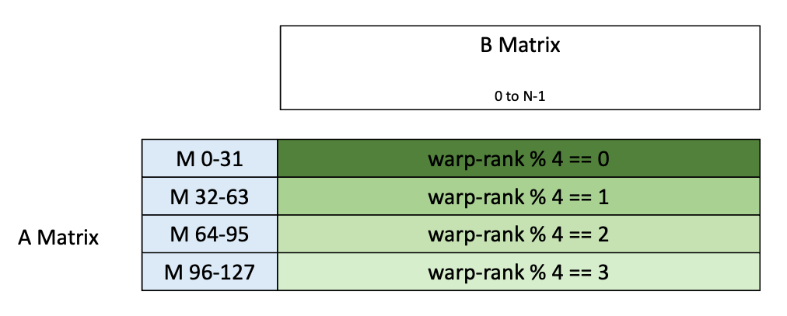
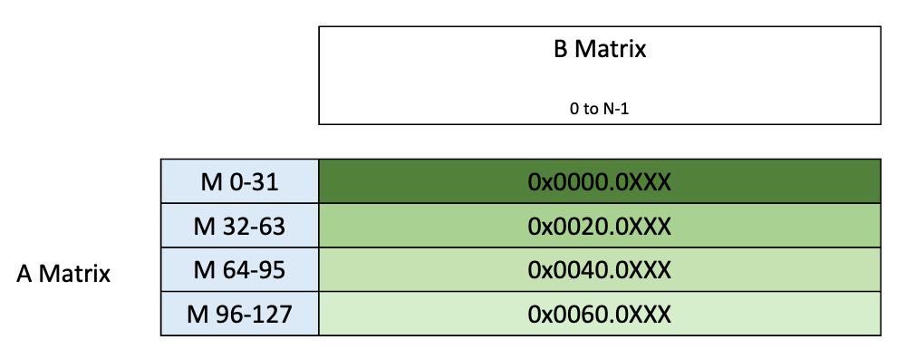

# Cutlass

[https://research.colfax-intl.com/cutlass-tutorial-writing-gemm-kernels-using-tensor-memory-for-nvidia-blackwell-gpus]

## UMMA 指令

Blackwell 引入了用于 MMA 的 tcgen05.mma 指令，被称为 UMMA （Unified MMA），异步指令，支持包括 FP4 和 FP6 在内的低精度数据类型，并在所有精度下提高了吞吐量，支持内置的块缩放（block scaling），拥有名为 Tensor Memory（TMEM） 的 Tensor Core 专用内存，用于 UMMA 累加。

在一个 SM 集群内相邻的两个 CTA，称为 CTA 对，可以跨两个 SM 共同执行 UMMA。与 WGMMA 不同，UMMA 仅由一个线程发起。即使使用两个 CTA，也只有其中一个 CTA 的一个线程发起 UMMA。

Tensor Memory（TMEM）是一个专用于 Tensor Core 使用的片上内存。Operand A 可以在 TMEM 和 SMEM 之间切换，Operand B 只能在 SMEM 中，Accumulator 只能在 TMEM 中。

这意味着 UMMA 不需要使用寄存器来存储数据，从而降低了 MMA 操作的寄存器压力。此外，这种不需要寄存器的特性，加上单线程启动，允许进一步将 MMA 与 CTA 的主执行流程解耦。结合 TMA，在标准 GEMM 中 CTA 唯一直接执行的仅剩前处理和后处理。

TMEM 的大小为每个 SM 256KB，按二维组织为 512 列和 128 行（或称 lane），每个单元为 32 位。这种固有的二维结构也反映在 32 位地址中，其中位 31:16 表示 lane ID，而位 15:0 表示列。PTX 文档中的下图展示了该布局：



TMEM 使用 tcgen05.alloc 指令动态分配。此外，分配以列为单位，因此当分配某一列时，该列的每个 lane 都会被分配。所分配的列数必须是 2 的幂且至少为 32。最后，必须使用 tcgen05.dealloc 显式释放 TMEM。tcgen05.alloc 和 tcgen05.dealloc 必须由同一个 warp 调用，并且同一个 warp 应负责分配和释放。

tcgen05.alloc 指令将分配的 32 位地址存储到共享内存的指定位置。然后应将 TMEM 的地址设置为 UMMA 的累加器张量的偏移量，正如下面所示。

通常，数据通过 UMMA 操作进入 TMEM，并使用 tcgen05.ld 将其显式移动到寄存器以进行后处理。线程也可以手动将数据加载到 TMEM，既可以通过 tcgen05.cp 从 SMEM 加载，也可以通过 tcgen05.st 从寄存器加载。不过，TMEM 对显式加载和存储的访问模式有严格限制。每个 warpgroup 中的每个 warp 只能访问 32 条 lane（warp 0 对应 lane 0–31，warp 1 对应 lane 32–63，依此类推）。此外，UMMA 操作和数据移动操作都期望特定的数据布局。幸运的是，CUTLASS 提供了我们稍后会介绍的实用函数，简化了通过 swizzle（交错排列）组织数据的过程。感兴趣的读者也可以在 PTX 指南中找到布局信息。

https://docs.nvidia.com/cuda/parallel-thread-execution/index.html#tcgen05-shared-memory-layout-swizzling

最后，除了 UMMA 操作和这些数据移动指令之外，没有其他操作可以访问来自 TMEM 的数据。换句话说，所有预处理必须在数据加载到 TMEM 之前完成，所有后处理必须在数据从 TMEM 检索出来之后进行。

### tcgen05.mma 指令

https://docs.nvidia.com/cuda/parallel-thread-execution/index.html#tensorcore-5th-generation-instructions-tcgen05-mma

忽略一些可选参数， tcgen05 MMA 操作的 PTX 语法采用以下形式之一：

tcgen05.mma.cta_group.kind   [d-tmem],  a-desc,  b-desc, idesc, enable-input-d;
tcgen05.mma.cta_group.kind   [d-tmem], [a-tmem], b-desc, idesc, enable-input-d;
.kind      = { .kind::f16, .kind::tf32, .kind::f8f6f4 }
.cta_group = { .cta_group::1, .cta_group::2 }

在本示例中，我们将查看使用 FP32 累加的稠密 FP16 GEMM（.kind::f16）。目前我们只考虑 1-CTA 情况——本系列的下一篇文章将讨论 2-CTA 版本。从支持的矩阵形状表中可以看到，MMA 指令可用于形状为 64×N×16（N 为 8 的倍数）以及 128×N×16（N 为 16 的倍数）的情况，在这两种情况下 N 最多为 256。（对于所有数据类型，稠密 GEMM 的 K 期望为 32 字节宽。）请注意，最大的 UMMA atom 128×256×16 是最大的 WGMMA atom 的两倍。它的累加器恰好占据 TMEM 的一半，这意味着可以在不牺牲性能的情况下对多个 UMMA atom 进行流水线处理。

matrix descriptors

operand a-desc 和 b-desc 是共享内存描述符，与为 WGMMA 使用的那些非常相似。简而言之，这些是 64 位值，封装了存储在 SMEM 中的矩阵的地址、布局和 swizzle 模式的信息。（如果 A 来自 TMEM，则其描述符由其 TMEM 地址替换。）SMEM 中的矩阵块预期为 K-major，不过 MMA 指令能够对其进行转置，并且允许采用与 WGMMA 类似的几种预定义 swizzle 模式之一。

instruction descriptor

除了矩阵描述符之外，tcgen05.mma 还需要一个指令描述符（instruction descriptor，参数 idesc）。这是一个 32 位的元数据片段，包含例如数据类型和稀疏性信息；完整细节可在此处查阅。值得注意的是，指令描述符中的两个位用于指示对 A 和/或 B 进行转置和/或取反。此外，参数 enable-input-d 用于在执行 MMA（D = A * B）之前将累加器清零，或改为保留累加器（D = A * B + D）。

accumulators 在 TMEM 中以透明的行主序格式存放。由于没有数据保存在寄存器中，我们不再需要担心 WMMA 和 WGMMA 所需的复杂线程-值布局。不过，请记住，数据在存储或后处理之前必须先复制到寄存器中，并且每个 warp 只能访问 TMEM 的 1/4。这意味着 epilogue 需要整个 warpgroup。

由于用于 tcgen05.mma 的所有数据都驻留在 CTA 共享内存空间（TMEM 或 SMEM）中，该操作可以且必须由 CTA 中的单个线程发出。

### tcgen05.ld

在 tcgen05 下有三种类型的内存移动指令： ld 、 st 和 cp 。在我们的讨论中将侧重于 ld ，它用于将数据从 TMEM 复制到 RMEM。用于 tcgen05.ld 的 PTX 指令的基本形式如下：

tcgen05.ld.sync.aligned.shape.num.b32    r, [taddr];

.shape = { .16x64b, .16x128b, .16x256b, .32x32b }
.num    = { .x1, .x2, .x4, .x8, .x16, .x32, .x64, .x128 }

如 .sync.aligned 限定符 所示， tcgen05.ld 是一条 warp 范围的指令，warp 中的所有线程必须执行相同的指令并作为一个 warp 进行同步，类似于早期的 ldmatrix 指令。

tcgen05.ld 支持多种数据移动形状，在 PTX 指南中有描述。它们通常用 {lanes}×{bits} 表示；我们的示例使用 32×32b，表示单个 warp 上 32 条 lane（或数据通路）乘以 32 位。下一个组件 .num 描述在列维度上重复的次数。对于我们的示例，我们使用 .x1，这表示执行一次加载。在单条指令中，一个 warp 最多可以加载 lanes × bits × num ≤ 128Kb（16KB），对应每个线程 128 个 32 位寄存器。最后，记住每个 warp 只能访问 128 条 TMEM lane 中的 32 条。

 tcgen05.ld.sync.aligned.32x32b.x1.b32 操作：



我们可以看到每个线程从一个 lane 加载 32 位（或一列）并将其存入寄存器。图中还展示了 .num = .x2 情况，其中该加载重复第二次，并且每个线程使用第二个寄存器。

我们的指令参数只有 r 和 taddr ，其中 r 是目标寄存器， taddr 是 TMEM 地址 —— 请注意，这是被加载 tile 的 TMEM 地址，并且在整个 warp 的所有线程中相同。

在众多选项中，自然的问题是如何选择正确的变体。lane 的数量主要受所使用的 MMA 指令影响；不同的 tcgen05.mma 变体会导致不同的输出布局，而不同的 tcgen05.ld 形状则适用于不同的场景。对于位宽和 .num，更多考虑的是性能和资源。更大的重复（repetition）会减少发出的指令数量，并可能有利于向量化。然而，更大的 .num 值也需要更多的寄存器。因此该值是一个需要调优的参数。

## The CUTLASS UMMA Interface

现在我们已经了解了 UMMA 指令的功能，接下来讨论我们将用来访问它的 CUTLASS/CuTe 接口。与之前的 CUTLASS MMA 抽象一样，该接口由以下几部分描述：

- 位于 cute/arch/ 目录中的 MMA_Atom，它是对相应 PTX 指令的封装；

- cute/atom/ 目录下的 MMA_Traits，包含用于以 CUTLASS 原生方式与 atom 交互的 CuTe 布局和其他元数据。

我们的 WGMMA 教程对该设计有更深入的解释。下面是 SM100_MMA_F16BF16_SS 的模板签名，它是第一个 CuTe Blackwell 代码示例中使用的 atom。

```cpp
template <class a_type, class b_type, class c_type,
          int M, int N, UMMA::Major a_major, UMMA::Major b_major,
          UMMA::ScaleIn a_neg, UMMA::ScaleIn b_neg>
struct MMA_Traits<SM100_MMA_F16BF16_SS<a_type, b_type, c_type,
                                M, N, a_major, b_major,
                                a_neg, b_neg>>
{
  using ValTypeD = c_type;
  using ValTypeA = a_type;
  using ValTypeB = b_type;
  using ValTypeC = c_type;
  static_assert(cute::sizeof_bits_v<a_type> == cute::sizeof_bits_v<b_type> && 
                          cute::sizeof_bits_v<b_type> == 16, 
                          "SM100_MMA_F16BF16_SS supports 16bit types");
  using FrgTypeA = UMMA::smem_desc<a_major>;
  using FrgTypeB = UMMA::smem_desc<b_major>;
  using FrgTypeC = UMMA::tmem_frg_1sm<c_type>;
  // Logical shape-K is always 256bits, transform to units of elements
  static constexpr int K = 256 / cute::sizeof_bits<ValTypeA>::value;
  using Shape_MNK = Shape<Int<M>,Int<N>,Int<K>>;
  using ThrID   = Layout<_1>;
  using ALayout = Layout<Shape <_1,Shape <Int<M>,Int<K>>>,
                         Stride<_0,Stride<    _1,Int<M>>>>;
  using BLayout = Layout<Shape <_1,Shape <Int<N>,Int<K>>>,
                         Stride<_0,Stride<    _1,Int<N>>>>;
  using CLayout = Layout<Shape <_1,Shape <Int<M>,Int<N>>>,
                         Stride<_0,Stride<    _1,Int<M>>>>;
  UMMA::InstrDescriptor idesc_ = UMMA::make_instr_desc<
    a_type, b_type, c_type, M, N, a_major, b_major, a_neg, b_neg>();
  // Accumulate or overwrite C.   1: read C, 0: ignore C [clear accumulators]
  UMMA::ScaleOut accumulate_ = UMMA::ScaleOut::One;
...
}
```

这里的大部分信息可以透明地映射到我们之前在 tcgen05.mma 指令中看到的概念：A 和 B 的 SMEM 描述符、用于 D 的 TMEM 布局，以及一个指令描述符。atom 大小由模板参数 M 和 N 提供（如注释所示，K 由数据类型的位大小决定）。模板参数 a_major、b_major、a_neg 和 b_neg 用于填充指令描述符的转置和取反位。accumulate_ 成员（取值为 UMMA::ScaleOut::One 或 UMMA::ScaleOut::Zero）提供了 PTX 参数 enable_input_d。

但关于布局发生了一些有趣的变化。之前，ThrID 布局用于将协同执行 MMA 指令的线程的逻辑索引映射到它们的物理线程 ID。对于整个 warp 的 MMA，ThrID 是 Layout<_32>，而对于 WGMMA，它是 Layout<_128>。在这里它被简化为 Layout<_1>。类似地，A、B 和 C 的 TV 布局在线程维度上的大小均为 1。我们可能会认为这是因为该指令是单线程的，但原因比这更深。由于该指令是单线程的，所有线程布局已被重新用作在 MMA 指令上协作的 CTA 的布局。

暂时，我们每个 MMA 只使用 1 个 CTA，因此会出现相当多看似多余的 static-1；当我们在下一篇博文中升级到每个 MMA 使用 2 个 CTA 时，这些用法将变得更清晰。

最后，关于 atom 名称结构的简短说明。SM100_MMA_F16BF16_SS 可以分解为以下部分：

- SM100_MMA：指定指令。简而言之，即用于 SM100 的 UMMA 指令。
- F16BF16：指定 A 和 B 的数据类型。这里 A 是 FP16，B 是 BF16。注意，这映射到 tcgen05.mma 的 .kind 限定符（例如 .kind::f16），而确切的输入类型由指令描述符记录。
- SS：指定 A 和 B 的内存位置。SS 表示二者都位于 SMEM，而 TS 表示 A 位于 TMEM 而 B 位于 SMEM。
- 后缀（Suffix）：对于更复杂的情况（例如块缩放或 2-SM UMMA），还有额外的后缀。

请注意，与 Hopper atom 不同，MMA 的大小以及操作数或累加器使用的数据类型不属于 atom 名称的一部分。相反，它们由模板参数决定。

