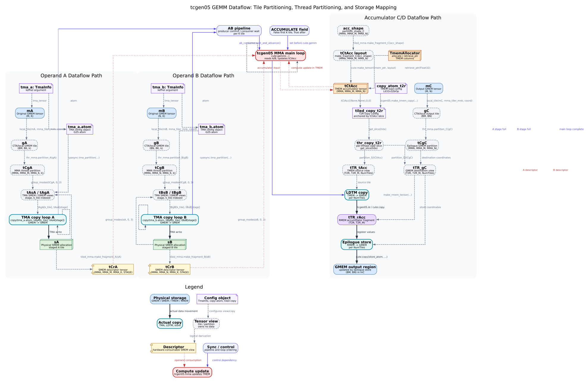

# CUTLASS GEMM 数据流：Tile 划分、线程分区与存储空间映射

本文整理 CUTLASS CuTe DSL 中 tcgen05 GEMM 的数据流：从 GMEM 原始矩阵，到 CTA/local tile、MMA thread partition、TMA partition、SMEM descriptor tensor、TMEM accumulator，再到 TMEM-to-RMEM copy 和 epilogue store。

## 适用范围和假设

这张图对应 NVIDIA CUTLASS `tcgen05 MMA Programming Guide` 中 “Global Memory (GMEM) to MMA data flow overview” 描述的常见 dense GEMM 路径：

- A、B 原始矩阵位于 GMEM。
- A、B 通过 TMA staging 到 SMEM；`tcgen05.mma` 通过 descriptor/view 消费 staged operand。
- accumulator 始终位于 TMEM，`tcgen05.mma` 直接读写 `tCtAcc`。
- epilogue 使用 `tcgen05.ld` 类 TMEM copy atom 将 TMEM accumulator 读入 RMEM，再写回 GMEM output tile。
- tcgen05 也支持 A 来自 TMEM 的路径；本文主图只画 A/B 均从 GMEM staging 到 SMEM 的常见路径。

图中的 Shape 使用符号维度，避免绑定到某个 kernel 配置：

- `mma_tiler_mnk = (BM, BN, BK)`
- A local tile: `gA = (BM, BK, k)`
- B local tile: `gB = (BN, BK, k)`
- A partition: `tCgA = (MMA, MMA_M, MMA_K, k)`
- B partition: `tCgB = (MMA, MMA_N, MMA_K, k)`
- A/B descriptor tensor: `tCrA/tCrB = (MMA, MMA_M|MMA_N, MMA_K, STAGE)`
- accumulator: `tCtAcc = (MMA, MMA_M, MMA_N[, ACC_STAGE])`

## 生成命令

从仓库根目录运行：

```bash
python3 Docs/cutlass/cute_layout/cutlass_gemm_dataflow_tile_partition_thread_partition_storage_mapping/scripts/generate_tcgen05_gemm_dataflow.py
```

只生成某一种格式：

```bash
python3 Docs/cutlass/cute_layout/cutlass_gemm_dataflow_tile_partition_thread_partition_storage_mapping/scripts/generate_tcgen05_gemm_dataflow.py --format svg
python3 Docs/cutlass/cute_layout/cutlass_gemm_dataflow_tile_partition_thread_partition_storage_mapping/scripts/generate_tcgen05_gemm_dataflow.py --format png
```

指定输出目录：

```bash
python3 Docs/cutlass/cute_layout/cutlass_gemm_dataflow_tile_partition_thread_partition_storage_mapping/scripts/generate_tcgen05_gemm_dataflow.py --output-dir /tmp/tcgen05-images
```

## 依赖安装

脚本只依赖 Python 标准库和 Graphviz 命令行工具 `dot`。如果系统没有 Graphviz，可用以下方式安装：

```bash
sudo apt-get install graphviz
# or
brew install graphviz
# or
conda install -c conda-forge graphviz
```

## 结构图



同时生成的 PNG 文件可用于不支持 SVG 的环境：[tcgen05_gemm_dataflow.png](./images/tcgen05_gemm_dataflow.png)。

## 图例说明

- 蓝色节点表示 GMEM 中的物理 tensor 或输出矩阵。
- 绿色节点表示 SMEM physical allocation，例如 `sA`、`sB`。
- 橙色节点表示 TMEM accumulator，例如 `tCtAcc`。
- 紫色节点表示 RMEM/register fragment，例如 `tTR_rAcc`。
- 灰色虚线节点表示 logical tensor view。Tile、partition、TMA view 都是不拥有新数据的坐标域视图。
- 紫色 note 节点表示配置对象，例如 `tma_a: TmaInfo`、`tma_a.atom`、`copy_atom_t2r`、`tiled_copy_t2r`。它们配置 copy 或 view，不是实际 copy 操作本身。
- 黄色 component 节点表示 descriptor/fragment tensor。`tCrA` 和 `tCrB` 的元素可以是硬件可消费的 SMEM descriptor。
- 实线粗箭头表示实际数据移动，例如 TMA GMEM -> SMEM、TMEM -> RMEM、RMEM -> GMEM。
- 虚线箭头表示 logical view transformation，例如 `local_tile`、`partition_A/B/C`、`tma_partition`、`partition_S/D`。
- 点线红色箭头表示硬件消费或计算更新，例如 `tcgen05.mma` 对 A/B descriptor 的消费，以及对 TMEM accumulator 的更新。
- 蓝色点划线箭头表示 pipeline 或控制依赖，例如 producer commit、consumer wait 和 `tcgen05.Field.ACCUMULATE` 设置；它不是数据搬运。
- 回环虚线箭头表示 K tile 或 pipeline stage 循环。

## Operand A 路径

Operand A 从 `mA` 开始，它是 GMEM 中的原始 A tensor，形状记为 `(M, K)`。

1. `tma_a: TmaInfo` 提供两类配置入口：`tma_a.tma_tensor` 派生出 `mA`，`tma_a.atom` 派生出 TMA copy atom 配置对象。
2. `local_tile(mA, mma_tiler, coord)` 生成 CTA/local GMEM tile `gA`，符号形状为 `(BM, BK, k)`。
3. `thr_mma.partition_A(gA)` 生成 MMA thread partition view `tCgA`，形状为 `(MMA, MMA_M, MMA_K, k)`。
4. `sA` 是 staged A tile 的 SMEM physical allocation。
5. `tiled_mma.make_fragment_A(sA)` 从同一个 SMEM tensor 派生 `tCrA`，形状为 `(MMA, MMA_M, MMA_K, STAGE)`。这里生成的是 descriptor tensor/view，不是把 operand 数据复制到寄存器。
6. `cute.nvgpu.cpasync.tma_partition(...)` 对 `group_modes(sA, 0, 3)` 和 `group_modes(tCgA, 0, 3)` 建立 TMA copy view，得到 `tAsA` 和 `tAgA`。
7. TMA producer loop 执行 `copy(tma_a.atom, tAgA[k_tile], tAsA[stage])`，实际把 A tile 从 GMEM 搬到 `sA`。
8. consumer 侧在 pipeline stage ready 后，`tcgen05.mma` 通过 `tCrA[stage]` 消费 A operand descriptor/view。

## Operand B 路径

Operand B 与 A 对称，但 partition 维度对应 N 维：

1. `tma_b: TmaInfo` 提供两类配置入口：`tma_b.tma_tensor` 派生出 `mB`，`tma_b.atom` 派生出 TMA copy atom 配置对象。
2. `local_tile(mB, mma_tiler, coord)` 生成 `gB`，符号形状为 `(BN, BK, k)`。
3. `thr_mma.partition_B(gB)` 生成 `tCgB`，形状为 `(MMA, MMA_N, MMA_K, k)`。
4. `sB` 是 staged B tile 的 SMEM physical allocation。
5. `tiled_mma.make_fragment_B(sB)` 派生 `tCrB`，形状为 `(MMA, MMA_N, MMA_K, STAGE)`。
6. `cute.nvgpu.cpasync.tma_partition(...)` 对 `group_modes(sB, 0, 3)` 和 `group_modes(tCgB, 0, 3)` 建立 TMA copy view，得到 `tBsB` 和 `tBgB`。
7. TMA producer loop 执行 `copy(tma_b.atom, tBgB[k_tile], tBsB[stage])`，实际把 B tile 从 GMEM 搬到 `sB`。
8. `tcgen05.mma` 通过 `tCrB[stage]` 消费 B operand descriptor/view。B operand 在该路径中来自 SMEM。

## Accumulator C/D 与 epilogue 路径

Accumulator 路径不是 A/B 那种 GMEM -> SMEM staging，而是 TMEM resident accumulator 和输出 GMEM view 的组合：

1. `tiled_mma.partition_shape_C(mma_tiler_mnk[:2])` 得到 accumulator partition shape，例如 `(MMA, MMA_M, MMA_N)`。
2. `tiled_mma.make_fragment_C(...)` 创建 accumulator fragment layout，随后绑定 TMEM pointer，得到 `tCtAcc`。
3. `cute.gemm(tiled_mma, tCtAcc, tCrA[stage], tCrB[stage], tCtAcc)` 在 main loop 中发出 tcgen05 MMA。`tCtAcc` 同时作为 accumulator input 和 output。
4. 输出 GMEM tensor `mC` 经 `local_tile` 得到 `gC = (BM, BN)`，再经 `thr_mma.partition_C(gC)` 得到 `tCgC = (MMA, MMA_M, MMA_N)`。
5. epilogue 创建 `copy_atom_t2r = cute.make_copy_atom(tcgen05.Ld32x32bOp(...), acc_dtype)`。
6. `tcgen05.make_tmem_copy(copy_atom_t2r, tCtAcc[(None, None), 0, 0])` 创建 `tiled_copy_t2r`，再通过 `get_slice(tidx)` 得到 `thr_copy_t2r`。
7. `thr_copy_t2r.partition_S(tCtAcc)` 生成 TMEM source view `tTR_tAcc = (T2R, T2R_M, NumTiles)`。
8. `thr_copy_t2r.partition_D(tCgC)` 生成 GMEM destination view `tTR_gC = (T2R, T2R_M, NumTiles)`。
9. `cute.make_rmem_tensor(tTR_gC[None, None, 0].shape, acc_dtype)` 创建 RMEM fragment `tTR_rAcc = (T2R, T2R_M)`。
10. `cute.copy(tiled_copy_t2r, tTR_tAcc[None, None, i], tTR_rAcc)` 对应 LDTM / `tcgen05.ld` 路径，实际执行 TMEM -> RMEM。
11. `cute.copy(store_atom, tTR_rAcc, tTR_gC[None, None, i])` 将 register fragment 写回 GMEM output tile。

## 实际数据移动、计算更新与逻辑 Tensor View 派生

`local_tile`、`partition_A/B/C`、`tma_partition`、`partition_S/D` 这类操作主要改变 tensor 的坐标域、分区方式或执行单元视角。它们不表示数据被复制到新的存储空间。

实际数据搬运只发生在 copy 路径中：

- `copy(tma_a.atom, tAgA[k_tile], tAsA[stage])`: GMEM -> SMEM。
- `copy(tma_b.atom, tBgB[k_tile], tBsB[stage])`: GMEM -> SMEM。
- `cute.copy(tiled_copy_t2r, tTR_tAcc, tTR_rAcc)`: TMEM -> RMEM。
- `cute.copy(store_atom, tTR_rAcc, tTR_gC)`: RMEM -> GMEM。

计算更新发生在 MMA 路径中：

- `tcgen05.mma` 通过 `tCrA` / `tCrB` descriptor/view 读取 A/B operand。
- `tcgen05.mma` 更新 TMEM accumulator `tCtAcc`。
- `mma -> ldtm` 只是 main loop 完成后的控制依赖，不表示 MMA 把数据搬运到 T2R copy object。

## Fragment descriptor tensor 的作用

`make_fragment_A(sA)` 和 `make_fragment_B(sB)` 接收 staged SMEM tensor，生成 `tcgen05.mma` 可消费的 descriptor tensor。descriptor tensor 的元素描述 MMA 指令应该如何解释 SMEM 中某个 stage 的 operand tile，包括 SMEM 地址、layout/swizzle 相关信息和对应的 MMA-K/stage 坐标。

这一步不读取 A/B 数值，也不生成传统意义上的 per-thread register fragment。它建立的是硬件可消费的数据表示，使 `tcgen05.mma` 能从 SMEM operand allocation 中取数。

当 A 来自 TMEM 时，官方文档说明仍可用 `make_fragment_A` 获得期望 layout，再把 fragment 绑定到 TMEM pointer；本文结构图没有展开这条变体。

## 官方资料

- NVIDIA CUTLASS tcgen05 MMA Programming Guide, “Global Memory (GMEM) to MMA data flow overview”:
  <https://docs.nvidia.com/cutlass/latest/media/docs/pythonDSL/mma_docs/tcgen05_programming.html#global-memory-gmem-to-mma-data-flow-overview>
- NVIDIA CUTLASS tcgen05 MMA Programming Guide, “Creating fragment descriptors and descriptor tensors”:
  <https://docs.nvidia.com/cutlass/latest/media/docs/pythonDSL/mma_docs/tcgen05_programming.html#creating-fragment-descriptors-and-descriptor-tensors>
- NVIDIA CUTLASS tcgen05 MMA Programming Guide, “Complete Workflow”:
  <https://docs.nvidia.com/cutlass/latest/media/docs/pythonDSL/mma_docs/tcgen05_programming.html#complete-workflow>

资料访问日期：2026-07-10。链接使用 `latest` 页面，后续 CUTLASS 文档更新可能改变对象名或示例代码，必要时应以访问当日官方版本为准。
