# Blackwell tcgen05 GEMM 数据流：同一矩阵的不同表达

## 背景与摘要

GEMM（General Matrix Multiplication，通用矩阵乘法）的数学表达十分简洁：

\[
D_{m,n}=\sum_k A_{m,k}B_{n,k}+C_{m,n}.
\]

本文把内存中的 B tensor 记为 `(N,K)`，因此上式的矩阵写法是 \(D=AB^{\mathsf T}+C\)。tcgen05 指令文档常把送入 MMA 的 B operand view 解释为 `(K,N)`，于是写作 `D=A×B+C`；两种写法描述的是同一组乘加，只是 B 的坐标视图不同。

GPU kernel，即运行在 GPU 上的计算函数，还需要处理数据在不同存储层级之间的移动。本文讨论 tcgen05 的 SS（Shared/Shared）路径，其中 A、B 两个操作数都来自共享内存（SMEM）。TMA（Tensor Memory Accelerator）是负责异步搬运多维数据的硬件单元，它先将 A、B 从全局内存（GMEM）写入 SMEM；tcgen05 MMA（Matrix Multiply-Accumulate，矩阵乘加）指令再根据 descriptor（描述符）中记录的 SMEM 地址和排布信息读取矩阵。乘加结果累加在 Blackwell 的张量内存（TMEM）中，主循环之后的写回阶段称为 epilogue，它将结果装入线程寄存器（RMEM）并写回 GMEM。

全文采用真实 F16/BF16 示例：problem shape 为 `(M,N,K)=(512,768,384)`，矩阵 A 的 shape 为 `(M,K)=(512,384)`。后文跟踪全局元素 `A[133,70]`，它在所选 CTA tile 内的局部坐标为 `(5,6)`。分析每个对象时采用三个判据：是否保存矩阵数值、如何解释逻辑坐标，以及由哪项操作实际读取或写入。

本文分析 CUTLASS CuTe Python DSL 的 Blackwell GEMM kernel 中，同一矩阵 A 所对应的 `mA`、`gA`、`tCgA`、`tAgA`、`sA` 和 `tCrA`。重点在于区分三类对象：实际保存矩阵数值的存储、引用同一存储但采用不同坐标解释的 view，以及供硬件指令访问 SMEM 的 descriptor。整体数据流如下图所示。


手绘总图保留完整的结构脉络：上半部分从 `mA` 依次展开 `gA/tCgA`，并列出单 CTA 与 CTA-pair 两条分支；下半部分连接 TMA、`sA/tCrA`、TMEM accumulator 与 epilogue。后续规则图再用统一坐标逐步放大这条主线：橙色持续跟踪 `A[133,70]`；进入 MMA 后，橙色表示它对输出行 `D[133,:]` 的贡献，不表示 A 的数值被原样存进 accumulator。

## 贯穿全文的真实 shape 示例

本文直接使用 tcgen05 F16/BF16 示例中的真实 shape。tile 表示从完整矩阵中划分出的子矩阵，shape 表示各维的长度；CTA（Cooperative Thread Array）对应一个 CUDA thread block。合法的指令维度与真实 Thread-Value ownership（线程与元素的归属关系）以具体 `TiledMma` layout 为准。

| 参数 | 真实示例 |
|---|---:|
| problem `(M,N,K)` | `(512,768,384)` |
| CTA tile `(BM,BN,BK)` | `(128,256,64)` |
| instruction `(inst_M,inst_N,inst_K)` | `(128,256,16)` |
| 外层 K tile 数 | `384/64=6` |
| 一个 `BK` 内的 `MMA_K` 数 | `64/16=4` |
| SMEM pipeline stage 数 | `3` |

这些参数直接确定四个矩阵的 shape：

\[
\operatorname{shape}(A)=(M,K)=(512,384),\qquad
\operatorname{shape}(B)=(N,K)=(768,384),
\]

\[
\operatorname{shape}(C)=\operatorname{shape}(D)=(M,N)=(512,768).
\]

CTA 从 A 中取得的 tile shape 为 `(BM,BK)=(128,64)`，从 B 中取得的 tile shape 为 `(BN,BK)=(256,64)`，对应的输出 tile shape 为 `(BM,BN)=(128,256)`。pipeline stage 是环形 SMEM 缓冲中的一个可复用槽位；三个 stage 允许 TMA 写入下一批 A/B 的同时，MMA 消费已经准备完成的上一批 A/B。

本文的实际目标 GPU 是 **SM110**。`tensor-layouts` 当前没有单独的 SM110 atom，因此图片只借用其 SM100 UMMA atom 中与本文相同的 `128×256×16` 指令 shape 来做粗粒度逻辑投影。这不等价于“SM100 和 SM110 的微架构或完整 layout 相同”，也不用于推断 SM110 的 TMEM bank、lane ownership 或 epilogue 线程映射；这些结论仍须由目标 kernel 的具体 CuTe layout/PTX 验证。

为了给每个坐标一个可核对的标识，本文采用零基索引，并按 row-major 顺序为 A 的元素编号：

\[
\operatorname{id}_A(m,k)=384m+k+1,\qquad 0\le m<512,\quad 0\le k<384.
\]

贯穿全文的元素选择为 `A[133,70]`，它在图中的编号为

\[
\operatorname{id}_A(133,70)=133\times384+70+1=51143.
\]

编号 51143 只用于在图片之间核对同一个元素，不是该元素的 F16/BF16 输入值。实际 kernel 中 `A[133,70]` 可以保存任意合法输入值；在 GEMM 求和中，它与 `B[n,70]` 相乘，并对输出 `D[133,n]` 产生贡献。

<!-- BEGIN GENERATED DIAGRAM: case0 -->
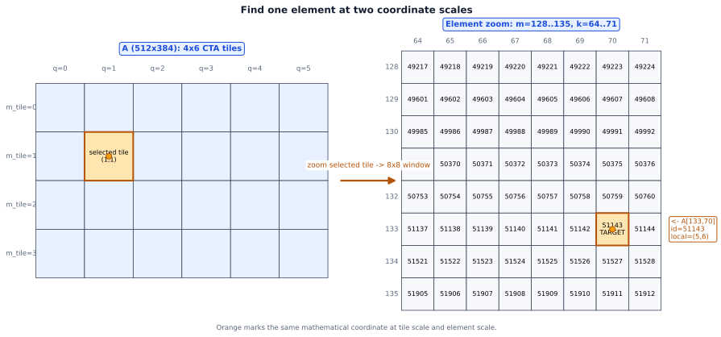
<!-- END GENERATED DIAGRAM: case0 -->

左图按真实 shape 绘制完整的 `A(512×384)`，粗分区对应 `4×6` 个 `(128×64)` CTA tile。右图放大 `m=128…135、k=64…71` 的 `8×8` 窗口：行列刻度给出全局 `(m,k)`，格内数字是 row-major 元素编号。橙色点与粗边框标出 `A[133,70]`，连接线说明它来自左图的 `(m_tile,q)=(1,1)`。

该元素位于 M 方向和 K 方向的第二个 CTA tile，即 `m_tile=1、k_tile=1`。它在所选 A tile 内的局部坐标为 `(5,6)`。后文固定 `m_tile=1` 并沿 K 方向迭代，跟踪该元素如何转换为 `MMA_K` 分区坐标、写入 SMEM stage，并最终由 descriptor 指向。

```text
Physical path:

mA/gA/tCgA/tAgA [GMEM views]
          │
          └─ TMA copy ─> sA [SMEM data]
                              │
                         tCrA [descriptor]
                              │
                         tcgen05.mma
                              │
                         tCtAcc [TMEM]
                              │
                          tcgen05.ld
                              │
                         tTR_rAcc [RMEM]
                              │
                            mC [GMEM]
```

## 第一步：`mA → gA`，从完整矩阵中选出当前 CTA tile

`mA` 是完整 A 的 GMEM tensor，逻辑 shape 为 `(M,K)`。CuTe 将 Tensor 定义为 **Engine + Layout**：Engine 提供底层存储访问入口，Layout 将逻辑坐标映射为相对首地址的偏移量。对 `mA` 这种指向实际内存的 tensor，可以将其理解为“GMEM 首地址 + `(m,k)` 到地址偏移的映射”。

`local_tile` 在不访问 GMEM 数值的情况下构造 `gA` view。它将全局坐标拆成 tile 编号和 tile 内坐标，`gA` 仍然引用 `mA` 的原始存储。

```python
# Simplified coordinate construction; boundary handling is omitted.
mma_coord_mnk = (m_tile, n_tile, None)
gA = cute.local_tile(
    mA,
    mma_tiler_mnk,
    mma_coord_mnk,
    proj=(1, None, 1),
)
# Simple dense example: gA has logical shape (BM, BK, num_k_tiles).
```

在整除情况下：

\[
gA(i,j,q)=mA(m_{tile}\cdot BM+i,\ q\cdot BK+j).
\]

对真实示例中的 `A[133,70]`：

```text
i = 133 - 1×128 = 5
q = floor(70/64) = 1
j = 70 mod 64 = 6

mA(133,70) = gA(5,6,1)
```

坐标从全局 `(133,70)` 变成 `(tile内M=5, tile内K=6, 外层K tile=1)`，但数据仍在原来的 GMEM 地址中。

<!-- BEGIN GENERATED DIAGRAM: case5 -->
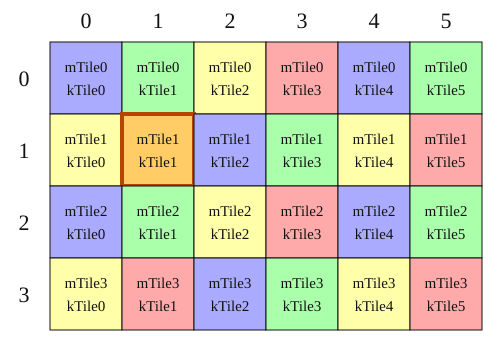
<!-- END GENERATED DIAGRAM: case5 -->

图中的每个单元格表示一个真实的 `(BM,BK)=(128,64)` A tile，完整矩阵沿 M 方向分成 4 份、沿 K 方向分成 6 份。行头是 `m_tile`，列头 `q` 是外层 K tile；橙色点位于 `(1,1)`，旁边直接写出 `gA(5,6,1)=mA(133,70)`。虚线框强调 `gA` 只是同一 GMEM 地址的 view；此处既没有 copy，也没有线程分配。

> 阶段检查：说明 `local_tile` 改变 shape 却不增加显存流量的原因。

## 第二步：`gA → tCgA`，改写成 MMA 能迭代的层次

在调用 `partition_A` 前，需要先明确 `TiledMma` 的描述范围。`MmaOp` 选择硬件指令、数据类型、指令 shape、CTA group 和操作数来源；MMA atom 将一条指令包装为 CuTe 可组合的最小 MMA 单元；`TiledMma` 决定 atom 在各维的重复次数和坐标重排方式；`mma_tiler_mnk` 则决定 CTA 或 CTA-pair 从完整问题中取得的 `(BM,BN,BK)` 区域。

```python
# Simplified official construction pattern; not a complete runnable kernel.
op = tcgen05.MmaF16BF16Op(
    cutlass.Float16,
    cutlass.Float32,
    (128, 256, 16),
    tcgen05.CtaGroup.ONE,
    tcgen05.OperandSource.SMEM,
    OperandMajorMode.K,
    OperandMajorMode.K,
)
atom = cute.make_mma_atom(op)
tiled_mma = cute.make_tiled_mma(atom)
```

主线首先采用 trivial、`CtaGroup.ONE`、无 permutation 的情形，即一个 CTA 独立负责完整的 tiler tile。

<!-- BEGIN GENERATED DIAGRAM: case1 -->
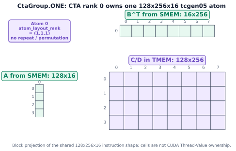
<!-- END GENERATED DIAGRAM: case1 -->

图把 A、B、C 三个 operand 的真实逻辑 shape 投影为块级矩形：A 为 `128×16`，B 为 `256×16`，C/D 为 `128×256`。`atom_layout_mnk=(1,1,1)` 表示这里只有一个 atom，没有 repeat 或 permutation。这里没有展开 Thread–Value 网格：`tensor-layouts` 的该 atom 将线程维折叠，不能据此声称 SM110 的逐线程 ownership。

`partition_A` 根据这个 `TiledMma` 的 A-operand layout 重描述 `gA`：

```python
# Simplified CtaGroup.ONE partition pattern.
thr_mma = tiled_mma.get_slice(0)
tCgA = thr_mma.partition_A(gA)
```

在真实示例中，`BM=inst_M=128`，所以 M 方向只有一个 instruction tile；`BK=64`、`inst_K=16`，所以一个 `BK` 内有四个 `MMA_K`：

```text
gA:   (BM=128, BK=64, num_k_tiles=6)
tCgA: (MMA, MMA_M=1, MMA_K=4, num_k_tiles=6)
```

`A[133,70]` 在 `gA` 中的 tile 内 K 坐标是 `j=6`，因此：

```text
MMA_K  = floor(j/inst_K) = floor(6/16) = 0
innerK = j mod inst_K    = 6
```

它属于第一个 `MMA_K` 的第 7 个 K 位置。`partition_A` 仍未加载这个元素，只是使后续代码能够按 MMA instruction tile 遍历它。

<!-- BEGIN GENERATED DIAGRAM: case6 -->
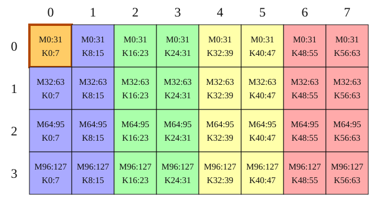
<!-- END GENERATED DIAGRAM: case6 -->

图中的每个大格把所选 `(128,64)` A tile 压缩为一块 `(32,8)` 坐标区域；这是为了阅读方便，不是硬件分区粒度。相邻两列合成一个 `inst_K=16` 色带，因此 8 列对应四个 `MMA_K`。橙色点给出精确局部坐标 `(5,6)`，所以 `MMA_K=0、inner_k=6`；CUDA thread 映射不在该图的表达范围内。

真实 F16/BF16 示例中，只有在 trivial、`CtaGroup.ONE`、无 permutation、shape 整除时，才可以直接写：

```text
MMA_M = BM / inst_M = 128 / 128 = 1
MMA_N = BN / inst_N = 256 / 256 = 1
MMA_K = BK / inst_K = 64 / 16 = 4
```

双 CTA、atom repeat 或 permutation 会引入额外的 ownership 或坐标变换，此时应以实际 `partition_*` layout 为准。上述除法仅适用于前述简单条件。

> 阶段检查：比较 `gA` 与 `tCgA` 所引用的数据，并说明 `tCgA` 新增的坐标层次。

## 第三步：`tCgA → tAgA/tAsA → sA`，执行 A 的首次物理搬运

SS 路径要求 A、B 位于 SMEM，因此需要在 SMEM 中实际分配 `sA`。`sA` 保存矩阵数值，并带有适合 MMA 的 staged SMEM layout。`tma_partition` 同时建立两个 copy view：`tAgA` 描述 TMA 从 GMEM 的读取位置，`tAsA` 描述 TMA 向 `sA` 的写入位置。

```python
# Simplified official pattern; concrete pipeline operands are omitted.
tAsA, tAgA = cute.nvgpu.cpasync.tma_partition(
    tma_a.atom,
    0,
    cute.make_layout(1),
    # Group the SMEM modes into the collective destination coordinate.
    cute.group_modes(sA, 0, 3),
    # Group the partitioned GMEM modes into the matching source coordinate.
    cute.group_modes(tCgA, 0, 3),
)

# This copy performs the actual GMEM-to-SMEM transfer.
cute.copy(tma_a.atom, tAgA[...], tAsA[...])
```

`tma_partition` 只构造 source/destination 坐标关系；`cute.copy` 才产生 GMEM→SMEM 流量。前两步已经得到 `A[133,70]` 的坐标分解：

```text
mA:    global(m=133, k=70)
gA:    local_m=5, local_k=6, q=1
tCgA:  MMA_M=0, MMA_K=0, inner_m=5, inner_k=6, q=1
```

这里的 `q=1` 表示全局 K 方向的第二个 `(BK=64)` tile；`MMA_K=0` 表示该 tile 内的第一个 `(inst_K=16)` 分区。`tCgA` 的真实 mode 顺序由 A-operand layout 决定，上述写法用于展开逻辑含义，不等同于可以直接照抄的 Python 索引表达式。

`group_modes(...)` 将若干内层 mode 组合为 TMA collective copy 使用的传输坐标。用 `ξ(5,6)` 表示包含局部元素 `(5,6)` 的组合传输坐标，source 和 destination 的对应关系可以写成：

```text
tAgA:  (ξ(5,6), q=1)      → GMEM 中的 mA(133,70)
tAsA:  (ξ(5,6), stage=1)  → SMEM 中的 sA(5,6,stage=1)
```

`tAgA` 与 `tAsA` 使用相同的 `ξ(5,6)`，因此 TMA 能将 source tile 中的每个逻辑元素写入 destination tile 的对应位置。对当前元素，实际 copy 的逻辑效果为

\[
sA(5,6,\text{stage}=1)\leftarrow mA(133,70).
\]

真实示例有三个环形 stage，外层 `q=1` 的 tile 在简化轮转关系中对应 `stage=q mod 3=1`。真实 pipeline 使用 state/count 选择 stage；`q mod STAGES` 在本文中仅用于说明环形缓冲的基本关系。

<!-- BEGIN GENERATED DIAGRAM: case10 -->
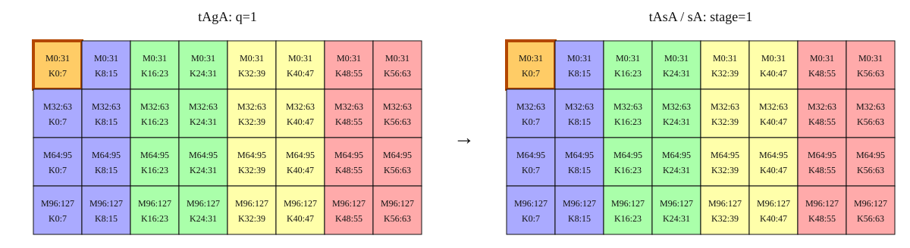
<!-- END GENERATED DIAGRAM: case10 -->

图的左侧是 `tAgA` 指向的 `q=1` GMEM tile，右侧是 `tAsA` 指向的 `stage=1` SMEM tile。两侧采用相同的 `(32,8)` 压缩几何与 `MMA_K` 色带：这说明 TMA copy 前后逻辑坐标 `ξ(5,6)` 对齐；中间实线箭头说明此处确实发生数值搬运。右图只表达 SMEM **逻辑坐标**，不是物理地址图，也没有把 swizzle 画成 row-major。

`sA(5,6,stage=1)` 是逻辑坐标，实际 SMEM 地址由 `sA` 的 layout 计算。其关系可以概括为

\[
\text{SMEM address}=\text{sA base}+\operatorname{layout}_{sA}(5,6,1)\times\operatorname{sizeof}(A\text{ element}).
\]

SMEM layout 可能包含 swizzle，因此该地址通常不能用普通 row-major 公式直接计算。swizzle 改变逻辑坐标到 SMEM bank/address 的映射，同时保持 A 的数学坐标和矩阵数值不变。

> 阶段检查：从 `mA(133,70)` 推导到 `sA(5,6,stage=1)`，并区分 `tAgA`、`tAsA` 与 `sA` 的存储关系。

## 第四步：`sA → tCrA`，从 SMEM allocation 得到 MMA descriptor

只要 `sA` 的 allocation、首地址与 layout 已经建立，`make_fragment_A(sA)` 就可以生成 descriptor tensor `tCrA`；构造 descriptor 不依赖 TMA 已经写入矩阵值，通常也会在 mainloop 前完成。运行时真正有 ready 依赖的是 descriptor 的**消费**：`cute.gemm` 使用某个 stage 的 `tCrA` 前，必须等待 TMA 已经把该 stage 的 A 数值写好。

```python
# Descriptor construction; no matrix data is copied here.
tCrA = tiled_mma.make_fragment_A(sA)
tCrB = tiled_mma.make_fragment_B(sB)
# Simple conceptual shapes:
# tCrA: (MMA, MMA_M, MMA_K, STAGE)
# tCrB: (MMA, MMA_N, MMA_K, STAGE)
```

`tCrA` 保存 descriptor/fragment-level 对象。矩阵元素与 descriptor 之间是“被描述区域”关系：某个 `(MMA_K,stage)` descriptor 描述包含 `A[133,70]` 的 SMEM tile。在真实示例中，该元素由 `MMA_K=0、stage=1` 对应的 descriptor 覆盖。

<!-- BEGIN GENERATED DIAGRAM: case7 -->
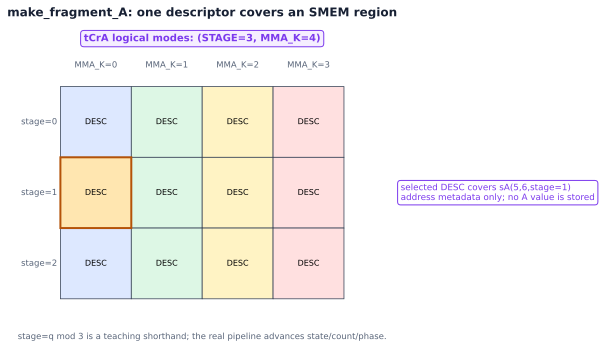
<!-- END GENERATED DIAGRAM: case7 -->

图中的 3 行对应三个 SMEM stage，4 列对应一个 `BK=64` 内的四个 `MMA_K`。橙色边框选中 `stage=1、MMA_K=0` 的 `DESC`：它覆盖 `A[133,70]` 所在的 SMEM 区域，却不保存 `A[133,70]` 的数值。换言之，表格中的格子是 descriptor slot，不是矩阵元素。

`tAsA` 和 `tCrA` 都关联 `sA` 中同一份矩阵数据，但语义不同：前者描述 TMA 的写入方式，后者描述 MMA 的解释与读取方式。当前 PTX shared-memory descriptor 编码地址、leading/stride offset、base offset、stride mode、swizzle 等地址解释信息；operand 类型、major mode 和 instruction shape 的完整语义还来自 `MmaOp` 与 tcgen05 instruction semantics。

> 阶段检查：说明 `tCrA` 属于访问描述、而非矩阵数值副本的原因。

## 第五步：`cute.gemm` 读取 descriptor，把 C/D 累加在 TMEM

按 tcgen05 的 `(M,K)×(K,N)` operand-view 约定，指令语义写作 `D=A×B+C`；换回本文 B tensor 的 `(N,K)` 记法，就是 \(D=AB^{\mathsf T}+C\)。A/B 由 `tCrA/tCrB` descriptor 指向 SMEM，C 是 MMA 前的 accumulator，D 是 MMA 后的 accumulator。C 和 D 可以绑定到同一个 `tCtAcc` TMEM tensor。

```python
# Build the accumulator layout, then bind it to allocated TMEM.
acc_shape = tiled_mma.partition_shape_C(mma_tiler_mnk[:2])
tCtAcc_layout = tiled_mma.make_fragment_C(acc_shape)
tCtAcc = cute.make_tensor(tmem_ptr, tCtAcc_layout.layout)
```

<!-- BEGIN GENERATED DIAGRAM: case8 -->
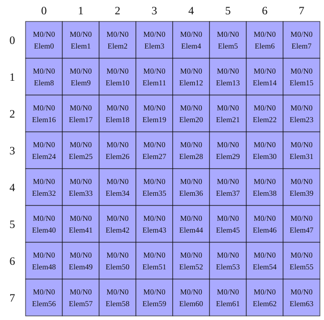
<!-- END GENERATED DIAGRAM: case8 -->

左图把当前 CTA 的真实 `128×256` accumulator 压缩成 `(32×32)` 逻辑块，表示同一块 `tCtAcc` TMEM 区域，而不是虚构的逐线程元素表。橙色横线表示 `A[133,70]×B[n,70]` 对当前 N tile 的 256 个 `D[133,n]` 产生贡献；N 方向三个 CTA tile 合起来才覆盖全局 `D[133,:]` 的 768 列。右侧时间线给出同一 TMEM allocation 的生命周期：`q=0` 初始化，`q=1…5` 在原地址继续累加；其中 `q=1` 覆盖 `k=64…127`，所以包含 `k=70`。

代码变量 `mC/gC/tCgC` 沿用输出矩阵的历史命名。本文示例没有从 GMEM 加载数学公式中的初始 C：第一个 K tile 关闭 accumulate，直接写入 \(D=AB^{\mathsf T}\)；第二个以及后续 K tile 将旧 `tCtAcc` 作为 C，再把新的 D 写回同一个 TMEM 地址。

```python
# Simplified control-flow sketch; not a standalone synchronization template.
for k_tile_idx in cutlass.range(num_k_tiles):
    ab_full = ab_consumer.wait_and_advance()
    tiled_mma.set(tcgen05.Field.ACCUMULATE, k_tile_idx != 0)
    tile_crd = (None, None, None, ab_full.index)
    cute.gemm(tiled_mma, tCtAcc, tCrA[tile_crd], tCrB[tile_crd], tCtAcc)
    ab_full.release()
```

在真实示例中，第一个 K tile 计算 `k=0…63` 并初始化 accumulator；包含 `A[133,70]` 的第二个 K tile 计算 `k=64…127`，把贡献累加到旧 `tCtAcc`。`cute.gemm` 在此处发射异步 MMA；发射并不等于 TMEM 结果已经对所有依赖操作可见。

> 阶段检查：说明第一次与第二次 K 迭代中，`tCtAcc` 分别承担的数学 C/D 角色。

## 第六步：`tCtAcc → tTR_rAcc → mC`，把结果写回 GMEM

tcgen05 accumulator 位于 TMEM，epilogue 需要先执行 TMEM→RMEM load，再由普通线程 store 写入 GMEM。代码先构造 `tiled_copy_t2r`，再用 `partition_S` 建立当前线程的 TMEM source view，用 `partition_D` 建立与之对应的 GMEM destination view，并为线程分配 `tTR_rAcc` 寄存器 tensor。

```python
# Simplified official epilogue pattern; synchronization and loop bounds are omitted.
copy_atom_t2r = cute.make_copy_atom(
    tcgen05.Ld32x32bOp(tcgen05.Repetition.x64),
    cutlass.Float32,
)
tiled_copy_t2r = tcgen05.make_tmem_copy(
    copy_atom_t2r,
    tCtAcc[(None, None), 0, 0],
)
thr_copy_t2r = tiled_copy_t2r.get_slice(thread_idx)
tTR_tAcc = thr_copy_t2r.partition_S(tCtAcc)
tTR_gC = thr_copy_t2r.partition_D(tCgC)
tTR_rAcc = cute.make_rmem_tensor(tTR_gC[None, None, 0].shape, acc_dtype)

# TMEM to registers, then registers to GMEM.
cute.copy(tiled_copy_t2r, tTR_tAcc[None, None, i], tTR_rAcc)
cute.copy(store_atom, tTR_rAcc, tTR_gC[None, None, i])
```

第一条 `cute.copy` 发射 TMEM→RMEM 的 LDTM load；此后可以在寄存器中执行缩放、bias、activation 或类型转换；第二条 copy 才执行 RMEM→GMEM store。

<!-- BEGIN GENERATED DIAGRAM: case9 -->
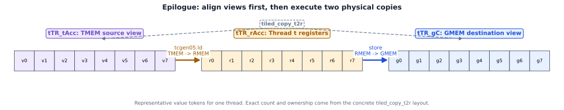
<!-- END GENERATED DIAGRAM: case9 -->

图只画当前线程的一组代表性 value token：左、中、右三栏分别是 TMEM source view、RMEM register fragment 和 GMEM destination view。token 的顺序用来说明 `partition_S`/`partition_D` 必须对齐；它们的数量不是对 `Ld32x32bOp` 的硬编码断言。确切寄存器数量与 Thread–Value ownership 应从具体 `tiled_copy_t2r`、`tTR_tAcc` 和 `tTR_gC` layout 读取。

> 阶段检查：说明 epilogue 先经过 RMEM、而非直接从 TMEM 写入 GMEM 的原因。

## Pipeline 的六个独立事件

理解异步代码时，需要区分程序中的发射顺序与硬件上的完成状态。一次 stage 的生命周期至少包含六个独立事件：

```text
1. Producer acquires an empty SMEM stage.
2. TMA is issued and writes A/B into that stage.
3. Consumer waits until the stage is TMA-ready.
4. tcgen05.mma is issued and consumes the SMEM descriptors.
5. The stage satisfies the pipeline's reuse condition and is released.
6. MMA completion becomes observable; only then may dependent TMEM loads proceed.
```

`ab_consumer.wait_and_advance()` 对应第 3 类依赖，表示 A/B 已经准备就绪；MMA completion 属于后续的独立状态。`release()` 对应第 5 类依赖，表示 producer 可以复用 stage；TMEM-ready 仍由 `PipelineTmaUmma` 的完成协议保证。PTX 中 `tcgen05.mma`、`tcgen05.commit` 和 `tcgen05.ld` 都涉及异步 completion，commit/mbarrier wait 与所需 fence 用于建立第 6 类依赖。高层 CUTLASS pipeline 会封装部分协议，本文伪代码仅说明控制关系，不作为独立同步模板。

> 阶段检查：分别说明 TMA-ready、stage-reuse 和 TMEM-ready 所保护的读写依赖。

## 主线归纳

单 CTA 数据流可以归纳为以下七个步骤：

1. `mA` 是完整 A 的 GMEM tensor；`local_tile` 得到仍指向 GMEM 的 `gA`。
2. `partition_A` 把 `gA` 改写为 per-MMA-instruction 可迭代的 `tCgA`。
3. `tma_partition` 建立 GMEM source `tAgA` 和 SMEM destination `tAsA`。
4. `make_fragment_A` 从 `sA` allocation 的地址/layout 派生 `tCrA`；这一步可在 TMA copy 前完成。
5. 运行时 TMA copy 把数值写入 `sA`，consumer 等待对应 stage TMA-ready。
6. `cute.gemm` 通过 A/B descriptor 读 SMEM，并更新 TMEM `tCtAcc`。
7. epilogue 用 LDTM 把 `tCtAcc` 装入 `tTR_rAcc`，再写到 GMEM `mC`。

能够独立说明这七个步骤，并判断每一步是否发生数据搬运，即表明已经掌握单 CTA 主线。

## 三种 TiledMma 变体

### `CtaGroup.TWO`：两个 CTA 合作

`get_slice(v)` 中的小写 `v=0/1` 选择 CTA-pair 内 rank。官方示例中 pair-level `BM=256`，每个 CTA 得到 A/C 的 M 半区；B 在 MMA 语义上由两 CTA 共同消费，但加载工作可以继续分工。单 CTA partition 应根据 pair-level ownership 和实际 `partition_*` layout 推导。

<!-- BEGIN GENERATED DIAGRAM: case2 -->
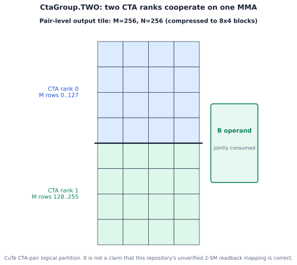
<!-- END GENERATED DIAGRAM: case2 -->

图按官方 `CtaGroup.TWO` 示例画出 pair-level `M=256、N=256` 输出 tile：上、下两个 M 半区分别属于 CTA rank 0/1，右侧 B operand 在 MMA 语义上由两者共同消费。它是 CTA-pair 的逻辑分区图，不是对当前仓库中某个 SM110 双 SM TMEM readback 实现已经正确的证明；具体加载分工和 Thread–Value layout 仍由实际 MMA/copy 对象决定。

### `atom_layout_mnk`：增加 atom 数量

`atom_layout_mnk=(M_rep,N_rep,K_rep)` 在 M/N/K 方向重复 atom，从而扩大 `TiledMma` coverage。下面采用官方示例 `(2,2,1)`：由一个 `128×256×16` atom 变成 2×2 的四个 atom，覆盖 `256×512×16`。该参数描述 MMA 结构内部的 repeat；CTA grid 和 SMEM stage 由其他对象描述。

<!-- BEGIN GENERATED DIAGRAM: case3 -->
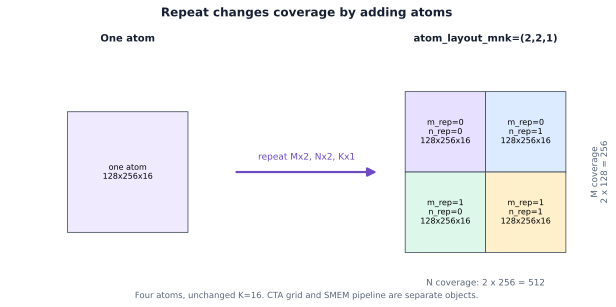
<!-- END GENERATED DIAGRAM: case3 -->

四个格子的 `(m_rep,n_rep)` 索引就是 repeat 层次；`K_rep=1`，因此 K coverage 仍为 16。图中没有把 atom 内部元素或线程 ownership 编造出来。

### `permutation_mnk`：重排映射，不增加 atom

`permutation_mnk` 重排逻辑 MMA tile 到物理 M/N/K 坐标的映射，同时保持 atom 数量和 GEMM 数学结果不变。这里切换到 CUTLASS 官方的独立 `CtaGroup.TWO` 示例，不再沿用主线的 `CtaGroup.ONE、inst_M=128`：该例使用 `inst_M=256`、两个 M tile，总 M coverage 为 512，并以 `m_layout=(128,2,2):(1,256,128)` 将两个 tile 的两个 CTA-rank half 交错排列。

<!-- BEGIN GENERATED DIAGRAM: case4 -->
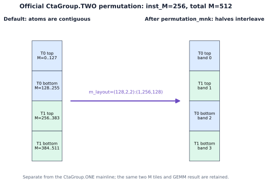
<!-- END GENERATED DIAGRAM: case4 -->

左图是变换前的逻辑 band 顺序，右图是 permutation 后的 band 顺序；相同名称与颜色表示同一 band，中央箭头表示整体应用该 permutation，右侧的颜色顺序显示重排结果。tile 数量和数学结果不变。对以上三种变体，最终 shape 与 ownership 都应以实际 `partition_*` layout 输出为准。

## 对象的存储与语义

| 变量 | 类型或存储 | 保存矩阵数值 | 实际读写操作 |
|---|---|---:|---|
| `mA` | GMEM problem tensor | 是 | TMA 读取 |
| `gA` | GMEM local-tile view | 引用 `mA` | partition/TMA view 使用 |
| `tCgA` | MMA-partitioned GMEM view | 引用 `mA` | `tma_partition` 使用 |
| `tAgA` | TMA GMEM source view | 引用 `mA` | TMA copy 读取 |
| `sA` | SMEM allocation | 是 | TMA 写，MMA 经 descriptor 读 |
| `tAsA` | TMA SMEM destination view | 引用 `sA` | TMA copy 写入 |
| `tCrA` | SMEM descriptor tensor | 否 | `cute.gemm` 消费 |
| `tCtAcc` | TMEM accumulator tensor | 是 | MMA 读写，LDTM 读 |
| `gC/tCgC` | GMEM output views | 引用 `mC` | epilogue store 使用 |
| `tTR_tAcc` | per-thread TMEM source view | 引用 `tCtAcc` | LDTM 读取 |
| `tTR_rAcc` | RMEM tensor | 是 | LDTM 写，epilogue/store 读 |
| `tTR_gC` | per-thread GMEM destination view | 引用 `mC` | final store 写入 |

## 操作的逻辑与物理作用

| 操作 | 改变坐标表达 | 读取或写入数值 | 物理作用 |
|---|---:|---:|---|
| `local_tile` | 是 | 否 | problem view → local view |
| `partition_A/B/C` | 是 | 否 | local view → MMA hierarchy |
| `tma_partition` | 是 | 否 | 构造 TMA source/destination |
| `make_fragment_A/B` | 是 | 否 | 构造 descriptor tensor |
| `make_fragment_C` | 是 | 否 | 构造 accumulator layout |
| TMA `cute.copy` | 通常否 | 是 | GMEM→SMEM |
| `cute.gemm` | 通常否 | 是 | 读取 A/B，更新 TMEM |
| `partition_S/D` | 是 | 否 | 对齐 tiled-copy source/destination |
| LDTM `cute.copy` | 通常否 | 是 | TMEM→RMEM |
| store `cute.copy` | 通常否 | 是 | RMEM→GMEM |
| wait/commit/release/fence | 否 | 不执行矩阵运算 | 控制 ready、reuse 与 completion |

## 自检问题

1. `mA`、`gA` 和 `tCgA` 是否是三份 A？它们的区别是什么？
2. 为什么 `tma_partition` 同时需要 `tAgA` 与 `tAsA`？
3. 哪一步让 `A[133,70]` 第一次离开 GMEM？
4. `tCrA` 的一个元素是 FP16 数值还是 descriptor？
5. 第一次 K tile 为什么设置 `ACCUMULATE=False`？
6. `release()` 能否证明 TMEM accumulator 已经可以被 LDTM 读取？
7. `MMA_K=BK/inst_K` 在什么条件下可以直接使用？
8. `CtaGroup.TWO`、atom repeat 和 permutation 分别改变了什么？

<details>
<summary>参考答案</summary>

1. 三者引用同一份 GMEM 数据，坐标层次依次为 problem、local tile 和 MMA operand hierarchy。
2. TMA copy 需要同时知道从 GMEM 的哪里读和向 SMEM 的哪里写。
3. TMA `cute.copy`。
4. descriptor/fragment-level 对象。
5. accumulator 尚无需要保留的旧 C，首轮直接写 \(AB^{\mathsf T}\)；后续才累加旧 `tCtAcc`。
6. `release()` 只确认 stage reuse 条件；TMEM completion 由独立的完成同步保证。
7. trivial、`CtaGroup.ONE`、无 permutation、无额外 ownership split 且 shape 整除时。
8. CTA pair 改变协作 ownership，repeat 增加 atom 数量，permutation 只重排逻辑到物理坐标的映射。

</details>

## 阅读边界与官方资料

本文主线讨论 dense SS tcgen05 GEMM：A/B 来自 SMEM，accumulator 位于 TMEM。A-from-TMEM、block-scaled、sparse、边界 predication 和完整 pipeline kernel 留待后续讨论。SVG 网格由 `tensor-layouts` 的 `Layout`/visualization API 生成；完整 shape 会按图注明的块大小压缩。彩色图片用于说明数学坐标和逻辑 layout，实际 TV layout、TMEM bank 与 ownership 以 SM110 目标 kernel 的具体 layout/PTX 输出为准。

- [CUTLASS Python DSL tcgen05 MMA Programming Guide](https://docs.nvidia.com/cutlass/latest/media/docs/pythonDSL/mma_docs/tcgen05_programming.html)
- [CuTe Tensors：Engine 与 Layout](https://docs.nvidia.com/cutlass/latest/media/docs/cpp/cute/03_tensor.html)
- [PTX ISA：Tensor Memory 与 tcgen05](https://docs.nvidia.com/cuda/parallel-thread-execution/)
- [`facebookresearch/tensor-layouts` visualization API](https://github.com/facebookresearch/tensor-layouts/blob/main/docs/viz_api.md)
- [`tensor-layouts` 的 SM100 UMMA atom 定义](https://github.com/facebookresearch/tensor-layouts/blob/main/src/tensor_layouts/atoms_nv.py)

资料核对日期：2026-07-14。链接指向 NVIDIA `latest` 文档；团队分享前应固定 CUTLASS commit、PTX ISA 与 `tensor-layouts` 版本。
