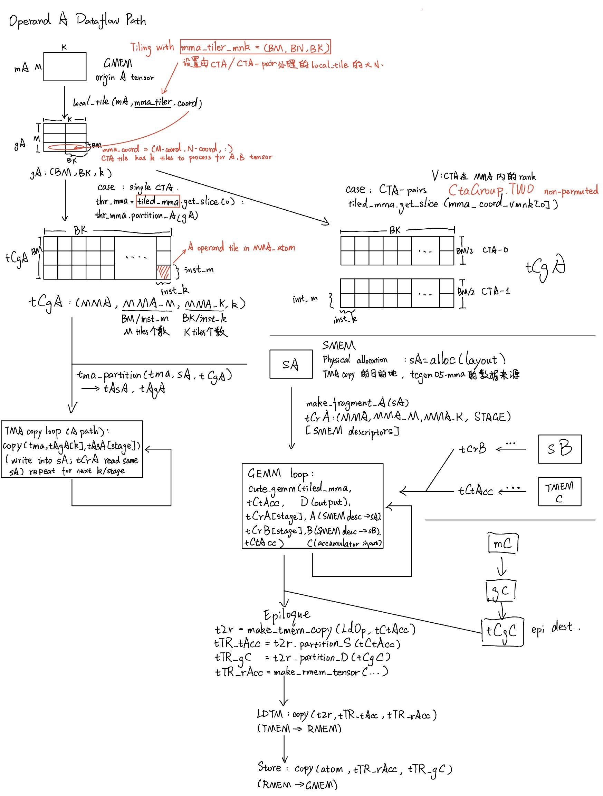
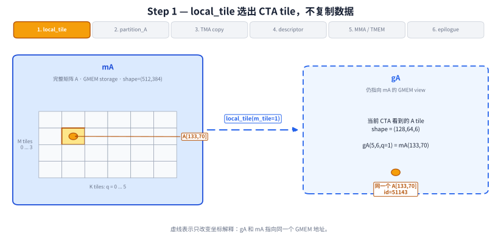
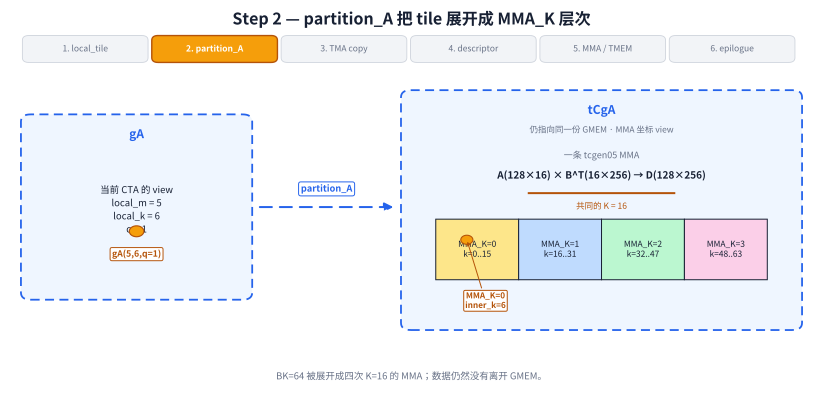
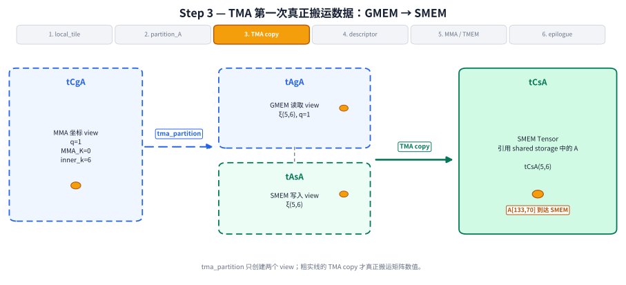
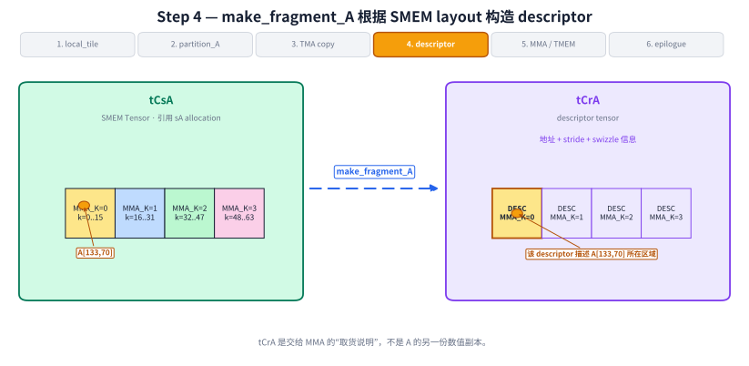
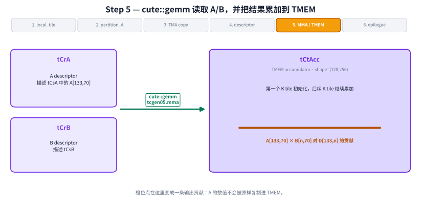
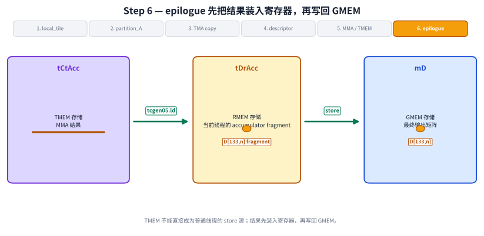

# Blackwell tcgen05 GEMM 中的 CuTe 数据流：view、TMA、descriptor 与 TMEM

本文说明 Blackwell CuTe GEMM 中矩阵 A 的数据流，以及 `mA`、`gA`、`tCgA`、`tAgA`、`tAsA`、`sA`、`tCrA` 等对象之间的关系。这些对象分别承担存储、坐标 view 和硬件访问 descriptor 等职责，并不对应同等数量的矩阵副本。

分析以 `A[133,70]` 为贯穿示例，依次说明它在 GMEM view、SMEM storage、MMA descriptor、TMEM accumulator 和 epilogue 中的坐标与存储变化。

`Layout`、`Tensor`、MMA Atom 和 `TiledMma` 的基本定义可参阅[《CUTLASS：通过张量和空间微内核处理多维数据的原则性抽象》](../../02_cutlass_and_gemm/01-cutlass-principled-abstractions_zh-CN.md)。

代码结构以 NVIDIA CUTLASS 的 C++ CuTe 示例 [`02_mma_tma_sm100.cu`](https://github.com/NVIDIA/cutlass/blob/main/examples/cute/tutorial/blackwell/02_mma_tma_sm100.cu) 为参照。



总览图中的对象分为三类：

- `mA`、`sA`、`tCtAcc`、`tDrAcc` 是保存矩阵数值的存储对象。
- `gA`、`tCgA`、`tAgA`、`tAsA` 是 view：它们改变坐标的解释方式，但不自动复制矩阵。
- `tCrA` 是 descriptor：它编码 MMA 访问 SMEM 中 A 数据所需的地址和布局信息，不保存 A 的数值。

以下按六个数据流阶段展开。

## 第一步：`local_tile` 构造 CTA-local view

本文使用一个具体的 F16/BF16 GEMM：完整问题为 `(M,N,K)=(512,768,384)`，每个 CTA 处理 `(BM,BN,BK)=(128,256,64)`，一条 tcgen05 MMA 的 shape 为 `(128,256,16)`。

`mA` 是完整的 A 矩阵，shape 为 `(512,384)`。对 row-major A 来说，`mA(m,k)` 表示全局坐标 `(m,k)` 的元素。

在 C++ CuTe kernel 中，`local_tile` 根据 MMA tile 坐标，从完整矩阵中选出当前 MMA tile 对应的区域：

```cpp
auto mma_coord = make_coord(m_tile, n_tile, _);
Tensor gA = local_tile(
    mA,
    mma_tiler,
    mma_coord,
    Step<_1, X, _1>{}
);  // (MmaTile_M, MmaTile_K, Tiles_K)
```

示例元素 `A[133,70]` 位于 M 方向的第 2 个 tile、K 方向的第 2 个 tile：

```text
m_tile = floor(133 / 128) = 1
q      = floor(70 / 64)   = 1

local_m = 133 - 1×128 = 5
local_k = 70  - 1×64  = 6
```

因此：

```text
mA(133,70) = gA(5,6,q=1)
```

<!-- BEGIN GENERATED DIAGRAM: step1 -->

<!-- END GENERATED DIAGRAM: step1 -->

`gA` 不对应新的显存分配。它仍然引用 `mA(133,70)` 的原始 GMEM 地址，并把全局坐标改写为“tile 内坐标 + 外层 K tile 编号”。

## 第二步：`partition_A` 构造 MMA 坐标层次

一条 tcgen05 MMA 处理的基本形状是：

```text
A(128×16) × Bᵀ(16×256) → D(128×256)
```

A 和 B 共享同一个 K=16 收缩维。CuTe 用 MMA Atom 表示这一条硬件操作，再用 `TiledMma` 描述它如何覆盖当前 CTA tile。

```cpp
TiledMMA tiled_mma = make_tiled_mma(
    SM100_MMA_F16BF16_SS<
        TypeA, TypeB, TypeC,
        128, 256,
        UMMA::Major::K, UMMA::Major::K
    >{}
);

auto bM = tile_size<0>(tiled_mma);
auto bN = tile_size<1>(tiled_mma);
auto bK = tile_size<2>(tiled_mma) * Int<4>{};
auto mma_tiler = make_shape(bM, bN, bK);  // (128,256,64)
```

当前 A tile 的 K 长度为 `BK=64`，一条 MMA 每次消费 `inst_K=16`，因此一个 A tile 包含四次 MMA K 迭代：

```text
MMA_K = 0 → local_k  0..15
MMA_K = 1 → local_k 16..31
MMA_K = 2 → local_k 32..47
MMA_K = 3 → local_k 48..63
```

`partition_A` 按该 MMA 层次重新解释 `gA`：

```cpp
ThrMMA cta_mma = tiled_mma.get_slice(_0{});
Tensor tCgA = cta_mma.partition_A(gA);
```

对 `A[133,70]`，tile 内 K 坐标为 6，因此：

```text
MMA_K  = floor(6 / 16) = 0
inner_k = 6 mod 16     = 6
```

<!-- BEGIN GENERATED DIAGRAM: step2 -->

<!-- END GENERATED DIAGRAM: step2 -->

`tCgA` 仍然引用原来的 GMEM 数据。`partition_A` 建立按 `MMA_K` 遍历 A tile 的坐标层次，不读取或复制 A 的数值。

## 第三步：`tma_partition` 与 TMA copy 将 A 搬到 SMEM

tcgen05 的 SS 路径要求 A 和 B 位于 SMEM，因此需要把当前 A tile 从 GMEM 搬到 shared storage 中的 `sA`。C++ CuTe 代码通过 `tCsA` Tensor 表示这块 SMEM allocation 及其 layout：

```cpp
Tensor tCsA = shared_storage.tensor_sA();
Tensor tCsB = shared_storage.tensor_sB();
```

`tma_partition` 建立两个 view：

- `tAgA` 描述 TMA 从 GMEM 的哪里读取；
- `tAsA` 描述 TMA 向 SMEM 的哪里写入。

```cpp
auto [tAgA, tAsA] = tma_partition(
    tma_atom_A,
    Int<0>{},
    Layout<_1>{},
    group_modes<0,3>(tCsA),
    group_modes<0,3>(tCgA)
);
```

`tma_partition` 仅建立 source view 和 destination view。数据搬运由以下调用执行：

```cpp
copy(
    tma_atom_A.with(shared_storage.tma_barrier),
    tAgA(_, k_tile),
    tAsA
);
```

对 `A[133,70]`，该 copy 的坐标关系为：

```text
GMEM: tAgA(ξ(5,6), q=1)
             │
             │ TMA copy
             ▼
SMEM: tAsA(ξ(5,6))
             │
             ▼
          tCsA(5,6)
```

<!-- BEGIN GENERATED DIAGRAM: step3 -->

<!-- END GENERATED DIAGRAM: step3 -->

该调用将 `A[133,70]` 从 GMEM 写入 `tCsA(5,6)` 所引用的 `sA` shared storage。`tAgA` 和 `tAsA` 分别提供 TMA 的读取 view 和写入 view。

MMA 读取 `tCsA` 和 `tCsB` 前，必须等待 TMA 完成 A/B 写入。

## 第四步：`make_fragment_A` 构造 MMA descriptor

tcgen05 MMA 通过 descriptor 访问 SMEM。descriptor 编码 SMEM 地址、stride、swizzle 等布局信息。

CuTe 根据 `sA` 的地址和 layout 构造 `tCrA`：

```cpp
Tensor tCrA = cta_mma.make_fragment_A(tCsA);
Tensor tCrB = cta_mma.make_fragment_B(tCsB);
```

`tCsA` 引用 shared storage 中的 A 数值；`tCrA` 保存 MMA 访问这些数值所需的 descriptor。

<!-- BEGIN GENERATED DIAGRAM: step4 -->

<!-- END GENERATED DIAGRAM: step4 -->

图中选中的 `DESC(MMA_K=0)` 描述 `A[133,70]` 所在的 SMEM 区域。descriptor 本身不保存 `A[133,70]` 的 FP16/BF16 数值。

`make_fragment_A` 只根据 allocation 和 layout 构造 descriptor，因此可以在主循环之前执行。当该 descriptor 被用于发射 MMA 时，`tCsA` 必须已经由 TMA 写入完成。

## 第五步：`cute::gemm` 更新 TMEM accumulator

`cute::gemm` 通过 `tCrA` 和 `tCrB` 访问 SMEM 中的 A/B tile，并把结果累加到 TMEM 中的 `tCtAcc`。`make_fragment_C` 先生成 accumulator layout，随后将其绑定到已分配的 TMEM 地址：

```cpp
Tensor tCtAcc = cta_mma.make_fragment_C(tCgC);

uint32_t elect_one_thr  = cute::elect_one_sync();
uint32_t elect_one_warp = (threadIdx.x / 32 == 0);

using TmemAllocator = cute::TMEM::Allocator1Sm;
TmemAllocator tmem_allocator{};

if (elect_one_warp) {
  tmem_allocator.allocate(
      TmemAllocator::Sm100TmemCapacityColumns,
      &shared_storage.tmem_base_ptr
  );
}
__syncthreads();
tCtAcc.data() = shared_storage.tmem_base_ptr;
```

主循环对每个 K tile 更新同一个 accumulator：

```cpp
tiled_mma.accumulate_ = UMMA::ScaleOut::Zero;
int tma_transaction_bytes = sizeof(make_tensor_like(tAsA))
                          + sizeof(make_tensor_like(tBsB));

for (int k_tile = 0; k_tile < size<3>(tCgA); ++k_tile) {
  if (elect_one_warp && elect_one_thr) {
    cute::set_barrier_transaction_bytes(
        shared_storage.tma_barrier,
        tma_transaction_bytes
    );
    copy(
        tma_atom_A.with(shared_storage.tma_barrier),
        tAgA(_, k_tile),
        tAsA
    );
    copy(
        tma_atom_B.with(shared_storage.tma_barrier),
        tBgB(_, k_tile),
        tBsB
    );
  }

  cute::wait_barrier(shared_storage.tma_barrier, tma_barrier_phase_bit);
  tma_barrier_phase_bit ^= 1;

  if (elect_one_warp) {
    for (int k_block = 0; k_block < size<2>(tCrA); ++k_block) {
      gemm(
          tiled_mma,
          tCrA(_, _, k_block),
          tCrB(_, _, k_block),
          tCtAcc
      );
      tiled_mma.accumulate_ = UMMA::ScaleOut::One;
    }
    cutlass::arch::umma_arrive(&shared_storage.mma_barrier);
  }

  cute::wait_barrier(shared_storage.mma_barrier, mma_barrier_phase_bit);
  mma_barrier_phase_bit ^= 1;
}
```

第一个 K tile 把 accumulator 初始化为该 tile 的乘积；后续 K tile 在原来的 `tCtAcc` 上继续累加。

`A[133,70]` 位于 `q=1`，即第二个 K tile。MMA 将它与 `B[n,70]` 相乘，并把乘积累加到当前输出 tile 的 `D[133,n]`：

```text
A[133,70] × B[n,70] → D[133,n] 的一部分
```

<!-- BEGIN GENERATED DIAGRAM: step5 -->

<!-- END GENERATED DIAGRAM: step5 -->

`cutlass::arch::umma_arrive` 和后续 barrier wait 用于确认 MMA 已经完成对当前 A/B SMEM buffer 的读取；随后 TMA 才能覆盖该 buffer。

## 第六步：epilogue 执行 TMEM→RMEM→GMEM

tcgen05 的 accumulator 位于 TMEM。普通线程不能直接把 TMEM 当作常规 store 的源，因此 epilogue 先把结果从 TMEM 装入寄存器，再写回 GMEM。

```cpp
TiledCopy tiled_t2r_copy = make_tmem_copy(
    SM100_TMEM_LOAD_32dp32b1x{},
    tCtAcc
);
ThrCopy thr_t2r_copy = tiled_t2r_copy.get_slice(threadIdx.x);

Tensor tDgC = thr_t2r_copy.partition_D(tCgC);
Tensor tDrC = make_fragment_like(tDgC);
copy(tDgC, tDrC);  // GMEM C → RMEM

Tensor tDtAcc = thr_t2r_copy.partition_S(tCtAcc);
Tensor tDgD   = thr_t2r_copy.partition_D(tCgD);
using AccType = typename decltype(tCtAcc)::value_type;
Tensor tDrAcc = make_tensor<AccType>(shape(tDgD));

copy(tiled_t2r_copy, tDtAcc, tDrAcc);  // TMEM → RMEM
axpby(alpha, tDrAcc, beta, tDrC);       // RMEM → RMEM
copy(tDrC, tDgD);                       // RMEM → GMEM D
```

其中：

- `tDtAcc` 是当前线程看到的 TMEM source view；
- `tDrAcc` 是从 TMEM 装入的寄存器 accumulator fragment；
- `tDgD` 是与这些寄存器值对应的 GMEM D destination view。

<!-- BEGIN GENERATED DIAGRAM: step6 -->

<!-- END GENERATED DIAGRAM: step6 -->

`copy(tiled_t2r_copy, tDtAcc, tDrAcc)` 执行 TMEM→RMEM，`copy(tDrC, tDgD)` 执行 RMEM→GMEM。epilogue 读取 `tCtAcc` 前必须等待 MMA 完成，这构成 TMEM-ready 依赖。
