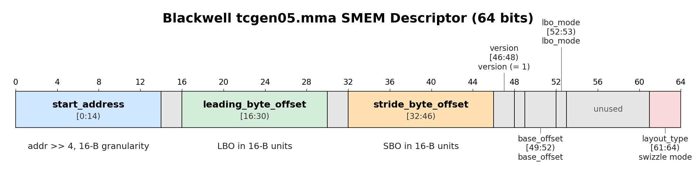
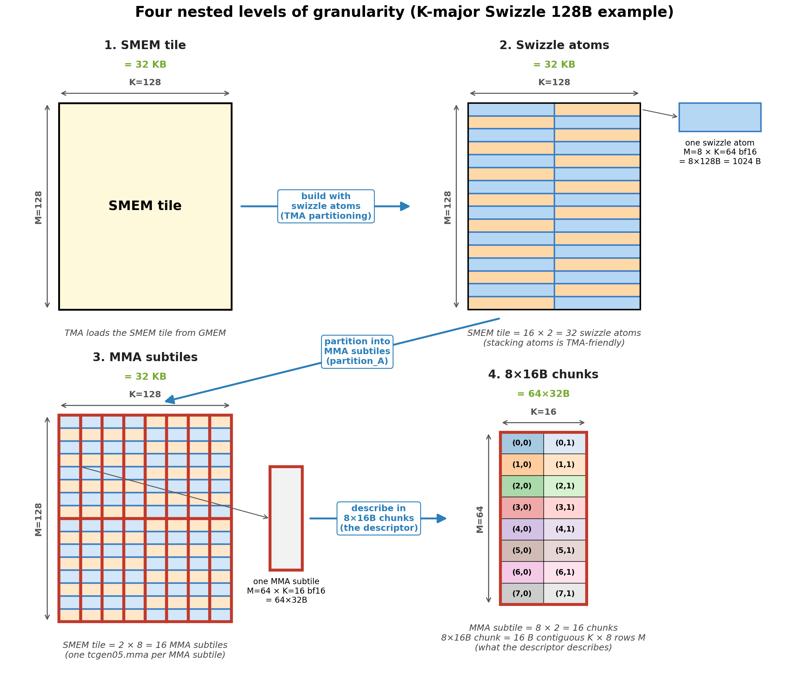
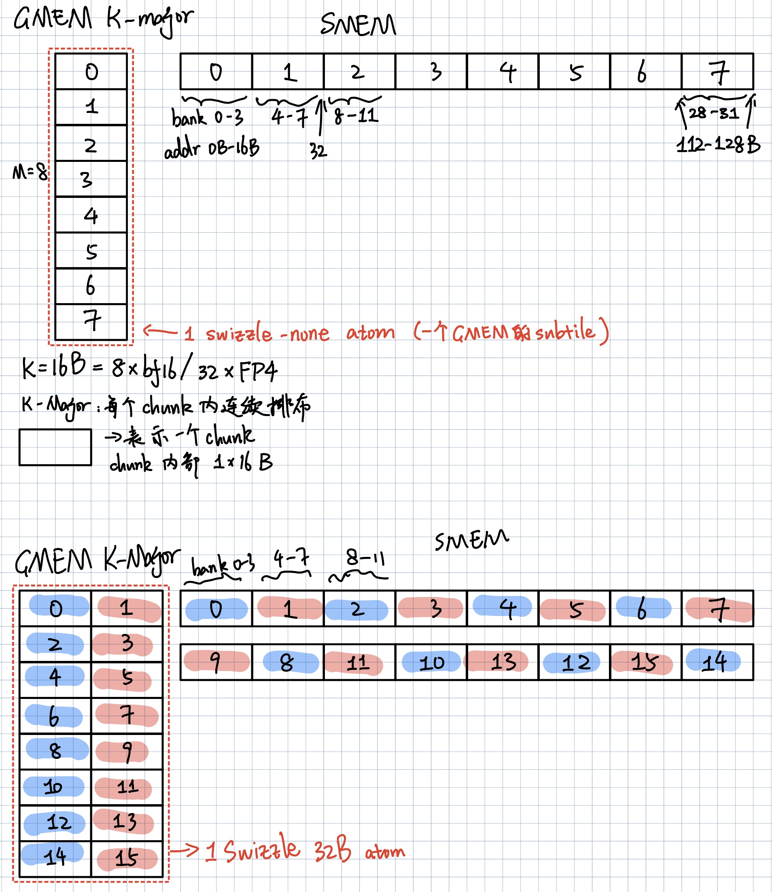

# SMEM matrix descriptor 和 tcgen05 Swizzle 解析

`start_address` （比特位 0–13）—— 操作数在 SMEM 中的起始字节地址除以 16 的值。因此粒度为 16 B（一个 `uint128` ），该字段可寻址的 SMEM 大小上限为 `2^14 * 16 = 256 KB` ，远大于 Blackwell 的 232 KB。

`leading_byte_offset` / LBO（比特位 16–29）—— 硬件用来遍历操作数的两个 stride 之一。同样以 16\-B 单位存储。它是沿着连续维度的 stride（对于 K\-major 为 K， 对于 MN\-major 为 M）。

`stride_byte_offset` / SBO（位 32–45）——另一个 stride。同样以 16\-B 为单位。它是沿非连续维度的 stride（K\-major 时为 M，MN\-major 时为 K）。

`layout_type` （比特位 61–63）—— swizzle 模式： `SWIZZLE_NONE=0` 、 `SWIZZLE_128B=2` 、 `SWIZZLE_64B=4` 、 `SWIZZLE_32B=6` 。这与上文中的 8 种 swizzle 布局相同。

四种`primitive building blocks`原始构建块表示一个SMEM tile：

|SMEM tile|M=128 × K=128 \(= 128 × 256 B\)|从 GMEM 进行拷贝的高级别 SMEM 区域的一个 TMA 阶段|
|---|---|---|
|Swizzle atom|8 × 128 B \(= M=8 × K=64 bf16\)|`Swizzle 128B` 布局的构建块。对 TMA 友好：每条 TMA 指令一次加载多个 swizzle atom。|
|MMA subtile / D tile|M=64 × K=16 \(= 64 × 32 B\)|一个 `tcgen05.mma` 指令的 A/B operand。|
|8×16B chunk|8 × 16 B \(= 8 rows of one uint128\)|MMA 硬件访问的原始单位。每个块完全位于一个 swizzle atom内。|

1. SMEM tile（ `(M=128, K=128)` ）是一个高层级的 SMEM 区域，一个 DMA 阶段从 GMEM 将其拷贝过来。

2. 通过堆叠 swizzle atom来构造用于 TMA 的 SMEM tile。SMEM tile字面上就是 `tile_to_shape(Layout_K_SW128_Atom, (M=128, K=128))` —— 一个由 `8x128B` swizzle atom组成的 16×2 网格（图中蓝色或橙色方框）。单个 TMA 指令（方框）一次加载多个沿 M 堆叠的 swizzle atom。

3. MMA 通过 MMA 子 tile 消费 SMEM  tile ，每个 MMA 子 tile 对应一个 `tcgen05.mma` 指令（图中红色方框）。对于 bf16，一个 `tcgen05.mma` 指令处理一个 `M=64, K=16` A 子 tile 。整个 SMEM 瓷片被划分为 2x8=16 个 MMA 子 tile 。这通常被称为 MMA 分区布局 `tCsA = ((MMA_M, MMA_K), Num_MMA_M, Num_MMA_K) = ((64, 16), 2, 8)` 。

每个 MMA 子块又是一个由 8×16B 块组成的网格。MMA 硬件并不识别 swizzle  atom  —— 它以 `8×16B` 块为单位访问 SMEM。一个 swizzle atom 包含 8 个块；一个 MMA 子块包含 8x2=16 个块。

K\-major SMEM 描述符（ layout\_type 、 SBO 和 LBO ）描述了 8x16B 个 chunk 在 SMEM 中一个 MMA 子瓦片内的布局方式。

MN\-major SMEM 描述符（ layout\_type 、 SBO 和 LBO ）描述了 swizzle atom 在 SMEM 中一个 MMA 子瓦片内的布局方式。

每个 MMA 子子块由一个 SMEM 描述符描述。在不同的 MMA 子子块之间， 8x16B 块/抖动原子以相同的方式布局。唯一的区别是子子块的 start\_address 。因此，MMA 子子块之间的 SMEM 描述符更新就是在描述符中对 start\_address 的更新。

