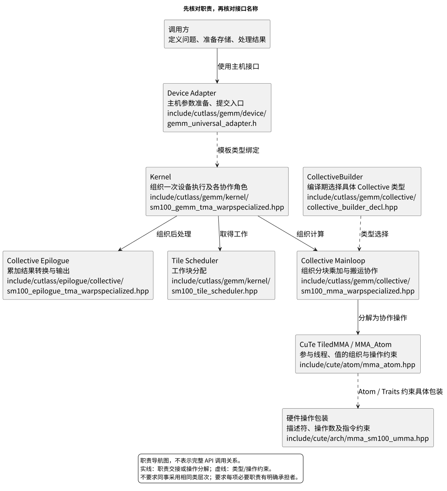
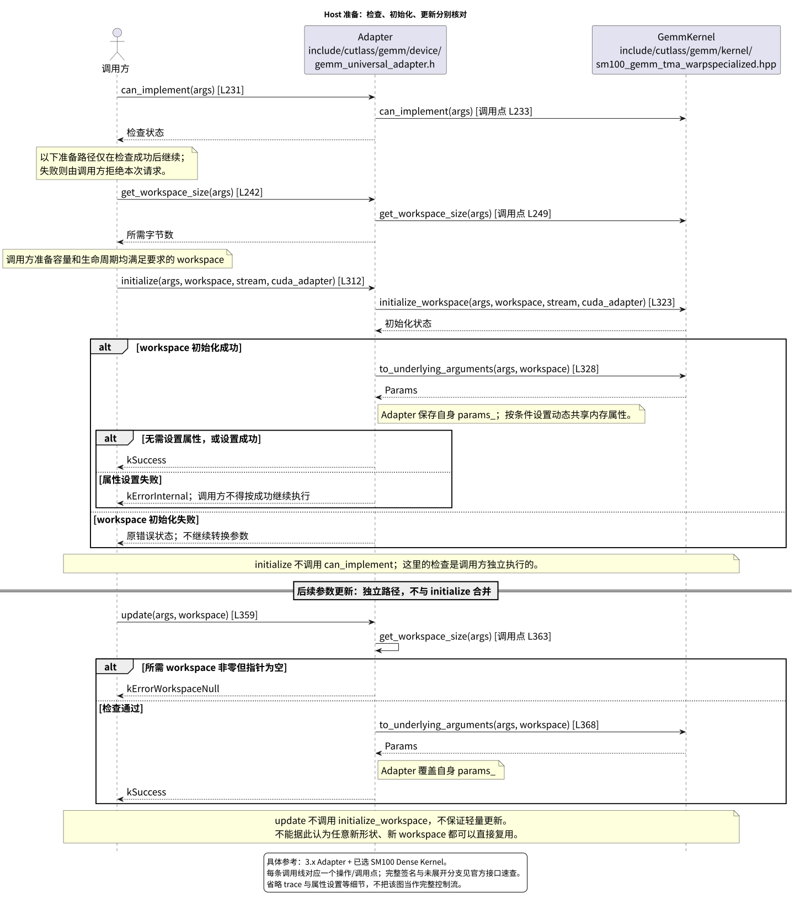
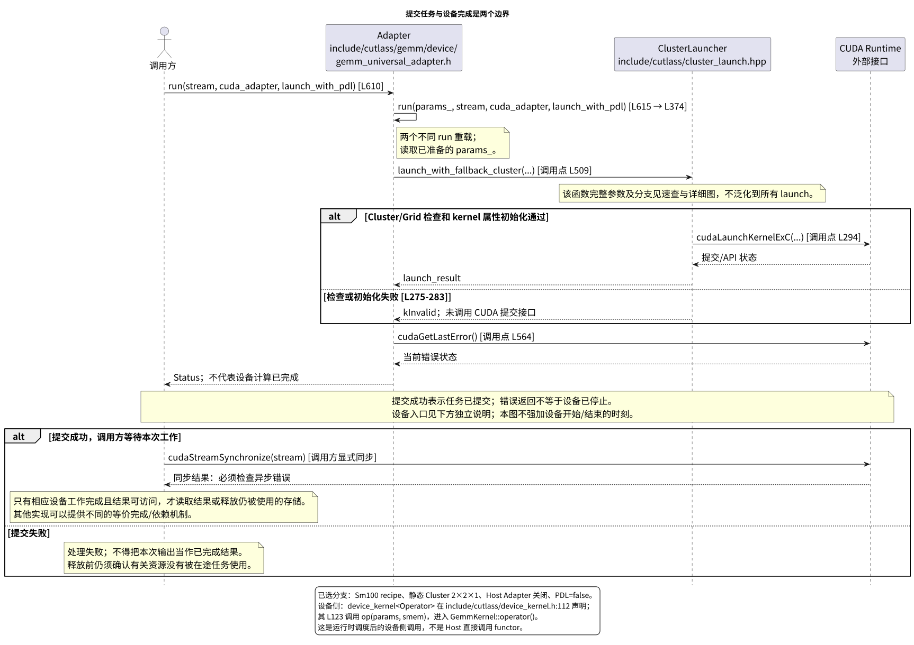
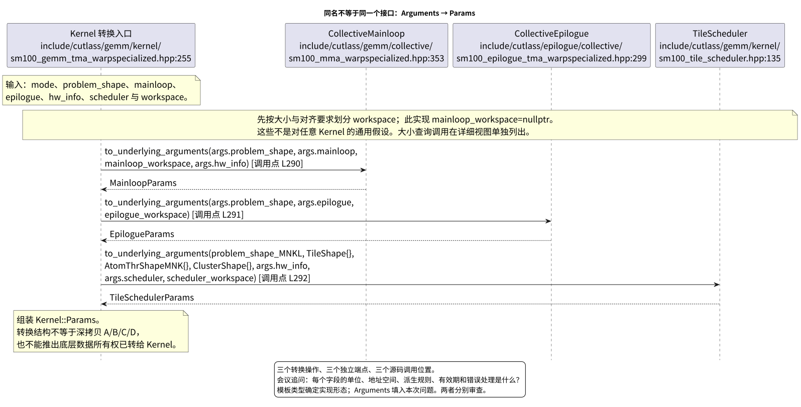
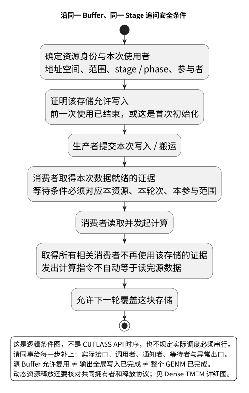

# CUTLASS 接口对齐会资料

这份材料用于**会前没有同事接口、会上由同事讲解实现**的场合。先确认实现承诺，再沿一次 GEMM 检查接口之间是否接得上。官方实现是可追溯的参考，不是要求另一套硬件逐层照搬的标准答案。

## 开会时从这里开始

1. 打开 [现场评审手册](handbook.md)。先问清兼容范围，再请同事展示一段最小调用程序，并讲到结果可读和资源释放。
2. 用下面的五张图定位正在讨论的问题。会议图只保留必要的职责与操作；完整签名、各参数、独立调用点见 [官方接口速查](references.md) 和详细图集。
3. 复制 [现场记录模板](review-record-template.md)，每项争议单独记录。现场没有证据的问题记为待验证，不猜测通过或失败。

建议将一小时分成：范围确认 10 分钟、一次完整调用 20 分钟、数据与同步追问 20 分钟、结论及后续验证 10 分钟。这是议程建议，不是完成验证的时间承诺。

## 五张会议图

### 1. 职责总览

先找出谁接受问题、谁组织计算、谁分配工作、谁约束单条操作。实线与虚线均为图上标明的职责/类型关系，不是一张运行调用图。Tile Scheduler 单独列出；它不等于 Mainloop Schedule 或 MMA Atom。



[独立打开 SVG](diagrams/01-responsibilities.svg) · [可编辑 PlantUML](diagrams/01-responsibilities.puml) · [Builder 详细视图](../site/index.html?view=types.view.entry)

### 2. 初始化和更新分别做什么

核对每个接口的前置条件、错误返回，以及 workspace 由谁分配和初始化。`update()` 并不是“重新执行 initialize()”的别名。



[独立打开 SVG](diagrams/02-prepare.svg) · [可编辑 PlantUML](diagrams/02-prepare.puml) · [Host 生命周期详细视图](../site/index.html?view=host.lifecycle)

### 3. 提交与完成分开看

两个 `run()` 重载分别画线。Host 通过运行时提交设备任务，不是直接同步调用设备 functor。图的外部同步用于说明责任边界，不代表本次实际运行过 GPU。



[独立打开 SVG](diagrams/03-launch.svg) · [可编辑 PlantUML](diagrams/03-launch.puml) · [提交路径详细视图](../site/index.html?view=host.launch)

### 4. Arguments 怎样交给设备

同名的三个 `to_underlying_arguments()` 属于不同组件，分别转换各自的输入；它们没有合并成一个接口。图只展开这三项转换，workspace 大小查询等独立调用见详细视图。



[独立打开 SVG](diagrams/04-handoff.svg) · [可编辑 PlantUML](diagrams/04-handoff.puml) · [参数转换详细视图](../site/index.html?view=host.preparation)

### 5. 沿同一块缓冲追问

这是一张**审查用逻辑条件图**，不是某个架构的 API 时序。让同事给每个条件标出实际接口、参与者及证据；无异步流水线的实现也应能说明何时读完、何时允许覆盖。



[独立打开 SVG](diagrams/05-buffer-contract.svg) · [可编辑 PlantUML](diagrams/05-buffer-contract.puml) · [Dense TMEM 独立事件与源码](../site/index.html?protocol=dense.protocol_draft.tmem_lifetime)

## 官方参考的适用范围

基线为 NVIDIA CUTLASS 提交 `8f50b052e1099fb982392a622caab69b97b63128`，库版本 **4.6.0**；“3.x”指本文使用的 API 体系。离线源码保留在上级图集，不需要联网读取。

会议中的具体执行参考是已有的 Dense FP16 路径：C++ `Sm100` 配置、`sm_110a` 编译目标、A/B 为 FP16、C/D 与累加器为 FP32、RowMajor、Tile 256×128×64、Cluster 2×2×1，默认 Host Adapter 关闭、PDL 关闭。**编译期类型选择已做静态核对，不等于已经运行 GPU 或证明性能。**

这条路径不覆盖所有 Adapter 分支、完整 TMA 描述符构造、全部 Scheduler/Fusion 行为，也不能替代其他架构和 Grouped、MoE、Block-Scaled、Attention 的专项审查。手册给出的是追问入口；如果同事承诺这些功能，应选其中一个真实案例另行走通。

原 824 文件全库图集仍未完成。按本次要求停止继续扩展，保留已有产物和未完成记录作为附录，不把会议包完成等同于全库通过，也不将全库完成作为开会的前置条件。

## 离线使用与重生成

直接打开本目录的 `index.html`；Markdown 是可编辑正文。通过速查页可跳到官方固定源码与已有详细图。移动资料时保留本目录与上级 `site/` 的相对位置；单独拷贝本目录会失去上级源码和详细图链接。

会议包重生成仅使用已有 `data/atlas.json` 和固定快照，不运行未完成的全库提取器。在本目录执行：

```bash
python3 build.py
```

需要本机已有的 Python 3、Pandoc、PlantUML、Java 和 Graphviz；阅读生成结果不需要这些工具或网络。检查结果见 [验收记录](review.md)。
