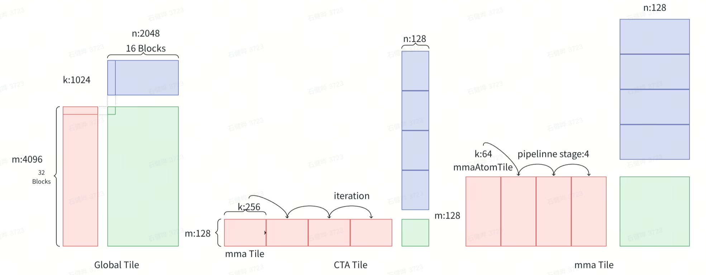
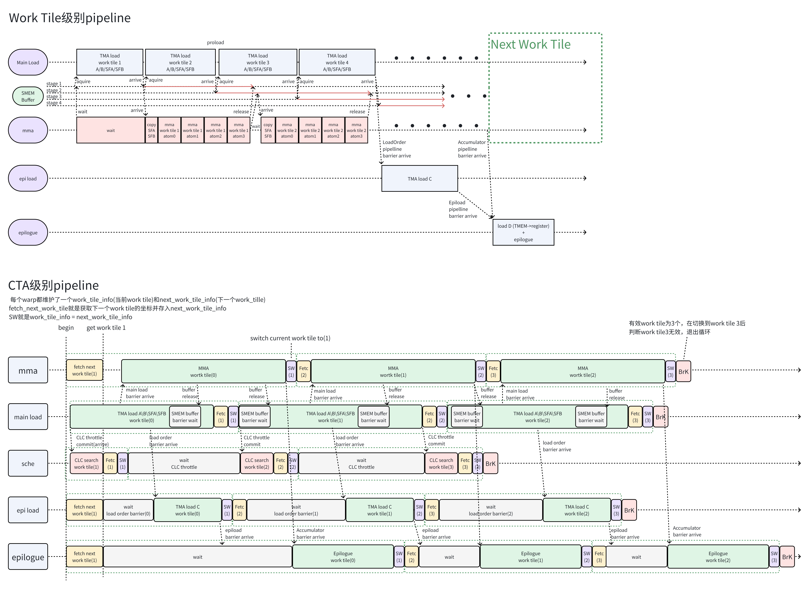

# CUTLASS NVFP4 GEMM 技术分享

作者：黄河澎

## 1. Pipeline

### 1.1 问题划分

一个 work tile 只在 M 和 N 维度上切分。本例中，work tile 在 M 和 N 维度上的切分粒度均为 128。

一个 work tile 由多个 MMA tile 组成，MMA tile 只在 work tile 的 K 维度上切分。一个 MMA tile 也是一个 TMA tile。



### 1.2 Persistent Kernel 与 Cluster Launch Control（CLC）

#### 1.2.1 无 overlap

每个 work tile 对应一个 CTA（block）执行。执行完一个 CTA 的所有操作后，SM 调度并启动下一个 CTA。

这种方式下，在每个 tile 的尾处理阶段，MMA 和 TMA 均处于闲置状态，MMA 利用率较低。

> 图片暂缺。

#### 1.2.2 Persistent Kernel 静态调度

这种方式也称为 Persistent Cluster 或 Worker，是一种软件调度方式。

划分好 work tile 后，只启动一定数量的 CTA。本例中，启动的 CTA 数量与 SM 数量相等。每个 CTA（Worker）在 kernel 启动时便已分配好需要处理的 work tile。

搭配 warp specialization，在尾处理 warp 执行尾处理操作时，让 mainloop warp 同步处理下一个 work tile。这样 mainloop 可以隐藏 epilogue 的延迟。

缺点是 work 需要事先分配，容易造成负载不均衡。例如，某些 SM 运行较慢、发生 I/O 阻塞、部分共享内存被其他 kernel 使用，或者 SM 优先执行了其他任务，但该 SM 仍然需要完成预先定义的任务量，其他已经完成任务的 SM 必须等待它完成。

> 图片暂缺。

#### 1.2.3 CLC 动态调度

CLC 动态调度需要 Blackwell 的硬件支持。内核会为每个 work tile 维护一个三维的 ClcID，并保存其启动状态。

每个 CTA 会根据自身任务的完成情况发起 CLC 查询，查找尚未启动的 work tile 的 ClcID。当当前 work tile 进入 epilogue 时，CTA 根据 ClcID 计算待处理 work tile 的坐标，并同步启动下一个 work tile 的 mainloop。

> 图片暂缺。

### 1.3 Warp 类别与 Pipeline

#### Warp 分类

| Warp 编号 | 类别 | 线程数 | 说明 |
| --- | --- | ---: | --- |
| 0 | MMA | 32 | 执行 UMMA 指令 |
| 1 | Schedule | 32 | 发起 CLC 查询，获取下一个 work tile |
| 2 | Mainloop Load | 32 | TMA load A、B、SFA、SFB |
| 3 | Epilogue Load | 32 | TMA load C |
| 4～7 | Epilogue | 128 | 从 TMEM 读取累加器，执行后处理和 requant |

#### Pipeline 分类

| 名称 | Producer | Consumer | 说明 |
| --- | --- | --- | --- |
| `MainloopPipeline` | Mainloop Load | MMA | 管理 A、B、SFA、SFB 从 GMEM 到 SMEM 的 TMA load 与 MMA 消费之间的同步。生产者完成 TMA load 后执行 arrive，消费者 MMA 等待数据就绪后消费。 |
| `CLCPipeline` | Schedule | 所有 warp（包括 Schedule） | 管理 CLC 查询响应。Scheduler 发起 `try_cancel` 查询，硬件将 128-bit 响应写入 SMEM，并 multicast 到 cluster 内所有 CTA；所有消费者 warp 各自调用 `fetch_next_work`，读取下一个 work tile 的坐标。 |
| `CLCThrottlePipeline` | Mainloop Load 启动阶段 | `CLCPipeline` | 控制速度，防止 Scheduler warp 发出 CLC 查询的速度超过 Mainloop Load 的处理速度。Mainloop Load 在开始处理每个 work tile 时 commit；Scheduler 在发出 CLC 查询前必须 wait，以避免工作负载过度倾斜。 |
| `AccumulatorPipeline` | MMA | Epilogue | 管理 C 矩阵从 GMEM 到 SMEM 的 TMA load，用于融合 \(\beta C\)。Epilogue Load 完成加载后，通知 Epilogue warp 可以消费。 |
| `EpiStorePipeline` | Epilogue | TMA | 管理 D 矩阵从 SMEM 到 GMEM 的 TMA store。Epilogue warp 将结果写入 SMEM 后，由 TMA 异步写回 GMEM，并通过 scoreboarding 同步。 |
| `LoadOrderPipeline` | Mainloop Load | Epilogue Load | 确保 Mainloop Load 的前几个 prologue stage 完成后，Epilogue Load 才开始工作，从而保证 TMA load 的顺序正确。Mainloop Load 优先占用 TMA 带宽，先全力加载 A、B、SFA、SFB，以快速喂饱 MMA。 |



### 1.4 部分源码

#### 1.4.1 Mainloop Load

```cpp
if (is_participant.main_load) {
  // Ensure that the prefetched kernel does not touch
  // unflushed global memory prior to this instruction
  cutlass::arch::wait_on_dependent_grids();
  bool do_load_order_arrive = is_epi_load_needed;
  bool requires_clc_query = true;

  do {
    // Get the number of K tiles to compute for this work as well as
    // the starting K tile offset of the work.
    auto k_tile_iter = scheduler.get_k_tile_iterator(
      work_tile_info, problem_shape_MNKL, CtaShape_MNK{}, load_inputs.k_tiles);
    auto k_tile_count = TileScheduler::get_work_k_tile_count(
      work_tile_info, problem_shape_MNKL, CtaShape_MNK{});
    auto k_tile_prologue = min(MainloopPipeline::Stages, k_tile_count);

    if constexpr (IsSchedDynamicPersistent) {
      if (is_first_cta_in_cluster && requires_clc_query) {
        // 控制 Schedule warp 的 CLC 查询速率。
        clc_throttle_pipeline.producer_acquire(clc_pipe_throttle_producer_state);
        clc_throttle_pipeline.producer_commit(clc_pipe_throttle_producer_state);
        ++clc_pipe_throttle_producer_state;
      }
    }

    if (threadIdx.x % 32 == 0) {
      global_while_count[blockIdx.x][blockIdx.y][0]++;
    }

    // Start mainloop prologue loads, arrive on the epilogue residual
    // load barrier, then resume mainloop loads.
    // 先进行 k_tile_prologue 轮 mainloop load，确保先喂饱 MMA。
    auto [mainloop_producer_state_next, k_tile_iter_next] =
      collective_mainloop.load(
        mainloop_pipeline,
        mainloop_pipe_producer_state,
        load_inputs,
        cta_coord_mnkl,
        k_tile_iter,
        k_tile_prologue
      );

    // 加载足够的数据后，通过 load_order_barrier 通知 Epilogue Load 加载 C。
    mainloop_pipe_producer_state = mainloop_producer_state_next;
    if (do_load_order_arrive) {
      load_order_barrier.arrive();
      do_load_order_arrive = false;
    }

    // 通知完成后，继续加载剩余的 A、B、SFA、SFB。
    auto [mainloop_producer_state_next_, unused_] =
      collective_mainloop.load(
        mainloop_pipeline,
        mainloop_pipe_producer_state,
        load_inputs,
        cta_coord_mnkl,
        k_tile_iter_next,
        k_tile_count - k_tile_prologue
      );
    mainloop_pipe_producer_state = mainloop_producer_state_next_;

    // Sync warp to prevent non-participating threads entering next wave early.
    __syncwarp();

    // 获取下一个 work tile 并替换当前 work tile。
    auto [next_work_tile_info, increment_pipe] = scheduler.fetch_next_work(
      work_tile_info,
      clc_pipeline,
      clc_pipe_consumer_state
    );
    work_tile_info = next_work_tile_info;

    // 将 work tile 索引转换为 CTA 索引，即 work tile 在 M 和 N
    // 维度上的切分索引，以便计算该 work tile 的内存地址。
    cta_coord_mnkl = scheduler.work_tile_to_cta_coord(work_tile_info);
    requires_clc_query = increment_pipe;
    if (increment_pipe) {
      ++clc_pipe_consumer_state;
    }
  } while (work_tile_info.is_valid());

  collective_mainloop.load_tail(
    mainloop_pipeline, mainloop_pipe_producer_state);
}
```

#### 1.4.2 Schedule

```cpp
else if (is_participant.sched) {
  if constexpr (IsSchedDynamicPersistent) {
    bool requires_clc_query = true;

    cutlass::arch::wait_on_dependent_grids();
    do {
      if (threadIdx.x % 32 == 0) {
        global_while_count[blockIdx.x][blockIdx.y][1]++;
      }

      if (requires_clc_query) {
        // Throttle CLC query to mitigate workload imbalance caused by
        // skews among persistent workers.
        clc_throttle_pipeline.consumer_wait(clc_pipe_throttle_consumer_state);
        clc_throttle_pipeline.consumer_release(clc_pipe_throttle_consumer_state);
        ++clc_pipe_throttle_consumer_state;

        // Query next clcID and update producer state.
        clc_pipe_producer_state = scheduler.advance_to_next_work(
          clc_pipeline, clc_pipe_producer_state);
      }

      auto [next_work_tile_info, increment_pipe] = scheduler.fetch_next_work(
        work_tile_info,
        clc_pipeline,
        clc_pipe_consumer_state
      );

      // Only perform a new CLC query if we consumed a new CLC query result in
      // `fetch_next_work`. An example of a case in which CLC `fetch_next_work`
      // does not consume a new CLC query response is when processing stream-K
      // units. The current stream-K scheduler uses single WorkTileInfo to track
      // multiple (potentially-partial) tiles to be computed via stream-K. In
      // this case, `fetch_next_work` simply performs in-place updates on the
      // existing WorkTileInfo, rather than consuming a CLC query response.
      requires_clc_query = increment_pipe;
      if (increment_pipe) {
        ++clc_pipe_consumer_state;
      }

      work_tile_info = next_work_tile_info;
    } while (work_tile_info.is_valid());

    clc_pipeline.producer_tail(clc_pipe_producer_state);
  }
}
```

#### 1.4.3 `fetch_next_work`

```cpp
template <class TileSchedulerPipeline, class TileSchedulerPipelineState>
CUTLASS_HOST_DEVICE
auto
fetch_next_work(
  WorkTileInfo work_tile_info,
  TileSchedulerPipeline& scheduler_pipeline,
  TileSchedulerPipelineState scheduler_pipe_consumer_state) {

  scheduler_pipeline.consumer_wait(scheduler_pipe_consumer_state);
  uint32_t smem_addr = cute::cast_smem_ptr_to_uint(
    &clc_response_ptr_[scheduler_pipe_consumer_state.index()]);
  auto work_tile = work_tile_info_from_clc_response(smem_addr);
  scheduler_pipeline.consumer_release(scheduler_pipe_consumer_state);

  work_tile = swizzle_and_rasterize(
    work_tile.M_idx,
    work_tile.N_idx,
    work_tile.L_idx,
    work_tile.is_valid(),
    block_id_in_cluster_.x,
    block_id_in_cluster_.y
  );

  // Return true to indicate that the tile scheduler pipeline state
  // should be advanced.
  return cute::make_tuple(work_tile, true);
}
```

## 2. Layout

一个 layout 的格式如下：

```text
ArithTuple(_0,_0,_0) o (((_256,_128),_1),4,4,1):(((_1@0,_1@1),_0),_128@1,_256@0,_1@2)
```

其中：

- `ArithTuple(_0,_0,_0)` 表示当前矩阵在全局 layout 中的首地址。
- `(((_256,_128),_1),4,4,1)` 表示当前 layout 的 shape。
- `(((_1@0,_1@1),_0),_128@1,_256@0,_1@2)` 表示当前 layout 的 stride。

`A@B` 表示一个只有第 B 维为 A、其他维度均为 0 的 n 元组。例如，`2@1` 表示 `(0,0,2)`，其中 n 通常为全局维数。

stride 中的元组表示：对应维度增加 1 时，在全局维度中的哪个维度发生多少变化。例如，原图中标红的元组表示：标紫的维度增加 1 时，其对应的全局 layout 第 0 维增加 1。

下图表示 `--m=384 --n=384 --k=512` 的 NVFP4 MMA layout 映射过程。注意，global layout 的逻辑 layout 为 `(K,M,L)`，GEMM 中的 L 均为 1。

> 原图暂时无法在飞书文档外展示。

## 3. 尾处理（Epilogue）

### 3.1 尾处理问题划分

一个 work tile 输出一个 \(128 \times 128\) 的 D 矩阵。4 个 warp，共 128 个 thread，负责对 D 进行尾处理，平均每个 thread 需要处理 128 个 element。

整个处理分为 4 次循环完成。每次循环中，每个线程处理 32 个 element，并生成两个 scale factor；4 次循环共处理 128 个 element，生成 8 个 scale factor。

> 原图暂时无法在飞书文档外展示。

### 3.2 事件树

\[
D = \operatorname{Requant}(\alpha \times ACC + \beta \times C)
\]

尾处理包含以下操作：

1. 加载 \(\alpha\)。
2. 计算 \(\alpha \times ACC\)。
3. 加载 \(\beta\)。
4. 计算 \(\beta \times C\)。
5. 计算 \(\alpha \times ACC + \beta \times C\)。
6. 执行 requant。

尾处理采用事件树构建任务，并通过树的后序遍历实现任务流。遍历每个树节点时，先访问其所有子节点。下面是本例的事件树。

> 原图暂时无法在飞书文档外展示。

### 3.3 Requant

本用例中，输入 scale 的数据类型为 E4M3，输出 scale 的数据类型为 E8M0，block size 为 16。

量化操作大致分为 3 步：

1. 对每个 `SFVecSize` 块计算绝对值最大值，即 `amax`。
2. 根据 `amax` 计算 E8M0 scale factor。
3. 使用每个 block 的 scale factor 缩放 FP32 element，再将缩放后的 element 转换为 E2M1。

#### 3.3.1 Absolute Maximum

> 图片暂缺。

每次循环（iteration）中，每个线程处理 32 个 element，得到两个 scale。因此，`NumVecs` 为 2，`vec_maxs[]` 的长度为 2。

#### 3.3.2 E8M0 Scale

> 图片暂缺。

最终转换所使用的 PTX 指令：

> 图片暂缺。

#### 3.3.3 FP32 转 E2M1

详情见代码注释。

> 图片暂缺。

```cpp
compute_quantized_with_row_scalefactor(
  Array<ElementCompute, FragmentSize>& frg_compute,
  Array<ElementBlockScaleFactor, NumVecs>& frg_sf,
  ElementCompute norm_constant) {

  cutlass::multiplies<ElementCompute> mul;
  cutlass::multiplies<Array<ElementCompute, SFVecSize>> mul_array;

  Array<ElementOutput, FragmentSize> frg_output;
  auto output_frgs =
    reinterpret_cast<Array<ElementOutput, SFVecSize>*>(frg_output.data());
  auto compute_frgs =
    reinterpret_cast<Array<ElementCompute, SFVecSize>*>(frg_compute.data());

  // 下面这个匿名函数的作用：
  // 1. 计算 E8M0 的倒数。
  // 2. 使用 cvt.rn.bf16x2.ue8m0x2 将 E8M0 的倒数转换为 BF16，
  //    再得到 FP32，即 1/UE8M0 的 FP32 表示。
  Array<ElementCompute, NumVecs> qpvscale_rcps =
    [&]() CUTLASS_LAMBDA_FUNC_INLINE {
      if constexpr (
        cute::is_same_v<ElementBlockScaleFactor, float_ue8m0_t>) {
        // UE8M0: Use integer subtraction to do the fast reciprocal in
        // UE8M0 and then convert to float.
        // 使用位运算计算 E8M0 scale factor 的倒数，速度极快。
        auto e8m0_qpvscale_rcp =
          cutlass::reciprocal_approximate<
            Array<ElementBlockScaleFactor, NumVecs>>{}(frg_sf);
        return cutlass::NumericArrayConverter<
          ElementCompute,
          ElementBlockScaleFactor,
          NumVecs>{}(e8m0_qpvscale_rcp);
      }
      else {
        // UE4M3: Compute the reciprocal in FP32.
        auto qpvscale_ups = cutlass::NumericArrayConverter<
          ElementCompute,
          ElementBlockScaleFactor,
          NumVecs>{}(frg_sf);
        return cutlass::reciprocal_approximate_ftz<
          decltype(qpvscale_ups)>{}(qpvscale_ups);
      }
    }();

  // norm_constant 和 qpvscale_rcps 均为正数。
  // 将 1/scale 乘以 norm_constant。norm_constant 由 A 和 B 矩阵的
  // global tensor scale 共同计算得到。
  auto acc_scales =
    cutlass::multiplies<Array<ElementCompute, NumVecs>>{}(
      norm_constant, qpvscale_rcps);

  CUTLASS_PRAGMA_UNROLL
  for (int sf_v = 0; sf_v < NumVecs; ++sf_v) {
    // Map INF to FP32::max.
    // 对 1/scale 执行 clamp，防止数值溢出 E2M1 的表示范围。
    auto acc_scale = minimum_with_nan_propagation<ElementCompute>{}(
      acc_scales[sf_v],
      cutlass::platform::numeric_limits<ElementCompute>::max());

    // Convert to output type.
    // 先将 D 乘以 (1/scale) * norm_constant，再使用 cvt 转换为 E2M1。
    output_frgs[sf_v] =
      cutlass::NumericArrayConverter<
        ElementOutput,
        ElementCompute,
        SFVecSize>{}(mul_array(compute_frgs[sf_v], acc_scale));
  }

  return frg_output;
}
```

转换为 E2M1 所使用的 `cvt` PTX 指令：

> 图片暂缺。
