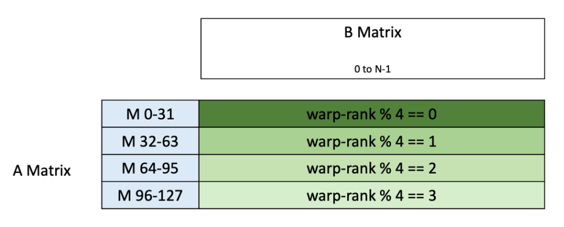
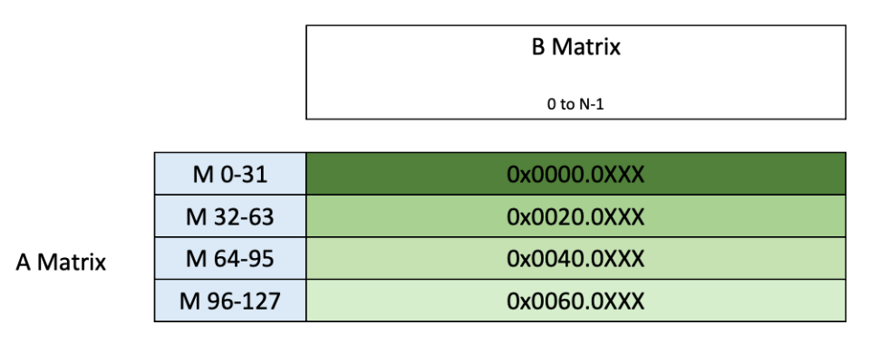

# CUTLASS 教程：使用张量内存为 NVIDIA® Blackwell GPU 编写 GEMM 内核

NVIDIA Blackwell 架构引入了一些新特性，它们显著改变了 GEMM 内核的构成形态。

在本系列文章中，我们将探索 Blackwell 上可用的新特性，并借助 CuTe 教程示例，研究如何编写利用这些新特性的 CUTLASS GEMM 内核。

- [第 1 部分，即本文] 讨论 Blackwell 特有的第五代 Tensor Core MMA 指令，以及这些指令所使用的张量内存。
- [第 2 部分] 解释如何使用集群，包括围绕 TMA 多播和 Blackwell CTA 对概念的新考量。
- [第 3 部分] 介绍采用更低精度数据类型的 MMA，以及 Blackwell 如何在 MMA 中原生支持分块缩放。

本系列的目标是说明如何更新 Hopper GEMM 内核使其在 Blackwell 架构上运行，或者如何从零开始编写 Blackwell GEMM 内核。

本文将详细介绍 Blackwell 的 MMA 指令和张量内存。

我们将首先概述这两项特性，然后介绍 CUTLASS 对它们的抽象。

随后，我们将研究第一个 [CuTe Blackwell 示例](https://github.com/NVIDIA/cutlass/tree/main/examples/cute/tutorial/blackwell)，重点关注相较 Hopper 发生了哪些变化。

本文的目标是解说一个使用 Blackwell 新特性的简单 GEMM 内核最小可运行示例。

请注意，消费级 Blackwell 架构（计算能力 12.0）与数据中心 Blackwell 架构（计算能力 10.0）在若干重大方面存在差异，其中尤其值得注意的是前者不具备张量内存。

本系列文章只讨论数据中心 Blackwell。

# Blackwell MMA 概览

如果尝试在 Blackwell GPU 上运行 CUTLASS Hopper GEMM 内核，你首先会发现它无法工作。

Hopper 的 WGMMA 指令（在 PTX 中为 `wgmma.mma_async`）已在 Blackwell 上被废弃。

为取代该指令，Blackwell 引入了用于 MMA 的 `tcgen05.mma` 指令。

在 CUTLASS 中，`tcgen05.mma` 被称为 UMMA；为了简洁，下文将沿用这一术语。

这条新指令旨在取代 Hopper 上的 WGMMA。

与 WGMMA 一样，UMMA 是一条异步指令，用于计算以下两种矩阵运算之一：

```
D = A * B + D
D = A * B
```

不过，与 WGMMA 相比，它存在一些重大差异。

- 支持包括 FP4 和 FP6 在内的低精度数据类型，并提高所有精度下的吞吐量。
- 内置分块缩放支持。
- 引入专供 Tensor Core 使用的内存，称为张量内存，用于 UMMA 累加。
- SM 集群中两个相邻的 CTA 称为一个 CTA 对，它们可以跨两个 SM 协同执行 UMMA。
- 与 WGMMA 不同，UMMA 只由一个线程发射。

  即使使用两个 CTA，也只由其中一个 CTA 的一个线程发射 UMMA。

本文将主要聚焦第三点，讨论张量内存是什么，以及如何将其用于 UMMA。

## 张量内存

张量内存（TMEM）是一种专供 Tensor Core 使用的片上内存。

它的主要目的是在第五代 Tensor Core 操作中使用 TMEM 取代寄存器。

具体对于 UMMA，该指令期望以下输入来源：

- 操作数 A 可位于 TMEM 或 SMEM。
- 操作数 B 必须位于 SMEM。
- 累加器必须位于 TMEM。

这意味着 UMMA 无需使用寄存器存放数据，从而降低了 MMA 操作的寄存器压力。

此外，无需寄存器加上由单线程发射，使 MMA 能够与 CTA 的主要执行进一步解耦。

与 TMA 结合后，在标准 GEMM 中，CTA 直接执行的处理就只剩前处理和后处理。

从历史脉络来看，这些发展延续了以专用硬件资源取代通用计算资源的趋势，既消除瓶颈，又释放通用资源以用于其他操作。

从 Volta 架构开始，Tensor Core 将 GEMM 算术操作与通用计算流水线分离开来。

Ampere 的异步拷贝指令使 GEMM 主循环能够真正实现流水化。

在 Hopper GPU 上，异步、单线程的 TMA 以及在 warpgroup 之间重新分配寄存器的能力，大幅降低了数据移动的寄存器和线程开销；异步 WGMMA 则允许 MMA 与其他计算操作形成流水。

现在，张量内存和 UMMA 对 MMA 所做的，正如 TMA 对拷贝所做的一样：将其变成不消耗寄存器的单线程异步操作。

因此，寄存器可以主要用于调度、融合尾处理等其他任务。

每个 SM 拥有 256KB 的 TMEM，它以二维方式组织为 512 列和 128 行（也称为通道），每个单元为 32 位。

这种固有的二维结构也体现在 32 位地址中：第 31–16 位表示通道 ID，第 15–0 位表示列。

下图取自 [PTX 文档](https://docs.nvidia.com/cuda/parallel-thread-execution/index.html#tensor-memory-addressing)，展示了该布局：


TMEM 使用 `tcgen05.alloc` 指令动态分配。

此外，分配以列为单位，因此分配一列时，该列的每个通道都会被分配。

分配的列数必须是 2 的幂，且至少为 32。

最后，必须使用 `tcgen05.dealloc` 显式释放 TMEM。

`tcgen05.alloc` 和 `tcgen05.dealloc` 都必须由单个 warp 调用，并且应由同一个 warp 完成分配和释放。

请注意，`tcgen05.alloc` 指令会将已分配区域的 32 位基地址存储到共享内存中的指定位置。

随后应将 TMEM 基地址设为 UMMA 累加器张量的偏移，如下文所示。

通常，数据通过 UMMA 操作进入 TMEM，然后使用 `tcgen05.ld` 显式移出到寄存器中进行后处理。

线程也可以手动将数据加载到 TMEM：可通过 `tcgen05.cp` 从 SMEM 加载，或通过 `tcgen05.st` 从寄存器加载。

不过，TMEM 对显式加载和存储的访问模式有严格限制。

一个 warpgroup 中的每个 warp 只能访问 32 个通道（warp 0 对应通道 0–31，warp 1 对应通道 32–63，以此类推）。

此外，UMMA 操作和数据移动操作都要求特定的数据布局。

幸运的是，CUTLASS 提供了稍后会介绍的工具函数，可简化通过 swizzle 组织数据的过程。

对具体细节感兴趣的读者可以在 [PTX 指南](https://docs.nvidia.com/cuda/parallel-thread-execution/index.html#tcgen05-shared-memory-layout-swizzling)中查看布局信息。

最后，除 UMMA 操作和这些数据移动指令外，没有其他操作会访问 TMEM 中的数据。

换言之，所有前处理必须在数据加载到 TMEM 之前完成，所有后处理必须在数据从 TMEM 取出之后进行。

```
tcgen05.mma
```

尽管我们将主要通过 CUTLASS 接口使用该操作，但 PTX 文档仍是理解其功能的最佳资料。

忽略一些可选参数后，`tcgen05` MMA 操作的 [PTX 语法](https://docs.nvidia.com/cuda/parallel-thread-execution/index.html#tensorcore-5th-generation-instructions-tcgen05-mma)采用以下形式之一：

```
tcgen05.mma.cta_group.kind   [d-tmem],  a-desc,  b-desc, idesc, enable-input-d;
tcgen05.mma.cta_group.kind   [d-tmem], [a-tmem], b-desc, idesc, enable-input-d;
.kind      = { .kind::f16, .kind::tf32, .kind::f8f6f4 }
.cta_group = { .cta_group::1, .cta_group::2 }
```

在本示例中，我们将研究一个使用 FP32 累加的稠密 FP16 GEMM（`.kind::f16`）。

目前我们只考虑单 CTA 情形，本系列的下一篇文章将研究双 CTA 版本。

从[支持的矩阵形状表](https://docs.nvidia.com/cuda/parallel-thread-execution/index.html#tcgen05-kind-shapes)中可以看到，MMA 指令支持 `64 x N x 16`（N 为 8 的倍数）和 `128 x N x 16`（N 为 16 的倍数）的形状，两种情况下 N 都不超过 256。

（对于所有数据类型，稠密 GEMM 的 K 维宽度都应为 32 字节。）

请注意，最大的 UMMA 原子 `128 x 256 x 16` 的规模是最大 WGMMA 原子的两倍。

其累加器恰好占用 TMEM 的一半，这意味着可以在不牺牲性能的前提下对多个 UMMA 原子进行流水化处理。

操作数 `a-desc` 和 `b-desc` 是[共享内存描述符](https://docs.nvidia.com/cuda/parallel-thread-execution/index.html#shared-memory-descriptor)，与 [WGMMA 所使用的描述符](https://docs.nvidia.com/cuda/parallel-thread-execution/index.html#asynchronous-warpgroup-level-matrix-shared-memory-layout-matrix-descriptor)非常相似。

简而言之，它们是 64 位数值，打包了存储在 SMEM 中的矩阵的地址、布局和 swizzle 模式等信息。

（如果 A 来自 TMEM，其描述符将由 TMEM 地址取代。）

SMEM 中的矩阵块应为 K-major，尽管 MMA 指令可以对它们进行转置；同时，这些矩阵块允许采用[若干预定义 swizzle 模式](https://docs.nvidia.com/cuda/parallel-thread-execution/index.html#tcgen05-shared-memory-layout-swizzling)之一，其形式与 WGMMA 使用的模式相似。

除矩阵描述符外，`tcgen05.mma` 还需要一个指令描述符（参数 `idesc`）。

它是一个 32 位元数据，其中包含数据类型、稀疏性等信息；完整细节可在[相关文档](https://docs.nvidia.com/cuda/parallel-thread-execution/index.html#instruction-descriptor)中查看。

值得注意的是，指令描述符中有两个比特用于指示该指令对 A 和/或 B 进行转置和/或取负。

此外，参数 `enable-input-d` 用于在执行 MMA 前将累加器清零（运算 `D = A * B`）与保留累加器（运算 `D = A * B + D`）两种模式之间切换。

累加器在 TMEM 中采用[透明的行主序格式](https://docs.nvidia.com/cuda/parallel-thread-execution/index.html#data-path-layout-organization)。

由于数据不保存在寄存器中，我们不再需要处理 WMMA 和 WGMMA 所需的复杂线程-值布局。

不过，请记住，数据在存储或后处理之前必须拷贝到寄存器，并且每个 warp 只能访问 TMEM 的四分之一。

这意味着尾处理需要一个完整的 warpgroup。

由于 `tcgen05.mma` 使用的所有数据都位于 CTA 共享的内存空间（TMEM 或 SMEM）中，该操作可以且必须由 CTA 中的单个线程发射。

```
tcgen05.ld
```

`tcgen05` 下有三种内存移动指令：`ld`、`st` 和 `cp`。

本文将重点讨论 `ld`，它用于将数据从 TMEM 拷贝到 RMEM。

[`tcgen05.ld` 的基本 PTX 指令](https://docs.nvidia.com/cuda/parallel-thread-execution/index.html#tensorcore-5th-generation-instructions-tcgen05-ld)形式如下：

```
tcgen05.ld.sync.aligned.shape.num.b32    r, [taddr];
.shape = { .16x64b, .16x128b, .16x256b, .32x32b }
.num    = { .x1, .x2, .x4, .x8, .x16, .x32, .x64, .x128 }
```

如 `.sync.aligned` 限定符所示，`tcgen05.ld` 是一条 warp 级指令：warp 中的所有线程必须执行同一条指令，并以 warp 为单位同步，这与早期的 [`ldmatrix`](https://docs.nvidia.com/cuda/parallel-thread-execution/#warp-level-matrix-load-instruction-ldmatrix) 指令类似。

`tcgen05.ld` 支持多种数据移动形状，详见 [PTX 指南](https://docs.nvidia.com/cuda/parallel-thread-execution/index.html#data-movement-shape)。

这些形状通常记为 `{lanes}x{bits}`；本示例使用 `32x32b`，对应在单个 warp 中以 32 个通道（或数据路径）各传输 32 位。

下一个组成部分 `.num` 描述该操作在列维度上重复的次数。

本示例使用 `.x1`，因而执行一次加载。

在一条指令中，一个 warp 最多可加载 `lanes * bits * num <= 128 kb`（16 kB）的数据，对应每个线程 128 个 32 位寄存器。

最后，请记住，每个 warp 只能访问 128 个 TMEM 通道中的 32 个。

下图取自 [PTX 文档](https://docs.nvidia.com/cuda/parallel-thread-execution/index.html#tcgen05-mma-fragment-3232b)，展示了本例中的 `tcgen05.ld.sync.aligned.32x32b.x1.b32` 操作：


可以看到，每个线程从一个通道加载 32 位（或一列），并将其存储在一个寄存器中。

图中还展示了 `.num = .x2` 的情形，此时加载会再重复一次，并且每个线程使用第二个寄存器。

该指令的参数只有 `r` 和 `taddr`，其中 `r` 是目标寄存器，`taddr` 是 TMEM 地址——请注意，这是被加载矩阵块的 TMEM 基地址，并且在 warp 的所有线程中都相同。

面对众多选项，自然会产生一个问题：应该如何选择正确的变体？

通道数主要取决于所使用的 MMA 指令；不同的 `tcgen05.mma` 变体会[产生不同的输出布局](https://docs.nvidia.com/cuda/parallel-thread-execution/index.html#tcgen05-data-path-layout-organization)，而不同的 `tcgen05.ld` 形状适用于不同情形。

对于位宽和 `.num`，更主要的考量是性能和资源。

更大的重复次数会减少发射的指令数，并可能有利于向量化。

但是，更大的 `.num` 值也[需要更多寄存器](https://docs.nvidia.com/cuda/parallel-thread-execution/index.html#tcgen05-num-shapes-ld)。

因此，该值是一个调优参数。

# CUTLASS UMMA 接口

既然我们已经了解 UMMA 指令的功能，接下来讨论用于访问该功能的 CUTLASS/CuTe 接口。

与之前的 CUTLASS MMA 抽象一样，该接口由以下内容描述：

- `cute/arch/` 目录中的一个 `MMA_Atom`，用于封装相应的 PTX 指令；
- `cute/atom/` 目录中的一个 `MMA_Traits`，其中包含 CuTe 布局和其他元数据，用于以 CUTLASS 原生方式与该原子交互。

我们的 [WGMMA 教程](https://research.colfax-intl.com/cutlass-tutorial-wgmma-hopper/)对这一设计做了更深入的解释。

下面给出 [`SM100_MMA_F16BF16_SS` 的模板签名](https://github.com/NVIDIA/cutlass/blob/331a1f5b3fa3b6a9d9ef57c393d8719fb5510a32/include/cute/atom/mma_traits_sm100.hpp#L1090)，这是第一个 CuTe Blackwell 代码示例所使用的原子。

```
template <class a_type, class b_type, class c_type,
          int M, int N, UMMA::Major a_major, UMMA::Major b_major,
          UMMA::ScaleIn a_neg, UMMA::ScaleIn b_neg>
struct MMA_Traits<SM100_MMA_F16BF16_SS<a_type, b_type, c_type,
                                M, N, a_major, b_major,
                                a_neg, b_neg>>
{
  using ValTypeD = c_type;
  using ValTypeA = a_type;
  using ValTypeB = b_type;
  using ValTypeC = c_type;
  static_assert(cute::sizeof_bits_v<a_type> == cute::sizeof_bits_v<b_type> &&
                          cute::sizeof_bits_v<b_type> == 16,
                          "SM100_MMA_F16BF16_SS supports 16bit types");
  using FrgTypeA = UMMA::smem_desc<a_major>;
  using FrgTypeB = UMMA::smem_desc<b_major>;
  using FrgTypeC = UMMA::tmem_frg_1sm<c_type>;
  // 逻辑 shape-K 始终为 256 位，将其转换为元素单位
  static constexpr int K = 256 / cute::sizeof_bits<ValTypeA>::value;
  using Shape_MNK = Shape<Int<M>,Int<N>,Int<K>>;
  using ThrID   = Layout<_1>;
  using ALayout = Layout<Shape <_1,Shape <Int<M>,Int<K>>>,
                         Stride<_0,Stride<    _1,Int<M>>>>;
  using BLayout = Layout<Shape <_1,Shape <Int<N>,Int<K>>>,
                         Stride<_0,Stride<    _1,Int<N>>>>;
  using CLayout = Layout<Shape <_1,Shape <Int<M>,Int<N>>>,
                         Stride<_0,Stride<    _1,Int<M>>>>;
  UMMA::InstrDescriptor idesc_ = UMMA::make_instr_desc<
    a_type, b_type, c_type, M, N, a_major, b_major, a_neg, b_neg>();
  // 累加或覆写 C。1：读取 C；0：忽略 C（清空累加器）
  UMMA::ScaleOut accumulate_ = UMMA::ScaleOut::One;
...
}
```

这里的许多信息都直接对应到我们在 `tcgen05.mma` 指令中已经见过的概念：A 和 B 的 SMEM 描述符、D 的 TMEM 布局，以及一个指令描述符。

原子尺寸由模板参数 M 和 N 提供（如注释所示，K 由数据类型的位数决定）。

模板参数 `a_major`、`b_major`、`a_neg` 和 `b_neg` 用于填充指令描述符中的转置位和取负位。

`accumulate_` 成员（应为 `UMMA::ScaleOut::One` 或 `UMMA::ScaleOut::Zero`）提供 PTX 参数 `enable_input_d`。

但这些布局中发生了一件有趣的事。

以前，`ThrID` 布局用于将协同执行 MMA 指令的线程逻辑索引映射到它们的物理线程 ID。

对于 warp 级 MMA，`ThrID` 是 `Layout<_32>`；对于 WGMMA，它是 `Layout<_128>`。

在这里，它被缩减为 `Layout<_1>`。

类似地，A、B 和 C 的 TV 布局在线程模式上的大小都为 1。

我们可能会认为这是因为该指令由单线程执行，但实际上原因更深一层。

由于该指令由单线程执行，所有线程布局都被重新用作协同执行一条 MMA 指令的 CTA 布局。

目前我们对每个 MMA 只使用 1 个 CTA，这会产生相当多看似多余的静态 1；当我们在下一篇博客中进阶到 2 个 CTA 时，它们的用途会更清晰。

最后，简要说明一下原子名称的组成。

`SM100_MMA_F16BF16_SS` 可以拆解为以下部分。

- `SM100_MMA`：指定指令。

  简而言之，即 `sm100` 的 UMMA 指令。
- `F16BF16`：指定 A 和 B 可接受的输入类型。

  在此情形中为 `fp16` 或 `bf16`。

  请注意，它对应 `tcgen05.mma` 的 `.kind` 限定符（例如 `.kind::f16`），而精确的输入类型则记录在[指令描述符](https://docs.nvidia.com/cuda/parallel-thread-execution/#tcgen05-instuction-desc-kind-tf32-f16-f8f6f4)中。
- `SS`：指定 A 和 B 的内存位置。

  `SS` 表示两者都位于 SMEM，`TS` 表示 A 位于 TMEM 而 B 位于 SMEM。
- 后缀：对于更复杂的情形，还有额外后缀，例如分块缩放或双 SM UMMA。

请注意，与 Hopper 原子不同，MMA 的尺寸以及所用操作数或累加器的数据类型并不是原子名称的一部分。

它们由模板参数决定。

# CUTLASS 示例：简单 UMMA

接下来，我们讨论[第一个 Blackwell CuTe 示例](https://github.com/NVIDIA/cutlass/blob/main/examples/cute/tutorial/blackwell/01_mma_sm100.cu)中给出的实现。

为了使讨论聚焦于 Blackwell，我们假定读者对 CUTLASS GEMM 内核的典型格式已有一定了解。

如需更入门的介绍，请参阅我们[之前的博客系列](https://research.colfax-intl.com/cutlass-tutorial-wgmma-hopper/)。

为了清晰起见，我们将讨论大致分为五个部分：

1. GMEM 分块器与切片
2. SMEM 布局与 swizzle
3. 输入与输出描述符
4. 同步与 GEMM
5. 从 TMEM 拷出数据

贯穿这五个部分的主要主题是：分区发生在 CTA 之间，而不是线程之间。

## GMEM 分块器与切片

首先，我们需要将全局输入张量划分为多个矩阵块，并将它们分配给 CTA 处理。

在本示例中，没有多个 SM 协同执行同一个 UMMA，因此这里针对 CTA 的分块与针对 UMMA 的分块等价（在非平凡配置中并非如此，我们将在后续文章中看到）。

因此，我们首先创建 `tiled_mma` 对象，然后根据 `tiled_mma` 选择分块器的各维尺寸。

```
TiledMMA tiled_mma = make_tiled_mma(SM100_MMA_F16BF16_SS<TypeA, TypeB, TypeC,
                                                         128, 256,
                                                         UMMA::Major::K,
                                                         UMMA::Major::K>{});
auto bM = tile_size<0>(tiled_mma);  // 每个 CTA 矩阵块 1 个 MMA
auto bN = tile_size<1>(tiled_mma);  // 每个 CTA 矩阵块 1 个 MMA
auto bK = tile_size<2>(tiled_mma) * Int<4>{};  // 每个 CTA 矩阵块 4 个 MMA
auto mma_tiler = make_shape(bM, bN, bK);  // (MMA_M, MMA_N, MMA_K)
```

这里需要区分的一点是，`MMA_K` 中的因子 4 表示每个 K 矩阵块内的 MMA 数量，而不是 K 矩阵块的数量。

由于拷贝是按矩阵块进行的，这意味着每次从 GMEM 到 SMEM 的拷贝对应 4 次 UMMA 调用。

打印 MMA 可得到以下结果。

```
TiledMMA
  ThrLayoutVMNK:  (_1,_1,_1,_1):(_0,_0,_0,_0)
  PermutationMNK: (_,_,_)
MMA_Atom
  ThrID:    _1:_0
  Shape_MNK:  (_128,_256,_16)  // MmaM、MmaN、MmaK 指令尺寸
  LayoutA_TV: (_1,(_128,_16)):(_0,(_1,_128))  // A 的 TV -> MmaCoordinate 映射
  LayoutB_TV: (_1,(_256,_16)):(_0,(_1,_256))  // B 的 TV -> MmaCoordinate 映射
  LayoutC_TV: (_1,(_128,_256)):(_0,(_1,_128))  // C 的 TV -> MmaCoordinate 映射
```

正如在 MMA 原子中看到的那样，所有“线程布局”都被重新用来表示协同执行 MMA 的 CTA 布局。

在本示例中，每个 `TiledMMA` 只使用一个 CTA，因此这些布局的大小都为 1。

A、B 和 C 的值布局按预期显示出它们的形状。

随后，我们得到每个 CTA 的以下 GMEM 张量：

```
print(gA);   // (_128,_64,4):(256,_1,_64)
print(gB);   // (_256,_64,4):(256,_1,_64)
print(gC);   // (_128,_256):(1024,_1)
print(gD);   // (_128,_256):(1024,_1)
```

可以看到，静态整数 `bM, bN, bK = _128, _256, _64` 作为这些布局的模出现；同时，由于本例取 `K = 256`，还出现了动态整数 4。

“线程布局”被重新用作“对等 CTA 布局”的另一个结果是，现在 `tiled_mma` 按 CTA 对等 ID 而不是线程 ID 进行切片。

不过，本示例只有一个 CTA，因此可以简单地使用 `_0{}` 切片。

```
ThrMMA cta_mma = tiled_mma.get_slice(_0{});
Tensor tCgA = cta_mma.partition_A(gA);  // (MmaA, NumMma_M, NumMma_K, Tiles_K)
Tensor tCgB = cta_mma.partition_B(gB);  // (MmaB, NumMma_N, NumMma_K, Tiles_K)
Tensor tCgC = cta_mma.partition_C(gC);  // (MmaC, NumMma_M, NumMma_N)
Tensor tCgD = cta_mma.partition_C(gD);  // (MmaC, NumMma_M, NumMma_N)
print(tCgA); // ((_128,_16),_1,_4,4):((256,_1),_0,_16,_64)
print(tCgB); // ((_256,_16),_1,_4,4):((256,_1),_0,_16,_64)
print(tCgC); // ((_128,_256),_1,_1):((1024,_1),_0,_0)
print(tCgD); // ((_128,_256),_1,_1):((1024,_1),_0,_0)
```

这一变化体现在切片后 MMA 的名称中。

在面向 Hopper 的 CuTe 示例中，切片后的 MMA 通常标记为 `thr_mma`，而现在它被称为 `cta_mma`。

最后，分区后的 GMEM 张量具有根据 `128x256x16` 的 MMA 原子尺寸所推导出的预期布局。

### 处理集群

到目前为止，我们只讨论了 UMMA 的单 SM 情形。

但是，当每个 UMMA 涉及 2 个 SM 时，UMMA 形状与 CTA 形状并不相同，我们需要使用对等 CTA ID（即 CTA 在其 CTA 对中的位置，为 0 或 1）对 `tiled_mma` 进行切片。

这里我们稍作延伸，简要展示如何适配这种情形，更全面的讨论将留到本系列第 2 部分。

每个 CTA 对必然由集群中两个相邻的 CTA 组成。

因此，我们可以按以下方式提取对等 CTA ID。

```
Layout cluster_layout_vmnk = tiled_divide(make_layout(cluster_shape),
                                         make_tile(typename TiledMMA::AtomThrID{}));
auto mma_coord_vmnk = make_coord(
                   blockIdx.x % size<0>(cluster_layout_vmnk),  // 对等 CTA 坐标
                   blockIdx.x / size<0>(cluster_layout_vmnk),  // MMA-M 坐标
                   blockIdx.y,  // MMA-N 坐标
                   _);  // MMA-K 坐标
  auto mma_v = get<0>(mma_coord_vmnk);
  ThrMMA cta_mma = tiled_mma.get_slice(mma_v);  // 使用对等 CTA 坐标
```

`cluster_layout_vmnk` 用于创建能够感知 CTA 对的 `cluster_shape`；`AtomThrID` 为 1 或 2，具体取决于指定的 UMMA 原子是否使用 CTA 对。

随后用它计算 CTA 的四维坐标，其中第 0 模是对等 CTA ID。

请注意，当 `size<0>(cluster_layout_vmnk)` 为 1（没有 CTA 对）时，该坐标可简化为更熟悉的 `(1, blockIdx.x, blockIdx.y, _)`。

最后，我们可以使用第 0 模对 `tiled_mma` 进行切片。

同样，对于这个特定示例，由于只有 1 个 CTA，`mma_v` 始终为 0。

但在后续示例中，`mma_v` 将为 0 或 1。

## SMEM 布局与 Swizzle

现在我们已经拥有全局张量的分块器，因此也就得到了拷贝的源端。

接下来是目标端：SMEM。

对于 A，目标张量 `tCsA` 应组织为 `(MmaA, NumMma_M, NumMma_K) = ((_128,_16),_1,_4)` 形状，以与 GMEM 布局保持一致。

CUTLASS 提供了一个工具函数来创建所需形状。

```
auto mma_shape_A = partition_shape_A(tiled_mma, make_shape(size<0>(mma_tiler),
                                                           size<2>(mma_tiler)));
auto mma_shape_B = partition_shape_B(tiled_mma, make_shape(size<1>(mma_tiler),
                                                           size<2>(mma_tiler)));
```

为优化 SMEM 访问，布局还应进行 swizzle，方式如下。

```
// Sw<3,4,3> o smem_ptr[16b](未设置) o ((_128,_16),_1,_4):((_64,_1),_0,_16)
auto sA_layout = UMMA::tile_to_mma_shape(UMMA::Layout_K_SW128_Atom<TypeA>{},
                                         mma_shape_A);
// Sw<3,4,3> o smem_ptr[16b](未设置) o ((_256,_16),_1,_4):((_64,_1),_0,_16)
auto sB_layout = UMMA::tile_to_mma_shape(UMMA::Layout_K_SW128_Atom<TypeB>{},
                                         mma_shape_B);
```

这里，`Layout_K_SW128_Atom<TypeA>` 是用于 `TypeA` 数据的 K-major A 的 128 字节宽 swizzle。

swizzle 的宽度由连续维度上的矩阵块大小决定。

在此情形中，K 维有 4 个大小为 16 的矩阵块，半精度数据占 2 字节，因此宽度为 `16*4*2=128` 字节。

有关 MMA swizzle 的更多细节，请参阅[相关文章](https://research.colfax-intl.com/cutlass-tutorial-wgmma-hopper/)。

与其他 CUTLASS 代码一样，本示例动态分配 SMEM，并以 `SharedStorage` 结构管理它。

在此情形中，`SharedStorage` 保存 A 和 B 的矩阵块，以及用于管理 MMA 异步性的 mbarrier 对象。

为了处理 TMEM 分配，`SharedStorage` 还保存一个用作 TMEM 基地址的 32 位地址。

```
template <class TypeA,  // 张量 A 的数据类型
          class TypeB,  // 张量 B 的数据类型
          class ASmemLayout,  // (MmaA, NumMma_M, NumMma_K, ...)
          class BSmemLayout>  // (MmaB, NumMma_N, NumMma_K, ...)
struct SharedStorage
{
  alignas(128) cute::ArrayEngine<TypeA, cute::cosize_v<ASmemLayout>> A;
  alignas(128) cute::ArrayEngine<TypeB, cute::cosize_v<BSmemLayout>> B;
  alignas(16) cute::uint64_t mma_barrier;  // 用于跟踪基于 SMEM 的 MMA 计算的屏障
  alignas(16) cute::uint32_t tmem_base_ptr;  // TMEM 分配的基指针
  CUTE_DEVICE constexpr auto tensor_sA() { return make_tensor(make_smem_ptr(A.begin()), ASmemLayout{}); }
  CUTE_DEVICE constexpr auto tensor_sB() { return make_tensor(make_smem_ptr(B.begin()), BSmemLayout{}); }
};
```

本示例使用可自动向量化的 `cute::cooperative_copy` 将数据从 GMEM 拷贝到 SMEM。

我们也可以改为编写 `TiledCopy`，或像往常一样使用 TMA。

## 输入与输出描述符

UMMA 的第一个输入可来自 SMEM 或 TMEM，第二个输入必须位于 SMEM，累加器必须位于 TMEM。

本示例使用的具体原子变体从 SMEM 取得两个输入。

为创建描述符，我们像 Hopper 及更早的 GEMM 一样，使用 `cta_mma` 的 `make_fragment` 方法。

```
// 表示 A 和 B 的 SMEM 缓冲区
Tensor tCsA = shared_storage.tensor_sA();  // (MmaA, NumMma_M, NumMma_K)
Tensor tCsB = shared_storage.tensor_sB();  // (MmaB, NumMma_M, NumMma_K)
Tensor tCrA = cta_mma.make_fragment_A(tCsA);
Tensor tCrB = cta_mma.make_fragment_B(tCsB);
Tensor tCtAcc = cta_mma.make_fragment_C(tCgC);  // (MmaC, NumMma_M, NumMma_N)
```

与 Hopper 的 WGMMA 一样，操作数张量不是以寄存器数据为后端的张量，而是 [SMEM 矩阵描述符](https://docs.nvidia.com/cuda/parallel-thread-execution/index.html#shared-memory-descriptor)的张量。

例如，打印 `tCrA` 将显示

1

```
tCrA:   UMMA::DescriptorIterator o (_1,_1,_4):(_0,_0,_2)
```

每个 MMA 原子对应一个描述符，并按 `(NumMma_M, NumMma_K) = (_1, _4)` 分块。

我们之前已在 [WGMMA 博客](https://research.colfax-intl.com/cutlass-tutorial-wgmma-hopper/)中介绍过矩阵描述符。

这里的累加器张量是一个普通的以 TMEM 为后端的张量，但它的布局初看可能难以理解：

```
tCtAcc: tmem_[32b](TMEM_ADDR) o ((_128,_256),_1,_1):((_65536,_1),_0,_0)
```

TMEM 地址的步长为 65536，这是由于我们之前讨论的 TMEM 32 位寻址方案。

该地址的高 16 位表示通道，低 16 位表示列。

这里的关键是 `65536 = 1<<16`。

因此，例如坐标 `(1,1)` 会变为：

```
(1,1) = (1*1<<16) + 1 = x0001.0001
```

这就是对应第 1 列第 1 通道的 32 位地址（以十六进制表示）。

## GEMM 与同步

与 Hopper 的 WGMMA 一样，UMMA 是异步的，因此需要同步。

本示例使用了一些 CUTLASS 便捷方法和围绕 mbarrier 的抽象来完成同步。

以下是展示该工作流程的示例代码片段。

```
if (elect_one_warp && elect_one_thr) {
  cute::initialize_barrier(shared_storage.mma_barrier, /* num_ctas */ 1);
}
int mma_barrier_phase_bit = 0;  // 每个屏障都有一个关联的 phase_bit。
__syncthreads();
// 首次 MMA 覆写累加器
tiled_mma.accumulate_ = UMMA::ScaleOut::Zero;
for (int k_tile = 0; k_tile < size<3>(tCgA); ++k_tile)
{
  // ……将数据拷入……
  // 只有一个 warp 启动 UMMA
  if (elect_one_warp) {
    // 执行一个 MmaTile_M x MmaTile_N x MmaTile_K GEMM
    for (int k_block = 0; k_block < size<2>(tCrA); ++k_block) {
      gemm(tiled_mma, tCrA(_,_,k_block), tCrB(_,_,k_block), tCtAcc);
      // 非首次 MMA 向累加器中累加
      tiled_mma.accumulate_ = UMMA::ScaleOut::One;
    }
    // 确保 MMA 已完成，只有此时才能重用 A 和 B 的 SMEM。
    cutlass::arch::umma_arrive(&shared_storage.mma_barrier);
  }
  // 所有 warp 等待 MMA 完成，以避免覆写 A 和 B 的 SMEM。
  cute::wait_barrier(shared_storage.mma_barrier, mma_barrier_phase_bit);
  mma_barrier_phase_bit ^= 1;
}
// ……将数据拷出……
```

这些同步结构与 TMA 所使用的结构基本相同。

如果需要关于 TMA 和同步的入门教程，请参阅我们[之前的博客](https://research.colfax-intl.com/tutorial-hopper-tma/)。

值得注意的一点是，mbarrier 由将要发射 UMMA 的那个 warp 中的一个线程初始化。

`gemm` 调用和循环结构对于熟悉 Hopper 示例的读者也应当很熟悉。

需要注意的主要差异是，只有一个 warp 发射 UMMA。

请记住，一条 PTX UMMA 指令应当只由一个线程发出。

CUTLASS 在 UMMA 原子实现内部选出该线程，因此实际上，仅从单个线程调用 `cute::gemm` 会导致死锁。

这里最后值得一提的是 `UMMA::ScaleOut::Zero`。

它指示 UMMA 覆写 TMEM，而不是在现有值上累加。

第一次 `k_block` 迭代之后，它会被设为 `UMMA::ScaleOut::One`，从而对结果进行累加。

## 从 TMEM 拷出数据

所有 MMA 完成后，我们需要将累加器结果从 TMEM 拷贝到寄存器。

该操作使用 PTX `tcgen05.ld` 指令完成。

CUTLASS 将 `tcgen05.ld` 抽象为拷贝原子；我们之前看到的不同变体，由 [`cute/atom/copy_traits_sm100.hpp`](https://github.com/NVIDIA/cutlass/blob/main/include/cute/atom/copy_traits_sm100.hpp) 中拷贝原子所定义的不同拷贝 traits 表示。

本示例使用 `SM100_TMEM_LOAD_32dp32b1x` 原子。

在 [`cute/arch/copy_sm100.hpp`](https://github.com/NVIDIA/cutlass/blob/331a1f5b3fa3b6a9d9ef57c393d8719fb5510a32/include/cute/arch/copy_sm100.hpp#L3333) 中该原子的 PTX 封装中，可以看到它如何转换为正确的指令变体。

```
// 32 个数据路径通道，32 位模式，重复 1 次
struct SM100_TMEM_LOAD_32dp32b1x
{
  using SRegisters = uint32_t[1];
  using DRegisters = uint32_t[1];
  CUTE_HOST_DEVICE static void
  copy(uint32_t const& src_addr,
       uint32_t& dst0)
  {
#if defined(CUTE_ARCH_TCGEN05_TMEM_ENABLED)
    asm volatile ("tcgen05.ld.sync.aligned.32x32b.x1.b32"
                    "{%0},"
                    "[%1];\n"
    :  "=r"(dst0)
    :  "r"(src_addr));
#else
    CUTE_INVALID_CONTROL_PATH("Trying to use TMEM_LOAD without CUTE_ARCH_TCGEN05_TMEM_ENABLED.");
#endif
  }
};
```

使用该原子，我们可以构建一个 `TiledCopy`，将累加器结果从 TMEM 提取到 RMEM。

请注意，这里不同于本示例其他 CTA 级操作，我们又回到了 warp 级和线程级操作——因为数据必须移入寄存器才能执行尾处理。

```
// 为累加器创建分块拷贝操作（TMEM -> RMEM）
TiledCopy tiled_t2r_copy = make_tmem_copy(SM100_TMEM_LOAD_32dp32b1x{}, tCtAcc);
ThrCopy   thr_t2r_copy   = tiled_t2r_copy.get_slice(threadIdx.x);
//...
Tensor tDtAcc = thr_t2r_copy.partition_S(tCtAcc);
Tensor tDgD   = thr_t2r_copy.partition_D(tCgD);
using AccType = typename decltype(tCtAcc)::value_type;
Tensor tDrAcc = make_tensor<AccType>(shape(tDgD));
// 加载 TMEM -> RMEM
copy(tiled_t2r_copy, tDtAcc, tDrAcc);
```

这里我们使用专用函数 [`make_tmem_copy`](https://github.com/NVIDIA/cutlass/blob/b84e9802d84b16bcb4e92338fcf0a04785df9236/include/cute/atom/copy_traits_sm100.hpp#L341)，根据拷贝原子和 TMEM 张量推导 TV 布局，并创建 `TiledCopy`。

关于该函数，一个重要事实是：它硬编码使用 4 个 warp，即 1 个 warpgroup。

如前文所述，TMEM 的某些区域只能由 warpgroup 中根据 warp 索引对 4 取模所对应的 warp 访问。

下面这张[来自 PTX 手册的图](https://docs.nvidia.com/cuda/parallel-thread-execution/index.html#layout-d-m-128-cta-group-1)展示了本示例中数据如何分配给各个 warp：



下面[来自 PTX 手册的图](https://docs.nvidia.com/cuda/parallel-thread-execution/index.html#tcgen05-data-path-layout-d2)展示了该映射所对应的 TMEM 地址。



为了理解 CuTe 如何处理该拷贝，我们可以查看位于 [`cute/atom/copy_traits_sm100.hpp`](https://github.com/NVIDIA/cutlass/blob/b84e9802d84b16bcb4e92338fcf0a04785df9236/include/cute/atom/copy_traits_sm100.hpp#L2110) 中的 traits 结构。

```
template <>
struct Copy_Traits<SM100_TMEM_LOAD_32dp32b1x>
     : TMEM_LOAD_Unpack<SM100_TMEM_LOAD_32dp32b1x>
{
  using ThrID = Layout<_32>;
  using ValID = Layout<Shape <_32, _32>, Stride< _1,TMEM::DP_b>>;
  using SrcLayout = Layout<Shape <_32, _1024>, Stride< _0, _1>>;
  using DstLayout = Layout<Shape <_32, _32>, Stride<_32, _1>>;
  using RefLayout = SrcLayout;
};
```

布局 `ThrID` 定义了从逻辑线程 ID 到 warp 内线程索引的映射；数值 `32` 表明这是一个 warp 级操作。

`ValID` 告诉我们从逻辑比特 ID 到比特地址的映射；例如，比特 35 由 `ValID` 布局映射到通道 1 上的第 3 个比特。

该布局的形状为（比特，通道），通道步长 `TMEM::DP_b` 为 `1<<21`；其中 `1<<16` 来自之前介绍的 TMEM 寻址方案，额外的 5 则来自每个单元宽 `1<<5=32` 位。

`SrcLayout` 给出从（源线程，源比特）到比特的映射。

该加载是 warp 级操作，而且输入源基地址在整个 warp 中都相同。

因此，线程值被抑制（步长为 0），从而将源比特映射到比特。

最后，`DstLayout` 展示了从（目标线程，目标比特）到比特的映射。

该布局的形状 `<32,32>` 表明，每个线程负责写出 32 位（1 个寄存器）。

请注意，对于 `32dp32b`，该布局很简单，因为 TMEM 中的通道和列会直接转换为输出中的行和列。

但对于更复杂的加载模式，我们需要借助该布局来确定输出 RMEM 比特如何映射到逻辑比特索引。

现在回到代码，由该原子创建的 `TiledCopy` 用于对输出矩阵进行分区。

然后，各分区按线程 ID 切片，得到每线程张量。

鉴于 MMA 尺寸为 128×256，我们为线程 0 打印出以下张量（为便于参照，再次显示 `tCtAcc`）：

```
// 复现自上文
tCtAcc: tmem_[32b](0x0000.0000) o ((_128,_256),_1,_1):((_65536,_1),_0,_0)
// 用于 tmem -> rmem 拷贝的新张量
tDtAcc: tmem_[32b](0x0000.0000) o ((_32,_1),_256,_1,_1):((_65536,_0),_1,_0,_0)
tDrAcc: ptr[32b](0x705671fff290) o ((_1,_1),_256,_1,_1):((_0,_0),_1,_0,_0)
```

可以看到，MMA 的 128×256 尺寸直接体现在 `tCtAcc` 中。

分区 `tDtAcc` 是一个映射到 TMEM 地址的每线程张量。

再次请注意，同一 warp 中的每个线程都一致地读取相同的 TMEM 地址，这解释了值模的子布局 `(_32, _1) : (_65536, _1)`。

4 个 warp 中共有 128 个线程，这些线程覆盖了 M 模。

第 1 模表明该操作重复 256 次以覆盖 N 模，因而得到 128×256 矩阵块。

最后两个值 1 分别表示 M 矩阵块和 N 矩阵块，它们在本例中都为 1。

在 `tDrAcc` 一侧，主要差异是它表示的是寄存器。

由于每个线程负责 TMEM 中的一个 32 位单元，因此值模只显示 `(_1, _1)`。

同样，4 个 warp 中的 128 个线程覆盖了 M 模。

其他模与 `tDtAcc` 相同。

最后，累加器拷贝到 RMEM 后，可以在存回 GMEM 之前对其进行后处理（例如 `axpby`）。

# 分配与释放 TMEM

对于这个基础示例，还有一个额外主题需要讨论：TMEM 的分配和释放。

我们可以使用 CuTe 辅助类 [`cute::TMEM::Allocator1Sm`](https://github.com/NVIDIA/cutlass/blob/main/include/cute/arch/tmem_allocator_sm100.hpp) 完成该操作，该类为上文讨论的 `tcgen05.alloc` 和 `tcgen05.dealloc` 函数提供了接口。

基本模式如下。

```
// 实例化分配器
cute::TMEM::Allocator1Sm tmem_allocator{};
if (elect_one_warp) {
    tmem_allocator.allocate(TmemAllocator::Sm100TmemCapacityColumns, &shared_storage.tmem_base_ptr);
}
__syncthreads();
tCtAcc.data() = shared_storage.tmem_base_ptr;  // 移动累加器偏移
// 内核的其余部分
if (elect_one_warp) {
    tmem_allocator.release_allocation_lock();
    tmem_allocator.free(shared_storage.tmem_base_ptr, TmemAllocator::Sm100TmemCapacityColumns);
  }
```

如前文所述，由一个 warp 执行分配，并传入列数和指向共享内存中某个 32 位值的指针；随后，`allocate` 方法存储已分配 TMEM 起始位置（最低的（通道，列））的 32 位地址。

尽管这条 MMA 指令只需要 256 列，但为了简化，该内核分配了 TMEM 的全部 512 列。

请注意，尽管只有一个线程将 TMEM 地址传给 MMA 指令，但所有线程都需要该地址才能从 TMEM 加载数据以执行尾处理，因此它需要通过共享内存传递。

最后，调用 `allocate` 的同一个 warp 也必须调用 `free`。

作为一项稍高级的特性，`release_allocation_lock` 方法封装了 [`tcgen05.relinquish_alloc_permit`](https://docs.nvidia.com/cuda/parallel-thread-execution/index.html#tcgen05-instructions-tcgen05-alloc-dealloc-relinquish-alloc-permit)；它显然用于保证该 CTA 不再执行任何 TMEM 分配，从而允许后续 CTA 为同一个 SM 排队。

可以在 [CUTLASS sm100 GEMM 内核](https://github.com/NVIDIA/cutlass/blob/main/include/cutlass/gemm/kernel/sm100_gemm_tma_warpspecialized.hpp#L535)中查看更完整的 TMEM 管理示例。

为协助 TMEM 管理，nvcc 新增了标志 `--g-tensor-memory-access-check`。

启用该标志后，内核在运行时遇到任何未初始化或越界的 TMEM 访问时都会报错，并打印错误消息。

# 结论

本文讨论了 Nvidia Blackwell GPU 上可用的新特性，然后通过梳理[第一个 CuTe Blackwell 示例](https://github.com/NVIDIA/cutlass/blob/main/examples/cute/tutorial/blackwell/01_mma_sm100.cu)，研究了如何使用这些特性。

我们观察到，CUTLASS GEMM 内核的主要概念和整体结构并未随 Blackwell 架构而改变。

话虽如此，我们在示例中观察到了两项主要变化：

1. UMMA 原子位于 CTA 级而不是线程级，因此围绕 `TiledMMA` 和同步模型的各种构造都必须相应更新（例如，由单个线程异步发出 UMMA）；
2. UMMA 将结果累加到新的张量内存中；TMEM 必须手动管理；并且必须使用专用 `TiledCopy` 将累加器从 TMEM 拷贝到寄存器。

本文介绍的示例只处理了单 SM UMMA 指令，并且只使用了平凡的 `<1,1,1>` 集群形状。

不过，集群级协作是 Blackwell 内核的重要组成部分。

在下一篇文章中，我们将讨论使用多播和双 SM UMMA 处理非平凡集群形状的示例。

# 参考资料

Cris Cecka、Mihir Awatramani，《使用 CUTLASS 编程 Blackwell Tensor Core》，GTC 2025，[https://www.nvidia.com/en-us/on-demand/session/gtc25-s72720/](https://www.nvidia.com/en-us/on-demand/session/gtc25-s72720/)。

1. 您好，我仔细阅读了这篇文章，受益匪浅。

   我有几个问题想请教。

   根据 CUDA 文档，UMMA 以异步方式运行。

   在尝试理解它时，我大致将其想象为两个阶段：发射阶段 `gemm(tiled_mma, tCrA(_,_,k_block), tCrB(_,_,k_block), tCtAcc)` 和真正的 Tensor Core 执行阶段。

   我的问题是：

   发射 GEMM 时并没有传入屏障。

   我如何确认 Tensor Core 已经完成对共享内存数据的消耗？

   （例如，如果我在 GEMM 调用后紧接着的一行将 `tCrA(_,_,k_block)` 置零，这会影响正确性吗？）

   类似地，`mma_barrier` 似乎只能保证 UMMA 执行完成；但如上所述，UMMA 并未绑定任何屏障，且它是异步的。

   那么，我如何确认自己可以在 `for` 循环外安全地读取 TMEM？

   我没有看到任何显式的“等待 UMMA”操作。

  1. Sky，你好，

     Tensor Core 操作的完成通过针对 `mma_barrier` 的 `umma_arrive` 来发出信号。

     它同时对 TMEM 写入和 SMEM 读取建立了内存顺序保障。

     因此，据我所知，在 `gemm` 和 `umma_arrive` 之间覆写 SMEM 或从 TMEM 读取都是不正确的。

     你注意到的困惑之处在于，`gemm` 调用本身实际上并未引用任何屏障。

     这一理解是正确的：`umma_arrive`（最终解析为 PTX 指令 `tcgen05.commit`）会在给定 mbarrier 上观察到该线程之前发出的所有 UMMA 已完成。

     [PTX 文档的这一节](https://docs.nvidia.com/cuda/parallel-thread-execution/index.html#tcgen05-memory-consistency-model)可能会有帮助。

     这种机制在 Blackwell 之前实际上就已存在，即 `cp.async` 与 mbarrier arrive 的组合；可参阅 [PTX](https://docs.nvidia.com/cuda/parallel-thread-execution/index.html#parallel-synchronization-and-communication-instructions-cp-async-mbarrier-arrive) 或 [CUTLASS](https://github.com/NVIDIA/cutlass/blob/f86feb0aa8a9490a7ab27bc991e36d7b5bf300e3/include/cutlass/arch/barrier.h#L741) 中的相关内容。

     （顺便一提，`tCrA` 是一个描述符张量，这些描述符包含 SMEM 指针，以及步长、swizzle 模式等其他信息。

     因此，在 GEMM 调用后修改它不会影响 SMEM，也不会导致竞态条件。

     但修改 `tCsA` 就会出问题。）
