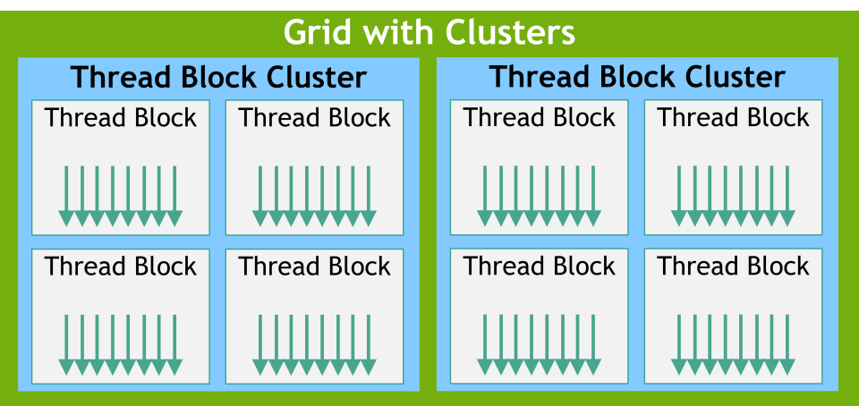
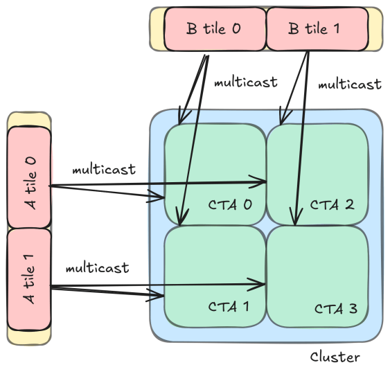
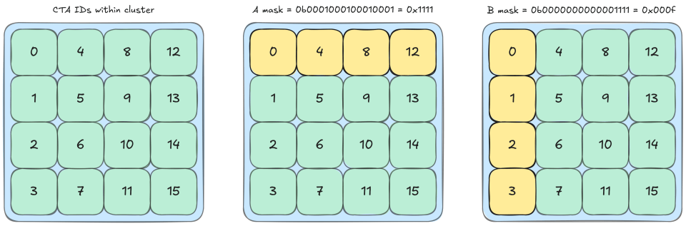
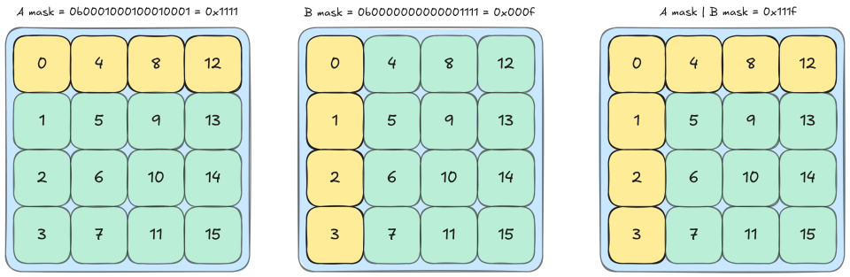
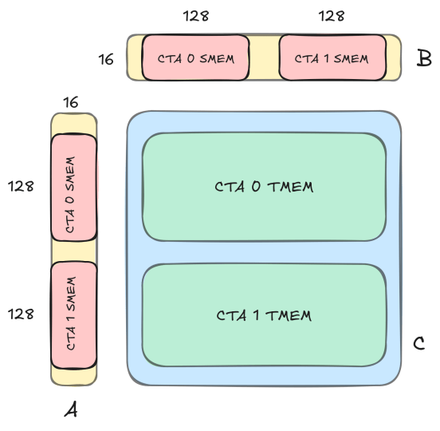
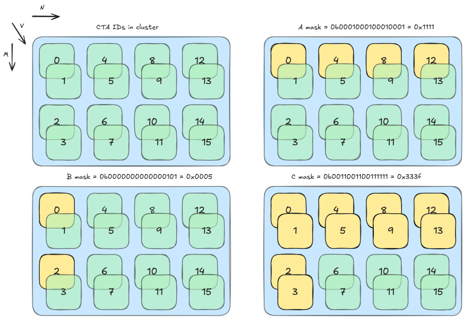

# CUTLASS 教程：NVIDIA® Blackwell GPU 上使用线程块集群的 GEMM

欢迎阅读 NVIDIA Blackwell 架构 GEMM 研究系列的第 2 部分。第 1 部分介绍了 NVIDIA Blackwell GPU 上的一些关键新特性，包括张量内存，并说明如何编写使用新 UMMA 指令（`tcgen05.mma`）面向 Blackwell Tensor Core 的简单 CUTLASS GEMM 内核。本文将解释如何在 Blackwell GEMM 中利用线程块集群和双 SM UMMA。更具体地说，将按顺序介绍以下方面：

1. 将[张量内存加速器](https://research.colfax-intl.com/tutorial-hopper-tma/)（TMA）与线程块集群和多播结合，在参与 CTA 之间拆分全局内存传输；
2. 将 Blackwell 双 SM UMMA 与 CTA 对结合，提高 MMA 的算术强度；
3. 在 GEMM 主循环中结合 TMA 多播与双 SM UMMA，并正确地将这些操作相互同步。

与上一篇文章一样，首先深入讨论相关概念，然后通过 [CuTe Blackwell 示例](https://github.com/NVIDIA/cutlass/tree/main/examples/cute/tutorial/blackwell)——具体是示例 3 和 4——观察如何在 CUTLASS 中实现。两个示例与概念介绍顺序一致：第 3 个示例使用 TMA 多播和 Blackwell 单 SM UMMA 执行 GEMM；第 4 个示例将其扩展到使用 CTA 对的双 SM UMMA，并引入新的同步基础操作，包括不同的多播 TMA atom。

# 线程块集群

线程块集群是一种允许开发者将物理上相互接近（例如位于片上）的 SM 分组的构造。具体而言，保证同一 cluster 中的线程块会在位于同一 GPU 处理集群（GPC）上的 SM 中协同调度。



图 1：组织为 cluster 的线程块网格。图片来自 [CUDA C++ 编程指南](https://docs.nvidia.com/cuda/cuda-c-programming-guide/#thread-block-clusters)。

[该特性](https://docs.nvidia.com/cuda/hopper-tuning-guide/index.html#thread-block-clusters)首次由 NVIDIA Hopper 架构引入，为开发者提供了新的层次，以便相邻线程块之间进行更高级的协作。值得注意的是，cluster 中的线程块可以访问彼此的共享内存，该能力称为[分布式共享内存](https://docs.nvidia.com/cuda/cuda-c-programming-guide/index.html#distributed-shared-memory)。这还使 cluster 中的线程块可以协同加载数据（例如通过 TMA 多播），并使用对彼此都可见的 mbarrier 相互同步。后文会看到这些特性的实际用法。

## 使用线程块集群

与网格大小或线程块大小一样，线程块集群是启动时参数。Cluster 大小使用 `dim3` 元组 `<cluster.x, cluster.y, cluster.z>` 定义。Cluster 支持的最大可移植大小为 8，但 [Hopper H100](https://docs.nvidia.com/cuda/hopper-tuning-guide/index.html#thread-block-clusters) 和 [Blackwell B200](https://docs.nvidia.com/cuda/blackwell-tuning-guide/index.html#thread-block-clusters) 等某些 GPU 通过 opt-in 选项允许大小最高为 16 的 cluster。我们将形状为 `<1,1,1>` 的最小 cluster 称为平凡 cluster。最后，cluster 形状必须整除网格大小。

在 CUTLASS 中，使用专用启动工具 `launch_kernel_on_cluster` 启动 cluster。

```
// 将 dimGrid、dimBlock、dimCluster 定义为 dim3 对象
// 计算 smemBytes
// 将 kernel_ptr 定义为指向内核函数的指针
auto params = {dimGrid, dimBlock, dimCluster, smemBytes};
auto status = cutlass::launch_kernel_on_cluster(params, (void const*) kernel_ptr,
                                                ... /* 内核参数 */);
```

在 GEMM 内核中，很自然地会把 cluster 形状的三个维度映射到问题的三个维度 M、N、K。除非使用 [Split-K 内核设计](https://research.colfax-intl.com/cutlass-tutorial-persistent-kernels-and-stream-k/)，cluster 形状的 K 维始终等于 1。这意味着每个 cluster 中的 CTA 都被分配一个连续的输出矩阵块区域，这对缓存性能和稍后将看到的多播都有好处。

## TMA 多播

TMA 多播加载旨在通过一次将同一张量矩阵块加载到同一 cluster 中的多个 CTA，来加速数据传输。该特性与线程块集群和 TMA 一起在 Hopper 中引入，我们已在[之前的文章](https://research.colfax-intl.com/tutorial-hopper-tma/)中讨论过。

简要回顾，TMA 多播将 TMA 加载的数据放入同一 cluster 中多个 CTA 的 SMEM。利用该特性，cluster 中一组 CTA 可以协同且同时地将一个数据矩阵块加载到各自的共享内存。当多个 CTA 需要加载同一数据时，这会减少全局内存流量。每个 CTA 加载一部分数据，该数据被多播到其他参与 CTA 的 SMEM。例如，如果参与 CTA 数为 4，每个 CTA 加载四分之一的数据，从而将 TMA 加载的数据总量减少为原来的四分之一。从技术上说，这种协作式部分加载是一种编程范式，并非 TMA 多播特性本身所固有；但本文会将两者视为同义。

# CuTe 示例：使用 TMA 多播的 GEMM

现在查看 [CuTe Blackwell 示例 3](https://github.com/NVIDIA/cutlass/blob/main/examples/cute/tutorial/blackwell/03_mma_tma_multicast_sm100.cu)，观察多播如何在 GEMM 语境中使用。多播与 GEMM 分块方案自然契合，因为操作数 A 和 B 中的每个矩阵块都会用于计算多个输出矩阵块。为简化起见，先考虑形状为 `<2,2,1>` 的 cluster（请注意，实际示例使用 `<4,4,1>`）。每个 CTA 处理一个大小为 (bM,bN) 的输出矩阵块，因此每个 cluster 处理由 4 个输出矩阵块组成的 2×2 区域，总大小为 `(2*bM,2*bN)`。

主循环每次迭代中，每个 CTA 都需要从 A 加载一个 (bM,bK) 矩阵块，并从 B 加载一个 (bN,bK) 矩阵块。矩阵块的 M 和 N 偏移由该 CTA 在网格中的行和列决定，K 偏移由迭代次数决定。如果使用普通 TMA，每个输出矩阵块都会加载 2 个矩阵块，导致整个 cluster 加载 8 个矩阵块。CTA 光栅化等优化可确保大部分加载来自 L2，但很难达到 100% 命中，而且在 MMA 操作的时间尺度上，即使 L2 命中也有明显延迟。TMA 多播允许只加载最少所需的 4 个矩阵块，并将它们放入所需 CTA 的 SMEM。更准确地说，每个 CTA 需要与同一行其他 CTA 相同的 A 操作数矩阵块，以及与同一列其他 CTA 相同的 B 操作数矩阵块。因此，每个 CTA 参与两次 TMA 多播：一次为操作数 A，与同行所有其他 CTA 一起参与；另一次为操作数 B，与同列所有其他 CTA 一起参与。



图 2：在该 2×2 cluster 中，A 和 B 的每个矩阵块都可使用多播同时加载到 2 个 CTA。

从概念上看，TMA 多播相当简单。但在实践中，协调多个 CTA 间的数据访问可能很棘手。因此，正确同步可说是 TMA 多播的关键。从 CTA 工作流角度看，有两个同步点：第一个是所有参与 TMA 已完成、数据可供 MMA 使用；第二个是所有参与 MMA 已完成，保存数据的缓冲区可以被下一次迭代的数据覆写。下面依次讨论这两个同步点。

## TMA 参与者同步

第一个同步点是等待所有加载所需操作数的 TMA 多播完成。对 A 而言，这再次意味着同一行的所有 CTA；对 B 而言，意味着同一列的所有 CTA，其中包括 CTA 自身。因此，需要一个屏障，等待参与相关 TMA 多播操作的所有 cluster CTA。

要了解这是如何完成的，可以查看相关 PTX。参与信息编码在 `cp.async.bulk.tensor`（TMA）的 PTX 中：

```
// 全局内存 -> shared::cluster
cp.async.bulk.tensor.dim.dst.src{.load_mode}.completion_mechanism{.multicast}
{.cta_group}{.level::cache_hint}
                                   [dstMem], [tensorMap, tensorCoords],
                                   [mbar]{, im2colInfo}
                                   {, ctaMask} {, cache-policy}
.dst =                  { .shared::cluster }
.src =                  { .global }
.dim =                  { .1d, .2d, .3d, .4d, .5d }
.completion_mechanism = { .mbarrier::complete_tx::bytes }
.cta_group =            { .cta_group::1, .cta_group::2 }
.load_mode =            { .tile, .tile::gather4, .im2col, .im2col::w, .im2col::w::128 }
.level::cache_hint =    { .L2::cache_hint }
.multicast =            { .multicast::cluster  }
```

TMA 多播的参与者通过 `ctaMask` 指定。`ctaMask` 是一个位掩码，第 `i` 位决定 cluster 索引为 `i` 的 CTA 是否参与。更准确地说，TMA 操作将加载数据放入位掩码所指定全部 CTA 的 SMEM，并可选地到达这些 CTA 的 mbarrier。Blackwell GPU 的最大 cluster 大小为 16，因此使用 16 位位掩码。对本例的 4x4x1 cluster 形状，使用十六进制表示掩码可获得相对容易阅读的表达式。例如，cluster 索引为 0 的 CTA 具有 `tma_bitmask_a = 0x1111` 和 `tma_bitmask_b = 0x000f`。



图 3：CTA 在 cluster 内的组织方式，以及与 TMA 索引 0 相关的两个位掩码。请注意，一维 CTA ID 映射到多维 cluster 形状时，第 0 模是最主要的模。此处它对应输出矩阵的 M 模，因此 CTA 布局为列主序。

此处每个位都对应一个 CTA，多维 cluster 形状通过列主序布局映射到 CTA 的一维顺序。（Cluster 内每个 CTA 的一维位置可通过 [PTX 特殊寄存器 `%cluster_ctarank`](https://docs.nvidia.com/cuda/parallel-thread-execution/index.html#special-registers-cluster-ctarank) 或 `cute::block_rank_in_cluster()` 访问。）位掩码编码了列和行参与关系。例如，在 A 的位掩码中，CTA 0 与 CTA 4、8、12 共享同一行，因此掩码 `0b0001000100010001` 的第 0、4、8、12 位为 1。使用该掩码，CTA 0 发出的 TMA 多播会把加载数据放入 CTA 0、4、8、12 的 SMEM，并到达它们各自的 mbarrier。同一行各 CTA 对 A 的 TMA 多播都使用同一位掩码（最上方一行为 `0x1111`），同一列各 CTA 对 B 的 TMA 多播都使用同一位掩码（最左列为 `0x000f`）。这使 CTA 只需等待参与其操作数多播加载的其他 6 个 CTA。

下面查看示例如何实现 TMA 多播和同步。首先是拷贝 atom。对当前单 SM 的简单情况，示例使用 sm90 TMA atom。其参数与标准 TMA 相同，只是追加了多播模中的 CTA 数。请注意，给出参与者数的多播模被选为 A 的 N 模（A 为 MxK）。

```
Copy_Atom tma_atom_A = make_tma_atom(
    SM90_TMA_LOAD_MULTICAST{},       // 带多播的 TMA 加载操作
    mA,                              // 源 GMEM 张量
    sA_layout,                       // 目标 SMEM 布局
    select<0,2>(mma_tiler),          // TMA 操作的 MK Tiler
    size<2>(cluster_layout_vmnk)     // 多播模中的 CTA 数
);
```

接下来，启动 TMA 多播需要位掩码。可通过 CUTLASS 工具函数构造该位掩码：

```
int cta_in_cluster_coord_1d = cute::block_rank_in_cluster(); // e.g. 11
auto cta_in_cluster_coord_vmnk = cluster_layout_vmnk.get_flat_coord(
                                                             cta_in_cluster_coord_1d);
// e.g. (0,3,2,0)
uint16_t tma_mcast_mask_a = create_tma_multicast_mask<2>(cluster_layout_vmnk,
                                                         cta_in_cluster_coord_vmnk);
uint16_t tma_mcast_mask_b = create_tma_multicast_mask<1>(cluster_layout_vmnk,
                                                         cta_in_cluster_coord_vmnk);
// printf("%#x\n", tma_mcast_mask_a); => 0x8888
// printf("%#x\n", tma_mcast_mask_b); => 0x0f00
```

TMA 多播所需的最后一组信息是数据张量。可使用 TMA partitioner 获取已分区矩阵块：

```
// 沿 N 模投影 tma_A 的 cluster_layout
auto [tAgA, tAsA] = tma_partition(tma_atom_A,
                                  get<2>(cta_in_cluster_coord_vmnk),
                                  make_layout(size<2>(cluster_layout_vmnk)),
                                  group_modes<0,3>(tCsA), group_modes<0,3>(tCgA));
// 沿 M 模投影 tma_B 的 cluster_layout
auto [tBgB, tBsB] = tma_partition(tma_atom_B,
                                  get<1>(cta_in_cluster_coord_vmnk),
                                  make_layout(size<1>(cluster_layout_vmnk)),
                                  group_modes<0,3>(tCsB), group_modes<0,3>(tCgB));
// tAgA:   ArithTuple(0,0) o (((_64,_128),_1),4):(((_1@0,_1@1),_0),_64@0)
// tAsA:   Sw<3,4,3>_smem_ptr[16b](0xfe2600000400) o ((_8192,_1)):((_1,_0))
// tBgB:   ArithTuple(0,0) o (((_64,_256),_1),4):(((_1@0,_1@1),_0),_64@0)
// tBsB:   Sw<3,4,3>_smem_ptr[16b](0xfe2600004400) o ((_16384,_1)):((_1,_0))
```

这里有一点很有趣：尽管每个 CTA 负责从 GMEM 加载共享矩阵块的一个切片，这些已分区张量却显示完整矩阵块。事实上，这些张量看起来与普通 TMA 张量完全相同。原因是 TMA 多播切片信息通过内存地址偏移传递，该偏移存储在 `ArithTuple(0,0)` 中。但此打印输出来自 CTA 0，因此偏移为零。查看 CTA 1 的 `tAgA` 可以看到该偏移：

```
// tAgA:   ArithTuple(0,128) o (((_64,_128),_1),4):(((_1@0,_1@1),_0),_64@0)
```

每个 CTA 都接收完整矩阵块的相同布局，但内存偏移不同，用于指示应拷贝哪个数据切片。更深入的讨论可参阅[之前的 TMA 文章](https://research.colfax-intl.com/tutorial-hopper-tma/)。

现在已拥有启动 TMA 多播和同步所需的全部信息。除参数中的位掩码外，TMA 启动本身与[之前介绍](https://research.colfax-intl.com/tutorial-hopper-tma/)的标准 TMA 启动相同：

```
if (elect_one_warp && elect_one_thr) {
  cute::initialize_barrier(shared_storage.tma_barrier, 1);
}
int tma_barrier_phase_bit = 0;
cute::cluster_sync();
int tma_transaction_bytes = sizeof(make_tensor_like(tAsA))
                          + sizeof(make_tensor_like(tBsB));
// 主循环
for (int k_tile = 0; k_tile < size<3>(tCgA); ++k_tile) {
  if (elect_one_warp && elect_one_thr) {
      cute::set_barrier_transaction_bytes(shared_storage.tma_barrier,
                                          tma_transaction_bytes);
      copy(tma_atom_A.with(shared_storage.tma_barrier,tma_mcast_mask_a),
           tAgA(_,k_tile), tAsA);
      copy(tma_atom_B.with(shared_storage.tma_barrier,tma_mcast_mask_b),
           tBgB(_,k_tile), tBsB);
  }
  // 等待加载到 SMEM 的 TMA 操作完成
  cute::wait_barrier(shared_storage.tma_barrier, tma_barrier_phase_bit);
  tma_barrier_phase_bit ^= 1;
  // ... 执行 UMMA 操作 ...
}
```

这里需要注意 TMA 屏障的完成条件和 `transaction_bytes` 的值。mbarrier 对象拥有两个内部计数器，用于跟踪当前阶段的完成状态：以线程为单位的 pending arrival count，以及以字节为单位的 pending transaction count（`tx-count`）。当两个计数都降为 0 时，该阶段才完成。这里主要关心 `tx-count`，它通过 `cute::set_barrier_transaction_bytes` 设为 TMA 加载的预期大小。（顺带一提，该函数在内部调用 `mbarrier.arrive.expect_tx`，并消耗初始化时设置的 arrival count=1。）TMA 拷贝到达时，会按已拷贝数据的字节数递减 mbarrier 的 tx-count。我们将其设为操作数矩阵块的总大小，因为在继续执行 UMMA 前，必须等待所有参与 CTA 加载完全部操作数数据。

## UMMA 完成后的同步

本例的 UMMA 与上一篇文章中相同，因此重点关注屏障同步。UMMA 是异步操作，必须显式等待它完成。在之前的示例中，只需等待执行 CTA 完成 MMA，就可进入下一次迭代。但在这里，还需确保其他 CTA 已完成对 SMEM 操作数数据的消费，才能通过多播覆写该数据。换言之，每个 CTA 发出下一次 TMA 加载前，需要等待自身以及与它共享操作数数据的所有其他 CTA 完成各自 MMA。

一种简单解决方案是直接添加 `cute::cluster_sync()`，确保 cluster 中所有 CTA 都完成后再继续。但还可以做得更好。`cluster_sync()` 同步过度，因为对某个给定矩阵块，并非所有 CTA 都会在自己的 GEMM 中使用它。相反，每个 CTA 只应等待与其共享 A 矩阵块的其他 3 个 CTA，以及与其共享 B 矩阵块的其他 3 个 CTA。这种定向同步会允许 cluster 中某些 CTA 超前运行并发出 TMA 加载，同时其他 CTA 仍在完成 MMA。

这种子 cluster 级同步与 TMA 多播中的同步类似。但现在它与异步 Tensor Core 操作的完成关联，因此使用 Blackwell 新增的一些指令，具体是 [`tcgen05.commit` 指令](https://docs.nvidia.com/cuda/parallel-thread-execution/index.html#tcgen-async-sync-operations-commit)，或其 CUTLASS 封装 [`cutlass::arch::umma_arrive_multicast`](https://github.com/NVIDIA/cutlass/blob/main/include/cutlass/arch/barrier.h#L791)。该指令把之前的 UMMA 等异步 `tcgen05` 操作分组，并设置它们在完成时到达某些 CTA 共享内存空间中的 mbarrier；这些 CTA 由位掩码指定。

因此，将设置与之前 TMA 类似的位掩码同步。这一次需要一个编码“哪些其他 CTA 正在使用当前 CTA 所加载矩阵块”的掩码。可使用之前创建的 TMA 位掩码构造该掩码。A 的位掩码告诉我们哪些其他 CTA 在使用 A 操作数，B 的位掩码亦然。因此，对两个掩码执行按位或，就能得到所需掩码。例如，对 cluster 索引为 0 的 CTA，TMA 位掩码为 `tma_bitmask_a = 0x1111` 和 `tma_bitmask_b = 0x000f`，因此 MMA 位掩码为 `tma_bitmask_a|tma_bitmask_b = 0x111f`。



图 4：MMA 位掩码是两个 TMA 位掩码的按位或。右侧是 CTA 0 的 MMA 位掩码。

图中可以看到，该位掩码识别了与 CTA 0 共享矩阵块的 CTA，即位于同一行或同一列的 CTA。

使用该位掩码可以设置 MMA 同步。第一步是创建 mbarrier，它与 TMA 情况有一个关键差异：由于没有数据传输，这里依赖 arrival count 而不是 `tx-count`。具体而言，屏障计数需要设为参与 MMA 的数量。本示例中，每个 CTA 的屏障需要等待 7 个线程：它计数掩码中所有 CTA 发出 MMA 的线程，包括它自身。更一般地说，可从 cluster 布局获取该数量，同时确保不重复计数自身。

```
if (elect_one_warp && elect_one_thr) {
  int num_mcast_participants = size<1>(cluster_layout_vmnk)
                               + size<2>(cluster_layout_vmnk) - 1;
  cute::initialize_barrier(shared_storage.mma_barrier, num_mcast_participants);
}
```

最后设置同步。将发出 `tcgen05.mma` 的内层循环与 `umma_arrive_multicast` 分在一组，并指示它在完成时到达位掩码所指定 CTA 的 mbarrier。

```
if (elect_one_warp) {
  for (int k_block = 0; k_block < size<2>(tCrA); ++k_block) {
    gemm(tiled_mma, tCrA(_,_,k_block), tCrB(_,_,k_block), tCtAcc);
    tiled_mma.accumulate_ = UMMA::ScaleOut::One;
  }
  cutlass::arch::umma_arrive_multicast(&shared_storage.mma_barrier,
                                       mma_mcast_mask_c);
}
cute::wait_barrier(shared_storage.mma_barrier, mma_barrier_phase_bit);
mma_barrier_phase_bit ^= 1;
// 在下一次迭代中继续执行 TMA
```

请注意，`umma_arrive_multicast` 在内部选出一个线程到达屏障，因此不应像 TMA 设置事务计数时那样显式选出线程。使用该定向屏障，CTA 无需等待 cluster 中所有 CTA，只需等待与它存在数据依赖的 CTA，即可继续执行。即使 cluster 中某些其他 CTA 仍在计算 MMA，它也能启动下一个 k 迭代的 TMA。

# CuTe 示例：结合 TMA 多播的 Pair-UMMA

接下来检视[示例 4](https://github.com/NVIDIA/cutlass/blob/main/examples/cute/tutorial/blackwell/04_mma_tma_2sm_sm100.cu)，其中涉及双 SM 情况。回顾上一篇文章，Blackwell 新增了让同一 cluster 中两个相邻 CTA 协同执行 UMMA 的能力。据我们所知，该 MMA 变体没有官方名称，因此下文将其称为双 SM UMMA 或 Pair-UMMA。类似地，在需要澄清时，使用单 SM UMMA 或 Single-UMMA 这一术语。

Pair-UMMA 使索引更加复杂，因为现在需要区分 MMA 坐标和 CTA 坐标。之前，每个 CTA 在每次主循环迭代中计算一个 (bM,bN,bK) MMA 操作，因此 CTA 自然地排列在三维网格中。引入 Pair-UMMA 后，更合适的理解是：这是一个 (bM,bN,bK) MMA 矩阵块网格，单个 MMA 矩阵块可由包含 1 或 2 个 CTA 的 CTA 组计算。因此，最好将 CTA 视为位于四维网格上，其中第 0 个“值”模表示 CTA 在其组内的索引。请注意，CUDA 语法实际上不支持这一概念步骤，CUDA 只使用三维网格形状，因此必须手动对 CTA 索引进行一些算术运算。

本节首先深入讨论考虑 CTA 对时的两种索引方案。然后通过示例讨论 Pair-UMMA 如何改变索引和分区。最后，当明确每个 CTA 所需数据后，检视 CTA 对如何改变 TMA 的使用方式。

## CTA 对的线程块集群

一个 CTA 对必须位于同一 cluster 中，cluster 内的 CTA 根据 cluster CTA ID 分组成对。具体而言，索引第 0 位不同的 CTA（例如 0 和 1、2 和 3，以此类推）被视为一对。每对中，索引为偶数的 CTA 称为偶 CTA，索引为奇数的 CTA 称为奇 CTA。

现在考虑包含 8 个 CTA 对的 cluster 形状 `<4,4,1>`。由于这是 CuTe，该形状在索引上采用列主序，因此配对发生在大小至少为 2 的最左模上。对 `<4,4,1>` 而言，这意味着第 0 模决定配对。请注意，配对模的选择可能受具体 Tensor Core 操作限制；例如，Pair-UMMA 要求沿 M 模配对。

回顾一下[上篇文章中简要介绍](https://research.colfax-intl.com/cutlass-tutorial-writing-gemm-kernels-using-tensor-memory-for-nvidia-blackwell-gpus/#handling-clusters)的 `cluster_shape_vmnk`。

```
Layout cluster_layout_vmnk = tiled_divide(make_layout(cluster_shape),
                                          make_tile(typename TiledMMA::AtomThrID{}));
```

之前看到，使用 Single-UMMA 时，`AtomThrID{}` 的值为 1，`cluster_layout_vmnk` 可简化为 `<1,cluster.x,cluster.y,cluster.z>`。现在使用 Pair-UMMA Atom，因此 `AtomThrID{}` 为 2。这种情况下，`tiled_divide` 使用大小为 (2) 的矩阵块沿 cluster 形状的第 0 模分块，为 CTA cluster 创建 rank-4 布局。同样，第 0 个“值”模决定 CTA 在对内的 ID，其他三个模构成 cluster 内 CTA 对的布局。例如，对 cluster 形状 `<4,4,1>`：

```
auto cluster_shape = make_shape(Int<4>{}, Int<4>{}, Int<1>{});
Layout cluster_layout_vmnk = tiled_divide(make_layout(cluster_shape),
                                          make_tile(typename TiledMMA::AtomThrID{}));
print(cluster_layout_vmnk); // ((_2),_2,_4,_1)
```

该结果可理解为 8 个 CTA 对排列成 `(2,4,1)` 形状。随后使用该 cluster 布局计算 `mma_coord_vmnk`。

```
Layout cluster_layout_vmnk = tiled_divide(make_layout(cluster_shape),
                                          make_tile(typename TiledMMA::AtomThrID{}));
auto mma_coord_vmnk = make_coord(blockIdx.x % size<0>(cluster_layout_vmnk),
                                 blockIdx.x / size<0>(cluster_layout_vmnk),
                                 blockIdx.y,
                                 _);
```

`mma_coord_vmnk` 是一种复合坐标系。第 0 模是单个 MMA 内的 peer CTA 坐标，第 1 到第 3 模是 MMA 的全局坐标。后三个模共同构成 MMA 坐标，用于对 MMA 矩阵块索引。Blackwell 架构的 MMA 是 pair-local，而 Hopper 架构中的 MMA 是 CTA-local。

## Pair-UMMA

在 Pair-UMMA 中，一对 CTA 协同处理同一 MMA 矩阵块。对中每个 CTA 都加载每个 MMA 操作数矩阵块的一半，并在自己的 TMEM 中保存一半累加器。例如，如果 MMA 形状为 256x256x16，每个 CTA 都从 A 和 B 加载 128×16 切片，并在 TMEM 中保存一个 128×256 累加器矩阵。



图 5：256x256x16 Pair-UMMA 的操作数切片和 TMEM 所有权。

这里可以看到，数据加载没有重叠。因此从算术强度来看，它确实像一个 256×256 MMA 那样工作。与两个 CTA 分别执行两个 128×256 MMA 相比，256×256 MMA 执行相同数量的 FLOP，但只传输一半的操作数数据。

Pair-UMMA 通过带限定符 `cta_group::2` 的 PTX `tcgen05.mma` 指令发出。M 支持的大小为 128 和 256，累加器始终在 M 方向上分配给两个 CTA，这会影响 cluster 形状的选择。更多数据布局信息参见 [PTX 指南](https://docs.nvidia.com/cuda/parallel-thread-execution/#tcgen05-data-path-layout-organization)。

在 CUTLASS 中，Pair-UMMA 的构造方式与单 CTA MMA 相同：

```
TiledMMA tiled_mma = make_tiled_mma(SM100_MMA_F16BF16_2x1SM_SS<TypeA, TypeB, TypeC,
                                                               256, 256,
                                                               UMMA::Major::K,
                                                               UMMA::Major::K>{});
```

但在底层，Single-UMMA 和 Pair-UMMA 的 `TiledMMA` 对象之间存在许多富有信息的差异。打印上述 `tiled_mma` 会得到：

```
TiledMMA
  ThrLayoutVMNK:  (_2,_1,_1,_1):(_1,_0,_0,_0)
  PermutationMNK: (_,_,_)
MMA_Atom
  ThrID:      _2:_1
  Shape_MNK:  (_256,_256,_16)
  LayoutA_TV: (_2,(_128,_16)):(_128,(_1,_256))
  LayoutB_TV: (_2,(_128,_16)):(_128,(_1,_256))
  LayoutC_TV: (_2,(_128,_256)):(_128,(_1,_256))
```

如上篇文章所述，线程索引已被重新用作 CTA 对的索引。由于这是 Pair-UMMA，`ThrID` 为 2，所有布局的第 0 模大小也相应为 2。

下面讨论分区。每个 CTA 组都与全局内存张量的一个 MMA 矩阵块关联，可以像往常一样使用 `local_tile` 提取：

```
auto mma_coord = select<1,2,3>(mma_coord_vmnk); // 提取 MMA 坐标
Tensor gA = local_tile(mA, mma_tiler, mma_coord, Step<_1, X,_1>{});
Tensor gB = local_tile(mB, mma_tiler, mma_coord, Step< X,_1,_1>{});
Tensor gC = local_tile(mC, mma_tiler, mma_coord, Step<_1,_1, X>{});
Tensor gD = local_tile(mD, mma_tiler, mma_coord, Step<_1,_1, X>{});
// gA: (MmaTile_M, MmaTile_K, Tiles_K), e.g. (_256, _64, 4)
// gB: (MmaTile_N, MmaTile_K, Tiles_K), e.g. (_256, _64, 4)
// gC, gD: (MmaTile_M, MmaTile_N) = (_256, _256)
```

随后使用 `ThrMMA::partition_[A|B|C]` 方法，在组内各 CTA 之间划分这些 MMA 矩阵块，获得 CTA-local 操作数和累加器矩阵块。

```
auto mma_v = get<0>(mma_coord_vmnk); // 提取 peer CTA 坐标
ThrMMA cta_mma = tiled_mma.get_slice(mma_v);
Tensor tCgA = cta_mma.partition_A(gA);
Tensor tCgB = cta_mma.partition_B(gB);
Tensor tCgC = cta_mma.partition_C(gC);
Tensor tCgD = cta_mma.partition_C(gD);
// tCgA: (MmaA, NumMma_M, NumMma_K, Tiles_K), e.g. ((_128,_16),_1,_4,4)
// tCgB: (MmaB, NumMma_N, NumMma_K, Tiles_K), e.g. ((_128,_16),_1,_4,4)
// tCgC, tCgD: (MmaC, NumMma_M, NumMma_N), e.g. ((_128,_256),_1,_1)
```

一种有用的理解方式，是回顾前面的观察：CTA 坐标已取代线程坐标。在 Hopper 及更早架构的 GEMM 内核中加载操作数矩阵时，使用线程 ID 对 CTA-local 矩阵块切片，以提取 thread-local 分区。在 Blackwell 上，使用 peer CTA ID 对每个 MMA-local 矩阵块切片，获得 CTA-local 分区。本示例代码以泛化方式编写，也适用于 Single-UMMA；在该情况下，所有 V 维大小都为 1，每个 MMA 矩阵块只包含一个 CTA 分区。

最后需要注意，Pair-UMMA 必须由某个被选为领导 CTA 的 CTA 中的一个线程发出。在 CUTLASS 中，始终选择偶 CTA 作为领导 CTA。

```
int cta_rank = int(cute::block_rank_in_cluster());
auto cta_in_cluster_coord_vmnk = cluster_layout_vmnk.get_flat_coord(cta_rank);
auto elect_one_cta  = get<0>(cta_in_cluster_coord_vmnk) == Int<0>{};
if (elect_one_cta) {
  // 由单个线程发出 Pair-UMMA
}
```

<a id="pair-umma-mainloop"></a>

## TMA 多播与 Pair-UMMA 主循环

现在已获得启用 Pair-UMMA 的 `tiled_mma` 对象，下面查看[示例 4](https://github.com/NVIDIA/cutlass/blob/main/examples/cute/tutorial/blackwell/04_mma_tma_2sm_sm100.cu) 中的实现。内核主要工作流如下：

```
// 计算 TMA 和 Pair-UMMA 的位掩码
uint16_t tma_mcast_mask_a =
    create_tma_multicast_mask<2>(cluster_layout_vmnk,cta_in_cluster_coord_vmnk);
uint16_t tma_mcast_mask_b =
    create_tma_multicast_mask<1>(cluster_layout_vmnk,cta_in_cluster_coord_vmnk);
uint16_t mma_mcast_mask_a =
    create_tma_multicast_mask<0,2>(cluster_layout_vmnk,cta_in_cluster_coord_vmnk);
uint16_t mma_mcast_mask_b =
    create_tma_multicast_mask<0,1>(cluster_layout_vmnk,cta_in_cluster_coord_vmnk);
uint16_t mma_mcast_mask_c = mma_mcast_mask_a | mma_mcast_mask_b;
// 事务计数覆盖整个 MMA
int tma_transaction_bytes = size<0>(cluster_layout_vmnk)
                              * sizeof(make_tensor_like(tAsA))
                            + size<0>(cluster_layout_vmnk)
                              * sizeof(make_tensor_like(tBsB));
// 初始化屏障
if (elect_one_warp && elect_one_thr) {
  int num_mcast_participants = size<1>(cluster_layout_vmnk)
                               + size<2>(cluster_layout_vmnk) - 1;
  cute::initialize_barrier(shared_storage.mma_barrier, num_mcast_participants);
  cute::initialize_barrier(shared_storage.tma_barrier, 1);
}
int mma_barrier_phase_bit = 0;
int tma_barrier_phase_bit = 0;
cute::cluster_sync();
tiled_mma.accumulate_ = UMMA::ScaleOut::Zero;
for (int k_tile = 0; k_tile < size<3>(tCgA); ++k_tile)
{
  if (elect_one_warp && elect_one_thr) {
    // 只有领导 CTA 等待 TMA 事务
    if (elect_one_cta) {
      cute::set_barrier_transaction_bytes(shared_storage.tma_barrier,
                                          tma_transaction_bytes);
    }
    copy(tma_atom_A.with(shared_storage.tma_barrier,tma_mcast_mask_a),
         tAgA(_,k_tile), tAsA);
    copy(tma_atom_B.with(shared_storage.tma_barrier,tma_mcast_mask_b),
         tBgB(_,k_tile), tBsB);
  }
  if (elect_one_cta) {
    // 只有领导 CTA 等待 TMA
    cute::wait_barrier(shared_storage.tma_barrier, tma_barrier_phase_bit);
    tma_barrier_phase_bit ^= 1;
    if (elect_one_warp) {
      for (int k_block = 0; k_block < size<2>(tCrA); ++k_block) {
          gemm(tiled_mma, tCrA(_,_,k_block), tCrB(_,_,k_block), tCtAcc);
          tiled_mma.accumulate_ = UMMA::ScaleOut::One;
      }
      // 只有领导 CTA 发出 arrive
      cutlass::arch::umma_arrive_multicast_2x1SM(&shared_storage.mma_barrier,
                                                 mma_mcast_mask_c);
    }
  }
  // 所有 CTA 都等待
  cute::wait_barrier(shared_storage.mma_barrier, mma_barrier_phase_bit);
  mma_barrier_phase_bit ^= 1;
}
```

本节剩余部分将深入检视该示例的不同组件。

### 构造位掩码

首先介绍 TMA 和 MMA 位掩码。回顾一下，位掩码表示 TMA 和 MMA 的数据依赖，因此先理解它与单 CTA 情况相比发生了哪些变化。在双 SM 情况下，每个 CTA 负责 MMA 矩阵块中互不重叠的一半；偶 CTA 不需要奇 CTA 的数据，反之亦然。因此，TMA 多播只需将数据多播到奇偶性相同的 CTA。另一方面，MMA 使用完整 MMA 矩阵块，因此需要来自两种 CTA parity 的数据。这一差异体现在位掩码中。

例如，当 cluster 形状为 `<4,4,1>`（产生形状为 `<2,2,4,1>` 的四维 cluster）时，CTA 0 具有以下位掩码：

```
tma_mcast_mask_a: 0x1111
tma_mcast_mask_b: 0x0005
mma_mcast_mask_c: 0x333f
```

图 6 展示该 Pair-UMMA 示例中位掩码到 CTA 的映射。



图 6：使用 CTA 对的内核中 CTA 0 的 TMA 和 MMA 掩码。CTA 现在按 (V,M,N,K) 顺序组织在 cluster 中。

对 TMA 多播掩码而言，对 CTA 0 只有同行或同列的偶 CTA 被置 1，因为奇 CTA 在数据上相互独立。但对 MMA 而言，两个半部都被置 1，因为 MMA 使用两个半部。

为了构造这些掩码，可以再次使用第 [2–10](#pair-umma-mainloop) 行所示的 CUTLASS 工具函数。其构造方式与单 SM 情况的差异在于：某个 CTA 的 MMA 位掩码不再只是它自身 TMA 位掩码的按位或，而是其 TMA 位掩码与 peer CTA MMA 位掩码的按位或。一般而言，`create_tma_multicast_mask<Modes...>(cluster_layout_vmnk, cta_in_cluster_coord_vmnk)` 生成一个包含所有 CTA 的位掩码，这些 CTA 只在 cluster 布局所指定的模上与当前 CTA 不同。因此，`create_tma_multicast_mask<2>` 为参与当前 A 矩阵块 TMA 加载的 CTA 创建掩码，这些 CTA 可能在 N 模上与当前 CTA 不同；`create_tma_multicast_mask<0,2>` 为参与使用当前 A 矩阵块的 MMA 的 CTA 创建掩码，这些 CTA 可能在 V 和 N 模上与当前 CTA 不同。MMA 的最终掩码包含参与使用当前 A 矩阵块或 B 矩阵块的 MMA 的所有 CTA，即可能在 V/N 模或 V/M 模上不同的 CTA。

### Pair-UMMA 同步

下面检视 UMMA 同步。由于由偶 CTA 发出启动，UMMA 的 arrive 指令也必须来自偶 CTA。因此，创建 MMA 屏障时，参与者数是 MMA 数而不是 CTA 数，这可从第 [20–21](#pair-umma-mainloop) 行看出。在 `cluster_shape_vmnk` 中，M 模大小为 2，N 模大小为 4。因此，尽管涉及 10 个 CTA，参与者数（arrival count）为 5。

Pair-UMMA 的 arrive 指令使用 CUTLASS 专用函数 [`umma_arrive_multicast_2x1SM`](https://github.com/NVIDIA/cutlass/blob/main/include/cutlass/arch/barrier.h#L809) 发出（见第 [55–56](#pair-umma-mainloop) 行）。这是因为带 `cta_group::1` 和 `cta_group::2` 的 `tcgen05.commit` 调用在不同流水线中处理。Pair-UMMA 使用 `cta_group::2` 限定符启动，因此需要指示 `tcgen05.commit` 查找 `cta_group::2`。

对某个给定 MMA 矩阵块，如果只有 5 个领导 CTA 会到达该屏障，为什么传入的位掩码大小却是 10，还包含非领导 CTA？原因是，位掩码决定发出 CTA 到达哪些 CTA 的屏障。（请记住，这些 CTA 位于同一 cluster 中，因此可以访问位于彼此共享内存中的 mbarrier。）虽然只有 5 个领导 CTA 发出 MMA 指令，非领导 CTA 在发出下一次 TMA 拷贝并使操作数失效前，也必须等待 MMA 完成。第 [60–61](#pair-umma-mainloop) 行可以看到所有 CTA 都在等待。

### 双 SM TMA 多播同步

下面讨论 TMA 多播同步。第 [38–41](#pair-umma-mainloop) 行使用位掩码启动 TMA，将多播限制在奇偶性相同的 CTA 中，因为每个 CTA 只负责 MMA 矩阵块的一半。该位掩码还意味着，正常情况下这些 TMA 只会到达奇偶性相同的 CTA。但是，TMA 的 `wait_barrier`（第 [46](#pair-umma-mainloop) 行）只由偶 CTA 调用，且必须等待完整 MMA 矩阵块。因此，尽管奇 CTA 和偶 CTA 所占的 TMA 位掩码完全不相交，奇 CTA 仍需要以某种方式到达偶 CTA 的 mbarrier。

CUTLASS 以一种很有启发性的方式解决该问题。首先，sm100 为 [TMA 拷贝指令](https://docs.nvidia.com/cuda/parallel-thread-execution/#data-movement-and-conversion-instructions-cp-async-bulk-tensor)引入了 `cta_group` 限定符。将其设为 `cta_group::2`，允许 TMA 拷贝到达执行 CTA 或其 peer CTA 的 mbarrier。其次，[此处使用的 `cute::copy` 版本](https://github.com/NVIDIA/cutlass/blob/main/include/cute/arch/copy_sm100_tma.hpp#L50)通过以下方式修改 mbarrier 地址：

```
uint32_t smem_int_mbar = cast_smem_ptr_to_uint(mbar_ptr) & Sm100MmaPeerBitMask;
```

其中 [`Sm100MmaPeerBitMask`](https://github.com/NVIDIA/cutlass/blob/main/include/cute/arch/copy_sm100_tma.hpp#L43) 为 `0xFEFFFFFF`。换言之，CTA 可对自己的 mbarrier 地址将第 24 位清零，从而找到领导 CTA mbarrier 的地址。之所以可行，是因为 cluster 中所有 CTA 的 SMEM 被视为一个统一地址空间，对应 [PTX 的“shared state space”](https://docs.nvidia.com/cuda/parallel-thread-execution/#shared-state-space)，而 cluster CTA ID 占据地址高位。特别是，地址第 24 位必须对应 CTA ID 的第 0 位，即 CTA 在其对内的索引。请注意，对该 TMA 拷贝使用 `cute::copy` 要求 cluster 中所有 CTA 具有相同的 shared storage 布局，并要求采用 CUTLASS 的约定：选择偶 CTA 作为领导。

可使用专用函数 [`make_tma_atom_[A|B]_sm100()`](https://github.com/NVIDIA/cutlass/blob/main/include/cute/atom/copy_traits_sm100_tma.hpp#L377) 创建面向 CTA 对的专用拷贝 atom。该函数与 sm90 接口略有不同，并需要将更多 UMMA 本身的细节作为参数。以下是示例 4 的 atom：

```
Copy_Atom tma_atom_A = make_tma_atom_A_sm100(
      SM100_TMA_2SM_LOAD_MULTICAST{},
      mA,                             // 源 GMEM 张量
      sA_layout,                      // 目标 SMEM 布局
      mma_tiler,                      // MMA 矩阵块形状，例如 (_256, _256, _64)
      tiled_mma,
      cluster_layout_vmnk);
```

请注意，与之前的单 SM 情况不同，这里不手动指定多播维度。相反，`make_tma_atom_[A|B]_sm100` 函数会适当选择多播维度。这是因为多播维度由 MMA atom 的限制决定，而 MMA atom 始终沿 M 维拆分累加器。打印该 TMA atom，可再次看到原来的线程模被用作 peer-CTA 模。

```
tma_atom_A: Copy_Atom
  ThrID:        _2:_1
  ValLayoutSrc: (_2,_8192):(_8192,_1)
  ValLayoutDst: (_2,_8192):(_8192,_1)
  ValLayoutRef: (_2,_8192):(_8192,_1)
  ValueType:    16b
```

该布局表示两个数据相互独立的 128x16x4 加载（回顾一下，每个 SMEM 矩阵块对应 4 次主循环迭代）。

# 结论

本文通过梳理第 3 和第 4 个 CuTe Blackwell 示例，研究了 NVIDIA Blackwell 架构上线程块集群的高级用法。特别是，我们研究了 TMA 多播和双 SM UMMA（即 Pair-UMMA）。对两项特性，首先深入分析 PTX、索引逻辑和位掩码等更细致的细节，然后检视 CUTLASS 实现。在实现中，复杂的索引逻辑被 CuTe 布局和工具函数抽象掉。

到目前为止，本系列只介绍了使用半精度数据类型的标准 GEMM。但 Blackwell 架构还增加了对低精度 GEMM 的支持，包括分块缩放。本系列的下一篇（也是最后一篇）文章将转向该主题。

1. // tAgA: ArithTuple(0,128) o (((_64,_128),_1),4):(((_1@0,_1@1),_0),_64@0)
每个 CTA 都接收完整矩阵块的相同布局，但内存偏移不同，用于指示它们拷贝哪个数据切片。
请问，这里只指定了起始偏移，却没有指定拷贝大小，如何确保只加载一个矩阵块？例如，如果 cluster size=4，需要加载 128 个元素，每个 CTA 负责加载 32 个元素。如果只把起始偏移设为 0/32/64/96，CTA0 会加载 128 个元素，CTA1 会加载 96 个元素吗？

  1. 拷贝总大小在 TMA atom 中通过 SMEM 布局设置，同时也通过输入 `cute::copy` 的 GMEM 和 SMEM 张量传给该函数。“在多播中，加载数据在参与多播的 CTA 之间均分”这一事实并没有在任何地方明文写出，而是我们通过错误使用多播观察到的，即定义 TMA 多播拷贝，但没有从每个 CTA 调用。在正确使用多播时，几乎所有实际用途中都无需考虑 CTA 之间的分工，只需将其视为多个 CTA 参与的一次 TMA 加载，最终加载数据会复制到这些 CTA 的 SMEM。
另外值得指出，CTA 之所以“知道”它们执行的是多播加载而不是普通加载，是因为在定义 TMA atom 时已经指定了这一点。

    1. 谢谢回复。确实，我也注意到，构造 TMA atom 时传入了 `num_multicast` 参数，但在 `tma_partition` 步骤之后，共享内存张量和全局内存坐标张量都没有显示任何基于大小的切片；两者都保留完整大小，只是不同 CTA 具有不同偏移。
关于以下说法：
“在正确使用多播时，几乎所有实际用途中都无需考虑 CTA 之间的分工，只需将其视为多个 CTA 参与的一次 TMA 加载，最终加载数据会复制到这些 CTA 的 SMEM。”
我发现了另一个有趣现象。假设有一个包含 128 个 FP32 元素的数组，即形状为 (1,128)，步长为 (0,1)。使用 cluster=(x,1,1) 执行 G2S TMA 多播加载时，将 x 设为 8 会导致加载失败。我怀疑原因是 128/8=16 个元素，即 64 字节，这使 CTA=1 的目标共享内存地址不满足 128 字节对齐要求，从而失败。
因此，多播和非多播似乎不能视为完全等价；仍有一些需要考虑的“黑箱”行为。
2. “其中 `Sm100MmaPeerBitMask` 为 `0xFEFFFFFF`。换言之，CTA 可对自己的 mbarrier 地址将第 24 位清零，从而找到领导 CTA mbarrier 的地址。之所以可行，是因为 cluster 中所有 CTA 的 SMEM 被视为一个统一地址空间，对应 PTX 的“shared state space”，而 cluster CTA ID 占据地址高位。特别是，地址第 24 位必须对应 CTA ID 的第 0 位，即 CTA 在其对内的索引。请注意，对该 TMA 拷贝使用 `cute::copy` 要求 cluster 中所有 CTA 具有相同的 shared storage 布局，并要求采用 CUTLASS 的约定：选择偶 CTA 作为领导。”
在上述描述中，地址高位（第 24–31 位）表示当前 CTA 在 cluster 内的 ID。例如，这些位中的二进制值 `00000011` 表示 CTA ID 为 3？可以这样理解吗？
