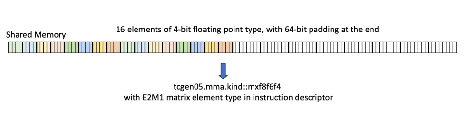
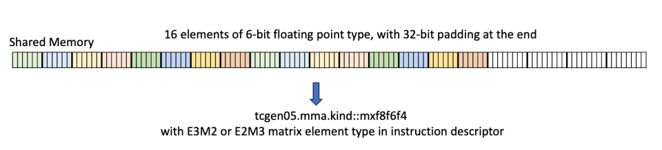
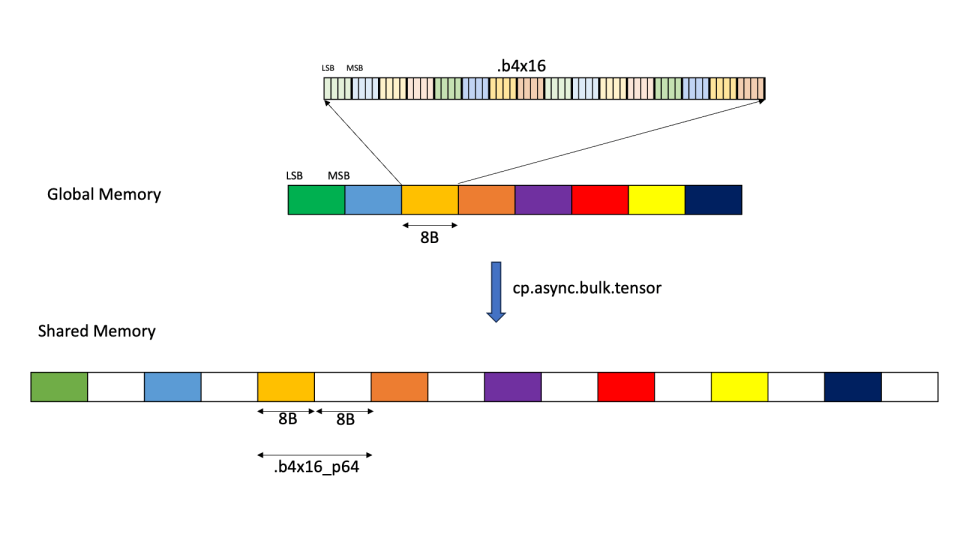
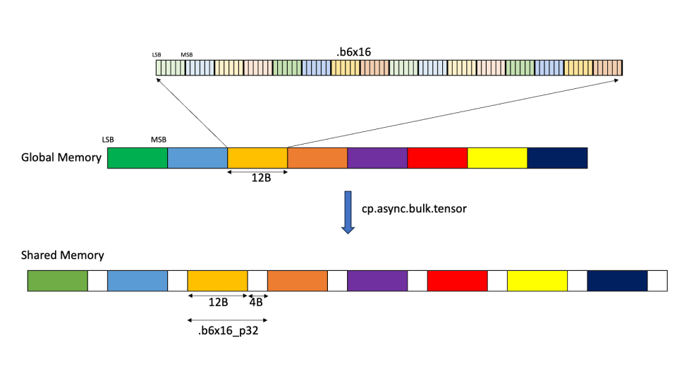
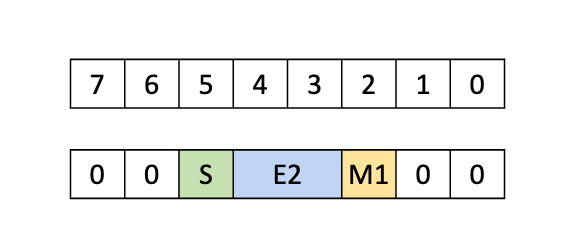
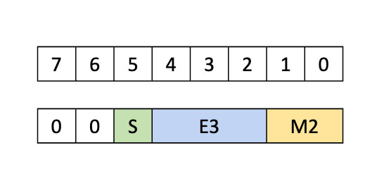
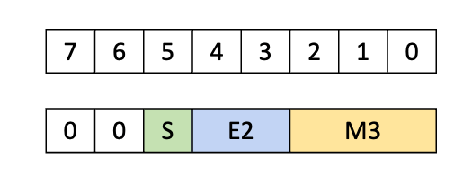

# CUTLASS 教程：NVIDIA® Blackwell GPU 上的亚字节 GEMM

欢迎阅读 NVIDIA Blackwell 架构 GEMM 研究系列的第 3 部分。第 1 和第 2 部分研究了新 Blackwell Tensor Core UMMA 指令的张量内存与双 SM 能力，以及如何在 CUTLASS 中使用它们。本部分先介绍低精度计算，然后讨论它如何在 Blackwell GEMM 中实现，特别关注亚字节（6 位和 4 位）格式及其对数据内存布局设置的影响。主要结论是：对 `f8f6f4` kind 的混合输入 UMMA（即允许受支持的 8 位、6 位和 4 位操作数任意组合），UMMA 需要以某种解包格式读取数据，而 TMA 可在执行 GMEM→SMEM 内存加载时将数据解包为正确格式。但这会对 GMEM 中允许的矩阵块大小、主维和数据地址对齐施加额外约束。在编写 CUTLASS 内核代码时，可以在第 1 和第 2 部分建立的理解之上，进一步加入 `f8f6f4` 混合输入情况，下文将展示该过程。

Blackwell 还支持分块缩放格式，包括遵循 OCP 规范的 `mx` 类型和 NVIDIA 自有的 `nvf4` 数据类型。Blackwell 所支持低精度类型的完整列表可参见 [CUTLASS 文档](https://github.com/NVIDIA/cutlass/blob/main/media/docs/cpp/blackwell_functionality.md#blackwell-narrow-precision-data-types)。分块缩放的讨论留到下一篇文章。

# 为什么使用低精度？

低精度通常是指所用位数少于 32 位单精度浮点数的数据类型，后者于 1985 年由 IEEE 754 正式化。在许多 AI 工作负载中，低精度类型比单精度更受青睐，因为它们可以显著减少模型大小和计算负载。近年来，硬件与软件紧密耦合地向更低精度发展：

- NVIDIA 于 2017 年推出的 Volta 架构中，Tensor Core 支持使用 FP32 累加的半精度（FP16）矩阵乘法。
- 2018 年，Google Brain 设计了 bfloat16 格式，[Google TPU](https://www.nextplatform.com/2018/05/10/tearing-apart-googles-tpu-3-0-ai-coprocessor/) 对其提供原生支持。与 FP16 不同，BF16 拥有 8 个指数位，因此具有与 FP32 相同的动态范围，但精度低得多。NVIDIA Ampere 架构等其他芯片很快也支持了 BF16。
- Ampere 还引入了 [TF32](https://developer.nvidia.com/blog/accelerating-ai-training-with-tf32-tensor-cores/)，这是一种具有 FP32 范围和 FP16 精度的 19 位格式。
- INT8 量化是 AI 中历史悠久的技术，尤其用于推理，它起源于数字信号处理领域。但整数计算的范围和精度与浮点数显著不同，使整数格式不太适合训练，且为了在推理中成功工作，需要对模型训练做明显修改。针对该问题，[Micikevicius 等人（2022）](https://arxiv.org/abs/2209.05433)为 AI 应用提出了两种 8 位浮点格式：一种拥有 4 个指数位和 3 个尾数位，另一种拥有 5 个指数位和 2 个尾数位。NVIDIA Hopper 架构为两种格式都提供了加速矩阵乘基础操作。
- 最近，Blackwell 架构引入了对 6 位和 4 位浮点的亚字节精度支持。[AI 研究者已迅速采用](https://arxiv.org/abs/2501.17116)这些格式，以获得更小的模型和更高的计算吞吐量。

使用低精度格式通常会涉及混合精度计算，即使用多种数据类型的计算。以下是几个例子：

- 大多数 Tensor Core 指令使用比操作数更高精度的数据类型累加，通常为 FP32 或 INT32。
- 在 Hopper 架构上，[DeepSeek](https://arxiv.org/abs/2412.19437v2) 通过交替执行 Tensor Core 累加和 CUDA Core 累加，进一步减轻 FP8 GEMM 的精度损失，[之前的文章](https://research.colfax-intl.com/deepseek-r1-and-fp8-mixed-precision-training/)已更详细地讨论。
- 操作数具有不同数据类型的混合输入 GEMM 也可能很有用。例如，可以将模型权重量化为 8 位或更低精度，以减少模型内存占用，同时让激活保持更高精度，以维持质量。

低精度类型的范围往往较小，直接量化可能使很大的值被截断，或使很小的值归零。为了补偿，可在量化前将每组值除以高精度缩放因子，使其落入可接受范围。随后保存这些缩放因子，并在计算末尾乘回。对于如何对值分组以进行缩放，有几种合理选择：

- 整个张量共用一个缩放因子（成本低，但会导致严重饱和问题）。
- 相反的极端：每个值使用一个缩放因子（可获得高精度，但内存开销巨大）。
- 每个矩阵行或列使用一个缩放因子。
- 矩阵块级缩放：输出的每个固定大小矩阵块使用一个缩放因子，例如 128×128。
- 分块缩放：每个行块使用一个缩放因子，例如 1×32。

Blackwell UMMA 指令原生支持分块缩放，缩放因子与 1×32 或 1×16 块关联。缩放因子形成额外张量，必须正确加载并送入 Tensor Core，这会增加内核复杂性。本文仅讨论无缩放情况，并将分块缩放留到本系列最后一部分讨论。

# 数据格式

CUTLASS 支持广泛的数据类型，包括许多不同的低精度数据类型。[所支持数据类型的完整列表](https://github.com/NVIDIA/cutlass/blob/main/media/docs/cpp/fundamental_types.md#numeric-types)可在 CUTLASS 文档中找到。本文主要关注浮点数据类型，因此在讨论新亚字节类型前，先简要回顾浮点数的存储方式。

浮点数据中的位被分为三部分：符号、指数和尾数。（浮点背景知识可参见[资料一](https://fabiensanglard.net/floating_point_visually_explained/)或[资料二](https://float.exposed/0x0010)。）符号如果存在，只占一位；指数和尾数可使用任意数量的位。尾数位越多，精度越高；指数位越多，范围越大。但所用总位数有限，因此在分配给指数和尾数的位数之间存在权衡。在总位数较少的低精度格式中，这一权衡更加重要。

## 字节与亚字节格式

NVIDIA GPU 支持五种大小不超过 1 字节的基础浮点数据类型：

- `E5M2`：8 位浮点，包含 5 个指数位和 2 个尾数位，最大有限值为 57344。
- `E4M3`：8 位浮点，包含 4 个指数位和 3 个尾数位，最大有限值为 448，但精度高于 `E5M2`。
- `E3M2`：6 位浮点，包含 3 个指数位和 2 个尾数位，范围为 -28 到 28。
- `E2M3`：6 位浮点，包含 2 个指数位和 3 个尾数位，范围为 -7.5 到 7.5，但精度高于 `E3M2`。
- `E2M1`：4 位浮点，包含 2 个指数位和 1 个尾数位，可精确表示数值 {0, 0.5, 1, 1.5, 2, 3, 4, 5, 6} 及其负值。

与 IEEE 格式不同，6 位和 4 位类型没有 NaN 或 ±∞。

# 低精度 UMMA

下面深入了解低精度 UMMA 的实现方式。再次从 [UMMA 的 PTX](https://docs.nvidia.com/cuda/parallel-thread-execution/#tcgen05-mma-instructions) 开始讨论。UMMA 的数据类型由 `.kind` 限定符决定，它支持多种数据类型，包括亚字节数据类型。特别是，带 `.kind::f8f6f4` 的 `tcgen05.mma` 支持操作数为上述五种低精度数据类型中任意一种的 MMA 操作，并使用 FP32 或 FP16 累加。请注意，A 和 B 的数据类型无需相同，因此可用于混合输入 UMMA。

## 操作限制

`f8f6f4` 类型对操作数和输出张量施加了一些限制，可在 PTX 文档的[受支持矩阵表](https://docs.nvidia.com/cuda/parallel-thread-execution/#tcgen05-matrix-shape)中查看。值得注意的是，对稠密 GEMM，MMA 矩阵块的 K extent 始终为 32。一般而言，稠密 GEMM 操作数矩阵块在 K 方向上必须为 32 字节宽；稍后会看到，`f8f6f4` 指令的操作数值会被填充到每个值占 1 字节。

## 动态数据类型

在第五代之前的 Tensor Core 指令（[PTX `mma` 指令](https://docs.nvidia.com/cuda/parallel-thread-execution/#warp-level-matrix-instructions-mma)）中，所有数据类型都编码在指令本身中，因此必须在编译期已知。相比之下，带 `.kind::f8f6f4` 限定符的 `tcgen05.mma` 支持上述五种数据类型的任意组合。数据类型信息现在编码在[指令描述符](https://docs.nvidia.com/cuda/parallel-thread-execution/#tcgen05-instruction-descriptor)中，该描述符是在设备上构造的 PTX 指令运行时参数。因此，无需为每种数据类型单独编译二进制文件，就可支持多种数据类型。

## 操作数布局与 TMA 加载

### SMEM 与 GMEM 布局

在简单 GEMM 内核等典型用例中，操作数来自 SMEM。此时，SMEM 中的操作数数据必须以[特定的 16 字节对齐格式](https://docs.nvidia.com/cuda/parallel-thread-execution/#tcgen05-packing-formats-mxf8f6f4-smem)存储：将连续的 16 个 4 位或 6 位元素紧凑打包，然后填充到 16 字节边界。与往常一样，SMEM 中的数据可以[以几种方式进行 swizzle](https://docs.nvidia.com/cuda/parallel-thread-execution/#tcgen05-canonical-layouts)，所有方式都遵守这些 16 字节边界。





图 1：SMEM 中 4 位和 6 位数据类型的打包方式。图片来自 [PTX 文档](https://docs.nvidia.com/cuda/parallel-thread-execution/#tcgen05-packing-formats-mxf8f6f4-smem)。

这带来的一个结果是，为亚字节操作数分配 SMEM 空间时，需要像它们是字节操作数那样处理。这也是数据类型能动态传入的部分原因。`.kind::f8f6f4` 限定符不支持 SMEM 中完全压缩的连续数据。下一篇文章讨论分块缩放时，将介绍支持打包 SMEM 格式的 `mxf4` 类型。

SMEM 中的操作数矩阵块很可能使用 TMA 从 GMEM 加载。当然，可以在 GMEM 中用相同的填充格式定义操作数布局，但这会浪费大量 GMEM 空间和 TMA 带宽。考虑到低精度量化的部分目标正是减少 GPU 内存中的模型大小，这是一个非常不理想的方案。理想情况是在 GMEM 中以打包格式存储张量，并在加载到 SMEM 的过程中将其展开为适当的填充格式。

TMA 正好提供了这项功能。[Tensor Map 对象](https://docs.nvidia.com/cuda/cuda-driver-api/group__CUDA__TENSOR__MEMORY.html#group__CUDA__TENSOR__MEMORY_1ga7c7d2aaac9e49294304e755e6f341d7)是用于构造 TMA 描述符的低级 CUDA 抽象，它拥有用于决定数据类型的 `tensorDataType` 选项。该参数有两个选项，可精确实现我们所需的拷贝：

- `CU_TENSOR_MAP_DATA_TYPE_16U4_ALIGN16B`：将 16 个打包的 4 位元素从 GMEM 拷贝到 SMEM 中的 16 字节对齐空间，并添加 8 字节填充。
- `CU_TENSOR_MAP_DATA_TYPE_16U6_ALIGN16B`：将 16 个打包的 6 位元素从 GMEM 拷贝到 SMEM 中的 16 字节对齐空间，并添加 4 字节填充。

这些 TMA 加载版本在 PTX 中对应数据类型为 `.b4x16_p64` 或 `.b6x16_p32` 的 `cp.async.bulk.tensor`。





图 2：使用数据类型 `.b4x16_p64` 或 `.b6x16_p32` 的 TMA。图片来自 [PTX 文档](https://docs.nvidia.com/cuda/parallel-thread-execution/index.html#tensor-dimension-size-format-sub-bytes)。

通过将 TMA 与这些类型之一结合，可以从 GMEM 中的打包数据源高效获得所需格式。这些类型还对 TMA 施加了 CUDA Driver API 参考文档所迴的额外限制：

- TMA 基地址必须按 32 字节对齐，而不是常规的 16 字节对齐要求。
- TMA 张量在连续方向（即主维）的大小必须是 128 个元素的倍数。
- 只支持 128 字节 swizzle 模式或无 swizzle。（感谢 Together AI 的 Alex Angus 向我们指出这一点！）

在 CUTLASS 中，可使用 [`sm1xx_gemm_is_aligned()`](https://github.com/NVIDIA/cutlass/blob/c2ad7c5b20f131c4ba33601860f1da3f9c9df0f3/include/cutlass/gemm/collective/builders/sm1xx_common.inl#L357) 检查 GMEM 对齐要求，并使用 [`sm1xx_gemm_check_for_f8f6f4_mix8bit_requirement()`](https://github.com/NVIDIA/cutlass/blob/c2ad7c5b20f131c4ba33601860f1da3f9c9df0f3/include/cutlass/gemm/collective/builders/sm1xx_common.inl#L191) 检查矩阵块大小要求。请注意，CUTLASS 实际上[断言](https://github.com/NVIDIA/cutlass/blob/c2ad7c5b20f131c4ba33601860f1da3f9c9df0f3/include/cutlass/detail/layout.hpp#L372) 4 位数据应按 64 字节对齐，6 位数据应按 96 字节对齐，因为这可确保同时满足主维和基地址对齐约束。

最后请注意，亚字节数据还有第三种 Tensor Map 数据类型：`CU_TENSOR_MAP_DATA_TYPE_16U4_ALIGN8B`（PTX 中为 `.b4x16`）。该类型将 GMEM 中打包的 4 位数据拷贝到 SMEM 中打包且未填充的格式。它在当前场景中没有用，但对能使用该打包格式的纯 FP4 UMMA 版本很有用。

### TMEM 布局

除从 SMEM 取得操作数外，UMMA 也可改为从 TMEM 取得操作数 A，但操作数 B 不可以。对 TMEM，UMMA 要求将亚字节数据类型填充到 1 字节容器，包括 4 位数据。







图 3：4 位和 6 位数据类型的 TMEM 打包格式。图片来自 [PTX 文档](https://docs.nvidia.com/cuda/parallel-thread-execution/#tcgen05-packing-formats-mxf8f6f4-tmem)。

再次请注意，在分配 TMEM 空间时，可以把所有值都当作 1 字节宽。

为 GEMM 将亚字节数据加载到 TMEM 的典型流程如下：

- 数据在全局内存中保持打包格式。
- 使用上述“解包”TMA 类型之一将数据从 GMEM 加载到 SMEM，在 SMEM 中产生按 16 字节对齐的填充数据。
- 最后，使用带可选解压缩的 `tcgen05.cp` 指令，将数据从 SMEM 加载到 TMEM。该步骤把数据从 16 字节填充的 SMEM 格式转换为所需的字节填充 TMEM 格式。

# CUTLASS 亚字节 UMMA

既然已从硬件层面讨论亚字节 UMMA，下面探索 CUTLASS 如何对其进行抽象。没有针对亚字节 UMMA 的 CuTe 示例，因此直接检视 [CUTLASS 内核代码](https://github.com/NVIDIA/cutlass/blob/main/include/cutlass/gemm/collective/sm100_mma_warpspecialized.hpp)。也可参考[相关高层示例](https://github.com/NVIDIA/cutlass/blob/main/examples/72_blackwell_narrow_precision_gemm/72c_blackwell_mixed_mxfp8_bf16_gemm.cu)：它使用 Collective Builder API 构建低精度 GEMM 内核，最终调用本节要检视的内核代码。

首先从数据类型开始。在 CUTLASS 中，亚字节数据类型由 [`cutlass/float_subbyte.h`](https://github.com/NVIDIA/cutlass/blob/main/include/cutlass/float_subbyte.h) 中定义的以下类型表示：

```
cutlass::float_e3m2_t
cutlass::float_e2m3_t
cutlass::float_e2m1_t
```

这些类型都继承自表示通用 IEEE 风格浮点数的基类 `float_exmy_base`。值得注意的是，基本数学操作定义在该父类中。换言之，不同数据类型的浮点数可混合搭配，使用 `+` 和 `*` 等简单数学运算符。但对亚字节数据，这些操作没有硬件支持，会以 `fp32` 执行。

此外，CUTLASS 还提供了专门面向 UMMA 和 TMA 设计的特殊亚字节数据类型。

```
cutlass::float_e3m2_unpacksmem_t
cutlass::float_e2m3_unpacksmem_t
cutlass::float_e2m1_unpacksmem_t
```

在适用时，这些类型会指示 TMA 使用 16 字节填充拷贝。因此，对 `f8f6f4` UMMA 内核，应优先使用这些类型，而不是基础亚字节数据类型。

```
using ElementAMma = cutlass::float_e2m3_unpacksmem_t;
using ElementBMma = cutlass::float_e2m1_unpacksmem_t;
using ElementCMma = cutlass::half_t;
```

[Builder](https://github.com/NVIDIA/cutlass/blob/main/include/cutlass/gemm/collective/builders/sm100_umma_builder.inl#L198) 使用 [`cutlass::gemm::collective::detail::sm1xx_kernel_input_element_to_mma_input_element`](https://github.com/NVIDIA/cutlass/blob/b244379d9b15574e07b73b814b88bd2233f0b3ce/include/cutlass/gemm/collective/builders/sm1xx_common.inl#L65) 将普通类型转换为这些解包类型。内核代码期望[从 `TiledMma` 中读取适当类型](https://github.com/NVIDIA/cutlass/blob/main/include/cutlass/gemm/collective/sm100_mma_warpspecialized.hpp#L127)。

接下来需要能反映 16 字节对齐数据的 SMEM 布局。如前所述，对所有亚字节类型，这些 SMEM 布局在实际上与 8 位数据相同，因此可使用 `uint8_t` 定义 SMEM 布局。可从 [`sm100_umma_builder.inl`](https://github.com/NVIDIA/cutlass/blob/main/include/cutlass/gemm/collective/builders/sm100_umma_builder.inl#L250) 的以下代码片段看出：

```
using ElementAMma_SmemAllocType =
               cute::conditional_t<cute::sizeof_bits_v<ElementAMma> < 8,
                                   uint8_t, ElementAMma>;
using SmemLayoutAtomA =
               decltype(cutlass::gemm::collective::detail::sm100_smem_selector<
                                 UmmaMajorA, ElementAMma_SmemAllocType,
                                 SmemShape_M, SmemShape_K >());
```

此处，`sm100_smem_selector` 是一个工具函数，它根据输入参数选择具有最大 swizzle 的布局。

接下来看 TMA。除选择亚字节数据类型并使用上述填充 SMEM 外，`make_tma_atom` 或其双 SM 等价形式无需任何修改。CUTLASS TMA 会根据 `unpacksmem` 数据类型，为 `fp4` 和 `fp6` 使用特殊的 16 字节对齐 TMA。可在 [`cute/arch/copy_sm90_desc.hpp`](https://github.com/NVIDIA/cutlass/blob/b244379d9b15574e07b73b814b88bd2233f0b3ce/include/cute/arch/copy_sm90_desc.hpp) 中看到这些数据类型到适当 Tensor Map 数据类型的映射：

```
if constexpr (is_same_v<T, float_e2m1_unpacksmem_t>) {
  return CU_TENSOR_MAP_DATA_TYPE_16U4_ALIGN16B;
} else if constexpr (is_same_v<T, float_e2m3_unpacksmem_t>) {
  return CU_TENSOR_MAP_DATA_TYPE_16U6_ALIGN16B;
} else if constexpr (is_same_v<T, float_e3m2_unpacksmem_t>) {
  return CU_TENSOR_MAP_DATA_TYPE_16U6_ALIGN16B;
 } else ...
```

最后，除使用适当的 `F8F6F4` atom 外，创建 tiled MMA 也无需任何修改：

```
TiledMMA tiled_mma = make_tiled_mma(SM100_MMA_F8F6F4_SS<ElementAMma, ElementBMma,
                                                         ElementCMma,
                                                         128, 256,
                                                         UMMA::Major::K,
                                                         UMMA::Major::K>{});
```

如之前文章所述，atom 名称中的 `SS` 表示两个操作数都来自 SMEM。此处元素类型可以是 `unpacksmem` 类型，也可以是默认类型；CUTLASS MMA 已配置为同时接受两者。不过，collective builder 对 MMA 和 TMA 使用 `unpacksmem` 版本，它似乎是首选类型。

## 运行时数据类型

要使用运行时操作数数据类型，指定以下类型之一：

```
cutlass::type_erased_dynamic_float8_t
cutlass::type_erased_dynamic_float6_t
cutlass::type_erased_dynamic_float4_t
```

对 SMEM 布局，使用这些类型时无需修改，因为无论实际类型如何，SMEM 布局都按数据为 8 位来计算。类似地，对 TMA 而言，数据格式并不重要，但位数仍然重要，因为构造 Tensor Map 需要它。因此，除改用这些 `type_erased` 类型外，TMA 无需其他修改。但对 MMA 本身，需要手动更新指令描述符。例如，[`sm100` collective mainloop 代码](https://github.com/NVIDIA/cutlass/blob/8bdbfca68287232e5bf5793145f987569ecd312e/include/cutlass/gemm/collective/sm100_mma_warpspecialized.hpp#L567)的以下片段完成了该操作：

1

2

```
tiled_mma.idesc_.a_format_ = uint8_t(runtime_data_type_a_) & 0b111;
tiled_mma.idesc_.b_format_ = uint8_t(runtime_data_type_b_) & 0b111;
```

此处 `runtime_data_types` 是[指令描述符](https://docs.nvidia.com/cuda/parallel-thread-execution/index.html#tcgen05-instruction-descriptor)中所用数据类型的整数表示。在 CUTLASS 中，它们是[枚举类 `cute::UMMA::MXF8F6F4`](https://github.com/NVIDIA/cutlass/blob/f12b1d75c904c05b10650809af39511080a06ff3/include/cute/arch/mma_sm100_desc.hpp#L168) 的成员，可[作为参数传入内核](https://github.com/NVIDIA/cutlass/blob/8bdbfca68287232e5bf5793145f987569ecd312e/include/cutlass/gemm/collective/sm100_mma_warpspecialized.hpp#L296)。

# 结论

本文研究了 NVIDIA Blackwell 架构的低精度支持，特别关注亚字节数据类型。首先检视 PTX 和硬件，并讨论按 16 字节对齐、经填充的 SMEM 格式以及运行时数据类型选择等细节。随后检视 CUTLASS 实现：创建 SMEM 布局、指示 TMA 对数据进行格式化，以及使用运行时数据类型。

这些低精度数据类型最常用的操作之一，是通过分块缩放进行量化。Blackwell GPU 现已在硬件上支持对大小小于或等于 1 字节的数据类型执行该操作。本系列的下一篇（也是最后一篇）文章将讨论该主题。
