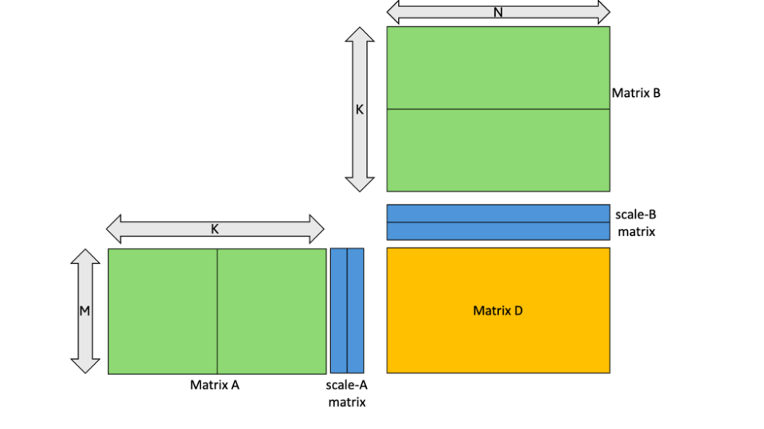
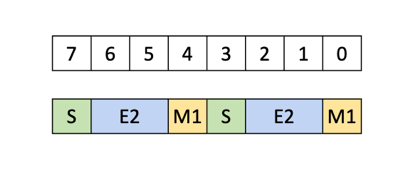
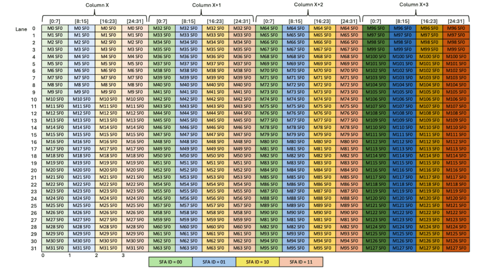
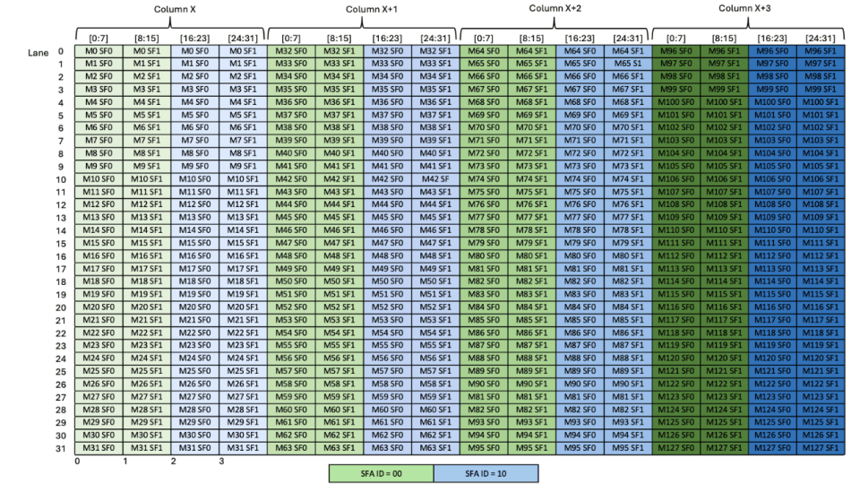
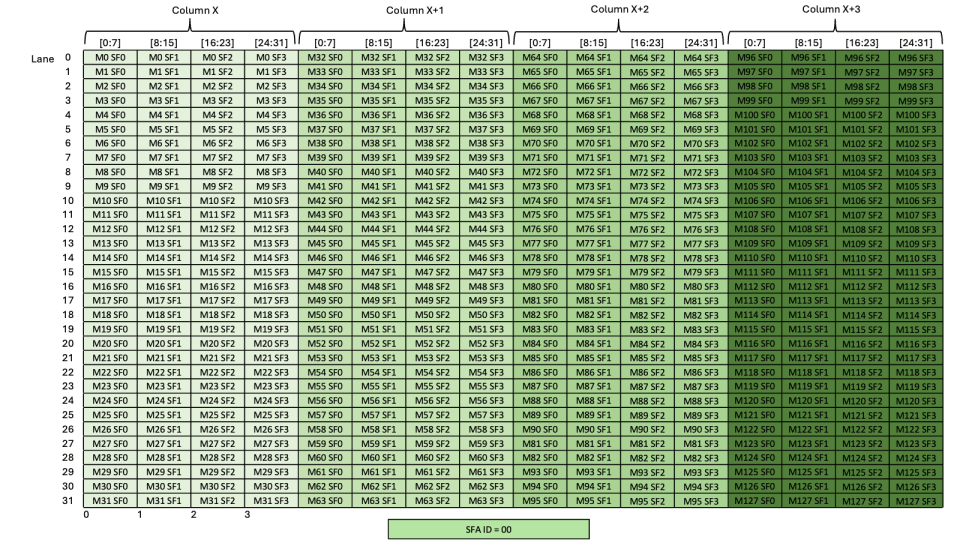
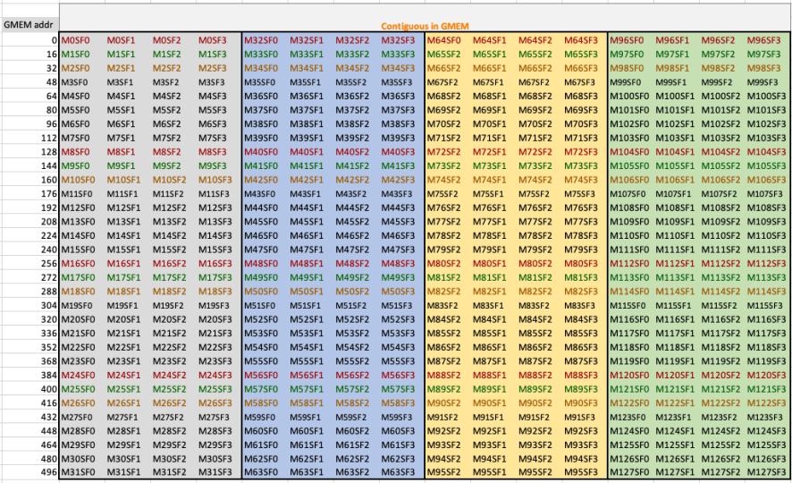
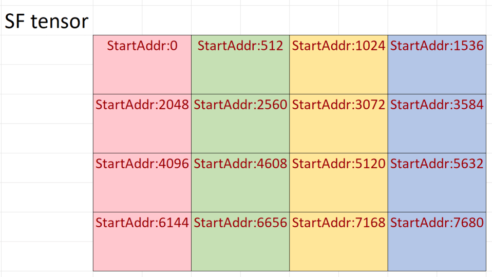
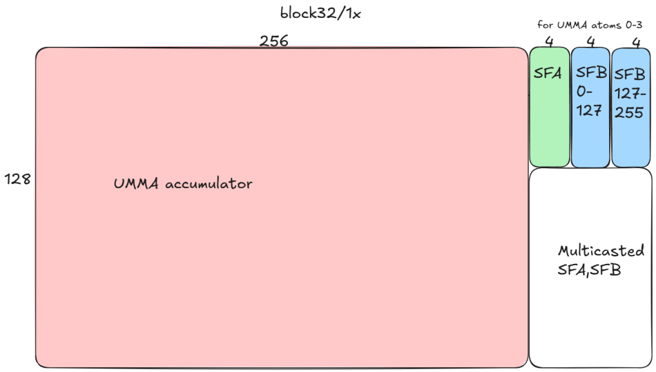
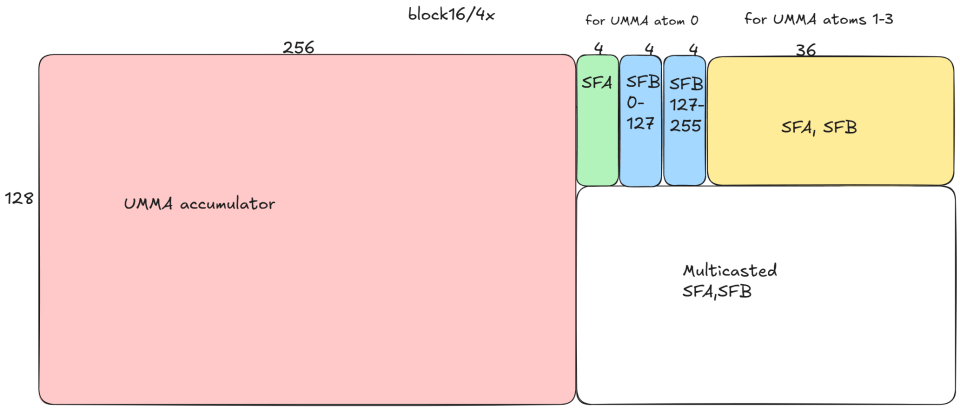
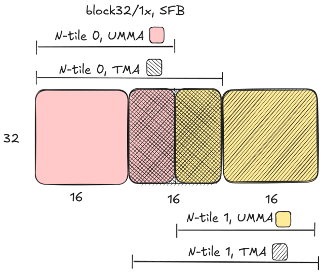

# CUTLASS 教程：NVIDIA Blackwell GPU 的硬件支持分块缩放

欢迎阅读 NVIDIA Blackwell 架构 GEMM 研究系列的第 4 部分。到目前为止，我们已讨论新 Blackwell Tensor Core UMMA 指令的能力，包括处理亚字节数据类型，以及如何在 CUTLASS 中使用这些能力。本部分将继续探索低精度计算，讨论如何利用 UMMA 的分块缩放支持。

# 分块缩放回顾

上一篇文章简要讨论了分块缩放。简而言之，它是一种反量化技术：在执行乘加前，先将操作数数据乘以缩放因子。更准确地说：

```
D = (A * scale_A) @ (B * scale_B) + C
```

在 AI 应用中，分块缩放用于补偿低精度数值格式的低动态范围。在量化前，使用缩放因子将原本高精度权重或激活张量的所有元素缩放到统一范围。实现缩放时，可以使用不同粒度的缩放因子。在一个极端，可以单独缩放每个矩阵元素；在另一个极端，可以为整个矩阵关联一个共同缩放因子。Blackwell Tensor Core 为中间方案提供硬件支持：对稠密 GEMM，每个行/列在 K 模上被划分为 16 或 32 个元素的片段，每个片段都乘以自己的缩放因子。



图 1：分块缩放 GEMM。图片来自 [PTX 文档](https://docs.nvidia.com/cuda/parallel-thread-execution/#tcgen05-mma-block-scaling)。

此处，A 和 B 的每个行/列被划分为两个片段，并乘以两个缩放因子。换言之，K 模中每个 16 或 32 元素向量都可拥有一个缩放因子。允许的片段数和大小取决于数据类型，下面将继续讨论。

# 分块缩放 GEMM 的数据类型

[上一篇文章](https://research.colfax-intl.com/cutlass-tutorial-sub-byte-gemm-on-nvidia-blackwell-gpus/)讨论了 Blackwell 使用的五种亚字节浮点格式。分块缩放 GEMM 操作数矩阵的基本组件，最好理解为一种新数据类型的对象：固定长度的低精度数值向量，以及每个向量对应的一个缩放因子。Blackwell 分块缩放支持操作数数据类型、向量长度和缩放因子数据类型的五种不同组合。

|  | 操作数数据类型 | 向量长度（元素） | 缩放因子数据类型 |
|---|---|---|---|
| mxf8 | E5M2, E4M3 | 32 | UE8M0 |
| mxf6 | E3M2, E2M3 | 32 | UE8M0 |
| mxf4 | E2M1 | 32 | UE8M0 |
| nvf4 | E2M1 | 16 | UE4M3 |

缩放因子始终是无符号 8 位浮点数。`nvf4` 使用的 `UE4M3` 类型就是非负 `E4M3` 浮点数，即符号位始终为 0。相比之下，`UE8M0` 使用全部 8 位，以标准的带偏置方式表示浮点指数。因此，`UE8M0` 缩放因子的可能值为 2^x，其中 -127 ≤ x ≤ 127。两种类型都支持 NaN，但不支持无穷大。与 `UE8M0` 相比，`UE4M3` 提供更高精度，代价是范围大幅减小。其最大可能值只有 448，使 `nvf4` 向量中可表示的最大值为 6 x 448 = 2688。

三种 mx 类型由 Open Compute Project 的 Microscaling Format 规范（[PDF](https://www.opencompute.org/documents/ocp-microscaling-formats-mx-v1-0-spec-final-pdf)）正式化，`nvf4` 格式则为 [NVIDIA 所特有](https://developer.nvidia.com/blog/introducing-nvfp4-for-efficient-and-accurate-low-precision-inference/)。与 mx 类型相比，`nvf4` 提供更细粒度的缩放因子，每个缩放因子对应更少元素，但结果是缩放因子占用的字节数增加一倍。

# 分块缩放 UMMA 的 PTX

带分块缩放的 UMMA PTX 指令语法如下：

```
tcgen05.mma.cta_group.kind.block_scale{.scale_vectorsize}
                                        [d-tmem],  a-desc,  b-desc, idesc,
                                        [scale-A-tmem], [scale-B-tmem],enable-input-d;
tcgen05.mma.cta_group.kind.block_scale{.scale_vectorsize}
                                        [d-tmem], [a-tmem], b-desc, idesc,
                                        [scale-A-tmem], [scale-B-tmem],enable-input-d;
.kind = { .kind::mxf8f6f4, .kind::mxf4, .kind::mxf4nvf4 }
.cta_group      = { .cta_group::1,   .cta_group::2 }
.scale_vectorsize = { .scale_vec::1X, .scale_vec::2X, .scale_vec::4X, .block16, .block32 }
```

该语法的大部分已在[第 1 部分](https://research.colfax-intl.com/cutlass-tutorial-writing-gemm-kernels-using-tensor-memory-for-nvidia-blackwell-gpus/)讨论，包括指令描述符、A 和 B 的 SMEM 描述符、从 TMEM 而不是 SMEM 读取 A 的能力，以及通过 `enable-input-d` 标志在 D 上累加而不是覆写 D。分块缩放指令的新增要求是，缩放因子必须从 TMEM 读取。`scale-A-tmem` 和 `scale-B-tmem` 参数期望接收它们的基地址，即各自 (0,0) 元素的 TMEM 地址。除缩放因子的 TMEM 布局外，还需要解释 `.kind` 和 `.scale_vectorsize` 限定符。

```
.kind
```

`.kind` 限定符有三个选项：

- `mxf8f6f4`：支持 8 位、6 位和 4 位数据类型的混合输入。
- `mxf4`：使用 `ue8m0` 缩放因子的 4 位输入。
- `mxf4nvf4`：面向 4 位输入的更通用指令。

限定符类型会影响可用操作数数据类型和缩放因子类型。

限定符 `mxf8f6f4` 是上一篇文章所讨论 `f8f6f4` 数据类型的分块缩放版本。它与 `f8f6f4` 具有完全相同的要求：操作数可用输入类型相同，也具有相同的 16 字节 SMEM/TMEM 填充要求。因此，`mxf8f6f4` 操作数参见上一篇文章。

`mxf4` 和 `mxf4nvf4` 都只适用于 4 位输入，具体为 `e2m1`。使用 4 位专用版本的优势是，与 `mxf8f6f4` 数据类型不同，4 位数据无需填充；可将两个元素打包到一个 8 位容器中：



图 2：SMEM 中 4 位值的打包方式。图片来自 [PTX 文档](https://docs.nvidia.com/cuda/parallel-thread-execution/index.html#tcgen05-packing-formats-mxf4-tmem-dig1)。

与带 `mxf8f6f4` 限定符使用 4 位数据类型相比，这会将 SMEM 用量减少一半。因此，如果已知工作负载只使用 FP4，建议使用 `mxf4` 或 `mxf4nvf4`。

`mxf4` 还假定缩放因子类型为 `ue8m0`，`mxf4nvf4` 则允许两种缩放因子类型。与操作数类型一样，缩放因子数据类型通过[指令描述符](https://docs.nvidia.com/cuda/parallel-thread-execution/#tcgen05-instruction-descriptor)在运行时指定。

```
.scale_vectorsize
```

将 `.scale_vectorsize` 限定符设为 `.block16` 或 `.block32`，可以指定每个缩放因子对应的操作数元素数：mx 类型为 32，`nvf4` 为 16。

但在内部，Tensor Core 似乎以另一种方式理解向量大小。回顾一下，A 和 B 的 UMMA 输入 atom 在 K 模上始终为 32 字节宽。下文将它们称为“UMMA atom row”，即把 K 模视为两个矩阵的行模。用 `atom_K` 表示 MMA atom 的元素数，因此对 `mxf8f6f4`，`atom_K=32`；对 `mxf4` 和 `mxf4nvf4`，`atom_K=64`。与之前文章一样，使用 (bM,bN,bK) 表示主循环矩阵块大小；该矩阵块通常由若干在 K 模上重复的 UMMA atom 组成。本文始终取 `bK` 等于 4 个 UMMA atom 的总和，即 128 字节或 1 个 cache line。因此，对 8 位输入 `bK=128`，对 4 位输入 `bK=256`。

现在，指定 scale vector size 等价于指定每个 UMMA atom row 消耗的缩放因子数：

```
atom_SFK = atom_K / sf_vec_size
```

`.block16` 和 `.block32` 限定符实际上是 `.scale_vec::1X`、`2X` 和 `4X` 的别名，其中 1、2 或 4 是每个 UMMA atom row 的缩放因子数。这会直接影响 UMMA 所消耗缩放因子的形状，如下表所示；同时也会影响缩放因子在 TMEM 中的布局，下一节将展示。

|  | .scale_vec::1X | .scale_vec::2X | .scale_vec::4X |
|---|---|---|---|
| scale_A 的形状 | M x 1 | M x 2 | M x 4 |
| scale_B 的形状 | N x 1 | N x 2 | N x 4 |

不同数据类型并不支持所有选项，完整表格可在 [PTX 文档](https://docs.nvidia.com/cuda/parallel-thread-execution/index.html#tcgen05-mma-scale-valid-comb-detail)中找到。特别是，`mxf8f6f4` 和 `mxf4` 操作数类型只支持 block32。对前者，由于 `atom_K` 唯一受支持的值是 32，因此 `.scale_vec=1X`。对后者，由于 `atom_K` 唯一受支持的值是 64，因此 `.scale_vec=2X`。`mxf4nvf4` 支持 block16（等价于 `.scale_vec=4X`）或 block32（`.scale_vec=2X`）。block32 必须与 `E8M0` 配对，block16 可与 `E8M0` 或 `E4M3` 配对。

# 缩放因子布局

最后，讨论缩放因子必须如何存储，才能被 UMMA 消耗。UMMA 从 TMEM 消耗缩放因子。缩放因子在 TMEM 中的布局取决于 `.scale_vec` 的值。本节通过三个示例介绍 1X、2X 和 4X 情况。为简化起见，只考虑稠密 MMA，并取每 CTA `bM=128`；`bN` 可在 8 到 256 之间变化。

## `mxf8f6f4` 的 block32/1X（atom_K=32）

该格式是 `mxf8f6f4` 数据类型唯一可用的选项，且只用于该数据类型。先从 A 矩阵开始。每个 MMA block 的缩放因子向量为 Mx1。该向量应存储在一个 32 lane x 4 column 矩阵块中按 1 字节对齐的子列内；每列由 4 个子列组成，子列由两位 `SFA_ID` 索引。



图 3：`.scale_vec::1X` 的 TMEM 缩放因子布局。图片来自 [PTX 文档](https://docs.nvidia.com/cuda/parallel-thread-execution/index.html#tcgen05-mma-scale-factor-a-1x-dig)。

请注意，该图表示 4 个不同 UMMA，每个子列对应一个。例如，一个 UMMA 会使用 4 列中存储在子列 `SFA_ID=00` 内的缩放因子，另一个会使用 `SFA_ID=01` 的值，以此类推。UMMA 使用哪个子列由指令描述符设置。例如 [PTX 文档表 43](https://docs.nvidia.com/cuda/parallel-thread-execution/index.html#tcgen05-instruction-descriptor) 说明了指令描述符的第 29–30 位用于 `SFA_ID`。由于假设 `bM=128`，SFA 始终使用 4 列 TMEM。

对 SFB 矩阵，格式与 SFA 完全相同，唯一差异是根据所选 bN 值（从 8 到 256）使用 1 到 8 之间的可变列数。两个缩放因子总共最多需要 12 列 TMEM。

请注意，尽管这些缩放因子矩阵块只使用 TMEM 的 32 个 lane，但稍后会看到，其他 96 个 lane 也被占用，因此不能用于其他目的。

## mxf4/mxf4nvf4 的 block32/2X（atom_K=64）

该格式是 `mxf4` 数据类型唯一可用的选项，并同时用于 `mxf4` 和 `mxf4nvf4`。再次从 A 矩阵开始。每个 MMA block 的缩放因子向量为 Mx2。该向量应存储在两个相邻、按 2 字节对齐的子列中。子列仍由两位 `SFA_ID` 通过起始子列索引，因此两个选项是 00 和 10。



<a id="figure-4"></a>

图 4：`.scale_vec::2X` 的 TMEM 缩放因子布局。图片来自 [PTX 文档](https://docs.nvidia.com/cuda/parallel-thread-execution/index.html#tcgen05-mma-scale-factor-a-2x-dig)。

该图表示 2 个不同 UMMA：一个使用存储在 `SFA_ID=00` 中的缩放因子，另一个使用 `SFA_ID=10` 中的缩放因子。再次，B 缩放因子的格式相同，只是列数可变。由于使用 4 位输入，`bK=256`，因此缩放因子的 TMEM 需求加倍：SFA 需要 8 列，SFB 最多需要 16 列。

## mxf4nvf4 的 block16/4X（atom_K=64）

该格式只适用于 `mxf4nvf4` 数据类型。再次从 A 矩阵开始，每个 MMA block 的缩放因子向量为 Mx4。在该情况下，唯一有效的 `SFA_ID` 是 00。



<a id="figure-5"></a>

图 5：`.scale_vec::4X` 的 TMEM 缩放因子布局。图片来自 [PTX 文档](https://docs.nvidia.com/cuda/parallel-thread-execution/index.html#tcgen05-mma-scale-factor-a-4x-dig)。

该图对应单个 UMMA。尽管只有一个有效的 `SFA_ID=00`，它仍然必不可少，因为指令描述符会使用该值。再次，B 的格式相同，只是列数可变。现在每个主循环矩阵块的缩放因子数加倍，因此需要更多 TMEM：SFA 需要 16 列，SFB 最多需要 32 列，总计最多 48 列。

# CUTLASS 分块缩放实现

下面讨论 CUTLASS 中的分块缩放实现，参考 CuTe DSL 示例 [`dense_blockscaled_gemm_persistent.py`](https://github.com/NVIDIA/cutlass/blob/3476ddb7bd6ca4161a0169103ceaa20ce0eb891f/examples/python/CuTeDSL/blackwell/dense_blockscaled_gemm_persistent.py)，并重点关注它与标准 UMMA 的差异。

## 操作数

首先是操作数。上一篇文章讨论了 `f8f6f4` 在 SMEM 中所需的数据格式，以及面向亚字节类型的特殊 TMA Tensor Map。`mxf8f6f4` 使用完全相同的要求和指令。分块缩放 GEMM 的矩阵块大小受到更多限制：单 CTA MMA 现在要求 `bM=128`，双 CTA MMA 要求 `bM=128` 或 256。为简化起见，忽略 `bM=128` 的双 CTA MMA 情况。

使用 `mxf4` 或 `nvf4` 数据类型时，如前所述，数据在 SMEM 中每 1 字节打包两个元素。与其他亚字节数据类型一样，该 TMA 操作使用专用 TMA Tensor Map `CU_TENSOR_MAP_DATA_TYPE_16U4_ALIGN8B`。由于这是打包数据类型，布局无需修改；CUTLASS 在底层抽象了 TMA 的亚字节性质。

## 缩放因子布局

缩放因子始终使用 8 位数据类型，因此可像任何其他 8 位数据类型那样使用 TMA 加载。但该加载有一个不同的复杂之处：缩放因子最终必须在 TMEM 中按上文所述布局组织，才能被 Tensor Core 消耗。设置加载的最简单方式，是在 GMEM 中就以相同布局排列它们。以下 [CUTLASS 文档](https://docs.nvidia.com/cutlass/4.3.4/media/docs/cpp/blackwell_functionality.html#scale-factor-layouts)图片展示具有该布局的 SFA GMEM 矩阵块：



图 6：交织布局下一个 SFA 矩阵块的 GMEM 布局。请注意，整个矩阵块在 GMEM 中应当连续。图片来自 [CUTLASS 文档](https://docs.nvidia.com/cutlass/4.3.4/media/docs/cpp/blackwell_functionality.html#scale-factor-layouts)。

随后将该 512 字节矩阵块在整个 SFA 张量上分块复制：



图 7：SFA 的 GMEM 布局，通过在整个 SFA 上分块复制图 6 的基础矩阵块而创建。图片来自 [CUTLASS 文档](https://docs.nvidia.com/cutlass/4.3.4/media/docs/cpp/blackwell_functionality.html#scale-factor-layouts)。

对分块操作而言，将缩放因子向量大小（即 block16 或 block32）本身作为广播维度（步长为 0）包含在形状中，并将静态模分组在一起，通常也很方便。例如，block16 的广播 SFA 布局为：

```
(((32, 4), REST_M), ((16, 4), REST_K)) : (((16, 4), 512 * REST_K), ((0, 1), 512))
```

具有该交织布局的矩阵块，可以透明地以向量化、合并且无 bank conflict 的方式从 GMEM 加载到 SMEM，再从 SMEM 加载到 TMEM。请注意，该性质与缩放因子向量大小或 MMA K-tile 大小无关。后两者只决定需要从 A 加载哪些对应数据，以及上述矩阵块对应多少个 MMA atom。

直接量化可能会生成一个简单 K-major 的缩放因子张量。这种情况下，必须对它执行置换并使其连续，才能得到交织布局：

```
def interleave_sf_tensor(sf: torch.Tensor) -> torch.Tensor:
    M, SF_K = sf.shape
    REST_M = M // 128
    REST_K = SF_K // 4
    # 将 M 重塑为 (REST_M, 4, 32)，将 SF_K 重塑为 (REST_K, 4)
    out = sf.reshape(REST_M, 4, 32, REST_K, 4)
    # 置换为 (REST_M, REST_K, 32, 4, 4)
    # 并使其连续，以获得正确步长
    out = out.permute(0, 3, 2, 1, 4).contiguous()
    # 置换为 (32, 4, REST_M, 4, REST_K)
    out = out.permute(2, 3, 0, 4, 1)
    return out
```

请注意，这里没有通过 unsqueeze 获得广播模，也没有像 CuTe 布局那样对模进行分组，因为 Torch 张量不支持这些表达。也可以直接返回形状为 `(REST_M,REST_K,32,4,4)` 的连续张量。实际上，内核会在内部为缩放因子张量赋予适当的 CuTe 布局。

此外，如果量化数据由上游内核生成，该内核也可以直接以交织格式写出缩放因子，从而消除额外的内存移动内核。

## Tiled MMA

CuTe DSL 提供辅助函数 `make_blockscaled_trivial_tiled_mma`，用于定义内核使用的 tiled MMA。

```
tiled_mma = sm100_utils.make_blockscaled_trivial_tiled_mma(
    self.a_dtype,
    self.a_major_mode,
    self.b_major_mode,
    self.sf_dtype,
    self.sf_vec_size,
    self.cta_group,
    self.mma_inst_shape_mn,
)
```

查看辅助函数内部，可以看到与之前所述 PTX 指令相当直接对应的对象：

```
if ab_dtype in {Float8E4M3FN, Float8E5M2}:
    mma_op = MmaMXF8Op(
        ab_dtype,
        (*mma_tiler_mn, 32), # MMA 指令形状，例如 (128, 256, 32)
                             # atom_K 必须为 32 字节
        cta_group,           # 指定单 CTA 或双 CTA UMMA
        a_source,            # 可为 SMEM 或 TMEM
        a_leading_mode,       # MXFP8 允许 A/B 操作数采用任一 major
        b_leading_mode,
    )
elif ab_dtype == Float4E2M1FN:
    # 对一条指令，atom_K=64，且操作数必须为 K-major
    if sf_vec_size == 32:
        mma_op = MmaMXF4Op(
            (*mma_tiler_mn, 64),
            cta_group,
            a_source,)
    elif sf_vec_size == 16:
        mma_op = MmaMXF4NVF4Op(
            sf_dtype,      # 可为 E8M0 或 E4M3
            (*mma_tiler_mn, 64),
            cta_group,
            a_source,)
return cute.make_tiled_mma(
    cute.make_mma_atom(mma_op, loc=loc, ip=ip), loc=loc, ip=ip)
```

回顾一下，对 `MXF8`，`atom_K` 必须为 32；对 `MXF4/MXF4NVF4`，`atom_K` 必须为 64。由于 TMEM 缩放因子的结构和交织布局，加载足以一次计算 4 个 MMA atom 的数据是合理的，从而得到以下 `mma_tiler`（以及 `bK = 4 * atom_K`）。

```
mma_inst_shape_k = cute.size(tiled_mma.shape_mnk, mode=[2])
mma_inst_tile_k = 4
self.mma_tiler = (
    self.mma_inst_shape_mn[0],
    self.mma_inst_shape_mn[1],
    mma_inst_shape_k * mma_inst_tile_k,
)
```

## 使用 TMA 加载操作数和缩放因子

随后可以使用 tiled MMA 和更多辅助函数定义 TMA atom：

```
a_op = sm100_utils.cluster_shape_to_tma_atom_A(
    self.cluster_shape_mn, tiled_mma.thr_id
)
a_smem_layout = cute.slice_(self.a_smem_layout_staged, (None, None, None, 0))
tma_atom_a, tma_tensor_a = cute.nvgpu.make_tiled_tma_atom_A(
    a_op,
    a_tensor,
    a_smem_layout,
    self.mma_tiler,
    tiled_mma,
    self.cluster_layout_vmnk.shape,
)
```

可使用相同方法为 SFA 构造 TMA atom。尽管采用交织布局，SFA 的每个 128 x `sf_tile_size_k` 矩阵块在 GMEM 中仍然连续，这正是每次 TMA 调用中一个 CTA 所加载的内容。

请注意，上述 `tma_atom_a` 和 `tma_tensor_a` 在主机端创建，然后作为参数传入设备代码。在设备代码中，`tma_tensor_a` 被重命名为 `mA_mkl`，随后通过一系列操作，获得每 CTA、每次主循环迭代的 `g2s` 加载所需的正确信息。B 和 SFA 的操作与此类似，也与在 CUTLASS C++ 中看到的操作类似。例如，以下跟踪 GMEM SFA 张量的处理序列：

```
# (bM, bK, RestM, RestK, RestL)
gSFA_mkl = cute.local_tile(
    mSFA_mkl, cute.slice_(self.mma_tiler, (None, 0, None)), (None, None, None)
)
...
# (MMA, MMA_M, MMA_SFK, RestM, RestK, RestL)
tCgSFA = thr_mma.partition_A(gSFA_mkl)
# ((atom_v, rest_v), RestM, RestK, RestL)
tAsSFA, tAgSFA = cute.nvgpu.cpasync.tma_partition(
    tma_atom_sfa,
    block_in_cluster_coord_vmnk[2],
    sfa_cta_layout,
    cute.group_modes(sSFA, 0, 3),
    cute.group_modes(tCgSFA, 0, 3),
)
tAsSFA = cute.filter_zeros(tAsSFA)
tAgSFA = cute.filter_zeros(tAgSFA)
...
# 分配 worktile 后：
# ((atom_v, rest_v), RestK)
tAgSFA_slice = tAgSFA[
    (None, mma_tile_coord_mnl[0], None, mma_tile_coord_mnl[2])
]
…
cute.copy(
    tma_atom_sfa,
    tAgSFA_slice[(None, ab_producer_state.count)],
    tAsSFA[(None, ab_producer_state.index)],
    ...
)
```

请注意，`gSFA_mkl` 并没有真正对 `mSFA_mkl` 切片，而只是重新排列。由于内核使用持久化矩阵块调度器，这样可以分离出不依赖特定工作矩阵块的逻辑。在代码为 worktile 分配之前，保留 `RestM` 模；分配后，在 TMA 拷贝调用之前，将 `tAgSFA` 切片为 `tAgSFA_slice`。

SFA 和 SFB 与 A 和 B 在内核中的需求时点相同，因此可使用同一条 TMA 流水线加载。

来自 `cutlass.utils.blockscaled_layout` 的辅助函数 `make_smem_layout_sfa` 和 `make_smem_layout_sfb` 用于构造非常适合 GMEM→SMEM→TMEM 拷贝的缩放因子 SMEM 布局。

对 `mxf8` 和 128 x 256 矩阵块，这些布局如下：

```
# sfa_smem_layout_staged:
# (((sf_tile_M, rest_atom_M), (sf_vec_K, rest_atom_K)), MMA_M, MMA_K, STAGE)
((((32,4),1),(32,1)),1,4,4):((((16,4),0),(0,0)),0,1,512)
# sfb_smem_layout_staged:
# (((sf_tile_N, rest_atom_N), (sf_vec_K, rest_atom_K)), MMA_N, MMA_K, STAGE)
((((32,4),2),(32,1)),1,4,4):((((16,4),512),(0,0)),0,1,1024)
```

请注意以下几点：

- `sfa_smem_layout_staged` 的布局与[图 4](#figure-4) 的 TMEM 图相匹配：
  - `32:0` 对应 `sf_vec_K`：一个 SFA 元素应用于 A 在 K 方向的 32 个元素。
  - 在该情况下，32 也是 MMA atom 的 K extent。
  - `4:1` 对应 `MMA_K`：4 个连续 SFA 元素用于在 K 方向重复的 4 个独立 MMA atom。
  - `(32,4):(16,4)` 对应 `sf_tile_M`：32 个缩放因子行对应 32 个 MMA A 行，在 GMEM 和 SMEM 中按一个矩阵块行，即 16 个值的步长分隔；随后 32 个 MMA A 行在缩放因子布局中向后 4 列处重复，以此类推。
- `sfb_smem_layout_staged` 与此类似，但请注意 `rest_atom_N` 有一个非平凡的模 `2:512`。这意味着缩放因子以另一个更粗粒度交织。对 N128 到 N255，SF 矩阵块需要再重复一次，因此每个 SF 矩阵块只保存某个 UMMA atom B 操作数一半所需的缩放因子。
- 每个缩放因子矩阵块在 SMEM 中连续，并将由 warp-wide `tcgen05.cp` 指令拷贝到 TMEM，因此无需 swizzle。

如果改为执行 `nvf4` GEMM（对应[图 5](#figure-5) 的 `.block16/.scale_vec::4X` TMEM 布局），缩放因子矩阵块如下：

```
# sfa_smem_layout_staged:
# (((sf_tile_M, rest_atom_M), (sf_vec_K, rest_atom_K)), MMA_M, MMA_K, STAGE)
((((32,4),1),(16,4)),1,4,3):((((16,4),0),(0,1)),0,512,2048)
# sfb_smem_layout_staged:
# (((sf_tile_N, rest_atom_N), (sf_vec_K, rest_atom_K)), MMA_N, MMA_K, STAGE)
((((32,4),2),(16,4)),1,4,3):((((16,4),2048),(0,1)),0,512,4096)
```

现在请注意：

- `sf_vec_K` 缩小到 16，但主循环矩阵块的 `rest_atom_K` 增加到 4，因为每个 MMA atom 消耗 64 个 K 值。这还意味着每个 MMA atom 消耗一个完整的 SFA 和 SFB 交织矩阵块。
- `MMA_K` 模的步长为 512。为容纳 4 个 MMA atom，需要 4 个缩放因子矩阵块，它们共有 32x4x4=512 个元素。
- `sfb_smem_layout_staged` 的 `rest_atom_N` 模步长为 2048，因此 UMMA atom 某一半所需的缩放因子，在 SMEM 中实际上相隔若干 SF 矩阵块。稍后会看到，在 TMEM 中两个半部的缩放因子相邻，因此 `s2t` 拷贝执行了一定置换。
- 与 block32/1X 相比，缩放因子占用的总字节数是其四倍。

这里还给出 block32/2X 的布局，将其理解留作读者练习：

```
# sfa_smem_layout_staged:
# (((sf_tile_M, rest_atom_M), (sf_vec_K, rest_atom_K)), MMA_M, MMA_K, STAGE)
((((32,4),1),(32,2)),1,(2,2),4):((((16,4),0),(0,1)),0,(2,512),1024)
# sfb_smem_layout_staged:
# (((sf_tile_N, rest_atom_N), (sf_vec_K, rest_atom_K)), MMA_N, MMA_K, STAGE)
((((32,4),2),(32,2)),1,(2,2),4):((((16,4),1024),(0,1)),0,(2,512),2048)
```

## 将缩放因子数据加载到 TMEM

缩放因子数据加载到 SMEM 后，还需要加载到 TMEM。该操作使用异步 [`tcgen05.cp` 指令](https://docs.nvidia.com/cuda/parallel-thread-execution/index.html#tcgen05-instructions-tcgen05-cp)完成。与 `tcgen05.ld` 和 `tcgen05.st` 一样，`tcgen05.cp` 只能以[一组非常有限的模式](https://docs.nvidia.com/cuda/parallel-thread-execution/index.html#tcgen05-data-movement-shape)移动数据，但这些模式足以支持该类内核。该操作应由发出 MMA 的 warp 执行，因为 SMEM→TMEM 拷贝（`tcgen05.cp`）和 MMA 指令（`tcgen05.mma`）都是异步指令，并在同一条内部流水线上排序。

在 MMA warp 的分支中可看到：

```
# 累加器 TMEM 张量
acc_tmem_ptr = tmem.retrieve_ptr(self.acc_dtype)
# (MMA, MMA_M, MMA_N, STAGE)
# ((128,256),1,1,1):((65536,1),0,0,0)
tCtAcc_base = cute.make_tensor(acc_tmem_ptr, tCtAcc_fake.layout)
# SFA TMEM 张量
sfa_tmem_ptr = cute.recast_ptr(
    acc_tmem_ptr + tcgen05.find_tmem_tensor_col_offset(tCtAcc_base),
    dtype=self.sf_dtype,
)
tCtSFA_layout = blockscaled_utils.make_tmem_layout_sfa(
    tiled_mma,
    self.mma_tiler,
    self.sf_vec_size,
    cute.slice_(sfa_smem_layout_staged, (None, None, None, 0)),
)
tCtSFA = cute.make_tensor(sfa_tmem_ptr, tCtSFA_layout)
# tCtSFB 的构造方式类似
```

工具函数 `find_tmem_tensor_col_offset` 正如其名称所暗示，返回输入张量在 TMEM 中占用的列数，以 32 位 cell 为单位。对矩阵块大小为 (128,256) 的 MXF8：

```
tcgen05.find_tmem_tensor_col_offset(tCtAcc_base) = 256
tcgen05.find_tmem_tensor_col_offset(tCtSFA) = 4
tcgen05.find_tmem_tensor_col_offset(tCtSFB) = 8
```

与预期一致。

打印 `tCtSFA` 和 `tCtSFB` 得到：

```
# tCtSFA:
# (((atom_M, multicast_M), (sf_vec_K, rest_atom_K)), MMA_M, MMA_K)
((((32,4),4),(32,1)),1,4):((((262144,4),8388608),(0,0)),0,1)
# tCtSFB:
# (((atom_N, multicast_N), (sf_vec_K, rest_atom_K)), MMA_N, MMA_K)
((((32,8),4),(32,1)),1,4):((((262144,4),8388608),(0,0)),0,1)
```

这些形状与张量在 SMEM 中的形状几乎完全相同，但其中有一些看起来很奇怪的数字，值得进一步关注：

- `32:262144` 表示 SFA 的 32 个 lane。如[本系列第 1 部分](https://research.colfax-intl.com/cutlass-tutorial-writing-gemm-kernels-using-tensor-memory-for-nvidia-blackwell-gpus/)所述，TMEM 中相邻 lane 的地址步长为 65536，也可参见 [PTX 文档](https://docs.nvidia.com/cuda/parallel-thread-execution/index.html#tensor-memory-layout)。但 TMEM column 宽 4 字节，CUTLASS 在内部向地址增加两个低位，以跟踪一个字节在 column 内的位置。因此，从 CUTLASS 的角度看，字节宽数据的 lane 间步长为 `4 * 65536 = 262144`。
- `MMA_K` 的 `4:1` 印证了这一点：这些独立缩放因子是位于同一 TMEM column 中的相邻字节。

`4:8388608` 是一个新模，我们将其称为“multicast”，其中 `8388608 = 32 * 262144`。如[第 1 部分](https://research.colfax-intl.com/cutlass-tutorial-writing-gemm-kernels-using-tensor-memory-for-nvidia-blackwell-gpus/)所述，一个 warp 通常只能向 TMEM 的 32 个 lane 加载，或从这 32 个 lane 存储，这些 lane 对应该 warp 在 warpgroup 中的位置。但使用 `tcgen05.cp`，一个 warp 可将同一数据拷贝到全部 4 个 32-lane 象限，这里正在执行该操作。更准确地说，[内核 `mainloop_s2t_copy_and_partition` 方法](https://github.com/NVIDIA/cutlass/blob/main/examples/python/CuTeDSL/blackwell/dense_blockscaled_gemm_persistent.py#L1534)所构造的 s2t 拷贝是 CUTLASS 类 `cute.nvgpu.tcgen05.Cp4x32x128bOp` 的实例。该类封装 `tcgen05.cp`，其 `.shape=.32x128b`（即 1 个 SF 矩阵块），`.multicast=.warpx4`。从 MMA 角度看，[PTX 文档](https://docs.nvidia.com/cuda/parallel-thread-execution/index.html#tcgen05-block-scaling)确认：“A 和 B 矩阵的缩放因子需要复制到张量内存的所有 32-lane 分区。”

因此，该情况的 TMEM 布局如下：



图 8：矩阵块大小为 128×256 的 MXF8 GEMM TMEM 布局。

类似地，`s2t` 拷贝的打印输出如下：

```
  Tiled Copy
  Tiler MN:        (512:1,1:0,4:1)
  TV Layout tiled: (1,(32,(4,4),4)):(0,(1,(512,32),128))
Copy Atom
  ThrID:           1:0
  TV Layout Src:   (1,(4,128,4)):(0,(1,4,0))
  TV Layout Dst:   (1,2048):(0,1)
  Value type:      f8E8M0FNU
```

这里可以看到，value layout 的大小是单个图示 atom 中 `32*16` 个 SFA 元素的 4 倍，但源端具有对应 multicast 的 `4:0` 广播模。与 [UMMA 的 tiled MMA](https://research.colfax-intl.com/cutlass-tutorial-writing-gemm-kernels-using-tensor-memory-for-nvidia-blackwell-gpus/) 一样，`ThrID` 索引参与 MMA 的 CTA，而不是线程。

再次将它与 `nvf4`（`.block16/.scale_vec::4X`）的打印输出进行比较。

```
# (((atom_M, multicast_M), (sf_vec_K, rest_atom_K)), MMA_M, MMA_K)
((((32,4),4),(16,4)),1,4):((((262144,4),8388608),(0,1)),0,16)
# (((atom_N, multicast_N), (sf_vec_K, rest_atom_K)), MMA_N, MMA_K)
((((32,8),4),(16,4)),1,4):((((262144,4),8388608),(0,1)),0,32)
```

与 SMEM 中一样，对相邻 UMMA atom，`tCtSFA` 的 SF 值相隔 16 列，即相隔一个 SF 矩阵块；而 block32/1X 只相隔 1 列。与 SMEM 不同，在 TMEM 中，某个 UMMA atom 内例如对应 `N=0` 和 `N=128` 的 `tCtSFB` SF 值位于相邻 SF 矩阵块，而不是相隔 4 个 SF 矩阵块。

block16/4X 中占用 TMEM 的对象如下：



图 9：矩阵块大小为 128×256 的 NVF4 GEMM TMEM 布局。

## 发出 GEMM

最后检视主循环：

```
for k_tile in range(k_tile_cnt):
    if is_leader_cta:
        # 按条件等待 AB 缓冲区填满
        ab_pipeline.consumer_wait(
            ab_consumer_state, peek_ab_full_status
        )
        # 将 SFA/SFB 从 SMEM 拷贝到 TMEM
        s2t_stage_coord = (
            None,
            None,
            None,
            None,
            ab_consumer_state.index,
        )
        tCsSFA_compact_s2t_staged = tCsSFA_compact_s2t[s2t_stage_coord]
        tCsSFB_compact_s2t_staged = tCsSFB_compact_s2t[s2t_stage_coord]
        cute.copy(
            tiled_copy_s2t_sfa,
            tCsSFA_compact_s2t_staged,
            tCtSFA_compact_s2t,
        )
        cute.copy(
            tiled_copy_s2t_sfb,
            tCsSFB_compact_s2t_staged,
            tCtSFB_compact_s2t,
        )
        # tCtAcc += (tCrA * tCrSFA) @ (tCrB * tCrSFB)
        num_kblocks = cute.size(tCrA, mode=[2])
        for kblock_idx in cutlass.range(num_kblocks, unroll_full=True):
            kblock_coord = (
                None,
                None,
                kblock_idx,
                ab_consumer_state.index,
            )
            # 将 SFA/SFB 张量设置到 tiled_mma
            sf_kblock_coord = (None, None, kblock_idx)
            tiled_mma.set(
                tcgen05.Field.SFA,
                tCtSFA[sf_kblock_coord].iterator,
            )
            tiled_mma.set(
                tcgen05.Field.SFB,
                tCtSFB_mma[sf_kblock_coord].iterator,
            )
            cute.gemm(
                tiled_mma,
                tCtAcc,
                tCrA[kblock_coord],
                tCrB[kblock_coord],
                tCtAcc,
            )
            # 第一个 kblock 之后启用对 tCtAcc 的累加
            tiled_mma.set(tcgen05.Field.ACCUMULATE, True)
        # 异步 arrive：AB 缓冲区为空
```

需要注意几点：

- 为了保留 `cute.gemm` 的语法，缩放因子 TMEM 张量实际上并不作为其参数。相反，在每次 GEMM 调用前，需要将 SFA 和 SFB 字段设为 TMEM 中正确的起始地址。
- 流水线状态 `ab_consumer_state` 在两处使用：决定将 A 和 B 的哪些 SMEM 矩阵块传给 GEMM 调用，以及决定将 SFA 和 SFB 的哪些 SMEM 矩阵块拷贝到 TMEM。TMEM 中的缩放因子矩阵块不使用环形缓冲区。
- 根据 PTX 文档，`s2t` 拷贝是异步的，但代码中并没有看到 `s2t` 拷贝与 GEMM 调用之间的任何同步代码。这是因为 `tcgen05.cp` 和 `tcgen05.mma` 构成一条隐式[“tcgen05 pipeline”](https://docs.nvidia.com/cuda/parallel-thread-execution/index.html#tcgen05-memory-consistency-model-pipelined-instructions)，该流水线保证执行顺序与指令发出顺序相同。这也解释了为什么 TMEM 中的缩放因子矩阵块不使用环形缓冲区：MMA 会直接等待最后发出的 `tcgen05.cp` 完成，因此无法将这两条指令重叠。

## Pair-UMMA

下面查看矩阵块大小为 (256,256) 的双 CTA UMMA 中发生了哪些变化。在不深入介绍所有受影响对象的情况下，可以观察到：与操作数 A 数据一样，TMA 拷贝的 SFA 数据在一对 CTA 之间拆分，但每个 CTA 仍然接收 SFB 的两个矩阵块。打印内核为 SFA 和 SFB 选择的 TMA 拷贝 atom 即可看到：

```
sfa_op: cp.async GMEM -> SMEM bulk tensor copy Operation
  CTA group = 2
sfb_op: cp.async GMEM -> SMEM bulk tensor multicast copy Operation
  CTA group = 2
```

因此，SFB 的 TMA 加载会将数据多播到两个 CTA。（“CTA group = 2”表示两个 CTA 都到达领导 CTA 的流水线屏障，如[第 2 部分](https://research.colfax-intl.com/cutlass-tutorial-gemm-with-thread-block-clusters-on-nvidia-blackwell-gpus/)所述。）

对 s2t 拷贝，tiled copy 对象与单 CTA 情况类似，只是 `ThrID=2`，对应 2 个 CTA：

```
tiled_copy_s2t_sfa:
Tiled Copy
  Tiler MN:        (512:1,1:0,4:1)
  TV Layout tiled: (2,(32,(4,4),4)):(0,(1,(512,32),128))
Copy Atom
  ThrID:           2:1
  TV Layout Src:   (2,(4,128,4)):(0,(1,4,0))
  TV Layout Dst:   (2,2048):(0,1)
  Value type:      f8E8M0FNU
```

在 PTX 中，这对应 `tcgen05.cp` 的 `.cta_group::2` 限定符，意味着尽管只有领导 CTA 发出 `s2t` 拷贝，该拷贝会为两个 CTA 以相同方式执行。

因此，`s2t` 拷贝结束时，对中每个 CTA 的 TMEM 都包含 SFA 中彼此不同的一半，并在其 4 组 32 lane 中多播 4 次；两个 CTA 则都拥有完全相同的 SFB 矩阵块，该块同样通过多播得到。

## `bN` = 64 和 `bN` = 192

由于每个缩放因子矩阵块对应 `M` 或 `N` 方向上的 128 个值，当 UMMA atom 的 `M`、`N` 形状不是 128 的整数倍时，还会出现额外的复杂性。这里重点讨论 [dense_blockscaled_gemm_persistent.py](https://github.com/NVIDIA/cutlass/blob/3476ddb7bd6ca4161a0169103ceaa20ce0eb891f/examples/python/CuTeDSL/blackwell/dense_blockscaled_gemm_persistent.py) 支持的两种情况：`bN` = 64 和 `bN` = 192；不过，这些思路可以推广到 `bN` 的所有可能取值。

理想情况下，`bN` = 64 和 `bN` = 192 应分别只加载 0.5 个和 1.5 个 SFB 矩阵块，但采用交错布局进行这种加载会造成非合并访存。因此，示例内核在 `g2s` 和 `s2t` 两个阶段都把加载量向上取整到最接近的整数个矩阵块，再使用额外逻辑确保 MMA 消耗的是正确缩放因子。

CuTe DSL 示例借助一个虚构的 TiledMMA——`tiled_mma_sfb`——复用同一组辅助函数来构造正确的布局与拷贝。在这个对象中，`N` 模式被向上取整到最接近的 128 的整数倍（而 `M` 模式采用每 CTA 的大小，以确保能够正确多播）。

```
self.mma_inst_shape_mn_sfb = (
    self.mma_inst_shape_mn[0] // (2 if self.use_2cta_instrs else 1),
    cute.round_up(self.mma_inst_shape_mn[1], 128),
)
...
tiled_mma_sfb = sm100_utils.make_tiled_mma(
    ...,
    cute.nvgpu.tcgen05.CtaGroup.ONE,
    self.mma_inst_shape_mn_sfb,
)
```

其余 SFB 对象和方法也都以这些取整后的大小为基础。于是，对于 SFB，`bN` = 192 时的 `g2s` 字节数、占用的 SMEM 空间和 `s2t` 字节数都与 `bN` = 256 时相同；`bN` = 64 时则与 `bN` = 128 时相同。例如，打印 `bN` = 192 时 B 和 SFB 的 SMEM 布局：

```
# ((atom_N, atom_K), MMA_N, MMA_K, 阶段)
b_smem_layout_staged: S<3,4,3> o 0 o ((192,32),1,4,5):((128,1),0,32,24576)
# (((sf_tile_N, rest_atom_N), (sf_vec_K, rest_atom_K)), MMA_N, MMA_K, 阶段)
sfb_smem_layout_staged: ((((32,4),2),(32,1)),1,4,5):((((16,4),512),(0,0)),0,1,1024)
```

可以看到，`b_smem_layout_staged` 第一模式的形状准确反映了 UMMA atom 的形状；而 `sfb_smem_layout_staged` 与 `bN` = 256 时相同，唯一的区别是阶段模式有所增大，因为较小的 B 矩阵块允许 SMEM 容纳更多阶段。

在一般情况下定义好 `tma_atom_sfb` 和 `tma_tensor_sfb` 后，代码通过一个 `constexpr` 条件块，在 `bN` = 192 时修改 `tma_tensor_sfb` 的 `ArithTuple` 布局。这些操作会得到下面的 `tBgSFB`：

```
# ((atom_v, rest_v), RestN, RestK, RestL)
(((16,32,2),1),(2,16),64,(1,1)):(((1@0,1@1,1@2),0),(1@2,3@2),1@3,(0,1@4))
```

将其与 `bN` = 256 时的同一张量对比：

```
# ((atom_v, rest_v), RestN, RestK, RestL)
(((16,32,2),1),32,64,(1,1)):(((1@0,1@1,1@2),0),2@2,1@3,(0,1@4))
```

这个 ArithTuple 有 5 个维度，依次对应 SFB 矩阵块的行、SFB 矩阵块的列、SFB 矩阵块在 `N` 方向的坐标、SFB 矩阵块在 `K` 方向的坐标，以及 SFB 矩阵块在批处理模式 `L` 中的坐标（本文假定该模式是平凡的）。

回忆一下，一次 TMA 拷贝会加载所给张量的第一模式，因此 `bN` = 192 和 256 时都会加载两个 SFB 矩阵块。不过，`bN` = 192 时的 `RestN` 模式比较特殊：它是 `(2,16):(1@2,3@2)`。也就是说，工作矩阵块的 `N` 坐标步进 1 时，只跨过 1 个 SFB 矩阵块；在 `N` 方向步进 2 时，则跨过 3 个 SFB 矩阵块。换一种说法，在 `N` 方向上，每个奇数编号的工作矩阵块跨过 1 个 SFB 矩阵块，而每个偶数编号的工作矩阵块跨过 2 个。其模式如下图所示：



图 10. `bN` = 192 时 SFB 的 TMA 加载模式。`N` 坐标为偶数的每个工作矩阵块及其后的奇数工作矩阵块都会加载中间那个 SFB 矩阵块，但各自只使用其中一半。

因此，主机端 SFB 张量中三分之一的数据会被加载到通常数量两倍的 CTA 中。该方案与下面 MMA 阶段的逻辑相匹配：当 `bN` = 192 时，每逢 `N` 坐标为奇数的工作矩阵块，TMEM 中的 SFB 指针都会向前偏移两列：

```
if cutlass.const_expr(self.cta_tile_shape_mnk[1] == 192):
    # 若这是奇数矩阵块，则在 cta_tile_shape_n=192 时将 TMEM 起始地址向后偏移两个 word（忽略 SFB 的前 64 列）
    offset = cutlass.Int32(2) if mma_tile_coord_mnl[1] % 2 == 1 else cutlass.Int32(0)
    shifted_ptr = cute.recast_ptr(
        acc_tmem_ptr
        + tcgen05.find_tmem_tensor_col_offset(tCtAcc_base)
        + tcgen05.find_tmem_tensor_col_offset(tCtSFA)
        + offset,
        dtype=self.sf_dtype,
    )
    tCtSFB_mma = cute.make_tensor(shifted_ptr, tCtSFB_layout)
```

这是因为，对于 `N` 坐标为奇数的工作矩阵块，其第一个 SFB 矩阵块的前半部分实际上对应前一个工作矩阵块的输入。

对于 `bN` = 64，`tBgSFB` 与 `bN` = 128 时相同（因此每个 CTA 加载的数据量是实际所需的两倍）。不过，后续代码还为 `bN` = 64 设置了一个额外的条件块：

```
slice_n = mma_tile_coord_mnl[1]
if cutlass.const_expr(self.cta_tile_shape_mnk[1] == 64):
    slice_n = mma_tile_coord_mnl[1] // 2
    # ((atom_v, rest_v), RestK)
    tBgSFB_slice = tBgSFB[
        (None, slice_n, None, mma_tile_coord_mnl[2])
    ]
```

这样一来，`N` 方向上每个偶数编号的工作矩阵块及其后的奇数编号工作矩阵块都会加载同一个 SFB 矩阵块；在 MMA 期间，偶数工作矩阵块使用其前半部分，奇数工作矩阵块则使用后半部分。示例使用另一个 `constexpr` 条件块对 SFB 指针进行偏移，但所需逻辑与 `bN` = 192 时完全相同：每逢 `N` 方向上的奇数工作矩阵块，就将 SFB 指针向前偏移两列。

# 总结

本文研究了如何在 UMMA 中使用 Blackwell 硬件支持的块缩放，并逐步分析了 CuTe DSL 示例 [dense_blockscaled_gemm_persistent.py](https://github.com/NVIDIA/cutlass/blob/3476ddb7bd6ca4161a0169103ceaa20ce0eb891f/examples/python/CuTeDSL/blackwell/dense_blockscaled_gemm_persistent.py)。我们考察了供硬件消耗时缩放因子在 TMEM 中必须采用的布局，看到它们被组织成 32 × 16 字节的矩阵块，而所需矩阵块数量取决于 UMMA atom 的大小和缩放因子的数据类型。我们还追踪了这些缩放因子如何从全局内存加载到共享内存，最后进入张量内存；同时分析了块缩放在 `N` 不能被 128 整除时带来的额外复杂性、相应的处理方法，以及双 CTA UMMA 的情况。

这个 CuTe DSL 示例内核是一个很好的起点，但距离充分优化仍然很远。最近的 [GPU Mode 竞赛](https://luma.com/9n27uem4)正是以优化 Blackwell 上的块缩放 GEMM 内核为主题；如果想进一步了解，其中的[获奖方案](https://www.gpumode.com/leaderboard/597?tab=rankings)很有学习价值！
