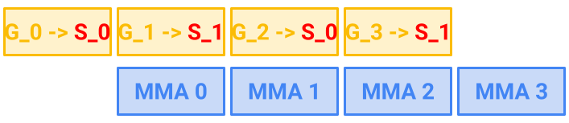
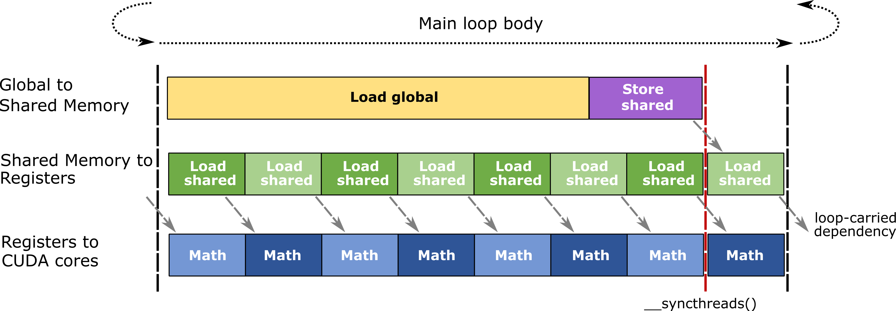

# CUTLASS 教程：使用流水化设计高效 GEMM 内核

欢迎阅读 GEMM（通用矩阵乘法）教程系列的第 2 部分。在[第 1 部分](https://research.colfax-intl.com/cutlass-tutorial-wgmma-hopper/)中，我们通过介绍 WGMMA 讨论了 GEMM 的计算侧；WGMMA 是在基于 NVIDIA® Hopper™ 架构的 GPU 上对小型矩阵块执行乘法的基础指令。本部分将把重点转向 GEMM 的内存侧。具体而言，我们将说明如何高效地把操作数张量的小块从 GPU 全局内存搬运到片上内存，再从那里将其传给 WGMMA（或其他基础 MMA 指令）。

本文要解释的核心概念，是如何组织数据流水线，以高效地向 Tensor Core 供给数据。在 GEMM 内核设计中，流水化是指通过维护多个数据缓冲区，使拷贝操作与 MMA 操作相互重叠。本文将介绍两种在 Hopper 架构上有效的流水化策略：

- warp 专门化：将 warp 分为生产者（数据传输）和消费者（计算），并让两者并发运行。
- 多阶段：在计算当前一组数据的同时，使用异步拷贝（Hopper 上的 TMA 或 Ampere 上的 `cp.async`）加载下一组数据，以遮蔽数据传输开销。在这种方式中，warp 同时承担生产者和消费者的角色。

为了保证内核的正确性，必须仔细处理数据依赖：它们决定了缓冲区何时可以被 MMA 指令读取，以及何时可以被拷贝操作填充。我们将详细说明如何利用 CUTLASS 库中的工具——尤其是 CUTLASS Pipeline 类——为流水化 GEMM 内核编写必要的同步逻辑。

随后，我们将评估流水化的性能，并展示仅利用这一优化思路，就能使半精度 Hopper GEMM 内核达到约 65% 的利用率。最后，附录将解释如何为基于 NVIDIA Ampere 架构的 GPU 编写流水化 GEMM 内核。

## 全局视角：“喂饱计算单元”

GEMM 内核主要执行两类操作：把数据拷贝到正确的内存地址，以及对它们执行乘加。前一类操作由拷贝指令完成：[Hopper 使用 TMA](https://research.colfax-intl.com/tutorial-hopper-tma/)，[Ampere 使用 `cp.async`](https://docs.nvidia.com/cuda/parallel-thread-execution/index.html#data-movement-and-conversion-instructions-cp-async)，更早的架构使用普通拷贝。自 2017 年的 [Volta 架构](https://en.wikipedia.org/wiki/Volta_(microarchitecture))起，后一类操作已成为 Tensor Core 的专属工作。

经过多代演进，Tensor Core 吞吐输入数据的能力已经极其强大。例如，H200 SXM GPU 的 Tensor Core 最高可提供 [3,958 TFLOPS](https://resources.nvidia.com/en-us-data-center-overview-mc/en-us-data-center-overview/hpc-datasheet-sc23-h200)（每秒万亿次浮点运算）。另一方面，同一款 H200 SXM GPU 的内存带宽只有 4.8 TB/s（每秒万亿字节）。数据传输速度远低于 Tensor Core 的计算速度，而且往往很难完全利用。因此，CUDA 编程——尤其是 GEMM 内核设计——的一个常见主题，就是如何以足够高的速度拷贝数据，让 Tensor Core 持续忙碌。我们把这个过程称为“喂饱计算单元”。

总体而言，“喂饱计算单元”有两种宏观策略。它们彼此互补，并作用于不同范围（网格级与线程块级）。第一种是高效的线程块调度：将计算分配给各个 CTA，以获得良好的负载均衡和更高的 L2 缓存命中率。我们将在后续文章中讨论它；目前，感兴趣的读者可以参考[线程块光栅化](https://github.com/NVIDIA/cutlass/blob/main/media/docs/efficient_gemm.md#threadblock-rasterization)和持久化内核等技术，例如 CUTLASS 中的实现。本教程聚焦的第二种策略，是让拷贝与数学运算相互重叠。具体来说，当 Tensor Core 正在对一批数据执行乘法时，应同时让拷贝单元搬运下一批数据。这样就能有效遮蔽部分拷贝延迟。这正是流水化的目标。

### 延迟、warp 与 warp 专门化

在讨论流水化的具体机制之前，先简要回顾导言中提到的两种重叠策略：多阶段与 warp 专门化。

首先，让内存拷贝与数学运算重叠既不是新概念，也非 GPU 所独有。熟悉 CPU 的读者可能会联想到[缓存预取](https://en.wikipedia.org/wiki/Cache_prefetching)：在真正需要数据之前，提前发出异步获取请求。事实上，本文讨论的流水化技术在概念上与 CPU 缓存预取相同。但是，GPU 上的预取[会消耗大量芯片硅面积](https://developer.nvidia.com/blog/boosting-application-performance-with-gpu-memory-prefetching/)，因此实现方式有所不同。

GPU 程序员创建重叠的最基本方式，是使用额外的 warp（每个 warp 由 32 个连续线程组成）。NVIDIA GPU 允许每个 SM（[流式多处理器](https://en.wikipedia.org/wiki/Thread_block_(CUDA_programming)#Streaming_multiprocessors)）同时存在大量 warp，并且可以以很小的开销在它们之间切换。当某个 warp 遇到缓慢的内存访问时，warp 调度器可以直接切换到另一个 warp。为了让 warp 调度器有更多机会遮蔽延迟，大约在 2011 年出现了名为 warp 专门化的技术 [[1, 2]](#bibliography)。在 warp 专门化设计中，一些 warp 专门负责内存获取（生产者），另一些则专门负责计算（消费者），两者之间使用命名屏障同步。这样，warp 调度器就能更容易地用计算遮蔽拷贝延迟，反之亦然。

从 Ampere 架构开始，NVIDIA 引入了 `cp.async`，使内存拷贝能够在同时执行数学运算的同一个 warp 中异步进行。具体来说，warp 可以先发出 `cp.async` 将数据加载到下一个缓冲区，然后直接对当前缓冲区执行数学运算，而不必停下来等待异步加载完成。这就不再需要依靠 warp 专门化来用计算遮蔽数据传输。多阶段内核设计正是利用了这一思路。最快的 Ampere GEMM 内核以及著名的 FlashAttention-2 都采用多阶段内核设计。

最后，在更新的 Hopper GPU 架构中，NVIDIA 引入了 TMA 异步拷贝和 warpgroup 范围的寄存器重分配等新特性。它们结合起来，使 warp 专门化在 Hopper 上变得非常有效（下文将详细说明）。尤其是，最快的 CUTLASS Hopper GEMM 内核使用了 warp 专门化。

### 流水化图解

图 1 展示了一条理论上的 `LOAD`/`MMA` 流水线。其中，`LOAD` 表示将操作数矩阵块从 GMEM 拷贝到 SMEM 的过程，`MMA` 则表示对存储在 SMEM 中的操作数矩阵块执行乘法的 Tensor Core 操作。如图所示，通过让两次 `LOAD` 与两次 `MMA` 重叠，可以节省 2 个时间单位。


图 1：将 3 次加载与 3 个 MMA 步骤流水化的示意图。

观察图 1 时会产生一个问题：`LOAD_1` 和 `LOAD_2` 应该把数据拷贝到哪里？显然，在 MMA 来得及使用先前加载的数据进行计算之前，我们不希望后续加载覆写这些数据；也不希望因等待 SMEM 重新可写而造成不必要的停顿。否则，预期的 2 个时间单位收益就无法真正实现。

一种简单的解决方案，是在 SMEM 中预留 MMA 实际需求量两倍的内存，并交替使用这两个缓冲区。该策略称为双缓冲，如图 2 所示。当然，这一思路可以推广到两个以上的交替缓冲区。更多缓冲区能提供更多操作重叠的机会，从而更高效地利用硬件，代价是消耗更多 SMEM。



图 2：使用两个交替 SMEM 阶段 S_0 和 S_1 的流水线。矩阵块交替加载到 S_0 与 S_1，并与 Tensor Core 操作重叠。请注意，全局矩阵块记为 G_1、G_2、G_3、G_4 等；它们持续递增，而不像 SMEM 阶段那样交替，因此每一步都在处理新的矩阵块。

正确且高效地实现流水线并不简单。程序员必须同时管理多个缓冲区，以及跨多个线程的异步加载调用。下一节将展示如何通过 CUTLASS 的抽象——`Pipeline` 类——实现流水化。

### CUTLASS Pipeline 抽象

CUTLASS 的异步 [`Pipeline` 类](https://github.com/NVIDIA/cutlass/blob/main/media/docs/pipeline.md)提供了一种有效抽象，用于管理涉及多个数据缓冲区和多个参与线程的拷贝与计算。这些类包括 `PipelineAsync`、`PipelineTmaAsync` 和 `PipelineTransactionAsync`；下文用“`Pipeline`”统称它们。

首先从高层视角说明 CUTLASS `Pipeline` 如何组织数据流水线。设 `buffers` 是一个拥有 `N` 个阶段的共享内存缓冲区。我们希望在向缓冲区写数据的生产者（例如 TMA）与数据就绪后使用它的消费者（例如 WGMMA）之间实现同步。

屏障。为了在生产者与消费者之间同步各个缓冲阶段，`Pipeline` 遵循标准的获取/释放模型，使用锁管理对缓冲区的访问。设 `full_barrier` 和 `empty_barrier` 为两个大小均为 `N` 的屏障对象数组。这些屏障对象拥有一个初始值为 0、在 0 和 1 之间翻转的阶段位。

具体而言，这些屏障是常驻于 SMEM 的 [mbarrier](https://docs.nvidia.com/cuda/parallel-thread-execution/index.html#parallel-synchronization-and-communication-instructions-mbarrier) 对象。mbarrier 初始化时同时设置上述阶段位和到达计数。它支持 arrive-on 与 wait 操作，并在到达计数达到阈值时翻转阶段。重要的是，这些屏障对象的值可以且应当对所有线程可见。

线程局部流水线状态。`PipelineState` 类是一个线程局部枚举器，用来跟踪线程当前的索引和阶段；阶段数 `N` 作为模板参数传入。索引在模 `N` 意义下取整数值，阶段值则为 0 或 1。`PipelineState` 还[重载了](https://github.com/NVIDIA/cutlass/blob/be60a0b27204078dc0f3f1d6ed4a95cdb2114111/include/cutlass/pipeline/sm90_pipeline.hpp#L140) `++` 运算符：索引按模 `N` 递增，当它回到 0 时翻转阶段值。

同步。下面说明如何使用屏障对象和线程局部流水线状态同步生产者与消费者。为避免混淆，需要区分“生产者操作”与发出该操作的“生产者线程”，因为两者可能已解耦（例如 TMA）。首先，生产者操作翻转 `full_barrier[i]` 的阶段，表示它已填充缓冲区的第 `i` 个阶段，消费者线程现在可以读取该阶段。类似地，消费者线程翻转 `empty_barrier[i]` 的阶段，表示它们已使用完第 `i` 个阶段，生产者现在可以写入该阶段。

只要通过到达计数机制完成，我们并不关心生产者操作或消费者线程究竟如何翻转 SMEM 中的阶段位。例如，可以由所有消费者线程共同增加到达计数，也可以从每个 warp 中选出一个消费者线程执行该操作。

最后，无论是消费者还是生产者，每个线程都会跟踪一个用于与屏障阶段比较的阶段值。同时承担消费者和生产者角色的线程，需要分别跟踪两个阶段。随着内核主循环不断迭代，线程的这些“内部”阶段也必须翻转。

四个流水线方法。设 `pipeline` 是一个使用 `full_barrier` 和 `empty_barrier` 指针初始化的 `Pipeline` 实例，`pipe_state` 是一个 `PipelineState` 实例。`pipeline` 可调用以下四个关键方法：

- `pipeline.producer_acquire(pipe_state)`：阻塞调用线程，直到 `empty_barrier[pipe_state.index()]` 的阶段相对于 `pipe_state.phase()` 发生翻转。
- `pipeline.producer_commit(pipe_state)`：通知 `full_barrier[pipe_state.index()]` 增加其到达计数。
- `pipeline.consumer_wait(pipe_state)`：阻塞调用线程，直到 `full_barrier[pipe_state.index()]` 的阶段相对于 `pipe_state.phase()` 发生翻转。
- `pipeline.consumer_release(pipe_state)`：通知 `empty_barrier[pipe_state.index()]` 增加其到达计数。

在对阻塞方法 `producer_acquire` 和 `consumer_wait` 的描述中，“相对于 `pipe_state` 的阶段翻转”是指：例如，当屏障当前阶段为 0 时，若 `pipe_state` 的阶段也为 0，该方法会阻塞；若为 1，则不会阻塞。

按上述定义，方法对（`producer_acquire`, `consumer_release`）与（`producer_commit`, `consumer_wait`）在功能上完全对称。但如果使用的 `Pipeline` 类是 `PipelineTmaAsync`，`full_barrier` 会封装为 `cutlass::arch::ClusterTransactionBarrier` 实例，其信号机制由 TMA 加载方法自身通过增加事务计数来处理。在这种情况下，`producer_commit` 实际上不执行任何操作；下文会回到这一点。不过，当伪代码中省略 TMA 拷贝时，我们仍会像下面这样写出 `producer_commit`。

综合以上内容，下面的伪代码展示了四个流水线方法的用法：

```
using PipelineState = typename cutlass::PipelineState<N>;
// 由于缓冲区初始为空，我们将 smem_pipe_write 初始化为相反阶段
// （即从 1 而不是 0 开始）。
PipelineState smem_pipe_write = cutlass::make_producer_start_state<Pipeline>();
PipelineState smem_pipe_read;
for (int i = 0; i < total_steps; ++i) {
  pipeline.producer_acquire(smem_pipe_write);
  // 获取数据（例如 TMA、cp.async 等）
  pipeline.producer_commit(smem_pipe_write);
  ++smem_pipe_write;
  pipeline.consumer_wait(smem_pipe_read);
  // 执行计算负载（例如 WGMMA）
  pipeline.consumer_release(smem_pipe_read);
  ++smem_pipe_read;
}
```

上述代码片段很适合用来说明生产者/消费者的获取与释放模式。读者可以在跟踪所有相关状态的同时，手动演算循环的前几步，并将这段伪代码与前面对同步机制的详细描述对应起来。

但是，这段代码展示的是串行执行流：生产者和消费者操作从不并发运行，因此实际上并不实用。在有效的流水化工作负载中，生产者与消费者必须相互重叠。下面讨论实现这一目标的一种方法：多阶段内核设计。

### 多阶段内核设计

下面使用面向 [TMA](https://research.colfax-intl.com/tutorial-hopper-tma/) 的专用 `Pipeline` 类 `PipelineTmaAsync`，为 Hopper GEMM 内核创建一条让 TMA 与 [WGMMA](https://research.colfax-intl.com/cutlass-tutorial-wgmma-hopper/) 重叠的两阶段流水线。该内核使用 128 个线程（即 1 个 warpgroup）启动。我们假定读者已熟悉 CUTLASS 中 TMA 和 WGMMA 的语法；前两篇文章已详细讨论这些内容。因此，这里省略传入 `cute::copy` 和 `cute::gemm` 的张量准备过程。

```
using MainloopPipeline = typename cutlass::PipelineTmaAsync<2>;
using PipelineState = typename cutlass::PipelineState<2>;
typename MainloopPipeline::Params params;
// 每个阶段由 TMA 加载传输的字节数（A 和 B）
params.transaction_bytes = TmaTransactionBytes;
params.role = MainloopPipeline::ThreadCategory::ProducerConsumer;
params.is_leader = threadIdx.x == 0;
params.num_consumers = 128;
// 本示例不考虑集群
auto cluster_shape = Shape<_1,_1,_1>{};
// pipeline_storage 是 cutlass::PipelineTmaAsync<2>::SharedStorage 的实例
// 其成员包括 full_barrier 和 empty_barrier
// 它位于管理 SMEM 中各对象的 SharedStorage 结构内
MainloopPipeline pipeline(shared_storage.pipeline_storage, params, cluster_shape);
__syncthreads();
PipelineState smem_pipe_write =
    cutlass::make_producer_start_state<MainloopPipeline>();
PipelineState smem_pipe_read;
// 准备 GEMM 张量
// ...
// 由领导线程发出第一次 TMA 加载
if(threadIdx.x == 0) {
  pipeline.producer_acquire(smem_pipe_write);
  BarrierType *tmaBar = pipeline.producer_get_barrier(smem_pipe_write);
  // smem_pipe_write.index() == 0
  copy(tma_load_a.with(*tmaBar, 0), tAgA(_,0), tAsA(_,0));
  copy(tma_load_b.with(*tmaBar, 0), tBgB(_,0), tBsB(_,0));
  ++smem_pipe_write;
}
for (int i = 0; i < k_tile_count - 1; ++i) {
  // 只有领导线程发出 TMA 加载
  if(threadIdx.x == 0) {
    pipeline.producer_acquire(smem_pipe_write);
    BarrierType *tmaBar = pipeline.producer_get_barrier(smem_pipe_write);
    auto write_stage = smem_pipe_write.index();
    copy(tma_load_a.with(*tmaBar, 0), tAgA(_,i+1), tAsA(_,write_stage));
    copy(tma_load_b.with(*tmaBar, 0), tBgB(_,i+1), tBsB(_,write_stage));
    ++smem_pipe_write;
  }
  // 对前一次迭代已完成加载的数据进行计算
  pipeline.consumer_wait(smem_pipe_read);
  auto read_stage = smem_pipe_read.index();
  // WGMMA
  warpgroup_arrive();
  gemm(tiled_mma, tCrA(_,_,_,read_stage), tCrB(_,_,_,read_stage), tCrC);
  warpgroup_commit_batch();
  warpgroup_wait<0>();
  pipeline.consumer_release(smem_pipe_read);
  ++smem_pipe_read;
}
// 处理最后一次计算迭代
pipeline.consumer_wait(smem_pipe_read);
auto read_stage = smem_pipe_read.index();
warpgroup_arrive();
gemm(tiled_mma, tCrA(_,_,_,read_stage), tCrB(_,_,_,read_stage), tCrC);
warpgroup_commit_batch();
warpgroup_wait<0>();
pipeline.consumer_release(smem_pipe_read);
// 将累加器写出的尾处理
axpby(alpha, tCrC, beta, tCgC);
```

在主循环的每次迭代中，第 `(i+1)` 次 TMA 加载被异步发出，同时执行第 `i` 次 WGMMA 计算。请注意，`smem_pipe_write` 与 `smem_pipe_read` 之间始终相差一个阶段。

请注意，这段伪代码中并未出现我们在 TMA 文章中使用的 `cute::set_barrier_transaction_bytes` 方法（或其等价方法 `cutlass::arch::arrive_and_expect_tx`）。它的功能由 `PipelineTmaAsync` 类的 `producer_acquire` 承担。该方法[在内部执行以下操作](https://github.com/NVIDIA/cutlass/blob/be60a0b27204078dc0f3f1d6ed4a95cdb2114111/include/cutlass/pipeline/sm90_pipeline.hpp#L401)，其中 `stage` 和 `phase` 分别是传入 `PipelineState` 的索引和阶段：

```
if (barrier_token != BarrierStatus::WaitDone) {
   empty_barrier_ptr_[stage].wait(phase);
}
if (params_.is_leader) {
   full_barrier_ptr_[stage].arrive_and_expect_tx(params_.transaction_bytes);
}
```

此外，我们以 `smem_pipe_write` 为参数调用 `producer_get_barrier`，取得指向 `full_barrier[smem_pipe_write.index()]` 的指针。`cute::copy` 调用中的 TMA `TiledCopy` 对象 `tma_load_a` 和 `tma_load_b` 需要该指针。

这样，`cute::copy` 调用就与流水线的 mbarrier 对象 `full_barrier` 建立了关联。随后可以利用 TMA 基于事务计数的完成机制，通知消费者缓冲区已经就绪，不再需要由流水线对象自身调用 `producer_commit`。这就是 CUTLASS 将 `PipelineTmaAsync` 的 `producer_commit` 实现为空操作的原因。

这种流水线结构可以让数据传输与计算重叠，从而真正利用异步操作遮蔽延迟。本示例使用了 TMA，但 Ampere 架构上也可以借助 `cp.async` 实现类似技术，[附录](#appendix)将详细讨论。不过，在 Hopper 架构上，有时更适合使用 warp 专门化而不是多阶段设计。

### warp 专门化

在多阶段内核中，每个 warp 同时承担生产者和消费者角色，两种角色之间的切换由 `PipelineState` 抽象管理，TMA 加载的异步性则允许两类操作重叠。另一种策略是 warp 专门化：为不同 warp 分配不同角色，使生产者 warp 完全专注于内存拷贝，消费者 warp 完全专注于计算。如上所述，warp 调度器可通过在两类 warp 之间切换来遮蔽延迟。与多阶段内核不同，warp 专门化并不从根本上依赖异步执行，但在实践中仍能从异步执行中显著受益。

对于本文的 GEMM，生产者 warp 使用 TMA 将数据从全局内存加载到共享内存，消费者 warp 则使用 WGMMA 执行分块 GEMM。值得注意的是，在这个简化设置中，两类 warp 内部的执行流都是串行的；也就是说，TMA 和 WGMMA 指令本身并没有在同一 warpgroup 内重叠。更复杂的内核调度可以利用 TMA 和 WGMMA 的异步性，让它们在 warpgroup 内与其他指令重叠，[FlashAttention-3](https://research.colfax-intl.com/flashattention-3-fast-and-accurate-attention-with-asynchrony-and-low-precision/) 就是一个例子。

warp 专门化对 Hopper 架构尤其有吸引力，主要有三个原因：

- TMA 比早期拷贝操作消耗更少的寄存器。
- WGMMA 可以直接从共享内存取得操作数，因此消费者 warp 无需自行执行内存加载。
- Hopper 允许通过 [`setmaxnreg`](https://docs.nvidia.com/cuda/parallel-thread-execution/index.html#miscellaneous-instructions-setmaxnreg) 指令，手动以 warpgroup 为单位分配或释放寄存器。因此，可以把更大比例的寄存器分配给通常需求更高的消费者 warp。

进一步解释最后一点：每个 SM 只拥有有限数量的寄存器。在 Hopper 之前的架构中，内核启动时每个 warp 都会分到固定且相同数量的寄存器。对于每个 warp 执行相同工作的多阶段流水线，这没有问题；但对 warp 专门化模式而言，通常会造成浪费。只负责加载数据的生产者 warp，通常比执行数学运算的消费者 warp 需要更少的寄存器，使用 TMA 时尤其如此。对寄存器密集型工作负载来说，利用这些原本浪费的寄存器，可能允许每个 SM 容纳更多 warp，或避免寄存器溢出。

下面给出一段 warp 专门化代码。与之前一样，`Pipeline` 类封装了构建 warp 专门化内核的复杂性。

```
// 创建流水线和阶段迭代器
using MainloopPipeline = typename cutlass::PipelineAsync<2>;
using PipelineState = typename cutlass::PipelineState<2>;
// 生产者 warp
if (isProducerWarp(threadIdx.x)) {
  // 应只有一个线程调用 TMA
  if(isTMAThread(threadIdx.x)) {
    PipelineState smem_pipe_write =
      cutlass::make_producer_start_state<MainloopPipeline>();
    for (...) {
      pipeline.producer_acquire(smem_pipe_write);
      copy(...); // TMA
      ++smem_pipe_write;
    }
  }
}
// 消费者 warp
else {
  PipelineState smem_pipe_read;
  for (...) {
    pipeline.consumer_wait(smem_pipe_read);
    // WGMMA
    pipeline.consumer_release(smem_pipe_read);
    ++smem_pipe_read;
  }
  // 尾处理
}
```

该结构与之前讨论的基础流水线相似，但这次外层增加了一个条件分支，将工作负载分成生产者 warp 和消费者 warp。尾处理应由消费者 warp 执行，因为它需要写出保存在消费者线程寄存器中的累加器。

可以使用以下代码判断某个线程属于哪个 warp 和 warpgroup。

```
int warp_group_idx = __shfl_sync(0xffffffff, threadIdx.x / 128, 0);
int warp_idx_in_warpgroup = __shfl_sync(0xffffffff, (threadIdx.x / 32) % 4, 0);
int warp_group_thread_idx = threadIdx.x % 128;
```

上述代码还使用了 `__shfl_sync` 操作，它会在整个 warp 中广播一个值（详细信息见[相关文档](https://developer.nvidia.com/blog/using-cuda-warp-level-primitives/)），以确保 warp 中所有线程获得相同的值。

现在回到 GEMM。本系列[第 1 部分](https://research.colfax-intl.com/cutlass-tutorial-wgmma-hopper/)讨论的 WGMMA 指令以 warpgroup 为单位组织，因此生产者和消费者也按 warpgroup 组织。我们使用 TMA 流水线，以便生产者一侧使用 TMA。

对于 2 个阶段和 2 个 warpgroup，首先如下修改 warp 专门化内核的流水线初始化：

```
using MainloopPipeline = typename cutlass::PipelineTmaAsync<2>;
using PipelineState = typename cutlass::PipelineState<2>;
typename MainloopPipeline::Params params;
params.transaction_bytes = TmaTransactionBytes;
const int producerWarpGroupId = 0;
if (warp_group_idx == producerWarpGroupId)
  params.role = MainloopPipeline::ThreadCategory::Producer;
else
  params.role = MainloopPipeline::ThreadCategory::Consumer;
params.is_leader = warp_group_thread_idx == 0;
params.num_consumers = 128;
auto cluster_shape = make_shape(Int<1>{},Int<1>{},Int<1>{});
// 创建流水线
MainloopPipeline pipeline(shared_storage.pipeline_storage, params, cluster_shape);
```

第 12 行值得特别强调：尽管 `params.num_consumers` 仍等于 128，现在它只计数消费者 warpgroup 中的 128 个线程，而不是全部 256 个线程。

下面进入主循环。总体结构与最初的代码示例相同，但生产者一侧存在几处差异：

```
// 拥有 1 个消费者 warpgroup 的 Hopper GEMM 示例值
using LowerRegisterCount = Int<40>;
using HigherRegisterCount = Int<256>;
if (warp_group_idx == producerWarpGroupId) {
  cutlass::arch::warpgroup_reg_dealloc<LowerRegisterCount{}>();
  int lane_predicate = cute::elect_one_sync();
  if (warp_idx_in_warpgroup == 0 && lane_predicate) {
    PipelineState smem_pipe_write =
      cutlass::make_producer_start_state<MainloopPipeline>();
    for (...) {
      pipeline.producer_acquire(smem_pipe_write);
      copy(...); // TMA
      ++smem_pipe_write;
    }
  }
} else { // 消费者 warpgroup
  cutlass::arch::warpgroup_reg_alloc<HigherRegisterCount{}>();
  PipelineState smem_pipe_read;
  for (...) {
    pipeline.consumer_wait(smem_pipe_read);
    gemm(...); // WGMMA
    pipeline.consumer_release(smem_pipe_read);
    ++smem_pipe_read;
  }
  // 写出累加器的尾处理
  axpby(...);
}
```

在第 6 行和第 18 行，我们通过 [CUTLASS 调用](https://github.com/NVIDIA/cutlass/blob/3a8c01a18b24c35b216922481ac762496720a99d/include/cutlass/arch/reg_reconfig.h)手动分配或释放多余寄存器。该调用最终会执行 PTX 基础指令 [`setmaxnreg`](https://docs.nvidia.com/cuda/parallel-thread-execution/index.html#miscellaneous-instructions-setmaxnreg)，调整分配给 warpgroup 中各线程的寄存器。如文档所述，`warpgroup_reg_dealloc<M>()` 释放额外寄存器，将每线程最大寄存器数降到 `M`；`warpgroup_reg_alloc<N>()` 则请求额外寄存器，将每线程最大寄存器数提高到 `N`。

具体寄存器数量取决于算法和硬件约束。在 Hopper 架构中，一个线程最多可拥有 255 个寄存器，`setmaxnreg` 可设为 24 到 256（含两端）之间的 8 的倍数。通常，Hopper GEMM warp 专门化内核宜让一个 CTA 占据整个 SM。因此，应尽量选择满足以下条件的寄存器数：（a）向发出 TMA 的生产者 warpgroup 分配尽可能少的寄存器；（b）尽量利用[每个 SM 的 64K 寄存器文件](https://docs.nvidia.com/cuda/hopper-tuning-guide/index.html#occupancy)。例如，对 1 个生产者 warpgroup 和 2 个消费者 warpgroup，24/240/240 的分配通常有效（总和为 504 < 512，且 512*128 = 64*1024）；对 1 个生产者和 3 个消费者 warpgroup，则可使用 32/160/160/160。如果尝试分配的寄存器总数超过寄存器文件大小，程序会崩溃。

此外，必须确保一个 warpgroup 中始终只有一个线程调用 TMA。示例代码只让第一个 warp 参与，并使用 `elect_one_sync` 选出一个线程负责 TMA 调用。该代码面向 2 个 warpgroup，但只需少量修改，也可用于更多 warpgroup 和更多阶段。

应通过仔细的内核性能剖析来选择 warpgroup 数和阶段数。一般而言，更多阶段和 warpgroup 意味着更多并行与重叠机会，但也会消耗更多资源。具体来说，更多阶段要求用更多 SMEM 作为缓冲区，更多 warpgroup 则会提高寄存器压力。

## 性能

我们以 [CUTLASS Hopper GEMM 教程代码](https://github.com/NVIDIA/cutlass/blob/main/examples/cute/tutorial/wgmma_sm90.cu)为基础，实现了采用半精度（FP16）数据类型的多阶段 GEMM 内核和 warp 专门化 GEMM 内核。我们还修改了代码，使其支持 FP32 累加，并使用 TMA 存储写出结果。随后针对 MxNxK = 8192x8192x8192 调优两个版本，并为 FP16 累加和 FP32 累加选择不同的矩阵块大小。所选矩阵块大小和阶段数如下（bMxbNxbK 可整除 MxNxK）：

- FP16 累加：bM = 256，bN = 256，bK = 96，2 个阶段，4 个 MMA warpgroup；集群大小为 (1, 2, 1)。
- FP32 累加：bM = 256，bN = 192，bK = 128，2 个阶段，2 个 MMA warpgroup；集群大小为 (1, 2, 1)。

我们使用转换为 FP16 的随机浮点数初始化矩阵，并记录了以下 TFLOP/s（10 次迭代，取 5 次测量的平均值）：

- FP16 累加：多阶段 531，warp 专门化 536。
- FP32 累加：多阶段 477，warp 专门化 485。

请注意，H100 PCIe GPU 上稠密半精度 MMA 的理论峰值性能为 750 TFLOP/s，因此在标准的 FP32 累加设置下，我们达到了理论峰值的约 65%。多阶段和 warp 专门化内核均可在 [Colfax 的 GitHub](https://github.com/ColfaxResearch/cfx-article-src/tree/master/pipeline-gemm) 上获取。

需要提醒的是，CUTLASS Hopper GEMM 教程代码使用随机选取的 ±1 初始化矩阵，因此会报告不切实际的高性能，详见[相关文章](https://www.thonking.ai/p/strangely-matrix-multiplications)。例如，当矩阵使用 ±1 初始化时，FP16 累加多阶段内核的性能会从约 530 虚高到约 630 TFLOP/s。

作为对比，我们使用 CUTLASS profiler 和 10 次性能剖析迭代测得的最快 CUTLASS FP16 Hopper GEMM 内核达到 630 TFLOP/s（约 84% 利用率）。（注：本文较早版本报告的利用率较低，约为 74%；原因是当时使用了过多的性能剖析迭代，导致 350W TDP 的 H100 PCIe GPU 因温度发生节流。）该数值由以下内核获得：

```
cutlass3x_sm90_tensorop_s64x256x16gemm_f16_f16_f32_void_f16_128x256x64_2x1x1_0_tnn_align8_warpspecialized_cooperative_epi_tma
```

该 CUTLASS 内核采用[相关文档](https://github.com/NVIDIA/cutlass/blob/main/media/docs/efficient_gemm.md#warp-specialization)所述的“Warp-Specialized Persistent Cooperative”设计。我们预期，实现线程块光栅化，以及可在 CTA 之间重叠序言和尾处理的持久化内核后，当前流水化 GEMM 内核与最快 GEMM 内核的差距将在很大程度上被弥合。对于更非典型的问题几何形状，Stream-K 负载均衡也会成为影响因素。在这个方形示例中，Stream-K CUTLASS 内核的性能几乎一样好，达到 625 TFLOP/s。

下面讨论 warpgroup 级寄存器重分配对 warp 专门化内核的意义。要查看寄存器用量，可使用标志 `-Xptxas=--verbose` 编译内核。（注：该标志无法与 `--generate-code` 一起使用，应改用 `--gencode`。）启用寄存器重分配后，可以看到寄存器用量由所使用的 warpgroup 数量固定。例如，当总共使用 3 个 warpgroup 时：

```
    0 bytes stack frame, 0 bytes spill stores, 0 bytes spill loads
ptxas info    : Used 168 registers
```

总共使用 4 个 warpgroup 时：

```
    0 bytes stack frame, 0 bytes spill stores, 0 bytes spill loads
ptxas info    : Used 128 registers
```

请注意，168*3 = 504，128*4 = 512；生产者和消费者寄存器数之和必须小于或等于这些数值。这也是 32/240/240 分配无法与 3 个 warpgroup 配合使用的原因。

另一方面，如果初始寄存器用量本来就很低，寄存器重分配可能不会产生实际影响。例如，对 FP16 累加移除寄存器重分配后，可观察到：

```
    0 bytes stack frame, 0 bytes spill stores, 0 bytes spill loads
ptxas info    : Used 90 registers
```

重新测量时间也表明这一变化没有影响。但对 FP32 累加，可观察到：

```
    2784 bytes stack frame, 4764 bytes spill stores, 4760 bytes spill loads
ptxas info    : Used 168 registers
```

此时重新测量，性能只有约 21 TFLOP/s，属于灾难性的性能损失。不过，将调优参数改为（bM = 128，bN = 256，bK = 128，2 个阶段，2 个 MMA warpgroup，集群 (2,1,1)）后，在没有溢出、也没有寄存器重分配的情况下，仍能获得接近的性能（460 TFLOP/s）。

最后，对 FlashAttention-3 这类融合的 warp 专门化内核，由于多个累加器保存在寄存器中，为避免过度溢出，寄存器重分配就成为必需。

## 结论

本文全面介绍了流水化技术。我们说明了它如何通过重叠内存拷贝和数学运算来遮蔽延迟，以及这为何对良好性能至关重要。随后介绍了两种流水化设计：

- 多阶段：在计算当前一组数据的同时，使用异步拷贝（Hopper 上的 TMA 或 Ampere 上的 `cp.async`）加载下一组数据，以遮蔽数据传输。warp 同时承担生产者和消费者角色。
- warp 专门化：将 warp 分为生产者和消费者，并让它们并发运行。生产者或消费者操作还可以是异步的（例如 Hopper 上的 TMA 和 WGMMA）。

我们详细介绍了如何使用 CUTLASS Pipeline 类管理在 Hopper GEMM 内核中实现这两种流水化策略所需的同步逻辑，并对比了 GEMM 示例中的两类流水线。尽管两者在简化设置中的性能大致相同，实际上性能最好的 Hopper GEMM 内核使用 warp 专门化，[CUTLASS profiler](https://github.com/NVIDIA/cutlass/blob/main/media/docs/profiler.md) 的结果就展示了这一点。

本教程第 3 部分将讨论整体内核调度策略，包括线程块光栅化、持久化内核，以及较新的 [Stream-K GEMM](https://arxiv.org/abs/2301.03598)。

<a id="appendix"></a>

## 附录：Ampere GEMM 的流水化

本文主体讨论了使用 TMA 执行内存传输、使用 WGMMA 执行计算的流水化。这两项特性都由 Hopper 架构（`sm90`）引入，因此无法在早期架构上使用。要在早期架构中实现类似范式，需要额外步骤。为了保持完整性，本附录还讨论如何在 Ampere 架构（`sm80`）上实现 GEMM 流水化，具体研究 [CUTLASS `sm80` 示例](https://github.com/NVIDIA/cutlass/blob/main/examples/cute/tutorial/sgemm_sm80.cu)的实现。与正文中的 `sm90` 代码相比，Ampere 实现存在两个额外复杂点：

- Ampere 具有将数据从 GMEM 异步加载到 SMEM 的指令（[`cp.async`](https://docs.nvidia.com/cuda/parallel-thread-execution/index.html#data-movement-and-conversion-instructions-cp-async)），但无法按 warp 控制寄存器分配。这不利于使用 warp 专门化，而更适合编写让每个 warp 同时承担生产者和消费者角色的多阶段流水线。
- WGMMA 的两个操作数都可直接来自 SMEM，但这里的 MMA 操作数必须从寄存器（RMEM）加载。因此，在 MMA 运行前还需要用额外指令将数据从 SMEM 加载到 RMEM。此外，还可将 SMEM→RMEM 加载流水化以潜在地提高性能，但这会增加整体设计的复杂性。



图 3：Ampere GEMM 使用两层嵌套流水线遮蔽延迟。图片来自 [CUTLASS 文档](https://github.com/NVIDIA/cutlass/blob/main/media/docs/efficient_gemm.md)。

图 3 来自 CUTLASS 文档，展示了内核的整体结构。（该图早于 Ampere，因此有一个细节不符合 Ampere：使用 `cp.async` 时，“加载全局内存”与“存储到共享内存”并非两个独立阶段，而是一条机器指令。）主循环每次迭代都使用 Ampere `cp_async` 指令，发起将后续矩阵块从 GMEM 加载到 SMEM 的异步操作，并使之与当前矩阵块上的工作重叠。这条外层流水线与为 Hopper 构建的多阶段流水线类似。内层展开循环则依次将矩阵块的各个片段从 SMEM 加载到 RMEM，并对其执行数学运算。尽管这些操作是同步的，仍可通过一种来自 CPU 计算的技术来降低延迟；该技术称为“[软件流水化](https://en.wikipedia.org/wiki/Software_pipelining)”，虽然在当前语境中这个名称容易混淆。

先检视外层流水线。它在主循环之前以一个预取阶段开始：

```
TiledCopy copyA = make_tiled_copy(Copy_Atom<SM80_CP_ASYNC_CACHEALWAYS<TA>, TA>{},
                                    Layout<Shape<_32,_8>,Stride<_8,_1>>{}, // Thr 布局 32x8，K-major
                                    Layout<Shape< _1,_1>>{});              // Val 布局 1x1
TiledCopy copyB = make_tiled_copy(Copy_Atom<SM80_CP_ASYNC_CACHEALWAYS<TB>, TB>{},
                                    Layout<Shape<_32,_8>,Stride<_8,_1>>{}, // Thr 布局 32x8，K-major
                                    Layout<Shape< _1,_1>>{});              // Val 布局 1x1
// 剩余待拷贝矩阵块数
int k_tile_count = size<3>(tAgA);
// 当前要从 GMEM 读取的矩阵块索引
int k_tile_next = 0;
// 初始加载：除最后一条管线外，为其余所有管线启动异步加载
for (int k_pipe = 0; k_pipe < K_PIPE_MAX-1; ++k_pipe) {
  copy(copy_a, tAgA(_,_,_,k_tile_next), tAsA(_,_,_,k_pipe));
  copy(copy_b, tBgB(_,_,_,k_tile_next), tBsB(_,_,_,k_pipe));
  cp_async_fence();
  --k_tile_count;
  if (k_tile_count > 0) { ++k_tile_next; }
}
// 等待第一个矩阵块就绪后再继续
cp_async_wait<K_PIPE_MAX-2>();
__syncthreads();
```

这些拷贝通过 [CUTLASS 的 `cp_async` API](https://github.com/NVIDIA/cutlass/blob/main/include/cutlass/arch/memory_sm80.h) 异步发出；该 API 封装了 [PTX `cp.async` 指令](https://docs.nvidia.com/cuda/parallel-thread-execution/index.html#data-movement-and-conversion-instructions-cp-async)。下面解释此处使用的方法：

- `cp_async_fence()` 将使用 `cp.async` 的拷贝分成“提交组”。在本示例中，每个提交组从 A 和 B 各拷贝一个矩阵块。
- `cp_async_wait<N>()` 指示 CTA 等待，直到最近启动的提交组中最多只有 N 个仍在执行。本示例启动了 `K_PIPE_MAX-1` 个提交组，因此 `cp_async_wait<K_PIPE_MAX-2>()` 等价于等待最早的提交组完成，即等待 A 和 B 的第 0 个矩阵块拷贝完成。其他提交组可能先于最早的组完成，但该调用等待的是最早的组。

以下是内核主循环。为了聚焦 GMEM→SMEM 流水线，这里省略了 SMEM→RMEM 加载和计算：

```
while (k_tile_count > -(K_PIPE_MAX-1)) {
  // 处理分块 GEMM 中的一个矩阵块
  for (int k_block = 0; k_block < K_BLOCK_MAX; ++k_block) {
    // 启动下一个矩阵块的异步拷贝
    if (k_block == 0) {
      copy(copy_a, tAgA(_,_,_,k_tile_next), tAsA(_,_,_,smem_pipe_write));
      copy(copy_b, tBgB(_,_,_,k_tile_next), tBsB(_,_,_,smem_pipe_write));
      cp_async_fence();
      --k_tile_count;
      if (k_tile_count > 0) { ++k_tile_next; }
  }
  // 将矩阵块从 SMEM 加载到 RMEM（已省略）
  if (k_block == K_BLOCK_MAX-1) {
    // 等待之前的拷贝完成
    cp_async_wait<K_PIPE_MAX-2>();
    __syncthreads();
  }
  // 对矩阵块执行计算（已省略）
}
```

该轮廓与预取阶段基本相同。外层循环每个阶段开始时都会启动另一次异步拷贝；阶段结束时，CTA 等待下一个必需矩阵块拷贝完成。接近计算尾声时，流水线已没有更多 GMEM 矩阵块可供拷贝。代码使用 `k_tile_count <= 0` 表示该状态，并发出不会被使用的占位拷贝。

请注意，该示例没有使用 CUTLASS `Pipeline` 类，因为此处无需使用 mbarrier 对象管理同步。示例改为手动设置同步，在数据缓冲区之间切换；内层循环遍历缓冲区的大小，以跟踪应使用哪个缓冲区。尽管具体细节不同，整体结构与正文的简单流水线示例完全一致。

最后转向包含 SMEM→RMEM 加载和 MMA 的内层循环。SMEM→RMEM 传输明显快于 GMEM→SMEM，但其访问延迟仍足以使“加载与数学运算重叠”带来收益。这里的概念与 GMEM→SMEM 相同：准备额外缓冲区（寄存器）并向其发出加载指令，同时计算在其他寄存器上运行。但这里不使用显式异步调用，而是依赖软件流水化。

软件流水化通过消除连续高延迟指令之间的依赖，尽量提高硬件利用率。对本例而言，如果 SMEM→RMEM 加载与计算在硬件和数据两方面都相互独立，[它们就可并发运行](https://forums.developer.nvidia.com/t/how-does-the-lsu-load-store-unit-execute-load-store-instructions-in-the-ampere-architecture/273699)。SMEM→RMEM 加载由 LSU（加载/存储单元）处理，计算则由计算单元（例如 Tensor Core）处理。虽然没有公开文档说明，但一般认为这些硬件部件可并发运行，因此硬件依赖不是问题。但数据依赖可能成为问题。

考虑以下代码：

```
for (i=0; i<N-1; i++) {
  load2rmem(i);
  compute(i);
}
```

问题在于，`compute(i)` 需要使用 `load2rmem(i)` 加载的数据，所以只有在后者完成后才能开始。这个数据依赖使两个操作必须串行。因此，与 GMEM→SMEM 流水线一样，我们改为加载下一个缓冲区。

```
load2rmem(0);
for (i=0;i<N-1; i++) {
  load2rmem(i+1);
  compute(i);
}
compute(N-1);
```

此时，加载与计算之间既没有数据依赖，也没有硬件依赖，因此可并发执行。`sm80` CUTLASS 示例使用以下代码实现：

```
CUTE_UNROLL
for (int k_block = 0; k_block < K_BLOCK_MAX; ++k_block) {
  // 为 k_block+1 将 A、B 从 SMEM 加载到寄存器
  auto k_block_next = (k_block + Int<1>{}) % K_BLOCK_MAX;
  copy(tCsA_p(_,_,k_block_next), tCrA(_,_,k_block_next));
  copy(tCsB_p(_,_,k_block_next), tCrB(_,_,k_block_next));
  // 对 k_block 执行线程级寄存器 GEMM
  gemm(mma, tCrA(_,_,k_block), tCrB(_,_,k_block), tCrC);
}
```

此处，`tCrA` 和 `tCrB` 都是由 CUTLASS `make_fragment` 调用创建的 RMEM 引用。拷贝指令与 GEMM 访问不同的 `k_block` 值，因此可并发运行。

## 参考文献

[1] Michael Bauer, Henry Cook, and Bruce Khailany. 2011. “CudaDMA: optimizing GPU memory bandwidth via warp specialization.” In Proceedings of 2011 International Conference for High Performance Computing, Networking, Storage and Analysis (SC ’11). Association for Computing Machinery, New York, NY, USA, Article 12, 1–11. [https://doi.org/10.1145/2063384.2063400](https://doi.org/10.1145/2063384.2063400)

[2] Michael Bauer, Sean Treichler, and Alex Aiken. 2014. “Singe: leveraging warp specialization for high performance on GPUs”. In Proceedings of the 19th ACM SIGPLAN symposium on Principles and practice of parallel programming (PPoPP ’14). Association for Computing Machinery, New York, NY, USA, 119–130. [https://doi.org/10.1145/2555243.2555258](https://doi.org/10.1145/2555243.2555258)

1. 您提到：“…当然，我们可以将它推广到两个以上的交替缓冲区。这样做会创造更多重叠机会，以更高效地利用可用硬件，代价是使用更多 SMEM…”。能否解释一下这为什么可行？我想，是否因为增加阶段数会增加无依赖候选指令的数量？

  1. 你好！抱歉这么晚才回复。你的理解是正确的：更多阶段意味着调度器有更多可选项。实际上，这是一个可能有帮助、也可能没有帮助的调优参数。对本文的示例而言，超过 2 个阶段并无帮助，因此保持 2 个阶段以尽量节省 SMEM 更合适。
但如果使用 CUTLASS profiler，FP16 性能最好的配置使用了 7 个阶段。NVIDIA Nsight profiler 也显示，计算吞吐量和内存吞吐量都有明显提高。
2. 你好，我很喜欢这篇文章 :)
能否解释一下，为什么你们把整个 warpgroup 用作生产者，而不是只使用一个 warp？从分配的寄存器数量来看，只使用一个 warp 不是更高效吗？
谢谢。
  1. Pavlo，你好，
我们使用生产者 warpgroup，是为了利用 Hopper 的寄存器重分配特性。该特性以 warpgroup 而不是 warp 为粒度工作。如代码片段所示，生产者循环可以只由 128 个线程中的一个领导线程运行，实际上屏蔽了不包含该线程的其他三个生产者 warp。
从寄存器效率来看，重分配的主要思路是让每个消费者 warp 获得更多寄存器，例如以便 WGMMA 使用更大的矩阵块。
3. 感谢本文，但是下面这句话似乎有问题：
“`warpgroup_reg_dealloc()` 释放额外寄存器，以将每线程最大寄存器数降到 M”。
它实际上是将数量减少 M，而不是降到 M，对吗？
谢谢。
4. 感谢本文，但是下面这句话似乎有问题：
“`warpgroup_reg_dealloc()` 释放额外寄存器，以将每线程最大寄存器数降到 M”。
它实际上是将数量减少 M，而不是降到 M，对吗？
谢谢。
  1. 哦，你说得对，是我的错误。
