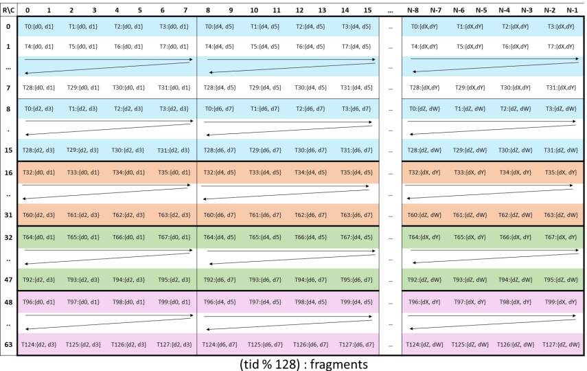
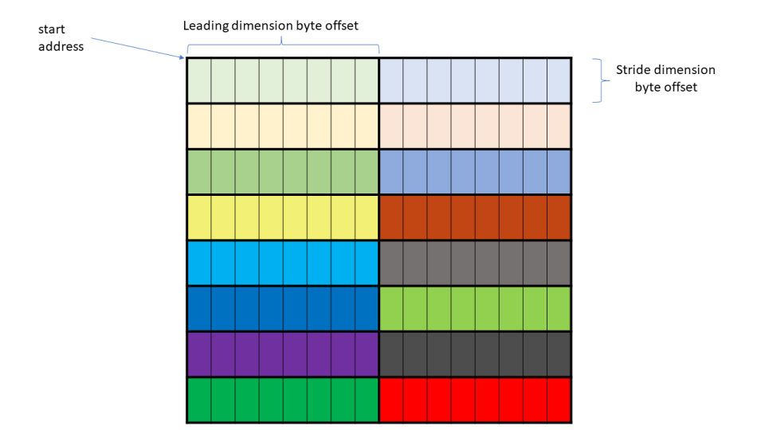
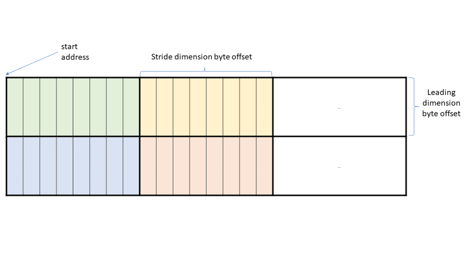

# CUTLASS 教程：在 NVIDIA® Hopper™ GPU 上使用 WGMMA 实现快速矩阵乘法

任何 CUDA® 教程系列都少不了 GEMM（通用矩阵乘法）。GEMM 可谓现代 GPU 上最重要的例程；神经网络、大型语言模型和许多图形应用的大部分计算都由它构成。然而，尽管 GEMM 无处不在，要高效实现它却出了名地困难。

本教程系列分为三部分，旨在帮助读者全面理解如何使用 CUTLASS 库，为 NVIDIA Hopper GPU 编写高效 GEMM 内核。

- [第 1 部分，即本文] 讨论 warpgroup 矩阵乘累加（WGMMA）指令。这些是面向 Hopper 架构 NVIDIA GPU Tensor Core 的基础指令。
- [第 2 部分] 将讨论[高效 GEMM 内核](https://github.com/NVIDIA/cutlass/blob/main/media/docs/efficient_gemm.md)的整体设计，包括 CUTLASS 内核中使用的 warp 专门化、乒乓调度等高级技术。
- [第 3 部分] 将讨论持久化内核和 [Stream-K](https://arxiv.org/abs/2301.03598)。Stream-K 是一种 GEMM 负载均衡策略，可在大量不同问题几何形状上实现先进效率。

全局视角。本系列的三个部分大致按照 GEMM 内核的完整开发流程展开，但顺序是“由内向外”。首先是分块 GEMM 基础操作，它调用 Tensor Core 完成最终计算。其次是从“单个 CTA”视角看到的 GEMM 内核设计：它由序言、主循环和尾处理组成，主要挑战是避免让内存加载成为高速 Tensor Core 的瓶颈。最后是最外层网格级的 CTA 调度，此时负载均衡成为首要考量。

我们希望读者学完本系列后，能够深入掌握 GEMM 算法，并将该算法中的一些精妙思路用于自己工作中其他内核的设计与实现。

### 异步 Warpgroup MMA（WGMMA）

Hopper 引入了 warpgroup 级异步矩阵乘累加操作（WGMMA）。一个 warpgroup 由四个连续 warp 组成，即 128 个连续线程；第一个 warp 的 warp-rank 为 4 的倍数。`wgmma.mma_async` 指令由 warpgroup 中全部 128 个线程协同执行。该操作通常采用以下两种形式之一，其中矩阵 `C` 作为累加器：

```
C = A * B + C
```

- `C = A * B`，此时禁用来自累加器 `C` 的输入。

WGMMA 有一项值得注意的要求：操作数 `B` 必须始终存储在共享内存（SMEM）中。相比之下，操作数 `A` 可位于 SMEM 或寄存器内存（RMEM），累加器 `C` 则始终保存在 RMEM 中。

本文结构如下。首先讨论在 CUTLASS 中调用 `wgmma.mma_async` 指令所必需的基础内容，包括构造相应的 `TiledMMA` 对象，以及创建和划分与 WGMMA 兼容的 SMEM 张量。其次讨论保证 WGMMA 正确性所必需的同步机制。最后更详细地讨论 WGMMA 使用的布局，包括核心矩阵概念，以及位于 SMEM 的操作数所使用的矩阵描述符。

为简洁起见，下文将 `wgmma.mma_async` 简写为 `wgmma`。主要代码参考是 Pradeep Ramani 贡献、并在 3.5.1 版本中加入的 [CUTLASS wgmma 教程](https://github.com/NVIDIA/cutlass/blob/be60a0b27204078dc0f3f1d6ed4a95cdb2114111/examples/cute/tutorial/wgmma_sm90.cu)。

### CUTLASS 内核中的 WGMMA

本教程的主要目标，是解释如何使用 `wgmma` 基础操作调用 Hopper Tensor Core 执行分块 GEMM，以及如何将其作为 `cute::gemm` 调用的一部分来发出。先考虑一个标准 GEMM 内核：它接收尺寸由 `MxNxK` 描述的输入矩阵 `A` 和 `B`，并计算 `C=A*B`。为了并行化计算，内核固定静态矩阵块大小 `bM`、`bN` 和 `bK`，然后启动包含 `⌈M/bM⌉x⌈N/bN⌉` 个 CTA 的网格。每个 CTA 计算输出矩阵的一个 `bMxbN` 矩阵块 `rC`。在写回全局矩阵 `C` 之前，`rC` 保存在该 CTA 的 RMEM 中。

对每个 CTA 而言，接下来是内核主循环。主循环执行 `⌈K/bK⌉` 次迭代，沿内维遍历，依次把 `A` 的 `bMxbK` 矩阵块和 `B` 的 `bNxbK` 矩阵块从全局内存加载到共享内存，形成 `sA` 和 `sB`。请注意，在 CUTLASS 中，`sB` 的形状固定为其数学形状的转置。（实际上，遵循常见做法，我们把 `A` 和 `B` 的矩阵块加载到环形 SMEM 缓冲区；阶段数由编译期整数给出，例如 2 或 3。`sA` 和 `sB` 形状元组的最后一个模就是该阶段数。）`cute::gemm` 随后计算 `sA` 和 `sB` 各阶段切片的乘积，并将结果依次累加到 `rC`。主循环完成后，尾处理将 `rC` 写入全局内存。

下面解释 `cute::gemm` 调用及其各个参数。以下代码片段选自 [wgmma 教程](https://github.com/NVIDIA/cutlass/blob/main/examples/cute/tutorial/wgmma_sm90.cu#L73)，已隐藏与当前讨论无关的部分，例如流水化 TMA 加载：

```
template <class TiledMMA, ... >
__global__ device_gemm(TiledMMA tiled_mma, ...) {
  // 序言
  // ...
  // 定义 A/B 分区和 C 累加器
  ThrMMA thr_mma = tiled_mma.get_thread_slice(threadIdx.x);
  Tensor tCsA = thr_mma.partition_A(sA);  // (MMA,MMA_M,MMA_K,PIPE)
  Tensor tCsB = thr_mma.partition_B(sB);  // (MMA,MMA_N,MMA_K,PIPE)
  Tensor tCgC = thr_mma.partition_C(gC);  // (MMA,MMA_M,MMA_N)
  // 分配累加器并清零
  Tensor tCrC = thr_mma.make_fragment_C(tCgC);  // (MMA,MMA_M,MMA_N)
  clear(tCrC);
  // 分配“片段”
  Tensor tCrA = thr_mma.make_fragment_A(tCsA);  // (MMA,MMA_M,MMA_K,PIPE)
  Tensor tCrB = thr_mma.make_fragment_B(tCsB);  // (MMA,MMA_N,MMA_K,PIPE)
  // 流水化主循环
  while (k_tile_count > -K_PIPE_MAX) {
    // ...
    // 用于覆盖 1 个 K_TILE 的 MMA
    cute::warpgroup_arrive();
    // (V,M,K) x (V,N,K) => (V,M,N)
    cute::gemm(tiled_mma, tCrA(_,_,_,read_pipe), tCrB(_,_,_,read_pipe), tCrC);
    cute::warpgroup_commit_batch();
    // 等待一个 K_TILE 中的所有 MMA 完成
    cute::warpgroup_wait<0>();
    // ...
  }
  // 尾处理
  // ...
}
```

在 [CUTLASS 的 MMA 范式](https://github.com/NVIDIA/cutlass/blob/main/media/docs/cute/0t_mma_atom.md)中，`cute::gemm` 通过统一接口暴露架构特定的 MMA 指令。（如果查看 [SM80 教程的 GEMM 内核](https://github.com/NVIDIA/cutlass/blob/main/examples/cute/tutorial/sgemm_sm80.cu#L275)，可以看到其 `cute::gemm` 调用在语法上与上述调用完全一致。）但是，`cute::gemm` 所涉及的参数定义包含许多 WGMMA 特定内容：

- `TiledMMA` 对象 `tiled_mma` 的定义封装了 `cute::gemm` 分派到某条具体 PTX `wgmma` 指令所需的信息。
- SMEM 张量 `sA` 和 `sB` 的布局必须定义为与 `wgmma` 兼容。
- 片段 `tCrA`、`tCrB` 和 `tCrC` 是使用 `TiledMMA` 对象构造的数据线程级分区，因此具有程序员需要了解的 WGMMA 特定布局。
- 片段 `tCrA`（当操作数 `A` 来自 SMEM 时）和 `tCrB` 并不是把值从 SMEM 拷贝进来的寄存器后端张量，而是构建在 SMEM 之上的矩阵描述符。

最后，`cute::gemm` 调用周围还有 warpgroup 同步基础操作。下面将依次解释这些概念。

### WGMMA 的 TiledMMA 对象

下文假设数据类型为 FP16，`A` 和 `B` 均为 `MN`-major，因此按 BLAS 记法计算的是 NT GEMM。在主机端使用 `cute::make_tiled_mma` 方法如下构造 `TiledMMA` 对象：

1

2

```
TiledMMA tiled_mma = cute::make_tiled_mma(
  SM90_64x64x16_F16F16F16_SS<GMMA::Major::MN,GMMA::Major::MN>{});
```

尽管 `cute::make_tiled_mma` 还有一些可选参数，这里先聚焦当前参数——MMA Atom。它是一个封装底层 PTX 调用的结构；在本例中，底层指令为：

```
wgmma.mma_async.sync.aligned.m64n64k16.f16.f16.f16
```

CUTLASS 的命名方式使人可以直接看出被封装的 PTX 指令与 MMA atom 之间的关系。首先，SM90 是 Hopper 架构的另一种名称。SM90 MMA atom 标记为 `SM90_MxNxK_XYZ_SS` 或 `SM90_MxNxK_XYZ_RS`，并带有两个可为 `GMMA::Major::MN` 或 `GMMA::Major::K` 的模板参数。各部分含义如下：

- `X` 和 `Y` 是操作数的数据类型。
- `Z` 是累加器的数据类型。
- `MxNxK` 是 `wgmma` 指令计算的矩阵块大小，即“wgmma atom”。并非所有 `MxNxK` 值都合法。[允许的形状](https://docs.nvidia.com/cuda/parallel-thread-execution/index.html#asynchronous-warpgroup-level-matrix-shape)中，`M` 始终为 64，`N` 是 8 到 256 之间的 8 的倍数；对 16 位操作数数据类型，`K` 为 16（更一般地说，`K` 固定对应 32 字节）。
- 后缀 `RS` 或 `SS` 表示操作数 `A` 来自寄存器（`R`）还是共享内存（`S`）。操作数 `B` 始终来自共享内存，因此第二个字母始终是 `S`。
- 两个模板参数表示操作数 `A` 和 `B` 在内存中是沿 `MN` 模还是 `K` 模连续。例如，按 BLAS 记法，两个操作数均为 `K`-major 对应 TN GEMM（参见[相关表格](https://github.com/NVIDIA/cutlass/blob/main/media/docs/cute/0x_gemm_tutorial.md#aside-m-major-n-major-k-major)）。对 16 位操作数数据类型，内存布局可灵活选择 `MN`-major 或 `K`-major；对非 16 位操作数数据类型，布局必须始终为 `K`-major。

以上就是 MMA Atom 需要掌握的语法。前面已强调，WGMMA 是 warpgroup 级指令。在代码中，可通过 `TiledMMA` 对象的大小获取参与该 MMA 操作的线程数。例如，以下主机代码

1

```
dim3 dimBlock(cute::size(tiled_mma));
```

规定内核中的每个 CTA 都使用 1 个由 128 个线程组成的 warpgroup 启动。

如果希望由 2 个 warpgroup 执行 WGMMA，并让它们分别独立计算输出矩阵块的一半（各自发出自己的 `wgmma` 指令），可以把一个非平凡布局 `AtomLayoutMNK` 作为 `make_tiled_mma` 的第二个参数。例如，以下代码

```
TiledMMA tiled_mma = make_tiled_mma(
 SM90_64x64x16_F16F16F16_SS{},
 Layout<Shape<_2,_1,_1>>{});
```

定义了一个 WGMMA 操作：warpgroup 1 和 2 分别计算沿 `M` 模划分的输出矩阵块上半部和下半部（此时假设 `bM` 是 128 的倍数）。同时，`size(tiled_mma)` 将等于 256。

一般而言，`make_tiled_mma` 的两个可选布局参数 `AtomLayoutMNK` 和 `PermutationMNK` 对任何 MMA Atom 的工作方式都相同。要了解 `PermutationMNK` 的用法，推荐参阅 Cris Cecka 的[优秀解说](https://github.com/NVIDIA/cutlass/discussions/1345)。

### WGMMA 的 SMEM 布局约束

下面解释选定 MMA atom 后，SMEM 中操作数矩阵的矩阵块大小和布局所受的约束。首先，与任何 MMA 指令一样，MMA atom 的 `MxNxK` 必须整除操作数和累加器矩阵块的相应尺寸。在本例中，`bM` 应为 64 的倍数，`bN` 应为 64 的倍数，`bK` 应为 16 的倍数。

其次，WGMMA 还对 `sA` 和 `sB` 的 SMEM 布局（同时包括形状和步长）施加了额外约束，且该约束随所选 swizzle 模式而变。特别是，`sA` 各阶段切片的布局通常不能简单写成 `(bM,bK):(1,bM)` 或 `(bM,bK):(bK,1)`，`sB` 也同样。

要深入理解这些要求，需要掌握下文将介绍的核心矩阵概念。但从实际编程角度看，可以先使用 CUTLASS 提供的预定义布局 atom，再调用 `cute::tile_to_shape`，以构造保证与 `wgmma` 兼容的布局。本示例在主机端如下准备矩阵块大小以及 `sA`、`sB`（`T=cutlass::half_t`，即 CUTLASS 对 FP16 的命名）：

```
auto bM = Int<128>{};
auto bN = Int<128>{};
auto bK = Int< 64>{};
auto bP = Int<  3>{};  // 流水线
auto sA = cute::tile_to_shape(
    GMMA::Layout_MN_SW128_Atom<T>{},
    cute::make_shape(bM, bK, bP)
);
auto sB = cute::tile_to_shape(
    GMMA::Layout_MN_SW128_Atom<T>{},
    cute::make_shape(bN, bK, bP)
);
```

其中，`MN` 表示该布局 atom 适用于 `MN`-major 操作数，`SW128` 表示 128 字节 swizzle 模式。打印 `sA` 或 `sB` 会显示：

```
Sw&lt;3,4,3> o smem_ptr[16b](unset) o ((_64,_2),(_8,_8),_3):((_1,_512),(_64,_1024),_8192)
```

这个布局从何而来？`cute::tile_to_shape` 接收一个布局（即其名称中的 tile），并复制它以覆盖更大形状，这与 `numpy.tile` 类似。暂时不考虑 swizzle 函数 `Sw<3,4,3>`，布局 atom 为 `(64,8):(1,64)`，并以列主序方式在形状 `(128,64,3)` 上分块复制。因此对 `MxK` 形状，较小的外层步长 `512` 位于 `M` 模，较大的外层步长 `1024` 位于 `K` 模。（最大步长 `8192` 位于阶段计数 `P` 模；这很合理，因为 `sA` 或 `sB` 的不同阶段切片不应在内存中交织。）

请注意，`64` 乘以 `sizeof(half_t)` 等于 128 字节，这也正是该 swizzle 模式的名称。这是特意设计的：由于核心矩阵的工作方式，我们始终使布局 atom 在连续方向的长度等于 swizzle 字节数——无 swizzle 时为 `16`，否则为 `32`、`64` 或 `128` 之一。

In contrast, if we considered:

```
auto sA = cute::tile_to_shape(
  GMMA::Layout_K_SW128_Atom<T>{},
  cute::make_shape(bM,bK,bP)
);
auto sB = cute::tile_to_shape(
  GMMA::Layout_K_SW128_Atom<T>{},
  cute::make_shape(bN,bK,bP)
);
```

此时打印 `sA` 会得到：

1

```
Sw&lt;3,4,3> o smem_ptr[16b](unset) o (_128,_64,_3):(_64,_1,_8192)
```

因为这次是将 `(8,64):(64,1)` 在 `(128,64,3)` 上分块复制。（请注意，布局 `((_8,_16),(_64,_1),_3):((_64,_512),(_1,_0),_8192)` 合并后可化简为 `(_128,_64,_3):(_64,_1,_8192)`。）

总体而言，可从 `8` 种布局 atom 中选择：`MN`-major 或 `K`-major，分别结合四种 swizzle 模式之一：

- 无 swizzle：不进行 swizzle，隐含 16 字节边界。
- 32 字节 swizzle：对 2 个连续的 16 字节片段执行 swizzle。
- 64 字节 swizzle：对 4 个连续的 16 字节片段执行 swizzle。
- 128 字节 swizzle：对 8 个连续的 16 字节片段执行 swizzle。

这些布局 atom 在 [CUTLASS 代码库](https://github.com/NVIDIA/cutlass/blob/36cbfcf483cc9d2ee65a55c199176ce96da1e33e/include/cute/atom/mma_traits_sm90_gmma.hpp#L66)中定义为：

```
GMMA::Layout_MN_INTER_Atom<T>
GMMA::Layout_MN_SW32_Atom<T>
GMMA::Layout_MN_SW64_Atom<T>
GMMA::Layout_MN_SW128_Atom<T>
GMMA::Layout_K_INTER_Atom<T>
GMMA::Layout_K_SW32_Atom<T>
GMMA::Layout_K_SW64_Atom<T>
GMMA::Layout_K_SW128_Atom<T>
```

随后必须将这些布局 atom 传给 `tile_to_shape`，并使用 `make_shape(bM,bK,bP)` 或 `make_shape(bN,bK,bP)` 按该顺序给出 `sA` 和 `sB` 的 SMEM 形状。布局 atom 的矩阵块大小必须整除较大 SMEM 形状的相应大小。这本质上是 swizzle 模式选择导致的 SMEM 形状约束，与 MMA atom 形状施加的另一项约束相互独立。

### WGMMA 片段与描述符

我们已在主机端创建 `TiledMMA` 对象，并相应地准备好 SMEM 布局。现在可在设备端使用 `TiledMMA` 对象 `tiled_mma` 构造适当的分区张量，以传入 `cute::gemm`。首先，以线程索引为参数，调用 `tiled_mma` 的 `get_thread_slice` 方法，创建名为 `thr_mma` 的 `ThrMMA` 对象。本例中线程索引的取值范围为 `0` 到 `127`（包含两端）。

随后，参照上面的内核代码片段，对任意线程索引打印张量 `tCsA` 和 `tCsB`，都会得到：

```
tCsA: Sw&lt;3,4,3>_smem_ptr[16b](0x7f8800000400) o
    ((_64,(_8,_2)),_2,_4,_3):((_1,(_64,_1024)),_512,_2048,_8192)
tCsB: Sw&lt;3,4,3>_smem_ptr[16b](0x7f880000c400) o
    ((_64,(_8,_2)),_2,_4,_3):((_1,(_64,_1024)),_512,_2048,_8192)
```

如注释所示，`tCsA` 的形状应理解为 `(MMA,MMA_M,MMA_K,PIPE)`：

- `MMA` 是 MMA Atom 的 `NxK` 形状。
- `MMA_M` 和 `MMA_K` 是该 atom 在 `sA` 的 `M` 模和 `K` 模上分块复制的范围，因此 `MMA_M=bM/64=2`，`MMA_K=bK/16=4`。
- `PIPE` 是阶段数。

步长和 swizzle 模式从 `sA` 继承而来。这里需注意的 WGMMA 特定之处是，`tCsA` 实际上并非 SMEM 的线程级切片，而是布局经过重组的完整 SMEM 张量。

接下来，对任意线程索引打印“片段”`tCrA` 和 `tCrB`，会显示：

1

2

```
tCrA: GMMA::DescriptorIterator o (_1,_2,_4,_3):(_0,_64,_256,_1024)
tCrB: GMMA::DescriptorIterator o (_1,_2,_4,_3):(_0,_64,_256,_1024)
```

CUTLASS 在内部构造了“[矩阵描述符](https://docs.nvidia.com/cuda/parallel-thread-execution/index.html#asynchronous-warpgroup-level-matrix-shared-memory-layout-matrix-descriptor)”。它是一个保存在寄存器中的 64 位值，以适合 `wgmma` 指令使用的方式描述 SMEM。对程序员而言，最需牢记的是：SMEM 中的值并未拷贝到 RMEM；访问 `tCrA` 和 `tCrB` 的值，实际上是在访问这些 64 位描述符。此外，这些张量是“迭代器”，意味着在任一时刻，寄存器中只保存某条 `wgmma` 指令当前使用的单个 64 位描述符，而不是例如同时保存全部 24 个描述符。

与操作数不同，累加器张量的定义更为常规。对线程 0 打印 `tCgC` 和 `tCrC` 会显示：

1

2

```
tCgC: gmem_ptr[16b](0x7f877a780000) o ((_2,_2,_8),_2,_2):((512,_8,4096),_64,32768)
tCrC: ptr[16b](0x7feee1fffbe0) o ((_2,_2,_8),_2,_2):((_1,_2,_4),_32,_64)
```

`tCgC` 是输出 GMEM 张量的一个切片，尾处理会把累加器值拷贝到该切片。`tCrC` 则是用于保存主循环计算结果的寄存器后端张量。这些张量的 `(MMA,MMA_M,MMA_N)` 形状可如下理解：在 MMA atom 的 `MxN=64x64` 输出矩阵块中，128 个线程中的每个线程保存 `32=2*2*8` 个值，`MMA_M=MMA_N=2` 与 `tCsA` 和 `tCsB` 中相同。

每个线程以一种特定方式保存该 atom 的 32 个值。为了定义 `tCgC` 布局所需的相应步长，必须在形状中把 32 分解为 (2,2,8)。具体分区模式可从以下 [PTX 文档图片](https://docs.nvidia.com/cuda/parallel-thread-execution/index.html#wgmma-64n16-d)中读出：



该图展示了每个线程的 32 个值所采用的重复 Z 形模式。例如，线程 0 保存位于 (0,0)、(0,1)、(8,0)、(8,1) 的值，并向右每隔 8 列重复该模式。

### 重新审视 gemm 调用

回到上面内核代码片段的第 25 行：

1

2

```
// (V,M,K) x (V,N,K) => (V,M,N)
cute::gemm(tiled_mma, tCrA(_,_,_,read_pipe), tCrB(_,_,_,read_pipe), tCrC);
```

`cute::gemm` 的各种重载首先循环遍历外层模 `MMA_M/N` 和 `MMA_K`。一旦选定这些坐标，接下来就只需使用 MMA atom 的矩阵块形状进行计算。换言之，首先化简到[分派形状](https://github.com/NVIDIA/cutlass/blob/be60a0b27204078dc0f3f1d6ed4a95cdb2114111/include/cute/algorithm/gemm.hpp#L178)为 `(V)x(V)=>(V)` 的 `cute::gemm` 重载。

随后，代码调用 MMA atom 的 [`fma` 操作](https://github.com/NVIDIA/cutlass/blob/be60a0b27204078dc0f3f1d6ed4a95cdb2114111/include/cute/arch/mma_sm90_gmma.hpp#L401)（确切地说，调用发生在 [`mma_unpack`](https://github.com/NVIDIA/cutlass/blob/be60a0b27204078dc0f3f1d6ed4a95cdb2114111/include/cute/atom/mma_traits.hpp#L112) 方法内）。其中包含以下 PTX 内联汇编：

```
CUTE_HOST_DEVICE static void
  fma(uint64_t const& desc_a,
      uint64_t const& desc_b,
      uint32_t& d00, uint32_t& d01, uint32_t& d02, uint32_t& d03,
      uint32_t& d04, uint32_t& d05, uint32_t& d06, uint32_t& d07,
      uint32_t& d08, uint32_t& d09, uint32_t& d10, uint32_t& d11,
      uint32_t& d12, uint32_t& d13, uint32_t& d14, uint32_t& d15,
      GMMA::ScaleOut const scale_D = GMMA::ScaleOut::One)
  {
#if defined(CUTE_ARCH_MMA_SM90A_ENABLED)
    asm volatile(
    "{\n"
      ".reg .pred p;\n"
      "setp.ne.b32 p, %18, 0;\n"
      "wgmma.mma_async.sync.aligned.m64n64k16.f16.f16.f16 "
      "{%0,  %1,  %2,  %3,  %4,  %5,  %6,  %7,  "
      " %8,  %9,  %10, %11, %12, %13, %14, %15},"
      " %16,"
      " %17,"
      " p,   %19, %20, %21, %22;\n"
    "}\n"
      : "+r"(d00), "+r"(d01), "+r"(d02), "+r"(d03),
        "+r"(d04), "+r"(d05), "+r"(d06), "+r"(d07),
        "+r"(d08), "+r"(d09), "+r"(d10), "+r"(d11),
        "+r"(d12), "+r"(d13), "+r"(d14), "+r"(d15)
      : "l"(desc_a),
        "l"(desc_b),
        "r"(int32_t(scale_D)),
        "n"(int32_t(scaleA)),
        "n"(int32_t(scaleB)),
        "n"(int32_t(tnspA)),
        "n"(int32_t(tnspB)));
#else
    CUTE_INVALID_CONTROL_PATH(
        "Attempting to use SM90_64x64x16_F16F16F16_SS "
        "without CUTE_ARCH_MMA_SM90A_ENABLED");
#endif
  }
```

相应 PTX 语法可参见 [PTX 文档](https://docs.nvidia.com/cuda/parallel-thread-execution/index.html#asynchronous-warpgroup-level-matrix-instructions-wgmma-mma)。与上文对张量 `tCrA`、`tCrB` 和 `tCrC` 的描述一致，操作数使用 `uint64` 变量 `desc_a` 和 `desc_b`，累加器使用 16 个 `uint32` 变量。`scale_D` 为 `0` 或 `1`，用于控制是否将累加器清零初始化。

此外，变量 `scaleA`、`scaleB`、`tnspA` 和 `tnspB` 在 `fma` 方法之外通过模板参数于编译期确定。`scaleA` 和 `scaleB` 为 1 或 -1，用于对操作数取负；`tnspA` 和 `tnspB` 表示是否转置操作数，对 `GMMA::Major::K` 和 `GMMA::Major::MN` 分别为 0 和 1。

### WGMMA 同步

还需要解释 `cute::gemm` 调用周围的同步基础操作：

```
cute::warpgroup_arrive();
cute::gemm(tiled_mma, tCrA(_,_,_,read_pipe), tCrB(_,_,_,read_pipe), tCrC);
cute::warpgroup_commit_batch();
cute::warpgroup_wait<0>();
```

为什么需要这些额外命令？原因在于 `wgmma` 是异步指令。在 Hopper 架构语境中，异步表示 `wgmma` 可与其他操作并发运行，因此依赖于其结果的步骤需要同步机制。[PTX 内存一致性模型](https://docs.nvidia.com/cuda/archive/12.3.2/parallel-thread-execution/index.html#program-order-async-operations)对该机制做了详细说明。代码中的不正确同步可能导致：（a）隐蔽竞态，造成难以调试的错误；（b）编译器将 `wgmma` 指令串行化，造成明显性能下降；或（c）未定义行为。

上述 `cute` 方法封装了以下 PTX 指令：

- `cute::warpgroup_arrive()` — `wgmma.fence.sync.aligned` ;
- `cute::warpgroup_commit_batch()` — `wgmma.commit_group.sync.aligned` ;
- `cute::warpgroup_wait<N>()` — `wgmma.wait_group.sync.aligned N` ;

（请注意，上文一直用 `wgmma` 作为 `wgmma.mma_async` 的简写；只在本小节中对两者加以区分。）下面将这些命令的用法与 [PTX 文档](https://docs.nvidia.com/cuda/archive/12.3.2/parallel-thread-execution/index.html#asynchronous-warpgroup-level-matrix-multiply-accumulate-instructions)对基于 WGMMA 的 GEMM 所给出的步骤对应起来：

1. 将矩阵 `A`、`B` 和 `D` 加载到寄存器或共享内存。
2. 执行以下 `fence` 操作：
  - 使用 `wgmma.fence` 表示 warpgroup 内的寄存器/共享内存已经写入。
  - 使用 `fence.proxy.async` 使通用代理操作对异步代理可见。
3. 对输入矩阵使用 `wgmma.mma_async` 发出异步矩阵乘累加操作。`wgmma.mma_async` 在异步代理中执行。
4. 使用 `wgmma.commit_group` 创建一个 wgmma-group，并把之前所有尚未完成、且未提交到任何 wgmma-group 的 `wgmma.mma_async` 操作提交到该组。
5. 使用 `wgmma.wait_group` 等待所需 wgmma-group 完成。
6. wgmma-group 完成后，其中所有 `wgmma.mma_async` 操作都已执行完毕。

下面依次解释这些要点。首先，`wgmma.fence` 确保 `wgmma.mma_async` 只有在之前对某些 RMEM 地址的所有访问都已完成后，才会访问这些地址。如果缺少 `wgmma.fence`，行为未定义。但该规则有一个例外：Hopper 允许多条 `wgmma.mma_async` 指令同时处于执行中。只要这些指令的累加器形状相同，它们就可共享同一个累加器张量，即写入相同的寄存器内存地址。在这种情况下无需 fence。例如，`cute::gemm` 调用内部对 `MMA_K` 的循环中不需要插入 `wgmma.fence`。

与 [TMA 操作](https://research.colfax-intl.com/tutorial-hopper-tma/)一样，`wgmma.mma_async` 在[异步代理](https://docs.nvidia.com/cuda/parallel-thread-execution/#async-proxy)中执行。因此，如果通用代理执行的操作影响了 `wgmma.mma_async` 要读取的 SMEM，就需要发出 `fence.proxy.async`。例如，使用普通 `ld.global`/`st.shared` 操作将 `A` 和 `B` 拷贝到 SMEM 就属于这种情况。本示例使用 TMA 加载，因此无需 `fence.proxy.async`；它也确实没有出现在 WGMMA 教程代码或 CUTLASS Hopper GEMM 内核的主循环中。（可通过以下事实核实：`fence.proxy.async` 由 `cutlass::arch::fence_view_async_shared()` 封装。）

`wgmma.commit_group` 为每个 warpgroup 创建一个新 wgmma-group，并把该 warpgroup 之前发起、但尚未提交到任何 wgmma-group 的所有 `wgmma.mma_async` 指令批量加入新组。本示例中，`cute::warpgroup_commit_batch()` 将 `MMA_M*MMA_N*MMA_K` 条 `wgmma.mma_async` 指令合并到一个 wgmma-group。

最后，带参数 `N` 的 `wgmma.wait_group` 会使执行线程等待，直到最近的 wgmma-group 中最多只有 `N` 个仍在等待完成，且执行线程之前提交的所有 wgmma-group 都已完成。本示例使用 `N=0`，因此 warpgroup 在继续执行后续指令前，会等待整个 wgmma-group 完成。

当 warpgroup 有机会执行独立计算时，参数 `N` 的灵活性就很有用。例如，[FlashAttention-3](https://research.colfax-intl.com/flashattention-3-fast-and-accurate-attention-with-asynchrony-and-low-precision/) 设计所采用的 GEMM-softmax 重叠策略就会利用这一点。

### WGMMA 核心矩阵

最后一节进一步讨论加载到 SMEM 的矩阵 `A` 和 `B` 矩阵块的布局要求，并假设 `wgmma` 的两个操作数都来自 SMEM。为简化讨论，先假设 `A` 为行主序，`B` 为列主序（即两者均为 `K`-major）。还需回顾，`wgmma` 指令的矩阵块形状 `MxNxK` 受以下约束：`M` 为 64，`K` 乘以数据类型大小等于 32 字节，`N` 是 8 到 256 之间的 8 的倍数。为避免与 `A`/`B` 或 `sA`/`sB` 混淆，将 WGMMA atom 矩阵块记为 `wA` 和 `wB`。

 矩阵 `wA` 和 `wB` 被划分为若干更小的“核心矩阵”。每个核心矩阵都有一个步长方向和一个连续方向：步长方向的长度为 8，连续方向的长度为 16 字节。矩阵 `wA` 由 `8x2` 个核心矩阵组成，矩阵 `wB` 由 `2x(N/8)` 个核心矩阵组成。下面使用来自 PTX 文档的图片，展示 `wA` 和 `wB` 的核心矩阵分块：



`wA` 在 SMEM 中的布局



`wB` 在 SMEM 中的布局

如上所述，SS 模式下的 `wgmma` 需要分别为 `wA`（`desc-a`）和 `wB`（`desc-b`）提供[矩阵描述符](https://docs.nvidia.com/cuda/parallel-thread-execution/index.html#asynchronous-warpgroup-level-matrix-shared-memory-layout-matrix-descriptor)作为输入。该描述符编码了五个参数：

- 起始地址：操作数在 SMEM 中的起始基地址。
- LBO（leading dimension byte offset，主维字节偏移）：`K` 维中两个相邻核心矩阵之间的字节距离。
- SBO（stride dimension byte offset，步长维字节偏移）：`M` 或 `N` 维中两个相邻核心矩阵之间的字节距离。
- Swizzle 模式：无 swizzle，或 32、64、128 字节。
- 矩阵基偏移：当 SMEM 地址没有对齐到 swizzle 模式重复模式的字节边界时，该字段用于解决 SMEM 对齐问题。

上图已标出 LBO 和 SBO。

CUTLASS 的 [`make_gmma_desc`](https://github.com/NVIDIA/cutlass/blob/06b21349bcf6ddf6a1686a47a137ad1446579db9/include/cute/atom/mma_traits_sm90_gmma.hpp#L194C1-L194C54) 方法根据输入的 SMEM 张量布局，构造一个 [`GmmaDescriptor`](https://github.com/NVIDIA/cutlass/blob/be60a0b27204078dc0f3f1d6ed4a95cdb2114111/include/cute/arch/mma_sm90_desc.hpp#L86) 实例作为描述符。如果输入张量布局按“WGMMA 的 SMEM 布局约束”中详述的方式，使用八种规范 GMMA 布局 atom 之一和 `tile_to_shape` 创建，`make_gmma_desc` 就会准确计算 LBO 和 SBO，确定 swizzle 模式，并构造描述符。例如，在 `K`-major 情形下（其中 `T*sizeof(dtype)=16`），`GmmaDescriptor` 描述以下允许的 WGMMA 布局：

```
No swizzle       : Swizzle&lt;0,4,3> o smem_ptr o ((8,m),(T,2)):((1T,SBO),(1,LBO))
32-byte swizzle  : Swizzle&lt;1,4,3> o smem_ptr o ((8,m),(T,2)):((2T,SBO),(1, T ))
64-byte swizzle  : Swizzle&lt;2,4,3> o smem_ptr o ((8,m),(T,2)):((4T,SBO),(1, T ))
128-byte swizzle : Swizzle&lt;3,4,3> o smem_ptr o ((8,m),(T,2)):((8T,SBO),(1, T ))
```

对于由“GMMA 布局 atom =&gt; `tile_to_shape`”模式产生的[紧凑布局](https://github.com/NVIDIA/cutlass/blob/be60a0b27204078dc0f3f1d6ed4a95cdb2114111/include/cute/layout.hpp#L415)（请注意，在 64 和 128 字节 swizzle 下，GMMA `K` 布局 atom 的 `K` 模比 WGMMA atom 形状更大），LBO 和 SBO 的对应值如下：

```
No swizzle       : LBO = 16x8 = 128 bytes. SBO = 32x8 = 256 bytes.
32-byte swizzle  : SBO = 32x8 = 256 bytes.
64-byte swizzle  : SBO = 64x8 = 512 bytes.
128-byte swizzle : SBO = 128x8 = 1024 bytes.
```

最值得注意的是，对 64 和 128 字节 swizzle，这些步长意味着所给允许的 WGMMA 布局并不紧凑。相反，2 个或 4 个 WGMMA atom 操作数矩阵块在 `K` 方向并排堆叠，使核心矩阵 `M` 模的步长分别为 `4T` 和 `8T`。换言之，swizzle 会在内存中交织 `K` 模上逻辑相邻的 2、4 或 8 个核心矩阵；对 64 和 128 字节 swizzle，这些核心矩阵属于不同的 WGMMA atom。

为了保持完整性，下面还给出 `MN`-major 情形下允许的 WGMMA 布局：

```
No swizzle       : Swizzle&lt;0,4,3> o smem_ptr o ((T,1,m),(8,k)):((1,T,SBO),(1T,LBO))
32-byte swizzle  : Swizzle&lt;1,4,3> o smem_ptr o ((T,2,m),(8,k)):((1,T,LBO),(2T,SBO))
64-byte swizzle  : Swizzle&lt;2,4,3> o smem_ptr o ((T,4,m),(8,k)):((1,T,LBO),(4T,SBO))
128-byte swizzle : Swizzle&lt;3,4,3> o smem_ptr o ((T,8,m),(8,k)):((1,T,LBO),(8T,SBO))
```

### 结论

在 GEMM 系列的[第 1 部分]中，我们介绍了在基于 Hopper 的 GEMM 中使用 WGMMA（warpgroup 矩阵乘累加）作为基础操作所涉及的核心概念。

WGMMA 需要由一个 warpgroup——即 128 个线程——协同执行矩阵乘法，且只能对矩阵的特定片段进行操作。我们深入讨论了相关的特殊形状和布局，重点说明如何使用规范的“GMMA Layout =&gt; `tile_to_shape`”模式，构造保证能被 WGMMA 接受的操作数布局。

为了使 WGMMA 的使用具有良好定义，还需要特定同步机制。因此，我们解释了 `wgmma.fence`、`fence.proxy.async`、`wgmma.commit_group` 和 `wgmma.wait_group` 相对于 `wgmma.mma_async` 的用法。

最后，我们较为详细地说明了 WGMMA 核心矩阵的内部工作方式，以及 CUTLASS 如何为来自 SMEM 的操作数构造矩阵描述符。

综合来看，本文应能帮助程序员在 Hopper 上编写使用 WGMMA 的 CUTLASS 内核。[第 2 部分]将把讨论扩展到 TMA，并介绍如何在 Hopper GEMM 内核中配合使用 TMA 和 WGMMA，以重叠拷贝与计算。

1. 你好，
感谢这个非常先进且优秀的博客系列。
本文的技术内容和细节很出色，但似乎缺少主要结果，例如从性能角度说明为什么要使用 TMA 和 WGMMA。尤其是，缺少 A100 与 H100 硬件能力和最大利用率的对比。
  1. 你好，
感谢你对本系列的兴趣。
如果希望用真实性能收益作为动机，就需要参考更严肃、技术深度更高的工作。例如，本系列的合著者 Jay Shah 是 FlashAttention-3 的第一作者。FA3 是专门面向 H100 的内核，大量使用 TMA、WGMMA 和 warp 专门化流水线，这些都是我们一直在讨论的概念。相比之下，FA2 是专门面向 A100 的内核，大量使用 `cp_async`、WMMA 和多阶段流水化内核。两者的性能差异（大约 2–3 倍？）就是 H100 与 A100 差异的证据。
但我们不可能让每一篇博客都变成一个 FA3。FA3 大约花费了 6 位非常聪明且经验丰富的人 5 个月连续工作才完成。
你应当把本系列看作学习 FA3 中各项技术的“如何实现”指南。如果掌握了这些技术并正确应用，就可以为自己喜欢的内核构建类似 FA3 的实现。
2. 一个小问题：结论部分有一处拼写错误。应该是 `fence.proxy.async`，而不是 `fence.async.proxy`。

  1. 谢谢！已修复。
3. 你好，
我想知道，WGMMA，或者包含 4 个 warp 的 warpgroup，是否必须在同一个 EU 的 Tensor Core 上分派和执行？
在引入“warpgroup”概念之前，我理解 warp 调度器可以给每个 EU 调度一个 warp，然后再移到下一个 EU。因此可能有两种情形：
A）warpgroup 的 4 个 warp 在 1 个 EU 上执行；
B）warpgroup 的 4 个 warp 在 4 个 EU 上执行，每个 EU 执行 1 个 warp。
两种情况下，4 个 warp 都可以锁步执行以实现 WGMMA。
我不确定 Hopper 采用的是哪种方式？
  1. 抱歉，我不知道这个问题的答案。有些硬件细节，尤其是执行流水线周边的细节，似乎是专有信息；据我们所知，没有相关文档。不过，每个 SM 有 4 个 Tensor Core。因此，如果答案是 A，那么为了使 Tensor Core 饱和，每个 SM 至少需要持续将 4 个 warpgroup，即 16 个 warp（总共可能有 64 个）分配给 WGMMA。当然，在包含 TMA 加载等操作的现实情景中，真正使 Tensor Core 饱和还需要更高的占用率。但从我们的经验来看——尽管这只是经验性的——使 Tensor Core 饱和并不需要如此高的占用率。因此我猜测答案是 B，即各个 warp 分散到不同 Tensor Core。但请再次注意，这个答案只能谨慎参考。
4. “`wA` 在 SMEM 中的布局”和“`wB` 在 SMEM 中的布局”两张图已损坏。可以在这条推文中看到它们：[https://x.com/hyhieu226/status/1821572717877022876/photo/1](https://x.com/hyhieu226/status/1821572717877022876/photo/1)
  1. 已修复，谢谢！
  2. 谢谢提醒——我们刚刚修复了它们。
5. 你好，
能否解释一下，你们是如何得出“但对非 16 位操作数数据类型，布局必须始终为 K-major”这一结论的？
既然 SMEM 布局定义了多种 swizzle 模式，那么对所有操作数数据类型，布局似乎都可以是 M/N-major 或 K-major？
  1. Swizzle 模式与 SMEM 矩阵块的主维/major 方式相互独立。参见 PTX 文档的表 37 及其周边讨论：[https://docs.nvidia.com/cuda/parallel-thread-execution/index.html#asynchronous-warpgroup-level-swizzle-lead-dim](https://docs.nvidia.com/cuda/parallel-thread-execution/index.html#asynchronous-warpgroup-level-swizzle-lead-dim) 。
关于 16 位与非 16 位数据类型的区别，CUTLASS 中已断言该限制；它对应于 PTX `wgmma.mma_async` 在这些情况下缺少 `imm-trans-a` 和 `imm-trans-b` 参数（[https://docs.nvidia.com/cuda/parallel-thread-execution/index.html#asynchronous-multiply-and-accumulate-instruction-wgmma-mma-async](https://docs.nvidia.com/cuda/parallel-thread-execution/index.html#asynchronous-multiply-and-accumulate-instruction-wgmma-mma-async)）。文档还明确说明：
“只有对使用矩阵描述符从共享内存访问矩阵的 `.f16`/`.bf16` 类型 `wgmma.mma_async` 变体，才支持转置操作。”
6. 你好，我想知道为什么 `tCsA` 的 K 模被拆分成两部分 `(_8, _2)`？另外还有一处笔误：“MMA 是 MMA Atom 的 NxK 形状”应为“MMA 是 MMA Atom 的 MxK 形状”。
tCsA: Sw<3,4,3>_smem_ptr[16b](0x7f8800000400) o
((_64,(_8,_2)),_2,_4,_3):((_1,(_64,_1024)),_512,_2048,_8192)
tCsB: Sw<3,4,3>_smem_ptr[16b](0x7f880000c400) o
((_64,(_8,_2)),_2,_4,_3):((_1,(_64,_1024)),_512,_2048,_8192)
  1. 因为它使用分块 atom，无法合并为 64,16，且内部存在间隙。
