# CUTLASS 教程：持久化内核与 Stream-K

欢迎阅读 GEMM（通用矩阵乘法）教程系列的第 3 部分。在第 [1](https://research.colfax-intl.com/cutlass-tutorial-wgmma-hopper/) 和第 [2](https://research.colfax-intl.com/cutlass-tutorial-design-of-a-gemm-kernel/) 部分中，我们从单个线程块的角度详细讨论了 GEMM，并介绍 WGMMA 矩阵乘基础操作、流水化和 warp 专门化。本部分将从整个网格的角度审视 GEMM。在这个范围内，主要有两类优化：（1）使用线程块 swizzle 和 cluster 尽量提高 L2 缓存命中率；（2）在各线程块之间更好地划分工作，以使 GPU 计算资源饱和并获得良好的负载均衡。本文聚焦后者，附录也会讨论前者。

具体而言，我们将讨论一种名为 [Stream-K](https://arxiv.org/abs/2301.03598) 的划分策略，用于解决波次量化问题。当工作矩阵块数无法被流式多处理器（SM）数整除时，就会发生波次量化。当标准的基于矩阵块的输出划分无法占满 GPU 时，Stream-K 同样有用，例如 M 和 N 很小而 K 很大的情况。

本文结构如下。首先描述波次量化问题和持久化内核概念。然后介绍在各线程块之间划分 GEMM 工作负载的多种策略，包括 Stream-K 及其前身 [Split-K](https://github.com/NVIDIA/cutlass/blob/main/media/docs/efficient_gemm.md#parallelized-reductions)，重点关注它们如何处理波次量化。接下来说明内核作者如何编写自己的矩阵块调度器；作为示例，我们在本系列第 2 部分的 GEMM 内核中添加了 Stream-K 实现，可从 [GitHub](https://github.com/ColfaxResearch/cfx-article-src/tree/master/streamk) 获取。最后，附录将深入分析 CUTLASS 中的 Stream-K 实现。

## 全局视角：波次量化问题

NVIDIA GPU 由多个流式多处理器（SM）组成。每个 SM 都拥有自己的共享内存、寄存器文件和 Tensor Core 等资源，并且各 SM 彼此独立运行。理想工作负载会在各 SM 之间均匀分配工作，最大程度利用 SM 间的并行性，使所有 SM 在内核整个运行期间始终保持忙碌。但如果某些 SM 比其他 SM 更快完成自己的部分，它们就会闲置，等待其他 SM 完成。这就是负载不均衡的一个例子。

考虑一个可以划分为等大工作单元的计算，每个工作单元都可由单个 SM 在相同时间内完成。例如，GEMM 通常被划分为若干工作单元，每个单元计算一个 bM x bN 输出矩阵块。随后将这些工作单元分配给线程块（CTA），每个 CTA 在可用 SM 上计算分配给它的工作单元。我们把将工作单元分配给 SM 的过程称为调度。

如果工作单元数超过可用 SM 数，工作单元将分多个波次处理。一个波次表示每个可用 SM 各完成一个工作单元。

当工作单元数无法被可用 SM 数整除时，就会出现波次量化。例如，假设有 10 个工作单元和 4 个 SM，工作单元的执行时间线如下：

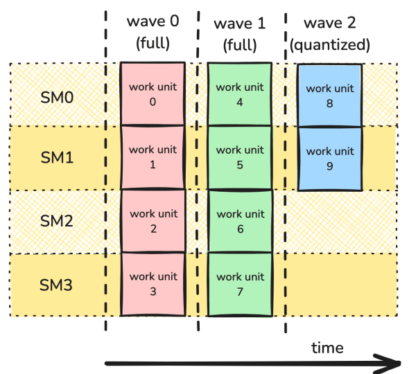

在该情况下，前两个波次是所有 SM 都被使用的完整波次，最后一个波次则是只占用一半 SM 的部分波次。

当工作项数相对于 SM 数较少时，波次量化可能严重降低性能。例如，H100 PCIe GPU 拥有 114 个 SM，包含 115 个工作单元的计算需要 2 个波次——与包含 228 个工作单元的计算完全相同。换言之，添加第 115 个工作单元会使设备利用率大约减半。另一方面，包含 114,001 个工作单元的计算虽然也会遭受相同量化效应，但其代价与内核总成本相比微不足道。更多信息可参阅 [NVIDIA 深度学习性能指南](https://docs.nvidia.com/deeplearning/performance/dl-performance-matrix-multiplication/index.html#wave-quant)。

为了通过示例观察波次量化的影响，使用本系列第 2 部分构建的 GEMM 内核，并测量不同波次数下的性能。考虑 MxK 矩阵 A 与 KxN 矩阵 B 的 GEMM。设 `bM` 和 `bN` 为工作矩阵块的维度，为简化起见，假设它们分别整除 M 和 N。波次总数由 `ceil((M/bM * N/bN)/num_SMs)` 给出。为研究量化效应，需要改变 `(M/bM * N/bN)/num_SMs` 给出的每 SM 矩阵块数；其小数部分表示最后一个波次的填满程度。因此，固定 `M=1024` 和 `K=4096`，并以 `bN` 为步长改变 `N`（本例中 `bN=192`）。

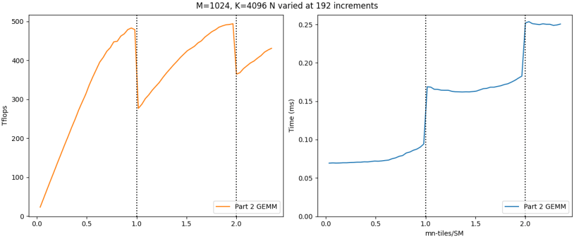

左图显示 TFLOPs/s 性能，右图显示经过时间，基准测试在 H100 PCIe GPU 上执行。竖直虚线表示波次边界，即每 SM 矩阵块数跨越整数值的位置。左图展示波次量化效应：跨越波次边界时，性能会急剧下降。相应地，右图表明经过时间主要由作为离散参数的波次总数决定：对 `(0,1]` 中的 `x` 为 1，对 `(1,2]` 中的 `x` 为 2，以此类推。

请注意，第二次量化效应小于第一次：随着波次数增加，波次量化的影响会减小。但是，增加波次数可能很困难，尤其是考虑到新架构上 NVIDIA GPU 的 SM 数量还在持续增长。因此，需要在不假设问题规模的前提下，设计减轻波次量化影响的策略。

#### 持久化内核

为解决波次量化，需要创建更好的划分和调度方案。到目前为止，本博客展示的内核都使用依赖于问题维度的网格，使每个 CTA 处理一个工作单元。例如，在 GEMM 中，工作单元是 `MxN` 输出矩阵的 `bMxbN` 矩阵块，`bM` 和 `bN` 在编译期固定。`M/bM x N/bN` 网格中的每个 CTA 计算一个工作单元。因此启动参数如下：

```
dim3 dimGrid(ceil_div(M, bM), ceil_div(M, bN));
```

该方法的问题是，虽然可以在一定程度上控制线程块如何分配到 SM，但很难实现更复杂的调度策略。因此，下面使用一种不同的设计方法：持久化内核。在持久化内核中，网格大小是固定值。通常，该值等于可用 SM 数，使每个 CTA 都拥有自己的 SM。可以使用以下 CUDA 代码查询用于 `dimGrid` 的 SM 数：

```
int num_SMs;
cudaGetDeviceAttribute(&num_SMs, cudaDevAttrMultiProcessorCount, device_id);

dim3 dimGrid(num_SMs);
```

每个 CTA 持续驻留在自己的 SM 上，并处理多个工作单元，直到所有工作完成。该设计变更通过规定每个 CTA 如何遍历工作单元，使程序员对调度拥有明显更多的控制。利用该灵活性，可以以尽量减少波次量化和负载不均衡的方式分配工作。

实践中，工作单元到 CTA 的分配通常交给矩阵块调度器。它本质上是一个功能更强的迭代器，告诉每个 CTA 到哪里找下一个工作单元，以及何时停止。每个输出矩阵块需要的总工作量并未改变，但通过更换矩阵块调度器，可以探索 Stream-K 等更复杂的策略，以尽量减少负载不均衡。

## 使用持久化内核处理波次量化

为了逐步过渡到 Stream-K，先检视一些处理波次量化的更简单但效率较低的方法会很有帮助。[Stream-K 论文](https://arxiv.org/abs/2301.03598)对此有非常出色的深入讨论，推荐阅读。为方便读者，这里先概括该讨论。

为了使本节数字更易于理解，考虑一款虚构 GPU——[Hipparchus](https://en.wikipedia.org/wiki/Hipparchus) H10，它只有 4 个 SM。

#### 数据并行

先从最基本的版本开始：在 M 模和 N 模上均匀拆分矩阵块，并以轮转方式分配。请注意，这与使用非持久化、按工作矩阵块网格启动内核的情形本质上相同，唯一差异是执行顺序得到保证。但该方法仍值得研究，因为它有助于理解波次量化何时会成为问题。由于工作单元之间没有依赖，该方式称为数据并行工作调度。

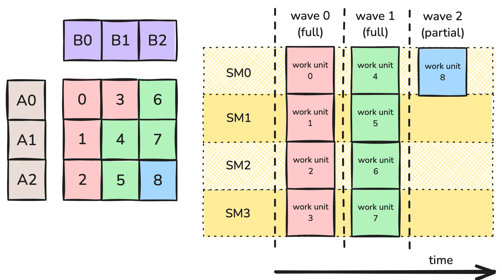

图 1：数据并行划分。

图 1 展示了一个划分示例。GEMM 工作负载被划分为 9 个工作矩阵块。由于工作项相同，矩阵块按波次处理。具体而言，9 个工作矩阵块在 H10 的 4 个 SM 上分 3 个波次处理：2 个完整波次，以及一个只占用 4 个 SM 中 1 个的部分波次。如果每个工作矩阵块在其 SM 上都达到 100% 利用率，整个计算的利用率为 2.25/3 = 75%。

最直接的方法是回到之前的观察：工作单元越多，波次量化问题越小；而缩小每个工作单元，就可以增加工作单元数。

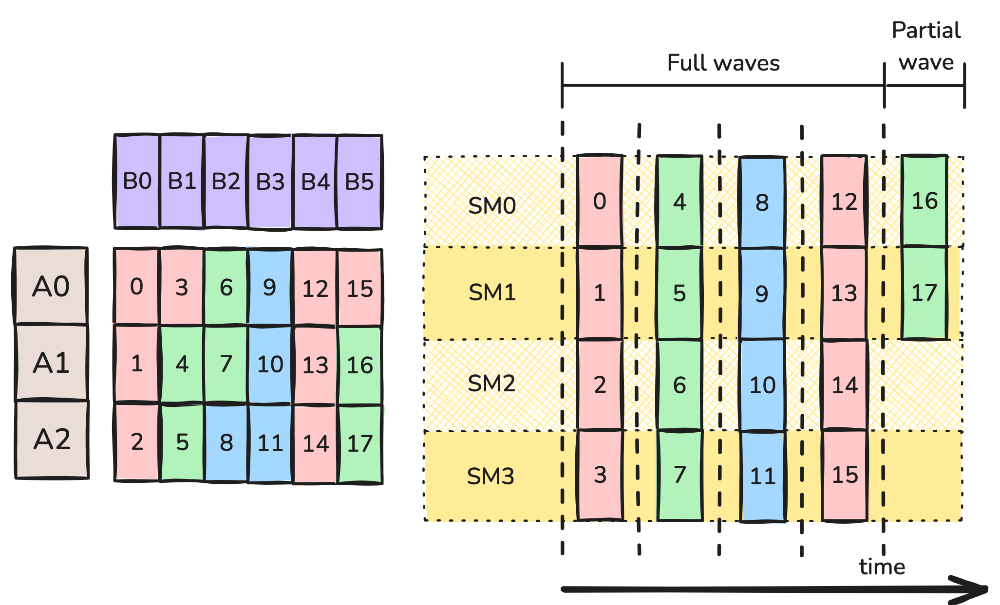

图 2：bN 减半的数据并行划分。

图 2 在 N 方向将 bN 减半。现在共有 18 个工作矩阵块，可分 5 个波次执行：4 个完整波次，以及一个占用 4 个 SM 中 2 个的部分波次。再次假设每个工作矩阵块都以 100% 利用率计算，整个计算的利用率为 4.5/5 = 90%。此外，图 2 的每个工作矩阵块只需要图 1 工作矩阵块一半的 FLOP。作为一阶近似，每个波次应只需图 1 波次一半的时间。因此，尽管图 2 有 5 个波次，而图 1 只有 3 个，图 2 的耗时仍只有图 1 的 (5*0.5)/3 = 83%。那么问题可能出在哪里？

不幸的是，上述分析使用了过多简化假设，已无法正确建模 Hipparchus H10 的行为。核心问题是，随着矩阵块尺寸减小，计算一个工作矩阵块的效率可能下降。因此，“矩阵块尺寸减半会使计算时间也减半”，或“单个 CTA 利用率保持不变”这些假设可能并不正确。

主要缺点之一是[算术强度](https://docs.nvidia.com/deeplearning/performance/dl-performance-matrix-multiplication/index.html#math-mem)降低。内存访问很耗时，因此希望用大量算术操作遮蔽内存访问延迟。对 GEMM 而言，计算 $bM \times bN \times bK$ 矩阵乘矩阵块的 CTA 会执行 $2\cdot bM \cdot bN \cdot bK$ 次算术操作，并执行 $(bM \cdot bK + bN \cdot bK + bM \cdot bN)$ 次 GMEM 访问。将 $bN$ 减半会使前者减半，但不会使后者减半。例如，128 x 128 x 128 工作矩阵块每次 GMEM 传输对应 85.3 次操作，而 128 x 64 x 128 工作矩阵块每次 GMEM 传输只对应 64 次操作。

另一个复杂因素是，如果 CTA 大小不变，矩阵块尺寸减半意味着 CTA 中每个 warp 处理的指令数也减半。这会减少 warp 调度器可用的延迟遮蔽机会，而这些机会对流水化 GEMM 的良好性能必不可少。

最后，MMA atom 的选择还可能对矩阵块尺寸施加约束。例如，H10 可能要求使用 128 x 128 x 16 WGMMA atom 才能获得最大吞吐量，这会对最小矩阵块尺寸增加另一项限制。

如何在这些考量之间取得平衡并不显然。为特定问题找到良好的矩阵块大小可能需要反复尝试，例如使用 [CUTLASS Profiler](https://github.com/NVIDIA/cutlass/blob/main/media/docs/profiler.md) 调优。

#### Split-K

到目前为止，只在 M 模和 N 模上进行拆分，但还有另一个可拆分的维度：K 模。当 K 很大时，该方法最有效；与之前一样，当 bK 过小时，算术强度和延迟遮蔽都会付出代价。

Split-K 调度沿 K 模把矩阵块拆分为固定数量的片段。例如，图 3 沿 K 模拆分为 2 个工作项。

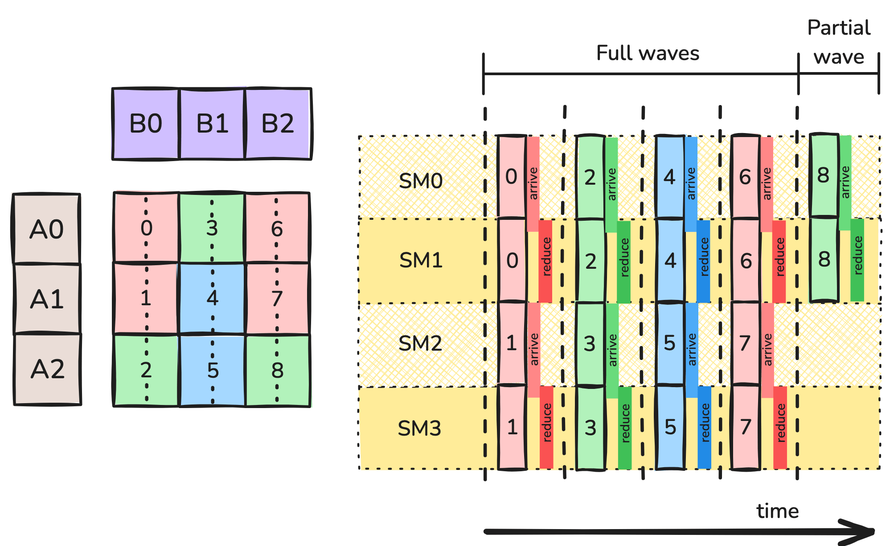

图 3：Split-K 划分。

该策略引入了新的复杂性：每个 CTA 只为自己的 bM x bN 输出矩阵块累加了部分结果。要完成计算，处理同一输出矩阵块的 CTA 需要合并结果。一种典型方法是在辅助 GMEM 工作区中执行 turnstile reduction。协作处理某个矩阵块的每个 CTA，都会等待处理更早 K 索引的 CTA 到达屏障；然后将自己的部分结果归约到工作区，并由自己到达屏障。最后一个 CTA 不再把结果归约到工作区，而是将工作区中的结果归约到自己的累加器，再执行尾处理。请注意，额外 GMEM 访问和屏障同步会引入额外开销，图 3 中以“arrive”和“reduce”块表示。

Split-K 引入了一个新超参数：拆分数量。该参数带来一组自身的权衡：

- 增加拆分数会减弱波次量化效应，可能提高整体 SM 利用率。
- 增加拆分数会减小 K 方向的矩阵块尺寸，可能提高 GMEM 访问相对于计算的比例。
- 增加拆分数还会减少每个 CTA 的指令数，从而减少延迟遮蔽机会。
- 该方法引入了同步和归约开销，这是 Split-MN 中没有的额外成本。拆分越多，同步成本越高。

#### Stream-K

到目前为止考虑的策略都改善了波次量化问题，但并未将其消除。回到最初的示例：9 个工作矩阵块分布在 4 个 SM 上。如果每个 SM 都能运行 2.25 个波次，将是理想情况。这就是 Stream-K 的动机。

Stream-K 策略为每个 SM 分配一个持久化 CTA。每个 CTA 被分配分数个工作矩阵块，其中任何被拆分的工作矩阵块都沿 K 模拆分。与 Split-K 策略一样，对每个被拆分的工作矩阵块，协作处理该块的 CTA 可以在 GMEM 工作区中使用 turnstile reduction 合并结果。

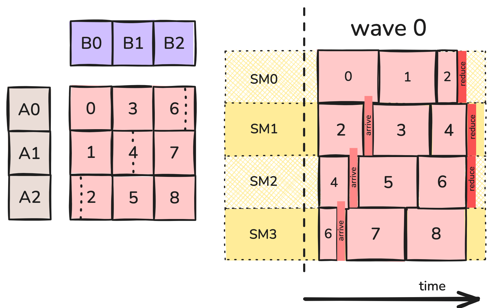

图 4：Stream-K 划分。

例如，图 4 中 SM0 上的持久化 CTA 计算工作矩阵块 0 的全部、工作矩阵块 1 的全部，以及工作矩阵块 2 的 1/4。SM1 上的持久化 CTA 计算工作矩阵块 2 的其余部分、工作矩阵块 3 的全部，以及工作矩阵块 4 的一半，以此类推。部分矩阵块的调度方式会让某个工作矩阵块的第一个片段远早于最后一个片段计算，以尽量减少同步开销。不过，对 K 方向极长的矩阵块，这并不总是可能。

下面将 Stream-K 与前面讨论的策略进行比较。

- 通过消除波次，消除了量化。每个 CTA 计算 2.25 个工作矩阵块。除同步和归约所需的额外时间外，总计算时间应约为 2.25 个单位，而原始内核需要 3 个单位。
- 原始 128 x 128 x 128 工作矩阵块中的许多仍完全由单个 CTA 处理，因此部分保留了大工作矩阵块的优势：高计算/内存比、长指令序列，以及可使用大型 WGMMA 指令。如果第一个内核的每个 CTA 可以达到 100% 利用率，该内核也可以。
- 在许多情况下，输出矩阵块的早期片段可调度到远早于最后片段的时刻计算，因此负责尾处理的 CTA 实际上不需在屏障上等待很久。
- 内核确实需要额外 GMEM 传输，以便部分矩阵块的数据能在 CTA 之间共享。

#### 混合 Stream-K

还可对内核做最后一项改进，它与缓存性能有关。分块 GEMM 内核的性质决定，每个操作数矩阵块都需要用于计算多个输出工作矩阵块。例如，在 Split-MN 情形下，需要使用矩阵块 B0 计算输出矩阵块 0、1 和 2。

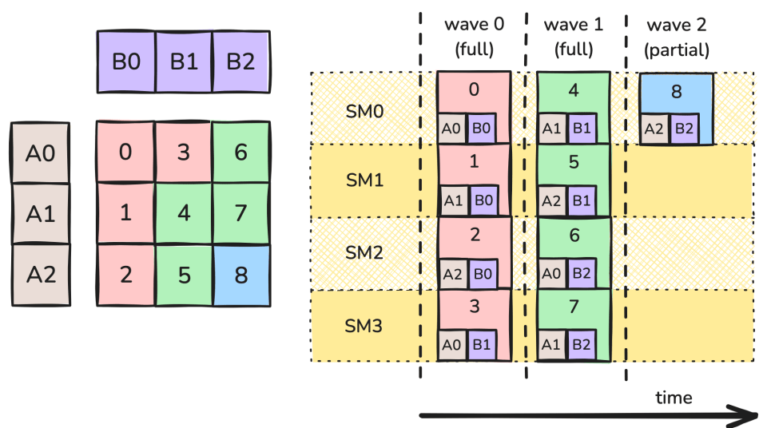

图 5：波次中的数据复用。

此处同时计算输出矩阵块 0、1 和 2。当其中一个 CTA 从全局内存取得矩阵块 B0 时，B0 也会被放入 L2 缓存。其他同样请求 B0 的 CTA 随后会命中缓存，从而更快地加载它。缓存容量有限，旧数据可能被驱逐，因此这些请求在大致相同的时间发生很重要。

更准确地说，操作数矩阵块也在 K 方向上分区，每个 CTA 都会在其操作数矩阵块的 K-block 上执行内层循环。波次 0 开始时，SM 0、1 和 2 会同时请求矩阵块 B0 的第 0 个 K-block，其中两个请求会命中缓存。在下一次循环迭代中，SM 0、1 和 2 会请求 B0 的第 1 个 K-block，以此类推。

但是，Stream-K 内核引入了 skew：由于每个 SM 开始时都计算不同大小的部分矩阵块，它们在同一时刻往往会处理不同的 K 偏移。回到图 4，波次 0 开始时 SM 0 和 1 都在使用 B0 数据，但 SM0 需要第 0 个 K-block，SM1 需要中间附近的数据。事实上，该调度中的 K 偏移始终无法对齐，缓存命中因此更难发生。总之，消除“波次”并让不同 SM 相互失步地调度，带来了缓存性能变差这一隐藏代价。

可以通过重新调度计算来解决该问题：使用持久化内核与普通数据并行内核的混合方案。数据并行调度不会遭受 skew，因此应尽可能长时间使用该调度，只为足以处理波次量化效应的矩阵块保留 Stream-K。为了在 Stream-K 阶段正确平衡各 SM 的工作负载，必须将 1 个完整波次和任何剩余的部分波次分配给该阶段。

图 6 展示该调度。初始 Stream-K 阶段处理 1 到 2 个完整波次的计算量。每个 SM 最多获得 2 个部分工作矩阵块。根据设计，这些矩阵块的总大小与 CTA 无关，因此所有 CTA 预计会在大致相同的时间完成该计算阶段。该阶段完成后，只剩完整工作矩阵块，且剩余数量可被 SM 数整除。因此，可使用非持久化数据并行策略计算这些工作矩阵块。该策略不受波次量化影响，缓存性能也更好，如图 6 所示：

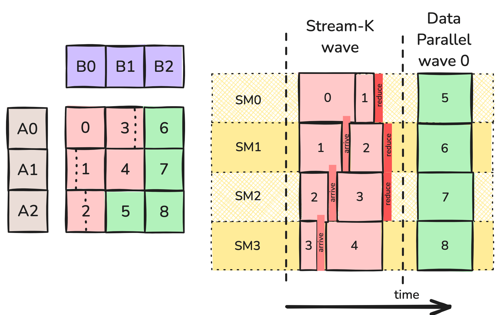

图 6：混合 Stream-K 划分。

这里可以预期工作矩阵块 6、7 和 8 的计算在接近的时间发生，并对操作数矩阵块 B2 产生缓存命中。类似地，工作矩阵块 5 和 8 可以为它们共享的 A 矩阵块利用缓存。本例的数据并行阶段只包含 1 个波次；拥有更多工作矩阵块的更大 GEMM 会有更长的数据并行阶段，并更多地使用缓存。

## 矩阵块调度器抽象

工作划分和调度问题在很大程度上与每 CTA 的内存和计算操作相互独立，因此 CUTLASS 等 GEMM 实现通常将它们封装在名为“矩阵块调度器”的抽象中。（该概念比 GEMM 更一般；例如，[FlashAttention-3 也支持使用矩阵块调度器类的持久化内核](https://github.com/Dao-AILab/flash-attention/blob/main/hopper/tile_scheduler.hpp)。）下一节将专门检视 CUTLASS 实现；这里先概述矩阵块调度器的职责。

首先，内核网格形状取决于矩阵块调度，因此矩阵块调度器负责确定内核网格大小。对非持久化内核，它与逻辑网格相同，并取决于问题大小；对持久化内核，它是固定值，很可能等于 SM 数。启动前首先向矩阵块调度器查询网格大小，并用于内核启动。

在内核中，每个线程都会构造一个矩阵块调度器实例。主循环和尾处理现在被包装在一个遍历调度器所提供矩阵块的工作循环中，形式可能如下：

```
for (auto worktile = scheduler.get_initial_tile();
    scheduler.is_valid(worktile);
    worktile = scheduler.get_next_tile(worktile)) {
        auto [m_block, n_block, k_block_start, k_block_stop] = worktile.get_block_coord();
        for (k_block = k_block_start; k_block &lt; k_block_stop; ++k_block) {
            // 主循环
        }
        // 尾处理
}
```

实现这些迭代器基础操作的一种简单方式，是让调度器维护一个指向工作矩阵块的线性索引。对持久化内核，每个 CTA 初始获得索引 `blockIdx.x` 处的工作矩阵块（该索引就是底层 SM 的线性索引）；随后通过向前跨越 `gridDim.x`（SM 数）进入下一个矩阵块；只要索引不超过矩阵块总数，该矩阵块就有效。将线性索引映射到实际 (M,N) 矩阵块坐标的工作交给 `worktile` 对象。

这已足以实现持久化数据并行调度，但更复杂的调度需要更多功能。对 Stream-K，K 方向的工作分配大小取决于矩阵块，因此如代码所示，worktile 实际上应向内核提供四个坐标。

对 Stream-K 和 Split-K，一部分或全部 CTA 会输出随后必须聚合的部分结果，这带来以下影响：

- 需要额外 GMEM 工作区，用于保存部分结果，以及允许处理同一矩阵块的 CTA 相互同步的屏障对象数组。所需空间大小取决于问题大小，因此必须在内核启动前动态分配。内核运行期间，调度器应向 CTA 提供指向工作区合适位置的指针。
- 开始处理新 worktile 时，每个 CTA 都需要知道它是完整输出矩阵块（结果应存储到输出张量），还是部分矩阵块（结果应存储到工作区）。
- 每个输出矩阵块只有一个 CTA 负责执行尾处理。该 CTA 不把结果归约到工作区，而是把工作区中的结果归约到自己的累加器，然后执行尾处理。调度器需要告诉每个 CTA，它是否负责自己所处理的每个矩阵块的尾处理。

正如 CUTLASS 实现所示，该简单轮廓还可以做多项改进，包括让调度器决定矩阵块的启动顺序，使用启发式规则从 Stream-K 回退到 Split-K 或数据并行模式，以及在 Hopper 上正确使用 cluster。下文将检视这些改进。

[GitHub 代码示例](https://github.com/ColfaxResearch/cfx-article-src/tree/master/streamk)提供了三种调度器：一种平凡的非持久化调度器，在由问题形状决定的网格上向每个 CTA 分配 1 个 worktile；一种数据并行持久化调度器；以及一种包含 CUTLASS 部分但非全部优化的 Stream-K 混合调度器。实践中发现，要获得合理性能，很多 CUTLASS 优化都必不可少。特别是，归约导致的额外 GMEM 访问和更小矩阵块尺寸是真实成本，必须仔细调整 Stream-K 工作分配边界，以尽量降低该成本。

下面显示 Stream-K 矩阵块调度器的一些性能指标。与数据并行调度器相比，本文的 Stream-K 实现在每个波次早期表现良好，能减轻波次量化效应；但随着尾部部分波次逐渐填满，性能会受损。“Heuristic”曲线使用 CUTLASS 的启发式规则：当尾部波次至少填满一半时，从 Stream-K 切换到数据并行。这显然是一个良好选择。

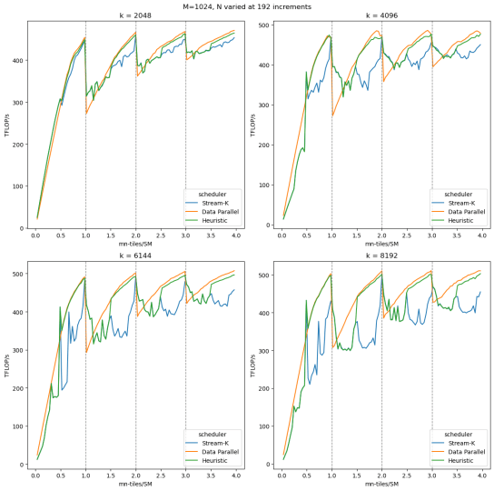

## 结论

本文讨论了波次量化及其对 GEMM 性能的影响。我们在第 2 部分构建的 GEMM 实现中观察到波次量化导致的显著性能波动，然后讨论了对抗波次量化的多种策略，其中重点是 Stream-K。最后，我们给出了一个 Stream-K 矩阵块调度器版本，用于在 GEMM 实现中消除波次量化的影响。至此，使用 CUTLASS/CuTe 抽象实现高性能 Hopper GEMM 的三部分系列教程全部结束。

## 附录：CUTLASS 中的 Stream-K

本附录探索 CUTLASS Stream-K 的一些更细节内容：如何使用它、它相对其他调度器的性能，以及实现时使用的一些优化。

#### 在 GEMM API 中使用 Stream-K

首先讨论如何在 CUTLASS 3.x GEMM API 中使用 Stream-K 调度器。先简要回顾 CUTLASS 3.x GEMM API。讨论只限于与 Stream-K 相关的部分，更多[细节](https://github.com/NVIDIA/cutlass/blob/main/media/docs/gemm_api_3x.md)和[示例](https://github.com/NVIDIA/cutlass/tree/main/examples)可在 CUTLASS 仓库中找到。这里的代码示例基于 [CUTLASS 示例 48](https://github.com/NVIDIA/cutlass/blob/main/examples/48_hopper_warp_specialized_gemm/48_hopper_warp_specialized_gemm.cu)。

CUTLASS GEMM API 由三部分组成：

- Epilogue：定义如何合并并可能修改部分结果。
- Mainloop：定义如何计算单个 worktile。
- Kernel：封装 epilogue 和 mainloop。

这些部分使用各自的 `CollectiveBuilder` 创建，使开发者能够配置 GEMM 内核。开发者也可以让 CUTLASS 根据内部启发式规则自动选择合适配置。以下是使用该自动特性的 GEMM 内核：

```
using CollectiveEpilogue = typename cutlass::epilogue::collective::CollectiveBuilder&lt;
    cutlass::arch::Sm90, cutlass::arch::OpClassTensorOp,
    TileShape, ClusterShape,
    cutlass::epilogue::collective::EpilogueTileAuto,
    ElementAccumulator, ElementAccumulator,
    ElementC, LayoutC, AlignmentC,
    ElementC, LayoutC, AlignmentC,
    cutlass::epilogue::collective::EpilogueScheduleAuto
  >::CollectiveOp;

using CollectiveMainloop = typename cutlass::gemm::collective::CollectiveBuilder&lt;
    ArchTag, OperatorClass,
    ElementA, LayoutA, AlignmentA,
    ElementB, LayoutB, AlignmentB,
    ElementAccumulator,
    TileShape, ClusterShape,
    cutlass::gemm::collective::StageCountAutoCarveout&lt;
      static_cast&lt;int>(sizeof(typename CollectiveEpilogue::SharedStorage))>,
    cutlass::gemm::collective::KernelScheduleAuto
  >::CollectiveOp;

using GemmKernel = cutlass::gemm::kernel::GemmUniversal&lt;
    Shape&lt;int,int,int>, // 表示 ProblemShape
    CollectiveMainloop,
    CollectiveEpilogue
>;
```

要指定 GEMM 内核使用 Stream-K，需要指定 `GemmKernel` 使用 `StreamKScheduler`。

```
using GemmKernel = cutlass::gemm::kernel::GemmUniversal<
    Shape<int,int,int>, // 表示 ProblemShape
    CollectiveMainloop,
    CollectiveEpilogue,
    cutlass::gemm::StreamKScheduler
>;
```

此外，只有某些 mainloop 和 epilogue 调度支持 Stream-K。本例的 Mainloop 和 Epilogue 都使用 `TmaWarpSpecializedCooperative`。

```
using CollectiveEpilogue = typename cutlass::epilogue::collective::CollectiveBuilder&lt;
    // ..... //
    cutlass::epilogue::TmaWarpSpecializedCooperative
  >::CollectiveOp;

using CollectiveMainloop = typename cutlass::gemm::collective::CollectiveBuilder&lt;
    // ..... //
    cutlass::gemm::KernelTmaWarpSpecializedCooperative
  >::CollectiveOp;
```

现在 GEMM 内核已配置为使用 Stream-K 调度器。需要注意，Stream-K 调度器并不总是使用 Stream-K 划分。默认情况下，它会使用内部启发式规则判断最佳划分方案。CUTLASS 调度器为 `DecompositionMode` 定义了四个选项：

- `DataParallel`：不在 K 方向拆分。
- `SplitK`：使用用户定义的拆分数实现 Split-K。
- `StreamK`：实现 Stream-K 划分。
- `Heuristic`：CUTLASS 根据问题选择模式。

稍后会更深入地讨论分解模式。目前可以在调度器参数中设置 Stream-K 分解，强制使用该模式。这可作为 `Gemm` 参数的一部分完成。

```
using DecompositionMode = typename cutlass::gemm::kernel::detail::PersistentTileSchedulerSm90StreamKParams::DecompositionMode;
DecompositionMode decomp = DecompositionMode::StreamK;

int splits=1;
typename Gemm::GemmKernel::TileScheduler::Arguments scheduler_args;
scheduler_args = { splits, static_cast&lt;int>(options.swizzle), options.raster, decomp};

typename Gemm::Arguments arguments{
    cutlass::gemm::GemmUniversalMode::kGemm,
    {options.m, options.n, options.k},
    {block_A.get(), stride_A, block_B.get(), stride_B},
    {{options.alpha, options.beta}, block_C.get(), stride_C, block_D.get(), stride_D},
    hw_info,
    scheduler_args
};
```

除 `DecompositionMode` 外，调度器参数还接收与 Split-K 和线程块光栅化相关的选项，下文附录也会讨论。最后，参数和 `GemmKernel` 就绪后，可使用 Stream-K 划分运行 GEMM。

```
using Gemm = cutlass::gemm::device::GemmUniversalAdapter&lt;GemmKernel>;
Gemm gemm;

size_t workspace_size = Gemm::get_workspace_size(arguments);

cutlass::device_memory::allocation&lt;uint8_t> workspace(workspace_size);
CUTLASS_CHECK(gemm.can_implement(arguments));
CUTLASS_CHECK(gemm.initialize(arguments, workspace.get()));
CUTLASS_CHECK(gemm.run());
```

#### Stream-K 性能

既然已讨论如何使用特定调度器运行 GEMM，下面检视它们在不同输入大小下的性能。再次固定 M 和 K，然后以矩阵块大小为增量改变 N，并使用每 SM 矩阵块数 `(M/bM * N/bN)/num_SMs` 作为 x 轴。我们对 Stream-K、Split-K 和 DataParallel 三种模式进行了基准测试以作比较，并对不同 K 值重复该过程。基准数据在 H100 PCIe GPU 上获得。

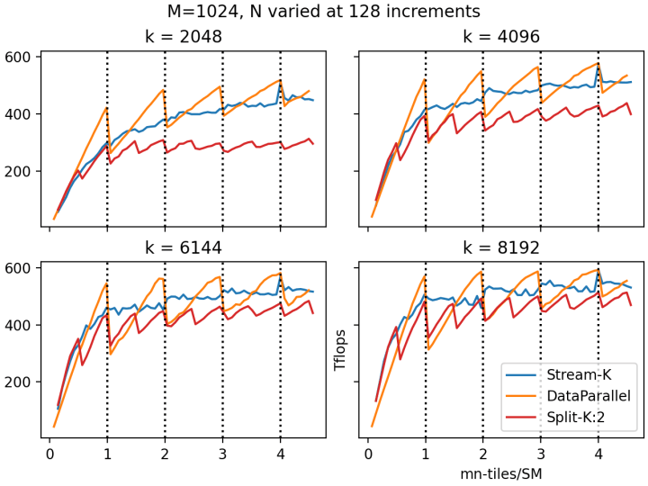

竖直虚线表示波次边界。如预期所示，DataParallel 模式跨越波次边界时，性能急剧下降，这就是波次量化效应。当最后一个波次大部分填满（每 SM 矩阵块数略小于某个整数）时，DataParallel 模式与其他模式性能相当或更好；当最后一个波次几乎为空（每 SM 矩阵块数略大于某个整数）时，其性能较差。最后，可以看到总波次数较少时，波次量化效应最明显。

Split-K 减轻了波次量化效应。Split-K 实际上将 worktile 数乘以 K 因子，因此波次数也增加 K 倍。图中可以看到，拆分数为 2 的 Split-K 性能波动频率是 DataParallel 的两倍。不幸的是，在大多数情况下，归约的额外开销似乎超过了所带来的收益。相对其他两个调度器，Split-K 只有很少情况下表现良好；通常是矩阵块数极少、如不拆分 GPU 将严重利用不足的情况。为保持图形清晰，图中只显示 K=2 的 Split-K；除 X 非常小的情况外，更大 K 值的性能通常比 K=2 更差。

相比之下，Stream-K 性能没有显示波次量化，随波次数变化时的波动很小。总体上，Stream-K 划分的性能与 Split-K 相当或更好；在较大 K 值下，当最后一个波次几乎为空时，Stream-K 胜过 DataParallel。在 N=7296 时，DataParallel 和 Stream-K 得到了一个完全相同的结果，该点对应 X=1024*7296/114=4。由于矩阵块可均匀分配给 CTA，没有部分矩阵块，也不需要归约，因此 DataParallel 和 Stream-K 得到相同结果。

除三种显式分解模式外，CUTLASS 还提供 Heuristic 模式。后文会讨论具体启发式规则，这里先观察它与 Stream-K 和 DataParallel 相比的表现（不再显示 Split-K）。

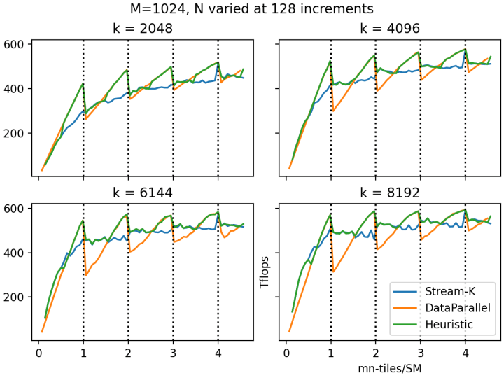

可以看到，CUTLASS Heuristic 模式能够很好地预测性能最佳的分解模式。量化效应较低时它选择 DataParallel，量化效应较高时选择 Stream-K。Heuristic 是默认模式，因此通常最好不要显式指定分解模式，而是让 CUTLASS 做决定。

#### CUTLASS 实现细节

下面讨论 CUTLASS Stream-K 调度器版本的具体细节（以 CUTLASS 3.6 为准）。

调度。CUTLASS 实现了上文解释的混合调度版本。调度器最多将两个波次交给 Stream-K 工作，随后以数据并行方式组织其余工作。由于数据并行波次往往在同一时刻处理相同 K 偏移，L2 缓存性能应会得到改善。

归约。默认情况下，协作处理同一输出矩阵块的 CTA 以“turnstile”方式工作。假设某个输出矩阵块由 CTA 0, 1, …, n 处理，并按所分配 K 索引范围递增排序。首先，CTA 0 计算自己的结果，并写入全局内存工作区。CTA 1 在屏障上等待 CTA 0 完成写入，然后将自己的输出归约到同一全局内存工作区。CTA 2 等待 CTA 1，随后归约自己的输出，以此类推。最后，CTA n 等待 CTA n-1，但它不把结果归约到工作区，而是将工作区中的结果归约到自己的累加器，最后计算尾处理并写入输出张量。

在另一种“非确定性模式”中（由用户通过参数 `ReductionMode::Nondeterministic` 指定），CTA 1, …, n-1 不再相互等待，而是直接以原子方式将结果归约到工作区。为了初始化工作区，所有 CTA 仍必须等待 CTA 0；CTA n 仍必须等待 CTA 0, …, n-1。非确定性来自以下事实：归约 1, …, n-1 现在可以按任意顺序发生，而浮点加法不满足结合律。

分解模式。CUTLASS Stream-K 调度器还支持 Split-K 和数据并行持久化调度，用户可通过 `decomposition_mode` 参数选择。（传入不等于 1 的 `splits` 参数，会强制调度器以给定拆分数运行 Split-K。）用户还可选择 `DecompositionMode::Heuristic`，在该模式下，调度器可从 Stream-K 回退到更简单的调度：如果没有波次量化，或者尾部波次至少填满一半，则回退到数据并行；如果分配给 Stream-K 工作的 CTA 数是它们应处理 Stream-K 矩阵块数的倍数，则回退到 Split-K。Stream-K 带有与归约和同步相关的额外开销，因此如果波次量化不会成为问题，回退到数据并行是合理的。根据我们的测试，该启发式规则在多种问题大小上几乎总能做出最佳选择。

线程块光栅化。持久化内核有一项与波次量化问题无关的优势：可以选择 worktile 的启动顺序。对 GEMM 而言，这主要与缓存性能有关：如果大致在同一时间处理输出矩阵同一行或同一列（相同 M 或 N 索引）的 worktile，它们会同时从 GMEM 加载某个操作数矩阵的数据，很可能命中 L2 缓存。

因此，改善持久化内核缓存性能的最简单方式，是沿 M 模或 N 模按顺序启动 worktile。例如，如果沿 N 模启动 worktile，并尽可能长时间保持 M 固定，操作数矩阵 A 的数据就经常可在缓存中找到。在 CUTLASS 中，可向调度器传入 `raster_order` 参数，`RasterOrderOptions::AlongM` 和 `AlongN` 提供该行为。通常希望沿以 worktile 为单位计量时较短的那个模执行光栅化；`RasterOrderOptions::Heuristic` 会自动确定该选择。

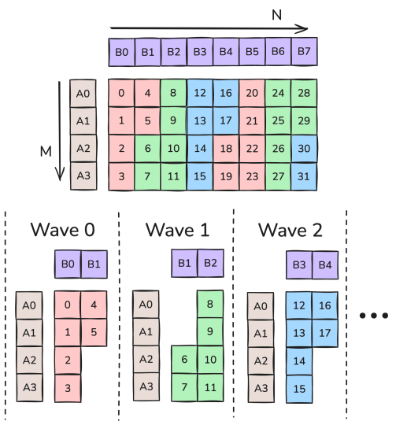

图 7：沿 M 光栅化。

图 7 展示在拥有 6 个 SM 且 `M<N` 的情况下的线程块光栅化。在该情况下，`RasterOrderOptions::Heuristic` 会选择 `AlongM`。例如，在波次 0 中，各 SM 处理矩阵块 0 到 5，操作数从 HBM 加载的次数从先验计数 12 降低到 6（假设数据可容纳于 L2 缓存）。

更高级的技术是同时考虑两个维度上的邻近性。例如，图 7 中的工作矩阵块在 M 方向相邻，但在 N 方向相差 M。可以先沿 N 维度走 2 个矩阵块，然后再沿 M 方向移动，以改善该情况。这称为线程块 swizzle，具体而言是 `swizzle=2`。可使用参数 `max_swizzle_size` 指定要 swizzle 的矩阵块数，但正如名称所暗示，如果问题不够大，调度器可能选择更小的 swizzle 大小。可选大小为 1（无 swizzle）、2、4 或 8。图 8 展示使用 `AlongM` 光栅顺序，并分别采用 swizzle 大小 2 和 1 时的工作矩阵块处理顺序。（请注意，这与[相关文章](https://research.colfax-intl.com/tutorial-matrix-transpose-in-cutlass/)讨论的 XOR swizzle 不同。）

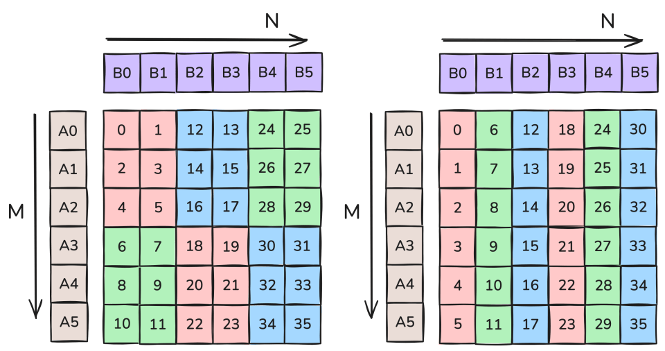

图 8：左侧，使用 swizzle 2 沿 M 光栅化；右侧，使用 swizzle 1 沿 M 光栅化。

图 8 中，`swizzle=2` 的每个波次加载 5 个操作数矩阵块，`swizzle=1` 的每个波次加载 7 个（再次假设所有数据都可容纳于 L2）。因此，对 6 个波次，`swizzle=2` 需要 30 次操作数矩阵块加载，`swizzle=1` 需要 42 次。某个问题的正确 swizzle 大小会随问题和设备特性而有很大变化。不过，通常只有在光栅化方向拥有足够多矩阵块时，swizzle 才有效。更准确地说，希望 M 矩阵块数大于 `SM/swizzle`；否则，光栅化方向的所有操作数矩阵块无论如何都会被加载。当有 114 个 SM 时，swizzle 2、4 和 8 的相应截止值为 57、31 和 15。

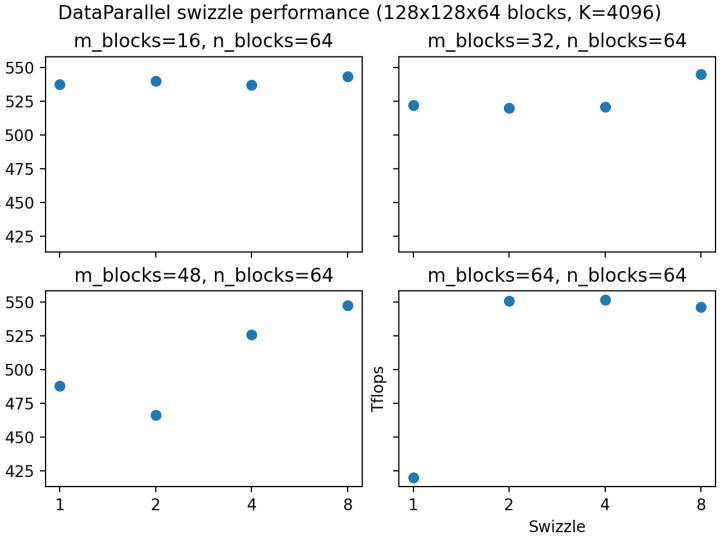

上图反映了这些截止值：一旦矩阵块数足够，swizzle 表现更好。但如前所述，矩阵块数不是唯一考量；L2 缓存大小等其他因素也会进一步影响 swizzle 性能。因此，建议使用 [CUTLASS profiler](https://github.com/NVIDIA/cutlass/blob/main/media/docs/profiler.md) 为工作负载找到最佳 swizzle 数值。

Cluster 与[多播](https://research.colfax-intl.com/tutorial-hopper-tma/)。Hopper 架构引入了线程块集群：在同一 GPU 处理集群（GPC）上同时调度的 CTA 组，它们可快速访问彼此的共享内存。对当前讨论最重要的是，TMA 加载可以多播，在一次操作中同时将同一数据加载到 cluster 中所有 CTA 的 SMEM。

这对矩阵块调度器的构造有深远影响。前面说过，为了缓存性能，应尽量在大致同一时间调度同一行或同一列的 worktile。但同样重要的是，应尽量将它们分配到同一 cluster，因为这样才能多播某个操作数矩阵的数据。此外，对 Stream-K 工作，cluster 中各 CTA 理想情况下应在同一时刻处理相同 K 偏移。也就是说，使混合调度具有合理性的 skew 问题，在 cluster 内同样重要。

CUTLASS 以一种优雅方式处理该问题。首先，整个调度通过将输出矩阵划分为 worktile cluster 而不是单个 worktile 来构造。例如，如果 cluster 形状为 2×4，那么在每个数据并行波次中，每个 cluster 都会处理输出矩阵中一个 2×4 的矩形矩阵块区域。其次，对 Stream-K 阶段，调度器尝试把执行 Stream-K 工作的 cluster 均匀划分为若干“组”，每个组在同一时刻被分配具有相同 K 偏移的工作。完整算法有些复杂，但幸运的是，除了指定 cluster 形状外，用户实际上无需考虑这些细节。

1. 在 Stream-K skew 部分，“回到图 4，SM 0 和 2……”应该是 SM 0 和 1。

  1. 已修复，谢谢！
2. “例如，在波次 0 中，各 SM 处理矩阵块 0 到 5，操作数从 HBM 加载的次数从先验计数 12 降低到 6（假设数据可容纳于 L2 缓存）。”
12 是如何计算的？对 6 个 SM，一个波次最多只需加载 7 个矩阵块。

  1. 7 个矩阵块对应图 8 中 `swizzle=1` 的 M/N 分块策略。
对 6 个 SM，理论最坏情况是从 HBM 加载 12 个操作数。在该情况下，每个矩阵块的操作数都不共享，因此 6 个 SM 中每个都必须加载自己的 2 个操作数，且没有任何缓存命中。
