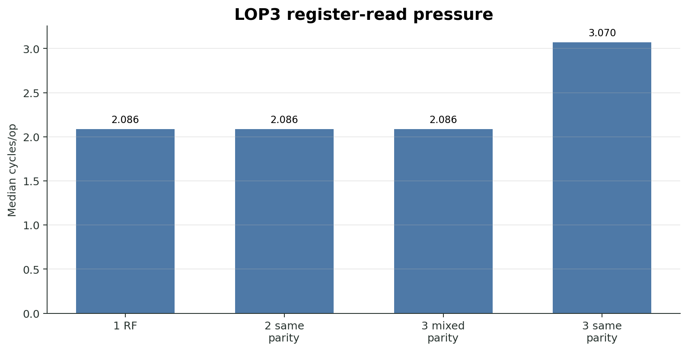
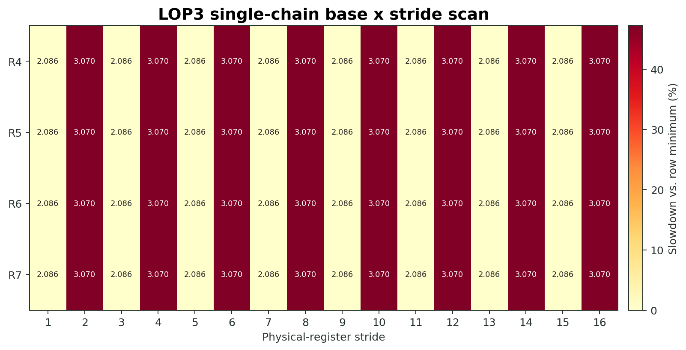
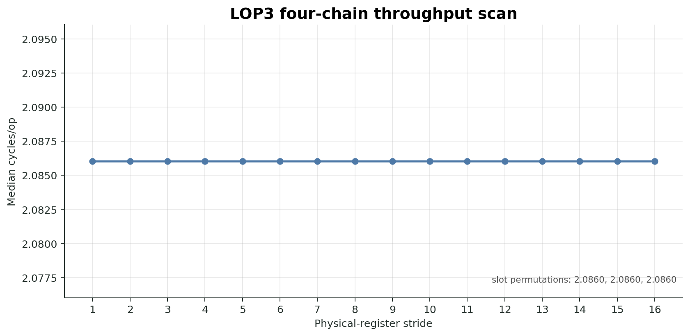
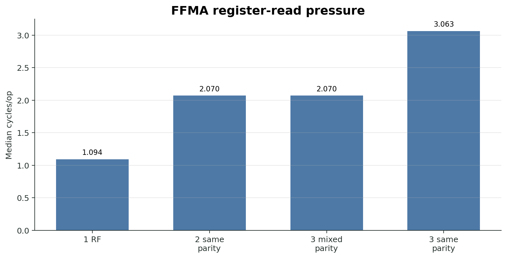
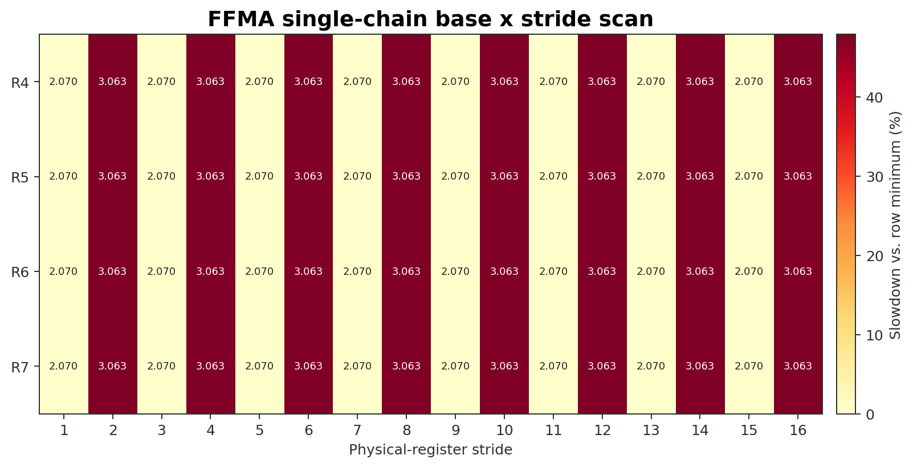
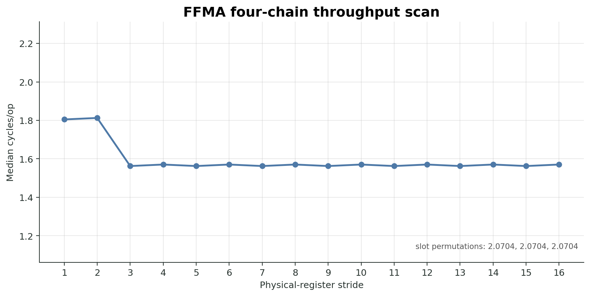
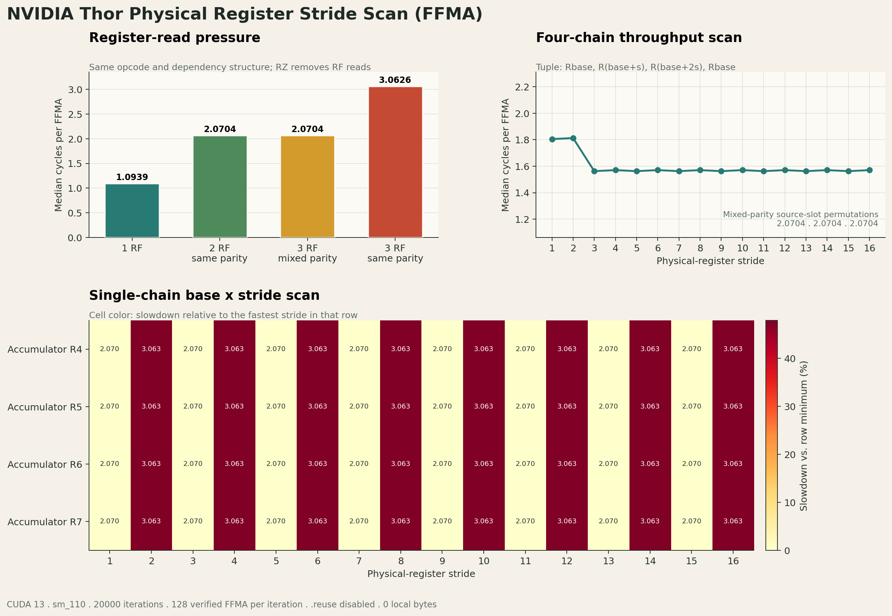

# Thor SM110 Register Operand Path Evidence

本文是当前推荐引用的正式证据说明，目标是讲清楚：

1. 实验如何构造。
2. 每组数据排除了什么替代解释。
3. 当前结论能支持到哪里，不能外推到哪里。

核心结论：

```text
tested visible service group = physical_register_id % 2
```

这说明已测试的标量寄存器操作数读取路径暴露出两个按物理寄存器编号奇偶划分的**可见服务组**。它不等价于“物理 SRAM register file 已证明只有 2 个 bank”。

## 正式运行命令

```bash
cd /xplorer/shijy/CUDA_optimazation/RegisterReserch/structureResearch

STAGE=main OPCODES=lop3,ffma ITERS=20000 WARMUPS=3 REPEATS=10 ./scripts/run_opcode_suite.sh
STAGE=tuple OPCODES=lop3,imad ITERS=5000 WARMUPS=2 REPEATS=5 ./scripts/run_opcode_suite.sh
STAGE=physical OPCODES=lop3,imad ITERS=5000 WARMUPS=2 REPEATS=5 ./scripts/run_opcode_suite.sh
```

主图可单独重生：

```bash
python3 scripts/plot_main_scan.py --family lop3
python3 scripts/plot_main_scan.py --family ffma
```

## 实验设计

### 1. patched SASS 主扫描

主扫描覆盖 `LOP3` 和 `FFMA`。流程是：

1. 编译模板 cubin。
2. 在 cubin 中 patch 定时区内 128 条目标指令的物理寄存器字段。
3. 清除 `.reuse` 位，避免 operand reuse cache 掩盖 RF 读取行为。
4. 用 `nvdisasm` 逐条回读验证 patch 后的寄存器 tuple 和 `.reuse` 状态。
5. 用 CUDA Driver API 运行 cubin，记录 median cycles/op。

每个主扫描 family 生成 87 个 cubin：

| 组别 | 数量 | 作用 |
|---|---:|---|
| `B0`-`B3` source-count controls | 4 | 区分 RF 源数量、奇偶压力和三源指令本身开销 |
| `M0`-`M2` source-slot permutations | 3 | 检查是否某个固定 source slot 导致差异 |
| `L_bXX_sYY` single-chain stride scan | 64 | `R4`-`R7` 四个 accumulator base × stride 1-16 |
| `T_sYY` four-chain throughput scan | 16 | 检查独立链能否隐藏单链额外延迟 |

核心 tuple 形状为：

```text
OP Rbase, R(base + stride), R(base + 2 * stride), Rbase
```

按奇偶分析：

```text
stride 为奇数：source parity = opposite, same, same  -> 最多两个同组源
stride 为偶数：source parity = same,     same, same  -> 三个同组源
```

所以如果真实可见限制是奇偶两组，奇数 stride 应快，偶数 stride 应慢。

### 2. tuple scan

主扫描的等距 stride 规则可能让人怀疑它只是在特定构造下出现周期性。因此增加 `LOP3/IMAD` 任意三源 tuple scan：

- 寄存器范围扩到 `R8..R71`。
- 设计专门区分 `mod2/mod4/mod8/mod16` 的 tuple。
- 对每个 tuple 统计各模数下最大同组源数。
- 用实际快慢结果比较各模数模型命中率。

### 3. physical probe

该阶段尝试更直接寻找物理 bank 分层迹象：

- source-slot permutation：同一组寄存器换 source slot，观察快慢是否改变。
- `same_mod4`、`split_mod4`、`same_mod8` pressure case：尝试让更细 `mod4/mod8` 结构在多独立链压力下显现。
- NCU metric query：查询是否存在 RF/register/operand-collector bank conflict 计数器。

## 图表

### LOP3 source-count controls



解释：

- `1 RF`、`2 same parity`、`3 mixed parity` 基本相同。
- `3 same parity` 增加约一个周期。
- 因此慢点不是“三源指令本身”，而是“第三个同可见组 RF 源”。

当前 CSV 摘要：

| Case | Median cycles/op | 解释 |
|---|---:|---|
| `B0_chain_1rf` | 2.086032 | 低 RF 压力基线 |
| `B1_chain_2rf_same_bank` | 2.086032 | 两个同奇偶源不产生额外可见延迟 |
| `B2_chain_3rf_mixed` | 2.086031 | 三源本身不慢 |
| `B3_chain_3rf_same_bank` | 3.070408 | 第三个同组源触发额外步骤 |

### LOP3 single-chain stride scan



解释：

- 四个 accumulator base (`R4`-`R7`) 都显示相同模式。
- 奇数 stride 全部快，偶数 stride 全部慢。
- 这和 `visible_group = register_id % 2` 完全一致。

### LOP3 four-chain throughput scan



解释：

- 多独立链下 stride 差异基本被隐藏。
- 这说明单链中的额外步骤可以被 ILP 遮住。
- 因此“吞吐实验看不到差异”不能反驳单链依赖延迟中的奇偶效应。

### FFMA source-count controls



解释：

- `1 RF` 明显更快，这是 `RZ`/低 RF 压力基线，不是 bank/group 判断核心。
- 核心关系是 `2 same parity ≈ 3 mixed parity < 3 same parity`。
- 这说明 `FFMA` 也在第三个同可见组源时暴露额外步骤。

当前 CSV 摘要：

| Case | Median cycles/op | 解释 |
|---|---:|---|
| `B0_chain_1rf` | 1.093889 | FFMA 低 RF 压力基线 |
| `B1_chain_2rf_same_bank` | 2.070408 | 两个同奇偶源无额外可见延迟 |
| `B2_chain_3rf_mixed` | 2.070408 | 三源本身不慢 |
| `B3_chain_3rf_same_bank` | 3.062596 | 第三个同组源触发额外步骤 |

### FFMA single-chain stride scan



解释：

- `FFMA` 与 `LOP3` 一样显示奇数 stride 快、偶数 stride 慢。
- 绝对 cycles/op 与 `LOP3` 不同，但“第三个同组源变慢”的结构一致。

### FFMA four-chain throughput scan



解释：

- `FFMA` 的吞吐曲线反映执行管线和 ILP 的影响，不能单独作为 bank/group 结论。
- 它的主要作用是和单链图配合，说明单链额外延迟不一定转化为同等吞吐差异。

### 总览图

旧版总览图仍保留，便于快速查看主扫描整体结果：




## 证据链

### 证据 1：source-count controls 锁定“第三个同组源”

如果慢点只是因为三源指令更复杂，那么 `3 mixed parity` 也应该慢。实际结果不是这样：

```text
2 same parity ~= 3 mixed parity < 3 same parity
```

这排除了“三源本身导致慢”的解释，并把慢点定位到“同一可见服务组内源数量达到 3”。

### 证据 2：stride scan 解释了奇偶周期

stride scan 中：

```text
stride odd  -> 最多两个同奇偶源 -> fast
stride even -> 三个同奇偶源     -> slow
```

`LOP3` 和 `FFMA` 都满足这个模式，说明该行为不是单一 opcode 的偶然现象。

### 证据 3：source-slot permutation 排除固定 slot 特殊路径

`M0`-`M2` 把同奇偶 source pair 放到不同 source slot 中。快慢关系不变，说明差异不是某个固定 operand slot 路由特殊造成的，而更像是按寄存器编号分组后的读取/收集仲裁。

### 证据 4：tuple scan 排除简单 `mod4/mod8/mod16` 可见模型

`LOP3` 和 `IMAD` tuple scan 均得到：

```text
mod2  model accuracy = 40/40 = 100.0%
mod4  model accuracy = 30/40 = 75.0%
mod8  model accuracy = 26/40 = 65.0%
mod16 model accuracy = 18/40 = 45.0%
```

这说明当前 timing 看到的可见分组更符合 `% 2`，而不是简单独立的 `% 4/% 8/% 16` 服务模型。

### 证据 5：physical probe 未暴露更细分层

physical probe 的 pressure case 中：

```text
LOP3:
same_mod4 - split_mod4 ~= 0.000000 c/op
same_mod8 - split_mod4 ~= -0.000001 c/op

IMAD:
same_mod4 - split_mod4 ~= 0.000000 c/op
same_mod8 - split_mod4 ~= 0.000000 c/op
```

这说明在当前测试路径上，`mod4/mod8` 分层没有形成稳定可测瓶颈。它不能证明物理 SRAM 没有更细 bank，只能说明这些更细结构没有被当前 operand path 暴露出来。

### 证据 6：NCU 没有直接 RF bank counter

`results/physical_probe/ncu_metric_candidates.txt` 的查询结果：

- direct RF/register/operand-collector bank candidates: `none`
- 找到的 bank conflict 指标主要是 `l1tex__data_bank_conflicts...`
- 这些是 L1TEX/LSU data-bank 指标，不是 register-file SRAM bank 指标

因此 NCU 目前不能给出“RF bank conflict count”这种直接证据。

## 更直接证据的查找结果

### 1. 当前本机 NCU 指标

本机工具：

```text
ncu version: 2025.3.1.0
offline chips: gb10b, gb110
```

已执行：

```bash
python3 scripts/physical_probe.py query-metrics
```

结论：

- 未找到直接命名为 RF/register/operand-collector bank conflict 的 counter。
- 找到的 `l1tex__data_bank_conflicts*` 是 LSU/L1TEX data-bank 指标，主要对应 shared/global/distributed shared 等 memory path，不是寄存器文件 RF bank。
- 找到的 `tpc__sm_rf_registers_allocated*`、`tpc__sm_rf_quanta_allocated*` 只描述 register allocation，占用类信息，不描述 RF read bank conflict。

### 2. 可作为旁证的 NCU 指标

以下指标不能直接证明 RF bank 数，但可以用于看 same-parity case 是否伴随更多 issue/stall：

```text
smsp__warps_issue_stalled_short_scoreboard
smsp__average_warp_latency_issue_stalled_short_scoreboard
smsp__average_warps_issue_stalled_short_scoreboard_per_issue_active
smsp__pcsamp_warps_issue_stalled_short_scoreboard
smsp__pcsamp_warps_issue_stalled_wait
smsp__pcsamp_warps_issue_stalled_dispatch_stall
smsp__mio2rf_writeback_active
sm__mio_pq_read_cycles_active
sm__mio_pq_write_cycles_active
```

使用建议：

```bash
METRICS='smsp__warps_issue_stalled_short_scoreboard.sum,smsp__average_warp_latency_issue_stalled_short_scoreboard,smsp__average_warps_issue_stalled_short_scoreboard_per_issue_active,smsp__mio2rf_writeback_active.avg,sm__mio_pq_read_cycles_active.avg,sm__mio_pq_write_cycles_active.avg' \
TARGET=bank_scan CASE=B2_chain_3rf_mixed ./scripts/run_ncu.sh

METRICS='smsp__warps_issue_stalled_short_scoreboard.sum,smsp__average_warp_latency_issue_stalled_short_scoreboard,smsp__average_warps_issue_stalled_short_scoreboard_per_issue_active,smsp__mio2rf_writeback_active.avg,sm__mio_pq_read_cycles_active.avg,sm__mio_pq_write_cycles_active.avg' \
TARGET=bank_scan CASE=B3_chain_3rf_same_bank ./scripts/run_ncu.sh
```

比较目标：

```text
B2_chain_3rf_mixed vs B3_chain_3rf_same_bank
L_b04_s01 vs L_b04_s02
```

如果 same-parity case 的 short-scoreboard 或 MIO/RF activity 稳定更高，它只能作为“operand read path 存在额外步骤”的旁证，仍不能单独定位到物理 SRAM bank。

### 3. 官方文档层面的结论

未找到公开文档直接给出 Thor/SM110 register-file SRAM bank 数、bank 映射或 RF bank conflict counter。Nsight Compute 官方文档说明 NCU 能采集 GPU performance metrics，并且 metric/section 可按需选择；实际可用指标仍以本机 `ncu --query-metrics` 结果为准。

### 4. 更底层验证路径

若目标是真正逼近物理 SRAM bank 数，优先级如下：

1. **PC sampling 旁证**：用 `PmSampling_WarpStates` 或上面列出的 `smsp__pcsamp_*` 指标比较 mixed/same case，确认 stall 是否落在被 patch 的目标指令附近。
2. **更宽 tuple 反证**：构造能区分 `2 visible groups`、`4 physical banks merged to 2 ports`、`collector 2-way arbitration` 的非等距 tuple，而不是只扩 stride。
3. **跨 opcode 主扫描**：补干净的 `IMAD/IADD3` 主扫描，看 integer MAD/add path 是否与 `LOP3/FFMA` 一致。
4. **硬件资料或非公开 counter**：如果 NVIDIA 文档、PerfWorks 内部 metric 或硬件白皮书没有暴露 RF bank counter，单靠 timing 无法闭合到物理 SRAM bank 数。

## 支持的结论

当前数据支持：

```text
visible_group(register) = physical_register_id % 2
```

并支持以下更具体说法：

- 已测试标量 operand path 暴露两个奇偶可见服务组。
- 每个可见组至少能无额外可见延迟地服务两个 RF 源。
- 单条指令第三个同组 RF 源会引入约一个周期的额外读取/收集步骤。
- 该行为在 `LOP3`、`FFMA` 主扫描，以及 `LOP3/IMAD` tuple/physical 对照中保持一致。

## 不支持的结论

当前数据不能证明：

- 物理 SRAM register file 只有 2 个 bank。
- `physical_register_id % 2` 就是底层 SRAM bank 映射。
- 限制一定发生在 SRAM array，而不是 read port、operand collector 或仲裁逻辑。
- 全部 opcode、全部寄存器编号、Tensor Core、uniform register 都使用同一路径。

换句话说，以下结构仍然与当前 timing 兼容：

```text
physical banks: 4/8/更多
        ↓
read-port / operand-collector / arbitration 合并
        ↓
timing 只看到两个奇偶可见服务组
```

## 推荐报告表述

推荐：

> Thor SM110 上的 patched-SASS 微基准显示：已测试的标量寄存器操作数读取路径暴露出按物理寄存器编号奇偶划分的两个有效服务组。当单条指令三个 RF 源都落在同一可见组时，会出现约一个周期的额外延迟。该结果描述的是已测试 operand path 的可见行为，不足以单独确定底层物理 SRAM bank 数。

不推荐：

> Thor 的 register file 已被证明是两个物理 SRAM bank，且 `register_id % 2` 就是物理 bank 映射。

## 后续实验优先级

1. 做一个与 `LOP3/FFMA` 完全同构的 `IMAD/IADD3` 主扫描。
2. 扩大物理寄存器编号范围和任意 tuple 覆盖，而不只增加等距 stride。
3. 寻找经验证的 RF read/port/bank counter；如果没有，NCU stall 指标只能作为旁证。
4. 若目标是真正的物理 SRAM bank 数，最终需要更直接的硬件计数器、文档或更底层验证手段。
