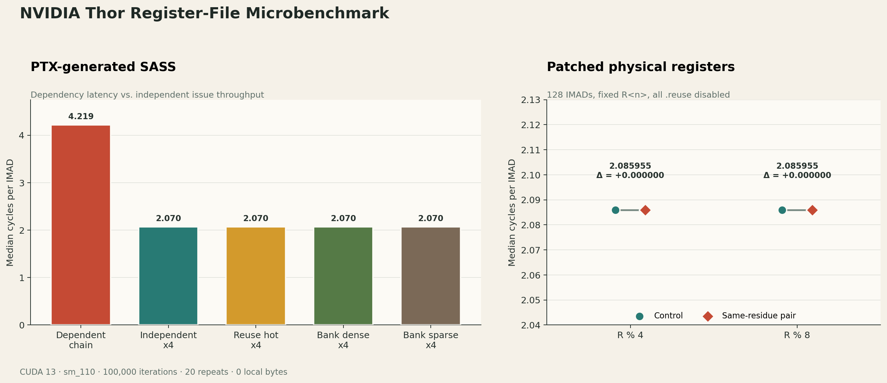
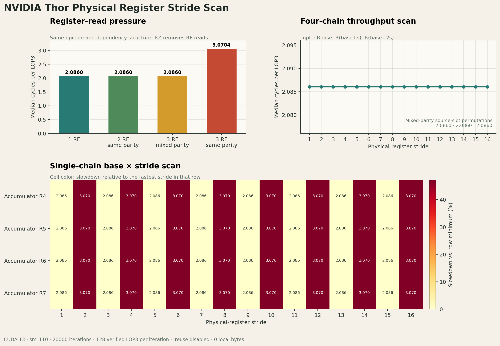

# Thor register-file structure research

This directory contains a SASS-verified CUDA microbenchmark for investigating
the effective register-file latency, throughput, operand reuse, and possible
bank/port organization of NVIDIA Thor (`sm_110`).

The physical register-file circuit is not documented by NVIDIA. Results from
this benchmark describe effective behavior under the generated SASS; they do
not prove the transistor-level bank count.

## Confirmed Thor parameters

The values below are reported by the CUDA Driver API and CUDA 13 occupancy
model on the local Thor system:

| Parameter | Value |
| --- | ---: |
| Compute capability | 11.0 |
| SM count | 20 |
| 32-bit registers per SM | 65,536 |
| Register-file capacity per SM | 256 KiB |
| SM subpartitions | 4 |
| Registers per subpartition | 16,384 (64 KiB) |
| Register allocation granularity | 256 registers per warp |
| Maximum registers per thread | 255 |
| Maximum registers per block | 65,536 |
| Maximum resident threads per SM | 1,536 |
| Maximum resident warps per SM | 48 |
| Maximum resident blocks per SM | 24 |

Four SM subpartitions do not mean that the register file has four physical
banks. The bank count, bank mapping, read/write ports, and operand-reuse-buffer
capacity remain undocumented.

## Measurement method

Every probe launches one 32-lane warp in one block. Each lane loads source
values before timing, then measures an explicitly unrolled inline-PTX region
using two `clock64` reads:

```text
one block
└── one warp
    ├── load source values
    ├── CS2R SR_CLOCKLO
    ├── repeated register-only IMAD instructions
    ├── CS2R SR_CLOCKLO
    └── write cycles and checksum
```

The timed region contains no global/shared-memory operations. The output CSV
reports median and minimum cycles per PTX operation, compiler-reported
registers per thread, and local-memory bytes. Cases run in a rotating
round-robin order so temporary system interference is distributed across
them. A nonzero `local_bytes` value indicates spilling and makes that case
unsuitable for register-file inference.

The operations are expanded 32 times inside each loop iteration. This
amortizes loop-control cost and prevents a single branch from dominating the
measurement.

## Cases

| Case | Timed instructions per iteration | Purpose |
| --- | ---: | --- |
| `R0_imad_chain` | 32 | Dependent three-source IMAD latency |
| `R1_imad_independent_x4` | 128 | Four independent accumulator streams |
| `R2_reuse_hot_x4` | 128 | Shared source operands; inspect `.reuse` |
| `R3_bank_dense_x4` | 128 | Dense virtual-source selection |
| `R4_bank_sparse_x4` | 128 | Sparse virtual-source selection |

`R0` measures dependency latency, while `R1` estimates the throughput of
independent instructions. `R2` checks whether `ptxas` marks repeatedly used
source operands with `.reuse`. `R3` and `R4` provide different physical
register tuples after allocation for candidate modulo-bank analysis.

CUDA/PTX register names are virtual. Only the final SASS `R<n>` identifiers are
used for bank hypotheses.

## Build and run

```bash
cd CUDA_optimazation/RegisterReserch/structureResearch

./scripts/build.sh
./scripts/run_basic.sh
```

Useful overrides:

```bash
ITERS=200000 WARMUPS=5 REPEATS=30 ./scripts/run_basic.sh
CASE=bank_candidate ./scripts/run_basic.sh
./scripts/run_basic.sh --case R3_bank_dense_x4 --iters 200000
```

Basic results are written to:

```text
results/basic_results.csv
results/cycles_per_op.png
```

## SASS analysis

Always inspect SASS before interpreting timing:

```bash
./scripts/run_sass.sh
```

The analyzer locates the region between the two `CS2R SR_CLOCKLO`
instructions. It records the actual source registers and `.reuse` modifiers:

```text
results/sass_operands.csv
results/sass_summary.txt
```

For candidate bank counts 2, 4, 8, and 16, it computes source-register
collisions under the hypothesis:

```text
candidate_bank = physical_register_id % candidate_bank_count
```

Two scores are emitted:

- `all_modN_pairs` includes all source operands.
- `rf_modN_pairs` excludes operands marked `.reuse`, since they may be served
  by the operand-reuse path instead of rereading the main register file.

A modulo score is only a hypothesis. Evidence for an effective `N`-bank
pattern requires all of the following:

1. Cases with different `rf_modN` scores have otherwise equivalent SASS.
2. Higher collision scores repeatedly correlate with worse cycles/op.
3. The relationship survives changes in iteration count and instruction mix.
4. Competing modulo hypotheses do not explain the measurements equally well.

If timing is unchanged despite different collision scores, possible
explanations include multiple RF read ports, operand collectors hiding the
conflict, a non-modulo mapping, or compiler scheduling that avoids the
collision.

## Direct SASS register control

The second-stage experiment bypasses PTX register allocation after compiling a
template cubin. It patches the physical register fields in each timed `IMAD`,
clears all operand-reuse flags, and then asks `nvdisasm` to verify every
instruction before the CUDA Driver API loads the cubin:

```bash
./scripts/run_sass_patched.sh
```

The generated files are:

```text
results/sass_patched/manifest.csv
results/sass_patched/results.csv
results/sass_patched/S*.cubin
```

The current `sm_110` template has 128 timed `IMAD` instructions, 29 registers
per thread, and no local-memory spill. The patcher controls all four displayed
register operands:

```text
IMAD Rdst, Rsrc0, Rsrc1, Rdst
```

It also clears the `.reuse` control bits. Verification fails unless all 128
instructions disassemble to the requested `R<n>` tuples with zero `.reuse`
operands.

The four balanced cases use the same source-register set and frequency within
each control/conflict pair:

| Case | Source-pair hypothesis |
| --- | --- |
| `S0_mod4_control_noreuse` | `src0 % 4 != src1 % 4` |
| `S1_mod4_conflict_noreuse` | `src0 % 4 == src1 % 4` |
| `S2_mod8_control_noreuse` | `src0 % 8 != src1 % 8` |
| `S3_mod8_conflict_noreuse` | `src0 % 8 == src1 % 8` |

On the local Thor, the default run (`100000` iterations, 20 repeats) produced:

| Case | Median cycles/op | Local bytes |
| --- | ---: | ---: |
| `S0_mod4_control_noreuse` | 2.085955 | 0 |
| `S1_mod4_conflict_noreuse` | 2.085955 | 0 |
| `S2_mod8_control_noreuse` | 2.085955 | 0 |
| `S3_mod8_conflict_noreuse` | 2.085955 | 0 |



This removes both `ptxas` register renumbering and operand reuse as competing
explanations. No effective serialization is visible for the tested modulo-4
or modulo-8 source-pair hypotheses. It does not prove that the physical
register file has neither 4 nor 8 banks: a multiported bank, operand collector,
different mapping function, or IMAD execution throughput can still hide the
bank organization.

CUDA cubin instruction encoding is not a documented stable ABI. The patcher is
therefore intentionally restricted to the observed CUDA 13 `sm_110` IMAD
encoding and always performs disassembly readback. Re-run its validation after
any CUDA toolkit or architecture change.

## LOP3 bank-stride scan

The third-stage experiment uses a three-source `LOP3.LUT` dependency chain to
make register-read latency visible. Its template keeps physical registers
`R4` through `R39` initialized and patches each instruction to:

```text
LOP3 Rbase, R(base+s), R(base+2s), Rbase
```

Run the complete scan with:

```bash
./scripts/run_bank_scan.sh
```

The script generates and verifies 87 cubins:

- Four 1/2/3-source read-pressure controls.
- Three source-slot permutations.
- Four accumulator bases (`R4` through `R7`) by 16 strides.
- Sixteen four-independent-chain throughput cases.

Every cubin contains exactly 128 timed `LOP3` instructions with fixed physical
registers, zero `.reuse` operands, and zero local-memory bytes.

The local Thor result is:

| Register sources | Median cycles/LOP3 |
| --- | ---: |
| One RF read | 2.086031 |
| Two reads, same parity | 2.086031 |
| Three reads, mixed parity | 2.086031 |
| Three reads, all same parity | 3.070406 |

All odd strides measure approximately `2.086` cycles, while all even strides
measure approximately `3.070` cycles for every tested base register. Moving
the same-parity pair among `(src0, src1)`, `(src0, src2)`, and `(src1, src2)`
does not change the fast result. The three-same-parity case adds approximately
one cycle, or `47.19%`.



This is strong evidence that the tested Thor `LOP3` register-operand path has
**two effective banks**, selected by:

```text
effective_bank = physical_register_id % 2
```

Each effective bank can serve at least two source reads without exposing
additional dependency latency; a third same-bank source incurs an extra
collector/read step. Four independent chains hide that latency, which explains
why the throughput scan and the earlier IMAD experiment remain flat.

The conclusion is about the effective operand path seen by one warp in one SM
subpartition. Timing cannot prove the number of underlying SRAM macros, nor
whether the two-way behavior is implemented in the register array, ports, or
operand collector. It also should not be generalized to tensor-core or uniform
register paths without separate measurements.

## Nsight Compute

```bash
./scripts/run_ncu.sh
./scripts/run_ncu.sh --case bank_candidate --iters 10000
```

The script collects instruction/cycle totals and issue-stall metrics into
`results/ncu/summary.csv`. Thor does not expose a direct register-bank-conflict
counter, so NCU stall metrics are supporting evidence rather than a direct
bank-count measurement.

## Interpretation limits

- `.reuse` proves that the ISA/compiler supports operand reuse, but it does not
  reveal reuse-buffer capacity or replacement policy.
- In the PTX cases, `ptxas` can reorder physical registers to avoid conflicts.
- In the patched-SASS cases, private instruction encoding may change between
  architectures or toolkits.
- Register read-port pressure, bank conflicts, dependency latency, and
  execution-pipeline throughput can produce similar timing effects.
- A result applies to the tested instruction and SASS operand pattern; another
  instruction class may use a different operand path.
- Definitive physical parameters require NVIDIA disclosure or lower-level
  hardware analysis. This benchmark can infer effective behavior only.

## References

- [CUDA compute-capability parameters](https://docs.nvidia.com/cuda/cuda-programming-guide/05-appendices/compute-capabilities.html)
- [CUDA on-chip register file](https://docs.nvidia.com/cuda/cuda-programming-guide/01-introduction/programming-model.html)
- [CUDA binary utilities](https://docs.nvidia.com/cuda/cuda-binary-utilities/)
