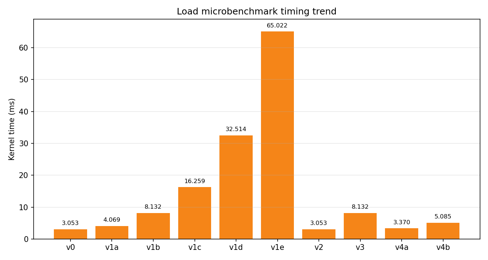
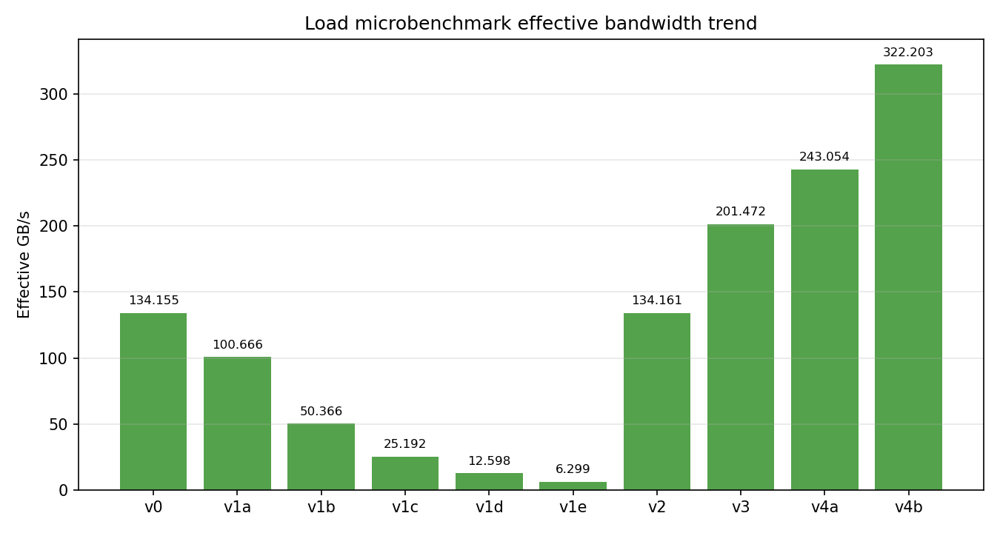
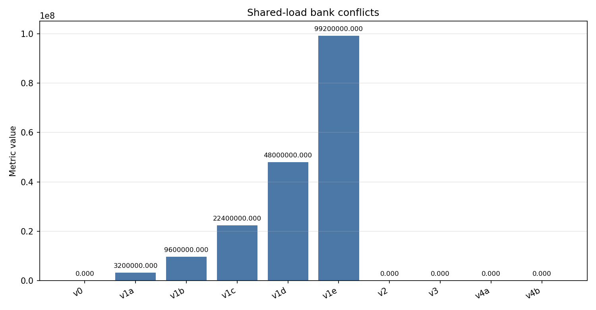
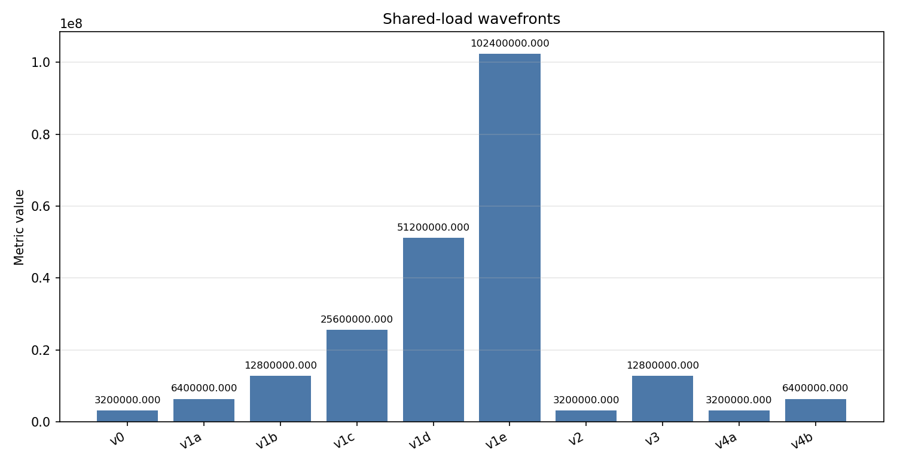
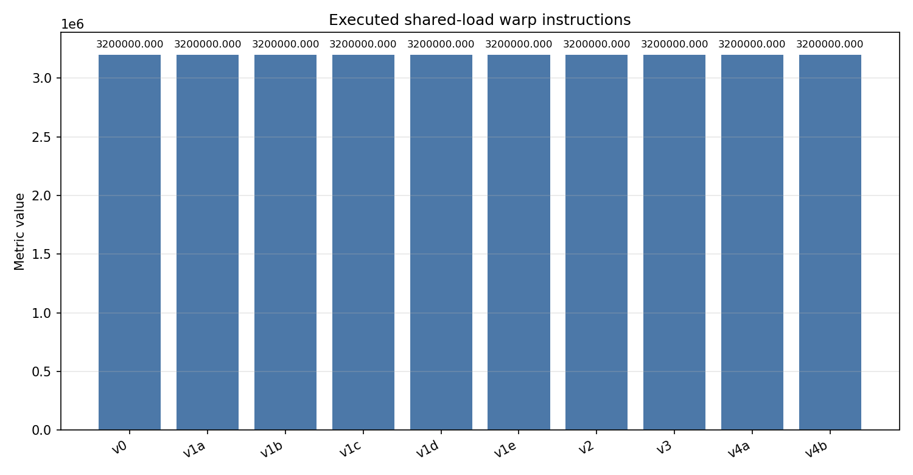

# One-dimensional `ld.shared` bank-conflict microbenchmarks

This directory contains a standalone CUDA microbenchmark for ordinary
`ld.shared` instructions. It uses one block of `dim3(32, 8, 1)`: `threadIdx.x`
is the lane and `threadIdx.y` is the warp.

## Cases

For 32-bit words, the simplified mapping is:

```text
linear_index = row * pitch + col
bank = linear_index % 32
```

| Version | CLI case | Per-lane mapping within each warp | Purpose |
|---|---|---|---|
| `v0` | `v0` | `s[warp * 32 + lane]` | No-conflict baseline: 32 lanes access 32 distinct banks |
| `v1a` | `v1a` | `s[lane * 2]` | Nominal 2-way bank conflict |
| `v1b` | `v1b` | `s[lane * 4]` | Nominal 4-way bank conflict |
| `v1c` | `v1c` | `s[lane * 8]` | Nominal 8-way bank conflict |
| `v1d` | `v1d` | `s[lane * 16]` | Nominal 16-way bank conflict |
| `v1e` | `v1e` | `s[lane * 32]` | 32 distinct words in the same bank |
| `v2` | `v2` | `s[warp * 32]` | Broadcast: all 32 lanes load the same word |
| `v3` | `v3` | `s[warp * 128 + lane * 4 + 0..3]` | Each lane performs one contiguous `ld.shared.v4.f32` |
| `v4a` | `v4a` | `s[warp * 32 + (lane / 2) * 2 + 0..1]` | Each lane pair loads the same `float2` |
| `v4b` | `v4b` | `s[warp * 32 + (lane / 4) * 4 + 0..3]` | Each four-lane group loads the same `float4` |

A bank conflict is a property of addresses requested by one shared-memory
instruction in one warp. Activity from different warps is better described as
shared-memory contention or throughput pressure; it is not part of the
same-warp bank-conflict definition.

Broadcast and multicast requests have repeated addresses. Hardware can serve
same-address requests differently from distinct-word requests that map to the
same bank, so they should not be interpreted as ordinary N-way conflicts.

Each loop iteration issues four volatile inline-PTX shared loads and accumulates
them through four independent dependency chains (`acc0` through `acc3`). The
accumulators are merged only after the loop. Consequently, `loads_per_thread`
is `iters * 4`; this reduces arithmetic dependency serialization without
allowing the compiler to remove or merge the measured loads.

These experiments cover conventional `ld.shared` instructions on the LSU path.
Do not directly extrapolate their results to TMA, descriptor-based operations,
or the `tcgen05` MMA path.

## Build

From `bank_conflict/ld_shared_1d`:

```bash
./scripts/build.sh
CUDA_ARCH=80 ./scripts/build.sh
```

The build defaults to SM110 for the Thor target and passes `CUDA_ARCH` to
`CMAKE_CUDA_ARCHITECTURES` when overridden. Values such as 80, 90, 100, and
110 are accepted when supported by the installed toolkit.
Equivalent direct use is:

```bash
cmake -S src -B build -DCMAKE_CUDA_ARCHITECTURES=80
cmake --build build --parallel
```

## Run

```bash
./build/smem_bank_bench --case v0 --iters 100000
./build/smem_bank_bench --case v1c --iters 100000
./build/smem_bank_bench --case all --iters 100000

./scripts/run_basic.sh
./scripts/verify_sass.sh
./scripts/run_ncu.sh
```

`scripts/run_basic.sh` writes `results/basic_results.csv` and then invokes
`parse_results.py` to print summary tables plus PNG charts, including
`all_cases_avg_ms_bar.png` and `all_cases_effective_gbps_bar.png`.
Set `ITERS` to shorten or lengthen a run, for example
`ITERS=1000 ./scripts/run_basic.sh`.
Set `WARMUPS` and `REPEATS` to change the measurement loop, for example
`WARMUPS=10 REPEATS=50 ./scripts/run_basic.sh`. Direct invocation also accepts
`--warmups N --repeats N`.
By default each case has five warmups and twenty timed repetitions.
`effective_GBps` counts requested bytes and uses average elapsed time; it is a
microbenchmark-derived effective rate, not necessarily physical shared-memory
traffic.

## Results

The following charts were collected on the SM110 target with `ITERS=100000`.
The timing and effective-bandwidth plots show the performance trend:





The Nsight Compute counters provide the primary evidence for the shared-memory
behavior:







## Validation

The timing and effective-bandwidth charts from `scripts/run_basic.sh` show
trends only. They are sensitive to launch overhead, clocks, scheduling, and the
surrounding instruction stream. **Timing is supporting evidence; the NCU
hardware counters are the primary evidence for shared-memory bank-conflict
behavior.**

`scripts/verify_sass.sh` rebuilds the benchmark, dumps SASS with `cuobjdump`,
extracts the embedded cubin, and checks it again with `nvdisasm`. It fails
unless both shared loads (`LDS`) and shared stores (`STS`) are present. The
disassemblies are written to `results/sass/`.

`scripts/run_ncu.sh` builds the benchmark, profiles every numbered case
separately into `results/ncu/`, and then invokes `parse_ncu_results.py` to print
metric tables and generate one PNG bar chart per collected metric.
It defaults to zero warmups and one measured launch because profiler replay
already collects the hardware counters; set `WARMUPS` or `REPEATS` only when
additional launches are intentional.
The default NCU metrics are shared-load bank conflicts, shared-load L1TEX
wavefronts, and executed shared-load warp instructions. Metric availability
varies by architecture and Nsight Compute release. Override the comma-separated
`METRICS` environment variable when needed. If a metric is rejected, inspect
available names with:

```bash
ncu --query-metrics | grep -Ei "bank|shared|l1tex"
```

If the running NVIDIA driver restricts GPU performance counters to
administrators, `scripts/run_ncu.sh` automatically uses passwordless `sudo` for `ncu`
and restores ownership of the generated CSV files. This machine also has
`NVreg_RestrictProfilingToAdminUsers=0` configured for the next driver reload,
so `sudo` will no longer be needed after a reboot.

The benchmark uses volatile inline PTX (`ld.volatile.shared.f32`,
`ld.volatile.shared.v2.f32`, and `ld.volatile.shared.v4.f32`) and writes each
thread's accumulator to global memory to preserve the measured loads.
