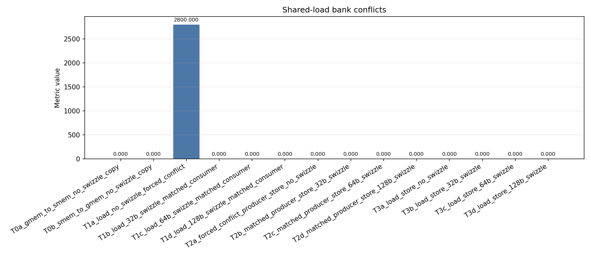
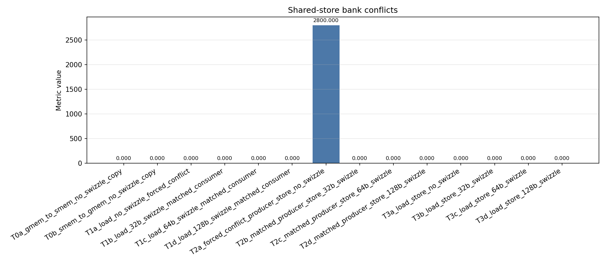
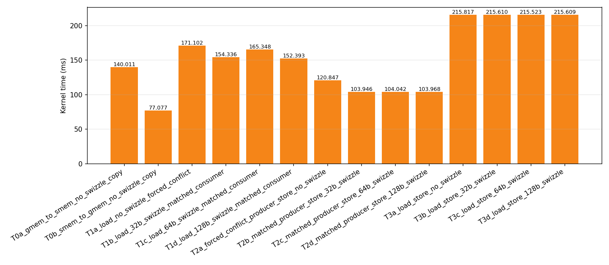
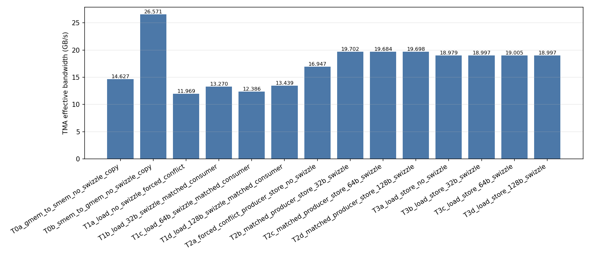

# TMA copy, shared-memory consumer/producer, and round-trip benchmark

This benchmark separates four questions that should not be mixed:

1. Can the profiler observe a copy performed by the TMA async proxy?
2. After a TMA load, what happens when an ordinary LSU consumer reads the
   resulting shared-memory layout?
3. Before a TMA store, what happens when an ordinary LSU producer writes that
   layout?
4. What is the end-to-end cost of a TMA load followed by a TMA store-back?

TMA itself does not issue one ordinary `ld.shared` or `st.shared` per lane.
Consequently, T0 and T3 must not be described as N-way bank-conflict tests.
Shared-memory bank-conflict counters are interpreted primarily for the
ordinary consumer in T1 and producer in T2.

## Controlled tensor geometry

Every case transfers the same 4096-byte tile and uses the same tensor box:

```text
data type          = uint8
box                = 32 bytes × 128 rows
total bytes        = 4096
shared alignment   = 1024 bytes
threads per block  = 256
consumer/producer  = one 32-lane warp
```

The 32-byte innermost box span is legal for none, 32B, 64B, and 128B tensor-map
swizzle modes. Keeping the logical geometry fixed avoids the old benchmark's
`128×32`, `32×128`, and `64×64` tensor-box change.

When the swizzle width is larger than the 32-byte inner dimension, the CUDA
guide requires shared memory to accommodate the complete swizzle width.
Physical shared-memory footprints are therefore:

| Swizzle | Physical row span | Shared footprint |
| --- | ---: | ---: |
| none | 32 bytes | 4096 bytes |
| 32B | 32 bytes | 4096 bytes |
| 64B | 64 bytes | 8192 bytes |
| 128B | 128 bytes | 16384 bytes |

This footprint difference is an inherent resource cost and is emitted as
`shared_bytes` in the CSV.

Swizzle operates on 16-byte atoms. With a 1024-byte-aligned shared base, the
matched ordinary LSU address calculation uses:

```text
row             = logical_byte_offset / 32
atom_in_row     = (logical_byte_offset % 32) / 16
atoms_per_span  = swizzle_width / 16
base_offset     = ((row * swizzle_width) / 128) % atoms_per_span
physical_atom   = base_offset XOR atom_in_row
physical_offset = row * swizzle_width + physical_atom * 16
```

Bytes inside each 16-byte atom retain their order. The consumer and producer
use explicit 16-byte `ld.shared.v4.u32` and `st.shared.v4.u32` operations.

## T0: copy-only and profiler observability

| Case | Operation | Purpose |
| --- | --- | --- |
| `T0a_gmem_to_smem_no_swizzle_copy` | TMA GMEM → SMEM | Baseline load throughput and profiler visibility |
| `T0b_smem_to_gmem_no_swizzle_copy` | TMA SMEM → GMEM | Baseline store throughput and bulk-group completion |

T0 has no timed ordinary shared-memory consumer/producer inside the iteration.
The shared tile initialization and final checksum are fixed per-kernel setup
and validation work, amortized by `--iters`.

## T1: consumer reads after TMA load

| Case | TMA load layout | Ordinary consumer |
| --- | --- | --- |
| `T1a_load_no_swizzle_forced_conflict` | none | 128-byte-stride 16-byte load (forced 8-way conflict) |
| `T1b_load_32b_swizzle_matched_consumer` | 32B | Matched swizzled column load |
| `T1c_load_64b_swizzle_matched_consumer` | 64B | Matched swizzled column load |
| `T1d_load_128b_swizzle_matched_consumer` | 128B | Matched swizzled column load |

Each iteration waits for TMA load completion and then one warp reads one
16-byte logical atom per lane. The no-swizzle case uses a deliberate 128-byte
stride. Since `LDS.128` is handled as four 8-lane transactions, each transaction
maps all eight lane accesses to the same four banks and creates an 8-way
conflict. The swizzled cases apply the matching 16-byte-atom mapping before
issuing ordinary LSU shared loads.

T1 is the stage where shared-load bank-conflict metrics are meaningful.

## T2: producer writes before TMA store

| Case | Ordinary producer | TMA store layout |
| --- | --- | --- |
| `T2a_forced_conflict_producer_store_no_swizzle` | 128-byte-stride 16-byte store (forced 8-way conflict) | none |
| `T2b_matched_producer_store_32b_swizzle` | Matched swizzled store | 32B |
| `T2c_matched_producer_store_64b_swizzle` | Matched swizzled store | 64B |
| `T2d_matched_producer_store_128b_swizzle` | Matched swizzled store | 128B |

One warp writes one logical 16-byte atom per lane. The no-swizzle case uses the
same deliberate 128-byte conflict stride as T1a. After CTA synchronization, the
issuing thread executes:

```text
fence.proxy.async.shared::cta
TMA SMEM → GMEM
cp.async.bulk.commit_group
cp.async.bulk.wait_group 0
```

The proxy fence makes generic-proxy shared writes visible to the TMA async
proxy. T2 is the stage where shared-store bank-conflict metrics are meaningful.

## T3: TMA load plus TMA store-back

| Case | Round-trip layout |
| --- | --- |
| `T3a_load_store_no_swizzle` | none |
| `T3b_load_store_32b_swizzle` | 32B |
| `T3c_load_store_64b_swizzle` | 64B |
| `T3d_load_store_128b_swizzle` | 128B |

Each iteration performs:

```text
GMEM input
  → TMA load
  → swizzled or linear SMEM tile
  → TMA store with the matching tensor map
  → GMEM output
```

There is no ordinary per-lane consumer or producer in T3. It measures the
round-trip TMA path and verifies that store-back reconstructs the original
global-memory byte order.

## 中文实验描述

下面的描述可直接用于实验报告。这里把 TMA 搬运与普通 LSU
`ld.shared`/`st.shared` 分开讨论，避免把 TMA async proxy 的行为直接解释成
warp 级 bank conflict。

### T0：纯 TMA baseline

T0 不在计时循环内执行普通 shared-memory load/store，仅测量 TMA 搬运：

```text
T0a: global memory → TMA load  → shared memory
T0b: shared memory → TMA store → global memory
```

`T0a_gmem_to_smem_no_swizzle_copy` 是 TMA load baseline；
`T0b_smem_to_gmem_no_swizzle_copy` 是 TMA store baseline。两者都使用
no-swizzle tensor map，用于给 T1/T2 提供搬运时间基线。由于没有 warp
执行普通 `LDS` 或 `STS`，T0 不属于 bank-conflict 对照实验。

### T1：TMA load 后的 shared-memory consumer

T1 先把 4096-byte tile 从 global memory 搬入 shared memory，等待 TMA
完成后，再由一个 warp 执行一次 16-byte `LDS.128`：

```text
TMA load → mbarrier wait → one-warp LDS.128 consumer
```

`T1a_load_no_swizzle_forced_conflict` 使用 no-swizzle layout，并故意令相邻
lane 的起始地址相差 128 bytes：

```text
offset(lane) = lane * 128
bank(lane, word) = ((lane * 128 + word * 4) / 4) % 32
                 = word
```

因此，不同 lane 访问不同地址，但每个 32-bit 分量都映射到相同 bank。
一个 warp 的 `LDS.128` 会拆成四个 8-lane、128-byte transaction；每个
transaction 形成 8-way bank conflict，需要 8 个 wavefront，相比理想情况
多出 7 个。每次迭代因此产生：

```text
4 transactions * (8 - 1) = 28 bank conflicts
```

当 NCU 使用 100 次迭代时，对应 `28 * 100 = 2800`，与实测一致。

`T1b`、`T1c` 和 `T1d` 分别使用 32B、64B 和 128B TMA swizzle。consumer
按照 tensor-map swizzle 规则计算匹配的物理地址：

```text
base_offset   = ((row * swizzle_width) / 128) % atoms_per_span
physical_atom = base_offset XOR atom_in_row
```

匹配后的 lane 访问被分散到不同 shared-memory bank，实测普通 shared-load
bank conflict 为 0。32B swizzle 的 shared-memory footprint 仍为 4 KiB；
64B 和 128B swizzle 分别需要 8 KiB 和 16 KiB。

#### T1 shared-load bank-conflict 结果



NCU 使用 100 次迭代。T1a 的 2800 个 conflict 正好对应
`28 conflicts/iteration * 100 iterations`；T1b、T1c、T1d 均为 0，说明
matched swizzled consumer 已经消除了普通 `LDS.128` 的 bank conflict。

Basic 使用 10,000 次迭代时，T1a、T1b、T1c、T1d 分别耗时
3.391、3.046、3.279、3.033 ms。T1a 比 T1b 慢约 11.3%，说明强制 8-way
bank conflict 已产生可见开销。T1c 虽然没有 conflict，却比 T1b 慢约
7.6%，这是下面单独讨论的代码生成异常。

#### T1c 64B 地址计算异常

对 T1b/T1c/T1d 额外执行 10,000 次迭代的 NCU 指令诊断，结果如下：

| Metric | T1b 32B | T1c 64B | T1d 128B |
| --- | ---: | ---: | ---: |
| Dynamic instructions | 1,824,120 | 2,184,576 | 1,824,376 |
| TMA active cycles | 4,500 | 4,500 | 4,500 |
| TMA XBAR active cycles | 640,000 | 640,000 | 640,000 |
| Shared-load wavefronts | 40,128 | 40,128 | 40,128 |
| Shared-load bank conflicts | 0 | 0 | 0 |

T1c 比 T1b 多执行约 360,000 条动态指令，折算后每轮多约 36 条 warp
instruction。增加部分主要来自 ALU、ADU 和 uniform pipe，而不是
`LDS.128`、TMA active cycles 或 bank conflict。

三种 swizzle 会生成三个独立的模板 kernel，`ptxas` 会分别优化它们。
64B 模式把 shared tile 扩大到 8 KiB，同时改变了 tile 和
`barrier_storage` 的静态 shared address。在当前 CUDA 13.0、`sm_110`
编译结果中，T1b/T1d 的 load 可以使用较短的 base-plus-offset 地址：

```text
T1b/T1d: LDS.128 [R2 + UR4]
```

T1c 则生成了完整寄存器地址，并在循环内出现额外的 `UIADD3`、`ULEA` 和
`IMAD` 地址物化：

```text
T1c: UIADD3 / ULEA / IMAD ...
     LDS.128 [R6]
```

内联 PTX 的 `memory` clobber、mbarrier 和 `__syncthreads()` 会限制跨循环
的公共子表达式消除。当前 `ptxas` 在 64B 特化中选择重新物化部分
shared/barrier 地址，而 32B/128B 特化保留了更短的地址形式。因此 T1c
变慢属于当前编译器和目标架构下的代码生成现象，不能解释为 64B TMA
swizzle 本身更慢。

### T2：TMA store 前的 shared-memory producer

T2 与 T1 的方向相反。一个 warp 先通过普通 `STS.128` 写 shared memory，
随后通过 proxy fence 将写入对 TMA async proxy 可见，再执行 TMA store：

```text
one-warp STS.128 producer
→ fence.proxy.async.shared::cta
→ TMA store
→ global memory
```

`T2a_forced_conflict_producer_store_no_swizzle` 同样采用
`offset(lane) = lane * 128`，所以每个 `STS.128` 形成四个 8-way conflict
transaction。100 次迭代产生 2800 个 ordinary shared-store bank conflicts。

`T2b`、`T2c` 和 `T2d` 分别使用匹配的 32B、64B 和 128B swizzled producer
地址。它们保持 TMA 所需的物理 layout，同时把普通 shared-store bank
conflict 降为 0。代价仍然是 64B/128B swizzle 需要更大的 shared-memory
footprint。

#### T2 shared-store bank-conflict 结果



NCU 使用 100 次迭代。T2a 同样产生 2800 个 conflict，T2b、T2c、T2d
均为 0。Basic 中 T2a 耗时 2.423 ms，而三个 matched-swizzle case 均约
2.085 ms，因此强制 store conflict 带来约 16.2% 的额外时间。

即使没有 bank conflict，T2b/T2c/T2d 仍比纯 TMA store baseline T0b
慢约 35%。这部分差异来自普通 `STS.128`、写入值生成、proxy fence 和
额外同步，不能解释成 TMA store 引擎变慢。

### T3：纯 TMA round trip

T3 执行一次完整的 TMA 往返：

```text
global input
→ TMA load
→ linear or swizzled shared-memory tile
→ matching TMA store
→ global output
```

`T3a` 使用 no swizzle，`T3b`、`T3c`、`T3d` 分别使用 32B、64B 和 128B
swizzle。T3 中没有普通 per-lane `LDS`/`STS`，目的是比较纯 TMA round-trip
时间、swizzle layout 和 shared-memory footprint，而不是制造 bank
conflict。若在 T3a 中加入普通冲突访问，就会同时混入 LSU 和同步开销，
失去纯 TMA baseline 的意义。

T3a、T3b、T3c、T3d 分别耗时 4.285、4.277、4.280、4.278 ms，最大差异
小于 0.2%。这说明在当前 4 KiB logical tile 和单 block 场景下，四种
swizzle 的纯 TMA round-trip 性能基本一致。T3c 没有出现 T1c 的性能下降，
也进一步证明 T1c 的异常来自普通 LSU/shared-address 代码生成，而不是
64B TMA 数据路径。

需要注意，T1a/T2a 使用 128-byte stride 构造压力场景，而 matched-swizzle
case 使用逻辑 column 地址，因此二者用于展示“强冲突与无冲突”的性能边界，
不是完全相同逻辑地址序列下的严格 A/B 测试。

### 总体性能结果

以下两张图来自 `results/basic_results.csv`，配置为 10,000 iterations、
1 次 warmup 和 3 次 repeat。所有 case 的 correctness 均为 `PASS`。



T0 是纯 TMA baseline。T1 在 TMA load 后增加普通 shared consumer、地址
计算、累加和一次额外同步；T2 在 TMA store 前增加普通 shared producer、
proxy fence 和同步。因此 T1/T2 相对 T0 的时间差不能全部归因于 bank
conflict。bank conflict 的影响应主要通过 T1a 对比 T1b，以及 T2a 对比
T2b 观察。



`effective_GBps` 只统计 TMA 搬运字节，却使用整个 kernel elapsed time。
因此 T1/T2 的带宽下降表示端到端 consumer/producer 开销增加，并不代表
TMA 引擎自身带宽下降。T3 每轮统计一次 4096-byte load 和一次
4096-byte store，共 8192 bytes。

NCU 中的 `shared_bank_reads` 和 `shared_bank_writes` 还包含初始化、最终
校验以及 TMA 相关 shared-memory activity，不能直接当作普通 consumer
执行次数。普通 LSU bank-conflict counter 主要应在 T1/T2 中解释；
T0/T3 没有 per-lane `LDS`/`STS`，不应描述成 N-way bank-conflict 测试。

## Correctness and CSV

All cases report `PASS` or `FAIL`:

- T0a and T1 validate the final shared-tile checksum.
- T0b validates the stored copy.
- T2 simulates the matched producer layout on the host and compares every
  output byte.
- T3 compares every output byte with the input.

CSV fields:

```text
experiment,case,direction,swizzle,box_x_bytes,box_y,shared_bytes,
consumer,producer,tma_operations,iters,avg_ms,min_ms,
tma_bytes,effective_GBps,correctness
```

`effective_GBps` counts only TMA transfer bytes. T0–T2 count 4096 bytes per
iteration; T3 counts 8192 bytes because it performs one load and one store.

## Build and run

```bash
CUDA_ARCH=110 ./scripts/build.sh
./scripts/run_basic.sh
./scripts/run_basic.sh --case T0
./scripts/run_basic.sh --case T1 --iters 1000
./scripts/run_basic.sh --case T2c_matched_producer_store_64b_swizzle
```

`run_basic.sh` writes `results/basic_results.csv` and generates:

- `results/avg_ms.png`
- `results/effective_gbps.png`

The CLI supports `--case all`, stage selectors `T0` through `T3`, exact case
names, `--iters`, `--warmups`, `--repeats`, and `--list-cases`.

## Nsight Compute

```bash
./scripts/run_ncu.sh
./scripts/run_ncu.sh --case T1
./scripts/run_ncu.sh --case T2
```

The script expands a stage through `--list-cases` and profiles each exact case
separately, then writes `results/ncu/summary.csv` and one PNG bar chart per
collected metric. Candidate metrics include:

- ordinary shared-load/store bank conflicts and requests for T1/T2;
- shared bank read/write activity;
- MIO throttle stalls.

Metric availability varies by GPU and Nsight Compute version:

```bash
ncu --query-metrics | grep -Ei 'tma|tensor|shared|bank|mio'
```

Do not interpret an ordinary LSU bank-conflict counter as a complete measure
of TMA async-proxy behavior. Compare TMA throughput, elapsed time, and available
TMA/tensor metrics as a separate layer.

## References

- [PTX `cp.async.bulk.tensor`](https://docs.nvidia.com/cuda/parallel-thread-execution/#data-movement-and-conversion-instructions-cp-async-bulk-tensor)
- [PTX bulk async-group completion](https://docs.nvidia.com/cuda/parallel-thread-execution/#data-movement-and-conversion-instructions-cp-async-bulk-wait-group)
- [PTX tensor swizzling modes](https://docs.nvidia.com/cuda/parallel-thread-execution/#swizzling-modes)
- [CUDA TMA swizzle guide](https://docs.nvidia.com/cuda/cuda-programming-guide/index.html)
