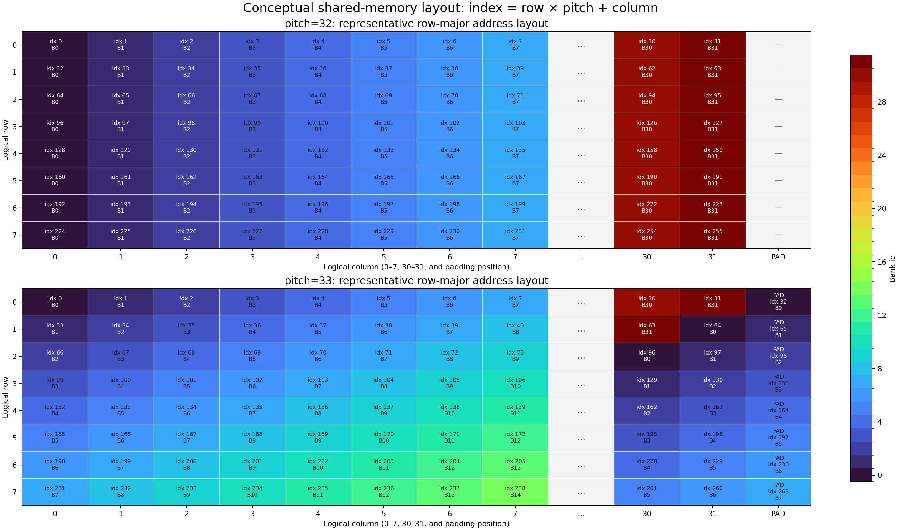
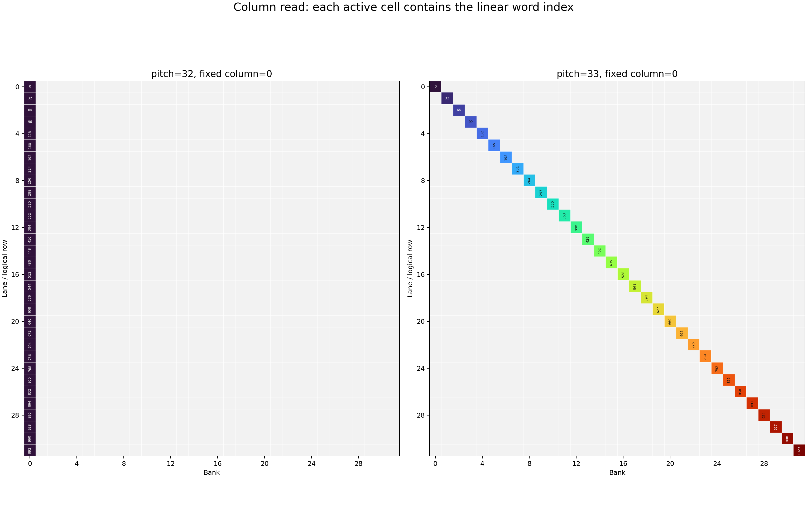
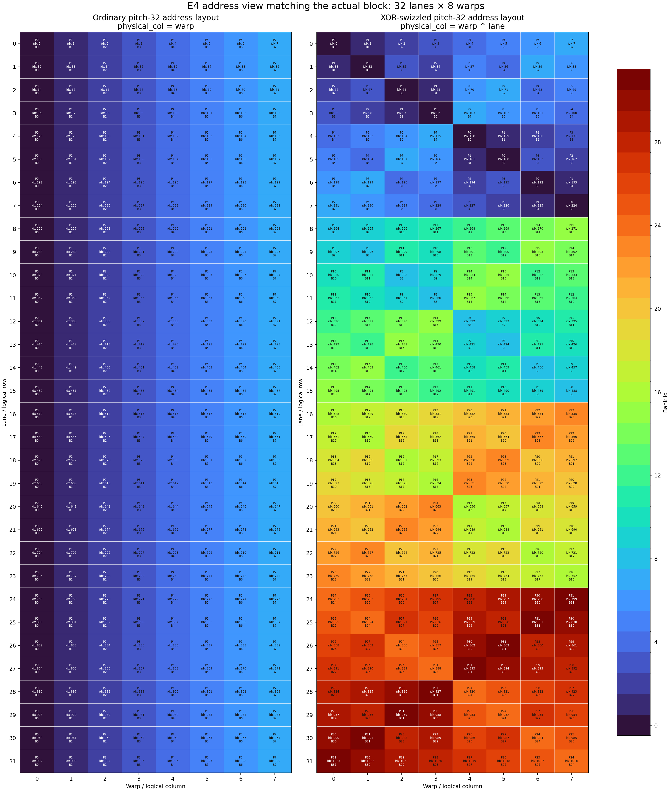
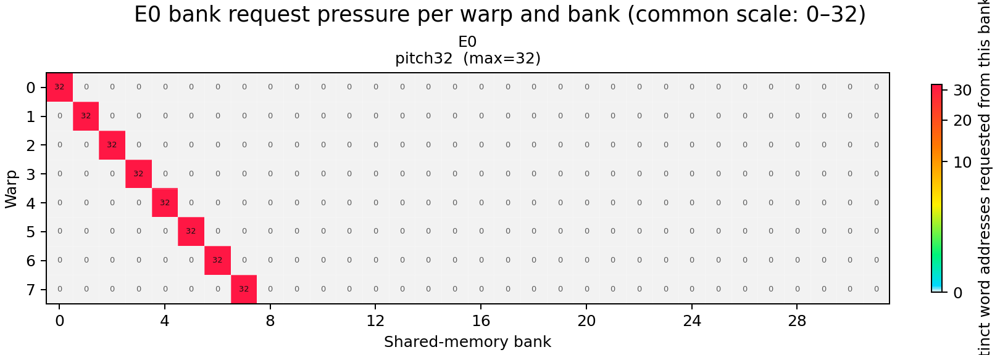
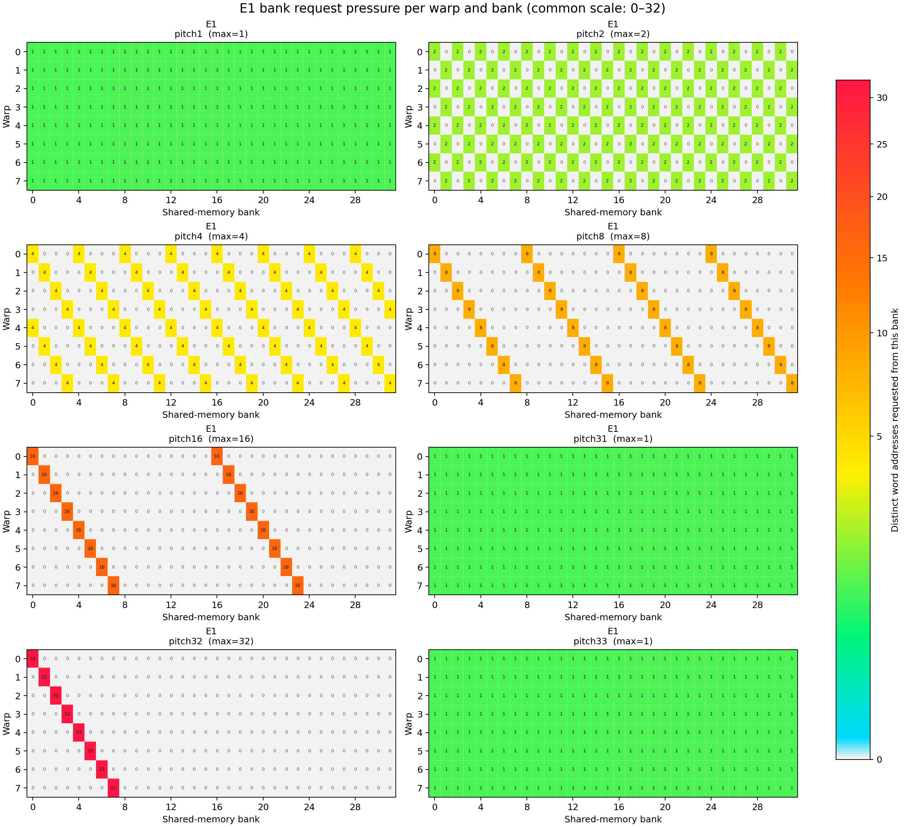
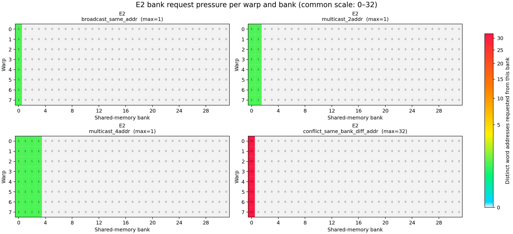
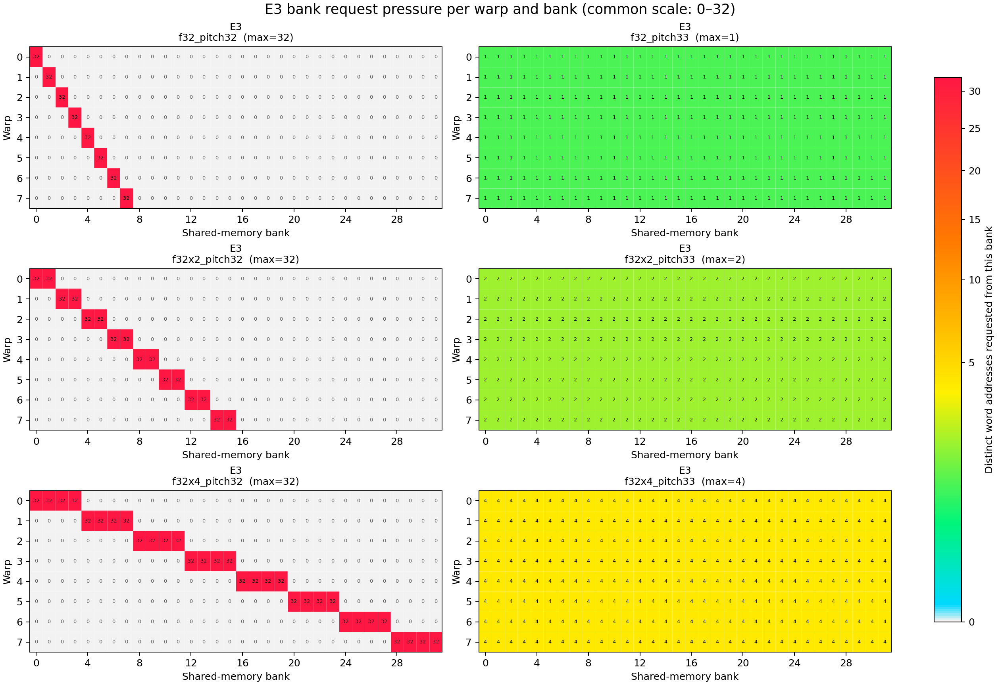
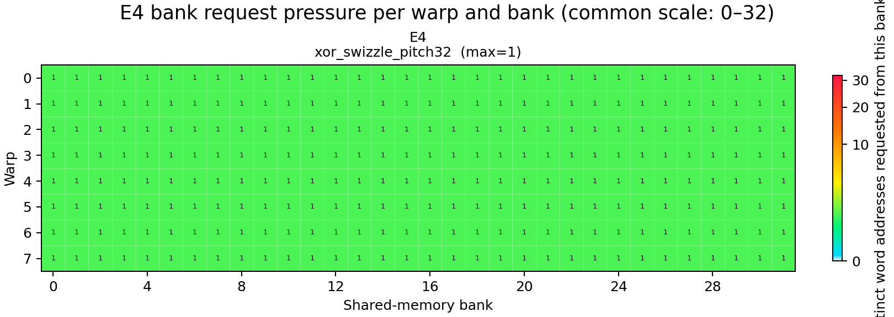

# Two-dimensional transpose `ld.shared` bank-conflict microbenchmarks

This directory isolates the ordinary shared-memory load path for the classic
transpose access pattern. It does not study `st.shared`, TMA, descriptor
swizzle, `tcgen05`, TMEM, CUTLASS/CUTE, or full GEMM kernels.

The core transpose-style mapping is:

```text
linear_index = row * pitch + col
bank = linear_index % 32
```

For the scalar column load used in E0 and E1:

```text
row = lane
col = warp
bank(lane) = (lane * pitch + warp) % 32
```

When `gcd(pitch, 32) = d`, a warp touches `32 / d` banks and the worst per-bank
fan-in is `d`. That is the theory behind the pitch sweep.

## Scope

This directory studies only `ld.shared` behavior.

- Included: padding, pitch sweep, broadcast/multicast controls, vectorized
  shared loads, and a software XOR swizzle.
- Excluded: `st.shared`, TMA, TMA descriptor swizzle, `tcgen05`, TMEM,
  CUTLASS/CUTE, and end-to-end GEMM conclusions.

The reason for keeping only the load path here is that store-path behavior,
async copy paths, and descriptor-driven paths have different hardware rules and
would blur the interpretation of the bank-conflict results.

## Experiments

### E0 Classic Transpose Baseline

| Case | Access | Purpose | Expected bank behavior |
| --- | --- | --- | --- |
| `E0_load_pitch32` | `tile[lane * 32 + warp]` | Classic transpose worst case | All 32 lanes of a warp target one bank |

### E1 Pitch Sweep

| Case | Pitch | `gcd(pitch, 32)` | Theoretical unique banks | Theoretical conflict degree |
| --- | ---: | ---: | ---: | ---: |
| `E1_load_pitch1` | 1 | 1 | 32 | 1 |
| `E1_load_pitch2` | 2 | 2 | 16 | 2 |
| `E1_load_pitch4` | 4 | 4 | 8 | 4 |
| `E1_load_pitch8` | 8 | 8 | 4 | 8 |
| `E1_load_pitch16` | 16 | 16 | 2 | 16 |
| `E1_load_pitch31` | 31 | 1 | 32 | 1 |
| `E1_load_pitch32` | 32 | 32 | 1 | 32 |
| `E1_load_pitch33` | 33 | 1 | 32 | 1 |

These representative pitches cover the power-of-two conflict progression and
the boundary behavior around pitches 31, 32, and 33.
For very small pitches such as 1, 2, and 4, the logical rows intentionally
overlap in the backing array. That is acceptable here because E1 is about the
shared-memory bank mapping implied by `lane * pitch + warp`, not about modeling
a production transpose tile shape.

### E2 Broadcast And Multicast Controls

| Case | Access | Purpose | Interpretation |
| --- | --- | --- | --- |
| `E2_load_broadcast_same_addr` | All lanes read `tile[0]` | Isolate broadcast | Same bank and same address |
| `E2_load_multicast_2addr` | Lanes 0-15 read `tile[0]`, lanes 16-31 read `tile[1]` | Isolate 2-address multicast | Two repeated addresses |
| `E2_load_multicast_4addr` | Each eight-lane group reads one of `tile[0..3]` | Isolate 4-address multicast | Four repeated addresses |
| `E2_load_conflict_same_bank_diff_addr` | Lanes read `tile[lane * 32]` | Contrast with broadcast | Same bank and different addresses |

This stage separates two concepts that are often conflated:

- Same bank plus same address can be served as broadcast or multicast.
- Same bank plus different addresses is the ordinary bank-conflict situation.

### E3 Vector Width

| Case | Operation | Pitch | Vector width | Note |
| --- | --- | ---: | ---: | --- |
| `E3_load_f32_pitch32` | `ld.shared.f32` | 32 | 1 | Scalar transpose load |
| `E3_load_f32_pitch33` | `ld.shared.f32` | 33 | 1 | Scalar transpose load with padding |
| `E3_load_f32x2_pitch32` | `ld.shared.v2.f32` | 32 | 2 | Aligned `float2` load |
| `E3_load_f32x2_pitch33` | `ld.shared.v2.f32` | 33 | 2 | Uses column adjustment to keep alignment |
| `E3_load_f32x4_pitch32` | `ld.shared.v4.f32` | 32 | 4 | Aligned `float4` load |
| `E3_load_f32x4_pitch33` | `ld.shared.v4.f32` | 33 | 4 | Uses column adjustment to keep alignment |

The vector cases use explicit volatile PTX:

- scalar: `ld.volatile.shared.f32`
- `float2`: `ld.volatile.shared.v2.f32`
- `float4`: `ld.volatile.shared.v4.f32`

For odd pitch plus vector width, the benchmark applies a small per-row column
adjustment so the `v2` and `v4` loads remain naturally aligned. That keeps the
instruction legal, but it also means the pitch-33 vector cases are not a
byte-for-byte copy of the scalar `tile[lane * 33 + warp]` pattern. The README
states that explicitly because otherwise the comparison would be misleading.

To verify the generated width on a target machine:

```bash
cuobjdump --dump-sass build/transpose_2d_bench | grep -E "LDS|LDGSTS"
```

`LDS`, `LDS.64`, and `LDS.128` are the SASS patterns worth checking for the
scalar, `v2`, and `v4` cases respectively.

### E4 Software Swizzle

| Case | Layout rule | Goal | Contrast target |
| --- | --- | --- | --- |
| `E4_load_xor_swizzle_pitch32` | `physical_col = warp ^ (lane & 31)` | Reduce transpose-style conflict without padding | `E0_load_pitch32` |

This case keeps `pitch=32` but changes the logical-to-physical mapping:

```c++
physical_col = warp ^ (lane & 31);
index = lane * 32 + physical_col;
```

That is a software swizzle, not a TMA descriptor swizzle. The tradeoff is
different from padding:

- Padding changes row stride and increases shared-memory footprint.
- Software swizzle keeps the stride but requires both producer and consumer to
  agree on the permuted layout.

This XOR pattern is a targeted microbenchmark, not a claim that one swizzle is
universally optimal.

## Address Layout And Bank Request Pressure

All current backends use the same linear allocation:

```c++
__shared__ __align__(16) float tile[32 * 64];
```

`initialize_tile()` fills that linear array directly. There is no producer
kernel that writes a real 32x32 logical matrix, and no backend physically
rearranges the initialized values. The differences are entirely in the word
index returned by `base_index_for_lane()`.

### 1. Address Layout: Pitch 32 Versus Pitch 33

This first figure interprets the actual address formula
`index = row * pitch + column` as a row-major tile. Each visible cell contains
its linear word index and bank id. It shows rows `0..7`, columns `0..7` and
`30..31`, plus the pitch-33 padding position:



With pitch 32, every row starts at bank 0 and has the same bank ordering. With
pitch 33, row `r` starts at bank `r % 32`; the extra word at the end of every
row shifts the next row by one bank.

This is a conceptual coordinate view of the address calculation. The
microbenchmark still uses the common linear allocation and does not run a
producer that writes an actual padded matrix.

### 2. Fixed-column Read: Lane To Index To Bank

The next figure fixes `column = 0`. The Y axis is lane/logical row, the X axis
is bank, and each active cell contains the requested linear word index:



- Pitch 32 produces a vertical line at bank 0: 32 different word indices
  contend for one bank.
- Pitch 33 produces a diagonal across banks 0–31: every lane reaches a
  different bank.

### 3. XOR Swizzle Address Mapping

The E4 comparison below uses the same address-cell style as the pitch-32 versus
pitch-33 layout figure. It covers the actual block coordinates: logical
rows/lanes `0..31` and logical columns/warps `0..7`. Every cell contains:

```text
P   = physical_col
idx = lane * 32 + physical_col
B   = idx % 32
```



Without swizzle, every lane in a warp uses the same physical column and bank.
With `physical_col = warp ^ lane`, each warp obtains a permutation of banks
0–31 without increasing the row pitch.

This is the current load-address mapping only; the microbenchmark does not
implement the producer side of a complete swizzled matrix layout.

### 4. Bank Request Pressure Per Warp And Bank

The remaining figures are request statistics, not address-layout diagrams.
They use the actual kernel launch shape:

- X axis: shared-memory banks `0..31`
- Y axis: warps `0..7`
- Cell value: number of distinct word addresses requested from that bank by one
  warp-level load instruction
- `0`: unused bank; `1`: conflict-free access or broadcast/multicast;
  values greater than `1`: bank pressure from different word addresses

All plots use the same `0..32` power-normalized color scale. The nonlinear
display keeps value `1` visible while preserving comparison with 32-way
hotspots.

#### E0 Bank Request Pressure



#### E1 Bank Request Pressure



#### E2 Bank Request Pressure



#### E3 Bank Request Pressure



#### E4 Bank Request Pressure



Regenerate the figures without running a CUDA kernel:

```bash
python3 scripts/generate_backend_heatmaps.py
```

<details>
<summary>Exact numeric address and bank views</summary>

### E0: Exact Pitch-32 Access

The backend reads `base_index = lane * 32 + warp`. For warp 0, the requested
word indices and banks are:

```text
lane:  0  1  2  3   4   5   6   7   8   9  10  11  12  13  14  15  16  17  18  19  20  21  22  23  24  25  26  27  28  29  30  31
word:  0 32 64 96 128 160 192 224 256 288 320 352 384 416 448 480 512 544 576 608 640 672 704 736 768 800 832 864 896 928 960 992
bank:  0  0  0  0   0   0   0   0   0   0   0   0   0   0   0   0   0   0   0   0   0   0   0   0   0   0   0   0   0   0   0   0
```

Other warps have the same 32-way pattern shifted to bank `warp`.

### E1: Pitch Sweep As A Bank Matrix

For warp 0, lane `l` uses `bank = (l * pitch) % 32`. Each row below is one E1
backend, and the 32 entries correspond to lanes `0..31`:

```text
lane:     0  1  2  3  4  5  6  7  8  9 10 11 12 13 14 15 16 17 18 19 20 21 22 23 24 25 26 27 28 29 30 31
pitch 1:  0  1  2  3  4  5  6  7  8  9 10 11 12 13 14 15 16 17 18 19 20 21 22 23 24 25 26 27 28 29 30 31
pitch 2:  0  2  4  6  8 10 12 14 16 18 20 22 24 26 28 30  0  2  4  6  8 10 12 14 16 18 20 22 24 26 28 30
pitch 4:  0  4  8 12 16 20 24 28  0  4  8 12 16 20 24 28  0  4  8 12 16 20 24 28  0  4  8 12 16 20 24 28
pitch 8:  0  8 16 24  0  8 16 24  0  8 16 24  0  8 16 24  0  8 16 24  0  8 16 24  0  8 16 24  0  8 16 24
pitch16:  0 16  0 16  0 16  0 16  0 16  0 16  0 16  0 16  0 16  0 16  0 16  0 16  0 16  0 16  0 16  0 16
pitch31:  0 31 30 29 28 27 26 25 24 23 22 21 20 19 18 17 16 15 14 13 12 11 10  9  8  7  6  5  4  3  2  1
pitch32:  0  0  0  0  0  0  0  0  0  0  0  0  0  0  0  0  0  0  0  0  0  0  0  0  0  0  0  0  0  0  0  0
pitch33:  0  1  2  3  4  5  6  7  8  9 10 11 12 13 14 15 16 17 18 19 20 21 22 23 24 25 26 27 28 29 30 31
```

Pitch 33 can be interpreted as the padded coordinate view below. `P` represents
the skipped word at the end of each conceptual row; the benchmark itself still
uses the common linear allocation and does not explicitly write `P`:

```text
physical col:  0  1  2  3  4  5  6  7  8  9 10 11 12 13 14 15 16 17 18 19 20 21 22 23 24 25 26 27 28 29 30 31 32
row  0:        0  1  2  3  4  5  6  7  8  9 10 11 12 13 14 15 16 17 18 19 20 21 22 23 24 25 26 27 28 29 30 31  P
row  1:        0  1  2  3  4  5  6  7  8  9 10 11 12 13 14 15 16 17 18 19 20 21 22 23 24 25 26 27 28 29 30 31  P
row  2:        0  1  2  3  4  5  6  7  8  9 10 11 12 13 14 15 16 17 18 19 20 21 22 23 24 25 26 27 28 29 30 31  P
...
row 31:        0  1  2  3  4  5  6  7  8  9 10 11 12 13 14 15 16 17 18 19 20 21 22 23 24 25 26 27 28 29 30 31  P
```

### E2: Broadcast And Multicast As A Lane-to-word Matrix

The entries below are requested shared-memory word indices, not bank numbers:

```text
lane:       0  1  2  3  4  5  6  7  8  9 10 11 12 13 14 15 16 17 18 19 20 21 22 23 24 25 26 27 28 29 30 31
broadcast:  0  0  0  0  0  0  0  0  0  0  0  0  0  0  0  0  0  0  0  0  0  0  0  0  0  0  0  0  0  0  0  0
2-address:  0  0  0  0  0  0  0  0  0  0  0  0  0  0  0  0  1  1  1  1  1  1  1  1  1  1  1  1  1  1  1  1
4-address:  0  0  0  0  0  0  0  0  1  1  1  1  1  1  1  1  2  2  2  2  2  2  2  2  3  3  3  3  3  3  3  3
conflict:   0 32 64 96 128 160 192 224 256 288 320 352 384 416 448 480 512 544 576 608 640 672 704 736 768 800 832 864 896 928 960 992
```

The broadcast row and conflict row both target bank 0. The difference is that
broadcast requests one repeated word, whereas conflict requests 32 distinct
words from that bank.

### E3: Exact Vector-load Address Form

E3 does not rearrange the initialized tile. It changes how consecutive words
are grouped into one instruction:

```text
scalar:  [0]       [1]       [2]       [3]       ... [31]
float2:  [0 1]     [2 3]     [4 5]     [6 7]     ... [30 31]
float4:  [0 1 2 3] [4 5 6 7] [8 9 10 11]         ... [28 29 30 31]
```

For warp 0, the exact bank sets requested by the six backends are:

```text
lane:
  0       1       2       3       4       5       6       7
  8       9      10      11      12      13      14      15
 16      17      18      19      20      21      22      23
 24      25      26      27      28      29      30      31

f32, pitch32:
 {0}     {0}     {0}     {0}     {0}     {0}     {0}     {0}
 {0}     {0}     {0}     {0}     {0}     {0}     {0}     {0}
 {0}     {0}     {0}     {0}     {0}     {0}     {0}     {0}
 {0}     {0}     {0}     {0}     {0}     {0}     {0}     {0}

f32, pitch33:
 {0}     {1}     {2}     {3}     {4}     {5}     {6}     {7}
 {8}     {9}    {10}    {11}    {12}    {13}    {14}    {15}
{16}    {17}    {18}    {19}    {20}    {21}    {22}    {23}
{24}    {25}    {26}    {27}    {28}    {29}    {30}    {31}

f32x2, pitch32:
 {0,1}   {0,1}   {0,1}   {0,1}   {0,1}   {0,1}   {0,1}   {0,1}
 {0,1}   {0,1}   {0,1}   {0,1}   {0,1}   {0,1}   {0,1}   {0,1}
 {0,1}   {0,1}   {0,1}   {0,1}   {0,1}   {0,1}   {0,1}   {0,1}
 {0,1}   {0,1}   {0,1}   {0,1}   {0,1}   {0,1}   {0,1}   {0,1}

f32x2, pitch33:
 {0,1}   {2,3}   {2,3}   {4,5}   {4,5}   {6,7}   {6,7}   {8,9}
 {8,9} {10,11} {10,11} {12,13} {12,13} {14,15} {14,15} {16,17}
{16,17} {18,19} {18,19} {20,21} {20,21} {22,23} {22,23} {24,25}
{24,25} {26,27} {26,27} {28,29} {28,29} {30,31} {30,31}   {0,1}

f32x4, pitch32:
 {0-3}   {0-3}   {0-3}   {0-3}   {0-3}   {0-3}   {0-3}   {0-3}
 {0-3}   {0-3}   {0-3}   {0-3}   {0-3}   {0-3}   {0-3}   {0-3}
 {0-3}   {0-3}   {0-3}   {0-3}   {0-3}   {0-3}   {0-3}   {0-3}
 {0-3}   {0-3}   {0-3}   {0-3}   {0-3}   {0-3}   {0-3}   {0-3}

f32x4, pitch33:
 {0-3}   {4-7}   {4-7}   {4-7}   {4-7}  {8-11}  {8-11}  {8-11}
{8-11} {12-15} {12-15} {12-15} {12-15} {16-19} {16-19} {16-19}
{16-19} {20-23} {20-23} {20-23} {20-23} {24-27} {24-27} {24-27}
{24-27} {28-31} {28-31} {28-31} {28-31}   {0-3}   {0-3}   {0-3}
```

The repeated sets in the pitch-33 vector rows come from the alignment
adjustment in `vector_base_col()`. It rounds each vector base to a valid
2-word or 4-word boundary; it does not define a new physical matrix layout.

### E4: Actual XOR Address Matrix

The current backend computes only the load address:

```c++
physical_col = warp ^ lane;
base_index = lane * 32 + physical_col;
```

The block contains eight warps, so the actual matrix has rows `warp 0..7` and
columns `lane 0..31`. Each cell below is `physical_col`; because
`lane * 32 % 32 == 0`, it is also the bank number:

```text
lane:    0  1  2  3  4  5  6  7  8  9 10 11 12 13 14 15 16 17 18 19 20 21 22 23 24 25 26 27 28 29 30 31
warp 0:  0  1  2  3  4  5  6  7  8  9 10 11 12 13 14 15 16 17 18 19 20 21 22 23 24 25 26 27 28 29 30 31
warp 1:  1  0  3  2  5  4  7  6  9  8 11 10 13 12 15 14 17 16 19 18 21 20 23 22 25 24 27 26 29 28 31 30
warp 2:  2  3  0  1  6  7  4  5 10 11  8  9 14 15 12 13 18 19 16 17 22 23 20 21 26 27 24 25 30 31 28 29
warp 3:  3  2  1  0  7  6  5  4 11 10  9  8 15 14 13 12 19 18 17 16 23 22 21 20 27 26 25 24 31 30 29 28
warp 4:  4  5  6  7  0  1  2  3 12 13 14 15  8  9 10 11 20 21 22 23 16 17 18 19 28 29 30 31 24 25 26 27
warp 5:  5  4  7  6  1  0  3  2 13 12 15 14  9  8 11 10 21 20 23 22 17 16 19 18 29 28 31 30 25 24 27 26
warp 6:  6  7  4  5  2  3  0  1 14 15 12 13 10 11  8  9 22 23 20 21 18 19 16 17 30 31 28 29 26 27 24 25
warp 7:  7  6  5  4  3  2  1  0 15 14 13 12 11 10  9  8 23 22 21 20 19 18 17 16 31 30 29 28 27 26 25 24
```

For each actual warp, `warp ^ lane` is a permutation of `0..31`, so its 32
lanes touch 32 different banks. This is a load-address swizzle microbenchmark;
it does not implement the producer side of a complete swizzled matrix layout.

</details>

## CSV Output

| Field | Meaning |
| --- | --- |
| `experiment` | Stage name such as `E0_basic_pitch_effect` |
| `case` | Concrete case name such as `E1_load_pitch16` |
| `operation` | Shared-load instruction form, for example `ld.shared.f32` or `ld.shared.v4.f32` |
| `pitch` | Logical row stride used by the case |
| `vector_width` | `1`, `2`, or `4` for `f32`, `f32x2`, or `f32x4` |
| `theoretical_unique_banks` | Number of banks touched by one warp-level shared-load instruction |
| `theoretical_conflict_degree` | Largest number of distinct word addresses requested from any one bank |
| `iters` | Loop count inside one kernel launch |
| `avg_ms` | Mean kernel time over timed repeats |
| `min_ms` | Minimum kernel time over timed repeats |
| `effective_GBps` | Requested bytes divided by `avg_ms`; benchmark-local derived rate |

The theoretical fields are computed per warp by enumerating the word addresses
that a single shared-memory instruction requests. That keeps broadcast,
multicast, scalar loads, and vector loads on one consistent definition:

- `theoretical_unique_banks`: how many banks the instruction touches
- `theoretical_conflict_degree`: the largest number of distinct word addresses
  requested from any one bank

## Build

```bash
CUDA_ARCH=110 ./scripts/build.sh
```

## Run

Run everything:

```bash
./scripts/run_basic.sh
```

This writes `results/basic_results.csv` and then invokes `parse_results.py`,
which generates `results/avg_ms.png` and `results/effective_gbps.png`.

Run one experiment stage:

```bash
./scripts/run_basic.sh --case E0
./scripts/run_basic.sh --case E3
```

Run one exact case:

```bash
./build/transpose_2d_bench --case E2_load_conflict_same_bank_diff_addr --iters 100000
```

Useful environment overrides:

```bash
ITERS=1000 WARMUPS=3 REPEATS=10 ./scripts/run_basic.sh --case E1
```

## Nsight Compute

```bash
./scripts/run_ncu.sh
./scripts/run_ncu.sh --case E2
```

The script uses `--list-cases` to expand `all`, `E0`, `E1`, `E2`, `E3`, `E4`,
or a concrete case name into per-case NCU runs. After profiling, it invokes
`parse_ncu_results.py`, prints one table per collected metric, and writes one
annotated PNG bar chart per metric into `results/ncu/`. The default outputs are
`shared_ld_bank_conflicts.png`, `shared_ld_wavefronts.png`, and
`shared_ld_instructions.png`. If performance counters are admin-only,
`run_ncu.sh` automatically uses passwordless `sudo` and restores CSV ownership.
Query metrics available on the target machine with:

```bash
ncu --query-metrics | grep -Ei "bank|shared|l1tex|sass_inst_executed"
```

## Interpretation Notes

- This is still a microbenchmark. The accumulator dependency and loop body are
  there to preserve the loads, so `effective_GBps` is only a derived,
  benchmark-local rate.
- Vector-load cases span multiple words per instruction. Their bank behavior is
  better interpreted from the enumerated theoretical fields and Nsight Compute
  counters than from a scalar `gcd(pitch, 32)` mental model alone.
- Results in this directory should not be projected onto TMA, descriptor
  swizzle, `tcgen05`, or full GEMM behavior.
