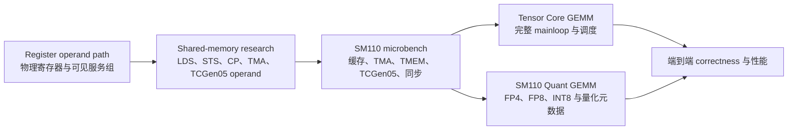
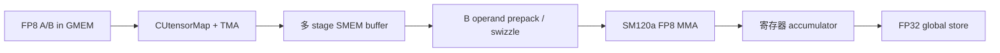

# Tensor Core GEMM、SM110 量化 GEMM、SM110 Microbenchmark、共享内存与寄存器研究总结

> 文档性质：当前仓库事实型总结，不是最终硬件规格说明
>
> 整理日期：2026-08-12
>
> 迁移复核：2026-08-18；本文保留 2026-08-12 仓库事实快照，之后的 SM110 上界 schema、parameter supplement 与 Thor 证据边界以 [`thor_sm110_gemm_performance_bounds.md`](../Docs/blackwell_tensorcore/thor_sm110_gemm_performance_bounds.md) 为准。
>
> 代码仓库：`CUDA_optimazation`
> 覆盖范围：`GEMM/` Tensor Core 路线、`GEMMquant_sm110/`、`microbench/`、`SmemReserch/`、`RegisterReserch/structureResearch/`

## 1. 总览

这五条研究线共同回答的是一个分层问题：如何从 GPU 硬件路径的可测行为出发，逐步构造、验证和优化完整的 Tensor Core GEMM。

- **Tensor Core GEMM** 研究完整矩阵乘路径，包括输入搬运、Tensor Core 指令、shared-memory 布局、mainloop pipeline 和 work-tile 调度。
- **SM110 量化 GEMM** 在完整 GEMM 基础上改变输入/输出精度、量化元数据和 reference 语义，分别研究 NVFP4、MXFP4、FP8 和 INT8。
- **SM110 microbenchmark** 把完整 kernel 拆成 DSMEM、L1/L2、DRAM、TMA、TMEM、TCGen05 MMA、completion、barrier 和 pipeline overlap 等可单独控制的路径。
- **Shared-memory research** 按 `ld.shared`、`st.shared`、`cp.async`、transpose、TMA 和 TCGen05 operand 等具体指令语义拆分 bank-conflict 与布局实验。
- **Register research** 继续下钻到标量寄存器源操作数读取路径，研究物理寄存器编号、source tuple 和可见服务组之间的关系。



这张关系图只表示研究层次，不表示可以把微基准吞吐直接代入完整 GEMM。完整 GEMM 还包含矩阵布局、边界处理、launch、TMA completion、同步、epilogue、TMEM readback 和 global store 等成本。

### 1.1 统一证据分级

本文使用以下证据层次，避免把不同验证强度混为一谈。

| 层级 | 能证明什么 | 不能证明什么 |
|---|---|---|
| 源码存在 | 路径已被编码，实现意图可审查 | 不能证明能编译、能运行或数值正确 |
| 编译与 SASS 检查 | 工具链接受代码，目标指令出现在 binary 中 | 不能证明协议正确或输出正确 |
| Runtime probe | 特定设备上 launch、barrier、TMEM/TMA 等最小路径可运行 | 不能自动外推到完整 GEMM |
| Correctness matched | 当前输入、shape 和 tolerance 下输出通过 reference 校验 | 不能证明所有输入和所有 shape 都正确 |
| Sweep / repeated trials | 在固定运行规则下有重复性能数据 | 不能忽略 precision、reference、频率和版本差异 |
| NCU / counter 旁证 | 可以定位可见 pipe、cache、stall 或 utilization | counter 不一定对应物理端口、bank 或内部队列 |
| 物理结构结论 | 需要更直接的 counter、公开资料或能排除替代结构的实验 | 单靠 timing 通常无法闭合到物理实现 |

## 2. Tensor Core GEMM

### 2.1 研究目标与架构边界

`GEMM/` 中的 Tensor Core 路线不是单一精度的线性版本升级，而是两组不同架构和精度语义的实验：

1. `tc1/tc2` 使用 FP16 输入、FP32 输出，以 cuBLAS Tensor Core 为 reference。
2. `tc3/tc4/tc5` 面向 RTX 50 系列 `sm_120a`，使用 FP8 E4M3 输入、FP32 输出，以 sampled CPU FP8 结果做 correctness reference。

SM120 路线使用：

```text
mma.sync.aligned.m16n8k32.row.col.kind::f8f6f4.f32.e4m3.e4m3.f32
```

它不使用 SM110 的 `tcgen05.mma` 和 TMEM。SM110/Thor 的 TCGen05 完整 GEMM 位于独立的 `GEMMsm110/`，本文只在说明 microbenchmark 和量化 GEMM 接口时引用，不把它混入本章的 SM120 版本序列。

### 2.2 版本路线

| Backend | 精度与目标 | 主要变化 | 当前实验角色 |
|---|---|---|---|
| `cublas_tc` | FP16→FP32 | cuBLAS Tensor Core | FP16 性能 reference |
| `tc1` | FP16→FP32 | WMMA 16×16 baseline | 最小 Tensor Core correctness baseline |
| `tc2` | FP16→FP32 | 128×64×32 CTA tile、2-stage TMA、WMMA | TMA staged FP16 mainloop |
| `tc3` | FP8→FP32 | SM120a FP8 MMA、128×64×32 tile、2-stage TMA | FP8 MMA 完整 GEMM bring-up |
| `tc4a` | FP8→FP32 | 3-stage TMA、全 CTA B operand prepack | mainloop stage 与 prepack 实验 |
| `tc4b` | FP8→FP32 | `tc4a` + 大尺寸 B 端 64B TMA swizzle | swizzle 对照；小尺寸回退 no-swizzle |
| `tc5a` | FP8→FP32 | persistent worker、静态 grid-stride work assignment | static CLC fallback |
| `tc5b` | FP8→FP32 | persistent worker、global atomic 动态 work queue | dynamic CLC 行为探针 |

`tc5a/tc5b` 只改变 work-tile 获取方式，复用 `tc4b` 的 per-tile mainloop。它们不是硬件 CLC，也没有实现完整 producer/consumer warp specialization、独立 CLC throttle pipeline 或 epilogue pipeline。

### 2.3 数据路径

`tc3–tc5` 的基本数据流可以概括为：



一个 CTA 计算 128×64 的输出 tile，K 维按 32 分块；当前 mainloop 中 8 个 warp 共同参与计算。`tc4a/tc4b` 的 B prepack 依赖 CTA-wide synchronization，`tc5a/tc5b` 虽然改变了 tile scheduler，却没有改变这一同步结构。

### 2.4 Correctness 与计时口径

FP16 路线与 FP8 路线使用不同 reference：

| 路线 | CSV precision | Correctness reference |
|---|---|---|
| `cublas_tc/tc1/tc2` | `fp16->fp32` | `cuBLAS Tensor Core` |
| `tc3/tc4a/tc4b/tc5a/tc5b` | `fp8->fp32` | `SM120a FP8 sampled CPU` |

因此：

- 可以分别说明每条路线的输出是否通过自己的 correctness reference。
- 可以比较同一 FP8 路线内部 `tc3/tc4/tc5` 的 GFLOP/s。
- 不应把 `tc4a` 对 `cublas_tc` 的 GFLOP/s 比值写成严格的同精度库性能 ratio，因为两者的输入精度和 correctness reference 不同。

### 2.5 2026-08-12 记录的 CSV 快照（迁移后不可独立重放）

原总结据 `results/gemm/tensor_core/gemm_tensor_core_sweep.csv` 记录了 144 个数据行和 3 个 process-level trial。该 CSV 不在当前集成分支的受追踪文件中，因此下表只能保留为 2026-08-12 文档快照，不能声称可由当前 checkout 独立重算：

| N | cuBLAS TC FP16 | `tc3` FP8 | `tc4a` FP8 | `tc4b` FP8 | `tc5a` FP8 | `tc5b` FP8 |
|---:|---:|---:|---:|---:|---:|---:|
| 1024 | 39.07 TFLOP/s | 13.70 | 28.77 | 29.00 | 18.22 | 17.58 |
| 2048 | 37.54 TFLOP/s | 17.01 | 37.60 | 34.88 | 23.79 | 22.63 |
| 4096 | 34.23 TFLOP/s | 17.91 | 34.82 | 37.96 | 24.74 | 26.55 |

在原始快照证据域内，这组数据支持以下观察：

- `tc4a/tc4b` 相比 `tc3` 明显提升，说明 3-stage mainloop 与 B prepack/swizzle 在大尺寸上有效。
- 当前 3-trial CSV 中，2048 的 FP8 自研最快项是 `tc4a`，4096 的 FP8 自研最快项是 `tc4b`。
- `tc5a/tc5b` 在当前 CSV 中没有超过 `tc4a/tc4b`，说明只替换 scheduler 不能自动改善 per-tile mainloop。
- 这些 GFLOP/s 可用于观察数学工作量吞吐，但不构成 FP8 自研 kernel 对 FP16 cuBLAS 的严格同精度速度结论。

### 2.6 历史 10-trial 与 NCU 快照

`docs/tc4_tc5_ncu_summary.md` 保存了 2026-06-26 的另一组快照。该文档声明每个尺寸 10 个 trial，并报告：

- 2048：`tc4a` 约 41.1 TFLOP/s。
- 4096：`tc4b` 约 37.9 TFLOP/s。
- `tc5b` 在 2048 相对 `tc5a` 有改善，但在 4096 不占优。

当前受追踪 CSV 已不是这份 10-trial 数据，因此这组数值只能作为历史运行快照引用，不能声称可从当前 CSV 原样重算。

对应的 NCU 2048 报告显示 `tc4a/tc4b/tc5a/tc5b` 的性能签名非常接近：

| 指标 | 大致范围 |
|---|---:|
| Compute throughput | 42%–43% |
| Memory throughput | 56%–58% |
| DRAM throughput | 10%–11% |
| Eligible warps / scheduler | 0.34–0.35 |
| Issued warps / scheduler | 约 0.22 |
| No eligible | 约 78% |
| Barrier stall share | 约 37%–38% |
| Achieved occupancy | 约 47%–48% |

这组 counter 说明主要问题不是原始 DRAM 带宽，而是 mainloop 的 CTA-wide barrier 和低 eligible-warp issue。当前执行顺序包含：等待 TMA stage、全 CTA prepack B、barrier、MMA、stage refill 前 barrier。scheduler 变化无法消除 tile 内的这两个同步点。

### 2.7 当前结论与后续方向

已完成：

- WMMA FP16 baseline。
- TMA + WMMA 2-stage path。
- SM120a FP8 MMA 完整 GEMM bring-up。
- 3-stage TMA、B prepack、TMA swizzle 实验。
- static/dynamic persistent work scheduling 对照。
- correctness CSV、重复 trial 和 NCU 报告。

仍未完成：

- producer/consumer warp-specialized mainloop。
- 更小同步域替代 CTA-wide `__syncthreads()`。
- stage refill 与 MMA consumption 的真正细粒度 overlap。
- 独立 scheduler、mainloop load、MMA、epilogue load 和 epilogue warp 分工。
- 硬件 CLC 与 CLC throttle pipeline。
- TMA store 或更完整的 epilogue pipeline。
- FP8 自研路径与同精度 cuBLASLt FP8 reference 的统一正式 sweep。

最短的下一步不是继续增加 scheduler 版本，而是先减少 `tc4` mainloop 内的 CTA-wide barrier 压力，再重新比较普通 grid、static persistent 和 dynamic persistent。

## 3. SM110 量化 GEMM

### 3.1 研究边界

`GEMMquant_sm110/` 专门研究 Thor/SM110 上的 1024×1024×1024 量化 GEMM。它与 `GEMMsm110/` 的 FP32-output 主线分开，原因包括：

- 输入和输出 precision 不同。
- FP4 需要 block scale 或其它量化元数据。
- correctness tolerance 和 host reference 不同。
- packed output 不能按普通 FP32 D matrix 解释。
- “相对 reference 性能”必须说明 reference 的真实精度。

### 3.2 精度路线与实现状态

| Precision | Backend 阶段 | 当前状态 | 最终 evidence 要求 |
|---|---|---|---|
| NVFP4 | `q0` fused epilogue、`q1` native mainloop、`q2` CUTLASS 72b | `q0/q2` 已实现；`q1` missing | 最佳项 10/10 matched，并明确 reference 语义 |
| MXFP4 | CUTLASS 72a bring-up 与 swizzle tuning | `q0/q1` 已实现 | 10/10 matched |
| FP8 | scalar CUDA、inline MMA、cuBLASLt | `q0..q8` 已实现 | 同精度 cuBLASLt reference |
| INT8 | scalar、WMMA、inline MMA、cuBLAS GemmEx | `q0..q19` 已实现 | 同精度 cuBLAS reference |

正式 runner 会把尚未实现的路径保留为 `Status=missing`，时间和性能字段留空，并从 best-backend plot 中排除。它不会把缺失实现写成 0 GFLOP/s 后参与排序。

### 3.3 Harness 和结果字段

正式入口是：

```bash
python3 GEMMquant_sm110/scripts/run_quant_gemm_1024.py --trials 10
```

主 CSV 字段包括：

```text
Precision, Stage, BackendId, BackendLabel, N, Reference,
TimeMs, GFLOPS, RatioToReference, Matched, Status, Reason, Trial
```

当前正式产物有 340 行，即 34 个 stage/backend row × 10 个 trial。FP8、INT8、MXFP4 的正式项均为 implemented；NVFP4 每轮保留一个 `q1` missing row。

### 3.4 当前 10-trial 最佳结果

| Precision | 最佳 backend | Mean GFLOP/s | Mean ratio | CSV 中的 reference |
|---|---|---:|---:|---|
| NVFP4 | `nvfp4_q2_cutlass_72b_nvfp4` | 129072.3 | 1.261171× | cuBLAS Tensor Core FP16→FP32 |
| MXFP4 | `mxfp4_q1_cutlass_72a_swizzle1` | 125623.5 | 1.229672× | cuBLAS Tensor Core FP16→FP32 |
| FP8 | `fp8_q8_cublaslt_matmul` | 134273.0 | 1.002803× | cuBLASLt FP8 E4M3 |
| INT8 | `int8_q19_cublas_gemmex` | 122770.5 | 1.011083× | cuBLAS INT8 |

四个 precision family 的最佳 backend 都有 10/10 `Status=ok`、`Matched=1`。但 ratio 的解释必须分两类：

- FP8 和 INT8 是同精度库路径对照，ratio 接近 1 可以理解为和相关库 reference 基本一致。
- NVFP4 和 MXFP4 当前用 FP16→FP32 cuBLAS Tensor Core 作为性能 denominator。因此 `1.261×` 和 `1.230×` 不是“比同精度官方 FP4 reference 快 26%/23%”的证据。

### 3.5 FP4 实现和 reference 边界

NVFP4 `q2` 来自 CUTLASS 72b block-scaled NVFP4 示例衍生路径，MXFP4 来自 CUTLASS 72a 路径并比较 swizzle 配置。正式脚本保留 CUTLASS host reference comparison，只有运行输出包含通过 disposition 时才设置 `Matched=1`。

cuBLASLt FP4 descriptor probe 已覆盖：

- row-major 和 column-major/swap descriptor。
- `VEC32_UE8M0` 和 `VEC16_UE4M3` scale mode。
- FP16 和 FP32 输出。
- 相关 compute mode。

当前 Thor runtime 上，12 组 descriptor 均没有从 `cublasLtMatmulAlgoGetHeuristic` 得到可运行算法。这个结果只说明已测试 descriptor/runtime 组合没有可用算法，不证明 cuBLASLt 在所有 Thor 软件版本上都不支持 FP4。

此外，`/xplorer/op630/test/tcgen05_fp4_gemm` 之类只检查 CUDA error、没有 host numerical reference 的外部 binary 不能作为正式 matched backend。正式量化结论只使用恢复了 reference comparison 的 CUTLASS 或 cuBLAS/cuBLASLt 路径。

### 3.6 当前缺口

最明确的功能缺口是 `nvfp4_q1_native_fp4_mainloop`。目前的 `q0` 是 FP16 mainloop 后接 fused NVFP4 epilogue；它证明了直接量化输出链路，但不等价于原生 FP4 Tensor Core mainloop。`q2` 使用 CUTLASS 正式路径达到性能目标，却不是仓库自研 native mainloop。

后续如果继续推进，建议将验收拆成三项：

1. 原生 FP4 mainloop 是否使用预期 SASS/PTX 指令。
2. packed value、scale metadata 和反量化结果是否通过独立 host reference。
3. 性能 ratio 是否使用同精度、同输出语义 reference。

## 4. SM110 Microbenchmark

### 4.1 研究目标

`microbench/` 面向 NVIDIA Thor、SM110、`sm_110a`。它的作用不是提供一个完整 GEMM，而是把完整 GEMM 的硬件路径拆成最小可测组件，并为性能模型提供经过边界标注的输入。

当前主要分为四层：

| 层次 | 目录/实验 | 目标 |
|---|---|---|
| Bring-up | `00_runtime_sanity`、`01_tcgen05_tmem_probe`、`02_clc_persistent_tmem_probe` | 分离 runtime、TMEM 最小链路和 persistent worker 问题 |
| Memory hierarchy | `03`–`10`、`L2throughtput` | DSMEM、L1、L2、DRAM、TMA、TMEM 和 SMEM bank |
| Pipeline | `mma_with_cp`、`11_pipeline_overlap` | `tcgen05.cp` 与 TS MMA consumption 的串行/重叠关系 |
| Tensor Core calibration | `mma_compute_only`、`mma_config` | dense TCGen05 throughput、completion、collector 和依赖标定 |

### 4.2 Bring-up 探针

三个最小探针按故障域逐层推进：

1. `00_runtime_sanity` 检查 CUDA version、device count、`cudaFree(0)`、device properties 和最小 `cudaMalloc`。
2. `01_tcgen05_tmem_probe` 只验证 TMEM allocate、`tcgen05.st`、`tcgen05.ld` 和一个 FP32 bit pattern round-trip。
3. `02_clc_persistent_tmem_probe` 在 persistent CTA worker 中复用一次 TMEM allocation，比较 static 和 dynamic CLC-style work assignment。

这些 probe 没有 A/B matrix、cuBLAS reference 或完整 GEMM，因此通过 probe 只能说明最小协议链路可运行。

### 4.3 Memory hierarchy 结果

#### DSMEM

cluster size 2 的 full-GPU baseline：

| Path | Median B/cycle/GPU |
|---|---:|
| local SMEM read | 2400.191 |
| local SMEM write | 2173.339 |
| remote DSMEM read | 239.181 |
| remote DSMEM write | 283.116 |

remote 路径包含 cluster mapping 和 completion synchronization，应该解释为 end-to-end DSMEM request throughput，而不是物理 cluster interconnect 的裸端口峰值。

cluster size 4 的 topology/contention 实验中，ring remote access 明显高于 many-to-one fan-in：

| 模式 | App B/cycle/GPU |
|---|---:|
| ring read distance 1 | 113.15 |
| ring read distance 2 | 119.63 |
| fan-in read root 0 | 52.76 |
| ring write distance 1 | 127.25 |
| ring write distance 2 | 141.87 |
| fan-in write root 0 | 72.09 |

这支持“many-to-one fan-in 在当前模式下成本更高”，但不能据此反推出物理 DSMEM topology。

#### L1、L2 与 DRAM path

| 路径 | 工作集/模式 | Measured sustained |
|---|---|---:|
| L1 global read | 32 KiB/CTA，`ld.global.ca` | 2534.826 B/cycle/GPU |
| L2 control read | 32 KiB/CTA，`ld.global.cg` | 945.535 B/cycle/GPU |
| L1TEX store path | `st.global.wb/cg` | 约 432–434 B/cycle/GPU |
| L2-hit unique read | 16 MiB | 约 943–947 B/cycle/GPU |
| L2-sized global store path | 16 MiB | 约 235–300 B/cycle/GPU |
| DRAM read stream | 256 MiB | 132.824 B/cycle/GPU |
| DRAM write stream | 256 MiB | 71.926 B/cycle/GPU |
| DRAM copy stream | 256 MiB，读写请求合计 | 80.141 B/cycle/GPU |

L2 文档另外根据 NCU `%peak` 反推：读 model peak 约 1024 B/cycle/GPU、写 model peak 约 512 B/cycle/GPU。model peak 和 measured sustained 必须分开；`read-same` 的同地址广播请求吞吐也不能当成真实 L2 数据搬运量。

#### TMA GMEM→SMEM

32 KiB tile baseline：

| Mode | App throughput | NCU TMA throughput | DRAM proxy / expected |
|---|---:|---:|---:|
| L2 hit | 773–776 B/cycle/GPU | 753.86 B/cycle/GPU | 0.006 |
| DRAM stream | 156–164 B/cycle/GPU | 157.32 B/cycle/GPU | 1.008 |

这里测到的是 TMA issue、copy、mbarrier completion wait 和 shared-memory destination 的端到端 ingress，不是纯 DRAM pin 带宽或纯 SMEM write-port peak。

#### Local SMEM bank stride

`10_smem_bank_stride_bandwidth` 使用 32-bit scalar `ld.shared/st.shared` 和可控 word stride。stride 1 是 conflict-free control，stride 2/4/8 逐步增加 bank conflict，stride 32 让一个 warp 的各 lane 访问同一 bank 的不同地址。

由于当前 Thor/NCU 组合没有直接 local shared byte counter，验证依赖 LSU wavefront 和 bank-conflict counters。这个实验不能替代 128-bit vector SMEM 路径、TMA destination 或 TCGen05 operand descriptor 的 bank 行为。

### 4.4 TCGen05、TMEM 和 Pipeline 结果

#### Compute-only dense TCGen05

`mma_compute_only` 的 timed window 包含 MMA loop、`tcgen05.commit` 和 mbarrier wait，但排除了 GMEM、TMA、epilogue、TMEM readback 和 global store。

FullSM4WarpBlock 的大 shape 接近报告采用的 Thor dense 理论峰值：

| Shape / precision | Measured | 报告理论峰值 | Ratio |
|---|---:|---:|---:|
| M128N256K64 FP4 | 1032.111 TFLOP/s | 1035.000 | 99.72% |
| M128N256K32 FP8 | 516.059 TFLOP/s | 517.000 | 99.82% |
| M128N256K16 BF16 | 258.030 TFLOP/s | 258.500 | 99.82% |
| M128N128K64 FP4 | 1028.016 TFLOP/s | 1035.000 | 99.33% |

M128N64 没有按运算量等比例缩短 completion cycles，因此只有约 66% 峰值。这个结果说明当前 dense MMA 指令对 N shape 敏感，但不能解释完整 GEMM，因为供数、同步和 epilogue 都被排除。

#### `tcgen05.cp` SMEM→TMEM ingress

| 指标 | 当前结果 |
|---|---:|
| Sustained cp ingress | 859.024 B/cycle/GPU |
| Latency proxy | 2.384 cycles/cp |
| Effective payload | 2048 B/cp |

它是 `tcgen05.cp` 端到端 ingress 指标，不是 TMEM raw write-port peak。当前 NCU 的 tmem pipe metric 对 UTCCP 报 0，因此结论依赖 app timing 与 SASS，不把该 counter 当作直接证明。

#### TMEM consume via TS MMA

| Case | Role | TFLOP/s | Estimated TMEM consume |
|---|---|---:|---:|
| `ts-mma-only` | 已驻留 TMEM A operand 的 consumption | 373.198 | 115.699 B/cycle/GPU |
| `ts-cp-mma-a2-k16` | CP + TS MMA steady state | 332.272 | 103.011 B/cycle/GPU |
| `ss-mma-mainloop-k16` | SMEM operand baseline | 921.885 | 不适用 |

consume bytes 使用“每条指定 FP4 M128N256 TS MMA 消费 2048 B A operand”的逻辑需求模型估算。它不是 raw TMEM read-port peak，也不能确定 TMEM bank 数或 bank width。

#### CP/MMA overlap

| Case | TFLOP/s | Cycles/tile | 相对 serial gain | Ideal-overlap efficiency |
|---|---:|---:|---:|---:|
| `serial-a1` | 214.210 | 30.839 | 1.000× | 57.40% |
| `overlap-a2` | 331.938 | 19.901 | 1.550× | 88.94% |
| `warp-split-a2` | 300.601 | 21.976 | 1.403× | 80.55% |
| `mainloop-a2-k16` | 332.272 | 318.102/16 tiles | 1.551× | 89.03% |

double buffering 把当前 CP/MMA 路径从串行提升到约 1.55×，说明 SMEM→TMEM copy 与 TS MMA consumption 能实现显著重叠。但它不是 GMEM/TMA pipeline，数据在被测窗口开始前已经位于对应的生成式 microbenchmark 路径中。

### 4.5 `mma_config` 静态重新标定

早期 universal runtime-dispatch kernel 在 timed loop 中混入 descriptor 构造、slot 选择、D-ring 计算、collector dispatch 和 CTA synchronization。其 `750–870 cycles/MMA` 等数据现只作为负控制保留。

当前主要证据改成每个 case 独立编译的 static binary：

- dtype、N、Q、D mode、`input_d`、address mode、collector protocol 和 wait hint 都是编译期常量。
- descriptor setup、TMA prefill、TMEM allocation/init/guard 在计时区外。
- 每个 binary 保存 SASS hash 和目标 instruction count。
- row 只有 CUDA status、guard、数值误差和 SASS audit 都通过才进入 valid aggregate。

当前关键结果：

| 项目 | M128N128K16 BF16 | M128N256K16 BF16 |
|---|---:|---:|
| Q1 forced-completion envelope | 约 450 cycles/MMA | 约 450 cycles/MMA |
| Q4 | 145.581 | 212.660 |
| Q16 | 86.768 | 154.818 |
| Q64 | 68.937 | 135.092 |
| Fitted long-batch beta | 63.747 cycles/MMA | 129.381 cycles/MMA |
| Visible logical operand rate | 128.5 B/cycle | 95.0 B/cycle |

控制项还测得：

- `tcgen05.commit` + already-completed wait：约 258 cycles/iteration。
- forced single-MMA completion：约 431–450 cycles/MMA。
- CTA-wide `__syncthreads()`：20.828 cycles/sync。
- 当前 Q16 static window 中 same-D、合法 D-ring 和 `input_d=1` 没有可分辨 penalty。
- `ld.shared` 干扰没有比 register-ALU control 更慢；L1-hit global load 则增加约 7.4 cycles/MMA。

这些结果支持 visible completion cost、batch amortization 和 logical service-rate 的比较，但不支持以下物理说法：

- 物理 SMEM port width 或 bank count。
- 物理 TMEM bank count、bank width、raw read/write peak。
- hidden collector depth 或 hidden async queue depth。
- 普通 LSU `ld.shared` 与 TCGen05 async operand ingress 必然共享同一个物理端口。

### 4.6 Microbenchmark 对 GEMM 的可迁移含义

可以迁移的设计方向：

- 大 N dense MMA atom 更容易接近 Tensor Core completion peak。
- forced completion 和 commit/wait 有显著固定成本，应通过更长 batch 或 pipeline 摊销。
- TMA L2-hit 与 DRAM-stream ingress 差异很大，mainloop 必须考虑真实数据驻留层次。
- CP/MMA double buffering 已在最小路径中证明有明显重叠收益。
- CTA-wide barrier 有可测成本，完整 GEMM 中还会造成 eligible warp 不足。
- DSMEM many-to-one fan-in、persistent scheduler 和 cluster tile 设计需要同时考虑 topology pressure 与工作量均衡。

不能直接迁移的数字：

- compute-only 的 1032 TFLOP/s 不是完整 GEMM 可达到的保证。
- `tcgen05.cp` 的 859 B/cycle 不是 TMEM write-port spec。
- TS MMA 的 115.7 B/cycle estimated consume 不是 TMEM read bandwidth spec。
- L2 model peak、NCU `%peak` 和 app measured sustained 不能混成一个峰值。

## 5. Shared-memory Research

### 5.1 研究目标与核心原则

`SmemReserch/` 专门研究 shared-memory 访问布局和 bank-conflict 行为。它的核心原则是：

> Bank conflict 必须在某一种具体指令、某一个 warp-level request 和对应执行路径中定义，不能只看“地址最终落在 shared memory”就把不同路径混为一谈。

因此该目录把实验拆成以下独立 family：

| Family | 被测执行路径 | 核心问题 |
|---|---|---|
| `ld_shared_1d` | 普通 LSU `ld.shared` | scalar/vector stride、broadcast、multicast 与 distinct-address conflict |
| `st_shared_1d` | 普通 LSU `st.shared` | scalar/vector destination mapping 与 multiple-writer diagnostic |
| `cp_async` | LDGSTS / async-copy path | 每 lane 16-byte copy 的 shared destination layout |
| `transpose_2d_case` | 普通 `ld.shared` | pitch、padding、vector width 和 software XOR swizzle |
| `real_transpose_case` | 完整 GMEM↔SMEM transpose | global coalescing、shared tiling、padding、vectorization 与 swizzle |
| `tma` | TMA async proxy + 可选 LSU consumer/producer | TMA swizzle、ordinary LDS/STS 和 round trip 的边界 |
| `tcgen05_smem_operand` | TCGen05 async operand path | K-major shared descriptor 的 32B/64B/128B swizzle |

这些实验与 `microbench/10_smem_bank_stride_bandwidth` 有交集，但目的不同：

- `microbench/10` 更偏向统一 full-GPU bandwidth/NCU validation 框架下的 scalar stride sweep。
- `SmemReserch` 更偏向按指令语义构造地址映射、broadcast/multicast、transpose、vector、TMA consumer/producer 和 TCGen05 descriptor 对照。
- 两边的结果可以互相检查，但不能因为都访问 shared memory 就使用同一个“冲突度”公式解释。

### 5.2 当前证据状态

顶层 `SmemReserch/README.md` 和 `bank_conflict/README.md` 将多数新 family 标为“implemented, pending SM110 validation”。但部分子目录 README 后来又保存了 SM110 timing、NCU 图和结论快照。当前工作树中的证据状态应更细地描述为：

| Family | 源码与 runner | 受追踪结果 | 当前可引用状态 |
|---|---|---|---|
| `ld_shared_1d` | 有 | timing、effective bandwidth、NCU conflict/wavefront/instruction PNG | 已有 SM110 历史快照 |
| `st_shared_1d` | 有 | 只有 `.gitkeep` | 已实现，待目标机运行验证 |
| `cp_async` | 有 | 只有 `.gitkeep` | 已实现，待目标机运行验证 |
| `transpose_2d_case` | 有 | `docs/images` 下有 SM110 timing/NCU 图；`results/` 仅 `.gitkeep` | 有历史快照，需 fresh rerun 才能声明当前复现 |
| `real_transpose_case` | 有 | `docs/images` 下有 timing/NCU 图；`results/` 仅 `.gitkeep` | 有历史快照，需 fresh rerun |
| `tma` | 有 | `assets/` 下有 timing/NCU 图；`results/` 仅 `.gitkeep` | README 保存了详细 SM110 结果，需 fresh rerun |
| `tcgen05_smem_operand` | 有 | 只有 `.gitkeep` | 已实现，待 SM110a 验证 |

所以“目录中有图”可以证明过去保存过一次结果快照，但不等于当前源码、当前 binary 和当前 GPU 环境已经重新闭环。需要当前确认时，仍应重新生成 CSV、SASS 和 NCU 输出。

### 5.3 一维 `ld.shared`：冲突、广播与向量加载

`ld_shared_1d` 使用一个 `dim3(32, 8)` block，`threadIdx.x` 是 lane，`threadIdx.y` 是 warp。对 32-bit word，最简 bank 模型是：

```text
linear_index = row * pitch + col
bank = linear_index % 32
```

主要 case 为：

| Case | Warp 内地址映射 | 目标 |
|---|---|---|
| `v0` | 连续 lane→连续 word | conflict-free baseline |
| `v1a…v1e` | `lane * 2/4/8/16/32` | 2/4/8/16/32-way distinct-word conflict |
| `v2` | 全 warp 读取同一个 word | broadcast control |
| `v3` | 每 lane 一个连续 `ld.shared.v4.f32` | vector-load throughput |
| `v4a/v4b` | lane group 读取相同 `float2/float4` | repeated-address vector diagnostic |

这里必须区分三件事：

1. **同一条 warp instruction 内，不同地址映射到同一 bank**，才是普通 bank conflict。
2. **同一地址被多 lane 重复读取**，可能由 broadcast/multicast 服务，不能按 distinct-word N-way conflict 解释。
3. **不同 warp 同时施压 shared memory**，更适合称为 contention 或 throughput pressure，不是同一 warp instruction 的 bank conflict。

benchmark 每轮发出四条 volatile inline-PTX shared load，并使用四条独立 accumulator chain，防止编译器删除/合并 load，同时减少纯 dependency serialization。当前保存了 SM110 timing、effective-bandwidth、shared-load bank-conflict、wavefront 和 executed-instruction 图。

对这组实验，timing 只用于观察趋势，NCU conflict/wavefront counter 与 SASS 中的 `LDS/LDS.64/LDS.128` 才是主要结构证据。其 `effective_GBps` 统计 requested bytes，是 benchmark-local derived rate，不一定等于物理 shared-memory traffic。

### 5.4 一维 `st.shared` 与 `cp.async`

#### Ordinary `st.shared`

`st_shared_1d` 用 volatile `st.shared.f32/v2.f32/v4.f32` 构造：

- scalar conflict-free baseline；
- stride 1/2/4/8/16/32 destination sweep；
- distinct words in one bank；
- same-address multiple-writer diagnostic；
- contiguous vector store；
- lane group 写相同 vector destination。

store 的 same-address 多 writer 不能称为 load-style broadcast 或 multicast，而且可能被 sanitizer 视为 race。这组 case 当前有源码、build/basic/NCU runner，但没有受追踪的 SM110 CSV/NCU 结果，因此总结只保留实验设计，不给出硬件性能结论。

#### `cp.async` destination

`cp_async` 每 lane 发出一条 16-byte：

```text
cp.async.ca.shared::cta.global
cp.async.commit_group
cp.async.wait_group 0
```

case 比较 contiguous destination、4/8/16/32-word destination-start spacing，以及 source-broadcast control。每条 copy 覆盖四个 bank，所以 scalar `stride → N-way conflict` 术语不能直接套用；需要同时看 runtime、LDGSTS sector/conflict candidate 和 SASS。

当前 loop 每个 async group 都立刻 wait，测的是序列化 issue-to-completion 成本，不是多 outstanding group pipeline。该 family 同样处于“实现完成、目标机结果待复验”状态。

### 5.5 二维 transpose：从 bank 映射到完整 kernel

#### Load-only transpose microbenchmark

`transpose_2d_case` 只研究普通 `ld.shared`，不包含 producer、TMA、TCGen05 或完整 GEMM。对于固定 column 的 transpose read：

```text
row = lane
col = warp
bank(lane) = (lane * pitch + warp) % 32
```

因此理论 conflict degree 为 `gcd(pitch, 32)`。实验包含：

- E0：pitch 32 的经典 32-way conflict。
- E1：pitch 1/2/4/8/16/31/32/33 sweep。
- E2：broadcast、2-address multicast、4-address multicast和同 bank 不同地址 conflict。
- E3：scalar、`v2`、`v4` load width。
- E4：`physical_col = warp ^ lane` software XOR swizzle。

pitch 33 通过每行多一个 word 让相邻 row 的 bank 起点移动；XOR swizzle 保留 32×32 footprint，但 producer 与 consumer 必须一致使用置换。当前 E4 只是 load-address microbenchmark，没有实现完整 swizzled producer。

对于 odd pitch 的 vector case，代码为了保持自然对齐会调整每行 vector base column，因此 pitch-33 vector case不是 scalar 地址公式的逐字节复制。它应结合枚举得到的 `theoretical_unique_banks`、`theoretical_conflict_degree` 和 NCU counter 判断，不能只套 scalar GCD 公式。

该目录保存了 SM110 timing、effective-bandwidth、conflict、wavefront 和 instruction-count 图，也保存了每个 backend 的地址/bank pressure heatmap。它们是历史快照；当前 `results/` 中没有对应 CSV。

#### End-to-end real transpose

`real_transpose_case` 把同样的问题放回完整 4096×4096 FP32 transpose：

| Stage | 数据路径 |
|---|---|
| R0 | naive/coalesced-read/coalesced-write，隔离一侧 coalescing |
| R1 | 32×32 shared tile，global 两侧 coalesced，但 transpose-side shared read 冲突 |
| R2 | pitch 33 padding 消除 column conflict |
| R3 | global `float4` + padded shared tile；shared access 仍为 scalar |
| R4 | global `float4` + 32×32 XOR swizzle；shared component 单独映射 |
| R5 | coalesced copy reference，不执行 transpose |

所有 timed case 使用 CUDA event，之后以 exact FP32 transpose equality 做 correctness。effective bandwidth 统计一次 input read 加一次 output write。

已保存的 SM110 快照显示：

- R1 有预期的主要 transpose-read bank conflict。
- R2–R4 位于接近 conflict-free 的区域。
- R2 padding、R3 packed padding 和 R4 XOR swizzle 的时间通常只相差几个百分点，排序会随频率和系统负载变化。
- 当前实现不能稳定证明 packed 或 swizzled variant 比 padding 更快；它们的价值主要是比较布局策略。
- R5 只是 bandwidth reference，不是所有 transpose backend 的严格理论上限。

R3/R4 只 vectorize global load/store：pitch 33 破坏每个 shared row 的稳定 16-byte 对齐，XOR mapping 也不保证四个逻辑分量在 shared memory 中连续，所以二者都没有声称使用 vectorized shared load/store。

### 5.6 TMA swizzle、LSU consumer/producer 与 round trip

`tma` 子项目明确分离四个问题：

1. TMA copy 本身能否被 profiler 观察。
2. TMA load 后，ordinary LSU consumer 如何读取 resulting shared layout。
3. TMA store 前，ordinary LSU producer 如何写入 shared layout。
4. TMA load + store-back 的纯 round-trip 成本。

所有 case 固定传输 4096-byte tile，logical box 为 32 bytes × 128 rows。不同 swizzle 的物理 shared footprint 是：

| Swizzle | Physical row span | Shared footprint |
|---|---:|---:|
| none | 32 B | 4 KiB |
| 32B | 32 B | 4 KiB |
| 64B | 64 B | 8 KiB |
| 128B | 128 B | 16 KiB |

T0 和 T3 不在 timed loop 内执行 ordinary per-lane `LDS/STS`，所以不能称为 N-way bank-conflict test。T1/T2 才分别加入 ordinary `LDS.128` consumer 和 `STS.128` producer。

#### T1：TMA load 后的 consumer

no-swizzle control 令相邻 lane 起始地址相差 128 bytes。一个 warp 的 `LDS.128` 被分成四个 8-lane transaction，每个 transaction 形成 8-way conflict，因此每轮理论冲突数是：

```text
4 transactions * (8 - 1) = 28 conflicts
```

README 保存的 NCU 快照使用 100 次迭代，T1a 正好记录 2800 conflicts；matched 32B/64B/128B swizzle consumer 均为 0。10,000-iteration basic snapshot 中：

| Case | 时间 |
|---|---:|
| no-swizzle forced conflict | 3.391 ms |
| matched 32B | 3.046 ms |
| matched 64B | 3.279 ms |
| matched 128B | 3.033 ms |

forced conflict 比 32B matched case 慢约 11.3%。但 64B case 的额外时间不能归因于 bank conflict：它同样为 0 conflict，却因当前 CUDA 13.0/`sm_110` 代码生成在 loop 中多出 `UIADD3/ULEA/IMAD` 地址物化而变慢。

#### T2：TMA store 前的 producer

T2a 使用同样的 forced-conflict `STS.128` mapping；100 次迭代记录 2800 ordinary shared-store conflicts。matched 32B/64B/128B producer 均为 0。

basic snapshot 中，forced-conflict T2a 为 2.423 ms，matched-swizzle case 约 2.085 ms，额外时间约 16.2%。matched case 仍比纯 TMA store baseline 慢约 35%，这部分包含普通 STS、value generation、proxy fence 和同步，不能说成 TMA store engine 变慢。

#### T3：纯 TMA round trip

no-swizzle、32B、64B 和 128B round trip 分别约为 4.285、4.277、4.280 和 4.278 ms，差异小于 0.2%。在当前 4 KiB logical tile、单 block 场景中，纯 TMA round-trip 对这四种 swizzle 基本不敏感。

这组实验最重要的结论不是“某个 swizzle 永远最快”，而是：

- TMA async proxy 本身和 ordinary LSU bank conflict 必须分层解释。
- matched swizzle 能消除当前 ordinary 128-bit consumer/producer 的强制冲突。
- 更宽 swizzle 会增加 shared footprint。
- 零 bank conflict 不保证相同性能，address-generation SASS 仍可能成为差异来源。

同时，T1a/T2a 与 matched-swizzle case 的逻辑地址序列并不完全相同，所以它们展示的是强冲突与无冲突的性能边界，不是唯一变量完全一致的严格 A/B。

### 5.7 TCGen05 shared-memory operand descriptor

`tcgen05_smem_operand` 是固定 `sm_110a` 的 async-proxy operand benchmark。kernel 会：

1. 在 shared memory 中初始化常量 FP16 A/B。
2. 分配 64 个 TMEM column。
3. 构造 K-major shared-memory descriptor。
4. 发出 `tcgen05.mma.cta_group::1.kind::f16`。
5. 通过 mbarrier commit/wait。
6. 读取一个 TMEM slice 并释放 TMEM。

当前设计比较 32B、64B、128B K-major swizzle descriptor。所有 operand value 都为 1，因此物理位置变化不会改变数学输入；实验目标是比较 descriptor/layout mode，而不是标量 bank ID。

这条路径由 TCGen05 async proxy 读取 operand，ordinary `pipe_lsu` shared bank-conflict counter 不应被默认视为完整覆盖。正式验收需要同时检查：

- 输出数值。
- SASS 中的目标 TCGen05 指令和 descriptor mode。
- tensor-pipe activity、MIO stall 和 SM110 可用 counter。
- runtime 的重复性。

当前仓库只有实现和 runner，没有受追踪的 SM110a result CSV/NCU 报告，因此不能根据源码直接宣布哪一种 descriptor 最快或冲突最少。

### 5.8 对 Tensor Core GEMM 的可迁移含义

这条研究线可以向完整 GEMM 迁移的是设计原则，而不是所有绝对时间：

- transpose-style `pitch=32` column access 会在 ordinary 32-bit LSU load 上形成强冲突；padding 或一致的软件 swizzle可以改变 bank mapping。
- broadcast/multicast 与 distinct-address same-bank conflict 必须分开。
- vector instruction 触及多个 bank/transaction，不能沿用 scalar stride 的简单冲突度。
- global coalescing 和 shared bank conflict 是两个独立优化维度；完整 transpose/GEMM 必须同时验证。
- TMA swizzle 要同时考虑 logical layout、ordinary consumer/producer 地址、shared footprint 和 address-generation SASS。
- async proxy 的 TMA/TCGen05 行为不能只靠 ordinary LSU bank-conflict counter解释。
- producer 和 consumer 必须共享同一 swizzled layout；只改一侧可能得到错误输出。

不能直接迁移的说法包括：

- `ld.shared` 的 stride-N 结果自动适用于 `cp.async`、TMA 或 TCGen05 operand。
- “NCU ordinary shared bank conflict 为 0”就说明整个 TMA/TCGen05 path 没有布局或供数瓶颈。
- XOR swizzle 一定比 padding 快。
- 历史文档中的单次 SM110 图表等于当前源码在当前环境下 fresh reproducible。

## 6. Register Research

### 6.1 研究问题

`RegisterReserch/structureResearch/` 研究 Thor SM110 上标量指令读取物理寄存器源操作数时暴露出的可见分组行为。当前最准确的结论是：

```text
tested visible service group = physical_register_id % 2
```

这表示当前已测试路径呈现两个按物理寄存器编号奇偶划分的可见服务组。它不等价于“Thor register SRAM 只有两个物理 bank”。

### 6.2 为什么使用 patched SASS

直接写 CUDA/PTX 无法稳定控制最终物理寄存器编号，编译器还可能改变 source tuple、插入 reuse 或重新调度。主扫描因此采用：

1. 编译模板 cubin。
2. patch timed region 中 128 条目标指令的物理寄存器字段。
3. 清除 `.reuse`，避免 operand reuse cache 掩盖真实 RF source pressure。
4. 用 `nvdisasm` 回读每条指令，确认 tuple 和 reuse 状态。
5. 通过 CUDA Driver API 运行，记录 median cycles/op。

每个 `LOP3/FFMA` 主扫描 family 生成 87 个 cubin：

| 分组 | 数量 | 目的 |
|---|---:|---|
| Source-count controls | 4 | 区分一个源、两个同组源、三个 mixed 源和三个同组源 |
| Source-slot permutation | 3 | 排除某个固定 operand slot 的特殊路径 |
| Single-chain stride | 64 | 4 个 accumulator base × stride 1–16 |
| Four-chain throughput | 16 | 检查 ILP 是否隐藏单链额外延迟 |

核心 tuple 为：

```text
OP Rbase, R(base + stride), R(base + 2 * stride), Rbase
```

当 stride 为奇数时，三个 source 中最多两个落在同一奇偶组；当 stride 为偶数时，三个 source 全部同奇偶。因此 `%2` 模型预测奇数 stride 快、偶数 stride 慢。

### 6.3 主扫描结果

#### LOP3

| RF source pattern | Median cycles/op |
|---|---:|
| 1 RF source | 2.086031 |
| 2 same-parity sources | 2.086031 |
| 3 mixed-parity sources | 2.086031 |
| 3 same-parity sources | 3.070406 |

#### FFMA

| RF source pattern | Median cycles/op |
|---|---:|
| 1 RF source | 1.113438 |
| 2 same-parity sources | 2.072172 |
| 3 mixed-parity sources | 2.072164 |
| 3 same-parity sources | 3.064367 |

两组结果共同呈现：

```text
2 same parity ≈ 3 mixed parity < 3 same parity
```

因此慢点不是“三源指令天然更慢”，而是第三个同可见组 RF source 触发了约一个周期的额外读取/收集步骤。

single-chain stride scan 中，`LOP3` 和 `FFMA` 都表现为奇数 stride 快、偶数 stride 慢；四条独立 chain 下差异大幅减弱，说明 ILP 可以隐藏单链 dependency latency 中的额外步骤。

### 6.4 扩展反证

任意三源 tuple scan 把寄存器范围扩到 `R8..R71`，并比较 `%2/%4/%8/%16` 模型的预测能力。`LOP3` 和 `IMAD` 都得到：

| 模型 | 命中率 |
|---|---:|
| `mod2` | 40/40 = 100% |
| `mod4` | 30/40 = 75% |
| `mod8` | 26/40 = 65% |
| `mod16` | 18/40 = 45% |

physical probe 中的 `same_mod4`、`split_mod4`、`same_mod8` pressure case 没有暴露稳定差异。source-slot permutation 也没有改变快慢关系。这些结果加强了“当前 timing 只看到两个奇偶服务组”的判断，但仍不能排除底层存在 4、8 或更多物理 bank，之后被 read port、operand collector 或 arbitration 合并成两个可见组。

### 6.5 NCU 证据边界

当前 NCU metric query 没有找到直接 RF/register/operand-collector bank conflict counter：

- `l1tex__data_bank_conflicts*` 属于 L1TEX/LSU data-bank path，不是 RF SRAM bank。
- `tpc__sm_rf_registers_allocated*` 和 `tpc__sm_rf_quanta_allocated*` 描述 allocation，不描述 RF read conflict。
- short scoreboard、MIO/RF activity 等指标只能作为 same-parity case 出现额外 operand-path 步骤的旁证。

所以 timing 当前无法独立定位瓶颈究竟发生在 register SRAM、read port、operand collector 还是其组合。

### 6.6 对 kernel 优化的意义

当前结论对手写 SASS、固定物理寄存器布局或高度可控的低层代码有直接意义：

- 单条标量指令的三个 RF source 如果都落在同一奇偶可见组，dependency chain 可能增加约一个周期。
- 将 source 分散到两个可见组可以降低单链读取/收集压力。
- 多 independent chain 可以用 ILP 隐藏这一额外步骤。

对普通 CUDA C++ kernel 则需要谨慎：编译器控制物理寄存器分配，源码变量编号不等于最终 physical register ID；kernel 的占用率、spill、instruction scheduling 和执行 pipe 往往比单个 tuple 更先决定性能。

### 6.7 当前覆盖与缺口

当前覆盖：

- `LOP3/FFMA` 完整 main scan。
- `LOP3/IMAD` tuple 和 physical control。
- physical register `R4–R39` 相关主扫描，以及扩展到 `R8–R71` 的 tuple。
- source-count、source-slot、stride、multi-chain 和 `%2/%4/%8/%16` 模型比较。

当前缺口：

- `IMAD/IADD3` 尚无与 `LOP3/FFMA` 完全同构的完整主扫描。
- 未覆盖全部寄存器编号、全部 opcode、Tensor Core register path 或 uniform register。
- patched cubin 依赖未公开编码，切换 toolkit 或架构后必须重新反汇编验证。
- 仍缺能直接指向 RF bank/read-port/collector 的硬件 counter 或公开资料。

## 7. 五条研究线的综合结论

### 7.1 已经形成的完整方法

这个项目已经建立了从最小硬件现象到完整 kernel 的研究方法：

1. 用 runtime/TMEM probe 确认基本执行环境和最小协议。
2. 按 LDS、STS、`cp.async`、TMA 和 TCGen05 operand 的具体语义研究 shared-memory layout，避免跨路径误用 bank-conflict 结论。
3. 用 compute-only、memory hierarchy 和 pipeline microbenchmark 隔离硬件路径。
4. 用 static case、SASS hash、instruction count 和 CPU reference 排除测量污染。
5. 将 TMA、swizzle、multi-stage、persistent scheduler 等机制放入完整 GEMM。
6. 用 repeated trials、correctness field 和 NCU report 检查端到端结果。
7. 对输出语义不同的 FP4/FP8/INT8 另建量化 harness，不与 FP32 D matrix 混用。

### 7.2 当前最可信的工程判断

- SM120 Tensor Core GEMM 中，3-stage TMA + B prepack/swizzle 比 2-stage FP8 bring-up 更有性能，但 CTA-wide barrier 是主要瓶颈之一。
- 只改变 persistent work scheduler 不能修复 per-tile mainloop 的同步问题。
- SM110 dense TCGen05 大 shape 的 compute-only completion throughput 可以接近报告采用的理论峰值，但完整 GEMM 还会受到供数、同步和 epilogue 限制。
- `tcgen05.cp` 与 TS MMA 可以通过 double buffer 得到约 1.55× 的当前路径收益，证明 overlap 方向有效。
- ordinary `ld.shared` 的 pitch/stride、broadcast 和 vector behavior 已有独立证据；TMA matched swizzle 也能消除当前 ordinary `LDS.128/STS.128` consumer/producer 的强制冲突，但 async proxy 本身不能用 LSU conflict counter 完整解释。
- SM110 量化 GEMM 的四个 precision family 已有 10-trial matched 最佳项，但 NVFP4 native FP4 mainloop 仍缺失，FP4 ratio 也还不是同精度 cuBLASLt 对照。
- 寄存器 operand path 当前稳定暴露 `%2` 奇偶可见服务组和“第三个同组源约增加一周期”的行为，但不能将其直接命名为两个物理 SRAM bank。

### 7.3 最优先的后续工作

1. **Tensor Core GEMM**：实现 producer/consumer warp specialization，先消除或缩小 B prepack 和 stage reuse 的 CTA-wide barrier。
2. **统一性能口径**：为 SM120 FP8 自研路径接入同精度 cuBLASLt FP8 reference，重新生成与当前源码匹配的 10-trial CSV 和 NCU 报告。
3. **量化 GEMM**：补 NVFP4 native mainloop，并建立同精度 FP4 reference；在此之前不要把 FP16 denominator ratio 当成 FP4 库胜负。
4. **SM110 microbench**：把当前可见 service rate 纳入 stage model，但继续保留 model peak、measured sustained 和 physical peak 三者的边界。
5. **Shared-memory research**：在目标 Thor 上重新运行 `st.shared`、`cp.async` 和 `tcgen05_smem_operand`；为历史 transpose/TMA 快照补齐与当前源码匹配的 CSV、SASS、环境 metadata 和 NCU summary。
6. **Register research**：补 `IMAD/IADD3` 完整主扫描并扩大 tuple/register coverage；没有直接 counter 前继续使用“visible service group”表述。

## 8. 复现入口与证据索引

### 8.1 Tensor Core GEMM

- 入口源码：[`GEMM/src/main.cu`](../GEMM/src/main.cu)
- Tensor Core kernels：[`GEMM/include/tc_gemm_kernels.cuh`](../GEMM/include/tc_gemm_kernels.cuh)
- SM120a FP8 kernel：[`GEMM/include/tc3_gemm_kernel.cuh`](../GEMM/include/tc3_gemm_kernel.cuh)
- 2026-08-12 原总结引用的 sweep：`results/gemm/tensor_core/gemm_tensor_core_sweep.csv`；当前集成分支未追踪该文件，表中数值标记为 historical/unreplayed
- 历史 NCU 总结：[`docs/tc4_tc5_ncu_summary.md`](tc4_tc5_ncu_summary.md)
- 单 backend 入口：[`scripts/run_gemm_backend.sh`](../scripts/run_gemm_backend.sh)

### 8.2 SM110 量化 GEMM

- 当前说明：[`GEMMquant_sm110/README.md`](../GEMMquant_sm110/README.md)
- 正式报告：[`GEMMquant_sm110/SM110_QUANT_GEMM_OPTIMIZATION_REPORT.md`](../GEMMquant_sm110/SM110_QUANT_GEMM_OPTIMIZATION_REPORT.md)
- Runner：[`GEMMquant_sm110/scripts/run_quant_gemm_1024.py`](../GEMMquant_sm110/scripts/run_quant_gemm_1024.py)
- 正式 CSV：[`results/quant_gemm_sm110/sm110_quant_gemm_1024_sweep.csv`](../results/quant_gemm_sm110/sm110_quant_gemm_1024_sweep.csv)
- FP4 cuBLASLt probe：[`GEMMquant_sm110/src/fp4_cublaslt_probe.cu`](../GEMMquant_sm110/src/fp4_cublaslt_probe.cu)

### 8.3 SM110 Microbenchmark

- 总入口说明：[`microbench/README.md`](../microbench/README.md)
- Compute-only：[`microbench/mma_compute_only/README.md`](../microbench/mma_compute_only/README.md)
- Compute-only 正文：[`microbench/mma_compute_only/current_document/Thor MMA instruction throughput microbenchmark.md`](<../microbench/mma_compute_only/current_document/Thor MMA instruction throughput microbenchmark.md>)
- MMA static calibration：[`microbench/mma_config/Docs/ExperimentReport.md`](../microbench/mma_config/Docs/ExperimentReport.md)
- L2：[`microbench/L2throughtput/README.md`](../microbench/L2throughtput/README.md)
- TMA：[`microbench/07_tma_gmem_smem_bandwidth/README.md`](../microbench/07_tma_gmem_smem_bandwidth/README.md)
- Pipeline overlap：[`microbench/11_pipeline_overlap/results/pipeline_overlap_report.md`](../microbench/11_pipeline_overlap/results/pipeline_overlap_report.md)

### 8.4 Shared-memory Research

- 总入口：[`SmemReserch/README.md`](../SmemReserch/README.md)
- Bank-conflict family 索引：[`SmemReserch/bank_conflict/README.md`](../SmemReserch/bank_conflict/README.md)
- 一维 shared load：[`SmemReserch/bank_conflict/ld_shared_1d/README.md`](../SmemReserch/bank_conflict/ld_shared_1d/README.md)
- 一维 shared store：[`SmemReserch/bank_conflict/st_shared_1d/README.md`](../SmemReserch/bank_conflict/st_shared_1d/README.md)
- `cp.async` destination：[`SmemReserch/bank_conflict/cp_async/README.md`](../SmemReserch/bank_conflict/cp_async/README.md)
- Load-only transpose：[`SmemReserch/bank_conflict/transpose_2d_case/README.md`](../SmemReserch/bank_conflict/transpose_2d_case/README.md)
- End-to-end transpose：[`SmemReserch/bank_conflict/real_transpose_case/README.md`](../SmemReserch/bank_conflict/real_transpose_case/README.md)
- TMA swizzle/consumer/producer：[`SmemReserch/bank_conflict/tma/README.md`](../SmemReserch/bank_conflict/tma/README.md)
- TCGen05 SMEM operand：[`SmemReserch/bank_conflict/tcgen05_smem_operand/README.md`](../SmemReserch/bank_conflict/tcgen05_smem_operand/README.md)

### 8.5 Register Research

- 入口：[`RegisterReserch/structureResearch/README.md`](../RegisterReserch/structureResearch/README.md)
- 正式证据说明：[`RegisterReserch/structureResearch/EVIDENCE_SUMMARY.md`](../RegisterReserch/structureResearch/EVIDENCE_SUMMARY.md)
- 统一 runner：[`RegisterReserch/structureResearch/scripts/run_opcode_suite.sh`](../RegisterReserch/structureResearch/scripts/run_opcode_suite.sh)
- 主扫描生成与 patch：[`RegisterReserch/structureResearch/scripts/patch_main_scan.py`](../RegisterReserch/structureResearch/scripts/patch_main_scan.py)

## 9. 最终证据边界

本文是对当前仓库源码、受追踪结果和现有报告的归纳。当前本地环境虽然有 CUDA 13.0 `nvcc`，但 `nvidia-smi` 无法连接 NVIDIA driver，因此本文没有重新运行 Thor/SM120 GPU benchmark。文中的性能数据来自仓库内已经保存的 CSV、validation report 和 NCU 总结。

任何后续“当前仍然成立”的性能声明，都应先核对：

- 当前源码是否重新编译成被测 binary。
- GPU、driver、CUDA toolkit、目标架构与频率是否一致。
- CSV trial 数是否与报告声明一致。
- precision、输入分布、输出语义和 reference 是否一致。
- `Matched=1` 是否来自真正的 numerical reference，而不只是 CUDA error check。
- static lowering、SASS instruction presence、runtime protocol 和端到端 numerical correctness 是否分别成立。
