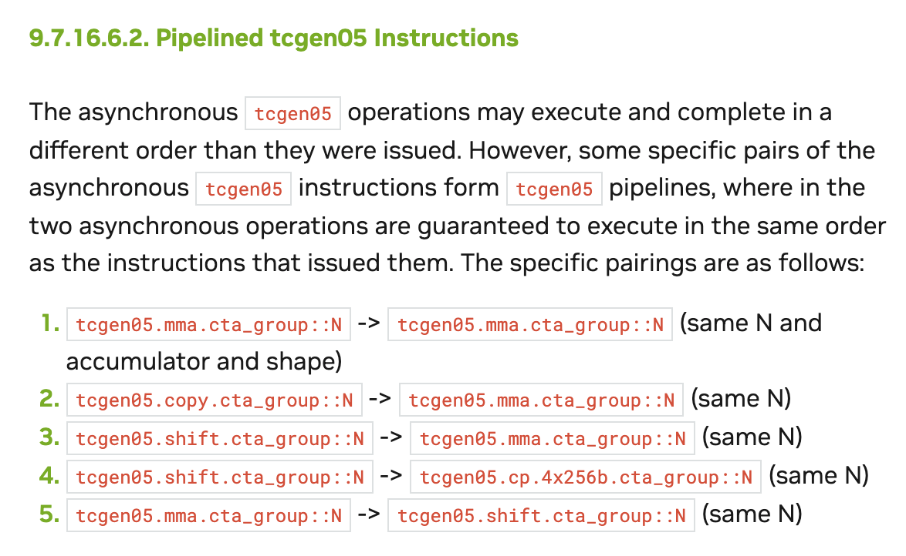

# 

在B200上，只要 kernel 被识别为使用 tcgen05/TMEM 路径，CUDA 的 CTA 驻留模型就把它限制为每个 SM 最多 1 个 CTA，即使只用了部分TMEM容量，剩下的 TMEM 也不能被其他 CTA 使用。

##



NVFP4 的 block scale 的同步可以用到指令流水：

```cpp
if (warp_id == 0) {
  Load A and B tiles with TMA (HBM -&gt; SMEM)
} else if (warp_id == 1) {
  Load A and B scales with TMA (HBM -&gt; SMEM)
} else if (warp_id == 3) {
  Wait for A and B tiles to arrive at SMEM
  Wait for A and B scales to arrive at SMEM
  Load A and B scales with tcgen05.cp (SMEM -&gt; TMEM)
  Run 4 MMAs
}
```

