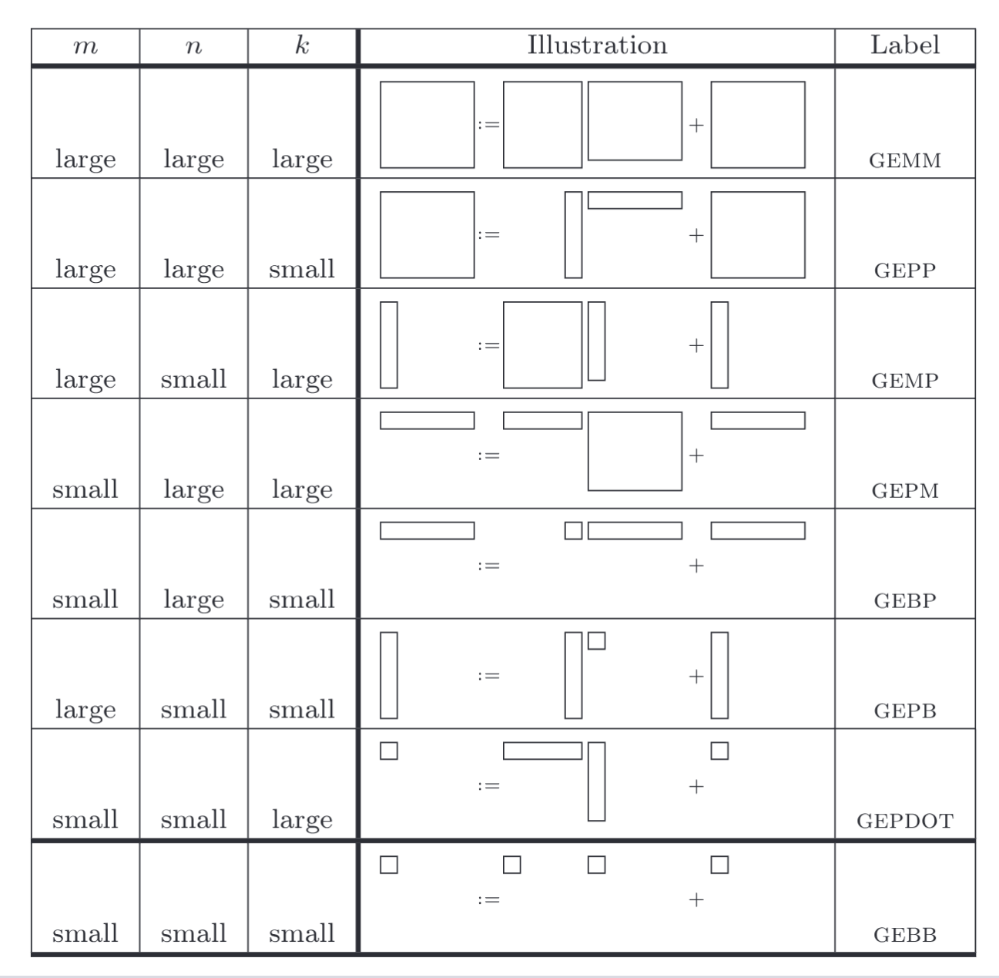

# 

## tcgen05 指令微基准测试

对于每个 SM，TMEM 为张量核提供进出内存访问。分配、数据移动和释放通过 tcgen PTX 指令集由软件显式管理，从而赋予编译器工具链对 tile 局部性和流量模式的精确控制。

独立的 MMA 调度的灵活性减少了空闲周期，并为编译器暴露了优化机会，尽管它也提出了关于新性能限制的问题：依赖下的指令延迟、张量核使用的并发性以及流水线饱和。

在数值支持方面，Blackwell 的 Tensor Cores 引入了用于量化推理的原生 4 位和 6 位浮点精度（FP4 和 FP6），进一步提升了 AI 工作负载的内存和计算效率。架构创新延伸至线程块级别，采用 CTA 对执行：两个相邻秩的 Cooperative Thread Arrays（CTAs）共享操作数，减少了冗余的数据移动。每个 CTA 对映射到一个 TPC，并利用专用的 intraTPC 通信网络以高效共享操作数。

进一步扩展功能，Blackwell 的 Tensor Cores 原生支持具有权重驻留（weight-stationary）数据流的卷积算子，这些数据流使用一个聚合缓冲区来缓存并重用矩阵 B（权重张量 weight tensor ）操作数。因此，可针对受操作数局部性影响的卷积核进行优化。Blackwell 还通过引入基于硬件的解压引擎（Decompression Engine，DE）来应对不断增长的模型和数据规模，从而将解压任务从通用 SM 卸载出去。该子系统支持多种算法，详见第 V 节，使模型权重和大型数据库表能够以压缩形式存储在 HBM3e 中，并在内存访问时透明地解压 [3]。

尽管一些架构细节已公开披露，但关键的微架构信息，例如指令延迟、流水线深度、缓存交互和饱和情况，仍然未知。我们的 PTX 微基准实验（第 V–VI 节）提供了系统性的研究，以填补这些与 AI 和 HPC 性能相关的知识空白。

我们的方法利用 PTX 来对寄存器和特定于架构的内存操作提供显式控制。PTX 代码被编译为 Streaming Assembler (SASS) 指令。我们设计了受依赖性控制的内核以孤立目标行为，并验证了 PTX 到 SASS 的翻译。

首先，传统的数据移动指令（包括 wmma.load、ldmatrix、ld.shared 和 cp.async）无法与 TMEM 交互。因此，开发者需要采用全新的指令序列（tcgen05.ld、tcgen05.st、tcgen05.cp）。其次，这一新内存层的性能影响仍未被充分刻画，使得应用开发者在何时以及如何有效利用 TMEM 方面缺乏指导。

## Blackwell 的

1. 张量内存 (TMEM)：与之前的架构中 MMA 操作完全依赖于 SMEM、DSMEM 和 寄存器文件 (RFs) 不同，Blackwell 引入了 TMEM 作为专用于张量操作的片上内存。

    (a) 通过比较传统 shared memory 与 TMEM 之间的内存访问延迟来建立性能基线，使用 pointer-chase 基准测试 [23]。为了隔离每一级内存的访问延迟，我们使用依赖的 pointer-chase 加载，通过创建依赖的内存访问来防止流水线重叠。
    (b) 系统地将新的 TMEM 数据移动指令（tcgen05.* 系列）与其前代在不同访问模式下进行对比。
    (c) 在不同操作数大小和访问步幅下，识别带宽饱和点并测量不同配置下的每次访问延迟。这揭示了新指令集的能力与局限性。
    设计特性

2. 解压引擎特性表征

    为了系统性地表征 B200 的硬件 DE，我们开发了一个自定义微基准测试套件，针对七种压缩格式（LZ4、Snappy、Zstandard、GZIP、Cascaded、Bitcomp、ANS）在受控测试条件下进行测试。我们使用每种受支持的格式测量 100MB 数据集的端到端解压吞吐量。输入吞吐量计算为从 GPU 内存读取的压缩数据速率；输出吞吐量测量解压生成数据的速率。延迟则捕获输入吞吐量按从 GPU 内存读取的压缩数据速率计算；输出吞吐量衡量解压后数据的生成速率，完整解压时间包括内存传输。为将 DE 行为与压缩开销分离，所有数据集均在 CPU 上预先压缩，基准仅测量设备端解压。每次测量在 100 次预热后对 1000 次迭代取平均，以确保热稳定性和缓存稳定性。我们生成具有不同熵的合成数据集：随机数据（不可压缩，1.00x 比率）、混合字母数字（1.98x）、重复模式（15.02x）和全零缓冲区（245.45x）。

    系统地改变chunk大小（32KB、64KB、128KB、256KB）和批并发度（1–1024 并发操作）以识别最佳并行级别。峰值吞吐量在效率下降之前的最大可持续带宽处测量。流水线深度表示保持大约 85% 效率的并发级别（定义为每次操作的吞吐量 / 单次操作峰值吞吐量）。饱和点标识额外并发带来约 5% 边际吞吐量提升的位置。这种方法揭示了 NVIDIA 未记录的硬件资源限制和内存带宽约束。

3. Tensor Core 表征

    开发了自定义
    GPU 内核以使用 Blackwell 新引入的张量核指令集 (tcgen05) 执行形式为 D = A × B + D 的 MMA 操作。

    我们针对不同的指令类型、矩阵瓷砖形状和操作数布局进行了延迟和吞吐量测量，以表征执行流水线行为。为隔离指令延迟，我们使用通过累加器传递的依赖链，使每个 MMA 依赖于前一个结果，从而防止重叠；吞吐量使用独立的 MMA 进行测量以饱和 tensor-core 流水线。功率效率分析将计算吞吐量与整板功耗进行比较，以识别不同精度模式和瓷砖配置的能量最优运行点。

4. 扩展精度表征

    与先前集中于 FP8、FP16 和 INT8 张量操作的工作 [8], [11] 不同，我们基于 tcgen05 PTX 操作码，使用 e2m1（FP4）、e3m2（FP6）和 e2m3（FP6）编码格式，开发了针对 Blackwell 的 FP4 和 FP6 MMA 指令的首批系统基准。我们使用通过目标操作数传递的依赖链来防止独立发射，并揭示每种 FP4/FP6 指令变体的真实依赖延迟。

5. 工作流基准

    为了评估这些各个独立特性以及整个 B200，我们开发了集成工作负载，以同时检验多项架构创新。

    首先，我们选择 Mistral 模型家族 [24] 作为 LLM，原因有几方面：(1) Mistral-7B 提供了一个具有代表性的密集解码器架构，其性能可与更大型模型相媲美，(2) Mixtral-8x7B 的 Mixture-of-Experts (MoE) 架构考验了不同的数据流模式，对 Blackwell 的内存层次结构施加了压力，(3) Mistral 家族的公开可用性便于结果可复现

    从密集（Mistral7B）到稀疏 MoE（Mixtral-8x7B、Mixtral-8x22B）的架构多样性，提供了对现代 LLM 部署场景的全面覆盖。

    接下来，我们使用 FP64 开发了自定义矩阵乘法内核，以衡量科学工作负载的实际性能。此外，我们运行 STREAM Triad [25] 来测试内存带宽，并使用真实世界数据执行 SpMV 测试以基准 DE。最后，我们使用混合精度训练测量端到端训练性能，采用 ResNet50 [26] 和 GPT-1.3B [27]。

    我们的 PTX 微基准方法（上文详述）提供了在现有仿真框架中无法获得的关于 B200 特性的实测性能数据。通过隔离 TMEM、解压引擎（Decompression Engine）和扩展精度张量核的单独与组合效应，我们为研究人员、高性能计算从业者和面向新兴 GPU 架构上内存密集型与计算密集型工作负载的 AI 框架开发者提供了可操作的见解。


雷霆小猫的研究发现，在B200上，只要 kernel 被识别为使用 tcgen05/TMEM 路径，CUDA 的 CTA 驻留模型就把它限制为每个 SM 最多 1 个 CTA，即使只用了部分TMEM容量，剩下的 TMEM 也不能被其他 CTA 使用。

## 测试对象


|指令|读取|写入|同步性质|
|---|---|---|---|
|SS MMA|SMEM A、SMEM B、可选 TMEM D old value|TMEM D|异步/pipelined|
|TS MMA|TMEM A、SMEM B、可选 TMEM D old value|TMEM D|异步/pipelined|
|CP|SMEM source|TMEM destination|异步/pipelined|
|LD|TMEM source|寄存器|非 MMA producer|
|ST|寄存器|TMEM destination|TMEM producer|


##


NVFP4 的 block scale 的同步可以用到指令流水：

```cpp
if (warp_id == 0) {
  Load A and B tiles with TMA (HBM -&gt; SMEM)
} else if (warp_id == 1) {
  Load A and B scales with TMA (HBM -&gt; SMEM)
} else if (warp_id == 3) {
  Wait for A and B tiles to arrive at SMEM
  Wait for A and B scales to arrive at SMEM
  Load A and B scales with tcgen05.cp (SMEM -&gt; TMEM)
  Run 4 MMAs
}
```

## 问题 workload



对于其中的 GEBP workload，假设我们有一个逻辑问题：
$ M=13,\quad N=17,\quad K=2048 $

假设测试的 MMA atom 是标准的 $ 128\times256\times64 $

只考虑mma的实际执行结构是：

$$
\left\lceil\frac{13}{128}\right\rceil
\times
\left\lceil\frac{17}{256}\right\rceil
\times \frac{2048}{64} =
1\times1\times32
$$

一共需要执行 32 个 MMA atom。

