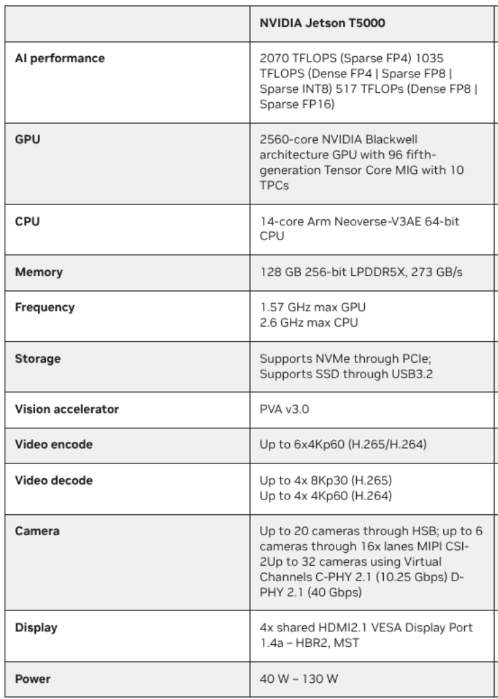
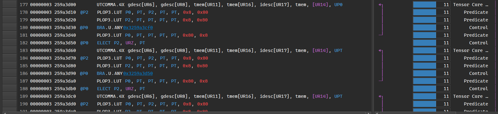
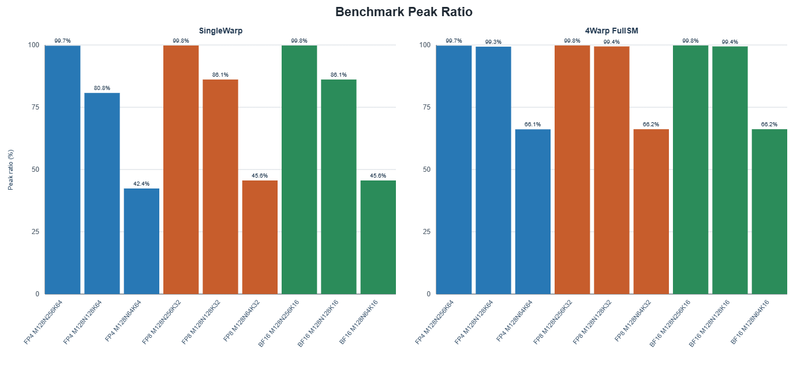
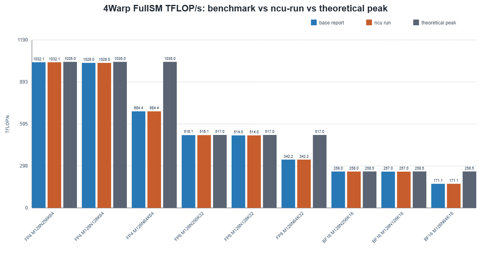
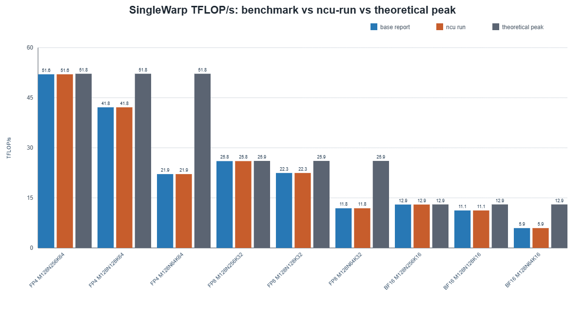
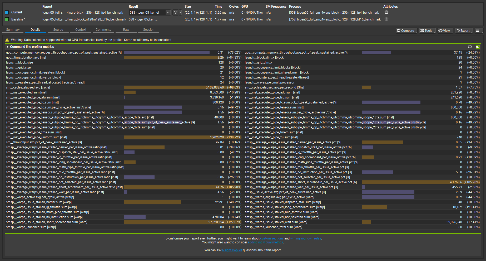
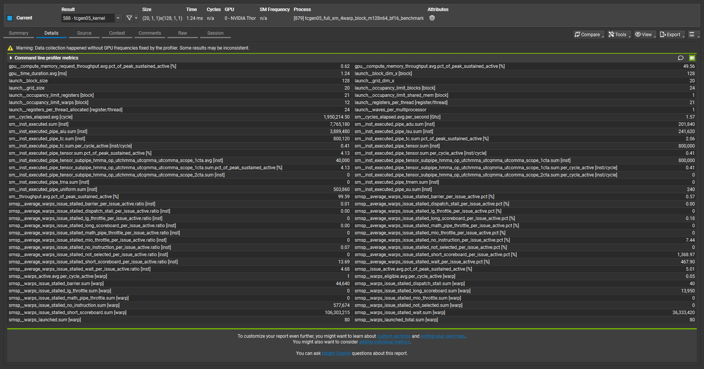

# Thor MMA instruction throughput microbenchmark

## **测试目的与背景**

本文用 Thor/SM110 上的 `tcgen05.mma` inline PTX 循环发射实验，测量 dense BF16、FP8、FP4 MMA 指令路径的吞吐。脚本为每个 launch、shape、precision 组合生成 CUDA benchmark，编译后运行并输出 `mma/分析报告.txt`。

本文关注 MMA 指令 completion throughput，GMEM 访问、TMA 搬运、epilogue、TMEM readback 和 global store 暂不纳入计时窗口。主计时区间只覆盖 MMA 循环、`tcgen05.commit` 和 mbarrier 等待；SMEM 初始化、TMEM alloc/dealloc 在计时窗口外。

当前 dense baseline 覆盖 18 个组合：2 种 launch、3 种矩阵形状、3 种精度。矩阵形状按 `M*N*K` 顺序记录为 `M128N256`、`M128N128`、`M128N64`；K 随精度配置为 FP4 K=64、FP8 K=32、BF16 K=16。

## **tcgen05.mma 指令解析**

矩阵乘法的基本动作是把 A 和 B 的一小块矩阵相乘并累加到 C。硬件执行的数学形式可以写成 `C[M,N] += A[M,K] * B[K,N]`；这里 A 提供左侧输入，B 提供右侧输入，C 保存累加结果。

本文的 shape 始终按 `M*N*K` 解释。`M` 是 C 矩阵的行数，`N` 是 C 矩阵的列数，`K` 是 A/B 之间相乘并规约的维度；例如 `M128N256K64` 表示 `C[128,256] += A[128,64] * B[64,256]`。

单条 MMA 指令的计算量来自 `M * N * K`。对 `M128N256K64 FP4` 来说，C 有 `128 * 256` 个元素，每个元素沿 K 方向做 `64` 次乘加，所以一条 MMA 指令包含 `128 * 256 * 64 = 2097152 MAC`；对 `M128N64K64 FP4` 来说，单条 MMA 指令包含 `128 * 64 * 64 = 524288 MAC`。

`tcgen05.mma` 是 Thor/SM110 上执行这类小块矩阵乘加的 Tensor Core 指令。本文在 CUDA kernel 中用 inline PTX 直接循环发射 `tcgen05.mma`，把实验对象收敛到 MMA 指令本身；计时窗口覆盖 MMA loop、`tcgen05.commit` 和 mbarrier wait，因此表格中的 cycles 主要反映 MMA 指令完成和等待成本。

一条 `tcgen05.mma` 指令需要四类信息：A 在哪里、B 在哪里、C 写到哪里、本条指令按什么 shape 和数据类型执行。本文把 A/B 操作数放在 shared memory，把 C 累加器放在 Tensor Memory；指令通过 descriptor 和地址操作数把这些信息传给硬件。

传给 `tcgen05.mma` 的 scalar 操作数本身都是寄存器里的值。`desc_a/desc_b` 是寄存器中的 64-bit descriptor，`tmem_c/tsfa/tsfb` 是寄存器中的 32-bit Tensor Memory 地址，`idesc >> 32` 是寄存器中的 instruction descriptor 字段；这些寄存器值描述或指向 SMEM/TMEM 中的数据。

`desc_a` 和 `desc_b` 是 SMEM matrix descriptor。`desc_a` 描述 A 矩阵在 shared memory 中的起始地址、leading byte offset 和 stride byte offset，`desc_b` 描述 B 矩阵在 shared memory 中的起始地址、leading byte offset 和 stride byte offset；硬件根据这两个寄存器中的 descriptor 从 shared memory 取 A/B 输入。

`tmem_c` 是 C 累加器在 Tensor Memory 中的起始位置。`tcgen05.mma` 把 A/B 乘加后的结果累加到 `tmem_c` 指向的 Tensor Memory 区域；本文只测 MMA completion throughput，所以 TMEM readback 和 global store 不进入计时窗口。

`idesc` 是 instruction descriptor。它描述本条 MMA 指令的 M/N shape 和数据类型；以 `M128N64K64 FP4` 为例，`idesc` 中 `m_desc_units=8` 表示 `M=128`，`n_desc_units=8` 表示 `N=64`，K 由 FP4 指令路径确定为 `64`。

FP4 指令还需要 scale 数据来解释低精度输入。FP4 路径的 inline PTX 额外传入 `tsfa` 和 `tsfb`，它们指向 Tensor Memory 中的 block scale 数据；例如 `tcgen05.mma.cta_group::1.kind::mxf4nvf4.block_scale.block16` 使用 `tsfa/tsfb` 配合 FP4 A/B 输入完成 scaled MMA。

|对象|本文变量|变量本身位置|描述或指向的对象|告诉硬件什么|
|---|---|---|---|---|
|A 矩阵|`desc_a`|寄存器操作数|shared memory|A 的起始地址和矩阵布局|
|B 矩阵|`desc_b`|寄存器操作数|shared memory|B 的起始地址和矩阵布局|
|C 累加器|`tmem_c`|寄存器操作数|Tensor Memory|C 累加结果写到哪里|
|指令属性|`idesc`|寄存器操作数|指令描述字段|M/N shape 和数据类型|
|FP4 scale|`tsfa`、`tsfb`|寄存器操作数|Tensor Memory|FP4 block scale 数据地址|

下面的代码块展示了这些寄存器操作数如何进入一条 FP4 `tcgen05.mma`。inline PTX 约束中，`"l"` 表示 64-bit register operand，`"r"` 表示 32-bit register operand；`desc_a/desc_b` 用 `"l"` 传入，`tmem_c`、`idesc >> 32`、`scale`、`tsfa/tsfb` 用 `"r"` 传入。

```C++
uint64_t desc_a = make_smem_desc(smem_a, desc_leading, desc_stride);
uint64_t desc_b = make_smem_desc(smem_b, desc_leading, desc_stride);
uint64_t idesc = make_idesc_fp4();   // M/N shape and dtype

uint32_t tmem_c = tmem_base;
uint32_t tsfa = tmem_base + 256;
uint32_t tsfb = tmem_base + 384;

asm volatile(
  "{ .reg .pred p; setp.ne.b32 p, %4, 0;"
  "tcgen05.mma.cta_group::1.kind::mxf4nvf4.block_scale.block16 "
  "[%0], %1, %2, %3, [%5], [%6], p; }"
  :: "r"(tmem_c), "l"(desc_a), "l"(desc_b),
     "r"(uint32_t(idesc >> 32)), "r"(scale), "r"(tsfa), "r"(tsfb));
```

PTX 是源码里写的汇编形式，SASS 是 GPU 最终执行的机器指令。本文源码中写的是 `tcgen05.mma...` PTX，编译后需要检查 SASS 才能确认硬件真正执行了哪类 Tensor Core 指令。也就是说 tcgen05.mma 会根据不同的参数（比如精度）编译成不同的SASS指令。

SASS 名称可以用来区分 BF16、FP8 和 FP4 的 dense MMA 路径。BF16 dense MMA 对应 `UTCHMMA`，FP8 dense MMA 对应 `UTCQMMA`，FP4 dense MMA 对应 `UTCOMMA.4X`；`FullSM4WarpBlock M128N256K64 FP4` 的 SASS 命中 `UTCOMMA.4X`，对应本文的 FP4 dense 路径。

NCU counter 用来核对硬件实际执行了多少条目标 MMA 指令。`FullSM4WarpBlock M128N256K64 FP4` 使用 `grid=20`、`block=128`、每 CTA 4 个 warp、`iters=10000`，目标 MMA 指令计数应为 `20 * 4 * 10000 = 800000`；NCU 中 `sm__inst_executed_pipe_tensor_subpipe_hmma_op_utchmma_utcqmma_utcomma_scope_1cta.sum=800000`，与源码循环一致。

## **实验环境**

实验设备为 NVIDIA Jetson AGX Thor Developer Kit。官方 dense 理论峰值来自下图中的 NVIDIA Thor dense 指标：FP4 1035 TFLOP/s、FP8 517 TFLOP/s、BF16/FP16 258\.5 TFLOP/s。脚本读取 `/sys/class/devfreq/gpu-gpc-0/cur_freq` 作为实测频率；官方峰值列使用图中的 dense 峰值，`SingleWarpBlock` 再按 `active_blocks / SM_count` 缩放。



截图来源：[Introducing NVIDIA Jetson Thor, the Ultimate Platform for Physical AI \| NVIDIA Technical Blog](https://developer.nvidia.com/blog/introducing-nvidia-jetson-thor-the-ultimate-platform-for-physical-ai/)

硬件和本文用到的片上资源如下。SMEM 参数来自 `tools/query_thor_smem_tmem.cu` 的 CUDA runtime 查询；TMEM 参数来自单 CTA `tcgen05.alloc.cta_group::1` probe。

|组件|参数|
|---|---|
|GPU|NVIDIA Thor<br>Compute capability: `11.0`<br>SM count: `20`<br>Warp size: `32`<br>L2 cache: `32768.0 KiB`|
|Thread / block limit|Max threads/block: `1024`<br>Max threads/SM: `1536`<br>Max blocks/SM: `24`|
|Register file|Registers/block: `65536`<br>Registers/SM: `65536`<br>本文 FP4 benchmark: `REG:21`|
|SMEM|Shared memory/block 默认上限: `48.0 KiB`<br>Shared memory/block opt-in 上限: `227.0 KiB`<br>Shared memory/SM 上限: `228.0 KiB`<br>Reserved shared memory/block: `1.0 KiB`|
|本文 SMEM 用量|`cuobjdump --dump-resource-usage` 显示 `SHARED:66572 bytes`，约 `65.0 KiB/CTA`<br>主要来自 `smem_a[32768]`、`smem_b[32768]`、`done_barrier` 和 `tmem_base`|
|TMEM probe|`32/64/128/256/512/543` columns: OK<br>`544/768/1024` columns: illegal instruction<br>本文 benchmark 使用 `512` columns|
|本文 TMEM 布局|`tmem_c = tmem_base`<br>`tsfa = tmem_base + 256`<br>`tsfb = tmem_base + 384`|

## **测试动作**

脚本生成 dense `tcgen05.mma` benchmark，并用两种 launch 规模观察单 block 和全 SM 压测行为。`SingleWarpBlock` 使用 `<<<1, 32>>>`，每轮循环发 1 条 MMA；`FullSM4WarpBlock` 使用 `<<<SM数, 128>>>`，每个 SM 一个 CTA，每个 CTA 4 个 warp，每轮循环每个 SM 发 4 条 MMA。

|Launch|Grid/Block|WarpNum|ActiveBlocks|总 Warp 数|
|---|---|---|---|---|
|SingleWarpBlock|`<<<1, 32>>>`|1|1|1|
|FullSM4WarpBlock|`<<<SM数, 128>>>`|4|20|80|

本次设备 `SM_count=20`，所以 `FullSM4WarpBlock` 的总 warp 数为 `20 * 4 = 80`。脚本通过 `cudaGetDeviceProperties()` 读取 `prop.multiProcessorCount`。每个 warp 由 lane 0 发射一条 MMA inline PTX 指令。`iters=10000` 时，`SingleWarpBlock` 总共发 `1 * iters` 条 MMA；`FullSM4WarpBlock` 每个 active block 发 `4 * iters` 条 MMA。

吞吐计算使用 active block 口径：

```Plain Text
inst_per_active_block = warps_per_block * iters
macs_per_active_block = inst_per_active_block * MAC_per_instruction
MAC/cycle/active-block = macs_per_active_block / max_cycles
整卡 MAC/cycle = MAC/cycle/active-block * active_blocks
TFLOP/s = 整卡 MAC/cycle * GPU_frequency * 2 / 1e12
```

`SingleWarpBlock` 的理论峰值按 `active_blocks / SM_count` 缩放。报告中 `SingleWarpBlock M128N256K64 FP4` 的理论值为 `1035 / 20 = 51.750 TFLOP/s`，实测 `51.593 TFLOP/s`。

## **实现方案**

脚本入口为 `mma/run_thor_tcgen05_report.py`。运行后脚本读取 GPU 信息和 `/sys/class/devfreq/gpu-gpc-0/cur_freq`，生成 `benchmark_src/*.cu`，用 `nvcc` 编译到 `build/`，再运行所有 dense benchmark 并写出 `mma/分析报告.txt`。

生成源码按 launch、shape、precision 命名，例如：

```Plain Text
benchmark_src/tcgen05_single_warp_block_m128n256_fp4_benchmark.cu
benchmark_src/tcgen05_full_sm_4warp_block_m128n128_fp8_benchmark.cu
benchmark_src/tcgen05_full_sm_4warp_block_m128n64_bf16_benchmark.cu
```

每份 CUDA 源码会固定一个 `kMacPerInst` 和一个带 K 的 shape 标签。以 `M128N256K64 FP4` 为例，`kMacPerInst = 128 * 256 * 64 = 2097152`。

```C++
static constexpr long long kMacPerInst = 2097152LL;
static constexpr char kPrecision[] = "FP4";
static constexpr char kShape[] = "M128N256K64";
```

### **CUDA 源码执行流程**

每个 benchmark kernel 在计时前完成 SMEM 初始化、mbarrier 初始化和 TMEM 分配。`smem_a` 和 `smem_b` 使用固定 pattern 填充，避免输入全零；`tcgen05.alloc.cta_group::1` 分配 512 个 TMEM columns，计时结束后用 `tcgen05.dealloc` 释放。

```C++
__shared__ alignas(16) uint8_t smem_a[32768];
__shared__ alignas(16) uint8_t smem_b[32768];
__shared__ alignas(8) uint64_t done_barrier;
__shared__ uint32_t tmem_base;
```

MMA 操作使用 shared memory descriptor 和 instruction descriptor 两类描述符。`desc_a`、`desc_b` 描述 shared memory 中 A/B 矩阵的地址、leading 和 stride；`idesc` 描述 MMA 的 M/N shape 和数据类型。`M128N64K64` 对应 `M=128, N=64, K=64`，其中 `m_desc_units=8`、`n_desc_units=8`。

|Precision|desc\_leading|desc\_stride|K|
|---|---|---|---|
|FP4|4|2|64|
|FP8|8|4|32|
|BF16|16|8|16|

```C++
uint64_t desc_a = make_smem_desc(smem_a, desc_leading, desc_stride);
uint64_t desc_b = make_smem_desc(smem_b, desc_leading, desc_stride);
uint64_t idesc = make_idesc_fp4();
```

BF16、FP8 和 FP4 的 `idesc` 都会把 N/M 写入 bit field。以 `M128N64` 为例，`n_desc_units=8` 表示 `N=64`，`m_desc_units=8` 表示 `M=128`。

```C++
d |= 8u << 17;      // N = 64
d |= 8u << 24;      // M = 128
```

主循环中每个 warp 只有 lane 0 发射 MMA inline PTX。`SingleWarpBlock` 每轮发 1 条 MMA；`FullSM4WarpBlock` 每个 active block 每轮发 4 条 MMA。下面代码以 FP4 为例：FP4 使用 `tcgen05.mma.cta_group::1.kind::mxf4nvf4.block_scale.block16`，并传入 `tsfa/tsfb` 作为 scale tensor memory 地址；BF16/FP8 使用对应 dense MMA 指令，extra operands 填 0。

```C++
for (int i = 0; i < iters; ++i) {
  uint32_t scale = (i == 0) ? 0u : 1u;
  uint32_t tmem_c = tmem_base;
  uint32_t tsfa = tmem_base + 256;
  uint32_t tsfb = tmem_base + 384;
  if (warp_leader()) {
    asm volatile(
      "{ .reg .pred p; setp.ne.b32 p, %4, 0;"
      "tcgen05.mma.cta_group::1.kind::mxf4nvf4.block_scale.block16 "
      "[%0], %1, %2, %3, [%5], [%6], p; }"
      :: "r"(tmem_c), "l"(desc_a), "l"(desc_b),
         "r"(uint32_t(idesc >> 32)), "r"(scale), "r"(tsfa), "r"(tsfb));
  }
}
```

计时窗口从 MMA 循环前的 `clock64()` 开始，到 `tcgen05.commit` 和 mbarrier wait 完成后结束。这个窗口覆盖 MMA completion 和 commit 等待；SMEM 初始化、TMEM alloc/dealloc 不计入 cycles。多 block 测试使用所有 block 中的 `max_cycles` 计算吞吐，这个口径对应整卡完成时间，避免平均 cycles 掩盖慢 block。

```C++
unsigned long long start = clock64();
// MMA loop
asm volatile("tcgen05.commit.cta_group::1.mbarrier::arrive::one.shared::cluster.b64 [%0];" :: "r"(bar_addr));
barrier_wait(&done_barrier, 0);
unsigned long long stop = clock64();
```

## **反汇编验证**

脚本用 `cuobjdump --dump-sass` 检查 dense MMA 指令是否出现，并确认源码没有使用 sparse MMA。这个检查用于防止走到 sparse 或错误 SASS 路径；完整指令计数仍以源码主循环和 benchmark 输出口径为准。

报告中的指令检查显示所有 dense 组合均为 `check = dense`。例如 `FullSM4WarpBlock M128N256K64 FP4` 使用 PTX `tcgen05.mma.cta_group::1.kind::mxf4nvf4.block_scale.block16`，SASS 命中 `UTCOMMA.4X`。

NCU Source/SASS 页面同样能看到 `UTCOMMA.4X`，图中对应 `FullSM4WarpBlock M128N256K64 FP4` 的 FP4 dense MMA 指令。



## **实验结果**

### 计算性能结果

FullSM4WarpBlock 在 `M128N256` 和 `M128N128` 上接近官方 dense 峰值。`FullSM4WarpBlock M128N256K64 FP4` 实测 `1032.111 TFLOP/s`，官方峰值 `1035.000 TFLOP/s`，比率 `99.72%`。

|精度|WarpNum|矩阵形状(M*N*K)|计算量(MAC/inst)|实际测试/TFLOP/s|理论峰值/TFLOP/s|比率|
|---|---|---|---|---|---|---|
|**FP4**|1|M128N256K64|2097152|51\.593|51\.750|99\.70%|
||1|M128N128K64|1048576|41\.790|51\.750|80\.75%|
||1|M128N64K64|524288|21\.935|51\.750|42\.39%|
||4|M128N256K64|2097152|1032\.111|1035\.000|99\.72%|
||4|M128N128K64|1048576|1028\.016|1035\.000|99\.33%|
||4|M128N64K64|524288|684\.415|1035\.000|66\.13%|
|**FP8**|1|M128N256K32|1048576|25\.797|25\.850|99\.80%|
||1|M128N128K32|524288|22\.268|25\.850|86\.14%|
||1|M128N64K32|262144|11\.789|25\.850|45\.60%|
||4|M128N256K32|1048576|516\.059|517\.000|99\.82%|
||4|M128N128K32|524288|514\.015|517\.000|99\.42%|
||4|M128N64K32|262144|342\.213|517\.000|66\.19%|
|**BF16**|1|M128N256K16|524288|12\.899|12\.925|99\.80%|
||1|M128N128K16|262144|11\.134|12\.925|86\.14%|
||1|M128N64K16|131072|5\.894|12\.925|45\.60%|
||4|M128N256K16|524288|258\.030|258\.500|99\.82%|
||4|M128N128K16|262144|257\.008|258\.500|99\.42%|
||4|M128N64K16|131072|171\.106|258\.500|66\.19%|

Peak ratio 图显示 `M128N256` 和 `M128N128` 是当前 dense MMA completion throughput 的高效 shape。FullSM4WarpBlock 下，`M128N256K64/32/16` 的 FP4/FP8/BF16 比率分别为 `99.72%`、`99.82%`、`99.82%`；`M128N128K64/32/16` 的比率分别为 `99.33%`、`99.42%`、`99.42%`。



4Warp FullSM 图显示 benchmark run 和 ncu run 的 TFLOP/s 结果一致。`M128N256K64 FP4` 的 benchmark 和 ncu run 都为 `1032.1 TFLOP/s`，理论峰值为 `1035.0 TFLOP/s`；`M128N64K16 BF16` 的 benchmark 和 ncu run 都为 `171.1 TFLOP/s`，理论峰值为 `258.5 TFLOP/s`。



`M128N64` 的表格 TFLOP/s 低于大 shape。FullSM4WarpBlock 下，`M128N128K32 FP8` 为 `514.015 TFLOP/s`、`2570363 cycles`，`M128N64K32 FP8` 为 `342.213 TFLOP/s`、`1930385 cycles`；计算量从 `524288 MAC/inst` 降到 `262144 MAC/inst`，cycles 没有等比例减半。

SingleWarpBlock 图显示大 shape 在单 active block 口径下也能接近缩放峰值。`SingleWarpBlock M128N256K32 FP8` 实测 `25.797 TFLOP/s`，理论值 `25.850 TFLOP/s`；`SingleWarpBlock M128N64K32 FP8` 实测 `11.789 TFLOP/s`，理论值 `25.850 TFLOP/s`。



### NCU 抓取结果

NCU GUI 截图用于确认 launch 规模、MMA 指令计数和关键 counter。当前正文只保留两个代表 case：`M128N256K64 FP4` 对应接近峰值的路径，`M128N64K16 BF16` 对应小 N shape 的下降路径；完整 `.ncu-rep` 可在 `mma/ncu_reports_key/` 中打开。

`FullSM4WarpBlock M128N256K64 FP4` 的 NCU counter 与 benchmark 配置一致。该 case 使用 `grid=20`、`block=128`、每 CTA 4 个 warp，总 warp 数为 `80`；benchmark 输出为 `1032.111 TFLOP/s`，官方 FP4 dense 峰值为 `1035.000 TFLOP/s`，peak ratio 为 `99.72%`。



FP4 大 shape 的 MMA 指令计数可以和源码循环对齐。图中 `sm__cycles_elapsed.avg` 约为 `5.13M cycles`，`sm__inst_executed_pipe_tensor_subpipe_hmma_op_utchmma_utcqmma_utcomma_scope_1cta.sum` 为 `800000`，对应 `20 SM * 4 warp * 10000 iters`；`launch__grid_size=20`、`launch__block_size=128`、`smsp__warps_launched_total.sum=80` 与 `FullSM4WarpBlock` 配置一致。

`FullSM4WarpBlock M128N64K16 BF16` 的 NCU counter 确认小 N case 仍在执行目标 MMA 路径。该 case 使用同样的 `grid=20`、`block=128`、`80` 个 warp，benchmark 输出为 `171.106 TFLOP/s`，BF16 dense 理论峰值为 `258.500 TFLOP/s`，peak ratio 为 `66.19%`。



BF16 N64 的下降主要来自计算量和 cycles 的比例变化。`M128N64K16` 的单条 MMA 计算量为 `128 * 64 * 16 = 131072 MAC`，是 `M128N128K16` 的一半；对应 cycles 从 `2570363` 降到 `1930385`，没有随 `MAC/inst` 等比例下降，所以表格 TFLOP/s 从 `257.008` 降到 `171.106`。

NCU 的 throughput counter 和本文的 peak ratio 使用不同口径。图中 `sm__throughput.avg.pct_of_peak_sustained_active` 接近 `99.59%`，说明 profiler 看到的 active SM pipe 利用率较高；本文表格中的 `66.19%` 来自 `M*N*K*2*iters*active_blocks/time` 对官方 BF16 dense 峰值的归一化，两者分别回答 pipe 活跃度和归一化吞吐两个问题。

## **总结**

本轮 microbenchmark 证明 Thor dense `tcgen05.mma` 的核心指令吞吐可以打到官方 dense 峰值附近。FullSM4WarpBlock 下，`M128N256K64 FP4` 达到 `1032.111 TFLOP/s/Thor` 和 `16382.7 MACs/SM/cycle`，`M128N128K64 FP4` 达到 `1028.016 TFLOP/s/Thor` 和 `16317.7 MACs/SM/cycle`。

当前推荐用 `M128N256` 或 `M128N128` 作为 dense MMA 吞吐 baseline。三种精度下，`M128N256` 的 FullSM4WarpBlock 结果分别为 FP4 `1032.111 TFLOP/s/Thor`、FP8 `516.059 TFLOP/s/Thor`、BF16 `258.030 TFLOP/s/Thor`，对应 `16382.7`、`8191.4`、`4095.7 MACs/SM/cycle`。

`M128N64` 适合作为小 shape 压力样例。FullSM4WarpBlock 下，`M128N64K16 BF16` 为 `171.106 TFLOP/s/Thor` 和 `2716.0 MACs/SM/cycle`，低于 `M128N128K16 BF16` 的 `257.008 TFLOP/s/Thor` 和 `4079.5 MACs/SM/cycle`。

下表给出领导层最需要看的两个指标：`TFLOP/s/Thor` 表示整卡吞吐，`MACs/SM/cycle` 表示每个 SM 每 cycle 完成的 MAC operations 数。

|结论|精度|矩阵形状(M*N*K)|TFLOP/s/Thor|MACs/SM/cycle|
|---|---|---|---|---|
|接近峰值|FP4|M128N256K64|1032.111|16382.7|
|接近峰值|FP4|M128N128K64|1028.016|16317.7|
|小 shape 下降|FP4|M128N64K64|684.415|10863.7|
|接近峰值|FP8|M128N256K32|516.059|8191.4|
|接近峰值|FP8|M128N128K32|514.015|8159.0|
|小 shape 下降|FP8|M128N64K32|342.213|5432.0|
|接近峰值|BF16|M128N256K16|258.030|4095.7|
|接近峰值|BF16|M128N128K16|257.008|4079.5|
|小 shape 下降|BF16|M128N64K16|171.106|2716.0|

## **边界**

本文覆盖 dense `tcgen05.mma` completion throughput。GMEM、TMA、epilogue、TMEM readback、global store 和 sparse `tcgen05.mma.sp` 暂不纳入本轮表格；NCU 截图顶部的频率 warning 作为运行边界保留，TFLOP/s 结论以 benchmark stdout 和 `mma/分析报告.txt` 为准。
