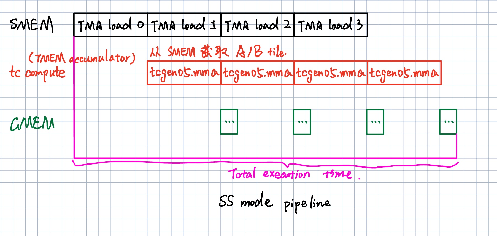
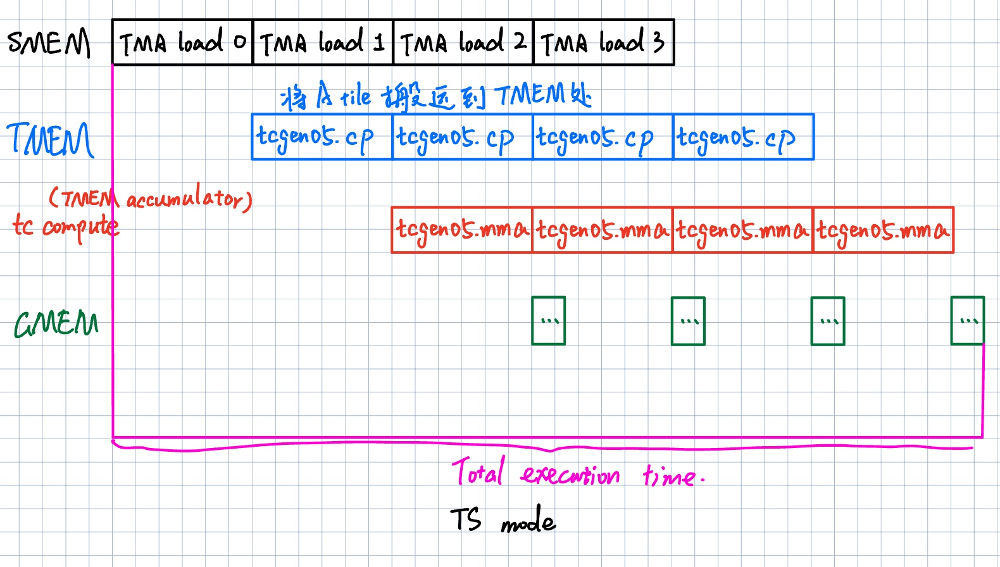

# Thor TCGen05 cp + MMA pipeline microbenchmark

## **测试目的与背景**

本文在 Thor/SM110 架构下测试 `tcgen05.mma` 的 SS/TS 模式，比较不同 A 操作数来源的性能、完成同步开销，以及 `tcgen05.cp` 的 A tile 准备成本。这里的输入准备指 `tcgen05.cp` 把 A tile 从 shared memory（SMEM）搬到 Tensor Memory（TMEM），让后续 TS `tcgen05.mma` 可以从 TMEM 读取 A；B 操作数仍然通过 SMEM descriptor 读取。

上一篇 compute-only MMA 报告给出不含 A tile SMEM->TMEM copy 的 dense SS 基线，例如 `FullSM4WarpBlock M128N256K64 FP4` 达到 `1032.111 TFLOP/s`；这篇报告测试十四组动作：SS MMA-only forced-wait、TS MMA-only forced-wait、SS MMA Mainloop K2/K4/K8/K16、TS CP+MMA Mainloop A2 K2/K4/K8/K16、`tcgen05.cp`-only、TS CP+MMA Serial A1、TS CP+MMA Overlap A2、TS CP+MMA Warp Split A2。

默认 heatmap 覆盖 `M128N64/M128N128/M128N256` 三个形状，用来观察 shape 敏感性；14 类 case、3 种 precision 和 3 种矩阵形状合计 126 个基础组合。主结论以 `M128N256` 为准；快速复测时可以用 `--primary-shape-only` 只跑 N256 的 42 个组合。grouped/4Warp N-slice 会把一个逻辑 MMA tile 拆成更小 atom，容易把 atom shape 吞吐限制和 pipeline overlap 混在一起，因此更适合放到独立 issue-throughput benchmark 中解释。

这组实验关注 SMEM/TMEM 输入路径对 `tcgen05.mma` 的影响。GMEM（global memory，全局内存）、TMA（Tensor Memory Accelerator，全局内存到 shared memory 的硬件搬运单元）、epilogue、TMEM 读回、全局写回、sparse MMA、2CTA/cluster 路径属于后续实验范围；TMEM 分配、释放和 relinquish 位于纯吞吐计时窗口外。





SS 图对应真实 GEMM 主循环里最直接的 Tensor Core 消费路径。黑色 TMA load 阶段把连续 K 阶段的 A/B tile 放进 SMEM，红色 `tcgen05.mma` 随后从 SMEM descriptor 读取 A/B tile，并把累加结果写入 TMEM accumulator。图中的 GMEM、TMA 和后续写回用于说明真实 kernel 背景；计时窗口只覆盖 `tcgen05` 指令序列和等待完成。

TS 图对应 A-from-TMEM 的专项路径。黑色 TMA load 仍然先把 tile 放进 SMEM，蓝色 `tcgen05.cp` 把 A tile 从 SMEM 搬到 TMEM，红色 TS `tcgen05.mma` 再从 TMEM 读取 A、从 SMEM descriptor 读取 B，并更新 TMEM accumulator。蓝色 copy 阶段是这里的核心实验对象；这条路径主要用于特殊场景和诊断实验，普通 dense GEMM 的代表路径仍以 SS mainloop 为准。

## **tcgen05.mma / tcgen05.cp 指令解析**

这里用 SS/TS 描述 `tcgen05.mma` 的两个操作数来源组合。第一个字母描述 A 操作数的位置，第二个字母描述 B 操作数的位置：`S` 表示 shared memory descriptor，`T` 表示 Tensor Memory address。当前 dense GEMM 路径里 B 操作数仍来自 SMEM descriptor，所以这里只比较 `SS` 和 `TS` 两种形态。

SS 表示 A/B 都从 SMEM descriptor 读取，指令操作数是 `[d_tmem], a_desc, b_desc, idesc...`。TS 表示 A 从 TMEM 读取、B 从 SMEM descriptor 读取，指令操作数变成 `[d_tmem], [a_tmem], b_desc, idesc...`。TS 路径中的 A tile 由 `tcgen05.cp` 从 SMEM 写入 TMEM，再由后续 TS `tcgen05.mma` 作为 A 操作数读取；因此 TS case 需要额外定义 A slot 数量和 cp/mma 的先后关系。

`tcgen05.mma` 的单线程发射语义指的是：CTA 内一个发射线程执行一条 `tcgen05.mma` PTX，就足以描述并启动一个完整的 Tensor Core tile 操作。这个 tile 的数学范围由 `idesc` 中的 `M/N` 和 precision 对应的 `K` 决定，例如 `M128N256K64 FP4` 对应一条完整的 `128 * 256 * 64` MAC 指令，而不是 32 个 lane 各自提交一小片 MMA。

benchmark 中一个 CTA（cooperative thread array，这里等价于一个 CUDA thread block）共享同一组 SMEM tile、TMEM allocation 和用于确认完成的 mbarrier（异步操作完成屏障）。per-tile 和单 issuer cp+mma 口径只让 `threadIdx.x == 0` 提交 inline PTX；Warp Split A2 使用 `threadIdx.x == 0` 发 copy、`threadIdx.x == 32` 发 MMA。所有 MMA case 都使用完整 shape atom，例如 `M128N256` 会作为一个完整 tile 计数。

同一个发射线程循环中的 `tcgen05.mma` 和 `tcgen05.cp` 按程序顺序发射。也就是说，代码里写成 `mma; mma; mma` 或 `cp; wait; mma` 时，发射线程不会在同一线程内重排这些 inline PTX；异步操作的完成边界由后续 `tcgen05.commit`、mbarrier 等待或等待 copy 完成来确认。本文把 forced-wait per-instruction completion、CUTLASS-style K-block mainloop sweep 和 cp+mma throughput 分开报告，避免把真实主循环里的等待成本和纯 Tensor Core 发射峰值混成一个数。

本文固定逻辑 accumulator tile 策略，把变量集中在 A 操作数来源、`tcgen05.cp` copy、A double buffering 和 copy/MMA issuer 分工。所有 MMA throughput 都对应完整 shape atom，便于和 CUTLASS-style mainloop 比较。

### **真实性分层**

这组 case 按 dense GEMM 主路径、TS 专项路径和诊断路径分层。CUTLASS `SM100_MMA_F16BF16_SS` tutorial、CuTe tcgen05 programming guide 和高性能 dense GEMM 实现都采用同一类 SS 主循环：A/B staged 到 SMEM，`tcgen05.mma` 从 SMEM descriptor 读取 A/B，并把 accumulator 放在 TMEM。

- `SS MMA Mainloop K2/K4/K8/K16` 是最接近普通 dense GEMM 主路径的 sweep。它对应 CUTLASS/CuTe 常见结构：A/B 由 TMA staged 到 SMEM，`make_fragment_A/B` 生成 SMEM descriptor；一个 K tile 内连续执行多个 K-block MMA，然后通过 `umma_arrive`/barrier 等待确认 MMA 完成，之后 SMEM stage 才能安全复用。K blocks 越多，单次 wait 的固定成本被更多 MMA 摊薄，但 SMEM、寄存器、调度窗口和真实 kernel 的 K tile 设计会限制继续增大。

- `SS MMA-only` 是 SS 主路径的 forced-wait latency/completion 诊断。A/B 来源与普通 dense GEMM 一致；每条 MMA 后立即 `commit_and_wait` 会暴露单条完整 shape atom 的完成边界，和高性能 mainloop 里“多个 K-block MMA 聚合后再等待”的节奏不同。

- `TS MMA-only` 是 TS MMA forced-wait 能力诊断。TS A-from-TMEM 是合法硬件路径；计时窗口内每条 TS MMA 后立即 `commit_and_wait`，测 TS MMA 单指令 completion 成本。普通 dense GEMM 主路径仍以 SS mainloop 为准。

- `tcgen05.cp-only` 是 TS 特殊路径的 copy 成本诊断。它测 A SMEM->TMEM copy 的发射吞吐、bytes/cycle 和 cycles/cp。

- `TS CP+MMA Mainloop A2 K2/K4/K8/K16` 是 A-from-TMEM 的 mainloop-like sweep。每个 K-block 执行 `cp(next A panel)` 和 `mma(current A panel)`，并在 K-block 边界等待完成，保证下一条 TS MMA 消费的 TMEM A 已经可用。它比 TS MMA-only 更接近真实 TS 专项路径；普通 dense GEMM 默认主路径仍以 SS mainloop 为准。

- `TS CP+MMA Serial A1`、`TS CP+MMA Overlap A2` 和 `TS CP+MMA Warp Split A2` 是 A-from-TMEM 的单 tile pipeline 诊断。FMHA、mixed-input GEMM 或需要在 TMEM 中暂存/复用 A 的算子适合用这组结果解释真实 TS 路径；普通 dense GEMM 可以用这组结果评估“如果走 TS 会怎样”。

后续解读以 `SS MMA Mainloop K2/K4/K8/K16` sweep 作为“最接近普通 CUTLASS-style dense GEMM 主循环”的基线；`TS CP+MMA Mainloop A2 K2/K4/K8/K16` 测真实 TS A-from-TMEM 算子的 K-group 稳态成本。TS CP+MMA 系列按“特殊场景/诊断路径”解释。纯发射上限适合放到独立 issue-throughput benchmark 中单独解释。

矩阵乘法的基本动作是把 A 和 B 的一小块矩阵相乘并累加到 C。硬件执行的数学形式可以写成 `C[M,N] += A[M,K] * B[K,N]`；这里 A 提供左侧输入，B 提供右侧输入，C/D 保存在 Tensor Memory 中。

本文的 shape 始终按 `M*N*K` 解释。`M` 是 C 矩阵的行数，`N` 是 C 矩阵的列数，`K` 是 A/B 之间相乘并规约的维度；例如 `M128N256K64` 表示 `C[128,256] += A[128,64] * B[64,256]`。

单条 MMA 指令的计算量来自 `M * N * K`。对 `M128N256K64 FP4` 来说，C 有 `128 * 256` 个元素，每个元素沿 K 方向做 `64` 次乘加，所以一条 MMA 指令包含 `128 * 256 * 64 = 2097152 MAC`；对 `M128N256K16 BF16` 来说，单条 MMA 指令包含 `128 * 256 * 16 = 524288 MAC`。

### **tcgen05 语法和操作数**

一条 `tcgen05.mma` 指令首先要把四类信息交给硬件：A 从哪里读、B 从哪里读、D/C 累加器写到哪里、这条 MMA 按什么 shape 和数据类型执行。SS 和 TS 的差异只发生在 A operand：SS 把 A 描述成 SMEM 中的一块矩阵，TS 把 A 描述成 TMEM 中的一块 A tile。B 在本文所有 dense case 中都来自 SMEM descriptor，D/C 都写入 TMEM accumulator。

传给 `tcgen05.mma` 和 `tcgen05.cp` 的操作数本身都是寄存器里的标量值。`a_desc`、`b_desc`、`s_desc` 是 64-bit descriptor，描述 SMEM 中某块矩阵的起始地址和布局；`d_tmem`、`a_tmem`、`taddr` 是 32-bit TMEM 地址，指向 TMEM 中的 D accumulator 或 A slot；`idesc` 描述本条 MMA 的 M/N shape 和数据类型。硬件拿到这些寄存器值后，才知道要从哪块 SMEM/TMEM 读数据、把结果写到哪块 TMEM。

SS `tcgen05.mma` 使用 SMEM A/B descriptor。硬件根据 `a_desc` 读取 A tile，根据 `b_desc` 读取 B tile，把结果累加到 `[d_tmem]` 指向的 TMEM 区域。对初学者来说，可以把 `a_desc` 和 `b_desc` 理解成“SMEM 矩阵的地址 + stride + layout”的打包描述，而不是普通指针。

```ptx
// SS: A from SMEM, B from SMEM, D/C in TMEM.
tcgen05.mma.cta_group::1.kind::<dtype>
  [d_tmem], a_desc, b_desc, idesc, disable_output_lane, enable_input_d;
```

TS `tcgen05.mma` 使用 TMEM A 和 SMEM B descriptor。硬件通过 `[a_tmem]` 读取已经写入 TMEM 的 A tile，通过 `b_desc` 继续从 SMEM 读取 B tile。这里 `[a_tmem]` 不是 SMEM descriptor，而是 TMEM 地址；这也是 TS 路径必须先安排 `tcgen05.cp` 的原因。

```ptx
// TS: A from TMEM, B from SMEM, D/C in TMEM.
tcgen05.mma.cta_group::1.kind::<dtype>
  [d_tmem], [a_tmem], b_desc, idesc, disable_output_lane, enable_input_d;
```

`tcgen05.cp` 把 A tile 从 SMEM 搬到 TMEM。`s_desc` 描述源 A tile 在 SMEM 中的位置和布局，`[taddr]` 指向目标 TMEM A slot。TS MMA-only 的 setup 会先用这条指令把 A 准备好；TS cp+mma pipeline 则把这条 copy 指令放进计时窗口，观察它和后续 TS MMA 的串行或重叠成本。

```ptx
// [taddr]: TMEM 目标地址；s_desc: SMEM 源 descriptor。
tcgen05.cp.cta_group::1.<cp-shape> [taddr], s_desc;
```

`<cp-shape>` 描述单条 copy 指令写入 TMEM 的范围，MMA shape 描述 `M128N64/M128N128/M128N256` 的矩阵乘加范围。cp-only 的 copied bytes 根据实际 cp 后缀、数据类型和 A tile 搬运范围计算。

下面的简化代码块说明这些寄存器操作数如何进入 `tcgen05.cp`、SS `tcgen05.mma` 和 TS `tcgen05.mma`。inline PTX 约束中，`"l"` 表示 64-bit register operand，常用于 SMEM descriptor；`"r"` 表示 32-bit register operand，常用于 TMEM 地址和 `idesc` 高 32 位字段。

```C++
uint64_t a_desc = make_smem_desc(smem_a, desc_leading, desc_stride);
uint64_t b_desc = make_smem_desc(smem_b, desc_leading, desc_stride);
uint64_t idesc = make_idesc_for_shape_and_precision();

uint32_t d_tmem = tmem_base + d_offset;
uint32_t a_tmem = tmem_base + a_slot_offset;

// 1. SS MMA: A/B 都从 SMEM descriptor 读取。
asm volatile(
  "tcgen05.mma.cta_group::1.kind::<dtype> "
  "[%0], %1, %2, %3, 0, 1;"
  :: "r"(d_tmem), "l"(a_desc), "l"(b_desc),
     "r"(uint32_t(idesc >> 32)));

// 2. cp: 把 a_desc 描述的 SMEM A tile 写到 a_tmem 指向的 TMEM A slot。
asm volatile(
  "tcgen05.cp.cta_group::1.<cp-shape> [%0], %1;"
  :: "r"(a_tmem), "l"(a_desc) : "memory");

// 3. TS MMA: A 从 TMEM A slot 读取，B 仍从 SMEM descriptor 读取。
asm volatile(
  "tcgen05.mma.cta_group::1.kind::<dtype> "
  "[%0], [%1], %2, %3, 0, 1;"
  :: "r"(d_tmem), "r"(a_tmem), "l"(b_desc),
     "r"(uint32_t(idesc >> 32)));
```

FP4/block-scale 路径额外传入 scale operand。FP4 SS/TS case 在 setup 阶段完成 scale TMEM 初始化，计时区间从待测 MMA 或 cp 指令序列开始。也就是说，FP4 的 scale 数据是 MMA 指令需要的输入解释信息，但 scale 初始化本身不是本文要测的吞吐对象。

PTX 是源码里写的汇编形式，SASS 是 GPU 最终执行的机器指令。本文后续实现需要用 `cuobjdump --dump-sass` 检查 BF16、FP8、FP4 的目标 MMA SASS 和 `tcgen05.cp` 对应的 `UTCCP` SASS，并用 NCU 计数器核对实际指令计数。注意源码中的 `tcgen05.cp...` 不会在 SASS 中按原字符串出现；例如 `tcgen05.cp.cta_group::1.128x128b...` 会编译成 `UTCCP.T.S.128dp128bit...` 形式，所以检查应匹配 SASS opcode 和 decoded shape token，而不是匹配源码 PTX 字符串。完整 `tcgen05.mma` 语法以 NVIDIA PTX ISA 文档中的 [`tcgen05.mma` 指令](https://docs.nvidia.com/cuda/parallel-thread-execution/index.html#tcgen05-mma-instructions-mma) 章节为准。

## **实验环境**

实验设备为 NVIDIA Jetson AGX Thor Developer Kit。官方 dense 理论峰值沿用上一篇 MMA throughput 报告中的 Thor dense 指标：FP4 1035 TFLOP/s、FP8 517 TFLOP/s、BF16/FP16 258.5 TFLOP/s。脚本读取 GPU GPC 当前频率作为实测频率；Peak Ratio 使用当前 precision 对应的理论峰值。

硬件、软件和 benchmark 固定参数如下。

|硬件平台|参数|
|---|---|
|GPU|NVIDIA Thor|
|Compute capability|`11.0`|
|SM count|`20`|
|Warp size|`32`|
|L2 cache|`32768.0 KiB`|
|GPU GPC frequency|`1.575 GHz`|

|设备资源上限|参数|
|---|---|
|Max threads/block|`1024`|
|Max threads/SM|`1536`|
|Max blocks/SM|`24`|
|Registers/block|`65536`|
|Registers/SM|`65536`|
|Shared memory/block|`48.0 KiB` (`49152 bytes`)|
|Shared memory/block opt-in|`227.0 KiB` (`232448 bytes`)|
|Shared memory/SM|`228.0 KiB` (`233472 bytes`)|
|Reserved shared memory/block|`1.0 KiB` (`1024 bytes`)|

|Benchmark 固定配置|参数|
|---|---|
|Grid size|`20` CTAs|
|Block size|`128` threads|
|Warps/CTA|`4`|
|MMA / CP issuer|单 issuer case 使用 `threadIdx.x == 0`；Warp Split A2 使用 `threadIdx.x == 0` 发 cp、`threadIdx.x == 32` 发 MMA|
|TMEM allocation|`512 columns = 256 KiB`|
|D accumulator|`d_tmem = tmem_base`|
|A slot 0|`a_tmem0 = tmem_base + 256`|
|A slot 1|`a_tmem1 = tmem_base + 320`|
|FP4 scale A|`tsfa = tmem_base + 384`|
|FP4 scale B|`tsfb = tmem_base + 448`|

|生成 kernel 资源用量|REG|SHARED|
|---|---:|---:|
|MMA-only / TS MMA-only / TS CP+MMA 单 tile|`16`|`66572 bytes`|
|`SS MMA Mainloop K2/K4`|`16`|`66572 bytes`|
|`SS/TS Mainloop K8` (`M128N256` worst case)|`15`|`99340 bytes`|
|`SS/TS Mainloop K16` (`M128N256` worst case)|`16`|`197644 bytes`|
|`tcgen05.cp-only`|`14`|`33804 bytes`|

## **测试动作**

脚本默认生成 14 类 benchmark case。每个 case 覆盖 BF16、FP8、FP4 与 `M128N64/M128N128/M128N256` 三个形状，总计 126 个基础测试组合。需要快速只看主形状时，用 `--primary-shape-only` 限制为 `M128N256` 的 42 个组合。

十四组计时动作按三类口径组织。`SS MMA Mainloop K2/K4/K8/K16` 近似普通 dense GEMM 主路径：每个 K tile 连发多个 K-block SS MMA 后再等待一次。`TS CP+MMA Mainloop A2 K2/K4/K8/K16` 覆盖 TS A-from-TMEM 的专项 K-group 路径：每个 K-block 做 `cp(next A panel)` 与 `mma(current A panel)`，并在 K-block 边界等待完成。`SS MMA-only` 与 `TS MMA-only` 是 forced-wait 诊断微基准，每条完整 MMA atom 后都强制等待完成，用来测单指令 completion/latency 成本；`tcgen05.cp-only` 对应 TS 图里的蓝色 A tile 输入准备；`TS CP+MMA Serial A1` 测单 A slot 下 copy 和 MMA 依次暴露的成本；`TS CP+MMA Overlap A2` 测同一 issuer 交错提交 copy 和 MMA 后仍暴露的 cycles/tile；`TS CP+MMA Warp Split A2` 测两个 warp 分别提交 copy 和 MMA 后的 cycles/tile。所有 MMA case 都使用当前 shape 的完整 MMA atom，例如 `M128N256` 按一个完整 tile 计数。

case 总览如下。

- `SS MMA-only`：A/B 都来自 SMEM descriptor。计时窗口每轮发 1 条完整 shape SS MMA，然后立刻 `commit_and_wait`。这是 forced-wait completion 诊断，输出 TFLOP/s 和 Peak Ratio；真实 mainloop 节奏看 `SS MMA Mainloop K2/K4/K8/K16`。

- `TS MMA-only`：A 来自预填的 TMEM A slot，B 来自 SMEM descriptor。计时前先用 `tcgen05.cp` 预填 A；计时窗口每轮发 1 条完整 shape TS MMA，然后立刻 `commit_and_wait`。这是 TS A-from-TMEM forced-wait completion 诊断，输出 TFLOP/s 和 Peak Ratio。

- `SS MMA Mainloop K2/K4/K8/K16`：A/B 都来自 SMEM descriptor。每个逻辑 K tile 连发 2、4、8 或 16 条 K-block SS MMA，然后只 wait 一次。输出 TFLOP/s、Peak Ratio、cycles/K tile 和 cycles/MMA。

- `TS CP+MMA Mainloop A2 K2/K4/K8/K16`：A 来自 TMEM，B 来自 SMEM descriptor。计时前预填第一个 A panel；计时窗口中每个 K-block 发 `cp(A_next_panel)` 和完整 shape 的 `mma(A_current_panel, B_current_panel)`，两个 TMEM A slot 交替使用，并在每个 K-block 后等待完成。输出 TFLOP/s、Peak Ratio、cycles/K tile、cycles/MMA 和 cp inst/K tile。

- `tcgen05.cp-only`：只发 A SMEM->TMEM copy，不发 MMA。A slot 在两个 TMEM 位置间交替。输出 bytes/cycle 和 cycles/cp。

- `TS CP+MMA Serial A1`：单 A slot 串行执行 `cp -> wait -> mma -> wait`。输出 TFLOP/s 和 cycles/tile。

- `TS CP+MMA Overlap A2`：两个 A slot 做 double buffering，同一个 issuer 每轮发 `cp(A_next); mma(A_current)`，然后 wait。输出 TFLOP/s、cycles/tile 和 Overlap Gain。

- `TS CP+MMA Warp Split A2`：两个 A slot 做 double buffering，`threadIdx.x==0` 发 copy，`threadIdx.x==32` 发 MMA，每轮等待两个 issuer。输出 TFLOP/s、cycles/tile 和 Warp Split Gain。

### **Case 详细定义**

下面把每个 case 的 setup、计时窗口和计数口径展开写清楚。共同约定是：`issuer_thread()` 为 `threadIdx.x == 0`；`commit_and_wait` 表示发射线程执行 `tcgen05.commit` 后由 CTA 等待 mbarrier 完成。所有 TS case 的 A 输入来自 TMEM，所有 SS case 的 A 输入来自 SMEM descriptor；B 输入在当前 dense 路径中都来自 SMEM descriptor。非 mainloop MMA case 用 `scale = (i == 0) ? 0 : 1` 控制首轮清 D、后续累加；mainloop sweep 只在 `i == 0 && k_block == 0` 时清 D，其余 K-block 都累加。

- `SS MMA-only`：计时前只创建 `a_desc`、`b_desc`、`idesc` 和 `d_tmem`，不做 A 预填。计时窗口中，`threadIdx.x == 0` 每轮发 1 条完整 shape 的 SS `tcgen05.mma(d_tmem, a_desc, b_desc)`，随后立即 `commit_and_wait`。arrive count 为 1，MMA count 为 `SM_count * iters`，不计 cp。这个动作测 A/B 都来自 SMEM 时的单条 MMA completion 成本。

- `TS MMA-only`：计时前由 `threadIdx.x == 0` 发 1 条 `tcgen05.cp(a_tmem0, a_desc)` 并等待完成，这条预填 cp 不计入 timed cp count。计时窗口中，每轮发 1 条完整 shape 的 TS `tcgen05.mma(d_tmem, a_tmem0, b_desc)`，反复复用同一个 TMEM A tile，然后立即 `commit_and_wait`。MMA count 为 `SM_count * iters`，计时窗口内 cp count 为 0。这个动作测 A 改为 TMEM 后的 forced-wait MMA completion 成本。

- `SS MMA Mainloop K2/K4/K8/K16`：计时前为同一个逻辑 K tile 准备连续 A/B SMEM panel descriptor。计时窗口中，`threadIdx.x == 0` 每轮连发 `K blocks` 条 SS MMA，`k_block` 分别读取不同 A/B K panel；只有 `i == 0 && k_block == 0` 清 D，其余 K-block 累加。每轮所有 K-block MMA 发完后只做一次 `commit_and_wait`。MMA count 为 `SM_count * K_blocks * iters`，K tile 等效 K 为 `K_inst * K_blocks`。这个动作模拟 CUTLASS/CuTe 常见 K tile 边界：同一 SMEM stage 内多个 K-block MMA 聚合完成后，才等待并允许复用 SMEM。

- `TS CP+MMA Mainloop A2 K2/K4/K8/K16`：计时前由 `threadIdx.x == 0` 预填第 0 个 A panel 到 `a_tmem0`。计时窗口中，每个逻辑 K tile 包含 `K blocks` 个 stage；第 `k_block` 个 stage 用当前 TMEM A slot 做 TS MMA，同时把下一个 A panel copy 到另一个 TMEM A slot。每个 stage 后执行一次 `commit_and_wait`，因为下一条 TS MMA 可能马上消费刚刚 copy 完成的 TMEM A。MMA count 和 cp count 都是 `SM_count * K_blocks * iters`，K tile 等效 K 为 `K_inst * K_blocks`。这个动作测真实 TS A2 K-group 中 A copy 依赖边界和 TS MMA 合在一起后的稳态成本。

- `tcgen05.cp-only`：计时前只需要 A 的 SMEM descriptor 和两个 TMEM A slot。计时窗口中，`threadIdx.x == 0` 循环发 `tcgen05.cp(dst, a_desc)`，`dst` 在 `a_tmem0/a_tmem1` 间交替，不发 MMA。所有 cp 发完后做一次 `commit_and_wait`。cp count 为 `SM_count * iters`，每条 cp 的 effective bytes 当前按 2048B 计。这个动作单独测 SMEM->TMEM A copy 的发射吞吐、bytes/cycle 和 cycles/cp。

- `TS CP+MMA Serial A1`：计时前只使用 `a_tmem0` 一个 A slot。每轮先发 `cp(a_tmem0)` 并等待完成，再发完整 shape 的 `mma(d_tmem, a_tmem0, b_desc)` 并等待完成。每轮有两个 completion 边界：`cp -> wait -> mma -> wait`。MMA count 和 cp count 都是 `SM_count * iters`。这个动作测单 A slot 下 A copy 和 MMA 串行暴露出来的总成本。

- `TS CP+MMA Overlap A2`：计时前预填 `a_tmem0` 并等待完成；计时窗口使用 `a_tmem0/a_tmem1` 双缓冲。每轮同一个 `threadIdx.x == 0` 先发 `cp(A_next)`，再发完整 shape 的 `mma(A_current)`，然后统一等待；`current/next` 每轮互换。每轮只有一个 `commit_and_wait`，arrive count 为 1。MMA count 和 cp count 都是 `SM_count * iters`。这个动作测同一 issuer 交错提交 copy 和 MMA 时，A2 double buffering 能隐藏多少 copy 成本。

- `TS CP+MMA Warp Split A2`：计时前由 `threadIdx.x == 0` 预填 `a_tmem0` 并等待，随后把 mbarrier arrive count 重置为 2。每轮 `threadIdx.x == 0` 发 `cp(A_next)`，`threadIdx.x == 32` 发完整 shape 的 `mma(A_current)`，两个 warp 分别提交。每轮 `commit_and_wait_warp_split` 等待两个 issuer，arrive count 为 2。MMA count 和 cp count 都是 `SM_count * iters`。这个动作测 copy issuer 和 MMA issuer 拆到不同 warp 后的 cycles/tile。

Serial A1 和 A2 的时序差异可以直观看成下面两种形式：

```text
Serial A1:
  cp(A0) -> wait -> mma(A0) -> wait

Overlap A2:
  prefill cp(A0) -> wait
  cp(A1); mma(A0) -> wait
  cp(A0); mma(A1) -> wait
```

A double buffering 的收益用 `Overlap Gain` 单独记录：

```text
Overlap Gain =
  Throughput(TS CP+MMA Overlap A2) /
  Throughput(TS CP+MMA Serial A1)
```

```text
Warp Split Gain =
  Throughput(TS CP+MMA Warp Split A2) /
  Throughput(TS CP+MMA Serial A1)
```

基础测试组合按 case、precision 和 shape 展开。默认模式下，每个 case 覆盖 BF16、FP8、FP4 三种 precision，并同时跑 `M128N64`、`M128N128`、`M128N256` 三个形状，因此 14 个 case 合计 126 个组合。快速模式 `--primary-shape-only` 只保留主形状 `M128N256`，总数降为 42 个组合。

## **实现方案**

实现入口保持和上一篇 MMA throughput benchmark 相同的自动化流程：读取 GPU 信息和频率，生成 CUDA benchmark，编译二进制，默认运行 126 个组合，并写出结构化结果和中文报告。需要快速复测主形状时使用 `--primary-shape-only` 运行 42 个组合。

生成的 benchmark 按 case、shape、precision 组织，例如：

```text
tcgen05_ss_mma_only_m128n256_fp4
tcgen05_ts_mma_only_m128n128_fp8
tcgen05_ss_mma_mainloop_k2_m128n256_fp4
tcgen05_ss_mma_mainloop_k4_m128n256_bf16
tcgen05_ss_mma_mainloop_k8_m128n256_fp8
tcgen05_ss_mma_mainloop_k16_m128n256_fp4
tcgen05_ts_cp_mma_mainloop_a2_k4_m128n256_fp4
tcgen05_cp_only_m128n64_bf16
tcgen05_ts_cp_mma_serial_a1_m128n256_fp4
tcgen05_ts_cp_mma_overlap_a2_m128n128_fp8
tcgen05_ts_cp_mma_warp_split_a2_m128n256_bf16
```

每份 CUDA 源码固定一个 `kMacPerInst`、`kInstK` 和 shape 标签。以 `M128N256K64 FP4` 为例，`kMacPerInst = 128 * 256 * 64 = 2097152`。

```C++
static constexpr long long kMacPerInst = 2097152LL;
static constexpr int kInstK = 64;
static constexpr char kPrecision[] = "FP4";
static constexpr char kShape[] = "M128N256K64";
```

### **CUDA 源码执行流程**

每个 benchmark kernel 在计时前完成 SMEM 初始化、mbarrier 初始化、descriptor 创建、TMEM 分配、必要的 TMEM A 预填和 FP4 scale 地址设置。计时窗口覆盖待测 `tcgen05` 指令序列和对应的等待完成；`tcgen05.ld` 读回、全局写回和 TMEM 释放放在计时窗口外。

```C++
__shared__ alignas(16) uint8_t smem_a[/* TBD */];
__shared__ alignas(16) uint8_t smem_b[/* TBD */];
__shared__ alignas(8) uint64_t done_barrier;
__shared__ uint32_t tmem_base;
```

descriptor 规则沿用 compute-only 的 shape/K 口径。BF16、FP8 和 FP4 的 K 分别为 16、32、64；`M128N64`、`M128N128`、`M128N256` 通过 `idesc` 的 M/N 字段选择。

|Precision|K|A bytes/element|说明|
|---|---:|---:|---|
|BF16|16|2|dense f16/bf16 路径|
|FP8|32|1|dense f8/f6/f4 路径|
|FP4|64|0.5|mxf4/nvf4 block-scale 路径|

```C++
uint64_t a_desc = make_smem_desc(smem_a, desc_leading, desc_stride);
uint64_t b_desc = make_smem_desc(smem_b, desc_leading, desc_stride);
uint64_t idesc = make_idesc_for_shape_and_precision();
```

计时窗口使用 `clock64()` 包住目标循环和等待完成。多 block 测试建议保存每个 block 的 cycles，并用 `max_cycles` 作为整卡完成时间口径。

```C++
unsigned long long start = clock64();
// 目标 tcgen05 循环：forced-wait mma-only、SS mainloop K sweep、cp-only、serial cp+mma 或 overlap cp+mma
// forced-wait MMA-only 每条 MMA 后 commit / mbarrier 等待；mainloop sweep 每个 K tile 等待一次
// cp-only 按批量 copy 后一次等待确认完成
unsigned long long stop = clock64();
```

吞吐和 copy 指标使用以下公式：

```text
MMA TFLOP/s =
  2 * M * N * K_inst * mma_instruction_count / elapsed_seconds / 1e12

Per-tile Peak Ratio =
  measured_TFLOP/s / theoretical_peak_for_precision

bytes/cycle =
  total copied bytes / elapsed cycles

cycles/cp =
  elapsed cycles / cp instruction count

cycles/tile =
  elapsed cycles / processed tile count
```

图 5 的归一化使用同一 precision-shape 下的 SS MMA-only：

```text
Normalized Speedup =
  Throughput(case) / Throughput(SS MMA-only)
```

## **反汇编验证**

脚本需要用 `cuobjdump --dump-sass` 检查目标 MMA 和 copy 指令是否出现在二进制中。BF16 dense MMA 应命中 BF16 对应 SASS，FP8 dense MMA 应命中 FP8 对应 SASS，FP4 dense MMA 应命中 FP4/block-scale 对应 SASS；`tcgen05.cp` case 应命中 `UTCCP`，并进一步核对 PTX suffix 对应的 SASS shape/decode token。反汇编检查以 SASS opcode 和 decoded shape token 为通过条件，源码字符串只作为生成逻辑参考。

当前脚本的 dense MMA SASS 检查口径如下。

|Precision|PTX MMA instruction|期望 SASS token|
|---|---|---|
|BF16|`tcgen05.mma.cta_group::1.kind::f16`|`UTCHMMA`|
|FP8|`tcgen05.mma.cta_group::1.kind::f8f6f4`|`UTCQMMA`|
|FP4|`tcgen05.mma.cta_group::1.kind::mxf4nvf4.block_scale.block16`|`UTCOMMA.4X`|

当前脚本的 `tcgen05.cp` SASS 检查口径按 precision 区分如下。BF16 和 FP8 当前都使用 plain `128x128b` copy；FP4 使用 packed/decode 形式，把 packed FP4 A tile 写入 TMEM A slot。

|Precision|PTX cp instruction|PTX cp suffix|期望 SASS token|
|---|---|---|---|
|BF16|`tcgen05.cp.cta_group::1.128x128b`|`128x128b`|`UTCCP` + `128DP128BIT`|
|FP8|`tcgen05.cp.cta_group::1.128x128b`|`128x128b`|`UTCCP` + `128DP128BIT`|
|FP4|`tcgen05.cp.cta_group::1.128x128b.b8x16.b4x16_p64`|`128x128b.b8x16.b4x16_p64`|`UTCCP` + `128DP128BIT` + `U4X16P64`|

代表性 SASS 形态如下。

```sass
UTCCP.T.S.128dp128bit tmem[...], gdesc[...];
UTCCP.T.S.128dp128bit.U4x16P64 tmem[...], gdesc[...];
```

NCU 计数器用来核对硬件实际执行的 MMA/cp 指令数量。forced-wait MMA-only 口径下，如果 `grid=SM_count`、`block=128`、每 CTA 1 个发射线程、`iters=10000`，目标 MMA 指令数应为 `SM_count * 1 * 10000`。`SS MMA Mainloop K2/K4/K8/K16` 的目标 MMA 指令数应为 `SM_count * K_blocks * 10000`。`TS CP+MMA Mainloop A2 K2/K4/K8/K16` 的目标 MMA 和 cp 指令数都应为 `SM_count * K_blocks * 10000`。单 tile TS CP+MMA case 的目标 cp 指令数为 `SM_count * 1 * 10000`，其中 TS MMA-only 的预填 cp 不进入计时窗口。

NCU 小指标集至少覆盖：

- cycles
- 目标 MMA 指令数
- 目标 cp 指令数
- tensor pipe 计数器
- copy / non-MMA pipe 计数器
- warp 发射 / stall 计数器
- launch grid、block、active warps

## **实验结果**

以下结果来自默认 126 组合运行：14 类 case × 3 precision × 3 shape。`M128N64/M128N128` 主要用于观察 shape 敏感性，普通 dense GEMM 主结论仍优先看 `M128N256`。

### MMA-only forced-wait per-instruction completion TFLOP/s 与 Peak Ratio

下表固定 SS/TS MMA-only 的 forced-wait 口径：每条完整 shape MMA 后立即 `commit_and_wait`，主动暴露单条 MMA 的完成同步成本。Peak Ratio 反映 forced-wait completion 边界；批量发射下的 Tensor Core 利用率看后面的 SS mainloop K-block sweep。

|Precision|Shape|K|SS MMA-only TFLOP/s|TS MMA-only TFLOP/s|SS Peak Ratio|TS Peak Ratio|
|---|---|---:|---:|---:|---:|---:|
|FP4|M128N256|64|294.902|373.198|28.49%|36.06%|
|FP4|M128N128|64|213.080|248.331|20.59%|23.99%|
|FP4|M128N64|64|124.165|124.166|12.00%|12.00%|
|FP8|M128N256|32|147.451|186.599|28.52%|36.09%|
|FP8|M128N128|32|123.933|124.166|23.97%|24.02%|
|FP8|M128N64|32|62.083|62.083|12.01%|12.01%|
|BF16|M128N256|16|73.726|93.300|28.52%|36.09%|
|BF16|M128N128|16|61.966|62.083|23.97%|24.02%|
|BF16|M128N64|16|31.041|31.041|12.01%|12.01%|

### CUTLASS-style SS mainloop K-block sweep throughput

`SS MMA Mainloop K2/K4/K8/K16` 每个 K tile 连发多个 K-block SS MMA，然后只做一次 completion wait。这个口径比 forced-wait `SS MMA-only` 更接近普通 dense GEMM 的 K tile 边界，也是本文最接近真实 dense mainloop 的吞吐基线。

|Precision|Shape|K blocks|K tile|TFLOP/s|Peak Ratio|cycles/CTA K-tile|cycles/MMA|
|---|---|---:|---:|---:|---:|---:|---:|
|FP4|M128N256|2|128|537.042|51.89%|492.031|246.016|
|FP4|M128N256|4|256|711.248|68.72%|743.035|185.759|
|FP4|M128N256|8|512|836.181|80.79%|1264.038|158.005|
|FP4|M128N256|16|1024|921.887|89.07%|2293.045|143.315|
|FP4|M128N128|2|128|331.935|32.07%|398.031|199.016|
|FP4|M128N128|4|256|452.060|43.68%|584.526|146.132|
|FP4|M128N128|8|512|688.999|66.57%|767.029|95.879|
|FP4|M128N128|16|1024|832.884|80.47%|1269.041|79.315|
|FP4|M128N64|2|128|213.081|20.59%|310.024|155.012|
|FP4|M128N64|4|256|327.819|31.67%|403.029|100.757|
|FP4|M128N64|8|512|447.091|43.20%|591.023|73.878|
|FP4|M128N64|16|1024|513.069|49.57%|1030.042|64.378|
|FP8|M128N256|2|64|268.521|51.94%|492.031|246.015|
|FP8|M128N256|4|128|356.100|68.88%|742.041|185.510|
|FP8|M128N256|8|256|418.423|80.93%|1263.033|157.879|
|FP8|M128N256|16|512|461.145|89.20%|2292.045|143.253|
|FP8|M128N128|2|64|165.968|32.10%|398.031|199.015|
|FP8|M128N128|4|128|226.030|43.72%|584.526|146.132|
|FP8|M128N128|8|256|344.500|66.63%|767.029|95.879|
|FP8|M128N128|16|512|416.771|80.61%|1268.041|79.253|
|FP8|M128N64|2|64|106.541|20.61%|310.024|155.012|
|FP8|M128N64|4|128|164.113|31.74%|402.529|100.632|
|FP8|M128N64|8|256|223.925|43.31%|590.023|73.753|
|FP8|M128N64|16|512|256.535|49.62%|1030.041|64.378|
|BF16|M128N256|2|32|134.260|51.94%|492.031|246.016|
|BF16|M128N256|4|64|178.049|68.88%|742.044|185.511|
|BF16|M128N256|8|128|209.210|80.93%|1263.042|157.880|
|BF16|M128N256|16|256|230.572|89.20%|2292.049|143.253|
|BF16|M128N128|2|32|82.984|32.10%|398.031|199.015|
|BF16|M128N128|4|64|113.015|43.72%|584.526|146.132|
|BF16|M128N128|8|128|172.250|66.63%|767.029|95.879|
|BF16|M128N128|16|256|208.385|80.61%|1268.041|79.253|
|BF16|M128N64|2|32|53.270|20.61%|310.024|155.012|
|BF16|M128N64|4|64|82.057|31.74%|402.529|100.632|
|BF16|M128N64|8|128|111.962|43.31%|590.023|73.753|
|BF16|M128N64|16|256|128.267|49.62%|1030.041|64.378|

### TS CP+MMA Mainloop A2 K-group sweep throughput

`TS CP+MMA Mainloop A2 K2/K4/K8/K16` 每个 K-block 都执行 `cp(next A panel)` 与 `mma(current A panel)`，并在 K-block 边界等待完成。这个 sweep 测 TS A-from-TMEM 专项路径的 K-group 稳态成本；下一条 TS MMA 依赖刚写入 TMEM 的 A panel，因此 TS K-group 在每个 K-block 设置完成边界，SS mainloop 则把多个 K-block MMA 聚合后统一等待。

|Precision|Shape|K blocks|K tile|TFLOP/s|Peak Ratio|cycles/CTA K-tile|cycles/MMA|cp inst/K tile|
|---|---|---:|---:|---:|---:|---:|---:|---:|
|FP4|M128N256|2|128|331.221|32.00%|797.779|398.889|2|
|FP4|M128N256|4|256|331.018|31.98%|1596.534|399.134|4|
|FP4|M128N256|8|512|331.126|31.99%|3192.028|399.003|8|
|FP4|M128N256|16|1024|332.272|32.10%|6362.040|397.628|16|
|FP4|M128N128|2|128|214.647|20.74%|615.524|307.762|2|
|FP4|M128N128|4|256|214.651|20.74%|1231.030|307.757|4|
|FP4|M128N128|8|512|213.958|20.67%|2470.023|308.753|8|
|FP4|M128N128|16|1024|214.654|20.74%|4924.034|307.752|16|
|FP4|M128N64|2|128|107.324|10.37%|615.524|307.762|2|
|FP4|M128N64|4|256|107.325|10.37%|1231.030|307.757|4|
|FP4|M128N64|8|512|106.979|10.34%|2470.023|308.753|8|
|FP4|M128N64|16|1024|107.196|10.36%|4930.034|308.127|16|
|FP8|M128N256|2|64|165.145|31.94%|800.028|400.014|2|
|FP8|M128N256|4|128|165.613|32.03%|1595.534|398.884|4|
|FP8|M128N256|8|256|165.667|32.04%|3190.027|398.753|8|
|FP8|M128N256|16|512|166.607|32.23%|6344.041|396.503|16|
|FP8|M128N128|2|64|107.324|20.76%|615.524|307.762|2|
|FP8|M128N128|4|128|107.325|20.76%|1231.030|307.757|4|
|FP8|M128N128|8|256|107.008|20.70%|2469.356|308.669|8|
|FP8|M128N128|16|512|107.349|20.76%|4923.034|307.690|16|
|FP8|M128N64|2|64|53.662|10.38%|615.524|307.762|2|
|FP8|M128N64|4|128|53.663|10.38%|1231.030|307.757|4|
|FP8|M128N64|8|256|53.504|10.35%|2469.356|308.669|8|
|FP8|M128N64|16|512|53.653|10.38%|4925.034|307.815|16|
|BF16|M128N256|2|32|82.572|31.94%|800.028|400.014|2|
|BF16|M128N256|4|64|82.806|32.03%|1595.534|398.884|4|
|BF16|M128N256|8|128|82.834|32.04%|3190.027|398.753|8|
|BF16|M128N256|16|256|83.304|32.23%|6344.040|396.502|16|
|BF16|M128N128|2|32|53.662|20.76%|615.524|307.762|2|
|BF16|M128N128|4|64|53.663|20.76%|1231.030|307.757|4|
|BF16|M128N128|8|128|53.504|20.70%|2469.356|308.669|8|
|BF16|M128N128|16|256|53.674|20.76%|4923.034|307.690|16|
|BF16|M128N64|2|32|26.831|10.38%|615.524|307.762|2|
|BF16|M128N64|4|64|26.831|10.38%|1231.030|307.757|4|
|BF16|M128N64|8|128|26.752|10.35%|2469.356|308.669|8|
|BF16|M128N64|16|256|26.826|10.38%|4925.034|307.815|16|

### tcgen05.cp-only 结果

cp-only 表格记录 SMEM->TMEM copy 的 bytes/cycle 和 cycles/cp。当前 cp shape 与 A copy 后缀不随 N shape 变化，因此三个 shape 的 cp-only 数值相同。

|Precision|Shape|cp suffix|effective bytes/cp|cp instruction count|elapsed cycles|bytes/cycle|cycles/cp|
|---|---|---|---:|---:|---:|---:|---:|
|FP4|M128N256|128x128b.b8x16.b4x16_p64|2048|200000|476820|859.024|2.384|
|FP4|M128N128|128x128b.b8x16.b4x16_p64|2048|200000|476820|859.024|2.384|
|FP4|M128N64|128x128b.b8x16.b4x16_p64|2048|200000|476820|859.024|2.384|
|FP8|M128N256|128x128b|2048|200000|476820|859.024|2.384|
|FP8|M128N128|128x128b|2048|200000|476820|859.024|2.384|
|FP8|M128N64|128x128b|2048|200000|476820|859.024|2.384|
|BF16|M128N256|128x128b|2048|200000|476820|859.024|2.384|
|BF16|M128N128|128x128b|2048|200000|476820|859.024|2.384|
|BF16|M128N64|128x128b|2048|200000|476820|859.024|2.384|

### CP+MMA pipeline 结果

Serial A1、Overlap A2 和 Warp Split A2 使用同一 tile 计数口径。Overlap Gain 使用 `Throughput(TS CP+MMA Overlap A2) / Throughput(TS CP+MMA Serial A1)`；Warp Split Gain 使用 `Throughput(TS CP+MMA Warp Split A2) / Throughput(TS CP+MMA Serial A1)`。

|Precision|Shape|Serial A1 TFLOP/s|Serial A1 cycles/tile|Overlap A2 TFLOP/s|Overlap A2 cycles/tile|Overlap Gain|Warp Split A2 TFLOP/s|Warp Split A2 cycles/tile|Warp Split Gain|
|---|---|---:|---:|---:|---:|---:|---:|---:|---:|
|FP4|M128N256|214.210|30.839|331.938|19.901|1.550x|300.601|21.976|1.403x|
|FP4|M128N128|124.931|26.439|213.083|15.501|1.706x|150.301|21.976|1.203x|
|FP4|M128N64|62.466|26.439|106.542|15.501|1.706x|75.150|21.976|1.203x|
|FP8|M128N256|107.105|30.839|165.969|19.901|1.550x|150.045|22.014|1.401x|
|FP8|M128N128|62.466|26.439|106.542|15.501|1.706x|75.022|22.014|1.201x|
|FP8|M128N64|31.233|26.439|53.271|15.501|1.706x|37.511|22.014|1.201x|
|BF16|M128N256|53.552|30.839|82.985|19.901|1.550x|75.022|22.014|1.401x|
|BF16|M128N128|31.233|26.439|53.271|15.501|1.706x|37.511|22.014|1.201x|
|BF16|M128N64|15.616|26.439|26.635|15.501|1.706x|18.756|22.014|1.201x|

合并后的图表输出保留 6 张 SVG：`mma_only_tflops.svg`、`mma_mainloop_sweep_tflops.svg`、`cp_only_bytes_per_cycle.svg`、`pipeline_tflops.svg`、`speedup_heatmap.svg` 和 `tflops_heatmap.svg`。其中 TFLOP/s 柱状图会在柱子第二行标注 Peak Ratio 或 cycles/tile；`speedup_heatmap.svg` 默认展开 `BF16/FP8/FP4 × N64/N128/N256`，单元格显示相对同 precision-shape 下 `SS MMA-only` 的归一化加速比；`tflops_heatmap.svg` 使用同一行列布局，但单元格显示绝对 TFLOP/s，便于直接看不同 precision 和 shape 下的实际吞吐。

|Case|BF16-N64|BF16-N128|BF16-N256|FP8-N64|FP8-N128|FP8-N256|FP4-N64|FP4-N128|FP4-N256|
|---|---:|---:|---:|---:|---:|---:|---:|---:|---:|
|SS MMA-only|1.00x|1.00x|1.00x|1.00x|1.00x|1.00x|1.00x|1.00x|1.00x|
|TS MMA-only|1.00x|1.00x|1.27x|1.00x|1.00x|1.27x|1.00x|1.17x|1.27x|
|SS MMA Mainloop K2|1.72x|1.34x|1.82x|1.72x|1.34x|1.82x|1.72x|1.56x|1.82x|
|SS MMA Mainloop K4|2.64x|1.82x|2.42x|2.64x|1.82x|2.42x|2.64x|2.12x|2.41x|
|SS MMA Mainloop K8|3.61x|2.78x|2.84x|3.61x|2.78x|2.84x|3.60x|3.23x|2.84x|
|SS MMA Mainloop K16|4.13x|3.36x|3.13x|4.13x|3.36x|3.13x|4.13x|3.91x|3.13x|
|TS CP+MMA Mainloop A2 K2|0.86x|0.87x|1.12x|0.86x|0.87x|1.12x|0.86x|1.01x|1.12x|
|TS CP+MMA Mainloop A2 K4|0.86x|0.87x|1.12x|0.86x|0.87x|1.12x|0.86x|1.01x|1.12x|
|TS CP+MMA Mainloop A2 K8|0.86x|0.86x|1.12x|0.86x|0.86x|1.12x|0.86x|1.00x|1.12x|
|TS CP+MMA Mainloop A2 K16|0.86x|0.87x|1.13x|0.86x|0.87x|1.13x|0.86x|1.01x|1.13x|
|TS CP+MMA Serial A1|0.50x|0.50x|0.73x|0.50x|0.50x|0.73x|0.50x|0.59x|0.73x|
|TS CP+MMA Overlap A2|0.86x|0.86x|1.13x|0.86x|0.86x|1.13x|0.86x|1.00x|1.13x|
|TS CP+MMA Warp Split A2|0.60x|0.61x|1.02x|0.60x|0.61x|1.02x|0.61x|0.71x|1.02x|

### NCU 抓取结果

NCU 抓取结果用于确认 launch 规模、MMA/cp 指令计数和关键计数器。代表 case 建议覆盖 `M128N256K64 FP4`、一个 cp+mma overlap case 和一个 N64 小形状诊断 case。

## **总结**

本文的主实验范围是 14 类 TCGen05 内部路径：SS MMA-only、TS MMA-only、SS MMA Mainloop K2/K4/K8/K16、TS CP+MMA Mainloop A2 K2/K4/K8/K16、tcgen05.cp-only、TS CP+MMA Serial A1、TS CP+MMA Overlap A2 和 TS CP+MMA Warp Split A2。默认同时使用 `M128N64/M128N128/M128N256`，三种 precision 组合后共有 126 个基础 benchmark；`--primary-shape-only` 快速模式只跑 `M128N256` 的 42 个组合。

对普通 dense GEMM 来说，最有解释力的基线是 `SS MMA Mainloop K2/K4/K8/K16` sweep，因为它保留了 CUTLASS-style 主循环中“同一 SMEM stage 内多个 K-block MMA 后再等待”的完成边界。当前实测中，`M128N256` 上 K4 约为 68.7% 到 68.9% 官方峰值，K8 约为 80.8% 到 80.9%，K16 约为 89.1% 到 89.2%；它们比 forced-wait `SS MMA-only` 更接近真实主循环。grouped/4Warp N-slice 会把完整 tile 拆成更小 MMA atom，容易把 atom shape 吞吐限制和 pipeline overlap 混在一起，因此不纳入主结果口径。

TS 系列按专项路径解读。`TS MMA-only` 测 A-from-TMEM 的 forced-wait MMA completion 成本；`TS CP+MMA Mainloop A2 K2/K4/K8/K16` 测真实 TS A2 K-group 中 A copy 依赖边界和 TS MMA 合在一起后的稳态成本；`tcgen05.cp-only` 测 SMEM->TMEM A copy 的发射成本；Serial A1、Overlap A2 和 Warp Split A2 测 TS 路径下 copy 与 MMA 能否重叠。FMHA、mixed-input GEMM 或其它确实需要 TMEM A 的场景适合用 TS 系列评估；普通 dense GEMM 主路径使用 SS mainloop 结果解读。

当前 benchmark case ID 如下。

- `SS MMA-only`：`ss_mma_only`
- `TS MMA-only`：`ts_mma_only`
- `SS MMA Mainloop K2`：`ss_mma_mainloop_k2`
- `SS MMA Mainloop K4`：`ss_mma_mainloop_k4`
- `SS MMA Mainloop K8`：`ss_mma_mainloop_k8`
- `SS MMA Mainloop K16`：`ss_mma_mainloop_k16`
- `TS CP+MMA Mainloop A2 K2`：`ts_cp_mma_mainloop_a2_k2`
- `TS CP+MMA Mainloop A2 K4`：`ts_cp_mma_mainloop_a2_k4`
- `TS CP+MMA Mainloop A2 K8`：`ts_cp_mma_mainloop_a2_k8`
- `TS CP+MMA Mainloop A2 K16`：`ts_cp_mma_mainloop_a2_k16`
- `tcgen05.cp-only`：`tcgen05_cp_only`
- `TS CP+MMA Serial A1`：`ts_cp_mma_serial_a1`
- `TS CP+MMA Overlap A2`：`ts_cp_mma_overlap_a2`
- `TS CP+MMA Warp Split A2`：`ts_cp_mma_warp_split_a2`

## **附录：环境参数测量方法**

GPU、thread/block limit、register file、SMEM limit 和 L2 cache 来自 CUDA runtime 查询；OS/kernel 来自系统内核版本查询；CUDA/nvcc/cuobjdump/Python 版本来自对应工具的版本输出；GPU GPC frequency 来自系统 devfreq 接口的当前频率读数。

本实验 kernel 资源用量来自当前脚本生成的 benchmark，经 `nvcc -O3 -gencode arch=compute_110a,code=sm_110a` 编译后用 `cuobjdump --dump-resource-usage` 检查。结果按 case 收敛为：MMA-only、TS MMA-only、TS CP+MMA 单 tile 和 `SS MMA Mainloop K2/K4` 使用约 `REG:16`、`SHARED:66572 bytes`；`SS/TS Mainloop K8` 在 `M128N256` worst case 使用约 `REG:15`、`SHARED:99340 bytes`；`SS/TS Mainloop K16` 在 `M128N256` worst case 使用约 `REG:16`、`SHARED:197644 bytes`；`tcgen05.cp-only` 使用 `REG:14`、`SHARED:33804 bytes`。

TMEM size 来自独立 TMEM sweep probe。probe 对每个 column request 单独启动进程，执行 `tcgen05.alloc` 后用 `tcgen05.st/ld.sync.aligned.32x32b.x1.b32` 读写第 0 列和 `columns - 1` 最后一列；首尾都读回正确值才记为 OK。这个口径下 `512 columns = 256 KiB` 是可首尾读写的最大 allocation。

## **边界**

本文覆盖 `tcgen05` 内部 A 操作数来源、SMEM->TMEM copy 和 cp-mma overlap。GMEM、TMA、epilogue、TMEM 读回、全局写回、sparse MMA、2CTA/cluster 路径后续单独测；当前默认三种 N shape 的结果已写入本文实验结果表。
