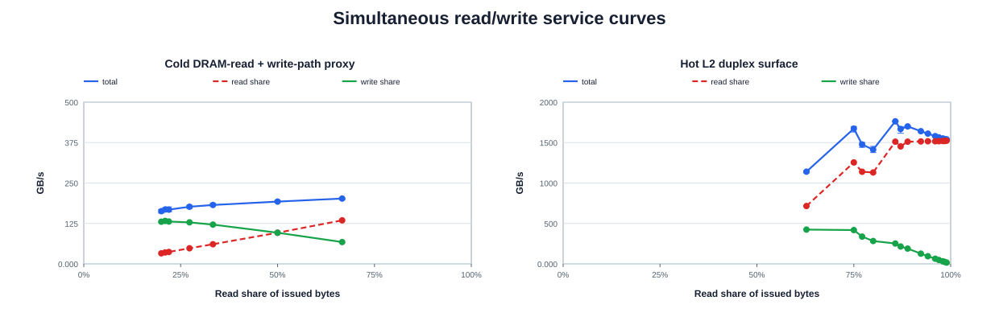

# SM110 campaign plots

Source SHA-256: `ac8e24e9d7c0585c6f732559e98f638d3c96c0b460a06e6bddafd4b5dcd4310d`

> Derived visualization only. The source JSON remains the auditable truth.

## memory duplex total/read/write service curves

