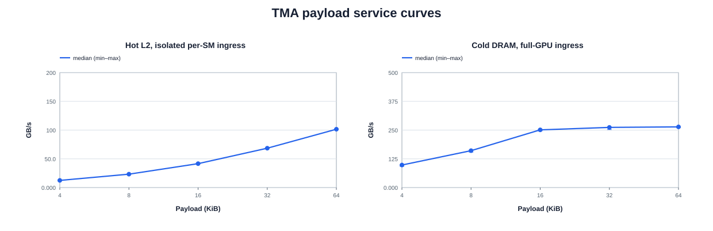

# SM110 campaign plots

Source SHA-256: `2feba5979d623f44bf27da943a0d51e8b36f4506468af10723de9ee953e57604`

> Derived visualization only. The source JSON remains the auditable truth.

## TMA throughput by payload and residency

